<!-- _class: cover-hero -->

生成AI活用講座

第1回 (後半)

2025/10/1　講師：田川 翔

千葉大学 国際未来教育基幹 助教

<!--
- 生成AI活用講座、第1回の後半を始めます。講師の田川です。
-->

---

自己紹介

# 自己紹介

仕事：<b>大学教育の企画</b> 
　　　　<b>学生と教員を支援</b>

専門：<b>地球の起源、AI</b> 
地球惑星科学　博士(理学) 2020年

<b>翻訳：</b> <b>来年、発売予定！</b> 大学の教え方の授業

海の起源の仮説検証　Tagawa et al. (2021) Nat. Com.

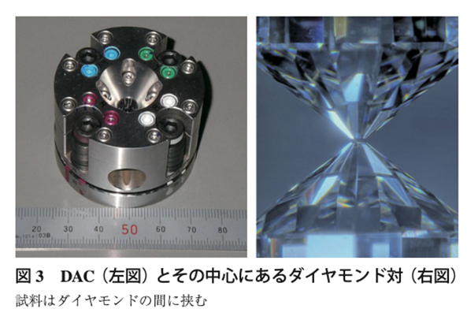
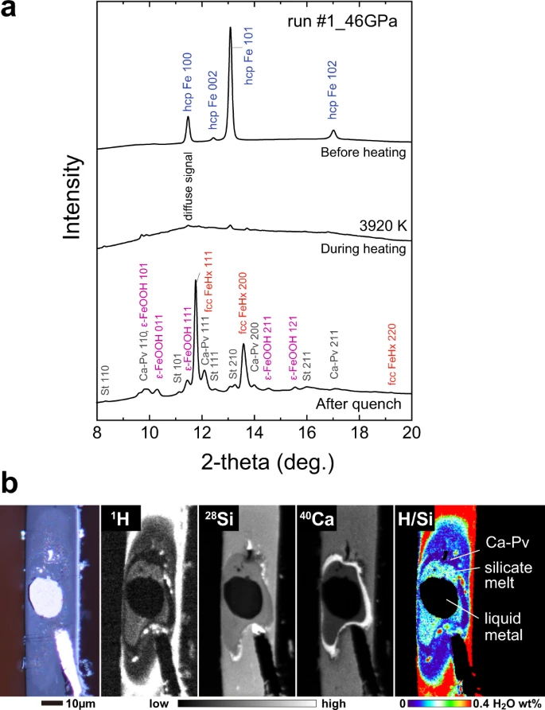

<!--
- 始める前に、簡単に僕の自己紹介をしときましょう。名前は、田川翔といいます。現在は千葉大学の教育をより良くするために、教育企画の仕事を行っている教員です。最近の研究テーマは大学教育と生成AIの関係なので、ここに立っています。
- これ似顔絵ですね。ポスターを真似て、チャットGPTにかいてもらいました。似てますかね？(会場の反応を見る)
- さて、そんな私ですが、もともと研究テーマは地球の起源の解明なんですね。この惑星は、どのようにできたのか。そして、海の量はなぜきまったのか。
- そんなテーマで、博士課程まで実験していました。これですね(岩石みせる)、皆様の足元深い所にあるかんらん岩という岩石なんですけどもこの宝石みたいな岩石が地球のマントルの成分だと考えられています。
- で、こっちの方が隕鉄ですね。特徴的な結晶構造があるので、宇宙から降ってきたってわかるんですけど、この2つの化学反応を、実際に地球ができた温度、圧力で実験していました。
- それは、超高圧・高温の世界で、手のひらに東京タワー10本分ぐらいをのっけたような圧力を作り出し、そこにレーザーをあててドロドロに融かすわけです。
-->

---

本日使用するツール

# 授業・セミナー インタラクティブ化ツール

✓匿名 / もしよければ、ぜひご参加下さい

Join at slido.com #6732809

<b>PCから参加の方へ</b> 
slidoのwebページを開き、 
アクセスコード(7桁)を入力して下さい

<!--
- 本日はslidoという、授業やセミナーをインタラクティブにするツールを使います。匿名なので、もしよければぜひご参加ください。QRコードを読み取るか、slidoのwebページでアクセスコードを入力してください。
-->

---

今日の結論

# 原則

－　AIを試す/情報収集することは、<b>重要</b>

－　AIは利活用が進んでいる

－　学生が直接使う場合や扱えるデータには、<b>制限がある</b>ので、「注意点」を理解

－　自分を支援する”助手”と考える

<!--
- 今日の結論、原則です。AIを試したり情報収集することは重要で、利活用も進んでいます。ただ、学生が直接使う場合や扱えるデータには制限があるので、注意点を理解しておく。そして、自分を支援する”助手”と考える、ということです。
-->

---

まずは現状を知ろう

# まずは現状を知ろう　使ったことはありますか？

時々

65%

ほぼ毎日

24%

毎日数回以上

7%

使わない・使うのをやめた

4%

<!--
- まずは現状を知りましょう。生成AIを使ったことはありますか、という質問です。時々が65%、ほぼ毎日が24%。多くの方がすでに使っていますね。
-->

---

まずは現状を知ろう

# まずは現状を知ろう　どんなことに使いますか？

課題・勉強

79%

相談

31%

趣味

20%

コーディング

8%

<!--
- どんなことに使いますか、という質問。課題・勉強が79%でトップ。相談、趣味、コーディングと続きます。
-->

---

まずは現状を知ろう

# まずは現状を知ろう

使っているのは？

ChatGPT(無料版)

85%

Gemini(大学版)

15%

その他

13%

Copilot(無料版)

11%

Gemini(有料版)

5%

ChatGPT(有料版)

4%

Copilot(大学版)

4%

意外にも チャットGPT一強…  
後で出ますが、 <b>オプトアウト</b>に注意 
<b>(自分のデータをAIの</b> <b>学習に使わせない設計)</b>

<!--
- 使っているのは何ですか、という質問。意外にもチャットGPT一強でした。後で出ますが、自分のデータをAIの学習に使わせない設計＝オプトアウトには注意してください。
-->

---

まずは現状を知ろう

# まずは現状を知ろう

コーディング・開発経験 (当てはまるもの全部)

特に何も…

85%

Pythonかける

12%

Colabo使える

8%

深層学習の開発

5%

機械学習の開発

4%

AI開発の開発

1%

承知しました。 <b>第二回の内容を</b> 少し簡単に修正します。  
それと、<b>開発経験の</b> <b>ある皆様、ぜひ、他の</b> <b>学生の支援に回って</b> <b>下さい。</b>

<!--
- コーディング・開発経験の質問。特に何もという方が85%でした。承知しました、第二回の内容を少し簡単に修正します。それと、開発経験のある皆様、ぜひ、他の学生の支援に回ってください。
-->

---

AIの種類

# AIの種類　AIはいろいろなところにすでにある

<b>AIの定義 (例)</b>　人間の思考プロセスと同じような形で動作するプログラム／人間が知的と感じる情報処理やそれを行う科学・技術

『R6 科学技術イノベーション白書 (第一章)』文部科学省 (2024)

<b>注：目的関数が、エンゲージや売上をあげるなど、「サービス提供側 (≠あなた)」にしか利益を与えない場合もある</b>

cf. 『マインドハッキング: あなたの感情を支配し行動を操るソーシャルメディア』　ワイリー (2020)

<!--
- AIの種類です。AIの定義はいろいろありますが、例えば「人間の思考プロセスと同じような形で動作するプログラム」など。AIはすでに製品推薦、画像分析、音声アシスタント、自動運転など、いろいろなところにあります。
- ただし注意点として、目的関数がエンゲージや売上を上げることで、サービス提供側にしか利益を与えない場合もある、ということは知っておいてください。
-->

---

生成AIってなんだ？

# 生成AIってなんだ？

大規模なデータから学習し、 新たなコンテンツやアイデアを生成するAIの一種

マルチモーダル

テキスト、画像、音声、動画など、異なるデータ形式（モーダル）を同時に扱い、統合するAIシステム

Chat GPT　Gemini

分野特化

特定の機能を持っているAI

Veo　DALL·E 2　Whisper

ツール

AIを組合せて、特定の問題解決に役立つAI

NotebookLM　napkin ai

<b>近年、AIエージェント化</b>　AIエージェントとは、ユーザーの目標達成のために最適な手段を、自律的に選択してタスクを遂行するAIの技術。<b>deep research</b>などが有名

生成AIずかん

<!--
- 生成AIってなんだ、という話。大規模なデータから学習し、新たなコンテンツやアイデアを生成するAIの一種です。
- マルチモーダルなものはChatGPTやGemini。分野特化のものはVeo、DALL·E、Whisperなど。ツールとしてはNotebookLMやnapkin aiがあります。これは生成AIずかんとしてまとめています。
- 近年はAIエージェント化が進んでいて、deep researchなどが有名です。
-->

---

最も性能がよいAI 9/30

# 最も性能がよいAI　9/30

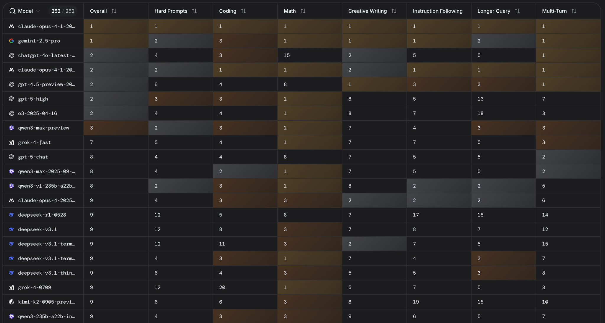

現時点では、Gemini がよい? (Claude opusは高い…)

https://lmarena.ai/leaderboard

<!--
- 最も性能がよいAIはどれか。これは9月30日時点のLMArenaのリーダーボードです。現時点ではGeminiがよさそうですね。Claude opusは性能は高いんですが、値段も高いです。
-->

---

生成AIでできること

# 生成AIでできること

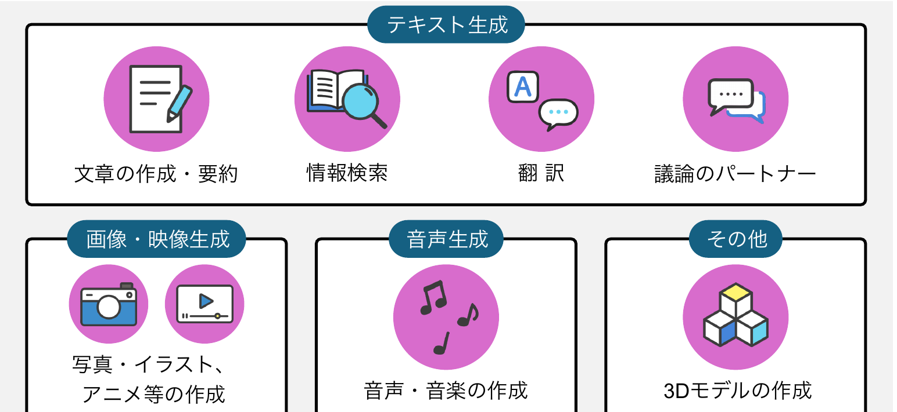

総務省 生成AIはじめの一歩～生成AIの入門的な使い方と注意点～

<!--
- 生成AIでできることをまとめた図です。テキスト生成では文章の作成・要約、情報検索、翻訳、議論のパートナー。画像・映像生成、音声生成、その他では3Dモデルの作成などができます。総務省の資料を参考にしています。
-->

---

生成AIでできること

# 生成AIの活用領域

2 使ってみるAnthropic (2025 ArXiv) <a href="#" style="color:var(--tag-blue); text-decoration:none;">リンク</a>

プライバシーの保護を保った状態で、 400万以上のClaude.aiの会話を分析

何をしたか

→どの経済的タスクにAIが利用されているか把握 
米国労働省のO*NET実会話DBから類似性分類

全体として分かったこと

① Software 開発とWritingで半分 
② 36%の職業にAIが利用されている 
③ スキル増強：自動化 = 57 : 43

<b>教育での利用</b>　チュータリングタスクが多い

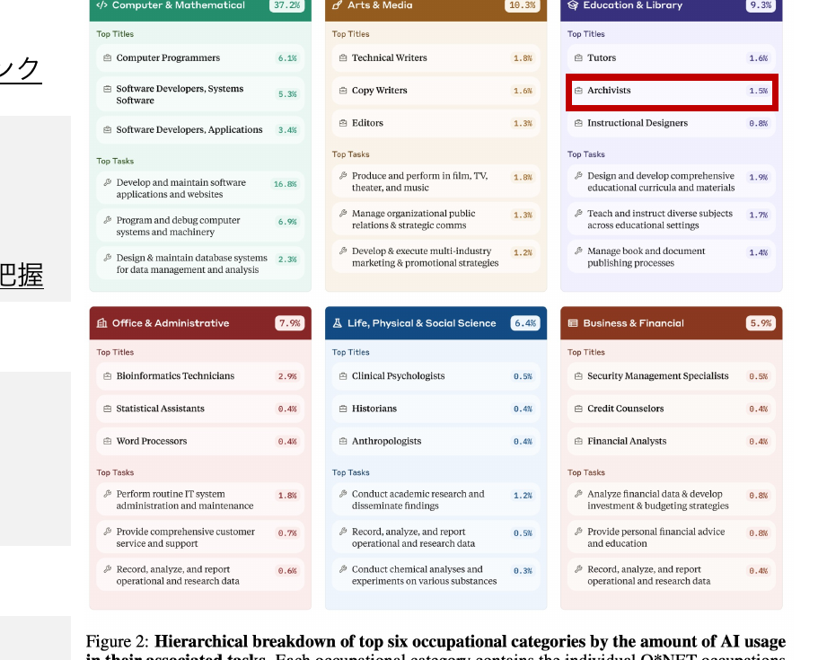

<!--
- Anthropicが400万件以上のClaude.aiの会話を、プライバシーを守った状態で分析した研究。どの経済的タスクにAIが使われているかを、米国労働省のO*NET職業データベースと突き合わせて分類した。
- 分かったこと：①ソフトウェア開発とライティングで全体の半分、②36%の職業でAIが使われている、③スキルの増強（補助）と自動化は57対43。
- 教育分野ではチュータリング（個別指導）タスクが多い。
-->

---

AIは仕事のどこに影響するか

# 参考：職業への影響

2 使ってみる<b>内閣府(2024)</b> 世界経済の潮流 ＞第1章＞p.13

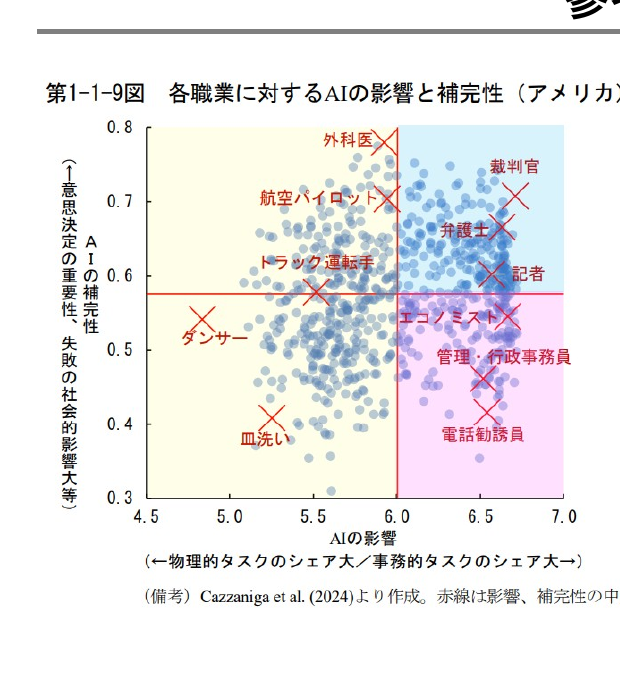

<b>AIの影響が大きく、代替性が高い職業：</b>事務的タスクのシェアが大きい職業。▶ つまり、AIがとって変わってしまう職業

<b>AIの影響が大きく、補完性が高い職業：</b>事務的タスクのシェアが大きいものの、意思決定の重要性が高く、AI任せとすることが社会的に望ましくない職業。▶ AIを使いこなす必要のある職業

<b>AIの影響の小さい職業：</b>物理的タスクのシェアが大きい職業。

※ 教員・研究者(自然科学系)は、青の領域

<!--
- 内閣府の「世界経済の潮流」より、職業へのAIの影響を整理した図。
- 代替性が高い職業＝事務的タスクが多く、AIに置き換わってしまう。補完性が高い職業＝事務的だが意思決定が重要で、AIを使いこなす必要がある。影響が小さい職業＝物理的タスクが多い。
- 教員・研究者（自然科学系）は補完性の高い「青の領域」に入る。
-->

---

Difyを用いた演習

# Difyを用いた演習3 グループ分け

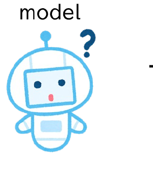

－ <b>Model</b>だけでは、動くことが出来ません 
入力、出力、他との接続 (mcp、AI、ツール、参考書 etc…)

<!--
- ここからDifyを使った演習。まず大前提として、AIの「モデル」だけでは何もできない。
- 入力・出力・他システムとの接続（mcp、別のAI、ツール、参考書など）があって初めて動く。
-->

---

Difyを用いた演習

# Difyを用いた演習3 グループ分け

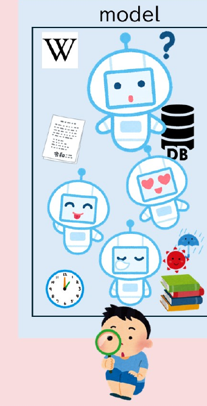

－ <b>Model</b>だけでは、動くことが出来ません 
入力、出力、他との接続 (mcp、AI、ツール、参考書 etc…)

－ <b>AIを組合せることで、様々な複雑な処理が可能になります</b> 
入力の分類、出力の分析、音声処理、画像処理…

<!--
- モデルを組み合わせることで、複雑な処理ができるようになる。
- 例：入力の分類、出力の分析、音声処理、画像処理など。
-->

---

Difyを用いた演習

# Difyを用いた演習3 グループ分け

－ <b>Model</b>だけでは、動くことが出来ません 
入力、出力、他との接続 (mcp、AI、ツール、参考書 etc…)

－ <b>AIを組合せることで、様々な複雑な処理が可能になります</b> 
入力の分類、出力の分析、音声処理、画像処理…

－ <b>AIに道具をもたせて、現実的な処理ができるようになります</b> 
RAG、データベース、書籍、時計、天気予報…

<!--
- さらにAIに「道具」を持たせると、現実的な処理ができる。
- RAG（検索拡張生成）、データベース、書籍、時計、天気予報など。
-->

---

Difyを用いた演習

# Difyを用いた演習3 グループ分け

－ <b>Model</b>だけでは、動くことが出来ません 
入力、出力、他との接続 (mcp、AI、ツール、参考書 etc…)

－ <b>AIを組合せることで、様々な複雑な処理が可能になります</b> 
入力の分類、出力の分析、音声処理、画像処理…

－ <b>AIに道具をもたせて、現実的な処理ができるようになります</b> 
RAG、データベース、書籍、時計、天気予報…

－ <b>開発には、メタな視点が必要です</b> 
CI/CD、ログ管理、出力評価、MLOps、DB、セキュリティ…

<!--
- そして実際に開発するには、メタな視点（運用・管理の視点）も必要になる。
- CI/CD、ログ管理、出力評価、MLOps、データベース、セキュリティなど。
-->

---

Difyを用いた演習

# Difyを用いた演習3 グループ分け

－ <b>Model</b>だけでは、動くことが出来ません 
入力、出力、他との接続 (mcp、AI、ツール、参考書 etc…)

－ <b>AIを組合せることで、様々な複雑な処理が可能になります</b> 
入力の分類、出力の分析、音声処理、画像処理…

－ <b>AIに道具をもたせて、現実的な処理ができるようになります</b> 
RAG、データベース、書籍、時計、天気予報…

－ <b>開発には、メタな視点が必要です</b> 
CI/CD、ログ管理、出力評価、MLOps、DB、セキュリティ…

<b>Dify</b>（Define &amp; Modify / Do It For You）＝この全部がある程度（モックアップ稼働まで）できるのが、<b>AIプラットフォーム"Dify"</b>

<!--
- これらをある程度まとめて、モックアップが動くところまでできるのが、AIプラットフォームの「Dify」。
- DifyはDefine & Modify / Do It For You の略。今日はこれを使う。
-->

---

Difyを用いた演習

# Difyを用いた演習3 グループ分け

<table style="width:100%; border-collapse:collapse; font-size:21px; line-height:1.4; margin-top:6px;">
<tr style="background:var(--section-bg);">
<th style="border:1px solid #cfd6df; padding:5px 8px; width:13%;"></th>
<th style="border:1px solid #cfd6df; padding:5px 8px; color:var(--accent-dark);">Web SaaS 版 https://cloud.dify.ai/</th>
<th style="border:1px solid #cfd6df; padding:5px 8px; color:var(--accent-dark);">AWS (/GCP) 版 例 https://dify.alc-test.net/</th>
<th style="border:1px solid #cfd6df; padding:5px 8px; color:var(--accent-dark);">Local＋イントラ版 例 http://localhost/</th>
</tr>
<tr>
<td style="border:1px solid #cfd6df; padding:5px 8px; font-weight:700; background:var(--section-bg);">管理者</td>
<td style="border:1px solid #cfd6df; padding:5px 8px;">Langgenius</td>
<td style="border:1px solid #cfd6df; padding:5px 8px;">田川</td>
<td style="border:1px solid #cfd6df; padding:5px 8px;">あなた</td>
</tr>
<tr>
<td style="border:1px solid #cfd6df; padding:5px 8px; font-weight:700; background:var(--section-bg);">LLM稼働箇所</td>
<td style="border:1px solid #cfd6df; padding:5px 8px;">各社APIサーバー</td>
<td style="border:1px solid #cfd6df; padding:5px 8px;">AWS (各社APIサーバー)</td>
<td style="border:1px solid #cfd6df; padding:5px 8px;">LCL (＋AWS＋各社APIサーバー)</td>
</tr>
<tr>
<td style="border:1px solid #cfd6df; padding:5px 8px; font-weight:700; background:var(--section-bg);">使用目的</td>
<td style="border:1px solid #cfd6df; padding:5px 8px;">個人的なPoCや、企業業務</td>
<td style="border:1px solid #cfd6df; padding:5px 8px;">大学業務</td>
<td style="border:1px solid #cfd6df; padding:5px 8px;">(制限なくきちんと) 個人的な開発、操作、…</td>
</tr>
<tr>
<td style="border:1px solid #cfd6df; padding:5px 8px; font-weight:700; background:var(--section-bg);">データの学習</td>
<td style="border:1px solid #cfd6df; padding:5px 8px;">原則されない(API注意)</td>
<td style="border:1px solid #cfd6df; padding:5px 8px;">されない</td>
<td style="border:1px solid #cfd6df; padding:5px 8px;">されない</td>
</tr>
<tr>
<td style="border:1px solid #cfd6df; padding:5px 8px; font-weight:700; background:var(--section-bg);">費用</td>
<td style="border:1px solid #cfd6df; padding:5px 8px;">安い(大学はAPI代実費のみ)</td>
<td style="border:1px solid #cfd6df; padding:5px 8px;">中くらい(月2万円/10人)</td>
<td style="border:1px solid #cfd6df; padding:5px 8px;">Mac mini(20.3万)studio(60万)</td>
</tr>
<tr>
<td style="border:1px solid #cfd6df; padding:5px 8px; font-weight:700; background:var(--section-bg);">機能</td>
<td style="border:1px solid #cfd6df; padding:5px 8px;">最高(何でもできる)</td>
<td style="border:1px solid #cfd6df; padding:5px 8px;">最高(結構できる)</td>
<td style="border:1px solid #cfd6df; padding:5px 8px;">テキスト処理？</td>
</tr>
<tr>
<td style="border:1px solid #cfd6df; padding:5px 8px; font-weight:700; background:var(--section-bg);">速度</td>
<td style="border:1px solid #cfd6df; padding:5px 8px;">最速(ChatGPTレベル)</td>
<td style="border:1px solid #cfd6df; padding:5px 8px;">普通(独賃でき るレベル)</td>
<td style="border:1px solid #cfd6df; padding:5px 8px;">遅 (APIを使うと…速い)</td>
</tr>
<tr>
<td style="border:1px solid #cfd6df; padding:5px 8px; font-weight:700; background:var(--section-bg);">セキュリティ</td>
<td style="border:1px solid #cfd6df; padding:5px 8px;">最低(ChatGPTレベル)</td>
<td style="border:1px solid #cfd6df; padding:5px 8px;">普通(企業向AWSレベル)</td>
<td style="border:1px solid #cfd6df; padding:5px 8px;">最高(自分のPCと同じ)</td>
</tr>
</table>

AWS/GCP版でクラウドチェックリストで、機密どまで扱える要件を取りたい (但し、コミュニティ版は、複数WS / マルチアカウントが出来ない)

<!--
- Difyには3つの動かし方がある。Web SaaS版（クラウド）、AWS/GCP版（大学が管理）、ローカル+イントラ版（自分のPC）。
- 管理者・LLMの稼働箇所・使用目的・データの学習・費用・機能・速度・セキュリティで一長一短。今日はこの中から選んで使う。
-->

---

Difyを用いた演習

# Difyを用いた演習3 グループ分け

▦ Active poll86 ⚇

どちらがやりたいですか

自分の専門・研究に近いことを行いたい

30%

音声や画像などに興味がある

30%

面白い学び方を提案したい

28%

安全性・倫理

10%

千葉大の課題を解決したい

1%

<!--
- では、どのテーマで演習したいかをライブ投票（slido）で聞いてみましょう。
- 自分の専門・研究に近いこと、音声や画像、面白い学び方、安全性・倫理、千葉大の課題、の5つから選ぶ。
-->

---

Difyを用いた演習

# Difyを用いた演習3 グループ分け

<b>テーマごとのグループで分かれて下さい</b>

① <b>それぞれの島で5 - 6人集めて下さい。</b> 　 グループの中に知り合いは3人まで (できるだけバラけて) 　 →グループを何らかの方法で決めて下さい

② 決まったら、<b>それぞれの班に分かれ、</b> <b>PCを立ち上げ、自分のグループを書いて下さい。</b> 　 →クラスルーム内の以下のファイルです。

▣ グループ分け　投稿日: 10:49

<!--
- ではグループ分けをします。テーマごとのグループに分かれてください。
- ①各島で5〜6人集める（知り合いは3人まで、できるだけバラけて）。②決まったら班に分かれてPCを立ち上げ、Classroom内のファイルに自分のグループを書く。
-->

---

グループ分け結果 (2025/10/01時点 ※ 順次更新します)

# グループ分け結果3 グループ分け

専門特化グループ

サーバー：<b>gen_ai25_g1</b> 　専門1、2、3 (計17名) サーバー：<b>gen_ai25_g2</b> 　専門4 (計6名)

(合計23名)

倫理グループ

サーバー：<b>gen_ai25_g2</b> 　倫理8 (計8名)

(合計8名)

学び方グループ

サーバー：<b>gen_ai25_g3</b> 　学び方1、2、3 (計18名) サーバー：<b>gen_ai25_g4</b> 　学び方4、5 (計8名)

(合計26名)

絵・音声グループ

サーバー：<b>gen_ai25_g5</b> 　絵・音声1、2 (計14名) サーバー：<b>gen_ai25_g6</b> 　絵・音声3、4 (計12名)

(合計26名)

<!--
- これが現時点のグループ分けの結果。専門特化、倫理、学び方、絵・音声の4テーマで、それぞれサーバー（Dify環境）を割り当てている。順次更新します。
-->

---

AIを教育で利活用する上で、必ず知ってほしいこと

# AI利活用で知ってほしいこと4 AI利活用

日常の活用において、知っていてほしいこと 
　<b>① 大学の生成AI利用に関するポリシー</b> 
　<b>② AI自体の学習・セキュリティに関する状況</b> 
　<b>③ 大学で提供しているAI</b>

ChatGPT(特に無料版)の場合、 <b>ユーザーの入力は原則、学習に使われる</b> (と思っておいた方が良い)。

<b>機微を含む場合、オプトアウト(自分のデータの使用停止)をしておく</b> → https://help.openai.com/en/articles/7730893-data-controls-faq

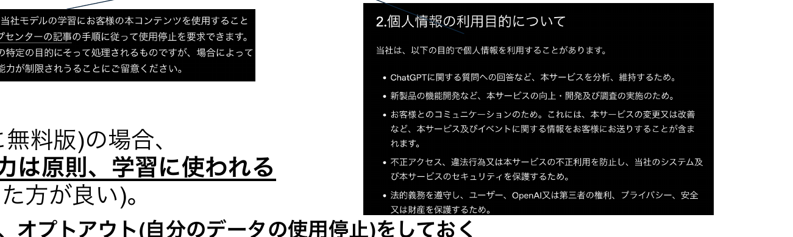

<!--
- AIを教育で使う上で、必ず知ってほしいことが3つ。①大学のポリシー、②AIの学習・セキュリティの状況、③大学が提供しているAI。
- 特にChatGPTの無料版は、入力が原則として学習に使われると思っておいた方がよい。機微な情報を含む場合は、オプトアウト（データの使用停止）を設定しておくこと。
-->

---

AIを教育で利活用する上で、必ず知ってほしいこと

# 千葉大学における生成AIの指針（令和5年10月13日）

指針

①「生成AIについての学び」「生成AIを用いた学び」 　「生成AIによらない学び」を<b>それぞれ推進</b>

②授業での利用は、授業の目的に合致することが前提であり、合致するかは、各授業の担当教員が<b>判断</b> 　禁止の場合はシラバスに明記（気になったら先生に聞きましょう！）

③<b>リスクや懸念に伴う禁止事項</b>あり

https://drive.google.com/file/d/1ZuItuLWXNLJ53M43ExrYG8clfwqcCnCO/view

特に、<b>機微情報や個人情報の入力禁止</b>、生成AIにより出力された情報の<b>著作権</b>（表現への類似性・依拠性）には留意が必要。

<!--
- 千葉大の生成AI指針。①AIについて学ぶ・AIを使って学ぶ・AIを使わずに学ぶの3つをそれぞれ推進。②授業で使うかは担当教員が判断、禁止ならシラバスに明記。気になったら先生に聞いてください。③リスクに応じた禁止事項あり。
- とくに、機微情報・個人情報は入力しない。出力物の著作権（類似性・依拠性）にも注意。
-->

---

学内で使えるツール

# Gemini とGem https://gemini.google.com/gems/view

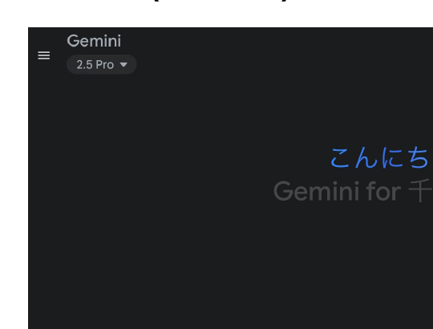

一般的なチャットボット <b>gemで用途に特化した道具</b>も作れて便利 ただ、現在、表現と思考がちょっと硬い

セキュリティの確認

画面左下

⚙ 設定とヘルプ

↓

アクティビティ

↓

Gemini アプリ アクティビティ

<!--
- 学内で使えるツールその1、Gemini。一般的なチャットボットで、Gemで用途に特化した道具も作れて便利。ただ現状、表現と思考が少し硬い。
- セキュリティの確認は画面左下から。設定とヘルプ → アクティビティ → Geminiアプリアクティビティ、で学習に使われるかを確認できる。
-->

---

学内で使えるツール

# Copilot https://copilot.microsoft.com/

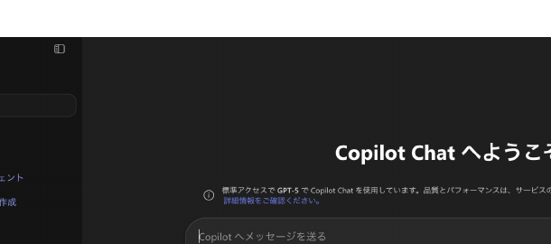

一般的なチャットボット Geminiと同じ事ができる。 (無料版は色々と出来るけど、大学版は機能少なめ)

セキュリティの確認

このチャットには <b>エンタープライズ データ保護</b> が適用されます。 と書いてあればOK

<!--
- 学内で使えるツールその2、Copilot。これも一般的なチャットボットで、Geminiと同じことができる。無料版はいろいろできるが、大学版は機能少なめ。
- セキュリティの確認は、「このチャットにはエンタープライズ データ保護が適用されます」と書いてあればOK。
-->

---

学内で使えるツール

# NotebookLM 理解を助けるツール

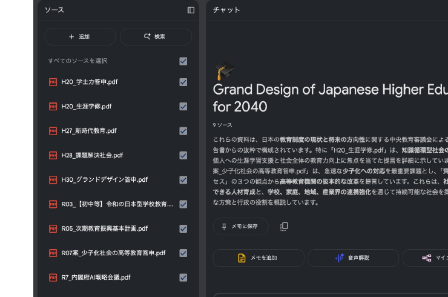

セキュリティの確認

大量の文章内を検索したり、音声・動画解説を使ったり、問題や暗記事項を書き出したりするのに便利

<!--
- 学内で使えるツールその3、NotebookLM。理解を助けるツール。大量の文章の中を検索したり、音声・動画での解説を使ったり、問題や暗記事項を書き出したりするのに便利。
-->

---

生成AIの学び方 (資料のみ)

# 生成AIの学び方5 学び方

<table style="width:100%; border-collapse:collapse; font-size:18px; line-height:1.35; margin-top:4px;">
<colgroup><col style="width:16%"><col style="width:42%"><col style="width:42%"></colgroup>
<tbody>
<tr>
<td style="border:1px solid #bbb; padding:5px 10px; font-weight:800; background:var(--accent-soft); color:var(--accent-dark);">本を読む</td>
<td style="border:1px solid #bbb; padding:5px 10px;">◯ 生成AIを実際に自分の手で動かしてみるときに便利 ◯ 情報が信頼できる ✕ １人だと難しいこともある</td>
<td style="border:1px solid #bbb; padding:5px 10px;">(推薦はシラバスの参考書に)</td>
</tr>
<tr>
<td style="border:1px solid #bbb; padding:5px 10px; font-weight:800; background:var(--accent-soft); color:var(--accent-dark);">YouTubeや記事を読む</td>
<td style="border:1px solid #bbb; padding:5px 10px;">◯ 最新の情報の把握に便利 ✕ 体系がない ✕ ガセがある</td>
<td style="border:1px solid #bbb; padding:5px 10px;">メカニズムから分かる映像 https://www.youtube.com/@3Blue1BrownJapan サービスが分かるAI図鑑 https://weel.co.jp/media/tech-category/ai-dictionary/</td>
</tr>
<tr>
<td style="border:1px solid #bbb; padding:5px 10px; font-weight:800; background:var(--accent-soft); color:var(--accent-dark);">授業を受ける</td>
<td style="border:1px solid #bbb; padding:5px 10px;">◯ 体系的な力が身につく ✕ しかし、大変</td>
<td style="border:1px solid #bbb; padding:5px 10px;">東大松尾研究室講座 (現在募集中、学生無料) LLM基礎・データサイエンス</td>
</tr>
<tr>
<td style="border:1px solid #bbb; padding:5px 10px; font-weight:800; background:var(--accent-soft); color:var(--accent-dark);">資格を受ける</td>
<td style="border:1px solid #bbb; padding:5px 10px;">◯ 就活に有利 ◯ 学習資料が充実 ✕ １つあたり5000円くらいかかる</td>
<td style="border:1px solid #bbb; padding:5px 10px;">JDLA G検定、 Google Generative AI Leader、 生成AIパスポートなど</td>
</tr>
</tbody>
</table>

自分は、本、授業、資格で学びました。特に<b>松尾研究室の授業</b>と<b>Google Skillup boost</b>はおすすめ。

<!--
- 生成AIの学び方は資料のみ。本を読む、YouTubeや記事、授業を受ける、資格を受ける、の4ルート。それぞれ長所短所がある。
- 自分は本・授業・資格で学んだ。特に松尾研究室の授業と Google Skillup boost がおすすめ。
-->

---

<!-- _class: divider -->

6　まとめ

# 今日達成出来たこと

<!--
- それでは、最後にまとめです。今日達成できたことを振り返りましょう。
-->
