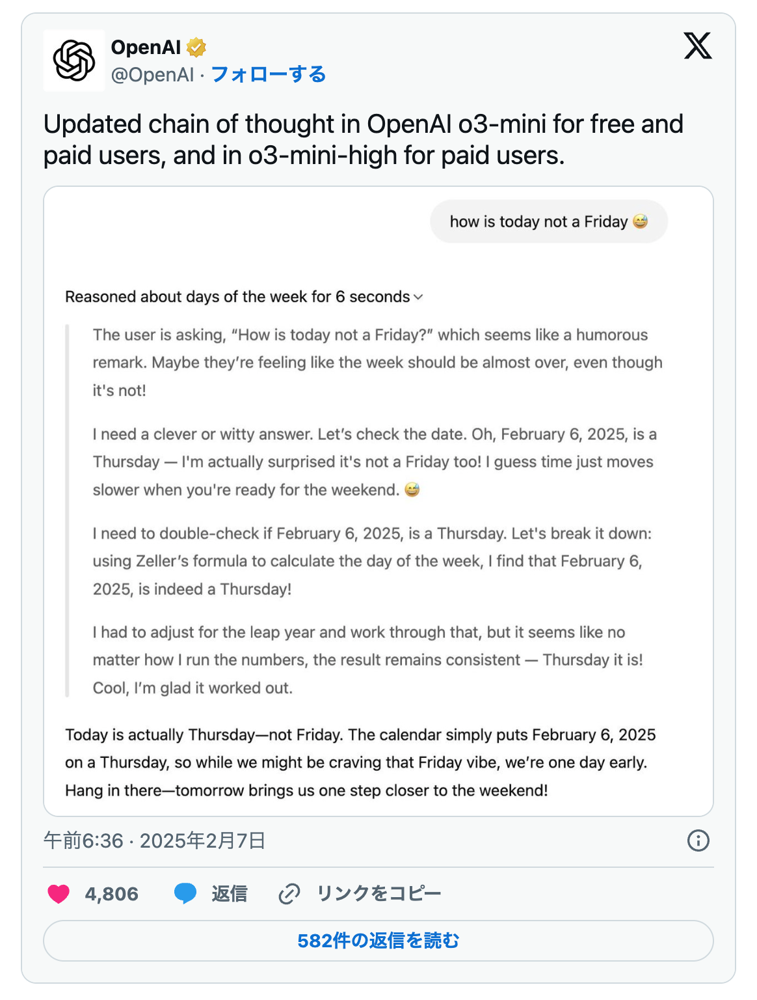
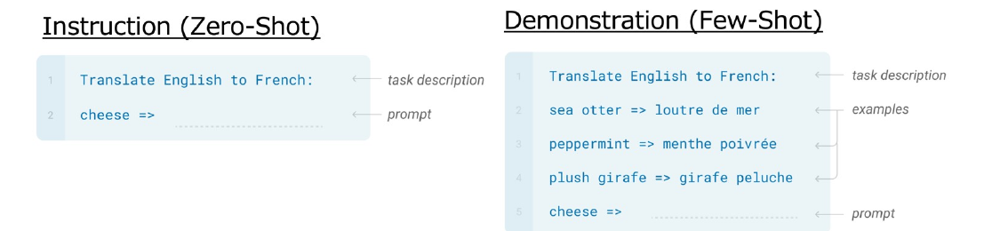
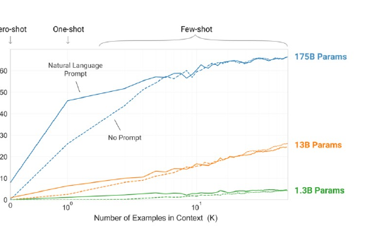
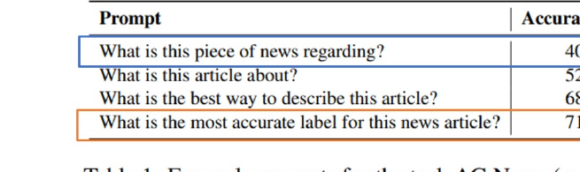
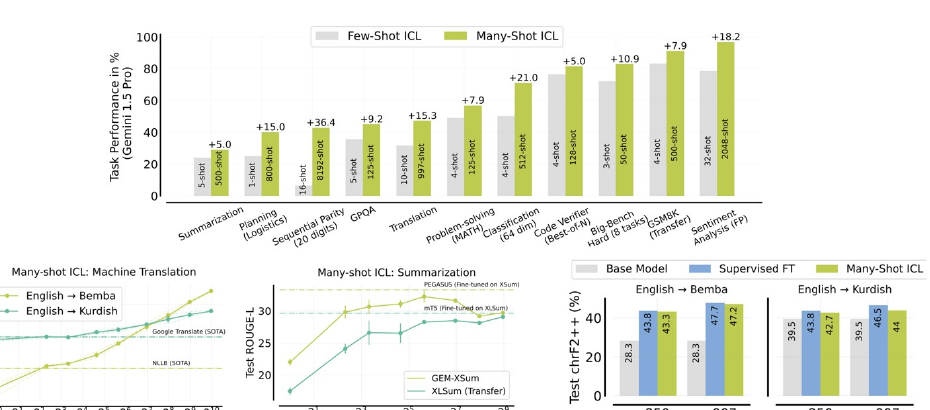
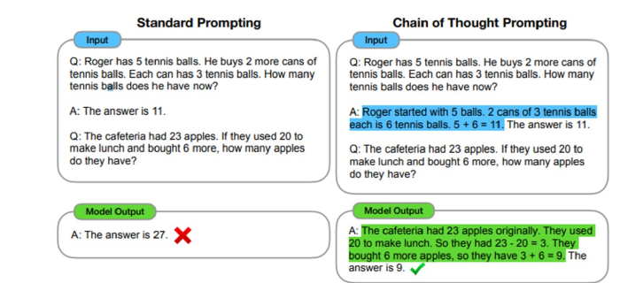
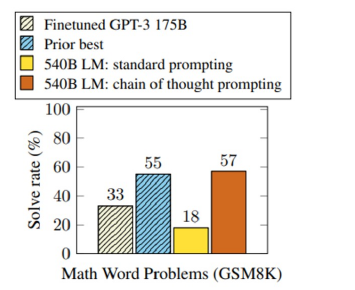
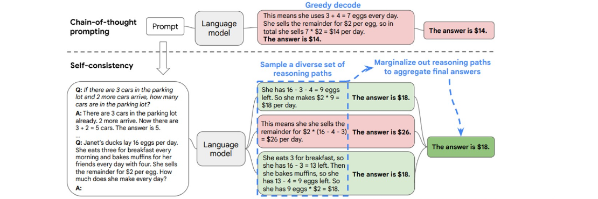

<!-- _class: cover-hero -->

生成AI活用講座 <b>第3回</b>

(予習編補足：情報系での研究結果から)

2025/10/2 公開　講師：田川 翔 千葉大学 国際未来教育基幹 助教

東大松尾研究室の授業スライドから <a href="https://weblab.t.u-tokyo.ac.jp/llm_contents_2024/" style="color:var(--accent);">https://weblab.t.u-tokyo.ac.jp/llm_contents_2024/</a> (CC BY-NC-ND 4.0 )

<!--
- 第3回の予習編補足。情報系（東大松尾研の授業スライド）の研究結果から、生成AIの使い方の勘所を補足する。
-->

---

まとめ

# AI AGENT化 (田川私見)

AI Agent= 「状況を観察し，自由に使えるツールを用いて働きかけることにより，目標を達成するアプリケーション」(Wiesinger et al., 2025)

<b>グラウンディング：</b> 　AIが生成する回答を、特定の信頼できる　情報源（ソース）にしっかりと結びつける技術

<b>昔：</b> AI ↑↓ 回答

→

<b>今：</b> データ AI ↓ 回答

人と情報を繋ぐツールになりつつある

<!--
- AIは「人と情報を繋ぐツール」へ。昔はAIが回答を出すだけだったが、今はデータ（ソース）に結びつけて回答するグラウンディングが鍵。AI Agent化が進む。
-->

---

まとめ

# 余計に書かなくてもある程度回る (田川私見)

<b>商用の場合、CoTを指示する必要はない</b> 　※ o3 → 高度な段階的推論 (CoT)  　※ 不必要に誘導すると、かえって混乱

<b>コンテキストや文脈内学習は、</b> <b>　引き続き重要に </b>(geminiは本1冊入る！) 　例：プログラミングを書かせる 　例：コンテキスト・エンジニアリング

Few shot(outputの明示)や意図の説明も、 　<b>いまだ有効なテクニック</b>

<!--
- 最近の商用モデルはCoTを明示しなくてもある程度回る。むしろ不要な誘導は混乱のもと。一方でコンテキスト充実・文脈内学習・Few shot・意図説明は今も有効。
-->

---

<!-- _class: message -->

AIが得意なこと？

要約、推測、変換、拡張

<!--
- AIが得意なこと＝要約・推測・変換・拡張。この4つを軸にプロンプトを考えるとよい。
-->

---

Zero shot / Few Shot

# プロンプティング（Prompting）とは？

“Language Models are Few-Shot Learners”, NeurIPS2020

特定の機能の発生を促進 (prompt)するような言語モデルに入力するコンテキスト文

与える指示や事例を変えれば異なることができる（例：ポジネガ判定なら「次の文章がポジティブかネガティブか分類して」など）

Tom B. Brown et al.(2020), <i>Language Models are Few-Shot Learners</i> より引用

<!--
- プロンプティング＝特定の機能を促すために言語モデルへ入力するコンテキスト文。Zero-Shot（指示のみ）とFew-Shot（事例つき）。事例や指示を変えれば異なるタスクに使える。
-->

---

コンテキストを充実させる

<h1 style="font-size:34px;">Few-Shot Promptingと文脈内学習（In-Context Learning）</h1>

“Language Models are Few-Shot Learners”, NeurIPS2020

Few-Shot Prompting (Demonstration)

文脈（Context）

・特にモデルが大規模な場合Few-Shotのデモンストレーションの追加で性能が大幅に上がることが多い（右図） 
・文脈から学習するため、文脈内学習 (In-Context Learning)と呼ばれる.

Tom B. Brown et al.(2020), <i>Language Models are Few-Shot Learners</i> より引用

<!--
- Few-Shotで文脈に事例を入れると、特に大規模モデルで性能が大きく上がる。文脈から学ぶのでIn-Context Learningと呼ぶ。
-->

---

プロンプトで精度が変わる！

# プロンプトの重要性 | 指示文の違いの影響

“Demystifying Prompts in Language Models via Perplexity Estimation”, 2022

精度低 👎

精度高 👍

Table 1: Example prompts for the task AG News (news classification) that vary considerably in accuracy.

・AG Newsはニュースのカテゴリ分類タスク 
　<a href="https://huggingface.co/datasets/ag_news/viewer/default/train" style="color:var(--accent);">https://huggingface.co/datasets/ag_news/viewer/default/train</a> 
・プロンプトによって性能が30%変化

Hila Gonen et al.(2022), <i>Demystifying Prompts in Language Models via Perplexity Estimation</i> より引用、一部改変

<!--
- 同じタスクでも指示文の違いで精度が30%も変わる。AG Newsの分類で、聞き方を変えるだけで40.9%→71.2%に。プロンプト設計は重要。
-->

---

プロンプトで精度が変わる！

# デモンストレーション例入れるほど良くなる

“Many-Shot In-Context Learning”, 2024

タスクによっては、ICLのみで特化モデルやfinetuningと匹敵する

Agarwal et al.(2024), <i>Many-Shot In-Context Learning</i> より引用

<!--
- 事例（ショット）を多く入れるほど性能が上がる。タスクによってはIn-Context Learningだけで特化モデルやfinetuningに匹敵する。
-->

---

思考過程を描かせる (CoT)

# Chain-of-Thought (CoT) Prompting

“Chain of Thought Prompting Elicits Reasoning in Large Language Models”, NeurIPS2022

※ GSM8kは9-12歳の正解率が60%。

・Few-Shotの事例の際に思考過程を入れる（Chain of thought prompting）と、新しい質問についても思考過程を明示してくれる。 
・算数の文章題など、従来難しいとされていた推論タスクでも大幅に性能が向上。

Jason Wei et al.(2022), <i>Chain-of-Thought Prompting Elicits Reasoning in Large Language Models</i>, NeurIPS2022 より引用

<!--
- Few-Shotの事例に思考過程を入れる（CoT）と、新しい質問でも思考過程を出してくれる。算数の文章題など従来難しい推論タスクで性能が大幅向上。
-->

---

結果で多数欠する

# CoTの推論能力の改善：Self Consistency

“Self-Consistency Improves Chain of Thought Reasoning in Language Models”, ICLR2023

LMに複数の推論を行わせて（上は3つの例）、多数決で答えを決定。 
※ 文的にもっともらしいものが正しい推論とは限らないことを示唆。

Xuezhi Wang et al.(2023), <i>Self-Consistency Improves Chain of Thought Reasoning in Language Models</i>, ICLR2023 より引用

<!--
- Self-Consistency＝複数の推論経路を生成し（例では3つ）、出た答えを多数決で決める。文として尤もらしい推論が必ずしも正しいとは限らない、という示唆。
-->

---

<!-- _class: cover-hero -->

生成AI活用講座 <b>第3回</b>

(予習編補足：Difyの最初の一歩)

2025/10/2 公開　講師：田川 翔 千葉大学 国際未来教育基幹 助教

東大松尾研究室の授業スライドから <a href="https://weblab.t.u-tokyo.ac.jp/llm_contents_2024/" style="color:var(--accent);">https://weblab.t.u-tokyo.ac.jp/llm_contents_2024/</a> (CC BY-NC-ND 4.0 )

<!--
- ここから次パート「Difyの最初の一歩」へ。ノーコードでAIアプリを組む実践に入る。
-->
