<!-- _class: cover-hero -->

生成AI活用講座 第3回

(予習編1：倫理・法律)

2025/10/2 公開　講師：田川 翔

千葉大学 国際未来教育基幹 助教

---

こういうこと？

# こういうこと？

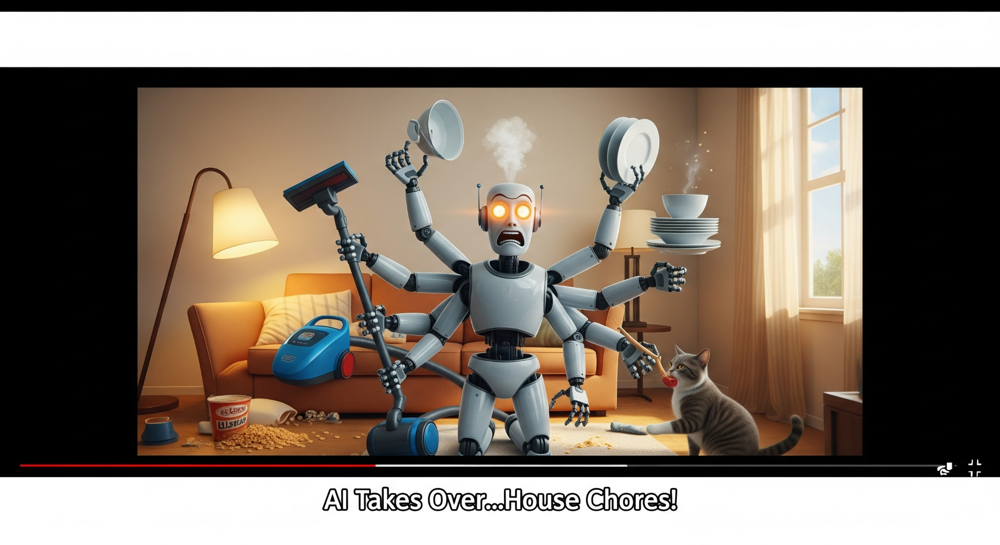

AI Takes Over…House Chores!

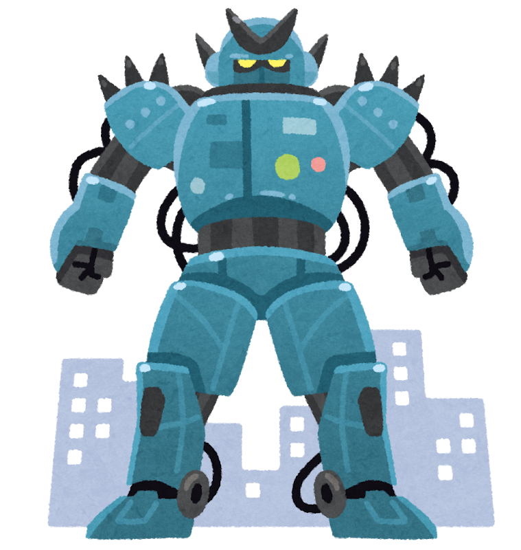

<!-- 人間のニーズ、能力、制約を最優先に考慮する -->

---

昨今のニュース

# 昨今のニュース

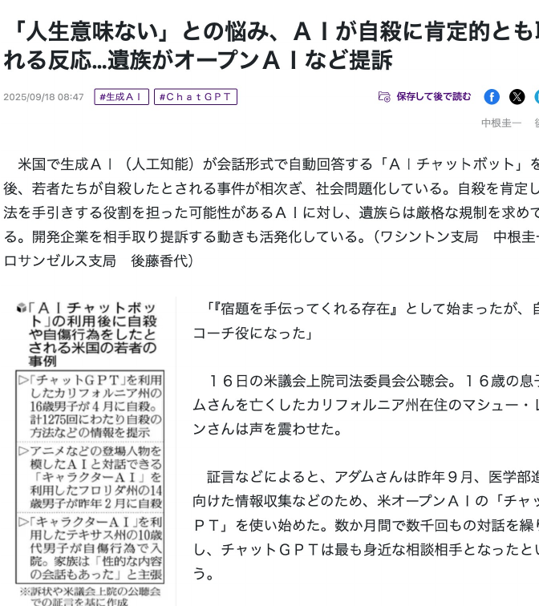

読売新聞

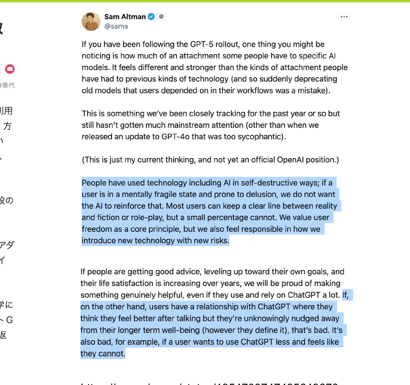

https://x.com/sama/status/1954703747495649670

<!-- もし人々が良いアドバイスを得て、自らの目標に向かってレベルアップし、長年にわたって人生の満足度が高まっていくのであれば、たとえ彼らがChatGPTを多用し、それに依存していたとしても、私たちは真に役立つものを作ったことを誇りに思うでしょう。その一方で、ユーザーがChatGPTと話した後は気分が良くなったと感じるものの、知らず知らずのうちに長期的な幸福（彼らがそれをどう定義するかにかかわらず）から遠ざけられてしまうような関係にあるとすれば、それは悪いことです。例えば、ユーザーがChatGPTの使用を減らしたいのに、それができないと感じるような場合も同様に悪いことです。 -->

---

人間中心の AI 社会原則 (2019)

# 国内のソフトロー・原則　人間中心の AI 社会原則 (2019 )

<b>第 2 章 基本理念</b>

人間の尊厳が尊重される社会(Dignity) 
多様な背景を持つ人々が多様な幸せを追求できる社会(Diversity &amp; Inclusion) 
持続性ある社会(Sustainability)

<b>第 4 章 人間中心の AI 社会原則</b>

(1)人間中心の原則　(2)教育・リテラシーの原則 
(3)プライバシー確保の原則　(4)セキュリティ確保の原則 
(5)公正競争確保の原則 
(6)公平性、説明責任及び透明性の原則 
(7)イノベーションの原則

本文書の全体構成を図1に示す。

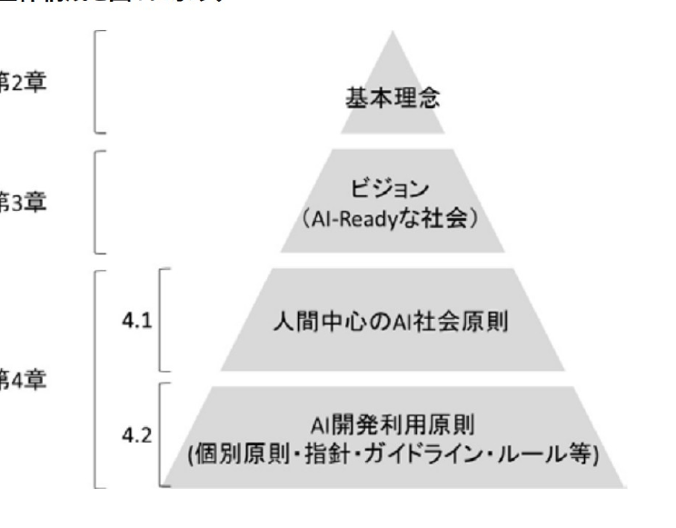

https://www8.cao.go.jp/cstp/ai/aigensoku.pdf

<!-- 人間のニーズ、能力、制約を最優先に考慮する -->

---

AI利活用原則 (2019)

# AI利活用原則　(総務省情報通信政策研究所, 2019)

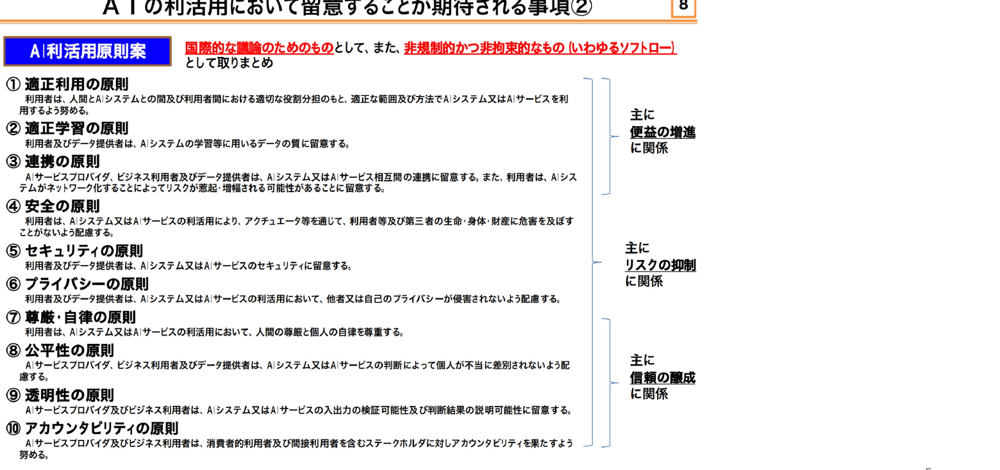

https://www.soumu.go.jp/main_content/000809595.pdf

---

AIを巡る「価値」と原則の議論

# AIを巡る「価値」と原則の議論

<b>AI倫理</b>：AIが人・社会に悪影響を与えないための規範 <b>(法律=遵守するルール)</b>

**①公平性とバイアス**

例）　絵を書くと、男性が多く出力される 例)　肌の色により顔認識の精度が変わる 　※そもそも、人も認知バイアスを持っているが…

**②安全性**

例) AIが爆弾の作り方を説明した…

**③透明性・説明可能性**

例) なんでこういう風にAIは考えるのか？裏には意図があるのか？

<b>AIと民主主義 (レコメンド→思想に影響)、AIと仕事(なくなる？)、AIと環境保護(電力が…)、プライバシー(自分の情報に関するコントロール)</b>

<!-- 人間のニーズ、能力、制約を最優先に考慮する -->

---

AIを巡る「価値」と原則の議論

# 暗記：AIを巡る「価値」と原則の議論

<b>AI倫理</b>：AIが人・社会に悪影響を与えないための規範 <b>(法律=遵守するルール)</b>

**①公平性とバイアス**

<b>公平性の問題：</b>AIが出す結果が公平なのかという問題 　事例：COMPAS事例、顔認識、採用AI 　AI開発時点のデータ選定・アノテーションからバイアスがある

**②安全性**

AIによって、利用者・第三者の生命・財産に危害が及ばないこと

**③透明性・説明可能性**

AIに関する技術、非技術的な様々な事項に関する情報開示の割合

<b>参考： 古川[編著] G検定法律・倫理テキスト</b>

<!-- 人間のニーズ、能力、制約を最優先に考慮する / 公平性を考える -->

---

技術側からの視点

# 技術側からの視点

<table style="width:100%; border-collapse:collapse; font-size:24px; margin-top:8px;">
<tr>
<td style="background:var(--section-bg); font-weight:800; padding:12px 18px; width:38%; border-bottom:6px solid #fff;">チューニング ・RLHF</td>
<td style="padding:12px 18px; border-bottom:6px solid #fff;">人間にとって自然な回答をするよう、トレーニングする (good/bad)</td>
</tr>
<tr>
<td style="background:var(--section-bg); font-weight:800; padding:12px 18px; border-bottom:6px solid #fff;">ガードレールの作成</td>
<td style="padding:12px 18px; border-bottom:6px solid #fff;"><b style="color:var(--accent);">AIの安全性を向上させる</b> (AIに危険/不適切なことを言わせない)</td>
</tr>
<tr>
<td style="background:var(--section-bg); font-weight:800; padding:12px 18px; border-bottom:6px solid #fff;">倫理的課題の解決 バイアスの低減</td>
<td style="padding:12px 18px; border-bottom:6px solid #fff;">トレーニングデータ上のバイアスを減らす</td>
</tr>
<tr>
<td style="background:var(--section-bg); font-weight:800; padding:12px 18px;">ツールの接続</td>
<td style="padding:12px 18px;">計算やweb検索など、モジュールを接続する</td>
</tr>
</table>

市販のAIは、<b>人間中心の原則</b>に従い、かなりの注意して作成されている

<!-- 人間のニーズ、能力、制約を最優先に考慮する -->

---

対話の進展

# 対話の進展　AIサミット

2023

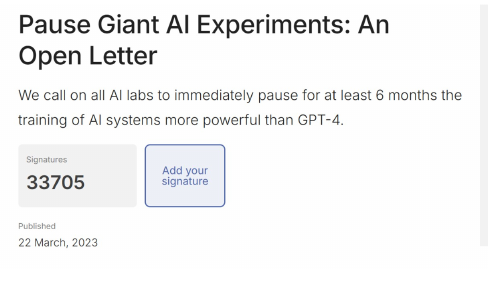

AIの学習を半年止める、公開書簡 イーロン・マスクなど

2025

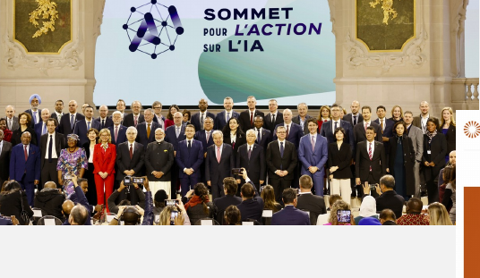
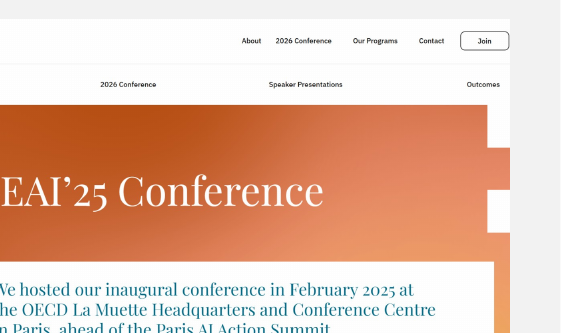

<b>IASEAI</b> (AIの安全と倫理の会議)

<!-- 人間のニーズ、能力、制約を最優先に考慮する -->

---

10の原則

# 10の原則

<b>IASEAIによる、立法者、学術関係者、そして一般市民への10の行動原則</b>

<b style="color:var(--accent-dark);">AIの重要性の認識と緊急の対応:</b> AIの変革の可能性とリスクを認識し、迅速に行動する。

<b style="color:var(--accent-dark);">AIによる社会的混乱の防止:</b> 雇用、社会構造、情報環境を守り、AIが社会を強化するように積極的に対策を講じる。

<b style="color:var(--accent-dark);">AGI（汎用人工知能）開発競争への対処:</b> 国際的な協調を通じて、厳格な安全基準の枠組み内でAGI開発競争が進むようにする。

<b style="color:var(--accent-dark);">安全で倫理的なAIのための研究協力:</b> AI、倫理、社会科学、政策の研究者が協力し、AIが人類に害を及ぼさないようにする。

<b style="color:var(--accent-dark);">強制的（法的拘束力のある）な安全・倫理要件の採択:</b> 企業の自主的な取り組みだけでなく、法的拘束力のある安全・倫理基準を導入する。

<b style="color:var(--accent-dark);">グローバルな協力の推進:</b> AIのリスクと利益は国境を越えるため、安全性研究や規制において国際協力を進める。

<b style="color:var(--accent-dark);">公的資金による研究の増加:</b> 企業の利害から独立した、公的資金によるAIの安全性と倫理に関する研究を大幅に増やす。

<b style="color:var(--accent-dark);">AI財団への支援:</b> 人間のニーズに応えるAI開発を支援する「AI財団」を支持する。

<b style="color:var(--accent-dark);">欧州評議会のAI枠組条約への支持:</b> 人権、民主主義、法の支配を保障する欧州評議会のAI条約を支持する。

<b style="color:var(--accent-dark);">情報に基づいた対話の促進:</b> 研究者とメディアは、AIの発展について国民や政策決定者に客観的かつ正確な情報を提供する。

http://iaseai.org/our-programs/call-to-action (参照日：2025/08)

<!-- 人間のニーズ、能力、制約を最優先に考慮する -->

---

日本の「AI新法」

# 日本の「AI新法」

　人工知能関連技術の研究開発及び活用の推進に関する施策の総合的かつ計画的な推進を図り、もって国民生活の向上及び国民経済の健全な発展に寄与するため、人工知能関連技術の研究開発及び活用の推進に関する施策について、基本理念並びに人工知能関連技術の研究開発及び活用の推進に関する基本的な計画の策定その他の施策の基本となる事項を定めるとともに、人工知能戦略本部を設置する必要がある。これが、この法律案を提出する理由である。

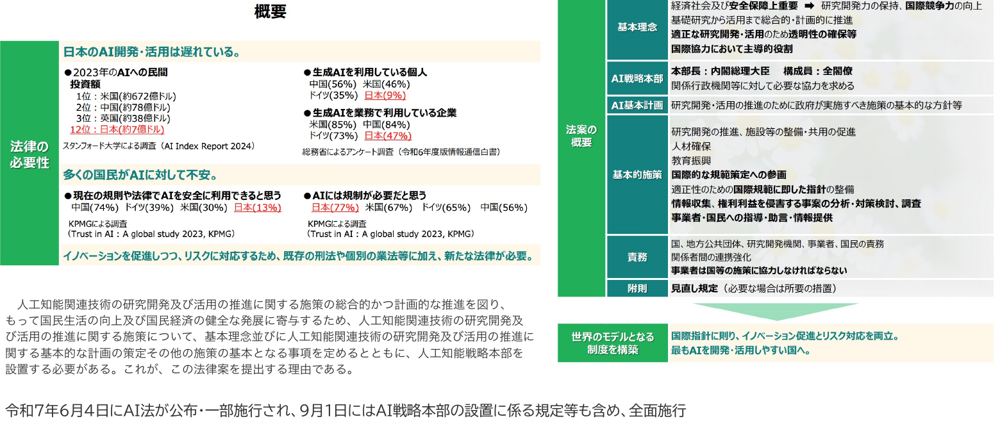

令和７年６月４日にＡＩ法が公布・一部施行され、９月１日にはＡＩ戦略本部の設置に係る規定等も含め、全面施行

https://www.cao.go.jp/press/new_wave/20251003.html

---

考えるべき3つの次元

# 考えるべき3つの次元

① <b>AIを使う人</b>のための倫理・法律

最低限知っておくべきこと

② <b>AIで創る・AIを創る人</b>のための倫理・法律

この授業では簡単に紹介のみ

③ <b>未来のAIと人とのあり方</b>について

ここは、みんなで議論してみましょう

<!-- 人間のニーズ、能力、制約を最優先に考慮する -->

---

考えるべき3つの次元

# 2　全体像 考えるべき3つの次元

① AIを使う人のための倫理・法律

最低限知っておくべきこと

A) <u>所属組織のルール</u>

B) <u>AIに関する情報リテラシ</u> 総務省の資料　<a href="https://www.soumu.go.jp/use_the_internet_wisely/special/generativeai/">https://www.soumu.go.jp/use_the_internet_wisely/special/generativeai/</a>

A) <u>困ったら聞くマインド</u>

<!--
- 人間のニーズ、能力、制約を最優先に考慮する
-->

---

AIを教育で利活用する上で、必ず知ってほしいこと

# 3 所属組織でのルール 千葉大学における生成AIの指針 (令和５年１０月１３日)

①

「生成 AI についての学び」「生成 AI を用いた学び」 「生成 AI によらない学び」を<b>それぞれ推進</b>

②

授業での利用は、授業の目的に合致することが前提であり、合致するかは、各授業の担当教員が<b>判断</b> <b>禁止の場合はシラバスなどに明記</b> （気になったら先生に聞きましょう！）

③

リスクや懸念に伴う禁止事項あり

https://drive.google.com/file/d/1ZultuLWXNLJ53M43ExrYG8cIfwqcCnCO/view

特に、<b>機密情報や個人情報の入力禁止</b>、生成AIにより出力された情報の<u>著作権 (表現への類似性・依拠性)</u>には留意が必要です。

<!--
- 人間のニーズ、能力、制約を最優先に考慮する
-->

---

学習目標分類

# 3 所属組織でのルール 学習目標から考えるAIの影響

<table style="font-size:18px; border-collapse:collapse; width:100%;">
<tr>
<th style="border:1px solid #bbb; padding:4px;"></th>
<th style="border:1px solid #bbb; padding:5px; background:var(--accent-soft);">認知的領域 (知識や思考)</th>
<th style="border:1px solid #bbb; padding:5px; background:var(--accent-soft);">学びへの生成AIの影響</th>
</tr>
<tr>
<td style="border:1px solid #bbb; padding:4px; font-weight:800; text-align:center;">高次</td>
<td style="border:1px solid #bbb; padding:5px;"><b>創造</b> (学習を応用し、新しい価値を作れる)</td>
<td style="border:1px solid #bbb; padding:5px;">人の創造性こそが大切</td>
</tr>
<tr>
<td style="border:1px solid #bbb; padding:4px;"></td>
<td style="border:1px solid #bbb; padding:5px;"><b>評価</b> (事物・判断等を比較し評価出来る)</td>
<td style="border:1px solid #bbb; padding:5px;">評価軸/価値/判断は人が設定する</td>
</tr>
<tr>
<td style="border:1px solid #bbb; padding:4px;"></td>
<td style="border:1px solid #bbb; padding:5px;"><b>分析</b> (要素に分け、関係性を指摘できる)</td>
<td style="border:1px solid #bbb; padding:5px;">解答/過程の支援可(例：要約・構造化・コーディング)</td>
</tr>
<tr>
<td style="border:1px solid #bbb; padding:4px;"></td>
<td style="border:1px solid #bbb; padding:5px;"><b>応用</b> (他の場面や状況に使用できる)</td>
<td style="border:1px solid #bbb; padding:5px;">単なる問題では、 AIが解いてしまう…</td>
</tr>
<tr>
<td style="border:1px solid #bbb; padding:4px;"></td>
<td style="border:1px solid #bbb; padding:5px;"><b>理解</b> (学習内容を説明出来る)</td>
<td style="border:1px solid #bbb; padding:5px;">説明/例示で支援可能 だが学修者の理解必須</td>
</tr>
<tr>
<td style="border:1px solid #bbb; padding:4px; font-weight:800; text-align:center;">低次</td>
<td style="border:1px solid #bbb; padding:5px;"><b>記憶</b> (事実や概念を暗記している)</td>
<td style="border:1px solid #bbb; padding:5px;">支援可能だが、 学修者の記憶必須</td>
</tr>
</table>

左は栗田&amp;中村 (2023)を元に作成 / 原著 Bloom (1956/1964)、改訂版(2001)を記載

<b>学修の目標を構造化し、学びの設計を支援</b> ／ 授業におけるAI利用の指針となり得る

※近年では、下から個別・段階的に行うのではなく、<b>複数の次元の要素を組み合わせる</b>必要性が叫ばれている。 ※近年では、学び方の学びや、人間性の涵養などを含む、学習目標分類も作成されている (e.g. Finkの学習目標分類) ※但し、<b>低次(特に記憶・理解・応用の段階)を蔑ろにして、高次の学修目標の達成は難しい</b>と想定される。

<b>AI が答えを出せるとしても、 途中を学ぶことは引き続き必要では？</b>

▶学習目標分類についての、担当講師による解説動画 (9分) <a href="https://www.notion.so/geophysica/Bloom-145d8c8bc5ab80deb9dfc15b89d91875?pvs=4">https://www.notion.so/geophysica/Bloom-145d8c8bc5ab80deb9dfc15b89d91875?pvs=4</a>

<!--
- 人間のニーズ、能力、制約を最優先に考慮する
-->

---

AIと学びの考え方 (例)

# 3 所属組織でのルール AIと学びの考え方 (例)

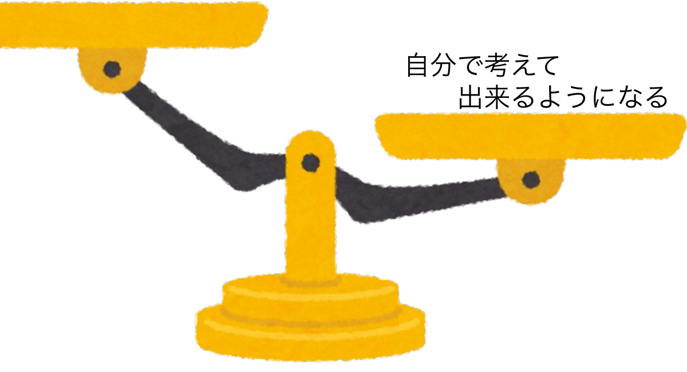

AIにさせて 自分の力を補う

自分で考えて 出来るようになる

<!--
- 人間のニーズ、能力、制約を最優先に考慮する
-->

---

AIと学びの考え方 (例)

# 3 所属組織でのルール AIと学びの考え方 (例)

学習・学修の過程で絶対に使うな、という意味<b>ではない</b>

学生の現状

学修後の状態

ねらい： どこに向かうのか (授業の存在価値)

達成目標： 何が出来るようになるのか

評価： どのように測るのか

設計： どのように教えるのか

<svg viewBox="0 0 1000 300" style="position:absolute; left:0; top:0; width:100%; height:100%; pointer-events:none;">
<line x1="190" y1="240" x2="720" y2="90" stroke="var(--accent)" stroke-width="2.5"/>
<line x1="720" y1="90" x2="720" y2="240" stroke="#888" stroke-width="1.5" stroke-dasharray="5,5"/>
</svg>

目標や設計を損なう形で使ってはいけない

<b>学びの場合、コスパ・タイパのために、AIを悪用してはいけません</b> <b>自律的に学びを深めるために、活用する文脈を学生と作りましょう</b>

「AIができることをただ出力する、ということは、AIで事足りるので採用する必要はない」ということ

AIができない「高次」の価値を作るために、引き続き学ぶ必要はある

Teaching with AI (Bowen &amp; Watson, AAC&amp;U 2024)

<!--
- 人間のニーズ、能力、制約を最優先に考慮する
-->

---

何が、利用上の注意点か

# 4. 総務省資料 何が、利用上の注意点か

生成AI活用にあたって 注意すべきポイントは？

情報の正確性

情報流出

知的財産権の侵害

活用者としてのモラル

総務省　生成AIはじめの一歩～生成AIの入門的な使い方と注意点～

<a href="https://www.soumu.go.jp/use_the_internet_wisely/special/generativeai/">https://www.soumu.go.jp/use_the_internet_wisely/special/generativeai/</a>

コンパクトに纏まっているので、ぜひ、ご活用ください

<!--
- ここからは、生成AIを使う上で注意すべき4つのポイントを学習します。
- まずは、情報の正確性に関することです。
-->

---

偽・誤情報に騙されない・拡散しない

# 4. 総務省資料 偽・誤情報に騙されない・拡散しないため、3つのポイントを常に意識する

ポイント１

人は信じたいものを選ぶ（認知バイアス）ので、無意識のうちに合理的ではない行動、偏った判断をすることがあるという意識をもつ

ポイント２

チェックリストを用いて真偽を判断する

ポイント３

チェックリストを用いて判断しても騙されるので、安易に拡散しない / 拡散したいときは ひと呼吸おく

Source: 総務省「インターネットとの向き合い方～ニセ・誤情報に騙されないために～」

<!--
- 生成AIの技術は急速に進展しており、人間が情報の真偽を判断することは難しくなることが予想されます。
- 自分が被害者、加害者にならないため、3つのポイントを常に意識しましょう。
- 1つ目は、人は信じたいものを選ぶので、無意識のうちに合理的ではない行動、偏った判断をすることがあるという意識をもつこと、
- 2つ目は、チェックリストを用いて真偽を判断すること、
- 3つ目は、チェックリストを用いて判断しても騙されるので、安易に拡散しない、また拡散したいときはひと呼吸おくことです。
- これから、それぞれのポイントについてご説明します。
-->

---

チェックシートを用いて判断する

# 4. 総務省資料 チェックシートを用いて判断する

基 本

☑ 情報源はある？

☑ その分野の専門家？

☑ 他ではどう言われている？

☑ その画像は本物？

応 用

☑ 「知り合いだから」 という理由だけで信じていないか？

☑ 表やグラフも疑ってみた？

☑ その情報に動機はある？

☑ ファクトチェック結果は？※1

Source: 総務省「インターネットとの向き合い方～ニセ・誤情報に騙されないために～」

<!--
- 2つ目に意識すべきポイントは、チェックリストを用いて真偽を判断することです。
- 情報源は信用できるか、他のメディアではどういわれているか、その画像/表/グラフは本物か、ファクトチェックの結果はどうかなど、1つ1つ確認することが大切です。
-->

---

生成AIにより偽・誤情報が生成される可能性

# 4. 総務省資料 生成AIにより偽・誤情報が生成される可能性

偽・誤情報の事例 ❶

ある生成AIサービスに以下の指示を入力すると、問題のあるリストが生成された。

西日本で最も高い山のTOP10を教えてください

生成されたリストの課題

実在しない山の名前が含まれる 標高が不正確

XXX駅周辺で平日ランチにおすすめな和食のお店を5つ教えて。予算は1人あたりXXX円以内。XXXから徒歩5分以内。

生成されたリストの課題

存在しないお店が含まれる お店の場所が全く違う 予算を大幅超過

偽・誤情報の事例 ❷

2022年9月、台風15号による水害被害が発生している静岡県の画像がSNS上で拡散。その後投稿者は、画像生成AIで作成した偽画像だったと公表。

Source: 生成AIサービスを用いて回答を作成、NHK「SNSで拡散 “AI生成の偽の災害画像” ファクトチェックはどうする」

<!--
- 生成AIによりもっともらしい偽・誤情報が生成される可能性に注意が必要です。
- 例えば、生成AIサービスに指示を入力すると、実在しない内容が含まれていたり、数字が不正確だったりすることがあります。
- また、水害被害の画像がSNSで拡散されたところ、実は画像生成AIで作成した偽画像だったという事例があります。
-->

---

何が、利用上の注意点か

# 4. 総務省資料 何が、利用上の注意点か

生成AI活用にあたって 注意すべきポイントは？

情報の正確性

情報流出

知的財産権の侵害

活用者としてのモラル

総務省　生成AIはじめの一歩～生成AIの入門的な使い方と注意点～ から考える

<a href="https://www.soumu.go.jp/use_the_internet_wisely/special/generativeai/">https://www.soumu.go.jp/use_the_internet_wisely/special/generativeai/</a>

<!--
- 次に、情報流出に関することについて学習します。
-->

---

情報流出を防ぐため、3つの行動を心がける

# 4. 総務省資料 情報流出を防ぐため、3つの行動を心がける

行動１

生成AIサービスの<b>規約を確認</b>（データの利用目的や範囲等）また利用規約の変更時には<b>変更箇所をチェック</b>

行動２

個人情報や機密情報の入力は<b>必要最小限</b>

行動３

生成AIに入力したデータを<b>学習に使わせないように設定</b>（オプトアウト設定）※1

<!--
- 情報流出を防ぐため、3つの行動を心がけることが大切です。
- まずは、生成AIサービスの規約で、データの利用目的や範囲等を確認し、利用規約の変更時には変更箇所をチェックするようにしましょう。
- その上で、個人情報や機密情報の入力を必要最小限にするよう注意しましょう。
- また、利用する生成AIサービスで設定が可能であれば、入力したデータを学習に使わせないように設定しましょう。
-->

---

ワーク：オプトアウトを確認する

# 4. 総務省資料 ワーク：オプトアウトを確認する

今、皆さんが使っているAIは、学習されますか？　どうなっていますでしょうか

Copilot

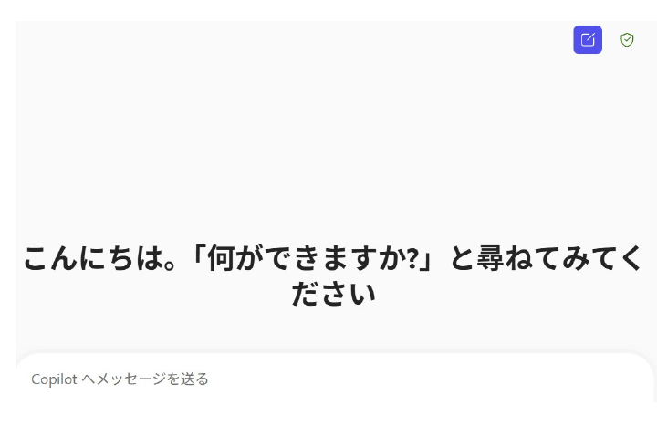

Gemini

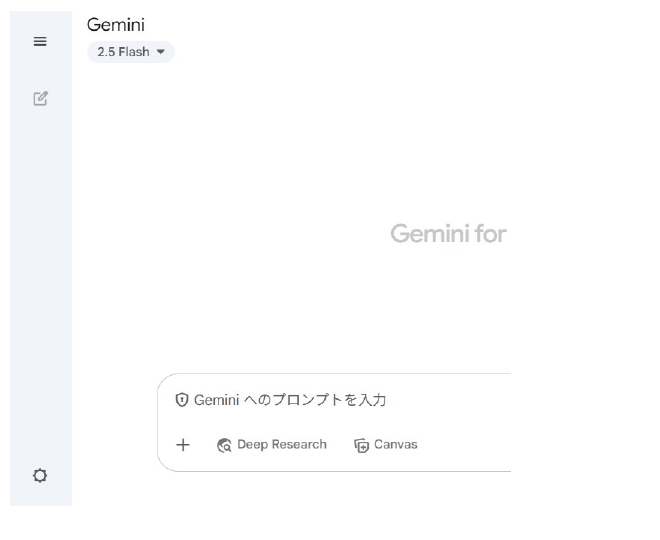

海外の第三者が見ることも…

<!--
- 情報流出を防ぐため、3つの行動を心がけることが大切です。
- まずは、生成AIサービスの規約で、データの利用目的や範囲等を確認し、利用規約の変更時には変更箇所をチェックするようにしましょう。
- その上で、個人情報や機密情報の入力を必要最小限にするよう注意しましょう。
- また、利用する生成AIサービスで設定が可能であれば、入力したデータを学習に使わせないように設定しましょう。
-->

---

情報流出の事例

事例

ある海外企業では、生成AIに機密情報を入力し情報が流出

2023年3月、海外の電子機器メーカーで生成AIの使用による、<b>社内情報流出</b>が立て続けに発生

情報流出の内容 ❶

<b>社内機密のソースコード</b>を生成AIに入力し、修正を依頼 (2件)

<svg viewBox="0 0 90 70" style="width:74px;height:auto;" xmlns="http://www.w3.org/2000/svg"><rect x="6" y="10" width="78" height="48" rx="5" fill="#1f2a37"/><rect x="12" y="16" width="66" height="36" rx="2" fill="#0b1220"/><text x="45" y="34" font-size="11" fill="#6fe3c4" text-anchor="middle" font-family="monospace">&lt;/&gt;</text><text x="45" y="46" font-size="8" fill="#9fb3c8" text-anchor="middle" font-family="monospace">code</text><rect x="24" y="58" width="42" height="6" rx="2" fill="#1f2a37"/></svg>
→
<svg viewBox="0 0 70 70" style="width:60px;height:auto;" xmlns="http://www.w3.org/2000/svg"><rect x="14" y="20" width="42" height="34" rx="9" fill="#7CC6E8"/><circle cx="35" cy="14" r="9" fill="#7CC6E8"/><circle cx="30" cy="34" r="3.5" fill="#13486b"/><circle cx="40" cy="34" r="3.5" fill="#13486b"/><path d="M29 44 q6 5 12 0" stroke="#13486b" stroke-width="2.5" fill="none" stroke-linecap="round"/></svg>

生成AI

情報流出の内容 ❷

<b>社内会議の録音データ</b>を音声認識アプリで文章に変換して生成AIに入力し、議事録を作成 (1件)

<svg viewBox="0 0 70 70" style="width:60px;height:auto;" xmlns="http://www.w3.org/2000/svg"><rect x="27" y="10" width="16" height="30" rx="8" fill="#E0457B"/><path d="M20 34 a15 15 0 0 0 30 0" stroke="#E0457B" stroke-width="3" fill="none"/><line x1="35" y1="49" x2="35" y2="60" stroke="#E0457B" stroke-width="3"/><line x1="26" y1="60" x2="44" y2="60" stroke="#E0457B" stroke-width="3"/></svg>
→
<svg viewBox="0 0 70 70" style="width:60px;height:auto;" xmlns="http://www.w3.org/2000/svg"><rect x="14" y="20" width="42" height="34" rx="9" fill="#7CC6E8"/><circle cx="35" cy="14" r="9" fill="#7CC6E8"/><circle cx="30" cy="34" r="3.5" fill="#13486b"/><circle cx="40" cy="34" r="3.5" fill="#13486b"/><path d="M29 44 q6 5 12 0" stroke="#13486b" stroke-width="2.5" fill="none" stroke-linecap="round"/></svg>

生成AI

<!--
ある海外企業では、社員が生成AIの仕組みへの理解が不十分であったため、生成AIに機密情報を入力してしまい、情報が流出するトラブルが発生しました。
ビジネスで利用する場合は、自社の機密情報の取扱いについて十分留意する必要があります。
-->

---

何が、利用上の注意点か

4. 総務省資料

生成AI活用にあたって 注意すべきポイントは？

情報の正確性

情報流出

知的財産権の侵害

活用者としてのモラル

総務省　生成AIはじめの一歩〜生成AIの入門的な使い方と注意点〜 から考える

https://www.soumu.go.jp/use_the_internet_wisely/special/generativeai/

<!--
次に、知的財産権の侵害に関することについて学習します。
-->

---

配慮すべき知的財産権

4. 総務省資料

利用例１

既存の<b>著作物</b>と類似している生成物を、アップロードして公表/複製物を販売

▲ 著作権

利用例２

商標や意匠として登録されているロゴ・デザイン等と同一または類似している生成物を商用利用

▲ 商標権・意匠権

利用例３

生成AIを利用して生成された著名人の氏名、肖像等を商用利用

▲ パブリシティ権

<b>差止請求・損害賠償請求等の民事訴訟や、刑事罰の対象</b>となることも

一方、生成AIへの入力段階では、著作物のデータは、原則として著作権者の許諾なく利用できる

Source: 総務省「インターネットとの向き合い方〜ニセ・誤情報に騙されないために〜」

<!--
生成AIを利用するときには、著作権・商標権/意匠権・パブリシティ権など、配慮すべき知的財産権があります。
一方、生成AIへの入力段階では、著作物のデータは、原則として著作権者の許諾なく利用できます。
-->

---

特に、先生になる方に必要なこと

4. 総務省資料

<b>Terms of use (利用規約)を読む / AIに読み込ませる</b>

<b>Chat GPT</b>

13才以上は可だが、<b>18才未満は保護者同意必須</b>

<b>Gemini</b>

13才以上可 <b>但し学校版は管理者の許可必須</b> ※ APIの利用/Studio/gem/NotebookLMの利用は不可

<b>Claude</b>

18才以上可

<b>Copilot</b>

13才以上可 (MS365 Copilotは 2025夏に13才以上に変更)

<b>※K-12向けAIは「みんなのコード」や「Khanmigo (米国向け)」など限られる</b> (安全性を考え、順次拡大中ではある)

<!--
特に学校の先生になる方は、各サービスの利用規約 (Terms of use) を必ず読むか、AIに読み込ませて確認しましょう。
年齢制限はサービスごとに異なり、ChatGPTは18才未満は保護者同意必須、Geminiは学校版は管理者の許可必須など、注意が必要です。
-->

---

学習のまとめ

# 生成AI活用に当たって注意すべきポイントは?

情報の正確性

<ul>
<li>無意識のうちに合理的ではない行動、偏った判断をすることがあるという意識を持つ</li>
<li>チェックリストを用いて真偽を判断する</li>
<li>安易に拡散しない / 拡散したいときはひと呼吸おく</li>
</ul>

情報流出

<ul>
<li>生成AIサービスの規約を確認する(商用利用可否、損害発生時の責任所在等)</li>
<li>個人情報や機密情報の入力は必要最小限にする</li>
<li>生成AIに入力したデータを学習に使わせないように設定する</li>
</ul>

知的財産権の侵害

<ul>
<li>既存のものや実在の人物に似たものを生成するような指示入力を避ける</li>
<li>生成物が既存のものや実在の人物に類似している場合、利用をやめる/権利者から許諾を取得後に利用する/既存のものと類似しないよう大幅に加工する</li>
</ul>

活用者としてのモラル

<ul>
<li>本来自分が行うべきことまで生成AI任せにしない</li>
<li>生成AIが作った偏見のある回答を使用しない</li>
<li>生成AIを非倫理的な行為や犯罪に悪用しない</li>
</ul>

<!--
生成AI活用にあたっては、情報の正確性、情報流出、知的財産権の侵害、活用者としてのモラル、それぞれについて、今回学習した内容を心がけましょう。
-->

---

第一に考えるべき点

5. 法律

<b>1) AIを犯罪や不正に使わない</b>

なりすましメールなどの詐欺 ／ アカウントIDの突破 ／ マルウェア生成 ／ ポルノ ／ ディープフェイク ／ 許認可事業/独占業務 etc…

<b>2) 関連の法律を簡単に把握する</b>

<b>著作権法</b>：AI とモデルの著作権／AIに関する学習データの著作権／AI生成物の著作権

<b>個人情報保護法</b>

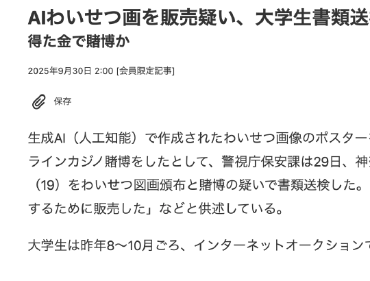

(日経新聞)

AIと著作権の考え方 文化庁 (2024)　https://www.bunka.go.jp/seisaku/bunkashingikai/chosakuken/pdf/94037901_01.pdf

<!--
第一に、AIを犯罪や不正に使わないこと。なりすまし詐欺やマルウェア生成、ディープフェイクなどは厳禁です。
第二に、関連する法律 — 著作権法や個人情報保護法 — を簡単に把握しておきましょう。
-->

---

関連資料

<b>「AI事業者ガイドライン第1.0版(案)」</b> (総務省・経済産業省) 事業活動においてAIを活用する事業者を対象としたガイドライン

<b>「マナビDX」</b> (経済産業省) デジタルスキルを身につける講座を紹介するポータルサイト

<b>「上手にネットと付き合おう！〜安心・安全なインターネット利用ガイド〜」</b>(総務省) 安全なインターネット利用に関する様々なコンテンツを公開

<b>「デジタルスキル標準（DSS）」</b> (経済産業省) DX時代の個人の学習や企業の人材確保・育成の指針。2023年8月改訂にて⽣成AIに関するリテラシーを追加。

<b>情報モラル学習・教育サイト</b> (文部科学省) スマホ・タブレットやインターネットの使い方に関する様々なコンテンツを公開（小〜高校生向け／教員向け）

<b>「楽しく学ぼう みんなの著作権」</b> (文化庁) 小学生のための著作権教材

<b>「AIと著作権」</b> (文化庁) 現行の著作権法の考え方やAIと著作権の関係を説明

<!--
AIの倫理・法律について、より深く学びたい方のための関連資料を紹介します。経済産業省、総務省、文化庁、文部科学省などが、ガイドラインや教材を公開しています。
-->

---

<!-- _class: cover-hero -->

生成AI活用講座 第3回

(予習編補足：学校教員を目指す方へ)

2025/10/2 公開　講師：田川 翔

千葉大学 国際未来教育基幹 助教

<!--
ここからは、予習編の補足として、学校教員を目指す方へ向けた内容をお話しします。
-->

---

ワーク：注意点をまとめてみよう

教員志望者向け補足

# Notebook LM を使った、注意点の確認方法 (画面出みせます)

文科省通知『初等中等教育段階における生成 AI の利活用に関するガイドライン』(第二版)のpdfをダウンロードしてください

NotebookLMを開き、ソースにpdfをアップロードしてください。

質問し、「高校でのAIの利用において、遵守しないと行けない点」をまとめて、見つけて見てください。(後ほど、slido上で伺います)

<b>個人情報保護はどうでしょうか</b> <b>具体例や事例を考えてもらいましょう</b>

<b>応用：</b> <b>解説音声や問題、その解説を作って見てください</b>

※生徒は年齢制限上使用不可

<b>Google</b> の取り組みについて：「Googleの使命は、世界中の情報を整理し、世界中の人がアクセスできて使えるようにすること」 
Google labs の中に、幾つかの開発中の製品があり、教育への影響もありそうです 
例：Illuminate (何でもソクラテス化：説明文や論文を対話的な解説に変えてしまうAI)

https://www.mext.go.jp/a_menu/other/mext_02412.html

<!--
NotebookLMを使った注意点の確認方法を、画面を出しながらお見せします。文科省のガイドラインPDFをソースにアップロードし、高校でのAI利用で遵守すべき点をまとめてもらいます。
-->

---

ワーク：注意点をまとめてみよう

教員志望者向け補足

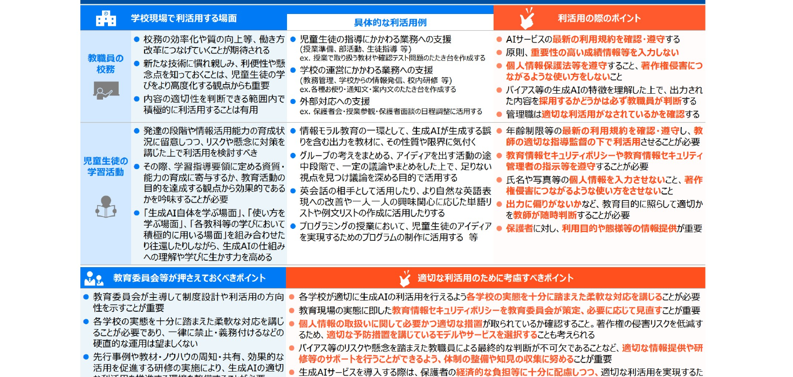

https://www.mext.go.jp/content/20241226-mxt_shuukyo02-000030823_003.pdf

<!--
こちらは文科省ガイドラインの内容を整理した表です。学校設置者向けの留意点、国による利用例、利用上の留意ポイントがまとまっています。
-->

---

ワーク：注意点をまとめてみよう

教員志望者向け補足

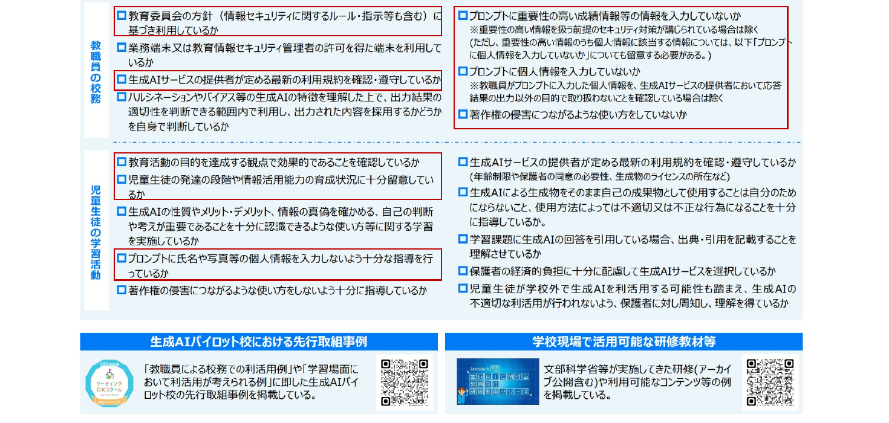

https://www.mext.go.jp/content/20241226-mxt_shuukyo02-000030823_003.pdf

<!--
続いて、利活用する際のチェック項目、パイロット校における取組事例、学校現場での研修事例の表です。
-->

---

高校の注意点・活用事例

教員志望者向け補足

# deep researchでまとめた、高校の注意点・活用事例

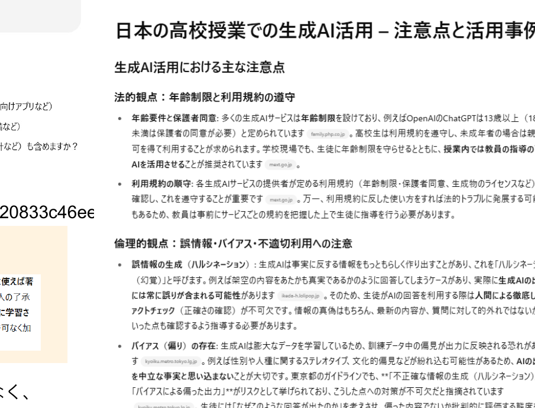

<b>※ ハルシネーション</b>

自分は、まとめられた情報を見るのではなく、 <b>何がソースか</b>を見ている

https://chatgpt.com/s/dr_6849f71f583c81919120833c46eebd16

<!--
deep researchで「日本の高校授業での生成AI活用 — 注意点と活用事例」をまとめてみました。ただしハルシネーションには注意が必要で、私自身は、まとめられた情報そのものを見るのではなく、何がソースかを見るようにしています。
-->

---

授業の流れと使い所

# 授業の流れと使い所　教員志望者向け補足

<b>先進活用事例</b>　https://leadingdxschool.mext.go.jp/achieve/ai/

日常での活用事例

校務：絵を作る、機密にかからない文案作成/添削 　公開された省庁資料の分析や生徒指導提要の例を作成等

授業での活用事例

授業準備

<ul style="font-size:17px;">
<li>学習指導要領参照</li>
<li>関係資料の検索</li>
<li>レジュメ作成支援</li>
<li>授業案作成支援</li>
</ul>

授業

<ul style="font-size:17px;">
<li>教材</li>
<li>(調べ学習)</li>
<li>(不明点の理解)</li>
</ul>

小テスト

<ul style="font-size:17px;">
<li>問題案作成</li>
<li>回答・解説案作成</li>
<li>誤答案作成</li>
</ul>

評価

<ul style="font-size:17px;">
<li>評価基準作成</li>
</ul>

(分析)

※個人情報上難しい

<ul style="font-size:17px;">
<li>生徒の受け取り方壁打ち</li>
</ul>

その他、無限の可能性がありそうです！

<!--
- 教員志望者向け補足。授業の流れに沿って、AIの使い所を確認します。授業準備、授業、小テスト、評価、それぞれで活用できますが、評価の分析は個人情報の関係で難しい。先進活用事例は文科省のサイトを参照。その他、無限の可能性がありそうです。
-->

---

実際の教育活用の技を体験する

# 問題の解説を考えましょう　教員志望者向け補足

① AIに解かせたい、入試・定期試験・エントリーシート 　　などのワークの問題を一つ選んでください。 　　記述式のほうが良いかもしれません。

② 問題文だけをAIに投げて、解説させてください。 　　ハルシネーションはおきましたか？

<!--
- 実際の教育活用の技を体験しましょう。問題の解説を考えます。まず①入試や定期試験などの問題を一つ選び、②問題文だけをAIに投げて解説させてみてください。ハルシネーションはおきましたか。
-->

---

実際の教育活用の技を体験する

# 問題の解説を考えましょう　教員志望者向け補足

③ 今度は、問題といっしょに、解説や模範例、 　　こうなると面白いなどのアイデア・答えを含めて、 　　送付してみましょう。 　　次に、AIに解説を詳しくするよう、頼んで下さい。

④ AIに意図を説明しましょう。 　　何を学生に学び取ってほしいのか、等。 　　そのうえで、教え方のアイデアを聞いてみて下さい。

<!--
- 続いて、③問題に解説や模範例、アイデアや答えを含めて送り、AIに解説を詳しくするよう頼みます。④AIに意図、つまり何を学生に学び取ってほしいかを説明し、その上で教え方のアイデアを聞いてみてください。
-->

---

例：問題の解説をしてもらおう

# 例：問題の解説をしてもらおう　教員志望者向け補足

以下の問題があります。<b>自分は、真ん中２つの街の真ん中だと答えました。正解は、真ん中２つの街の上、または間なら、どこでも良い、になるんだそうです。</b>この状況の問題を学生に解説したいです。絵を作ってもらえませんか。 
［私は砂漠の石油王で、たまたま一直線上に位置している四つの町に石油を届けることになっている。その四つの町を順番に回るのだが、次の町へ行く前に必ず石油タンクに戻らなければならない。移動距離をもっとも短くするにはどこにタンクを置けばいいだろうか？王族の友人がいて私か望めば無料でいくらでも道路を建設してくれるから、道路の心配はいらない。］

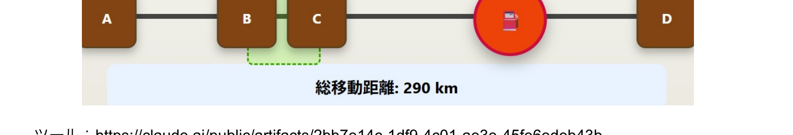

ツール： https://claude.ai/public/artifacts/2bb7e14c-1df9-4c01-ae3e-45fe6edeb43b プロンプト： https://claude.ai/share/5c053617-2718-41f7-8319-0ed0ea2e2012

<!--
- 例として、問題の解説をしてもらいましょう。一直線上の四つの町に石油タンクをどこに置くと移動距離が最短になるか、という問題。自分は真ん中だと答えましたが、正解は真ん中２つの街の上または間ならどこでも良い、です。この状況を学生に解説したいので、絵を作ってもらいました。
-->

---

１　イントロ

生成AI活用講座 第3回

(予習編2：良いプロンプティング)

2025/10/2 公開 講師：田川 翔

千葉大学 国際未来教育基幹 助教

<!--
- ここからは予習編2、良いプロンプティングについてです。生成AI活用講座 第3回。
-->

---

１ プロンプトのコツ

# 良いプロンプトを書くコツ

生成AIから最適な回答を得るための指示（プロンプト）の工夫を "<b>プロンプトエンジニアリング</b>" と呼ぶ

<table style="width:100%; border-collapse:collapse; font-size:19px;">
<tr>
<th style="border:1px solid #bbb; padding:5px; background:var(--accent-soft); width:40px;"></th>
<th style="border:1px solid #bbb; padding:5px; background:var(--accent-soft); width:36%;">工 夫</th>
<th style="border:1px solid #bbb; padding:5px; background:var(--accent-soft);">指示 (プロンプト) 例</th>
</tr>
<tr>
<td style="border:1px solid #bbb; padding:6px; text-align:center; font-weight:800; color:var(--accent);">1</td>
<td style="border:1px solid #bbb; padding:6px;">目的・詳細な設定・検討の材料を書く</td>
<td style="border:1px solid #bbb; padding:6px;">この質問は、XXXを作成するために聞いています なお、8月の夏休みに行く旅行について検討しています XXXの文脈に絞って、XXXについて教えてください</td>
</tr>
<tr>
<td style="border:1px solid #bbb; padding:6px; text-align:center; font-weight:800; color:var(--accent);">2</td>
<td style="border:1px solid #bbb; padding:6px;">欲しい回答の例を与える</td>
<td style="border:1px solid #bbb; padding:6px;">XXXのような事例を探しています 以下の例を参考に、類似のものを調べてください</td>
</tr>
<tr>
<td style="border:1px solid #bbb; padding:6px; text-align:center; font-weight:800; color:var(--accent);">3</td>
<td style="border:1px solid #bbb; padding:6px;">書式/回答方法を制限する</td>
<td style="border:1px solid #bbb; padding:6px;">横軸がAとBとCである表形式で答えてください XXX文字以内で答えてください 要点をXXX個挙げてください</td>
</tr>
<tr>
<td style="border:1px solid #bbb; padding:6px; text-align:center; font-weight:800; color:var(--accent);">4</td>
<td style="border:1px solid #bbb; padding:6px;">文章のテイストを指定する</td>
<td style="border:1px solid #bbb; padding:6px;">私は10歳の子供だと思って説明してください XXX (有名な作家 等) の文体で説明してください 女子高生になりきって説明してください</td>
</tr>
</table>

今のAIは、幾分、簡単な質問でも答えるようになった / <b>複雑なことをさせるには必要</b>

<!--
- 良いプロンプトを書くコツ。生成AIから最適な回答を得るための指示の工夫を「プロンプトエンジニアリング」と呼びます。代表的な4つのコツ。①目的・詳細な設定・検討の材料を書く、②欲しい回答の例を与える、③書式や回答方法を制限する、④文章のテイストを指定する。今のAIは簡単な質問でも答えますが、複雑なことをさせるには必要です。
-->

---

１ プロンプトのコツ

# 良いプロンプトを書くコツ (7R法)

図表5-1　プロンプト上手になるための7つのポイント

<table style="width:100%; border-collapse:collapse; font-size:18px;">
<tr><td style="padding:4px 8px;">①明確な質問</td><td style="padding:4px 8px;">曖昧な質問ではなく明確な質問をすることで、より良い回答が得られます。</td></tr>
<tr><td style="padding:4px 8px;">②具体性</td><td style="padding:4px 8px;">トピックや要求に具体的な詳細を提供することで、適切な回答を引き出せます。</td></tr>
<tr><td style="padding:4px 8px;">③プロンプトの構造</td><td style="padding:4px 8px;">質問を構造化して、抜け・漏れをなくします。</td></tr>
<tr><td style="padding:4px 8px;">④文脈の提供</td><td style="padding:4px 8px;">重要な文脈や背景情報を提供します。</td></tr>
<tr><td style="padding:4px 8px;">⑤複数の質問</td><td style="padding:4px 8px;">必要に応じて、複数の質問を連続して投げます。</td></tr>
<tr><td style="padding:4px 8px;">⑥ステップバイステップ指示</td><td style="padding:4px 8px;">段階的に考えさせます。</td></tr>
<tr><td style="padding:4px 8px;">⑦校正とフィードバック</td><td style="padding:4px 8px;">得られた結果を評価し、精度向上を促します。</td></tr>
</table>

図表5-3　簡易プロンプト

入力

<b>Request（依頼）</b>を出す

<b>Role（役割）</b>を決める

<b>Regulation（形式）</b>を指定する

出力

図表5-5　詳細プロンプト

入力

<b>Request（依頼）</b>を出す

<b>Role（役割）</b>を決める

<b>Regulation（形式）</b>を指定する

<b>Rule（ルール）</b>を定める

<b>Review &amp; Refine（評価・改善）</b>を求める

<b>Reference（参照知識・例）</b>を与える

出力

ChatGPT時代の文系AI人材になる | 野口 竜司 (東洋経済新報社 2023)

<!--
- 良いプロンプトを書くコツの7R法。野口竜司さんの本から。明確な質問、具体性、プロンプトの構造、文脈の提供、複数の質問、ステップバイステップ指示、校正とフィードバックの7つ。簡易プロンプトはRequest・Role・Regulationの3つ、詳細プロンプトはそれにRule・Review & Refine・Referenceを加えた6要素です。
-->

---

１ プロンプトのコツ

# 良いプロンプトを書くコツ

探究プロンプトも似た構造 → 上手いプロンプトの構造を持ってきて書き換える/AIに書かせる

<b># 役割 (Role)</b>　AIに担ってほしい専門家やキャラクターを設定します。 例：小学生に教えるのが得意な、明るく優しい先生 
<b># 命令 (Instruction)</b>　AIに実行してほしい、最も重要なタスクを明確に記述します。 例：納豆の魅力について、子供向けに解説してください。 
<b># 文脈 (Context)</b>　このタスクの背景や、回答を作る上で考慮してほしい状況を伝えます。 例：対象読者は、食べ物の好き嫌いが多い小学校3年生です。 
<b># 参照 (Reference)</b>　AIに読み込ませたい情報（文章、データ、ファイル名など）を指定します。 例：添付のPDF「natto_data.pdf」を読んでから回答してください。 
<b># 形式 (Format)</b>　出力してほしい形を具体的に指定します。 例：表形式で、各列は「栄養素」「働き」「多く含まれる食べ物」にしてください。 
<b># ルール (Rules)</b>　回答を作成する上での、具体的な制約や必ず守ってほしい条件を箇条書きにします。 * 【含めること】：必ず「ネバネバパワー」という言葉を入れてください。 * 【禁止すること】：難しい科学用語（例：ビタミンK2）は使わないで下さい。

<b>目的</b>　どういう意図か？／含めること／禁止すること

<b>背景</b>　背景知識／プロンプトのターゲット

<b>出力スタイル</b>　量／形式／抽象度・具体度／順番

メタプロンプトを作る (予め、ロールプレイする方法を伝えておく、等) AIにプロンプトを作らせるプロンプトを作る

<!--
- 探究プロンプトも似た構造です。役割、命令、文脈、参照、形式、ルールといった要素で構成されます。上手いプロンプトの構造を持ってきて書き換えたり、AIに書かせたりするとよいでしょう。目的、背景、出力スタイルに整理でき、メタプロンプト、つまりAIにプロンプトを作らせるプロンプトを作るのも有効です。
-->

---

１ プロンプトのコツ

# プロンプティングに関する勉強方法

① <b>使い込んでいる人の使い方</b>を見る  
② <b>模範例のプロンプトを書き換えてみる</b>  
③ <b>しっくりくる回答が来るまで、 　　試行錯誤する</b>  
④ <b>めんどうとなったら、</b> 　　<b>AIに外注できないか</b>、考えてみる

<!--
- プロンプティングに関する勉強方法。①使い込んでいる人の使い方を見る、②模範例のプロンプトを書き換えてみる、③しっくりくる回答が来るまで試行錯誤する、④めんどうとなったら、AIに外注できないか考えてみる。
-->

---

２ マルチモーダル

# プロンプトの小技

1.　画像からの文字起こし

OCRの代用 <b>意味を考えるので間違えにくい</b>

○ a lot of　／　✗ a 1ot of

2.　動画からの文字起こし

<b>YouTube動画を文字起こしし、 いろいろと聞いてみましょう</b>

<ul style="font-size:22px; margin-left:1.4em;">
<li>問題を作ってみる</li>
<li>教え方を工夫するうえで、何をすべきか聞いてみる</li>
<li>要約を作ってみる</li>
</ul>

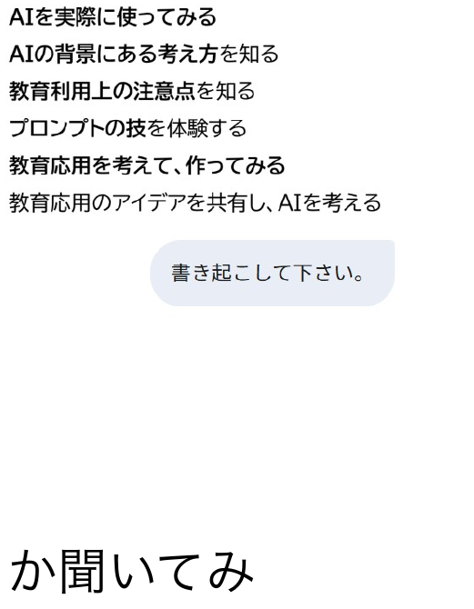

<!--
- プロンプトの小技。1つ目は画像からの文字起こし。OCRの代用になりますが、AIは意味を考えるので間違えにくいです。2つ目は動画からの文字起こし。YouTube動画を文字起こしして、問題を作ったり、教え方の工夫を聞いたり、要約を作ったりしてみましょう。
-->

---

２ マルチモーダル

# ２つのプロンプト

システムプロンプト

AIの基本的な振る舞いを定義

システムプロンプトは、AI全体の動作モード、個性、制約を設定する「設定ファイル」のような役割を果たします。会話全体を通じて一貫して適用されます。

<ul style="font-size:18px;">
<li>AIの役割や専門性の定義</li>
<li>トーン、スタイル、言語の設定</li>
<li>一般的なルールやガイドライン</li>
<li>倫理的な制約や禁止事項</li>
</ul>

<b>例:</b> 「あなたは親切で専門的な技術サポート担当者として振る舞ってください。常に明確で段階的な説明を提供し、専門用語は避けてください」

ユーザープロンプト

具体的なタスクや質問を指定

ユーザープロンプトは、個々のやり取りにおける具体的な要求や質問を含みます。システムプロンプトで設定された枠組みの中で、特定のタスクを実行させます。

<ul style="font-size:18px;">
<li>具体的な質問や依頼内容</li>
<li>処理すべきデータや文書</li>
<li>即座の出力に関する指示</li>
<li>タスク固有の要件や制約</li>
</ul>

<b>例:</b> 「この Python コードのエラーを修正してください: 。初心者にもわかるように説明してください」

<!--
- ２つのプロンプト。システムプロンプトは、AIの基本的な振る舞いを定義する設定ファイルのような役割で、会話全体に一貫して適用されます。ユーザープロンプトは、個々のやり取りにおける具体的なタスクや質問を指定します。
-->

---

３ より高度な技法

# Structure output / Function calling

Structured Output（構造化出力）

<b>定義:</b> LLMの出力を、事前に定義されたJSONスキーマなどの構造に沿って生成する技術。

利点:

<ul style="font-size:18px;">
<li>予測可能な出力形式で後続処理を容易に</li>
<li>スキーマに合致しない誤ったデータを自動で拒否</li>
<li>プロンプトを簡潔にし、LLMへの指示を削減</li>
</ul>

簡単な例:

ユーザー情報抽出のためのJSONスキーマ

<pre style="font-size:14px; background:#f5f5f5; border-radius:6px; padding:8px 10px; white-space:pre-wrap; line-height:1.35;">{ "type": "object", "properties": {
  "name": { "type": "string" },
  "email": { "type": "string", "format": "email" },
  "age": { "type": "integer" } },
 "required": ["name", "email"] }</pre>

Function Calling（関数呼び出し）

<b>定義:</b> LLMがユーザーの意図を解釈し、外部ツール（API）を呼び出し特定のアクションを実行する機能。

用途:

<ul style="font-size:18px;">
<li>レストラン予約やオンラインショッピングの注文処理</li>
<li>カレンダー管理など外部アプリとの連携</li>
<li>データ検索やアクション実行の自動化</li>
</ul>

簡単な例:

レストラン予約のための関数呼び出し

<pre style="font-size:14px; background:#f5f5f5; border-radius:6px; padding:8px 10px; white-space:pre-wrap; line-height:1.35;">bookRestaurant(
  restaurant_name, date, time,
  party_size, special_requests)
tool_name: レストラン予約
tool_description: 指定されたレストランの予約を行います。</pre>

AIの応答をより予測可能かつ信頼性の高いものに出来る。データの正確な処理と外部連携により、AI活用の幅が大きく広がる。

https://platform.openai.com/docs/guides/structured-outputs

<!--
- より高度な技法として、Structured OutputとFunction Calling。Structured Outputは、LLMの出力をJSONスキーマなど事前定義の構造に沿って生成する技術で、後続処理が容易になります。Function Callingは、LLMがユーザーの意図を解釈して外部ツール（API）を呼び出し、特定のアクションを実行する機能です。これらでAIの応答をより予測可能かつ信頼性の高いものにでき、AI活用の幅が広がります。
-->

---

<!-- _class: cover-hero -->

1　イントロ

生成AI活用講座 <b>第3回</b>

予習編3：情報系での研究結果から

2025/10/2 公開　講師：田川 翔

千葉大学 国際未来教育基幹 助教

東大松尾研究室の授業スライドから <a href="https://weblab.t.u-tokyo.ac.jp/llm_contents_2024/">https://weblab.t.u-tokyo.ac.jp/llm_contents_2024/</a> (CC BY-NC-ND 4.0 )

<!--
- 予習編3は、情報系の研究結果からプロンプティングを見ていきます。東大松尾研の授業スライド(CC BY-NC-ND 4.0)を参照しています。
-->

---

1　イントロ

# AIが得意なこと？

要約、推測、変換、拡張

<!--
- AIが得意なことは、ざっくり言えば「要約・推測・変換・拡張」の4つです。
-->

---

<!-- _class: fig -->

1　イントロ

より詳しくZero shot/ Few Shot

## プロンプティング（Prompting）とは？

特定の機能の発生を促進 (prompt)するような言語モデルに入力するコンテキスト文

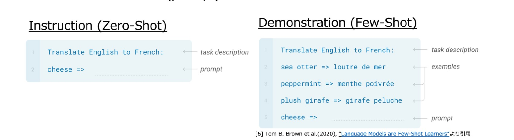

与える指示や事例を変えれば異なることができる （例：ポジネガ判定なら「次の文章がポジティブかネガティブか分類して」など）

[6] Tom B. Brown et al.(2020), “Language Models are Few-Shot Learners”, NeurIPS2020

<!--
- プロンプティングとは、特定の機能の発生を促す、モデルに入力するコンテキスト文のことです。事例ゼロのZero-Shotと、例を与えるFew-Shotがあります。
-->

---

<!-- _class: fig -->

1　イントロ

より詳しくコンテキストを充実させる

## Few-Shot Promptingと文脈内学習（In-Context Learning）

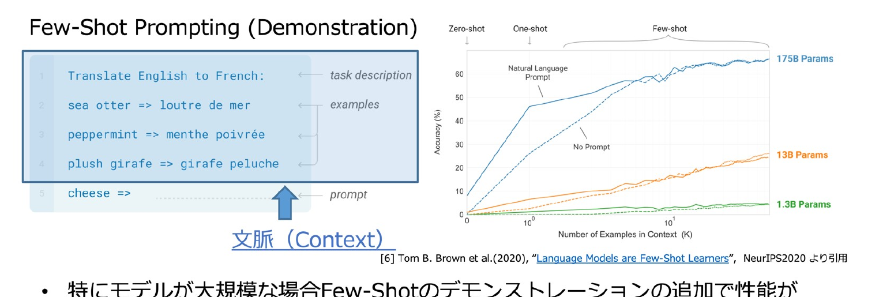

<ul style="font-size:22px; margin:0 0 0 1em;">
<li>特にモデルが大規模な場合Few-Shotのデモンストレーションの追加可能性能が大幅に上がることが多い (右図)</li>
<li>文脈から学習するため、文脈内学習 (In-Context Learning)と呼ばれる.</li>
</ul>

[6] Tom B. Brown et al.(2020), “Language Models are Few-Shot Learners”, NeurIPS2020より引用

<!--
- 例を与えるFew-Shotは、モデルが大規模なほど効果が大きい傾向があります。これを文脈内学習(In-Context Learning)と呼びます。
-->

---

<!-- _class: fig -->

1　イントロ

より詳しくプロンプトで精度が変わる！

## プロンプトの重要性｜指示文の違いの影響

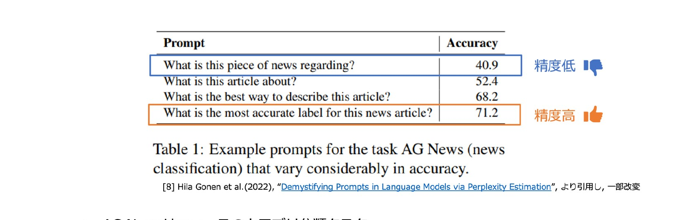

<ul style="font-size:22px; margin:0 0 0 1em;">
<li>AG Newsはニュースのカテゴリ分類タスク <a href="https://huggingface.co/datasets/ag_news/viewer/default/train">https://huggingface.co/datasets/ag_news/viewer/default/train</a></li>
<li>プロンプトによって性能が30%変化</li>
</ul>

[8] Hila Gonen et al.(2022), “Demystifying Prompts in Language Models via Perplexity Estimation”, 2022, より作成、一部改変

<!--
- 同じタスクでも、指示文の書き方しだいで精度が30%も変わるという研究があります。
-->

---

<!-- _class: fig -->

1　イントロ

より詳しくプロンプトで精度が変わる！

## デモンストレーション例入れるほど良くなる

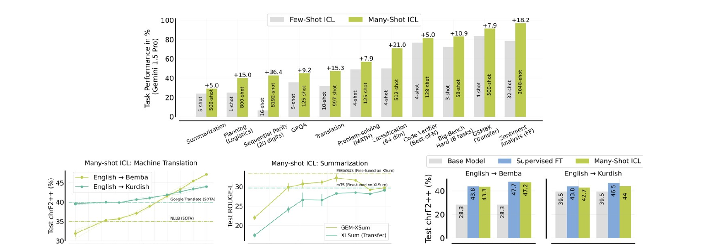

タスクによっては、ICLのみで特化モデルのfinetuningと匹敵する

[70] Agarwal et al.(2024), “Many-Shot In-Context Learning”, 2024, より引用

<!--
- デモンストレーションの例を増やすほど性能が上がり、タスクによってはファインチューニングに匹敵することもあります。
-->

---

<!-- _class: fig -->

まとめ

より詳しく思考過程を描かせる  (CoT)

## Chain-of-Thought (CoT) Prompting

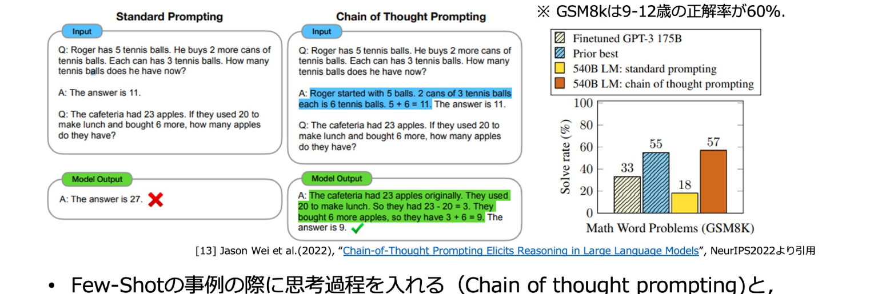

<ul style="font-size:22px; margin:0 0 0 1em;">
<li>Few-Shotの事例の隙間に思考過程を入れる (Chain of thought prompting)と、新しい質問についても思考過程を明示してくれる。</li>
<li>算数の文章題など、従来難しいとされていた推論タスクで大幅に性能が向上。</li>
</ul>

[13] Jason Wei et al.(2022), “Chain-of-Thought Prompting Elicits Reasoning in Large Language Models”, NeurIPS2022

<!--
- 思考過程を例として書いておくと、AIも新しい問いで思考過程を示すようになります。これがChain-of-Thought (CoT)です。算数の文章題などで効果が大きい。
-->

---

<!-- _class: fig -->

まとめ

より詳しく思考過程を描かせる  (CoT)

## 入力するプロンプトによる性能の変化

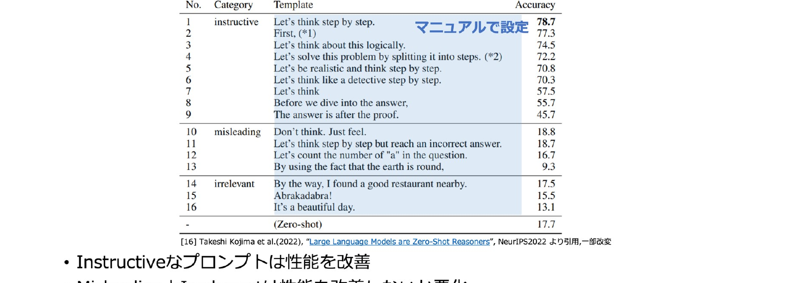

<ul style="font-size:22px; margin:0 0 0 1em;">
<li>Instructiveなプロンプトは性能を改善</li>
<li>MisleadingとIrrelevantは性能を改善しないか悪化。</li>
</ul>

[16] Takeshi Kojima et al.(2022), “Large Language Models are Zero-Shot Reasoners”, NeurIPS2022 より引用、一部改変

<!--
- 段階的に考えさせる指示は性能を改善しますが、誤誘導や無関係な指示はむしろ悪化させます。
-->

---

<!-- _class: fig -->

まとめ

より詳しく結果で多数欠する

## CoTの推論能力の改善：Self Consistency

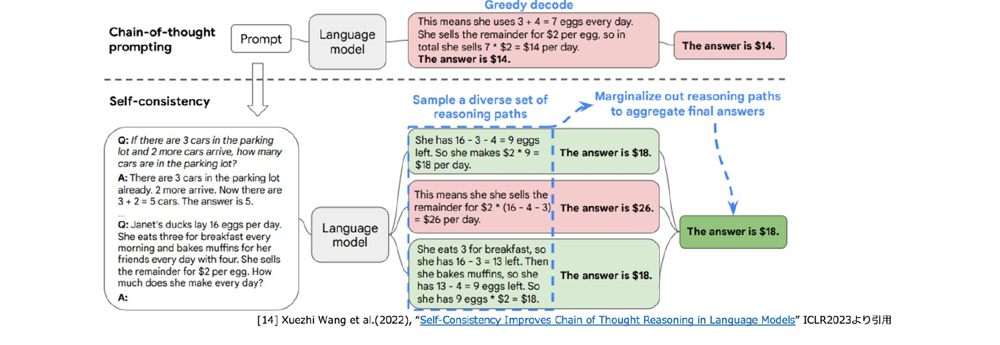

LMに複数の推論を行わせて (上は3つの例)、多数決で答えを決定。 ※ 文脈にもっともらしいから正しい推論とは限らないことを示唆。

[14] Kuizhi Wang et al.(2022), “Self-Consistency Improves Chain of Thought Reasoning in Language Models”, ICLR2023より引用

<!--
- 複数の推論を走らせて多数決で答えを決めるのがSelf-Consistencyです。もっともらしくても正しいとは限らない、という点も示唆しています。
-->

---

<!-- _class: split -->

まとめ

# AI AGENT化 (田川私見)

AI Agent=「状況を観察し，自由に使えるツールを用いて働きかけることにより，目標を達成するアプリケーション」(Wiesinger et al., 2025)

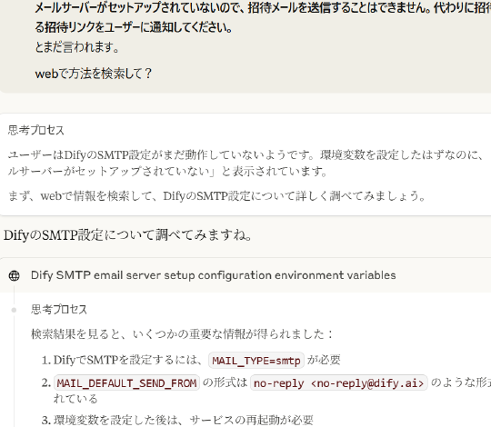

<b>グラウンディング：</b> AIが生成する回答を、特定の信頼できる情報源（ソース）にしっかりと結びつける技術

<b style="width:2.4em;">昔：</b>AI➡回答

<b style="width:2.4em;">今：</b>データAI➡回答

<b>「推論」「思考ツール」</b>になりつつある

<!--
- AIは単に答えを出す存在から、状況を観察しツールを使って目標を達成する「エージェント」へ。回答を信頼できるソースに結びつけるグラウンディングが鍵で、AIは「推論」「思考ツール」になりつつあります。
-->

---

<!-- _class: split -->

まとめ

# 余計に書かなくてもある程度回る (田川私見)

<b>商用の場合、CoTを指示する必要はない</b> 　※ o3 → 高度な段階的推論 (CoT)  　※ 不必要に誘導すると、かえって混乱

<b>コンテキストや文脈内学習は、 　引き続き重要に </b>(geminiは本1冊入る！) 　例: プログラミングを書かせる

Few shot(outputの明示)や意図の説明も、 　<b>いまだ有効なテクニック</b>

<!--
- 商用の高性能モデルでは、わざわざCoTを指示しなくても段階的に推論してくれます。むしろ余計な誘導は混乱のもと。一方でコンテキストの充実やFew-Shot、意図の説明は今も有効です。
-->

---

6 教育活用

実際の教育活用の技を体験する

# <b>(時間がある場合デモ)</b> 探究の支援ツールにする

<b>①</b> web検索可能なAI (deep researchなど)で、調べるべき内容を教員が一気に検索しておく

<b>②</b> その内容で得られた「リンク」をもとに、学生の調べ学習の参考資料を出す (もちろん学生自身が自分で検索できることも重要)

<b>③</b> 学生はGeminiで要約したり、理解するための道具としたり、教科との関連付けを調べたりする

<!--
- 探究の支援ツールとしての使い方デモです。教員が先にdeep researchで調べ、得たリンクを学生の参考資料にし、学生はGeminiで要約や関連付けに使う、という流れです。
-->

---

学びのための学生が使えるAIの活用例

# 6　教育活用

<table style="width:100%; border-collapse:separate; border-spacing:18px 14px; font-size:24px; line-height:1.5;">
<tr>
<td style="width:38%; background:#ececec; border-radius:6px; padding:14px 22px; vertical-align:middle;">なぜ誤答だったのか、 聞いてみる ※直接聞くより間違えにくい</td>
<td style="background:#fff; border:2px solid #2a2a2a; border-radius:6px; padding:14px 22px; vertical-align:middle;">自分は、〇〇と答えたけども、答えは△だった。自分はどこで勘違いしたのか？</td>
</tr>
<tr>
<td style="background:#ececec; border-radius:6px; padding:14px 22px; vertical-align:middle;">精緻的質問をしてみる ※読書にも有効</td>
<td style="background:#fff; border:2px solid #2a2a2a; border-radius:6px; padding:14px 22px; vertical-align:middle;">なぜそうなっているのか？ どのようになっているのか？</td>
</tr>
<tr>
<td style="background:#ececec; border-radius:6px; padding:14px 22px; vertical-align:middle;">他の捉え方を聞いてみる ※読書にも有効</td>
<td style="background:#fff; border:2px solid #2a2a2a; border-radius:6px; padding:14px 22px; vertical-align:middle;">△について、自分は、〇〇と考えた。他の考え方はあるか。</td>
</tr>
</table>

<!--
- 学びのために学生が使えるAIの活用例。なぜ誤答だったのか聞く、精緻的質問をする、他の捉え方を聞く。直接聞くより間違えにくく、読書にも有効。
-->

---

学びのための学生が使えるAIの活用例

# 6　教育活用

<table style="width:100%; border-collapse:separate; border-spacing:18px 14px; font-size:24px; line-height:1.5;">
<tr>
<td style="width:38%; background:#ececec; border-radius:6px; padding:14px 22px; vertical-align:middle;">関連付け</td>
<td style="background:#fff; border:2px solid #2a2a2a; border-radius:6px; padding:14px 22px; vertical-align:middle;">△について習ったことがある。 □になりたい。 ◯はどう関係するのか？ ☓のいい比喩はないか？</td>
</tr>
<tr>
<td style="background:#ececec; border-radius:6px; padding:14px 22px; vertical-align:middle;">リフレクションや言語化 のシミュレーション</td>
<td style="background:#fff; border:2px solid #2a2a2a; border-radius:6px; padding:14px 22px; vertical-align:middle;">〇〇と言葉にしたけど伝わる? 復習したいからコーチして</td>
</tr>
<tr>
<td style="background:#ececec; border-radius:6px; padding:14px 22px; vertical-align:middle;">英語で話してみる ※文法は完璧</td>
<td style="background:#fff; border:2px solid #2a2a2a; border-radius:6px; padding:14px 22px; vertical-align:middle;">I'm preparing for an upcoming presentation about AI…</td>
</tr>
</table>

<!--
- 関連付け、リフレクションや言語化のシミュレーション、英語で話してみる。AIなら文法は完璧。
-->

---

対話の進展

# 1　背景を知る

IASEAIが<b>立法者、学術関係者、そして一般市民</b>に求める、<b>10の行動原則</b>

<b>AIの重要性の認識と緊急の対応:</b> AIの変革の可能性とリスクを認識し、迅速に行動する。

<b>AIによる社会的混乱の防止:</b> 雇用、社会構造、情報環境を守り、AIが社会を強化するように積極的に対策を講じる。

<b>AGI（汎用人工知能）開発競争への対処:</b> 国際的な協調を通じて、厳格な安全基準の枠組み内でAGI開発競争が進むようにする。

<b>安全で倫理的なAIのための研究協力:</b> AI、倫理、社会科学、政策の研究者が協力し、AIが人類に害を及ぼさないようにする。

<b>強制的（法的拘束力のある）な安全・倫理要件の採択:</b> 企業の自主的な取り組みだけでなく、法的拘束力のある安全・倫理基準を導入する。

<b>グローバルな協力の推進:</b> AIのリスクと利益は国境を越えるため、安全性研究や規制において国際協力を進める。

<b>公的資金による研究の増加:</b> 企業の利害から独立した、公的資金によるAIの安全性と倫理に関する研究を大幅に増やす。

<b>AI財団への支援:</b> 人間のニーズに応えるAI開発を支援する「AI財団」を支持する。

<b>欧州評議会のAI枠組条約への支持:</b> 人権、民主主義、法の支配を保障する欧州評議会のAI条約を支持する。

<b>情報に基づいた対話の促進:</b> 研究者とメディアは、AIの発展について国民や政策決定者に客観的かつ正確な情報を提供する。

<a href="https://cdn.prod.website-files.com/685df161b96815ca64ae473d/686d44dc325378c39345bd12_67a65d23b26407eda2bfd447_IASEAI25%20Statement.pdf">IASEAI25 Statement (2025)</a>

<!--
- 人間のニーズ、能力、制約を最優先に考慮する
-->

---

生成AIを使う上で

# 2　使ってみる

重要な力1

<b>AIと対話の文脈を作る = 思考錯誤し、自分が必要な支援を引き出す</b>

自分が積極的にAIに問いかけてみる / 適切な情報一覧を与えてあげる 自分が動かないと、AIは良い回答を出してくれない。能動的に。

重要な力2

<b>ハルシネーションの発生を念頭に、信頼できる情報を見極める。</b>

多分、ハルシネーションしたり、社会・概念のフレームを理解しない回答をしたりしている 例）"Notebook LMは、高校生でもつかえるんですか?" → 正解：いいえ。年齢制限のため、使えません。

AIも、生徒と同じで、正しい判断ができるためには、<b>正しい事前知識をプロンプトに入れてあげる</b>と良い

<!--
- AIと対話の文脈を作る＝思考錯誤し、自分が必要な支援を引き出す。ハルシネーションを念頭に、信頼できる情報を見極める。正しい事前知識をプロンプトに入れる。
-->

---

生成AIとハルシネーション

# 2　使ってみる

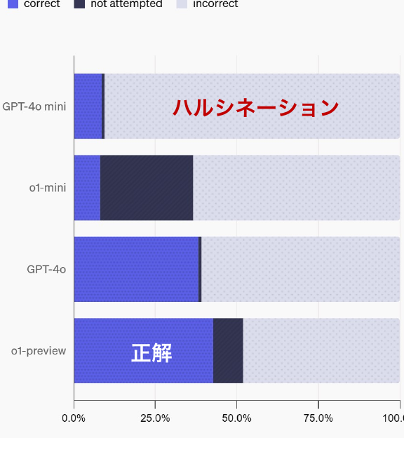

<b>SimpleQA</b>：回答の事実的正確性のベンチマーク Wei et al. (2024) Arxiv

例) Q. Who received the IEEE Frank Rosenblatt Award in 2010? 　　A. Michio Sugeno

<b>学習している知識が少ない場合の例</b>：問題を解かせたり、論文を探させた場合等、無料版である<b>AI</b>は、「分からない」ということもなく、ハルシネーション(誤情報を出す)する可能性が高い。知識のエッジ(=学習回数小)にある内容も含めてある。

<b>その他の例</b>：古い情報だった・誤った情報を学習していた／AIが考えるべきことを誤解し、なんか変だ／別の分野の文脈に引きずられていた・偏っていた／差別やバイアスが含まれていた／推論ミス、別のところを参照 etc…

<b>誤っている可能性を知り、信頼の高い情報を参照し正確性を確認　※ 相当ある</b>

<b>ハルシネーションは結構頻繁に起こる (特に無料版の場合)</b>

<!--
- SimpleQAは回答の事実的正確性のベンチマーク。知識のエッジにある内容では、無料版AIは「分からない」とも言わずハルシネーションしやすい。信頼の高い情報で確認を。
-->

---

現在の生成AIの変化 ①

# 2　使ってみる

△ 生成AIにただ聞いて回答させる

内部の学習データから回答を出す

<b>間違うことがある</b> 　例：宮崎県の観光地を教えて → ○ 　例：日本のAI基本法を教えて → ☓

○ 生成AIに、情報を与え、自分がほしい情報に変換してもらう

与えたデータから回答を出す

間違いは、だいぶ減る

<b>現在：生成AIはツール・エージェント(助手みたいなもの)になっている</b> AIの回答を確認するAI、webを検索するAIなどが繋がる

<!--
- ただ聞くと内部の学習データから答え、間違うことがある。情報を与えて変換してもらうと間違いは減る。現在の生成AIはツール・エージェントになり、AI同士が繋がる。
-->

---

AI agentの動きの例

# 2　使ってみる

<!--
- AI agentの動きの例（デモ）。
-->

---

そもそも、なんで？

# 3　背景を知る

疑問点

AIの中身は、どうなっているのだろう？ そもそもなんで、間違えるのか？ 間違えることはなくならないのか

AIを使いこなすためには、メカニズムをある程度、知る必要がある

→ AIをただ、使うだけでは、わからない！！！ 　　実際、大学でも教員にAIのメカニズムを教えることが増加

<!--
- 疑問点：AIの中身はどうなっているのか、なぜ間違えるのか、間違えることはなくならないのか。使いこなすにはメカニズムをある程度知る必要がある。
-->

---

ワーク：ハルシネーションの例

# 3　背景を知る

<b>[問題]</b> aを実数の定数とする。xについての方程式 |x² − 2x − 3| = a(x − 2) の、異なる実数解の個数を求めよ。思考プロセスをステップバイステップで詳細に記述しながら、結論を導き出してください。

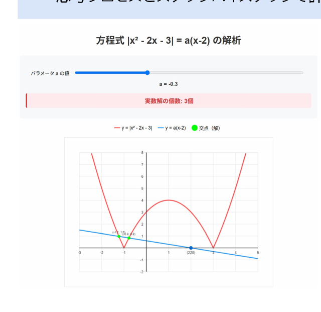

<b>AIで作成したツール</b> <a href="https://claude.ai/public/artifacts/22fda9cd-0688-4887-a74b-53867fab0945" style="font-size:19px;">https://claude.ai/public/artifacts/22fda9cd-0688-4887-a74b-53867fab0945</a>

<b>AIで回答した例</b> 若干不自然だが(記述式では減点？)、合格 <a href="https://chatgpt.com/share/684a0bd1-b198-8004-81ce-807f626ed962" style="font-size:19px;">https://chatgpt.com/share/684a0bd1-b198-8004-81ce-807f626ed962</a>

出力例：6/12

<!--
- ワーク：この方程式をAIに解かせる。AIで作成したツールと、AIで回答した例。若干不自然だが合格。出力例6/12。
-->

---

ワーク：ハルシネーションの例

# 3　背景を知る

この問題を直接貼り付けて、AIに解かせてみて下さい。

誤った回答の例

Gemini 2.5 flash

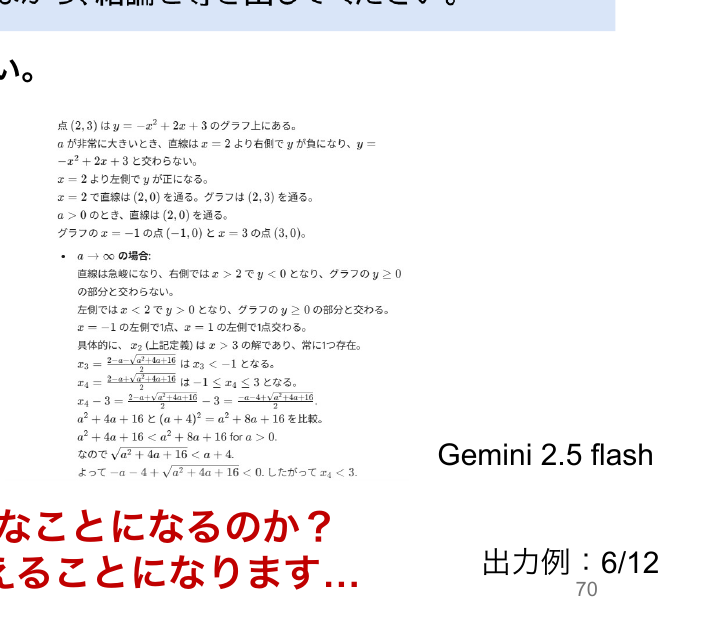

出力例：6/12

<a href="https://claude.ai/share/8e82983f-275b-427e-8ea3-aef898cd0bd7">https://claude.ai/share/8e82983f-275b-427e-8ea3-aef898cd0bd7</a>

<b>なんで、こんなトンチンカンなことになるのか？</b> <b>そのためには、機械学習を考えることになります…</b>

<!--
- この問題を直接貼り付けてAIに解かせてみる。Gemini 2.5 flashの誤った回答の例。なんでこんなトンチンカンなことになるのか。そのためには機械学習を考える。
-->

---

機会学習で、データの関係性をどう考えるか

# 3　背景を知る

<table style="border-collapse:collapse; font-size:40px; min-width:560px;">
<tr><td style="border:2px solid #2a2a2a; padding:10px 60px; text-align:center;">x</td><td style="border:2px solid #2a2a2a; padding:10px 60px; text-align:center;">f(x)</td></tr>
<tr><td style="border:2px solid #2a2a2a; padding:10px 60px; text-align:center;">1</td><td style="border:2px solid #2a2a2a; padding:10px 60px; text-align:center;">3</td></tr>
<tr><td style="border:2px solid #2a2a2a; padding:10px 60px; text-align:center;">2</td><td style="border:2px solid #2a2a2a; padding:10px 60px; text-align:center;">5</td></tr>
<tr><td style="border:2px solid #2a2a2a; padding:10px 60px; text-align:center;">3</td><td style="border:2px solid #2a2a2a; padding:10px 60px; text-align:center;">7</td></tr>
<tr><td style="border:2px solid #2a2a2a; padding:10px 60px; text-align:center;">4</td><td style="border:2px solid #2a2a2a; padding:10px 60px; text-align:center;">?</td></tr>
</table>

<!--
- ちょっと問題をだしてみましょう。正解も何もないので、頭の体操としてきいて下さい。
- f(1) = 3、f(2)= 5、f(3)=7と数が並んでいた時、f(4)はなんだと思いますか？
-->

---

機会学習で、データの関係性をどう考えるか

# 3　背景を知る

<table style="border-collapse:collapse; font-size:24px; width:100%;">
<tr><td style="border:2px solid #2a2a2a; padding:5px 18px; text-align:center;">x</td><td style="border:2px solid #2a2a2a; padding:5px 18px; text-align:center;">f(x)</td></tr>
<tr><td style="border:2px solid #2a2a2a; padding:5px 18px; text-align:center;">1</td><td style="border:2px solid #2a2a2a; padding:5px 18px; text-align:center;">3</td></tr>
<tr><td style="border:2px solid #2a2a2a; padding:5px 18px; text-align:center;">2</td><td style="border:2px solid #2a2a2a; padding:5px 18px; text-align:center;">5</td></tr>
<tr><td style="border:2px solid #2a2a2a; padding:5px 18px; text-align:center;">3</td><td style="border:2px solid #2a2a2a; padding:5px 18px; text-align:center;">7</td></tr>
<tr><td style="border:2px solid #2a2a2a; padding:5px 18px; text-align:center;">4</td><td style="border:2px solid #2a2a2a; padding:5px 18px; text-align:center;">?</td></tr>
</table>

ルールベースの世界観 (設計者が教えておく)

解析的に解くよ 等差数列っぽい？ <b style="color:var(--accent);">→ Yes</b> f(x) = 2x+1？ ならば9と予想

変換する「<b>函</b>」

機械学習の世界観 (もっとたくさん学習！)

入力されたデータからパターンをコンピュータが探索・発見 <b style="color:var(--accent);">f(x)自体は気にしない</b> 9とか11？

確率・統計的に処理／<b>正解が出てくるとは限らない</b>／<b>ブラックボックス</b>

<b>ブラックボックス内を理解する手法は開発中</b> e.g. Anthropic (2025) 　　AI顕微鏡

<b>データの関係性の捉え方が根本的に違う</b>

<!--
- ルールベースの世界に生きるAIは、解析的な解き方を教えられている。一次式を試し、f(x)=2x+1なのでx=4で9だぞ、と。高校までの数学はこういう考え方をしがち。
- 機械学習的な世界では、f(x)がどうなっているかはどうでも良い。xとf(x)の関係性を学習し次を予測するだけ。f(x)の式そのものはブラックボックスで構わない。9以外に11なども言うかもしれない。
- データの関係性について、f(x)自体のルールが人が読んでもわからない形でも、コンピューターが自ら学習した結果を予想できる、この考え方がミソ。
-->

---

箱としての、ディープラーニング

# 箱としての、ディープラーニング (深層学習)

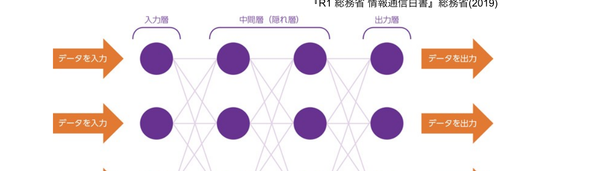

学習

入力

パラメーター の函 数字の羅列

出力↻ 更新評価

利用

入力

パラメーター の函 数字の羅列

出力

『R1 総務省 情報通信白書』総務省(2019)

<!-- ただ、このブラックボックス部分ですけど、この自体をどんな形にするか、という設計はあるわけです。 / 人工ニューラルネットワーク、その発展型である深層学習(Deep Learning)という言葉を耳にした方は多いかもしれません。今年のノーベル賞ですからね。複数のパラメータを配置することで、学習したデータとはことなるものを確率的につくることが出来るわけです。 / 意味を直接設計しようとするアプローチではなく、機械的に膨大なパラメータから意味を生成する方法の方法がいまのAIの背景にあるのです。 -->

---

箱としての、ディープラーニング

# 箱としての、ディープラーニング (深層学習)

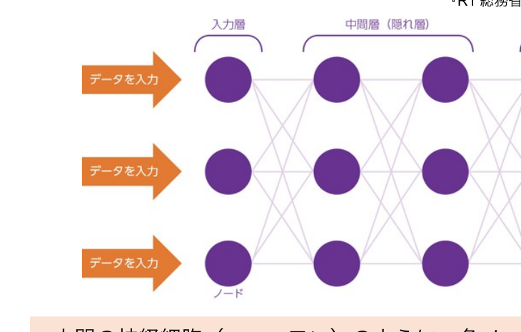

- 人間の神経細胞（ニューロン）のように、各ノードが層をなして接続されるものがニューラルネットワーク 
- 中間層（隠れ層）が複数の層となっているものを用いるものが深層学習

ノーベル賞 2024年

<b>物理学：</b>人工ニューラルネットワークによる機械学習を可能にする基礎的な発見と発明 <b>ジョン・ホップフィールド</b>　物理学者・分子生物学者 <b>ジェフリー・ヒントン</b>　生理学・哲学→実験心理学→コンピューター科学

<b>化学 (一部)：</b>タンパク質プログラムの開発 <b>デミス・ハサビス</b>　人工知能研究者、神経科学者 <b>ジョン・M・ジャンパー</b>　固体物理学→理論化学→計算生物学

<b>2012年</b>、Googleの キャットペーパー（「猫」を教えていなかったのに、写真から猫の特徴を抽出）ヒントンらによる画像認識のブレークスルー　／　<b>2016年</b>、世界トップレベルのプロ囲碁棋士に勝利 (囲碁専用ではない)

※高校生/高校教諭向けには、東大松尾研のGCIなど、無料でおすすめ　／　『R1 総務省 情報通信白書』総務省(2019)

<!-- ただ、このブラックボックス部分ですけど、この自体をどんな形にするか、という設計はあるわけです。 / 人工ニューラルネットワーク、その発展型である深層学習(Deep Learning)という言葉を耳にした方は多いかもしれません。今年のノーベル賞ですからね。複数のパラメータを配置することで、学習したデータとはことなるものを確率的につくることが出来るわけです。 -->

---

箱としての、ディープラーニング

# 言語型の大規模言語モデル (生成AIの中身) の本質

ネクストワードプレディクション

日本の首都___ →　日本の首都は___ →　日本の首都は東京___

<b>これまでのコンテキストから、次の言葉(トークン)の確率を予想する問題</b>

学習

入力 文字

パラメーター の函 数字の羅列

出力↻ 更新評価

GPT 4の場合、アメリカ議会図書館の<b>全蔵書の約22倍</b>に相当? ※書籍、記事、ウェブサイト、コードなど幅広いテキストソース

<!-- そして、生成AIの時代にきます。生成AIでよく想像されるのは、Chat GPTのような、言語を扱うAIでしょう。 / トランスフォーマーの一つである、GPTのパラメタ構造をのぞいてみましょう。 / 言葉を操る生成AIは、ネクストワードプレディクション、つまり次に出てくる言葉の予測をおこなうAIなわけですね。 -->

---

箱としての、ディープラーニング

# パラメーターの箱(函)としての、ディープラーニング (深層学習)

LLM Visualization

cf. NVIDIA “Mythbusters Demo GPU versus CPU”

<!-- トランスフォーマーの一つである、GPTのパラメタ構造をのぞいてみましょう。 / ここでは「nano-gpt」という非常に小さなモデルを使って、モデルの仕組みを探っていきます。 / 緑のセルは現在処理されている数値を、青のセルは重みを表しています。 -->

---

<!-- _class: divider -->

千葉大で使える生成AI

# 千葉大で使える生成AI

<!-- 人間のニーズ、能力、制約を最優先に考慮する -->

---

ワーク：AIを使ってみる

# ワーク：AIを使ってみる

<b>Step 1)　Gemini か、MS copilot</b>など、<b>学校で使われているAI</b>を開いて下さい。

<b>Step 2)　以下のプロンプトをそれぞれ流してみて下さい。</b>

生成AIとはなにか、説明して下さい。 
(わかりにくい場合)　わかりにくいので、高校生にも分かるよう、説明して下さい 
わかりにくいので、3文で説明して下さい

<b>Step 3)　意図的にハルシネーションさせてみましょう (例)</b>

千葉大の学長の先生は誰ですか？ 
地球の核に水はどのくらいありますか 
5 cmの綿に、10 cmのレンがを乗せると、高さ何cm?

※余裕がある場合、「自信なかったら答えないように」頼んだ質問もやってみて下さい。

---

ワーク：AIを使ってみる

# ワーク：AIを使ってみる

<b>Step 4)　YouTubeまたはPDFを開き、動画の書き起こしを開き、コピー、AIに日本語で要約させて下さい。</b>

例：https://www.youtube.com/watch?v=6dHmu1GALmA

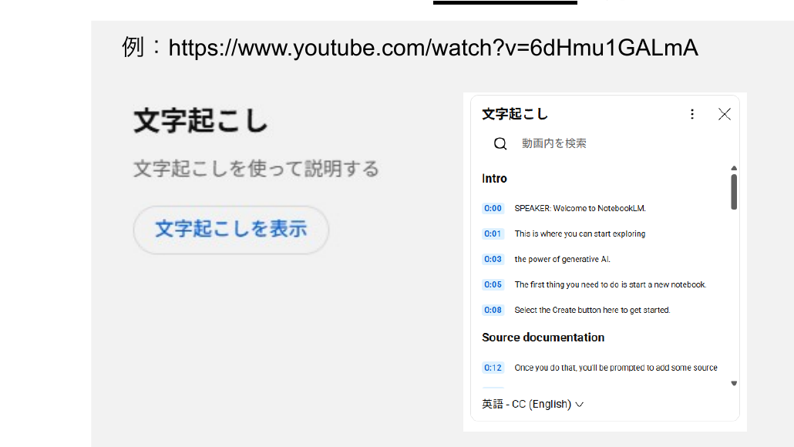

→AIにコピペ

“以下は、動画の書き起こしを添付したものです。その内容を200文字で要約して下さい”

---

ワーク：AIを使ってみる

# ワーク：AIを使ってみる

<b>Step 5)　与えた情報(コンテキスト)内を情報を検索してみましょう</b>

“与えた情報によれば、Notebook LMでは、どのようなファイルを使えるんですか”

<b>Step 6)　議論のパートナーにする</b>

“私は科目〇〇の高校の先生です。NotebookLMは、自分の担当する科目でどう使えそうですか？”

<b>Step 7) 理解を確かめる</b>

“与えた情報から、Notebook LMを自分が理解したかを確かめる、三択問題を2問、この動画から作成して下さい。”

<b>Step 8) 情報検索をしてみる</b>

“Notebook LMは、高校生でもつかえるんですか?”

---

Audience Q&A

<svg width="180" height="160" viewBox="0 0 180 160" xmlns="http://www.w3.org/2000/svg">
<rect x="42" y="14" width="118" height="6" rx="3" fill="var(--accent)"/>
<path d="M40 18 q-8 0 -8 8 v34" stroke="var(--accent)" stroke-width="6" fill="none" stroke-linecap="round"/>
<rect x="44" y="44" width="118" height="86" rx="16" fill="#fff" stroke="var(--accent)" stroke-width="7"/>
<path d="M70 130 v22 l26 -22 z" fill="#fff" stroke="var(--accent)" stroke-width="7" stroke-linejoin="round"/>
<circle cx="80" cy="87" r="9" fill="var(--accent)"/>
<circle cx="106" cy="87" r="9" fill="var(--accent)"/>
<circle cx="132" cy="87" r="9" fill="var(--accent)"/>
</svg>

Audience Q&amp;A

<!-- 📣 This is Slido interaction slide, please don't delete it. ✅ Click on 'Present with Slido' and the questions from your audience will appear when you get to this slide. -->

---

<svg width="150" height="170" viewBox="0 0 150 170" xmlns="http://www.w3.org/2000/svg">
<rect x="20" y="14" width="110" height="142" rx="16" fill="#EAF2FB" stroke="var(--tag-blue)" stroke-width="7"/>
<path d="M40 56 l12 12 l22 -24" stroke="var(--tag-blue)" stroke-width="7" fill="none" stroke-linecap="round" stroke-linejoin="round"/>
<rect x="84" y="58" width="30" height="8" rx="4" fill="var(--tag-blue)"/>
<circle cx="51" cy="116" r="13" fill="none" stroke="var(--tag-blue)" stroke-width="7"/>
<rect x="84" y="112" width="30" height="8" rx="4" fill="var(--tag-blue)"/>
</svg>

AIの説明はわかりやすくなりましたか？

<!-- The Slido app must be installed on every computer you're presenting from -->

---

<svg width="170" height="150" viewBox="0 0 170 150" xmlns="http://www.w3.org/2000/svg">
<rect x="18" y="18" width="134" height="92" rx="18" fill="#fff" stroke="#0F766E" stroke-width="7"/>
<path d="M52 110 v24 l28 -24 z" fill="#fff" stroke="#0F766E" stroke-width="7" stroke-linejoin="round"/>
<rect x="42" y="50" width="86" height="8" rx="4" fill="#0F766E"/>
<rect x="42" y="72" width="58" height="8" rx="4" fill="#0F766E"/>
</svg>

ハルシネーションはどんな問でおきましたか。

<!-- The Slido app must be installed on every computer you're presenting from -->

---

<!-- _class: summary -->

まとめ

# まとめ

<b>大規模言語モデル = 数字の箱</b>　<b>→　ルールの箱や、データの箱ではないことに注意</b>

ネクストワードプレディクション

日本の首都___ →　日本の首都は___ →　日本の首都は東京

これまでのコンテキストから、次の言葉(トークン)<b style="color:var(--accent);">の生成確率</b>を予想する問題

<b>生成AIは、LLMを有用化した一連のパッケージ</b>

<b>確率的に考えるモデルなので、ハルシネーションはなくならない</b> しかし、工夫により問題は減り、<b style="color:var(--accent);">有用性が向上</b>しつつある

<!-- 言葉を操る生成AIは、ネクストワードプレディクション、つまり次に出てくる言葉の予測をおこなうAIなわけですね。 -->

---

<!-- _class: cover-hero -->

<svg viewBox="0 0 120 120" style="width:130px; height:auto; flex:0 0 auto;" xmlns="http://www.w3.org/2000/svg"><path d="M14 18 h92 a8 8 0 0 1 8 8 v54 a8 8 0 0 1 -8 8 H46 l-18 18 v-18 H14 a8 8 0 0 1 -8 -8 V26 a8 8 0 0 1 8 -8 z" fill="none" stroke="#15706a" stroke-width="7" stroke-linejoin="round"/><line x1="30" y1="44" x2="78" y2="44" stroke="#15706a" stroke-width="7" stroke-linecap="round"/><line x1="30" y1="62" x2="62" y2="62" stroke="#15706a" stroke-width="7" stroke-linecap="round"/></svg>

AIに関して生徒から、 言われて困ったことありますか？

ⓘ The Slido app must be installed on every computer you're presenting from　<b style="margin-left:auto; font-size:30px;">slido</b>

<!-- AIに関して生徒から、言われて困ったことありますか？ slidoで皆さんに伺ってみましょう。 -->

---

問題の解説を考えましょう

6 教育活用 ｜ 実際の教育活用の技を体験する

# 問題の解説を考えましょう

<b>⑤</b> 学生は、どんな誤答をしがちか、聞いてみましょう。

その理由はなにか、表形式でまとめるよう、AIに聞いてみて下さい。

<b>⑥</b> 類題を作ってみましょう。問題の形式、回答の有無、難易度などは、指定しましょう

<!-- 問題の解説を考える続きです。学生がどんな誤答をしがちか、その理由を表形式でまとめてもらう。さらに類題を作ってもらう、というワークです。 -->

---

ルーブリック

6 教育活用 ｜ 評価のための補足

# ルーブリック　参照

<b>✔</b> 採点道具の一つで、課題を構成要素に分け、<b>要素ごとに評価基準を満たすレベル</b>を説明した表 
<b>✔</b> パフォーマンス課題・レポート・実技等の評価の可視化

「<b style="color:var(--accent-dark);">課題内容</b>：6分模擬授業」を評価するためのルーブリック

<table style="width:100%; border-collapse:collapse; font-size:21px;">
<tr>
<th style="background:var(--accent); color:#fff; padding:7px 10px; border:1px solid #fff;">評価観点</th>
<th style="background:var(--section-bg); padding:7px 10px; border:1px solid #fff;">素晴らしい(2)</th>
<th style="background:var(--section-bg); padding:7px 10px; border:1px solid #fff;">合格(1)</th>
<th style="background:var(--section-bg); padding:7px 10px; border:1px solid #fff;">不十分(0)</th>
</tr>
<tr>
<td style="background:var(--accent-soft); font-weight:800; padding:7px 10px; border:1px solid #fff;">分量</td>
<td style="padding:7px 10px; border:1px solid #fff;"></td>
<td style="padding:7px 10px; border:1px solid #fff;">6分間で丁度</td>
<td style="padding:7px 10px; border:1px solid #fff;">過剰か少ない</td>
</tr>
<tr>
<td style="background:var(--accent-soft); font-weight:800; padding:7px 10px; border:1px solid #fff;">目標</td>
<td style="padding:7px 10px; border:1px solid #fff;">明確かつ内容が一致していた</td>
<td style="padding:7px 10px; border:1px solid #fff;">明確さか内容の何れかに改善点</td>
<td style="padding:7px 10px; border:1px solid #fff;">明確さ・内容の何れも不十分</td>
</tr>
<tr>
<td style="background:var(--accent-soft); font-weight:800; padding:7px 10px; border:1px solid #fff;">レベル設定</td>
<td style="padding:7px 10px; border:1px solid #fff;">手を伸ばせば届くレベルだった</td>
<td style="padding:7px 10px; border:1px solid #fff;">一部高度・容易な箇所があった</td>
<td style="padding:7px 10px; border:1px solid #fff;">極端に高度・容易であった</td>
</tr>
</table>

評価 尺度

評価 基準

ルーブリックにより、安定・充実した評価が可能に → <b>AIは上手</b>

栗田 &amp; 中村（2024）『インタラクティブ・ティーチング 実践編３』／ スティーブンス＆レビ (2014)

<!-- 評価の補足として、ルーブリックを紹介します。課題を構成要素に分け、要素ごとに評価基準を満たすレベルを説明した表です。ルーブリックを作るのはAIが上手です。 -->

---

問題の解説を考えましょう

6 教育活用 ｜ 実際の教育活用の技を体験する

# 問題の解説を考えましょう

<b>⑦</b> 問題が記述式の場合、

採点する際のルーブリックと採点基準について、作ってもらいましょう。(ルーブリックの場合、観点数と尺度数も与える)

<b>⑧</b> (有料版の場合　※デモ)

それを体験してもらうツール・コードを作りましょう

<!-- 記述式の問題なら、採点用のルーブリックと採点基準を作ってもらいましょう。有料版なら、体験用のツールやコードを作ることもできます。後ほどデモします。 -->

---

千葉大学における生成AIの指針

7 AIとの関わり方 ｜ AIは「教える」のどこに影響するか

# 千葉大学における生成AIの指針 (令和５年１０月１３日)

「生成 AI についての学び」「生成 AI を用いた学び」「生成 AI によらない学び」を<b>それぞれ推進</b>

<b>①</b> 授業での利用は、授業の目的に合致することが前提であり、合致するかは、各授業の担当教員が<b>判断</b>

<b>禁止の場合はシラバスなどに明記</b> <b>(気になったら先生に聞くことの徹底)</b>

<b>②</b> <b>授業・課題レベル</b>のコントロール

① 使って良いとき、使ってはいけないときを示す ② AIを使わずに、学ぶ価値を示す

<!-- 千葉大学の生成AIの指針です。「についての学び」「を用いた学び」「によらない学び」をそれぞれ推進する、というものです。利用可否は各授業の担当教員が判断します。 -->

---

学習目標分類

7 AIとの関わり方 ｜ 学習目標から考えるAIの影響

# 学習目標分類から考えるAIの影響

<table style="border-collapse:collapse; font-size:19px; flex:1.4;">
<tr>
<th style="background:#fff; border:1px solid #ddd; padding:5px 6px;"></th>
<th style="background:var(--accent); color:#fff; border:1px solid #fff; padding:5px 8px;">認知的領域 (知識や思考)</th>
<th style="background:var(--tag-green); color:#fff; border:1px solid #fff; padding:5px 8px;">学びへの生成AIの影響</th>
</tr>
<tr>
<td style="background:#fff; border:1px solid #ddd; padding:5px 6px; font-weight:800; color:#666;">高次</td>
<td style="background:var(--accent-soft); border:1px solid #fff; padding:5px 8px;"><b>創造</b> (学習を応用し、新しい価値を作れる)</td>
<td style="border:1px solid #fff; padding:5px 8px;">人の創造性こそが大切</td>
</tr>
<tr>
<td style="background:#fff; border:1px solid #ddd; padding:5px 6px;"></td>
<td style="background:var(--accent-soft); border:1px solid #fff; padding:5px 8px;"><b>評価</b> (事物・判断等を比較し評価出来る)</td>
<td style="border:1px solid #fff; padding:5px 8px;">評価軸/価値/判断は人が設定する</td>
</tr>
<tr>
<td style="background:#fff; border:1px solid #ddd; padding:5px 6px;"></td>
<td style="background:var(--accent-soft); border:1px solid #fff; padding:5px 8px;"><b>分析</b> (要素に分け、関係性を指摘できる)</td>
<td style="border:1px solid #fff; padding:5px 8px;">解答/過程の支援可(例：要約・構造化・コーディング)</td>
</tr>
<tr>
<td style="background:#fff; border:1px solid #ddd; padding:5px 6px;"></td>
<td style="background:var(--accent-soft); border:1px solid #fff; padding:5px 8px;"><b>応用</b> (他の場面や状況に使用できる)</td>
<td style="border:1px solid #fff; padding:5px 8px;">単なる問題では、AIが解いてしまう…</td>
</tr>
<tr>
<td style="background:#fff; border:1px solid #ddd; padding:5px 6px;"></td>
<td style="background:var(--accent-soft); border:1px solid #fff; padding:5px 8px;"><b>理解</b> (学習内容を説明出来る)</td>
<td style="border:1px solid #fff; padding:5px 8px;">説明/例示で支援可能 だが学修者の理解必須</td>
</tr>
<tr>
<td style="background:#fff; border:1px solid #ddd; padding:5px 6px; font-weight:800; color:#666;">低次</td>
<td style="background:var(--accent-soft); border:1px solid #fff; padding:5px 8px;"><b>記憶</b> (事実や概念を暗記している)</td>
<td style="border:1px solid #fff; padding:5px 8px;">支援可能だが、学修者の記憶必須</td>
</tr>
</table>

※近年では、下から個別・段階的に行うのではなく、<b>複数の次元の要素を組み合わせる</b>必要性が叫ばれている。 ※近年では、学び方の学びや、人間性の涵養などを含む、学習目標分類も作成されている (e.g. Finkの学習目標分類) ※但し、<b>低次(特に記憶・理解・応用の段階)を蔑ろにして、高次の学修目標の達成は難しい</b>と想定される。

<b>AI が答えを出せるとしても、途中を学ぶことは引き続き必要では？</b>

左は栗田&amp;中村 (2023)を元に作成 / 原著 Bloom (1956/1964)、改訂版(2001)を記載　▶解説動画 (9分)

<!-- 学習目標分類、ブルームのタキソノミーから、AIの影響を考えます。記憶や理解といった低次から、創造や評価といった高次まで段階があります。AIが答えを出せても、途中を学ぶことは引き続き必要ではないでしょうか。 -->

---

学び方は変わる？

7 AIとの関わり方 ｜ 学び方は変わる？

# 学び方は変わる？

14世紀 @ ドイツ

Laurentius de Voltolina

現在？

Generated by DALL-E

<b>社会</b>も、<b>科学技術</b>も、<b>教育理論</b>も進歩 でも、<b>授業は同じまま</b>？

<table style="border-collapse:collapse; font-size:20px; width:100%;">
<tr><th style="background:#fff; border:1px solid #ddd; padding:4px 6px;"></th><th style="background:var(--accent); color:#fff; border:1px solid #fff; padding:4px 8px;">認知的領域</th></tr>
<tr><td style="border:1px solid #ddd; padding:4px 6px; font-weight:800; color:#666;">高</td><td style="background:var(--accent-soft); border:1px solid #fff; padding:4px 10px;">創造</td></tr>
<tr><td style="border:1px solid #ddd; padding:4px 6px;"></td><td style="background:var(--accent-soft); border:1px solid #fff; padding:4px 10px;">評価</td></tr>
<tr><td style="border:1px solid #ddd; padding:4px 6px;"></td><td style="background:var(--accent-soft); border:1px solid #fff; padding:4px 10px;">分析</td></tr>
<tr><td style="border:1px solid #ddd; padding:4px 6px;"></td><td style="background:var(--accent-soft); border:1px solid #fff; padding:4px 10px;">応用</td></tr>
<tr><td style="border:1px solid #ddd; padding:4px 6px;"></td><td style="background:var(--accent-soft); border:1px solid #fff; padding:4px 10px;">理解</td></tr>
<tr><td style="border:1px solid #ddd; padding:4px 6px; font-weight:800; color:#666;">低</td><td style="background:var(--accent-soft); border:1px solid #fff; padding:4px 10px;">記憶</td></tr>
</table>

<b>座学の講義で理解を促すだけ</b>では、到達出来たり、授業中に試せたりする<b>目標の範囲が狭くなりがち</b>。そこで、<b>課題中心や実験中心など、「起こりそうな問題」や「実験」を設計の軸にする</b>ことで、より深く学べるようになるのでは？

<!-- 学び方は変わるのか。14世紀ドイツの講義風景と、現在の授業。社会も科学技術も教育理論も進歩したのに、授業の形は同じままでよいのでしょうか。座学だけでなく、課題中心や実験中心の設計で、より深く学べるのではないか、という問いです。 -->

---

学び方は変わる？

7 AIとの関わり方 ｜ 学び方は変わる？

積み上げて受動的に学ぶ

：学校的学び方

<svg viewBox="0 0 320 200" style="width:100%; height:auto;" xmlns="http://www.w3.org/2000/svg"><polyline points="20,180 110,180 110,130 200,130 200,70 300,70" fill="none" stroke="#7a3b1d" stroke-width="3"/><circle cx="150" cy="112" r="13" fill="#fff" stroke="#bbb" stroke-width="1.5"/><rect x="142" y="124" width="16" height="26" rx="6" fill="#fff" stroke="#bbb" stroke-width="1.5"/><text x="178" y="118" font-size="26" font-weight="800" fill="#222">?</text></svg>

どこかで頭打ちする

最終到達点から探究的に学ぶ

：職人的/芸術家的学び方？

<svg viewBox="0 0 320 200" style="width:100%; height:auto;" xmlns="http://www.w3.org/2000/svg"><polyline points="20,180 110,180 110,130 200,130 200,70 300,70" fill="none" stroke="#7a3b1d" stroke-width="3"/><circle cx="250" cy="52" r="13" fill="#fff" stroke="#bbb" stroke-width="1.5"/><rect x="242" y="64" width="16" height="26" rx="6" fill="#fff" stroke="#bbb" stroke-width="1.5"/><text x="224" y="46" font-size="26" font-weight="800" fill="#222">!</text></svg>

高みから中間地点を学ぶ

<b>「なぜ学ぶのか、どのように学ぶのか、何を学ぶのか」</b>の変質

まずは、自分から、学び方を変えてみよう▶できないかな、と思ったら<b>使ってみる</b>

<!-- 学び方の二つのモデルです。積み上げて受動的に学ぶ学校的な学び方は、どこかで頭打ちします。一方、最終到達点から探究的に学ぶ、職人的・芸術家的な学び方もあります。まずは自分から学び方を変えてみましょう。 -->

---

(参考) AIリテラシ OECD (2023)

7 AIとの関わり方

# (参考) AIリテラシ　OECD (2023)

AIの技術面を批判的に評価し、AIを効果的に活用できる能力 (communicate and collaborate)

第１：AIの基本的な機能と日常生活におけるAIの使用方法に関する知識 
第２：様々な場面に応用することのできる能力 
第３：AIを実装し、評価することができる能力 
第４：アルゴリズムの開発に必要なデータを管理する能力とAIの出力結果を批判的に考察する能力

<b>AIを理解し、活用し、監視し、批判的に考察できるスキル</b>

各国でリスキリング/学校教育への取り込みが行われている

内閣府(2024) 世界経済の潮流 ＞第1章＞p.32

<!-- 参考として、OECDが2023年に示したAIリテラシです。AIの技術面を批判的に評価し、効果的に活用できる能力。第1から第4までの段階があり、各国でリスキリングや学校教育への取り込みが進んでいます。 -->

---

共同知能 Co-Intelligence

7 AIとの関わり方 ｜ AIとどうか変わるかの例

# 共同知能 Co-Intelligence

<b>AIは人と異なる知能</b>である。「<b>異星人の心</b>」でありいくら人間っぽくても、性質が違う。例えば、、、

AI

<b>たくさん考えるのは得意！</b>

→ AIをアイデア出し・ブレインストーミングにつかってはどうか ※自分がすることや「なぜ」をAIに聞くのは筋が悪い

人

<b>一番本質を見抜くのが得意！</b>

言葉にするのは得意！ニュアンスさえも。 <b>感覚的にわかる！</b>なぜか間違わない。 → AIが持っていない、タイプの知がある？

『これからのAI、正しい付き合い方と使い方』 (2024) Mollick著、久保田訳

<!-- AIとどう変わるかの例として、共同知能、Co-Intelligenceという考え方です。AIは人と異なる知能であり、「異星人の心」とも言われます。AIはたくさん考えるのが得意。人は本質を見抜くのが得意。役割を分けて協働する発想です。 -->

---

共同知能 Co-Intelligence

7 AIとの関わり方 ｜ AIとどうか変わるかの例

# 共同知能 Co-Intelligence

<b>AIは人と異なる知能</b>である。「<b>異星人の心</b>」でありいくら人間っぽくても、性質が違う。

共同知能についての4つのルール

AIを参加させる。

人間参加型のデザインにする。

AIにペルソナを与える。

今使っているAIは、今後使用するどのAIよりも劣悪と仮定する。

<b>+ でてきた情報を、批判的に考える</b> <b>+ 先生は学びの文脈をAIに与えてみる</b> <b>+ マイルールを作って行くことが大切</b>

『これからのAI、正しい付き合い方と使い方』 (2024) Mollick著、久保田訳

<!-- 共同知能についての4つのルールです。AIを参加させる、人間参加型のデザインにする、AIにペルソナを与える、今のAIは今後のどのAIよりも劣悪と仮定する。これらを踏まえ、出てきた情報は批判的に考え、自分なりのマイルールを作っていくことが大切です。 -->

---

<!-- _class: cover-hero -->

<svg viewBox="0 0 120 120" style="width:130px; height:auto; flex:0 0 auto;" xmlns="http://www.w3.org/2000/svg"><path d="M14 18 h92 a8 8 0 0 1 8 8 v54 a8 8 0 0 1 -8 8 H46 l-18 18 v-18 H14 a8 8 0 0 1 -8 -8 V26 a8 8 0 0 1 8 -8 z" fill="none" stroke="#15706a" stroke-width="7" stroke-linejoin="round"/><line x1="30" y1="44" x2="78" y2="44" stroke="#15706a" stroke-width="7" stroke-linecap="round"/><line x1="30" y1="62" x2="62" y2="62" stroke="#15706a" stroke-width="7" stroke-linecap="round"/></svg>

高校の教育でAIと どのように関わっていきたいですか

ⓘ The Slido app must be installed on every computer you're presenting from　<b style="margin-left:auto; font-size:30px;">slido</b>

<!-- 最後に、高校の教育でAIとどのように関わっていきたいか、slidoで皆さんのお考えを伺います。 -->

---

<!-- _class: divider -->

<svg viewBox="0 0 120 130" style="width:150px;height:auto;" xmlns="http://www.w3.org/2000/svg"><rect x="14" y="16" width="92" height="104" rx="14" fill="#EAF2FB" stroke="#1A4E8A" stroke-width="7"/><path d="M34 46 l9 9 16 -18" fill="none" stroke="#1A4E8A" stroke-width="7" stroke-linecap="round" stroke-linejoin="round"/><line x1="72" y1="46" x2="92" y2="46" stroke="#1A4E8A" stroke-width="7" stroke-linecap="round"/><circle cx="40" cy="84" r="10" fill="none" stroke="#1A4E8A" stroke-width="7"/><line x1="72" y1="84" x2="92" y2="84" stroke="#1A4E8A" stroke-width="7" stroke-linecap="round"/></svg>

<h1 style="font-size:60px; margin:0;">満足度を教えて下さい</h1>

ⓘ The <u>Slido app</u> must be installed on every computer you're presenting from
slido

<!-- ここで slido を使って、受講者の満足度を聞きます。 -->

---

<!-- _class: divider -->

<svg viewBox="0 0 140 130" style="width:160px;height:auto;" xmlns="http://www.w3.org/2000/svg"><path d="M40 20 h60 a16 16 0 0 1 16 16 v34 a16 16 0 0 1 -16 16 h-2" fill="none" stroke="#B0202F" stroke-width="7" stroke-linecap="round"/><rect x="20" y="40" width="80" height="58" rx="14" fill="#FBEAEC" stroke="#B0202F" stroke-width="7"/><path d="M40 98 l0 16 16 -16" fill="#FBEAEC" stroke="#B0202F" stroke-width="7" stroke-linejoin="round" stroke-linecap="round"/><circle cx="44" cy="69" r="5.5" fill="#B0202F"/><circle cx="60" cy="69" r="5.5" fill="#B0202F"/><circle cx="76" cy="69" r="5.5" fill="#B0202F"/></svg>

<h1 style="font-size:64px; margin:0;">Audience Q&amp;A</h1>

ⓘ The <u>Slido app</u> must be installed on every computer you're presenting from
slido

<!-- 質疑応答の時間です。slido で質問を受け付けます。 -->

---

今日の目的

まとめ

1.イントロ / <b>職場が持つAIの印象を知る</b>

2.<b>AIを実際に使ってみる</b>

3.<b>AIの背景にある考え方</b>を知る

4.<b>教育利用上の注意点</b>を知る

5.<b>活用例で、</b>体験する

6.<b>教育応用を考えてみる</b>

7.教育応用のアイデアを共有し、AIをどう使うか考える

<!-- 今日の目的を、もう一度振り返ります。 -->

---

<!-- _class: divider -->

おわり

<h1 style="font-size:58px; line-height:1.25; margin:18px 0 0;">ご清聴いただき、 ありがとうございました</h1>

AIの影響は避けられないと思います。 
ならば、もっと生徒のためになる方向へ、 
きっと活用する道があると思います。  
「定時制だからこそできる学び」に「AI」を足すと、 
面白い事ができるはずです！ 
ともに、良い教育を作るべく、一緒に進んでいきましょう。

<!-- ご清聴ありがとうございました。ともに良い教育を作っていきましょう。 -->

---

課題での注意点

すぐにできること 課題における記載例 (Bowen &amp; Watson, AAC&amp;U 2024)

<b>事前に授業における生成AI利用のポリシーを共有する</b>

<ul style="margin:0 0 0 1.1em; padding:0; line-height:1.6;">
<li>AI の使用が許可または禁止されるのはいつか？なぜか？</li>
<li>AI とのブレインストーミングはカンニングにあたるのか？</li>
<li>AI がこのクラスで学習をどのように強化または妨げる可能性があるのか？</li>
<li>AI が許可されている場合、学生は課題提出の一環として AI プロンプトを共有する必要があるのか？</li>
<li>AI の使用はどのようにクレジットされるべきか？</li>
<li>AI の限界に関する警告</li>
<li>AI 検出ツールの使用計画とその情報の使用方法に関する説明</li>
</ul>

<!-- メタな点：①ルーブリックでの採点やフィードバック支援はAIが可能になった -->

---

課題での注意点

すぐにできること 参考：課題における記載例 (Bowen &amp; Watson, AAC&amp;U 2024)

<b>事前に授業における生成AI利用のポリシーの例</b>

このライティングコースの目標の一つは、効果的に書き、コミュニケーションをとる方法を学ぶことだ。これは練習が必要である。AIを使って迅速に生産することも期待されるが、<b>そもそも質の高い文章を自分で作成、編集し、認識する能力も必要</b>である。AIが自分を介さずに作業を行うことができる場合、それは雇用されるに値するスキルを持っていない、いうことになる。だから、練習しよう。

それを達成するために、コースの前半では、AIのサポートは一切禁止する。この過程の苦労やもどかしさは、レベル上げ訓練のようなものと捉えてほしい。自分で作業を行う人が利益を得るのだ。

一方、コースの後半では、特定の状況下でAIを使用することが許可される場合がある。AIの使用を認める必要がある。使用したプロンプトとその応答を提出するよう求める場合がある。

AIリテラシーは重要な新しいスキルだ。Aiは「幻覚：事実のように見えるものを生成する可能性」があることに注意が必要である。この技術の利点と潜在的な危険性の両方について批判的に考える必要がある。

あなたは依然として最終的な成果物およびAIからの制限やバイアスの可能性について責任を負う。このポリシーは必要に応じて変更する権利を留保する。

<!-- メタな点：①ルーブリックでの採点やフィードバック支援はAIが可能になった -->

---

ツール (海外：教員支援)

1 イントロ

<table style="width:100%; border-collapse:collapse; font-size:16px; line-height:1.4; margin-top:6px;">
<thead>
<tr style="background:var(--accent); color:#fff;">
<th style="padding:6px 8px; text-align:left; width:13%;">Application</th>
<th style="padding:6px 8px; text-align:left; width:12%;">ユーザー数</th>
<th style="padding:6px 8px; text-align:left; width:11%;">地域</th>
<th style="padding:6px 8px; text-align:left; width:32%;">Key Features</th>
<th style="padding:6px 8px; text-align:left; width:32%;">Strengths</th>
</tr>
</thead>
<tbody>
<tr style="border-bottom:1px solid #d9e0ea;">
<td style="padding:6px 8px; vertical-align:top;"><b>Khamigo</b></td>
<td style="padding:6px 8px; vertical-align:top;">1億6000万人以上 (含む学習者・保護者)</td>
<td style="padding:6px 8px; vertical-align:top;">Global (USA-based)</td>
<td style="padding:6px 8px; vertical-align:top;">Khan Academyが開発したAI搭載の学習支援ツール。学生向けのパーソナルチューターと教師向けのアシスタント機能を提供。米国内は、MSの投資により無料。日本からは接続不可。</td>
<td style="padding:6px 8px; vertical-align:top;">For 教員：多言語の保護者向けメール、授業計画作成、評価基準、授業内活動、正解付き問題集など、様々な教材の素早い草案作成をサポート　For 学生：通常のAIとは異なり、単に答えを提供するのではなく、チューターとして学生が問題を自分で解決できるよう批判的思考を促進</td>
</tr>
<tr style="border-bottom:1px solid #d9e0ea; background:var(--section-bg);">
<td style="padding:6px 8px; vertical-align:top;"><b>MagicSchool.ai</b></td>
<td style="padding:6px 8px; vertical-align:top;">~500万人 magicschool.ai</td>
<td style="padding:6px 8px; vertical-align:top;">Global (USA-based)</td>
<td style="padding:6px 8px; vertical-align:top;">教育者向けAIアシスタントプラットフォーム。授業計画、個別教育プログラム（IEP）、学習活動、評価などを生成。100種類以上のコンテンツテンプレートを提供し、15言語以上をサポート。</td>
<td style="padding:6px 8px; vertical-align:top;">教師の計画作業と事務作業の時間を節約し、バーンアウト対策に貢献。160地域以上（ほぼすべての米国学区）で採用。プライバシー重視。</td>
</tr>
<tr style="border-bottom:1px solid #d9e0ea;">
<td style="padding:6px 8px; vertical-align:top;"><b>Eduaide.ai</b></td>
<td style="padding:6px 8px; vertical-align:top;">N/A (thousands of users, 2023)</td>
<td style="padding:6px 8px; vertical-align:top;">Global (USA-based)</td>
<td style="padding:6px 8px; vertical-align:top;">教師向けオールインワンAIワークスペース。教材用コンテンツジェネレーター、IEP計画やメール作成の「ティーチングアシスタント」、学生作品へのフィードバックボット、自由形式のAIチャット、クイズ/評価ビルダーを提供。</td>
<td style="padding:6px 8px; vertical-align:top;">100種類以上のリソースタイプが利用可能で多目的。生成されたコンテンツを15言語以上に即時翻訳。指導の差別化をサポート（例：調整案の提案）。</td>
</tr>
<tr style="border-bottom:1px solid #d9e0ea; background:var(--section-bg);">
<td style="padding:6px 8px; vertical-align:top;"><b>Curipod</b></td>
<td style="padding:6px 8px; vertical-align:top;">150,000+ teachers (2023) reachcapital.com</td>
<td style="padding:6px 8px; vertical-align:top;">Global (Norway)</td>
<td style="padding:6px 8px; vertical-align:top;">生成系AIを組み込んだインタラクティブな授業作成プラットフォーム。教師がトピックを入力すると、投票、ワードクラウド、クイズ、ディスカッションプロンプトを含む授業スライドを生成。記述回答に対するAIベースの個別フィードバックを提供。</td>
<td style="padding:6px 8px; vertical-align:top;">インタラクティブでゲーム化されたコンテンツで学生の参加を促進。AIコンテンツを教師が確認しながら、授業準備時間を大幅に削減。2023年後半までに24万の授業が作成され、100万人の学生に到達。教師向け無料AIトレーニング（認定プログラム）を提供。</td>
</tr>
<tr>
<td style="padding:6px 8px; vertical-align:top;"><b>Education Copilot</b></td>
<td style="padding:6px 8px; vertical-align:top;">N/A (new in 2023)</td>
<td style="padding:6px 8px; vertical-align:top;">Global (UK-based)</td>
<td style="padding:6px 8px; vertical-align:top;">教育者・トレーナー向けオールインワンAIプラットフォーム。授業計画の生成とリソース作成を自動化。出席確認や採点などの管理タスクを処理する仮想教育アシスタントを提供し、授業計画中にリアルタイムの提案を行う。</td>
<td style="padding:6px 8px; vertical-align:top;">指導と管理業務の両方を効率化し、準備時間を節約して教室管理を容易に。カスタマイズとコンテンツ編集のためのユーザーフレンドリーなインターフェースを提供。インタラクティブな学生参加（即時フィードバック、学生コラボレーション機能など）をサポート。</td>
</tr>
</tbody>
</table>

<!-- 海外では、教員を支援する多くのAIツールが登場しています。Khanmigo、MagicSchool.ai、Eduaide.ai、Curipod、Education Copilotなどが代表的です。 -->

---

ツール (海外：教員支援)

1 イントロ トレンド

英国では2023年11月にかけて、<b>初等中等のAI利用教員の割合が17%から42%に上昇</b> cf. Among online UK youths aged 16-24, 74% have used a GenAI tool.

米国でも2024年秋までに<b>約43%の教員がAI研修を受ける</b>ように

トレンド

<b>教師の業務効率化</b>

<ul style="margin:0 0 8px 1.05em; font-size:20px; line-height:1.4;">
<li>授業計画の作成、教材リソース開発、採点、管理業務の自動化</li>
<li>事務作業時間の削減により、より学生に集中できる環境作り</li>
<li>多言語対応を含む多様なコンテンツテンプレートの提供</li>
</ul>

<b>パーソナライズされた学習支援</b>

<ul style="margin:0 0 0 1.05em; font-size:20px; line-height:1.4;">
<li>学生の進捗データ分析と指導法の提案</li>
<li>適応型学習コンテンツの提供</li>
<li>学生の個別フィードバック生成</li>
</ul>

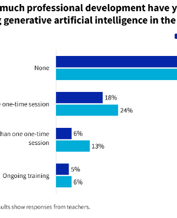

n = 1135, EdWeek Research Center survey, 2024 https://www.ai-in-education.co.uk/news-events/dfe-generative-ai-in-education-report https://www.edweek.org/technology/were-at-a-disadvantage-and-other-teacher-sentiments-on-ai/2024/10

<!-- 英国では教員のAI利用が急増し、米国でも約43%の教員がAI研修を受けるようになりました。業務効率化とパーソナライズ学習支援がトレンドです。 -->

---

ツール (海外：教員養成・PD)

1 イントロ トレンド

<b>AIコーチングとメンタリング</b>：教師のリフレクション（自己省察）を促すシステム ／ シミュレーションの提供 ／ 人間のメンターを補完、専門家の意見をスケールする

<table style="width:100%; border-collapse:collapse; font-size:15px; line-height:1.35; margin-top:8px;">
<thead>
<tr style="background:var(--accent); color:#fff;">
<th style="padding:6px 8px; text-align:left; width:15%;">Application</th>
<th style="padding:6px 8px; text-align:left; width:13%;">ユーザー数</th>
<th style="padding:6px 8px; text-align:left; width:11%;">地域</th>
<th style="padding:6px 8px; text-align:left; width:33%;">Key Features</th>
<th style="padding:6px 8px; text-align:left; width:28%;">Strengths</th>
</tr>
</thead>
<tbody>
<tr style="border-bottom:1px solid #d9e0ea;">
<td style="padding:6px 8px; vertical-align:top;"><b>AI Coach by Edthena</b></td>
<td style="padding:6px 8px; vertical-align:top;">Used in multiple U.S. districts edthena.com</td>
<td style="padding:6px 8px; vertical-align:top;">USA (available globally)</td>
<td style="padding:6px 8px; vertical-align:top;">専門能力開発向け仮想AIコーチ。教師が自身の授業ビデオを録画・アップロードし、AIコーチから分析とフィードバックを受けられるシステム　経験豊富な指導コーチによって訓練されたAIが、研究に基づいたコーチングを提供。教師の優先事項に合わせたパーソナライズされた支援とリソースも提供。4ステッププロセス：分析、振り返り、実行、影響評価で実施する。授業研究をオンライン化したような道具。</td>
<td style="padding:6px 8px; vertical-align:top;">すべての教師にいつでもコーチングを無制限で提供　パーソナライズされた成長プラン：各教師の目標と教室データに合わせたコンテンツ　管理者がダッシュボードを通じて専門能力開発の進捗を追跡できる</td>
</tr>
<tr style="border-bottom:1px solid #d9e0ea; background:var(--section-bg);">
<td style="padding:6px 8px; vertical-align:top;"><b>AI Classroom Simulator (Relay/Wharton)</b></td>
<td style="padding:6px 8px; vertical-align:top;">PoC (rolling out 2024)</td>
<td style="padding:6px 8px; vertical-align:top;">USA</td>
<td style="padding:6px 8px; vertical-align:top;">教師養成生のためのAI駆動の教育シミュレーション。「AIが実際の教師養成と開発を代替ではなく補完するのにどのように役立つか」がkey。研修生はAI生成の生徒アバターとテキストベースの仮想教室シナリオに参加。AI指導者（「バーチャルコーチ」）が研修生をガイド、生徒との会話などを練習する際にヒントやフィードバックを提供する。</td>
<td style="padding:6px 8px; vertical-align:top;">新任教師が教室でのやり取りを練習するための安全でリスクの低い環境を提供　新任教師に対して、ふさわしい特定の行動を他のものよりも選ぶ「理由」を考えるのを助けるよう設計　即時フィードバックと、エクササイズを振り返り再試行する機会を提供することで、スキル開発を加速</td>
</tr>
<tr>
<td style="padding:6px 8px; vertical-align:top;"><b>StretchAI (ISTE/ASCD)</b></td>
<td style="padding:6px 8px; vertical-align:top;">Beta testing (2024)</td>
<td style="padding:6px 8px; vertical-align:top;">USA (global reach)</td>
<td style="padding:6px 8px; vertical-align:top;">教育者の専門能力開発（PD）のためのAIコーチ。Q&amp;Aと指導アシスタントとして機能し、教師が教育戦略や課題についてアドバイスを求めると、StretchAIは審査済みの研究ベースの出版物やベストプラクティスリソースのライブラリから回答を提供</td>
<td style="padding:6px 8px; vertical-align:top;">信頼できる知識ベースを持ち、アドバイスは検証された研究や教育専門家の意見に基づく（単なるオープンウェブチャットボットではない）　教育学と教師のニーズに焦点を当て、的を絞ったガイダンスを実施（例：特定の指導スキルを向上させる方法）を提供</td>
</tr>
</tbody>
</table>

<!-- 教員養成やPD（専門能力開発）の分野でも、AIコーチングやAI教室シミュレーターが登場しています。AI Coach by Edthena、AI Classroom Simulator、StretchAIなどです。 -->

---

国内外の研究から

1 イントロ まとめ

ChatGPTを指導案作成に使う

数学科の教員志望者にChatGPT (GPT-3.5)をミニ授業（microteaching）の指導案作成アシスタントとして使わせ、出力の有用性や問題点を分析

ChatGPTの教育的アウトプットを批判的に評価できたが、数学的な出力に関しては誤った解答を「別のアプローチ」と誤解することがあった。

授業計画作成能力の認識を調査

STEM、TESOL、社会科の方法論コースに登録されている59人の教員を目指す学部生と大学院生を対象

ChatGPTから教材のアイデアや問題の解法例を取得し、その内容を批評的に検討することで、指導案の精度を高める視点を養成。結果的に「アイデア源としては役立つが、生成内容の精査・補完が教師の重要な役割」との認識を深めた。

仮想学生“応答型AIチャットボット”

仮想学生“応答型AIチャットボット”との対話は教育実習生の「気づき能力」を向上させるか

質問実践力に顕著な差が観察された

多数の研究成果があり、 - AIでシミュレーション用ツールを創ったもの - AIをツールと活用してみたもの - AIをリフレクションなどに活用するもの が目立つ

国内での研究はそこまで多くない気がする 文化・制度依存性を踏まえ、国内での検証が待たれる

<!-- 国内外で、AIを教員養成に活用する研究が多数あります。シミュレーションツールを創るもの、ツールとして活用するもの、リフレクションに活用するものが目立ちますが、国内での研究はまだ多くありません。 -->

---

AI時代に授業設計はどう変わる？

参考：ID(インストラクショナル・デザイン)の第一原理

<b>インストラクション</b>：学習を促進させるために行うことすべて

IDの第一原理

5つの要件

<table style="width:100%; border-collapse:collapse; font-size:25px; line-height:1.5;">
<tbody>
<tr style="border-bottom:1px solid #e3e8f0;"><td style="padding:7px 14px; width:38%;"><b>①問題(Problem)</b></td><td style="padding:7px 14px;">現実に起こりそうな問題に挑戦する</td></tr>
<tr style="border-bottom:1px solid #e3e8f0; background:var(--section-bg);"><td style="padding:7px 14px;"><b>②活性化(Activation)</b></td><td style="padding:7px 14px;">すでに知っている知識を動員する</td></tr>
<tr style="border-bottom:1px solid #e3e8f0;"><td style="padding:7px 14px;"><b>③例示(Demonstration)</b></td><td style="padding:7px 14px;">例示がある(Tell me でなく Show me)</td></tr>
<tr style="border-bottom:1px solid #e3e8f0; background:var(--section-bg);"><td style="padding:7px 14px;"><b>④応用(Application)</b></td><td style="padding:7px 14px;">応用するチャンスがある(Let me)</td></tr>
<tr><td style="padding:7px 14px;"><b>⑤統合(Integration)</b></td><td style="padding:7px 14px;">現場で活用し、振り返るチャンスがある</td></tr>
</tbody>
</table>

鈴木克明（2015）『研修設計マニュアル』北大路書房

<!-- 授業設計の参考として、インストラクショナル・デザインの第一原理を紹介します。問題・活性化・例示・応用・統合の5つの要件です。 -->

---

AI時代に授業設計はどう変わる？

参考：課題中心型の授業設計

<b>✗問題解決型</b>：現実の解決する形で設定するが、どのような学びや学問を使用するかは、明確にデザインされていない (スキル獲得を目指すもの)。

<b>◯課題中心型</b>：現実に起きそうな問題を、教員が小問 (道しるべ) や試行錯誤、ワークなど、使用する概念や獲得される学びを把握して、学習課程を設計する。

<b>方法</b>

①新しい全体的なタスクを見せる ／ ②タスクに必要な構成要素を提示する ／ ③タスクに関する構成要素を演示する ／ ④もう一つ新しい全体タスクを見せる ／ ⑤学修者に、既習の構成要素を新タスクに応用させる ／ ⑥この新タスクに必要となる追加的な構成要素を提示する （補足：追加部分は、AIに支援させるなども可能） ／ ⑦これらの追加的な構成要素を演示する ／ ⑧ステップ4~7を続くステップにも繰り返す

<b style="color:var(--accent-dark);">AI時代に容易になった学び方</b>にも対応 (cf. 100日チャレンジ)

ブランチ・メリル (2013)

<!-- 課題中心型の授業設計は、現実に起きそうな問題を教員が学習過程として設計するもので、AI時代に容易になった学び方にも対応できます。 -->

---

1　イントロ

# 反転授業

基礎知識に関する(メディア)学習を事前に その後の授業では議論・演習を行うブレンド型

医学部等でも<b>実践論文</b>あり / Stanfordの取組が有名

高度化型

- <b>高次目標</b>を演習や実験で

完全習得型

- <b>理解の確認や質問</b>を教室で

✔アクティブラーニングを取り入れ教育効果を高めやすい 
✔教員は多様な学生に対応しやすく、効率化もしやすい 
✔学生は疑問点や関心を持ち、自己に最適な授業に臨める

今までは動画教材だったが、AI教材でも多分出来る

<!--
- 反転授業は、基礎知識のメディア学習を事前に行い、その後の授業で議論・演習を行うブレンド型です。医学部等でも実践論文があり、Stanfordの取組が有名です。
- 高度化型は高次目標を演習や実験で、完全習得型は理解の確認や質問を教室で行います。今までは動画教材でしたが、AI教材でも多分出来ます。
-->

---

1　イントロ

# 反転授業

基礎知識に関する(メディア)学習を事前に その後の授業では議論・演習を行うブレンド型

医学部等でも<b>実践論文</b>あり / Stanfordの取組が有名

高度化型

- <b>高次目標</b>を演習や実験で

完全習得型

- <b>理解の確認や質問</b>を教室で

✔アクティブラーニングを取り入れ教育効果を高めやすい 
✔教員は多様な学生に対応しやすく、効率化もしやすい 
✔学生は疑問点や関心を持ち、自己に最適な授業に臨める

今までは動画教材だったが、AI教材でも多分出来る

<!--
- 反転授業は、基礎知識のメディア学習を事前に行い、その後の授業で議論・演習を行うブレンド型です。医学部等でも実践論文があり、Stanfordの取組が有名です。
- 高度化型は高次目標を演習や実験で、完全習得型は理解の確認や質問を教室で行います。今までは動画教材でしたが、AI教材でも多分出来ます。
-->

---

1　イントロ

# メディア授業の強み・弱み・配慮点

強み

①<b>設定した目標への到達</b>は得意 
②<b>情報を効率的に提示し理解</b>に至りやすい 
③<b>時間・場所的な融通</b>が効く

弱み

①<b>意図しない学びの発生</b>が難しい 
②ジェネリックスキル形成に繋がり難い 
③疲れやすい/集中しにくい

要配慮

①学生/教師-学生間の<b>コミュニケーション</b> 
②学生側の視聴環境に差がある

AI教材利用の場合の注意も近い？ → 人×教室×AIの重要性

<!--
- メディア授業の強み・弱み・配慮点です。強みは目標到達が得意、情報を効率的に提示し理解に至りやすい、時間・場所的な融通が効くこと。
- 弱みは意図しない学びの発生が難しい、ジェネリックスキル形成に繋がり難い、疲れやすく集中しにくいこと。要配慮はコミュニケーションと視聴環境の差。AI教材利用の場合の注意も近く、人×教室×AIが重要です。
-->

---

<!-- _class: fig -->

AIリテラシと図書館の役割

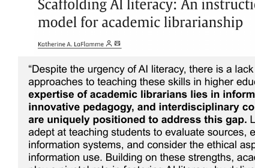

Engineering LibrarianによるLLMの講義とディスカッションを実施 探究ベースのコースワークや人工知能の限界やユースケースについて、より洗練された理解を学生がもつ助けになった事例

<a href="https://www.sciencedirect.com/science/article/pii/S0099133324000600">https://www.sciencedirect.com/science/article/pii/S0099133324000600</a>

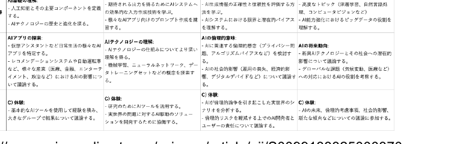

<a href="https://www.sciencedirect.com/science/article/pii/S0099133325000370">https://www.sciencedirect.com/science/article/pii/S0099133325000370</a>

“Despite the urgency of AI literacy, there is a lack of structured approaches to teaching these skills in higher education. <b>Because the expertise of academic librarians lies in information literacy, innovative pedagogy, and interdisciplinary collaboration, they are uniquely positioned to address this gap.</b> …”

<!--
- ハンプサイクル
-->

---

事例

事例

AIが学習した作品に似た画像が生成される場合があるとして、著作権上の論争を呼んでいる

海外では、アーティストが自分たちの作品が画像生成AIの学習に使われ、著作権が侵害されたとして、画像生成AIの開発元に対して訴訟を起こした

ハンバーガーを持つロボットを、◯◯氏の画風で 等を画像生成AIに入力

✕Bad

著作権侵害の知識がないユーザーが生成した画像を外部に発信することで、著作権を侵害し、訴訟等に発展する可能性

画像生成AIの出力 ※1

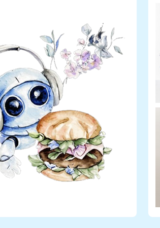

アーティストの作品 ※1

Source: New York Times, This Tool Could Protect Artists From A.I.-Generated Art That Steals Their Style　※1：画像はすべて架空の作品であり実例ではない

<!--
- 海外では、アーティストが自分たちの作品が画像生成AIの学習に使われ、著作権が侵害されたとして、画像生成AIの開発元に対して訴訟を起こしました。
- 著作権侵害の知識がないユーザーが生成した画像を外部に発信することで、著作権を侵害し、訴訟等に発展する可能性があります。
-->

---

目次

<table style="width:100%; border-collapse:separate; border-spacing:14px 10px; font-size:24px; line-height:1.35;">
<tr>
<td rowspan="2" style="width:42%; background:#D7E9F2; color:#555; border-radius:8px; padding:14px 22px; vertical-align:middle; font-weight:800;">1　生成AIとは何か？</td>
<td style="background:#eef3f6; color:#777; border-radius:8px; padding:10px 22px;">基礎知識</td>
</tr>
<tr><td style="background:#eef3f6; color:#777; border-radius:8px; padding:10px 22px;">生成AIにまつわる変化</td></tr>
<tr>
<td rowspan="2" style="background:#D7E9F2; color:#555; border-radius:8px; padding:14px 22px; vertical-align:middle; font-weight:800;">2　生成AIを どのように使うか？</td>
<td style="background:#eef3f6; color:#777; border-radius:8px; padding:10px 22px;">生成AIの用途</td>
</tr>
<tr><td style="background:#eef3f6; color:#777; border-radius:8px; padding:10px 22px;">生成AIサービスの使い方</td></tr>
<tr>
<td rowspan="4" style="background:#1f5b70; color:#fff; border-radius:8px; padding:14px 22px; vertical-align:middle; font-weight:800;">3　生成AI活用にあたって 注意すべきポイントは？</td>
<td style="background:#eef3f6; color:#777; border-radius:8px; padding:10px 22px;">情報の正確性</td>
</tr>
<tr><td style="background:#C9468F; color:#fff; border-radius:8px; padding:10px 22px; font-weight:800;">情報流出</td></tr>
<tr><td style="background:#eef3f6; color:#777; border-radius:8px; padding:10px 22px;">知的財産権の侵害</td></tr>
<tr><td style="background:#eef3f6; color:#777; border-radius:8px; padding:10px 22px;">活用者としてのモラル</td></tr>
<tr>
<td style="background:#D7E9F2; color:#555; border-radius:8px; padding:14px 22px; font-weight:800;">おわりに</td>
<td style="background:#eef3f6; color:#777; border-radius:8px; padding:10px 22px;">学習のまとめ、関連資料</td>
</tr>
</table>

<!--
- 目次です。ここからは「3. 生成AI活用にあたって注意すべきポイント」のうち、情報流出について見ていきます。
-->

---

情報流出

# 情報流出のリスク

個人情報や機密情報を生成AIに入力すると、情報流出のリスクがある

生成AIは、利用者が⼊⼒したデータを学習データとして利⽤することがある

リスク １

個人情報 ※1 や社外秘の機密情報 ※2を入力すると、他⼈の質問への回答に使われ、情報が漏洩する可能性がある

リスク ２

漏洩した情報がサイバー犯罪などに悪⽤される恐れがある

※1：個人情報の例: 氏名、電話番号、住所、メールアドレス、生年月日、公的ID番号、学校・職場の情報、顔写真など　／　※2：機密情報の例：経営・営業に関する情報、顧客や社員のデータ、技術情報、法的文章、業務上の秘密、議事録など

<!--
- 個人情報や機密情報を生成AIに入力すると、情報流出のリスクがあります。
- なぜかと言うと、生成AIの仕組み上、利用者が入力したデータが学習データとして活用されることがあるためです。
- 個人情報や社外秘の機密情報を入力すると、他人の質問への回答に使われ、情報が漏洩する可能性があるほか、
- 漏洩した情報がサイバー犯罪などに悪用される恐れがあるため、注意が必要です。
-->

---

1　イントロ

# 年齢制限

Terms of use (利用規約)を読む / AIに読み込ませる

<table style="width:100%; border-collapse:separate; border-spacing:16px 10px; font-size:23px; line-height:1.45;">
<tr>
<td style="width:18%; font-size:27px; font-weight:800; vertical-align:middle;">Chat GPT</td>
<td style="border-bottom:2px solid #ccc; padding:6px 0;">13才以上は可だが、 <b>18才未満は保護者同意必須</b></td>
</tr>
<tr>
<td style="font-size:27px; font-weight:800; vertical-align:middle; color:var(--accent-dark);">Gemini</td>
<td style="border-bottom:2px solid #ccc; padding:6px 0;">13才以上可 <b>但し学校版は管理者の許可必須</b> ※ APIの利用/Studio/gem/NotebookLMの利用は不可</td>
</tr>
<tr>
<td style="font-size:27px; font-weight:800; vertical-align:middle;">Claude</td>
<td style="border-bottom:2px solid #ccc; padding:6px 0;">18才以上可</td>
</tr>
<tr>
<td style="font-size:27px; font-weight:800; vertical-align:middle;">Copilot</td>
<td style="border-bottom:2px solid #ccc; padding:6px 0;">13才以上可 (MS365 Copilotは 2025夏に13才以上に変更)</td>
</tr>
</table>

※K-12向けAIは「みんなのコード」や「Khanmigo (米国向け)」など限られる (安全性を考え、順次拡大中ではある)

<!--
- 各サービスには年齢制限があります。利用規約を読むか、AIに読み込ませて確認しましょう。ChatGPTは13才以上だが18才未満は保護者同意必須、Geminiは13才以上だが学校版は管理者の許可必須、Claudeは18才以上、Copilotは13才以上です。
- K-12向けAIは「みんなのコード」やKhanmigoなど限られますが、安全性を考え順次拡大中です。
-->

---

情報の正確性

理解度 チェック
基本問題

生成AIにより生成された偽情報・誤情報に騙されないために常に意識するものとして、適切なものはどれか。全て選んでください。

ア生成AIに、この情報が正しいか質問する

イ人は信じたいものを選び、無意識のうちに合理的ではない行動、偏った判断をすることがあるという意識をもつ

ウ「情報源があるか？」「その分野の専門家の発信か？」といった確認をする

エ安易に拡散しない。拡散したいときはひと呼吸おく

<!--
- では、ここまでの注意すべきポイント（情報の正確性）に関する理解を確認するため、問題を解いてみましょう。
-->

---

情報の正確性

理解度 チェック
解答/解説

正解
イウエ

情報の正確性リスクを予防するために、常に意識すべき3つのポイントの説明。

ア<b>【解説】</b>生成AIが偽・誤情報を回答する恐れがあることから、生成AIに真偽を問うことは適切ではない

イ人は信じたいものを選び、無意識のうちに合理的ではない行動、偏った判断をすることがあるという意識をもつ

ウ「情報源があるか？」「その分野の専門家の発信か？」といった確認をする

エ安易に拡散しない。拡散したいときはひと呼吸おく

<!--
- 正解はイ・ウ・エです。アは、生成AIが偽・誤情報を回答する恐れがあることから、生成AIに真偽を問うことは適切ではありません。
-->

---

情報の正確性

理解度 チェック
応用問題

SNSで次の情報を見たときに避けるべき対応はどれか。全て選んでください。

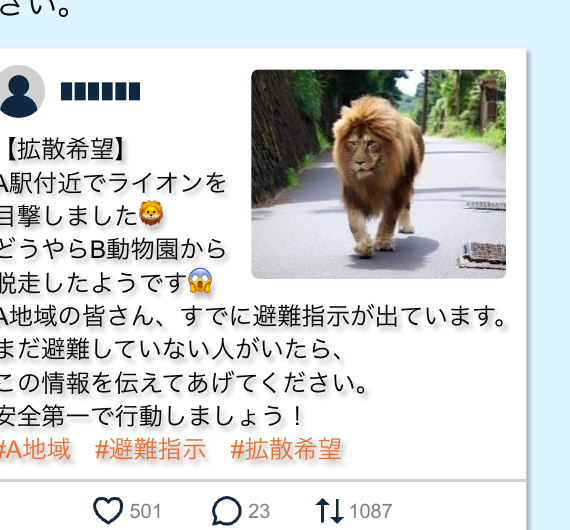

ア少しでも早く避難が終わり、ライオンによる被害が出ないよう、急いで情報を拡散する

イA自治体HPやB動物園HPなどの公式情報を確認する

ウ直ちに貴重品をもって避難場所に移動し、自身の身の安全を確保する

エ画像に違和感がないか確認し、本物だろうと判断したので、家族に避難を呼びかける

<!--
- 応用問題です。SNSで次の情報を見たときに避けるべき対応はどれか、全て選んでください。
-->

---

情報の正確性

理解度 チェック
解答/解説

正解
アウエ

公式な情報源や信頼できるメディアからの情報を無視して、代わりに非公式な情報源に依存するのは避けるべき。

今回の問題のSNS文章と写真は全て生成AIで作成

ア<b>【解説】</b>情報が正しいかどうか確認しないまま、その情報をシェアして拡散するのは避けるべき

イA自治体HPやB動物園HPなどの公式情報を確認する

ウ<b>【解説】</b>緊急性の高い情報に対して即座に反応し、パニックに陥るのは避けるべき。まずは深呼吸をして、その情報が本当に信頼できるかどうかを考える

エ<b>【解説】</b>画像が本物か疑っているところまでは正しい行動。しかし、生成AIの技術の進歩により、合成画像を見分けるのは非常に困難となっている。画像に違和感がなくても偽情報の可能性があるため、まずは公式情報を確認すべき

<!--
- 正解はア・ウ・エです。公式な情報源や信頼できるメディアからの情報を無視して非公式な情報源に依存するのは避けるべきです。今回の問題のSNS文章と写真は全て生成AIで作成しています。
-->

---

基本問題

# 理解度チェック

理解度 チェック

基本問題

生成AIに入力すべきでない、個人情報や機密情報の例として、適切なものはどれか。全て選んでください。

Q

ア知人のメールアドレス一覧

イ役員会議の発言メモ

ウクラス名簿を撮影した写真

エ自分の趣味

<!--
- では、ここまでの注意すべきポイント（情報流出）に関する理解を確認するため、問題を解いてみましょう。
-->

---

解答・解説

# 理解度チェック

理解度 チェック

解答・解説

正解
ア
イ
ウ

A

ア知人のメールアドレス一覧◯

イ役員会議の発言メモ◯

ウクラス名簿を撮影した写真◯

エ<b>【解説】</b>趣味は、一般的には特定の個人を直接識別するものではないので、個人情報には当てはまらない。ただし、このような情報の中にも特定の個人の識別につながる情報がないか確認することが必要。

---

応用問題

# 理解度チェック

理解度 チェック

応用問題

企業で面接を受けた後に送付するお礼メールを生成AIで作成する際に、気を付けるべきこととして、適切なものはどれか。全て選んでください。

Q

アお礼メール程度であれば、特段気を付けるべきものはない

イ自分自身の氏名や所属は、個人情報には当たらないため生成AIに入力してよい

ウ面接中に聞いた相手方の業務情報は機密情報に当たる可能性があるので、生成AIには入力しない

エ生成されたメールは、確認し、適宜修正したうえで送信する

---

解答・解説

# 理解度チェック

理解度 チェック

解答・解説

正解
ウ
エ

<b>ウ：</b>機密情報は生成AIに入力するべきではない。 <b>エ：</b>生成されたメールドラフトを確認の上、入力できなかった個人情報や機密情報を補ったうえで、メール文章を完成させ、送信するべき。

A

ア<b>【解説】</b>自身の尺度で重要度を判断するのは危険。個人情報や機密情報に当てはまらないか、確認をしながら入力することが必要

イ<b>【解説】</b>自分自身の氏名や所属も個人情報に当たる

ウ面接中に聞いた相手方の業務情報は機密情報に当たる可能性があるので、生成AIには入力しない

エ生成されたメールは、確認し、適宜修正したうえで送信する

---

目次

# 目次

1生成AIとは何か？

基礎知識

生成AIにまつわる変化

2生成AIを どのように使うか？

生成AIの用途

生成AIサービスの使い方

3生成AI活用にあたって 注意すべきポイントは？

情報の正確性

情報流出

知的財産権の侵害

活用者としてのモラル

おわりに

学習のまとめ、関連資料

<!--
- 次に、知的財産権の侵害について学習します。
-->

---

他人の知的財産権等の侵害を防ぐ

# 他人の知的財産権等の侵害を防ぐため、既存のものや実在の人物に類似しないよう気を付ける

＼
以下のような指示は避ける
／

✕
✕✕に似ているロゴを考えて

✕
✕✕のキャラクターを描いて

✕
✕✕さんそっくりの写真を生成して

<!--
- 他人の知的財産権等の侵害を防ぐため、まずは指示入力段階で、既存のものや実在の人物に類似しないよう注意することが大切です。
- 具体的には、「xxに似ているロゴを考えて」、「xxのキャラクターを書いて」、「xxさんそっくりの写真を生成して」といった指示は避けましょう。
-->

---

類似している場合の対応

# 生成物が既存のものや実在の人物に類似している場合、以下のいずれかの対応を行う

対応１

🚫

利用をやめる

対応２

👍➡️

既存データの権利者から許諾を取得後、利用する

対応３

🖼️➡️🖼️

既存データと類似しないよう、大幅に手を加えて利用する

<!--
- その上で、生成物が既存のものや実在の人物に類似している場合、「利用をやめる」、「既存データの権利者から許諾を取得後、利用する」、「既存データと類似しないよう、大幅に手を加えて利用する」のいずれかの対応を行いましょう。
- 特にビジネスで利用するものは念入りにチェックが必要です。
-->

---

基本問題

# 理解度チェック

理解度 チェック

基本問題

画像生成AIで作ったキャラクターのイラストが有名なキャラクターデザインに似ていた。  対応として適切なものはどれか。全て選んでください。

Q

ア全く同じものではないのでそのまま公開する

イトラブルを避けるため、イラストを利用しない

ウ既存データの権利者から許諾を得た上で利用する

エ既存データとは全く異なるデザインとなるよう、大幅に手を加えた

<!--
- では、ここまでの注意すべきポイント（知的財産権の侵害）に関する理解を確認するため、問題を解いてみましょう。
-->

---

解答・解説

# 理解度チェック

理解度 チェック

解答・解説

正解
イ
ウ
エ

知的財産の侵害リスクの予防方法として正しい説明。

A

ア<b>【解説】</b>著作権侵害となる可能性がある

イトラブルを避けるため、イラストを利用しない

ウ既存データの権利者から許諾を得た上で利用する

エ既存データとは全く異なるデザインとなるよう、大幅に手を加えた

---

応用問題

# 理解度チェック

理解度 チェック

応用問題

知的財産権やパブリシティ権の侵害を予防するために、避けるべき指示はどれか。全て選んでください。

Q

アXXのロゴに似ているロゴを作成してください

イXXのキャラクターのイラストを描いてください

ウアイドル「XX」にそっくりの写真を生成してしてください

エXXの新商品のキャッチコピーを考えてください

---

解答・解説

# 理解度チェック

理解度 チェック

解答・解説

正解
ア
イ
ウ

既存のものと類似した生成物が作成される可能性が非常に高いため、適切ではない。

A

アXXのロゴに似ているロゴを作成してください◯

イXXのキャラクターのイラストを描いてください◯

ウアイドル「XX」にそっくりの写真を生成してしてください◯

エ<b>【解説】</b>この指示が直ちに知的財産権やパブリシティ権の侵害になることはない。ただし、生成物が既存の著作物と類似していないか確認が必要。

---

目次

# 目次

1生成AIとは何か？

基礎知識

生成AIにまつわる変化

2生成AIを どのように使うか？

生成AIの用途

生成AIサービスの使い方

3生成AI活用にあたって 注意すべきポイントは？

情報の正確性

情報流出

知的財産権の侵害

活用者としてのモラル

おわりに

学習のまとめ、関連資料

<!--
- 最後に、活用者としてのモラルについて学習します。
-->

---

生成AIを活用する際は、モラルを守った行動を心がける

# 4. 総務省資料 生成AIを活用する際は、モラルを守った行動を心がける

モラル１

本来自分が 行うべきことまで 生成AI任せにしない

モラル２

生成AIが作った 偏見のある回答を 使用しない

モラル３

生成AIを 非倫理的な行為や 犯罪に悪用しない

学校や大学の課題を全て生成AIで解決しようとする　／　AIの利用を想定していないコンクール等に生成物をそのまま出品する　等

<!--
- 生成AIを活用する際は、モラルを守った行動を心がけましょう。
- 「本来自分が行うべきことまで全て生成AI任せにしない」、「生成AIが作った偏見のある回答を使用しない」、「生成AIを非倫理的な行為や犯罪に悪用しない」といった姿勢を忘れないようにしてください。
-->

---

学生が自分で考えるべき場面で、安易に生成AIを使ってしまう

# モラル❶ 学生が自分で考えるべき場面で、安易に生成AIを使ってしまう

<svg width="70" height="70" viewBox="0 0 70 70" xmlns="http://www.w3.org/2000/svg"><rect x="8" y="14" width="54" height="42" rx="10" fill="var(--accent-soft)" stroke="var(--accent)" stroke-width="4"/><circle cx="26" cy="35" r="5" fill="var(--accent)"/><circle cx="44" cy="35" r="5" fill="var(--accent)"/><rect x="30" y="6" width="10" height="10" rx="3" fill="var(--accent)"/></svg>

AI

あなたは中学2年生です。『走れメロス』の読書感想文を書いてください。

『走れメロス』は宮沢賢治の名作で、忠義と友情の深さを描いた感動的な物語です。私が最も印象的だったのは主人公メロスの人間性とその行動の強さです。メロスの友情と忠誠心は、最も難しい状況でさえも変わらないことを教えてくれます。 物語の中で、メロスは暴君ディオニスに対して「友情とは何か」を証明するために、厳しい試練を受けます。それは彼の友達セリヌンティウスの命と引き換えに、結婚式に間に合うという約束を果たすというものでした。私はこの部分が特に心に響きました。メロスは自分自身を危険にさらしながらも、友達への約束を破ることなく、時間厳守で村に戻ってきます。その姿は、どんな困難な状況でも信念を持ち続けることの大切さを教えてくれます。(中略) 全体として、『走れメロス』は人間の持つ美しい感情と強さを描いた作品で、読んで本当に良かったと感じています。私自身もメロスのように、友情を大切にし、誠実に生きていきたいと思います。

Note: ChatGPT(GPT-4)との実際の会話

<!--
- 例えば、生成AIに読書感想文を書くよう指示すると、もっともらしい文章が出力されますが、課題を通じた学びを得られず、自分のためになりません。
-->

---

生成AIが出力した偏見のある回答をそのまま使用してしまう

# モラル❷ 生成AIが出力した偏見のある回答をそのまま使用してしまう

画像生成AIで出力した以下の画像はいずれも性別や人種に偏りが見られる

※ 現在では、生成AIサービス側の改善が進んでいる

看護師

国会議員

<b>✕Bad</b> 複数人の看護師の画像作成を指示したところ、<b>女性ばかり</b>が出力され、<b>人種にも偏り</b>

<b>✕Bad</b> 国会議員の画像作成を指示したところ、<b>男性ばかり</b>が出力され、<b>人種にも偏り</b>

Note: 画像生成AIで生成。プロンプトとして、左の画像は「Various nurses」、右の画像は「国会議員」と入力

<!--
- また、生成AIは人種や性別に偏りのある回答を生成することがありますが、そのまま使用すると偏見の助長につながる可能性があります。
- 偏りのある回答を予防するため、具体的な指示を出す、複数の視点からの回答を求めるといった工夫が必要です。
-->

---

中国では、生成AIで他人の顔を生成し、金銭をだまし取る詐欺が発生

# モラル❸ 中国では、生成AIで他人の顔を生成し、金銭をだまし取る詐欺が発生

2023年4月、中国では、生成AIを悪用して実在の友人の顔を生成し、8,400万円以上をだまし取る事件が発生

詐欺の内容

被害者は、友人からビデオ通話で「入札の保証金を貸してほしい」と依頼され、指定された口座に入金

容疑者は、被害者の友人のアカウントを盗み、顔や声を特定し<b>AIで生成した可能性</b>がある

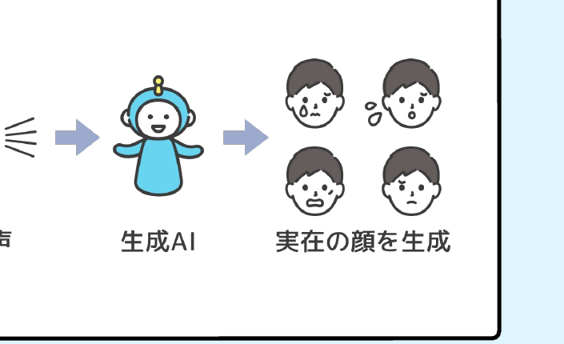

Source: https://newsdig.tbs.co.jp/articles/-/507779

<!--
- 中国では、生成AIで他人の顔を生成し、金銭をだまし取る詐欺が発生しました。
- 生成AIを非倫理的な行為や犯罪に悪用しないようにしてください。
-->

---

基本問題

理解度 チェック

基本問題

生成AIの説明として、適切なものはどれか。全て選んでください。

Q

ア

生成AIは、インターネット上の文章を大量に学習し、指示に沿った回答を出力する

イ

生成AIは、文章だけでなく、画像/動画/コード等も生成可能である

ウ

生成AIは、高度な技術をもったエンジニアでないと使うことが難しい

エ

生成AIは、指示入力を工夫しなくても、利用者の意図をくみ取って回答を生成してくれる

<!--
- では、ここまでの「生成AIの使い方」に関する理解を確認するため、問題を解いてみましょう。
-->

---

解答/解説

理解度 チェック

解答/解説

正解

ア

イ

A

ア

生成AIは、インターネット上の文章を大量に学習し、指示に沿った回答を出力する

イ

生成AIは、文章だけでなく、画像/動画/コード等も生成可能である

ウ

<b>【解説】</b>生成AIは、高度な技術は必要なく、簡単に使うことができるため、日常生活・学習・仕事に大きな影響を与えると見込まれる

エ

<b>【解説】</b>生成AIは、利用者の意図を自動的にくみ取るわけではないため、指示の工夫が必要である

---

応用問題

理解度 チェック

応用問題

社会課題に対応したボランティアのアイデア出しのために、生成AIに「日本社会の課題について教えてください」と指示したところ、下記５個の課題が約400字の長文で出力され、ボランティアに生かせるアイデアになっていなかった。 次に入力する指示として、適切なものはどれか。全て選んでください。

生成AIが回答した課題

高齢化社会と少子化問題 労働環境の問題 経済の停滞 地方の過疎化 環境問題

Q

ア

生成AIに役割を与えたうえで、再度同じ情報を聞く「日本社会の課題について教えてください。あなたは授業で実施するボランティア活動について考えている高校生です」

イ

質問の背景を入力したうえで、再度同じ情報を聞く「日本社会の課題について教えてください。地域でのどのようなボランティア活動ができるか考えています。」

ウ

生成AI自身の考えを問う「日本の社会課題について、あなたの意見を教えてください」

エ

再度同じ文言を指示する「日本社会の課題について教えてください」

---

解答/解説

理解度 チェック

解答/解説

正解

ア

イ

指示の工夫方法として、生成AIに役割を与える、指示の背景を記載する、詳細を聞く、回答の制限条件を入力すること等が挙げられる。

A

ア

生成AIに役割を与えたうえで、再度同じ情報を聞く「日本社会の課題について教えてください。あなたは授業で実施するボランティア活動について考えている高校生です」

イ

質問の背景を入力したうえで、再度同じ情報を聞く「日本社会の課題について教えてください。地域でのどのようなボランティア活動ができるか考えています。」

ウ

<b>【解説】</b>生成AI は学習データからアルゴリズムに基づいてコンテンツを生成する技術であり、生成AI が個人的な意見を持つことはない

エ

<b>【解説】</b>再度同じ文言を指示しても同じ趣旨の回答が出力される可能性が高いため、表現を変えて何度か試行する方が効果的である

---

応用問題

理解度 チェック

応用問題

あなたは生成AIを活用して「旅行の行き先」を決めたいと考えています。 旅行の条件や自分の好みに合わせた行き先を提案してもらうため、生成AIにどのような指示をすると良いでしょうか？

Q

※ 条件は自由に考えてみてください

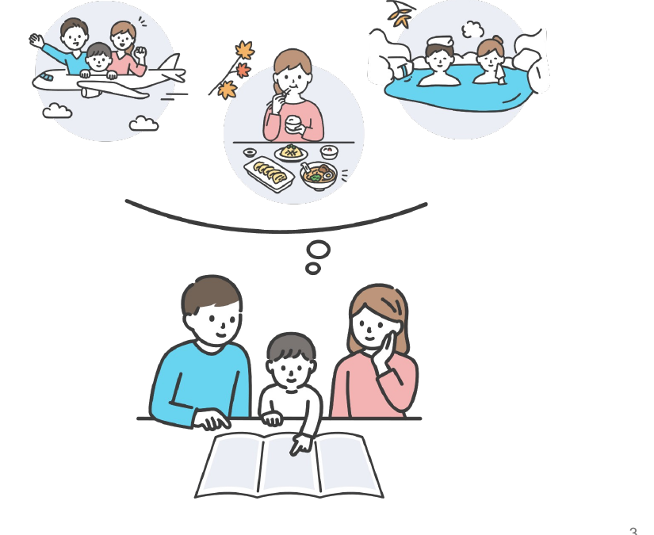

---

解答/解説

理解度 チェック

解答/解説

この問題に解答はありません。 実際に生成AIに指示してみましょう。

A

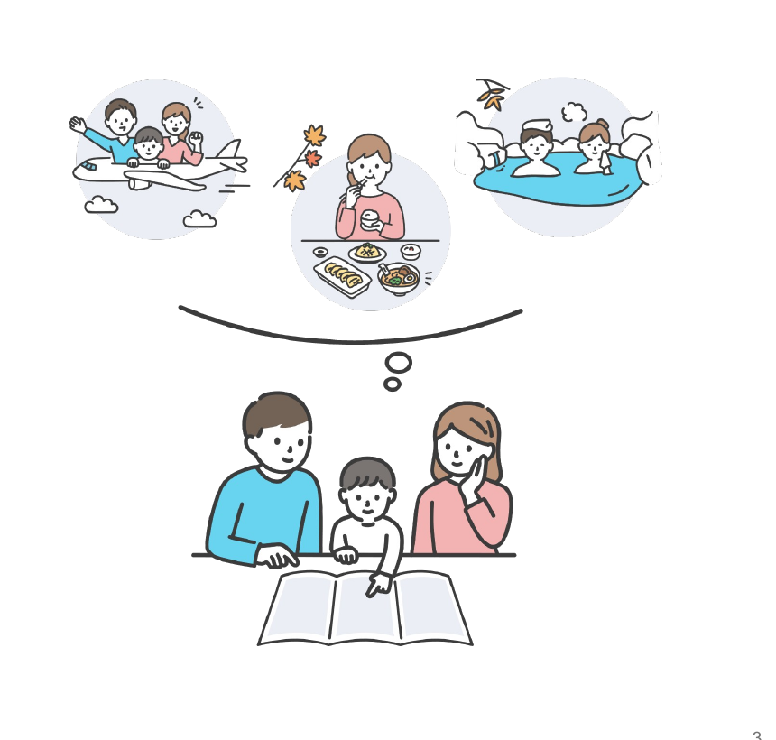

