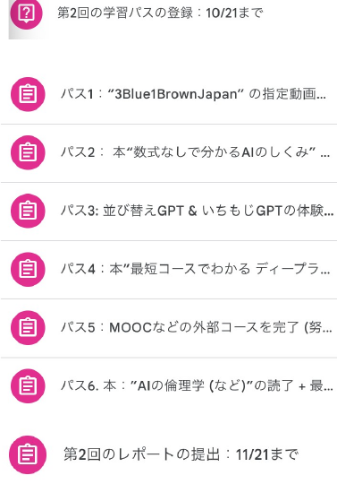

<!-- _class: cover-hero -->

生成AI活用講座

第2回

2025/10/8　講師：田川 翔

千葉大学 国際未来教育基幹 助教

1　イントロ

<!--
- タイトルコール。生成AI活用講座 第2回、イントロ・オリエンテーションです。講師は田川。
-->

---

第2回について

# 第2回の進め方：所要時間 復習込みで(できれば)4.5 時間

<b>第2回の目標は、</b> 「生成AIの仕組み」を自分にあった方法で理解することです。

<b>悩み：</b> 
　普遍の授業なので、皆バラバラ。 
　理解したいことも違う。既習範囲も違う。

<b>そこで：</b> 
　みんなが興味をもつことを自分で勉強し、 
　授業1回分：90分の講義 + 90分の復習 (+ 90分の予習や演習) 
　を選んで実施してもらう。

<!--
- 第2回の目標は「生成AIの仕組み」を自分に合った方法で理解すること。
- 普遍の授業で受講者がバラバラなので、興味のあることを自分で選んで学んでもらう。所要は復習込みで4.5時間ほど。
-->

---

第2回について

# パスを選び、学習する　※今週中に公開される

<b>第2回の目標は、「生成AIの仕組み」を自分にあった方法で理解することです。</b>

<b>① パスを選び、フォームで登録 (10/21まで)</b>

数式なしコース

パス1) “3Blue1BrownJapan” の指定動画から4本 + <b>学んだことの解説 A4 1.5枚</b>

パス2) 本：“数式なしで分かるAIのしくみ” + <b>第6 or 第7章の要約 A4 1枚</b>

プログラミングお試し

パス3) 並び替えGPT &amp; いちもじGPTの体験 (nano GPT) + <b>出力されるレポート</b>

数学コース

パス4) 本：”最短コースでわかる ディープラーニングの数学” + <b>学習時のメモ</b>

MOOC/Google Cloud Skills boost (G-AI Leader)などのコース

パス5) MOOCなどの外部コースを完了 (努力量：2.5時間以上必須) + <b>証明</b>

倫理コース

パス6) 本：”AIの倫理学 (など)”の読了 + <b>最も印象的だった内容の説明：A4半分</b>

資格・就活コース ※コスト上、おすすめしない ※合格証書の提出

パス7) Google G-AI Leader / AWS Certified AI Practitioner / G検定 (11/7, 8)合格

※パス8) その他： 来年度の受講生のためにも役立つ教材を作るなど

<b>② 11/21(金)までに、学習パスを完了させる (ものによっては、担当教員に要相談)</b> 
<b>③結果を第二回のフォームで申請</b>　※ 必要に応じて、求められているものを提出する

<!--
- 8つのパスから興味に合うものを選び、10/21までにフォームで登録、11/21までに完了し、結果を申請する流れ。
-->

---

第2回について

# 第2回の利点・欠点の分類表

コスト感：

<table class="ctbl">
<tr><th>パス1</th><td><b>無料</b> (作成者/翻訳者とも利用許諾頂けました)</td></tr>
<tr><th>パス2</th><td>2,948円 ※本代</td></tr>
<tr><th>パス3</th><td><b>無料</b> (田川が実施)</td></tr>
<tr><th>パス4</th><td>3,190円 ※本代</td></tr>
<tr><th>パス5</th><td>外部コース受講代金 無料? (ものによる) ※学習時間の目安と、修了しているスクショが必要 ※有料修了証は不要</td></tr>
<tr><th>パス6</th><td>本代 ※別途、タイトルを相談</td></tr>
<tr><th>パス7</th><td>最低5,500円 + 参考書代</td></tr>
<tr><th>パス8</th><td>別途相談</td></tr>
</table>

ある程度、本はあるので、貸せます。 先着順。教員まで。

想定する対象者・利点・欠点：

<table class="ctbl">
<tr><th>パス1、 パス2、 パス6</th><td><b>想定</b>：文系学科 or 音・画像を選んだグループ or 倫理　<b>前提知識</b>：不要 (コーディングもない)　<b>利点</b>：歴史や機械学習も分かる、視覚的にもわかりやすい　<b>欠点</b>：レポートが大変</td></tr>
<tr><th>パス3</th><td><b>想定</b>：一般 (但し、少し理系向け)　<b>前提知識</b>：不要 (コーディングもない)　<b>利点</b>：小規模だけどもLLMを作れる、レポートまでスムーズ　<b>欠点</b>：PythonやGoogle Colaboの知識などが必要</td></tr>
<tr><th>パス4</th><td><b>想定</b>：数理DSを除く理系向け　<b>前提知識</b>：数ⅢCを終え1年前期で偏微分と線形代数を履修　<b>利点</b>：今後の研究にも役立つ知識　<b>欠点</b>：レポートは楽だが、内容に少々骨がある。</td></tr>
<tr><th>パス5、 パス7</th><td><b>想定</b>：就活で取る人むけ、　<b>前提知識</b>：なし　<b>利点</b>：就活などに役立つ、資格勉強を手伝える　<b>欠点</b>：お金かかる、資格は受からないと他を再受講…</td></tr>
</table>

<!--
- 各パスのコスト感と、想定対象・利点・欠点の対応表。本は貸し出し可（先着順）。
-->

---

第2回の受講方法

# 第2回の分類表

<b>Step1</b>：10/21までに、学習パスを登録する

<b>Step2</b>：各パスの指示に従って学習を行う

<b>Step3</b>：指定の成果物を11/21までに提出する

<!--
- 受講の流れは3ステップ：①10/21までに登録、②各パスで学習、③11/21までに成果物を提出。右はClassroomの課題一覧。
-->
