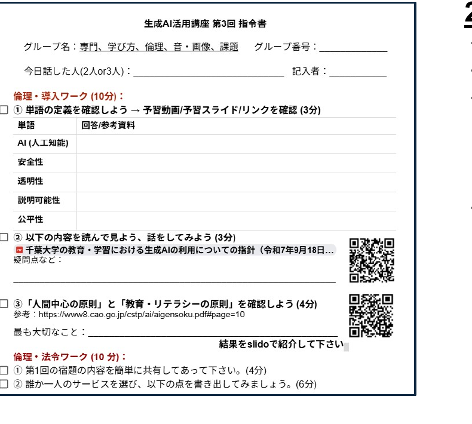
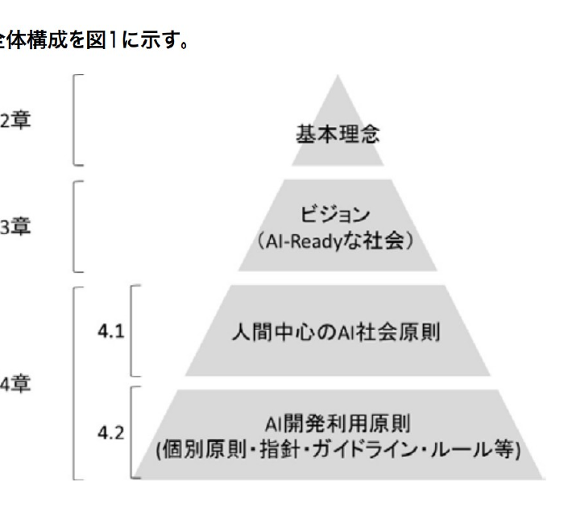
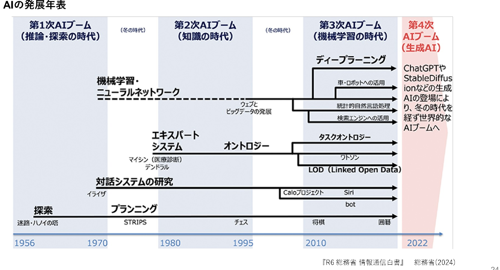
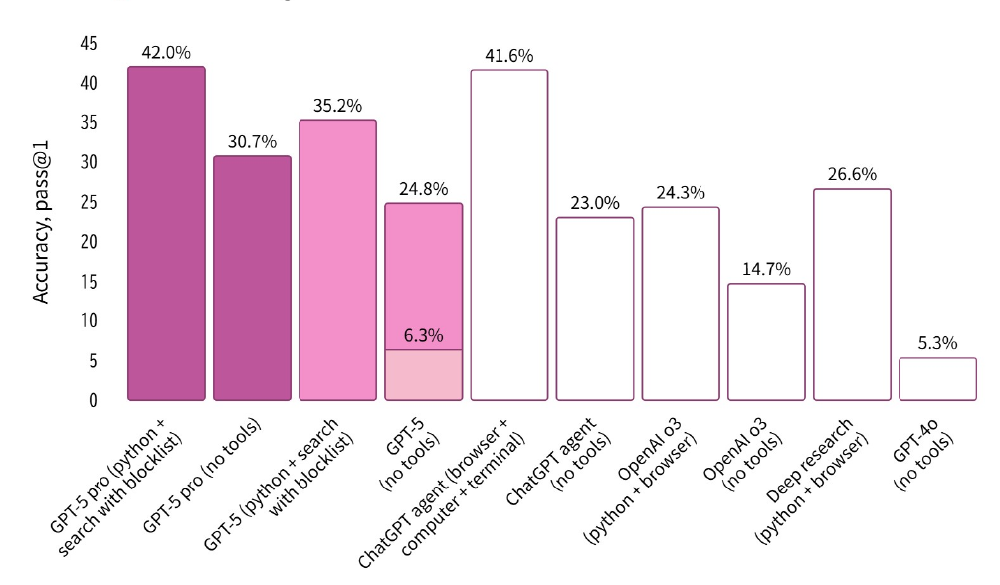
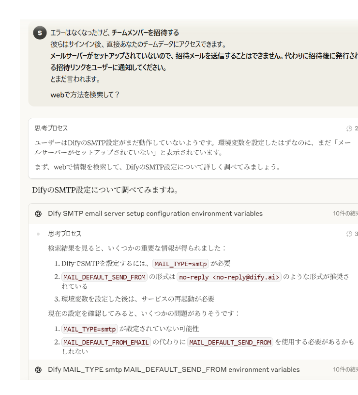
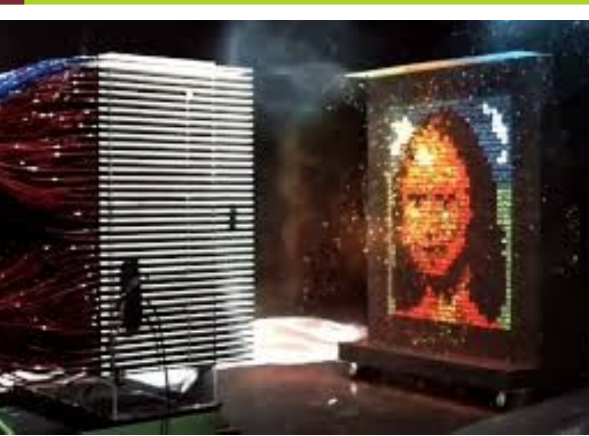

<!-- _class: cover-hero -->

1　イントロ

生成AI活用講座 第3回

2025/10/8　講師：田川 翔

千葉大学 国際未来教育基幹 助教

<!--
- 生成AI活用講座、第3回を始めます。講師は田川です。
-->

---

質問への回答

# よくでてきた質問1　イントロ

どのAIを使えばよいか？

悩まないのは、所属組織管理のもの

オプトアウトする (学習に使われない)・利用規約もOK

自分のすすめたい、目的にあったもの

ベストなAIはあるのか？

今のベストは、来月のベストではない

ツールも変わる (どんどんよいものができてくるかも)

　→自ら試して、安全に利活用できる力が大切

もしよければ、<b>質問の回答への返信</b>を下さい…

<!--
- 前回の質問への回答です。「どのAIを使えばよいか」「ベストなAIはあるのか」、よくでてきた質問にお答えします。
-->

---

前回の結論

# 原則1　イントロ

－　AIを試す/情報収集することは、<b>重要</b>

－　AIは進歩しているし利活用が進んでいる

－　入力して良いデータには<b>制限がある</b>ので「注意点」を理解

－　倫理面・技術面を理解する

－　自分を支援する”助手”と考える

<!--
- 前回の結論、原則のおさらいです。AIを試すこと・情報収集は重要、ただし入力して良いデータには制限がある。倫理面・技術面を理解し、自分を支援する助手と考える。
-->

---

今日の流れ

# 横の人とペアで進行します1　イントロ

<b>1. 奇数のところは3人で実施</b> 誰か1人はPCをもっているか？

<b>2. ワーク部分は、”指令書”に従って実施します</b> 終わった場合は近くの人に教える 進捗をスプレッドシートに記載する

<b>3. 協力的な学びの場作りに力を貸して下さい</b> <b>3K：</b>敬意をもって、忌憚なく、建設的に

<!--
- 今日の流れです。横の人とペアで進行します。奇数のところは3人で、誰か1人はPCを。ワーク部分は指令書に従って。協力的な学びの場作りに力を貸して下さい。3Kです。
-->

---

指令書の使い方

# 指令書の使い方1　イントロ

2 ～ 3人のグループで実施

Classroomにテンプレあり

紙に書いてもOK

10/21(火)までに、自分の名前を書いて、Classroomに全員提出 (改変OK)

グループで書いた場合は、コピーすること(写メ/スキャンでもOK)

<!--
- 指令書の使い方です。2～3人のグループで実施。Classroomにテンプレがあり、紙に書いてもOK。10/21までに自分の名前を書いて全員提出してください。
-->

---

倫理・導入ワーク

# 倫理・導入ワークワーク2　倫理

以下を<b>10分間</b>で確認して下さい。

<b>1. 単語の定義を再確認して下さい。</b> 
－ AI (人工知能)　－ 安全性　－ 透明性　－ 説明可能性　－ 公平性

<b>2.</b> 千葉大学の教育・学修における生成AIの利用についての指針 を確認。疑問点をなくす。

<b>3.</b> 人間中心の原則と教育リテラシーの原則を確認。 最も大切に感じた点を書き出す。

<!--
- 倫理・導入ワークです。以下を10分間で確認してください。1.単語の定義の再確認、2.千葉大学の指針の確認、3.人間中心の原則と教育リテラシーの原則を確認し、最も大切に感じた点を書き出す。
-->

---

ワーク：意見を集める

# 人間中心の原則と教育リテラシーの原則

<b>③人間中心の原則と教育リテラシーの原則で、最も重要だと感じた点は？</b> 
(端的に単語で。)

slido で意見を集めます

<!--
- 📣 This is Slido interaction slide, please don't delete it.
- ✅ Click on 'Present with Slido' and the poll will launch automatically when you get to this slide.
-->

---

国内のソフトロー・原則

# 人間中心の AI 社会原則 (2019)2　倫理

第 2 章 基本理念

- 人間の尊厳が尊重される社会(Dignity)
- 多様な背景を持つ人々が多様な幸せを追求できる社会(Diversity &amp; Inclusion)
- 持続性ある社会(Sustainability)

第 4 章 人間中心の AI 社会原則

(1)人間中心の原則　(2)教育・リテラシーの原則 
(3)プライバシー確保の原則　(4)セキュリティ確保の原則 
(5)公正競争確保の原則　(6)公平性、説明責任及び透明性の原則 
(7)イノベーションの原則

内閣府 (2019). 人間中心の AI 社会原則. https://www8.cao.go.jp/cstp/ai/aigensoku.pdf

<!--
- 人間のニーズ、能力、制約を最優先に考慮する
-->

---

暗記：「価値」と原則の議論

# AIを巡る「価値」と原則の議論2　倫理

<b>AI倫理：AIが人・社会に悪影響を与えないための規範 (法律=遵守するルール)</b>

<b>①公平性とバイアス</b> 
<b>公平性の問題：</b>AIが出す結果が公平なのかという問題 
事例：COMPAS事例、顔認識、採用AI 
AI開発時点のデータ選定・アノテーションからバイアスがある

<b>②安全性</b> 
AIによって、利用者・第三者の生命・財産に危害が及ばないこと

<b>③透明性・説明可能性</b> 
AIに関する技術、非技術的な様々な事項に関する情報開示の割合

<b>参考：</b> 古川[編著] <i>G検定法律・倫理テキスト</i>

<!--
- 人間のニーズ、能力、制約を最優先に考慮する / 公平性を考える
-->

---

ワーク：理解の確認

# 公正性に関する記述

<b>以下の公正性に関する記述のうち、最も不適切なものはどれか。</b>

古川[編著] <i>G検定法律・倫理テキスト</i>

slido で回答を集めます

<!--
- 📣 This is Slido interaction slide, please don't delete it.
- ✅ Click on 'Present with Slido' and the poll will launch automatically when you get to this slide.
-->

---

モラル❷

# 偏見のある回答をそのまま使用してしまう

画像生成AIで出力した以下の画像はいずれも<b>性別</b>や<b>人種</b>に偏りが見られる

看護師

国会議員

<b>✕Bad</b>　複数人の看護師の画像作成を指示したところ、<b>女性ばかり</b>が出力され、<b>人種にも偏り</b>

<b>✕Bad</b>　国会議員の画像作成を指示したところ、<b>男性ばかり</b>が出力され、<b>人種にも偏り</b>

※ 現在では、生成AIサービス側の改善が進んでいる

<!--
- また、生成AIは人種や性別に偏りのある回答を生成することがありますが、そのまま使用すると偏見の助長につながる可能性があります。
- 偏りのある回答を予防するため、具体的な指示を出す、複数の視点からの回答を求めるといった工夫が必要です。
- 画像生成AIで生成。プロンプトとして、左の画像は「Various nurses」、右の画像は「国会議員」と入力。
-->

---

理解度チェック

# 基本問題

生成AIにより生成された偽情報・誤情報に騙されないために常に意識するものとして、適切なものはどれか。全て選んでください。

ア

生成AIに、この情報が正しいか質問する

イ

人は信じたいものを選び、無意識のうちに合理的ではない行動、偏った判断をすることがあるという意識をもつ

ウ

「情報源があるか？」「その分野の専門家の発信か？」といった確認をする

エ

安易に拡散しない。拡散したいときはひと呼吸おく

<!--
- では、ここまでの注意すべきポイント（情報の正確性）に関する理解を確認するため、問題を解いてみましょう。
-->

---

解答/解説

# 理解度チェック　解答/解説

正解
イ
ウ
エ

<b>ア</b>：生成AIに、この情報が正しいか質問する

<b>【解説】</b> 生成AIが偽・誤情報を回答する恐れがあることから、生成AIに真偽を問うことは適切ではない

<b>イ</b>　人は信じたいものを選び、無意識のうちに合理的ではない行動、偏った判断をすることがあるという意識をもつ

<b>ウ</b>　「情報源があるか？」「その分野の専門家の発信か？」といった確認をする

<b>エ</b>　安易に拡散しない。拡散したいときはひと呼吸おく

情報の正確性リスクを予防するために、常に意識すべき3つのポイントの説明。

---

倫理・法令ワーク

# 倫理・法令ワーク

以下を<u>10分間</u>で確認して下さい。

□ ① 第1回の宿題の内容を簡単に共有してあって下さい。(4分)

□ ② 誰か一人のサービスを選び、以下の点を書き出してみましょう。(6分)

サービス名：______________________________　　調べた人：______________

<table style="width:100%; border-collapse:collapse; font-size:22px;">
<tr style="border-bottom:2px solid #888;"><th style="text-align:left; padding:6px 10px; width:26%;">単語</th><th style="text-align:left; padding:6px 10px;">そのサービスがすでにクリア/検討していること or 懸念がありそうなこと</th></tr>
<tr style="border-bottom:1px solid #ccc;"><td style="padding:8px 10px;"><b>安全性</b></td><td style="padding:8px 10px;"><u>クリア・懸念あり</u> why?→</td></tr>
<tr style="border-bottom:1px solid #ccc;"><td style="padding:8px 10px;"><b>透明性・ 説明可能性</b></td><td style="padding:8px 10px;"><u>クリア・懸念あり</u> why?→</td></tr>
<tr style="border-bottom:1px solid #ccc;"><td style="padding:8px 10px;"><b>公平性</b></td><td style="padding:8px 10px;"><u>クリア・懸念あり</u> why?→</td></tr>
<tr style="border-bottom:1px solid #ccc;"><td style="padding:8px 10px;"><b>プライバシー</b></td><td style="padding:8px 10px;"><u>クリア・懸念あり</u> why?→</td></tr>
</table>

<b>懸念がありそうなことをslidoで紹介して下さい</b>

---

<!-- _class: message -->

倫理

# サービスの目的を一言 ＋ 懸念がありそうな点

<h2>Slido　(個別の会社名/サービス名は不要)</h2>

---

<!-- _class: message -->

倫理

# 第三者の著作物を学習データにする場合に、日本の法律上もっとも適切な選択肢を1つ選べ。

<h2>Slido　古川[編著] G検定法律・倫理テキスト</h2>

---

著作権の補足

# 著作権侵害の要件：「類似性」と「依拠性」

文化庁 著作権セミナー「AIと著作権Ⅱ」 <a href="https://www.bunka.go.jp/seisaku/chosakuken/pdf/94097701_02.pdf">https://www.bunka.go.jp/seisaku/chosakuken/pdf/94097701_02.pdf</a>

---

学び方ワーク (時間があった場合)

# 学び方ワーク (時間があった場合)

以下を<u>12分間</u>で確認して下さい。

① 生成AIを宿題で使うための条件は何か？条件をまとめて下さい。

② 効果を保ちつつ宿題を解く上で、AIは積極的に活用すべきか？理由も教えて下さい。

※学びを損なわない利用を可能にする方法を考えて下さい。

③ AIを学修に活用するうえで、あなたが教員ならどうするか。教えて下さい。

---

<!-- _class: message -->

倫理

# ③ AIを学修に活用するうえで、あなたが教員ならどうするか。教えて下さい。

<h2>Slido</h2>

---

学び方ワーク (時間があった場合)

# 学び方ワーク (時間があった場合)

① 生成AIを宿題で使うための条件は何か？条件をまとめて下さい。

条件

<b>担当教員が使用を許可している。</b> (授業レベル・課題レベル)

<b>課題の狙いが、AIで代替されない。</b>

<b>AIで出力したものをそのまま自分の結果として提出しない。</b>

<b>AIの出力自体への責任を持たない。</b> (内容の裏付けをしないなど)

<b>AIの利用を適切に申請する</b>

---

<!-- _class: message -->

倫理

# ② 効果を保ちつつ宿題を解く上で、AIは積極的に活用すべきか？

<h2>Slido</h2>

---

<!-- _class: message -->

倫理

# ② 効果を保ちつつ宿題を解く上で、AIは積極的に活用すべきか？それはなぜですか？

<h2>Slido</h2>

---

そもそも、なんで？

# そもそも、なんで？

疑問点

<b>AIの中身は、どうなっているのだろう？</b>

<b>そもそもなんで、間違えるのか？</b>

<b>間違えることはなくならないのか</b>

AIを使いこなすためには、メカニズムをある程度、知る必要がある

→ AIをただ、使うだけでは、わからない！！！ 
　一番良いのは、メカニズムを知ること。

---

AI発展年表

# AI発展年表

<!-- ちょっと問題をだしてみましょう。正解も何もないので、頭の体操としてきいて下さい。 / f(1) = 3、f(2)= 5、f(3)=7と数が並んでいた時、f(4)はなんだと思いますか？ -->

---

AIを指す言葉の定義範囲

# AIを指す言葉の定義範囲

<svg viewBox="0 0 430 430" style="width:100%; height:100%;">
<circle cx="215" cy="225" r="210" fill="#F6C9A0"/>
<circle cx="215" cy="270" r="150" fill="#EDA878"/>
<circle cx="215" cy="318" r="92" fill="#E08A4E"/>
<text x="215" y="60" text-anchor="middle" font-size="20" font-weight="800" fill="#5a3a10">人工知能</text>
<text x="215" y="86" text-anchor="middle" font-size="17" font-weight="700" fill="#5a3a10">AI：Artificial Intelligence</text>
<text x="215" y="172" text-anchor="middle" font-size="19" font-weight="800" fill="#5a2a00">機械学習</text>
<text x="215" y="196" text-anchor="middle" font-size="16" font-weight="700" fill="#5a2a00">ML：Machine Learning</text>
<text x="215" y="280" text-anchor="middle" font-size="19" font-weight="800" fill="#fff">深層学習</text>
<text x="215" y="303" text-anchor="middle" font-size="16" font-weight="700" fill="#fff">DL：Deep Learning</text>
<rect x="158" y="350" width="114" height="48" rx="8" fill="#C0182B"/>
<text x="215" y="381" text-anchor="middle" font-size="22" font-weight="800" fill="#fff">生成AI</text>
</svg>

● 人間の思考プロセスと同じような形で動作するプログラム全般

● あるいは、人間が知的と感じる情報処理・技術全般

● AIのうち、人間の「学習」に相当する仕組みをコンピューター等で実現するもの

● 入力されたデータからパターン・ルールを発見し、新たなデータに当てはめることで、その新たなデータに関する識別や予測等が可能

● 機械学習のうち、多数の層から成るニューラルネットワークを用いるもの

● パターン／ルールを発見する上で何に着目するか（「特徴量」）を自ら抽出することが可能

改変：『R1 総務省 情報通信白書』総務省(2019)

<!-- ちょっと問題をだしてみましょう。正解も何もないので、頭の体操としてきいて下さい。 / f(1) = 3、f(2)= 5、f(3)=7と数が並んでいた時、f(4)はなんだと思いますか？ -->

---

機械学習の世界観

# 機械学習で、データの関係性をどう考えるか

<table style="border-collapse:collapse; font-size:40px; width:620px;">
<tr><th style="border:2px solid #222; padding:6px 0; font-weight:400;">x</th><th style="border:2px solid #222; padding:6px 0; font-weight:400;">f(x)</th></tr>
<tr><td style="border:2px solid #222; padding:6px 0; text-align:center;">1</td><td style="border:2px solid #222; padding:6px 0; text-align:center;">3</td></tr>
<tr><td style="border:2px solid #222; padding:6px 0; text-align:center;">2</td><td style="border:2px solid #222; padding:6px 0; text-align:center;">5</td></tr>
<tr><td style="border:2px solid #222; padding:6px 0; text-align:center;">3</td><td style="border:2px solid #222; padding:6px 0; text-align:center;">7</td></tr>
<tr><td style="border:2px solid #222; padding:6px 0; text-align:center;">4</td><td style="border:2px solid #222; padding:6px 0; text-align:center;">?</td></tr>
</table>

<!-- ちょっと問題をだしてみましょう。正解も何もないので、頭の体操としてきいて下さい。 / f(1) = 3、f(2)= 5、f(3)=7と数が並んでいた時、f(4)はなんだと思いますか？ -->

---

機械学習の世界観

# 機械学習で、データの関係性をどう考えるか

<table style="border-collapse:collapse; font-size:24px; width:100%;">
<tr><th style="border:2px solid #222; padding:3px 0; font-weight:400;">x</th><th style="border:2px solid #222; padding:3px 0; font-weight:400;">f(x)</th></tr>
<tr><td style="border:2px solid #222; padding:3px 0; text-align:center;">1</td><td style="border:2px solid #222; padding:3px 0; text-align:center;">3</td></tr>
<tr><td style="border:2px solid #222; padding:3px 0; text-align:center;">2</td><td style="border:2px solid #222; padding:3px 0; text-align:center;">5</td></tr>
<tr><td style="border:2px solid #222; padding:3px 0; text-align:center;">3</td><td style="border:2px solid #222; padding:3px 0; text-align:center;">7</td></tr>
<tr><td style="border:2px solid #222; padding:3px 0; text-align:center;">4</td><td style="border:2px solid #222; padding:3px 0; text-align:center;">?</td></tr>
</table>

ルールベースの世界観 (設計者が教えておく)

解析的に解くよ 
等差数列っぽい？ <b>→ Yes</b> 
f(x) = 2x+1？ 
ならば9と予想

機械学習の世界観 (もっとたくさん学習！)

入力されたデータからパターンをコンピュータが探索・発見 
<b>f(x)自体は気にしない</b> 
9とか11？

<b>変換する「函」</b> 確率・統計的に処理 正解が出てくるとは限らない

ブラックボックス

<b>ブラックボックス内を理解する手法は開発中</b> e.g. Anthropic (2025)　AI顕微鏡

データの関係性の捉え方が根本的に違う

<!-- ルールベースの世界に生きるAIは、きっと僕から、解析的な解き方を教えられているんですね。たとえば、この場合には、一次式を試してみて、f(x) = 2*x+1っていう風なので、x=4で9だぞって。 / 結構高校までの数学の授業って、こういう考え方しませんか。f(x)ときたら、f(x)の式の形を求めることから初めてみようかな、と思う。 / でも、機械学習的な世界では、このf(x)がどうなっているかはどうでも良いのですね。xとf(x)の関係性を学習し、次を予測するだけ。f(x)の式そのものは、ブラックボックスで全然構わない。まぁ、たったこんだけの数字で機械学習することなんてまぁ、無理なんですけど。ただ、この数字から次を予測するとしたら、9以外にも11とかも言ってくるかもしれないんですね。 / データの関係性について、f(x)自体がルールを明示的、つまり人が読んでもわからない形でも構わないが、コンピューターが自ら学習した結果を予想できる、この考え方がミソなんですね。 -->

---

ディープラーニング

# 箱としての、ディープラーニング (深層学習)

『R1 総務省 情報通信白書』総務省(2019)

<svg viewBox="0 0 760 200" style="width:78%; max-width:760px;">
<!-- input labels -->
<text x="38" y="55" text-anchor="middle" font-size="13" fill="#444">入力層</text>
<text x="380" y="55" text-anchor="middle" font-size="13" fill="#6E2477">中間層 (隠れ層)</text>
<text x="722" y="55" text-anchor="middle" font-size="13" fill="#444">出力層</text>
<!-- arrows in -->
<g fill="#E0552B">
<polygon points="20,95 100,95 100,88 120,100 100,112 100,105 20,105"/>
<polygon points="20,135 100,135 100,128 120,140 100,152 100,145 20,145"/>
<polygon points="20,175 100,175 100,168 120,180 100,192 100,185 20,185"/>
</g>
<text x="70" y="80" text-anchor="middle" font-size="12" fill="#E0552B">データを入力</text>
<!-- nodes -->
<g fill="#6E2477">
<circle cx="150" cy="100" r="13"/><circle cx="150" cy="140" r="13"/><circle cx="150" cy="180" r="13"/>
<circle cx="300" cy="90" r="13"/><circle cx="300" cy="135" r="13"/><circle cx="300" cy="180" r="13"/>
<circle cx="450" cy="90" r="13"/><circle cx="450" cy="135" r="13"/><circle cx="450" cy="180" r="13"/>
<circle cx="600" cy="100" r="13"/><circle cx="600" cy="140" r="13"/><circle cx="600" cy="180" r="13"/>
</g>
<g stroke="#bbb" stroke-width="1">
<line x1="150" y1="100" x2="300" y2="90"/><line x1="150" y1="100" x2="300" y2="135"/><line x1="150" y1="100" x2="300" y2="180"/>
<line x1="150" y1="140" x2="300" y2="90"/><line x1="150" y1="140" x2="300" y2="135"/><line x1="150" y1="140" x2="300" y2="180"/>
<line x1="150" y1="180" x2="300" y2="90"/><line x1="150" y1="180" x2="300" y2="135"/><line x1="150" y1="180" x2="300" y2="180"/>
<line x1="300" y1="90" x2="450" y2="90"/><line x1="300" y1="90" x2="450" y2="135"/><line x1="300" y1="90" x2="450" y2="180"/>
<line x1="300" y1="135" x2="450" y2="90"/><line x1="300" y1="135" x2="450" y2="135"/><line x1="300" y1="135" x2="450" y2="180"/>
<line x1="300" y1="180" x2="450" y2="90"/><line x1="300" y1="180" x2="450" y2="135"/><line x1="300" y1="180" x2="450" y2="180"/>
<line x1="450" y1="90" x2="600" y2="100"/><line x1="450" y1="90" x2="600" y2="140"/><line x1="450" y1="90" x2="600" y2="180"/>
<line x1="450" y1="135" x2="600" y2="100"/><line x1="450" y1="135" x2="600" y2="140"/><line x1="450" y1="135" x2="600" y2="180"/>
<line x1="450" y1="180" x2="600" y2="100"/><line x1="450" y1="180" x2="600" y2="140"/><line x1="450" y1="180" x2="600" y2="180"/>
</g>
<!-- arrows out -->
<g fill="#E0552B">
<polygon points="640,95 720,95 720,88 740,100 720,112 720,105 640,105"/>
<polygon points="640,135 720,135 720,128 740,140 720,152 720,145 640,145"/>
<polygon points="640,175 720,175 720,168 740,180 720,192 720,185 640,185"/>
</g>
<text x="690" y="80" text-anchor="middle" font-size="12" fill="#E0552B">データを出力</text>
</svg>

学習

入力

パラメーター の函

数字の羅列

出力

更新 ↻評価

利用

入力

パラメーター の函

数字の羅列

出力

<!-- ただ、このブラックボックス部分ですけど、この自体をどんな形にするか、という設計はあるわけです。 / 人工ニューラルネットワーク、その発展型である深層学習(Deep Learning)という言葉を耳にした方は多いかもしれません。今年のノーベル賞ですからね。複数のパラメータを配置することで、学習したデータとはことなるものを確率的につくることが出来るわけです。 / 意味を直接設計しようとするアプローチではなく、機械的に膨大なパラメータから意味を生成する方法の方法がいまのAIの背景にあるのです。 -->

---

ディープラーニング

# 箱としての、ディープラーニング (深層学習)

『R1 総務省 情報通信白書』総務省(2019)

<svg viewBox="0 0 360 150" style="width:100%; max-width:360px; height:auto;" xmlns="http://www.w3.org/2000/svg">
<g stroke="#9bb4d4" stroke-width="1">
<line x1="78" y1="30" x2="150" y2="25"/><line x1="78" y1="30" x2="150" y2="60"/><line x1="78" y1="30" x2="150" y2="95"/><line x1="78" y1="30" x2="150" y2="125"/>
<line x1="78" y1="75" x2="150" y2="25"/><line x1="78" y1="75" x2="150" y2="60"/><line x1="78" y1="75" x2="150" y2="95"/><line x1="78" y1="75" x2="150" y2="125"/>
<line x1="78" y1="120" x2="150" y2="25"/><line x1="78" y1="120" x2="150" y2="60"/><line x1="78" y1="120" x2="150" y2="95"/><line x1="78" y1="120" x2="150" y2="125"/>
<line x1="150" y1="25" x2="222" y2="25"/><line x1="150" y1="25" x2="222" y2="60"/><line x1="150" y1="25" x2="222" y2="95"/><line x1="150" y1="25" x2="222" y2="125"/>
<line x1="150" y1="60" x2="222" y2="25"/><line x1="150" y1="60" x2="222" y2="60"/><line x1="150" y1="60" x2="222" y2="95"/><line x1="150" y1="60" x2="222" y2="125"/>
<line x1="150" y1="95" x2="222" y2="25"/><line x1="150" y1="95" x2="222" y2="60"/><line x1="150" y1="95" x2="222" y2="95"/><line x1="150" y1="95" x2="222" y2="125"/>
<line x1="150" y1="125" x2="222" y2="25"/><line x1="150" y1="125" x2="222" y2="60"/><line x1="150" y1="125" x2="222" y2="95"/><line x1="150" y1="125" x2="222" y2="125"/>
<line x1="222" y1="25" x2="294" y2="55"/><line x1="222" y1="25" x2="294" y2="95"/>
<line x1="222" y1="60" x2="294" y2="55"/><line x1="222" y1="60" x2="294" y2="95"/>
<line x1="222" y1="95" x2="294" y2="55"/><line x1="222" y1="95" x2="294" y2="95"/>
<line x1="222" y1="125" x2="294" y2="55"/><line x1="222" y1="125" x2="294" y2="95"/>
</g>
<g>
<text x="40" y="34" text-anchor="end" font-size="11" fill="#444">データを入力</text>
<text x="40" y="79" text-anchor="end" font-size="11" fill="#444">データを入力</text>
<text x="40" y="124" text-anchor="end" font-size="11" fill="#444">データを入力</text>
</g>
<g fill="#1f4e8c"><circle cx="78" cy="30" r="9"/><circle cx="78" cy="75" r="9"/><circle cx="78" cy="120" r="9"/></g>
<g fill="#6E2477"><circle cx="150" cy="25" r="9"/><circle cx="150" cy="60" r="9"/><circle cx="150" cy="95" r="9"/><circle cx="150" cy="125" r="9"/><circle cx="222" cy="25" r="9"/><circle cx="222" cy="60" r="9"/><circle cx="222" cy="95" r="9"/><circle cx="222" cy="125" r="9"/></g>
<g fill="#C0182B"><circle cx="294" cy="55" r="9"/><circle cx="294" cy="95" r="9"/></g>
</svg>

‐ 人間の神経細胞（ニューロン）のように、各ノードが層をなして接続されるものがニューラルネットワーク

‐ 中間層（隠れ層）が複数の層となっているものを用いるものが深層学習

<b>2012年</b>、Googleの キャットペーパー 
　（「猫」を教えていなかったのに、写真から猫の特徴を抽出） 
　ヒントンらによる画像認識のブレークスルー 
<b>2016年</b>、世界トップレベルのプロ囲碁棋士に勝利 (囲碁専用ではない)

※高校生／高校教諭向けには、東大松尾研のGCIなど、無料でおすすめ

ノーベル賞 2024年 (PD)

<b>物理学：</b>人工ニューラルネットワークによる機械学習を可能にする基礎的な発見と発明

<b>ジョン・ホップフィールド</b>　物理学者・分子生物学者 
<b>ジェフリー・ヒントン</b>　生理学・哲学→実験心理学→コンピューター科学

<b>化学 (一部)：</b>タンパク質プログラムの開発

<b>デミス・ハサビス</b>　人工知能研究者、神経科学者 
<b>ジョン・M・ジャンパー</b>　固体物理学→理論化学→計算生物学

<!-- ただ、このブラックボックス部分ですけど、この自体をどんな形にするか、という設計はあるわけです。 / 人工ニューラルネットワーク、その発展型である深層学習(Deep Learning)という言葉を耳にした方は多いかもしれません。今年のノーベル賞ですからね。複数のパラメータを配置することで、学習したデータとはことなるものを確率的につくることが出来るわけです。 / 意味を直接設計しようとするアプローチではなく、機械的に膨大なパラメータから意味を生成する方法の方法がいまのAIの背景にあるのです。 -->

---

ディープラーニング

# 箱としての、ディープラーニング (深層学習)

言語型の大規模言語モデル (生成AIの中身) の本質

ネクストワードプレディクション

日本の首都__

→

日本の首都は__

→

日本の首都は東京__

<b>これまでのコンテキストから、次の言葉(トークン)の確率を予想する問題</b>

学習

入力 文字

パラメーター の函

数字の羅列

出力

更新 ↻評価

GPT 4の場合、アメリカ議会図書館の<b>全蔵書の約22倍</b>に相当? 
※書籍、記事、ウェブサイト、コードなど幅広いテキストソース

<!-- そして、生成AIの時代にきます。生成AIでよく想像されるのは、Chat GPTのような、言語を扱うAIでしょう。 / その構成について、トランスフォーマーの一つである、GPTのパラメタ構造をのぞいてみましょう。 / これも、ニューラルネットワークモデルです。インプットされたデータが、複数の層を通って出力されます。 / なんか宇宙ステーションみたいですね。 / ここでは「nano-gpt」という非常に小さなモデル（パラメータ数わずか85,000）を使って、モデルの仕組みを探っていきます。 / こんな感じで、言葉を操る生成AIは、ネクストワードプレディクション、つまり次に出てくる言葉の予測をおこなうAIなわけですね。 -->

---

LLM (大規模言語モデル)の仕組み

# LLM (大規模言語モデル)の仕組み

入力テキストに基づき次の単語を生成する

計算1回目

計算2回目

計算3回目

計算n回目

"わが"

"わがは"

"わがはい"

↑

↑

↑

出力

出力

出力

AI処理 （デコーダ）

AI処理 （デコーダ）

AI処理 （デコーダ）

前処理

前処理

前処理

入力

入力

入力

"わ"

"わが"

"わがは"

前の出力が、 次の入力になる

<!-- ただ、このブラックボックス部分ですけど、この自体をどんな形にするか、という設計はあるわけです。 / 人工ニューラルネットワーク、その発展型である深層学習(Deep Learning)という言葉を耳にした方は多いかもしれません。今年のノーベル賞ですからね。複数のパラメータを配置することで、学習したデータとはことなるものを確率的につくることが出来るわけです。 / 意味を直接設計しようとするアプローチではなく、機械的に膨大なパラメータから意味を生成する方法の方法がいまのAIの背景にあるのです。 -->

---

<!-- _class: message -->

☑

春は＿

<!-- 📣 This is Slido interaction slide, please don't delete it.✅ Click on 'Present with Slido' and the poll will launch automatically when you get to this slide. -->

---

<!-- _class: message -->

☑

地球に存在する水は海の量の＿

<!-- 📣 This is Slido interaction slide, please don't delete it.✅ Click on 'Present with Slido' and the poll will launch automatically when you get to this slide. -->

---

生成AIとハルシネーション

# 生成AIとハルシネーション

Humanity’s Last Exam (Full Set)* Expert-level questions across subjects

● With thinking　○ Without thinking

モデルが全体の中で正しく予測できた割合を示す基本的な評価指標

<b>算出方法は「正しく予測できた数 ÷ 全体の総サンプル数」</b>

ハルシネーションは 仕組み上、起こる

OpenAI https://openai.com/ja-JP/index/introducing-gpt-5/

---

LLMと生成AIサービス

# LLMと生成AIサービス

<svg viewBox="0 0 70 380" style="width:100%; height:100%;" preserveAspectRatio="none">
<polygon points="35,4 70,376 0,376" fill="#E9B8D0"/>
</svg>

応用

基盤

<table style="flex:1; border-collapse:collapse; font-size:20px; width:100%;">
<tr>
<td style="border:1px solid #ccc; padding:8px 12px; font-weight:800; width:230px; vertical-align:top;">生成AI アプリケーション</td>
<td style="border:1px solid #ccc; padding:8px 12px;"><b>Chat GPT, Gemini etc…</b> インターフェースを通じて AI 機能をユーザーに提供する</td>
</tr>
<tr>
<td style="border:1px solid #ccc; padding:8px 12px; font-weight:800; vertical-align:top;">エージェント</td>
<td style="border:1px solid #ccc; padding:8px 12px;"><b>DeepResearch, web検索 etc…</b> 環境とやり取りし、情報を収集して、その情報に基づいて意思決定を行い、アクションを実行</td>
</tr>
<tr>
<td style="border:1px solid #ccc; padding:8px 12px; font-weight:800; vertical-align:top;">プラットフォーム</td>
<td style="border:1px solid #ccc; padding:8px 12px;"><b>Dify, Google AI studio etc…</b> AI モデルの構築とデプロイに役立つツールとサービス、データマネジメントツールで構成</td>
</tr>
<tr>
<td style="border:1px solid #ccc; padding:8px 12px; font-weight:800; vertical-align:top;">大規模言語モデル</td>
<td style="border:1px solid #ccc; padding:8px 12px;">説明の通り</td>
</tr>
<tr>
<td style="border:1px solid #ccc; padding:8px 12px; font-weight:800; vertical-align:top;">インフラストラクチャー</td>
<td style="border:1px solid #ccc; padding:8px 12px;">コンピューターリソース、GPUなど</td>
</tr>
</table>

改変：Google Cloud Skills Boost

<!-- ただ、このブラックボックス部分ですけど、この自体をどんな形にするか、という設計はあるわけです。 / 人工ニューラルネットワーク、その発展型である深層学習(Deep Learning)という言葉を耳にした方は多いかもしれません。今年のノーベル賞ですからね。複数のパラメータを配置することで、学習したデータとはことなるものを確率的につくることが出来るわけです。 / 意味を直接設計しようとするアプローチではなく、機械的に膨大なパラメータから意味を生成する方法の方法がいまのAIの背景にあるのです。 -->

---

AI agentの動きの例

# AI agentの動きの例

<b>グラウンディング：</b> 
　AIが生成する回答を、特定の信頼できる　情報源（ソース）にしっかりと結びつける技術

昔：

AI

→

回答

今：

データ

→

AI

→

回答

<b>「因果推論」「思考ツール」</b>になりつつある

---

参考：ざっくりとしたイメージ

# 参考：ざっくりとしたイメージ

nVidia presentation デモ (いま非公開…) 
もっと詳しく：<a href="https://cloud.google.com/tpu/docs/system-architecture-tpu-vm?hl=ja">https://cloud.google.com/tpu/docs/system-architecture-tpu-vm?hl=ja</a>

<!-- ただ、このブラックボックス部分ですけど、この自体をどんな形にするか、という設計はあるわけです。 / 人工ニューラルネットワーク、その発展型である深層学習(Deep Learning)という言葉を耳にした方は多いかもしれません。今年のノーベル賞ですからね。複数のパラメータを配置することで、学習したデータとはことなるものを確率的につくることが出来るわけです。 / 意味を直接設計しようとするアプローチではなく、機械的に膨大なパラメータから意味を生成する方法の方法がいまのAIの背景にあるのです。 -->

---

現在の生成AIの変化

# 現在の生成AIの変化

△ 生成AIにただ聞いて回答させる

内部の学習データから回答を出す

<b>間違うことがある</b> 　例：宮崎県の観光地を教えて → ○ 　例：日本のAI基本法を教えて → ☓

○ 生成AIに、情報を与え、自分がほしい情報に変換してもらう

与えたデータから回答を出す

<b>間違いは、だいぶ減る</b>

<b>現在：生成AIはツール・エージェントになっている</b> 
AIの回答を確認するAI、webを検索するAIなどが繋がる

---

人とAIの違い

# 共同知能 Co-Intelligence

<i>『これからのAI、正しい付き合い方と使い方』</i>（2024）Mollick著、久保田訳

AIは人と異なる知能である。「異星人の心」でありいくら人間っぽくても、性質が違う。

例えば、、、

AI

<b>たくさん考えるのは得意！</b>

人

一番本質を見抜くのが得意！

→ AIをアイデア出し・ブレインストーミングにつかってはどうか 　 ※自分がすることや「なぜ」をAIに聞くのは筋が悪い

AI

言葉にするのは得意！ ニュアンスさえも。

人

<b>感覚的にわかる！</b> なぜか間違わない。

→ AIが持っていない、タイプの知がある？

---

<!-- _class: message -->

人とAIの違い

# 📣 Audience Q&A

<h2>Slido</h2>

<!-- 📣 This is Slido interaction slide, please don't delete it.✅ Click on 'Present with Slido' and the questions from your audience will appear when you get to this slide. -->

---

とりあえず、アプリを起動する

# とりあえず、アプリを起動する

Dify ワーク (初歩の初歩)：10分

①
グループでだれか一人が、DIfyのアカウントにログインして下さい。

②
一応、名前がニックネーム、パスワードは他と共通ではないですね?

③
まずは、アプリを作成してみます。ワークフローを押して下さい。 「最初から作成」を押下、アプリ名を以下の規則で作る。今回は「導入」。 命名ルール：(グループ名)_(作成者)_アプリの名前 (例：学び方1_たが_英語bot) ※今後もこの名前のルールに従って下さい。作成者は複数人でも1人でもOKです。

④
LLMをクリック、右側の設定から、AIモデルを選ぶ (gpt-4.1-<b>mini</b> or bedrock Claude  4.0 <b>sonnet</b>  or gemini 2.5 <b>Flash</b>)

⑤
右上の「公開する」を押下 → 公開するの右にある∨を押下 → アプリを実行

⑥
なんか書いてみる。AIから反応があるか確認

⑦
千葉大について質問しましょう。サークルなど。ハルシネーションをさせて。 元のページに戻り、左側「ログ・注釈」から、ログを確認

<!-- ただ、このブラックボックス部分ですけど、この自体をどんな形にするか、という設計はあるわけです。 / 人工ニューラルネットワーク、その発展型である深層学習(Deep Learning)という言葉を耳にした方は多いかもしれません。今年のノーベル賞ですからね。複数のパラメータを配置することで、学習したデータとはことなるものを確率的につくることが出来るわけです。 / 意味を直接設計しようとするアプローチではなく、機械的に膨大なパラメータから意味を生成する方法の方法がいまのAIの背景にあるのです。 -->

---

とりあえず、アプリを起動する

# とりあえず、アプリを起動する

Dify ワーク (AIの振る舞いを変えてみる)：10分

①
<b>先程作ったアプリで、SYSTEMというところに以下の何れかを入力 (変更可)。</b> ・ドラマ「北の国から」の感じで、方言で話すおじいさんとして振る舞って。 ・西郷どんになりきって。(任意→回答を超短くしてみて or 標準語を括弧書きで) ・単語でお題を与えたら、何でもなぞかけで返して。 ・英字新聞の見出しのような英語に翻訳し、端的に返して。他の記入は不要。 ・化学を教えるチューターになって、四択を作って。答えは教えてはだめ。

②
<b>Few shotにしてみましょう。</b> 今は、zero shotです。入力例→回答例のペアを作成し精度が上がるか見ましょう。 例：{入力: お題 = 温泉, 出力: 整いました！温泉とかけて秘密と解きます。その心は「どちらも掘れば出てきます」} ※2つくらいいれると良いですよ。

③
<b>パラメタを変えましょう。</b> ・(model) temperature：創造性温度、低いと慎重(硬い)、高いと脈略ない ・top P：言葉選択の自由度、Pが小さいほど確率の高い選択肢、大きいほど多様 ・そもそも、AIのモデルをかえてみる (GPT-5minなど)。Thinking modeを変える。

<!-- ただ、このブラックボックス部分ですけど、この自体をどんな形にするか、という設計はあるわけです。 / 人工ニューラルネットワーク、その発展型である深層学習(Deep Learning)という言葉を耳にした方は多いかもしれません。今年のノーベル賞ですからね。複数のパラメータを配置することで、学習したデータとはことなるものを確率的につくることが出来るわけです。 / 意味を直接設計しようとするアプローチではなく、機械的に膨大なパラメータから意味を生成する方法の方法がいまのAIの背景にあるのです。 -->

---

<!-- _class: message -->

とりあえず、アプリを起動する

# 気がついたことを教えてください。

<h2>Slido</h2>

<!-- 📣 This is Slido interaction slide, please don't delete it.✅ Click on 'Present with Slido' and the poll will launch automatically when you get to this slide. -->

---

とりあえず、アプリを起動する

# とりあえず、アプリを起動する

Dify ワーク (新しいアプリを３つ作ってみる)：10 - 20 分

①
<b>名前：千葉大bot</b> 新しくアプリを作りSYSTEMの中に、千葉大の事を教えましょう。(Wikipediaの書き込みや、あなたが記載する。) 最初のハルシネーションは直りました？

②
<b>名前：高度なプロンプト</b> 予習の良いプロンプトの書き方を元に、プロンプトを作ってもらいましょう。 場合によっては、プロンプトをAIに書いてもらいましょう。gem or dify上で。

③
<b>選択して、グループで作ってみましょう。複数作ってもOK</b>

<!-- ただ、このブラックボックス部分ですけど、この自体をどんな形にするか、という設計はあるわけです。 / 人工ニューラルネットワーク、その発展型である深層学習(Deep Learning)という言葉を耳にした方は多いかもしれません。今年のノーベル賞ですからね。複数のパラメータを配置することで、学習したデータとはことなるものを確率的につくることが出来るわけです。 / 意味を直接設計しようとするアプローチではなく、機械的に膨大なパラメータから意味を生成する方法の方法がいまのAIの背景にあるのです。 -->

---

<!-- _class: message -->

とりあえず、アプリを起動する

# Dify、面白かった？

<h2>Slido</h2>

<!-- 📣 This is Slido interaction slide, please don't delete it.✅ Click on 'Present with Slido' and the poll will launch automatically when you get to this slide. -->

---

第3回の課題

# 第3回の課題

<b>1) 指令書に書き込んだものの提出 10/21(火)</b>

　写真可。Google documentで作っても可。 　グループ内では同じでよい。ただし、<b style="color:var(--accent);">全員出す</b>こと。

<b>2) リフレクションシート 10/14(火)</b>

　Googleフォームで提出

※いつも通り、質問にも答えます。 
※15日は月曜授業、22日に再び「ALCひかり」にて開催 
※第4回は、moodleの動画を見る。<b>22(水)までに、必須分</b>を見る。 　(動画はYouTuber キノコードさまより提供。すでにmoodleに公開済。)

<!-- ただ、このブラックボックス部分ですけど、この自体をどんな形にするか、という設計はあるわけです。 / 人工ニューラルネットワーク、その発展型である深層学習(Deep Learning)という言葉を耳にした方は多いかもしれません。今年のノーベル賞ですからね。複数のパラメータを配置することで、学習したデータとはことなるものを確率的につくることが出来るわけです。 / 意味を直接設計しようとするアプローチではなく、機械的に膨大なパラメータから意味を生成する方法の方法がいまのAIの背景にあるのです。 -->

---

第2回について

# 第2回の進め方：所要時間 復習込みで(できれば)4.5 時間

第2回の目標は、「生成AIの仕組み」を自分にあった方法で理解することです。

①

<b>パスを選び、フォームで登録 (10/21まで)</b>　※ 今週中に公開される

<b>数式なしコース</b>

パス1) “3Blue1BrownJapan” の指定動画から4本 + <b style="color:var(--accent-dark);">学んだことの解説 A4 1.5枚</b>

パス2) 本：“数式なしで分かるAIのしくみ” + <b style="color:var(--accent-dark);">第6 or 第7章の要約 A4 1枚</b>

<b>プログラミングお試し</b>

パス3) 並び替えGPT &amp; いちもじGPTの体験 (nano GPT) + <b style="color:var(--accent-dark);">出力されるレポート</b>

<b>数学コース</b>

パス4) 本：”最短コースでわかる ディープラーニングの数学” + <b style="color:var(--accent-dark);">学習時のメモ</b>

<b>MOOC/Google Cloud Skills boost (G-AI Leader)などのコース</b>

パス5) MOOCなどの外部コースを完了 (努力量：2.5時間以上必須) + <b style="color:var(--accent-dark);">証明</b>

<b>倫理コース</b>

パス6) 本：”AIの倫理学 (など)”の読了 + <b style="color:var(--accent-dark);">最も印象的だった内容の説明：A4半分</b>

<b>資格・就活コース</b> ※コスト上、おすすめしない ※合格証書の提出

パス7) Google G-AI Leader / AWS Certified AI Practitioner / G検定 (11/7, 8)合格

※パス8) その他： 来年度の受講生のためにも役立つ教材を作るなど

②

<b>11/21(金)までに、学習パスを完了させる (ものによっては、担当教員に要相談)</b>

③

結果を第二回のフォームで申請 　※ 必要に応じて、求められているものを提出する

---

第2回について

# 第2回の分類表

コスト感：

<table style="width:100%; border-collapse:collapse; font-size:18px;">
<tr style="border-bottom:1px solid #ccc;"><td style="padding:5px 8px; font-weight:800; width:24%;">パス1</td><td style="padding:5px 8px;">無料 (作成者/翻訳者とも利用許諾頂けました)</td></tr>
<tr style="border-bottom:1px solid #ccc;"><td style="padding:5px 8px; font-weight:800;">パス2</td><td style="padding:5px 8px;">2,948円 ※本代</td></tr>
<tr style="border-bottom:1px solid #ccc;"><td style="padding:5px 8px; font-weight:800;">パス3</td><td style="padding:5px 8px;">無料 (田川が実施)</td></tr>
<tr style="border-bottom:1px solid #ccc;"><td style="padding:5px 8px; font-weight:800;">パス4</td><td style="padding:5px 8px;">3,190円 ※本代</td></tr>
<tr style="border-bottom:1px solid #ccc;"><td style="padding:5px 8px; font-weight:800;">パス5</td><td style="padding:5px 8px;">外部コース受講代金 無料? (ものによる) ※学習時間の目安と、修了しているスクショが必要 ※有料修了証は不要</td></tr>
<tr style="border-bottom:1px solid #ccc;"><td style="padding:5px 8px; font-weight:800;">パス6</td><td style="padding:5px 8px;">本代 ※別途、タイトルを相談</td></tr>
<tr style="border-bottom:1px solid #ccc;"><td style="padding:5px 8px; font-weight:800;">パス7</td><td style="padding:5px 8px;">最低5,500円 + 参考書代</td></tr>
<tr style="border-bottom:1px solid #ccc;"><td style="padding:5px 8px; font-weight:800;">パス8</td><td style="padding:5px 8px;">別途相談</td></tr>
</table>

ある程度、本はあるので、貸せます。先着順。教員まで。

想定する対象者・利点・欠点：

<table style="width:100%; border-collapse:collapse; font-size:17px;" class="pip-safe">
<tr style="border-bottom:1px solid #ccc;"><td style="padding:5px 8px; font-weight:800; width:22%;">パス1、パス2、パス6</td><td style="padding:5px 8px;">想定：文系学科 or 音・画像を選んだグループ or 倫理　前提知識：不要 (コーディングもない)　利点：歴史や機械学習も分かる、視覚的にもわかりやすい　欠点：レポートが大変</td></tr>
<tr style="border-bottom:1px solid #ccc;"><td style="padding:5px 8px; font-weight:800;">パス3</td><td style="padding:5px 8px;">想定：一般 (但し、少し理系向け)　前提知識：不要 (コーディングもない)　利点：小規模だけどもLLMを作れる、レポートまでスムーズ　欠点：PythonやGoogle Colaboの知識などが必要</td></tr>
<tr style="border-bottom:1px solid #ccc;"><td style="padding:5px 8px; font-weight:800;">パス4</td><td style="padding:5px 8px;">想定：数理DSを除く理系向け　前提知識：数ⅢCを終え1年前期で偏微分と線形代数を履修　利点：今後の研究にも役立つ知識　欠点：レポートは楽だが、内容に少々骨がある。</td></tr>
<tr style="border-bottom:1px solid #ccc;"><td style="padding:5px 8px; font-weight:800;">パス5、パス7</td><td style="padding:5px 8px;">想定：就活で取る人むけ、　前提知識：なし　利点：就活などに役立つ、資格勉強を手伝える　欠点：お金かかる、資格は受からないと他を再受講…</td></tr>
</table>

