<!-- _class: cover-hero -->

AIを学習と研究の 相棒にしてみよう

大学における生成AIとの関わり方を考える　15-min × 5 sessions

国際未来教育基幹　田川 翔

<!--
- タイトルコール。「AIを学習と研究の相棒にしてみよう」。大学における生成AIとの関わり方を、15分×5セッションで考えていきます。
-->

---

今日のセミナーについて

# 1テーマ 15分間完結

🧪 📚

今日のセミナーでは、AIの仕組みから、実習を交えた実践的な活用術まで、「明日から使える！」スキルをお届けします。この機会にあなたの学び方、変えてみませんか？

<b>Session 1：</b>AIの正体を解剖する 
<b>Session 2：</b>学びのためのプロンプト作成のスキル 
<b>Session 3：</b>実践AIハンズオン 
Gemに困りごとを解決してもらおう 
<b>Session 4：</b>学ぶための生成AI活用法 
考えを支援する情報整理 
<b>Session 5：</b>実践AIハンズオン 
学習ツールとしてAIを試してみる

・1テーマ 15分間完結　　・演習付き （オンラインの皆様もぜひ！）

<!--
- 1テーマ15分間で完結。演習付きで、オンラインの皆様もぜひご参加ください。
-->

---

今日のお土産

# 今日のお土産

① スキル：

生成AIのプロンプトを学べます。 
GemやNotebookLMを体験できます。 
活用について、自分の意見を持てます。

② 1枚俯瞰シート：

丸わかりシートをゲットできます。

③ 生成AI用のプロンプト：

プロンプト作成を支援してくれます。

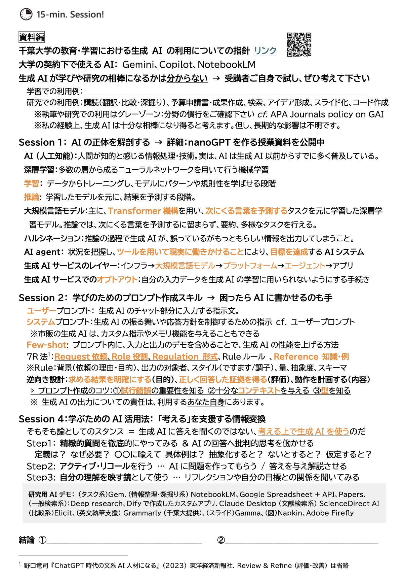

<!--
- 今日のお土産は3つ。①スキル（プロンプト、Gem・NotebookLM体験、自分の意見）、②1枚俯瞰シート、③生成AI用のプロンプト。
-->

---

宣伝：生成AI活用講座

# 生成AI活用講座 / Hands-on Generative AI Workshop 普遍教育 GD117 4T

大規模言語モデルを知る

▶

生成AIアプリを作ってみる

▶

AIとの関わり方を考える

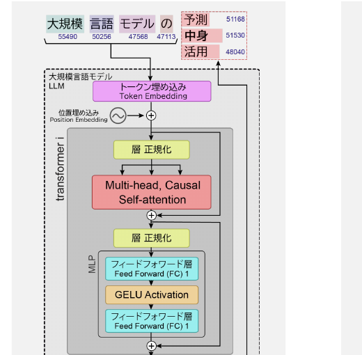

AIリテラシ/倫理

・人間中心のAI社会原則　・安全性 ・プライシー　・透明性 ・公平性　・説明可能性

テスト

グループワーク

レポート

・<b>AIの活用例</b>　→企業での活用例を調査 ・生成AIの自分なりの説明 ・<b>AIとの関わり方レポート</b>

<!--
- 宣伝です。普遍教育の生成AI活用講座 GD117（4T）。大規模言語モデルを知り、生成AIアプリを作り、AIとの関わり方を考える流れ。AIリテラシ/倫理、テスト、グループワーク、レポートで構成しています。
-->

---

講師紹介

# たがわ　しょう 田川　翔 講師紹介

<b>所属：</b>千葉大学 高等教育センター/アカデミックリンクセンター

大学教育を設計し、学生と教員を支援する仕事

①元々は理学の人

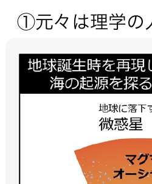

②色々な経験

<ul style="font-size:20px; margin:6px 0 0 1em; line-height:1.45;">
<li>大学のICT支援 (コロナ禍)</li>
<li>大規模オンライン授業の作成</li>
<li>民間企業での経験</li>
<li>AI×大学</li>
</ul>

③大学を学びやすく!

<ul style="font-size:21px; margin:0 0 6px 1em; line-height:1.45;">
<li>大学での教え方</li>
<li>生成AIの教育利活用</li>
</ul>

現在、Teaching with AI を翻訳・出版準備中

AIで、学び方は変わる？学習や研究の相棒に出来る？

<!--
- 自己紹介。田川翔と申します。所属は千葉大学高等教育センター/アカデミックリンクセンター。大学教育を設計し、学生と教員を支援する仕事です。①元々は理学（地球科学）、②色々な経験（ICT支援・オンライン授業・民間企業・AI×大学）、③大学を学びやすくする研究。Teaching with AIを翻訳・出版準備中です。
-->

---

<!-- _class: cover-hero -->

AIを学習と研究の 相棒にしてみよう

大学における生成AIとの関わり方を考える　15-min × 5 sessions

<b>Session 1：</b>AIの正体を解剖する

国際未来教育基幹　田川 翔

<!--
- ここからSession 1。テーマは「AIの正体を解剖する」です。
-->

---

Session 1の目的・到達目標

# Session 1の目的・到達目標

目的

<b>Session 1：</b>AIの正体を解剖する

目標

・<b>利活用の前提知識</b>を知る 
・<b>大規模言語モデル</b>の中身をイメージできる 
・生成AIサービスの<b>レイヤー</b>がわかる

<!--
- Session 1の目的は「AIの正体を解剖する」。目標は3つ。利活用の前提知識を知る、大規模言語モデルの中身をイメージできる、生成AIサービスのレイヤーがわかる、です。
-->

---

大前提

# 大前提

<b>生成AIの利活用に、現時点で正解はあるか？</b> 
<b>生成AIは、学習・研究で不可欠な相棒か？</b> 
<b>生成AI時代は学び方を必ず変えないといけないか？</b>

▶

No！

… しかし、生成AI技術は進歩し、仕事や研究にも影響を与えつつある

受講者の皆様が、生成AIは「相棒になるか」を<b>自ら考え</b>、<b>必要なときに、使えるようになる</b>ことが重要

生成AIとの付き合い方を決めるのは<b>あなた自身</b> 
<b>今日は、そのための材料をお渡しします</b>

<!--
- 大前提。生成AIの利活用に現時点で正解はあるか？ 不可欠な相棒か？ 学び方を必ず変えないといけないか？ 答えはNo。しかし技術は進歩し仕事や研究に影響を与えつつある。だからこそ、相棒になるかを自ら考え、必要なときに使えるようになることが重要。付き合い方を決めるのはあなた自身、今日はその材料をお渡しします。
-->

---

生成AIの活用領域

# 生成AIの活用領域

プライバシーの保護を保った状態で、400万以上のClaude.aiの会話を分析

何をしたか

<ul style="font-size:22px; margin:0 0 8px 1em; line-height:1.5;">
<li>→どの経済的タスクにAIが利用されているか把握</li>
<li>米国労働省のO*NET実会話DBから類似性分類</li>
</ul>

全体として分かったこと

<ul style="font-size:22px; margin:0 0 8px 1em; line-height:1.5;">
<li>① Software 開発とWritingで半分</li>
<li>② 36%の職業にAIが利用されている</li>
<li>③ スキル増強：自動化 = 57 : 43</li>
</ul>

教育での利用

<ul style="font-size:22px; margin:0 0 0 1em;">
<li>チュータリングタスクが多い</li>
</ul>

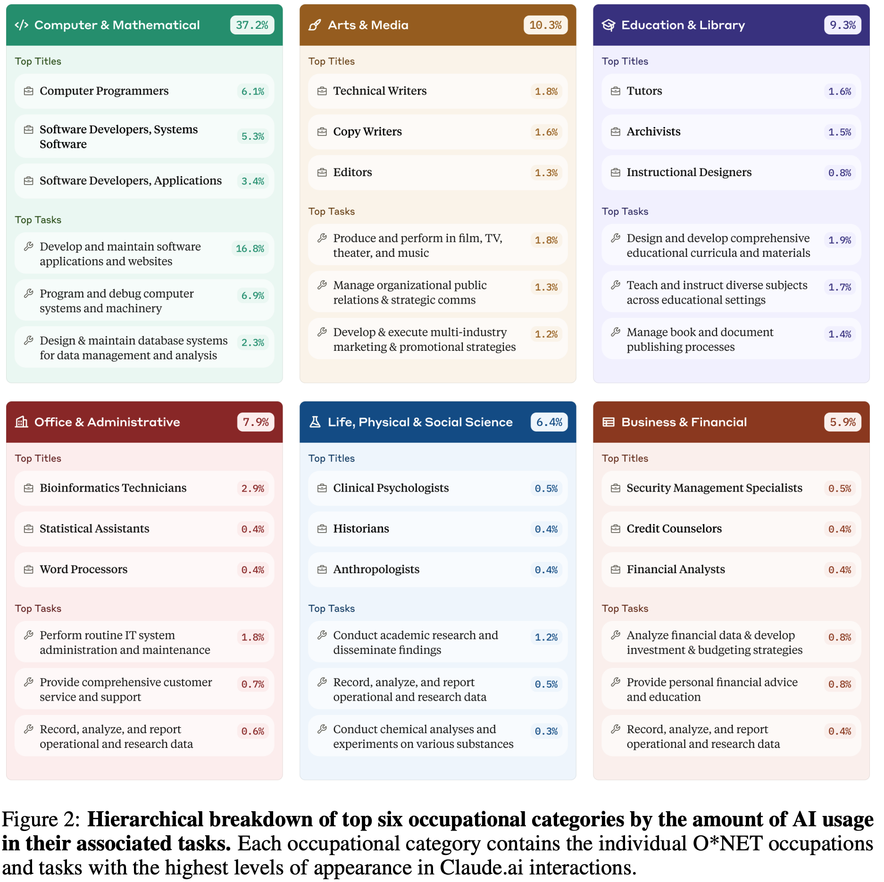

Anthropic (2025). ArXiv.

<!--
- 生成AIの活用領域。Anthropicの研究。プライバシーを保った状態で400万以上のClaude.aiの会話を分析し、どの経済的タスクにAIが使われているかを米国労働省O*NETから分類。分かったことは、①ソフトウェア開発とWritingで半分、②36%の職業で利用、③スキル増強：自動化＝57:43。教育ではチュータリングタスクが多い。
-->

---

生成AIの影響

# 参考： 職業への影響

<b>AIの影響が大きく、代替性が高い職業：</b>事務的タスクのシェアが大きい職業。▶ つまり、AIがとって変わってしまう職業

<b>AIの影響が大きく、補完性が高い職業：</b>事務的タスクのシェアが大きいものの、意思決定の重要性が高く、AI任せとすることが社会的に望ましくない職業。▶ AIを使いこなす必要のある職業

<b>AIの影響の小さい職業：</b>物理的タスクのシェアが大きい職業。

※ 教員・研究者(自然科学系)は、青の領域

内閣府 (2024). <i>世界経済の潮流</i>　＞ 第1章 ＞ p.13

<!--
- 参考に、職業への影響。内閣府の資料。AIの影響が大きく代替性が高い職業（事務的タスク中心、つまりAIがとって変わる）、影響が大きく補完性が高い職業（意思決定が重要でAIを使いこなす必要がある）、影響の小さい職業（物理的タスク中心）。教員・研究者（自然科学系）は青の領域です。
-->

---

前提：オプトアウト

# 利用規約を確認する必要性： あなたの入力データは、誰が見る?

ChatGPTにメッセージを送ると、<u>規約に同意し、プライバシーポリシーを読んだもの</u>とみなされます。

ChatGPT(特に無料版)の場合、 
<b>ユーザーの入力は原則、学習に使われる</b> 
(と思っておいた方が良い)。 
<b>機微を含むならオプトアウト(自分の入力の学習の停止)する</b> 
→ https://help.openai.com/en/articles/7730893-data-controls-faq

機密情報の入力には、十分注意して下さい

<!--
- 前提として、オプトアウトの話。利用規約を確認する必要性。あなたの入力データは誰が見るのか。ChatGPTにメッセージを送ると規約に同意したとみなされます。特に無料版では、ユーザーの入力は原則、学習に使われると思っておいた方が良い。機微を含むならオプトアウト（学習の停止）を。機密情報の入力には十分ご注意ください。
-->

---

前提：オプトアウト

# 千葉大学の契約の中で使えるAIサービス

Google

Gemini / NotebookLM

Microsoft

Copilot

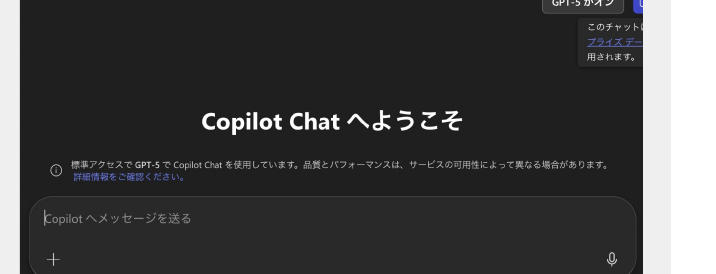

これらは、<u>エンタープライズデータ保護</u>が適用されます。

<!--
- 千葉大学の契約の中で使えるAIサービス。GoogleのGemini / NotebookLM、MicrosoftのCopilot。これらはエンタープライズデータ保護が適用されるので、比較的安心して使えます。
-->

---

深層学習

# 深層学習

<b>機械学習：</b>データから、「機械」（コンピューター）が自動で「学習」し、データの背景にあるルールやパターンを発見する方法。(NRI用語解説より)

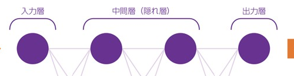

<b>深層学習：</b>多数の層から成るニューラルネットワークを用いて行う機械学習

2024年ノーベル物理学賞

学習

入力

<b style="color:var(--accent-dark);">パラメーター の函</b> 数字の羅列

出力評価

↻ 更新

利用 (推論・生成)

入力

<b style="color:var(--accent-dark);">パラメーター の函</b> 数字の羅列

出力

『R1 総務省 情報通信白書』総務省 (2019)

<!--
- 深層学習を解説。機械学習はデータから自動でルールを学ぶ方法、深層学習は多層ニューラルネットワークを用いる機械学習。2024年のノーベル物理学賞でも話題に。
- パラメーターの函（＝数字の羅列）に、学習では入力→出力→評価→更新を繰り返す。利用（推論・生成）では入力→出力する。
-->

---

深層学習

# 大規模言語モデルの中身

→ ◯ 巨大な数字の塊✗ 知識集・ルール集

日本の首都__ → 日本の首都は__ → 日本の首都は東京__

ネクストワードプレディクション

次の言葉(トークン)の確率を予想する問題

GPT 4：アメリカ議会図書館の<b>全蔵書の約22倍</b>相当? ※書籍、記事、ウェブサイト、コードなど 幅広いテキストソースを元に学習している

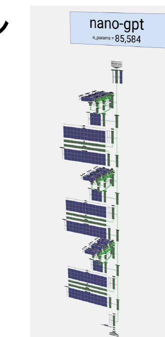

LLM Visualization ©Bycroft 2023

<!--
- 大規模言語モデルの中身は、知識集やルール集ではなく「巨大な数字の塊」。
- やっていることはネクストワードプレディクション＝次のトークンの確率を予想する問題。GPT-4はアメリカ議会図書館の全蔵書の約22倍相当のテキストで学習しているとも言われる。
-->

---

生成AIの中でしていること

# 利用 (推論・生成)

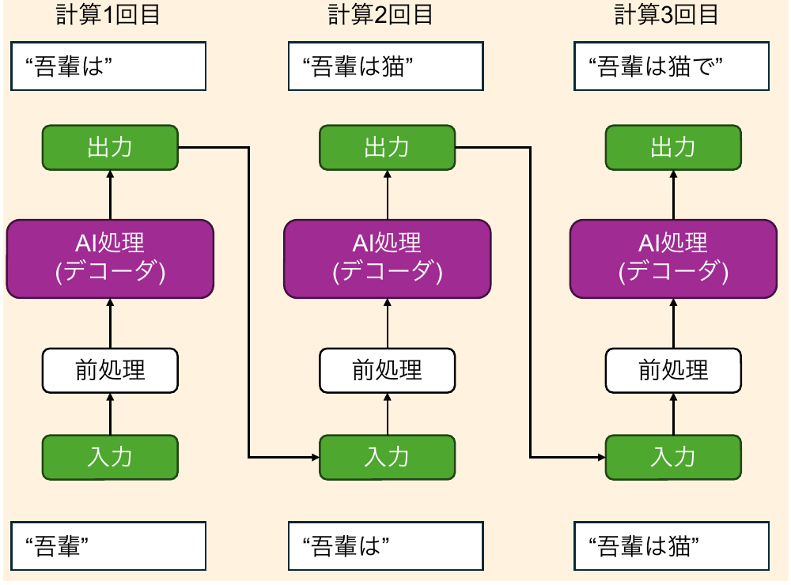

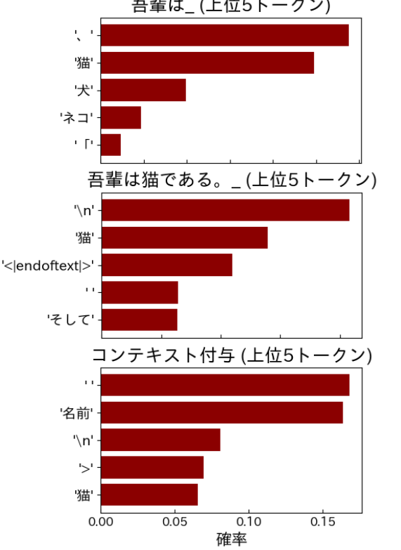

モデル：cyberagent/open-calm-7b

<!--
- 生成AIが利用（推論・生成）でしていることを「吾輩は猫である」を例に図解。
- 計算1回目→2回目→3回目と、前処理→AI処理（デコーダ）→出力を繰り返し、出力したトークンを次の入力に足して逐次生成する。右は各時点で上位5トークンの確率分布（cyberagent/open-calm-7b）。
-->

---

ハルシネーション

# ハルシネーション

<b>ハルシネーション：</b>推論過程でAIが、誤っているがもっともらしい情報を出力してしまうこと

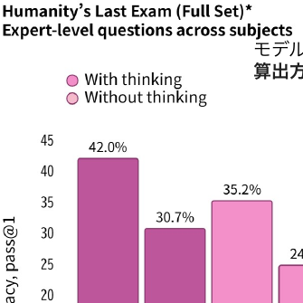

OpenAI https://openai.com/ja-JP/index/introducing-gpt-5/

モデルが全体の中で正しく予測できた割合を示す基本的な評価指標 <b>算出方法は「正しく予測できた数 ÷ 全体の総サンプル数」</b>

<b>例：</b> <b>千葉大のサークルの〇〇について教えて。</b> <b>千葉大学の生成AI活用講座の担当教員は？</b>

<b>ハルシネーションは 仕組み上、起こる</b>

<!--
- ハルシネーション＝推論過程でAIが、誤っているがもっともらしい情報を出力してしまうこと。
- 「千葉大のサークルの〇〇について教えて」「生成AI活用講座の担当教員は？」のような、AIが知らないことを聞くと起こりやすい。仕組み上、避けられない点に注意。
-->

---

生成AIのレイヤー

# 生成AIのレイヤー

応用

基盤

<table style="flex:1; border-collapse:collapse; font-size:21px; line-height:1.4;">
<tr><td style="background:var(--accent); color:#fff; font-weight:800; width:240px; padding:8px 12px; border:1px solid #fff;">生成AI アプリケーション</td><td style="padding:8px 12px; border:1px solid #e3e8f0;">Chat GPT, Gemini etc… インターフェースを通じて AI 機能をユーザーに提供する</td></tr>
<tr><td style="background:var(--accent); color:#fff; font-weight:800; padding:8px 12px; border:1px solid #fff;">エージェント</td><td style="padding:8px 12px; border:1px solid #e3e8f0;">DeepResearch, web検索 etc… 環境とやり取りし、情報を収集して、その情報に基づいて意思決定を行い、アクションを実行</td></tr>
<tr><td style="background:var(--accent); color:#fff; font-weight:800; padding:8px 12px; border:1px solid #fff;">プラットフォーム</td><td style="padding:8px 12px; border:1px solid #e3e8f0;">Dify, Google AI studio etc… AI モデルの構築とデプロイに役立つツールとサービス、データマネジメントツールで構成</td></tr>
<tr><td style="background:var(--accent-dark); color:#fff; font-weight:800; padding:8px 12px; border:1px solid #fff;">大規模言語モデル</td><td style="padding:8px 12px; border:1px solid #e3e8f0;">説明の通り</td></tr>
<tr><td style="background:var(--accent-dark); color:#fff; font-weight:800; padding:8px 12px; border:1px solid #fff;">インフラストラクチャー</td><td style="padding:8px 12px; border:1px solid #e3e8f0;">コンピューターリソース、GPUなど</td></tr>
</table>

改変：Google Cloud Skills Boost

<!--
- 生成AIのサービスは層（レイヤー）で整理できる。下から、インフラストラクチャー（GPU等）→大規模言語モデル→プラットフォーム→エージェント→生成AIアプリケーション。
- 下が基盤、上が応用。普段触るChatGPTやGeminiは一番上のアプリ層。
-->

---

AI agentのふるまい

# AI agentのふるまい

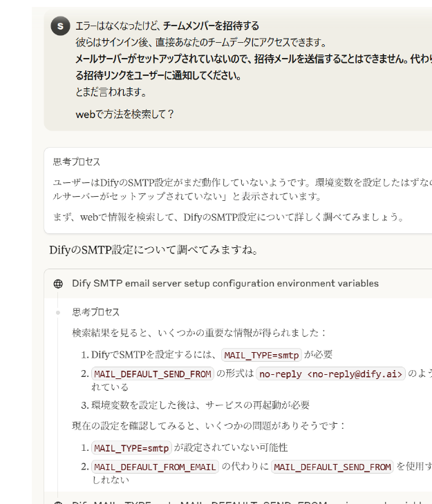

<b>グラウンディング：</b>AIが生成する回答を、特定の信頼できる情報源（ソース）にしっかりと結びつける技術

昔：

AI

→

回答

今：

データ

→

AI

→

回答

<b>「因果推論」「思考ツール」</b>になりつつある

<!--
- AI agentは、自分でweb検索などをして情報を集め、エラーの解決まで進められる。
- グラウンディング＝AIの回答を信頼できる情報源に結びつける技術。昔はAI→回答だったが、今はデータ→AI→回答と、根拠データに紐づけて答える。AIは「因果推論」「思考ツール」になりつつある。
-->

---

Session 1の目的・到達目標

# 振り返り

目的

目標 ＋ まとめ

<b>Session 1：</b> AIの正体を解剖する

・<b>利活用の前提知識</b>を知る

決めるのはあなた！

千葉大学の中でのポリシー「生成AIの指針」

オプトアウトと大学の契約で使える生成AIサービス

・<b>大規模言語モデル(LLM)</b>の中身をイメージできる

Transformerによる「次の単語の予測」作業

・<b>生成AIサービスのレイヤー</b>がわかる

インフラ→LLM→プラットフォーム→エージェント→アプリ

<!--
- Session 1の振り返り。目的は「AIの正体を解剖する」。
- 目標は3点：利活用の前提知識（決めるのはあなた／生成AIの指針／オプトアウト）、大規模言語モデルの中身（Transformerの次単語予測）、生成AIサービスのレイヤー（インフラ→LLM→プラットフォーム→エージェント→アプリ）。
-->

---

<!-- _class: divider -->

Session 2

# AIを学習と研究の 相棒にしてみよう

大学における生成AIとの関わり方を考える 15-min × 5 sessions

<b>Session 2：</b> 学びのためのプロンプト作成のスキル

国際未来教育基幹 田川 翔

<!--
- Session 2に入ります。「AIを学習と研究の相棒にしてみよう」。
- このセッションでは、学びのためのプロンプト作成のスキルを扱います。
-->

---

Session 2の目的・到達目標

# Session 2の目的・到達目標

目的

<b>Session 2：</b> 学びのためのプロンプト作成のスキルを知る

目標

・<b>システムプロンプトが何か</b>を理解する 
・<b>プロンプトの型</b>を理解する 
・<b>作成の3つのコツを説明できる</b>

<!--
- Session 2の目的は「学びのためのプロンプト作成のスキルを知る」こと。
- 目標は3つ：システムプロンプトが何かを理解する、プロンプトの型を理解する、作成の3つのコツを説明できる。
-->

---

プロンプトとは

# プロンプトとは

<b>プロンプト：</b> 生成AIに、<b>実行すべきタスクの生成を促す</b>、自然言語による文章のこと

吾輩は＿＿＿???

<b>プロンプトエンジニアリング：</b> 生成AIから望ましい出力を得るために、指示や命令を設計、最適化すること

<b>コンテキスト内学習：</b> プロンプトに与えた文章から、生成AIがタスクの結果を生成できるようになること

<!--
- プロンプトとは、生成AIに実行すべきタスクの生成を促す、自然言語による文章のこと。「吾輩は＿＿＿」の続きを予想させるイメージ。
- プロンプトエンジニアリング＝望ましい出力を得るために指示を設計・最適化すること。コンテキスト内学習＝プロンプトに与えた文章からタスクの結果を生成できるようになること。
-->

---

AIの創発

# AIの創発

具体的に教えていないのに、<b>モデルを大規模化するとタスクを解けるようになる</b>こと

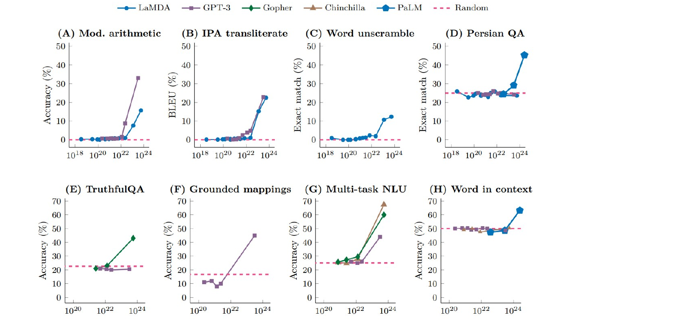

<!--
- AIの創発（emergence）。具体的に教えていないのに、モデルを大規模化するとタスクを解けるようになる現象のこと。
- 図は各タスクで、モデル規模がある閾値を超えると精度が急に立ち上がる様子を示している。
-->

---

Few-shotやスキーマ

# Few-shotやスキーマ

<b>Few-shot：</b>プロンプト内に「入力例」と「出力例」のデモを提供しより高性能な結果を得る技法。コンテキスト内学習をGPTが出来るので、実現する

<b>スキーマ：</b>回答してほしいことをすべて構造化し、回答形式として指定する。 <b>※Few-shotを組み合わせ、回答を例示する</b>

<b>Google検索的 (単語)</b> これは素晴らしい! 感情?

<b>Zero-shot</b> 「これは素晴らしい!」と書いた書き手の感情を教えて下さい

<b>Few-shot</b> あの映画は最高だった! ＞ポジティブ これは酷い! ＞ネガティブ 「これは素晴らしい!」＞?

<b>例)</b> 授業のタイトル：／目的：／到達目標：／宿題の案：

Prompt Engineering Guide https://www.promptingguide.ai/jp/techniques/fewshot

<!--
- Few-shot＝プロンプト内に入力例と出力例のデモを提供して、より高性能な結果を得る技法。コンテキスト内学習をGPTが行えるので実現する。
- 右は感情分析を例にした比較：Google検索的な単語、Zero-shot、Few-shot。スキーマは回答してほしいことをすべて構造化して回答形式として指定する手法で、Few-shotと組み合わせて回答を例示する。
-->

---

参考：より高度な利用

# 参考：より高度な利用

Structured Output（構造化出力）

<b>定義:</b> LLMの出力を、事前に定義されたJSONスキーマなどの構造に沿って生成する技術。

<b>利点:</b>

<ul style="font-size:20px; margin:2px 0 0 1.1em; line-height:1.4;">
<li>予測可能な出力形式で後続処理を容易に</li>
<li>スキーマに合致しない誤ったデータを自動で拒否</li>
<li>プロンプトを簡潔にし、LLMへの指示を削減</li>
</ul>

<b>簡単な例:</b> ユーザー情報抽出のためのJSONスキーマ

<pre style="background:#1e2430; color:#d6e2f0; border-radius:8px; padding:8px 12px; font-size:14px; line-height:1.35; margin:4px 0 0; overflow:hidden;">{ "type": "object", "properties": {
  "name":  { "type": "string" },
  "email": { "type": "string", "format": "email" },
  "age":   { "type": "integer" } },
  "required": ["name", "email"] }</pre>

Function Calling（関数呼び出し）

<b>定義:</b> LLMがユーザーの意図を解釈し、外部ツール（API）を呼び出し特定のアクションを実行する機能。

<b>用途:</b>

<ul style="font-size:20px; margin:2px 0 0 1.1em; line-height:1.4;">
<li>レストラン予約やオンラインショッピングの注文処理</li>
<li>カレンダー管理など外部アプリとの連携</li>
<li>データ検索やアクション実行の自動化</li>
</ul>

<b>簡単な例:</b> レストラン予約のための関数呼び出し

<pre style="background:#1e2430; color:#d6e2f0; border-radius:8px; padding:8px 12px; font-size:13px; line-height:1.35; margin:4px 0 0; overflow:hidden;">tool_name: レストラン予約
tool_description: 指定されたレストランの予約を行います。
bookRestaurant(restaurant_name, date, time,
               party_size, special_requests)
  date: 予約希望日 (YYYY-MM-DD)
  time: 予約希望時刻 (HH:MM)
  party_size: 予約人数（整数）</pre>

AIの応答をより予測可能かつ信頼性の高いものに出来る。 データの正確な処理と外部連携により、AI活用の幅が大きく広がる。

https://platform.openai.com/docs/guides/structured-outputs

<!--
- 参考トピック。Structured Output＝出力をJSONスキーマに沿わせる技術。後続処理が楽になり、誤データを弾ける。
- Function Calling＝LLMが外部ツール（API）を呼び出して実際のアクションを行う機能。予約や検索の自動化。
- どちらもAIの応答を予測可能・信頼性高くし、活用の幅を広げる。[NOTE]
-->

---

システムプロンプト

# システムプロンプト

生成AIの振る舞いや応答方針を制御するための指示　→　練習や道具として便利

Gem

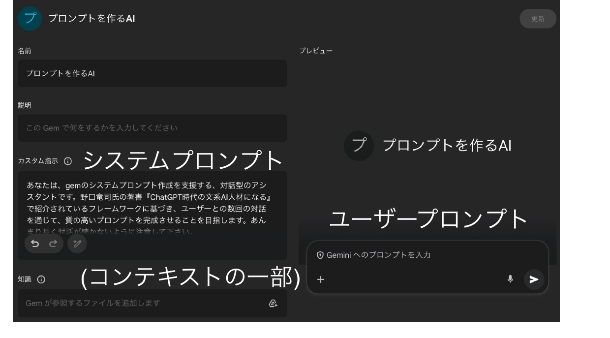

<!--
- システムプロンプト＝生成AIの振る舞いや応答方針を制御するための指示。練習や道具づくりに便利。
- 例えばGemでは「カスタム指示」に書くのがシステムプロンプト（コンテキストの一部）。チャット欄に入力するのがユーザープロンプト。[NOTE]
-->

---

良いプロンプトの書き方

# 良いプロンプトの書き方

図表5-4　簡易プロンプト

入力

▶

<b>Request</b>（依頼）を出す

<b>Role</b>（役割）を決める

<b>Regulation</b>（形式）を指定する

▶

出力

図表5-5　詳細プロンプト

入力

▶

<b>Request</b>（依頼）を出す

<b>Role</b>（役割）を決める

<b>Regulation</b>（形式）を指定する

<b>Rule</b>（ルール）を定める

<b>Review &amp; Refine</b>（評価・改善）を求める

<b>Reference</b>（参照知識・例）を与える

▶

出力

図表5-1　プロンプト上手になるための7つのポイント

<table style="border-collapse:collapse; font-size:17px; line-height:1.35; width:100%;">
<tr><td style="background:var(--accent); color:#fff; font-weight:800; border-radius:14px; padding:3px 10px; white-space:nowrap;">①明確な質問</td><td style="padding:3px 8px;">曖昧な質問ではなく明確な質問をすることで、より良い回答が得られます。</td></tr>
<tr><td style="background:var(--accent); color:#fff; font-weight:800; border-radius:14px; padding:3px 10px; white-space:nowrap;">②具体性</td><td style="padding:3px 8px;">トピックや要求に具体的な詳細を提供することで、適切な回答を引き出すことができます。</td></tr>
<tr><td style="background:var(--accent); color:#fff; font-weight:800; border-radius:14px; padding:3px 10px; white-space:nowrap;">③プロンプトの構造</td><td style="padding:3px 8px;">質問を構造化して、抜け・漏れをなくします。</td></tr>
<tr><td style="background:var(--accent); color:#fff; font-weight:800; border-radius:14px; padding:3px 10px; white-space:nowrap;">④文脈の提供</td><td style="padding:3px 8px;">重要な文脈や背景情報を提供します。</td></tr>
<tr><td style="background:var(--accent); color:#fff; font-weight:800; border-radius:14px; padding:3px 10px; white-space:nowrap;">⑤複数の質問</td><td style="padding:3px 8px;">必要に応じて、複数の質問を連続して投げます。</td></tr>
<tr><td style="background:var(--accent); color:#fff; font-weight:800; border-radius:14px; padding:3px 10px; white-space:nowrap;">⑥ステップバイステップ指示</td><td style="padding:3px 8px;">段階的に考えさせます。</td></tr>
<tr><td style="background:var(--accent); color:#fff; font-weight:800; border-radius:14px; padding:3px 10px; white-space:nowrap;">⑦校正とフィードバック</td><td style="padding:3px 8px;">得られた結果を評価し、精度向上を促します。</td></tr>
</table>

ChatGPT時代の文系AI人材になる | 野口 竜司 (東洋経済新報社 2023)

<!--
- 野口竜司さんの本から。プロンプトの「型」。簡易版はRequest/Role/Regulationの3R、詳細版はそこにRule/Review&Refine/Referenceを足す。
- 右の表は「7つのポイント」。明確な質問・具体性・構造・文脈・複数質問・ステップバイステップ・校正とフィードバック。[NOTE]
-->

---

プロンプト作成のコツ

# プロンプト作成のコツ

プロンプトを作成する上での3つのコツ

①試行錯誤の重要性を知る 
②十分なコンテキストを与える 
③型を知る

特に、<b>人に頼むときのマニュアルをイメージ</b> → 頭から手順通りに説明する / 必要な情報を渡す

<b>プログラム経験がある人は、コードをイメージ</b> → 分岐や定義を作成していくイメージ

<!--
- プロンプト作成の3つのコツ。①試行錯誤が大事、②十分なコンテキストを与える、③型を知る。
- イメージとしては「人に頼むときのマニュアル」＝頭から手順通りに説明し必要情報を渡す。プログラム経験者は「コード」＝分岐や定義を作るイメージで。[NOTE]
-->

---

AIツールの「逆向き設計」

# AIツールの「逆向き設計」

AIツールを設計し、評価する際の起点となる3つの設計

① <b>求める結果を明確にする（目的）</b>

② <b>正しく回答した証拠を考える（評価）</b>

③ <b>動作を計画する（内容）</b>

通常は、<b>内容だけ</b>を考えそうだが、それでは、ツールをうまく作ることは出来ない。 
※機械学習の設計にも通じる

<!--
- AIツールづくりも「逆向き設計」。①求める結果（目的）→②正しく回答した証拠（評価）→③動作（内容）の順で考える。
- ふつうは内容だけ考えがちだが、それではうまく作れない。機械学習の設計にも通じる考え方。[NOTE]
-->

---

プロンプティングの学習方法

# プロンプティングの学習方法

① <b>使い込んでいる人の使い方</b>を見る

② <b>模範例のプロンプトを書き換えてみる</b> https://www.promptingguide.ai/

③ <b>しっくりくる回答が出力されるまで、　何度も試行錯誤する</b>

④ <b>他の人と話し、質問力を向上させる</b>

⑤ <b>めんどうとなったら、AIに外注できないか</b>、考えてみる

<!--
- プロンプティングの学び方。①使い込んでいる人の使い方を見る、②模範例を書き換える、③しっくりくるまで試行錯誤、④他の人と話して質問力を上げる。
- そして⑤面倒になったら「AIに外注できないか」を考える＝次のメタプロンプトの話につながる。[NOTE]
-->

---

メタプロンプト

# メタプロンプト

タスクや課題の具体的な内容ではなく、その構造的および構文的な側面に焦点を当てるプロンプティング技術のこと。

<b>Structural template for how to think rather than specific examples of what to think.</b>

Zhang et al. (2023) arXiv

こうなってくると、自分自身で一人でプロンプトを書くよりも、 
生成AIとともにプロンプトを作成しても質がよくなりうる。

Gem用のスペシフィックなプロンプトを作成することを支援するGemを作っていますので必要であれば、活用下さい。 
https://gemini.google.com/gem/1aeUIrc7SISkL1nS8jxXT8zZP5vOBA5Iz?usp=sharing

<!--
- メタプロンプト＝課題の中身ではなく「どう考えるか」の構造・構文に焦点を当てる技術。Zhangらの言葉で言えば how to think のテンプレート。
- ここまでくると、一人で書くより「生成AIと一緒にプロンプトを作る」方が質が良くなる。Gem作成を支援するGemも用意したので活用を。[NOTE]
-->

---

<!-- _class: summary -->

Session 2の目的・到達目標

# 振り返り

目的

<h3 style="margin:0;">Session 2：</h3>

学びのためのプロンプト作成のスキルを知る

目標 ＋ まとめ

<ul style="margin:0; padding-left:1.1em; font-size:22px; line-height:1.4;">
<li><b>システムプロンプトが何かを理解する</b>
<ul style="font-size:20px; color:#444;"><li>生成AIの振る舞いや応答方針を制御するための指示</li><li>プロンプトの練習や試行錯誤に向いている</li><li>チャットボットで入力するのは「ユーザープロンプト」</li></ul></li>
<li><b>プロンプトの型</b>をイメージできる
<ul style="font-size:20px; color:#444;"><li>R法：Request、Role、Regulation、Rule、Reference</li></ul></li>
<li><b>作成の3つのコツを説明できる</b>
<ul style="font-size:20px; color:#444;"><li>①<b>試行錯誤</b>は重要 ②十分な<b>コンテキスト</b>を ③<b>型</b>を知る</li></ul></li>
</ul>

<!--
- Session 2の振り返り。目的は「学びのためのプロンプト作成のスキルを知る」。
- 目標とまとめ：①システムプロンプトの理解（振る舞いを制御する指示／練習向き／チャット欄はユーザープロンプト）、②プロンプトの型＝R法、③作成の3つのコツ（試行錯誤・コンテキスト・型）。[NOTE]
-->

---

<!-- _class: divider -->

　

AIを学習と研究の 相棒にしてみよう

大学における生成AIとの関わり方を考える　15-min × 5 sessions

<b>Session 3 ハンズオン：</b> Gemに困りごとを解決してもらおう

国際未来教育基幹 田川 翔

<!--
- ここからSession 3。ハンズオンで「Gemに困りごとを解決してもらおう」。実際に手を動かしていきます。[NOTE]
-->

---

<!-- _class: divider -->

　

AIを学習と研究の 相棒にしてみよう

大学における生成AIとの関わり方を考える　15-min × 5 sessions

<b>Session 4：</b> 学ぶための生成AI活用法

国際未来教育基幹 田川 翔

<!--
- Session 4は「学ぶための生成AI活用法」。学習と研究それぞれでどう使えるかを見ていきます。[NOTE]
-->

---

Session 4の目的・到達目標

目的

<b>Session 4：</b>学びのためのAI活用法のアイデアを知る

目標

・そもそも論として、AIとの付き合い方を考える 
・学習に利用する際のアイデアを見つける 
・研究に利用する際の活用例を知る

<!--
- Session 4の目的は「学びのためのAI活用法のアイデアを知る」。
- 目標は3つ：①そもそもAIとの付き合い方を考える、②学習で使うアイデアを見つける、③研究で使う活用例を知る。[NOTE]
-->

---

学習におけるAI利用の考え方

# 学習におけるAI利用の考え方

<b>NG:</b> AIに答えを聞く、正解を聞く、コスパ/タイパ至上主義 
→ 考えたり、研究を深めたりするためにAIを活用する

授業利用における活用の考え方の例

学生の現状

➡

ねらい：
どこに向かうのか (授業の存在価値)

➡

学修後の状態

<b>達成目標：</b> 何が出来るようになるのか

<b>評価：</b> どのように測るのか

<b>設計：</b> どのように教えるのか

目標や設計を損なう形で使ってはいけない 
<b>「AIができることをただ出力するのは、AIで事足りるので採用する必要はない」ということ</b> 
<b>AIができない「高次」の価値を作るために、引き続き学ぶ必要はある</b>

Teaching with AI (Bowen &amp; Watson, AAC&amp;U 2024)

<!--
- 学習でのAI利用の考え方。NGは「答え・正解を聞く」「コスパ/タイパ至上主義」。AIは考えたり研究を深めたりするために使う。
- 授業設計の枠組み（学生の現状→ねらい→学修後の状態、達成目標・評価・設計）を損なう形で使ってはいけない。
- 「AIができることをただ出力するなら、AIで事足りる」。AIができない高次の価値を作るために、人は引き続き学ぶ必要がある。Teaching with AIより。[NOTE]
-->

---

Bloomの学習目標分類とAI

# 学習目標分類に生成AIの影響を当てはめてみる

<table style="border-collapse:collapse; width:100%; font-size:18px; line-height:1.35;">
<thead>
<tr>
<th style="border:1px solid #bbb; background:#e9edf3; padding:5px 6px;"></th>
<th style="border:1px solid #bbb; background:#e9edf3; padding:5px 6px;">認知的領域 (知識や思考)</th>
<th style="border:1px solid #bbb; background:#e9edf3; padding:5px 6px;">学びへの生成AIの影響</th>
</tr>
</thead>
<tbody>
<tr>
<td style="border:1px solid #bbb; padding:5px 6px; text-align:center; font-weight:800;">高次</td>
<td style="border:1px solid #bbb; padding:5px 6px;"><b>創造</b> (学習を応用し、新しい価値を作れる)</td>
<td style="border:1px solid #bbb; padding:5px 6px;">人の創造性こそが大切 アイデア出しで活用</td>
</tr>
<tr>
<td style="border:1px solid #bbb; padding:5px 6px;"></td>
<td style="border:1px solid #bbb; padding:5px 6px;"><b>評価</b> (事物・判断等を比較し評価出来る)</td>
<td style="border:1px solid #bbb; padding:5px 6px;">評価軸/価値/判断は人が設定する</td>
</tr>
<tr>
<td style="border:1px solid #bbb; padding:5px 6px;"></td>
<td style="border:1px solid #bbb; padding:5px 6px;"><b>分析</b> (要素に分け、関係性を指摘できる)</td>
<td style="border:1px solid #bbb; padding:5px 6px;">解答/過程の支援可(例：要約・構造化・コーディング)</td>
</tr>
<tr>
<td style="border:1px solid #bbb; padding:5px 6px;"></td>
<td style="border:1px solid #bbb; padding:5px 6px;"><b>応用</b> (他の場面や状況に使用できる)</td>
<td style="border:1px solid #bbb; padding:5px 6px;">単なる問題では、 AIが解いてしまう…</td>
</tr>
<tr>
<td style="border:1px solid #bbb; padding:5px 6px;"></td>
<td style="border:1px solid #bbb; padding:5px 6px;"><b>理解</b> (学習内容を説明出来る)</td>
<td style="border:1px solid #bbb; padding:5px 6px;">AIで支援することで、 より理解しやすくなる?</td>
</tr>
<tr>
<td style="border:1px solid #bbb; padding:5px 6px; text-align:center; font-weight:800;">低次</td>
<td style="border:1px solid #bbb; padding:5px 6px;"><b>記憶</b> (事実や概念を暗記している)</td>
<td style="border:1px solid #bbb; padding:5px 6px;">AIで支援可能だが、 学修者の記憶必須</td>
</tr>
</tbody>
</table>

左は栗田&amp;中村 (2023)を元に作成 ／ 原著 Bloom (1956/1964)、改訂版(2001)を記載

学修の目標を構造化し、学びの設計を支援

※近年では、下から個別・段階的に行うのではなく、 <b>複数の次元の要素を組み合わせる</b>必要性が叫ばれている。 
※近年では、<b>学び方の学び</b>や、人間性の涵養などを含む、 学習目標分類も作成されている (e.g. Finkの学習目標分類)　<b>学び方の学びはAIで支援できる可能性</b>がある 
※但し、<b>低次(特に記憶・理解・応用の段階)を蔑ろにして</b>、 <b>高次の学修目標の達成は難しい</b>と想定される。

授業におけるAI利用の指針となり得る

<b>AI が答えを出せるとしても、 途中を学ぶことは引き続き必要！！！</b>

▶学習目標分類についての、担当講師による解説動画 (9分) https://www.notion.so/geophysica/Bloom-145d8c8bc5ab80deb9dfc15b89d91875?pvs=4

<!--
- BloomのタキソノミーにAIの影響を当てはめる。低次（記憶・理解・応用）はAIで支援できるが、学修者自身の記憶や理解は引き続き必須。高次（分析・評価・創造）は人が軸を設定し、創造性を発揮する場。
- AIが答えを出せても、途中を学ぶことは引き続き必要。
-->

---

学習で活用する際のアイデア

# 学習で活用する際のアイデア

<b>Step1：</b> <b>質問</b>を徹底的にやってみる (含む：エラボレーティブ・インタロゲーション) AI の回答へ批判的思考を働かせる

<table style="border-collapse:collapse; width:100%; font-size:20px; line-height:1.4; margin-top:8px;">
<tbody>
<tr><td style="border:1px solid #ccc; background:#f1f3f6; padding:6px 16px; font-weight:800; width:200px;">定義</td><td style="border:1px solid #ccc; padding:6px 16px;">〇〇の▢▢分野における定義を端的に教えて。</td></tr>
<tr><td style="border:1px solid #ccc; background:#f1f3f6; padding:6px 16px; font-weight:800;">理由</td><td style="border:1px solid #ccc; padding:6px 16px;">なぜそのような概念が必要になったのか。</td></tr>
<tr><td style="border:1px solid #ccc; background:#f1f3f6; padding:6px 16px; font-weight:800;">どのように</td><td style="border:1px solid #ccc; padding:6px 16px;">どのように現実に影響しているのか。 どのような考え方をするのかフローを教えて。</td></tr>
<tr><td style="border:1px solid #ccc; background:#f1f3f6; padding:6px 16px; font-weight:800;">関係性</td><td style="border:1px solid #ccc; padding:6px 16px;">〇〇に喩えて。 〇〇との関係性はあるのか。</td></tr>
<tr><td style="border:1px solid #ccc; background:#f1f3f6; padding:6px 16px; font-weight:800;">具体化・抽象化</td><td style="border:1px solid #ccc; padding:6px 16px;">他に同じルールに従う点ことはあるのか？ 例を教えて。 それらをまとめたとき、上位概念は何か？</td></tr>
<tr><td style="border:1px solid #ccc; background:#f1f3f6; padding:6px 16px; font-weight:800;">仮定</td><td style="border:1px solid #ccc; padding:6px 16px;">〇〇としたら / ないとしたら</td></tr>
<tr><td style="border:1px solid #ccc; background:#f1f3f6; padding:6px 16px; font-weight:800;">関心</td><td style="border:1px solid #ccc; padding:6px 16px;">自分の関心や目標とどのように関わっているのか</td></tr>
</tbody>
</table>

<!--
- 学習での活用Step1：質問を徹底的にやる。定義・理由・どのように・関係性・具体化抽象化・仮定・関心の観点で問い続け、AIの回答に批判的思考を働かせる。
-->

---

学習で活用する際のアイデア

# 学習で活用する際のアイデア

<b>Step2：</b> <b>問題を解く / アクティブ・リコールを行う</b>

NG： 〇〇という問題の答えを教えて。

(教材をAIのコンテキストに与えたうえで) 問題と解説を生成して

<b>Step3：</b> <b>リフレクションを行う</b>

〇〇という問題を誤って✕✕と答えた。正解は▢らしい。なぜ?

<!--
- Step2：問題を解く／アクティブリコール。答えを聞くのはNG。教材を与えて問題と解説を生成させる。
- Step3：リフレクション。誤答とその正解をAIに渡し、なぜ間違えたのかを問う。
-->

---

参考：Googleの取組み

# 参考：Googleの取組み

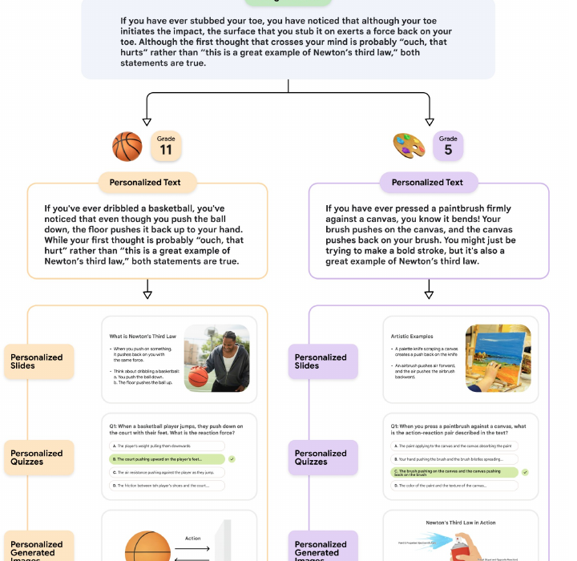

Learn Your Way EXPERIMENT

Towards an AI-Augmented Textbook, LearnLM Team, Google (2025)

初等・中等教育で、 生徒のレベル感や興味に合わせて、 教科書データを書き換えて、 <b>解説</b>や<b>問題</b>を出力する

<!--
- Googleの取組み「Learn Your Way」。初等・中等教育で、生徒のレベルや興味に合わせて教科書データを書き換え、解説や問題を出力する実験。
-->

---

研究で活用する際のアイデア

# 研究で活用する際のアイデア

<table style="border-collapse:collapse; width:100%; font-size:21px; line-height:1.5; margin-top:6px;">
<tbody>
<tr><td style="padding:4px 14px; font-weight:800; color:var(--accent-dark); white-space:nowrap; vertical-align:top;">タスク処理：</td><td style="padding:4px 14px;">Gem <b>(学振申請・シミュレーション・成果まとめ)</b> Dify / n8n <b>(その他、特化したタスク)</b></td></tr>
<tr><td style="padding:4px 14px; font-weight:800; color:var(--accent-dark); white-space:nowrap; vertical-align:top;">情報整理・深掘り：</td><td style="padding:4px 14px;">NotebookLM、Google Spreadsheet + API、Papers</td></tr>
<tr><td style="padding:4px 14px; font-weight:800; color:var(--accent-dark); white-space:nowrap;">一般検索：</td><td style="padding:4px 14px;">Deep research、Dify、Claude Desktop</td></tr>
<tr><td style="padding:4px 14px; font-weight:800; color:var(--accent-dark); white-space:nowrap;">文献検索：</td><td style="padding:4px 14px;">ScienceDirect AI</td></tr>
<tr><td style="padding:4px 14px; font-weight:800; color:var(--accent-dark); white-space:nowrap;">論文比較：</td><td style="padding:4px 14px;">Elicit</td></tr>
<tr><td style="padding:4px 14px; font-weight:800; color:var(--accent-dark); white-space:nowrap;">英文執筆支援：</td><td style="padding:4px 14px;">Grammarly (千葉大提供)</td></tr>
<tr><td style="padding:4px 14px; font-weight:800; color:var(--accent-dark); white-space:nowrap;">スライド：</td><td style="padding:4px 14px;">Gamma</td></tr>
<tr><td style="padding:4px 14px; font-weight:800; color:var(--accent-dark); white-space:nowrap; vertical-align:top;">模式図/ベクター図：</td><td style="padding:4px 14px;">Napkin、Adobe Firesy</td></tr>
</tbody>
</table>

ぜひ、ご参加の皆様の活用例を教えて下さい

※学振/JST申請などは、AIを使って読み手の印象を分析するなどで利用 (自身が解決したい問い自体は、AIの出力ではなく、人が考える問題)

<!--
- 研究での活用例を用途別に。タスク処理はGemやDify/n8n、情報整理はNotebookLM等、検索・比較・英文執筆・スライド・模式図など。
- 学振/JST申請ではAIで読み手の印象を分析するなどに使う。解決したい問い自体は人が考える。
-->

---

研究で活用する際のアイデア

# 研究で活用する際のアイデア

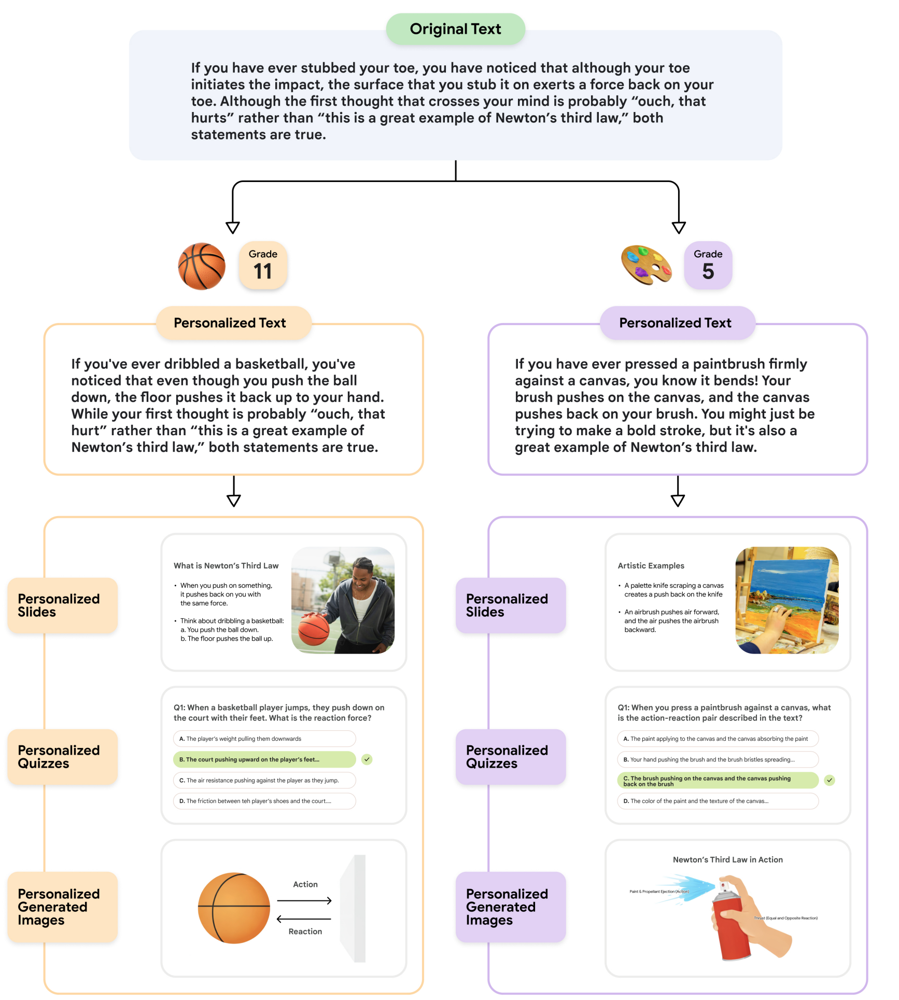

GemやDify、n8nで 道具を作れるようになる

<!--
- 研究での活用の発展形。GemやDify、n8nを使って、自分専用の道具（ツール）を作れるようになると、研究の効率が大きく上がる。
-->

---

便利グッズ：GAS + AI

# 便利グッズ：GAS + AI

 = AI("プロンプト", "AIが参照するデータ範囲")

<table style="border-collapse:collapse; font-size:22px; margin:10px 0;">
<tbody>
<tr>
<td style="border:1px solid #aaa; padding:6px 16px; background:#fff;">Hi</td>
<td style="border:1px solid #aaa; padding:6px 16px; background:#fff;">=AI("翻訳して下さい", B5)</td>
<td style="padding:6px 20px;">→</td>
<td style="padding:6px 16px; font-weight:700;">こんにちは</td>
</tr>
<tr>
<td style="border:1px solid #aaa; padding:6px 16px; background:#fff;">Hi</td>
<td style="border:1px solid #aaa; padding:6px 16px; background:#fff;">=AI("セル※を関西弁で指定された方言を元に、翻訳して下さい", B5)</td>
<td style="padding:6px 20px;">→</td>
<td style="padding:6px 16px; font-weight:700;">まいど</td>
</tr>
</tbody>
</table>

cf. GOOGLETRANSLATE(テキスト, [ソース言語, ターゲット言語])

GASを使って、生成AIのAPIを叩くことでより高度な翻訳も可能

その他、Colabでは<b>Data Science Agent でデータ分析が自動化</b>できつつある (一番最初の可視化程度には良いかも…)

研究の下ごしらえとしての生成AI活用は今後も加速するだろう

<!--
- 便利グッズの紹介。スプレッドシートのAI関数に「プロンプト」と「参照データ範囲」を渡すと翻訳などができる。GASで生成AIのAPIを叩けばより高度な処理も可能。
- ColabのData Science Agentでデータ分析も自動化できつつある。研究の下ごしらえとしての活用は今後も加速する。
-->

---

Session 4の目的・到達目標

# 振り返り

目的

<b>Session 4：</b> 学びのためのAI活用法のアイデアを知る

目標 ＋ まとめ

- <b>そもそも論として、AIとの付き合い方を考える</b>
  - 生成 AI に答えを聞くのではない
  - 考える上で、生成 AI を道具として使う
- <b>学習に利用する際のアイデアを見つける</b>
  - <b>学びの文脈</b>に合わせて活用する
- <b>研究に利用する際の活用例を知る</b>
  - <b>タスク</b> (例：申請書応募、実績のまとめ)
  - <b>情報整理・深掘り、検索、比較、英作文、スライド作成</b>など
  - <b>研究でどこまで使ってよいかは、各専門の慣行</b>に従う

<!--
- Session 4の振り返り。目的は学びのためのAI活用法のアイデアを知ること。
- 目標とまとめ：AIとの付き合い方（答えを聞くのではなく道具として使う）、学習の文脈に合わせた活用、研究での活用例（タスク・情報整理・検索・比較・英作文・スライド）。研究でどこまで使うかは各専門の慣行に従う。
-->

---

<!-- _class: sec-open -->

# AIを学習と研究の 相棒にしてみよう

大学における生成AIとの関わり方を考える 15-min × 5 sessions

<b>Session 5 ハンズオン：</b> 
学習ツールとしてAIを試してみる

国際未来教育基幹 田川 翔

<!--
- Session 5の扉。ハンズオンで、学習ツールとしてAIを実際に試してみる。
-->

---

まとめ

# まとめ

- AIを試す/情報収集することは、<b style="color:var(--accent)">重要</b>
- AIは進歩しているし、利活用が進んでいる
- 倫理面・技術面・ポリシー面を理解する
- AIが得意なこと・人が得意/するべきことを区別する
- 自分を支援する"助手"や"相棒"と捉えては？

ご参加頂き、ありがとうございました！

<!--
- 全体のまとめ。AIを試し情報収集することは重要。AIは進歩し利活用が進む。倫理・技術・ポリシーを理解し、AIが得意なことと人が得意/すべきことを区別する。自分を支援する助手や相棒と捉えてみては。
- ご参加ありがとうございました。
-->
