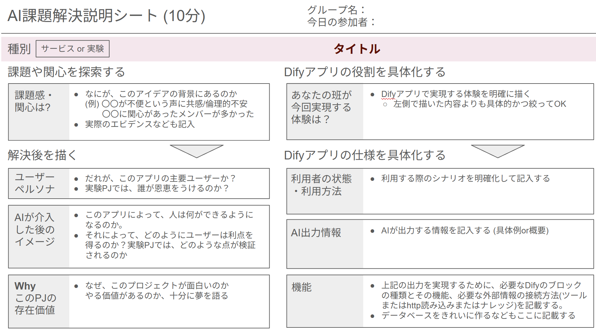
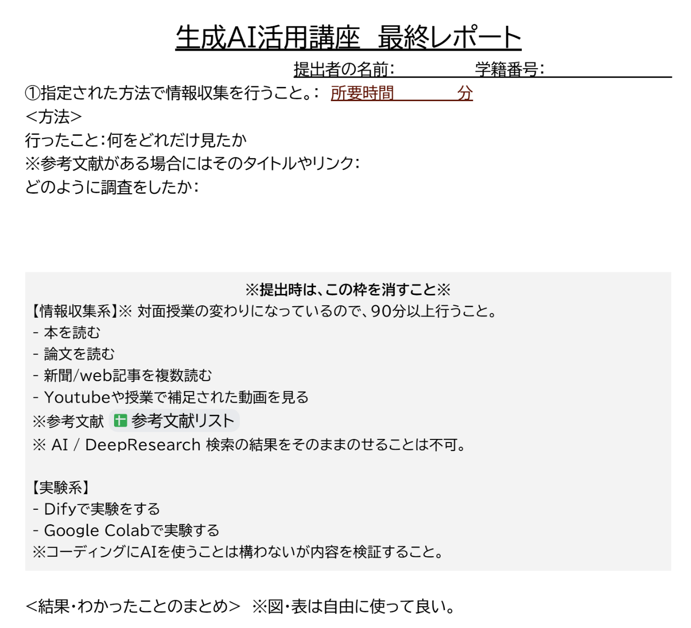

<!-- _class: cover-hero -->

生成AI活用講座 <b>第6回</b>

グループワークでの開発

2025/10/22 講師：田川 翔 
千葉大学 国際未来教育基幹 助教

<!--
- 第6回。今日はグループで開発と発表準備を行います。
-->

---

今日の授業について

# 今日の授業について

<b>流れ：</b> 
<b>グループで開発と発表準備を行う</b> 
- グループで分担して話をしても良い 
- 他のグループに話をしにいっても良い

<b>課題：</b> 
第5回の「AI課題解決説明シート」の修正と完成 
第6回の課題は<b>全員で第7回を仕上げること</b> 
　　① AI課題解決説明シート 
　　② DSLファイル 
　　③ 発表資料スライド + 実施結果

<b>評価基準の説明：</b> form

<!--
- 今日の流れと課題、評価基準の説明。
-->

---

第7回 課題のオーバービュー

# 第7回 課題のオーバービュー

みんなを驚かせよう！

<b>グループで実施するサービス開発・実験</b>

提出物 (グループで1つです)

(第5回の宿題として仮提出、教員feed back後、第7回で確定)

①AIでの課題解決説明シート 
 
②DifyアプリのDSLファイル 
③発表資料スライド + 実施結果

<b>授業中に実施すること</b>

4分半のプレゼン (時間厳守)

背景 + 目的 (なぜ必要？) 
Difyでの工夫 (画面見せる) 
出力のデモ 
結果 (可能であれば周囲の反応) 
気づいたこと

評価方法

<b>グループワークの相互評価</b> 
　　　 ※全員の採点 + 教員で補正 
チーム内での相互評価 
　※フリーライダー防止のため

<!--
- 提出物（グループで1つ）と、授業中のプレゼン・評価方法のオーバービュー。
-->

---

<!-- _class: divider -->

今の段階

<!--
- Slidoのインタラクションスライド。今の段階をみんなに聞く。
-->

---

評価URL

# 評価URL

<!--
- 評価フォームのURL（QRコード）。
-->

---

授業の目標

# 授業の目標

①[基礎知識]生成AIの背景の仕組み、　周辺のコンセプトを定性的に説明出来るようになる。 
　[応用]生成AIのリスクや得意な点・難しい点を理解し、　批判的思考力を働かせ生成AIを活用できる。 
②[統合と創造]社会または自分の課題解決のために　生成AIを活用したミニアプリを組み立てられる。 
③[価値づけ]生成AIと自分/社会がどのように　関わるべきか、自らの考えをもつ。

<!--
- この講座の3つの達成目標を再確認。
-->

---

第8回の提出物の解説

# 第8回の提出物の解説

<b>課題1</b>

<b>90分情報収集・実験</b>をして、 <b>120分くらい</b>で書く

<b>課題2</b>

<b>いままで自分が作ったものを</b> <b>なんか出す (第3回/4回)</b>

https://forms.gle/B7q3h8NTd23hinhWA

<!--
- 第8回の提出物（最終レポート）の様式と2つの課題の説明。
-->

---

11/5回補講・追加の解説

# 11/5回補講・追加の解説

<b>①質問・開発できます (宿題相当の時間)</b>

<b>②出席できんかった人：出席つきます</b>

<b>③試験受け忘れた、むっちゃ悪かった…と思った人</b>

追試験：11/5に別の問題セットで行います

<b>　※公欠の人は最大20点丸ごと入る</b>

<b>　※それ以外の人は、8割に縮めます</b>

<!--
- 11/5の補講でできること（質問・開発、出席、追試験）。
-->

---

今日の授業について

# 今日の授業について

<b>課題：</b> 
第5回の「AI課題解決説明シート」の修正と完成 
第6回の課題は<b>全員で第7回を仕上げること</b> 
　　① AI課題解決説明シート 
　　② DSLファイル 
　　③ 発表資料スライド + 実施結果

<b>来週は自習ですが、この部屋を抑えていて田川もいます。</b> 
<b>困ったら、すぐ連絡して下さい</b>

<!--
- まとめ。課題の再掲と、来週の自習回の案内。
-->
