<!-- _class: cover-hero -->

ALPSプログラム第11回シンポジウム 「教育と研究のはざまで：大学院生に求められる学びの支援を考える」

自分の経験から考える

大学院生を支える取り組みの 事例について

2025/11/4

千葉大学 国際未来教育基幹 
助教  田川 翔

<!--
藤本先生 (30秒)
-->

---

私の紹介

# 私の紹介

① 元々は理学の人

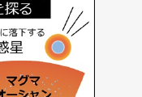

② 事務系総合職も

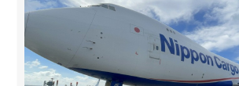

<b>- 航空のIT・企画</b> プロジェクトの実施 　現場での概念実証

③ AIと大学教育へ

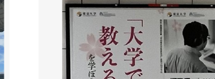

<b>- 教育の企画</b> 授業方法のプレFD 　生成AIと大学教育

<b>信念:</b>「良い課題を設定できる」、「他者と共に解決できる」

<!--
田川 (30秒)
-->

---

私の紹介

# 自分は、皆様に何をお伝えできるだろう？　❓️

語り得るのは、自分が<b>経験したこと</b>

・<b>理系分野の院生生活</b> 
・<b>分野を越えた居場所</b> 
・<b>理学博士の民間事務系総合職</b>

<b>周囲の方から伺えた「語り」をもとに、</b> 
<b>時系列にそってエピソード</b>をお話させて下さい

なぜ自分は、課題設定・協調性への信念を 
大学・大学院で形成することができたのだろう？

<!--
田川 (30秒)
-->

---

田川の年表

# 田川の年表

<table style="border-collapse:collapse; font-size:25px; margin-top:6px;">
<tr><td style="width:90px;"></td><td style="padding:6px 0;">宮崎で生まれ、高校までのんびり過ごす</td></tr>
<tr><td style="text-align:right; color:#888; padding-right:18px; font-weight:700;">2011 ●</td><td style="padding:6px 0;"><b>理工系大学 理・地球惑星</b> 入学</td></tr>
<tr><td style="text-align:right; color:#888; padding-right:18px; font-weight:700;">2017 ●</td><td style="padding:6px 0;"><b>総合大学　理・地球惑星</b> 入学 日本学術振興会特別研究員 (DC1)</td></tr>
<tr><td style="text-align:right; color:#888; padding-right:18px; font-weight:700;">2020 ●</td><td style="padding:6px 0;"><b>東京大学 大学総合教育研究センター 特任助教</b> など</td></tr>
<tr><td style="text-align:right; color:#888; padding-right:18px; font-weight:700;">2022 ●</td><td style="padding:6px 0;"><b>航空会社の事務系総合職</b> (地上業務/IT)</td></tr>
<tr><td style="text-align:right; color:#888; padding-right:18px; font-weight:700;">現在 ●</td><td style="padding:6px 0;"><b>千葉大学 国際未来教育基幹 助教</b></td></tr>
</table>

<b>信念:</b>「良い課題を持てる」、「他者と共に解決できる」

<!--
田川 (30秒)
-->

---

① 居場所を感じられること

# ① 大学(院)に居場所を感じられること

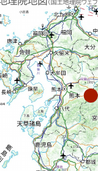

宮崎で生まれ、高校までのんびり過ごす

浪人

3.11

<table style="border-collapse:collapse; font-size:24px;">
<tr><td style="text-align:right; color:#888; padding-right:14px; font-weight:700;">2011 ●</td><td><b>理工系大学　理・地球惑星</b> 入学</td></tr>
<tr><td style="text-align:right; color:#888; padding-right:14px; font-weight:700;">2017 ●</td><td><b>理工系大学　理・地球惑星</b> 修了</td></tr>
</table>

<b>居場所の無さ / 不安 / ロールモデルの不在</b>

地理院地図（国土地理院ウェブサイト）

<!--
田川 (30秒)
-->

---

① 居場所を感じられること

# ① 大学(院)に居場所を感じられること

母校の良さ：大学教職員との近さ・フラットさ

学部入ってすぐから、<b>学ぶとはなにか</b>、面白い話を聞けた 
職員の方と働ける<b>学内アルバイト</b>や、<b>教・職・学協働</b>事例が複数あった

👤

職員

特に職員の多くは、教員・学生とは普段、どちらかと言うと「<b>対峙して</b>」関わり合っていることが多いかと思います。そうではなく、<b>同じ方向を向いて何かを進めることで、普段は辿り着けないような目標も達成できる</b>ようになると感じています。

<b>他者に相談できることを実感</b>

<!--
田川 (30秒)
-->

---

① 居場所を感じられること

# ① 大学(院)に居場所を感じられること

職員と学生の協働のために、何が必要と感じますか？

👤

職員

学振の申請受付なんかは、<b>学生にとっては「書類の提出先」でしかない</b>と思われていそうなところを、<b>「一緒に採択を目指す人」（≒有用な情報を出してくれる人）</b>になれるよう努めたりしました。(略)<b>結果としてその後大学全体では採択率の大幅アップ</b>...

👤

職員

初回、２回目のアイスブレイク。あとは<b>なるべく学生の自主性に任せる</b>。<b>お膳立てをしすぎることは、やる気を削いでしまいかねない</b>と思いました。(今しか出来ない)失敗は大いにしてほしい場でありました。

👤

教員

<b>共通の目的を共有して活動できたから</b>ではないかと、今は思っています。おそらく私自身も教員ではありますが、皆さんの指導教員ではなく、第三の教員のような立場だったから実現できたのかもしれません。

👤

職員

学生と一緒に何かを考えるのは、<b>純粋に学生に戻った気持ちで仕事をすることができることが多々あり</b>、楽しかったです。

<b>「斜め上の先輩」としての職員</b>

<!--
田川 (30秒)
-->

---

① 居場所を感じられること

# ① 大学(院)に居場所を感じられること

難しかった点はなんですか？

👤

職員

あくまでも教職員が管理して遂行しているプロジェクトの中で、新しい提案をしてもらう・伴走できるというのが良いと思います(自由に進めすぎると、学生がしたいことと教職員がしてほしいことが乖離して、進む方向をコントロールできなくなってしまう)。

👤

職員

プロジェクトには新しいことにチャレンジしたいという学生が集まっているので、リーダーとなる学生はそのワクワク感を潰さずにある程度のスピード感でメンバーの特性を生かしながら進めていくことが大事。

👤

職員

<b>学生の質が毎年変わるので、何か企画運営した際に、サービスの質のコントロールが難しい</b>。学生さんは、その時のリーダーや熱意によって、プロジェクトでできるかできないかが決まるので、今年は難しい、というようなことがあった。

👤

職員

こちらが働きかけても「対峙する相手」としか認識されないことがあることです。(実際、職員を味方と思わないのは、職員側の対応にきっかけがあるケースも多いと思いますので、なかなか難しい話ですよね。)

<b>簡単には、実装出来ず、試行錯誤が必要</b>

<!--
田川 (30秒)
-->

---

① 居場所を感じられること

# ① 大学(院)に居場所を感じられること

自分が経験した教・職・学生協働

<table style="border-collapse:collapse; font-size:23px;">
<tr><td style="text-align:right; color:#888; padding-right:12px; font-weight:700;">2011 ●</td><td><b>キャンパスガイド</b> (院生含む)</td></tr>
<tr><td style="text-align:right; color:#888; padding-right:12px; font-weight:700;">2012 ●</td><td><b>リベラルアーツセンター学生プロジェクト</b></td></tr>
<tr><td style="text-align:right; color:#888; padding-right:12px; font-weight:700;">2012 ●</td><td><b>図書館サポーター</b> (院生含む)</td></tr>
<tr><td style="text-align:right; color:#888; padding-right:12px; font-weight:700;">2015 ●</td><td><b>大規模オンライン授業サポーター</b> (院生)</td></tr>
<tr><td style="text-align:right; color:#888; padding-right:12px; font-weight:700;">2020 ●</td><td><b>オンライン教育支援サポーター</b> (院生含む)</td></tr>
<tr><td style="text-align:right; color:#888; padding-right:12px; font-weight:700;">現在 ●</td><td><b>千葉大学での勤務 +</b> (ALPS履修証明プログラム)</td></tr>
</table>

ニコ生、テレビ紹介etc…

大学の教養授業改革でのグループワークに発展

留学生とも協働

東大uteleconの一部へ

他大学の事例は例えば、木野 (2012 ナカニシヤ出版)や中里 (2022) 大学教育学会誌など

<b>学生も一緒に、大学をより良く出来る + 居場所に</b>

<!--
田川 (30秒)
-->

---

① 居場所を感じられること

# ① 大学(院)に居場所を感じられること

<b>大学のラボでも居場所</b>づくり

理系は、集団作業というイメージがあるからこそ、却って孤独を感じやすい (フィリップス&amp;ピュー 2018)

👤

後輩

先輩と<b>「こんな研究したら面白いよね、Natureかもね」という議論やアウトプット</b>が行えたこと、<b>楽しく未来に希望を持って研究を進めていくことは、そもそもメンタル的</b>にとても大事と思います。外食しながらアイデアを伺ったときのワクワクは今も鮮明に覚えています。<b>夢を語れる研究に情熱的な先輩だった</b>のはとても良かったです。

👤

後輩

実験室にいる時間が長かった。→<b>研究していて孤独に感じることが少なかった。</b>田川さんの方が実験していたので、自然と自分も研究に向き合う時間が増えた。

👤

後輩

<b>人柄的にも、つかまりやすいという意味でも、話しかけやすい</b>、という点が後輩としては助かりました。わからないことや行き詰ったことがあるときに相談ができないと結構なタイムロスを生んでしまい、時間がたてばたつほど言いづらくもなってきます。

<b>ラボの雰囲気を作るのは院生 ▶ 学び支え合う場作り</b>

<!--
田川 (30秒)
-->

---

② 多様な学習機会

# ② 多様な学習機会があること

UC Berkeley 短期留学

<table style="border-collapse:collapse; font-size:24px;">
<tr><td style="text-align:right; color:#888; padding-right:14px; font-weight:700;">2017 ●</td><td><b>理工系大学 理・地球惑星</b> 修了 <b>総合大学 理・地球惑星</b> 入学</td></tr>
<tr><td colspan="2" style="padding:6px 0 2px;">大学院共通教育で救われる</td></tr>
<tr><td style="text-align:right; color:#888; padding-right:14px; font-weight:700;">2020 ●</td><td><b>総合大学 理・地球惑星</b> 修了 博士 (理学)取得</td></tr>
</table>

友達いない

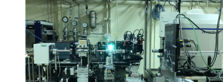
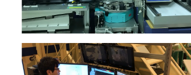

<b>先細りへの不安 / 終われるかの不安</b>

<!--
田川 (30秒)
-->

---

② 多様な学習機会

# ② 多様な学習機会があること

UC Berkeleyでの院生支援

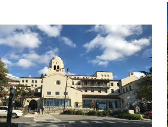

教員・研究者たらしめる能力の確立

📝 ライティングとコミュニケーションスキル 
🤝 リーダーシップとコラボレーション 
⚖️ 公正さとインクルージョン 
👨‍🏫 教える力とメンタリング 
🔍 研究力・データ分析力 
🧠 キャリア探索とその準備

<b>道具立て/ 機会の幅・ 回数の差</b>

https://grad.berkeley.edu/professional-development/guide/　※ 国内だと、名古屋大学のフレームワークなどあり

<b>話せる場 + Writing Centerなどの大学院生支援</b>

<!--
田川 (30秒)
-->

---

② 多様な学習機会があること

# 院生時代に欲しかったことはなんですか？

配布のみ授業外の学びの支援のコメント多数

<b>アカデミックライティング支援</b>

後輩 大学院生支援か…。<b>授業が少なくなって行動範囲が意識しないと狭まるから、学内のイベント情報とかを積極的に流してもらえると嬉しいかも</b>。分野外の人と関わる機会減るよね。

同級生 <b>雑談したりする溜まり場的なスペースと時間の余裕。</b> <b>過去の先輩のナレッジやデータ。</b>

後輩・同期 <b>先輩の就活経験や博士課程の実際など</b>を後輩に教えてもらえると大学院生は嬉しい気がします。指導教員には教えられないと思いますので。

<!--
- 院生時代に欲しかったこと。授業外の学びの支援を求めるコメントが多かった。アカデミックライティング支援、学内イベント情報、溜まり場、先輩のナレッジ、就活・博士課程の実際など。
- 教職員/先輩/ラボでの「外を見て良い」雰囲気作りも重要では。
-->

---

② 多様な学習機会があること

# 大学院共通教育の価値

<b>プレFD</b>： 授業の作り方や大学教員の「教え方」を学ぶ

フューチャー ファカルティ プログラム

模擬授業 &amp; フィードバック

アカデミック・ポートフォリオ

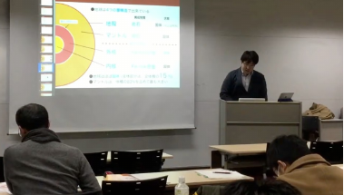
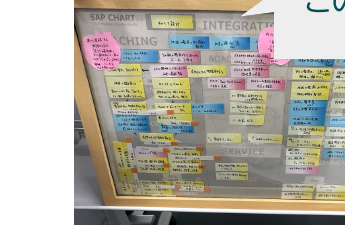

この授業が転機で、 今の仕事に。

気分転換 ＋ 自分を知る ＋「同志」を得る

<!--
- 大学院共通教育の価値。プレFDで授業の作り方や教え方を学ぶ。フューチャーファカルティプログラム、模擬授業とフィードバック、アカデミック・ポートフォリオ。この授業が転機で今の仕事に。気分転換、自分を知る、「同志」を得る。
-->

---

③ 成長した実感があること

# 大学院時代、うまくいくことなんて、そう、ない

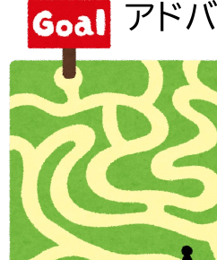

そもそも、<b>答えがない問い</b>に取り組んでいる アドバイスはくれても、<b>世界で誰も、正解は知らない</b>

<b>自分が選んだ問い</b>

→ 実験プロトコルがない

<b>博士2年の冬まで全く光が見えない</b>

失敗は成功に近づく過程

Nature Communications — <i>Experimental evidence for hydrogen incorporation into …</i> <a href="https://www.nature.com/articles">https://www.nature.com/articles</a>

信じて一緒に実験して下さった、教員・皆様に感謝

<!--
- 成長した実感があること。大学院時代、うまくいくことなんてそうない。答えのない問いに取り組み、世界で誰も正解を知らない。自分が選んだ問いには実験プロトコルもなく、博士2年の冬まで全く光が見えなかった。失敗は成功に近づく過程。信じて一緒に実験してくださった教員・皆様に感謝。
-->

---

③ 成長した実感があること

# 褒められない/喜びも少ないとき、どう乗り越える？

後輩 論文講読や実験手法の議論を通じて一緒に勉強してくださった。<b>研究の進め方のメンタリング</b>にあたる？

後輩 <b>実験メンタリングが最も重要</b>と思います。PIは必ずしも研究テーマにおけるデータ採取のスペシャリストとは限らず、学生がPIより詳しいということはよくあります。

<b>①</b> <b>人と話すこと / 外に目を向ける時間を作ること</b>

<b>②</b> <b>メンター制度や成長を可視化するアプリ/AIがあればなぁ…</b>

院生時代の「もがき」を伴走する他者/仕掛けの重要性

<!--
- 褒められない・喜びも少ないとき、どう乗り越えるか。研究の進め方・実験のメンタリングが重要。乗り越え方は①人と話す・外に目を向ける時間を作る、②メンター制度や成長を可視化するアプリ/AIがあれば。院生時代の「もがき」を伴走する他者/仕掛けの重要性。
-->

---

# そうして、大学院を終えた後

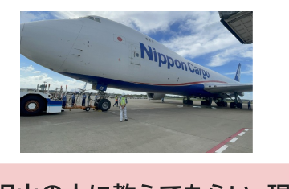

<b>2022年、</b> 中規模の国際航空貨物会社の<b>総合職事務系</b>に。 周囲には、博士卒なんていませんでした。

<b>自分のもがきは、無駄でなかったことを知る</b>

同僚 本当に話しやすいですね。どんなに忙しくてもいつも笑顔だし、色んなこと教えてくれるし、ご飯に誘ってくれるし、良いところがたくさんあります。(中略)<b>相手の立場に立って物事を考えるって大切なことですけど、なかなかできないことです</b>。

沢山の人に教えてもらい、現場で共に話し、自分の得意を活かす機会を頂けました。

案外、もがいた経験はトランスファラブルスキルや課題設定力になっている…？

<!--
- そうして大学院を終えた後。2022年、中規模の国際航空貨物会社の総合職事務系に。周囲に博士卒はいなかった。自分のもがきは無駄でなかったことを知る。沢山の人に教えてもらい、現場で共に話し、自分の得意を活かす機会を頂けた。案外、もがいた経験はトランスファラブルスキルや課題設定力になっているのかもしれない。
-->

---

# そうして、大学院を終えた後

2020

<b>東京大学 大学総合教育研究センター 特任助教</b> など コロナ禍

過去の経験で職が！　<b>憧れの空</b>と<b>世界</b>に挑む

2022

<b>航空会社の事務系総合職</b> （地上業務/IT）

現在

<b>千葉大学 国際未来教育基幹 助教</b>

<b>信念:</b>　「良い課題を持てる」、「他者と共に解決できる」

そんな信念に繋がる、大学院教育やAI利活用を構想できる機会と思っています

<!--
- 大学院を終えた後の年表。2020年に東京大学 大学総合教育研究センター 特任助教など、コロナ禍。過去の経験で職が得られ、憧れの空と世界に挑む。2022年に航空会社の事務系総合職（地上業務/IT）、現在は千葉大学 国際未来教育基幹 助教。信念は「良い課題を持てる」「他者と共に解決できる」。そんな信念に繋がる、大学院教育やAI利活用を構想できる機会と思っている。
-->

---

# 最初の問いへの、自分なりの答え

なぜ、自分は大学/院で信念を持てたのか？

多くの人に出会い、支えてもらえたこと 
専門と専門外の両方に、多くの機会があったこと 
機会を自ら掴む、価値観を持てていたこと

▶ <b>自己効力感</b>の先行要因

<b>遂行行動の達成</b>：自分自身が実際に成功体験を積むこと

<b>代理経験</b>：他者の成功や失敗の観察

<b>言語的説得</b>：他者からの励ましや説得

<b>生理的・情動的状態</b>：ストレスや不安などの身体反応

Bandura, A. (1977). "Self-efficacy: Toward a unifying theory of behavioral change." <i>Psychological Review</i>, 84(2), 191-215.

<!--
- 最初の問いへの自分なりの答え。なぜ大学・院で信念を持てたのか。多くの人に出会い支えてもらえた、専門と専門外の両方に多くの機会があった、機会を自ら掴む価値観を持てていた。これらは自己効力感の先行要因（Bandura 1977）：遂行行動の達成、代理経験、言語的説得、生理的・情動的状態。
-->

---

<!-- _class: message -->

# まとめ

大学院の学生を支える取り組みで 自分が重要と考えること

<b>① 居場所づくり</b>や<b>学びの場作り</b> 
<b>② 学びの掛け算 (道具立て、共通教育、専門外)</b> 
<b>③ 成長実感をなんらか感じられる仕掛け</b>

後ほどのパネルディスカッションでも、 よろしくお願いいたします。

エピソードを頂いた、教員、職員、後輩、同期、同僚の皆様に感謝します。

<!--
- まとめ。大学院の学生を支える取り組みで自分が重要と考えること。①居場所づくりや学びの場作り、②学びの掛け算（道具立て、共通教育、専門外）、③成長実感をなんらか感じられる仕掛け。後ほどのパネルディスカッションでもよろしくお願いします。エピソードを頂いた教員、職員、後輩、同期、同僚の皆様に感謝します。
-->
