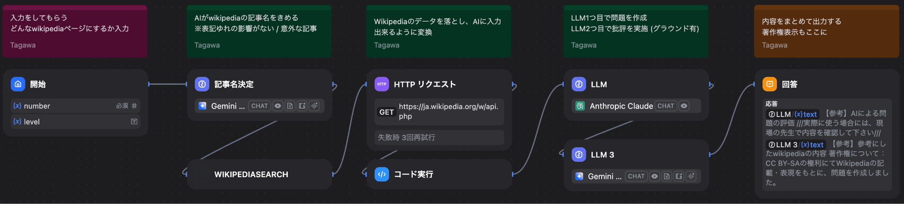

<!-- _class: cover-hero -->

生成AI活用講座

第7回

2025/11/12　講師：田川 翔 
千葉大学 国際未来教育基幹 助教

<!--
- 第7回。今日は各班の発表と相互評価を行います。
-->

---

発表と評価を行います

# 流れ

　※ 今日は適当に座席に座って下さい。 
　※ 机がない人は椅子のみでお願いします。 
　　　→部屋の予約があるそうで、机が出せません。

<b>4:00 - 4:30で発表、次の班に30秒で交代</b>

<b>その間に、採点を完了して下さい</b>

<b>次の班の人は、前の椅子で待機すること</b>

<b>評価は自分の班には行わない事 (他の班のみ)</b>

<!--
- 発表4分→30秒で交代。待機中に採点を完了。自分の班は評価しない。
-->

---

採点フォーム

<a href="https://forms.gle/FrXVTav92ahiwbg56" style="color:var(--tag-blue);">https://forms.gle/FrXVTav92ahiwbg56</a>

全員一括で実施 / 自分のグループには<b style="color:var(--accent-dark);">答えない</b>こと

<!--
- 採点フォームのQR。全員一括で。自分のグループには答えない。
-->

---

AI課題解決説明シート

AI課題解決説明シート

<b>種別</b>　サービス or 実験

タイトル：____

グループ名：____　今日の参加者：____

<table class="ws">
<tr><td class="sec" colspan="2">課題や関心を探索する</td><td class="sec" colspan="2">Difyアプリの役割を具体化する</td></tr>
<tr>
<td class="lbl">課題感・ 関心は?</td>
<td>なにが、このアイデアの背景にあるのか (例) 〇〇が不便という声に共感/倫理的不安　　〇〇に関心があったメンバーが多かった　実際のエビデンスなども記入</td>
<td class="lbl">あなたの班が 今回実現する体験は？</td>
<td>Difyアプリで実現する体験を明確に描く　左側で描いた内容よりも具体的かつ絞ってOK</td>
</tr>
<tr><td class="sec" colspan="2">解決後を描く</td><td class="sec" colspan="2">Difyアプリの仕様を具体化する</td></tr>
<tr>
<td class="lbl">ユーザー ペルソナ</td>
<td>だれが、このアプリの主要ユーザーか？　実験PJでは、誰が恩恵をうけるのか？</td>
<td class="lbl">利用者の状態 ・利用方法</td>
<td>利用する際のシナリオを明確化して記入する</td>
</tr>
<tr>
<td class="lbl">AIが介入 した後の イメージ</td>
<td>このアプリによって、人は何ができるようになるのか。それによって、どのようにユーザーは利点を得るのか？実験PJでは、どのような点が検証されるのか</td>
<td class="lbl">AI出力情報</td>
<td>AIが出力する情報を記入する (具体例or概要)</td>
</tr>
<tr>
<td class="lbl">Why <small>このPJの存在価値</small></td>
<td>なぜ、このプロジェクトが面白いのかやる価値があるのか、十分に夢を語る</td>
<td class="lbl">機能</td>
<td>上記の出力を実現するために、必要なDifyのブロックの種類とその機能、必要な外部情報の接続方法(ツールまたはhttp読み込みまたはナレッジ)を記載する。データベースをきれいに作るなどもここに記載する</td>
</tr>
</table>

<!--
- 発表に使う説明シートのテンプレ。左＝課題探索／解決後、右＝Difyアプリの役割・仕様。
-->

---

どんなことを実現したいと思ったか？

# どんなことを実現したいと思ったか？ (一言で！)

<b>種別</b>　サービス

Wikipediaを問題化！

課題感・関心は? <small>動機は？</small>

●わかるけど、覚えられる気がしない！

ユーザーペルソナ

●<b>探究する高校生を指導する高校教師</b>

Why <small>アプリの存在価値</small>

●<b>調べ学習が間違えにくい</b>

機能 <small>なにが出来るのか</small>

●<b>wikipediaの記事を問題にしてくれる</b>

<!--
- 田川 (30秒)。Wikipediaを問題化するサービス。覚えられる気がしない、を解決。
-->

---

デモ

# デモ

<b>アプリの実行可能なURL：</b> 
<a href="https://chiba-u-ai25-g3.xvps.jp/chat/NhJOWFqCfSbD9zPw" style="color:var(--tag-blue);">https://chiba-u-ai25-g3.xvps.jp/chat/NhJOWFqCfSbD9zPw</a>

<b>画面で実際に見せるので、皆さん自身でも使って見てください</b> 
<b>or 動画や写真、出力のメモでも可能</b> 
<b>4分に収まるように、うまくやって下さい</b>

<!--
- 田川 (30秒)。実行URLを共有。画面で実演 or 動画/写真/メモ。4分に収める。
-->

---

Dify の構成と入出力

# Dify の構成と入出力

<b>使用した機能・工夫</b> 
　① ツール (wikipediaサーチ) 
　② LLMを2個 (critic AI的に) 
③ httpリクエストで記事丸ごと落とす 
④ 落とした記事を探して文字にするコード実行 (自作！) 
⑤ 回答の中に著作権や注意を表示

<b>入力</b>　① 問題にしてほしい概念・単語　② 問題数/レベル感

<b>出力</b>　① 四択問題　② その解説　③ 記事自体

<!--
- 田川 (30秒)。ツール＋LLM2個＋httpリクエスト＋自作コード実行。入力＝概念/問題数、出力＝四択問題/解説/記事。
-->

---

倫理面での対応 / 難しかった点

# 倫理面での対応　/ 難しかった点

倫理上の課題

著作権： wikipediaの文章を使う場合は明示必要<b>→出力に明示する</b> 
そのまま使って、誤った問題が出る懸念<b>→教員に確認を依頼する文章を出し、AIでも一回確認</b>

困った点・“ウリ”

<b>wikipediaの記事をダウンロードしたデータのurlを指定するコードは自作です！(toolでは出来なかった)</b> 
特にhttpリクエストで落とすと、dify内部のファイルに入ってしまうようで、そのurl処理が大変でした 
<b>問題のレベルを学年で指定してみた (案外機能した)</b>

<b>努力時間： 1人で4時間… + スライド作成</b>

<!--
- 田川 (30秒)。著作権の明示・誤問対策。自作コードでurl処理が大変。学年指定が案外機能。努力4時間。
-->

---

気づいたこと・感想・まとめ

# 気づいたこと・感想・まとめ

出力をみた 気づき

●wikipediaを読むと、わかった気になっていることがわかった (問題を答えられなかった / 結構意外！)

作ってみた 気づき

●案外、ファイル処理のような細かいところが難しい…

●AIを問題を作るうえでの相棒にはできそう

課題

●AIに、良い問題を出す方法を教えたい

幾つか試した結果、Claudeで乗り切っている…

本当は、教育学的な方法論があるのでは？

感想

●<b>思ったより楽しくて、一人で満足しました</b>

<!--
- 田川 (30秒)。読むと分かった気になる。ファイル処理が難しいがAIは相棒に。良い問題の作り方を教えたい。楽しかった。
-->

---

<!-- _class: divider -->

課題

# 課題

全員一括で実施 / 自分のグループには<b style="color:var(--accent-dark);">答えない</b>こと

<!--
- まとめ。課題は全員一括で実施。自分のグループには答えない。
-->
