# 開始に先立ち

① グループワークがあるので、会場の方は近めにお座り下さい

② Gmailアカウントをご用意下さい

個人 gmail / 学校などのgmail、いずれもOK

※他のAIも可ですが、一部演習が出来ません

③ google検索し、Slidoにアクセスして下さい

<b>slido</b>　イベントに参加する？　<b># gb|25</b>

<!--
- 開始に先立ち、3点お願い。①グループワークがあるので会場の方は近めに、②Gmailアカウントをご用意、③Slidoにアクセス。
-->

---

<!-- _class: cover-hero -->

AI時代の教え方

大学教育への事例をもとに

大学における生成AIとの関わり方を考える　15-min × 6 sessions

グローバルビジネス学会 研究発表会 
2025/11/30 大阪大学 
千葉大学 国際未来教育基幹 田川 翔

<!--
- タイトルコール。「AI時代の教え方 — 大学教育への事例をもとに」。15分×6セッションで、大学における生成AIとの関わり方を考えます。
-->

---

講師紹介

# 田川　翔たがわ　しょう

<b>所属：</b>千葉大学 高等教育センター/アカデミックリンクセンター

大学教育を設計し、学生と教員を支援する仕事

① 元々は理学の人

② 色々な経験

- 大学のICT支援 (コロナ禍) 
- AI×大学 
- 大規模オンライン授業の作成 
- 民間企業での経験

③ 大学を学びやすく!

大学での教え方／生成AIの教育利活用

現在、<i>Teaching with AI</i> を翻訳・出版準備中（2026春、技術評論社より）

<!--
- 講師紹介。①元々は理学（地球科学）の人、②大学ICT支援やAI×大学など色々な経験、③大学を学びやすくする仕事をしています。Teaching with AIを翻訳出版準備中。AIで学び方は変わる？学習や研究の相棒に出来る？
-->

---

生成AI活用講座

# 生成AI活用講座 / Hands-on Generative AI Workshop学部1 - 2年生向け

<b>大規模言語モデルを知る</b>

<b>生成AIアプリを作ってみる</b>

テスト

グループワーク

レポート

<b>AIとの関わり方を考える</b> 
<b>AIリテラシ/倫理</b> 
・人間中心のAI社会原則 
・安全性　・プライシー 
・透明性　・公平性　・説明可能性

・<b>AIの活用例</b> →企業での活用例を調査 
・生成AIの自分なりの説明 
・<b>AIとの関わり方レポート</b>

<!--
- 生成AI活用講座（学部1-2年生向け）。大規模言語モデルを知り、生成AIアプリを作り、AIとの関わり方を考える。AIリテラシ/倫理（人間中心のAI社会原則）を扱い、テスト・グループワーク・レポートで評価します。
-->

---

生成AI活用講座

# 1テーマ 15分間完結

演習付き　(オンラインの皆様もぜひ！)

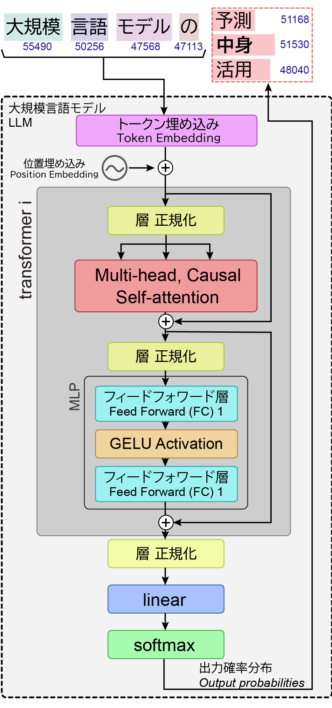

<b>Unit 1： AI"を"教える</b>

Session 1　AIの正体を解剖する

Session 2　<b>演習：</b>生成AIの仕組みを体験する

<b>Unit 2: AI"で"楽する</b>

Session 3　プロンプトを書くコツ

Session 4　<b>演習:</b> 自作アプリを作ってみる

<b>Unit 3: AI"と"教える</b>

Session 5　AIと授業の関係性

Session 6　<b>演習:</b> 授業での活用を考える

<!--
- 1テーマ15分間完結、演習付き（オンラインの皆様もぜひ）。3つのUnitで構成。Unit1 AIを教える、Unit2 AIで楽する、Unit3 AIと教える。各Unitに講義と演習のSessionがあります。
-->

---

今日のお土産

# 今日のお土産

<b>① スキル：</b>

生成AIのプロンプトを学べます。GemやNotebookLMを体験できます。活用について、自分の意見を持てます。

<b>② 1枚俯瞰シート：</b>　丸わかりシートをゲットできます。

<b>③ 生成AI用のプロンプト：</b>　プロンプト作成を支援してくれます。

<b>お詳しい先生は、ぜひ演習で他の方をご支援下さい</b>

<!--
- 今日のお土産は3つ。①スキル（プロンプト・Gem/NotebookLM体験・自分の意見）、②1枚俯瞰シート、③生成AI用のプロンプト。お詳しい先生は、ぜひ演習で他の方をご支援下さい。
-->

---

<!-- _class: divider -->

Session 1

# AIの正体を解剖する

<h2>大学における生成AIとの関わり方を考える　15 - min × 6 sessions</h2>

<!--
- ここからSession 1「AIの正体を解剖する」。15分×6セッションの最初です。
-->

---

Session 1の目的・到達目標

# Session 1の目的・到達目標

目的

<b>Session 1：</b>

AIの正体を解剖する

目標

・<b>利活用の前提知識</b>を知る 
・<b>大規模言語モデル</b>の中身をイメージできる 
・生成AIサービスの<b>レイヤー</b>がわかる

<!--
- Session 1の目的は「AIの正体を解剖する」。目標は3つ。利活用の前提知識を知る、大規模言語モデルの中身をイメージできる、生成AIサービスのレイヤーがわかる。
-->

---

Slido アンケート

# 生成AIをどのくらい使われていますか？

<b>📊 Slido ライブアンケート</b> 
会場・オンラインの皆様、ご回答ください

<!--
- 📣 This is Slido interaction slide, please don't delete it.✅ Click on 'Present with Slido' and the poll will launch automatically when you get to this slide.
-->

---

Slido アンケート

# 生成AIについて、どのくらい自由自在に使えますか

<b>📊 Slido ライブアンケート</b> 
会場・オンラインの皆様、ご回答ください

<!--
- 📣 This is Slido interaction slide, please don't delete it.✅ Click on 'Present with Slido' and the poll will launch automatically when you get to this slide.
-->

---

Slido アンケート

# 使う用途はなんですか

<b>📊 Slido ライブアンケート</b> 
会場・オンラインの皆様、ご回答ください

<!--
- 📣 This is Slido interaction slide, please don't delete it.✅ Click on 'Present with Slido' and the poll will launch automatically when you get to this slide.
-->

---

大前提

# 大前提

<b>生成AIの利活用に、現時点で正解はあるか？</b>

<b>生成AIは、学習・研究で不可欠な相棒か？</b>

<b>生成AI時代は学び方を必ず変えないといけないか？</b>

▶ No！

<b>… しかし、生成AI技術は進歩し、仕事や研究にも影響を与えつつある</b>

受講者の皆様が、生成AIは「相棒になるか」を<b>自ら考え</b>、<b>必要なときに、使えるようになる</b>ことが重要

<b>生成AIとの付き合い方</b>を決めるのは<b>みなさま自身</b>

<!--
- 大前提。生成AIの利活用に現時点で正解はあるか？ No。学習・研究で不可欠な相棒か？ 学び方を必ず変えないといけないか？ いずれもNoです。しかし生成AI技術は進歩し、仕事や研究にも影響を与えつつある。受講者の皆様が「相棒になるか」を自ら考え、必要なときに使えるようになることが重要。付き合い方を決めるのはみなさま自身です。
-->

---

生成AIの活用領域

# 生成AIの活用領域

<a href="https://arxiv.org" style="color:var(--tag-blue);text-decoration:none;">Anthropic (2025 ArXiv) リンク</a>

プライバシーの保護を保った状態で、 400万以上のClaude.aiの会話を分析

→どの経済的タスクにAIが利用されているか把握

米国労働省のO*NET実会話DBから類似性分類

何をしたか

全体として分かったこと

① Software 開発とWritingで半分

② 36%の職業にAIが利用されている

③ スキル増強：自動化 = 57 : 43

教育での利用

チュータリングタスクが多い

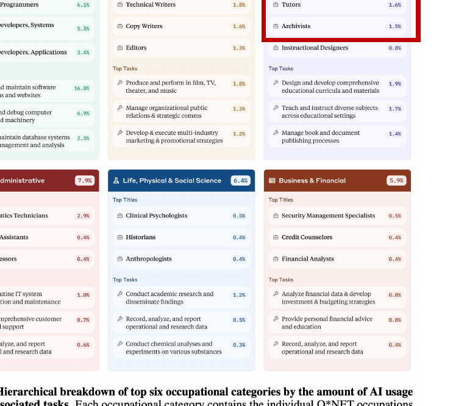

Figure 2: Hierarchical breakdown of top six occupational categories by the amount of AI usage in their associated tasks.

<!--
- Anthropicが、プライバシーを保ったまま400万件以上のClaude.aiの会話を分析した研究。O*NETの実タスクとの類似性で、どの経済的タスクにAIが使われているかを把握した。
- 全体では、ソフトウェア開発とWritingで半分。36%の職業でAIが利用され、スキル増強と自動化の比は57:43。教育ではチュータリングが多い。
-->

---

生成AIの影響

# 参考： 職業への影響

内閣府(2024) 世界経済の潮流＞第1章＞p.13

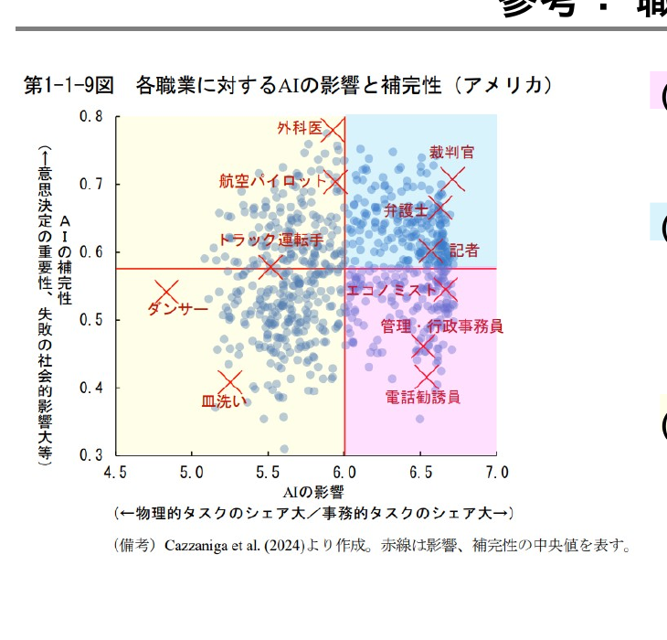

<b>AIの影響が大きく、代替性が高い職業：</b>事務的タスクのシェアが大きい職業。▶ つまり、AIがとって変わってしまう職業

<b>AIの影響が大きく、補完性が高い職業：</b>事務的タスクのシェアが大きいものの、意思決定の重要性が高く、AI任せとすることが社会的に望ましくない職業。▶ AIを使いこなす必要のある職業

<b>AIの影響の小さい職業：</b>物理的タスクのシェアが大きい職業。

※ 教員・研究者(自然科学系)は、青の領域

<!--
- 内閣府の資料。横軸がAIの影響、縦軸が補完性（意思決定の重要性）。代替性が高い＝AIに置き換わる職業、補完性が高い＝AIを使いこなす必要のある職業、影響の小さい職業＝物理的タスク中心。
- 教員・研究者（自然科学系）は青の領域、つまりAIを使いこなす側。
-->

---

事例：千葉大学の指針

# 千葉大学における生成AIの指針(令和5年10月13日)

①<b>「生成AIについての学び」</b>　②<b>「生成AIを用いた学び」</b> 
③<b>「生成AIによらない学び」</b>をそれぞれ推進

授業での利用は、授業の目的に合致することが前提であり、合致するかは、各授業の担当教員が判断

禁止の場合はシラバスなどに明示 （気になったら先生に聞きましょう！）

<a href="https://drive.google.com/file/d/1ZultuLWXNLJ53M43ExrYG8cIfwqcCnCO/view?pli=1">https://drive.google.com/file/u/2/d/1ZultuLWXNLJ53M43ExrYG8cIfwqcCnCO/view?pli=1</a> 
森本(2024/9まで) ChatGPT/生成AIへの対応を表明した国内の大学一覧　<a href="https://note.com/pogohopper8/n/n3126b312f209">https://note.com/pogohopper8/n/n3126b312f209</a>

まずは、ご自身の所属機関のポリシーと提供AIを確認しましょう

<!--
- 千葉大学の指針（令和5年10月13日）。「生成AIについての学び」「生成AIを用いた学び」「生成AIによらない学び」の3つをそれぞれ推進。
- 授業での利用は、授業の目的に合致することが前提で、合致するかは各授業の担当教員が判断。禁止の場合はシラバスに明示される。気になったら先生に聞きましょう。
-->

---

オプトアウト

# 利用規約を確認する必要性： あなたの入力データは、誰が見る?

ChatGPT にメッセージを送ると、<u>規約</u>に同意され、<u>プライバシーポリシー</u>に従って入力データが扱われます。

ChatGPT(特に無料版)の場合、 <b style="color:var(--accent-dark);">ユーザーの入力は原則、学習に使われる</b>(と思っておいた方が良い)。

<b style="color:var(--accent-dark);">機微を含むならオプトアウト(自分の入力の学習の停止)する</b>

→ <a href="https://help.openai.com/en/articles/7730893-data-controls-faq">https://help.openai.com/en/articles/7730893-data-controls-faq</a>

機密情報の入力には、十分注意して下さい 所属組織が、推奨するAIを確認！

<!--
- 利用規約の確認は重要。あなたの入力データは誰が見るのか。ChatGPTにメッセージを送ると規約に同意したことになり、プライバシーポリシーに従って扱われる。
- 無料版は特に、ユーザー入力は原則学習に使われると思っておいた方が良い。機微情報を含むならオプトアウト（学習停止）する。機密情報の入力には十分注意し、所属組織が推奨するAIを確認すること。
-->

---

オプトアウト

# 多くの大学で提供されている、iPaaS内のAIサービス

Google

Gemini / NotebookLM

Microsoft

Copilot

<!--
- 多くの大学で提供されているiPaaS（クラウド統合基盤）内のAIサービス。GoogleならGeminiやNotebookLM、MicrosoftならCopilot。
- これらはエンタープライズデータ保護が適用されるので、まずは大学が提供しているこれらのサービスを確認・利用するとよい。
-->

---

最低限のAI倫理

# 最低限のAI倫理

<b>詳しく学ばれたい方 → 検定のシラバス・教科書</b>　GUGA検定、G検定、Google AI Leader

AIの情報を利活用するうえで重要な姿勢はどれですか

出力を素直に受け入れる 　 生成AIに情報が正しいか聞く　 原則、自身が責任を取る

人間中心の AI 社会原則で重要とされる最も価値はなんですか。

人がリテラシを持たなくても正しく動くAIをつくる　　AIによる効率化が重要である 
AI の利用は基本的人権を侵すものであってはならない　　AIが人の代わりに作業する

AIの倫理的問題について、正しい文章はどれですか。

AIの倫理的問題はすでに解決した　 AI の倫理的問題は技術進歩で解消される　 
AIの倫理的課題は技術の問題ではなく人が考えるべきだ 　 AIの倫理的課題は議論が進まない

<!--
- 最低限のAI倫理。詳しく学びたい方は、GUGA検定・G検定・Google AI Leaderなどの検定のシラバスや教科書が便利。
- ここでクイズ。AI情報の利活用で重要な姿勢、人間中心のAI社会原則で重要な価値、AIの倫理的問題について正しい文章はどれか、を考えてもらう。
-->

---

最低限のAI倫理

# 最低限のAI倫理

<b>詳しく学ばれたい方 → 検定のシラバス・教科書</b>　GUGA検定、G検定、Google AI Leader

人間中心の AI 社会原則

懸念となる諸概念

倫理

バイアス　／　ハルシネーション　／　公平性 安全性　／　透明性　／　説明可能性

法制度

個人情報保護　／　著作権

cf. 大学関係者の皆様

大学・高専における生成AIの教学面の取扱いについて

cf. 初等中等教育の皆様

初等中等教育段階における生成 AI の利活用に関するガイドライン

EUのAI倫理について教えて、等の形で、ぜひDeepResearch やNotebookLMを使って見て下さい

<!--
- 人間中心のAI社会原則で懸念となる諸概念。倫理面では、バイアス・ハルシネーション・公平性・安全性・透明性・説明可能性。法制度面では、個人情報保護・著作権。
- 大学関係者なら「大学・高専における生成AIの教学面の取扱いについて」、初等中等教育なら関連ガイドラインを参照。EUのAI倫理などは、DeepResearchやNotebookLMで調べてみると良い。
-->

---

深層学習

# 深層学習

<b>機械学習：</b>データから、「機械」（コンピューター）が自動で「学習」し、データの背景にあるルールやパターンを発見する方法。

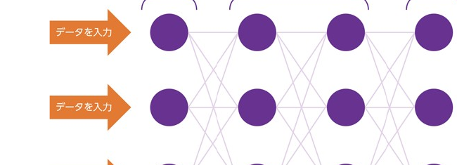

<b>深層学習：</b>多数の層から成るニューラルネットワークを用いて行う機械学習

2024年ノーベル物理学賞

学習

<b>入力</b> <b>出力</b>

<b>パラメーター</b> <b>の函</b> 数字の羅列

<b>評価</b> 更新⟲

利用 (推論・生成)

<b>入力</b>

<b>パラメーター</b> <b>の函</b> 数字の羅列

<b>出力</b>

『R1 総務省 情報通信白書』総務省(2019)

<!--
- 機械学習とは、データから機械（コンピューター）が自動で学習し、データの背景にあるルールやパターンを発見する方法。
- 深層学習は、多数の層から成るニューラルネットワークを用いて行う機械学習。2024年のノーベル物理学賞のテーマでもある。
- 学習時は、入力・出力をもとにパラメーター（数字の羅列）を評価・更新する。利用（推論・生成）時は、入力をパラメーターの函に通して出力を得る。
-->

---

深層学習

# 大規模言語モデルの中身 → ◯ 巨大な数字の塊　✗知識集・ルール集

日本の首都__→日本の首都は__→日本の首都は東京__

ネクストワードプレディクション

<b>次の言葉(トークン)の確率を予想する問題</b>

学習

<b>入力</b> <b>出力</b>

<b>パラメーター</b> <b>の函</b> 数字の羅列

<b>評価</b> 更新⟲

GPT 4：アメリカ議会図書館の<b>全蔵書の約22倍</b>相当? ※書籍、記事、ウェブサイト、コードなど幅広いテキストソースを元に学習している

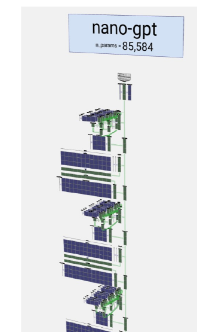
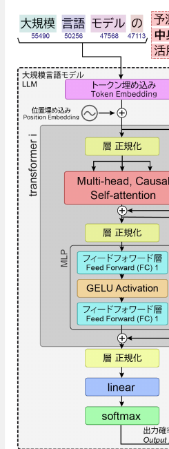

LLM Visualization ©Bycroft 2023

<!--
- 大規模言語モデルの中身は、知識集やルール集ではなく、巨大な数字の塊。
- やっているのはネクストワードプレディクション、つまり次の言葉（トークン）の確率を予想する問題。「日本の首都」の続きを一語ずつ予測していくイメージ。
- GPT-4は、アメリカ議会図書館の全蔵書の約22倍相当のテキストを学習しているとも言われる。書籍・記事・ウェブ・コードなど幅広いソースから学習している。
-->

---

ハルシネーション

# ハルシネーション

<b style="color:var(--accent-dark);">ハルシネーション：</b>推論過程でAIが、誤っているがもっともらしい情報を出力してしまうこと

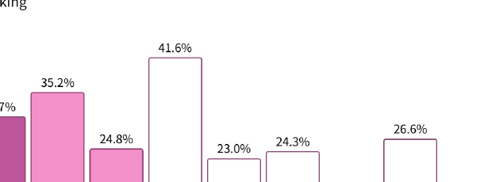

モデルが全体の中で正しく予測できた割合を示す基本的な評価指標 <b>算出方法は「正しく予測できた数 ÷ 全体の総サンプル数」</b>

OpenAI <a href="https://openai.com/ja-JP/index/introducing-gpt-5/">https://openai.com/ja-JP/index/introducing-gpt-5/</a>

例：

<b>千葉大のサークルの 〇〇について教えて。</b>  
<b>千葉大学の生成AI活用講座の担当教員は？</b>

<b>ハルシネーションは 仕組み上、起こる</b>

<!--
- ハルシネーションとは、推論過程でAIが、誤っているがもっともらしい情報を出力してしまうこと。
- 例えば「千葉大のサークルの〇〇について教えて」「千葉大学の生成AI活用講座の担当教員は？」のような、AIが知らない/曖昧な事柄を聞くと起きやすい。
- 次の語を確率で予測する仕組み上、ハルシネーションは必ず起こりうる。GPT-5の評価指標でも完全にはなくならない。
-->

---

生成AIのレイヤー

# 生成AIのレイヤー

応用

基盤

<table style="width:100%; border-collapse:collapse; font-size:21px; line-height:1.45;">
<tr><td style="border:1.5px solid #ccc; padding:8px 14px; background:var(--accent-soft); font-weight:800; width:240px;">生成AI アプリケーション</td><td style="border:1.5px solid #ccc; padding:8px 14px;">etc…</td></tr>
<tr><td style="border:1.5px solid #ccc; padding:8px 14px; background:#FBE9D8; font-weight:800;">エージェント</td><td style="border:1.5px solid #ccc; padding:8px 14px;"><b>DeepResearch, web検索 etc…</b> 環境とやり取りし、情報を収集して、その情報に基づいて意思決定を行い、アクションを実行</td></tr>
<tr><td style="border:1.5px solid #ccc; padding:8px 14px; background:#FCF3D8; font-weight:800;">プラットフォーム</td><td style="border:1.5px solid #ccc; padding:8px 14px;"><b>Dify, Google AI studio etc…</b> AI モデルの構築とデプロイに役立つツールとサービス、データマネジメントツールで構成</td></tr>
<tr><td style="border:1.5px solid #ccc; padding:8px 14px; background:#E1F0E5; font-weight:800;">大規模言語モデル</td><td style="border:1.5px solid #ccc; padding:8px 14px;">Section2での説明の通り</td></tr>
<tr><td style="border:1.5px solid #ccc; padding:8px 14px; background:#E3ECF7; font-weight:800;">インフラストラクチャー</td><td style="border:1.5px solid #ccc; padding:8px 14px;">コンピューターリソース、GPUなど</td></tr>
</table>

改変：Google Cloud Skills Boost

<!--
- 生成AIのレイヤー構造。下が基盤、上が応用。
- 基盤側から、インフラストラクチャー（GPUなどの計算リソース）、大規模言語モデル（Session 2で説明）、プラットフォーム（DifyやGoogle AI studio）、エージェント（DeepResearchやweb検索など、環境とやり取りして意思決定・アクションを実行）、そして一番上が生成AIアプリケーション。
- Google Cloud Skills Boostの図を改変したもの。
-->

---

Session 1の目的・到達目標

# 振り返り

目的

目標 ＋ まとめ

<b>Session 1：</b> AIの正体を解剖する

<b style="color:var(--accent-dark);">・利活用の前提知識</b>を知る

決めるのはあなた！

千葉大学の中でのポリシー「生成AIの指針」

オプトアウトと大学の契約で使える生成AIサービス

<b style="color:var(--accent-dark);">・機械学習</b>をイメージできる

ルールではなく、関係性を機械が見つける

<b style="color:var(--accent-dark);">・生成AIサービスのレイヤー</b>がわかる

インフラ→LLM→プラットフォーム→エージェント→アプリ

<!--
- Session 1の振り返り。目的は「AIの正体を解剖する」。目標とまとめを確認する。
- 利活用の前提知識を知る：決めるのはあなた、千葉大の「生成AIの指針」、オプトアウトと大学契約で使えるAIサービス。
- 機械学習をイメージできる：ルールではなく関係性を機械が見つける。
- 生成AIサービスのレイヤーがわかる：インフラ→LLM→プラットフォーム→エージェント→アプリ。
-->

---

<!-- _class: divider -->

SESSION 2

# AI時代の教え方 大学教育への事例をもとに

<h2>大学における生成AIとの関わり方を考える　15 - min × 6 sessions</h2>

<b style="color:#fff;">Session 2：</b>演習：生成AIの仕組みを体験する

千葉大学 国際未来教育基幹　田川 翔

<!--
- Session 2、演習：生成AIの仕組みを体験する、に入ります。
-->

---

Slido

<svg width="150" height="120" viewBox="0 0 150 120" xmlns="http://www.w3.org/2000/svg"><g fill="none" stroke="#7A3E9E" stroke-width="7" stroke-linejoin="round"><path d="M40 78 a26 26 0 0 1 4 -51 a30 30 0 0 1 56 6 a22 22 0 0 1 -6 45 z"/><path d="M78 95 a18 18 0 1 0 0 -1 z" fill="#EBDDF5"/></g></svg>
<h1 style="margin:0; color:var(--accent-dark);">生成AIの仕組みを一言で言うと</h1>

📣 投票画面 — <b>Slido</b> に入力してください

<!--
📣 This is Slido interaction slide, please don't delete it.✅ Click on 'Present with Slido' and the poll will launch automatically when you get to this slide.
-->

---

生成AIのレイヤー

# 生成AIのレイヤー

応用 ▲

▼ 基盤

<table style="flex:1; border-collapse:collapse; font-size:21px; line-height:1.45;">
<tr><td style="width:30%; background:var(--accent-soft); border:1.5px solid #d8b; font-weight:800; padding:9px 14px;">生成AI アプリケーション</td><td style="border:1.5px solid #d8b; padding:9px 14px;">etc…</td></tr>
<tr><td style="background:var(--accent-soft); border:1.5px solid #d8b; font-weight:800; padding:9px 14px;">エージェント</td><td style="border:1.5px solid #d8b; padding:9px 14px;"><b>DeepResearch, web検索 etc…</b> 環境とやり取りし、情報を収集して、その情報に基づいて意思決定を行い、アクションを実行</td></tr>
<tr><td style="background:var(--accent-soft); border:1.5px solid #d8b; font-weight:800; padding:9px 14px;">プラットフォーム</td><td style="border:1.5px solid #d8b; padding:9px 14px;"><b>Dify, Google AI studio etc…</b> AI モデルの構築とデプロイに役立つツールとサービス、データマネジメントツールで構成</td></tr>
<tr><td style="background:var(--accent-soft); border:1.5px solid #d8b; font-weight:800; padding:9px 14px;">大規模言語モデル</td><td style="border:1.5px solid #d8b; padding:9px 14px;">Section2での説明の通り</td></tr>
<tr><td style="background:var(--accent-soft); border:1.5px solid #d8b; font-weight:800; padding:9px 14px;">インフラストラクチャー</td><td style="border:1.5px solid #d8b; padding:9px 14px;">コンピューターリソース、GPUなど</td></tr>
</table>

改変：Google Cloud Skills Boost

<!--
- 生成AIのレイヤー構造。基盤のインフラ・LLMから、応用のプラットフォーム・エージェント・アプリへ積み上がる。
-->

---

インフラストラクチャー

# インフラストラクチャー

nVidia presentation デモ (いま非公開…)

もっと詳しく：https://cloud.google.com/tpu/docs/system-architecture-tpu-vm?hl=ja

<!--
- 生成AIを支えるインフラ。GPU/TPUといった巨大な計算資源の上で、すべてが動いている。
-->

---

生成AIの中でしていること

# 生成AIの中でしていること

生成AIの概観

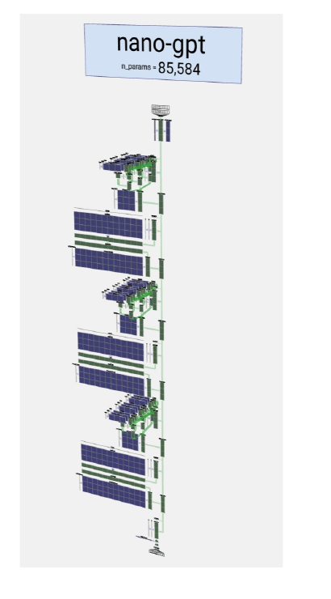

学習と推論のデモ

https://colab.research.google.com/drive/1-HXdqybmsnfZQbRi2Mny2fugKP5D9o9D

実際に学習を体験できる!

<!--
- 生成AIの中身を概観し、Google Colab 上で実際に学習と推論を体験できるデモを用意した。
-->

---

生成AIの中でしていること

# 利用 (推論・生成)

<svg viewBox="0 0 640 470" xmlns="http://www.w3.org/2000/svg" style="height:498px; width:auto; max-width:100%;" font-family="sans-serif">
<g text-anchor="middle" font-weight="700">
<text x="107" y="22" font-size="18" fill="#333">計算1回目</text>
<text x="320" y="22" font-size="18" fill="#333">計算2回目</text>
<text x="533" y="22" font-size="18" fill="#333">計算3回目</text>
<g font-size="17">
<rect x="22" y="34" width="170" height="40" rx="4" fill="#fff" stroke="#888"/><text x="107" y="60" fill="#111">"吾輩は"</text>
<rect x="235" y="34" width="170" height="40" rx="4" fill="#fff" stroke="#888"/><text x="320" y="60" fill="#111">"吾輩は猫"</text>
<rect x="448" y="34" width="170" height="40" rx="4" fill="#fff" stroke="#888"/><text x="533" y="60" fill="#111">"吾輩は猫で"</text>
</g>
<g font-size="18" fill="#fff">
<rect x="42" y="110" width="130" height="40" rx="4" fill="#2E9E5B"/><text x="107" y="136">出力</text>
<rect x="255" y="110" width="130" height="40" rx="4" fill="#2E9E5B"/><text x="320" y="136">出力</text>
<rect x="468" y="110" width="130" height="40" rx="4" fill="#2E9E5B"/><text x="533" y="136">出力</text>
</g>
<g font-size="16" fill="#fff">
<rect x="42" y="185" width="130" height="58" rx="4" fill="#7A2E8E"/><text x="107" y="208">AI処理</text><text x="107" y="230">(デコーダ)</text>
<rect x="255" y="185" width="130" height="58" rx="4" fill="#7A2E8E"/><text x="320" y="208">AI処理</text><text x="320" y="230">(デコーダ)</text>
<rect x="468" y="185" width="130" height="58" rx="4" fill="#7A2E8E"/><text x="533" y="208">AI処理</text><text x="533" y="230">(デコーダ)</text>
</g>
<g font-size="17" fill="#111">
<rect x="42" y="278" width="130" height="40" rx="4" fill="#fff" stroke="#888"/><text x="107" y="304">前処理</text>
<rect x="255" y="278" width="130" height="40" rx="4" fill="#fff" stroke="#888"/><text x="320" y="304">前処理</text>
<rect x="468" y="278" width="130" height="40" rx="4" fill="#fff" stroke="#888"/><text x="533" y="304">前処理</text>
</g>
<g font-size="18" fill="#fff">
<rect x="42" y="350" width="130" height="40" rx="4" fill="#2E9E5B"/><text x="107" y="376">入力</text>
<rect x="255" y="350" width="130" height="40" rx="4" fill="#2E9E5B"/><text x="320" y="376">入力</text>
<rect x="468" y="350" width="130" height="40" rx="4" fill="#2E9E5B"/><text x="533" y="376">入力</text>
</g>
<g font-size="17">
<rect x="22" y="420" width="170" height="40" rx="4" fill="#fff" stroke="#888"/><text x="107" y="446" fill="#111">"吾輩"</text>
<rect x="235" y="420" width="170" height="40" rx="4" fill="#fff" stroke="#888"/><text x="320" y="446" fill="#111">"吾輩は"</text>
<rect x="448" y="420" width="170" height="40" rx="4" fill="#fff" stroke="#888"/><text x="533" y="446" fill="#111">"吾輩は猫"</text>
</g>
</g>
<g stroke="#444" stroke-width="2" fill="none" marker-end="url(#ar2)">
<path d="M107,420 L107,392"/><path d="M107,350 L107,320"/><path d="M107,278 L107,245"/><path d="M107,185 L107,152"/>
<path d="M320,420 L320,392"/><path d="M320,350 L320,320"/><path d="M320,278 L320,245"/><path d="M320,185 L320,152"/>
<path d="M533,420 L533,392"/><path d="M533,350 L533,320"/><path d="M533,278 L533,245"/><path d="M533,185 L533,152"/>
</g>
<defs><marker id="ar2" markerWidth="9" markerHeight="9" refX="7" refY="3" orient="auto"><path d="M0,0 L7,3 L0,6 Z" fill="#444"/></marker></defs>
</svg>

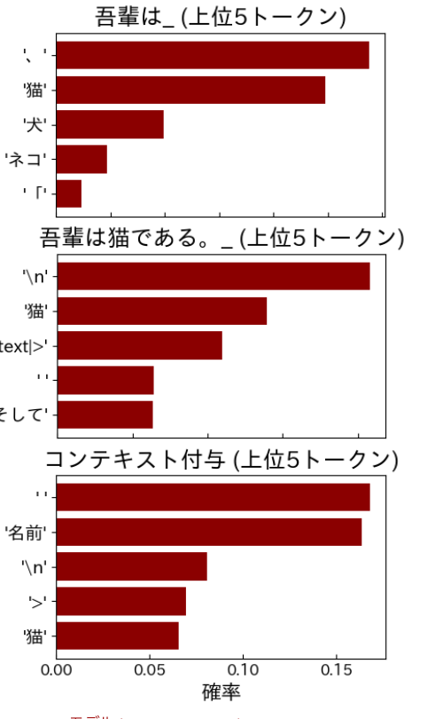

モデル： cyberagent/open-calm-7b

<!--
- 推論・生成では、入力→前処理→デコーダ→出力を1トークンずつ繰り返す。右は各ステップの次トークン確率。
-->

---

ワーク

# AIのアプリの中身をご相談ください

<b>標準時間：</b>自己紹介3分、実習2分 (会場は隣の人とペアで実施します) ＋ 全体共有：2分

<b>ワーク：</b>あなたが今日の夜に雨にふられずに、帰宅する時間を知りたいとします。 
<b>その時間を教えてくれる生成AIアプリには、どんな情報を与えてあげればよいですか。</b>箇条書きで3つ考えて下さい。 
ワーク用のスライドに記入して下さい。

<!--
- ペアでワーク。雨に降られず帰宅できる時間を教えるAIアプリに、どんな情報を与えるべきか3つ考える。
-->

---

リーズニング

# リーズニング

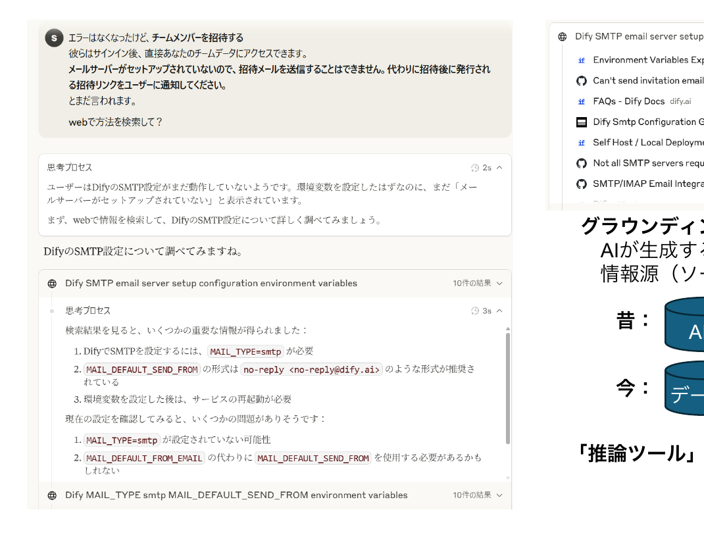

<b>グラウンディング：</b> 　AIが生成する回答を、特定の信頼できる　情報源（ソース）にしっかりと結びつける技術

昔：

AI
⟶
回答

今：

データ
⟶AI
回答

<b>「推論ツール」「情報の分析ツール」</b>　になりつつある

<!--
- リーズニング。AIはデータに根拠づけて答える「推論ツール」「情報の分析ツール」になりつつある。
-->

---

Slido

<svg width="150" height="120" viewBox="0 0 150 120" xmlns="http://www.w3.org/2000/svg"><g fill="none" stroke="#1F6E6A" stroke-width="7" stroke-linejoin="round"><path d="M18 22 h114 a8 8 0 0 1 8 8 v52 a8 8 0 0 1 -8 8 H54 l-22 22 v-22 H18 a8 8 0 0 1 -8 -8 V30 a8 8 0 0 1 8 -8 z"/><path d="M34 46 h60 M34 66 h44" stroke-linecap="round"/></g></svg>
<h1 style="margin:0; color:var(--accent-dark);">必要と思われる情報を記入して下さい。</h1>

📣 投票画面 — <b>Slido</b> に入力してください

<!--
📣 This is Slido interaction slide, please don't delete it.✅ Click on 'Present with Slido' and the poll will launch automatically when you get to this slide.
-->

---

Session 2のワーク例

# Session 2のワーク例

実装例

https://chiba-u-ai25-g1.xvps.jp/app/1ec6e43e-461e-4392-afea-09a82c7149f4/workflow

<!--
- ワークの実装例。Difyで作ったワークフローの実物をお見せします。
-->

---

研究で活用する際のアイデア

# 研究で活用する際のアイデア

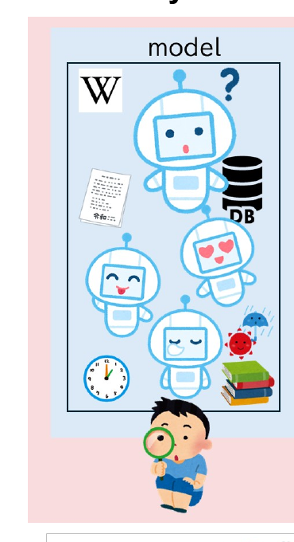

GemやDify、n8nで道具を作れるようになる

<!--
- 研究での活用。GemやDify、n8nで自分専用の道具を作れるようになる。
-->

---

Session 2の目的・到達目標

# Session 2の目的・到達目標

目的

<b>Session 2：</b> 　生成AIの仕組みを体験する

目標 　+ まとめ 振り返り

<b>大規模言語モデル(LLM)</b>の中身をイメージできる

Transformerによる「次の単語の予測」作業／ハルシネーションや誤った出力がでるのは当たり前

<b>AI agentやツール</b>イメージできる

AIに正しい情報を渡すことで、誤りが減る／AIは、自分の出力をもとに、「推論」を深められる（リーズニング）

<b>LLMの上のレイヤーでAIは進化している</b>

<!--
- Session 2の振り返り。LLMの中身、AI agent・ツール、そしてLLMの上のレイヤーでAIが進化していること。
-->

---

AI時代の教え方

# AI時代の教え方

大学教育への事例をもとに

大学における生成AIとの関わり方を考える 15 - min × 6 sessions

<b>Session 3：</b> プロンプトを書くコツ

千葉大学 国際未来教育基幹 田川 翔

<!--
- Session 3「プロンプトを書くコツ」に入ります。
-->

---

Session 3の目的・到達目標

# Session 3の目的・到達目標

目的

<b>Session 3：</b> 学びのためのプロンプト作成のスキルを知る

目標

<b>システムプロンプトが何か</b>を理解する <b>プロンプトの型</b>を理解する <b>作成の3つのコツを説明できる</b>

<!--
- Session 3の目的と目標。システムプロンプト・プロンプトの型・3つのコツを押さえます。
-->

---

プロンプトとは

# プロンプトとは

<b>プロンプト：</b> 生成AIに、<b>実行すべきタスクの生成を促す</b>、自然言語による文章のこと

吾輩は＿＿＿???

<b>プロンプトエンジニアリング：</b> 生成AIから望ましい出力を得るために、指示や命令を設計、最適化すること (NRI 用語集)

<b>コンテキスト内学習：</b> プロンプトに与えた文章から、生成AIがタスクの結果を生成できるようになること

<!--
- プロンプトとは何か、プロンプトエンジニアリング、コンテキスト内学習の3用語を整理します。
-->

---

AIの創発

# AIの創発

具体的に教えていないのに、<b>モデルを大規模化するとタスクを解けるようになる</b>こと

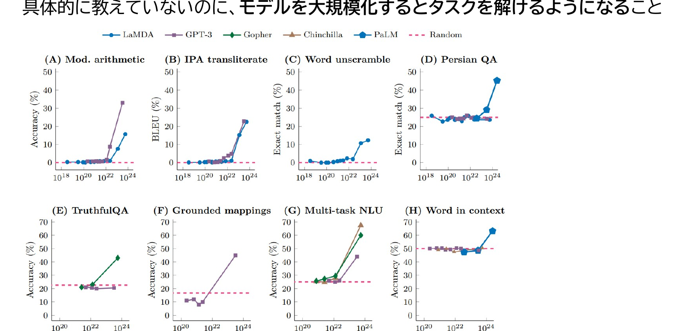

<!--
- 創発：大規模化すると、教えていないタスクをある規模を超えて急に解けるようになる現象です。
-->

---

Few-shotやスキーマ

# Few-shotやスキーマ

<b>Few-shot：</b> プロンプト内に「入力例」と「出力例」のデモを提供しより高性能な結果を得る技法 コンテキスト内学習をGPTが出来るので、実現する

Prompt Engineering Guide <a>https://www.promptingguide.ai/jp/techniques/fewshot</a>

<b>スキーマ ：</b> 回答してほしいことをすべて構造化し、回答形式として指定する。 <b>※Few-shotを組み合わせ、回答を例示する</b>

Google検索的 (単語)

これは素晴らしい! 感情?

Zero-shot

「これは素晴らしい!」と 書いた書き手の感情を教えて下さい

Few-shot

あの映画は最高だった! &gt;ポジティブ これは酷い! &gt;ネガティブ 「これは素晴らしい!」&gt;?

例) スキーマ

<b>授業のタイトル：</b> 　目的： 　到達目標： 　宿題の案：

<!--
- Zero-shot / Few-shot / スキーマの違いを、感情分析の例で並べて示します。
-->

---

参考：より高度な利用

# 　参考：より高度な利用

Structured Output（構造化出力）

<b>定義:</b> LLMの出力を、事前に定義されたJSONスキーマなどの構造に沿って生成する技術。

<b>利点:</b>

<ul style="font-size:19px; margin:2px 0 6px 1.1em; line-height:1.4;">
<li>予測可能な出力形式で後続処理を容易に</li>
<li>スキーマに合致しない誤ったデータを自動で拒否</li>
<li>プロンプトを簡潔にし、LLMへの指示を削減</li>
</ul>

<b>簡単な例:</b> ユーザー情報抽出のためのJSONスキーマ

<pre style="font-size:14px; background:#F4F6F9; border-radius:6px; padding:8px; line-height:1.3; white-space:pre-wrap;">{ "type": "object", "properties": {
  "name": { "type": "string" },
  "email": { "type": "string", "format": "email" },
  "age": { "type": "integer" } },
  "required": ["name", "email"]}</pre>

Function Calling（関数呼び出し）

<b>定義:</b> LLMがユーザーの意図を解釈し、外部ツール（API）を呼び出し特定のアクションを実行する機能。

<b>用途:</b>

<ul style="font-size:19px; margin:2px 0 6px 1.1em; line-height:1.4;">
<li>レストラン予約やオンラインショッピングの注文処理</li>
<li>カレンダー管理など外部アプリとの連携</li>
<li>データ検索やアクション実行の自動化</li>
</ul>

<b>簡単な例:</b> レストラン予約のための関数呼び出し

<pre style="font-size:13px; background:#F4F6F9; border-radius:6px; padding:8px; line-height:1.3; white-space:pre-wrap;">tool_code: bookRestaurant(restaurant_name: string, date: string, time: string, party_size: integer, special_requests: string)
tool_name: レストラン予約
tool_description: 指定されたレストランの予約を行います。</pre>

AIの応答をより予測可能かつ信頼性の高いものに出来る。データの正確な処理と外部連携により、AI活用の幅が大きく広がる。

<a>https://platform.openai.com/docs/guides/structured-outputs</a>

<!--
- 参考として、Structured OutputとFunction Callingという高度な利用を紹介します。
-->

---

プロンプト作成のコツ

# プロンプト作成のコツ

プロンプトを作成する上での3つのコツ

①<b>試行錯誤の重要性を知る</b> ②<b>十分なコンテキストを与える</b> ③<b>型を知る</b>

特に、<b>人に頼むときのマニュアルをイメージ</b> <b> → 頭から手順通りに説明する / 必要な情報を渡す</b>

<b>プログラム経験がある人は、コードをイメージ</b> <b> → 分岐や定義を作成していくイメージ</b>

<!--
- プロンプト作成の3つのコツ。試行錯誤・コンテキスト・型。人に頼むマニュアル、あるいはコードをイメージすると分かりやすいです。
-->

---

良いプロンプトの書き方

# 良いプロンプトの書き方

次の要素を含める

<b>簡単な 3R法</b> Request（依頼）を出す Role（役割）を決める Regulation（形式）を指定する

<b>フルモデル 7R法</b> Request（依頼）を出す Role（役割）を決める Regulation（形式）を指定する Rule（ルール）を定める Review &amp; Refine（評価・改善）を求める Reference（参照知識・例）を与える

<b>注意点(再掲)</b> 最初から完璧を目指さない 　a. <b>試行錯誤(改善サイクルを回す)が重要</b> 　b. 出てきた回答がイマイチなら、出てきた結果と元のプロンプトをセットで再度AIにいれ、「プロンプトの書き換え」を頼む <b>十分なコンテキストを与える</b>

ChatGPT時代の文系AI人材になる | 野口 竜司 (東洋経済新報社 2023)

<!--
- 良いプロンプトの書き方。3R法・7R法と注意点。最初から完璧を目指さず、試行錯誤と十分なコンテキストが鍵です。
-->

---

プロンプティングの学習方法

# プロンプティングの学習方法

① <b>使い込んでいる人の使い方</b>を見る

② <b>模範例のプロンプトを書き換えてみる</b>

③ <b>しっくりくる回答が出力されるまで、何度も試行錯誤する</b>

④ <b>他の人と話し、質問力を向上させる</b>

⑤ <b>めんどうとなったら、AIに外注できないか</b>、考えてみる

<a>https://www.promptingguide.ai/</a>

<!--
- プロンプティングの学習方法を5段階で。最後は、めんどうならAIに外注できないか考える、という発想です。
-->

---

Session 3の目的・到達目標

# Session 3の目的・到達目標　振り返り

目的

<b>Session 3：</b>学びのためのプロンプト作成のスキルを知る

目標 ＋ まとめ

・システムプロンプトが何かを理解する

生成AIの振る舞いや応答方針を制御するための指示 プロンプトの練習や試行錯誤に向いている チャットボットで入力するのは「ユーザープロンプト」

・プロンプトの型をイメージできる

R法：Request、Role、Regulation、Rule、Reference

・作成の3つのコツを説明できる

①<b>試行錯誤</b>は重要 ②十分な<b>コンテキスト</b>を ③<b>型</b>を知る

<!--
- Session 3の振り返り。システムプロンプト・型（R法）・3つのコツを再確認します。
-->

---

AI時代の教え方

# AI時代の教え方

大学教育への事例をもとに

大学における生成AIとの関わり方を考える 15 - min × 6 sessions

<b>Session 4 ハンズオン：</b> 自作Gemアプリを作ってみる

千葉大学 国際未来教育基幹 田川 翔

<!--
- Session 4は、自作Gemアプリを作るハンズオンです。
-->

---

システムプロンプト

# システムプロンプト

生成AIの振る舞いや応答方針を制御するための指示 →　<b>練習や道具として便利</b>

Gem

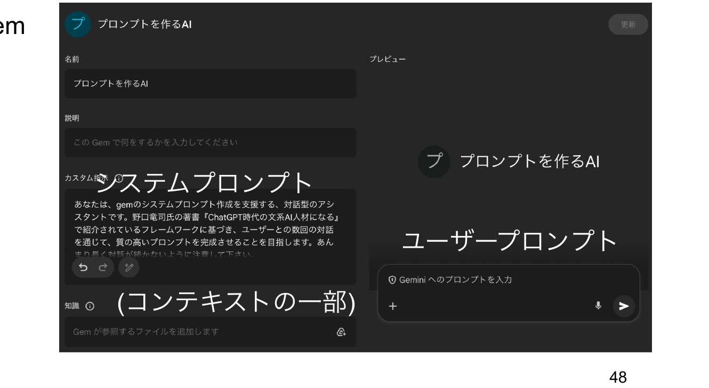

<b>システムプロンプト</b> (コンテキストの一部) ／ <b>ユーザープロンプト</b>

<!--
- システムプロンプトは、生成AIの振る舞いを制御する指示。Gemでは、これを設定して練習や道具にできます。
-->

---

システムプロンプト

# AIのアプリを作成してみる

<b>標準時間：</b> 自分で行う実習10分 (会場は周囲の人と実施します)

<b>ワーク：</b> Gemを作ってみましょう。困った点は、周囲の方とお話下さい。

<b>使用するツール： Google Gemini / Gem</b>

<b>Step1[課題発見]：</b>あなたの困り事のうち、生成AIができそうな簡単なものを想像しましょう <b>(2分)</b>

<b>Step2[作成]：</b>システムプロンプトを作成してみましょう<b>(6分)</b>

プロンプトをつくるプロンプトのリンクはこちらから

<!--
- ワークです。標準時間は自分で行う実習10分（会場は周囲の人と実施）。Gemを作ってみましょう。Step1で、あなたの困り事のうち生成AIができそうな簡単なものを想像（2分）、Step2でシステムプロンプトを作成（6分）。プロンプトをつくるプロンプトのリンクはこちらから。
-->

---

気づきの共有

# 気づかれたことをぜひ、共有して下さい。

<b>📊 Slido ライブ共有</b> 
会場・オンラインの皆様、気づきをご記入ください

<!--
- 📣 This is Slido interaction slide, please don't delete it.✅ Click on 'Present with Slido' and the poll will launch automatically when you get to this slide.
-->

---

<!-- _class: divider -->

Session 5

# AIと授業の考え方

<h2>大学における生成AIとの関わり方を考える　15 - min × 6 sessions</h2>

千葉大学 国際未来教育基幹 田川 翔

<!--
- ここからSession 5「AIと授業の考え方」です。
-->

---

Session 5の目的・到達目標

# Session 5の目的・到達目標

目的

<b>Session 5：</b>

生成AIを大学で活用する方法を考える

目標

・<b>そもそも論として、AIとの付き合い方を考える</b> 
・<b>学習に利用する際のアイデアを見つける</b> 
・<b>研究に利用する際の活用例を知る</b>

<!--
- Session 5の目的は「生成AIを大学で活用する方法を考える」。目標は3つ。そもそも論としてAIとの付き合い方を考える、学習に利用する際のアイデアを見つける、研究に利用する際の活用例を知る。
-->

---

生成AIの大学への影響

# 生成AIの大学への影響

達成済み

新規

マクロ (全学)

ポリシー

ガイドライン

iPaaS + AI

業務DX + AI

教学マネジメント with AI

データ中心の業務改革

個別最適で在学中支援するアプリ

教育データ活用 1次〜生涯 + 2次

ミドル (課程)

FD

科目検索

学生相談

AI 教科書

生成AIでより学べるカリキュラム

ミクロ (授業)

授業内で利用

フィードバック

授業チューター

生成AIと教員mixの授業設計

<!--
- 生成AIの大学への影響を、縦にマクロ（全学）・ミドル（課程）・ミクロ（授業）、横に達成済み・新規で整理しました。全学ではポリシーやガイドラインは達成済みで、iPaaS+AIや業務DX、教学マネジメント、データ活用などが新規。課程ではFDや科目検索が達成済み、学生相談やAI教科書、カリキュラムが新規。授業では授業内利用やフィードバックが達成済み、授業チューターや生成AIと教員mixの授業設計が新規です。
-->

---

学習におけるAI利用の考え方

# 学習におけるAI利用の考え方

<b>NG：</b> AIに答えを聞く、正解を聞く、コスパ/タイパ至上主義　▶ <b>考えたり、研究を深めたりするため</b>にAIを活用する

<b>授業利用における活用の考え方の例</b>

学生の現状

<b>ねらい：</b>どこに向かうのか (授業の存在価値)

<b>達成目標：</b>何が出来るようになるのか

<b>設計：</b>どのように教えるのか

<b>評価：</b>どのように測るのか

学修後の状態

目標や設計を損なう形で使ってはいけない／<b>「AIができることをただ出力するのは、AIで事足りるので採用する必要はない」ということ</b>。AIができない<b>「高次」の価値を作るために、引き続き学ぶ必要はある</b>

Teaching with AI (Bowen &amp; Watson, AAC&amp;U 2024)

<!--
- 学習におけるAI利用の考え方。NGは、AIに答えや正解を聞くこと、コスパ・タイパ至上主義。むしろ考えたり研究を深めたりするためにAIを活用します。授業利用の考え方の例として、学生の現状から学修後の状態に向け、ねらい・達成目標・設計・評価を置く。目標や設計を損なう形で使ってはいけない。AIができることをただ出力するなら採用する必要はない、という考え方です。AIができない高次の価値を作るために、引き続き学ぶ必要はあります。
-->

---

学習におけるAI利用の考え方

# 学習におけるAI利用の考え方

シラバス

<a href="https://syllabus.gs.chiba-u.jp/2025/401001000000000/G122151001/ja_JP">https://syllabus.gs.chiba-u.jp/2025/401001000000000/G122151001/ja_JP</a>

<b>授業の目的</b>

生成AIの仕組みを理解し、課題解決のための演習をしたうえで、私達は生成AIとどのように<b>関わるべきか自分なりの「考え」</b>を持つ。

・Difyでアプリを作ってみることで、<b>AIの道具性や限界に気づく</b>

・<b>教えることは最低限、課題はAIがないと出来ない設計、グループワーク</b>

・<b>変わらないことを教えたい (改善ループ、AIを活かした学び方)</b>

<b>過程：</b>2024年10月に科目申請／2025年第4ターム (10月、11月) <b>1単位</b>／数理・データサイエンス教育プログラム、教養科目の選択必修

<!--
- 実際の授業のシラバスです。授業の目的は、生成AIの仕組みを理解し、課題解決のための演習をしたうえで、私達は生成AIとどのように関わるべきか自分なりの「考え」を持つこと。Difyでアプリを作ってAIの道具性や限界に気づく、教えることは最低限で課題はAIがないと出来ない設計やグループワーク、変わらないこと（改善ループ、AIを活かした学び方）を教えたい。2024年10月に科目申請、2025年第4ターム1単位、数理・データサイエンス教育プログラムの選択必修です。
-->

---

<!-- _class: divider -->

# 生成AI活用講座

<!--
- ここから、実際の「生成AI活用講座」の設計についてご紹介します。
-->

---

設計

2 コースの内容

# 到達目標

<b>[基礎知識]</b> 生成AIの背景の仕組み、周辺のコンセプトを定性的に説明出来るようになる。

<b>[応用]</b> 生成AIのリスクや得意な点・難しい点を理解し、批判的思考力を働かせ生成AIを活用できる。

<b>[統合と創造]</b> 社会または自分の課題解決のために生成AIを活用したミニアプリを組み立てることができる。

<b>[価値づけ]</b> 生成AIと自分/社会がどのように関わるべきか、自らの考えをもつ。

<!--
- 講座の設計、到達目標です。基礎知識として生成AIの背景の仕組みや周辺のコンセプトを定性的に説明できるようになる。応用として、リスクや得意・難しい点を理解し、批判的思考力を働かせて活用できる。統合と創造として、課題解決のためにミニアプリを組み立てられる。価値づけとして、生成AIと自分・社会がどう関わるべきか自らの考えをもつ、です。
-->

---

設計

2 コースの内容

# 到達目標

<b>[基礎知識]</b> 生成AIの背景の仕組み、周辺のコンセプトを定性的に説明出来るようになる。

小さいAIを創るワーク、倫理・関係する概念の簡単なテスト

<b>[応用]</b> 生成AIのリスクや得意な点・難しい点を理解し、批判的思考力を働かせ生成AIを活用できる。

DIfyを用いた基礎演習、生成AIの活用事例の調査・検討

<b>[統合と創造]</b> 社会または自分の課題解決のために生成AIを活用したミニアプリを組み立てることができる。

Difyを用いたグループワーク

<b>[価値づけ]</b> 生成AIと自分/社会がどのように関わるべきか、自らの考えをもつ。

生成AIとの関わり方を考える、最終レポート

<!--
- 同じ到達目標に、各段階で何をするかを重ねました。基礎知識は小さいAIを創るワークと倫理の簡単なテスト、応用はDifyを用いた基礎演習と活用事例の調査・検討、統合と創造はDifyを用いたグループワーク、価値づけは関わり方を考える最終レポートです。
-->

---

設計

2 コースの内容

# コースの内容

<table style="width:100%; border-collapse:collapse; font-size:21px; margin-top:6px;">
<thead>
<tr style="background:var(--accent); color:#fff;">
<th style="padding:6px 10px; width:46px;">回</th>
<th style="padding:6px 12px; text-align:left;">内容</th>
<th style="padding:6px 12px; text-align:left;">活動・補足</th>
</tr>
</thead>
<tbody>
<tr><td style="text-align:center; font-weight:800; border:1px solid #ddd;">1</td><td style="padding:5px 12px; border:1px solid #ddd;">イントロダクション/生成AIの活用事例(講義)</td><td style="padding:5px 12px; border:1px solid #ddd;">リテラシ・グループ分け</td></tr>
<tr style="background:var(--section-bg);"><td style="text-align:center; font-weight:800; border:1px solid #ddd;">2</td><td style="padding:5px 12px; border:1px solid #ddd;">生成AIの仕組み (オンデマンド)</td><td style="padding:5px 12px; border:1px solid #ddd;">AI作成 or 動画 ※選択</td></tr>
<tr><td style="text-align:center; font-weight:800; border:1px solid #ddd;">3</td><td style="padding:5px 12px; border:1px solid #ddd;">生成AI活用の注意点・勘所 (講義)</td><td style="padding:5px 12px; border:1px solid #ddd;">倫理、学び方</td></tr>
<tr style="background:var(--section-bg);"><td style="text-align:center; font-weight:800; border:1px solid #ddd;">4</td><td style="padding:5px 12px; border:1px solid #ddd;">生成AIアプリ開発の基礎知識 (オンデマンド)</td><td style="padding:5px 12px; border:1px solid #ddd;">Difyの使い方</td></tr>
<tr><td style="text-align:center; font-weight:800; border:1px solid #ddd;">5</td><td style="padding:5px 12px; border:1px solid #ddd;">課題発掘と解決のための仮説形成</td><td style="padding:5px 12px; border:1px solid #ddd;">アプリ作成のアイデア</td></tr>
<tr style="background:var(--section-bg);"><td style="text-align:center; font-weight:800; border:1px solid #ddd;">6</td><td style="padding:5px 12px; border:1px solid #ddd;">グループワークでの開発</td><td style="padding:5px 12px; border:1px solid #ddd;">開発の実施</td></tr>
<tr><td style="text-align:center; font-weight:800; border:1px solid #ddd;">補</td><td style="padding:5px 12px; border:1px solid #ddd;">アドバイス回</td><td style="padding:5px 12px; border:1px solid #ddd;">質問対応</td></tr>
<tr style="background:var(--section-bg);"><td style="text-align:center; font-weight:800; border:1px solid #ddd;">7</td><td style="padding:5px 12px; border:1px solid #ddd;">発表・評価</td><td style="padding:5px 12px; border:1px solid #ddd;">発表・相互評価</td></tr>
<tr><td style="text-align:center; font-weight:800; border:1px solid #ddd;">8</td><td style="padding:5px 12px; border:1px solid #ddd;">AIと自分との関係性を考える・まとめ</td><td style="padding:5px 12px; border:1px solid #ddd;">レポート</td></tr>
</tbody>
</table>

<!--
- コースの内容です。全8回＋補講で、第1回イントロと活用事例、第2回オンデマンドで仕組み、第3回注意点と勘所、第4回オンデマンドでアプリ開発の基礎、第5回仮説形成、第6回グループ開発、補講でアドバイス、第7回発表・相互評価、第8回まとめとレポート、という流れです。
-->

---

Difyの運用

2 コースの内容

# サーバー設定

<b>Xserver 社のVPSでセルフホスト</b>

月2000円/1サーバー、6台 (4台で十分)

AIは、<b>Gemini、AWS claude、ChatGPT (自費)のAPI</b>

ダミーIDの発行

構築はほぼ一瞬　— 手間はない

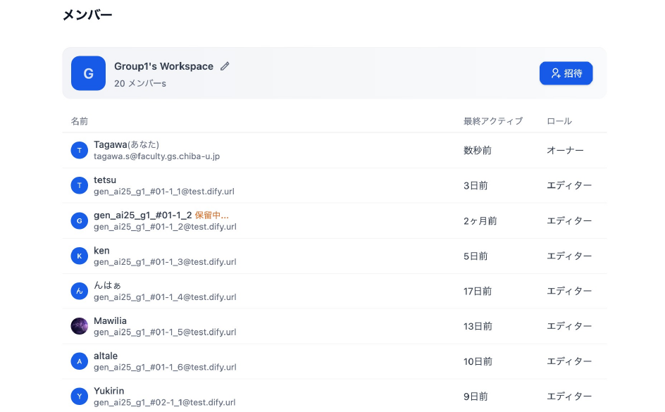

<!--
- Difyの運用です。サーバーはXserver社のVPSでセルフホスト。月2000円で1サーバー、6台用意しましたが4台で十分でした。AIはGemini、AWS Claude、ChatGPT（自費）のAPIを使用。学生にはダミーIDを発行します。構築はほぼ一瞬で、手間はありません。右はワークスペースのメンバー一覧です。
-->

---

受講者比率

# 受講者の比率3 結果

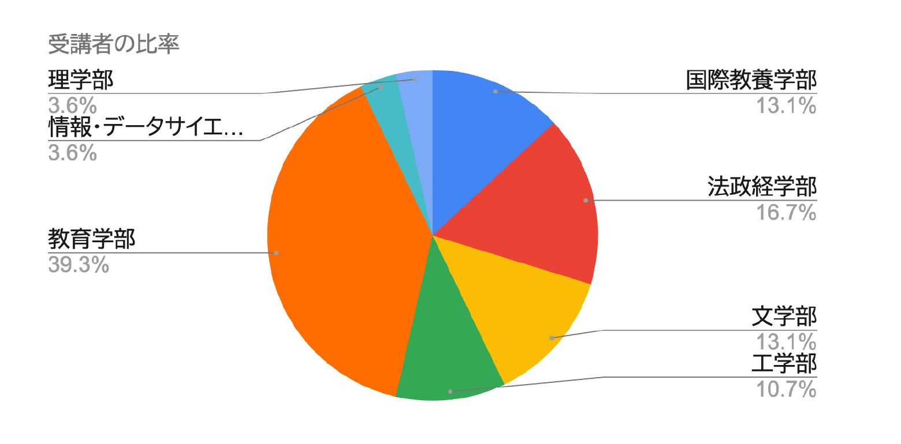

<table style="width:100%; border-collapse:collapse; font-size:23px; line-height:1.5;">
<tr><td style="border:1.5px solid #ccc; padding:7px 14px; background:var(--section-bg); font-weight:800;">教育学部</td><td style="border:1.5px solid #ccc; padding:7px 14px; text-align:right; font-weight:800; color:var(--accent-dark);">39.3%</td></tr>
<tr><td style="border:1.5px solid #ccc; padding:7px 14px;">法政経学部</td><td style="border:1.5px solid #ccc; padding:7px 14px; text-align:right;">16.7%</td></tr>
<tr><td style="border:1.5px solid #ccc; padding:7px 14px;">国際教養学部</td><td style="border:1.5px solid #ccc; padding:7px 14px; text-align:right;">13.1%</td></tr>
<tr><td style="border:1.5px solid #ccc; padding:7px 14px;">文学部</td><td style="border:1.5px solid #ccc; padding:7px 14px; text-align:right;">13.1%</td></tr>
<tr><td style="border:1.5px solid #ccc; padding:7px 14px;">工学部</td><td style="border:1.5px solid #ccc; padding:7px 14px; text-align:right;">10.7%</td></tr>
<tr><td style="border:1.5px solid #ccc; padding:7px 14px;">情報・データサイエ…</td><td style="border:1.5px solid #ccc; padding:7px 14px; text-align:right;">3.6%</td></tr>
<tr><td style="border:1.5px solid #ccc; padding:7px 14px;">理学部</td><td style="border:1.5px solid #ccc; padding:7px 14px; text-align:right;">3.6%</td></tr>
</table>

<!--
- 結果のパート。受講者の学部別比率。教育学部が39.3%と最多で、法政経学部16.7%、国際教養学部・文学部が各13.1%、工学部10.7%、情報・データサイエンスと理学部が各3.6%。
- 教育学部の学生が多いのが特徴的で、将来教員になる学生がAIの教育利用に関心を持って受講していることがうかがえる。
-->

---

学生の感想

# 学生の感想3 AIとの関わり方

私は教育学部に所属しており、将来教員として働きたいと考えているが、もし自分の授業が画一的であったら、AIが提供する個別最適化された教材に代替されるかもしれない。しかし、子ども一人ひとりの表情や気持ちを読み取り察知し、状況に応じて授業の進行を変化させたり、子どもの発言によって柔軟に対応したりすることは人間にしかできないと考える。そのため、<b>AIに奪われないようにと過剰に恐れるのではなく、授業づくりや子どもたちの学びのサポートとして積極的にAIを取り入れながら、授業を行っていくことが学びにとって重要</b>だと考える。このとき、<b>教師は自分自身の創造性、独自性を磨く必要</b>があると考える。

上記の通り、AIの利点と課題の両方を理解し、人間が主体的に使いこなすことが、これからの教育において重要であり、<b>AIを「思考を広げる助手」</b>としてとらえて、ともによりよい学びを生み出すことを意識すると良いと考える。

<!--
- 学生の感想を紹介。教育学部の学生で、将来教員を目指している方。画一的な授業ならAIの個別最適化教材に代替されうるが、子どもの表情や気持ちを読み取り柔軟に対応するのは人間にしかできない、と。
- AIを過剰に恐れるのではなく、授業づくりや学びのサポートとして積極的に取り入れ、教師は自分自身の創造性・独自性を磨く必要がある。AIを「思考を広げる助手」としてとらえ、ともによりよい学びを生み出す、という前向きな関わり方が示されている。
-->

---

Bloomの学習目標分類とAI

# Bloomの学習目標分類とAI1　イントロ

学習目標分類に生成AIの影響を当てはめてみる

<table style="width:100%; border-collapse:collapse; font-size:18px; line-height:1.4;">
<tr>
<th style="border:1.5px solid #ccc; padding:5px 6px; background:var(--section-bg); width:42px;"></th>
<th style="border:1.5px solid #ccc; padding:5px 8px; background:var(--section-bg);">認知的領域 (知識や思考)</th>
<th style="border:1.5px solid #ccc; padding:5px 8px; background:var(--accent-soft); color:var(--accent-dark);">学びへの生成AIの影響</th>
</tr>
<tr>
<td style="border:1.5px solid #ccc; padding:5px 6px; text-align:center; font-weight:800; color:var(--accent-dark);">高次</td>
<td style="border:1.5px solid #ccc; padding:5px 8px;"><b>創造</b> (学習を応用し、新しい価値を作れる)</td>
<td style="border:1.5px solid #ccc; padding:5px 8px; background:#FCEAEC;">人の創造性こそが大切 アイデア出しで活用</td>
</tr>
<tr>
<td style="border:1.5px solid #ccc; padding:5px 6px;"></td>
<td style="border:1.5px solid #ccc; padding:5px 8px;"><b>評価</b> (事物・判断等を比較し評価出来る)</td>
<td style="border:1.5px solid #ccc; padding:5px 8px; background:#FCEFDD;">評価軸/価値/判断は人が設定する</td>
</tr>
<tr>
<td style="border:1.5px solid #ccc; padding:5px 6px;"></td>
<td style="border:1.5px solid #ccc; padding:5px 8px;"><b>分析</b> (要素に分け、関係性を指摘できる)</td>
<td style="border:1.5px solid #ccc; padding:5px 8px; background:#FCF3D8;">解答/過程の支援可(例：要約・構造化・コーディング)</td>
</tr>
<tr>
<td style="border:1.5px solid #ccc; padding:5px 6px;"></td>
<td style="border:1.5px solid #ccc; padding:5px 8px;"><b>応用</b> (他の場面や状況に使用できる)</td>
<td style="border:1.5px solid #ccc; padding:5px 8px; background:#E1F0E5;">単なる問題では、 AIが解いてしまう…</td>
</tr>
<tr>
<td style="border:1.5px solid #ccc; padding:5px 6px;"></td>
<td style="border:1.5px solid #ccc; padding:5px 8px;"><b>理解</b> (学習内容を説明出来る)</td>
<td style="border:1.5px solid #ccc; padding:5px 8px; background:#E3ECF7;">AIで支援することで、 より理解しやすくなる?</td>
</tr>
<tr>
<td style="border:1.5px solid #ccc; padding:5px 6px; text-align:center; font-weight:800; color:var(--tag-blue);">低次</td>
<td style="border:1.5px solid #ccc; padding:5px 8px;"><b>記憶</b> (事実や概念を暗記している)</td>
<td style="border:1.5px solid #ccc; padding:5px 8px; background:#E3ECF7;">AIで支援可能だが、 学修者の記憶必須</td>
</tr>
</table>

左は栗田&中村 (2023)を元に作成 ／ 原著 Bloom (1956/1964)、改訂版(2001)を記載

学修の目標を構造化し、学びの設計を支援

授業におけるAI利用の指針となり得る

※近年では、下から個別・段階的に行うのではなく、<b>複数の次元の要素を組み合わせる</b>必要性が叫ばれている。 
※近年では、<b>学び方の学び</b>や、人間性の涵養などを含む、学習目標分類も作成されている (e.g. Finkの学習目標分類)　<b>学び方の学びはAIで支援できる可能性</b>がある 
※但し、<b>低次(特に記憶・理解・応用の段階)を蔑ろにして</b>、<b>高次の学修目標の達成は難しい</b>と想定される。

AI が答えを出せるとしても、 途中を学ぶことは引き続き必要！！！

▶学習目標分類についての、担当講師による解説動画 (9分) <a href="https://www.notion.so/geophysica/Bloom-145d8c8bc5ab80deb9dfc15b89d91875?pvs=4">https://www.notion.so/geophysica/Bloom-145d8c8bc5ab80deb9dfc15b89d91875?pvs=4</a>

<!--
- Bloomの学習目標分類（タキソノミー）に、生成AIの影響を当てはめてみた図。低次の記憶・理解・応用から、高次の分析・評価・創造まで。
- 高次の創造は人の創造性こそが大切でアイデア出しに活用、評価は評価軸を人が設定。一方、低次〜中位の応用ではAIが解いてしまう、理解・記憶はAIで支援可能だが学修者の記憶は必須。
- 近年は複数次元を組み合わせる必要性や、学び方の学び（Finkの分類など）も。ただし低次を蔑ろにして高次の達成は難しい。AIが答えを出せても、途中を学ぶことは引き続き必要。
-->

---

MIT 課題修正フロー

# MIT 課題修正フロー

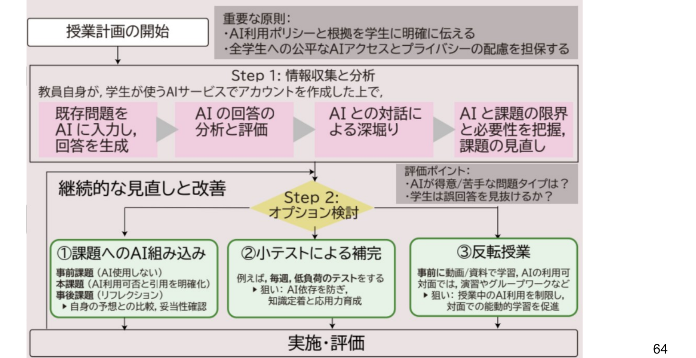

<!--
- MITが示している、AI時代の課題修正フロー。授業計画の開始から、まず情報収集ステップ（AI利用ポリシーの明確化、公平なAIアクセスとプライバシーの配慮）を行う。
- 次に、既存問題をAIに入力して回答を生成、AIの回答を分析・評価、AIとの対話による深堀り、AIと課題の限界・必要性の把握というStep。
- そこから継続的な見直しと改善（課題へのAI組み込み、小テストによる補完、反転授業など）を経て、実施・評価へ。これらを循環させていく。
-->

---

学習で活用する際のアイデア

# 学習で活用する際のアイデア

<b>Step1：</b>質問を徹底的にやってみる (含む：エラボレーティブ・インタロゲーション) AI の回答へ批判的思考を働かせる

定義 理由 どのように 関係性 具体化・抽象化 仮定 関心

〇〇の▢▢分野における定義を端的に教えて。 
なぜそのような概念が必要になったのか。 
どのように現実に影響しているのか。どのような考え方をするのかフローを教えて。 
〇〇に喩えて。 
〇〇との関係性はあるのか。他に同じルールに従う点ことはあるのか？例を教えて。 
それらをまとめたとき、上位概念は何か？ 
〇〇としたら / ないとしたら 
自分の関心や目標とどのように関わっているのか

<!--
- 学習でAIを活用する際のアイデア、Step1。質問を徹底的にやってみる。エラボレーティブ・インタロゲーション、つまり「なぜ？」「どのように？」と問い続ける手法を含む。そしてAIの回答へ批判的思考を働かせる。
- 観点として、定義・理由・どのように・関係性・具体化抽象化・仮定・関心。右の例のように、定義を端的に、なぜ必要か、どう影響するか、何に喩えられるか、関係性、上位概念、もし〜なら、自分の関心とどう関わるか、と問いを重ねていく。
-->

---

学習で活用する際のアイデア

# 学習で活用する際のアイデア

<b>Step2：</b>問題を解く / アクティブ・リコールを行う

NG： 〇〇という問題の答えを教えて。

〇〇という問題を誤って✕✕と答えた。正解は▢らしい。なぜ?

(教材をAIのコンテキストに与えたうえで) 問題と解説を生成して

<b>Step3：</b>リフレクションを行う

<!--
- 学習でAIを活用するStep2。問題を解く、アクティブ・リコール（思い出して答える）を行う。
- NGなのは「〇〇という問題の答えを教えて」と答えそのものを聞くこと。良いのは「誤って✕✕と答えた、正解は▢らしい、なぜ？」と理由を問う使い方や、教材をコンテキストに与えたうえで問題と解説を生成してもらう使い方。
- そしてStep3、リフレクションを行う。解いて終わりではなく振り返る。
-->

---

参考：Googleの取組み

# 参考：Googleの取組み1　イントロ

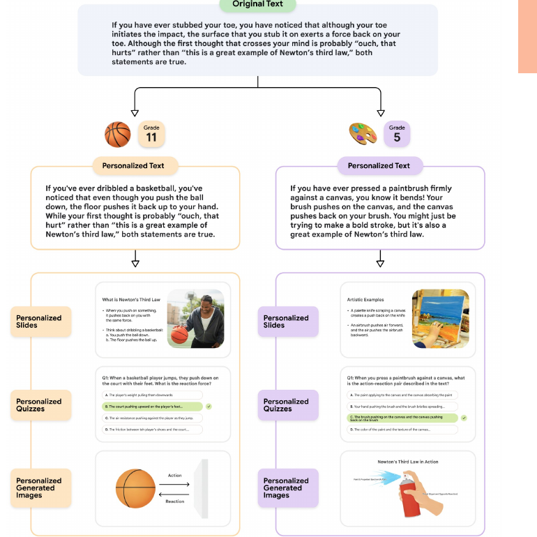

Learn Your WayEXPERIMENT

Towards an AI-Augmented Textbook, LearnLM Team, Google (2025)

初等・中等教育で、 生徒のレベル感や興味に合わせ、 教科書データを書き換えて、 <b style="color:var(--accent-dark);">解説</b>や<b style="color:var(--accent-dark);">問題</b>を出力する

<!--
- 参考として、Googleの取組みを紹介。「Learn Your Way」という実験的なプロジェクト。論文は Towards an AI-Augmented Textbook, LearnLM Team, Google (2025)。
- 初等・中等教育で、生徒のレベル感や興味に合わせて教科書データを書き換え、解説や問題、さらには画像までを個別に出力する。左の図は、同じ「ニュートンの第三法則」の説明を、バスケが好きな生徒には基礎をドリブルに、絵が好きな生徒には絵筆に喩えて書き換えている例。
-->

---

研究で活用する際のアイデア

# 研究で活用する際のアイデア

<table style="width:100%; border-collapse:collapse; font-size:20px; line-height:1.35; margin-top:6px;">
<tr><td style="border:1.5px solid #ccc; padding:5px 14px; background:var(--section-bg); font-weight:800; width:210px;">タスク処理：</td><td style="border:1.5px solid #ccc; padding:5px 14px;"><b>Gem</b> (学振申請・シミュレーション・成果まとめ)　<b>Dify / n8n</b> (その他、特化したタスク)</td></tr>
<tr><td style="border:1.5px solid #ccc; padding:5px 14px; background:var(--section-bg); font-weight:800;">情報整理・深掘り：</td><td style="border:1.5px solid #ccc; padding:5px 14px;">NotebookLM、Google Spreadsheet + API</td></tr>
<tr><td style="border:1.5px solid #ccc; padding:5px 14px; background:var(--section-bg); font-weight:800;">一般検索：</td><td style="border:1.5px solid #ccc; padding:5px 14px;">Deep research、Dify、Claude Desktop</td></tr>
<tr><td style="border:1.5px solid #ccc; padding:5px 14px; background:var(--section-bg); font-weight:800;">文献検索：</td><td style="border:1.5px solid #ccc; padding:5px 14px;">ScienceDirect AI</td></tr>
<tr><td style="border:1.5px solid #ccc; padding:5px 14px; background:var(--section-bg); font-weight:800;">論文比較：</td><td style="border:1.5px solid #ccc; padding:5px 14px;">Elicit</td></tr>
<tr><td style="border:1.5px solid #ccc; padding:5px 14px; background:var(--section-bg); font-weight:800;">英文執筆支援：</td><td style="border:1.5px solid #ccc; padding:5px 14px;">Grammarly (千葉大提供)</td></tr>
<tr><td style="border:1.5px solid #ccc; padding:5px 14px; background:var(--section-bg); font-weight:800;">スライド：</td><td style="border:1.5px solid #ccc; padding:5px 14px;">Gamma</td></tr>
<tr><td style="border:1.5px solid #ccc; padding:5px 14px; background:var(--section-bg); font-weight:800;">模式図/ベクター図：</td><td style="border:1.5px solid #ccc; padding:5px 14px;">Napkin、Adobe Firesy</td></tr>
<tr><td style="border:1.5px solid #ccc; padding:5px 14px; background:var(--section-bg); font-weight:800;">画像作成：</td><td style="border:1.5px solid #ccc; padding:5px 14px;">Nano Bananaなど</td></tr>
</table>

※学振/JST申請などは、AIを使って読み手の印象を分析するなどで利用 (自身が解決したい問い自体は、AIの出力ではなく、人が考える問題)

ぜひ、ご参加の皆様の活用例を教えて下さい

<!--
- 研究で活用する際のアイデアを、用途別のツールで整理。タスク処理はGem（学振申請・シミュレーション・成果まとめ）やDify/n8n。情報整理・深掘りはNotebookLMやSpreadsheet+API。
- 一般検索はDeep researchやClaude Desktop、文献検索はScienceDirect AI、論文比較はElicit、英文執筆支援はGrammarly（千葉大提供）、スライドはGamma、模式図はNapkinやFirefly、画像作成はNano Bananaなど。
- 注意点として、学振やJST申請ではAIを読み手の印象分析などに使うのは良いが、自身が解決したい問い自体は人が考えるもの。ぜひ皆様の活用例も教えてください。
-->

---

便利グッズ：GAS + AI

# 便利グッズ：GAS + AI

= AI(“プロンプト”, “AIが参照するデータ範囲”)

Hi → こんにちは

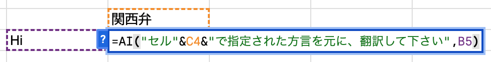

関西弁 → まいど

cf. GOOGLETRANSLATE(テキスト, [ソース言語, ターゲット言語])

GASを使って、生成AIのAPIを叩くことでより高度な翻訳も可能

その他、Colabでは<b>Data Science Agent でデータ分析が自動化</b>できつつある (一番最初の可視化程度には良いかも…)

研究の下ごしらえとしての生成AI活用は今後も加速するだろう

<!--
- 便利グッズとして、GAS（Google Apps Script）+ AIを紹介。スプレッドシートで =AI(“プロンプト”, “参照するデータ範囲”) のような自作関数を作れる。
- 例えば「翻訳して下さい」でHiを「こんにちは」に、さらにセルで指定した方言（関西弁）を元に翻訳させると「まいど」になる。GOOGLETRANSLATE関数の発展形のイメージ。GASで生成AIのAPIを叩けば、より高度な翻訳も可能。
- ColabではData Science Agentでデータ分析の自動化も進みつつある（最初の可視化程度には良い）。研究の下ごしらえとしての生成AI活用は、今後も加速していくだろう。
-->

---

生成AI活用講座

# 生成AI活用講座1　イントロ

シラバス

<a href="https://syllabus.gs.chiba-u.jp/2025/401001000000000/G122151001/ja_JP">https://syllabus.gs.chiba-u.jp/2025/401001000000000/G122151001/ja_JP</a>

授業の目的

生成AIの仕組みを理解し、課題解決のための演習をしたうえで、私達は生成AIとどのように<b style="color:var(--accent-dark);">関わるべきか自分なりの「考え」</b>を持つ。

・Difyでアプリを作ってみることで、<b>AIの道具性や限界に気づく</b>

・<b>教えることは最低限、課題はAIがないと出来ない設計、グループワーク</b>

・<b>変わらないことを教えたい (改善ループ、AIを活かした学び方)</b>

過程

・2024年10月に科目申請

・2025年第4ターム (10月、11月)　<b>1単位</b>

数理・データサイエンス教育プログラム、教養科目の選択必修

<!--
- ここからは、実際に千葉大で開講した「生成AI活用講座」の紹介。シラバスは記載のURL。
- 授業の目的は、生成AIの仕組みを理解し、課題解決の演習をしたうえで、私達は生成AIとどう関わるべきか自分なりの「考え」を持つこと。Difyでアプリを作ることでAIの道具性や限界に気づき、教えることは最低限にして課題はAIがないと出来ない設計、グループワーク、そして改善ループやAIを活かした学び方など変わらないことを教えたい。
- 過程としては、2024年10月に科目申請、2025年第4ターム（10〜11月）に1単位で開講。数理・データサイエンス教育プログラム、教養科目の選択必修。
-->

---

設計

# 到達目標2 コースの内容

<b>[基礎知識]</b> 生成AIの背景の仕組み、周辺のコンセプトを定性的に説明出来るようになる。

<b>[応用]</b> 生成AIのリスクや得意な点・難しい点を理解し、批判的思考力を働かせ生成AIを活用できる。

<b>[統合と創造]</b> 社会または自分の課題解決のために生成AIを活用したミニアプリを組み立てることができる。

<b>[価値づけ]</b> 生成AIと自分/社会がどのように関わるべきか、自らの考えをもつ。

<!--
- 講座の設計、到達目標。4つの段階で設定している。
- [基礎知識]：生成AIの背景の仕組みや周辺コンセプトを定性的に説明できる。[応用]：リスクや得意・難しい点を理解し、批判的思考を働かせて活用できる。
- [統合と創造]：社会や自分の課題解決のため、生成AIを活用したミニアプリを組み立てられる。[価値づけ]：生成AIと自分・社会がどう関わるべきか、自らの考えをもつ。Bloomの分類に沿った設計になっている。
-->

---

設計

# 到達目標2 コースの内容

<b>[基礎知識]</b> 生成AIの背景の仕組み、周辺のコンセプトを定性的に説明出来るようになる。

小さいAIを創るワーク、倫理・関係する概念の簡単なテスト

<b>[応用]</b> 生成AIのリスクや得意な点・難しい点を理解し、批判的思考力を働かせ生成AIを活用できる。

DIfyを用いた基礎演習、生成AIの活用事例の調査・検討

<b>[統合と創造]</b> 社会または自分の課題解決のために生成AIを活用したミニアプリを組み立てることができる。

Difyを用いたグループワーク

<b>[価値づけ]</b> 生成AIと自分/社会がどのように関わるべきか、自らの考えをもつ。

生成AIとの関わり方を考える、最終レポート

<!--
- 同じ到達目標に、それぞれ対応する具体的な活動を当てはめた図。
- [基礎知識]には、小さいAIを創るワークと、倫理・関連概念の簡単なテスト。[応用]には、Difyを用いた基礎演習と、生成AIの活用事例の調査・検討。
- [統合と創造]には、Difyを用いたグループワーク。[価値づけ]には、生成AIとの関わり方を考える最終レポート。到達目標と活動がきちんと対応するように設計している。
-->

---

設計

# コースの内容2 コースの内容

<table style="width:100%; border-collapse:collapse; font-size:22px; line-height:1.4; margin-top:10px;">
<tr><td style="border:1.5px solid #ccc; padding:7px 14px; background:var(--accent-soft); font-weight:800; width:46px; text-align:center;">1</td><td style="border:1.5px solid #ccc; padding:7px 14px;">イントロダクション/生成AIの活用事例(講義)</td><td style="border:1.5px solid #ccc; padding:7px 14px; width:300px;">リテラシ・グループ分け</td></tr>
<tr><td style="border:1.5px solid #ccc; padding:7px 14px; font-weight:800; text-align:center;">2</td><td style="border:1.5px solid #ccc; padding:7px 14px;">生成AIの仕組み (オンデマンド)</td><td style="border:1.5px solid #ccc; padding:7px 14px;">AI作成 or 動画 ※選択</td></tr>
<tr><td style="border:1.5px solid #ccc; padding:7px 14px; font-weight:800; text-align:center;">3</td><td style="border:1.5px solid #ccc; padding:7px 14px;">生成AI活用の注意点・勘所 (講義)</td><td style="border:1.5px solid #ccc; padding:7px 14px;">倫理、学び方</td></tr>
<tr><td style="border:1.5px solid #ccc; padding:7px 14px; font-weight:800; text-align:center;">4</td><td style="border:1.5px solid #ccc; padding:7px 14px;">生成AIアプリ開発の基礎知識 (オンデマンド)</td><td style="border:1.5px solid #ccc; padding:7px 14px;">Difyの使い方</td></tr>
<tr><td style="border:1.5px solid #ccc; padding:7px 14px; font-weight:800; text-align:center;">5</td><td style="border:1.5px solid #ccc; padding:7px 14px;">課題発掘と解決のための仮説形成</td><td style="border:1.5px solid #ccc; padding:7px 14px;">アプリ作成のアイデア</td></tr>
<tr><td style="border:1.5px solid #ccc; padding:7px 14px; font-weight:800; text-align:center;">6</td><td style="border:1.5px solid #ccc; padding:7px 14px;">グループワークでの開発</td><td style="border:1.5px solid #ccc; padding:7px 14px;">開発の実施</td></tr>
<tr><td style="border:1.5px solid #ccc; padding:7px 14px; font-weight:800; text-align:center;">補</td><td style="border:1.5px solid #ccc; padding:7px 14px;">アドバイス回</td><td style="border:1.5px solid #ccc; padding:7px 14px;">質問対応</td></tr>
<tr><td style="border:1.5px solid #ccc; padding:7px 14px; font-weight:800; text-align:center;">7</td><td style="border:1.5px solid #ccc; padding:7px 14px;">発表・評価</td><td style="border:1.5px solid #ccc; padding:7px 14px;">発表・相互評価</td></tr>
<tr><td style="border:1.5px solid #ccc; padding:7px 14px; font-weight:800; text-align:center;">8</td><td style="border:1.5px solid #ccc; padding:7px 14px;">AIと自分との関係性を考える・まとめ</td><td style="border:1.5px solid #ccc; padding:7px 14px;">レポート</td></tr>
</table>

<!--
- コースの内容は全8回＋補講。1回目はイントロと活用事例（リテラシ・グループ分け）、2回目は仕組み（オンデマンド）、3回目は注意点・勘所（倫理・学び方）、4回目はアプリ開発の基礎（Dify）、5回目は課題発掘と仮説形成、6回目はグループワーク開発、補講でアドバイス、7回目に発表・相互評価、8回目にAIと自分の関係性を考えてまとめ・レポート。
-->

---

Difyの運用

# Difyの運用2 コースの内容

サーバー設定

<b>Xserver 社のVPSでセルフホスト</b>

月2000円/1サーバー、6台 (4台で十分)

AIは、<b>Gemini、AWS claude、ChatGPT (自費)のAPI</b>

ダミーIDの発行

構築はほぼ一瞬

手間はない

メンバー

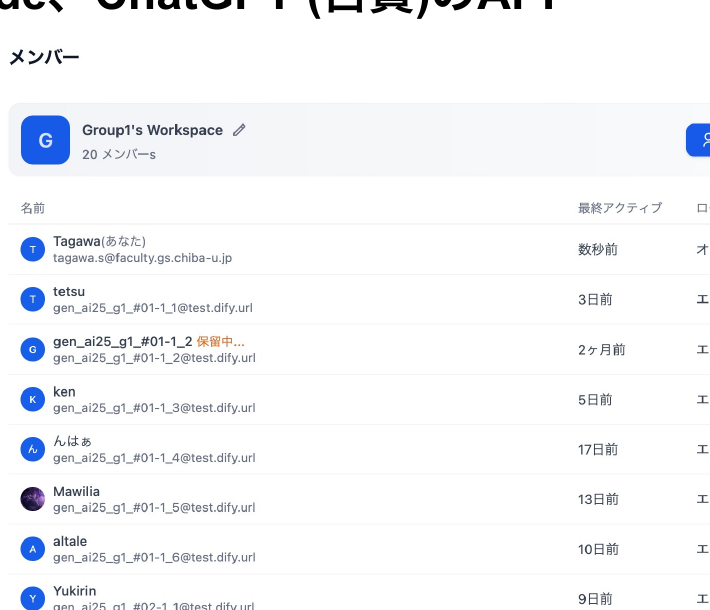

<!--
- Difyの運用について。サーバーはXserver社のVPSでセルフホスト。月2000円で1サーバー、6台用意したが4台で十分。AIはGemini、AWSのClaude、ChatGPT（自費）のAPIを使用。学生にはダミーIDを発行。構築はほぼ一瞬で、手間はかからない。
- 右はDifyのワークスペースのメンバー一覧。グループごとにアカウントを発行して運用している。
-->

---

受講者比率

# 受講者比率3 結果

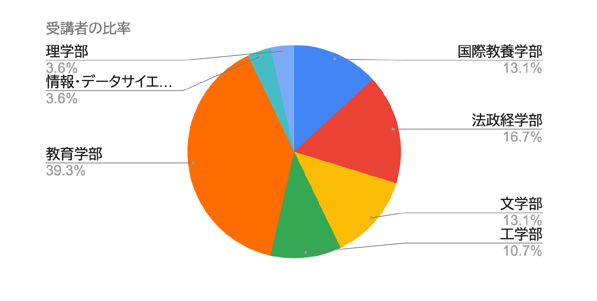

<!--
- 受講者の比率を学部別に見ると、教育学部が39.3%と最も多く、次いで法政経学部16.7%、国際教養学部と文学部が各13.1%、工学部10.7%、理学部と情報・データサイエンス学部が各3.6%。教育学部の学生が多かったのが特徴的でした。
-->

---

学生の感想

# 学生の感想3 AIとの関わり方

私は教育学部に所属しており、将来教員として働きたいと考えているが、もし自分の授業が画一的であったら、AIが提供する個別最適化された教材に代替されるかもしれない。しかし、子ども一人ひとりの表情や気持ちを読み取り察知し、状況に応じて授業の進行を変化させたり、子どもの発言によって柔軟に対応したりすることは人間にしかできないと考える。そのため、<b>AIに奪われないようにと過剰に恐れるのではなく、授業づくりや子どもたちの学びのサポートとして積極的にAIを取り入れながら、授業を行っていくことが学びにとって重要</b>だと考える。このとき、<b>教師は自分自身の創造性、独自性を磨く必要</b>があると考える。

上記の通り、AIの利点と課題の両方を理解し、人間が主体的に使いこなすことが、これからの教育において重要であり、<b>AIを「思考を広げる助手」</b>としてとらえて、ともによりよい学びを生み出すことを意識すると良いと考える。

<!--
- 学生の感想を紹介。教育学部の学生で、将来教員を志望。画一的な授業ならAIの個別最適化教材に代替されうるが、子ども一人ひとりの表情や気持ちを読み取り柔軟に対応することは人間にしかできない。
- AIに奪われると過剰に恐れるのではなく、授業づくりや学びのサポートとして積極的にAIを取り入れることが重要。そのために教師は自分自身の創造性・独自性を磨く必要がある。AIを「思考を広げる助手」として捉え、ともによりよい学びを生み出すことを意識したい、という前向きな感想でした。
-->

---

Session 5の目的・到達目標

# 振り返り

目的

目標 ＋ まとめ

<b>Session 5：</b> 学びのためのAI活用法のアイデアを知る

<b style="color:var(--accent-dark);">・そもそも論として、AIとの付き合い方を考える</b>

生成 AI に答えを聞くのではない

考える上で、生成 AI を道具として使う

<b style="color:var(--accent-dark);">・学習に利用する際のアイデアを見つける</b>

<b>学びの文脈</b>に合わせて活用する

<b style="color:var(--accent-dark);">・研究に利用する際の活用例を知る</b>

<b>タスク</b> (例：申請書応募、実績のまとめ)

<b>情報整理・深掘り、検索、比較、英作文、スライド作成</b>など

<b>研究でどこまで使ってよいかは、各専門の慣行</b>に従う

<!--
- Session 5の振り返り。目的は「学びのためのAI活用法のアイデアを知る」。目標とまとめを確認する。
- そもそも論として、AIとの付き合い方を考える：生成AIに答えを聞くのではなく、考える上で道具として使う。
- 学習に利用するアイデアを見つける：学びの文脈に合わせて活用する。
- 研究に利用する活用例を知る：タスク処理（申請書応募・実績まとめ）、情報整理・深掘り・検索・比較・英作文・スライド作成など。研究でどこまで使ってよいかは各専門の慣行に従う。
-->

---

<!-- _class: divider -->

Session 6　ワーク

# 学習ツールとしてAIを試してみる

<h2>大学における生成AIとの関わり方を考える　15 - min × 6 sessions</h2>

<!--
- ここからSession 6のワーク「学習ツールとしてAIを試してみる」。実際に手を動かして、AIを学びの道具として使ってみます。
-->

---

AIの学び方

# AIの学び方

今回触れたこと

<b>検証できる範囲で使うか・使わないか分別できる。</b>

<b>自分の課題として道具を作れる。</b>

仕事を簡単にする道具

学ぶための道具

<b>AIの限界を理解</b>する。

実際にハルシネーションさせてみる

<b>情報が繋がること</b>で、<b>価値のある情報</b>を作れる。

<b>AIを組み込んだ実験 - 改善ループを創ることが出来る。</b>

生成AIリテラシー（Li, 2025）

・生成AIの基礎に関する知識 
・効果的な利用方法 
・アウトプットの評価 
・倫理

国内では、G検定や生成AIパスポートのシラバスが便利 Google skillsのAIリーダーやMOOCも無料で良い教材

<!--
- AIの学び方として今回触れたこと。検証できる範囲で使うか使わないか分別できる、自分の課題として道具を作れる（仕事を簡単にする道具・学ぶための道具）、AIの限界を理解する（実際にハルシネーションさせてみる）、情報が繋がることで価値のある情報を作れる、AIを組み込んだ実験-改善ループを創れる。
- 生成AIリテラシー（Li, 2025）は、基礎知識・効果的な利用方法・アウトプットの評価・倫理の4つ。国内ではG検定や生成AIパスポートのシラバス、Google skillsのAIリーダーやMOOCも無料で良い教材です。
-->

---

AIツールの「逆向き設計」

# AIツールの「逆向き設計」

AIツールを設計し、評価する際の起点となる3つの設計

<b>求める結果を明確にする(目的)</b>

<b>正しく回答した証拠を考える(評価)</b>

<b>動作を計画する(内容)</b>

<b>通常は、内容だけを考えそうだが、それでは、ツールをうまく作ることは出来ない。</b> 
※機械学習の設計にも通じる

<!--
- AIツールの「逆向き設計」。AIツールを設計し評価する際の起点となる3つの設計。①求める結果を明確にする（目的）、②正しく回答した証拠を考える（評価）、③動作を計画する（内容）。
- 通常は内容だけを考えそうだが、それではツールをうまく作ることは出来ない。目的と評価を先に決める逆向き設計の発想が重要で、これは機械学習の設計にも通じます。
-->

---

まとめ

# まとめ

・AIを試す/情報収集することは、<b>重要</b> 
・AIは進歩しているし、利活用が進んでいる 
・倫理面・技術面・ポリシー面を理解する 
・AIが得意なこと・人が得意/するべきことを区別する 
・<b>自分を支援する”助手”や”相棒”と捉えては？</b>

まずは、生成AIとの関わり方を考えては？

ご参加頂き、ありがとうございました！

<!--
- まとめです。AIを試す・情報収集することは重要。AIは進歩しているし、利活用も進んでいる。倫理面・技術面・ポリシー面を理解する。AIが得意なこと・人が得意/するべきことを区別する。そして、AIを自分を支援する”助手”や”相棒”と捉えてはどうでしょうか。
- まずは、生成AIとの関わり方を考えてみてください。本日はご参加頂き、ありがとうございました！
-->
