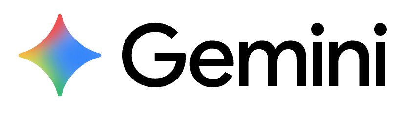
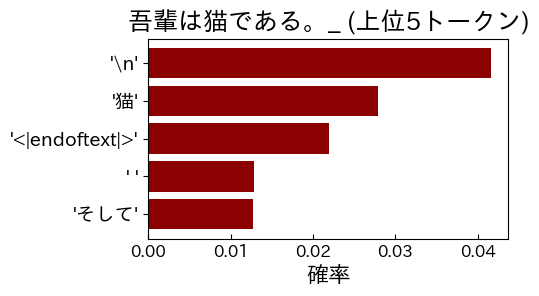

<!-- _class: cover-hero -->

 を用いた

シラバス作成支援について

2025/12

高等教育センター 質保証・FD部

田川 翔

<!--
[NOTE] Geminiを用いたシラバス作成支援についての回。高等教育センター 質保証・FD部 田川。
-->

---

Gemとはなにか？

# Gem = Geminiを用いたカスタムAIエキスパート

● <b>千葉大 Google Workspaceの標準機能</b>

● <b>自分が生成AIに指示した振る舞いで生成AIが動く</b>

○ しかも、学内にリンクの形で、作ったエキスパートを共有出来る

● <b>機密情報の取扱いが可能</b>

<!--
[NOTE] Gem＝Geminiを用いたカスタムAIエキスパート。千葉大Workspaceの標準機能で、機密情報も扱える。
-->

---

試行：シラバス”事前”チェック

# シラバスを事前に確認するGem

<b>ご自由に</b>お使いになれます ログは、他の方に共有<b>されません</b>

出来ること

<ul>
<li>● <b>シラバスのプレチェック</b>　○ PDFアップロード可</li>
<li>● <b>シラバスの表現の相談</b>　○ 壁打ち・質問する</li>
</ul>

出来ないこと

<ul>
<li>● <b>シラバス全体の作成</b>　○ あくまで支援”者”</li>
<li>● <b>正解の作成</b>　○ 最終確認はご自身で</li>
</ul>

<b>シラバス作成の伴走が可能です</b>

<!--
[NOTE] シラバスを事前確認するGem。ご自由に。プレチェック・表現相談は可能、全体作成や正解作成は支援者の範囲。伴走が可能。
-->

---

使い方：デモ

# 使い方：デモ　①

<b>使い方①</b>

作成したPDFをアップロードし、 シラバスのプレチェックをしてみる。

→ ◎、◯、△、✕でプレチェック

<b>使い方②</b>

表現やシラバスの意味を尋ねる。

<!--
[NOTE] 使い方①：作成したPDFをアップロードしてプレチェック。◎◯△✕で評価が返る。
-->

---

使い方：デモ

# 使い方：デモ　②

<b>使い方①</b>

作成したPDFをアップロードし、 シラバスのプレチェックをしてみる。

<b>使い方②</b>

表現やシラバスの意味を尋ねる。

→ FD資料に基づき壁打ち

<!--
[NOTE] 使い方②：表現やシラバスの意味を尋ねる。FD資料に基づいて壁打ちしてくれる。
-->

---

免責

# <b>生成AIの中核である大規模言語モデル</b>は、 <b>次の単語を予測するだけ</b> → ハルシネーション注意

利用 (推論・生成)

計算1回目

“吾輩は”

▲

出力

▲

AI処理 (デコーダ)

▲

前処理

▲

入力

▲

“吾輩”

計算2回目

“吾輩は猫”

▲

出力

▲

AI処理 (デコーダ)

▲

前処理

▲

入力

▲

“吾輩は”

計算3回目

“吾輩は猫で”

▲

出力

▲

AI処理 (デコーダ)

▲

前処理

▲

入力

▲

“吾輩は猫”

モデル： cyberagent/open-calm-7b

<!--
[NOTE] “吾輩は猫で”の例。LLMは前の単語列から次の単語を予測するだけ。だからハルシネーションに注意。モデルはopen-calm-7b。
-->

---

試行です / ご意見下さい

# 試行です / ご意見下さい

<b>① AIの意見は、あくまで参考</b>として下さい

→ご自身のご判断や分野の慣習を優先して下さい AIの出力に全て従う必要はありません

<b>② AIの出力結果は、確認</b>して下さい

→常に、正解を出すわけではありません。 ※シラバスチェックで指摘がある可能性はあります。

誤作動や感想、改善について、 ご意見頂けますと幸いです。

<!--
[NOTE] あくまで試行。①AIの意見は参考、②出力は必ず確認を。誤作動や感想・改善のご意見を歓迎します。
-->
