<!-- _class: cover-hero -->

AI時代の教え方

大学教育への事例をもとに

大学における生成AIとの関わり方を考える 15-min × 6 sessions

グローバルビジネス学会 研究発表会

2025/11/30 大阪大学

千葉大学 国際未来教育基幹　田川 翔

<!--
- タイトルコール。「AI時代の教え方」。大学教育の事例をもとに、生成AIとの関わり方を15分×6セッションで考えます。
-->

---

講師紹介

# <ruby>田川<rt>たがわ</rt></ruby> <ruby>翔<rt>しょう</rt></ruby>

<b>所属：</b>千葉大学 高等教育センター/アカデミックリンクセンター　／　<b>大学教育を設計し、学生と教員を支援する仕事</b>

①元々は理学の人

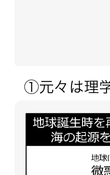

②色々な経験

<ul>
<li>大学のICT支援 (コロナ禍)</li>
<li>大規模オンライン授業の作成</li>
<li>民間企業での経験</li>
<li>AI×大学</li>
</ul>

③大学を学びやすく!

<b>大学での教え方</b> <b>生成AIの教育利活用</b>  現在、<i>Teaching with AI</i> を翻訳・出版準備中 2026春、技術評論社より

AIで、学び方は変わる？学習や研究の相棒に出来る？

<!--
- 自己紹介。田川翔と申します。千葉大学の高等教育センター／アカデミックリンクセンター所属で、大学教育を設計し学生と教員を支援する仕事をしています。
- 元々は理学の人間で、色々な経験を経て、いまは大学を学びやすくする仕事を。Teaching with AIを翻訳中です。
-->

---

生成AI活用講座

# 生成AI活用講座 / Hands-on Generative AI Workshop 学部1 - 2年生向け

大規模言語モデルを知る

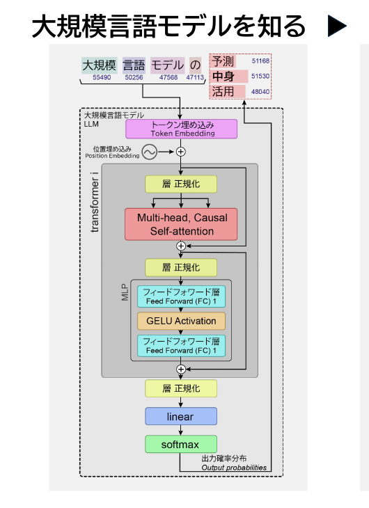

生成AIアプリを作ってみる

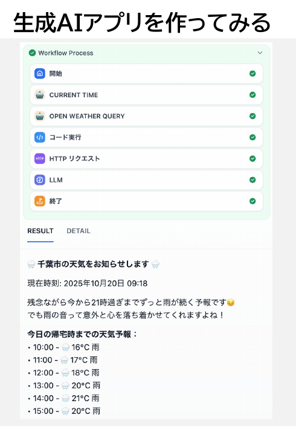

▶ AIとの関わり方を考える

<b>AIリテラシ/倫理</b> ・人間中心のAI社会原則　・安全性　・プライシー　・透明性　・公平性　・説明可能性

<b>テスト</b>　／　<b>グループワーク</b>

<b>レポート</b> ・<b>AIの活用例</b> →企業での活用例を調査 ・生成AIの自分なりの説明　・<b>AIとの関わり方レポート</b>

<!--
- 学部1〜2年生向けに、生成AI活用講座を開講しています。大規模言語モデルを知る、生成AIアプリを作ってみる、そしてAIとの関わり方を考える、の3本柱です。
-->

---

講座の構成

1テーマ <b>15分間完結</b> 演習付き  (オンラインの皆様もぜひ！)

<b>Unit 1： AI”を”教える</b>

Session 1　AIの正体を解剖する

Session 2　<b>演習：</b>生成AIの仕組みを体験する

<b>Unit 2: AI”で”楽する</b>

Session 3　プロンプトを書くコツ

Session 4　<b>演習:</b> 自作アプリを作ってみる

<b>Unit 3: AI”と”教える</b>

Session 5　AIと授業の考え方

Session 6　<b>演習:</b> 授業での活用を考える

<!--
- 全体の構成です。Unit1はAIを教える、Unit2はAIで楽する、Unit3はAIと教える。1テーマ15分完結・演習付きで進めます。
-->

---

今日のお土産

# 今日のお土産

<b>① スキル：</b>

生成AIのプロンプトを学べます。 GemやNotebookLMを体験できます。 活用について、自分の意見を持てます。

<b>② 1枚俯瞰シート：</b>　丸わかりシートをゲットできます。

<b>③ 生成AI用のプロンプト：</b>　プロンプト作成を支援してくれます。

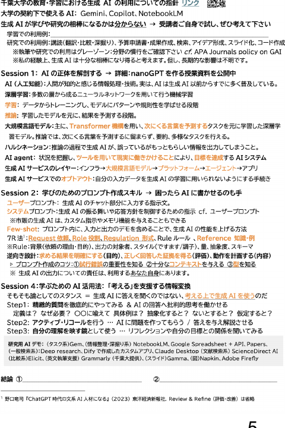

お詳しい先生は、ぜひ演習で他の方をご支援下さい

<!--
- 今日のお土産は3つ。①スキル、②1枚俯瞰シート、③生成AI用のプロンプト。お詳しい先生は、ぜひ演習で他の方をご支援下さい。
-->

---

<!-- _class: divider -->

Session 1

# AIの正体を解剖する

<h2>大学における生成AIとの関わり方を考える 15 - min × 6 sessions</h2>

<!--
- ここからSession 1、「AIの正体を解剖する」です。
-->

---

Session 1の目的・到達目標

<b style="color:var(--accent-dark);">目的</b>　　<b>Session 1：</b> AIの正体を解剖する

<b style="color:var(--accent-dark);">目標</b>

・<b>利活用の前提知識</b>を知る

・<b>大規模言語モデル</b>の中身をイメージできる

・生成AIサービスの<b>レイヤー</b>がわかる

<!--
- Session 1の目的は「AIの正体を解剖する」。目標は、利活用の前提知識を知る、大規模言語モデルの中身をイメージできる、生成AIサービスのレイヤーがわかる、の3つです。
-->

---

問いかけ

📋

生成AIをどのくらい使われていますか？

📣 これは Slido のインタラクションスライドです（投票）

<!--
- 📣 This is Slido interaction slide, please don't delete it.✅ Click on 'Present with Slido' and the poll will launch automatically when you get to this slide.
- まず会場の皆さんに伺います。生成AIをどのくらい使われていますか？
-->

---

問いかけ

📋

生成AIについて、どのくらい自由自在に使えますか

📣 これは Slido のインタラクションスライドです（投票）

<!--
- 📣 This is Slido interaction slide, please don't delete it.✅ Click on 'Present with Slido' and the poll will launch automatically when you get to this slide.
- 続いて、生成AIについて、どのくらい自由自在に使えますか？
-->

---

問いかけ

📋

使う用途はなんですか

📣 これは Slido のインタラクションスライドです（投票）

<!--
- 📣 This is Slido interaction slide, please don't delete it.✅ Click on 'Present with Slido' and the poll will launch automatically when you get to this slide.
- 最後に、使う用途はなんですか？
-->

---

大前提

<b>生成AIの利活用に、現時点で正解はあるか？</b>

<b>生成AIは、仕事・研究・学びで不可欠か？</b>

<b>生成AI時代は学ぶ内容を変えないといけないか？</b>

▶ No！

必ずしも、言い切れない

<!--
- 大前提として、3つ問いかけます。生成AIの利活用に現時点で正解はあるか？仕事・研究・学びで不可欠か？学ぶ内容を変えないといけないか？
- 答えは「No！」。必ずしも、言い切れません。
-->

---

大前提

<b>生成AIの利活用に、現時点で正解はあるか？</b>

<b>生成AIは、仕事・研究・学びで不可欠か？</b>

<b>生成AI時代は学ぶ内容を変えないといけないか？</b>

▶ No！

<b>… しかし、生成AI技術は進歩し、仕事や研究にも影響を与えつつある</b>

生成AIは「相棒になるか」を<b>自ら考え</b>、<b>必要なときに、使えるようになる</b>ことが重要

<b>生成AIとの付き合い方</b>の仮説・勘を磨くのが重要

<!--
- しかし、生成AI技術は進歩し、仕事や研究にも影響を与えつつあります。
- だからこそ、生成AIは「相棒になるか」を自ら考え、必要なときに使えるようになることが重要。生成AIとの付き合い方の仮説・勘を磨くのが大切です。
-->

---

生成AIの活用領域

# 生成AIの活用領域

Anthropic (2025 ArXiv) リンク

プライバシーの保護を保った状態で、 
400万以上のClaude.aiの会話を分析

何をしたか

→どの経済的タスクにAIが利用されているか把握 
米国労働省のO*NET実会話DBから類似性分類

全体として分かったこと

① Software 開発とWritingで半分 
② 36%の職業にAIが利用されている 
③ スキル増強：自動化 = 57 : 43

<b>教育での利用</b>：チュータリングタスクが多い

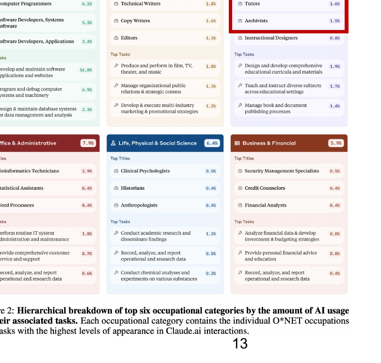

<!--
- Anthropicが400万以上のClaude.aiの会話をプライバシー保護下で分析した研究。O*NETのデータと突き合わせ、どの経済的タスクにAIが使われているかを把握。
- ソフトウェア開発とWritingで半分、36%の職業でAI利用、スキル増強と自動化はおよそ57:43。教育ではチュータリングが多い。
-->

---

生成AIの影響

# 参考： 職業への影響

内閣府(2024) 世界経済の潮流>第1章>p.13

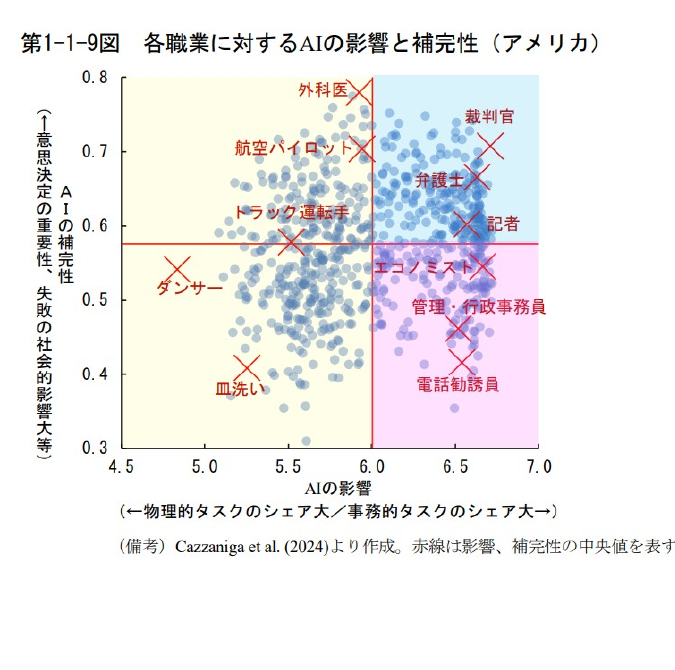

<b style="color:var(--accent-dark)">AIの影響が大きく、代替性が高い職業：</b>事務的タスクのシェアが大きい職業。▶ つまり、AIがとって変わってしまう職業

<b>AIの影響が大きく、補完性が高い職業：</b>事務的タスクのシェアが大きいものの、意思決定の重要性が高く、AI任せとすることが社会的に望ましくない職業。▶ AIを使いこなす必要のある職業

<b>AIの影響の小さい職業：</b>物理的タスクのシェアが大きい職業。

※ 教員・研究者(自然科学系)は、青の領域

<!--
- 内閣府の資料。職業を「代替性が高い」「補完性が高い」「影響が小さい」に分けて整理。
- 事務的タスク中心の職業はAIに代替されやすい一方、意思決定の重要性が高い職業はAIを使いこなす必要がある。教員・研究者(自然科学系)は青の領域。
-->

---

事例：千葉大学の指針

# 千葉大学における生成AIの指針(令和5年10月13日)

①「生成 AI についての学び」「生成 AI を用いた学び」「生成 AI によらない学び」を<b>それぞれ推進</b>

② 授業での利用は、授業の目的に合致することが前提であり、合致するかは、各授業の担当教員が<b>判断</b>

③ 禁止の場合はシラバスなどに明記（気になったら先生に聞きましょう！）

リスクや懸念に伴う禁止事項あり

<a href="https://drive.google.com/file/u/2/d/1ZultuLWXNLJ53M43ExrYG8cIfwqcCnCO/view?pli=1">https://drive.google.com/file/u/2/d/1ZultuLWXNLJ53M43ExrYG8cIfwqcCnCO/view?pli=1</a> 
森本(2024/9まで) ChatGPT/生成AIへの対応を表明した国内の大学一覧 
<a href="https://note.com/pogohopper8/n/n3126b312f209">https://note.com/pogohopper8/n/n3126b312f209</a>

<b>まずは、ご自身の所属機関のポリシーと提供AIを確認しましょう</b>

<!--
- 事例として千葉大学の指針。「AIについての学び」「AIを用いた学び」「AIによらない学び」をそれぞれ推進する立場。
- 授業での利用は授業の目的に合致するかを担当教員が判断し、禁止する場合はシラバスに明記。まずは自分の所属機関のポリシーと提供AIを確認してほしい。
-->

---

オプトアウト

# 利用規約を確認する必要性： あなたの入力データは、誰が見る?

ChatGPTにメッセージを送ると、<a href="#">規約</a>に同意され、<a href="#">プライバシーポリシー</a>に基づき扱われます。

ChatGPT(特に無料版)の場合、 
<b>ユーザーの入力は原則、学習に使われる</b> 
(と思っておいた方が良い)。 
<b>機微を含むならオプトアウト(自分の入力の学習の停止)する</b> 
→ <a href="https://help.openai.com/en/articles/7730893-data-controls-faq">https://help.openai.com/en/articles/7730893-data-controls-faq</a>

2.個人情報の利用目的

利用規約・プライバシーポリシーで、入力データの利用目的を確認しましょう。

機密情報の入力には、十分注意して下さい　／　所属組織が、推奨するAIを確認！

<!--
- 利用規約の確認の必要性。入力データを誰が見るのか。ChatGPT、特に無料版では、ユーザーの入力は原則学習に使われると思っておいた方がよい。
- 機微な情報を含むならオプトアウト(学習停止)する。機密情報の入力には十分注意し、所属組織が推奨するAIを確認しよう。
-->

---

オプトアウト

# 多くの大学で提供されている、iPaaS内のAIサービス

Google

Gemini / NotebookLM

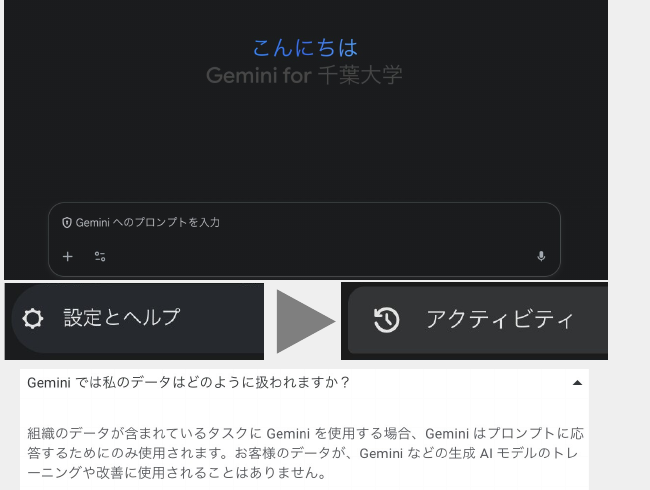

Microsoft

Copilot

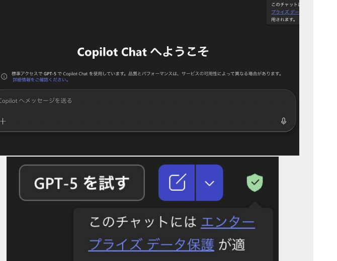

<!--
- 多くの大学では、iPaaS(クラウドの基盤サービス)の中にAIサービスが提供されている。
- Google系ならGemini / NotebookLM、Microsoft系ならCopilot。エンタープライズデータ保護が適用される環境で安心して使える。
-->

---

最低限のAI倫理

# 最低限のAI倫理

<b>詳しく学ばれたい方 → 検定のシラバス・教科書</b>　GUGA検定、G検定、Google AI Leader

<b>1.AIの情報を利活用するうえで重要な姿勢はどれですか</b>

出力を素直に受け入れる　／　生成AIに情報が正しいか聞く　／　原則、自身が責任を取る

<b>2.人間中心の AI 社会原則で重要とされる最も価値はなんですか。</b>

人がリテラシを持たなくても正しく動くAIをつくる　／　AIによる効率化が重要である　／　AI の利用は基本的人権を侵すものであってはならない　／　AIが人の代わりに作業する

<b>3.AIの倫理的問題について、正しい文章はどれですか。</b>

AIの倫理的問題はすでに解決した　／　AI の倫理的問題は技術進歩で解消される　／　AIの倫理的課題は技術の問題ではなく人が考えるべきだ　／　AIの倫理的課題は議論が進まない

<!--
- 最低限のAI倫理をクイズ形式で。詳しく学びたい方は各種検定のシラバス・教科書(GUGA検定、G検定、Google AI Leader)が参考になる。
- AIの情報利用では原則自身が責任を取る。人間中心のAI社会原則では「基本的人権を侵さない」が重要。倫理的課題は技術ではなく人が考えるべきもの。
-->

---

最低限のAI倫理

# 最低限のAI倫理

<b>詳しく学ばれたい方 → 検定のシラバス・教科書</b>　GUGA検定、G検定、Google AI Leader

人間中心の AI 社会原則　懸念となる諸概念

倫理

a. バイアス　ハルシネーション　公平性

b. 安全性　透明性　説明可能性

法制度

a. 個人情報保護

b. 著作権

左以外にもEUのAI倫理など重要な資料あり ぜひ<b>DeepResearch</b> や<b>NotebookLM</b>を使って見て下さい

<b style="color:var(--accent-dark)">cf. 大学関係者の皆様</b> 
大学・高専における生成AIの教学面の取扱いについて 
<b style="color:var(--accent-dark)">cf. 初等中等教育の皆様</b> 
初等中等教育段階における生成 AI の利活用に関するガイドライン

<!--
- AI倫理で懸念となる諸概念。倫理面ではバイアス・ハルシネーション・公平性・安全性・透明性・説明可能性。法制度面では個人情報保護・著作権。
- EUのAI倫理など他にも重要な資料があるので、DeepResearchやNotebookLMで調べてみてほしい。大学・初等中等それぞれにガイドラインがある。
-->

---

深層学習の初歩

# 深層学習の初歩

<b>機械学習：</b>データから、「機械」（コンピューター）が自動で「学習」し、データの背景にあるルールやパターンを発見する方法。

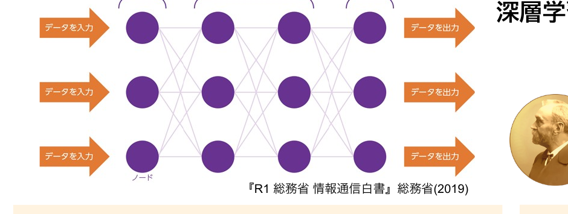

<b>深層学習：</b>多数の層から成るニューラルネットワークを用いて行う機械学習

2024年ノーベル物理学賞

学習

入力

→

パラメーターの函 数字の羅列

→

出力

↻ 更新　／　評価

利用 (推論・生成)

入力

→

パラメーターの函 数字の羅列

→

出力

『R1 総務省 情報通信白書』総務省(2019)

<!--
- 深層学習の初歩。機械学習は、データから機械が自動で学習し、背景のルールやパターンを発見する方法。
- 深層学習は多数の層から成るニューラルネットワークを使う機械学習で、2024年ノーベル物理学賞のテーマ。学習では入力→パラメーターの函(数字の羅列)→出力を更新・評価で繰り返し、利用(推論・生成)では学習済みの函で出力を得る。
-->

---

深層学習の初歩

# 大規模言語モデルの中身 → ◯ 巨大な数字の塊 ✗知識集・ルール集

日本の首都__　→　日本の首都は__　→　日本の首都は東京__

ネクストワードプレディクション

次の言葉(トークン)の確率を予想する問題

GPT 4：アメリカ議会図書館の<b>全蔵書の約22倍</b>相当? 
※書籍、記事、ウェブサイト、コードなど幅広いテキストソースを元に学習している

学習

入力

→

パラメーターの函 数字の羅列

→

出力

↻ 更新　／　評価

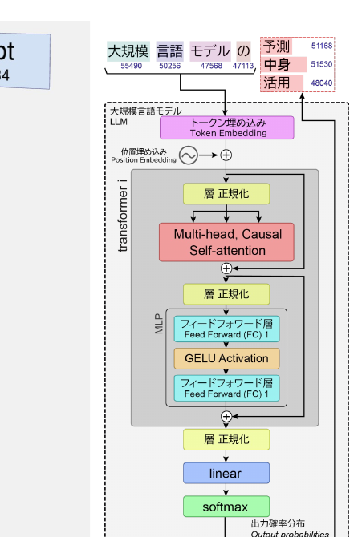

LLM Visualization ©Bycroft 2023

<!--
- 大規模言語モデルの中身は、知識集・ルール集ではなく「巨大な数字の塊」。
- やっていることはネクストワードプレディクション(次のトークンの確率を予想する問題)。GPT-4はアメリカ議会図書館の全蔵書の約22倍相当ものテキストで学習しているとされる。
-->

---

ハルシネーション

# ハルシネーション

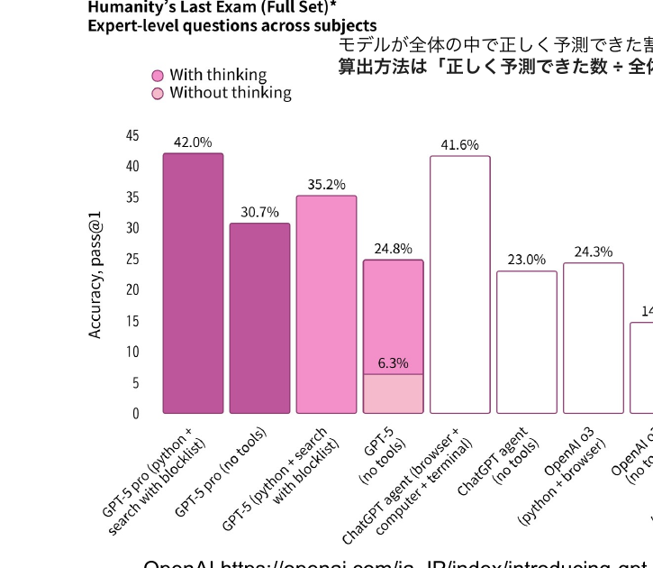

モデルが全体の中で正しく予測できた割合を示す基本的な評価指標 
<b>算出方法は「正しく予測できた数 ÷ 全体の総サンプル数」</b>

<b>例：</b> 
千葉大のサークルの〇〇について教えて。 
千葉大学の生成AI活用講座の担当教員は？

<b style="color:var(--accent-dark)">ハルシネーション：</b>推論過程でAIが、誤っているがもっともらしい情報を出力してしまうこと

<b>ハルシネーションは仕組み上、起こる</b>

OpenAI <a href="https://openai.com/ja-JP/index/introducing-gpt-5/">https://openai.com/ja-JP/index/introducing-gpt-5/</a>

<!--
- ハルシネーションとは、推論過程でAIが「誤っているがもっともらしい情報」を出力してしまうこと。
- 例えば千葉大のサークルや講座担当教員を尋ねると、もっともらしい嘘が返ることがある。これは次トークン予測という仕組み上、必然的に起こる。
-->

---

Session 1の目的・到達目標

# 振り返り

<b>Session 1：</b>　AIの正体を解剖する

目的

目標 ＋ まとめ

<b>利活用の前提知識</b>を知る

・決めるのはあなた！ ・千葉大学の中でのポリシー「生成AIの指針」 ・オプトアウトと大学の契約で使える生成AIサービス

<b>機械学習</b>をイメージできる

・ルールではなく、関係性を機械が見つける

<b>生成AIサービスのレイヤー</b>がわかる

・インフラ→LLM→プラットフォーム→エージェント→アプリ

<!--
- Session 1の振り返り。目的は「AIの正体を解剖する」。
- 目標とまとめ：①利活用の前提知識を知る(決めるのはあなた、千葉大の指針、オプトアウトと契約で使えるサービス)、②機械学習をイメージできる(ルールではなく関係性を機械が見つける)、③生成AIサービスのレイヤー(インフラ→LLM→プラットフォーム→エージェント→アプリ)がわかる。
-->

---

<!-- _class: cover-hero -->

AI時代の教え方　大学教育への事例をもとに

Session 2： 演習：生成AIの仕組みを体験する

大学における生成AIとの関わり方を考える　15 - min × 6 sessions

千葉大学 国際未来教育基幹　田川 翔

<!--
- ここからSession 2。演習：生成AIの仕組みを体験する、に入ります。
-->

---

生成AIを構成するレイヤー

# 生成AIを構成するレイヤー

応用

基盤

<table style="flex:1; font-size:20px;">
<tr><td style="width:30%; font-weight:800; color:var(--accent-dark);">生成AI アプリケーション</td><td>Gemini、ChatGPT、Claude etc…</td></tr>
<tr><td style="font-weight:800; color:var(--accent-dark);">エージェント</td><td>DeepResearch, web検索 etc… 環境とやり取りし、情報を収集して、その情報に基づいて意思決定を行い、アクションを実行</td></tr>
<tr><td style="font-weight:800; color:var(--accent-dark);">プラットフォーム</td><td>Dify, Google AI studio etc… AI モデルの構築とデプロイに役立つツールとサービス、データマネジメントツールで構成</td></tr>
<tr><td style="font-weight:800; color:var(--accent-dark);">大規模言語モデル(LLM)</td><td>Section2での説明の通り</td></tr>
<tr><td style="font-weight:800; color:var(--accent-dark);">インフラストラクチャー</td><td>コンピューターリソース、GPUなど</td></tr>
</table>

改変：Google Cloud Skills Boost

<!--
- 生成AIは5つのレイヤーで構成される。下の「基盤」から、インフラ→LLM→プラットフォーム→エージェント→アプリの順に積み上がっている。
-->

---

インフラストラクチャー

# インフラストラクチャー

nVidia presentation デモ (いま非公開…)

もっと詳しく：https://cloud.google.com/tpu/docs/system-architecture-tpu-vm?hl=ja

<!--
- 一番下のレイヤーがインフラ。GPUやTPUといった計算資源。これがLLMを動かす土台になっている。
-->

---

LLMの中でしていること

# LLMの中でしていること

<b style="color:var(--accent-dark);">LLMの概観</b>

<b style="color:var(--accent-dark);">学習と推論のデモ</b>

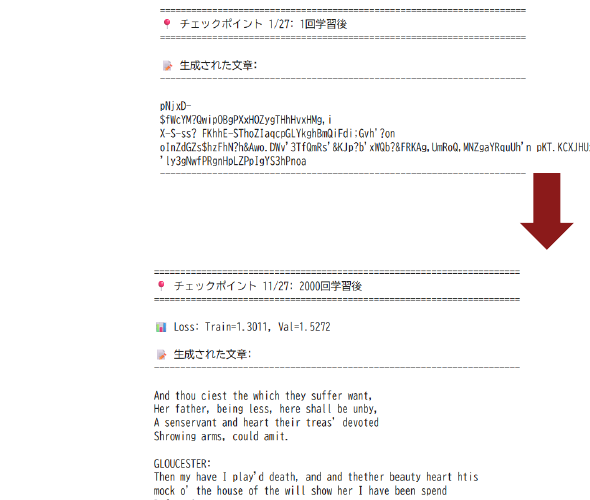

<b>Google colab</b>　実際に学習を体験できる!

<!--
- LLMの中身を概観したうえで、Google colabで学習と推論のデモを行う。実際に手を動かして学習を体験できる。
- ぐじゃぐじゃ…（最初の出力はめちゃくちゃ）の状態から学習が進む様子を見せる。
-->

---

LLMの中でしていること

# 利用 (推論・生成)

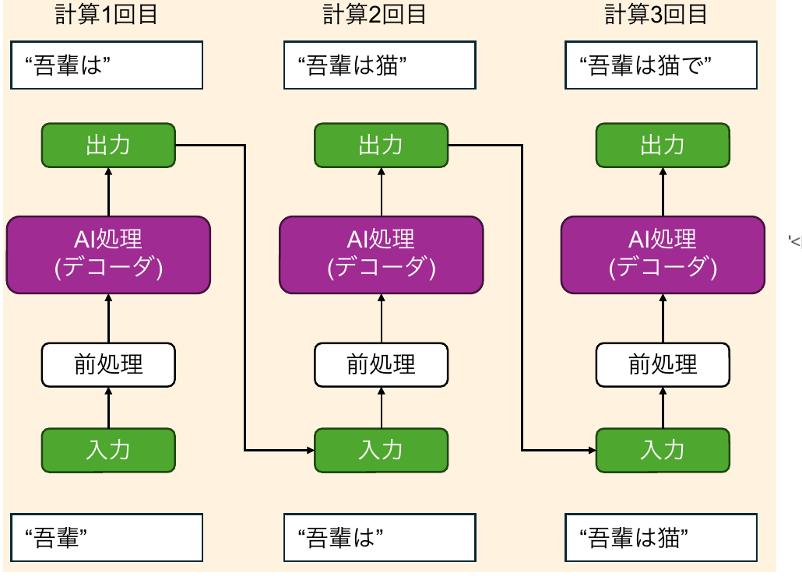

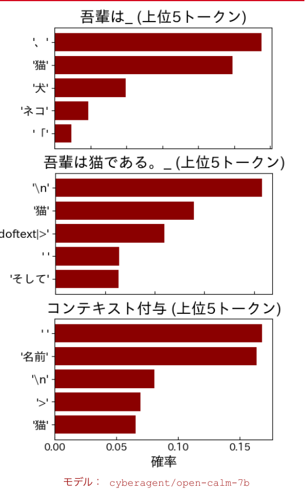

<!--
- 推論は1トークンずつ。「吾輩」→「吾輩は」→「吾輩は猫」…と、出力を入力に戻しながら次の語を予測していく。
- 右は各時点での上位5トークンの確率。モデルは cyberagent/open-calm-7b。
-->

---

プラットフォーム

# AIのアプリの中身をご相談ください

<b>標準時間：</b>自己紹介3分、実習2分 (会場は隣の人とペアで実施します) ＋ 全体共有：2分 
<b>ワーク：</b> あなたが今日の夜に雨にふられずに、帰宅する時間を知りたいとします。 
<b>その時間を教えてくれる生成AIアプリには、どんな情報を与えてあげればよいですか。</b>箇条書きで3つ考えて下さい。

<!--
- ワークの時間。隣の人とペアで、自己紹介3分・実習2分・共有2分。
- 「夜に雨にふられず帰宅する時間を知りたい」。それを教えてくれるAIアプリに必要な情報を3つ考える。
-->

---

<!-- _class: divider -->

<h1 style="color:#fff;">必要と思われる情報を 記入して下さい。</h1>

Slido で投票

<!--
- Slido のインタラクションスライド。参加者に必要な情報を入力してもらう。
- 📣 This is Slido interaction slide, please don't delete it.✅ Click on 'Present with Slido' and the poll will launch automatically when you get to this slide.
-->

---

Session 2のワーク例

# Session 2のワーク例

<b style="color:var(--accent-dark);">ワークの回答例：</b>場所、現在の時刻、今日の24時間の天気、プロンプト

<b style="color:var(--accent-dark);">実装例：</b>

<b>AIを、与えた情報を整理したり、深堀りする道具として見てみる</b>

大規模言語モデルだけでは、ハルシネーションの根絶は難しい 
しかし、<b>①AIに正しい情報を与え、②様々な処理と組み合わせる</b> 
ことで、間違えにくく、有効なツールができる

<!--
- 回答例：場所、現在の時刻、今日の24時間の天気、プロンプト。これらを与えればAIが答えられる。
- LLM単体ではハルシネーションは無くせないが、正しい情報を与え、処理と組み合わせれば有効な道具になる。
-->

---

プラットフォームの必要性

# プラットフォームの必要性

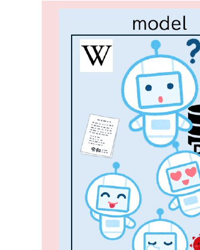

<b>GemやDify、n8n、Google Opalで仕事・研究に役立つ道具を作れるようになる</b>

<b>Model</b>だけでは、動くことが出来ません 入力、出力、他との接続 (mcp, AI, ツール、参考資料 etc…)

<b>AIを組み合わせる</b>と、様々な複雑な処理が可能になります 入力の分類、出力の分析、音声処理、画像処理…

<b>AIに道具をもたせ</b>、現実的な処理ができるようになります RAG、データベース、書籍、時計、天気予報…

<b>開発</b>には、メタな視点が必要です CI/CD、ログ管理、出力評価、MLOps、DB、セキュリティ…

Difyのロゴは「モックアップ稼働まで」できるAIプラットフォーム"Dify"より

<!--
- Modelだけでは動かない。入力・出力・他との接続が要る。それを束ねるのがプラットフォーム。
- Gem、Dify、n8n、Google Opal などで、仕事・研究に役立つ道具を作れるようになる。
-->

---

Agent/リーズニング

# Agent / リーズニング

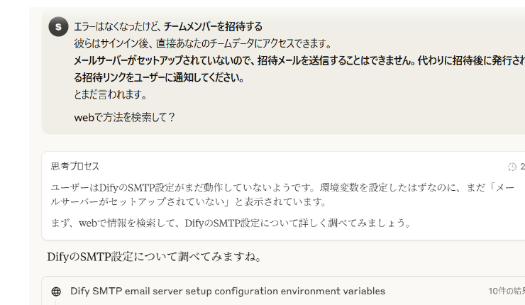
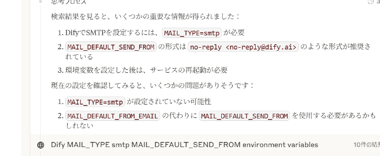

<b>グラウンディング：</b> 　AIが生成する回答を、特定の信頼できる情報源（ソース）にしっかりと結びつける技術

<b>昔：</b>

AI

↓

回答

<b>今：</b>

データ

→

AI

↓

回答

<b>「推論ツール」「情報の深堀りツール」</b>　になりつつある

<!--
- エージェントは、自分で web 検索し、環境変数を調べて設定する、といった「行動」ができる。
- グラウンディングで、回答を信頼できるソースに結びつける。昔は AI→回答だったが、今はデータ→AI→回答。AIは「推論ツール」「情報の深堀りツール」になりつつある。
-->

---

Session 2の目的・到達目標

# Session 2の目的・到達目標 ／ 振り返り

目的

<b>Session 2：</b>　生成AIの仕組みを体験する

目標 ＋ まとめ

・<b>大規模言語モデル(LLM)</b>の中身をイメージできる 
　- Transformerによる「次の単語の予測」作業 
　- ハルシネーションや誤った出力がでるのは当たり前 
・<b>AI agentやツール</b>イメージできる 
　- AIに正しい情報を渡すことで、誤りが減る 
　- AIは、自分の出力をもとに、「推論」を深められる（リーズニング） 
・<b>LLMの上のレイヤーでAIは進化している</b>

<!--
- Session 2の振り返り。目的は「生成AIの仕組みを体験する」。
- 目標：LLMの中身（次の単語の予測、ハルシネーションは当たり前）、AI agent やツール（正しい情報で誤りが減る、推論を深める＝リーズニング）、そしてLLMの上のレイヤーでAIは進化している。
-->

---

<!-- _class: cover-hero -->

AI時代の教え方

大学教育への事例をもとに

大学における生成AIとの関わり方を考える 15 - min × 6 sessions

<b>Session 3：</b>プロンプトを書くコツ

千葉大学 国際未来教育基幹 田川 翔

<!--
- Session 3。プロンプトを書くコツ。
-->

---

Session 3の目的・到達目標

# Session 3の目的・到達目標

目的

<b>Session 3：</b>学びのためのプロンプト作成のスキルを知る

目標

・<b>システムプロンプトが何か</b>を理解する 
・<b>プロンプトの型</b>を理解する 
・<b>作成の3つのコツを説明できる</b>

<!--
- Session 3の目的は「学びのためのプロンプト作成のスキルを知る」。
- 目標：システムプロンプトとは何か、プロンプトの型、作成の3つのコツを説明できること。
-->

---

プロンプトとは

<b>プロンプト：</b> 生成AIに、<b>実行すべきタスクの生成を促す</b>、自然言語による文章のこと

吾輩は___???

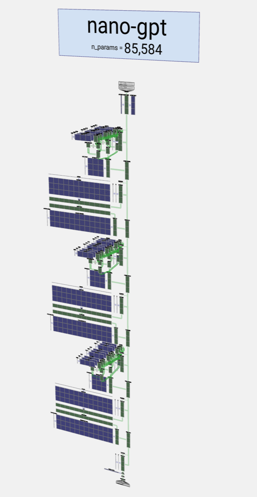

<b>プロンプトエンジニアリング：</b> 生成AIから望ましい出力を得るために、指示や命令を設計、最適化すること (NRI 用語集)

<b>コンテキスト内学習：</b> プロンプトに与えた文章から、生成AIがタスクの結果を生成できるようになること

<!--
- プロンプトとは、生成AIに実行すべきタスクの生成を促す、自然言語による文章のこと。「吾輩は」と入れると、次に来る言葉を予測してくれます。
- 望ましい出力を得るために指示を設計・最適化するのがプロンプトエンジニアリング。プロンプトに与えた文章からタスクの結果を生成できるようになることをコンテキスト内学習と呼びます。
-->

---

創発とコンテキスト内学習

具体的に教えていないのに、<b>モデルを大規模化すると</b><b>プロンプトの指示でタスクを解けるようになる</b>こと

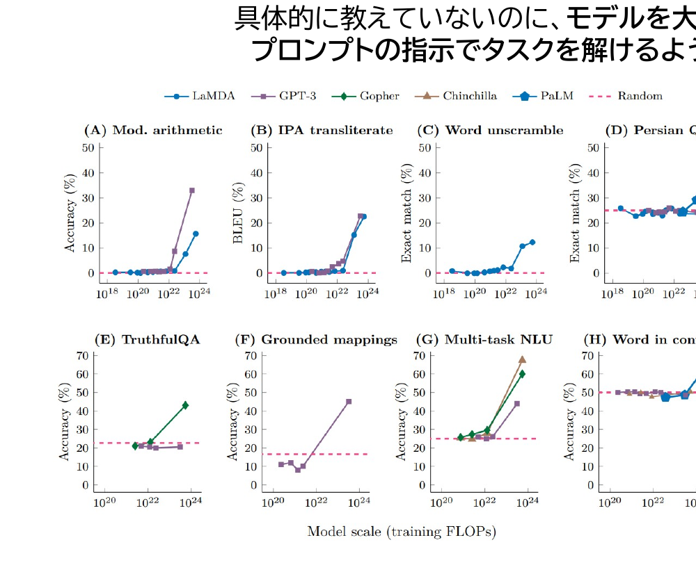

横軸：モデルサイズ　／　縦軸：正確性

大規模言語モデルは、指示された問題の解き方は予め知らない

<b>しかし大きいLLMほど、プロンプトをもとに解決できる！</b>

<!--
- 創発とコンテキスト内学習。具体的に教えていないのに、モデルを大規模化するとプロンプトの指示でタスクを解けるようになる現象です。
- 大規模言語モデルは、指示された問題の解き方を予め知りません。しかし大きいLLMほど、プロンプトをもとに解決できるようになります。
-->

---

コンテキストウィンドウ

<b>AIには、同時に参照できる文字数・データ量の上限がある</b> コンテキストウィンドウ（記憶力）

<b>この記憶力が大きいと、長いプロンプトを前提にAIと話せる</b> 　→　「本1冊読み込んだ上で答えて」 　　　 「45分の動画を見たうえで答えて」

<b>場の空気を読みこんだAIを対話できる</b> <b>読み込んだ資料を参考にするので、間違えにくい</b> <b>「スライドに何をいれるか」で考えていることと同じ</b>

<!--
- コンテキストウィンドウ。AIには、同時に参照できる文字数・データ量の上限があります。これを記憶力と呼びます。
- この記憶力が大きいと、長いプロンプトを前提にAIと話せます。本1冊読み込んだ上で答えて、45分の動画を見たうえで答えて、といったことが可能になります。
- 場の空気を読みこんだAIと対話できる。読み込んだ資料を参考にするので間違えにくい。スライドに何を入れるかで考えていることと同じです。
-->

---

コンテキストの重要性

# 昨今のAIは、何をコンテキストに入れるか勝負になっている

前提情報A

前提情報B

✕

詳細なプロンプト

➡

良い結果

改善LOOP ↺

<b>※ 矛盾する前提情報が多くなると雑な回答になりがち</b> <b>※ ベストなコンテキスト一覧のデザインを行う方法は、コンテキストエンジニアリングと言われている</b>

<b>参考：</b>AIに適切な情報を渡す手法には検索拡張生成（Retrieval-Augmented Generation）がある。ベストなコンテキストになるようなRAGアルゴリズムが必要 (RAGは断片を持ってきがち)。RAGを使用せずに、すべて本1冊コンテキストに入れれる情報では、後者の方の精度がとてもよい。

<b>情報が繋がって、新しい価値ある情報を生む価値を作る</b>

<!--
- コンテキストの重要性。昨今のAIは、何をコンテキストに入れるか勝負になっています。前提情報A・Bと詳細なプロンプトを組み合わせ、改善LOOPを回して良い結果を出します。
- 矛盾する前提情報が多くなると雑な回答になりがち。ベストなコンテキスト一覧のデザインを行う方法は、コンテキストエンジニアリングと言われています。
- 参考として、検索拡張生成（RAG）という手法もありますが、本1冊すべてコンテキストに入れられる場合は後者の方が精度がとても良いです。
-->

---

コンテキストの重要性

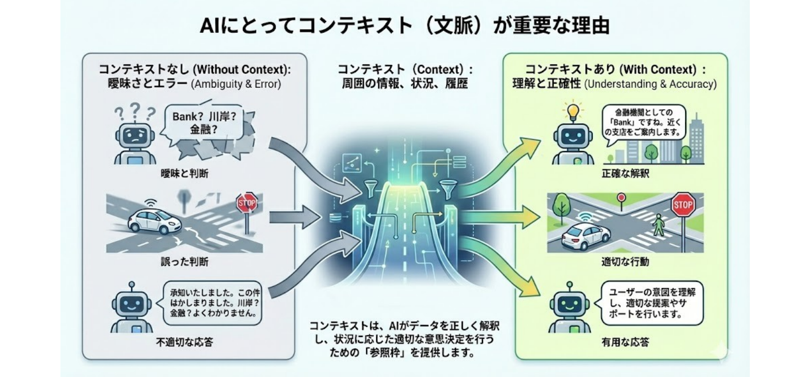

小さいコンテキストでも、AIの回答の精度が上がる

<!--
- 図解です。コンテキストなしだと曖昧さとエラーが生じますが、コンテキストを与えると周囲の状況や背景を踏まえ、理解と正確性が高まります。
- 小さいコンテキストでも、AIの回答の精度が上がります。
-->

---

Google NotebookLM

# コンテキストをもとに、情報を変換・深堀りする道具

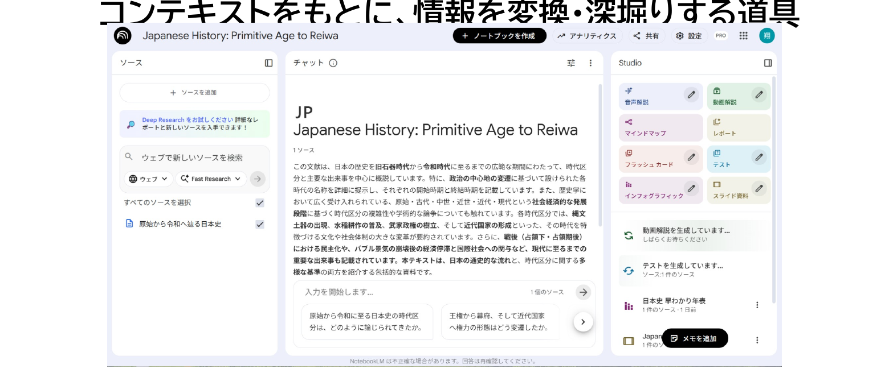

コンテキスト

質問

変換

<!--
- Google NotebookLMです。コンテキストをもとに、情報を変換・深堀りする道具です。
- 左にソース（コンテキスト）を入れ、中央で質問し、右で様々な形式に変換できます。
-->

---

Google NotebookLM

<b>絵1枚で要約</b>

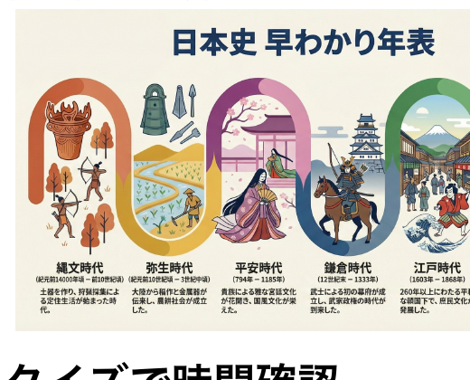

<b>クイズで時間確認</b>

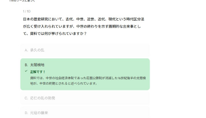

<b>スライド作成</b>

<b>動画・podキャスト</b> <b>(ソクラテスメソッド)</b>

質問・応答

<!--
- NotebookLMでできることです。絵1枚で要約、スライド作成、クイズで時間確認、動画・ポッドキャスト（ソクラテスメソッド）、そして質問・応答。
- ソースを入れるだけで、様々な情報モードに変換してくれます。
-->

---

NotebookLMの授業活用

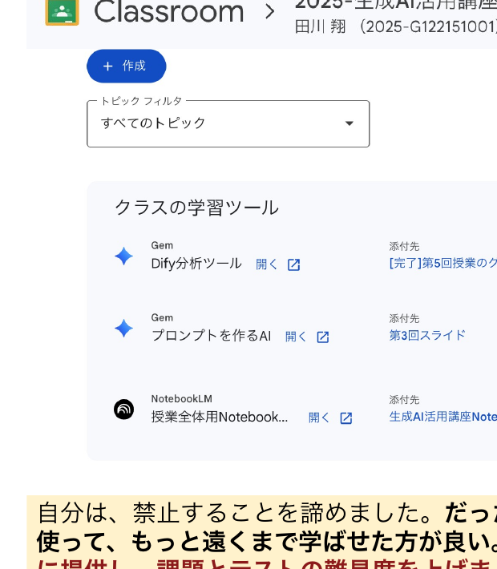

<b>クラスルームでの活用事例</b> 授業全体の内容を質問し、思考・学びのパートナーとして提供

<b>作成したスライドやドキュメントをソースにアップロード</b>

・使い方について10分ほどの動画を<b>受講学生に配布</b>

・クイズや精緻的質問で能動的に学び、様々な情報モードでの理解促進を狙う

▶ <b>知識との関わり方</b>を転換

自分は、禁止することを諦めました。<b>だったら、AIを使って、もっと遠くまで学ばせた方が良い。逆に公式に提供し、課題とテストの難易度を上げました。</b>

<!--
- NotebookLMの授業活用です。クラスルームでの活用事例として、授業全体の内容を質問し、思考・学びのパートナーとして提供しています。
- 作成したスライドやドキュメントをソースにアップロードし、使い方の10分ほどの動画を受講学生に配布。クイズや精緻的質問で能動的に学ばせ、知識との関わり方を転換します。
- 自分は禁止することを諦めました。だったら、AIを使ってもっと遠くまで学ばせた方が良い。逆に公式に提供し、課題とテストの難易度を上げました。
-->

---

プロンプト作成のコツ

# プロンプトを作成する上での3つのコツ

<b>①十分なコンテキストを与える (ワーク1)</b>

②試行錯誤/サイクルの重要性を知る

<b>③型を知る</b>

特に、人に頼むときの<b>マニュアルをイメージ</b> 　→ 頭から手順通りに説明する / 必要な情報を渡す

プログラム経験がある人は、コードをイメージ 　→ 分岐や定義を作成していくイメージ

<!--
- プロンプト作成のコツは3つ。①十分なコンテキストを与える、②試行錯誤・サイクルの重要性を知る、③型を知る。
- 特に、人に頼むときのマニュアルをイメージしてください。頭から手順通りに説明し、必要な情報を渡す。プログラム経験がある人は、分岐や定義を作るコードのイメージです。
-->

---

Few-shots・スキーマ

<b>Few-shot：例を渡す</b> プロンプト内に「入力例」と「出力例」のデモを提供しより高性能な結果を得る技法。コンテキスト内学習をGPTが出来るので、この処理が実現する

Google検索的 (単語)

これは素晴らしい! 感情?

Zero-shot

「これは素晴らしい!」と 書いた書き手の感情を教えて下さい

Few-shot

あの映画は最高だった! 　&gt;ポジティブ これは酷い! &gt;ネガティブ 「これは素晴らしい!」&gt;?

<b>応用編スキーマ：回答の構造を渡す</b> 回答してほしいことをすべて構造化し、回答形式として指定する。 <b>※Few-shotを組み合わせ、回答を例示する</b>

<b>例)</b> <b>授業のタイトル：</b> 　目的： 　到達目標： 　宿題の案：

Prompt Engineering Guide　https://www.promptingguide.ai/jp/techniques/fewshot

<!--
- Few-shotは例を渡す技法です。プロンプト内に入力例と出力例のデモを提供し、より高性能な結果を得ます。GPTがコンテキスト内学習をできるので実現します。
- Google検索的な単語、Zero-shot、Few-shotと進めていくと精度が上がります。応用編のスキーマは回答の構造を渡す方法で、Few-shotと組み合わせて回答を例示します。
-->

---

　参考：もっと高度な出力

<b>Structured Output（構造化出力）</b>

<b>定義:</b> LLMの出力を、事前に定義されたJSONスキーマなどの構造に沿って生成する技術。

<b>利点:</b>

<ul style="font-size:20px; margin:2px 0 0 1.1em; line-height:1.5;">
<li>予測可能な出力形式で後続処理を容易に</li>
<li>スキーマに合致しない誤ったデータを自動で拒否</li>
<li>プロンプトを簡潔にし、LLMへの指示を削減</li>
</ul>

<b>簡単な例:</b> ユーザー情報抽出のためのJSONスキーマ

<pre style="font-size:15px; background:#f4f6f9; border:1px solid #ddd; border-radius:6px; padding:8px; line-height:1.35; overflow:hidden;">{ "type": "object", "properties": {
  "name":  { "type": "string" },
  "email": { "type": "string", "format": "email" },
  "age":   { "type": "integer" } },
  "required": ["name", "email"] }</pre>

<b>Function Calling（関数呼び出し）</b>

<b>定義:</b> LLMがユーザーの意図を解釈し、外部ツール（API）を呼び出し特定のアクションを実行する機能。

<b>用途:</b>

<ul style="font-size:20px; margin:2px 0 0 1.1em; line-height:1.5;">
<li>レストラン予約やオンラインショッピングの注文処理</li>
<li>カレンダー管理など外部アプリとの連携</li>
<li>データ検索やアクション実行の自動化</li>
</ul>

<b>簡単な例:</b> レストラン予約のための関数呼び出し

<pre style="font-size:15px; background:#f4f6f9; border:1px solid #ddd; border-radius:6px; padding:8px; line-height:1.35; overflow:hidden;">bookRestaurant(
  restaurant_name: string, date: string,
  time: string, party_size: integer,
  special_requests: string)</pre>

AIの応答をより予測可能かつ信頼性の高いものに出来る。データの正確な処理と外部連携により、AI活用の幅が大きく広がる。

https://platform.openai.com/docs/guides/structured-outputs

<!--
- 参考として、もっと高度な出力を紹介します。Structured Outputは、LLMの出力を事前に定義したJSONスキーマなどの構造に沿って生成する技術です。予測可能な出力形式で後続処理を容易にし、誤ったデータを自動で拒否できます。
- Function Callingは、LLMがユーザーの意図を解釈し、外部ツールを呼び出して特定のアクションを実行する機能です。レストラン予約やカレンダー管理など外部アプリとの連携に使えます。
- これらにより、AIの応答をより予測可能かつ信頼性の高いものにでき、AI活用の幅が大きく広がります。
-->

---

メタプロンプト

タスクや課題の具体的な内容ではなく、その構造的および構文的な側面に焦点を当てるプロンプティング技術のこと。

<b>Structural template for how to think rather than specific examples of what to think.</b> Zhang et al. (2023) arXiv

こうなってくると、自分自身で一人でプロンプトを書くよりも、<b>生成AIとともにプロンプトを作成</b>した方がよくなりうる。

<!--
- メタプロンプトです。タスクや課題の具体的な内容ではなく、その構造的および構文的な側面に焦点を当てるプロンプティング技術のこと。
- 「何を考えるかの具体例ではなく、どう考えるかの構造的なテンプレートを与える」ということです。
- こうなってくると、自分一人でプロンプトを書くよりも、生成AIとともにプロンプトを作成した方がよくなりうる、という段階に入っていきます。
-->

---

良いプロンプトの書き方

# 良いプロンプトの書き方

<b>簡単な 3R法</b>

Request（依頼）を出す

Role（役割）を決める

Regulation（形式）を指定する

<b>フルモデル 7R法</b>

Request（依頼）を出す

Role（役割）を決める

Regulation（形式）を指定する

Rule（ルール）を定める

Review & Refine（評価・改善）を求める

Reference（参照知識・例）を与える

注意点

・最初から完璧を目指さない 
・<b>試行錯誤(改善サイクル)が重要</b> 
・出てきた回答がイマイチなら、出てきた結果と元のプロンプトをセットで再度AIにいれ、「プロンプトの書き換え」を頼む 
・<b>結果に対するループ≠仕組みに対するループ</b>　今回は、仕組みを変える 
・<b>十分なコンテキストを与える</b>

ChatGPT時代の文系AI人材になる｜野口 竜司（東洋経済新報社 2023）

<!--
- 良いプロンプトの書き方として、まず簡単な3R法。Request・Role・Regulationの3つです。
- フルモデルは7R法。これにRule、Review & Refine、Referenceが加わります。
- 注意点は、最初から完璧を目指さず、試行錯誤の改善サイクルが重要。結果に対するループと、仕組みに対するループは別物で、今回は仕組みを変えます。十分なコンテキストを与えることも大切です。
-->

---

プロンプティングの学び方

# プロンプティングの学び方

① <b>使い込んでいる人の使い方</b>を見る

② <b>模範例のプロンプトを書き換えてみる</b>

https://www.promptingguide.ai/

③ <b>しっくりくる回答が出力されるまで、何度も試行錯誤する</b>

④ <b>他の人と話し、質問力を向上させる</b>

⑤ <b>めんどうとなったら、AIに外注できないか</b>、考えてみる

<!--
- プロンプティングの学び方です。①使い込んでいる人の使い方を見る、②模範例のプロンプトを書き換えてみる、③しっくりくる回答が出るまで何度も試行錯誤する。
- ④他の人と話し、質問力を向上させる。⑤めんどうとなったら、AIに外注できないか考えてみる、です。
-->

---

Session 3の目的・到達目標

目的

目標 ＋ まとめ 振り返り

<b>Session 3：</b> 学びのためのプロンプト作成のスキルを知る

<b>システムプロンプトが何かを理解する</b>

生成AIの振る舞いや応答方針を制御するための指示

プロンプトの練習や試行錯誤に向いている

チャットボットで入力するのは「ユーザープロンプト」

<b>プロンプトの型</b>をイメージできる

R法：Request、Role、Regulation、Rule、Reference

<b>作成の3つのコツを説明できる</b>

①<b>試行錯誤</b>は重要　②十分な<b>コンテキスト</b>を　③<b>型</b>を知る

<!--
- Session 3の振り返りです。目的は、学びのためのプロンプト作成のスキルを知ること。
- 目標は、システムプロンプトが何かを理解する、プロンプトの型をイメージできる、作成の3つのコツを説明できる、の3つでした。
-->

---

<!-- _class: divider -->

Session 4　ハンズオン

# 自作Gemアプリを作ってみる

<h2>大学における生成AIとの関わり方を考える 15 - min × 6 sessions</h2>

<!--
- ここからSession 4、ハンズオンです。自作のGemアプリを作ってみましょう。
-->

---

システムプロンプト

生成AIの振る舞いや応答方針を制御するための指示　→　<b>練習や道具として便利</b>

Gem

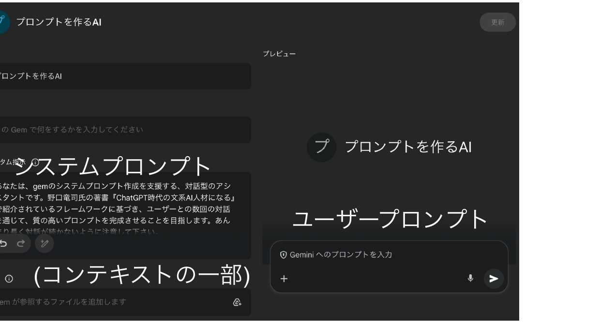

左の<b>システムプロンプト</b>はコンテキストの一部。右がチャットで入力する<b>ユーザープロンプト</b>。

<!--
- システムプロンプトは、生成AIの振る舞いや応答方針を制御するための指示で、練習や道具として便利です。
- Gemでは、カスタム指示に書くのがシステムプロンプト。これはコンテキストの一部です。実際にチャットで入力するのがユーザープロンプトです。
-->

---

# プロンプトを作るGemを活用する

Gem用のスペシフィックなプロンプトを作成することを支援する Gem を作っていますので必要であれば、活用下さい。 
<a href="https://gemini.google.com/gem/1aeUIrc7SISkL1nS8jxXT8zZP5vOBA5Iz?usp=sharing" style="font-size:20px;">https://gemini.google.com/gem/1aeUIrc7SISkL1nS8jxXT8zZP5vOBA5Iz?usp=sharing</a>

使い方 (マトリョーシカみたいなので注意)

① 上記のプロンプトをご自身のgemini内「gem」のカスタム指示に貼り付け 
② 「プロンプトを作るAI」と名前をつけて、右上の「保存」 
③ 「プロンプトを作るAI」gemと対話しながら、プロンプトを作成 
④ 出てきたプロンプトを、「新しい別のgem」を作成し貼り付け/名付け/保存 
⑤ ④の結果で改善したい点を「プロンプトを作るAI」gemに伝える 
⑥ 改善されたプロンプトを、「新しい別のgem」のカスタム指示に差し替え

<!--
- プロンプトを作るためのプロンプトを作成支援するGemを用意しています。必要であればご活用ください。
- 使い方はマトリョーシカみたいなので注意。①プロンプトをgemのカスタム指示に貼り付け、②「プロンプトを作るAI」と名付けて保存、③対話しながらプロンプトを作成、④出てきたプロンプトを新しい別のgemに貼り付け、⑤改善点を伝え、⑥改善版を差し替える、という流れです。
-->

---

# フィードバックループで磨く

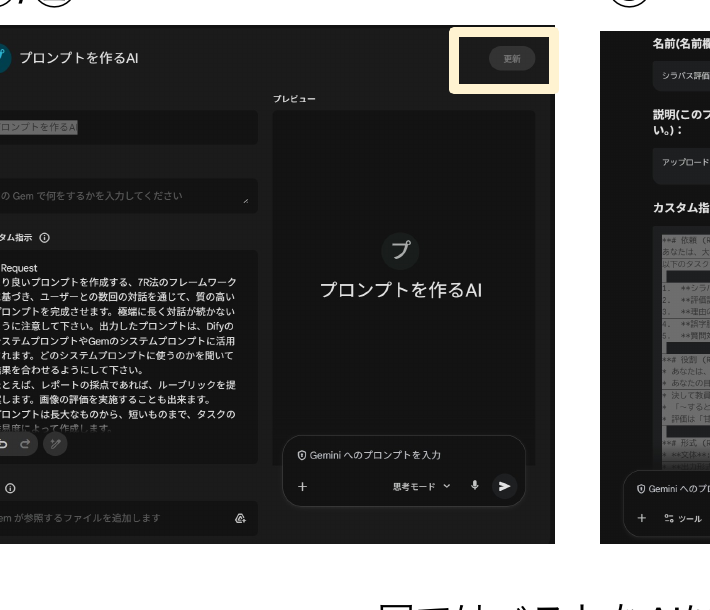

<b>④</b>「新しい別のgem」を作成

<b>⑤</b> 作ったGemの結果を見て、③の続きに変更希望点を入力

<b>⑥</b> ④の中身を更新

一回ではベストなAIになかなかならないので、<b>フィードバックループを回す</b>ことが重要です！

<!--
- 実際の画面です。④「新しい別のgem」を作成し、⑤作ったGemの結果を見て、③の続きに変更希望点を入力、⑥④の中身を更新します。
- 一回ではベストなAIになかなかならないので、フィードバックループを回すことが重要です。
-->

---

システムプロンプト

# AIのアプリを作成してみる

<b>標準時間：</b> 自分で行う実習15分

<b>ワーク：</b> Gemを作ってみましょう。困った点は、周囲の方とお話下さい。

<b>使用するツール： Google Gemini / Gem</b>

<b>Step1[課題発見]：</b>あなたの困り事のうち、生成AIができそうな簡単なものを想像しましょう <b>(2分)</b>

<b>Step2[作成]：</b>システムプロンプトを作成してみましょう<b>(6分)</b>

プロンプトをつくるプロンプトのリンクは<b>こちら</b>から

<!--
- ここで実習です。標準時間は15分。Gemを作ってみましょう。困った点は周囲の方とお話しください。使用ツールはGoogle Gemini / Gemです。
- Step1で、あなたの困り事のうち生成AIができそうな簡単なものを2分で想像。Step2で、システムプロンプトを6分で作成してみましょう。
-->

---

共有

💬

気づかれたことをぜひ、共有して下さい。

📣 これは Slido のインタラクションスライドです（投票）

<!--
- 📣 This is Slido interaction slide, please don't delete it.✅ Click on 'Present with Slido' and the poll will launch automatically when you get to this slide.
- 実習で気づかれたことを、ぜひ共有してください。
-->

---

<!-- _class: divider -->

Session 5

# AIと授業の考え方

<h2>大学における生成AIとの関わり方を考える 15 - min × 6 sessions</h2>

<!--
- ここからSession 5、「AIと授業の考え方」です。
-->

---

Session 5の目的・到達目標

<b style="color:var(--accent-dark);">目的</b>　　<b>Session 5：</b> 生成AIを大学で活用する方法を考える

<b style="color:var(--accent-dark);">目標</b>

<b>そもそも論として、AIとの付き合い方を考える</b>

<b>学習に利用する際のアイデアを見つける</b>

<b>研究に利用する際の活用例を知る</b>

<!--
- Session 5の目的は「生成AIを大学で活用する方法を考える」。
- 目標は、そもそも論としてAIとの付き合い方を考える、学習に利用する際のアイデアを見つける、研究に利用する際の活用例を知る、の3つです。
-->

---

生成AIの影響の次元

# 生成AIの影響の次元

達成済み

新規

マクロ (全学)

<b>ポリシー</b> iPaaS AI

<b>ガイドライン</b> 業務DX AI

教学マネジメント with AI

データ中心の業務改革／教育データ活用 1次一生涯＋2次

ミドル (課程)

<b>FD</b> 科目検索

生成AIでより学べるカリキュラム／教職員支援

ミクロ (授業)

<b>授業内利用</b> フィードバック

<b>AI教科書</b> 授業チューター

個別最適で在学中支援するアプリ／学生相談／生成AIと教員mixの授業設計

<!--
- 生成AIの影響を、マクロ（全学）・ミドル（課程）・ミクロ（授業）の縦軸と、達成済み・新規の横軸で整理した図です。
- マクロではポリシーやガイドライン、教学マネジメント。ミドルではFDやカリキュラム。ミクロでは授業内利用やAI教科書、授業設計など、それぞれの次元で生成AIが影響しています。
-->

---

説明の構成

ここでは、

<b>マインドレベル</b>：AIと学びの関わり方の意識を形成する

<b>毎回の授業レベル</b>：課題の出し方、AIの道具としての使い方

<b>コースレベル</b>：設計のレベル

<b>教員支援レベル</b>：何が使えるか

<b>大学レベル</b>：ポリシーのレベル

に分けて説明を行う。

<!--
- ここからは、マインドレベル、毎回の授業レベル、コースレベル、教員支援レベル、大学レベルの5つに分けて説明していきます。
-->

---

マインドレベル① 対話

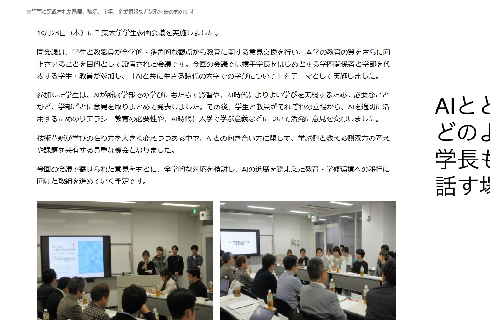

https://chibadaipress.chiba-u.jp/information/ai_meet/

AIとともにある時代、 どのように学ぶか、 学長も教員も学生も、 話す場を作る

<!--
- マインドレベルの1つ目は「対話」です。AIとともにある時代、どのように学ぶか。学長も教員も学生も、話す場を作ることが大切です。千葉大プレスでもそうした取り組みを紹介しています。
-->

---

マインドレベル② 仕事

<b>「AIができることをただ出力するのは、AIで事足りるので採用する必要はない」ということ</b>

<b>AIができない「高次」の価値を作るために、引き続き学ぶ必要はある</b>

AIの出力は、次の時代の仕事の平均値である

問題は、<b>AIで学びを代替したときに</b>、<b>ゴールの部分で学生ができなくなること</b>があること。

<b>例：手計算 vs 計算機</b> 
<b>手計算を人より早く出来るスキルは不要</b>かもしれない、でも手計算の感覚を持たずに電卓で代替すると、長<b>期的に「大きな何か」を実現しようとしたとき、困ること</b>があるのでは？ 
例： 商談でコスト感・利益の儲けのイメージが浮かばない、など

Teaching with AI (Bowen &amp; Watson, AAC&amp;U 2024)

<!--
- マインドレベルの2つ目は「仕事」。AIができることをただ出力するなら、AIで事足りるので採用する必要はない、ということ。だからAIができない「高次」の価値を作るために、引き続き学ぶ必要はあります。
- AIの出力は、次の時代の仕事の平均値です。問題は、AIで学びを代替したときに、ゴールの部分で学生ができなくなること。手計算と計算機の例のように、感覚を持たずに代替すると長期的に困ることがあるのでは。
-->

---

マインドレベル③ 価値

方法①

<b>自分が内発的にできるようになりたいことに　学生は、AIを使わない</b> 
<b>課題で時間がない時や、価値を感じない時に使う</b>　→価値をしっかり伝える

方法②

<b>RPGの比喩</b> 
<b>「途中のストーリーをしらないのに楽しめる？」</b> 
<b>「経験値が無いのに、ラスボスにジャンプして戦える？」</b>　→AIでできないことをイメージする

<b>AI = RPGの場所ジャンプ機能</b>　<b>ジャンプし続けると一切学べずに、自分が使いこなせなくなってしまう</b>

<b>　注意！： </b>現在は、見習い経験を意図しないと磨けない時代　見習い部分の発注が一気にAIに代替されている

<!--
- マインドレベルの3つ目は「価値」。方法①、学生は自分が内発的にできるようになりたいことにはAIを使わず、時間がない時や価値を感じない時に使う。だから価値をしっかり伝える。
- 方法②、RPGの比喩。途中のストーリーを知らないのに楽しめる？経験値が無いのにラスボスにジャンプして戦える？AIは場所ジャンプ機能で、ジャンプし続けると学べず使いこなせなくなる。見習い部分の発注が一気にAIに代替されている時代です。
-->

---

マインドレベル④ 手習い

<b>NG: </b>AIに答えを聞く、正解を聞く、コスパ/タイパ至上主義

→ 考えたり、研究を深めたりするためにAIを活用する

<b>授業利用における活用の考え方の例</b>

<b>学生の現状</b>

▶

<b>ねらい：</b>どこに向かうのか (授業の存在価値)

<b>達成目標：</b>何が出来るようになるのか

<b>評価：</b>どのように測るのか

<b>設計：</b>どのように教えるのか

▶

<b>学修後の状態</b>

目標や設計を損なう形で使ってはいけない

<b>AI = RPGの場所ジャンプ機能</b>　<b>授業の学習の目的と無関係のところは全然使える！</b>

<!--
- マインドレベルの4つ目は「手習い」。AIに答えを聞く、正解を聞く、コスパ・タイパ至上主義はNG。考えたり研究を深めたりするためにAIを活用しましょう。
- 学生の現状から、ねらい・達成目標・評価・設計を経て学修後の状態へ。目標や設計を損なう形で使ってはいけません。逆に、授業の学習の目的と無関係のところは、RPGの場所ジャンプのように全然使えます。
-->

---

学習スタイルの変化

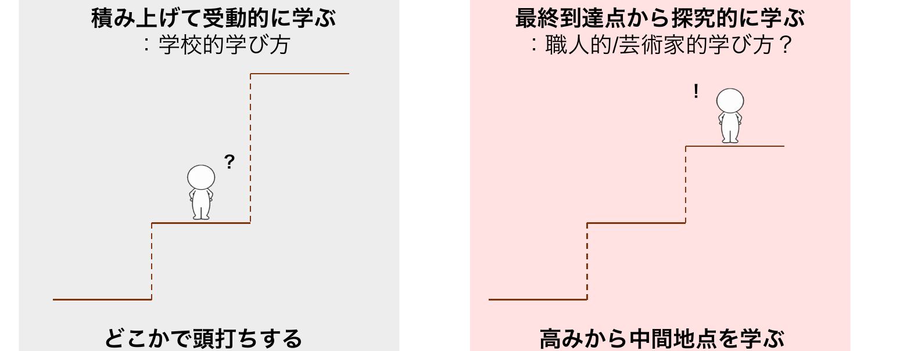

「なぜ学ぶのか、どのように学ぶのか、何を学ぶのか」の変質

学び方の道具としてAIを位置づける

▶

学びを良くするサイクルに含める

<!--
- 学習スタイルの変化です。左は積み上げて受動的に学ぶ学校的学び方で、どこかで頭打ちする。右は最終到達点から探究的に学ぶ職人的・芸術家的学び方で、高みから中間地点を学ぶ。
- 「なぜ学ぶのか、どのように学ぶのか、何を学ぶのか」の変質です。学び方の道具としてAIを位置づけ、学びを良くするサイクルに含めましょう。
-->

---

学習スタイルの変化

Does ChatGPT enhance student learning? A systematic review and meta-analysis of experimental studies

Academic performance (学業成績)

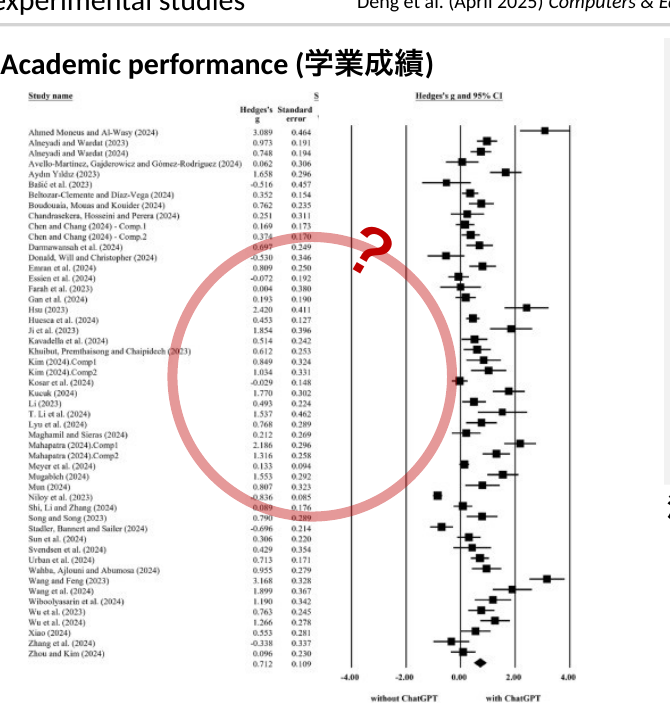

ChatGPTが主に(85%)大学生の学習に与える影響について、2022年から2024年にかけて発表された69本の教育実践をシステマティック・レビューしたもの (※語学32%)

<b>縦軸：各研究名</b> 
<b>Hedge‘s g ：</b>各研究の効果量を示す。大きいほど研究のサンプルサイズが大きく、結果の精度が高い (0.5で中程度、0.8を超えると大) 。 
<b>ひげ：</b>各研究の効果量の95%信頼区間（CI）を示す。この線が0をまたがなければ、その研究は統計的に有意な効果を持つことを示す。

<b>結論</b>　一番下の菱形（ダイヤモンド）：全研究を統合した全体の効果量、菱形の中央が全体の効果量。<b>学業成績を高める効果がある</b>とわかる。

<b>注意点：</b>9件の研究では、ChatGPTの使用を許可した状態でポストテストを行ったと明記されている（例：Bašić et al., 2023; Li, 2023）。33件の研究では、ChatGPTの使用が明示されておらず不明である。

Deng et al. (April 2025) <em>Computers &amp; Education</em>　／　An alternative explanation for the improved academic performance could be the higher quality of work produced with ChatGPT's assistance

<!--
- 学習スタイルの変化、メタ分析の紹介です。Deng et al. 2025、ChatGPTが主に大学生の学習に与える影響について、69本の教育実践をシステマティック・レビューしたもの。
- 学業成績のフォレストプロット。縦軸は各研究名、Hedge's gは効果量、ひげは95%信頼区間。結論として、一番下の菱形の中央が全体の効果量で、学業成績を高める効果があるとわかります。
- 注意点として、ポストテストでChatGPT使用を許可していた研究や、使用が不明な研究も含まれます。
-->

---

学習スタイルの変化

Does ChatGPT enhance student learning? A systematic review and meta-analysis of experimental studies

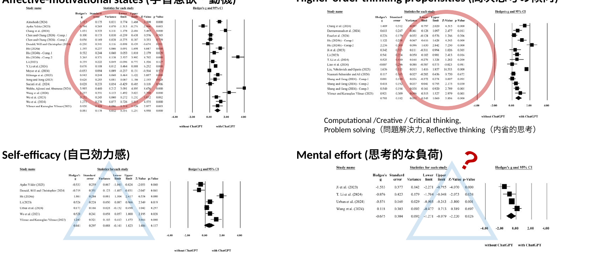

ChatGPTを主に(85%)大学生が学習に使う事例について、2022年から2024年にかけて発表された69本の教育実践をシステマティック・レビューしたもの(82%)

<b>Affective-motivational states (学習意欲・動機)</b> 
<b>Higher-order thinking propensities (高次思考の傾向)</b> 
Computational /Creative / Critical thinking, Problem solving（問題解決力, Reflective thinking（内省的思考） 
<b>Mental effort (思考的な負荷)</b> 
<b>Self-efficacy (自己効力感)</b>

Deng et al. (April 2025) <em>Computers &amp; Education</em>

<!--
- 同じメタ分析から、他の指標です。学習意欲・動機、高次思考の傾向、思考的な負荷、自己効力感。高次思考には計算論的思考、創造的思考、批判的思考、問題解決力、内省的思考が含まれます。
-->

---

授業の前提：学習目標分類

<table style="flex:1.2; border-collapse:collapse; font-size:18px; line-height:1.4;">
<tr style="background:var(--accent); color:#fff;">
<th style="padding:5px 8px; border:1px solid #ccc;"></th>
<th style="padding:5px 8px; border:1px solid #ccc;">認知的領域 (知識や思考)</th>
<th style="padding:5px 8px; border:1px solid #ccc;">学びへの生成AIの影響</th>
</tr>
<tr>
<td rowspan="3" style="padding:5px 8px; border:1px solid #ccc; text-align:center; font-weight:800; background:#FCEAEC;">高次</td>
<td style="padding:5px 8px; border:1px solid #ccc;"><b>創造</b> (学習を応用し、新しい価値を作れる)</td>
<td style="padding:5px 8px; border:1px solid #ccc;">人の創造性こそが大切 アイデア出しで活用</td>
</tr>
<tr>
<td style="padding:5px 8px; border:1px solid #ccc;"><b>評価</b> (事物・判断等を比較し評価出来る)</td>
<td style="padding:5px 8px; border:1px solid #ccc;">評価軸/価値/判断は人が設定する</td>
</tr>
<tr>
<td style="padding:5px 8px; border:1px solid #ccc;"><b>分析</b> (要素に分け、関係性を指摘できる)</td>
<td style="padding:5px 8px; border:1px solid #ccc;">解答/過程の支援可(例：要約・構造化・コーディング)</td>
</tr>
<tr>
<td rowspan="3" style="padding:5px 8px; border:1px solid #ccc; text-align:center; font-weight:800; background:#EAF2FB;">低次</td>
<td style="padding:5px 8px; border:1px solid #ccc;"><b>応用</b> (他の場面や状況に使用できる)</td>
<td style="padding:5px 8px; border:1px solid #ccc;">単なる問題では、 AIが解いてしまう…</td>
</tr>
<tr>
<td style="padding:5px 8px; border:1px solid #ccc;"><b>理解</b> (学習内容を説明出来る)</td>
<td style="padding:5px 8px; border:1px solid #ccc;">AIで支援することで、 より理解しやすくなる?</td>
</tr>
<tr>
<td style="padding:5px 8px; border:1px solid #ccc;"><b>記憶</b> (事実や概念を暗記している)</td>
<td style="padding:5px 8px; border:1px solid #ccc;">AIで支援可能だが、 学修者の記憶必須</td>
</tr>
</table>

※近年では、下から個別・段階的に行うのではなく、<b>複数の次元の要素を組み合わせる</b>必要性が叫ばれている。 
※近年では、<b>学び方の学び</b>や、人間性の涵養などを含む、学習目標分類も作成されている (e.g. Finkの学習目標分類)　<b>学び方の学びはAIで支援できる可能性</b>がある 
※但し、<b>低次(特に記憶・理解・応用の段階)を蔑ろにして、　高次の学修目標の達成は難しい</b>と想定される。

<b>AI が答えを出せるとしても、途中を学ぶことは引き続き必要！！！</b>

左は栗田&amp;中村 (2023)を元に作成 / 原著 Bloom (1956/1964)、改訂版(2001)を記載　▶学習目標分類についての、担当講師による解説動画 (9分) https://www.notion.so/geophysica/Bloom-145d8c8bc5ab80deb9dfc15b89d91875?pvs=4

<!--
- 授業の前提として、学習目標分類です。学習目標分類に生成AIの影響を当てはめてみます。高次の創造・評価・分析、低次の応用・理解・記憶。
- 創造は人の創造性こそ大切でアイデア出しに活用、評価は評価軸を人が設定、分析は支援可能。応用は単なる問題ならAIが解いてしまう。理解はAI支援でより理解しやすく、記憶はAI支援可能だが学修者の記憶は必須。
- 低次を蔑ろにして高次の達成は難しい。AIが答えを出せるとしても、途中を学ぶことは引き続き必要です。
-->

---

授業レベル ①課題・評価改善

MIT式、AIの課題改善フロー

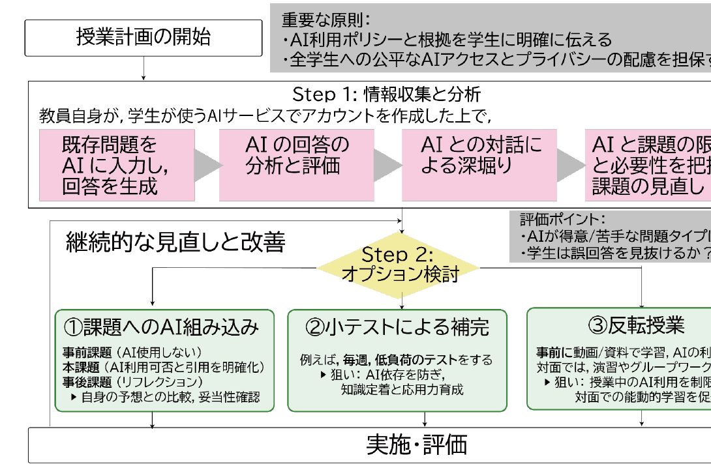

<b>重要な原則：</b> 
・AI利用ポリシーと根拠を事前に明確に伝える 
・全学生への公平なAIアクセスとプライバシーの配慮を担保する  
<b>類似の情報は阪大HPにも</b> 
https://www.tlsc.osaka-u.ac.jp/project/generative_ai/assessment_ai.html

<!--
- 授業レベルの1つ目は課題・評価改善です。MIT式のAIの課題改善フローを紹介します。
- 重要な原則として、AI利用ポリシーと根拠を事前に明確に伝えること、全学生への公平なAIアクセスとプライバシーへの配慮を担保すること。類似の情報は阪大のHPにもあります。
-->

---

授業レベル ①課題・評価改善

阪大の評価改善フロー

<b>問題作成と試験の形式：</b> 
<b>最新の出来事</b>や資料を扱うテーマを設定する 
事前に生成AIで試験問題を解いてみて、解けた場合は別の問題を検討する 
<b>授業内で</b>ディスカッションした内容を書かせる 
短いライティング課題を頻繁に課す　口頭試験にする　長い文章を要約させる 
インタビュー、コンセプトマップ、動画、ディベートなど、レポート形式以外の課題にする 
オンライン試験では、問題文は（コピペしにくいように）画像にする 
音声と映像を組み合わせた動画で出題する 
モラルに反する質問やプログラミングに反する質問への回答を求める

<b>評価とフィードバック：</b> 
ピアや教員との対面ミーティングを組み合わせて段階的に評価する 
生成AIで作成した成果物ではないという内容に署名させる 
生成AIを利用していない時に学生が書いた文章と提出されたものを比較する 
引用を多用する課題を課す　学生が引用した文献を抜き打ちで実在するかチェックする（ことを伝える） 
対面または同期型で指導する成果についてのプレゼン課題でQ&amp;Aも行う 
手書きか口頭で、学んだことのリフレクションを提出させる 
ピア評価を取り入れて建設的なフィードバックができる能力を評価する 
生成AIに書かせた文章を批評させる引用文献には文献データベースへのリンクを付けさせる

<b>課題の提出：</b>注釈を付けることを課す／課題を作成する過程についての考察を課す／手書きのレポート課題にする／レポートのテーマと自分の個人的な経験を統合する課題にする／レポートの執筆プロセス（下書きや参考文献、編集履歴等）も提出させて評価対象にする／引用文献のスクリーンショットの提出を課す

<b>方針の明示と周知：</b> 
試験で使用を許可する・許可しないツールを明記する 
出力の不正確さ、偏り、論理や文体の問題の例を学生に示して注意を促す 
剽窃チェックツールが存在し、進化していることを学生に伝える 
AIの利用に関する方針をシラバスに明記する 
学問的誠実性を強調し、不正行為の結果を理解させる 
書くプロセスが学びになぜ大切かを伝える　内発的動機づけを促す

<b>学習者主体から設計する　ゴールをイメージする</b> → <b>学生がよりできるようになるための評価</b>であり、授業の厳密性ための評価ではない 
※ <b>すでに、有料版AIで答えられる点</b>／(科目によっては、あまり意味がない場合があると考えられる点)

浦田・長岡・村上 (2024) <em>情報処理</em>

<!--
- 阪大の評価改善フローです。問題作成と試験の形式、評価とフィードバック、課題の提出、方針の明示と周知の4カテゴリで、多くの手立てが挙げられています。
- ただし一部はすでに有料版AIで答えられる点、科目によってはあまり意味がない場合もある点に注意。
- 大事なのは、学習者主体から設計しゴールをイメージすること。学生がよりできるようになるための評価であり、授業の厳密性のための評価ではありません。
-->

---

授業レベル ①課題・評価改善

課題における記載例 (Bowen &amp; Watson, AAC&amp;U 2024)

<b>課題における自分のコントリビューションを説明する</b>

- 私は友人、ツール、テクノロジー、AI の助けを一切借りずに、この作業を完全に自力で行った。 
- 最初のドラフトは自分で書いたが、その後、友人/ 家族/AI/ パラフレーズ/文法/剽窃ソフトウェアに読んでもらい、提案をもらった。この助けを受けた後、以下の変更を行った： 
　　- スペルと文法の修正 
　　- 構成や順序の変更 
　自分で作成した後、テクノロジーを使用して文全体や段落全体を書き直した。 
　元となるアイデアを生成するためにAI/友人/チューターを使用した。 
　アウトライン/最初のドラフトを作成するためにAIを使用し、その後編集した。

<b>課題別にAIの利用を明示させ、違反の場合には減点とすると通知</b>

<!--
- 課題における記載例です。課題における自分のコントリビューションを説明させる。AIの助けを一切借りずに自力で行ったのか、ドラフトを自分で書いた後に助けをもらったのか、などを学生に明示させます。
- 課題別にAIの利用を明示させ、違反の場合には減点とすると通知しておきます。
-->

---

授業レベル ①課題・評価改善

# 課題における記載例 (Bowen &amp; Watson, AAC&amp;U 2024)

事前に授業における生成AI利用のポリシーを共有する

・AI の使用が許可または禁止されるのはいつか？なぜか？

・AI とのブレインストーミングはカンニングにあたるのか？

・AI がこのクラスで学習をどのように強化または妨げる可能性があるのか？

・AI が許可されている場合、学生は課題提出の一環として AI プロンプトを共有する必要があるのか？

・AI の使用はどのようにクレジットされるべきか？

・AI の限界に関する警告

・AI 検出ツールの使用計画とその情報の使用方法に関する説明

---

授業レベル ①課題・評価改善

# 課題における記載例 (Bowen &amp; Watson, AAC&amp;U 2024)

事前に授業における生成AI利用のポリシーの例

このライティングコースの目標の一つは、効果的に書き、コミュニケーションをとる方法を学ぶことだ。これは練習が必要である。AIを使って迅速に生産することも期待されるが、<b>そもそも質の高い文章を自分で作成、編集し、認識する能力も必要</b>である。AIが自分を介さずに作業を行うことができる場合、それは雇用されるに値するスキルを持っていない、いうことになる。だから、練習しよう。

それを達成するために、コースの前半では、AIのサポートは一切禁止する。この過程の苦労やもどかしさは、レベル上げ訓練のようなものと捉えてほしい。自分で作業を行う人が利益を得るのだ。

一方、コースの後半では、特定の状況下でAIを使用することが許可される場合がある。AIの使用を認める必要がある。使用したプロンプトとその応答を提出するよう求める場合がある。

AIリテラシーは重要な新しいスキルだ。Aiは「幻覚：事実のように見えるものを生成する可能性」があることに注意が必要である。この技術の利点と潜在的な危険性の両方について批判的に考える必要がある。

あなたは依然として最終的な成果物およびAIからの制限やバイアスの可能性について責任を負う。このポリシーは必要に応じて変更する権利を留保する。

---

授業レベル ②ワーク変更

大前提： <b>講義をしなくても、学生は学ぶ事ができる</b>

<b>例① 課題中心型の授業設計/インストラクション</b>

<b>学習者中心の指導において内発的動機づけと協働を支持するために、現実社会の課題を学習の中心に据える</b>

<b>サポートやガイダンスを提供することで、効率的に目標に到達できる</b>

参考： ライゲルース 他 学習者中心の教育を実現する インストラクショナルデザイン理論とモデル

<b>例② 指令書スタイル</b>

<b>RPGの作成者の気持ちになり、どこに何をどの順番で配置するかを考える。</b>

手順を書いた上、教科書、AIを元に学生は自習出来る

→AIを用いつつ、早期に高次の学習目標に到達

---

授業レベル ②ワーク変更

# 課題中心型の授業設計

方法

①新しい全体的なタスクを見せる

②タスクに必要な構成要素を提示する

③タスクに関する構成要素を演示する

④もう一つ新しい全体タスクを見せる

⑤学修者に、既習の構成要素を新タスクに応用させる

⑥この新タスクに必要となる追加的な構成要素を提示する

補足：追加部分は、AIに支援させるなども可能

⑦これらの追加的な構成要素を演示する

⑧ステップ4〜7を続くステップにも繰り返す

ブランチ・メリル (2013)

---

授業レベル ②ワーク変更

# ID(インストラクショナル・デザイン)の第一原理

<b>インストラクション</b>：学習を促進させるために行うことすべて

<table style="width:100%; border-collapse:collapse; font-size:24px;">
<thead>
<tr style="background:var(--accent); color:#fff;">
<th style="padding:8px 14px; text-align:left; width:42%;">5つの要件</th>
<th style="padding:8px 14px; text-align:left;">説明</th>
</tr>
</thead>
<tbody>
<tr><td style="padding:8px 14px; border:1px solid #d8dde6;">①問題(Problem)</td><td style="padding:8px 14px; border:1px solid #d8dde6;">現実に起こりそうな問題に挑戦する</td></tr>
<tr><td style="padding:8px 14px; border:1px solid #d8dde6;">②活性化(Activation)</td><td style="padding:8px 14px; border:1px solid #d8dde6;">すでに知っている知識を動員する</td></tr>
<tr><td style="padding:8px 14px; border:1px solid #d8dde6;">③例示(Demonstration)</td><td style="padding:8px 14px; border:1px solid #d8dde6;">例示がある(Tell me でなく Show me)</td></tr>
<tr><td style="padding:8px 14px; border:1px solid #d8dde6;">④応用(Application)</td><td style="padding:8px 14px; border:1px solid #d8dde6;">応用するチャンスがある(Let me)</td></tr>
<tr><td style="padding:8px 14px; border:1px solid #d8dde6;">⑤統合(Integration)</td><td style="padding:8px 14px; border:1px solid #d8dde6;">現場で活用し、振り返るチャンスがある</td></tr>
</tbody>
</table>

鈴木克明（2015）『研修設計マニュアル』北大路書房

---

授業レベル ③学び方変更

# AI(notebook LMなど)をチューターとして授業に盛り込む

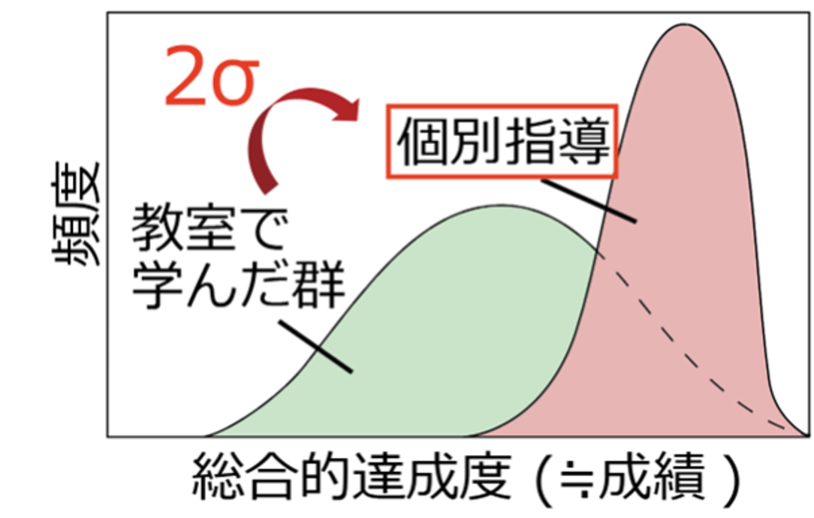

個別指導は、 <b>成績を大きく変化</b>させる

個別指導を <b>スケールさせるのがAI?</b>

Bloom (1984) Educational Researcher　https://web.mit.edu/5.95/readings/bloom-two-sigma.pdf

<!--
- AI(notebook LMなど)をチューターとして授業に盛り込む
-->

---

授業レベル ③学び方変更

# アクティブラーニングの有効性

学部初歩の物理授業のテスト成績の分布図

<b>経験豊富な講師の講義</b>　N = 267

<b>経験は少ない講師の双方向な授業</b>　N = 271

適切な講習を受け、<b>双方向性・主体性のある学習</b>を取り入れると、<b>若い教員も良い授業ができる!</b>

<b>注意：</b>アクティブラーニングすること自体が授業の目的ではない <b>(効果がない事例も多数)</b>

Deslauriers et al. (2011) Science

---

コースレベル ①総括評価変更

# 評価の種類

単純複雑

筆記

選択式問題

記述式問題

論述式問題 レポート

実演

心理テスト

観察試験

実技テスト 面接/口頭試問

<b>パフォーマンス課題</b> (小論文、作品制作、発表等)

<b>高次</b>の目標を測りやすい

組み合わせて測ることも<b>可</b>

評価の種類を変える ＝ 測れる能力が変わる ＝ 学生の到達目標も連動 対面テストで測れる能力は低次の学習目標

---

コースレベル ①総括評価変更

# 性質軸：目標に応じた評価方法

<table style="border-collapse:collapse; font-size:23px; flex:1;">
<thead>
<tr style="background:var(--accent); color:#fff;">
<th style="padding:7px 18px; text-align:left;"></th>
<th style="padding:7px 18px;">知識</th>
<th style="padding:7px 18px;">技能</th>
<th style="padding:7px 18px;">態度</th>
</tr>
</thead>
<tbody>
<tr><td style="padding:7px 18px; border:1px solid #d8dde6;">客観試験</td><td style="padding:7px 18px; border:1px solid #d8dde6; text-align:center;">◯(低次)</td><td style="border:1px solid #d8dde6;"></td><td style="border:1px solid #d8dde6;"></td></tr>
<tr><td style="padding:7px 18px; border:1px solid #d8dde6;">論述試験</td><td style="padding:7px 18px; border:1px solid #d8dde6; text-align:center;">◯(高次)</td><td style="border:1px solid #d8dde6;"></td><td style="border:1px solid #d8dde6;"></td></tr>
<tr><td style="padding:7px 18px; border:1px solid #d8dde6;">レポート</td><td style="padding:7px 18px; border:1px solid #d8dde6; text-align:center;">◯(高次)</td><td style="border:1px solid #d8dde6; text-align:center;">◯</td><td style="border:1px solid #d8dde6; text-align:center;">◯</td></tr>
<tr><td style="padding:7px 18px; border:1px solid #d8dde6;">発表</td><td style="padding:7px 18px; border:1px solid #d8dde6; text-align:center;">◯(高次)</td><td style="border:1px solid #d8dde6; text-align:center;">◯</td><td style="border:1px solid #d8dde6; text-align:center;">◯</td></tr>
<tr><td style="padding:7px 18px; border:1px solid #d8dde6;">口述試験/面接</td><td style="padding:7px 18px; border:1px solid #d8dde6; text-align:center;">◯</td><td style="border:1px solid #d8dde6;"></td><td style="border:1px solid #d8dde6; text-align:center;">◯</td></tr>
<tr><td style="padding:7px 18px; border:1px solid #d8dde6;">観察評価</td><td style="padding:7px 18px; border:1px solid #d8dde6; text-align:center;">◯</td><td style="border:1px solid #d8dde6; text-align:center;">◯</td><td style="border:1px solid #d8dde6; text-align:center;">◯</td></tr>
<tr><td style="padding:7px 18px; border:1px solid #d8dde6;">実演・制作</td><td style="border:1px solid #d8dde6;"></td><td style="border:1px solid #d8dde6; text-align:center;">◯</td><td style="border:1px solid #d8dde6; text-align:center;">◯</td></tr>
<tr><td style="padding:7px 18px; border:1px solid #d8dde6;">心理テスト</td><td style="border:1px solid #d8dde6;"></td><td style="border:1px solid #d8dde6;"></td><td style="border:1px solid #d8dde6; text-align:center;">◯</td></tr>
</tbody>
</table>

<b>目標にあった評価方法</b>を選ぶ

中島 (2016) p.36を参考

---

コースレベル ①総括評価変更

# ルーブリック

<b>✔採点道具の一つで、課題を構成要素に分け、要素ごとに評価基準を満たすレベルを説明した表</b>

✔パフォーマンス課題・レポート・実技等の評価の可視化

<table style="width:100%; border-collapse:collapse; font-size:21px;">
<thead>
<tr style="background:var(--accent); color:#fff;">
<th style="padding:6px 12px; text-align:left;">評価観点</th>
<th style="padding:6px 12px;">素晴らしい(2)</th>
<th style="padding:6px 12px;">合格(1)</th>
<th style="padding:6px 12px;">不十分(0)</th>
</tr>
</thead>
<tbody>
<tr><td style="padding:6px 12px; border:1px solid #d8dde6; font-weight:700;">分量</td><td style="border:1px solid #d8dde6;"></td><td style="padding:6px 12px; border:1px solid #d8dde6;">6分間で丁度</td><td style="padding:6px 12px; border:1px solid #d8dde6;">過剰か少ない</td></tr>
<tr><td style="padding:6px 12px; border:1px solid #d8dde6; font-weight:700;">目標</td><td style="padding:6px 12px; border:1px solid #d8dde6;">明確かつ内容が一致していた</td><td style="padding:6px 12px; border:1px solid #d8dde6;">明確さか内容の何れかに改善点</td><td style="padding:6px 12px; border:1px solid #d8dde6;">明確さ・内容の何れも不十分</td></tr>
<tr><td style="padding:6px 12px; border:1px solid #d8dde6; font-weight:700;">レベル設定</td><td style="padding:6px 12px; border:1px solid #d8dde6;">手を伸ばせば届くレベルだった</td><td style="padding:6px 12px; border:1px solid #d8dde6;">一部高度・容易な箇所があった</td><td style="padding:6px 12px; border:1px solid #d8dde6;">極端に高度・容易であった</td></tr>
</tbody>
</table>

「<b>課題内容</b>：6分模擬授業」を評価するためのルーブリック　スティーブンス＆レビ (2014)

ルーブリックを設計し高次目標の課題も扱おう

---

教員支援ツールとしてのAI

<h1 style="font-size:30px; margin-bottom:4px;">ツール (海外：教員支援)</h1>

<table style="width:100%; border-collapse:collapse; font-size:13px; line-height:1.28;">
<thead>
<tr style="background:var(--accent); color:#fff;">
<th style="padding:3px 7px;">Application</th>
<th style="padding:3px 7px;">ユーザー数</th>
<th style="padding:3px 7px;">地域</th>
<th style="padding:3px 7px; width:34%;">Key Features</th>
<th style="padding:3px 7px; width:34%;">Strengths</th>
</tr>
</thead>
<tbody>
<tr>
<td style="padding:3px 7px; border:1px solid #d8dde6; font-weight:700;">Khanmigo</td>
<td style="padding:3px 7px; border:1px solid #d8dde6;">1億6000万人以上 (含む学習者・保護者)</td>
<td style="padding:3px 7px; border:1px solid #d8dde6;">Global (USA-based)</td>
<td style="padding:3px 7px; border:1px solid #d8dde6;">Khan Academyが開発したAI搭載の学習支援ツール。学生向けのパーソナルチューターと教師向けのアシスタント機能を提供。米国内は、MSの投資により無料。日本からは接続不可。</td>
<td style="padding:3px 7px; border:1px solid #d8dde6;">For 教員：多言語の保護者向けメール、授業計画作成、評価基準、授業内活動、正解付き問題集など、様々な教材の素早い草案作成をサポート For 学生：通常のAIとは異なり、単に答えを提供するのではなく、チューターとして学生が問題を自分で解決できるよう批判的思考を促進</td>
</tr>
<tr>
<td style="padding:3px 7px; border:1px solid #d8dde6; font-weight:700;">MagicSchool.ai</td>
<td style="padding:3px 7px; border:1px solid #d8dde6;">~500万人 magicschool.ai</td>
<td style="padding:3px 7px; border:1px solid #d8dde6;">Global (USA-based)</td>
<td style="padding:3px 7px; border:1px solid #d8dde6;">教育者向けAIアシスタントプラットフォーム。授業計画、個別教育プログラム（IEP）、学習活動、評価などを生成。100種類以上のコンテンツテンプレートを提供し、15言語以上をサポート。</td>
<td style="padding:3px 7px; border:1px solid #d8dde6;">教師の計画作業と事務作業の時間を節約し、バーンアウト対策に貢献。160地域以上（ほぼすべての米国学区）で採用。プライバシー重視。</td>
</tr>
<tr>
<td style="padding:3px 7px; border:1px solid #d8dde6; font-weight:700;">Eduaide.ai</td>
<td style="padding:3px 7px; border:1px solid #d8dde6;">N/A (thousands of users, 2023)</td>
<td style="padding:3px 7px; border:1px solid #d8dde6;">Global (USA-based)</td>
<td style="padding:3px 7px; border:1px solid #d8dde6;">教師向けオールインワンAIワークスペース。教材用コンテンツジェネレーター、IEP計画やメール作成の「ティーチングアシスタント」、学生作品へのフィードバックボット、自由形式のAIチャット、クイズ/評価ビルダーを提供。</td>
<td style="padding:3px 7px; border:1px solid #d8dde6;">100種類以上のリソースタイプが利用可能で多目的。生成されたコンテンツを15言語以上に即時翻訳。指導の差別化をサポート（例：調整案の提案）。</td>
</tr>
<tr>
<td style="padding:3px 7px; border:1px solid #d8dde6; font-weight:700;">Curipod</td>
<td style="padding:3px 7px; border:1px solid #d8dde6;">150,000+ teachers (2023) reachcapital.com</td>
<td style="padding:3px 7px; border:1px solid #d8dde6;">Global (Norway)</td>
<td style="padding:3px 7px; border:1px solid #d8dde6;">生成系AIを組み込んだインタラクティブな授業作成プラットフォーム。教師がトピックを入力すると、投票、ワードクラウド、クイズ、ディスカッションプロンプトを含む授業スライドを生成。記述回答に対するAIベースの個別フィードバックを提供。</td>
<td style="padding:3px 7px; border:1px solid #d8dde6;">インタラクティブでゲーム化されたコンテンツで学生の参加を促進。AIコンテンツを教師が確認しながら、授業準備時間を大幅に削減。2023年後半までに24万の授業が作成され、100万人の学生に到達。教師向け無料AIトレーニング（認定プログラム）を提供。</td>
</tr>
<tr>
<td style="padding:3px 7px; border:1px solid #d8dde6; font-weight:700;">Education Copilot</td>
<td style="padding:3px 7px; border:1px solid #d8dde6;">N/A (new in 2023)</td>
<td style="padding:3px 7px; border:1px solid #d8dde6;">Global (UK-based)</td>
<td style="padding:3px 7px; border:1px solid #d8dde6;">教育者・トレーナー向けオールインワンAIプラットフォーム。授業計画の生成とリソース作成を自動化。出席確認や採点などの管理タスクを処理する仮想教育アシスタントを提供し、授業計画中にリアルタイムの提案を行う。</td>
<td style="padding:3px 7px; border:1px solid #d8dde6;">指導と管理業務の両方を効率化し、準備時間を節約して教室管理を容易に。カスタマイズとコンテンツ編集のためのユーザーフレンドリーなインターフェースを提供。インタラクティブな学生参加（即時フィードバック、学生コラボレーション機能など）をサポート。</td>
</tr>
</tbody>
</table>

---

教員支援ツールとしてのAI

<h1 style="font-size:32px; margin-bottom:2px;">ツール (海外：教員支援)</h1>

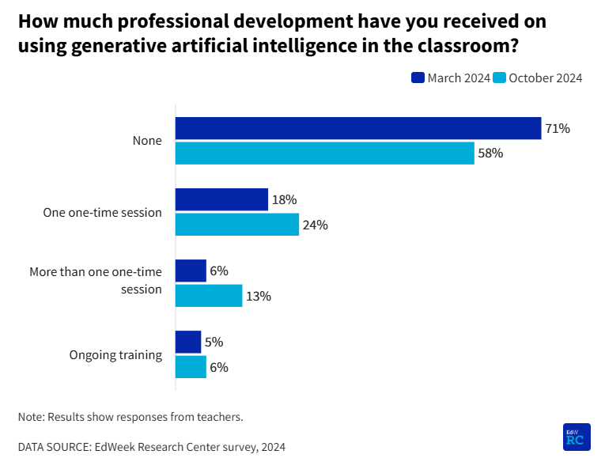

n = 1135, EdWeek Research Center survey, 2024

英国では2023年11月にかけて、<b>初等中等のAI利用教員の割合が17%から42%に上昇</b> cf. Among online UK youths aged 16-24, 74% have used a GenAI tool. https://www.ai-in-education.co.uk/news-events/dfe-generative-ai-in-education-report

米国でも2024年秋までに<b>約43%の教員がAI研修を受ける</b>ように https://www.edweek.org/technology/were-at-a-disadvantage-and-other-teacher-sentiments-on-ai/2024/10

トレンド

教師の業務効率化

<ul>
<li>授業計画の作成、教材リソース開発、採点、管理業務の自動化</li>
<li>事務作業時間の削減により、より学生に集中できる環境作り</li>
<li>多言語対応を含む多様なコンテンツテンプレートの提供</li>
</ul>

パーソナライズされた学習支援

<ul>
<li>学生の進捗データ分析と指導法の提案</li>
<li>適応型学習コンテンツの提供</li>
<li>学生の個別フィードバック生成</li>
</ul>

---

教員支援ツールとしてのAI

# ツール (海外：教員養成・PD)

<table style="font-size:15px; line-height:1.4; border-collapse:collapse; width:100%;">
<thead>
<tr style="background:var(--accent); color:#fff;">
<th style="padding:5px 7px;">Application</th>
<th style="padding:5px 7px;">ユーザー数</th>
<th style="padding:5px 7px;">地域</th>
<th style="padding:5px 7px; width:40%;">Key Features</th>
<th style="padding:5px 7px; width:33%;">Strengths</th>
</tr>
</thead>
<tbody>
<tr style="background:#fff;">
<td style="padding:5px 7px;"><b>AI Coach by Edthena</b></td>
<td style="padding:5px 7px;">Used in multiple U.S. districts edthena.com</td>
<td style="padding:5px 7px;">USA (available globally)</td>
<td style="padding:5px 7px;">専門能力開発向け仮想AIコーチ。教師が自身の授業ビデオを録画・アップロードし、AIコーチから分析とフィードバックを受けられるシステム。経験豊富な指導コーチによって訓練されたAIが、研究に基づいたコーチングを提供。教師の優先事項に合わせたパーソナライズされた支援とリソースも提供。4ステッププロセス：分析、振り返り、実行、影響評価で実施する。授業研究をオンライン化したような道具。</td>
<td style="padding:5px 7px;">すべての教師にいつでもコーチングを無制限で提供。パーソナライズされた成長プラン：各教師の目標と教室データに合わせたコンテンツ。管理者がダッシュボードを通じて専門能力開発の進捗を追跡できる</td>
</tr>
<tr style="background:var(--section-bg);">
<td style="padding:5px 7px;"><b>AI Classroom Simulator (Relay/Wharton)</b></td>
<td style="padding:5px 7px;">PoC (rolling out 2024)</td>
<td style="padding:5px 7px;">USA</td>
<td style="padding:5px 7px;">教師養成生のためのAI駆動の教育シミュレーション。「AIが実際の教師養成と開発を代替ではなく補完するのにどのように役立つか」がkey。研修生はAI生成の生徒アバターとテキストベースの仮想教室シナリオに参加。AI指導者（「バーチャルコーチ」）が研修生をガイド、生徒との会話などを練習する際にヒントやフィードバックを提供する。</td>
<td style="padding:5px 7px;">新任教師が教室でのやり取りを練習するための安全でリスクの低い環境を提供。新任教師に対して、ふさわしい特定の行動を他のものよりも選ぶ「理由」を考えるのを助けるよう設計。即時フィードバックと、エクササイズを振り返り再試行する機会を提供することで、スキル開発を加速</td>
</tr>
<tr style="background:#fff;">
<td style="padding:5px 7px;"><b>StretchAI (ISTE/ASCD)</b></td>
<td style="padding:5px 7px;">Beta testing (2024)</td>
<td style="padding:5px 7px;">USA (global reach)</td>
<td style="padding:5px 7px;">教育者の専門能力開発（PD）のためのAIコーチ。Q&Aと指導アシスタントとして機能し、教師が教育戦略や課題についてアドバイスを求めると、StretchAIは審査済みの研究ベースの出版物やベストプラクティスリソースのライブラリから回答を提供</td>
<td style="padding:5px 7px;">信頼できる知識ベースを持ち、アドバイスは検証された研究や教育専門家の意見に基づく（単なるオープンウェブチャットボットではない）。教育学と教師のニーズに焦点を当て、的を絞ったガイダンスを実施（例：特定の指導スキルを向上させる方法）を提供</td>
</tr>
</tbody>
</table>

<b>AIコーチングとメンタリング</b> 
教師のリフレクション（自己省察）を促すシステム 
シミュレーションの提供 
人間のメンターを補完、専門家の意見をスケールする

トレンド

<!--
- 海外では教員養成・PD向けのAIツールが広がっています。AI Coach by Edthena、AI Classroom Simulator、StretchAIなど。
- 共通するトレンドはAIコーチングとメンタリング。教師の自己省察を促し、シミュレーションを提供し、人間のメンターを補完して専門家の意見をスケールします。
-->

---

参考：Googleの取組み

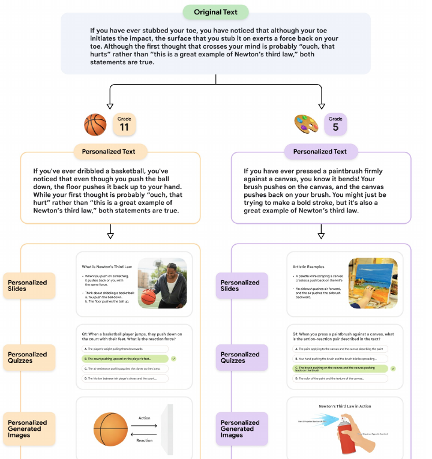

Learn Your Way

EXPERIMENT

初等・中等教育で、 
生徒のレベル感や興味に合わせ、 
教科書データを書き換えて、 
<b>解説</b>や<b>問題</b>を出力する

Towards an AI-Augmented Textbook, LearnLM Team, Google (2025)

<!--
- 参考にGoogleの取組み。Learn Your Wayというエクスペリメントです。
- 初等・中等教育で、生徒のレベル感や興味に合わせて教科書データを書き換え、解説や問題を出力します。
-->

---

大学レベル

# 考え方の例 (自分版) cf. 学習：学び全て、学修：カリキュラムによる学び

現行の制約

<b>① カリキュラムを達成させるために必要なことが授業の価値である</b>

<b>② 時間パラダイムによる授業を行わなければならない (大学設置基準)</b>

<b>③ 入口・出口評価の形態：国試、入試、入社試験etc…</b>

⇒

未来の学び

<b>① 人が集うからこそ必要なことが学校や授業の価値になる</b>

<b>② 到達パラダイムのもと、自律的/探究的に学べ、画一的カリキュラムは不要になる</b> 到達できれば、次に行ける

<b>③ 過程を評価されるようになる</b> ”m字型”専門性、転移型専門性、ゴールから今を眺める学び方

現状の大学・学び方の最適化<b>ではない</b>ところに、AI時代の大学の<b>答え</b>はある気がする

<!--
- 大学レベルでの考え方の例、自分版です。学習は学び全て、学修はカリキュラムによる学びを指します。
- 現行の制約は、カリキュラム達成・時間パラダイム・入口出口評価。未来の学びは、人が集う価値・到達パラダイム・過程の評価へ。
- 現状の最適化ではないところに、AI時代の大学の答えはある気がします。
-->

---

大学レベル

<b>大学≠知識　大学 = 適切な成長を後押しし、安心して失敗出来る場所</b>

14世紀 @ ドイツ

Laurentius de Voltolina

現在？

Generated by DALL-E

<table style="font-size:18px; border-collapse:collapse; margin:0 0 10px;">
<tr style="background:var(--accent); color:#fff;"><td style="padding:2px 10px;"></td><td style="padding:2px 10px;">認知的領域</td></tr>
<tr><td style="padding:2px 10px; background:var(--section-bg);">高</td><td style="padding:2px 10px;">創造</td></tr>
<tr><td style="padding:2px 10px;"></td><td style="padding:2px 10px;">評価</td></tr>
<tr><td style="padding:2px 10px; background:var(--section-bg);"></td><td style="padding:2px 10px;">分析</td></tr>
<tr><td style="padding:2px 10px;"></td><td style="padding:2px 10px;">応用</td></tr>
<tr><td style="padding:2px 10px; background:var(--section-bg);"></td><td style="padding:2px 10px;">理解</td></tr>
<tr><td style="padding:2px 10px;">低</td><td style="padding:2px 10px;">記憶</td></tr>
</table>

<b>社会</b>も、<b>科学技術</b>も、<b>教育理論</b>も進歩。でも、<b>授業は同じまま</b>？

<b>座学の講義で理解を促すだけ</b>では、到達出来たり、授業中に試せたりする<b>目標の範囲が狭くなりがち</b>。そこで、<b>課題中心や実験中心など、</b><b>「起こりそうな問題」や「実験」を</b><b>設計の軸にする</b>ことで、より深く学べるようになるのでは？

<!--
- 大学は知識ではなく、適切な成長を後押しし安心して失敗出来る場所。14世紀ドイツの講義風景と現在を並べると、社会も科学技術も教育理論も進歩したのに授業は同じまま、とも言えます。
- 座学で理解を促すだけでは目標の範囲が狭くなりがち。課題中心や実験中心など、起こりそうな問題や実験を設計の軸にすると、より深く学べるのではないでしょうか。
-->

---

授業実践事例

<b>生成AI活用講座：シラバス</b> 
<a href="https://syllabus.gs.chiba-u.jp/2025/401001000000000/G122151001/ja_JP">https://syllabus.gs.chiba-u.jp/2025/401001000000000/G122151001/ja_JP</a>

<b>授業の目的</b>

生成AIの仕組みを理解し、課題解決のための演習をしたうえで、私達は生成AIとどのように<b>関わるべきか自分なりの「考え」</b>を持つ。

Difyでアプリを作ってみることで、<b>AIの道具性や限界に気づく</b>

<b>教えることは最低限、課題はAIがないと出来ない設計、グループワーク</b>

<b>変わらないことを教えたい (改善ループ、AIを活かした学び方)</b>

<b>過程</b>

2024年10月に科目申請

2025年第4ターム (10月、11月)  <b>1単位</b>

数理・データサイエンス教育プログラム、教養科目の選択必修

<!--
- 授業実践事例として、生成AI活用講座のシラバスです。
- 目的は、生成AIの仕組みを理解し演習をしたうえで、自分なりの考えを持つこと。Difyでアプリを作り道具性や限界に気づく。教えることは最低限、課題はAIがないと出来ない設計、グループワークです。
- 2024年10月に申請、2025年第4ターム・1単位で開講しました。
-->

---

授業実践事例

# 到達目標

<b style="color:var(--accent-dark);">[基礎知識]</b> 生成AIの背景の仕組み、周辺のコンセプトを定性的に説明出来るようになる。

小さいAIを創るワーク、倫理・関係する概念の簡単なテスト

<b style="color:var(--accent-dark);">[応用]</b> 生成AIのリスクや得意な点・難しい点を理解し、批判的思考力を働かせ生成AIを活用できる。

Difyを用いた基礎演習、生成AIの活用事例の調査・検討

<b style="color:var(--accent-dark);">[統合と創造]</b> 社会または自分の課題解決のために生成AIを活用したミニアプリを組み立てることができる。

Difyを用いたグループワーク

<b style="color:var(--accent-dark);">[価値づけ]</b> 生成AIと自分/社会がどのように関わるべきか、自らの考えをもつ。

生成AIとの関わり方を考える、最終レポート

<!--
- 到達目標は4段階です。基礎知識、応用、統合と創造、価値づけ。
- それぞれに対応して、小さいAIを創るワークやテスト、Difyの基礎演習、グループワーク、最終レポートを配置しています。
-->

---

授業実践事例

# コースの内容　→　創造的な活動で評価

<table style="font-size:23px; border-collapse:collapse; width:100%; margin-top:6px;">
<tbody>
<tr style="background:#fff;"><td style="padding:6px 12px; text-align:center; font-weight:800; color:var(--accent); width:5%;">1</td><td style="padding:6px 14px; width:58%;">イントロダクション/生成AIの活用事例(講義)</td><td style="padding:6px 14px; background:var(--section-bg);">リテラシ・グループ分け</td></tr>
<tr style="background:#fff;"><td style="padding:6px 12px; text-align:center; font-weight:800; color:var(--accent);">2</td><td style="padding:6px 14px;">生成AIの仕組み (オンデマンド)</td><td style="padding:6px 14px; background:var(--section-bg);">AI作成 or 動画 ※選択</td></tr>
<tr style="background:#fff;"><td style="padding:6px 12px; text-align:center; font-weight:800; color:var(--accent);">3</td><td style="padding:6px 14px;">生成AI活用の注意点・勘所 (講義)</td><td style="padding:6px 14px; background:var(--section-bg);">倫理、学び方</td></tr>
<tr style="background:#fff;"><td style="padding:6px 12px; text-align:center; font-weight:800; color:var(--accent);">4</td><td style="padding:6px 14px;">生成AIアプリ開発の基礎知識 (オンデマンド)</td><td style="padding:6px 14px; background:var(--section-bg);">Difyの使い方</td></tr>
<tr style="background:#fff;"><td style="padding:6px 12px; text-align:center; font-weight:800; color:var(--accent);">5</td><td style="padding:6px 14px;">課題発掘と解決のための仮説形成</td><td style="padding:6px 14px; background:var(--section-bg);">アプリ作成のアイデア</td></tr>
<tr style="background:#fff;"><td style="padding:6px 12px; text-align:center; font-weight:800; color:var(--accent);">6</td><td style="padding:6px 14px;">グループワークでの開発</td><td style="padding:6px 14px; background:var(--section-bg);">開発の実施</td></tr>
<tr style="background:#fff;"><td style="padding:6px 12px; text-align:center; font-weight:800; color:var(--accent);">補</td><td style="padding:6px 14px;">アドバイス回</td><td style="padding:6px 14px; background:var(--section-bg);">質問対応</td></tr>
<tr style="background:#fff;"><td style="padding:6px 12px; text-align:center; font-weight:800; color:var(--accent);">7</td><td style="padding:6px 14px;">発表・評価</td><td style="padding:6px 14px; background:var(--section-bg);">発表・相互評価</td></tr>
<tr style="background:#fff;"><td style="padding:6px 12px; text-align:center; font-weight:800; color:var(--accent);">8</td><td style="padding:6px 14px;">AIと自分との関係性を考える・まとめ</td><td style="padding:6px 14px; background:var(--section-bg);">レポート</td></tr>
</tbody>
</table>

<!--
- コースの内容です。全8回＋補講で構成し、創造的な活動で評価します。
- イントロから仕組み、注意点、アプリ開発、仮説形成、グループ開発、発表・相互評価、関係性を考えるまとめへと進みます。
-->

---

学習で活用する際のアイデア

<b>Step1：</b> <b>質問</b>を徹底的にやってみる (含む：エラボレーティブ・インタロゲーション)　AI の回答へ批判的思考を働かせる

<table style="font-size:21px; border-collapse:collapse; width:100%;">
<tbody>
<tr style="background:#fff;"><td style="padding:5px 14px; font-weight:800; color:var(--accent-dark); width:22%;">定義</td><td style="padding:5px 14px;">〇〇の▢▢分野における定義を端的に教えて。</td></tr>
<tr style="background:var(--section-bg);"><td style="padding:5px 14px; font-weight:800; color:var(--accent-dark);">理由</td><td style="padding:5px 14px;">なぜそのような概念が必要になったのか。</td></tr>
<tr style="background:#fff;"><td style="padding:5px 14px; font-weight:800; color:var(--accent-dark);">どのように</td><td style="padding:5px 14px;">どのように現実に影響しているのか。 どのような考え方をするのかフローを教えて。</td></tr>
<tr style="background:var(--section-bg);"><td style="padding:5px 14px; font-weight:800; color:var(--accent-dark);">関係性</td><td style="padding:5px 14px;">〇〇に喩えて。 〇〇との関係性はあるのか。 他に同じルールに従う点ことはあるのか？</td></tr>
<tr style="background:#fff;"><td style="padding:5px 14px; font-weight:800; color:var(--accent-dark);">具体化・抽象化</td><td style="padding:5px 14px;">例を教えて。 それらをまとめたとき、上位概念は何か？</td></tr>
<tr style="background:var(--section-bg);"><td style="padding:5px 14px; font-weight:800; color:var(--accent-dark);">仮定</td><td style="padding:5px 14px;">〇〇としたら / ないとしたら</td></tr>
<tr style="background:#fff;"><td style="padding:5px 14px; font-weight:800; color:var(--accent-dark);">関心</td><td style="padding:5px 14px;">自分の関心や目標とどのように関わっているのか</td></tr>
</tbody>
</table>

<!--
- 学習で活用する際のアイデア。Step1は、質問を徹底的にやってみること。エラボレーティブ・インタロゲーションを含み、AIの回答へ批判的思考を働かせます。
- 定義・理由・どのように・関係性・具体化抽象化・仮定・関心、という観点で問いを重ねます。
-->

---

学習で活用する際のアイデア

<b>Step2：</b> <b>問題を解く / アクティブ・リコールを行う</b>

NG： 〇〇という問題の答えを教えて。

〇〇という問題を誤って✕✕と答えた。正解は▢らしい。なぜ?

(教材をAIのコンテキストに与えたうえで) 問題と解説を生成して

<b>Step3：</b> <b>リフレクションを行う</b>

<!--
- Step2は、問題を解く／アクティブ・リコールを行うこと。答えをそのまま教えてもらうのはNG。誤答を伝えてなぜか問う、教材を与えて問題と解説を生成させる、といった使い方が有効です。
- そしてStep3、リフレクションを行います。
-->

---

研究で活用する際のアイデア

<table style="font-size:21px; border-collapse:collapse; width:100%; line-height:1.3;">
<tbody>
<tr style="background:#fff;"><td style="padding:3px 14px; font-weight:800; color:var(--accent-dark); width:24%; vertical-align:top;">タスク処理：</td><td style="padding:3px 14px;">Gem <b>(学振申請・シミュレーション・成果まとめ)</b> Dify / n8n <b>(その他、特化したタスク)</b></td></tr>
<tr style="background:var(--section-bg);"><td style="padding:3px 14px; font-weight:800; color:var(--accent-dark); vertical-align:top;">情報整理・深掘り：</td><td style="padding:3px 14px;">NotebookLM、Google Spreadsheet + API</td></tr>
<tr style="background:#fff;"><td style="padding:3px 14px; font-weight:800; color:var(--accent-dark); vertical-align:top;">一般検索：</td><td style="padding:3px 14px;">Deep research、Dify、Claude Desktop</td></tr>
<tr style="background:var(--section-bg);"><td style="padding:3px 14px; font-weight:800; color:var(--accent-dark);">文献検索：</td><td style="padding:3px 14px;">ScienceDirect AI</td></tr>
<tr style="background:#fff;"><td style="padding:3px 14px; font-weight:800; color:var(--accent-dark);">論文比較：</td><td style="padding:3px 14px;">Elicit</td></tr>
<tr style="background:var(--section-bg);"><td style="padding:3px 14px; font-weight:800; color:var(--accent-dark);">英文執筆支援：</td><td style="padding:3px 14px;">Grammarly (千葉大提供)</td></tr>
<tr style="background:#fff;"><td style="padding:3px 14px; font-weight:800; color:var(--accent-dark);">スライド：</td><td style="padding:3px 14px;">Gamma</td></tr>
<tr style="background:var(--section-bg);"><td style="padding:3px 14px; font-weight:800; color:var(--accent-dark);">模式図/ベクター図：</td><td style="padding:3px 14px;">Napkin、Adobe Firesy</td></tr>
<tr style="background:#fff;"><td style="padding:3px 14px; font-weight:800; color:var(--accent-dark);">画像作成：</td><td style="padding:3px 14px;">Nano Bananaなど</td></tr>
</tbody>
</table>

ぜひ、ご参加の皆様の活用例を教えて下さい

※学振/JST申請などは、AIを使って読み手の印象を分析するなどで利用 (自身が解決したい問い自体は、AIの出力ではなく、人が考える問題)

<!--
- 研究で活用する際のアイデア。タスク処理はGemやDify/n8n、情報整理はNotebookLM、検索はDeep researchやScienceDirect AI、論文比較はElicit、執筆支援はGrammarly、スライドはGamma、図はNapkin、画像はNano Bananaなど。
- ぜひ皆様の活用例も教えて下さい。学振やJST申請では、AIで読み手の印象を分析するなどに使い、解決したい問い自体は人が考えます。
-->

---

Google scholar with gemini

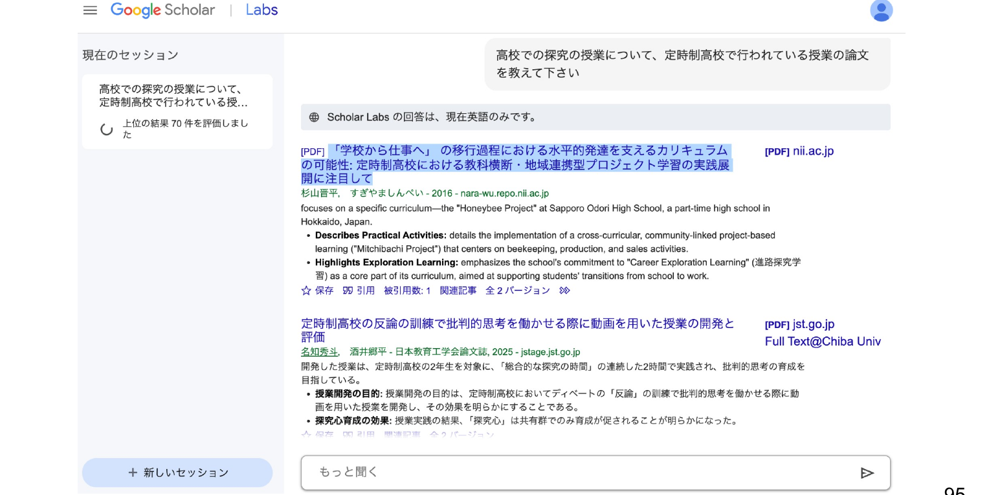

<!--
- Google Scholar Labsにgeminiが入りつつあります。問いを投げると、関連論文を要約・整理して提示してくれます。
-->

---

便利グッズ：GAS + AI

<b>= AI(“プロンプト”, “AIが参照するデータ範囲”)</b>

<table style="font-size:22px; border-collapse:collapse; margin:8px 0;">
<tr style="background:var(--section-bg);"><td style="padding:5px 14px;"><b>=AI(“翻訳して下さい”, B5)</b></td><td style="padding:5px 14px;">Hi　→　こんにちは</td></tr>
<tr style="background:var(--section-bg);"><td style="padding:5px 14px;"><b>=AI(“セル”を”元”で指定された方言を元に、翻訳して下さい”, B5)</b></td><td style="padding:5px 14px;">Hi　→　まいど (関西弁)</td></tr>
</table>

cf. GOOGLETRANSLATE(テキスト, [ソース言語, ターゲット言語])

GASを使って、生成AIのAPIを叩くことでより高度な翻訳も可能

その他、Colabでは<b>Data Science Agent でデータ分析が自動化</b>できつつある (一番最初の可視化程度には良いかも…)

研究の下ごしらえとしての生成AI活用は今後も加速するだろう

<!--
- 便利グッズ、GAS + AI。スプレッドシートで=AI(プロンプト, 参照データ範囲)と書くと、翻訳などが直接セルでできます。方言指定で「まいど」のように返すこともできます。
- GASで生成AIのAPIを叩けばより高度な翻訳も可能。Colabではdata science agentでデータ分析の自動化も進んでいます。研究の下ごしらえとしての生成AI活用は今後も加速するでしょう。
-->

---

Session 5の目的・到達目標

目的

目標 ＋ まとめ 振り返り

<b>Session 5：</b> 学びのためのAI活用法のアイデアを知る

<b>そもそも論として、AIとの付き合い方を考える</b>

生成 AI に答えを聞くのではない

考える上で、生成 AI を道具として使う

<b>学習に利用する際のアイデアを見つける</b>

<b>学びの文脈</b>に合わせて活用する

<b>研究に利用する際の活用例を知る</b>

<b>タスク</b> (例：申請書応募、実績のまとめ)

<b>情報整理・深掘り、検索、比較、英作文、スライド作成</b>など

<b>研究でどこまで使ってよいかは、各専門の慣行</b>に従う

<!--
- Session 5の振り返りです。目的は、学びのためのAI活用法のアイデアを知ること。
- 目標は、そもそも論としてAIとの付き合い方を考える、学習に利用する際のアイデアを見つける、研究に利用する際の活用例を知る、の3つでした。
-->

---

<!-- _class: divider -->

Session 6　ワーク

# 学習ツールとしてAIを試してみる

<h2>大学における生成AIとの関わり方を考える 15 - min × 6 sessions</h2>

千葉大学 国際未来教育基幹 田川 翔

<!--
- ここからSession 6、ワークです。学習ツールとしてAIを試してみましょう。
-->

---

ワーク

# ワーク

15分で、どのように教育において、 
AIを利活用するかを議論し、 
その結果を共有して下さい。

ご参加頂き、ありがとうございました！

<!--
- ワークです。15分で、どのように教育においてAIを利活用するかを議論し、その結果を共有してください。
- ご参加頂き、ありがとうございました！
-->

---

学習リソース

# Google のAI学習プログラム

受講したいトレーニングプログラムの【申し込む】ボタンをクリックし、遷移先の各社のページからお申込みください。

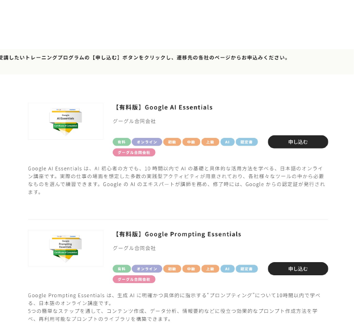

<!--
- 最後に学習リソースの紹介です。GoogleのAI学習プログラム「Google AI Essentials」「Google Prompting Essentials」など、日本語のオンライン講座があります。
- GwGジャパンによって選択されたコレクションとしてもまとめられています。受講したいプログラムの申し込むボタンから、各社のページでお申込みください。
-->
