
開始の前に

# 開始の前に

① <b>PCを立ち上げ、お持ちの 千葉大学Google Workspaceにログインして下さい</b> 
→ 学校のGmailが立ち上がる状況ならOKです。 
② <b>インタラクションツール Slidoにアクセスして下さい</b> 
URLを配布したり、質問やアンケートをとったりします 
※お名前などの個人情報の入力は禁止です

スマホから

PCから

方法1 Google検索「Slido」→コード入力 
Joining as a participant?　#ALC-AI1-01 
方法2 直接リンク https://app.sli.do/event/f4KwDbRWMXavabFGjMTR4B

<!--
- 開始前に。①千葉大Google Workspaceにログイン、②Slidoにアクセス。個人情報の入力は禁止。
-->

---

講師紹介

# <ruby>田川<rt>たがわ</rt></ruby> <ruby>翔<rt>しょう</rt></ruby>オープンバッジ

<b>所属：</b>千葉大学 高等教育センター/アカデミックリンクセンター

<b>大学教育を企画し、学生と教員を支援する仕事</b>

①元々は理学の人

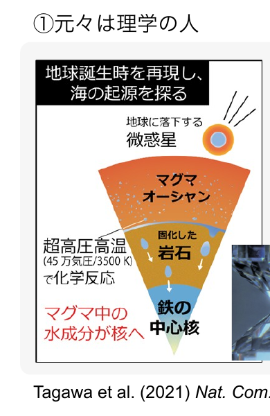

Tagawa et al. (2021) <i>Nat. Com.</i>

②色々な経験

<ul>
<li>大学のICT支援 (コロナ禍)</li>
<li>大規模オンライン授業の作成</li>
<li>民間企業での経験</li>
<li>AI×大学</li>
</ul>

③大学を学びやすく!

<ul>
<li>大学での教え方</li>
<li>生成AIの教育利活用</li>
</ul>

現在、<i>Teaching with AI</i>を翻訳・出版準備中

<!--
- 講師紹介。田川 翔。高等教育センター/アカデミックリンクセンター所属。大学教育を企画し、学生と教員を支援する仕事。
-->

---

宣伝：生成AI活用講座

# 生成AI活用講座 / Hands-on Generative AI Workshop普遍教育 GD117 4T

生成AIアプリを作ってみる

<b>グループワーク</b>

大規模言語モデルを知る

<b>テスト</b>

AIとの関わり方を考える

<b>AIリテラシ/倫理</b>

・人間中心のAI社会原則 ・安全性 ・プライシー ・透明性 ・公平性 ・説明可能性

<b>レポート</b>　・<b>AIの活用例</b> →企業での活用例を調査　・生成AIの自分なりの説明　<b>・AIとの関わり方レポート</b>

<!--
- 宣伝。普遍教育「生成AI活用講座」GD117 4T。アプリ制作・LLM理解・AIとの関わり方の3本柱。
-->

---

<!-- _class: cover-hero -->

生成AI体験 ワークショップ

2025年度 第1回： 生成AIの仕組みを体験する

15-min × 3 sessions

国際未来教育基幹 田川 翔

<!--
- 本日のワークショップ。2025年度第1回「生成AIの仕組みを体験する」。15分×3セッション。
-->

---

ワークショップの全体構成

# ワークショップの全体構成

第1回 生成AIの仕組みを体験する 
第2回 NotebookLMで情報を理解する 
第3回 AIを利用、どこまでOKか？、どこからアウト？ 
第4回 AIで絵・グラフを書いてみる 
第5回 AIで議論 (外部講師招聘予定) 
第6回 統計分析 (本学学生支援を題材に) 
第7回 AIを使ってスライドを作ってみる 
Google Spreadsheetが「AIで分析する

最初の15分 (今日短め)

講義

真ん中の15分

体験

最後の15分

議論・座談会

演習・議論付き (オンラインの皆様もぜひ！)　詳細は<b>moodle</b>で！

<!--
- 全12回シリーズの全体像。各回は「最初の15分＝講義／真ん中＝体験／最後＝議論・座談会」の3部構成。
-->

---

今回の構成

# 今回の構成

<b>最初の15分</b>　講義

- 大規模言語モデル - 生成AIを構成するレイヤー

<b>真ん中の15分</b>　体験

- Google Colabでやってみる 　次にくる単語の確率を予測してみよう

<b>最後の15分</b>　議論・座談会

- 今日面白かったこと、気付きは何でしたか。 - AIの学び方ってどうすればよいと思いますか。 - 今後、どのような点を特に学んでみたいですか。

<!--
- 今回の3部構成。講義＝LLMとレイヤー、体験＝Colabで次単語予測、議論＝学びの振り返り。
-->

---

<!-- _class: cover-hero -->

生成AI体験 ワークショップ

2025年度 第1回： 生成AIの仕組みを体験する

15-min × 3 sessions

<b>Session 1：</b> 講義：生成AIの中身を知る

国際未来教育基幹 田川 翔

<!--
- Session 1 の開始。テーマは「講義：生成AIの中身を知る」。
-->

---

Session 1の目的・到達目標

# Session 1の目的・到達目標

目的

<b>Session 1：</b> AIの正体を解剖する

目標

・<b>利活用の前提知識</b>を知る 
・<b>大規模言語モデル</b>の中身をイメージできる 
・生成AIサービスの<b>レイヤー</b>がわかる

<!--
- Session 1の目的＝AIの正体を解剖する。目標＝前提知識・LLMの中身・サービスのレイヤーの3点。
-->

---

前提：千葉大学の指針

# 千葉大学における生成AIの指針(令和5年10月13日)

① 「生成AIについての学び」「生成AIを用いた学び」「生成AIによらない学び」を<b>それぞれ推進</b>

② 授業での利用は、授業の目的に合致することが前提であり、合致するかは、各授業の担当教員が<b>判断</b>。 禁止の場合はシラバスなどに明記（気になったら先生に聞きましょう！）

③ <b>リスクや懸念</b>から<b>禁止事項あり</b>

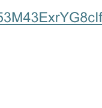

https://drive.google.com/file/u/2/d/1ZultuLWXNLJ53M43ExrYG8cIfwqcCnCO/view?pli=1

<b>まずは、千葉大のポリシーを確認しましょう！</b>

<!--
- 前提となる千葉大の指針。3種の学びを推進。授業利用は目的合致が前提で担当教員が判断。リスクから禁止事項もある。
-->

---

前提：オプトアウト

# 千葉大学の契約の中で安全に使えるAIサービス

Google

<b>Gemini / NotebookLM</b>

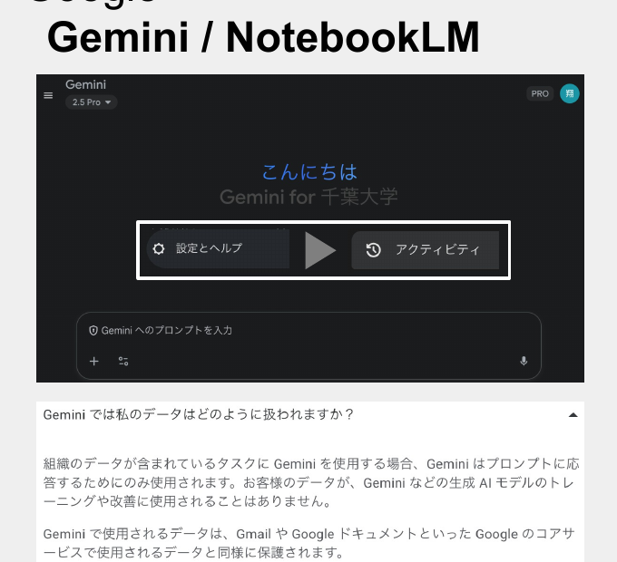

Microsoft

<b>Copilot</b>

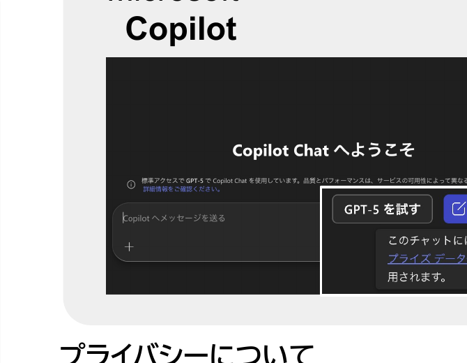

<b>プライバシーについて</b>　他の生成AIを個人使用する場合、自分のデータがモデルの学習に使われたり、誰かが見ないよう、必要ならオプトアウトを。

<!--
- 大学契約で安全に使えるのはGoogle Gemini/NotebookLMとMicrosoft Copilot。個人利用の他サービスは必要ならオプトアウトを。
-->

---

AIについての言葉の定義

# AIについての言葉の定義

<b>AI：</b>一般的に人間が知的だと感じるタスクをこなすことができるコンピュータ・プログラム。

<b>機械学習：</b>データから、「機械」（コンピューター）が自動で「学習」し、データの背景にあるルールやパターンを発見する方法。

<b>深層学習：</b>多数の層から成るニューラルネットワークを用いて行う機械学習のこと。大規模言語モデルで使用されている。

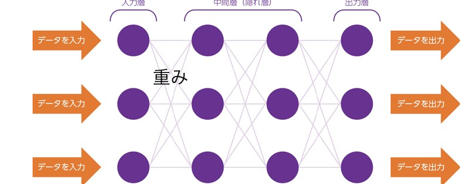

<b>2024年ノーベル物理学賞</b> 
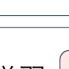 AI ⊃ 機械学習 ⊃ 深層学習

今回は、Moodle内に用語集を設置しています。ご参照下さい。

総務省令和元年生成AI白書 (2019) https://www.soumu.go.jp/johotsusintokei/whitepaper/ja/r01/html/nd113210.html

<!--
- 用語の整理。AI⊃機械学習⊃深層学習の包含関係。深層学習は2024年ノーベル物理学賞。今回はMoodle内に用語集を設置。
-->

---

機械学習のイメージ

# 機械学習のイメージ

注意：ルールそのものを教えずに、出力と正解の比較をする

自動販売機 (関数) の基本構造

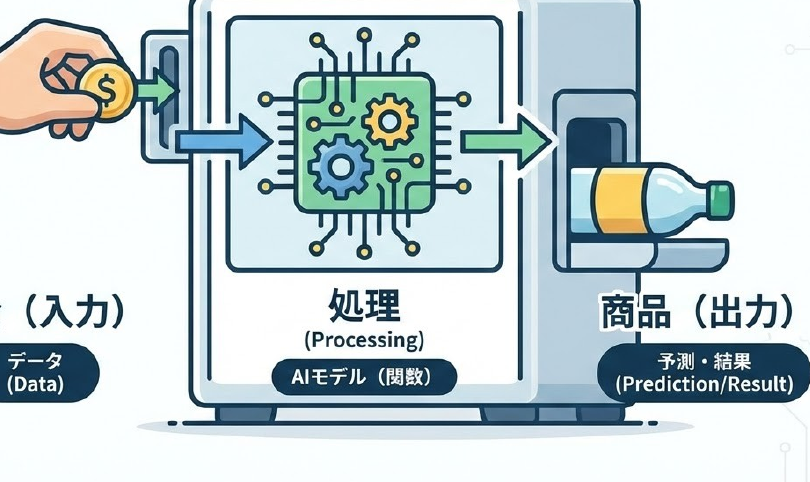

Geminiで生成

<!--
- 機械学習のイメージ。学習＝出力と正解を比較して内部を調整、推論＝学習済みで予測。関数（自動販売機）に例えて説明。
-->

---

深層学習の学習と推論

# 深層学習の学習と推論

学習 (トレーニング)

入力

→

<b>重みの函 (鍛える)</b> 数字の羅列

→

出力 評価

↑ 更新 ↺

利用 (推論・生成)

未知の 入力

→

<b>重みの函 (固定)</b> 数字の羅列

→

出力

学習済みの重みを利用して、出力を得る

GPT 4：アメリカ議会図書館の全蔵書の約20倍? ※書籍、記事、ウェブサイト、コードなど幅広いテキストソースを元に学習している

「今日は良い天...」の続きを予測する場合を考えてみましょう。

<b>正解データが「気」だとします（「天気」）。</b> 
<b>ケースA：AIが賢い場合</b> 
AIの予測：「気」である確率 95%、「丼」である確率 1%... 
結果： 正解を当てたので、Lossは非常に小さくなります。 
<b>ケースB：AIがポンコツな場合</b> 
AIの予測：「丼」である確率 80%、「気」である確率 5%... 
結果： <b>「今日は良い天丼</b>」と予測しそうになっています。正解への確信度が低いので、Lossは大きくなります。

<!--
- 深層学習は「学習」と「推論」の二段。学習では入力→重みの函→出力評価を回して重みを更新し、推論では固定した重みで未知の入力から出力を得る。
- 「今日は良い天…」の続きを予測する例で、賢いAIはLossが小さく、ポンコツなAIは「天丼」と予測しそうになりLossが大きい。
-->

---

大規模言語モデルとは

# 大規模言語モデル (LLM)

大量のテキストで学習され、単語、概念、フレーズ間のパターンを識別し、プロンプトに対する応答を生成できるようにしたAIモデル。

ネクストワードプレディクション

日本の首都<u>　　</u> → 日本の首都は<u>　　</u> → 日本の首都は東京<u>　　</u>

次の言葉(トークン)の確率を予想する問題

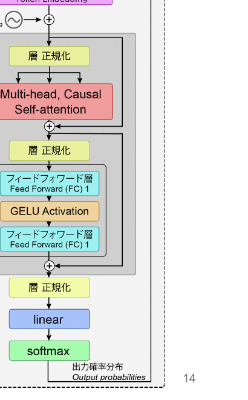

<!--
- 大規模言語モデル(LLM)は大量のテキストで学習し、単語・概念・フレーズ間のパターンを識別して応答を生成するAIモデル。
- 本質は「ネクストワードプレディクション」。次の言葉(トークン)の確率を予想する問題を、Transformerで解いている。
-->

---

LLMの中身ってなんだ？

# LLMの中身ってなんだ？

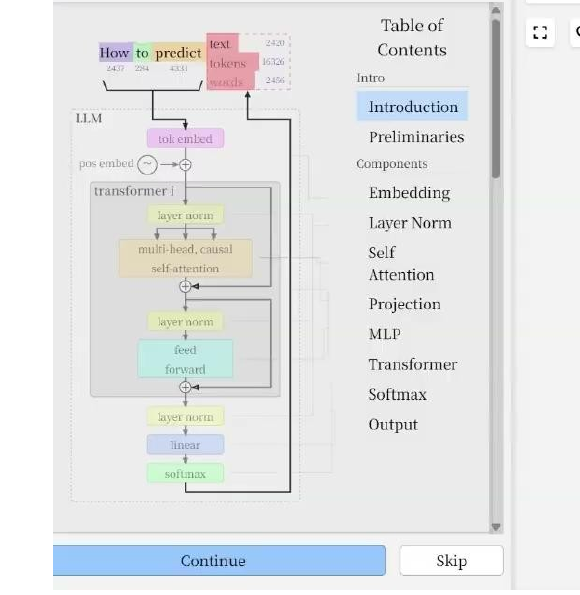

LLM Visualization ©Bycroft 2023　<a>https://bbycroft.net/llm</a>

✗ 知識集・ルール集

<b>nano-GPT</b> OpenAI共同設立者の一人、アンドレイ・カーパシーさんが公開している学習用モデル (超小さい”大規模”言語モデル)

<b>レポジトリ</b> 
https://github.com/karpathy/nanoGPT 
https://github.com/karpathy/minGPT 
<b>本人による解説動画</b> 
https://www.youtube.com/watch?v=kCc8FmEb1nY

<b>cf. nanochat (後継プロジェクト)</b> The best ChatGPT that $100 can buy.

実際にアルファベット並べたい人 →Moodle参考コードあります

<!--
- LLMの中身は「知識集・ルール集」ではない。Bycroftの可視化サイトで、Transformerが層を重ねて計算している様子を見る。
- 学習用には超小さい"大規模"言語モデルnano-GPT (Karpathy) が便利。実際にアルファベットを並べたい人はMoodleの参考コードあり。
-->

---

学習の例：シェイクスピア

# 学習：nano-GPTでシェイクスピアを学習した例 (1moGPT)

学習データのサンプル（最初の300文字）

<pre style="font-size:16px; line-height:1.4; margin:0; white-space:pre-wrap; font-family:monospace;">First Citizen:
Before we proceed any further, hear me speak.
All:
Speak, speak.</pre>

チェックポイント 1/27：1回学習後

<pre style="font-size:15px; line-height:1.35; margin:0; white-space:pre-wrap; font-family:monospace;">pNjxD-$fWcYM?QwipOBgPXxHOZygTHhHvxHMg,i
X-S-ss? FKhhE-SThoZIaqcpGLYkghBmQiFdi
oInZdGZs$hzFhN?h&amp;Awo.DWv'3TfQmRs'&amp;KJp?b'x</pre>

チェックポイント 3/27：100回学習後

Loss: Train=2.5006, Val=2.5120

<pre style="font-size:15px; line-height:1.35; margin:6px 0 0; white-space:pre-wrap; font-family:monospace;">ye our Beo
KCEBDWamad od wxt sofPr.
tars torerming bkn.dove gre t lo3'sitind</pre>

チェックポイント 11/27：2000回学習後

Loss: Train=1.3011, Val=1.5272

<pre style="font-size:15px; line-height:1.35; margin:6px 0 0; white-space:pre-wrap; font-family:monospace;">And thou ciest the which they suffer want,
Her father, being less, here shall be unby,
A senservant and heart their treas' devoted</pre>

<!--
- nano-GPTでシェイクスピアを学習した例(1moGPT)。最初はランダムな記号列だが、学習回数を重ねるとLossが下がり、だんだん英文らしくなる。
-->

---

生成AIの中でしていること

# 利用 (推論・生成)

計算1回目

“吾輩は” 出力

↑

<b>AI処理 (デコーダ)</b>

↑

前処理

↑

入力 “吾輩”

計算2回目

“吾輩は猫” 出力

↑

<b>AI処理 (デコーダ)</b>

↑

前処理

↑

入力 “吾輩は”

計算3回目

“吾輩は猫で” 出力

↑

<b>AI処理 (デコーダ)</b>

↑

前処理

↑

入力 “吾輩は猫”

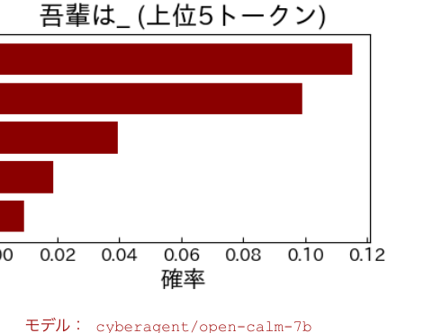

<b>デコード：</b><b>事前学習済みLLMを使って, テキストを出力プロセス。</b>なお、一番確率の高いところだけとる”Greedy Decoding”ではない方法が用いられやすい (Random Sampling)

<!--
- 生成AIは「次の一文字」を1回ずつ計算して継ぎ足す。計算1回目「吾輩」→「は」、2回目「吾輩は」→「猫」…と自己回帰的に伸ばしていく。
- デコードは事前学習済みLLMでテキストを出力するプロセス。一番確率が高いものだけ選ぶGreedy Decodingではなく、Random Samplingが使われやすい。
-->

---

ハルシネーション

# ハルシネーション

<b>ハルシネーション：</b>推論過程でAIが、誤っているがもっともらしい情報を出力してしまうこと

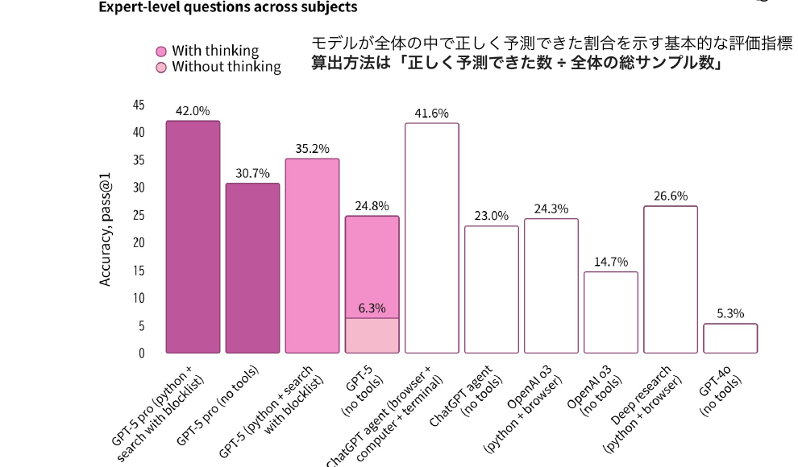

OpenAI <a>https://openai.com/ja-JP/index/introducing-gpt-5/</a>

<b>例：</b> <b>千葉大のサークルの〇〇について教えて。</b>  <b>千葉大学の生成AI活用講座の担当教員は？</b>

<b>ハルシネーションは 仕組み上、起こる</b>

<!--
- ハルシネーション＝推論過程でAIが、誤っているがもっともらしい情報を出力してしまうこと。次の単語の確率予測である以上、仕組み上起こる。
- 「千葉大のサークルの〇〇」「この講座の担当教員は？」のようなニッチな問いで顕在化しやすい。
-->

---

生成AIのレイヤー

# 生成AIのレイヤー

応用　↑　ユーザーに近い

<table style="width:100%; border-collapse:collapse; font-size:21px; margin-top:4px;">
<tr style="background:var(--accent-soft);">
<td style="border:1px solid #ccc; padding:8px 14px; font-weight:800; width:30%; color:var(--accent-dark);">生成AI アプリケーション</td>
<td style="border:1px solid #ccc; padding:8px 14px;">Chat GPT, Gemini etc… インターフェースを通じて AI 機能をユーザーに提供するソフトウェア</td>
</tr>
<tr>
<td style="border:1px solid #ccc; padding:8px 14px; font-weight:800; color:var(--accent-dark);">エージェント</td>
<td style="border:1px solid #ccc; padding:8px 14px;">DeepResearch, web検索 etc… 環境とやり取りし、情報を収集して、その情報に基づいて意思決定を行い、アクションを実行</td>
</tr>
<tr>
<td style="border:1px solid #ccc; padding:8px 14px; font-weight:800; color:var(--accent-dark);">プラットフォーム</td>
<td style="border:1px solid #ccc; padding:8px 14px;">Dify, Google AI studio etc… AI モデルの構築に役立つツールとサービス、データマネジメントツールで構成</td>
</tr>
<tr>
<td style="border:1px solid #ccc; padding:8px 14px; font-weight:800; color:var(--accent-dark);">大規模言語モデル</td>
<td style="border:1px solid #ccc; padding:8px 14px;">説明の通り</td>
</tr>
<tr style="background:#f4f6fa;">
<td style="border:1px solid #ccc; padding:8px 14px; font-weight:800; color:var(--accent-dark);">インフラストラクチャー</td>
<td style="border:1px solid #ccc; padding:8px 14px;">コンピューターリソース、GPUなど</td>
</tr>
</table>

基盤改変：Google Cloud Skills Boost

<!--
- 生成AIは5層構造。下から、インフラ→LLM→プラットフォーム→エージェント→アプリケーション。下が基盤、上が応用(ユーザーに近い)。
-->

---

Session 1の目的・到達目標

# 振り返り

目的

 

目標 ＋ まとめ

<b>Session 1：</b> 　生成AIの中身を知る

<b>利活用の前提知識</b>を知る

千葉大学の中でのポリシー「生成AIの指針」

オプトアウトと大学の契約で使える生成AIサービス

<b>大規模言語モデル(LLM)</b>の中身をイメージできる

Transformerによる「次の単語の予測」作業

<b>生成AIサービスのレイヤー</b>がわかる

インフラ→LLM→プラットフォーム→エージェント→アプリ

<!--
- Session 1の振り返り。目的＝生成AIの中身を知る。目標＋まとめとして、前提知識・LLMの中身・レイヤーの3点を確認。
-->

---

<!-- _class: cover-hero -->

生成AI体験ワークショップ

Session 2

2025年度 第1回： 生成AIの仕組みを体験する

15-min × 3 sessions

<b>Session 2：</b> 　実践：学習済みモデルで推論(デコード)してみる

国際未来教育基幹 田川 翔

<!--
- Session 2へ。学習済みモデルを実際に動かして、推論(デコード)を体験する実践パート。
-->

---

いざ、実践

# 何をするか？

① 会場はペアを作って下さい。オンラインはslidoを繋いでください。

② MoodleにあるGoogle Colabファイルを立ち上げ、<b>Transformers</b>で遊びます。僕がデモをするので、一緒に、上からポチポチと実行しましょう。

③ 文字列を入力し結果を出力してみましょう。

オンラインの方：困ったら<b>Slido</b>に質問を送って下さい！　余裕がある方： <b>Slidoに返信して</b>ください。会場の方：困ったら、手を上げてTAやペアに聞いて下さい。

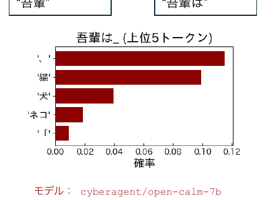

そんなん秒だわ、という方 →　会場で困っているかたのサポート or moodleで、nano-GPTのトライアルをどうぞ。

<!--
- いざ実践。会場はペア、オンラインはslido。MoodleのColabファイルを開いてTransformersで一緒に動かし、文字列を入れて出力を見る。
- 困ったらSlidoや手を上げて。すぐ終わった人はサポートやnano-GPTトライアルへ。
-->

---

応用問題を解こう！

# 応用問題 (時間が余った方向け)

①

「吾輩は猫である。」<b>の「次」</b>を予想してみましょう。 「名前」(はまだない)。。。と出ますか？

②

<b>では、「名前」と出す方法を考えてみましょう。</b> うまくいったらコンテキストやプロンプトの重要性を言語化しましょう。 なぜ、「ロール(あなたは〇〇です)」を与えるとうまく行くのでしょうか？

③

<b>色々と条件を変えて遊んでみましょう。</b> 例1: 他の文字列で試してみる　例2: 温度設定を変える　例3: モデルを変える

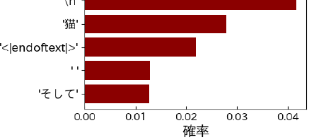

<b>ランダムサンプリングの時</b> <b> 温度 (テンパラチャー)：</b>単語選択のランダム性を変える <b> Top-P： </b>上位p％のトークンから選択する <b> Top-K： </b>上位k個のトークンから選択する

<!--
- 応用問題。①「吾輩は猫である。」の次を予想、②「名前」と出す方法（ロールやコンテキストの効果）を言語化、③温度・モデルなど条件を変えて遊ぶ。
- ランダムサンプリングのパラメータ：温度・Top-P・Top-Kでトークン選択のランダム性を制御する。
-->

---

Session 2の目的・到達目標

# 振り返り

目的

 

目標 ＋ まとめ

<b>Session 2：</b> 　実践：学習済みモデルで推論(デコード)してみる

<b>LLMは次を予想しているだけ</b>を体感する

ルールベースではない！

ネクスト・ワード・プレディクションをする

<b>LLM</b>の中身と処理をイメージできる

数字の塊、学習で重みを決定、推論でトークン生成

<b>コンテキストやプロンプトの重要性</b>がわかる

確率を上げるガチャゲームなイメージ

<!--
- Session 2の振り返り。目的＝学習済みモデルで推論(デコード)してみる。LLMは次を予想しているだけ、中身と処理のイメージ、コンテキスト/プロンプトの重要性を確認。
-->

---

<!-- _class: sec-open -->

2025年度 第1回： 生成AIの仕組みを体験する　15-min × 3 sessions

# 生成AI体験 ワークショップ

<b>Session 3：</b> 議論：振り返り &amp; AIの学び方 &amp; 期待を語ろう

国際未来教育基幹　田川 翔

---

Session 3の進め方

## 議論・座談会

最後の15分

　- 今日面白かったこと、気付きは何でしたか。 
　- AIの学び方ってどうすればよいと思いますか。 
　- 今後、どのような点を特に学んでみたいですか。

<b>Slidoで進めます</b>

スマホから

PCから

<b>方法1</b>　Google検索「Slido」→コード入力

・ALC-AI1-01

<b>方法2</b>　直接リンク https://app.sli.do/event/f4KwDbRWMXavabFGjMTR4B

<b>お願い：協力的な場作りが、学びの秘訣です。</b> 　　　　　敬意をもって、忌憚なく、建設的に、話し合いましょう

---

今日のアンケート

アンケート

　- 次回以降の参考にするので、 
　　アンケートの回答をお願いします。 
- 時間は<b>あまりかかりません (5分以下)</b> 
- 連続開講の時には、尚更重要です！

<a href="https://forms.gle/1omwbaXrnCgN1QRc9" style="color:var(--tag-blue); font-size:28px; word-break:break-all;">https://forms.gle/1omwbaXrnCgN1QRc9</a>

---

Further study

//参考文献は各スライド下部をご参照下さい//

Further study

<b>1. つくりながら学ぶ！LLM 自作入門 - マイナビ出版 (2025)</b> 
Sebastian Raschka (著), 巣籠悠輔 (監修, 翻訳), 株式会社クイープ (翻訳)　実際に、コードを書きながらAIを学べる本

<b>2. Let's build GPT: from scratch, in code, spelled out.</b> 
Andrej Karpathy　https://www.youtube.com/watch?v=kCc8FmEb1nY

<b>個人的に行ってた学習 (ただし、正しい方法かは、わかりません)</b> 
※ 理系なものの、元々は実験系メインで、AIっぽい話はしてませんでした。　　プログラミングは、PythonではなくFORTRANだった世代です。博論のためにPythonをかじりました。 
※ とはいえ、民間時代に業務で”叩き上げ”的にシステム開発を学び、レディネスはありました。 
・生成AIパスポート試験のテキストを読み、問題を解いて、受験 (追ってG検定も取得) 
・東大松尾研の講座 (機械学習など)の履修や技術本を使って自習 
・外部エンジニアとの個人的に協働し、クラウドや手元PC、AIをもちいた構築主義的な学習 
・Google SkillsやUdemyでの学習 (Google Cloud 認定資格の取得を進行中) 
　→ 生成AIを活用して学びをすすめています

