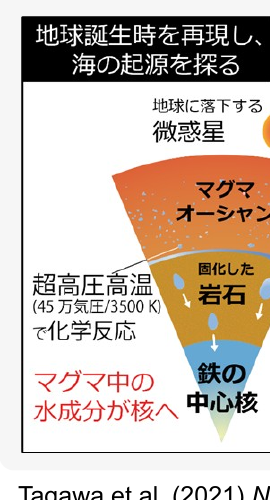
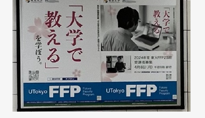
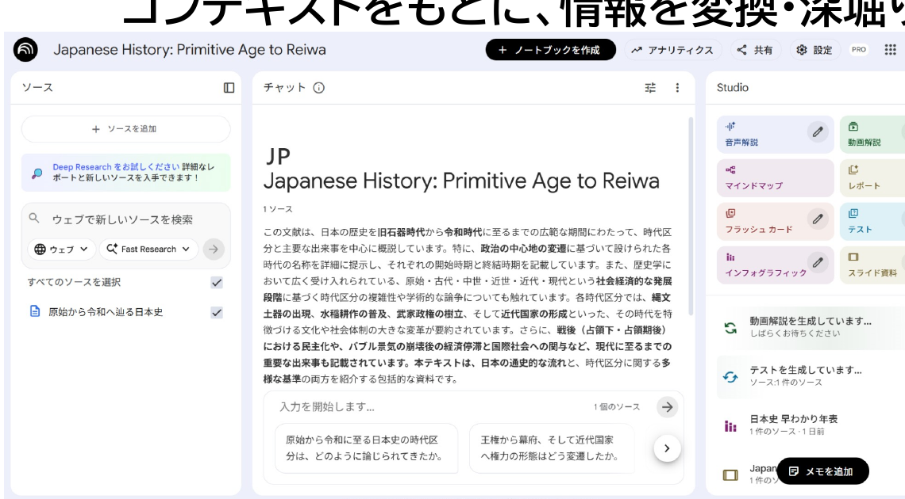
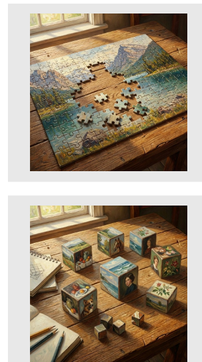
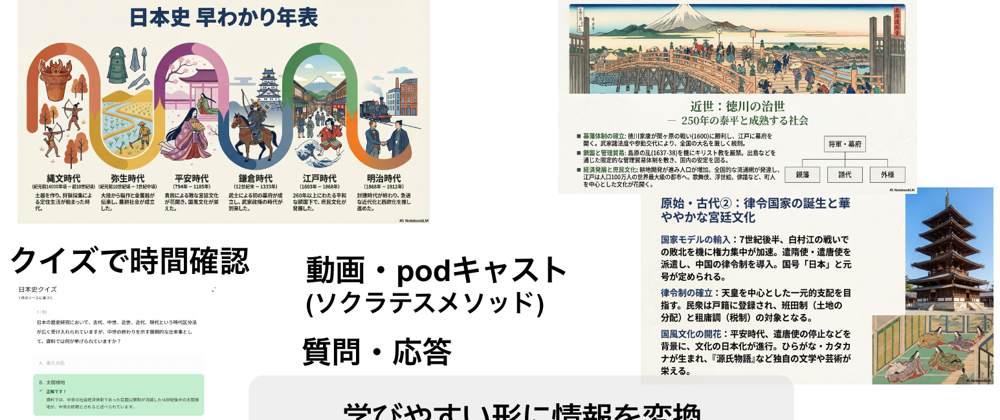
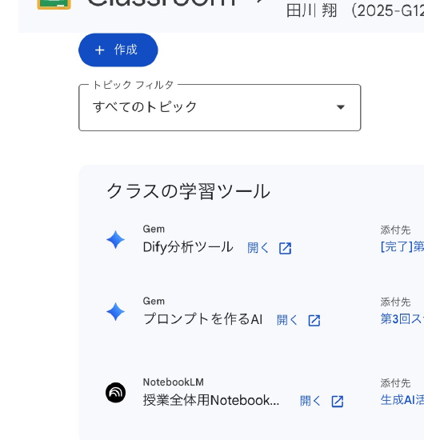
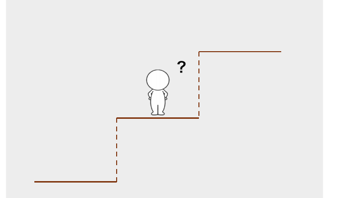
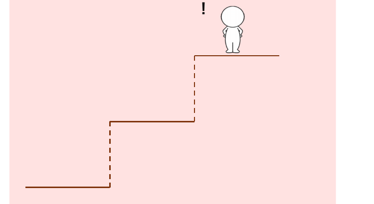
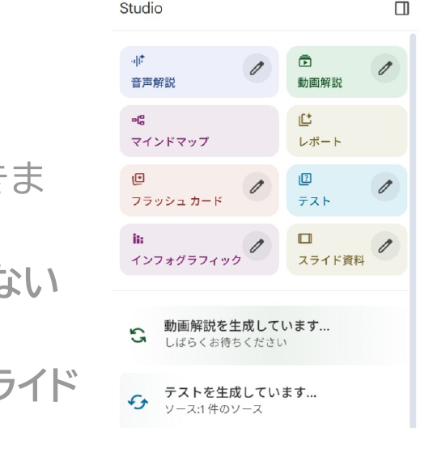

開始の前に

# 開始の前に

① <b>PCを立ち上げ、お持ちの 　 千葉大学Google Workspaceにログインして下さい</b> 　 → 学校のGmailが立ち上がる状況ならOKです。

② <b>インタラクションツール Slidoにアクセスして下さい</b> 　 URLを配布したり、質問やアンケートをとったりします 　 ※お名前などの個人情報の入力は禁止です

スマホから

PCから

方法1　Google検索「Slido」→コード入力 
 <b class="tag tag-accent" style="font-size:22px;">ALC-AI1-02</b> 
方法2　直接リンク 
https://app.sli.do/event/mxTwE7NxRLgMqVFg482TuT

<!-- [NOTE] 開始前に。千葉大Workspaceにログインし、Slidoにアクセスしてもらう。個人情報の入力は禁止。 -->

---

講師紹介

# <ruby>田川<rt>たがわ</rt></ruby> <ruby>翔<rt>しょう</rt></ruby>オープンバッジ

<b>所属：</b>千葉大学 高等教育センター／アカデミックリンクセンター

<b>大学教育を企画し、学生と教員を支援する仕事</b>

① 元々は理学の人

Tagawa et al. (2021) <i>Nat. Com.</i>

② 色々な経験

<ul>
<li>大学のICT支援 (コロナ禍)</li>
<li>大規模オンライン授業の作成</li>
<li>民間企業での経験</li>
<li>AI×大学</li>
</ul>

③ 大学を学びやすく!

<ul>
<li>大学での教え方</li>
<li>生成AIの教育利活用</li>
</ul>

現在、Teaching with AIを翻訳・出版準備中

<!-- [NOTE] 自己紹介。理学出身→ICT支援・オンライン授業・民間経験→現在は大学を学びやすくする仕事。Teaching with AI翻訳中。 -->

---

<!-- _class: cover-hero -->

生成AI体験 ワークショップ

2025年度 第2回： NotebookLMで情報を理解する

15-min × 3 sessions

国際未来教育基幹 田川 翔

<!-- [NOTE] タイトルコール。第2回「NotebookLMで情報を理解する」。15分×3セッション構成。 -->

---

ワークショップの全体構成

# ワークショップの全体構成

最初の15分 (今日短め)

講義

真ん中の15分

体験

最後の15分

議論・座談会

生成AIの仕組みを体験する 
<b>Noetebook LMで情報を理解する</b> 
生成AI利用、どこまではOKで、どこからがアウト？ 
AIで絵・グラフを書いてみる 
特別回1(外部講師登壇予定) 
特別回2(本学学生登壇予定) 
AIを使ってスライドを作ってみる 
Google SpreadsheetからAIで分析する

演習・議論付き (オンラインの皆様もぜひ！)　詳細は<b>moodle</b>で！

<!-- [NOTE] 全体構成。最初・真ん中・最後の15分で講義／体験／議論。演習・議論付きで、詳細はmoodle。 -->

---

今回の構成

# 今回の構成

<table style="width:100%; border-collapse:collapse; font-size:24px; margin-top:8px;">
<tr>
<td style="width:130px; padding:10px; color:#555; text-align:center;">最初の15分</td>
<td style="width:160px; padding:10px;">講義</td>
<td style="padding:10px;">- AIで学びに役立つ情報を作れることに気づく - Gemini/NotebookLMの機能を理解する</td>
</tr>
<tr>
<td style="padding:10px; color:#555; text-align:center;">真ん中の15分</td>
<td style="padding:10px;">体験</td>
<td style="padding:10px;">- NotebookLMを使ってみる</td>
</tr>
<tr>
<td style="padding:10px; color:#555; text-align:center;">最後の15分</td>
<td style="padding:10px;">議論・座談会</td>
<td style="padding:10px;">- 今日面白かったこと、気付きは何でしたか。 - NotebookLMを使うことへの、　懸念と利点はなんですか？</td>
</tr>
</table>

<!-- [NOTE] 今回の3パートの中身。講義＝気づき＋機能理解、体験＝使ってみる、議論＝気づきと懸念・利点。 -->

---

いざ、実践

# いざ、実践

<b>今回は、時間の関係上、まず、体験(Session2)の準備をしましょう！</b>

① 千葉大のアカウントにログインしたブラウザで、 　 ”NotebookLM”とGoogle検索し開きましょう。

② ソースに、<b>個人利用で複製しても権利上問題ない資料</b>を1-2個アップロードしてみましょう。 　 例：前回の自分の講義資料も可

③ <b>動画解説・マインドマップ・インフォグラフ・スライド</b>　資料を押して見ましょう。

オンラインの方：困ったらSlidoに質問を送って下さい！　余裕がある方： Slidoに返信してあげてください。 会場の方：困ったら、手を上げてTAやペアに聞いて下さい。

<!-- [NOTE] まず体験Session2の準備。NotebookLMを開き、権利上問題ない資料を1-2個アップロード、各機能を押してみる。 -->

---

<!-- _class: cover-hero -->

生成AI体験 ワークショップ

2025年度 第2回： NotebookLMで情報を理解する

15-min × 3 sessions

<b style="font-size:30px;">Session 1：</b> 
講義：AIで学びに役立つ情報を作る

国際未来教育基幹 田川 翔

<!-- [NOTE] Session 1の扉。講義：AIで学びに役立つ情報を作る。 -->

---

Session 1の目的・到達目標

# Session 1の目的・到達目標

<b style="font-size:28px;">Session 1：</b>　講義：AIで学びに役立つ情報を作る

目的

AIで学びに役立つ情報を作れることに気づく Gemini/NotebookLMの学習用機能を理解する

目標

・ AIで学びに役立つ情報を作れることに気づく ・ Gemini/NotebookLMの学習用機能を理解する

<!-- [NOTE] Session 1の目的と目標。AIで学習用情報を作れると気づき、Gemini/NotebookLMの学習用機能を理解する。 -->

---

最初に質問です

# 最初に質問です

想像してみて下さい。

初めて学ぶことを<b>”授業1コマ”分、自習</b>をするとします。

<b>質問1:</b>　学んだことを実践出来るようになるために、 　　　　　 <b>どのような目標</b>に分けて、学びをデザインしますか？

<b>質問2:</b>　何が、<b>「勉強自体はしていないのに、時間がかかること」</b>ですか。 　　　　　 あなたが不便に感じることや他者にしてほしいことは何ですか？

1分間、時間を取ります…

<!-- [NOTE] 受講者への問い。①どんな目標に分けて学びをデザインするか、②勉強以外で時間がかかること・不便なことは何か。1分考えてもらう。 -->

---

質問①の例：学習目標分類

# 質問①の例：学習目標分類

<table style="border-collapse:collapse; font-size:18px; width:100%;">
<tr style="background:var(--accent); color:#fff;">
<th style="padding:4px;"></th><th style="padding:4px;">知識や思考</th><th style="padding:4px;">技能やスキル</th><th style="padding:4px;">態度</th>
</tr>
<tr><td style="padding:4px; color:var(--accent-dark); font-weight:800;">高次 ↑</td><td style="padding:4px; border:1px solid #ddd;"><b>創造</b> 学習を応用し、新しい価値を作れる</td><td style="padding:4px; border:1px solid #ddd;"></td><td style="padding:4px; border:1px solid #ddd;"></td></tr>
<tr><td style="padding:4px;"></td><td style="padding:4px; border:1px solid #ddd;"><b>評価</b> 事物・判断等を比較し、評価できる</td><td style="padding:4px; border:1px solid #ddd;">自然化</td><td style="padding:4px; border:1px solid #ddd;">個性化</td></tr>
<tr><td style="padding:4px;"></td><td style="padding:4px; border:1px solid #ddd;"><b>分析</b> 要素に分け関係性を指摘できる</td><td style="padding:4px; border:1px solid #ddd;">分節化</td><td style="padding:4px; border:1px solid #ddd;">組織化</td></tr>
<tr><td style="padding:4px;"></td><td style="padding:4px; border:1px solid #ddd;"><b>応用</b> 他の場面や状況に使用できる</td><td style="padding:4px; border:1px solid #ddd;">精密化</td><td style="padding:4px; border:1px solid #ddd;">価値づけ</td></tr>
<tr><td style="padding:4px;"></td><td style="padding:4px; border:1px solid #ddd;"><b>理解</b> 学習内容を説明できる</td><td style="padding:4px; border:1px solid #ddd;">巧妙化</td><td style="padding:4px; border:1px solid #ddd;">反応</td></tr>
<tr><td style="padding:4px; color:var(--accent-dark); font-weight:800;">低次</td><td style="padding:4px; border:1px solid #ddd;"><b>記憶</b> 事実や概念を暗記している</td><td style="padding:4px; border:1px solid #ddd;">模倣</td><td style="padding:4px; border:1px solid #ddd;">受け入れ</td></tr>
</table>

<b>師匠</b>

↑

<b>一人前</b>

↑

<b>見習い</b>

<b>学習目標分類に沿って発達している</b>と考えると、腑に落ちませんか？

教育心理学者Bloomらにより作られた教育における目標の分類 
　<b>注意：</b>下から順番に完璧にせよ、という意味ではない。

<!-- [NOTE] 学習目標分類（Bloom）。認知・精神運動・情意の3領域。見習い→一人前→師匠と発達。1956年認知/1964年情意、認知はAndersonらの改訂版。下から順に完璧にする意味ではない。 -->

---

質問②の例：学習方略

# 質問②の例：学習方略

<b>学習方略</b> - Dunlosky et al. (2013) PSPI　教育心理学による、「生徒がどう勉強すべきか」のレビュー論文

<table style="border-collapse:collapse; font-size:17px; width:100%;">
<tr style="background:var(--accent); color:#fff;">
<th style="padding:4px; width:120px;">テクニック</th><th style="padding:4px;">内容・方法</th><th style="padding:4px; width:48px;">効果</th><th style="padding:4px;">主な理由</th>
</tr>
<tr><td style="padding:4px; border:1px solid #ddd;">実力テスト</td><td style="padding:4px; border:1px solid #ddd;">フラッシュカードや練習問題などを使い、自分の記憶から情報を引き出すテストを行う。</td><td style="padding:4px; border:1px solid #ddd; text-align:center; color:var(--accent-dark); font-weight:800;">高</td><td style="padding:4px; border:1px solid #ddd;">学習効果が高く、幅広い教材・年齢層に有効。フィードバックがあると効果的。</td></tr>
<tr><td style="padding:4px; border:1px solid #ddd;">分散学習</td><td style="padding:4px; border:1px solid #ddd;">一気に学習せず、学習スケジュールを分散させる。</td><td style="padding:4px; border:1px solid #ddd; text-align:center; color:var(--accent-dark); font-weight:800;">高</td><td style="padding:4px; border:1px solid #ddd;">長期的な記憶保持に有効。一夜漬けよりも遥かに効率が良い。</td></tr>
<tr><td style="padding:4px; border:1px solid #ddd;">精緻化的質問</td><td style="padding:4px; border:1px solid #ddd;">「なぜその事実が成り立つのか？」という質問を自分に投げかけ、説明を考える。</td><td style="padding:4px; border:1px solid #ddd; text-align:center;">中</td><td style="padding:4px; border:1px solid #ddd;">事実の学習に有効だが、ある程度の予備知識が必要。</td></tr>
<tr><td style="padding:4px; border:1px solid #ddd;">自己説明</td><td style="padding:4px; border:1px solid #ddd;">学習のプロセスや、新しい情報が既知の情報とどう関連するかを自分自身に説明する。</td><td style="padding:4px; border:1px solid #ddd; text-align:center;">中</td><td style="padding:4px; border:1px solid #ddd;">数学や論理的思考を要する問題解決に有効だが、時間がかかる。</td></tr>
<tr><td style="padding:4px; border:1px solid #ddd;">交互練習</td><td style="padding:4px; border:1px solid #ddd;">1つの種類の問題をまとめて解くのではなく、異なる種類の問題を混ぜて練習する。</td><td style="padding:4px; border:1px solid #ddd; text-align:center;">中</td><td style="padding:4px; border:1px solid #ddd;">数学などで劇的な効果がある（区別がつかなくなるのを防ぐ）。 ※ 全ての教科での効果は未検証。</td></tr>
<tr><td style="padding:4px; border:1px solid #ddd;">要約</td><td style="padding:4px; border:1px solid #ddd;">学習したテキストの要点をまとめ短い文章にする。</td><td style="padding:4px; border:1px solid #ddd; text-align:center; color:#999;">低</td><td style="padding:4px; border:1px solid #ddd;">時間がかかるわりに、要約スキルの形成を除き効果が薄い。</td></tr>
<tr><td style="padding:4px; border:1px solid #ddd;">ハイライト</td><td style="padding:4px; border:1px solid #ddd;">重要な部分に線を引いたり、色を塗ったりする。</td><td style="padding:4px; border:1px solid #ddd; text-align:center; color:#999;">低</td><td style="padding:4px; border:1px solid #ddd;">読むだけより効果が薄くなりがちで、推論能力を阻害しうる。</td></tr>
<tr><td style="padding:4px; border:1px solid #ddd;">キーワード法</td><td style="padding:4px; border:1px solid #ddd;">発音が似たキーワードにイメージを結びつける。</td><td style="padding:4px; border:1px solid #ddd; text-align:center; color:#999;">低</td><td style="padding:4px; border:1px solid #ddd;">適用できる教材が限られ（語呂合わせなど）、長期記憶しにくい。</td></tr>
<tr><td style="padding:4px; border:1px solid #ddd;">テキストのイメージ化</td><td style="padding:4px; border:1px solid #ddd;">読んでいる内容を頭の中で映像化する。</td><td style="padding:4px; border:1px solid #ddd; text-align:center; color:#999;">低</td><td style="padding:4px; border:1px solid #ddd;">視覚化しやすい教材に限られ、効果が一貫しない。</td></tr>
<tr><td style="padding:4px; border:1px solid #ddd;">再読</td><td style="padding:4px; border:1px solid #ddd;">テキストやノートを繰り返し読む。</td><td style="padding:4px; border:1px solid #ddd; text-align:center; color:#999;">低</td><td style="padding:4px; border:1px solid #ddd;">最も一般的だが、時間対効果が低く、深い理解につながらない。</td></tr>
</table>

※個人差はあります。

再読やハイライト、写し直すなど、準備コストの低いが効果も低い、方略を選びがち 
<b>一方で、学習効果の高い方法は、準備コストが高い一方、一人では難しい</b>

<!-- [NOTE] Dunloskyらのレビュー。実力テスト・分散学習は高効果、再読・ハイライトは低効果。効果の高い方略ほど準備コストが高く一人では難しい。 -->

---

質問②の例：学習方略

# 質問②の例：学習方略

<b>学習方略上の課題</b>

単語帳の作成、問題作成、リフレクション、問答する、質問する等は時間がかかる→ 学習効果は高いものの、<b>作業的になりがちなので、AIで支援できる？</b>

リフレクションなど、自分の学習をメタ的に見ることが重要なこともある → 言葉にすることが重要だが、一人では結構難しい。

<b>Unknown Unknowns</b> (知らないことを知らないこと) もあって、一人では難しい <b>→ 探索や俯瞰・構造化の伴走</b>

<b>Known Knowns</b> 知っていると知っていること <b>意識し、理解していること</b>

<b>Unknown Unknowns</b> 知らないことを知らないこと <b>意識も理解もしていないこと</b>

<b>Unknown Knowns</b> 知っていると知らないこと <b>理解はしているが意識していないこと</b>

<b>Known Unknowns</b> 知らないと知っていること <b>意識はしているが理解していないこと</b>

自分の学びの準備・伴走・深化をAIでできないか？

注意①： <b>人に聞く</b>、<b>白紙にかきおこす、人に教えるなど</b>、AIを使わない良い方法はある 
注意②: AIを最終出力にするのではない。学習と改善のループを回すことが必要

<!-- [NOTE] 学習方略上の課題。時間のかかる作業的な学習はAIで支援できるか。メタ認知やUnknown Unknownsは一人では難しい→探索・俯瞰・構造化の伴走。ただしAIを使わない良い方法もあり、AIは最終出力でなく学習ループを回す道具。 -->

---

Google Geminiの機能

# ① Geminiで学習の道具を作ってみる

<b>クイズ:</b> 「～についてのクイズを作成して」 
<b>フラッシュカード:</b> 「～についてのフラッシュカードを作成して」 
<b>学習ガイド:</b> 「～についての学習ガイドを作成して」

Googleの公式ヘルプ：https://support.google.com/gemini/answer/16275879?hl=ja&amp;co=GENIE.Platform%3DAndroid 当日デモ用(アクセス不可)：https://gemini.google.com/app/393fab2b95fcedf1?hl=ja

# ② GeminiでDeepResearchしてみる

注意: ハルシネーションや出典元が怪しい場合もあるので、要注意

出力例：https://docs.google.com/document/d/18hBvszUUQL1T1vgUqUH2Q2ThnideGveOxOl9diCfuY4/edit?usp=sharing 当日デモ用 (アクセス不可)：https://gemini.google.com/app/42b5918693ba87ca?hl=ja

# ③ Google NotebookLMを使ってみる今日のテーマ

<b>まずは試してみて、クリティカルに考えてみよう</b>

<!--
- Geminiの学習向け機能を3つ。①クイズ/フラッシュカード/学習ガイドを作らせる、②DeepResearchで調べる（ただしハルシネーションや出典に注意）、③そして今日のテーマであるNotebookLM。まずは試して、批判的に考えよう。
-->

---

Google NotebookLM

# コンテキストをもとに、情報を変換・深堀りする道具

コンテキスト

質問

変換

<!--
- NotebookLMは「コンテキスト（与えた資料）をもとに、情報を変換・深堀りする道具」。左が与えたコンテキスト、中央で質問し、右のように学びやすい形へ変換していく。
-->

---

Google NotebookLM

# 学びやすい形に情報を変換

<b>絵1枚で要約</b>

<b>クイズで時間確認</b>

<b>スライド作成</b>

<b>動画・podキャスト</b> (ソクラテスメソッド)

<b>質問・応答</b>

<!--
- NotebookLMは情報を「学びやすい形」に変換する。絵1枚で要約、クイズで理解確認、スライド作成、動画やポッドキャスト（ソクラテスメソッド）、質問・応答など、多様なモードがある。
-->

---

NotebookLMの授業活用

# クラスルームでの活用事例

授業全体の内容を質問し、思考・学びのパートナーとして提供

<b>作成したスライドやドキュメントをソースにアップロード</b>

・<b>使い方について10分ほどの動画を受講学生に配布</b> 
・<b>クイズや精緻的質問で能動的に学び、様々な情報モードでの理解促進を狙う</b>

<b>知識との関わり方</b>を転換

<!--
- クラスルームでの活用事例。授業全体の内容を質問できる学びのパートナーとして提供し、作成したスライド/ドキュメントをソースにアップロード。使い方の10分動画を配布し、クイズや精緻化質問で能動的に学ばせる。知識との関わり方そのものを転換する。
- 自分は、禁止することを諦めました。だったら、AIを使って、もっと遠くまで学ばせた方が良い。逆に公式に提供し、課題とテストの難易度を上げました。
-->

---

学習スタイルの複線化

# 学び方の道具としてAIを位置づける

<b>積み上げて受動的に学ぶ</b> ：順問題/演繹的学び方

どこかで頭打ちする可能性

<b>最終到達点から探究的に学ぶ</b> ：逆問題/アブダクション的学び方

高みから中間地点を学ぶ

既存の学びを効率化する<b>コスパ/タイパの道具</b>ではない／より深く・広く学びやすくするための道具とてAIを考えてみる

<!--
- 学び方の道具としてAIを位置づける。左は積み上げて受動的に学ぶ順問題・演繹型（どこかで頭打ちの可能性）。右は最終到達点から探究的に学ぶ逆問題・アブダクション型（高みから中間地点を学ぶ）。学びを良くするサイクルに含める。AIはコスパ/タイパの道具ではなく、より深く・広く学ぶための道具と考える。
-->

---

Session 1の目的・到達目標

# 振り返り

目的

<b>Session 1：</b>　講義：AIで学びに役立つ情報を作る

目標 ＋ まとめ

・<b>AIで学びに役立つ情報を作れることに気づく</b> 
　・学びの方略・準備に活用できるところがある 
　・コスパ/タイパの道具ではなく、深く学ぶために 
・<b>Gemini/NotebookLMの機能を理解する</b> 
　・情報を学びに使える形に変換出来る！ 
　・Gemini/DeepResearchも使える

<!--
- Session 1の振り返り。目的は「AIで学びに役立つ情報を作る」講義。目標は、①AIで学びに役立つ情報を作れることに気づく（方略・準備に活用、コスパ/タイパでなく深く学ぶため）、②Gemini/NotebookLMの機能を理解する（学びに使える形に変換、DeepResearchも）。
-->

---

<!-- _class: cover-hero -->

生成AI体験 ワークショップ

2025年度 第2回：　NotebookLMで情報を理解する

15-min × 3 sessions

Session 2： 実践：NotebookLMを使ってみる

国際未来教育基幹 田川 翔

<!--
- Session 2に入ります。ここからは実践：NotebookLMを実際に使ってみます。
-->

---

いざ、実践

# 何をするか？

① 会場はペアを作って下さい。オンラインはslidoを繋いでください。

② 千葉大のアカウントにログインしたブラウザで、”NotebookLM”とGoogle検索し開きましょう。

③ ソースに、<b>個人利用で複製しても権利上問題ない資料</b>を1-2個アップロードしてみましょう。

④ <b>動画解説・マインドマップ・インフォグラフ・スライド</b>　資料を押して見ましょう。

⑤ 質問をしたり、マインドマップを触ってみましょう。

オンラインの方：困ったらSlidoに質問を送って下さい！／余裕がある方：Slidoに返信してあげてください。／会場の方：困ったら、手を上げてTAやペアに聞いて下さい。

<!--
- いざ実践。①会場はペア、オンラインはSlido。②NotebookLMを開く。③権利上問題ない資料を1-2個アップロード。④動画解説・マインドマップ・インフォグラフ・スライドを押してみる。⑤質問やマインドマップ操作。困ったらSlido/TA/ペアへ。
-->

---

コンテキストの重要性

# 昨今のAIは、何をコンテキストに入れるか勝負になっている

前提情報A

前提情報B

⇒

詳細なプロンプト

⇒

良い結果

↺ 改善LOOP

<b>※ 矛盾する前提情報が多くなると雑な回答になりがち</b> 
<b>※ ベストなコンテキストのデザインを行う方法は、コンテキストエンジニアリングと言われている</b>

<b>参考：</b>AIに適切な情報を渡す手法には検索拡張生成（Retrieval-Augmented Generation）がある。ベストなコンテキストになるようなRAGアルゴリズムが必要 (RAGは断片を持ってきがち)。RAGは断片的で難しく、整った形でコンテキストに入れられる場合に限り、精度があがる。

<b>→ 情報が繋がって、新しい価値ある情報を生む価値を作る</b>

<!--
- コンテキストの重要性。昨今のAIは「何をコンテキストに入れるか」が勝負。前提情報A/Bと詳細なプロンプトから良い結果を出し、改善LOOPを回す。矛盾する前提が多いと雑になる。ベストなコンテキスト設計＝コンテキストエンジニアリング。参考：RAGは断片的で難しく、整った形で渡せた時だけ精度が上がる。情報が繋がって新しい価値を生む。
-->

---

応用問題を解こう！

# 応用問題 (時間が余った方向け)

① <b>ハルシネーションしないか、確かめてみましょう。</b>また、与えたソースには含まれないであろう、常識的な内容を質問してみましょう → 例：日本の首都の議論など

② <b>スライド作成等の指示は、プロンプトで指示を与えられます。</b>やってみましょう。

③ <b>ソースの組み合わせを変更してみましょう。</b>

とても面白い結果が出た方は、教えて下さい。

<!--
- 時間が余った方向けの応用問題。①ハルシネーションを確認（ソースに無さそうな常識を質問、例：日本の首都の議論）。②スライド作成などをプロンプトで指示。③ソースの組み合わせを変更。面白い結果が出たら教えてください。
-->

---

Session 2の目的・到達目標

# 振り返り

目的

<b>Session 2：</b>　実践：NotebookLMを使ってみる

目標 ＋ まとめ

・<b>NotebookLMの使い方がわかる</b> 
　・ソースへの登録 
　・自分の学びに活用できる内容での変換 
・<b>利点と欠点を批判的に理解する</b> 
　・Session 3で議論する

<!--
- Session 2の振り返り。目的は「NotebookLMを使ってみる」実践。目標は、①使い方がわかる（ソースへの登録、自分の学びに活用できる内容への変換）、②利点と欠点を批判的に理解する（Session 3で議論）。
-->

---

<!-- _class: cover-hero -->

生成AI体験 ワークショップ

2025年度 第2回： NotebookLMで情報を理解する

15-min × 3 sessions

Session 3： 議論：振り返り &amp; 使用の利点/欠点を語ろう

国際未来教育基幹 田川 翔

<!--
- 最後のSession 3。議論：振り返りと、使ってみた利点・欠点を語り合います。
-->

---

Session 3の進め方

議論・座談会最後の15分

　- 今日面白かったこと、気付きは何でしたか。 
　- NotebookLMを学びに使うことへの、　　懸念と利点はなんですか？

Slidoで進めます

スマホから

<b style="font-size:30px;">PCから</b>　方法1　Google検索「Slido」→コード入力

Joining as a participant?
# ALC-AI1-02 →

方法2　直接リンク

<a href="https://app.sli.do/event/mxTwE7NxRLgMqVFg482TuT">https://app.sli.do/event/mxTwE7NxRLgMqVFg482TuT</a>

<b>お願い：協力的な場作りが、学びの秘訣です。</b> 　　　　　敬意をもって、忌憚なく、建設的に、話し合いましょう

<!--
- 最後の15分はSession 3、議論・座談会。スマホはQRから、PCはSlido検索＋コード ALC-AI1-02、または直接リンクで参加してください。
- 今日面白かったこと・気付き、NotebookLMを学びに使うことへの懸念と利点を話し合いましょう。協力的な場作りが学びの秘訣です。敬意をもって、忌憚なく、建設的に。
-->

---

参考資料：課題・評価改善

# 阪大の評価改善フロー (AIで答えが出ない問題作成)

浦田・長岡・村上 (2024) <i>情報処理</i>

問題作成と試験の形式：

<b>最新の出来事</b>や資料を扱うテーマを設定する

事前に生成AIで試験問題を解いてみて、解けた場合は別の問題を検討する

<b>授業内で</b>ディスカッションした内容を書かせる

短いライティング課題を頻繁に課す

口頭試験にする

長い文章を要約させる

インタビュー、コンセプトマップ、動画、ディベートなど、レポート形式以外の課題にする

オンライン試験では、問題文は（コピペしにくいように）画像にする

音声と映像を組み合わせた動画で出題する

モラルに反する質問やプログラミングに反する質問への回答を求める

評価とフィードバック：

ピアや教員との対面ミーティングを組み合わせて段階的に評価する

生成AIで作成した成果物ではないという内容に署名させる

生成AIを利用していない時に学生が書いた文章と提出されたものを比較する

引用を多用する課題を課す

学生が引用した文献を抜き打ちで実在するかチェックする（ことを伝える）

対面または同期型で指導する成果についてのプレゼン課題でQ&Aも行う

手書きか口頭で、学んだことのリフレクションを提出させる

ピア評価を取り入れて建設的なフィードバックができる能力を評価する

生成AIに書かせた文章を批評させる引用文献には文献データベースへのリンクを付けさせる

課題の提出：

注釈を付けることを課す

課題を作成する過程についての考察を課す

手書きのレポート課題にする

レポートのテーマと自分の個人的な経験を統合する課題にする

レポートの執筆プロセス（下書きや参考文献、編集履歴等）も提出させて評価対象にする

引用文献のスクリーンショットの提出を課す

方針の明示と周知：

試験で使用を許可する・許可しないツールを明記する

出力の不正確さ、偏り、論理や文体の問題の例を学生に示して注意を促す

剽窃チェックツールが存在し、進化していることを学生に伝える

AIの利用に関する方針をシラバスに明記する

学問的誠実性を強調し、不正行為の結果を理解させる

書くプロセスが学びになぜ大切かを伝える

内発的動機づけを促す

すでに、<i>有料版AIで答えられる点</i>

(科目によっては、あまり意味がない場合があると考えられる点)

学習者主体から設計する／ゴールをイメージする → <b>学生がよりできるようになるための評価</b>であり、授業の厳密性ための評価ではない

<!--
- 阪大の浦田ら(2024)による、AIで答えが出ない問題作成・評価改善フローの一覧。問題形式・評価・課題提出・方針周知の4観点。
- ピンク網掛けはすでに有料版AIで答えられてしまう点、青字は科目によってはあまり意味がない場合がある点。
- 大事なのは学習者主体・ゴールから設計すること。学生がよりできるようになるための評価であり、授業の厳密性のための評価ではない。
-->

---

補足：アップデート可能な資料

# 補足：アップロードの判断フロー

<b>AIの学習に使用されるか：</b> 大学版アカウントでは、使用されません。 
<b>ソースへの資料アップデート可否：</b> ご自身でご判断をお願いします。参考(文化庁) 
　学習(AIを<b>作る</b>時)、生成(<b>AIを使う</b>時)、生成物利用(<b>出力</b>を使う時)の各段階があります

<b>考え方:</b> 以下のフローでご確認下さい。

① <b>資料自体のアップロードが個々の理由で禁止されている。</b>→ <b>アップロード不可</b>

例： 査読中論文や守秘義務の観点でアップロードを禁止されている。 
例： 購入したPDF資料の約款で、アップロードが禁止と明言されている。 
例： 購入した本で、個人利用の場合もアップロード不可と書かれている。

② <b>資料をNotebookLMの共有機能で他者に共有する。 → 著作物アップロード不可</b>

例： 教科書・本自体をソースにして他者に配布することは権利者の許可が必要です。 
　　　※ 授業利用の場合に限り、利用可能な場合もありえます

③ 上記①/②でない場合：<b>著作権法第30条の「私的使用」の範囲内</b>で<b>可</b>

<!--
- 補足。大学版アカウントではアップロードした資料はAIの学習に使われません。ただしソースへの資料アップロードの可否はご自身でご判断を。文化庁の整理では学習・生成・生成物利用の各段階があります。
- フロー：①資料自体のアップロードが禁止（査読中論文、約款、個人利用不可の本など）→不可、②NotebookLMの共有機能で他者に共有する→著作物は不可（授業利用に限り可の場合も）、③それ以外は著作権法第30条「私的使用」の範囲内で可。
-->
