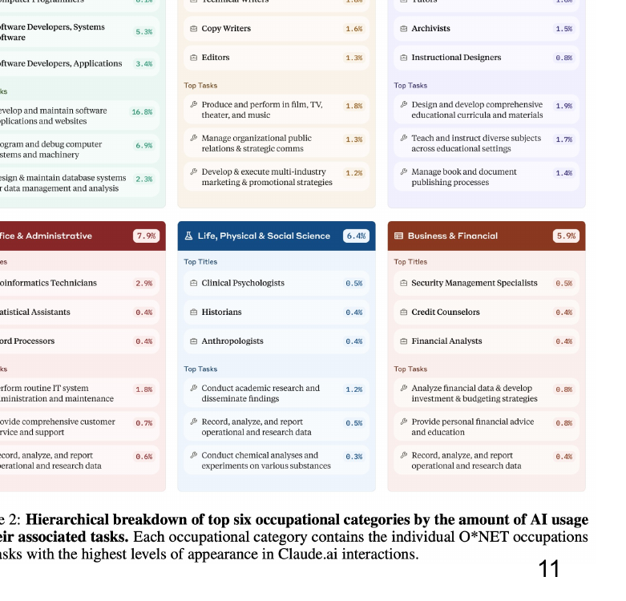
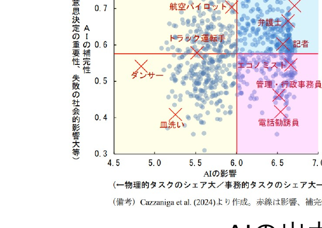
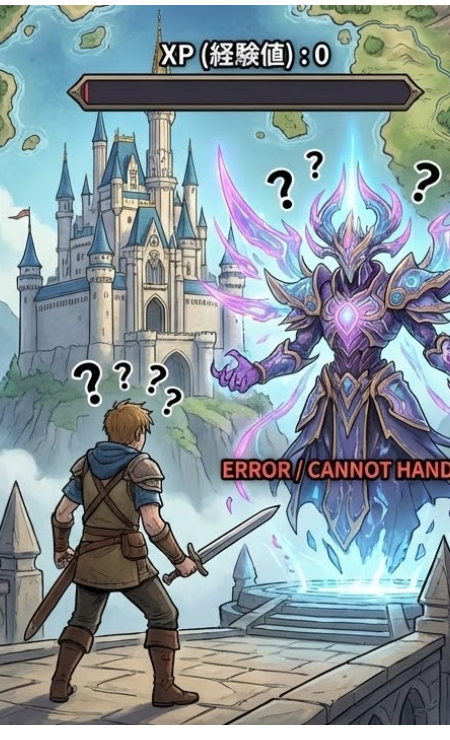
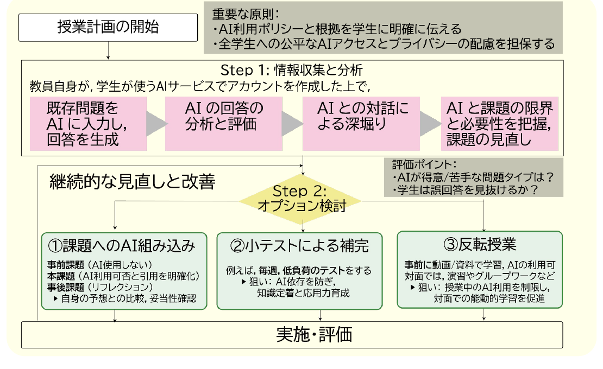
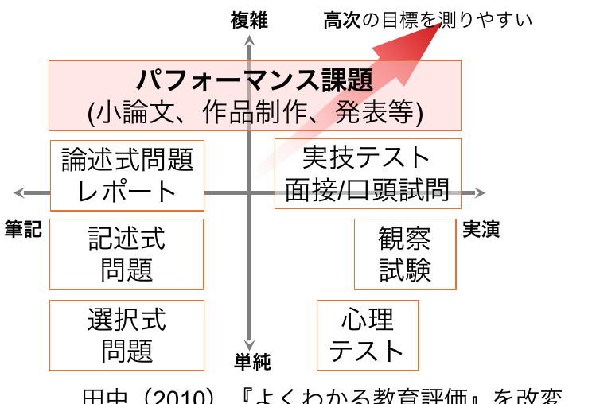
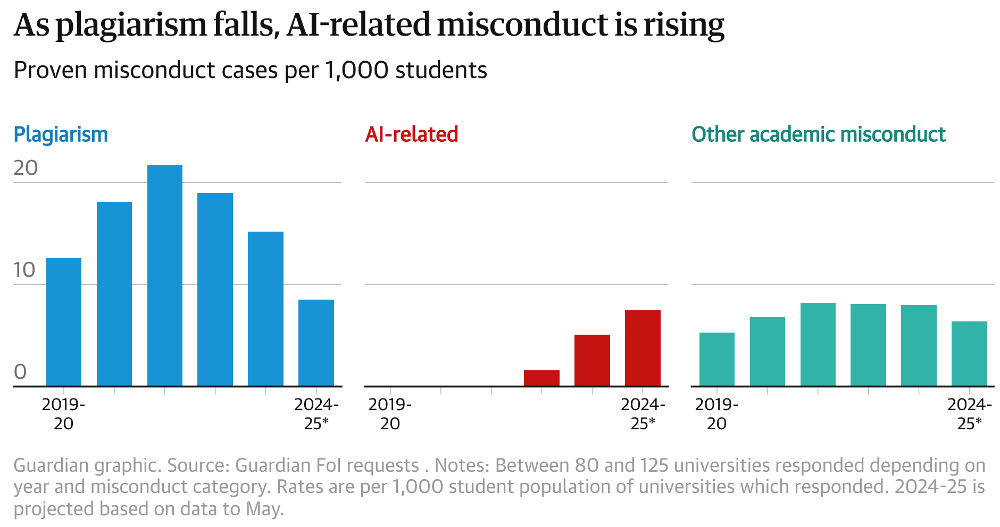

開始の前に

① <b>PCを立ち上げ、お持ちの 千葉大学Google Workspaceにログインして下さい</b> 
 　→ 学校のGmailが立ち上がる状況ならOKです。 
② <b>インタラクションツール Slidoにアクセスして下さい</b> 
　URLを配布したり、質問やアンケートをとったりします 
　 ※お名前などの個人情報の入力は禁止です

スマホから

Slido QRコード または右の方法でアクセス

PCから

<ul>
<li>方法1　Google検索「Slido」→コード入力　<b style="color:var(--accent)">ALC-AI1-03</b></li>
<li>方法2　直接リンク https://app.sli.do/event/hPooGJ6GrBvQg9DBwuuzk9</li>
</ul>

<!--
- 始める前に。PCで千葉大Workspaceにログイン、Slidoにアクセスしておいてください。個人情報の入力は禁止です。
-->

---

講師紹介

# 田川　翔たがわ　しょう

<b>所属：</b>千葉大学 高等教育センター/アカデミックリンクセンター　<b>大学教育を設計し、学生と教員を支援する仕事</b>

① 元々は理学の人

<ul>
<li>Tagawa et al. (2021) <i>Nat. Com.</i></li>
</ul>

② 色々な経験

<ul>
<li>大学のICT支援 (コロナ禍)</li>
<li>大規模オンライン授業の作成</li>
<li>民間企業での経験</li>
<li>AI×大学</li>
</ul>

③ 大学を学びやすく!

<ul>
<li>大学での教え方</li>
<li>生成AIの教育利活用</li>
<li>オープンバッジ</li>
</ul>

現在、<i>Teaching with AI</i> を翻訳・出版準備中

<!--
- 講師の田川です。元々は理学出身で、Nature Communicationsに論文。大学のICT支援やオンライン授業作成、民間経験などを経て、今は大学の教え方や生成AIの教育利活用を扱っています。
-->

---

<!-- _class: cover-hero -->

生成AI体験 ワークショップ

2025年度 第3回： 生成AI利用、どこまではOKで、どこからはアウト？

15-min × 3 sessions

国際未来教育基幹 田川 翔

<!--
- 第3回は「生成AI利用、どこまではOKで、どこからはアウト？」。15分×3セッションで進めます。
-->

---

ワークショップの全体構成

# ワークショップの全体構成

講義

最初の15分 (今日短め)

体験

真ん中の15分

議論・座談会

最後の15分

演習・議論付き (オンラインの皆様もぜひ！) 詳細は<b>moodle</b>で！

<!--
- 全体は「講義 → 体験 → 議論・座談会」の3部、各15分。今日は最初の講義を短めにします。演習や議論もあるので、オンラインの方もぜひ。詳細はmoodleで。
-->

---

今回の構成

# 今回の構成

講義<b>最初の15分</b>　- 研究・学習でのAIの利用の原則を知る。

体験<b>真ん中の15分</b>　- ポリシーを読み、気がついた点を共有し、自分の活動でAIとどう関わるか言語化する。

議論・座談会<b>最後の15分</b>　- 討論：生成AI利用、どこまではOKで、どこからはアウト？ - 今日面白かったこと、気付きは何でしたか。

<!--
- 今回の3部の中身。講義＝AI利用の原則を知る、体験＝ポリシーを読んで気づきを共有・言語化、議論＝どこまでOKでどこからアウトか討論し、今日の気づきを話します。
-->

---

<!-- _class: cover-hero -->

生成AI体験 ワークショップ

2025年度 第3回： 生成AI利用、どこまではOKで、どこからはアウト？

15-min × 3 sessions

<b>Session 1：</b> 
講義： 研究・学習でのAIの利用の原則を知る

<!--
- ここからSession 1。講義パートで、研究・学習でのAIの利用の原則を知っていきます。
-->

---

最初に質問です

# 最初に質問です

想像してみて下さい。

中高生の塾講師をしているとします。英語を教えているときに、こう言われました。 
「先生、この問題はAIが解けるのに、なぜ勉強しないといけないの？」

<b>質問1:</b>　あなたは、この生徒になんと言い返しますか？

<b>質問2:</b>　ところで、あなたが学んでいるときに、 同じ疑問を持ったことはないですか？

<!--
- 最初の問い。塾講師として「AIが解けるのに、なぜ勉強するの？」と聞かれたら、どう返しますか。そして、自分自身が学ぶときに同じ疑問を持ったことはありませんか。
-->

---

Session 1の目的・到達目標

# Session 1の目的・到達目標

目的

<b>Session 1：</b> 講義： 研究・学習でのAIの利用の原則を知る

目標

・ 学びにおける生成AIとの関わり方を考える 
・ ポリシーの重要性を説明できる

<!--
- Session 1の目的は、研究・学習でのAI利用の原則を知ること。目標は、学びにおける生成AIとの関わり方を考えられること、そしてポリシーの重要性を説明できることです。
-->

---

学びの建付け

# まずは、発達段階を考えてみる復習

教育心理学者Bloomらにより作られた教育における目標の分類　▶ 熟達者になるには、総合的な力が必要

<table style="font-size:19px; border-collapse:collapse; width:100%;">
<thead>
<tr style="background:var(--accent); color:#fff;">
<th style="padding:5px 8px; border:1px solid #fff;"></th>
<th style="padding:5px 8px; border:1px solid #fff;">知識や思考</th>
<th style="padding:5px 8px; border:1px solid #fff;">技能やスキル</th>
<th style="padding:5px 8px; border:1px solid #fff;">態度</th>
</tr>
</thead>
<tbody>
<tr><td style="padding:4px 6px; border:1px solid #ccc; font-weight:800;">高次</td><td style="padding:4px 6px; border:1px solid #ccc;"><b>創造</b> 学習を応用し、新しい価値を作れる</td><td style="padding:4px 6px; border:1px solid #ccc;" rowspan="1"></td><td style="padding:4px 6px; border:1px solid #ccc;" rowspan="1"></td></tr>
<tr><td style="padding:4px 6px; border:1px solid #ccc;"></td><td style="padding:4px 6px; border:1px solid #ccc;"><b>評価</b> 事物・判断等を比較し、評価できる</td><td style="padding:4px 6px; border:1px solid #ccc;">自然化</td><td style="padding:4px 6px; border:1px solid #ccc;">個性化</td></tr>
<tr><td style="padding:4px 6px; border:1px solid #ccc;"></td><td style="padding:4px 6px; border:1px solid #ccc;"><b>分析</b> 要素に分け関係性を指摘できる</td><td style="padding:4px 6px; border:1px solid #ccc;">分節化</td><td style="padding:4px 6px; border:1px solid #ccc;">組織化</td></tr>
<tr><td style="padding:4px 6px; border:1px solid #ccc;"></td><td style="padding:4px 6px; border:1px solid #ccc;"><b>応用</b> 他の場面や状況に使用できる</td><td style="padding:4px 6px; border:1px solid #ccc;">精密化</td><td style="padding:4px 6px; border:1px solid #ccc;">価値づけ</td></tr>
<tr><td style="padding:4px 6px; border:1px solid #ccc;"></td><td style="padding:4px 6px; border:1px solid #ccc;"><b>理解</b> 学習内容を説明できる</td><td style="padding:4px 6px; border:1px solid #ccc;">巧妙化</td><td style="padding:4px 6px; border:1px solid #ccc;">反応</td></tr>
<tr><td style="padding:4px 6px; border:1px solid #ccc; font-weight:800;">低次</td><td style="padding:4px 6px; border:1px solid #ccc;"><b>記憶</b> 事実や概念を暗記している</td><td style="padding:4px 6px; border:1px solid #ccc;">模倣</td><td style="padding:4px 6px; border:1px solid #ccc;">受け入れ</td></tr>
</tbody>
</table>

<!--
- 復習。発達段階から考えます。Bloomらの教育目標の分類で、記憶などの低次から、創造などの高次まで。建築でいう見習い・大工・棟梁のように、熟達者になるには知識・技能・態度の総合的な力が要ります。
- 1956年に認知的領域、1964年に情意的領域。精神運動領域は1972年の別のグループの仕事。認知的領域はAndersonらの改訂版を使用。
-->

---

AIとの関わり方の"視点"

# AIとの関わり方の"視点"

<b>では、AIを全く使わない方がよいのですか？</b>

A. たぶん、良い関わり方がある。 
<b>▶</b>　先週は、<b>学びの道具作り/情報の分析</b>を考えた 
　今週は、<b>もっと広い視点</b>から考えてみる

<b>① 仕事・業務の視点</b>

<b>② 授業と学びの視点</b>

<b>③ 研究・査読の視点</b>

<!--
- では、AIを全く使わない方がいいのか？　たぶん良い関わり方がある。先週は学びの道具作りや情報の分析を考えました。今週は、もっと広い視点から——①仕事・業務、②授業と学び、③研究・査読——の3視点で考えます。
-->

---

① 仕事・業務の視点

# 生成AIの活用領域

Anthropic (2025 ArXiv) リンク

プライバシーの保護を保った状態で、400万以上のClaude.aiの会話を分析 
→どの経済的タスクにAIが利用されているか把握 
米国労働省のO*NET実会話DBから類似性分類

何をしたか ↑

<b>全体として分かったこと</b>

① Software 開発とWritingで半分

② 36%の職業にAIが利用されている

③ スキル増強：自動化 = 57 : 43

<b>AIとデータ</b>を中心に、<b>人がすべき仕事を見分け、</b>DXや業務フロー変更することが始まっている　／　<b>最低限、出力の確認を →正しいか判断ができないことに使わない</b>

<!--
- まず①仕事・業務の視点。Anthropicが400万以上のClaude.aiの会話を、プライバシーを保ったまま分析し、O*NETのタスクと照らしました。ソフト開発とライティングで半分、36%の職業で利用、自動化と増強は57対43。人がすべき仕事を見分け、最低限、出力の確認をすることが大事です。
-->

---

① 仕事・業務の視点

# 仕事別の影響

<b>内閣府(2024) 世界経済の潮流</b>＞第1章＞p.13　リンク

※ 現状のままだと考えた場合 ※ 実際には、文化依存性があるなどして、不明

<b>AIの影響が大きく、代替性が高い職業：</b>事務的タスクのシェアが大きい職業。▶ つまり、AIがとって変わりうる職業

<b>AIの影響が大きく、補完性が高い職業：</b>事務的タスクのシェアが大きいものの、意思決定の重要性が高く、AI任せとすることが社会的に望ましくない職業。▶ AIを使いこなす必要のある職業

<b>AIの影響の小さい職業：</b>物理的タスクのシェアが大きい職業。

AIの出力は、次の時代の<b>仕事の平均値</b>かも　<b>「AIができることをただ出力するのは、AIで事足りるので採用する必要はない」ということ</b>　<b>AIができない「高次」の価値を作るために、引き続き学ぶ必要はある</b> Teaching with AI (Bowen &amp; Watson, AAC&amp;U 2024)

<!--
- 内閣府の資料。仕事別に、代替性が高い職業（事務中心でAIに置き換わりうる）、補完性が高い職業（AIを使いこなす必要）、影響の小さい職業（物理タスク中心）に分かれます。AIの出力は次の時代の仕事の平均値かも。AIができることをただ出力するだけなら採用の必要はない、という話。だからAIにできない高次の価値を作るために、引き続き学ぶ必要があります。
-->

---

② 授業と学びの視点

# 学習目標分類に生成AIの影響を当てはめてみる

<table style="font-size:18px; border-collapse:collapse; width:100%;">
<tr>
<th style="border:1px solid #bbb; padding:5px;"></th>
<th style="border:1px solid #bbb; padding:5px; background:var(--accent-soft);">認知的領域 (知識や思考)</th>
<th style="border:1px solid #bbb; padding:5px; background:var(--accent-soft);">学びへの生成AIの影響</th>
</tr>
<tr>
<td style="border:1px solid #bbb; padding:5px; font-weight:800; text-align:center;">高次</td>
<td style="border:1px solid #bbb; padding:5px;"><b>創造</b> (学習を応用し、新しい価値を作れる)</td>
<td style="border:1px solid #bbb; padding:5px;">人の創造性こそが大切 アイデア出しで活用</td>
</tr>
<tr>
<td style="border:1px solid #bbb; padding:5px;"></td>
<td style="border:1px solid #bbb; padding:5px;"><b>評価</b> (事物・判断等を比較し評価出来る)</td>
<td style="border:1px solid #bbb; padding:5px;">評価軸/価値/判断は人が設定する (AIで支援は可)</td>
</tr>
<tr>
<td style="border:1px solid #bbb; padding:5px;"></td>
<td style="border:1px solid #bbb; padding:5px;"><b>分析</b> (要素に分け、関係性を指摘できる)</td>
<td style="border:1px solid #bbb; padding:5px;">AIもある程度できる(例：要約・構造化)</td>
</tr>
<tr>
<td style="border:1px solid #bbb; padding:5px;"></td>
<td style="border:1px solid #bbb; padding:5px;"><b>応用</b> (他の場面や状況に使用できる)</td>
<td style="border:1px solid #bbb; padding:5px;">単なる問題では、 AIが解いてしまう…</td>
</tr>
<tr>
<td style="border:1px solid #bbb; padding:5px;"></td>
<td style="border:1px solid #bbb; padding:5px;"><b>理解</b> (学習内容を説明出来る)</td>
<td style="border:1px solid #bbb; padding:5px;">AIで支援することで、 より理解しやすくなる?</td>
</tr>
<tr>
<td style="border:1px solid #bbb; padding:5px; font-weight:800; text-align:center;">低次</td>
<td style="border:1px solid #bbb; padding:5px;"><b>記憶</b> (事実や概念を暗記している)</td>
<td style="border:1px solid #bbb; padding:5px;">AIで支援可能だが、 学修者の記憶必須</td>
</tr>
</table>

左は栗田&amp;中村 (2023)を元に作成 / 原著 Bloom (1956/1964)、改訂版(2001)を記載

問題は、<b>AIで学びを代替したときに</b>、<b>できなくなること</b>があること。 ① <b>低次 ~ 高次まで</b>身に付けないと使えない ② <b>長期的な悪影響</b>は不明

<b>例：手計算 vs 計算機</b> <b>手計算を人より早く出来るスキルは不要</b>かもしれない、でも手計算の感覚を持たず代替すると、<b>「大きな何か」を実現しようとしたとき、(長期的に？)困ること</b>があるのでは？

<b>教員の皆様へ</b> 評価方法の種別によって、計測可能な到達目標が変わります。持ち込み不可の筆記テストでは、応用までしか計測できないとされています。逆にその点は、AIが最も得意とする範囲にも重なります。評価の設定は、授業での到達範囲にもなりうるので、AIによって評価設定が難しくなったなぁ、と思っています。

<!--
- 学習目標分類（ブルームのタキソノミー）に生成AIの影響を当てはめてみる。低次から高次まで身につけないと使えない、長期的な悪影響は不明、という2点が問題。手計算 vs 計算機の例で説明。
-->

---

② 授業と学びの視点

# 授業と成績とはなにか？

授業での考え方の例

学生の現状

学修後の状態

目的： どこに向かうのか (授業の存在価値)

達成目標： 何が出来るようになるのか

評価： どのように測るのか

<svg viewBox="0 0 900 360" style="position:absolute; left:0; top:0; width:100%; height:100%; pointer-events:none;">
<line x1="190" y1="300" x2="640" y2="120" stroke="var(--accent)" stroke-width="2.5"/>
<line x1="640" y1="120" x2="640" y2="300" stroke="#888" stroke-width="1.5" stroke-dasharray="5,5"/>
</svg>

プラクティカルには生成AIの使用可否は授業教員の指示に従って下さい。

<!--
- 授業と成績とはなにか。学生の現状から学修後の状態へ。目的（どこに向かうか）、達成目標（何ができるか）、評価（どう測るか）の3点で考える。プラクティカルには、生成AIの使用可否は授業教員の指示に従ってください。
-->

---

② 授業と学びの視点

# 授業と成績とはなにか？

授業での考え方の例

学生の現状

学修後の状態

目的： どこに向かうのか (授業の存在価値)

達成目標： 何が出来るようになるのか

評価： どのように測るのか

<b>設計(課題など)：</b> <b>どのように教えるのか</b>

<svg viewBox="0 0 900 330" style="position:absolute; left:0; top:0; width:100%; height:100%; pointer-events:none;">
<line x1="180" y1="270" x2="640" y2="110" stroke="var(--accent)" stroke-width="2.5"/>
<line x1="640" y1="110" x2="640" y2="270" stroke="#888" stroke-width="1.5" stroke-dasharray="5,5"/>
</svg>

<b>設計を損なう形で、AIを使わない！</b> → 教員が身につけて欲しいと考えるから、意図的に学生の努力を期待している点

<b>AI = RPGの場所ジャンプ機能にもなる</b> 単にジャンプし続けると経験値がたまらずに、自分が使いこなせなくなってしまう

<!--
- 前のスライドに「設計（課題など）：どのように教えるのか」を加えた図。設計を損なう形でAIを使わない。AIはRPGの場所ジャンプ機能にもなり、ジャンプし続けると経験値がたまらず使いこなせなくなる。
-->

---

② 授業と学びの視点

# なぜ学ぶのか、どうすれば身につくのか、本質に立ち返りましょう

◀ Gemini作成

<b>Jump連打は やばい時が あるかも。</b>

<b>逆に、jump しても良い時 もあるかも?</b>

<!--
- Geminiが作成したRPGの比喩イラスト。左は本来の学習の道のりとAIテレポート、右はラスボス戦でERROR CANNOT HANDLE。Jump連打はやばい時があるかも、逆にjumpしても良い時もあるかも。なぜ学ぶのか、どうすれば身につくのか、本質に立ち返りましょう。
-->

---

② 授業と学びの視点

# AI = RPGの場所ジャンプ機能?

①ジャンプし続けると成長の段階が欠けて学べずに、自分が使いこなせなくなってしまう ②目標以外の部分や既に身につけたところはジャンプすれば、もっと遠くまで、学ぶことができる

アイデア①

<b>自分が内発的にできるようになりたいことに　学生の皆さんは、AIを使わないのでは？</b> <b>課題で時間がない時や、価値を感じない時に使うかも</b> →<b>価値や経験</b>をしっかり伝える

アイデア②

<b>RPGの比喩</b> <b>「途中のストーリーをしらないのに楽しめる？」</b> <b>「経験値が無いのに、ラスボス戦にジャンプして戦える？」</b> →<b>自分の手を動かす必要性</b>をゴールから伝える

<b>注意！： </b>現在は、見習い経験を<b>意図しないと磨けない時代</b>　見習い部分の発注が業務がAIに代替されつつある

AI = RPGのチュートリアル/伴走機能? という点は、前回(第2回) 参照

<!--
- AIはRPGの場所ジャンプ機能。ジャンプし続けると成長段階が欠ける、目標以外や既習部分はジャンプすればもっと遠くまで学べる。アイデア①価値や経験を伝える、②RPGの比喩で自分の手を動かす必要性をゴールから伝える。見習い経験を意図しないと磨けない時代。
-->

---

参考資料：課題・評価改善

# MIT式、AI時代の課題改善フロー for 先生方へ

<b>類似の情報は阪大HPにも</b> <a href="https://www.tlsc.osaka-u.ac.jp/project/generative_ai/assessment_ai.html">https://www.tlsc.osaka-u.ac.jp/project/generative_ai/assessment_ai.html</a>

必須：シラバスへの明記

他大学事例：課題ごとの使用範囲の申告

<!--
- MIT式、AI時代の課題改善フロー（先生方へ）。授業計画の開始から、既存問題をAIに入力し回答を生成、AIとの対話により深堀り、AIと課題の限界を踏まえ改善という流れ。必須はシラバスへの明記。類似情報は阪大HPにも。
-->

---

③ 研究と査読の視点

# まずは、投稿する論文誌や所管する学会のAIポリシーを確認する

<b>Nature 投稿方針 リンク</b> ① オーサーシップ付与は禁止 ② LLM使用はMethods sectionで明示が必要※「AI assisted copy editing」(文法・読みやすさの改善)は開示不要 ③ 画像生成AIは例外を除き禁止

<b>Nature 査読方針</b> ① アップロードは原則禁止 ② 主張の評価の判断に使用する場合は、宣言必要

<b>Science 投稿方針 </b>リンク ① オーサーシップ付与は付与は禁止 ② 使用した場合は開示が必須　原稿作成補助でAIを使用した場合もカバーレターなどに明記 ③ 画像は使用禁止

<b>アメリカ地球物理学会 投稿・査読方針</b> ①出版社Wileyの方針による ②言語編集のためのAI使用は原則可　だが、機密保持違反に注意

<b>人間の責任（Human Oversight）:</b> AIは「執筆のパートナー」であり内容の正確性、引用、分析、倫理的基準については、<b>著者が全責任を負う。</b> <b>透明性と開示(disclosure)</b>:AIを使用した場合に明記する必要性。 <b>著者権(Authorship)</b>: 著者の資格。

研究手法、投稿、査読とも、分野差があり、変わっていくので注意を　／　※使用を前提にした例：NeurIPS 2025のポリシー例

<!--
- まずは投稿する論文誌や所管する学会のAIポリシーを確認する。Nature・Science・アメリカ地球物理学会の投稿/査読方針を比較。人間の責任、透明性と開示、著者権が共通の論点。研究手法・投稿・査読とも分野差があり変わっていくので注意を。
-->

---

前提

# 研究倫理／アカデミック・インテグリティの遵守

前提として、<b>研究倫理/アカデミック・インテグリティの遵守</b>を (<b>特定不正行為</b>に該当することを<b>AIの利用の有無によらず</b>しない)

故意又は研究者として<b>わきまえるべき基本的な注意義務</b>を著しく怠ったことによる、<b>以下の不正行為</b>

<table style="font-size:20px; border-collapse:collapse; width:100%;">
<tr>
<td style="border:1px solid #bbb; padding:8px; font-weight:800; color:var(--accent-dark); white-space:nowrap; background:var(--accent-soft);">fabrication(捏造)</td>
<td style="border:1px solid #bbb; padding:8px;">存在しないデータ，研究結果等を作成すること。</td>
</tr>
<tr>
<td style="border:1px solid #bbb; padding:8px; font-weight:800; color:var(--accent-dark); white-space:nowrap; background:var(--accent-soft);">falsification(改ざん)</td>
<td style="border:1px solid #bbb; padding:8px;">研究資料・機器・過程を変更する操作を行い、データ、研究活動によって得られた結果等を真正でないものに加工すること。</td>
</tr>
<tr>
<td style="border:1px solid #bbb; padding:8px; font-weight:800; color:var(--accent-dark); white-space:nowrap; background:var(--accent-soft);">plagiarism(盗用)</td>
<td style="border:1px solid #bbb; padding:8px;">他の研究者のアイデア、分析・解析方法、データ、研究結果、論文又は用語を当該研究者の了解又は適切な表示なく流用すること。</td>
</tr>
</table>

日本学術振興会「科学の健全な発展のために」-誠実な科学者の心得 (2015) リンク　／　普遍ガイダンス (2025) https://www.cphe.chiba-u.jp/ge/for_student/guidance/pdf/guidance2025.pdf

<!--
- 前提として研究倫理・アカデミックインテグリティの遵守。特定不正行為に該当することはAIの利用の有無によらずしない。捏造・改ざん・盗用（FFP）の定義を確認。日本学術振興会「科学の健全な発展のために」より。
-->

---

ポリシーとはなにか？

# ポリシーとはなにか？

<b>ポリシー</b>：合意形成された「なぜ」と「方向性」 ≠ ルール 「何をする/禁止する」

a way of doing something that has been officially agreed and chosen by a political party, a business, or another organization - LDOCE ver6

① <b>階層性：</b> 研究倫理 (FFP)、論文投稿/査読、所属組織、授業 etc…

② <b>基準の例 </b>(Bowen and Watson, 2025)<b>：</b>

<b>③ より高い目的や価値</b> (平等さ、倫理、生涯生きる学びなど) <b>の実現</b>

AIの使用はいつ許可され、いつ禁止されるのか？ なぜか？ 　→AIはこの授業での学びをどう強化し、阻害する可能性があるか？ AIが許可される場合、どのように、使用を開示するべきか？ AIの限界に関する理解。 AI検知ツールの使用計画とその情報の使用方法に関する透明性。 自分の成果・作品に対する最終的な説明責任についての明確な方針。

AIを利用する際には、まず、ポリシーを参照

<!--
- ポリシーとは合意形成された「なぜ」と「方向性」で、ルール（何をする/禁止する）とは異なる。階層性、基準の例（Bowen and Watson 2025）、より高い目的や価値の実現。AIを利用する際には、まず、ポリシーを参照。
-->

---

Session 1の目的・到達目標

# 振り返り

<b>Session 1：</b> 講義： 研究・学習でのAIの利用の原則を知る

目的

学びにおける生成AIとの関わり方を考える

ポリシーの重要性を説明できる

目標 ＋ まとめ

・学びにおける生成AIとの関わり方を考える 
　・発達段階の途中は結局短時間化できても、省略不可？ 
　・イノベーションの実現には結局、学習必須では？ 
　・授業の場合、努力を求められている点では使わず頑張る 
・ポリシーの重要性を説明できる 
　・合意形成された「なぜ」と「方向性」 
　・ポリシーがある場合には、確認する

<!--
- Session 1の振り返り。目的は「学びにおける生成AIとの関わり方を考える」「ポリシーの重要性を説明できる」。目標とまとめでは、発達段階の省略可否、イノベーション実現には学習必須、授業では努力を求められる点では使わず頑張る、ポリシーは合意形成された「なぜ」と「方向性」で確認する、といった点を振り返る。
-->

---

<!-- _class: divider -->

生成AI体験ワークショップ

Session 2

2025年度 第3回： 生成AI利用、どこまではOKで、どこからはアウト？ 15-min × 3 sessions

<b>Session 2：</b> ポリシーを読み、気がついた点を共有し、自分の活動でAIとどう関わるか言語化する。

国際未来教育基幹 田川 翔

<!--
- Session 2の扉。ポリシーを読み、気がついた点を共有し、自分の活動でAIとどう関わるか言語化する。
-->

---

いざ、実践

# 何をするか？

① 自分に関係するAI利用ポリシーを探しましょう(3分)。

② 5分で読んで以下の形式でまとめることを考えて下さい。(AI使用可) <b>何を読んだか、内容のまとめ、感想 </b>/ 他の人が読んだものと同じものも可能

③ 3分でスプレッドシートで共有して下さい。(名前・機密情報不可)

<b>おすすめ</b> <b>学部生：</b>　千葉大学の教育・学習における生成AIの利用についての指針 <b>修士/博士前期：</b> 自分が所属する学会の<b>研究利用における</b>AIポリシー <b>博士後期以上：</b> ご自身が出される論文誌や有名誌(N/Sなど)の<b>査読</b>AIポリシー <b>先生方:</b> ご自身の授業で学生に提示されている、課題でのAI利用ポリシー <b>職員の方：</b>ご担当の部署でのAI利用指針など、もしあれば

オンラインの方：困ったらSlidoに質問を送って下さい！ 余裕がある方： Slidoに返信してあげてください。 会場の方：困ったら、手を上げてTAやペアに聞いて下さい。

<!--
- いざ実践。何をするか。①自分に関係するAI利用ポリシーを探す(3分)、②5分で読んでまとめを考える（AI使用可）、③3分でスプレッドシートで共有（名前・機密情報不可）。おすすめは立場別に、学部生・修士・博士・先生方・職員の方それぞれのポリシー。
-->

---

Session 2の目的・到達目標

# 振り返り

<b>Session 2：</b> ポリシーを読み、気がついた点を共有し、 自分の活動でAIとどう関わるか言語化する。

目的

目標 ＋ まとめ

それぞれが、自分に関わるポリシーを確認する

気付いた点を言葉にし、共有する

なぜ、ポリシーが重要か考える

<!--
- Session 2の振り返り。目的＝ポリシーを読み、気付きを共有し、自分の活動でAIとどう関わるか言語化する。
- 目標＋まとめとして、①自分に関わるポリシーを確認、②気付いた点を言葉にし共有、③なぜポリシーが重要かを考える。
-->

---

<!-- _class: divider -->

SESSION 3

# 生成AI体験ワークショップ

<h2>2025年度 第3回： 生成AI利用、どこまではOKで、どこからはアウト？　／　15-min × 3 sessions</h2>

Session 3： 議論：討論 &amp; 振り返り

国際未来教育基幹　田川 翔

<!--
- ここからSession 3。議論パートとして、討論と振り返りを行う。
-->

---

Session 3の進め方

# 議論・座談会　(最後の15分)

　- 討論：生成AI利用、どこまではOKで、どこからはアウト？

　- 今日面白かったこと、気付きは何でしたか。

<b>Slidoで進めます</b>　▶　モデレーションするので、Q&amp;Aタブから使って下さい

スマホから

<b>PCから</b>　方法1　Google検索「Slido」→コード入力

Joining as a participant?　# ALC-AI1-03 ▸

方法2　直接リンク

https://app.sli.do/event/hPooGJ6GrBvQg9DBwuuzk9

<b>お願い：協力的な場作りが、学びの秘訣です。</b> 敬意をもって、忌憚なく、建設的に、話し合いましょう

<!--
- 最後の15分は議論・座談会。論点は「生成AI利用、どこまではOKで、どこからはアウト？」と「今日面白かったこと・気付き」。
- SlidoのQ&Aタブから参加（コード ALC-AI1-03）。協力的で敬意ある場作りをお願いします。
-->

---

参考：教員むけ資料

# 課題中心型の授業設計

ブランチ・メリル (2013)

①新しい全体的なタスクを見せる

②タスクに必要な構成要素を提示する

③タスクに関する構成要素を演示する

④もう一つ新しい全体タスクを見せる

⑤学修者に、既習の構成要素を新タスクに応用させる

⑥この新タスクに必要となる追加的な構成要素を提示する

⑦これらの追加的な構成要素を演示する

⑧ステップ④ - ⑦を続くステップにも繰り返す

補足：⑥の追加部分は、AIに支援させるなども可能

<table style="font-size:18px; border-collapse:collapse; width:100%;">
<thead>
<tr style="background:var(--accent); color:#fff;">
<th style="padding:4px 5px; border:1px solid #fff;"></th>
<th style="padding:4px 5px; border:1px solid #fff;">知識</th>
<th style="padding:4px 5px; border:1px solid #fff;">技能</th>
<th style="padding:4px 5px; border:1px solid #fff;">態度</th>
</tr>
</thead>
<tbody>
<tr><td style="padding:4px 5px; border:1px solid #ccc;">客観試験</td><td style="padding:4px 5px; border:1px solid #ccc; text-align:center;">◯(低次)</td><td style="padding:4px 5px; border:1px solid #ccc;"></td><td style="padding:4px 5px; border:1px solid #ccc;"></td></tr>
<tr><td style="padding:4px 5px; border:1px solid #ccc;">論述試験</td><td style="padding:4px 5px; border:1px solid #ccc; text-align:center;">◯(高次)</td><td style="padding:4px 5px; border:1px solid #ccc;"></td><td style="padding:4px 5px; border:1px solid #ccc;"></td></tr>
<tr><td style="padding:4px 5px; border:1px solid #ccc;">レポート</td><td style="padding:4px 5px; border:1px solid #ccc; text-align:center;">◯(高次)</td><td style="padding:4px 5px; border:1px solid #ccc; text-align:center;">◯</td><td style="padding:4px 5px; border:1px solid #ccc; text-align:center;">◯</td></tr>
<tr><td style="padding:4px 5px; border:1px solid #ccc;">発表</td><td style="padding:4px 5px; border:1px solid #ccc; text-align:center;">◯(高次)</td><td style="padding:4px 5px; border:1px solid #ccc; text-align:center;">◯</td><td style="padding:4px 5px; border:1px solid #ccc; text-align:center;">◯</td></tr>
<tr><td style="padding:4px 5px; border:1px solid #ccc;">口述/面接</td><td style="padding:4px 5px; border:1px solid #ccc; text-align:center;">◯</td><td style="padding:4px 5px; border:1px solid #ccc;"></td><td style="padding:4px 5px; border:1px solid #ccc; text-align:center;">◯</td></tr>
<tr><td style="padding:4px 5px; border:1px solid #ccc;">観察評価</td><td style="padding:4px 5px; border:1px solid #ccc; text-align:center;">◯</td><td style="padding:4px 5px; border:1px solid #ccc; text-align:center;">◯</td><td style="padding:4px 5px; border:1px solid #ccc; text-align:center;">◯</td></tr>
<tr><td style="padding:4px 5px; border:1px solid #ccc;">実演・制作</td><td style="padding:4px 5px; border:1px solid #ccc;"></td><td style="padding:4px 5px; border:1px solid #ccc; text-align:center;">◯</td><td style="padding:4px 5px; border:1px solid #ccc; text-align:center;">◯</td></tr>
<tr><td style="padding:4px 5px; border:1px solid #ccc;">心理テスト</td><td style="padding:4px 5px; border:1px solid #ccc;"></td><td style="padding:4px 5px; border:1px solid #ccc;"></td><td style="padding:4px 5px; border:1px solid #ccc; text-align:center;">◯</td></tr>
</tbody>
</table>

中島 (2016)  p.36を参考

情報の伝達方法に<b>座学講義”だけ”を選ばなくても</b>、学生は学ぶ事ができる

cf. 養老孟司さんと考える これからの時代に必要な学びとは？（特に57:20 - ）　／　田中 (2010)『よくわかる教育評価』を改変

<!--
- 課題中心型の授業設計（ブランチ・メリル 2013）の8ステップ。⑥の追加部分はAIに支援させることも可能。
- 座学講義”だけ”を選ばなくても学生は学べる。右の二次元マップ（筆記↔実演 × 単純↔複雑）で、パフォーマンス課題ほど高次の目標を測りやすい。田中(2010)を改変。
-->

---

参考：教員むけ資料

# 授業における生成AI利用のポリシーの例

このライティングコースの目標の一つは、効果的に書き、コミュニケーションをとる方法を学ぶことです。これができるようになるには練習が必要です。AIを使って迅速に文章を生産することも期待されるものの、<b>そもそも質の高い文章を自分で作成、編集し、認識する能力も必要</b>です。AIが自分を介さずに作業を行うことができる場合、それは雇用されるに値するスキルを持っていない、いうことです。だから、一緒に練習しましょう。

目標を達成するために、<b>コースの前半では</b>、AIのサポートは一切禁止する。この過程の苦労やもどかしさは、レベル上げ訓練のようなものと捉えてほしい。自分で作業を行う人が利益を得ることができる。

一方、<b>コースの後半</b>では、特定の状況下でAIを使用することが許可される場合がある。AIの使用を認める必要がある。使用したプロンプトとその応答を提出するよう求める場合がある。

AIリテラシーは重要な新しいスキルである。AIは「ハルシネーション：事実のように見えるものを生成する可能性」があることに注意が必要である。この技術の利点と潜在的な危険性の両方について批判的に考える必要がある。

最終的な成果物およびAIからの制限やバイアスの可能性について責任を負う。教員はこのポリシーを必要に応じて変更する権利を留保する。

(Bowen &amp; Watson, AAC&amp;U 2024 ※僅かに講演者が改変)

<!--
- 授業における生成AI利用ポリシーの実例（Bowen & Watson, AAC&U 2024を僅かに改変）。
- 前半はAI一切禁止＝レベル上げ訓練、後半は条件付きで許可しプロンプトと応答の提出を求める。AIリテラシーとハルシネーション注意、最終成果物の責任は学生。
-->

---

参考：教員むけ資料

# 課題での努力における透明性と開示の選択肢

1. 私は友人、ツール、テクノロジー、AI の助けを一切借りずに、この作業を完全に自力で行った。

2. 最初のドラフトは自分で書いたが、その後、友人/ 家族/AI/ パラフレーズ/文法/剽窃ソフトウェアに読んでもらい、提案をもらった。この助けを受けた後、以下の変更を行った： - スペルと文法の修正　　- 構成や順序の変更

3. 自分で作成した後、テクノロジーを使用して文全体や段落全体を書き直した。

4. 元となるアイデアを生成するためにAI/友人/チューターを使用した。

5. アウトライン/最初のドラフトを作成するためにAIを使用し、その後編集した。

<h2 style="font-size:25px; color:var(--accent-dark); margin:6px 0 4px;">授業における生成AI利用のポリシーの内容例</h2>

AI の使用が許可または禁止されるのはいつか？なぜか？　／　AI とのブレインストーミングはカンニングにあたるのか？　／　AI がこのクラスで学習をどのように強化または妨げる可能性があるのか？　／　AI が許可されている場合、学生は課題提出の一環として AI プロンプトを共有する必要があるのか？　／　AI の使用はどのようにクレジットされるべきか？　／　AI の限界に関する警告　／　AI 検出ツールの使用計画とその情報の使用方法に関する説明

(Bowen &amp; Watson, AAC&amp;U 2024)

<!--
- 課題での「透明性と開示」の5段階選択肢：1=完全自力 〜 5=AIでアウトライン/初稿を作り編集、と開示レベルを学生が宣言する仕組み。
- ポリシーに盛り込む論点例：いつ許可/禁止か、ブレストはカンニングか、学習への影響、プロンプト共有の要否、クレジットの仕方、AIの限界、検出ツールの扱い。
-->

---

参考：教員むけ資料

# 英国におけるAI利用の不正行為の発見比率

<b>Thousands of UK university students caught cheating using AI</b> - Guardian (2025.6.15) 
https://www.theguardian.com/education/2025/jun/15/thousands-of-uk-university-students-caught-cheating-using-ai-artificial-intelligence-survey

<!--
- 英国の大学での不正行為の傾向：盗用（plagiarism）は減り、AI関連の不正が急増している（学生1,000人あたりの確定件数）。
- 出典：Guardian (2025.6.15) "Thousands of UK university students caught cheating using AI"。
-->
