
開始の前に

# 開始の前に

① <b>PCを立ち上げ、お持ちの千葉大学Google Workspaceにログインして下さい</b> → 学校のGmailが立ち上がる状況ならOKです。

② <b>インタラクションツール Slidoにアクセスして下さい</b> URLを配布したり、質問やアンケートをとったりします ※お名前などの個人情報の入力は禁止です

スマホから

QRコードまたは直接リンクから <b>app.sli.do</b> へアクセス

PCから

<b>方法1</b>　Google検索「Slido」→コード入力 ALC-AI1-04

<b>方法2</b>　直接リンク https://app.sli.do/event/pwnuuMARudJHpYZPs4oQvk

<!--
- 始める前に。まず千葉大Google Workspaceにログイン、そしてSlidoにアクセスしておいてください。個人情報の入力は禁止です。
-->

---

講師紹介

# 田川　翔たがわ　しょう

<b>所属：</b>千葉大学 高等教育センター/アカデミックリンクセンター　／　<b>大学教育を企画し、学生と教員を支援する仕事</b>

①元々は理学の人

<ul>
<li>地球深部の物質を超高圧合成し研究</li>
<li><b>Tagawa et al. (2021)</b> <i>Nat. Com.</i></li>
</ul>

②色々な経験

<ul>
<li>大学のICT支援 (コロナ禍)</li>
<li>大規模オンライン授業の作成</li>
<li>民間企業での経験</li>
<li>AI×大学</li>
</ul>

③大学を学びやすく!

<ul>
<li>大学での教え方</li>
<li>生成AIの教育利活用</li>
<li>オープンバッジ</li>
<li>現在、Teaching with AIを翻訳・出版準備中</li>
</ul>

<!--
- 講師の田川です。元々は理学、地球深部の物質を超高圧で合成する研究をしていました。今は大学教育の企画・支援、生成AIの教育利活用などをしています。
-->

---

<!-- _class: cover-hero -->

生成AI体験 ワークショップ

2025年度 第4回： AIで絵・グラフを書いてみる

15-min × 3 sessions

国際未来教育基幹 田川 翔

<!--
- 2025年度第4回、テーマは「AIで絵・グラフを書いてみる」。15分×3セッションで進めます。
-->

---

ワークショップの全体構成

# ワークショップの全体構成

第1回　生成AIの仕組みを体験する 
第2回　Notebook LMで情報を理解する 
第3回　生成AI利用、どこまでOKか？、どこからがアウト？ 
<b>第4回　AIで絵・グラフを書いてみる</b> 
第5回　体験談を聞く (外部講師による生成AI事例) 
第6回　本学Workspaceを使ってみる 
第7回　AIを使ってスライドを作ってみる 
第8回　Google Spreadsheetが／でAIで分析する

最初の15分

講義

真ん中の15分

体験

最後の15分

議論・座談会

演習・議論付き (オンラインの皆様もぜひ！)　詳細は<b>moodle</b>で！

<!--
- 全8回のうち今日は第4回。各回とも、最初の15分は講義、真ん中で体験、最後に議論・座談会という3部構成です。演習・議論付きで、詳細はmoodleにあります。
-->

---

今回の構成

# 今回の構成

最初の15分

講義

- AIで絵やグラフを書く、実践的な方法を理解する。

真ん中の15分

体験

- AIで絵やグラフを書いてみる。

最後の15分

議論・座談会

- 使用してみて気がついたこと (利点と限界) - 大学のなかで使えそうな場面 - 今日面白かったこと、気付きは何でしたか。

<!--
- 今回も同じ3部構成。最初の15分の講義では絵やグラフを書く実践的な方法を理解し、真ん中で実際に書いてみて、最後に気づきを議論します。
-->

---

<!-- _class: divider -->

Session 1

# 講義：AIで絵・グラフを書く方法

<h2>2025年度 第4回： AIで絵・グラフを書いてみる ／ 15-min × 3 sessions</h2>

<!--
- それでは、Session 1の講義に入ります。AIで絵・グラフを書く方法についてお話しします。
-->

---

Session 1の目的・到達目標

# Session 1の目的・到達目標

目的

<b>Session 1：</b>　講義： AIで絵・グラフを書く方法

目標

・絵を書く生成系AIの仕組みを理解する 
・絵を書く方法と限界を把握する 
・グラフの書き方を知る

<!--
- Session 1の目的は、AIで絵・グラフを書く方法の講義。目標は、生成系AIの仕組みの理解、絵を書く方法と限界の把握、グラフの書き方を知ること、の3つです。
-->

---

絵を作るAIの概要

# 絵を作るAIの概要端的な仕組み (text-to-image)

テキスト

浮遊している宇宙飛行士の画像を作成して

▶

部品①

テキスト エンコーディング

▶

ベクトル

[ ●●●●● ]

▶

部品②

画像生成器

▶

完成
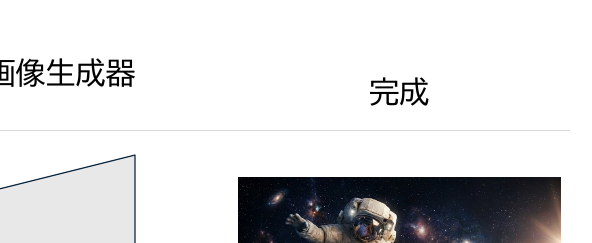
Geminiで作成

<b>中身① Transformer</b> 　単語の関係性を読み解き、解析する。特に、絵の構造や意味を見出す <b>中身② CLIPなど</b>　単語をAIが絵を書くためのベクトルに翻訳

<b>中身① Diffusion model</b> 　ノイズから画像を作る”逆”拡散過程 <b>中身② GAN (敵対的生成ネットワーク)</b>　生成器と識別器を戦わせよりよい画像に　※ 潜在拡散モデル etc…

<b>参考文献:</b> 本田志温「画像生成AIのしくみ-AIに言葉を理解させる技術」<i>Software Design</i> (2023) https://gihyo.jp/article/2023/03/how-ai-image-generator-work-01

<!--
- 絵を作るAIの端的な仕組み。text-to-imageでは、テキストを部品①でベクトルに変換し（TransformerやCLIP）、部品②の画像生成器（DiffusionやGAN）で画像を作ります。
-->

---

絵を作るAIの概要

# 絵を作るAIの概要要素技術になったもの

<b>CLIP by OpenAI (2021)</b>

Contrastive Language–Image Pre-training　／　テキストと画像をコネクトする深層学習モデル

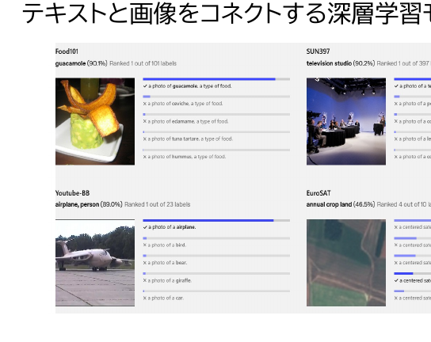

<b>一般的な視覚データセットは労働集約的で、作成費用が高額</b>　ImageNet →22,000の物体カテゴリーの1,400万点の画像に25,000人以上の作業者でアノテーション <b>そこで、インターネット上で得られた画像とテキストの組み合わせで学習</b>

https://openai.com/ja-JP/index/clip/　Radford et al., 2021

<b>拡散モデル (2021)</b>

Denoising diffusion probabilistic models　／　拡散確率モデルを用いた画像合成モデル

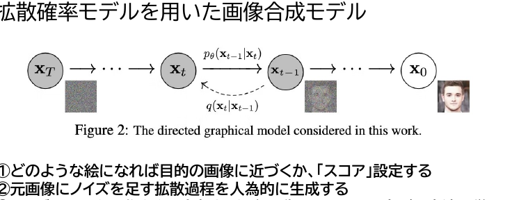

<b>①どのような絵になれば目的の画像に近づくか、「スコア」設定する</b> <b>②元画像にノイズを足す拡散過程を人為的に生成する</b> <b>③ノイズをのせた画像から、除去する過程を復元しスコアを上げる方法を学習</b>

参考：https://ja.stateofaiguides.com/20221012-stable-diffusion/　Ho et al., 2020 ※とても難しい／その他、Stable Diffusionの中核、潜在拡散モデルなど LDM (latent diffusion model, Rombach et al., 2021)　— 様々な工夫の上で、絵ができている

<!--
- 要素技術になったのがCLIPと拡散モデル。CLIPはネット上の画像とテキストの組で学習し、テキストと画像を結びつけます。拡散モデルはノイズを足して除去する過程を学ぶことで画像を合成します。
-->

---

絵/グラフを作るAIと研究倫理

# 絵/グラフを作るAIと研究倫理

<b>注意：</b>今回の内容は<b>いま現在</b>、<b>研究ポリシーやレポート作成の観点ではアウトな場合</b>があります

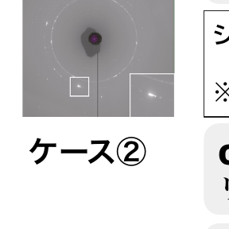

①

<b>ケース①</b>　生成AIで画像を作成・修正した ※AIに関する研究など、例外を除く → <b>多くの論文誌で禁止行為or許可必要</b>

②

<b>ケース②</b>　Canvas機能で作図した / リンクを生成しダウンロードした → <b>幾つかの論文誌で禁止行為or許可必要</b>（記載が必要な例：Science）

③

<b>ケース③</b>　ExcelのグラフをreplotするためPythonのコードを出力した → <b>ケースバイケース (追いついていない)</b>　明示必須もありえる

<b>シナリオ例：”</b>XRDのDebye-Scherrer ringのコントラストを変えて/キャプションつけて” → <b>一発でfalsification(改ざん)</b>になる可能性がある。※ なお、左の絵は、Tagawa et al. (2022 JGR)にある、<b>きちんとした画像</b>です。／厳しい例：PNASのポリシー（AI tools for creating images or graphics may not be used unless the software is the subject of the work…）

<b>学生の皆様が研究以外の仕事で使うこともあるので、知っておくことは重要かも...</b>　→ 生成AIの使用目的を考えて、つきあうことが重要 / 分野特性を確認しましょう

<!--
- 絵やグラフを作るAIは、研究倫理上アウトな場合があります。生成AIで画像を作る・修正するのは多くの論文誌で禁止か要許可。改ざんに直結することもあるので、分野特性を確認することが重要です。
-->

---

絵を作るAIの概要

# 絵を作るAIの概要よく知られている課題感

使用者スキル

① <b>プロンプトがとても複雑 (呪文)</b>　内容・被写体・特徴・範囲+背景+画風+品質 × ポジティブ・ネガティブ × モデル選択

技術的課題

② <b>文字が書けない</b> → よくわからない文字?になる（nano banana通常版での「落花生」の作図結果。<b>そもそも、内容もハルシネーションしているけど…</b>）

③ <b>構図やアイデンティティが一貫しない</b>　例：同じキャラクターで書いて、って言ったのに…

倫理的課題

④ <b>バイアスで偏る / 知識がない</b>　例：CEOとかいたら…?　「日本人」で和服?　例：最高裁判事の1980年の様子を書いて？

⑤ <b>著作権の課題、画風の課題</b>

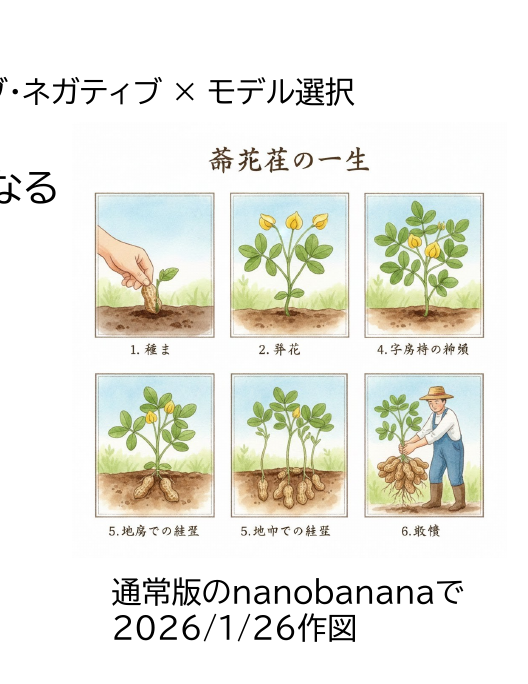

通常版のnanobananaで 2026/1/26作図

<!--
- よく知られた課題感。使用者スキルとしてプロンプトが複雑なこと、技術的には文字が書けない・構図が一貫しないこと、倫理的にはバイアスや著作権の課題があります。右は落花生の作図結果で、文字も内容もおかしくなっています。
-->

---

絵を作るAIの概要

# 絵を作るAIの概要Geminiで使える絵を描くAI

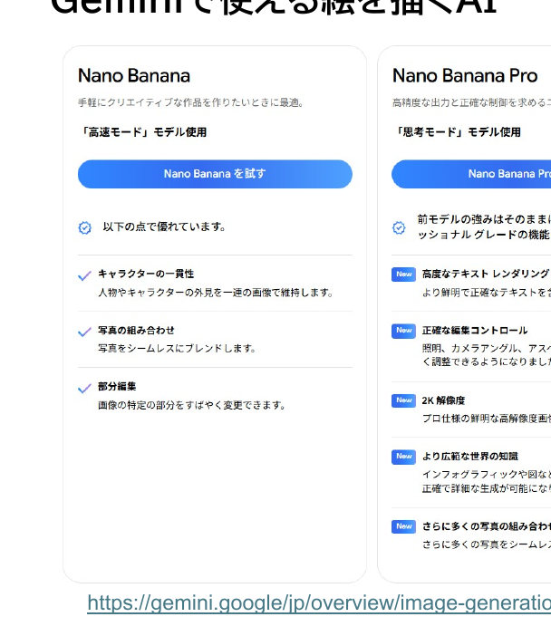

①

<b>プロンプトが比較的容易に</b> 　※良いプロンプトを作れば、もちろん良くなる　※絵も、写真も可能

②

<b>Pro版では、文字がある程度正確</b> 　※無料アカウントでは一日の回数制限があり　※思考モードを使用する

③

<b>構図やアイデンティティの一貫性</b> 　部分修正も、スタイル変更も可能

※ <b>権利上は比較的安全ではある</b>　生成されたものは、Googleは権利は保証しない。学校アカウント(EduPlus)では Shared fate → <b>侵害と認められた時は、Googleが補償</b>（例外：著作物に似せる指示をした場合等）

<b>Arena順位：</b>　作図部門 2位 / 図編集部門 2位 (2026/2/2)　https://gemini.google/jp/overview/image-generation/?hl=ja-JP

<!--
- Geminiで使える絵を描くAI（Nano Banana / Nano Banana Pro）。プロンプトが比較的容易になり、Pro版では文字もある程度正確、構図の一貫性も保てます。権利上も比較的安全で、Arena順位も作図・図編集とも2位です。
-->

---

作図機能の例

# じゃあ、どのくらいまでかけるものなのか？

圧巻の風景写真を作成したいです。北極の空を静かに飛ぶ旅客機を横から眺め、後ろにはオーロラが見えるような、景色を写実感のある写真として出して下さい。高度は高く、地上は小さく、暗闇の中を光るのは飛行機の窓とオーロラだけ。飛行機を横からみた構図にして下さい。写真は正方形にして下さい。

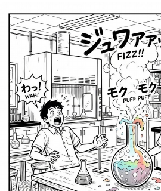
高校の化学の実験を生徒がモチベーションがあがるような、楽しそうな絵を生成して下さい。化学実験室の机にフラスコがあって、反応が進んで生徒2-3人驚いている感じで。但し、現実的な実験の様子にして下さい。漫画な感じで、効果音も文字で書いてほしい。吹き出しは使ってはだめです。白黒の線画にして下さい。図は正方形で、明るい感じ。

絵の目的を伝える／内容を具体化し、明示する／「ある」ものを明示する※ないものを明示するのは後／図の縦横比を指定する／構図を指定する／一発で作らず、反復する

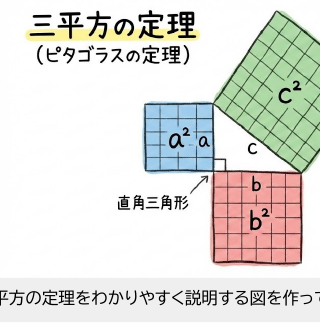

もちろん間違える時もあります。 
<b>三平方の定理をわかりやすく説明する図を作って。</b> 
cf. ピタゴラス数： 3, 4, 5 / 5,12,13…

他の様々なプロンプト例は、Geminiチームの例を参照： https://note.com/google_gemini/n/nbe404b055d37　／　※全てGemini + nanobanana Proで2022.2.2に作成

<!--
- どこまで描けるのか。風景写真、漫画、図解と幅広く対応できる。
- 目的を伝え、内容を具体化し、縦横比・構図を指定し、反復するのがコツ。
- 三平方の定理のように、もちろん間違える時もある。
-->

---

編集機能の例

# 編集機能の例

①写真(的なもの)を絵に変換する

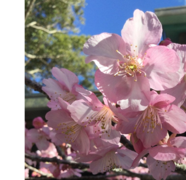
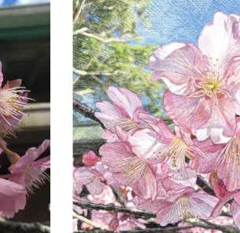

全く同じ構図で、色鉛筆で書いたイラストにして下さい。

②消しゴムマジック/微修正する

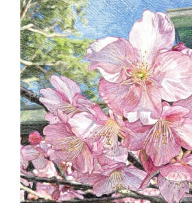
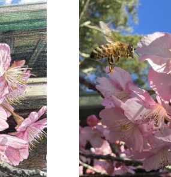

下側に見切れている花の房だけを削除し、補完して下さい。／1匹のミツバチが左上から飛んできたような写真にできませんか。花のサイズは3cmほどです。

ここらへんの修正は、非常に上手ではあります

※教員は、Adobe Creative Cloud上のFireflyも使用可能です

<!--
- 写真を絵に変換、消しゴムマジックや微修正など、編集機能は非常に上手。
- ミツバチを足すような対象の追加もできる。教員はFireflyも使える。
-->

---

編集機能の例

# 編集機能の例

③構図を変える

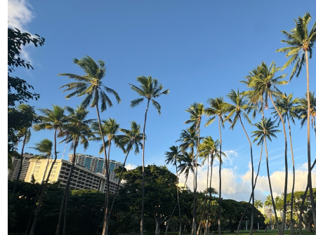

空から撮ったような写真にして 
どうやら、場所も認識したようですが、実際とは左右逆でした。 
(なお、Googleからは、平面図から立体を出すデモが提供されていました。)

ここらへんの修正は、非常に上手ではあります

<!--
- 構図を変える編集。「空から撮ったような写真にして」で視点変換ができる。
- 場所も認識したが実際とは左右逆だった。平面図から立体を出すデモもあった。
-->

---

編集機能の例

# 編集機能の例

④スタイルを変える

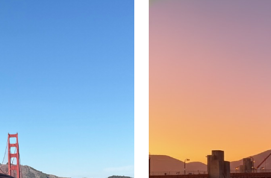

夕焼けにして下さい 
その他、家具を入れて下さい、とかもできますし。

ここらへんの修正は、非常に上手ではあります

<!--
- スタイル変更。「夕焼けにして下さい」で雰囲気を変えられる。
- 家具を入れる、といった要素追加も可能。
-->

---

文字を含む編集機能の例

# 文字を含む編集機能の例

⑤伝えたいことを漫画にする

大学院生に対して、論文作成の際に、AI利用のポリシーを知っている重要性を示す4コママンガを淡い色のカラーで作って下さい。①「AI便利だーすげー。」②「論文もAIで書かせちゃおう。ぽち。」③いかにも博士な人がでてきて、「この行為はだめじゃぞ。ポリシーを確認！」という。④学生はそうなんだ！、という。4コマ目の下に、研究倫理とAI利用ポリシーはきちんと守ろうと書く。

⑥教材用に解説を書き込んでもらう

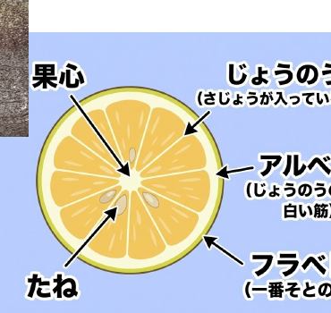

みかんの断面について、生徒に分かりやすいように、写真をイラストにした上で、見やすい色の文字で、果心、さじょう、じょうのう(さじょうが入っている薄皮)、アルベド(じょうのうの外の白い筋)、フラベド(一番そとの皮)、たねを明示して下さい。二箇所に示す必要はありません。

※イラストまでして、絵と矢印は、自分で加筆したほうが早い。

※教員は、Adobe Creative Cloud上のFireflyも使用可能です

<!--
- 文字を含む編集。4コマ漫画で伝えたいことを表現できる。
- 教材用に解説を書き込んでもらうこともできるが、矢印などは自分で加筆したほうが早い。
-->

---

可視化/思考用グラフの作成

# 可視化/思考用グラフの作成

グラフの作成は、<b>絵として書かせない</b>ことがおすすめ 
　→ 細部まで正しいことが保証できない/論文作成でも禁止事項 
　→ 探索用にコードを書かせる + その出力を練習する

Gemini ＋ Canvas　注意！

① Canvas機能のChart.jsで、作成してもらう ※インタラクティブなhtmlで書いてもらう

② Canvas機能に<b>ECchart指定</b>で、作成してもらう ※インタラクティブな図がかける

Gemini ＋ 外部ツール

③ matplotlibで利用可能なpythonコードを書いてもらう → Google colabやローカルで作図

④ Mermaid Live Editor等で使えるmarkdownを書いてもらう → ※クラウドで作成する場合には、機密情報に注意

⑤ svgを作ってもらう／⑥ その他、分析ツールやイラストツールを使用する等

<!--
- グラフは絵として書かせず、コードを書かせて出力を練習するのがおすすめ。
- Gemini+Canvasでchart.jsやEChart、外部ツールでmatplotlibやMermaidも使える。
-->

---

作成フロー

# 生成AIでグラフを書く場合の検討フロー

要素指定

⇒

グラフのタイプ

平面/立体

⇒

Canvas / Python / 外部

Mermaidで作成（この絵の作成方法）

<b>図の要素を指定する</b> (matplotlibやExcelが使える人は、プロパティをイメージ) 
① Figure：グラフ全体の「キャンバス」　② Axes：実際にデータが描画される「グラフ領域」 
　※1つのFigureの中に、複数Axesを配置可能 
② Axesのタイプ：どんな形状のグラフなのか (棒グラフ、円グラフetc) 
③ グラフの構成要素を説明する

<table style="font-size:18px; margin-top:8px; width:calc(100% - var(--pip-w));">
<tr><th>要素名</th><th>説明</th></tr>
<tr><td>Title</td><td>グラフ上部に表示されるタイトル。</td></tr>
<tr><td>X-axis / Y-axis</td><td>横軸と縦軸。</td></tr>
<tr><td>X/Y label</td><td>各軸が何を表しているかを示す説明テキスト。</td></tr>
<tr><td>Handle / Legend</td><td>各データ系列（線や色）の状態、並びに何を意味するかを示すリスト。</td></tr>
<tr><td>Grid</td><td>背景に引かれる補助線。メモリも外向き・内向き・主/副がある</td></tr>
<tr><td>Spines</td><td>グラフ領域を囲む4本の境界線。上下左右で個別に表示を切り替えられる。</td></tr>
</table>

<!--
- グラフを書く際の検討フロー。要素を指定し、グラフのタイプを決め、ツールを選ぶ。
- Figure/Axes、Title/軸/凡例/Grid/Spinesといった構成要素を理解しておくと指示が正確になる。
-->

---

EChartでの作図例

# EChartでの作図例

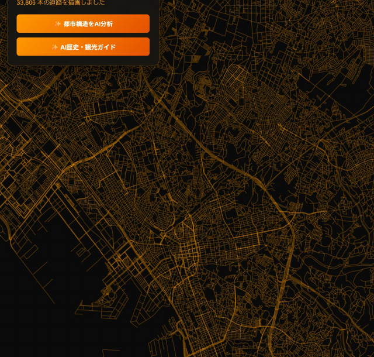

OpenStreetMap contributors / OObL

◀ 千葉市内の車線データをもとに、EC chartでGeminiが作成した図 
　※ODbL ライセンスで提供

かなり複雑な絵も作成可能／インタラクティブに動く (例：フィルタ機能)／Gemini機能と統合できる

AI作図 × 公開データは、結構、革命的　cf. 探索的データ分析

<b>可視化し、情報の繋がりを手元で整理できることは、大きな価値である。</b> 
Appachで作図できるデモ一覧表 https://echarts.apache.org/examples/en/index.html　／　matplotlibで作図できる一覧表 https://matplotlib.org/stable/gallery/index.html

<!--
- EChartの作図例。千葉市の車線データをGeminiがECchartで可視化した。
- 複雑でインタラクティブな図が作れ、公開データとの組み合わせは探索的データ分析として革命的。
-->

---

Session 1の目的・到達目標

# 振り返り

<b>Session 1：</b>　講義： AIで絵・グラフを書く方法

目的

講義： AIで絵・グラフを書く方法

目標 ＋ まとめ

・絵を書く生成系AIの仕組みを理解する　GAN→拡散モデル 
・絵を書く方法と限界を把握する　nanobanana (文字が扱えるようになった !) 
　構図処理、漫画、画風、絵の修正 
・グラフの書き方を知る　Canvas + デフォルト、ECchart、Mermaid 
　Matplot lib+Google Colab

<!--
- Session 1の振り返り。AIで絵・グラフを書く方法を講義した。
- 仕組み(GAN→拡散モデル)、方法と限界(nanobanana)、グラフの書き方(Canvas/ECchart/Mermaid/matplotlib)。
-->

---

<!-- _class: cover-hero -->

2025年度 第4回： AIで絵・グラフを書いてみる

生成AI体験ワークショップ

15-min × 3 sessions

<b>Session 2：</b>　AIで絵やグラフを書いてみる

国際未来教育基幹 田川 翔

<!--
- Session 2に入ります。実際にAIで絵やグラフを書いてみましょう。
-->

---

いざ、実践

# 何をするか？：みんなで絵・グラフの作品集を作ります

① 絵かグラフを、<b>Geminiや関連ツール</b>を用いて書いてみましょう。 注意：機密情報や著作物を含むデータは使用しないこと

② <b>Google Slide</b>に貼り付け共有して下さい。<b>(名前・顔写真・機密情報不可)</b> 1枚あたり、2-4作品ずつ。新規にページを作ってもOKです！　掲示にあたり公序良俗と著作権を意識して下さい。

③ 完了後、時間が余った場合には、別の作品を作ってみて下さい。

<b>画像を作る</b>→🍌を選ぶ 
<b>グラフを作る</b>→Canvasを選ぶ 
or Pythonコードを出力する 
→ 必要に応じて、Google colabを使う

オンラインの方：困ったらSlidoに質問を送って下さい！／余裕がある方： Slidoに返信してあげてください。／会場の方：困ったら、手を上げてTAやペアに聞いて下さい。

<!--
- いざ実践。みんなで絵・グラフの作品集を作ります。
- Geminiで作ってGoogle Slideに共有。個人情報や著作物は使わないこと。
-->

---

ライブデモを実施します！

# ライブデモを実施します！

シナリオ： <b>オープンデータの可視化</b> 
「ECchartで作図して」と、キャンバス設定したうえで記入する。

オープンデータの例 リンク　<b>10年前のスマホ普及率</b> 
https://www.e-stat.go.jp/

シナリオ： <b>研究を理解する上での作図</b> 
<b>①準備</b>　データ線のcsvとグラフは作成済／目的は、超高圧・高温の圧縮挙動の明示 
<b>②プロンプト</b>　内まち、サイズ・縦横比は元図に従う、英語／横軸は、Pressure (GPa)・0-350／縦軸は、Temperature (K) 500-7000 
<b>③反復作成なので、matplotlibで作成</b>　作図には、Google Colabで出力

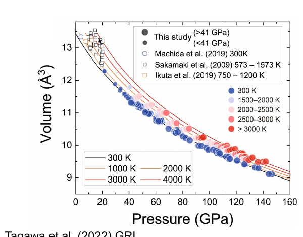

Tagawa et al. (2022) GRL

先に述べたように、直接論文に使用可能かは別問題なので要注意

<!--
- ライブデモ。オープンデータの可視化と、研究を理解する上での作図の2シナリオ。
- e-statのスマホ普及率や、超高圧の圧縮挙動グラフをmatplotlibで反復作成する例。
- 直接論文に使えるかは別問題なので要注意。
-->

---

Session 2の目的・到達目標

# 振り返り

目的

<b style="font-size:30px;">Session 2：</b> AIで絵やグラフを書いてみる

目標 ＋ まとめ

- nanobananaで絵を書くことができた
- canvasでグラフを書くことができた
- 様々な出力が可能なことを理解した

<!--
- Session 2の振り返り。目的は「AIで絵やグラフを書いてみる」こと。
- 目標とまとめ：nanobananaで絵が書けた、canvasでグラフが書けた、様々な出力が可能なことを理解した、の3点。
-->

---

<!-- _class: cover-hero -->

生成AI体験 ワークショップ

2025年度 第4回： AIで絵・グラフを書いてみる

15-min × 3 sessions

<b style="font-size:30px;">Session 3：</b> 議論：気づきのシェア &amp; 振り返り

国際未来教育基幹　田川 翔

<!--
- Session 3の扉。ここからは議論・座談会で、気づきのシェアと振り返りを行います。
-->

---

Session 3の進め方

# 議論・座談会

- 実際に使ってみて、ユースケース別に<b>「上手くいった点」「イマイチな点」「上手く行かなかった点」</b>を教えて下さい。
- <b>大学の中で諸活動の中で、絵・グラフの作成が便利そうなユースケースや絶対NGの範囲</b>を提案して下さい。
- 今日面白かったこと、気付きは何でしたか。

Slidoで進めます

スマホから

PCから

方法1　Google検索「Slido」→コード入力　<b>ALC-AI1-04</b>

方法2　直接リンク

https://app.sli.do/event/pwnuuMARudJHpYZPs4oQvk

<b>お願い：協力的な場作りが、学びの秘訣です。</b> 敬意をもって、忌憚なく、建設的に、話し合いましょう

<!--
- Session 3の進め方。Slidoで進めます。スマホはQRから、PCはコード ALC-AI1-04 か直接リンクで。
- 3つの問い：ユースケース別の上手くいった点／イマイチな点／上手く行かなかった点、便利そうなユースケースと絶対NGの範囲、今日面白かったこと・気付き。
- お願い：協力的な場作りが学びの秘訣。敬意をもって、忌憚なく、建設的に。
-->

---

次回告知

# 生成AI体験ワークショップ

2025年度 第5回： 外部講師特別回 2/10 <b style="color:var(--accent-dark); font-size:27px;">AIとクラウドで起きる変化を俯瞰する</b>

1) なぜ、AI(機械学習、特に生成AI)とクラウドはこれからの仕事に影響するのか。
2) 生成AIやPaaS/iPaaSは、大学にどのような利点があるのか。
3) 手元でイノベーションを作れる時代において、AI/クラウドを学び試す必要性とは？

<b>ゲスト： 橋口 剛 氏　ブログ</b>　経済学部卒業後、日本IBM、ゆめみ、アクセンチュア、ウイングアークにてエンジニア、コンサル、営業職を経験。2011年Googleに技術営業として入社、執行役員営業本部長、執行役員AI事業本部長を歴任。2025年5月にArty Intelligence Lab. を設立。AIを自動化だけでなく、創造性を解き放つ道具と捉え、業務実施中。教育テック大学院大学の特任教授も務める。

<!--
- 次回告知。第5回は外部講師特別回（2/10）「AIとクラウドで起きる変化を俯瞰する」。
- ゲストは橋口 剛 氏。日本IBM・Google等を経てArty Intelligence Lab.を設立。
-->
