<!-- _class: cover-hero -->

生成AI体験 ワークショップ

2025年度 第5回： AIとクラウドで起きる変化を俯瞰する

45-min × 1 sessions

<b>事前知識：</b> クラウドとAIの用語集 参考文献： Google Skills CDLコース <a href="#">リンク</a>

国際未来教育基幹　田川 翔

---

クラウドとは

# クラウドは「IT部門の課題」ではない

リーダーが持つべき認識とは

Vint Cerf VP &amp; Chief Internet Evangelist, Google

“クラウドの仕組みの詳細を理解する必要はありませんが、クラウドで何ができるのか（capability）、それがビジネスにどのような変革をもたらすのかを認識すべきです。”

誤解

<b>誤解 (Misconception)</b>　技術的なスキルが必要、ビジネス変革は可能であるという考え。

現実

<b>現実 (Reality)</b>　新しい技術が企業の構造にどう貢献するかをリーダーが概念的に把握していなければ、効果的なリスクになる。

スキルの確保：現代のクラウドが提供するコンピューティング容量とデータストレージ、信頼の置ける安全なレベルを適切に管理することができれば、「現実」を利用できるかが勝負の分かれ目になる。

---

DXとは

# デジタル トランスフォーメーション（DX）とは

① DXの<b>定義</b>

組織が各クラウドプラットフォームなどの新しいデジタルテクノロジーを使用し、<b>ビジネスプロセス・企業文化・カスタマーエクスペリエンスを生み出し変えること</b>で、ビジネスと市場のダイナミクスの変化に対応すること

② DXの<b>目的</b>

イノベーションの推進、新たな価値・サービス・収益源の創出、リソースの適切な配分、市場とユーザーのニーズの変化への迅速な対応

③ DXのキークエスチョン：<b>変わらないために変わり続ける</b>

「どのように（How）」事業を行うかではなく、<b>「なぜ（Why）」自分たちは存在するのか（組織の使命）に焦点を当てる</b>ことで、テクノロジーの変化を「脅威」ではなく「機会」として捉え、柔軟に変革し続けることができる

---

DXとは：ケーススタディ

# 「How」に固執するか、「Why」を見据えるか：任天堂と百科事典の教訓

任天堂 (Nintendo)

<ul>
<li><b>起源</b>： 1889年、花札（印刷技術の産物）から開始。</li>
<li><b>哲学</b>：「Why（なぜ存在するのか）」＝ 人々に遊びを提供。</li>
<li><b>進化</b>：トランプ → 玩具 → 電子ゲーム → ポケモンGO → クラウドゲーム（Switch）。</li>
<li><b>結果</b>：テクノロジーが変わるたびに適応し、市場を拡大。</li>
</ul>

百科事典出版社 (Encyclopedia Publishers)

<ul>
<li><b>起源</b>：印刷技術による知識の集積。</li>
<li><b>哲学</b>：「How（どう作るか）」＝ 重厚な書籍セットの販売。印刷物販売モデルに固執。</li>
<li><b>結果</b>：CD-ROMやインターネットの登場を「脅威」と認識。</li>
<li><b>結果</b>：Wikipediaやオンライン検索に取って代わられる。</li>
</ul>

<b>Takeaway</b>　DXの本質は、新しいツールを使って「なぜ自分が存在するのか」という使命を再定義し続けることにある。

---

DXとは

# インフラ・クラウドのタイプ

クラウドインターネット経由で利用でき、情報の保存や演算ができるデータセンターのネットワーク

構成についての分類

分類

<b>オンプレミス</b>　自社データセンター内で独自ニーズに合わせて運用 ／ 調達に数か月、スペース・電力・冷却・専門スタッフが必要

<b>プライベート クラウド</b>　1組織が占有するクラウド環境 ／ セルフサービス・スケーラビリティのメリットあり

<b>パブリック クラウド</b>　Google Cloudなどのプロバイダが管理 ／ 複数テナントで共有、使った分だけ支払い

<b>ハイブリッド / マルチクラウド</b>　複数の環境を組み合わせ (GCP/AWS/MS Azure) ／ 89%の組織がマルチクラウド戦略（Flexera 2022）　Anthos GKE enterprise

利点

スケーラビリティ 柔軟性 アジリティ 戦略的価値 セキュリティ 費用対効果

---

クラウドをめぐるパラダイム

# クラウドをめぐるパラダイム

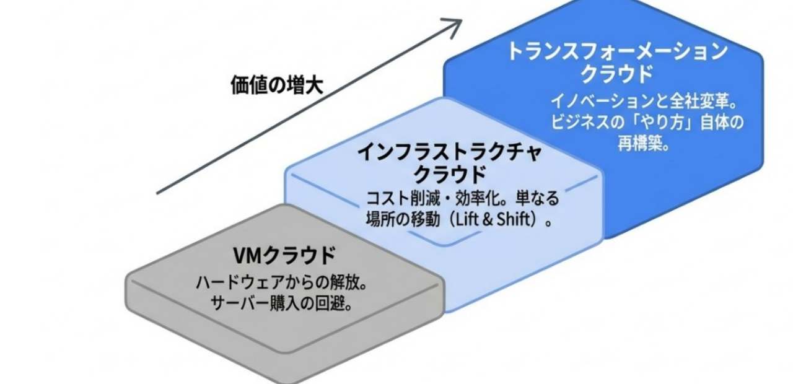

<b>コンピューティングリソースの移行から、働き方の移行へ</b>

---

サービスモデル

# サービスモデルの選択： 抽象化度と責任の違い

<table style="width:1080px; margin:2px auto 0; border-collapse:collapse; font-size:21px; text-align:center; line-height:1.25;">
<tr style="background:var(--section-bg);">
<th style="padding:6px 10px; width:120px;"></th>
<th style="padding:6px 10px;">自家用車 <b>オンプレミス</b></th>
<th style="padding:6px 10px;">レンタカー <b>IaaS</b></th>
<th style="padding:6px 10px;">タクシー <b>PaaS</b></th>
<th style="padding:6px 10px;">バス <b>SaaS</b></th>
</tr>
<tr><td style="padding:3px; font-weight:800;">保有</td><td>自分</td><td style="color:var(--accent);">会社</td><td style="color:var(--accent);">会社</td><td style="color:var(--accent);">会社</td></tr>
<tr style="background:var(--section-bg);"><td style="padding:3px; font-weight:800;">運転</td><td>自分</td><td>自分</td><td style="color:var(--accent);">会社</td><td style="color:var(--accent);">会社</td></tr>
<tr><td style="padding:3px; font-weight:800;">行き先</td><td>自由</td><td>自由</td><td>自由</td><td style="color:var(--accent);">固定</td></tr>
<tr style="background:var(--section-bg);"><td style="padding:3px; font-weight:800;">例</td><td>(何でも)</td><td><b>Compute Engine</b> <b>Cloud Strage</b></td><td><b>Cloud Run</b> <b>Big Query</b> <b>Vertex AI</b></td><td><b>Gmail</b> <b>Google Drive</b> <b>Gemini</b></td></tr>
</table>

---

サービスモデル

# 責任共有モデル

<table style="width:100%; border-collapse:collapse; font-size:23px; text-align:center;">
<tr><td style="width:110px; font-weight:800; padding:8px; text-align:right;">On-Prem</td><td style="background:#F2C94C; padding:12px; border-radius:6px;">顧客が全て管理</td></tr>
<tr><td style="font-weight:800; padding:8px; text-align:right;">IaaS</td><td style="padding:0;"><table style="width:100%; border-collapse:collapse;"><tr><td style="background:#F2C94C; padding:12px; border-radius:6px 0 0 6px; width:45%;">データ、アプリ、OS</td><td style="background:#2D9CDB; color:#fff; padding:12px; border-radius:0 6px 6px 0;">ハードウェア、ネットワーク</td></tr></table></td></tr>
<tr><td style="font-weight:800; padding:8px; text-align:right;">PaaS</td><td style="padding:0;"><table style="width:100%; border-collapse:collapse;"><tr><td style="background:#F2C94C; padding:12px; border-radius:6px 0 0 6px; width:28%;">データ、アプリ</td><td style="background:#2D9CDB; color:#fff; padding:12px; border-radius:0 6px 6px 0;">OS、ネットワーク、ハードウェア</td></tr></table></td></tr>
<tr><td style="font-weight:800; padding:8px; text-align:right;">SaaS</td><td style="padding:0;"><table style="width:100%; border-collapse:collapse;"><tr><td style="background:#F2C94C; padding:12px; border-radius:6px 0 0 6px; width:18%;">データ、 アクセス</td><td style="background:#2D9CDB; color:#fff; padding:12px; border-radius:0 6px 6px 0;">アプリ、OS、ネットワーク、ハードウェア</td></tr></table></td></tr>
</table>

データとアクセスの管理は、常に顧客の責任。

⚠️ 「セキュリティ事故の99%はユーザーエラーに起因する」 (Gartner)

---

コンピューティングリソース

# コンピューティングリソース

サーバー/VM

Compute Engine Bare Metal Solution 仮想マシンを作成・実行するIaaSプロダクト

<b>継続割引・確約割引可能</b> <b>プリエンプティブル VM/Spot VM</b>

コンテナ

Cloud run　コンテナ化されたアプリを実行する仕組み Kubernetes (K8s)：デプロイ・スケーリング・コンテナ管理の規格 (標準) GKE autopilot GKE enterprise

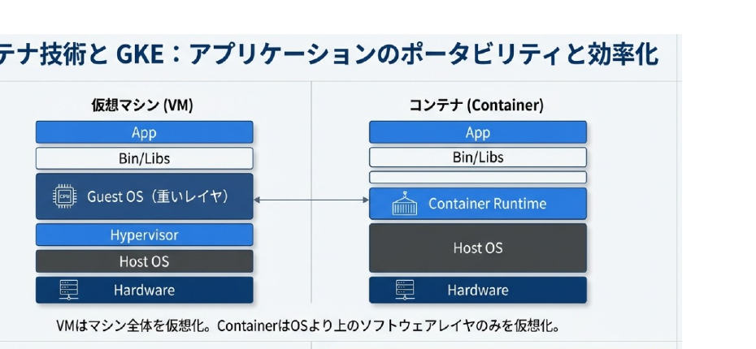

---

コンピューティングリソース

# コンピューティングリソース

コンテナ以外の　サーバーレス

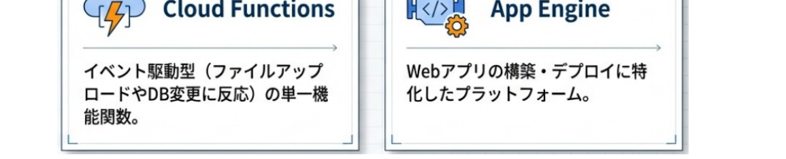

<b>サーバーレス：</b>インフラのプロビジョニングや管理が完全に自動化されている状態。デマンドの調整などで便利

セキュリティ

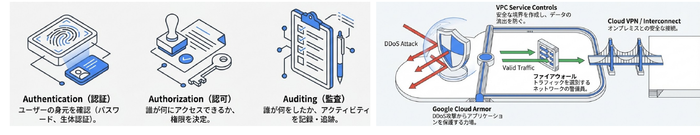

---

データベース

# データベース、データウェアハウス、データレイクの役割の違い

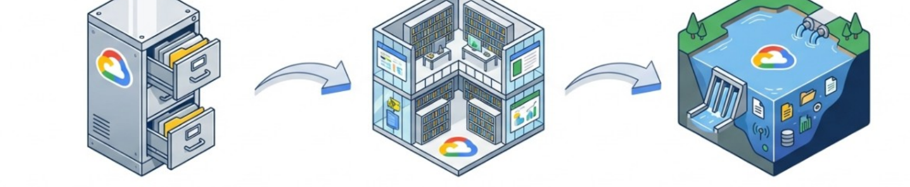

データベース (Database)

<ul>
<li><b>目的</b>：データの保存・収集・管理（日常業務）</li>
<li><b>タイプ</b>：リレーショナル (SQL) vs 非リレーショナル (NoSQL)</li>
<li><b>特徴</b>：トランザクション処理 (OLTP)</li>
</ul>

データウェアハウス (Data Warehouse)

<ul>
<li><b>目的</b>：データの分析（意思決定）</li>
<li><b>特徴</b>：構造化・整理済みデータ</li>
<li><b>用途</b>：ビジネスインテリジェンス (BI) に活用</li>
</ul>

データレイク (Data Lake)

<ul>
<li><b>目的</b>：元データのまま全量を保存・探索</li>
<li><b>特徴</b>：構造化・非構造化データ</li>
<li><b>用途</b>：データを加工して新たな価値、データサイエンティストが探索的に利用</li>
</ul>

---

データベース

# データベース

データベース

信頼性の高いトランザクション処理の選択肢

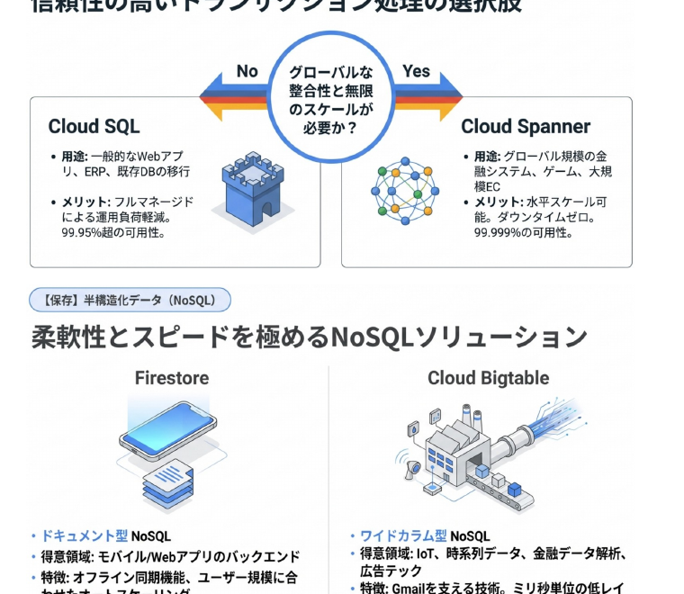

データウェアハウス

現代のデータウェアハウスとデータレイクの融合

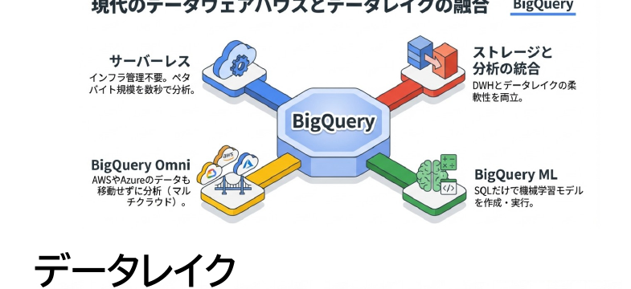

データレイク

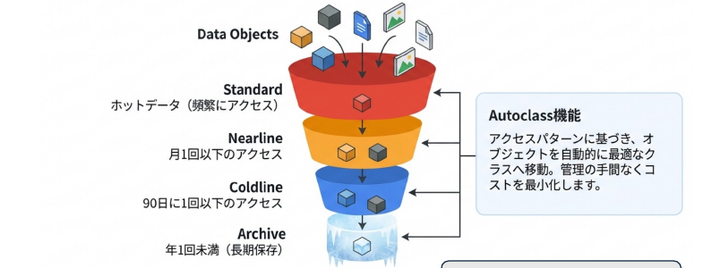

Cloud Strage

---

データバリューチェーン

# データの流れと品質　AI / ML

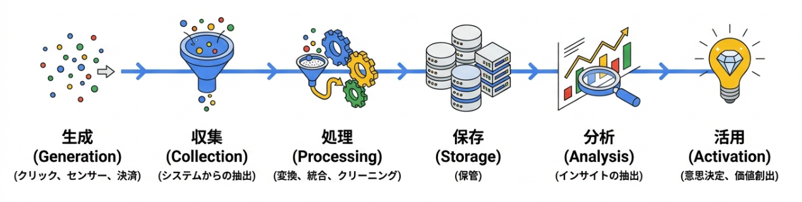

1. <b>完全性 (Completeness):</b> 欠損値がないこと　　2. <b>一意性 (Uniqueness):</b> 重複レコードがないこと 
3. <b>適時性 (Timeliness):</b> データが現状を反映していること　　4. <b>有効性 (Validity):</b> 定義された形式に従っていること 
5. <b>精度 (Accuracy):</b> 実態を正しく反映していること (例: 猫の 画像に「犬」とラベル付けしない) 
6. <b>整合性 (Consistency):</b> データセット全体で統一されていること

※ <b>ETL (抽出→保存)</b>に加えて、<b> ELT (保存→抽出)</b>もAIで拡大中

<!--
- データバリューチェーン。生成→収集→処理→保存→分析→活用の流れの各段で、6つのデータ品質（完全性・一意性・適時性・有効性・精度・整合性）が問われる。
- 従来のETL（抽出→保存）に加えて、AIによりELT（保存→抽出）が拡大している。
-->

---

分析の自動化

# BIがダッシュボード＋AI EDAへ

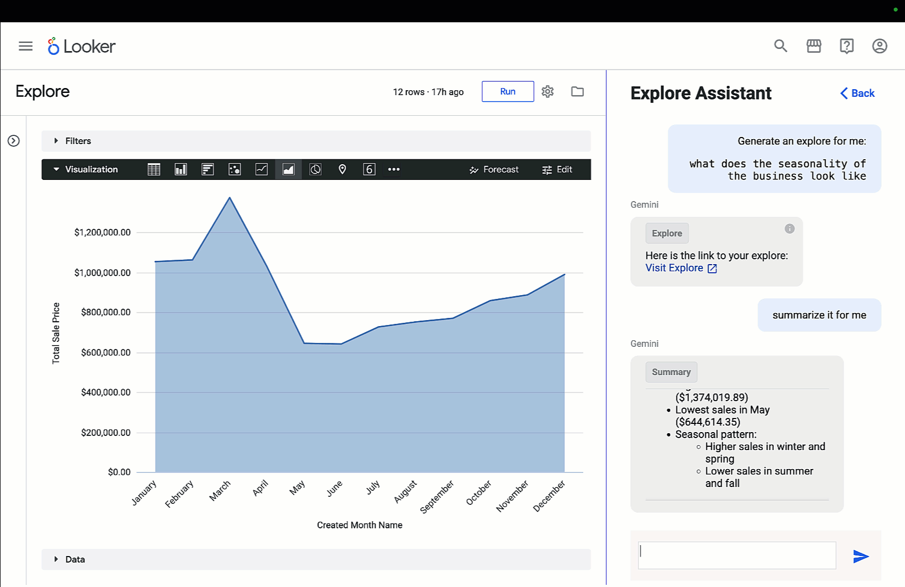

BIが <b style="color:var(--accent-dark)">ダッシュボード</b> ＋ <b style="color:var(--accent-dark)">AI EDA</b>へ

Looker で BigQuery の可能性を最大限に引き出す　<a>リンク</a>

<!--
- 分析の自動化。BIは静的なダッシュボードから、AIによる探索的データ分析（AI EDA）へと進化している。
- LookerではGeminiの「Explore Assistant」に自然言語で問いかけると、explore（分析）を生成し、結果を要約してくれる。
-->

---

データガバナンス

# 物理的な場所と法的管轄の制御

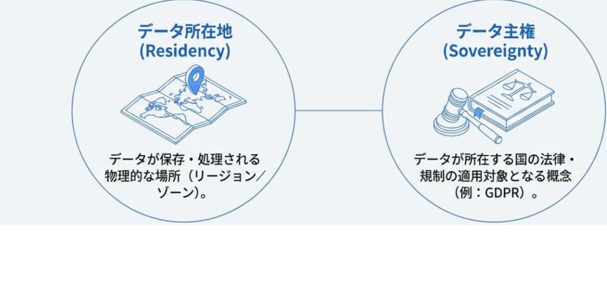

<!--
- データガバナンス。物理的な場所と法的管轄の制御という二つの観点がある。
- データ所在地（Residency）はデータが保存・処理される物理的な場所（リージョン／ゾーン）。データ主権（Sovereignty）はデータが所在する国の法律・規制の適用対象となる概念（例：GDPR）。
-->

---

iPaaSによる業務テンプレ化

# iPaaSによる業務テンプレ化

<b>Integration Platform as a Service</b>　異なるSaaSやオンプレミスシステムをクラウド上で連携・統合するサービス

これまで

できることが限られていた

これから
<ul style="margin:0 0 0 1.05em;"><li>生成AI活用で出来ることが多様化</li><li>生成AIで作り方のノウハウが民主化</li></ul>

<b>例：場所、現在の時刻、今日の24時間の天気</b>　／　普遍教育： 生成AI活用講座で実施中

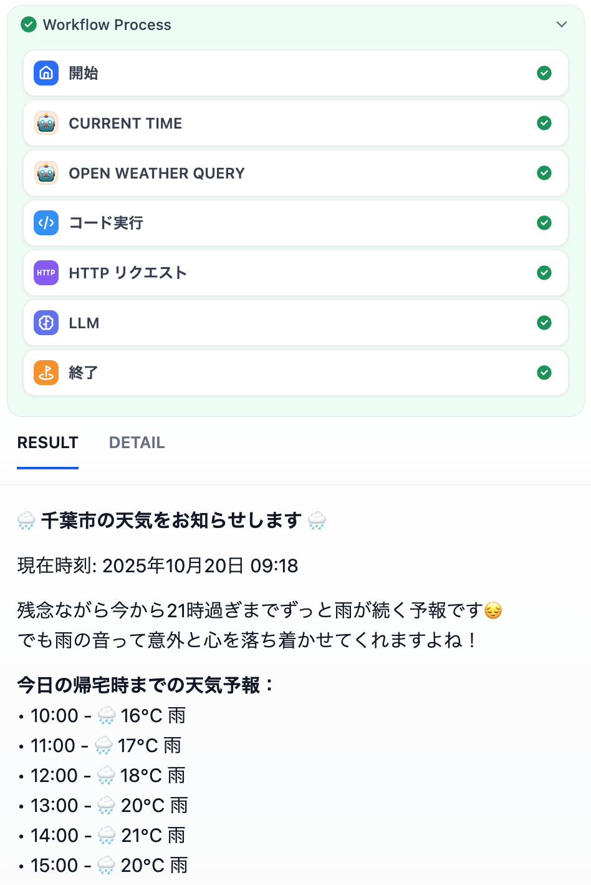

<b>Google Workspace Studio</b>が近日、利用可能に！　※ 来年は授業教材もDifyからGoogleへ移行

<!--
- iPaaS（Integration Platform as a Service）は、異なるSaaSやオンプレミスシステムをクラウド上で連携・統合するサービス。
- これまでできることが限られていたが、これからは生成AI活用で出来ることが多様化し、作り方のノウハウも民主化する。
- 例として「場所・現在の時刻・今日の24時間の天気」を返すワークフロー。普遍教育の生成AI活用講座で実施中。
- Google Workspace Studioが近日利用可能に。来年は授業教材もDifyからGoogleへ移行予定。
-->

---

クラウドの学び方

# クラウドの学び方

① やってみる <b>サンドボックス</b>

② 知識を持つ <b>Skills</b>

③ 資格も取る

Google公式で、<b>無料で学べ</b>、<b>格安で資格を取れる</b>プログラムがあります

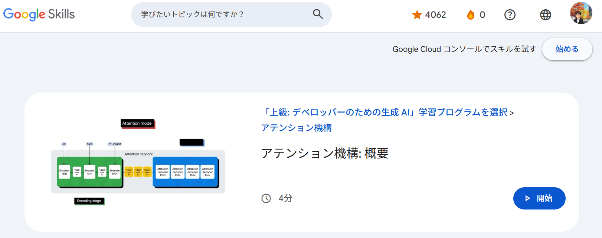

<!--
- クラウドの学び方は3段階。①やってみる（サンドボックス）、②知識を持つ（Skills）、③資格も取る。
- Google公式に、無料で学べて格安で資格を取れるプログラムがある。Cloud Digital Leader や Generative AI Leader といった認定資格を目指せる。
-->
