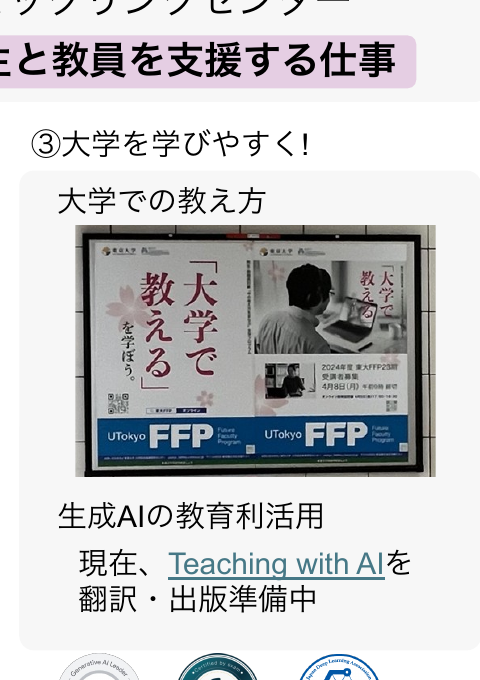
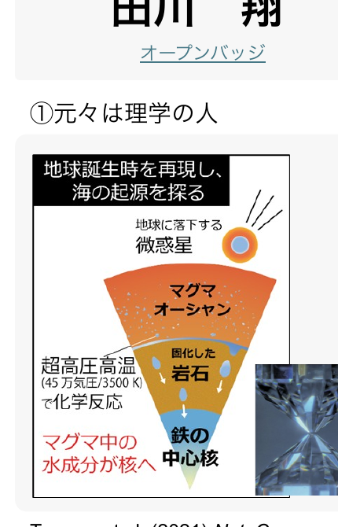
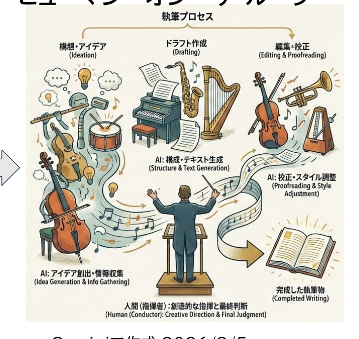
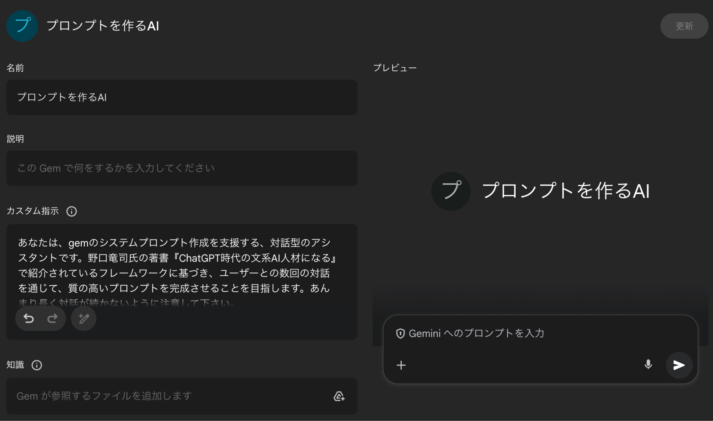
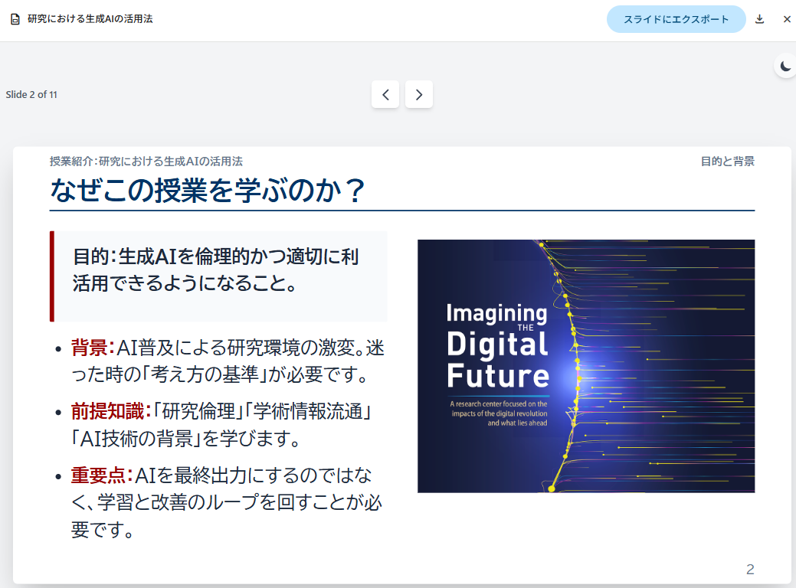
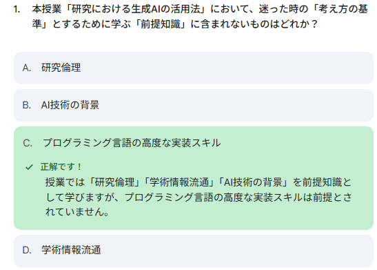

開始の前に

# 開始の前に

①<b> PCを立ち上げ、お持ちの千葉大学Google Workspaceにログインして下さい</b>

→ 学校のGmailが立ち上がる状況ならOKです。

②<b> インタラクションツール Slidoにアクセスして下さい</b>

URLを配布したり、質問やアンケートをとったりします

※お名前などの個人情報の入力は禁止です

スマホから

QRコードを読み取り

PCから

<b>方法1</b> Google検索「Slido」→コード入力 ALC-AI1-07

<b>方法2</b> 直接リンク https://app.sli.do/event/wcsBZoniBRtjFkCdhb1C4F

<!--
- 始める前に。①千葉大Google Workspaceにログイン、②Slidoにアクセス。個人情報は入力しないこと。
-->

---

<!-- _class: intro -->

講師紹介

たがわ　しょう田川　翔

所属：千葉大学 高等教育センター/アカデミックリンクセンター <b>大学教育を企画し、学生と教員を支援する仕事</b>

<h3>① 元々は理学の人</h3>

Tagawa et al. (2021) <i>Nat. Commun.</i>

<h3>② 色々な経験</h3>
<ul>
<li>大学のICT支援 (コロナ禍)</li>
<li>大規模オンライン授業の作成</li>
<li>民間企業での経験</li>
<li>AI×大学</li>
</ul>

<h3>③ 大学を学びやすく!</h3>
<ul>
<li>大学での教え方</li>
<li>生成AIの教育利活用</li>
<li>オープンバッジ</li>
</ul>

現在、<b>Teaching with AI</b>を翻訳・出版準備中

<!--
- 講師紹介。田川翔。高等教育センター／アカデミックリンクセンター所属。理学出身で、ICT支援・オンライン授業・民間経験を経て、いま大学を学びやすくする仕事をしている。
-->

---

<!-- _class: cover-hero -->

生成AI体験 ワークショップ

2025年度 第7回： 生成AIを使ってスライドを作ってみる

15-min × 3 sessions

国際未来教育基幹 田川 翔

<!--
- 第7回「生成AIを使ってスライドを作ってみる」。15分×3セッションで進めます。
-->

---

今回の構成

# 今回の構成

<table style="width:100%; border-collapse:separate; border-spacing:0 10px; font-size:24px;">
<tr>
<td style="width:140px; color:#666; font-size:21px;">最初の15分</td>
<td style="width:200px;">講義</td>
<td>- プレゼンテーションの様々な準備に生成AIを使う実践的方法を理解できる。</td>
</tr>
<tr>
<td style="color:#666; font-size:21px;">真ん中の15分</td>
<td>体験</td>
<td>- Canvas機能を応用し、プレゼンテーションを作成してみる。</td>
</tr>
<tr>
<td style="color:#666; font-size:21px;">最後の15分</td>
<td>議論・座談会</td>
<td>- 使用してみて気がついたこと (利点と限界) - CanvasやGemをどう活用したいですか。 - 今日面白かったこと、気付きは何でしたか。</td>
</tr>
</table>

<!--
- 今回は3部構成。最初の15分が講義、真ん中が体験、最後が議論・座談会です。
-->

---

<!-- _class: cover-hero -->

生成AI体験 ワークショップ

2025年度 第7回：生成AIを使ってスライドを作ってみる

15-min × 3 sessions

<b>Session 1：</b> 講義：生成AIを発表準備に使う際のアイデアを知る

国際未来教育基幹 田川 翔

<!--
- ここからSession 1。講義：生成AIを発表準備に使う際のアイデアを知る、を扱います。
-->

---

Session 1の目的・到達目標

# Session 1の目的・到達目標

目的

<b>Session 1：</b> 講義：生成AIを発表準備に使う際のアイデアを知る

目標

・ 作業フローにAIを活用する考え方を知る 
・ スライド作成に利用できる道具を知る 
・ 発表準備に使えそうな範囲 (現時点)

<!--
- Session 1の目的は「発表準備に使う際のアイデアを知る」。目標は、作業フローへのAI活用の考え方、利用できる道具、使えそうな範囲を知ること。
-->

---

今の最先端は？

# 今の最先端は？

スライド作成の自動化は、<b style="color:var(--accent);">1つのトレンド</b>になっている

<table style="width:100%; border-collapse:collapse; font-size:20px; line-height:1.45; margin-top:6px;">
<tr>
<td style="width:80px;"></td>
<td style="text-align:center; background:#444; color:#fff; font-weight:800; padding:5px; border-radius:6px 6px 0 0;">Chatパラダイム</td>
<td style="text-align:center; background:#444; color:#fff; font-weight:800; padding:5px; border-radius:6px 6px 0 0;">Toolパラダイム</td>
<td style="text-align:center; background:var(--accent); color:#fff; font-weight:800; padding:5px; border-radius:6px 6px 0 0; position:relative;">なうAgentパラダイム</td>
</tr>
<tr>
<td style="font-weight:700;">変化</td>
<td style="text-align:center; padding:6px;">AIと対話</td>
<td style="text-align:center; padding:6px;">AIが案・部品を作成</td>
<td style="text-align:center; padding:6px;">AIが作成を実行</td>
</tr>
<tr>
<td style="font-weight:700;">使い方</td>
<td style="background:#EAF2FB; padding:8px; text-align:center;">情報収集 DeepResearch 発表表現のアイデア出し 発表・資料作成のコツ 誤字・分かりにくい点の確認</td>
<td style="background:#EAF7EE; padding:8px; text-align:center;">スライドの案の作成 発表資料の図の生成 構成・原稿の作成支援</td>
<td style="background:var(--accent-soft); padding:8px; text-align:center;">対話によるスライドの完成 スライド自体の作り込み デザイン・表現の一貫性担保 作成ワークフローの実現</td>
</tr>
<tr>
<td style="font-weight:700;">例</td>
<td style="padding:6px;">こうしたらどうですか？ → 人は作成者</td>
<td style="padding:6px;">スライド案/図を作成する → 人は編集者 (“ガチャ”)</td>
<td style="padding:6px;">スライドを自然言語で指示する <b style="color:var(--accent);">→人とAIで協働作成</b></td>
</tr>
</table>

<b style="color:#8a4b00;">トレンド：</b> 2026年に入り、AIによる「補助」から<b>「自律的・協働的な生成」</b>へ <b style="color:#8a4b00;">限界：</b> 細かい修正や作成(例：スライドレベルの作成)はまだ難しい

<!--
- 最先端の整理。Chat（対話）→Tool（部品作成）→Agent（作成を実行）とパラダイムが移り、いまはAgentが「なう」。補助から自律的・協働的生成へ。ただし細かい作成はまだ難しい。
-->

---

今の最先端は？

# 今の最先端は？

<table style="width:100%; border-collapse:collapse; font-size:19px; line-height:1.3; margin-top:2px;">
<tr>
<td style="width:90px;"></td>
<td></td>
<td style="text-align:center; background:#EAF7EE; font-weight:800; padding:3px; width:280px;">利点</td>
<td style="text-align:center; background:#FCEAEC; font-weight:800; padding:3px; width:280px;">欠点</td>
</tr>
<tr>
<td style="font-weight:700; color:#666;">外部 ツール</td>
<td style="background:#FFF6E6; padding:5px; text-align:center; font-weight:800; font-size:22px;">Gammaを用いたデモ (当日、動画にて実演予定)</td>
<td style="padding:5px;">情報の質が高い 細かく作り込める その場で作れる 対話的に作れる</td>
<td style="padding:5px;">値段が高い 機密情報の取扱い 100%は難しい 学問使用が難しいかも</td>
</tr>
<tr>
<td></td>
<td style="background:#FFF3D6; padding:5px; text-align:center; font-weight:800; font-size:21px;">Canva / Genspark etc</td>
<td colspan="2" style="padding:5px; color:#888;">説明の質が高い ／ 編集できない</td>
</tr>
<tr>
<td style="font-weight:700; color:#666;">プロンプト</td>
<td style="background:var(--accent-soft); padding:5px; text-align:center; font-weight:800; font-size:21px;">まじん式</td>
<td style="padding:5px;">コード固定・データ可変 GASで完結・安全</td>
<td style="padding:5px;">図・グラフの挙動に癖</td>
</tr>
<tr>
<td style="font-weight:700; color:#666;">Coding</td>
<td style="background:#EAF7EE; padding:5px; text-align:center; font-weight:800; font-size:20px;">Marp + Antigravity/Copilot Calude Code/Gemini CLI + ライブラリ (python-pptxなど)</td>
<td style="padding:5px;">文字で済む時早い 再現性高く効率的 幻覚が少ない</td>
<td style="padding:5px;">IDEや環境が必要 コーディング知識 機密情報の扱い</td>
</tr>
<tr>
<td style="font-weight:700; color:#666;">利用可能</td>
<td style="background:#EAF7EE; padding:5px; text-align:center; font-weight:800; font-size:20px;">NotebookLM + プロンプト</td>
<td colspan="2" style="padding:5px; color:#888;">説明の質が高い ／ 編集できない</td>
</tr>
</table>

大学は機密情報・コストの問題から、外部の生成AIプロダクトを使うのは難しい → <b>では、学校契約のGeminiでどこまでプレゼン支援が、できるのか</b>

<!--
- 道具を利点／欠点で比較。Gamma等の外部ツールは強力だが機密・コストが難点。Coding系やNotebookLMは学内で使いやすい。だから「学校契約のGeminiでどこまでできるか」を問う。
-->

---

今日、伝えたいこと

# 今日、伝えたいこと

学校契約のGeminiでどこまでプレゼン支援が、できるのか

Human Orchestration

AIと協働する<b>ワークフロー</b>を組み立て、 AIを道具に作業できる。

Canvas

Geminiの機能である、<b>Canvas</b>を 使いこなす事ができる。

Gemを使用したトライアル

Gemを用いてスライドとプロンプトを 作成し、結果を評価できる。

<!--
- 今日伝えたいことは3つ。①Human Orchestrationでワークフローを組む、②Canvasを使いこなす、③Gemで作って評価する。すべて学校契約のGeminiで。
-->

---

Human Orchestration

# Human Orchestration

<b style="font-size:25px;">AI エージェント</b> 目的をもって行動する存在 設定された目標に対して、自動的にタスクを決定しツールを用いて動作するAIシステム

<b style="font-size:25px;">オーケストレーション</b> タスクを組み合わせ統括する仕組み

<b style="font-size:25px;">ヒューマン・イン・ザ・ループ(HITL)</b> AIに人が介入し精度を上げる仕組み

<b style="font-size:25px; color:var(--accent);">ヒューマン・”オン”・ザ・ループ</b>

Geminiで作成 2026/3/5

<!--
- Human Orchestration の用語整理。AIエージェント＝目的をもって自律的に動くAI、オーケストレーション＝タスクを統括する仕組み、HITL＝人が介入する。理想は人が指揮者として全体を見る「オン・ザ・ループ」。
-->

---

どこにAIは役立ちそう？

# どこにAIは役立ちそう？

<b>スライド先行</b> (探索的)

最も伝えたいこと/ 終了後の状態を決める

アイデア出し 言語化

→

スライドの流れを 設定する

コンテキストを 設定する (絵・グラフ)

資料検索作図

→

デザイン確認

スライドを作り、 内容を整える

→

一回音読し、 原稿を作る

<b>テキスト先行</b> (よく知っている)

最も伝えたいこと/ 終了後の状態を決める

→

箇条書きでシナリオを 立てる

コンテキストの資料を 集める

資料検索作図

→

スライドを作る

原稿を作る

→

内容を時間まで 膨らませる

<b>凡例</b>
メイン作業
追加作業
使っている
多分できる
資料検索 / 作図 / アイデア出し / デザイン確認 など

<!--
- AIが役立つ場所。スライド先行（探索的）とテキスト先行（よく知っている）で作業フローが違う。赤枠が、AIで効率化しやすいメインの作業ポイント。
-->

---

音読し、原稿を作る

# 音読し、原稿を作る

<b>手順①</b>　スライドを完成させて、PDFなどで出力

<b>手順②</b>　とりあえず、<b>録音しながら</b>、音読してみる

- 言い淀みOK!、止まってもOK! - あまり考えずに、最初から最後まで説明する

<b>手順③</b>　スライド・録音を添付し Canvas on でGeminiに入れる

音声データを書き起こし、スライドの読み原稿を作成して下さい。音声は、添付のPDFのスライドの読み上げ資料です。DXの重要性について、10分間で伝えるよう、「用語の一貫性」と「口語としての自然な短さ」に注意した原稿にして下さい。聞き手は、大学事務職員と教授のようなマネジメント層です。真面目だが、比喩を全体で2個まぜて聞きやすくして下さい。分かりやすく、失礼無く、重複無く、スムーズな原稿にし、対話的に変更できるよう、Canvasに出力して下さい。スライドの番号を表示後、その原稿を記入して下さい。スライドの順番を変更したり、スライドを省略してはいけません。また、スライドを変えるべき点や誤字があれば、末尾にその内容を箇条書きで示して下さい。

目的、時間、聞き手、トーン、出力形式

語彙のブレが減り聞きやすくなるので、講師の方でも実施 (例：先週の全学FD)

<!--
- 原稿の作り方。①スライドをPDFで出力、②録音しながら音読、③スライドと録音をCanvas onでGeminiに入れる。プロンプトには目的・時間・聞き手・トーン・出力形式を盛り込む。音読は語彙のブレが減るので講師でも有効。
-->

---

Gem：カスタマイズしたAI

# Gem：カスタマイズしたAI

Geminiで<b>手順の決まった処理</b>を指示したい時は、<b>Gem</b>を使おう

<b>Gem = </b>誰でも作れるGeminiを用いたカスタムAIエキスパート

千葉大Google Workspaceの標準機能

<b>予め指示した振舞い・プロンプトで生成AIが動く</b> 
‐ 学内にリンクで作ったエキスパートを共有出来る 
‐ 例：経費精算の記入の質問、プロンプトの作成 
　　　採点・フィードバックの下書きの作成 
‐ 業務の属人化回避や反復に便利

<b>Gemini同様の情報の扱い</b> 学習されず、Gemの作成者にも共有されない

システムプロンプト

ユーザープロンプト (コンテキストの一部)

業務を生成AIでより良くする上での一番初歩的な道具 今回は、スライドを”構造化”し、Canvasでのスライド化までを伴走

<!--
- Geminiで手順の決まった処理を指示したいときは、Gemを使う。GemとはGeminiを用いたカスタムAIエキスパートで、誰でも作れる。
- 千葉大Google Workspaceの標準機能。予め指示した振舞い・プロンプトで生成AIが動く。学内にリンクで共有でき、経費精算の質問やプロンプト作成、採点・フィードバックの下書き作成などに使える。業務の属人化回避や反復に便利。
- 情報の扱いはGemini同様で、学習されず、Gemの作成者にも共有されない。業務を生成AIでより良くする一番初歩的な道具。今回はスライドを構造化し、Canvasでのスライド化まで伴走する。
-->

---

Canvas：伴走する道具

# Canvas：伴走する道具

Geminiで作成を伴走してほしい時は、<b>Canvas</b>を使おう

<b>Canvas = </b>AIとの協働作成可能な作業用・出力用画面

使用例1　文章の作成

<b>文章を自分で編集</b>しつつ、 Geminiに指示を出して 書き換えが可能

Documentに書き出せる

<!--
- Geminiで作成を伴走してほしいときはCanvasを使う。CanvasはAIとの協働作成が可能な作業用・出力用の画面。
- 使用例1は文章の作成。文章を自分で編集しつつ、Geminiに指示を出して書き換えができる。Documentに書き出すこともできる。
-->

---

Canvas：伴走する道具

# Canvas：伴走する道具

Geminiで作成を伴走してほしい時は、<b>Canvas</b>を使おう

<b>Canvas = </b>AIとの協働作成可能な作業用・出力用画面

使用例2　スライドの作成

<b>編集可能なスライドを</b>書き出せる

使用例3　インタラクティブ出力

問題集やコードの結果を 動作する形で表現できる

<!--
- 使用例2はスライドの作成。編集可能なスライドとして書き出せる。
- 使用例3はインタラクティブ出力。問題集やコードの結果を、実際に動作する形で表現できる。
-->

---

手作業で作成する上で

# 手作業で作成する上で

スライド作成には、<b>いくつかの原則</b>がある

デザイン

<b>伝わるデザイン</b>に準拠してみよう 髙橋 佑磨 先生 （理学研究院）／EYRJ資料 → <a>https://alc.chiba-u.jp/eyr/2023/06/16/01design.html</a>

配置

<b>配置機能</b>で揃えよう 配置：ラインに並べる、整列：均等に置く、ページ中央に配置 ※ あと、順序でレイヤーをイメージできると良い

シンプル

<b>なるべくシンプルに</b> 左上から右下へ、末尾に一言でまとめて、文字数は最小化 アニメーションは使わない、1枚1分で話す

タイトル

図

言いたいことを1行で

事前に知っておくだけで、劇的に変わる

<!--
- 手作業でスライドを作成する上での原則。デザインは「伝わるデザイン」に準拠してみる。理学研究院の髙橋佑磨先生のEYRJ資料が参考になる。
- 配置は配置機能で揃える。ラインに並べる、均等に置く、ページ中央に配置。順序でレイヤーをイメージできると良い。
- シンプルになるべくする。左上から右下へ、末尾に一言でまとめ、文字数は最小化。アニメーションは使わず、1枚1分で話す。事前に知っておくだけで、劇的に変わる。
-->

---

Session 1の目的・到達目標

# Session 1の目的・到達目標　振り返り

<b>Session 1：</b>講義：生成AIを発表準備に使う際のアイデアを知る

目的

講義：生成AIを発表準備に使う際のアイデアを知る

目標 + まとめ

<b>作業フローにAIを活用する考え方を知る</b>　Human Orchestration (HOTL)／フローの書き出しと考え方

<b>スライド作成に利用できる道具を知る</b>　Gem = 誰でも作れるカスタムAIエキスパート／Canvas = AIとの協働作成可能な作業用・出力用画面

<b>発表準備に使えそうな範囲 (現時点)</b>　原稿の作成、スライド案の作成

<!--
- セッション1の振り返り。目的は、生成AIを発表準備に使う際のアイデアを知ること。
- 目標：作業フローにAIを活用する考え方を知る（Human Orchestration、HOTL、フローの書き出しと考え方）。スライド作成に利用できる道具を知る（Gemは誰でも作れるカスタムAIエキスパート、CanvasはAIとの協働作成可能な作業用・出力用画面）。発表準備に使えそうな範囲は、現時点で原稿の作成とスライド案の作成。
-->

---

<!-- _class: cover-hero -->

生成AI体験 ワークショップ

2025年度 第7回：生成AIを使ってスライドを作ってみる

15-min × 3 sessions

<b>Session 2：</b> Canvas機能で<b>原稿とスライド</b>を作成してみる

国際未来教育基幹 田川 翔

<!--
- ここからSession 2です。Canvas機能で、原稿とスライドを実際に作成してみましょう。
-->

---

ワーク① 読み原稿を作る

# ワーク① 読み原稿を作る

<b> 5分：　Canvasを用いて、読み原稿を作ってみましょう。</b>

① 今回の発表の講師の<b>練習音声</b>と<b>PDF</b>で、<b>読み原稿</b>を作成しましょう。

② 出力された内容を選択して、<b>Geminiと協働編集</b>してみましょう。

プロンプト

音声データを書き起こし、スライドの読み原稿を作成して下さい。音声は、添付のPDFのスライドの読み上げ資料です。 
AIを用いたスライド作成支援について、15分間で伝えるよう、「用語の一貫性」と「口語としての自然な短さ」に注意した原稿にして下さい。 
聞き手は、大学生と大学事務職員と教員です。初心者にも分かりやすいようフレンドリーで聞きやすくして下さい。 
分かりやすく、失礼無く、重複無く、スムーズな原稿にし、対話的に変更できるよう、Canvasに出力して下さい。 
スライドの番号を表示後、その原稿を記入して下さい。スライドの順番を変更したり、スライドを省略してはいけません。 
また、スライドを変えるべき点や誤字があれば、末尾にその内容を箇条書きで示して下さい。

<b>思考モード</b> <b>Canvas</b>を選ぶ

オンラインの方：困ったらSlidoに質問を送って下さい！ 余裕がある方： Slidoに返信してあげてください。 会場の方：困ったら、手を上げてTAやペアに聞いて下さい。

<!--
- ワーク①。5分間で、Canvasを用いて読み原稿を作ってみましょう。
- ①今回の発表の講師の練習音声とPDFで読み原稿を作成。②出力された内容を選択して、Geminiと協働編集してみる。モードは「思考モード」でCanvasを選びます。
- プロンプト例を右に示します。音声を書き起こし、用語の一貫性と口語としての自然な短さに注意した15分の原稿を、聞き手に合わせてCanvasに出力してもらう、というものです。困ったらSlidoや、会場ではTA・ペアに聞いてください。
-->

---

ワーク② スライドを作る

# ワーク② スライドを作る

<b> 10分： Gemを用いてスライドを作ってみましょう。</b>

① Gemにスライドにしてほしい内容をアップロードし、実行して下さい。 注意：機密情報を含むデータは使用しないこと

② 対話しつつ、作成を進めて下さい(5枚くらいが良いでしょう)。 ※ デザインで、元にしたいスライドがない場合は、Gemで決めてよいと伝えて下さい。

③ 可能であれば<b>保存しSpreadsheet</b>にリンクを貼って共有して下さい。　<b>(名前・顔写真・機密情報不可)　※右上の共有から、リンクを選択 / 共有範囲は千葉大</b>

<b>Proモード</b> <b>Canvas</b>を選ぶ (事前選択済み)

オンラインの方：困ったらSlidoに質問を送って下さい！ 余裕がある方： Slidoに返信してあげてください。 会場の方：困ったら、手を上げてTAやペアに聞いて下さい。

<!--
- ワーク②。10分間で、Gemを用いてスライドを作ってみましょう。
- ①Gemにスライドにしてほしい内容をアップロードし実行。機密情報を含むデータは使わないこと。②対話しつつ作成を進める。5枚くらいが目安。デザインの元にしたいスライドがなければ、Gemで決めてよいと伝える。③可能であれば保存し、Spreadsheetにリンクを貼って共有。名前・顔写真・機密情報は不可。右上の共有からリンクを選び、共有範囲は千葉大に。モードはProモードでCanvasを選びます（事前選択済み）。
-->

---

Session 2の目的・到達目標

# Session 2の目的・到達目標　振り返り

<b>Session 2：</b>Canvas機能で<b>原稿とスライド</b>を作成してみる

目的

Canvas機能で<b>原稿とスライド</b>を作成してみる

目標 + まとめ

Canvasで協働編集をすることができた

Gemでスライド案を作成することができた

<!--
- セッション2の振り返り。目的はCanvas機能で原稿とスライドを作成してみること。
- 目標：Canvasで協働編集ができた、Gemでスライド案を作成できた。これらができていれば十分です。
-->

---

<!-- _class: cover-hero -->

生成AI体験 ワークショップ

2025年度 第7回：生成AIを使ってスライドを作ってみる

15-min × 3 sessions

<b>Session 3：</b> 議論：気づきのシェア &amp; 振り返り

国際未来教育基幹 田川 翔

<!--
- 最後のSession 3です。議論として、気づきのシェアと振り返りを行いましょう。
-->

---

Session 3の進め方

# Session 3の進め方　議論・座談会

<b>お願い：協力的な場作りが、学びの秘訣です。</b> 敬意をもって、忌憚なく、建設的に、話し合いましょう

‐ 実際に使ってみて<b>「上手くいった点」「イマイチな点」</b>を教えて下さい。(どのくらい時間減りそうですか?)

‐ <b>大学の中で諸活動の中で、Gem/Canvasが便利そうなユースケースとワークフロー</b>を簡単に提案して下さい。

‐ 今日面白かったこと、気付きは何でしたか。

Slidoで進めます

スマホから

QRコード

PCから

方法1 Google検索「Slido」→コード入力 <b style="color:var(--accent-dark);">ALC-AI1-07</b> 方法2 直接リンク

<a>https://app.sli.do/event/wcsBZoniBRtjFkCdhb1C4F</a>

<!--
- Session 3の進め方。議論・座談会です。協力的な場作りが学びの秘訣。敬意をもって、忌憚なく、建設的に話し合いましょう。
- 論点は3つ。実際に使ってみて上手くいった点・イマイチな点（どのくらい時間が減りそうか）。大学の諸活動の中でGem/Canvasが便利そうなユースケースとワークフローの提案。今日面白かったこと・気付き。進行はSlidoで行います。スマホはQRから、PCはGoogle検索「Slido」でコードALC-AI1-07を入力、または直接リンクからアクセスしてください。
-->
