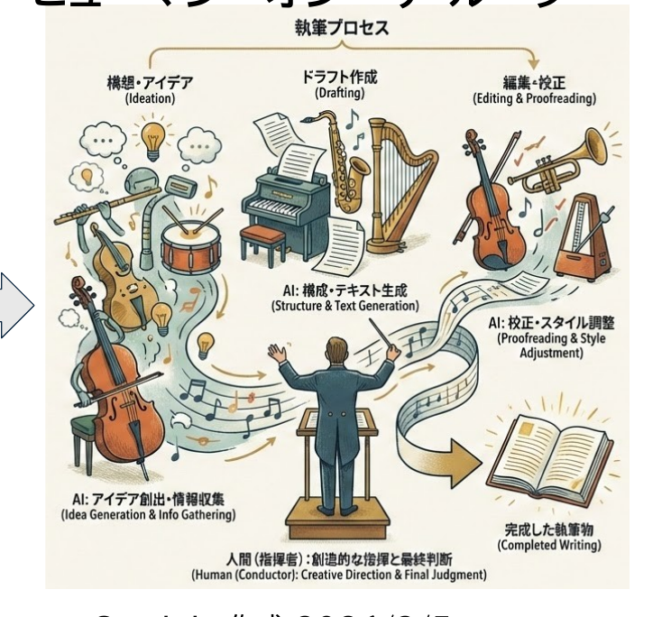
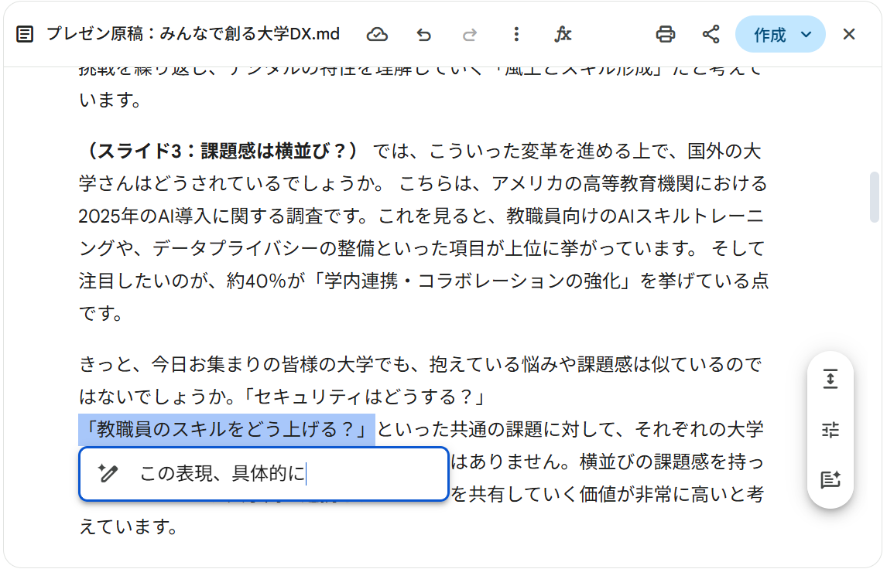
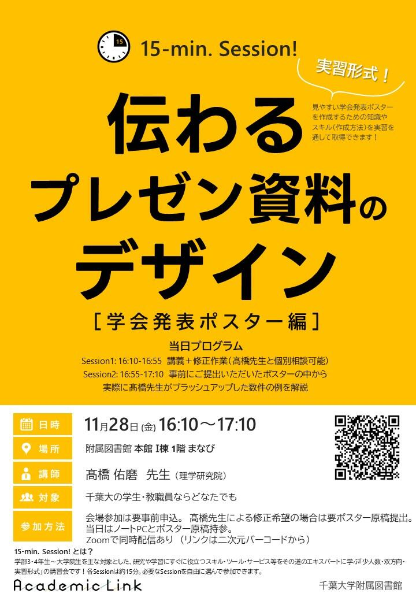
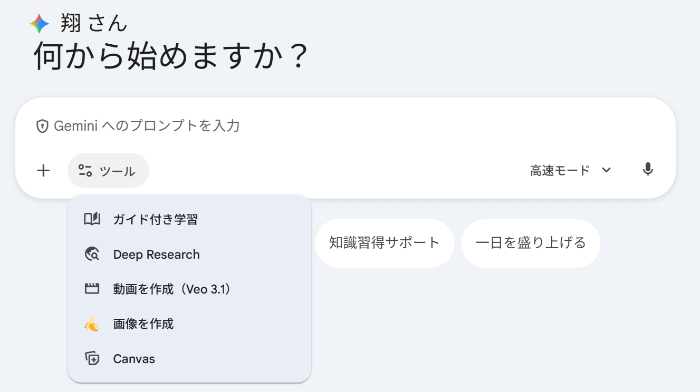

開始の前に

# 開始の前に

①<b>PCを立ち上げ、お持ちの 千葉大学Google Workspaceにログインして下さい</b> 
→ 学校のGmailが立ち上がる状況ならOKです。 
②<b>インタラクションツール Slidoにアクセスして下さい</b> 
URLを配布したり、質問やアンケートをとったりします 
※お名前などの個人情報の入力は禁止です

スマホから

QRコードまたは下記URLから直接アクセス

https://app.sli.do/event/wcsBZoniBRtjFkCdhb1C4F

PCから

<ul><li><b>方法1</b> Google検索「Slido」→コード入力 ALC-AI1-07</li>
<li><b>方法2</b> 直接リンク</li></ul>

<!--
- 始める前に、まず千葉大のGoogle Workspaceにログイン。学校のGmailが開けばOK。
- 次にインタラクションツールSlidoへ。質問やアンケートに使います。個人情報は入力しないでください。
-->

---

講師紹介

# 田川　翔たがわ　しょう

<b>所属：</b>千葉大学 高等教育センター/アカデミックリンクセンター 大学教育を企画し、学生と教員を支援する仕事

①元々は理学の人

<ul><li>Tagawa et al. (2021) <i>Nat. Com.</i></li></ul>

②色々な経験

<ul><li>大学のICT支援 (コロナ禍)</li><li>大規模オンライン授業の作成</li><li>民間企業での経験</li><li>AI×大学</li></ul>

③大学を学びやすく!

<ul><li>大学での教え方</li><li>生成AIの教育利活用</li><li>オープンバッジ</li></ul>

現在、<i>Teaching with AI</i> を翻訳・出版準備中

<!--
- 講師の田川です。元々は理学の研究者で、Tagawa et al. (2021) Nat. Com. などの仕事をしていました。
- その後、大学のICT支援やオンライン授業作成、民間企業など色々な経験を経て、今は大学を学びやすくする仕事をしています。
-->

---

<!-- _class: cover-hero -->

生成AI体験 ワークショップ

2025年度 第7回： 生成AIを使ってスライドを作ってみる

15-min × 3 sessions

国際未来教育基幹 田川 翔

<!--
- 今日のテーマは「生成AIを使ってスライドを作ってみる」。15分×3セッションで進めます。
-->

---

今回の構成

# 今回の構成

<table style="width:100%; border-collapse:collapse; font-size:24px; margin-top:14px;">
<tr>
<td style="width:140px; padding:8px; vertical-align:middle;">
最初の15分

講義
</td>
<td style="padding:10px 18px; vertical-align:middle;">- プレゼンテーションの様々な準備に生成AIを使う実践的方法を理解できる。</td>
</tr>
<tr>
<td style="padding:8px; vertical-align:middle;">
真ん中の15分

体験
</td>
<td style="padding:10px 18px; vertical-align:middle;">- Canvas機能を応用し、プレゼンテーションを作成してみる。</td>
</tr>
<tr>
<td style="padding:8px; vertical-align:middle;">
最後の15分

議論・座談会
</td>
<td style="padding:10px 18px; vertical-align:middle;">- 使用してみて気がついたこと (利点と限界) - CanvasやGemをどう活用したいですか。 - 今日面白かったこと、気付きは何でしたか。</td>
</tr>
</table>

<!--
- 構成は3部。最初の15分は講義、真ん中の15分は体験、最後の15分は議論・座談会です。
-->

---

<!-- _class: sec-open -->

2025年度 第7回： 生成AIを使ってスライドを作ってみる　/　15-min × 3 sessions

# 生成AI体験 ワークショップ

<b>Session 1：</b> 講義：生成AIを発表準備に使う際のアイデアを知る

国際未来教育基幹 田川 翔

<!--
- ここからSession 1。講義として、生成AIを発表準備に使う際のアイデアを知っていきます。
-->

---

Session 1の目的・到達目標

# Session 1の目的・到達目標

目的

<b>Session 1：</b> 講義：生成AIを発表準備に使う際のアイデアを知る

目標

・作業フローにAIを活用する考え方を知る

・スライド作成に利用できる道具を知る

・発表準備に使えそうな範囲 (現時点)

<!--
- Session 1の目的は、生成AIを発表準備に使うアイデアを知ること。
- 目標は3つ。作業フローにAIを活用する考え方、利用できる道具、そして使えそうな範囲を現時点で知ることです。
-->

---

今の最先端は？

# 今の最先端は？

スライド作成の自動化は、1つのトレンドになっている

<table style="width:100%; border-collapse:collapse; font-size:19px; margin-top:8px;">
<tr style="background:#3a3a3a; color:#fff;">
<th style="width:80px; padding:6px;"></th>
<th style="padding:6px;">Chatパラダイム</th>
<th style="padding:6px;">Toolパラダイム</th>
<th style="padding:6px; position:relative;">Agentパラダイム なう</th>
</tr>
<tr>
<td style="background:#eee; font-weight:800; padding:6px; text-align:center;">変化</td>
<td style="border:1px solid #ddd; padding:6px; text-align:center;">AIと対話</td>
<td style="border:1px solid #ddd; padding:6px; text-align:center;">AIが案・部品を作成</td>
<td style="border:1px solid #ddd; padding:6px; text-align:center; background:var(--accent-soft);">AIが作成を実行</td>
</tr>
<tr>
<td style="background:#eee; font-weight:800; padding:6px; text-align:center;">使い方</td>
<td style="border:1px solid #ddd; padding:6px; background:#FBF7E8;">情報収集 DeepResearch 発表表現のアイデア出し 発表・資料作成のコツ 誤字・分かりにくい点の確認</td>
<td style="border:1px solid #ddd; padding:6px;">スライドの案の作成 発表資料の図の生成 構成・原稿の作成支援</td>
<td style="border:1px solid #ddd; padding:6px; background:var(--accent-soft);">対話によるスライドの完成 スライド自体の作り込み デザイン・表現の一貫性担保 作成ワークフローの実現</td>
</tr>
<tr>
<td style="background:#eee; font-weight:800; padding:6px; text-align:center;">例</td>
<td style="border:1px solid #ddd; padding:6px;">こうしたらどうですか？ → 人は作成者</td>
<td style="border:1px solid #ddd; padding:6px;">スライド案/図を作成する → 人は編集者 (“ガチャ”)</td>
<td style="border:1px solid #ddd; padding:6px; background:var(--accent-soft);">スライドを自然言語で指示する <b style="color:var(--accent);">→人とAIで協働作成</b></td>
</tr>
</table>

<b>トレンド：</b> 2026年に入り、AIによる「補助」から<b>「自律的・協働的な生成」</b>へ　／　<b>限界：</b> 細かい修正や作成(例：スライドレベルの作成)はまだ難しい

<!--
- スライド作成の自動化は1つのトレンドになっています。
- Chat→Tool→Agentと進化し、今はAgentパラダイム。人とAIで協働作成する段階に入ってきました。
- ただし限界もあり、細かい修正やスライドレベルの作成はまだ難しいです。
-->

---

今の最先端は？

# 今の最先端は？

<table style="width:100%; border-collapse:collapse; font-size:20px; margin-top:8px;">
<tr style="background:#eee;">
<th style="width:130px; padding:6px;"></th>
<th style="padding:6px;"></th>
<th style="padding:6px; background:#dfeede;">利点</th>
<th style="padding:6px; background:#f6dede;">欠点</th>
</tr>
<tr>
<td style="background:#FBF7E8; font-weight:800; padding:8px; text-align:center;">外部 ツール</td>
<td style="border:1px solid #ddd; padding:8px; text-align:center;"><b style="font-size:24px;">Gamma</b>を用いたデモ (当日、動画にて実演予定) <b>Canva / Genspark etc</b></td>
<td style="border:1px solid #ddd; padding:8px; background:#eef7ee;">情報の質が高い 細かく作り込める その場で作れる 対話的に作れる</td>
<td style="border:1px solid #ddd; padding:8px; background:#fceeee;">値段が高い 機密情報の取扱い 100%は難しい 学問使用が難しいかも</td>
</tr>
<tr>
<td style="background:#EAF2FB; font-weight:800; padding:8px; text-align:center;">プロンプト</td>
<td style="border:1px solid #ddd; padding:8px; text-align:center;"><b>まじん式</b></td>
<td style="border:1px solid #ddd; padding:8px; background:#eef7ee;">コード固定・データ可変 GASで完結・安全</td>
<td style="border:1px solid #ddd; padding:8px; background:#fceeee;">図・グラフの挙動に癖</td>
</tr>
<tr>
<td style="background:#E8F0E8; font-weight:800; padding:8px; text-align:center;">Coding</td>
<td style="border:1px solid #ddd; padding:8px; text-align:center;"><b>Marp + Antigravity/Copilot</b> <b>Calude Code/Gemini CLI</b> <b>＋ライブラリ</b> (python-pptxなど)</td>
<td style="border:1px solid #ddd; padding:8px; background:#eef7ee;">文字で済む時早い 再現性高く効率的 幻覚が少ない</td>
<td style="border:1px solid #ddd; padding:8px; background:#fceeee;">IDEや環境が必要 コーディング知識 機密情報の扱い</td>
</tr>
<tr>
<td style="background:#E8F0F0; font-weight:800; padding:8px; text-align:center;">利用可能</td>
<td style="border:1px solid #ddd; padding:8px; text-align:center;"><b>NotebookLM + プロンプト</b></td>
<td style="border:1px solid #ddd; padding:8px; background:#eef7ee;">説明の質が高い</td>
<td style="border:1px solid #ddd; padding:8px; background:#fceeee;">編集できない</td>
</tr>
</table>

大学は機密情報・コストの問題から、外部の生成AIプロダクトを使うのは難しい → <b>では、学校契約のGeminiでどこまでプレゼン支援が、できるのか</b>

<!--
- 道具を整理すると、外部ツール・プロンプト・Coding・利用可能なものに分かれ、それぞれ利点と欠点があります。
- 大学は機密情報やコストの問題で外部プロダクトを使いにくい。では学校契約のGeminiでどこまでできるか、を見ていきます。
-->

---

今日、伝えたいこと

# 今日、伝えたいこと

学校契約のGeminiでどこまでプレゼン支援が、できるのか

Human Orchestration

AIと協働する<b>ワークフロー</b>を組み立て、 AIを道具に作業できる。

Canvas

Geminiの機能である、<b>Canvas</b>を 使いこなす事ができる。

Gemを使用したトライアル

Gemを用いてスライドとプロンプトを 作成し、結果を評価できる。

<!--
- 今日伝えたいことは、学校契約のGeminiでどこまでプレゼン支援ができるか。
- 鍵は3つ。Human Orchestrationでワークフローを組み立てること、Canvasを使いこなすこと、Gemでトライアルして評価すること。
-->

---

Human Orchestration

# Human Orchestration

<b>エージェント</b> 目的をもって行動する存在

<b>AI エージェント</b> 設定された目標に対して、自動的にタスクを決定しツールを用いて動作するAIシステム

<b>オーケストレーション</b> タスクを組み合わせ統括する仕組み

<b>ヒューマン・イン・ザ・ループ(HITL)</b> AIに人が介入し精度を上げる仕組み <b>ヒューマン・”オン”・ザ・ループ</b>

Geminiで作成 2026/3/5

<!--
- Human Orchestrationのキーワードを整理します。
- エージェントは目的をもって行動する存在。AIエージェントは目標に対して自動でタスクを決め、ツールを使って動くAIシステム。
- オーケストレーションはタスクを束ねて統括する仕組み。オーケストラの指揮者のように、人がAIをオン・ザ・ループで統括します。
-->

---

どこにAIは役立ちそう？

# どこにAIは役立ちそう？

スライド先行(探索的)

最も伝えたいこと/ 終了後の状態を決める

→

スライドの流れを 設定する ＋ コンテキストを設定 (絵・グラフ)

→

スライドを作り、 内容を整える

→

一回音読し、 原稿を作る

アイデア出し・言語化　／　資料検索・作図　／　デザイン確認

テキスト先行(よく知っている)

最も伝えたいこと/ 終了後の状態を決める

→

箇条書きでシナリオを 立てる ＋ コンテキストの資料を集める

→

スライドを作る

→

原稿を作る

→

内容を時間まで 膨らませる

<b>凡例</b>：メイン作業=使っている　／　追加作業=多分できる

<!--
- AIがどこで役立つかを、2つの進め方で見ます。
- 探索的に進める「スライド先行」と、よく知っている内容の「テキスト先行」。
- それぞれのフローの中で、すでに使っているメイン作業と、これから使えそうな追加作業を整理しました。
-->

---

音読し、原稿を作る

# 音読し、原稿を作る

<b>手順①</b>　スライドを完成させて、PDFなどで出力

<b>手順②</b>　とりあえず、<b>録音しながら</b>、音読してみる

- 言い淀みOK!、止まってもOK! - あまり考えずに、最初から最後まで説明する

<b>手順③</b>　スライド・録音を添付し<b>Canvas on</b> でGeminiに入れる

音声データを書き起こし、スライドの読み原稿を作成して下さい。音声は、添付のPDFのスライドの読み上げ資料です。DXの重要性について、10分間で伝えるよう、「用語の一貫性」と「口語としての自然な短さ」に注意した原稿にして下さい。聞き手は、大学事務職員と教授のようなマネジメント層です。真面目だが、比喩を全体で2個まぜて聞きやすくして下さい。分かりやすく、失礼無く、重複無く、スムーズな原稿にし、対話的に変更できるよう、Canvasに出力して下さい。スライドの番号を表示後、その原稿を記入して下さい。スライドの順番を変更したり、スライドを省略してはいけません。また、スライドを変えるべき点や誤字があれば、末尾にその内容を箇条書きで示して下さい。

目的、時間、聞き手、トーン、出力形式

語彙のブレが減り聞きやすいので、講師の方でも実施 (例：先週の全学FD)

<!--
- 原稿を作る手順です。①スライドを完成させてPDF出力、②録音しながら音読、③スライドと録音を添付してCanvas onでGeminiに入れる。
- プロンプトには目的・時間・聞き手・トーン・出力形式を盛り込みます。
- 講師自身でやっても語彙のブレが減って聞きやすくなります。
-->

---

Gem：カスタマイズしたAI

# Geminiで手順の決まった処理を指示したい時は、Gemを使おう

<b>Gem = </b>誰でも作れるGeminiを用いたカスタムAIエキスパート

千葉大Google Workspaceの標準機能

予め指示した振舞い・プロンプトで<b>生成AIが動く</b>

学内にリンクで作ったエキスパートを共有出来る

例：経費精算の記入の質問、プロンプトの作成

　　採点・フィードバックの下書きの作成

業務の属人化回避や反復に便利

Gemini同様の情報の扱い

学習されず、Gemの作成者にも共有されない

システムプロンプト

ユーザープロンプト

(コンテキストの一部)

業務を生成AIでより良くする上での一番初歩的な道具 今回は、スライドを”構造化”し、Canvasでのスライド化までを伴走

<!--
- Gemは、手順の決まった処理を指示したいときに使う、誰でも作れるカスタムAIエキスパート。千葉大Workspaceの標準機能で、振る舞いやプロンプトを予め仕込んでおける。
- 情報の扱いはGeminiと同じで、学習されず作成者にも共有されない。業務の属人化回避や反復に便利。
-->

---

Canvas：伴走する道具

# Geminiで作成を伴走してほしい時は、Canvasを使おう

<b>Canvas = </b>AIとの協働作成可能な作業用・出力用画面

使用例1　文章の作成

<b>文章を自分で編集</b>しつつ、 
Geminiに指示を出して 
書き換えが可能 
Documentに書き出せる

<!--
- Canvasは、Geminiに作成を伴走してほしいときに使う、協働作成用の画面。
- 使用例1は文章の作成。自分で編集しながらGeminiに指示を出して書き換えでき、Documentに書き出せる。
-->

---

Canvas：伴走する道具

# Geminiで作成を伴走してほしい時は、Canvasを使おう

<b>Canvas = </b>AIとの協働作成可能な作業用・出力用画面

使用例2　スライドの作成

<b>編集可能なスライドを</b>書き出せる

使用例3　インタラクティブ出力

問題集やコードの結果を 動作する形で表現できる

<!--
- 使用例2はスライドの作成。編集可能なスライドを書き出せる。
- 使用例3はインタラクティブ出力。問題集やコードの結果を、動作する形で表現できる。
-->

---

手作業で作成する上で

# スライド作成には、いくつかの原則がある

デザイン

<b>伝わるデザイン</b>に準拠してみよう

髙橋 佑磨 先生（理学研究院）／ EYRJ資料 → https://alc.chiba-u.jp/eyr/2023/06/16/01design.html

配置

<b>配置機能</b>で揃えよう

配置：ラインに並べる、整列：均等に置く、ページ中央に配置 ※ あと、順序でレイヤーをイメージできると良い

シンプル

<b>なるべくシンプルに</b>

左上から右下へ、末尾に一言でまとめて、文字数は最小化 アニメーションは使わない、1枚1分で話す

タイトル 

図

言いたいことを1行で

事前に知っておくだけで、<b>劇的に</b>変わる

<!--
- 手作業でスライドを作るときの原則。デザイン（伝わるデザインに準拠）、配置（配置機能で揃える）、シンプル（左上から右下へ、末尾に一言、文字数最小化、1枚1分）。
- 事前に知っておくだけで劇的に変わる。
-->

---

Session 1の目的・到達目標

# 振り返り

目的

<b>Session 1：</b> 講義：生成AIを発表準備に使う際のアイデアを知る

目標 ＋ まとめ

・ 作業フローにAIを活用する考え方を知る

・ Human Orchestration (HOTL)

・ フローの書き出しと考え方

・ スライド作成に利用できる道具を知る

・ Gem = 誰でも作れるカスタムAIエキスパート

・ Canvas = AIとの協働作成可能な作業用・出力用画面

・ 発表準備に使えそうな範囲 (現時点)

・ 原稿の作成、スライド案の作成

<!--
- Session 1の振り返り。目的は「生成AIを発表準備に使う際のアイデアを知る」。
- 目標とまとめ：作業フローにAIを活用する考え方（HOTL、フローの書き出し）、道具（Gem・Canvas）、発表準備に使えそうな範囲（原稿の作成・スライド案の作成）。
-->

---

<!-- _class: sec-open -->

2025年度 第7回：生成AIを使ってスライドを作ってみる ／ 15-min × 3 sessions

# 生成AI体験 ワークショップ

<b>Session 2：</b> Canvas機能で<b>原稿とスライド</b>を作成してみる

国際未来教育基幹　<b>田川 翔</b>

<!--
- ここからSession 2。Canvas機能で、原稿とスライドを実際に作成してみる。
-->

---

ワーク① 読み原稿を作る

# 5分：　Canvasを用いて、読み原稿を作ってみましょう。

① 今回の発表の講師の<b>練習音声</b>と<b>PDF</b>で、<b>読み原稿</b>を作成しましょう。

② 出力された内容を選択して、<b>Geminiと協働編集</b>してみましょう。

<b>思考モード</b>＋<b>Canvas</b>を選ぶ

プロンプト例

音声データを書き起こし、スライドの読み原稿を作成して下さい。音声は、添付のPDFのスライドの読み上げ資料です。AIを用いたスライド作成支援について、15分間で伝えるよう、「用語の一貫性」と「口語としての自然な短さ」に注意した原稿にして下さい。聞き手は、大学生と大学事務職員と教員です。初心者にも分かりやすいようフレンドリーで聞きやすくして下さい。分かりやすく、失礼無く、重複無く、スムーズな原稿

オンラインの方：困ったらSlidoに質問を送って下さい！　余裕がある方：Slidoに返信してあげてください。 
会場の方：困ったら、手を上げてTAやペアに聞いて下さい。

<!--
- ワーク①。5分で、Canvasを用いて読み原稿を作ってみる。①練習音声とPDFで読み原稿を作成、②出力をGeminiと協働編集。
- ツールメニューで思考モード＋Canvasを選ぶ。困ったらSlidoや手を上げてTA・ペアへ。
- プロンプト例：音声データを書き起こし、スライドの読み原稿を作成。15分間で、用語の一貫性と口語としての自然な短さに注意。聞き手は大学生・事務職員・教員。
-->

---

ワーク② スライドを作る

# 10分： Gemを用いてスライドを作ってみましょう。

① Gemにスライドにしてほしい内容をアップロードし、実行して下さい。 注意：機密情報を含むデータは使用しないこと

② 対話しつつ、作成を進めて下さい(5枚くらいが良いでしょう)。 ※ デザインで、元にしたいスライドがない場合は、Gemで決めてよいと伝えて下さい。

③ 可能であれば<b>保存しSpreadsheet</b>にリンクを貼って共有して下さい。 <b>(名前・顔写真・機密情報不可)</b>　※右上の共有から、リンクを選択 / 共有範囲は千葉大

<b>Proモード</b>＋<b>Canvas</b>を選ぶ (事前選択済み)

オンラインの方：困ったらSlidoに質問を送って下さい！　余裕がある方：Slidoに返信してあげてください。／ 会場の方：困ったら、手を上げてTAやペアに聞いて下さい。

<!--
- ワーク②。10分で、Gemを用いてスライドを作ってみる。①内容をアップロードして実行（機密情報は使わない）、②対話しつつ5枚くらい、③可能ならSpreadsheetにリンクを貼って共有（名前・顔写真・機密情報不可、共有範囲は千葉大）。
- ProモードでCanvasを選ぶ（事前選択済み）。
-->

---

Session 2の目的・到達目標

# 振り返り

目的

<b>Session 2：</b> Canvas機能で<b>原稿とスライド</b>を作成してみる

目標 ＋ まとめ

・ Canvasで協働編集をすることができた 
・ Gemでスライド案を作成することができた

<!--
- Session 2の振り返り。目的は「Canvas機能で原稿とスライドを作成してみる」。
- まとめ：Canvasで協働編集ができた、Gemでスライド案を作成できた。
-->

---

<!-- _class: sec-open -->

2025年度 第7回：生成AIを使ってスライドを作ってみる ／ 15-min × 3 sessions

# 生成AI体験 ワークショップ

<b>Session 3：</b> 議論：気づきのシェア & 振り返り

国際未来教育基幹　<b>田川 翔</b>

<!--
- ここからSession 3。議論：気づきのシェアと振り返り。
-->

---

Session 3の進め方

# 議論・座談会　Slidoで進めます

<b>お願い：協力的な場作りが、学びの秘訣です。</b> 敬意をもって、忌憚なく、建設的に、話し合いましょう

・ 実際に使ってみて<b>「上手くいった点」「イマイチな点」</b>を教えて下さい。

・ <b>大学の中で諸活動の中で、Gem/Canvasが便利そうなユースケースとワークフロー</b>を簡単に提案して下さい。

・ 今日面白かったこと、気付きは何でしたか。

スマホから

方法2　直接リンク

https://app.sli.do/event/wcsBZoniBRtjFkCdhb1C4F

PCから

方法1　Google検索「Slido」→コード入力

<b>＃ ALC-AI1-07</b>

<!--
- Session 3の進め方。議論・座談会をSlidoで進める。協力的な場作りが学びの秘訣。敬意をもって、忌憚なく、建設的に。
- 問い：実際に使って上手くいった点・イマイチな点、Gem/Canvasが便利そうなユースケースとワークフロー、今日面白かったこと・気づき。
- Slidoはスマホは直接リンク、PCはGoogle検索「Slido」→コード ALC-AI1-07。
-->
