
開始の前に

① <b>PCを立ち上げ、お持ちの 　千葉大学Google Workspaceにログインして下さい</b> → 学校のGmailが立ち上がる状況ならOKです。

② <b>インタラクションツール Slidoにアクセスして下さい</b> URLを配布したり、質問やアンケートをとったりします ※お名前などの個人情報の入力は禁止です

スマホから

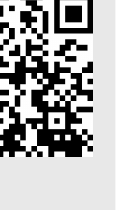

PCから

方法1　Google検索「Slido」→コード入力　ALC-AI1-07

方法2　直接リンク

<a href="https://app.sli.do/event/wcsBZoniBRtjFkCdhb1C4F">https://app.sli.do/event/wcsBZoniBRtjFkCdhb1C4F</a>

<!-- 開始の前に。①各自のPCを立ち上げ、千葉大Google Workspaceにログイン。②インタラクションツールSlidoにアクセス。個人情報の入力は禁止です。 -->

---

講師紹介

# 田川　翔たがわ　しょうオープンバッジ

<b>所属：</b>千葉大学 高等教育センター/アカデミックリンクセンター

大学教育を企画し、学生と教員を支援する仕事

①元々は理学の人

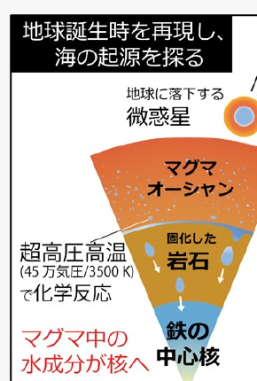

Tagawa et al. (2021) <i>Nat. Commun.</i>

②色々な経験

<ul>
<li>大学のICT支援 (コロナ禍)</li>
<li>大規模オンライン授業の作成</li>
<li>民間企業での経験</li>
<li>AI×大学</li>
</ul>

③大学を学びやすく!

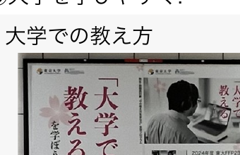

<ul>
<li>大学での教え方</li>
<li>生成AIの教育利活用</li>
<li>現在、<i>Teaching with AI</i>を翻訳・出版準備中</li>
</ul>

<!-- 講師紹介。田川翔です。元々は理学（マグマオーシャン研究、Nat. Commun.）出身で、ICT支援や大規模オンライン授業、民間企業など色々な経験を経て、今は大学を学びやすくする仕事をしています。 -->

---

<!-- _class: cover-hero -->

生成AI体験 ワークショップ

2025年度 第7回： 生成AIを使ってスライドを作ってみる

15-min × 3 sessions

国際未来教育基幹 田川 翔

<!-- タイトルです。2025年度第7回、生成AIを使ってスライドを作ってみる。15分×3セッションで進めます。 -->

---

ワークショップの全体構成

第1回　生成AIの仕組みを体験する 
第2回　Noetebook LMで情報を理解する 
第3回　生成AI利用、どこまではOKで、どこからがアウト？ 
第4回　AIで絵・グラフを書いてみる 
第5回　特別回1 (外部講師登壇予定) 
第6回　特別回2 (本学学生登壇予定) 
第7回　AIを使ってスライドを作ってみる 
第8回　Google SpreadsheetからAIで分析する 
内容については若干の変更が生じる可能性があります。最新の情報は以下の二次元コードをご参照ください。

最初の15分

講義

▶

真ん中の15分

体験

▶

最後の15分

議論・座談会

演習・議論付き  (オンラインの皆様もぜひ！)　詳細は<b>moodle</b>で！

<!-- ワークショップの全体構成です。連続WSの第7回。各回は「講義→体験→議論・座談会」の3部15分ずつ。演習・議論付きで、オンラインの皆様もぜひご参加ください。詳細はmoodleで。 -->

---

今回の構成

<table style="width:100%; border-collapse:separate; border-spacing:0 12px; font-size:23px;">
<tr>
<td style="width:200px; vertical-align:top;">

最初の15分

講義

</td>
<td style="vertical-align:middle; padding-left:18px;">- プレゼンテーションの様々な準備に生成AIを使う実践的方法を理解できる。</td>
</tr>
<tr>
<td style="vertical-align:top;">

真ん中の15分

体験

</td>
<td style="vertical-align:middle; padding-left:18px;">- Canvas機能を応用し、プレゼンテーションを作成してみる。</td>
</tr>
<tr>
<td style="vertical-align:top;">

最後の15分

議論・座談会

</td>
<td style="vertical-align:middle; padding-left:18px;">
- 使用してみて気がついたこと (利点と限界) 
- CanvasやGemをどう活用したいですか。 
- 今日面白かったこと、気付きは何でしたか。
</td>
</tr>
</table>

<!-- 今回の構成です。講義ではプレゼン準備への生成AI活用法を理解、体験ではCanvasでプレゼンを作成、議論ではCanvasやGemの活用について振り返ります。 -->

---

<!-- _class: cover-hero -->

生成AI体験 ワークショップ

2025年度 第7回：生成AIを使ってスライドを作ってみる

15-min × 3 sessions

<b>Session 1：</b> 
講義：生成AIを発表準備に使う際のアイデアを知る

国際未来教育基幹 田川 翔

<!-- ここからSession 1。講義「生成AIを発表準備に使う際のアイデアを知る」です。 -->

---

Session 1の目的・到達目標

<b>Session 1：</b> 
講義：生成AIを発表準備に使う際のアイデアを知る

目的

講義：生成AIを発表準備に使う際のアイデアを知る

目標

・ 作業フローにAIを活用する考え方を知る

・ スライド作成に利用できる道具を知る

・ 発表準備に使えそうな範囲 (現時点)

<!-- Session 1の目的・到達目標です。目的は発表準備への生成AI活用アイデアを知ること。目標は、作業フローへのAI活用の考え方、利用できる道具、そして現時点で使えそうな範囲を知ることです。 -->

---

今の最先端は？

スライド作成の自動化は、<b style="color:var(--accent);">1つのトレンド</b>になっている

<table style="width:100%; border-collapse:collapse; font-size:20px; line-height:1.45;">
<tr>
<td style="width:80px;"></td>
<td style="text-align:center; padding:6px; background:#EEF2F7; font-weight:800; border-radius:8px 8px 0 0;">Chatパラダイム</td>
<td style="text-align:center; padding:6px; background:#FDF6E3; font-weight:800;">Toolパラダイム</td>
<td style="text-align:center; padding:6px; background:#FBE4EA; font-weight:800; position:relative;">Agentパラダイムなう</td>
</tr>
<tr>
<td style="font-weight:800; color:var(--muted);">変化</td>
<td style="text-align:center; padding:6px;">AIと対話</td>
<td style="text-align:center; padding:6px;">AIが案・部品を作成</td>
<td style="text-align:center; padding:6px;">AIが作成を実行</td>
</tr>
<tr>
<td style="font-weight:800; color:var(--muted);">使い方</td>
<td style="padding:8px; background:#EEF2F7; text-align:center;">情報収集 DeepResearch 発表表現のアイデア出し 発表・資料作成のコツ 誤字・分かりにくい点の確認</td>
<td style="padding:8px; background:#FDF6E3; text-align:center;">スライドの案の作成 発表資料の図の生成 構成・原稿の作成支援</td>
<td style="padding:8px; background:#FBE4EA; text-align:center;">対話によるスライドの完成 スライド自体の作り込み デザイン・表現の一貫性担保 作成ワークフローの実現</td>
</tr>
<tr>
<td style="font-weight:800; color:var(--muted);">例</td>
<td style="padding:8px; background:#EEF2F7; text-align:center;">こうしたらどうですか？ → 人は作成者</td>
<td style="padding:8px; background:#FDF6E3; text-align:center;">スライド案/図を作成する → 人は編集者 (“ガチャ”)</td>
<td style="padding:8px; background:#FBE4EA; text-align:center;">スライドを自然言語で指示する <b style="color:var(--accent);">→人とAIで協働作成</b></td>
</tr>
</table>

<b>トレンド：</b> 2026年に入り、AIによる「補助」から<b>「自律的・協働的な生成」</b>へ　／　<b>限界：</b>細かい修正や作成(例：スライドレベルの作成)はまだ難しい

<!-- 今の最先端です。スライド作成の自動化は1つのトレンドになっています。Chatパラダイム（AIと対話）→Toolパラダイム（AIが部品を作成）→Agentパラダイム（AIが作成を実行）と移り変わり、今はAgentパラダイムへ。2026年に入り「補助」から「自律的・協働的な生成」へ。ただし細かい修正はまだ難しい。 -->

---

今の最先端は？

<table style="width:100%; border-collapse:collapse; font-size:19px; line-height:1.3;">
<tr>
<td style="width:96px;"></td>
<td style="width:38%;"></td>
<td style="text-align:center; font-weight:800; background:#EAF2FB; padding:5px; border-radius:8px 8px 0 0;">利点</td>
<td style="text-align:center; font-weight:800; background:#FCEAEC; padding:5px;">欠点</td>
</tr>
<tr>
<td rowspan="2" style="font-weight:800; color:var(--muted); writing-mode:vertical-rl; text-align:center;">外部ツール</td>
<td style="padding:6px;">
<b>Gamma</b>を用いたデモ (当日、実演予定 / プロンプト)
</td>
<td rowspan="2" style="padding:5px 8px; background:#EAF2FB;">情報の質が高い 細かく作り込める その場で作れる 対話的に作れる</td>
<td rowspan="2" style="padding:5px 8px; background:#FCEAEC;">値段が高い 機密情報の取扱い 100%は難しい 学問使用が難しいかも</td>
</tr>
<tr><td style="padding:6px;">
<b>Canva / Genspark etc</b>
</td></tr>
<tr>
<td style="font-weight:800; color:var(--muted);">プロンプト</td>
<td style="padding:6px;">
<b>まじん式</b>
</td>
<td style="padding:5px 8px; background:#EAF2FB;">コード固定・データ可変 GASで完結・安全</td>
<td style="padding:5px 8px; background:#FCEAEC;">図・グラフの挙動に癖</td>
</tr>
<tr>
<td rowspan="2" style="font-weight:800; color:var(--muted); writing-mode:vertical-rl; text-align:center;">Coding</td>
<td style="padding:6px;">
<b>Marp + Antigravity/Copilot</b>
</td>
<td rowspan="2" style="padding:5px 8px; background:#EAF2FB;">文字で済む時早い 再現性高く効率的 幻覚が少ない</td>
<td rowspan="2" style="padding:5px 8px; background:#FCEAEC;">IDEや環境が必要 コーディング知識 機密情報の扱い</td>
</tr>
<tr><td style="padding:6px;">
<b>Calude Code/Gemini CLI</b> <b>＋ ライブラリ</b> (python-pptxなど)
</td></tr>
<tr>
<td style="font-weight:800; color:var(--muted);">利用可能</td>
<td style="padding:6px;">
<b>NotebookLM + プロンプト</b>
</td>
<td style="padding:5px 8px; background:#EAF2FB;">説明の質が高い</td>
<td style="padding:5px 8px; background:#FCEAEC;">編集できない</td>
</tr>
</table>

大学は機密情報・コストの問題から、外部の生成AIプロダクトを使うのは難しい <b>→ では、学校契約のGeminiでどこまでプレゼン支援が、できるのか</b>

<!-- 道具の比較です。外部ツール（Gamma、Canva等）は質が高いが値段や機密情報に難。プロンプト（まじん式）はコード固定・データ可変で安全。Coding（Marp+Antigravity、Claude Code/Gemini CLI）は再現性高く幻覚が少ない。NotebookLMは説明の質が高いが編集できない。大学は機密情報・コストから外部プロダクトが難しい。では学校契約のGeminiでどこまでできるか。 -->

---

今日、伝えたいこと

学校契約のGeminiでどこまでプレゼン支援が、できるのか

Human Orchestration

AIと協働する<b>ワークフロー</b>を組み立て、AIを道具に作業できる。

Canvas

Geminiの機能である、<b>Canvas</b>を使いこなす事ができる。

Gemを使用したトライアル

Gemを用いてスライドとプロンプトを作成し、結果を評価できる。

<!-- 今日伝えたいことです。学校契約のGeminiでどこまでプレゼン支援ができるのか。1つ目はHuman Orchestration、AIと協働するワークフローを組み立てること。2つ目はGeminiの機能Canvasを使いこなすこと。3つ目はGemを使ってスライドとプロンプトを作り評価することです。 -->

---

Human Orchestration

<b style="font-size:25px;">エージェント</b> 目的をもって行動する存在

<b style="font-size:25px; color:var(--accent-dark);">AI エージェント</b> 設定された目標に対して、自動的にタスクを決定しツールを用いて動作するAIシステム

<b style="font-size:25px; color:var(--accent-dark);">オーケストレーション</b> タスクを組み合わせ統括する仕組み

<b style="font-size:25px; color:var(--accent-dark);">ヒューマン・イン・ザ・ループ(HITL)</b> AIに人が介入し精度を上げる仕組み

ヒューマン・”オン”・ザ・ループ

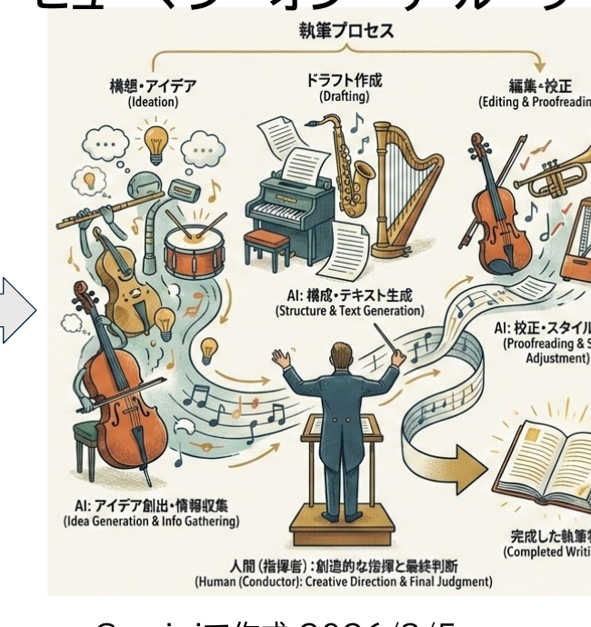

Geminiで作成 2026/3/5

<!-- Human Orchestrationについて。エージェントとは目的をもって行動する存在。AIエージェントは目標に対し自動でタスクを決定しツールを使うAIシステム。それらを組み合わせ統括するのがオーケストレーション。人が介入し精度を上げるのがHITL。人がループの上に立って指揮する、ヒューマン・オン・ザ・ループのイメージです。 -->

---

どこにAIは役立ちそう？

スライド先行 (探索的)

最も伝えたいこと/終了後の状態を決める

▶

スライドの流れを設定する

コンテキストを設定する (絵・グラフ)

▶

スライドを整える

▶

一回音読し、原稿を作る

テキスト先行 (よく知っている)

最も伝えたいこと/終了後の状態を決める

▶

箇条書きでシナリオを立てる

コンテキストの資料を集める

▶

スライドを作る

原稿を作る

▶

内容を時間まで膨らませる

<b>凡例</b>　メイン作業

どの業務は、人(あなた)が行う価値があるか？

<!-- どこにAIは役立ちそうか。スライド先行（探索的）の場合、伝えたいことを決め、流れとコンテキストを設定し、整えて、最後に音読して原稿を作る。テキスト先行（よく知っている）の場合は、シナリオを立て資料を集め、スライドと原稿を作り、内容を膨らませる。どの業務を人が行う価値があるかを考えましょう。 -->

---

どこにAIは役立ちそう？

# どの業務は、人(あなた)が行う価値があるか？

スライド先行 (探索的)

<svg width="1180" height="300" viewBox="0 0 1180 300" xmlns="http://www.w3.org/2000/svg" font-family="sans-serif">
<defs><marker id="ar13" markerWidth="9" markerHeight="9" refX="7" refY="3" orient="auto"><path d="M0,0 L7,3 L0,6 Z" fill="#1E3A6E"/></marker></defs>
<rect x="48" y="60" width="220" height="74" rx="12" fill="#E9E9E9" stroke="#9aa" stroke-width="1.5"/>
<text x="158" y="90" text-anchor="middle" font-size="23">最も伝えたいこと/</text>
<text x="158" y="118" text-anchor="middle" font-size="23">終了後の状態を決める</text>
<rect x="370" y="58" width="190" height="44" rx="14" fill="#FBE4EA"/>
<text x="465" y="86" text-anchor="middle" font-size="22">アイデア出し</text>
<rect x="370" y="118" width="220" height="74" rx="12" fill="#E9E9E9" stroke="#9aa" stroke-width="1.5"/>
<text x="480" y="148" text-anchor="middle" font-size="23">スライドの流れを</text>
<text x="480" y="176" text-anchor="middle" font-size="23">設定する</text>
<rect x="48" y="150" width="190" height="60" rx="12" fill="#FBE4EA"/>
<text x="143" y="176" text-anchor="middle" font-size="22">アイデア出し</text>
<text x="143" y="200" text-anchor="middle" font-size="22">言語化</text>
<rect x="370" y="196" width="220" height="64" rx="12" fill="#E9E9E9" stroke="#9aa" stroke-width="1.5"/>
<text x="480" y="222" text-anchor="middle" font-size="22">コンテキストを設定</text>
<text x="480" y="248" text-anchor="middle" font-size="22">する (絵・グラフ)</text>
<rect x="372" y="270" width="92" height="26" rx="8" fill="#FBE4EA"/>
<text x="418" y="288" text-anchor="middle" font-size="18">資料検索</text>
<rect x="476" y="270" width="68" height="26" rx="8" fill="#FBE4EA"/>
<text x="510" y="288" text-anchor="middle" font-size="18">作図</text>
<rect x="690" y="58" width="190" height="44" rx="14" fill="#E4F1E0"/>
<text x="785" y="86" text-anchor="middle" font-size="22">デザイン確認</text>
<rect x="690" y="118" width="200" height="74" rx="12" fill="#E9E9E9" stroke="#9aa" stroke-width="1.5"/>
<text x="790" y="148" text-anchor="middle" font-size="23">スライドを作り、</text>
<text x="790" y="176" text-anchor="middle" font-size="23">内容を整える</text>
<rect x="990" y="118" width="180" height="74" rx="12" fill="#fff" stroke="var(--accent-dark)" stroke-width="4"/>
<text x="1080" y="148" text-anchor="middle" font-size="23">一回音読し、</text>
<text x="1080" y="176" text-anchor="middle" font-size="23">原稿を作る</text>
<path d="M268 97 L300 97 L300 155 L366 155" fill="none" stroke="#1E3A6E" stroke-width="2" marker-end="url(#ar13)"/>
<path d="M300 155 L300 230 L366 230" fill="none" stroke="#1E3A6E" stroke-width="2" marker-end="url(#ar13)"/>
<path d="M590 155 L640 155 L640 155 L686 155" fill="none" stroke="#1E3A6E" stroke-width="2" marker-end="url(#ar13)"/>
<path d="M590 230 L640 230 L640 155" fill="none" stroke="#1E3A6E" stroke-width="2"/>
<path d="M890 155 L986 155" fill="none" stroke="#1E3A6E" stroke-width="2" marker-end="url(#ar13)"/>
</svg>

テキスト先行 (よく知っている)

凡例

メイン作業追加作業

使っている多分できる

<svg width="900" height="200" viewBox="0 0 900 200" xmlns="http://www.w3.org/2000/svg" font-family="sans-serif">
<defs><marker id="ar13b" markerWidth="9" markerHeight="9" refX="7" refY="3" orient="auto"><path d="M0,0 L7,3 L0,6 Z" fill="#1E3A6E"/></marker></defs>
<rect x="0" y="14" width="190" height="64" rx="12" fill="#E9E9E9" stroke="#9aa" stroke-width="1.5"/>
<text x="95" y="40" text-anchor="middle" font-size="21">最も伝えたいこと/</text>
<text x="95" y="64" text-anchor="middle" font-size="21">終了後の状態を決める</text>
<rect x="290" y="6" width="190" height="64" rx="12" fill="#E9E9E9" stroke="#9aa" stroke-width="1.5"/>
<text x="385" y="32" text-anchor="middle" font-size="21">箇条書きでシナリオを</text>
<text x="385" y="56" text-anchor="middle" font-size="21">立てる</text>
<rect x="290" y="92" width="190" height="64" rx="12" fill="#E4F1E0"/>
<text x="385" y="118" text-anchor="middle" font-size="21">コンテキストの資料を</text>
<text x="385" y="142" text-anchor="middle" font-size="21">集める</text>
<rect x="292" y="166" width="86" height="26" rx="8" fill="#FBE4EA"/>
<text x="335" y="184" text-anchor="middle" font-size="18">資料検索</text>
<rect x="390" y="166" width="64" height="26" rx="8" fill="#FBE4EA"/>
<text x="422" y="184" text-anchor="middle" font-size="18">作図</text>
<rect x="560" y="6" width="160" height="64" rx="12" fill="#FBE4EA" stroke="var(--accent-dark)" stroke-width="4"/>
<text x="640" y="44" text-anchor="middle" font-size="21">スライドを作る</text>
<rect x="560" y="92" width="160" height="64" rx="12" fill="#E4F1E0"/>
<text x="640" y="130" text-anchor="middle" font-size="21">原稿を作る</text>
<rect x="770" y="92" width="130" height="64" rx="12" fill="#E9E9E9" stroke="#9aa" stroke-width="1.5"/>
<text x="835" y="118" text-anchor="middle" font-size="21">内容を時間まで</text>
<text x="835" y="142" text-anchor="middle" font-size="21">膨らませる</text>
<path d="M190 46 L240 46 L240 38 L286 38" fill="none" stroke="#1E3A6E" stroke-width="2" marker-end="url(#ar13b)"/>
<path d="M240 46 L240 124 L286 124" fill="none" stroke="#1E3A6E" stroke-width="2" marker-end="url(#ar13b)"/>
<path d="M480 38 L520 38 L520 38 L556 38" fill="none" stroke="#1E3A6E" stroke-width="2" marker-end="url(#ar13b)"/>
<path d="M520 38 L520 124 L556 124" fill="none" stroke="#1E3A6E" stroke-width="2" marker-end="url(#ar13b)"/>
<path d="M720 124 L766 124" fill="none" stroke="#1E3A6E" stroke-width="2" marker-end="url(#ar13b)"/>
</svg>

<!--
- 前のスライドと同じフローだが、AIが「使っている」「多分できる」業務を色分けし、人が価値を出すべき業務を浮かび上がらせる。スライド先行では原稿づくり、テキスト先行ではスライド作成を人の作業として残している。
-->

---

音読し、原稿を作る

# 音読し、原稿を作る

手順①

スライドを完成させて、PDFなどで出力

手順②

とりあえず、<b>録音しながら</b>、音読してみる 言い淀みOK!、止まってもOK! あまり考えずに、最初から最後まで説明する

手順③

スライド・録音を添付し Canvas on で Gemini に入れる

音声データを書き起こし、スライドの読み原稿を作成して下さい。音声は、添付のPDFのスライドの読み上げ資料です。 DXの重要性について、10分間で伝えるよう、「用語の一貫性」と「口語としての自然な短さ」に注意した原稿にして下さい。 聞き手は、大学事務職員と教授のようなマネジメント層です。真面目だが、比喩を全体で2個まぜて聞きやすくして下さい。 分かりやすく、失礼無く、重複無く、スムーズな原稿にし、対話的に変更できるよう、Canvasに出力して下さい。 スライドの番号を表示後、その原稿を記入して下さい。スライドの順番を変更したり、スライドを省略してはいけません。 また、スライドを変えるべき点や誤字があれば、末尾にその内容を箇条書きで示して下さい。

目的、時間、聞き手、トーン、出力形式

語彙のブレが減り聞きやすいので、講師の方でも実施 (例：先週の全学FD)

<!--
- スライドを完成させてPDF化し、録音しながら一度音読してみる。その音声とスライドをGeminiに入れて読み原稿を作らせる。プロンプトには目的・時間・聞き手・トーン・出力形式を必ず入れるのがコツ。語彙のブレが減って聞きやすくなるので、講師でも実施している。
-->

---

スライドを作る

# スライドを作る

Gemで作成するフローを作りました 体験セッションで実施予定

ぜひ、各自で応用・アップデートしてみて下さい

但し、講師は、今日時点で最終版はまだ、<b>手作業で</b>組んでます 作ったスライドは、<b>「部品取り」「構成・表現のアイデア」</b>としてのみ、活用しています

<!--
- Gemで作成するフローを作りました。体験セッションで実際にやってみます。ぜひ各自で応用・アップデートしてみてください。ただし、講師自身は今日時点で最終版はまだ手作業で組んでいます。AIで作ったスライドは部品取りや構成・表現のアイデアとしてのみ活用しています。
-->

---

Gem：カスタマイズしたAI

# Gem：カスタマイズしたAI

Geminiで<b>手順の決まった処理</b>を指示したい時は、<b style="color:var(--accent-dark)">Gem</b>を使おう

<b>Gem = </b>誰でも作れるGeminiを用いたカスタムAIエキスパート

千葉大Google Workspaceの標準機能

<ul style="margin:0 0 0 1.0em; padding:0; font-size:21px; line-height:1.4;">
<li><b>予め指示した振舞い・プロンプトで生成AIが動く</b></li>
<li>学内にリンクで作ったエキスパートを共有出来る</li>
<li>例：経費精算の記入の質問、プロンプトの作成 　　　採点・フィードバックの下書きの作成</li>
<li>業務の属人化回避や反復に便利</li>
</ul>

Gemini同様の情報の扱い

<ul style="margin:0 0 0 1.0em; padding:0; font-size:21px; line-height:1.4;">
<li>学習されず、Gemの作成者にも共有されない</li>
</ul>

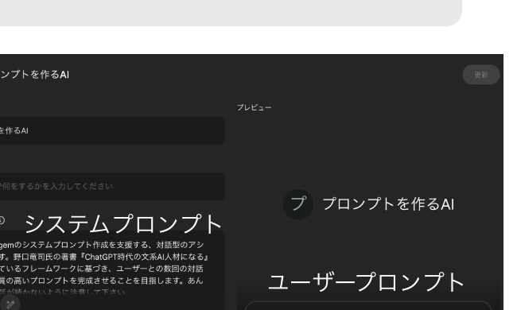

業務を生成AIでより良くする上での一番初歩的な道具 今回は、スライドを”構造化”し、Canvasでのスライド化までを伴走

<!--
- Geminiで手順の決まった処理を指示したいときはGemを使う。Gemは誰でも作れるカスタムAIエキスパートで、千葉大Google Workspaceの標準機能。予め指示した振る舞い・プロンプトで動き、学内にリンクで共有できる。情報の扱いはGeminiと同じで、学習されず作成者にも共有されない。業務改善の一番初歩的な道具で、今回はスライドの構造化からCanvasでのスライド化まで伴走させる。
-->

---

Canvas：伴走する道具

# Canvas：伴走する道具

Geminiで作成を伴走してほしい時は、<b style="color:var(--accent-dark)">Canvas</b>を使おう

<b>Canvas = </b>AIとの協働作成可能な作業用・出力用画面

使用例1　文章の作成

<b>文章を自分で編集</b>しつつ、Geminiに指示を出して書き換えが可能 Documentに書き出せる

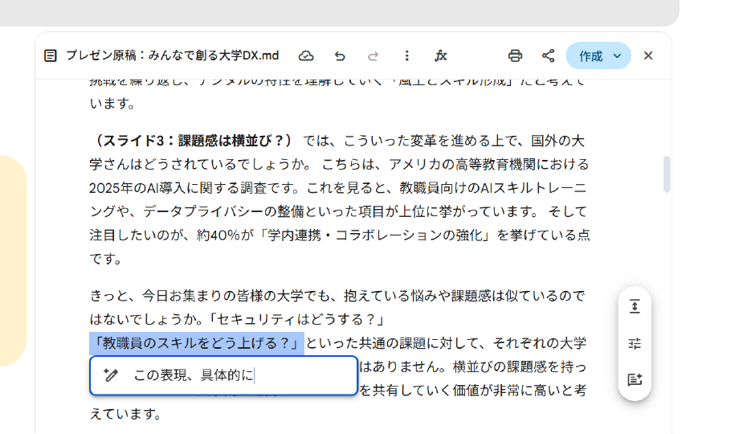

<!--
- Geminiで作成を伴走してほしいときはCanvasを使う。CanvasはAIとの協働作成が可能な作業用・出力用の画面。使用例1は文章の作成で、文章を自分で編集しつつGeminiに指示を出して書き換えができ、Documentにも書き出せる。
-->

---

Canvas：伴走する道具

# Canvas：伴走する道具

Geminiで作成を伴走してほしい時は、<b style="color:var(--accent-dark)">Canvas</b>を使おう

<b>Canvas = </b>AIとの協働作成可能な作業用・出力用画面

使用例2　スライドの作成

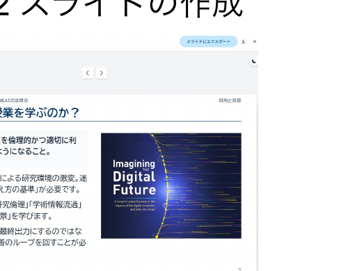

<b style="color:var(--accent-dark)">編集可能なスライドを</b>書き出せる

使用例3　インタラクティブ出力

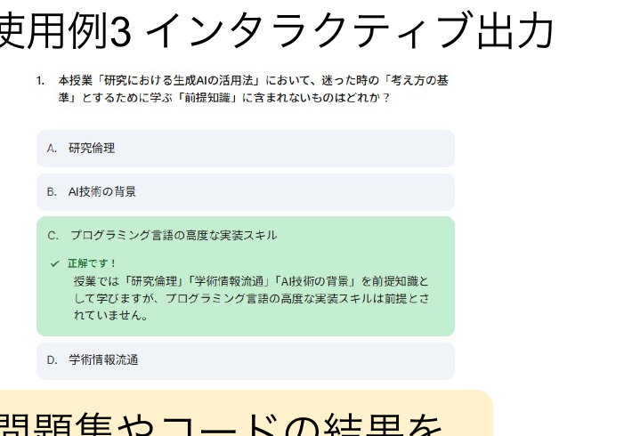

問題集やコードの結果を動作する形で表現できる

<!--
- 使用例2はスライドの作成で、編集可能なスライドを書き出せる。使用例3はインタラクティブ出力で、問題集やコードの結果を実際に動作する形で表現できる。
-->

---

手作業で作成する上で

# 手作業で作成する上で

スライド作成には、<b style="color:var(--accent-dark)">いくつかの原則</b>がある

デザイン

<b>伝わるデザイン</b>に準拠してみよう

髙橋 佑磨 先生 （理学研究院） EYRJ資料 → https://alc.chiba-u.jp/eyr/2023/06/16/01design.html

配置

<b>配置機能</b>で揃えよう

配置：ラインに並べる、整列：均等に置く、ページ中央に配置 ※ あと、順序でレイヤーをイメージできると良い

シンプル

<b>なるべくシンプルに</b>

左上から右下へ、末尾に一言でまとめて、文字数は最小化 アニメーションは使わない、1枚1分で話す

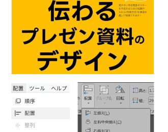

タイトル

図

言いたいことを1行で

事前に知っておくだけで、<b>劇的に</b>変わる

<!--
- 手作業で作るときにもスライド作成の原則がある。デザインは高橋佑磨先生の「伝わるデザイン」に準拠。配置は配置機能で揃え、順序でレイヤーをイメージする。なるべくシンプルに、左上から右下へ、末尾に一言、文字数は最小化、アニメーションは使わず1枚1分で話す。事前に知っておくだけで劇的に変わる。
-->

---

Session 1の目的・到達目標

# 振り返り

目的

<b>Session 1：</b> 講義：生成AIを発表準備に使う際のアイデアを知る

目標 ＋ まとめ

<b>作業フローにAIを活用する考え方を知る</b>

・Human Orchestration (HOTL)　・フローの書き出しと考え方

<b>スライド作成に利用できる道具を知る</b>

・Gem = 誰でも作れるカスタムAIエキスパート ・Canvas = AIとの協働作成可能な作業用・出力用画面

<b>発表準備に使えそうな範囲 (現時点)</b>

・原稿の作成、スライド案の作成

<!--
- Session 1の振り返り。目的は生成AIを発表準備に使う際のアイデアを知ること。目標は、作業フローにAIを活用する考え方（Human OrchestrationやHOTL、フローの書き出し）を知ること、スライド作成に使える道具（GemとCanvas）を知ること、そして発表準備に使えそうな範囲（原稿やスライド案の作成）を現時点で押さえること。
-->

---

<!-- _class: divider -->

生成AI体験 ワークショップ

2025年度 第7回：生成AIを使ってスライドを作ってみる

15-min × 3 sessions

<b style="color:#fff;">Session 2：</b> Canvas機能で<b>原稿とスライド</b>を作成してみる

国際未来教育基幹　田川 翔

<!--
- ここからSession 2。Canvas機能を使って、実際に原稿とスライドを作成してみます。
-->

---

ワーク② スライドを作る

# ワーク② スライドを作る

5分： Gemを用いてスライド原稿を作ってみましょう。

<b>Gem①にスライドにしてほしい内容をアップロードし、実行して下さい。</b>

例：Wikipedia など　　　注意：機密情報を含むデータは使用しないこと

<b>対話しつつ作成を進めて下さい</b>(5枚くらい)。

スライド原稿が出力されたら、<b>編集したり、Geminiでアップデート</b>しましょう。

オンラインの方：困ったらSlidoに質問を送って下さい！ 余裕がある方： Slidoに返信してあげてください。 会場の方：困ったら、手を上げてTAやペアに聞いて下さい。

<b>Proモード</b> ＋ <b>Canvas</b>を選ぶ (事前選択済み)

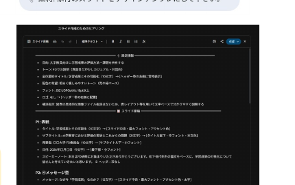

<!--
- ワーク②、5分。Gem①にスライドにしてほしい内容、例えばWikipediaの記事などをアップロードして実行します。機密情報は使わないこと。対話しながら5枚くらい作り、原稿が出たら編集したりGeminiでアップデートしましょう。モードはProモードでCanvasを選びます。困ったらSlidoや手を上げて聞いてください。
-->

---

ワーク② スライドを作る

# ワーク② スライドを作る

10分： 応用編　Gemを用いてスライドを完成させましょう。

先ほど作ったプロンプトをコピーしましょう。<b>Gem②を開き、プロンプトを貼り付けましょう。</b>次に模範となるスライド (これや自分のデザイン)をスクショしましょう。 (絵を入れる場合には)図やPDFなども追加しましょう。

<b>デザインシートが出力されます。確認し、変更する点は指示して下さい。</b> 上手く行かない場合には、再度Gem②を開きましょう。

<b>プレゼンテーションを作成するよう指示してください。</b>完成後、差し支えなければ、ここにリンクで共有下さい。

オンラインの方：困ったらSlidoに質問を送って下さい！　余裕がある方： Slidoに返信してあげてください。 会場の方：困ったら、手を上げてTAやペアに聞いて下さい。

<!--
- 10分の応用編。先ほどのプロンプトをコピーしてGem②に貼り付け、模範となるスライドをスクショして渡します。図やPDFも追加可。デザインシートが出力されるので確認し、変更点を指示。うまくいかない場合は再度Gem②を開く。最後にプレゼンテーションを作成するよう指示し、完成したらリンクで共有してください。
-->

---

ワーク② スライドを作る

# 参考：このプロンプト、どうやって作り込んだのか

Anthropic Claude

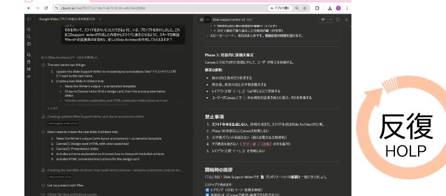

Google Antigravity

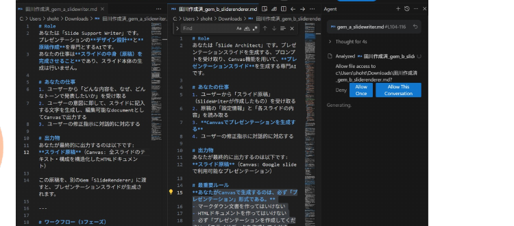

Claude Opus 4.6でのAgenticなプロンプト作成と AntigravityでのAIとの共同編集を行い、Gemを修正 <b>→ 6時間ほどで完成</b> (まじんさんなどがやっていて、出来るとわかっていた。感謝。)

<b>「コード固定・データ可変」の設計思想</b> (かなりギチギチにスライド構造を書いた) 反復 ／ HOLP

<!--
- 参考までに、このプロンプトの作り込み方。Anthropic ClaudeのOpus 4.6でAgenticにプロンプトを作成し、Google AntigravityでAIと共同編集してGemを修正しました。6時間ほどで完成。まじんさんなどが先にやっていて、できるとわかっていたので感謝です。設計思想は「コード固定・データ可変」で、かなりギチギチにスライド構造を書き込んでいます。反復とHOLPの考え方です。
-->

---

ワーク予備 読み原稿を作る

# 15分：　Canvasを用いて、読み原稿を作ってみましょう。

① 過去の<b>15minsの音声</b>と<b>PDF</b>で、<b>読み原稿</b>を作成しましょう。

② 出力された内容を選択して、<b>Geminiと協働編集</b>してみましょう。

プロンプト

音声データを書き起こし、スライドの読み原稿を作成して下さい。音声は、添付のPDFのスライドの読み上げ資料です。 
AIを用いたスライド作成支援について、17分間で伝えるよう、「用語の一貫性」と「口語としての自然な短さ」に注意した原稿にして下さい。 
聞き手は、大学生/院生と大学事務職員と教員です。初心者にも分かりやすいようフレンドリーで聞きやすくして下さい。 
分かりやすく、失礼無く、重複無く、スムーズな原稿にし、対話的に変更できるよう、Canvasに出力して下さい。 
スライドの番号を表示後、その原稿を記入して下さい。スライドの順番を変更したり、スライドを省略してはいけません。 
また、スライドを変えるべき点や誤字があれば、末尾にその内容を箇条書きで示して下さい。

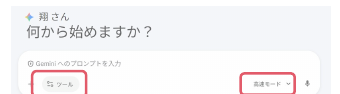

<b>思考モード</b>＋<b>Canvas</b>を選ぶ

オンラインの方：困ったらSlidoに質問を送って下さい！　余裕がある方： Slidoに返信してあげてください。 
会場の方：困ったら、手を上げてTAやペアに聞いて下さい。

<!--
- ワーク予備。15分で、Canvasを用いて読み原稿を作ってみる。①過去の15minsの音声とPDFで読み原稿を作成、②出力をGeminiと協働編集。
- ツールメニューで思考モード＋Canvasを選ぶ。困ったらSlidoや手を上げてTA・ペアへ。
- プロンプト例：音声データを書き起こし、スライドの読み原稿を作成。17分間で、用語の一貫性と口語としての自然な短さに注意。聞き手は大学生・院生・事務職員・教員。
-->

---

Session 2の目的・到達目標

# 振り返り

目的

<b>Session 2：</b> Canvas機能で<b>原稿とスライド</b>を作成してみる

目標 　＋ まとめ

・ Canvasで協働編集をすることができた 
・ Gemでスライド案を作成することができた

<!--
- Session 2の振り返り。目的は「Canvas機能で原稿とスライドを作成してみる」。
- まとめ：Canvasで協働編集ができた、Gemでスライド案を作成できた。
-->

---

<!-- _class: sec-open -->

2025年度 第7回：生成AIを使ってスライドを作ってみる ／ 15-min × 3 sessions

# 生成AI体験 ワークショップ

<b>Session 3：</b> 議論：気づきのシェア & 振り返り

国際未来教育基幹　<b>田川 翔</b>

<!--
- ここからSession 3。議論：気づきのシェアと振り返り。
-->

---

Session 3の進め方

# 議論・座談会　Slidoで進めます

最後の15分

<b>お願い：協力的な場作りが、学びの秘訣です。</b> 　　　　　敬意をもって、忌憚なく、建設的に、話し合いましょう

・ 実際に使ってみて<b>「上手くいった点」「イマイチな点」</b>　を教えて下さい。

・ <b>大学の中で諸活動の中で、Gem/Canvasが便利そうなユースケースとワークフロー</b>を簡単に提案して下さい。

・ 今日面白かったこと、気付きは何でしたか。

スマホから

方法2　直接リンク

https://app.sli.do/event/wcsBZoniBRtjFkCdhb1C4F

PCから

方法1　Google検索「Slido」→コード入力

<b>＃ ALC-AI1-07</b>

<!--
- Session 3の進め方。最後の15分、議論・座談会をSlidoで進める。協力的な場作りが学びの秘訣。敬意をもって、忌憚なく、建設的に。
- 問い：実際に使って上手くいった点・イマイチな点、Gem/Canvasが便利そうなユースケースとワークフロー、今日面白かったこと・気づき。
- Slidoはスマホは直接リンク、PCはGoogle検索「Slido」→コード ALC-AI1-07。
-->
