<!-- _class: message -->

▣

Join at slido.com

#bio-ai-0702

The Slido app must be installed on every computer you're presenting from

---

<!-- _class: message -->

☑

生成AIは日頃、どのくらい使う？

The Slido app must be installed on every computer you're presenting from

---

<!-- _class: message -->

☑

AIを何に使っている？(複数回答可)

The Slido app must be installed on every computer you're presenting from

---

日常での活用

# 生成AIの活用領域　テキスト生成

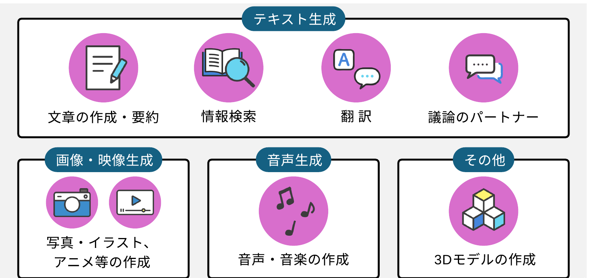

総務省『生成AIはじめの一歩〜生成AIの入門的な使い方と注意点〜』

<!--
- 生成AIの日常での活用領域を、テキスト生成（文章作成・要約／情報検索／翻訳／議論のパートナー）、画像・映像生成、音声生成、その他（3Dモデル）の4区分で概観する。
-->

---

日常での活用

# 生成AIの活用領域

何をしたか

プライバシーの保護を保った状態で、400万以上のClaude.aiの会話を分析 米国労働省のO*NET実会話DBから類似性分類 →どの経済的タスクにAIが利用されているか把握

全体として分かったこと

① Software 開発とWritingで半分

② 36%の職業にAIが利用されている

③ スキル増強：自動化 = 57 : 43

教育での利用　チュータリングタスクが多い

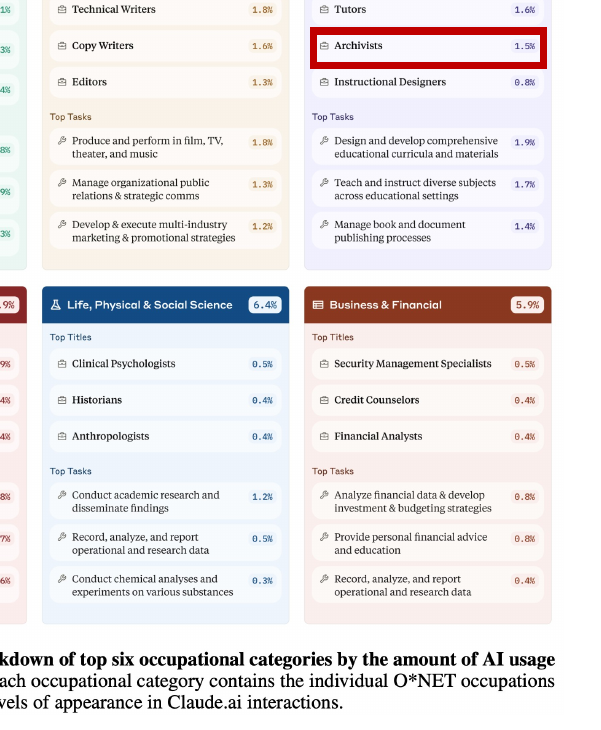

Anthropic (2025 ArXiv)

<!--
- Anthropicが400万超のClaude.aiの会話をプライバシー保護のうえ分析し、米国労働省O*NETの実会話DBと類似性分類した研究。Software開発とWritingで半分、36%の職業で利用、スキル増強：自動化=57:43、教育ではチュータリングが多い。
-->

---

<!-- _class: message -->

申請者紹介

☁

AIってどう思う？

The Slido app must be installed on every computer you're presenting from

---

生成AI時代の英語学習？

# 生成AIができること

語学学習について、生成AIができること

①英語はきれいに翻訳できて、質問、解説ができる 
②学び方を学ぶことができる 
③メタ言語能力を理解できる

その他

①問題を出したり、覚えることを整理してもらう 
②ロール・プレイする、英会話する 
③文章を添削する

<!--
- 生成AIは、大学の学びをどのように変えるのでしょうか。
- 本日、「個別最適な高等教育の生成」というテーマで提案させていただきます。田川と申します。どうぞよろしくお願いいたします。
-->

---

生成AI時代の英語学習？

# メタ言語能力の質問例

「国境の長いトンネルを抜けると、雪国であった」という文章と、「The train came out of the long tunnel into the snow country.」はどう違いますか？　日本人が日本語から受ける描写と、英米人が英語から受ける感覚は、どのように違うでしょうか？

Canと、Couldで依頼する際、どのようにニュアンスは変わりますか？

アカデミック・ライティングは難しいですか？どんな学び方ができますか？

「私は猫舌だ」という訳はなんですか？

論文で、時制はどのように影響しますか？

To 不定詞は論文のイントロで多く用いられる？それはなぜ？

<!--
- 生成AIは、大学の学びをどのように変えるのでしょうか。
- 本日、「個別最適な高等教育の生成」というテーマで提案させていただきます。田川と申します。どうぞよろしくお願いいたします。
-->

---

<!-- _class: message -->

皆で試す、チャットボット

生成AIを活用した英語論文執筆支援ツールの教育的効果および心理的な影響の検証についての研究

生成AIは、大学の学びをどう変えるのか？

ご協力のほど、宜しくお願い致します

<!--
- 生成AIは、大学の学びをどのように変えるのでしょうか。
- 本日、「個別最適な高等教育の生成」というテーマで提案させていただきます。田川と申します。どうぞよろしくお願いいたします。
-->

---

研究の概要

# 研究の概要

<b>本研究の目的：</b>①生成AIが英語論文執筆における態度・技能の変化に与える影響を明らかにする。 ②大学における学習支援のための生成AIツールの開発に必要な知見を得る。

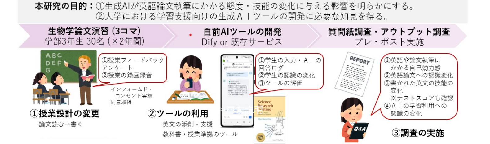

<b>Key word：</b>生成AIを自らの学びの支援の道具に使用する／生成AIを用いた学習支援の展開　同時に、人文的な研究の方法も学んでみて下さい <b style="font-size:25px;">詳細は、皆様のお手元の説明書を読んで下さい</b>

<!--
- 生成AIは、大学の学びをどのように変えるのでしょうか。
- 本日、「個別最適な高等教育の生成」というテーマで提案させていただきます。田川と申します。どうぞよろしくお願いいたします。
-->

---

ご協力のお願い

# ご協力いただける方へ

<b>ご協力いただける方へ</b> 
同意書提出→右のフォームより実施して下さい。 
https://forms.gle/yED8MBYTcr9FN8Vx8

参加を拒否されても、授業評価や成績に一切影響はありません。 また、いったん同意した後でも、いつでも理由を問わず参加を撤回することができます。 その場合も不利益は一切生じません。

<!--
- 生成AIは、大学の学びをどのように変えるのでしょうか。
- 本日、「個別最適な高等教育の生成」というテーマで提案させていただきます。田川と申します。どうぞよろしくお願いいたします。
-->

---

プレアンケート

# プレアンケート　(10 – 15分間)

https://forms.gle/6uLLFQkrBxwtjq128

ご協力のほど、宜しくお願い致します

<!--
- 生成AIは、大学の学びをどのように変えるのでしょうか。
- 本日、「個別最適な高等教育の生成」というテーマで提案させていただきます。田川と申します。どうぞよろしくお願いいたします。
-->

---

Difyとは

# Difyとは

🤖

model

<b>Modelだけでは、動くことが出来ません</b> 　入力、出力、他との接続 (mcp、AI、ツール、参考書 etc…)

<b>AIを組合せることで、様々な複雑な処理が可能になります</b> 　入力の分類、出力の分析、音声処理、画像処理…

<b>AIに道具をもたせて、現実的な処理ができるようになります</b> 　RAG、データベース、書籍、時計、天気予報…

<b>開発には、メタな視点が必要です</b> 　CI/CD、ログ管理、出力評価、MLOps、DB、セキュリティ…

この全部が”ある程度 (=モックアップ稼働まで)”できるのが、<b>AIプラットフォーム”Dify”</b>です

---

チャットボット

# チャットボット

https://cu-dify.ai-ue-o.jp/chat/rBL531DwFVl8zSLa

①<b>nickname</b>を打つ

②<b>質問</b>を打つ

③ゼロから話すと 　新チャットへ

💬 Writing支援bot

📝 Start New chat

New chat setup

nickname

shoh

🤖 shohさん、こんにちは！

<!--
生成AIは、大学の学びをどのように変えるのでしょうか。 / 本日、「個別最適な高等教育の生成」というテーマで提案させていただきます。田川と申します。どうぞよろしくお願いいたします。
-->

---

生成AI時代の英語学習？

# 論文作成支援チャットボット(AWSに閉じた環境で流出しません)

https://cu-dify.ai-ue-o.jp/chat/rBL531DwFVl8zSLa

今日のゴール書いてきた論文をAIとリバイズする

<b>① まずは、AIに書いてきた全文を入力してみよう。</b>

<b>② その後、10分間、様々質問して論文を書き換えよう</b>

- テーマの妥当性はどうだろう？

- 文法は？ニュアンスは？

- ネイティブはどう思う？

→その後、全員で、良い質問・回答があったら、共有！

<!--
生成AIは、大学の学びをどのように変えるのでしょうか。 / 本日、「個別最適な高等教育の生成」というテーマで提案させていただきます。田川と申します。どうぞよろしくお願いいたします。
-->

---

<!-- _class: message -->

申請者紹介

💬

良い質問・回答の例を コピペして下さい。

---

生成AI時代の英語学習？

# 補足Prompt集

時制を使い分ける、４択問題を出してみて。 日本語でどの時制が良さそうか選らんで理解を確かめたい。

この単語の語源はなに？

この図の読み方を誤解が無いように説明して

この文章の構造は？

この文章を、中学生にでもわかる英語に変えて

より自然な英文にかえてみて

<!--
生成AIは、大学の学びをどのように変えるのでしょうか。 / 本日、「個別最適な高等教育の生成」というテーマで提案させていただきます。田川と申します。どうぞよろしくお願いいたします。
-->

---

<!-- _class: message -->

申請者紹介

💬

論文執筆、何が難しかった？ それを、AIはどう支援できそう？

---

AI agent

# AI agent

<b>グラウンディング：</b>AIが生成する回答を、特定の信頼できる情報源（ソース）にしっかりと結びつける技術

昔：

AI

→

回答

今：

データ

→ AI →

回答

<b>「因果推論」「思考ツール」</b>になりつつある

<b>“ガチャ”状態：</b> 当たりまで何回もデータ・指示を変え試す

---

AIの性能

# AIの性能

https://huggingface.co/spaces/lmarena-ai/chatbot-arena-leaderboard

<table style="font-size:17px; width:100%; border-collapse:collapse;">
<thead>
<tr style="border-bottom:2px solid #999;">
<th style="text-align:left; padding:4px 6px;">Model</th><th>Overall</th><th>Overall_style</th><th>Hard Prompts</th><th>Coding</th><th>Math</th><th>Creative Writing</th><th>Instruction Following</th><th>Longer Query</th><th>Multi- Turn</th>
</tr>
</thead>
<tbody style="text-align:center;">
<tr><td style="text-align:left;">gemini-2.5-pro-preview-06-05</td><td>1</td><td>1</td><td>1</td><td>1</td><td>1</td><td>1</td><td>1</td><td>1</td><td>1</td></tr>
<tr><td style="text-align:left;">gemini-2.5-pro-preview-05-06</td><td>2</td><td>2</td><td>2</td><td>2</td><td>1</td><td>1</td><td>1</td><td>1</td><td>1</td></tr>
<tr><td style="text-align:left;">gemini-2.5-flash-preview-05-20</td><td>3</td><td>5</td><td>3</td><td>2</td><td>1</td><td>2</td><td>3</td><td>1</td><td>5</td></tr>
<tr><td style="text-align:left;">o3-2025-04-16</td><td>3</td><td>2</td><td>3</td><td>2</td><td>1</td><td>5</td><td>4</td><td>9</td><td>4</td></tr>
<tr><td style="text-align:left;">chatgpt-4o-latest-20250326</td><td>3</td><td>4</td><td>5</td><td>3</td><td>8</td><td>3</td><td>4</td><td>3</td><td>1</td></tr>
<tr><td style="text-align:left;">grok-3-preview-02-24</td><td>4</td><td>8</td><td>4</td><td>3</td><td>8</td><td>3</td><td>4</td><td>3</td><td>4</td></tr>
<tr><td style="text-align:left;">gpt-4.5-preview-2025-02-27</td><td>6</td><td>4</td><td>5</td><td>5</td><td>4</td><td>5</td><td>4</td><td>5</td><td>2</td></tr>
<tr><td style="text-align:left;">claude-opus-4-20250514</td><td>10</td><td>6</td><td>7</td><td>5</td><td>5</td><td>4</td><td>7</td><td>4</td><td>5</td></tr>
</tbody>
</table>

---

生成AI-生物論文

# 今日のゴール

書いてきた論文をAIとリバイズする

<b>① まずは、AIに書いてきた全文を入力してみよう。</b>

<b>② その後、10分間、様々質問して論文を書き換えよう</b>

- テーマの妥当性はどうだろう？

- 文法は？ニュアンスは？

- ネイティブはどう思う？

→その後、全員で、良い質問・回答があったら、共有！

<b>③ 他の人の気付きを活かしつつ、</b> 　残りの時間で、文章を書き換えて見ましょう

<!--
生成AIは、大学の学びをどのように変えるのでしょうか。 / 本日、「個別最適な高等教育の生成」というテーマで提案させていただきます。田川と申します。どうぞよろしくお願いいたします。
-->

---

①生成AIとは、なにか

# AIはいろいろなところにすでにある

<b>AIの定義 (例)</b>　人間の思考プロセスと同じような形で動作するプログラム／人間が知的と感じる情報処理やそれを行う科学・技術

『R6 科学技術イノベーション白書 (第一章)』文部科学省 (2024)

<b>ChatGPT</b>などの生成AI以外にも、生活の中でいつの間にか、たくさん触れている

この絵もAIが書いた！

<b>注：</b>目的関数が、エンゲージや売上をあげるなど、「サービス提供側 (≠あなた)」にしか利益を与えない場合もある cf. 『マインドハッキング: あなたの感情を支配し行動を操るソーシャルメディア』　ワイリー (2020)

<!--
では、AIを理解するうえで重要なことを説明していきましょう。 /  / AIの定義は決まっていませんが、人間が知的と感じる情報処理やそれを行う科学・技術といった説明がなされがちです。 /  / まず、１つ目は、AIはいろいろなところにすでにある、ということです。皆さんがAmazonを開いたら、おすすめが出てきたりしますよね。スマホの音声操作もそうです。私たちの声を認識し、検索したり、アクションをしますよね。その他にも、画像の分析や診断だったり、自動運転だったりにも、応用されつつあります。もはや、AIといえるものは、皆さんの周りに普通に存在しているんですね。
-->

---

①生成AIとは、なにか

# AIの発展年表

『R6 総務省 情報通信白書』　総務省(2024)

<!--
ちょっと歴史を紐解いてみましょう。アーティフィシャルインテリジェンスという言葉が現れたのは、1956年年です。 / その後、アルゴリズムであったり、ルールベースのAIだったりが流行りました。しかし、コンピューターの性能やプログラムのメンテナンスだったり課題はたくさんあって、まだSFのようなものと捉えられていたんですね。 /  / そんななか、ハードウェアの向上によって、とある技術が大発展を遂げることになります。その技術の名前は、機械学習、英語では、マシンラーニングといいます。 / IBMの研究者であるアーサー・サミュエルが、1959年に定義づけました。かれは、機械学習を「明示的にプログラムされることなく、経験から学習する能力をコンピューターに与える学問領域」として定めたんですね。 / これは、従来のルールベースとまったく異なります。コンピュータ自体が、何らかの方法で、与えたデータからパターンを見出し、予測や判断を行うアプローチだったわけです。
-->

---

3　背景を知る

# ワーク：ハルシネーションの例

AIで作成したツール

AIで作成したツール

https://claude.ai/public/artifacts/22fda9cd-0688-4887-a74b-53867fab0945

<b>AIで回答した例</b> 　若干不自然だが(記述式では減点？)、合格

https://chatgpt.com/share/684a0bd1-b198-8004-81ce-807f626ed962

出力例：<b>6/12</b>

---

ワーク：ハルシネーションの例

# 3　背景を知る

【問題】aを実数の定数とする。xについての方程式 |x² − 2x − 3| = a(x − 2) の、異なる実数解の個数を求めよ。

思考プロセスをステップバイステップで詳細に記述しながら、結論を導き出してください。

<b>この問題を直接貼り付けて、AIに解かせてみて下さい。</b>

誤った回答の例

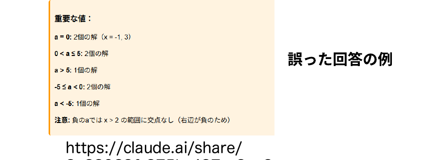

Gemini 2.5 flash

出力例：6/12

<b>なんで、こんなトンチンカンなことになるのか？</b> そのためには、機械学習を考えることになります<b>…</b>

<!-- ワーク：ハルシネーションの例。Gemini 2.5 flash にこの数学の問題を解かせると、出力例6/12で誤答する。なぜこんなトンチンカンなことになるのか？それを理解するには、機械学習を考えることになる。 -->

---

①生成AIとは、なにか

# データの関係性をどう考えるか

<table style="border-collapse:collapse; width:760px; text-align:center; font-size:40px;">
<thead>
<tr style="background:#4C9A3A; color:#fff;"><th style="padding:14px 0;">x</th><th style="padding:14px 0;">f(x)</th></tr>
</thead>
<tbody>
<tr style="background:#D7E8CE;"><td style="padding:12px 0;">1</td><td style="padding:12px 0;">3</td></tr>
<tr style="background:#EAF3E4;"><td style="padding:12px 0;">2</td><td style="padding:12px 0;">5</td></tr>
<tr style="background:#D7E8CE;"><td style="padding:12px 0;">3</td><td style="padding:12px 0;">7</td></tr>
<tr style="background:#EAF3E4;"><td style="padding:12px 0;">4</td><td style="padding:12px 0;">?</td></tr>
</tbody>
</table>

<!-- ちょっと問題をだしてみましょう。正解も何もないので、頭の体操としてきいて下さい。f(1)=3、f(2)=5、f(3)=7と数が並んでいた時、f(4)はなんだと思いますか？ -->

---

①生成AIとは、なにか

# データの関係性をどう考えるか

<table style="border-collapse:collapse; width:100%; table-layout:fixed; text-align:center; font-size:26px;">
<thead><tr style="background:#4C9A3A; color:#fff;"><th style="width:40%; padding:6px 0;">x</th><th style="width:60%; padding:6px 0;">f(x)</th></tr></thead>
<tbody>
<tr style="background:#D7E8CE;"><td style="padding:5px 0;">1</td><td style="padding:5px 0;">3</td></tr>
<tr style="background:#EAF3E4;"><td style="padding:5px 0;">2</td><td style="padding:5px 0;">5</td></tr>
<tr style="background:#D7E8CE;"><td style="padding:5px 0;">3</td><td style="padding:5px 0;">7</td></tr>
<tr style="background:#EAF3E4;"><td style="padding:5px 0;">4</td><td style="padding:5px 0;">?</td></tr>
</tbody>
</table>

変換する「<ruby>函<rt style="font-size:.5em;">ブラックボックス</rt></ruby>」

確率・統計的に処理
正解が出てくるとは限らない

<b>ブラックボックス内を理解する手法は開発中</b> e.g. Anthropic (2025) AI顕微鏡

ルールベースの世界観 (設計者が教えておく)

- 解析的に解くよ

　- 等差数列っぽい？ <b style="color:var(--tag-blue);">→ Yes</b>

　　- f(x) = 2x+1？

　　　- ならば9と予想

機械学習の世界観 (もっとたくさん学習！)

- 入力されたデータからパターンをコンピュータが探索・発見

　- <b>f(x)自体は気にしない</b>

　　- 9とか11？

データの関係性の捉え方が<b>根本的に違う</b>

<!-- ルールベースの世界に生きるAIは、解析的な解き方を教えられている。たとえば一次式を試して、f(x)=2x+1なのでx=4で9だぞ、と。でも、機械学習的な世界では、このf(x)がどうなっているかはどうでも良い。xとf(x)の関係性を学習し、次を予測するだけ。f(x)の式そのものはブラックボックスで全然構わない。9以外にも11とかも言ってくるかもしれない。データの関係性の捉え方が根本的に違う。ブラックボックス内を理解する手法は開発中（e.g. Anthropic 2025のAI顕微鏡）。 -->

---

①生成AIとは、なにか

# 深層学習 (ディープラーニング)

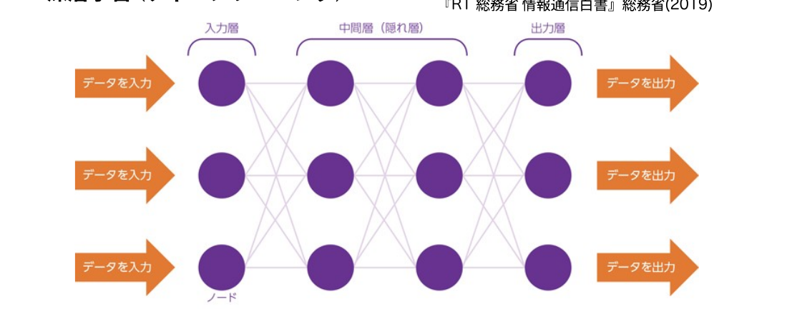

- 人間の神経細胞（ニューロン）のように、各ノードが層をなして接続されるものがニューラルネットワーク - 中間層（隠れ層）が複数の層となっているものを用いるものが深層学習

<b>2012年</b>、Googleの キャットペーパー 
（「猫」を教えていなかったのに、写真から猫の特徴を抽出） 
ヒントンらによる画像認識のブレークスルー 
<b>2016年</b>、世界トップレベルのプロ囲碁棋士に勝利 (囲碁専用ではない)

ノーベル賞

2024年

(PD)

<b>物理学：</b>人工ニューラルネットワークによる機械学習を可能にする基礎的な発見と発明 <b>ジョン・ホップフィールド</b>　物理学者・分子生物学者 <b>ジェフリー・ヒントン</b>　生理学・哲学→実験心理学→コンピューター科学

<b>化学 (一部)：</b>タンパク質プログラムの開発 <b>デミス・ハサビス</b>　人工知能研究者、神経科学者 <b>ジョン・M・ジャンパー</b>　固体物理学→理論化学→計算生物学

『R1 総務省 情報通信白書』総務省 (2019)

<!-- このブラックボックス部分をどんな形にするか、という設計はある。人工ニューラルネットワーク、その発展型である深層学習(Deep Learning)。今年のノーベル賞でもある。複数のパラメータを配置することで、学習したデータとは異なるものを確率的につくることができる。意味を直接設計しようとするアプローチではなく、機械的に膨大なパラメータから意味を生成する方法が、いまのAIの背景にある。 -->

---

箱としての、ディープラーニング (深層学習)

# 3　背景を知る

言語型の大規模言語モデル (生成AIの中身) の本質

ネクストワードプレディクション

日本の首都__　→　日本の首都は__　→　日本の首都は東京__

これまでのコンテキストから、次の言葉（トークン）の確率を予想する問題

学習

入力 文字

パラメーター の函

数字の羅列

出力

更新 ↺

評価

GPT 4の場合、アメリカ議会図書館の<b>全蔵書の約22倍</b>に相当? ※書籍、記事、ウェブサイト、コードなど幅広いテキストソース

<!-- 生成AIでよく想像されるのは、ChatGPTのような言語を扱うAI。これもニューラルネットワークモデルで、インプットされたデータが複数の層を通って出力される。言葉を操る生成AIは、ネクストワードプレディクション、つまり次に出てくる言葉の予測を行うAI。さっき言っていた「函」はこれ全部にあたる。学習のフローは、入力テキストの準備→トークン化→モデルの予測→正解トークンとの比較で誤差を計算→誤差逆伝播→パラメータの更新、を繰り返す。GPT4の学習データはアメリカ議会図書館の全蔵書の約22倍に相当するとも言われる。 -->

---

ハルシネーション

# ChatGPTの現状

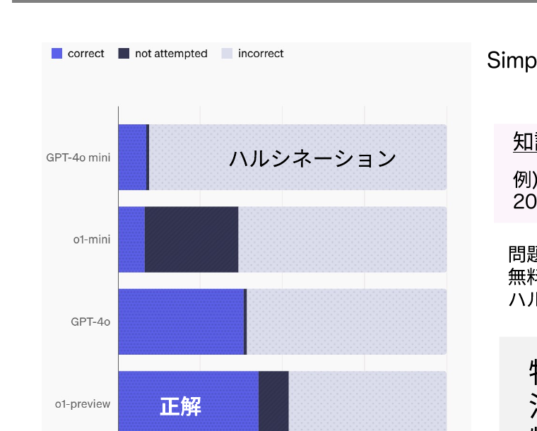

SimpleQA：回答の事実的正確性のベンチマーク Wei et al. (2024) <i>Arxiv</i>

<u>知識のエッジ(=学習回数小)にある内容も含めてある</u> 例) Q. Who received the IEEE Frank Rosenblatt Award in 2010? A. Michio Sugeno

問題を解かせたり、論文を探させた場合等、無料版である<b>4o mini</b>は、「分からない」ということもなく、ハルシネーションする可能性が高い

特定の専門知識は、回答が誤りうるので<b>注意する！</b> 特に、研究の専門的知識。

<!-- SimpleQAは回答の事実的正確性のベンチマーク（Wei et al. 2024 Arxiv）。知識のエッジ、つまり学習回数の小さい内容も含めてある。例えばQ. Who received the IEEE Frank Rosenblatt Award in 2010? に対しA. Michio Sugeno など。問題を解かせたり論文を探させた場合、無料版の4o miniは「分からない」と言うこともなくハルシネーションする可能性が高い。特定の専門知識、特に研究の専門的知識は回答が誤りうるので注意する。 -->

---

AIの社会的影響

# 参考： 職業への影響

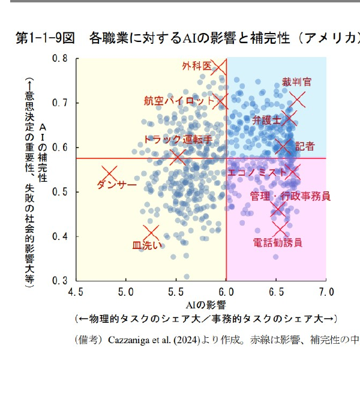

<b>AIの影響が大きく、代替性が高い職業：</b>事務的タスクのシェアが大きい職業。▶ つまり、AIがとって変わってしまう職業

<b>AIの影響が大きく、補完性が高い職業：</b>事務的タスクのシェアが大きいものの、意思決定の重要性が高く、AI任せとすることが社会的に望ましくない職業。▶ AIを使いこなす必要のある職業

<b>AIの影響の小さい職業：</b>物理的タスクのシェアが大きい職業。

※ 教員・研究者(自然科学系)は、青の領域

<b>内閣府 (2024)</b> <i>世界経済の潮流</i>＞第1章＞p.13

<!-- ハンプサイクル。AIの影響が大きく代替性が高い職業（事務的タスク中心）はAIがとって変わってしまう。AIの影響が大きく補完性が高い職業はAIを使いこなす必要がある。AIの影響が小さいのは物理的タスク中心の職業。教員・研究者（自然科学系）は青の領域にある。 -->

---

<!-- _class: message -->

英語論文書くのは 思ったよりもできそう

<!-- 英語論文を書くのは、思ったよりもできそう。 -->

---

講師の思い

# 生成AIは、英語学習や論文執筆に役立つのでは？

(多分そう)

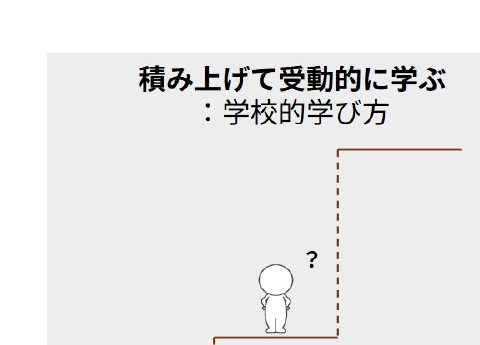
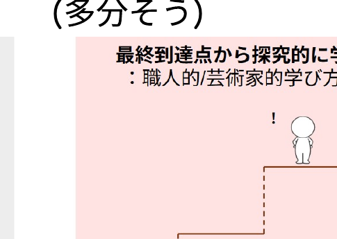
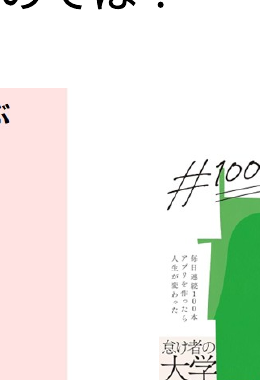

生成AIを使いこなせるようになれば、<b>研究で頑張りたいこと、興味あること、学びたいことに、もっと取組みやすくなり、夢を叶えやすくなる</b>のではないか？

<!-- 生成AIは、英語学習や論文執筆に役立つのではないか（多分そう）。積み上げて受動的に学ぶ学校的な学び方と、最終到達点から探究的に学ぶ職人的・芸術家の学び方がある。生成AIを使いこなせるようになれば、研究で頑張りたいこと、興味あること、学びたいことに、もっと取組みやすくなり、夢を叶えやすくなるのではないか。 -->

---

重要なこと

# 重要なこと

重要な力1

AIと対話の文脈を作る <b style="font-size:25px;">= 思考錯誤し、自分が必要な支援を引き出す</b>

自分が積極的にAIに問いかけてみる / 適切な情報一覧を与えてあげる 自分が動かないと、AIは良い回答を出してくれない。能動的に。

重要な力2

<b style="font-size:27px;">ハルシネーションの発生を念頭に、信頼できる情報を見極める。</b>

多分、ハルシネーションしたり、社会・概念のフレームを理解しない回答をしたりしている “Notebook LMは、高校生でもつかえるんですか?”　正解：いいえ。年齢制限のため、使えません。

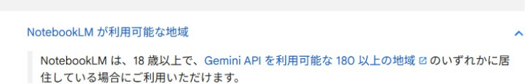

AIも、生徒と同じで、正しい判断ができるためには、<b>正しい事前知識をプロンプトに入れてあげる</b>と良い

<!-- AIと対話の文脈を作る、つまり試行錯誤し自分が必要な支援を引き出すことが重要な力1。自分が積極的にAIに問いかけ、適切な情報一覧を与えてあげる。自分が動かないとAIは良い回答を出してくれない。能動的に。重要な力2は、ハルシネーションの発生を念頭に、信頼できる情報を見極めること。例えば“Notebook LMは、高校生でもつかえるんですか?”の正解は、いいえ、年齢制限のため使えません。AIも生徒と同じで、正しい判断ができるためには、正しい事前知識をプロンプトに入れてあげると良い。 -->

---

次回までの課題

# 次回までの課題

来週まで、チューターAIを開放しています。 
来週、アップデートした完成版を持ってきて下さい。  
<b>4段階モデルには従った内容にして下さい</b>  
<b style="color:var(--accent-dark);">お疲れ様でした</b>

<!-- 来週まで、チューターAIを開放しています。来週、アップデートした完成版を持ってきて下さい。4段階モデルには従った内容にして下さい。お疲れ様でした。 -->

---

皆で試す、チャットボット

皆で試す、チャットボット

生成AIを活用した英語論文執筆支援ツールの教育的効果および心理的な影響の検証についての研究

生成AIは、大学の学びをどう変えるのか？

後半

<!-- 皆で試す、チャットボット。生成AIを活用した英語論文執筆支援ツールの教育的効果および心理的な影響の検証についての研究。生成AIは、大学の学びをどう変えるのか？ 後半。 -->

---

ワーク

# ワーク

採点用AIを用いて、フィードバックを得てみましょう。(15分)

①まずは変更後の全文を入力 
②対話しながら内容を更新→その後再度全文を入力　　最終版の文章を完成させて下さい 
③先週、最初の文章からどのくらい点数が変わったか　　確認してみましょう

<!--
生成AIは、大学の学びをどのように変えるのでしょうか。 / 本日、「個別最適な高等教育の生成」というテーマで提案させていただきます。田川と申します。どうぞよろしくお願いいたします。
-->

---

問いかけ

# 点数の変化を教えてください (最初→後)

受講者のみなさんへ：<b>最初の点数</b>と<b>更新後の点数</b>を共有してください

---

問いかけ

# AIのフィードバックをどのように学習に活かせそう？

受講者のみなさんへ：自由に書き込んでください

---

問いかけ

# AIの支援で良くなった点など、気がついたことはありますか？

受講者のみなさんへ：自由に書き込んでください

---

ワーク

# ワーク

一つのテーマを選び、周囲と◯分で話してみて下さい。後で伺います。

①どんなところが、AI支援前とAI支援後の差になっていますか？ 
②どんなところを、自分で学ばないといけないと思いますか？ 
<b>③AIを学びに活かす方法を考えて下さい？</b>

過去問を入れて予想問題を入れる / 授業の情報を加工する 
難しい概念を分かりやすく説明する / 哲学っぽく/ 
① / ③自分の足りてない部分をAIに補ってもらう。例：英語だと、自分が苦手→修正されたことを自分で活かす

<!--
生成AIは、大学の学びをどのように変えるのでしょうか。 / 本日、「個別最適な高等教育の生成」というテーマで提案させていただきます。田川と申します。どうぞよろしくお願いいたします。
-->

---

問いかけ

# 良い質問はありましたか。

受講者のみなさんへ：印象に残った質問を共有してください

---

ポストアンケート

# ポストアンケート (10 – 15分間)

https://forms.gle/1n5UfpmTvDRQjare8

QRコード

ご協力のほど、宜しくお願い致します

<!--
生成AIは、大学の学びをどのように変えるのでしょうか。 / 本日、「個別最適な高等教育の生成」というテーマで提案させていただきます。田川と申します。どうぞよろしくお願いいたします。
-->

---

生成AIは学ぶ道具になるか

# 共同知能 Co-Intelligence

AIは人と異なる知能である。「異星人の心」でありいくら人間っぽくても、性質が違う。

共同知能についての4つのルール

AIを参加させる。 
人間参加型のデザインにする。 
AIにペルソナを与える。 
今使っているAIは、今後使用するどのAIよりも劣悪と仮定する。

これだけでは、不十分かもしれない→自分なりに関わり方を考える

例) でてきた情報を、批判的に考える 
例) 自分で考えることと利用することのバランスを取る

他人が創ったAIのアルゴリズムが、思考に影響する可能性を認識する

Mollick (2024). 『これからのAI、正しい付き合い方と使い方』 久保田訳

<!--
正しくないかもしれない
-->

---

生成AIは学ぶ道具になるか

# 共同知能 Co-Intelligence

AIは人と異なる知能である。「異星人の心」でありいくら人間っぽくても、性質が違う。例えば、、、

AI

たくさん考えるのは得意！

言葉にするのは得意！ニュアンスさえも。

人

一番本質を見抜くのが得意！

<b>感覚的にわかる！</b> なぜか間違わない。

→ AIをアイデア出し・ブレインストーミングにつかってはどうか 
※自分がすることや「なぜ」をAIに聞くのは筋が悪い

→ AIが持っていない、タイプの知がある？

Mollick (2024). 『これからのAI、正しい付き合い方と使い方』 久保田訳

---

生成AIは学ぶ道具になるか

# 学びのための活用例

<b>なぜ誤答だったのか、聞いてみる</b> ※直接聞くより間違えにくい

自分は、〇〇と答えたけども、答えは△だった。自分はどこで勘違いしたのか？

<b>精緻的質問をしてみる</b> ※読書にも有効

なぜそうなっているのか？どのようになっているのか？

<b>他の捉え方を聞いてみる</b> ※読書にも有効

△について、自分は、〇〇と考えた。他の考え方はあるか。

<!--
正しくないかもしれない
-->

---

生成AIは学ぶ道具になるか

# 学びのための活用例

<b>関連付け</b>

△について習ったことがある。□になりたい。◯はどう関係するのか？☓のいい比喩はないか？

<b>リフレクションや言語化のシミュレーション</b>

〇〇と言葉にしたけど伝わる?復習したいからコーチして

<b>英語で話してみる</b> ※文法は完璧

I'm preparing for an upcoming presentation about AI…

<!--
正しくないかもしれない
-->

---

生成AI時代の英語学習？

# まとめ

生成AIを、<b>答えを聞く道具</b>ではなく、 
<b>自分の学びを促進する道具</b>として使ってみよう 
※ 特に、物事の関係性やニュアンス、自分の回答から得た質問を聞いてみよう

学び方を自分で開発していこう！

<b>AIとどうか変わるか、考えていこう。</b> 
　→メタプロンプトを考えるなど

※ 論文を作成するうえでは、AIでも十分な性能が出るようになった

<!--
生成AIは、大学の学びをどのように変えるのでしょうか。 / 本日、「個別最適な高等教育の生成」というテーマで提案させていただきます。田川と申します。どうぞよろしくお願いいたします。
-->
