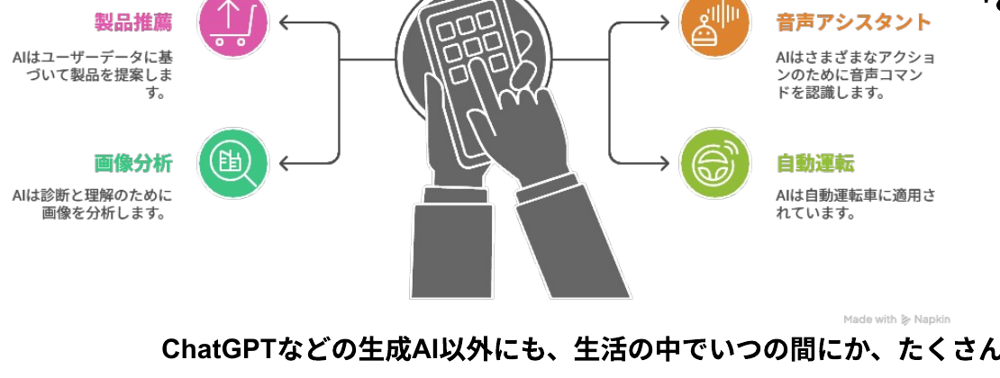
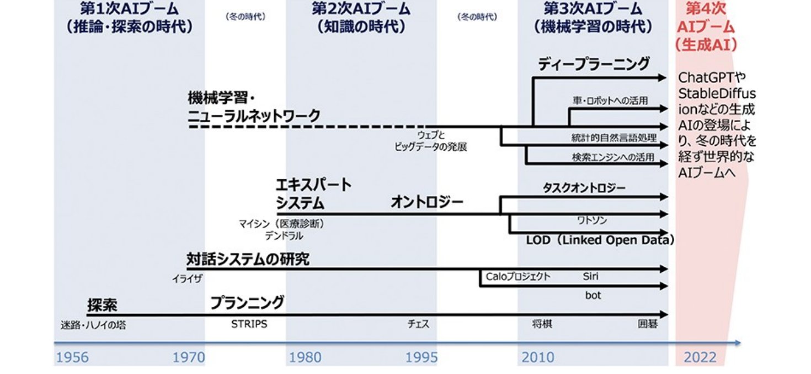
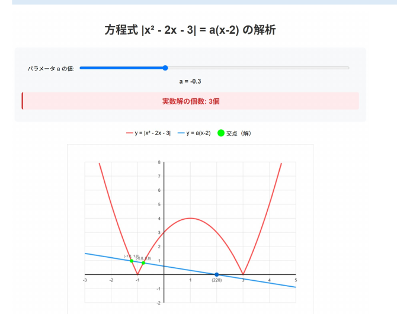

Difyとは

# Difyとは

🤖

model

<b>Modelだけでは、動くことが出来ません</b> 　入力、出力、他との接続 (mcp、AI、ツール、参考書 etc…)

<b>AIを組合せることで、様々な複雑な処理が可能になります</b> 　入力の分類、出力の分析、音声処理、画像処理…

<b>AIに道具をもたせて、現実的な処理ができるようになります</b> 　RAG、データベース、書籍、時計、天気予報…

<b>開発には、メタな視点が必要です</b> 　CI/CD、ログ管理、出力評価、MLOps、DB、セキュリティ…

この全部が”ある程度 (=モックアップ稼働まで)”できるのが、<b>AIプラットフォーム”Dify”</b>です

---

チャットボット

# チャットボット

https://cu-dify.ai-ue-o.jp/chat/rBL531DwFVl8zSLa

①<b>nickname</b>を打つ

②<b>質問</b>を打つ

③ゼロから話すと 　新チャットへ

💬 Writing支援bot

📝 Start New chat

New chat setup

nickname

shoh

🤖 shohさん、こんにちは！

<!--
生成AIは、大学の学びをどのように変えるのでしょうか。 / 本日、「個別最適な高等教育の生成」というテーマで提案させていただきます。田川と申します。どうぞよろしくお願いいたします。
-->

---

生成AI時代の英語学習？

# 論文作成支援チャットボット(AWSに閉じた環境で流出しません)

https://cu-dify.ai-ue-o.jp/chat/rBL531DwFVl8zSLa

今日のゴール書いてきた論文をAIとリバイズする

<b>① まずは、AIに書いてきた全文を入力してみよう。</b>

<b>② その後、10分間、様々質問して論文を書き換えよう</b>

- テーマの妥当性はどうだろう？

- 文法は？ニュアンスは？

- ネイティブはどう思う？

→その後、全員で、良い質問・回答があったら、共有！

<!--
生成AIは、大学の学びをどのように変えるのでしょうか。 / 本日、「個別最適な高等教育の生成」というテーマで提案させていただきます。田川と申します。どうぞよろしくお願いいたします。
-->

---

<!-- _class: message -->

申請者紹介

💬

良い質問・回答の例を コピペして下さい。

---

生成AI時代の英語学習？

# 補足Prompt集

時制を使い分ける、４択問題を出してみて。 日本語でどの時制が良さそうか選らんで理解を確かめたい。

この単語の語源はなに？

この図の読み方を誤解が無いように説明して

この文章の構造は？

この文章を、中学生にでもわかる英語に変えて

より自然な英文にかえてみて

<!--
生成AIは、大学の学びをどのように変えるのでしょうか。 / 本日、「個別最適な高等教育の生成」というテーマで提案させていただきます。田川と申します。どうぞよろしくお願いいたします。
-->

---

<!-- _class: message -->

申請者紹介

💬

論文執筆、何が難しかった？ それを、AIはどう支援できそう？

---

AI agent

# AI agent

<b>グラウンディング：</b>AIが生成する回答を、特定の信頼できる情報源（ソース）にしっかりと結びつける技術

昔：

AI

→

回答

今：

データ

→ AI →

回答

<b>「因果推論」「思考ツール」</b>になりつつある

<b>“ガチャ”状態：</b> 当たりまで何回もデータ・指示を変え試す

---

AIの性能

# AIの性能

https://huggingface.co/spaces/lmarena-ai/chatbot-arena-leaderboard

<table style="font-size:17px; width:100%; border-collapse:collapse;">
<thead>
<tr style="border-bottom:2px solid #999;">
<th style="text-align:left; padding:4px 6px;">Model</th><th>Overall</th><th>Overall_style</th><th>Hard Prompts</th><th>Coding</th><th>Math</th><th>Creative Writing</th><th>Instruction Following</th><th>Longer Query</th><th>Multi- Turn</th>
</tr>
</thead>
<tbody style="text-align:center;">
<tr><td style="text-align:left;">gemini-2.5-pro-preview-06-05</td><td>1</td><td>1</td><td>1</td><td>1</td><td>1</td><td>1</td><td>1</td><td>1</td><td>1</td></tr>
<tr><td style="text-align:left;">gemini-2.5-pro-preview-05-06</td><td>2</td><td>2</td><td>2</td><td>2</td><td>1</td><td>1</td><td>1</td><td>1</td><td>1</td></tr>
<tr><td style="text-align:left;">gemini-2.5-flash-preview-05-20</td><td>3</td><td>5</td><td>3</td><td>2</td><td>1</td><td>2</td><td>3</td><td>1</td><td>5</td></tr>
<tr><td style="text-align:left;">o3-2025-04-16</td><td>3</td><td>2</td><td>3</td><td>2</td><td>1</td><td>5</td><td>4</td><td>9</td><td>4</td></tr>
<tr><td style="text-align:left;">chatgpt-4o-latest-20250326</td><td>3</td><td>4</td><td>5</td><td>3</td><td>8</td><td>3</td><td>4</td><td>3</td><td>1</td></tr>
<tr><td style="text-align:left;">grok-3-preview-02-24</td><td>4</td><td>8</td><td>4</td><td>3</td><td>8</td><td>3</td><td>4</td><td>3</td><td>4</td></tr>
<tr><td style="text-align:left;">gpt-4.5-preview-2025-02-27</td><td>6</td><td>4</td><td>5</td><td>5</td><td>4</td><td>5</td><td>4</td><td>5</td><td>2</td></tr>
<tr><td style="text-align:left;">claude-opus-4-20250514</td><td>10</td><td>6</td><td>7</td><td>5</td><td>5</td><td>4</td><td>7</td><td>4</td><td>5</td></tr>
</tbody>
</table>

---

生成AI-生物論文

# 今日のゴール

書いてきた論文をAIとリバイズする

<b>① まずは、AIに書いてきた全文を入力してみよう。</b>

<b>② その後、10分間、様々質問して論文を書き換えよう</b>

- テーマの妥当性はどうだろう？

- 文法は？ニュアンスは？

- ネイティブはどう思う？

→その後、全員で、良い質問・回答があったら、共有！

<b>③ 他の人の気付きを活かしつつ、</b> 　残りの時間で、文章を書き換えて見ましょう

<!--
生成AIは、大学の学びをどのように変えるのでしょうか。 / 本日、「個別最適な高等教育の生成」というテーマで提案させていただきます。田川と申します。どうぞよろしくお願いいたします。
-->

---

①生成AIとは、なにか

# AIはいろいろなところにすでにある

<b>AIの定義 (例)</b>　人間の思考プロセスと同じような形で動作するプログラム／人間が知的と感じる情報処理やそれを行う科学・技術

『R6 科学技術イノベーション白書 (第一章)』文部科学省 (2024)

<b>ChatGPT</b>などの生成AI以外にも、生活の中でいつの間にか、たくさん触れている

この絵もAIが書いた！

<b>注：</b>目的関数が、エンゲージや売上をあげるなど、「サービス提供側 (≠あなた)」にしか利益を与えない場合もある cf. 『マインドハッキング: あなたの感情を支配し行動を操るソーシャルメディア』　ワイリー (2020)

<!--
では、AIを理解するうえで重要なことを説明していきましょう。 /  / AIの定義は決まっていませんが、人間が知的と感じる情報処理やそれを行う科学・技術といった説明がなされがちです。 /  / まず、１つ目は、AIはいろいろなところにすでにある、ということです。皆さんがAmazonを開いたら、おすすめが出てきたりしますよね。スマホの音声操作もそうです。私たちの声を認識し、検索したり、アクションをしますよね。その他にも、画像の分析や診断だったり、自動運転だったりにも、応用されつつあります。もはや、AIといえるものは、皆さんの周りに普通に存在しているんですね。
-->

---

①生成AIとは、なにか

# AIの発展年表

『R6 総務省 情報通信白書』　総務省(2024)

<!--
ちょっと歴史を紐解いてみましょう。アーティフィシャルインテリジェンスという言葉が現れたのは、1956年年です。 / その後、アルゴリズムであったり、ルールベースのAIだったりが流行りました。しかし、コンピューターの性能やプログラムのメンテナンスだったり課題はたくさんあって、まだSFのようなものと捉えられていたんですね。 /  / そんななか、ハードウェアの向上によって、とある技術が大発展を遂げることになります。その技術の名前は、機械学習、英語では、マシンラーニングといいます。 / IBMの研究者であるアーサー・サミュエルが、1959年に定義づけました。かれは、機械学習を「明示的にプログラムされることなく、経験から学習する能力をコンピューターに与える学問領域」として定めたんですね。 / これは、従来のルールベースとまったく異なります。コンピュータ自体が、何らかの方法で、与えたデータからパターンを見出し、予測や判断を行うアプローチだったわけです。
-->

---

3　背景を知る

# ワーク：ハルシネーションの例

AIで作成したツール

AIで作成したツール

https://claude.ai/public/artifacts/22fda9cd-0688-4887-a74b-53867fab0945

<b>AIで回答した例</b> 　若干不自然だが(記述式では減点？)、合格

https://chatgpt.com/share/684a0bd1-b198-8004-81ce-807f626ed962

出力例：<b>6/12</b>

