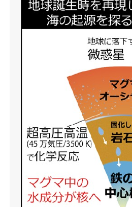
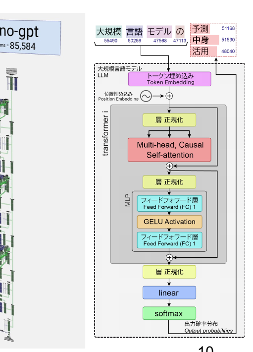
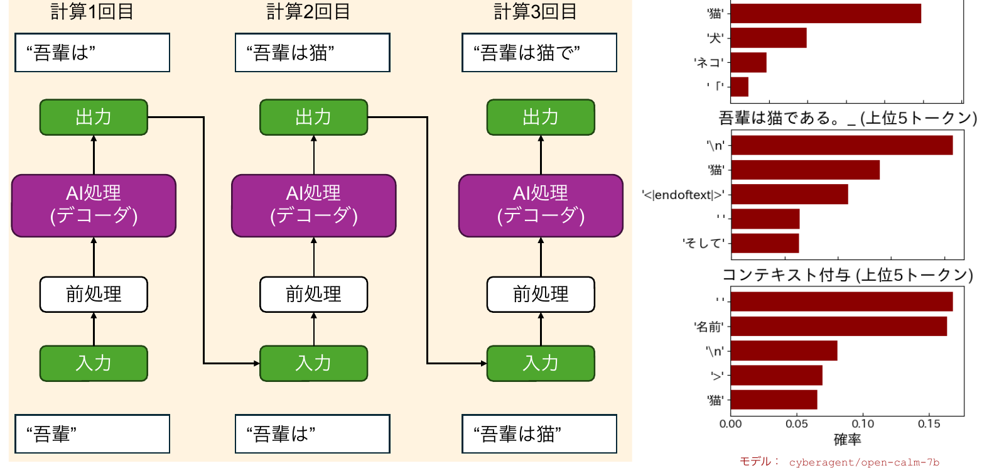
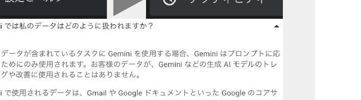
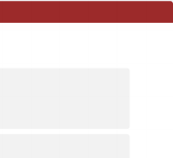
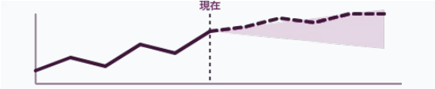
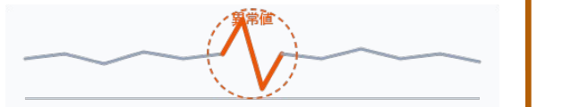
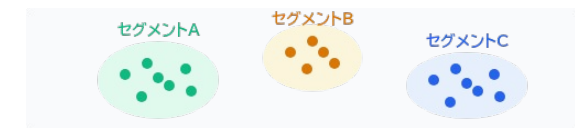
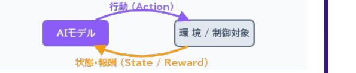
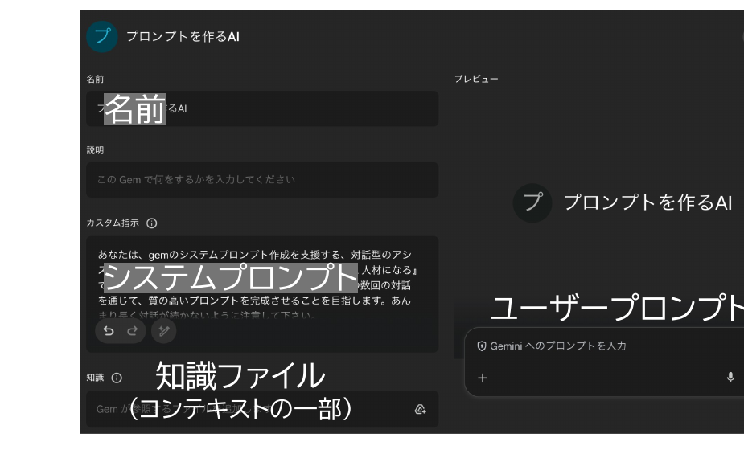

開始の前に

# 開始の前に

① <b>PCを立ち上げ、お持ちの千葉大学Google Workspaceにログインして下さい</b>

→ 学校のGmailが立ち上がる状況ならOKです。

② インタラクションツール <b>slido</b> にアクセスして下さい

URLを配布したり、質問やアンケートをとったりします

※<b>slido／ワーク教材への入力情報</b>のうち【個人情報や機微情報を除いた】情報をアカデミック・リンク・センター／附属図書館において、業務改善・調査研究・外部発表等に用います。個人が特定される情報や、利用されたくない情報は、入力しないようご注意ください。

スマホから

方法1　Google検索「<b>slido</b>」→ コード入力 <b>ALC-AI2-01</b>

PCから

方法2　直接リンク https://app.sli.do/event/iJQ71dhpuqstH3wbGSYpRD

<!--
- 始める前に、まず千葉大のGoogle Workspaceにログイン。学校のGmailが開けばOK。
- それから slido にアクセス。URL配布や質問・アンケートに使います。
- slido等への入力情報は、個人情報・機微情報を除いて業務改善・調査研究等に使います。出したくない情報は入れないでください。
-->

---

講師紹介

# 田川　翔（たがわ　しょう）

オープンバッジ<b>所属：</b>千葉大学 高等教育センター／アカデミックリンクセンター

<b>大学教育を企画し、学生と教員を支援する仕事</b>

① 元々は理学の人

Tagawa et al. (2021) <i>Nat. Commun.</i>

② 色々な仕事経験

<ul style="margin-top:6px;">
<li>大学のICT支援 (コロナ禍)</li>
<li>大規模オンライン授業の作成</li>
<li>民間企業での経験</li>
<li>AI×大学</li>
</ul>

③ 大学を学びやすく!

<ul style="margin-top:6px;">
<li>大学での教え方</li>
<li>生成AIの教育利活用</li>
<li>現在、<i>Teaching with AI</i> を翻訳・出版準備中</li>
</ul>

<!--
- 講師の田川です。所属は千葉大の高等教育センター／アカデミックリンクセンター。大学教育を企画し、学生と教員を支援する仕事です。
- 元々は理学（地球の起源）の研究者。色々な仕事を経て、いまはAI×大学。Teaching with AI を翻訳・出版準備中です。
-->

---

<!-- _class: cover-hero -->

学びを変える！研究を深める！

生成AI活用術

2026年度 第1回：<b>プロンプティング</b>と<b>生成AIの仕組み</b>の基礎

15-min or 30-min × 3 sessions

国際未来教育基幹 田川 翔

<b>学部1年生にも おすすめ</b>

<!--
- タイトルコール。「学びを変える！研究を深める！生成AI活用術」。2026年度 第1回はプロンプティングと生成AIの仕組みの基礎です。
- 学部1年生にもおすすめの内容です。
-->

---

今回の構成

# 今回の構成

<table style="width:100%; border-collapse:separate; border-spacing:0 12px; font-size:25px;">
<tr>
<td style="width:200px; vertical-align:middle; font-weight:700; color:var(--accent-dark);">最初の15分</td>
<td style="width:140px;">
講義
</td>
<td style="padding-left:20px;">
- AI/生成AIとは何かを理解する 
- プロンプティングのコツを知る 
- 千葉大学のGeminiの機能と利点を知る
</td>
</tr>
<tr>
<td style="vertical-align:middle; font-weight:700; color:var(--accent-dark);">真ん中<b>30</b>分 (前半だけも可)</td>
<td>
体験
</td>
<td style="padding-left:20px;">
- Geminiの機能を最大限使いこなしてみる 
- 気づきを共有してみる
</td>
</tr>
<tr>
<td style="vertical-align:middle; font-weight:700; color:var(--accent-dark);">最後の15分</td>
<td>
議論・座談会
</td>
<td style="padding-left:20px;">
- 今日学んで面白かったことは何でしたか。 
- AIの学び方って、どうすれよいと思いますか。 
- 今後、どんな点を特に学んでみたいですか。
</td>
</tr>
</table>

<!--
- 今回は3部構成。最初の15分は講義、真ん中30分は体験（前半だけでも可）、最後の15分は議論・座談会です。
-->

---

<!-- _class: divider -->

SESSION 1

# プロンプティングのコツと生成AIの基礎

## 2026年度 第1回：プロンプティングと生成AIの仕組みの基礎 ／ 15-min sessions

<!--
- ここからSession 1。プロンプティングのコツと生成AIの基礎を扱います。
-->

---

Session 1の目的・到達点

# Session 1の目的・到達点

目的

<b>Session 1：</b> プロンプティングのコツと生成AIの基礎を知る！

目標

・ AI/生成AIとは何かを理解する

・ プロンプティングのコツを知る

・ 千葉大学のGeminiの機能と利点を知る

<!--
- Session 1の目的は「プロンプティングのコツと生成AIの基礎を知る」こと。
- 目標は3つ。AI/生成AIとは何かを理解、プロンプティングのコツを知る、千葉大Geminiの機能と利点を知る、です。
-->

---

生成AIの学び方

# 生成AIの学び方

<b>生成AIの利活用に、現時点で正解はあるか？</b>

<b>生成AIは、学習・研究で不可欠な相棒か？</b>

<b>生成AI時代は学び方を必ず変えないといけないか？</b>

<b>… しかし、生成AI技術は進歩し、仕事や研究にも影響を与えつつある</b>

受講者の皆様が、生成AIは「相棒になるか」を<b>自ら考え</b>、<b>必要なときに、使えるようになる</b>ことが重要

<b>生成AIとの付き合い方</b>を決めるのは<b>あなた自身</b>。<b>今期の15minsでは、そのための材料をお渡しします</b>

<!--
- 生成AIの利活用に、いま正解はあるか？不可欠な相棒か？学び方を必ず変えるべきか？――問いかけです。
- ただ生成AI技術は進歩し、仕事や研究に影響を与えつつある。だからこそ、相棒になるかを自ら考え、必要なときに使えるようになることが重要。
- 付き合い方を決めるのはあなた自身。今期はそのための材料をお渡しします。
-->

---

生成AIの学び方

# 生成AIの学び方

<b>生成AIを活用するコツってなんだろう？どうすれば学べるんだろう？</b>

✓ <b>生成AIは単なる手段</b>

✓ 最終的には、<b>自分がより学び、より良い人生を生きること</b>。その文脈の中で、<b>生成AIを活かす方法と理由</b>を考えたい

AIリテラシー

個人がAI技術を<b>批判的に</b>評価し、AIと効果的に<b>コミュニケーションおよび協働</b>し、<b>オンライン、家庭、職場でAIをツールとして利活用でき</b>るようにするコンピテンシー(「できる」知識・スキル・態度)の集合体

Long &amp; Magerko (2020) <i>CHI</i>　／　30個以上が提案 (e.g. Laupichler et al. 2022 <i>CAEAI</i>)

AI教育方法論

<b>足場かけ体験学習</b> Plan-Iterate-Evaluate loop  <b>コミュニティ中心方略</b> e.g. AI cafe

Anders &amp; Dux Speltz (2025) <i>CAEAI</i>；Hutler et al. (2025) <i>AI and Society</i>

<b>みんなで試し、話すことで、AIリテラシを伸ばす場にしましょう！</b>

<!--
- 生成AIを活用するコツって何だろう、どう学べばいい？まず生成AIは単なる手段。最終的には自分がより学び、より良い人生を生きること。その文脈で活かす方法と理由を考えたい。
- AIリテラシーは、AIを批判的に評価し、効果的に協働し、ツールとして利活用できるコンピテンシーの集合体。30個以上が提案されています。
- 教育方法論としては足場かけ体験学習やコミュニティ中心方略。みんなで試し、話すことでAIリテラシを伸ばす場にしましょう。
-->

---

AIってなに？

# AIってなに？

<b>AI：</b> 人が知的だと感じる処理を実現するシステム

<svg viewBox="0 0 360 330" xmlns="http://www.w3.org/2000/svg" style="width:100%;">
<rect x="2" y="2" width="356" height="326" rx="14" fill="#EAF2FB" stroke="#1A6BB0" stroke-width="2"/>
<text x="14" y="28" font-size="18" font-weight="700" fill="#15436e">数理・統計・DS</text>
<rect x="26" y="40" width="308" height="270" rx="12" fill="#D9E8F7" stroke="#1A6BB0" stroke-width="1.5"/>
<text x="40" y="64" font-size="18" font-weight="800" fill="#15436e">人工知能 (AI)</text>
<rect x="50" y="78" width="260" height="218" rx="12" fill="#CFE6D6" stroke="#2E9E5B" stroke-width="1.5"/>
<text x="64" y="102" font-size="17" font-weight="800" fill="#1f6b3a">機械学習</text>
<rect x="74" y="116" width="212" height="166" rx="10" fill="#FBE4EA" stroke="var(--accent)" stroke-width="1.5"/>
<text x="88" y="140" font-size="17" font-weight="800" fill="var(--accent-dark)">深層学習</text>
<rect x="100" y="156" width="160" height="112" rx="10" fill="var(--accent)" />
<text x="180" y="218" font-size="20" font-weight="800" fill="#fff" text-anchor="middle">生成AI</text>
</svg>

分類したり、予想したり、処理したり…

生成AIを使っていなくても、<b>YouTubeのおすすめ</b>や、<b>運転支援・お掃除ロボット</b>や、<b>今日のスーパーの仕入れ管理</b>など、様々なところで利用されている

機械学習

→

深層学習

信頼性・再現性・速度/費用・適合性…

日常はすでに、<b>AIアルゴリズムに囲まれて、便利になっている</b>

<!--
- AIとは、人が知的だと感じる処理を実現するシステム。数理・統計・DSの中にAI、その中に機械学習、深層学習、生成AIが入れ子になっています。
- 生成AIを使っていなくても、YouTubeのおすすめ、運転支援やお掃除ロボット、スーパーの仕入れ管理など、すでにAIに囲まれて便利になっています。
-->

---

生成AIの仕組み

# 生成AIの仕組み

<b>ネクストワードプレディクション</b> <b>次の言葉(トークン)の確率を予想する問題</b>

日本の首都__

→

日本の首都は__

→

日本の首都は東京__

<svg viewBox="0 0 320 200" xmlns="http://www.w3.org/2000/svg" style="width:320px;">
<ellipse cx="160" cy="100" rx="120" ry="74" fill="none" stroke="#5a5f66" stroke-width="2.5"/>
<polygon points="280,96 270,80 270,112" fill="#5a5f66"/>
<rect x="92" y="68" width="136" height="64" rx="10" fill="var(--accent-soft)" stroke="var(--accent)" stroke-width="2"/>
<text x="160" y="94" font-size="18" font-weight="800" fill="var(--accent-dark)" text-anchor="middle">パラメーター</text>
<text x="160" y="118" font-size="18" font-weight="800" fill="var(--accent-dark)" text-anchor="middle">の函</text>
<text x="160" y="160" font-size="16" fill="#555" text-anchor="middle">数字の羅列</text>
<text x="20" y="40" font-size="17" font-weight="800" fill="#1a1a1a">学習</text>
<text x="14" y="108" font-size="17" font-weight="800" fill="#1a1a1a">入力</text>
<text x="252" y="64" font-size="17" font-weight="800" fill="#1a1a1a">出力</text>
<text x="246" y="150" font-size="17" font-weight="800" fill="#1a1a1a">評価</text>
<text x="150" y="34" font-size="15" fill="#555">更新</text>
</svg>

GPT 4：アメリカ議会図書館の<b>全蔵書の約22倍</b>相当? ※書籍、記事、ウェブサイト、コードなど幅広いテキストソースを元に学習している

LLM Visualization ©Bycroft 2023

<b>大規模言語モデルの中身 → ◯ 巨大な数字の塊　✗知識集・ルール集</b>

<!--
- 生成AIの仕組みの本質はネクストワードプレディクション。次の言葉（トークン）の確率を予想する問題です。「日本の首都」→「は」→「東京」と一語ずつ予測。
- モデルはパラメーターの函＝数字の羅列。GPT-4は議会図書館の全蔵書の約22倍相当を学習。
- 中身は巨大な数字の塊であって、知識集・ルール集ではありません。
-->

---

生成AIの仕組み

# 利用 (推論・生成)

<!--
- 利用（推論・生成）のイメージ。計算1回目で「吾輩」から「吾輩は」、2回目で「吾輩は猫」、3回目で「吾輩は猫で」…と1トークンずつ生成します。
- 各ステップで前処理→AI処理（デコーダ）→出力。右は上位5トークンの確率分布（モデルは cyberagent/open-calm-7b）。文脈を与えると確率が変わります。
-->

---

生成AIの仕組み

# 生成AIの仕組み まとめ

<b>① 大規模言語モデルがしていることとは</b> 次のもっともらしい単語(Token)を予測する作業

<b>② 大規模言語モデルの中身とは</b> ルール集ではなく、数字(統計的な重み)の塊

<b>③ なぜ精度が上がったり、複雑なことも出来るのか</b> 分解や繰返しで推論を行ったり、ツールを接続できるから

まずは、この<b>3つ</b>だけ、覚えましょう →詳細・体験・倫理は第4回へ

<!--
- 仕組みのまとめ。①LLMがしているのは次のもっともらしい単語(Token)の予測。②中身はルール集ではなく数字（統計的な重み）の塊。③精度が上がり複雑なことも出来るのは、分解や繰返しで推論したりツールを接続できるから。
- まずはこの3つだけ覚えましょう。詳細・体験・倫理は第4回へ。
-->

---

プロンプトとは？

# プロンプトとは？

<b>プロンプト：</b> 生成AIに、<b>実行すべきタスクの生成を促す</b>、自然言語による文章のこと

<b>ユーザープロンプト：</b> 一般的に想像されるプロンプト

<b>システムプロンプト：</b> AI/Agentの振る舞いを決めるプロンプト

<b>プロンプトエンジニアリング：</b>生成AIから望ましい出力を確実に生み出すプロンプトを発見する過程のこと 
<b>コンテキスト：</b>プロンプトの意図を正確に理解し、適切な返答を返すために利用する付加情報 
<b>コンテキストエンジニアリング：</b>生成AIに読み込ませる中身を選択し、正確で関連性の高い出力を生成できるよう、タスクに必要な背景情報や前提条件（コンテキスト）を整理・最適化すること

<b>良いプロンプト・コンテキスト</b>を入れれば、AIがより精度の高い情報を戻すようになる ※一昔前のCoT指示・誘導などは不要。

Phoenix &amp; Tayler／田村・大野監訳『生成AIのプロンプトエンジニアリング』O'REILLY 2025

<!-- プロンプトは、AIにタスク生成を促す自然言語の文章。ユーザープロンプトとシステムプロンプトがある。良いプロンプト・コンテキストを入れれば精度が上がる。一昔前のCoT指示・誘導はもう不要。 -->

---

プロンプトの構成例

# プロンプトの構成例

<b>テンプレと注意点を覚えたあとは、試行錯誤が一番大切</b>

<b>簡潔に</b>、<b>十分に</b>、<b>具体的に</b>、4要素（ペルソナ・タスク・背景情報・形式）を記入 ▶ <b>Google プロンプト初級ガイド を修正</b>（参照日：2026/04/23）

ディレクションを示す

出力形式を指定する

例を示す

品質を評価する

タスクを分割する

<b>例）</b>あなたは大学院生のグラントを読んでアドバイスするチューターです。学振のDCの書類を書く上でのアドバイスをインターネット上の採択者の経験談を参照し説明してください。2文程度で挨拶のあと、箇条書きで出力してください。

システムプロンプト

<ul style="font-size:21px;">
<li><b>自然な表現を使い、話すような完全な文章で</b></li>
<li><b>具体的かつ反復的に（多くの背景情報）</b></li>
<li><b>簡潔に記述して、複雑にならない（矛盾注意）</b></li>
</ul>

ユーザープロンプト

<ul style="font-size:21px;">
<li><b>会話しながらプロンプトを改善する</b></li>
<li><b>Geminiとプロンプトを作る</b></li>
<li><b>自分でつくったドキュメントをソースにする</b></li>
</ul>

Phoenix &amp; Tayler／田村・大野監訳『生成AIのプロンプトエンジニアリング』O'REILLY 2025

<!-- 4要素（ペルソナ・タスク・背景情報・形式）を簡潔に十分に具体的に。Googleの初級ガイドを修正したもの。システム／ユーザープロンプトそれぞれにコツがある。テンプレを覚えたら試行錯誤が一番大切。 -->

---

プロンプトのコツ

# プロンプトのコツ

<b>① 例：Few-shotを利用する</b>

プロンプト内に「入力例」と「出力例」のデモを提供しより高性能な結果を得る技法 ※ コンテキスト内学習（与えた文章から、生成AIがタスクの結果を生成できる能力）に由来

Zero-shot

Google検索的（単語） これは素晴らしい! 感情?

「これは素晴らしい!」と書いた書き手の感情を教えて下さい

Few-shot

あの映画は最高だった! ＞ポジティブ これは酷い! ＞ネガティブ 「これは素晴らしい!」＞?

<b>② 出力形式：回答をスキーマに沿って出力させる</b>

回答してほしいことをすべて構造化し、回答形式として指定する。<b>※Few-shotを組み合わせ、回答を例示する</b>

<b>③ コンテキストを十分に与える</b>

<b>例)</b> 授業のタイトル： 　目的： 　到達目標： 　宿題の案：

<b>slido</b>　さらに学びたい方へ：Google プロンプト設計戦略 など

<!-- コツ3つ。①Few-shotで入力例・出力例を見せる（コンテキスト内学習に由来）。②回答をスキーマに沿って構造化して出させる。③コンテキストを十分に与える。さらに学びたい人はGoogleのプロンプト設計戦略を。 -->

---

大学のGeminiのメリット

# 大学のGeminiのメリット

<b>① 入力が学習されない！</b> （オプトアウト済） ※大学版のCopilotも同様

<b>② 学習向けのチューニング</b> （商用版よりは依存しにくい） ※名前を呼んだり馴れ馴れしくない

<b>③ Google WSと連携できる</b> （@マークで読み込み簡単）

以下に対処する意図でチューニングされている ・AIへの過依存（答えを全部もらう） ・認知的オフロード（自分で考えなくなる） ・受動的学習（情報を受け取るだけ）

大学版は、個人購入版よりも安心が大きいのと連携がウリ

<!-- 大学版Geminiの3つのメリット。①入力が学習されない（オプトアウト済、Copilotも同様）。②学習向けチューニング（過依存・認知的オフロード・受動的学習に対処）。③Google Workspaceと連携できる（@で簡単読み込み）。 -->

---

Geminiで出来る色々

# Geminiで出来る色々

スライドの作成・修正

プログラムの対話的作成

絵/漫画の出力・図の修正

圧巻の風景写真を作成したいです。北極の空を静かに飛ぶ旅客機を横から眺め、後ろにはオーロラが見えるような、景色を写実感のある写真として出して下さい。高度は高く、地上は小さく、暗闇の中を光るのは飛行機の窓とオーロラだ、という雄大な構図にして下さい。飛行機を横からみた構図にして下さい。写真は正方形にして下さい。

授業の解説や問題の作成 暗記の支援

曲/動画の作成

高校の化学の実験を生徒がモチベーションがあがるような、楽しそうな絵を生成して下さい。化学実験室の机にフラスコがあって、反応が進んで生徒2-3人驚いている感じで。但し、現実的な実験の様子にして下さい。漫画な感じで、効果音も文字で書いてほしい。吹き出しは使ってはだめです。白黒の線画にして下さい。図は正方形で、明るい感じ。

検索(DeepResearch) スプレッドシートの分析

絵・音声の文字起こし

カレンダー/ToDo書込

業務支援ワークフロー

大学全体で共有 → 授業や職務で活用しやすい / 研修も実施

<!-- Geminiで出来ること多数。スライド作成・修正、絵/漫画の出力・図の修正、曲/動画の作成、検索(DeepResearch)、スプレッドシート分析、絵・音声の文字起こし、カレンダー/ToDo書込、業務支援ワークフローなど。大学全体で共有して活用しやすい。 -->

---

Session 1の目的・到達目標

# 振り返り

目的

目標 ＋ まとめ

<b>Session 1：</b> プロンプティングのコツと生成AIの基礎を知る！

<b>・AI/生成AIとは何かを理解する</b>

次のトークンを予測する仕組み 繰り返しの推論やツール/情報を接続して性能向上

<b>・プロンプティングのコツを知る</b>

7R法/Few shot/スキーマ利用 困ったら生成AIに書かせる

<b>・千葉大学のGeminiの機能と利点を知る</b>

オプトアウト、学習にむけた最適化、WSとの連携

<!-- Session 1の振り返り。目的はプロンプティングのコツと生成AIの基礎を知ること。目標とまとめ：①AI/生成AIの仕組み（次トークン予測・推論やツール接続）、②プロンプティングのコツ（7R法・Few shot・スキーマ・困ったらAIに書かせる）、③千葉大Geminiの利点（オプトアウト・最適化・WS連携）。 -->

---

<!-- _class: divider -->

学びを変える！研究を深める！

生成AI活用術

2026年度 第1回： プロンプティングと生成AIの仕組みの基礎

30-min sessions

<b>Session 2：</b> 　　Geminiの機能を最大限使いこなしてみる

国際未来教育基幹 田川 翔

<!-- セッション2へ。30分構成。Session 2のテーマは「Geminiの機能を最大限使いこなしてみる」。 -->

---

本日のワークの中身

# 本日のワークの中身

<b>Phase 1</b> 仲間を作る！

<b>Phase 2</b> 手順書で実践

<b>Phase 3</b> 評価・反省

まずは、ペアか3人で集まってみましょう。3分時間を取るので、簡単に<b>自己紹介</b>を（チーム内で別々を選んでもOK）

<b>会場：</b>まずは、ペアか3人で集まってみましょう。3分時間を取るので、簡単に自己紹介を（チーム内で別々を選んでもOK） <b>zoom：</b>原則1人でAIと実施です。但し、Breakoutを作ります。関心があれば、2-3人で散らばってみて下さい。

<b>どっちか：</b>　初級編：Geminiを使い倒す（まずは、Geminiに詳しくなりたい人向け）　／　中級編：学びでの使用を考える（ちょっと踏み込んでみたい人むけ）

各自、<b>実践してみる</b>。<b>一人も協力もOKです。</b>困ったら仲間・講師へ質問を。進行すると共に、Spreadsheetのワークを順次、埋めて下さい。全員でどこが使えるか書き出してみましょう！

気づいたことを、グループまたは個人でまとめて、<b>slido</b>に記入する。 ※グループになったところは、まずはメンバーで話してみましょう。

※ slido/ワーク教材への入力情報のうち【個人情報や機微情報を除いた】情報をアカデミック・リンク・センター／附属図書館において、業務改善・調査研究・外部発表等に用います。個人が特定される情報や、利用されたくない情報は、入力しないようご注意ください。

<!-- 本日のワークは3フェーズ。Phase1：仲間を作る（自己紹介3分。会場はペア・3人、zoomは原則1人だがBreakoutあり）。Phase2：手順書で実践（初級＝Geminiを使い倒す／中級＝学びでの使用を考える、どちらか）。Phase3：評価・反省（Spreadsheetを埋め、気づきをslidoに記入）。 -->

---

ワーク Geminiの機能を使う

# ワーク　Geminiの機能を使う　初級編

<b>手順書に従って、Geminiの機能を使ってみよう（標準 20分）</b>

<b>① Google カレンダーに予定を立てる。読み込む。</b> 
<b>② 概念を暗記するための4択問題を5個作ってみる。</b> 
<b>③ AIリテラシーの歌(30秒)を作ってみる。</b> 
<b>④ Webを検索してみる。</b> 
<b>⑤ 文章を翻訳させる。</b> 
<b>⑥ 文章を一緒に編集してみる。</b> 
<b>⑦ 音声を書き起こさせる。</b> 
<b>⑧ 文字を書き起こさせる。</b>

アプリ連携 
ガイド付き学習 
Lyria 3 
Ground機能 
Canvas機能 
マルチモーダル機能

手順書内にプロンプト・資料があります。<b>どこからでも良いので</b>、やってみましょう。

終わったらここに<b>評価・感想</b>を記入してください。使っている場合は、〜と書いてとばしましょう。1項目終わるごとに、◯(使える！)・△(微妙)・✗(間違った)で評価を記入してみましょう。精度が悪い時には、モードをProに上げてみましょう。動かない場合は、教えて下さい。

<!-- 初級編ワーク（標準20分）。手順書に従い①カレンダー②4択問題③AIリテラシーの歌④Web検索⑤翻訳⑥文章編集⑦音声書き起こし⑧文字書き起こし。アプリ連携・ガイド付き学習・Lyria 3・Ground・Canvas・マルチモーダルなどの機能。どこからでもOK。終わったら評価・感想を記入。 -->

---

ワーク Geminiの機能を使う

# ワーク　Geminiの機能を使う　中級編

<b>学びでの使用をためしてみよう（標準 20分）</b>

<b>① 問題の解説をさせてみる</b>

<b>② Geminiアプリで外国語を練習してみる</b>

※ロールプレイなどもぜひ。 ※スマホでのインストール必須

<b>③ 自分の分野について学べる学習ゲームをつくってみる</b>

※アイデア出しもぜひ ※Proモードでの実施必須

マルチモーダル機能 
Live機能 
Canvas機能

中級編は、ご自身で1テーマです（手順書なし）。<b>どこからでも良いので</b>、やってみましょう。

終わったらここに<b>評価・感想・実施したシナリオ</b>を記入してください。使っている場合は、〜と書いてとばしましょう。1項目終わるごとに、◯(使える！)・△(微妙)・✗(間違った)で評価を記入してみましょう。精度が悪い時には、モードをProに上げてみましょう。動かない場合は、教えて下さい。

<!-- 中級編ワーク（標準20分）。学びでの使用を試す。①問題の解説②Geminiアプリで外国語練習（ロールプレイも、スマホ必須）③自分の分野の学習ゲーム作成（Proモード必須）。マルチモーダル・Live・Canvas機能。手順書なしで1テーマ。終わったら評価・感想・シナリオを記入。 -->

---

ワークで行うこと

# ワークで行うこと

<b>ワークテーマ：みんなでGeminiを使い倒して、どこが使えるか把握しよう！</b>

<b>手順書内にプロンプト・資料があります</b>。<b>どこからでも良いので</b>、やってみましょう。

<b>進め方：</b> <b>一人も協力もOKです。</b>困ったら仲間・講師へ質問を。 終わったら、Spreadsheetのワークを順次、埋めて下さい。 全員でどこが使えるか書き出してみましょう！

<b>Zoomでいま来た方へ：</b>もしグループで進行されたい場合は<b>ブレークアウト</b>でどこかに参加してみてください。ルーム選択を解放しています。 ※グループは自由参加・自由解散・移動も自由

<b>質問がある場合：会場・オンラインとも → slidoのQ&amp;Aに投稿してください</b>

<!-- ワークで行うこと。テーマは「みんなでGeminiを使い倒して、どこが使えるか把握しよう」。手順書のプロンプト・資料を使い、どこからでも。一人でも協力でもOK、困ったら質問を。Spreadsheetを埋める。Zoomで遅れて来た人はブレークアウトへ。質問はslidoのQ&Aへ。 -->

---

Session 2の目的・到達目標

# 振り返り

目的

目標 ＋ まとめ

<b>Session 2：</b> 　Geminiの機能を最大限使いこなしてみる

・半構造化データから役立つ情報を引き出せた 
・<u>構造化データ</u>の近未来の分析を体験できた

<!-- Session 2の振り返り。目的はGeminiの機能を最大限使いこなしてみること。目標とまとめ：半構造化データから役立つ情報を引き出せた、構造化データの近未来の分析を体験できた。 -->

---

<!-- _class: cover-hero -->

学びを変える！研究を深める！

生成AI活用術

2026年度 第1回： プロンプティングと生成AIの仕組みの基礎

15-min sessions

<b>Session 3：</b> 今日の気づきをみんなで共有してみる。

国際未来教育基幹 田川 翔

<!--
- ここからSession 3。最後の15分は、今日の気づきをみんなで共有してみる時間です。
-->

---

Session 3の進め方

# Session 3の進め方 議論・座談会／最後の15分

<b>slido で進めます</b>

- 今日学んで面白かったことは何でしたか。

- AIの学び方って、どうすれよいと思いますか。

- 今後、どんな点を特に学んでみたいですか。

<b>お願い：協力的な場作りが、学びの秘訣です。</b> 敬意をもって、忌憚なく、建設的に、話し合いましょう

スマホから

方法1　Google検索「<b>slido</b>」→ コード入力 <b>ALC-AI2-01</b>

PCから

方法2　直接リンク https://app.sli.do/event/iJQ71dhpuqstH3wbGSYpRD

※slidoへの入力情報のうち【個人情報や機微情報を除いた】情報をアカデミック・リンク・センター／附属図書館において、業務改善・調査研究・外部発表等に用います。個人が特定される情報や、利用されたくない情報については、入力しないようご注意ください。

<!--
- Session 3はslidoで進めます。問いは3つ：今日面白かったこと、AIの学び方、今後学んでみたい点。
- 協力的な場作りが学びの秘訣。敬意をもって、忌憚なく、建設的に話し合いましょう。
- slidoへの入力は、個人情報・機微情報を除いて業務改善・調査研究等に使います。出したくない情報は入れないでください。
-->

---

終了時アンケート・次回予告

# 終了時アンケート・次回予告

次回以降も「さらにみなさんのニーズにあわせた」企画を実施するため、<b>終了時アンケート</b>へのご協力をお願いいたします。 
https://forms.gle/5sXy6f5yZkoJ8XJZ7

【お願い】アンケートへの入力情報のうち【個人情報や機微情報を除いた】情報を、アカデミック・リンク・センター／附属図書館において、業務改善・調査研究・外部発表等に用います。個人が特定される情報や、利用されたくない情報については、入力しないようご注意ください。

次回予告

学びを変える！研究を深める！ 生成AI活用術

2026年度 第2回：<b>生成AIを利用した学び方 (ゲスト講師回)</b>

15-min or 30-min × 3 sessions

<b>5/25 (月) 16:10 - 17:10</b> 会場(ここ)・オンライン併用

情報・データサイエンス学部 3年の先輩と自分で進めます。学生目線の意見にも注目です！

<!--
- 終了時アンケートへのご協力をお願いします。次回以降の企画づくりに使います。
- 次回予告。第2回は「生成AIを利用した学び方」のゲスト講師回。5/25(月)16:10-17:10、会場・オンライン併用。
- 情報・データサイエンス学部3年の先輩と一緒に進めます。学生目線の意見にも注目です。
-->

---

参考：深層学習・機械学習

# 参考：深層学習・機械学習 機械学習/深層学習で実現すること

① 売上・需要予測

既存データから将来の数値を予測 → 在庫最適化やリソース配置の変更

② 異常・故障検知

リアルタイムで異常パターンを検知 → 重大なトラブルを未然に防止

③ データの可視化・分類

複雑なデータをグループ化・可視化 → 新たな知見の発見を支援

④ 強化学習と自動化

試行錯誤から最適な行動パターンを学習 → 複雑な制御や判断を自動化

統計や機械学習は、<b>未来</b>や<b>全体</b>を知ることができない人間が、<b>世界を理解したり、作業を実行するために</b>編み出した技術

<!--
- 参考。機械学習/深層学習で実現することの代表例を4つ。①売上・需要予測、②異常・故障検知、③データの可視化・分類、④強化学習と自動化。
- 統計や機械学習は、未来や全体を知れない人間が、世界を理解し作業を実行するために編み出した技術です。
-->

---

参考：複雑な処理

# 参考：複雑な処理 プロンプト上手になるための 7つのポイント

プロンプト上手になるための 7つのポイント

<table style="width:100%; border-collapse:separate; border-spacing:0 6px; font-size:21px;">
<tr><td style="width:230px; font-weight:800; color:var(--accent-dark);">① 明確な質問</td><td>曖昧な質問でなく明確な質問をする</td></tr>
<tr><td style="font-weight:800; color:var(--accent-dark);">② 具体性</td><td>トピックや要求に具体的・詳細な情報をつけて、適切な回答を引き出せるようにする</td></tr>
<tr><td style="font-weight:800; color:var(--accent-dark);">③ プロンプトの構造</td><td>明確で論理的な構造にする</td></tr>
<tr><td style="font-weight:800; color:var(--accent-dark);">④ 文脈の提供</td><td>重要な文脈や背景情報を提供する</td></tr>
<tr><td style="font-weight:800; color:var(--accent-dark);">⑤ 複数の質問</td><td>必要に応じて、複数の質問を連続して提示する</td></tr>
<tr><td style="font-weight:800; color:var(--accent-dark);">⑥ ステップバイステップ思考</td><td>大きな課題を分割する</td></tr>
<tr><td style="font-weight:800; color:var(--accent-dark);">⑦ 校正とフィードバック</td><td>得られた結果を評価し、精度向上を図る</td></tr>
</table>

<b>困ったら、生成AIと一緒にプロンプトを作ろう</b>

野口 竜司 (2023). <i>ChatGPT時代の文系AI人材になる</i>. 東洋経済新報社.

<!--
- 参考。複雑な処理を引き出すプロンプト上手になるための7つのポイント。明確な質問、具体性、構造、文脈の提供、複数の質問、ステップバイステップ思考、校正とフィードバック。
- 困ったら、生成AIと一緒にプロンプトを作りましょう。
-->

---

参考：Gemを作る

# 参考：Gemを作る 学内に共有出来るAIエキスパートを作る方法

名前・システムプロンプト・知識ファイル(コンテキストの一部)・ユーザープロンプト／ Geminiの力もかりてみましょう

<b>① Gemを作ってみましょう。</b>作る際にプロンプト作成支援Gemsを使って見ましょう。

<b>② 動くまで試行錯誤してみましょう。</b>

<b>③ 面白いもの・便利なものができたら、学内に共有・展開可能です。</b>

<b>名前</b>と<b>システムプロンプト</b>は必須。ユーザープロンプトに入力し評価。悪用・個人情報入力NG。<b>入力内容は作成者は見れません</b>

<!--
- 参考。学内に共有できるAIエキスパート＝Gemの作り方。①Gemを作ってみる。作る際はプロンプト作成支援Gemsを使うと便利。
- ②動くまで試行錯誤。③面白い・便利なものができたら学内に共有・展開可能です。
- 名前とシステムプロンプトは必須。悪用・個人情報入力はNG。入力内容は作成者からは見えません。
-->
