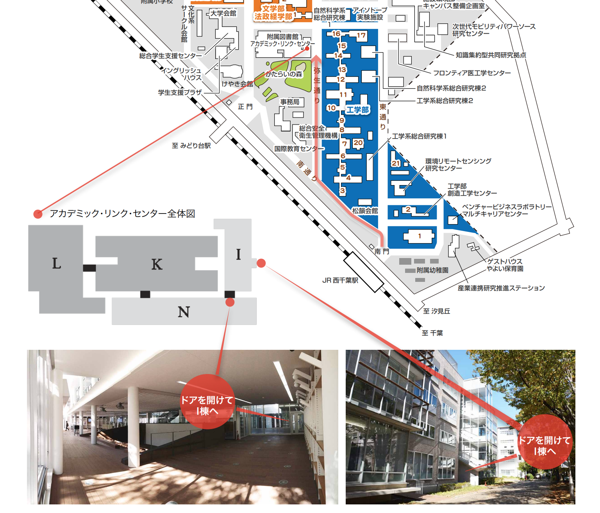
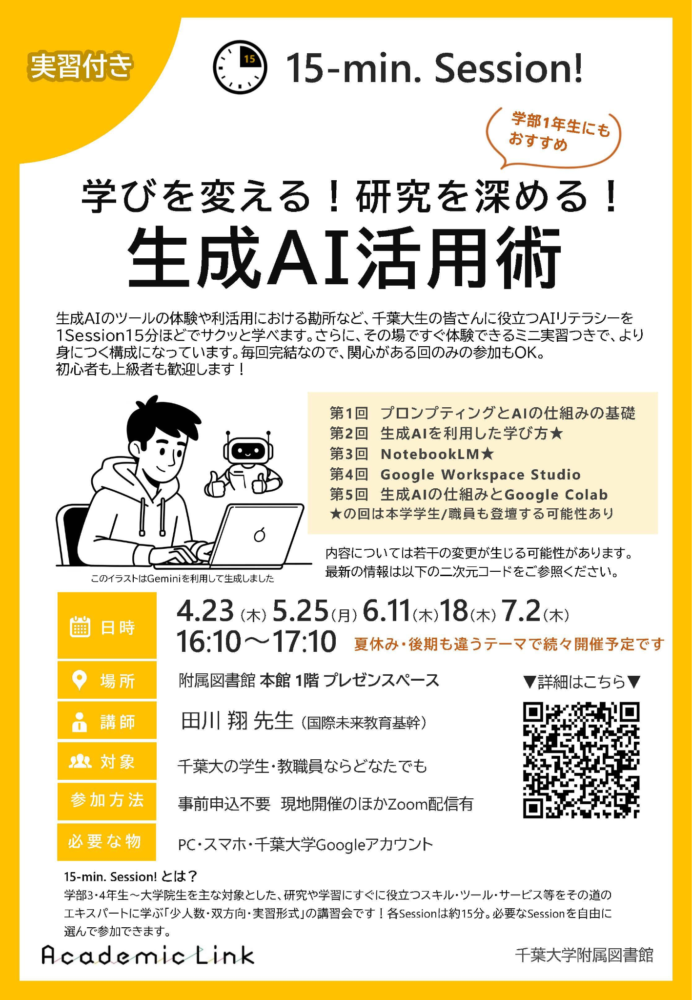

<!-- _class: cover-hero -->

情報リテラシ-04 ／ 講師紹介

田川　翔

所属：千葉大学 高等教育センター/アカデミックリンクセンター

たがわ　しょう　／　大学教育を企画し、学生と教員を支援する仕事

オープンバッジ

<!--
- 講師紹介。田川翔です。千葉大学 高等教育センター／アカデミックリンクセンターで、大学教育を企画し学生と教員を支援する仕事をしています。
-->

---

講師紹介

田川　翔
たがわ　しょう
オープンバッジ

<b>所属：</b>千葉大学 高等教育センター/アカデミックリンクセンター <b>大学教育を企画し、学生と教員を支援する仕事</b>

① 元々は理学の人

Tagawa et al. (2021) <i>Nat. Commun.</i>／ 画像：NASA

<!--
- ①元々は理学の人。地球誕生時を再現し海の起源を探る研究をしていました。
-->

---

講師紹介

田川　翔
たがわ　しょう
オープンバッジ

<b>所属：</b>千葉大学 高等教育センター/アカデミックリンクセンター <b>大学教育を企画し、学生と教員を支援する仕事</b>

学生・研究者時代 情報リテラシーとの関わり

<ul>
<li>データ分析</li>
<li>プログラミング(地球形成)</li>
<li>情報の検索</li>
<li>論文の執筆</li>
<li>研究成果の発表</li>
</ul>

<!--
- 学生・研究者時代から、データ分析・プログラミング・情報検索・論文執筆・研究発表と、情報リテラシーに深く関わってきました。
-->

---

講師紹介

田川　翔
たがわ　しょう
オープンバッジ

<b>所属：</b>千葉大学 高等教育センター/アカデミックリンクセンター <b>大学教育を企画し、学生と教員を支援する仕事</b>

PC一つで、 世界を旅するのに 憧れる

<!--
- PC一つで世界を旅するのに憧れていました。
-->

---

講師紹介

田川　翔
たがわ　しょう
オープンバッジ

<b>所属：</b>千葉大学 高等教育センター/アカデミックリンクセンター <b>大学教育を企画し、学生と教員を支援する仕事</b>

① 元々は理学の人

Tagawa et al. (2021) <i>Nat. Commun.</i>

② 色々な仕事経験

<ul style="margin-top:8px;">
<li>民間企業での経験 　航空会社に行く</li>
</ul>

<!--
- ②色々な仕事経験。民間企業での経験として、航空会社に行きました。
-->

---

講師紹介

田川　翔
たがわ　しょう
オープンバッジ

<b>所属：</b>千葉大学 高等教育センター/アカデミックリンクセンター <b>大学教育を企画し、学生と教員を支援する仕事</b>

会社時代 情報リテラシーとの関わり

<ul>
<li>システム開発</li>
<li>PoC (概念実証)</li>
<li>データベース作成</li>
</ul>

<!--
- 会社時代は、システム開発、PoC（概念実証）、データベース作成などで情報リテラシーに関わりました。
-->

---

講師紹介

# 田川　翔　講師紹介

<b>所属：</b>千葉大学 高等教育センター/アカデミックリンクセンター　│　<b>大学教育を企画し、学生と教員を支援する仕事</b>

① 元々は理学の人

Tagawa et al. (2021) <i>Nat. Commun.</i>

② 色々な仕事経験

<ul style="margin-top:6px; font-size:20px;">
<li>民間企業での経験</li>
</ul>

③ 大学を学びやすく!

<ul style="font-size:20px; margin-bottom:8px;">
<li>大学のICT支援 (コロナ禍)</li>
<li>大規模オンライン授業の作成</li>
<li>AI×大学</li>
<li>大学での教え方</li>
<li>生成AIの教育利活用</li>
</ul>

現在、Teaching with AIを翻訳・出版準備中

各種オープンバッジ

<!--
- ③大学を学びやすく！が現在の仕事。コロナ禍のICT支援、大規模オンライン授業の作成、AI×大学、生成AIの教育利活用などに取り組み、現在は Teaching with AI を翻訳・出版準備中です。
-->

---

自己紹介

# 関連する講座のご案内

学びを変える！研究を深める！

生成AI活用術

2026年度 第1回： <b>プロンプティング</b>と<b>生成AIの仕組み</b>の基礎 15-min or 30-min × 3 sessions

生成AI活用講座

普遍・４ターム・水3

中身を知る、アプリを作る

学部1年生にもおすすめ

<!--
- 自己紹介の最後に、関連講座のご案内。「学びを変える！研究を深める！生成AI活用術」、普遍・4ターム・水3。学部1年生にもおすすめです。
-->

---

<!-- _class: message -->

自己紹介

もはや、AI、数理データサイエンス的な知識は、 生活・仕事・学問の様々なところで必要になってきました。  
みんなが、社会に出た時に、 情報リテラシーを使いこなして、 良い人生を歩めるようになって欲しい。  
<b style="color:var(--accent-dark);">その一歩目を応援する科目です。</b>

<!--
- AIやデータサイエンスの知識は、もはや生活・仕事・学問のあらゆる場面で必要です。情報リテラシーを使いこなして良い人生を歩んでほしい。その一歩目を応援する科目です。
-->

---

シラバスを見てみる

# シラバスを見てみよう

シラバスには<b style="color:var(--accent-dark);">目標・採点・スケジュールなど</b>重要な情報がある

学生

学修を促すツールとして

自習・予習が出来る

両者にとって… <b>約束事</b>(成績評価/態度等) 生成AIなど

コースデザインの元資料

<b>カリキュラムの整合性</b>の確認

　 DP、CP、AP

教員

<b>DP、CP、カリキュラム・マップ</b>も覗いてみよう。

<!--
- シラバスを見てみよう。目標・採点・スケジュールなど重要な情報がある。学生には学修を促すツール、教員にはコースデザインの元資料。DP・CP・カリキュラムマップも覗いてみましょう。
-->

---

この授業で重要な点

# 情報と技術を使いこなす能力を身につけよう

<b>情報</b>は、 <b>技術だけではない</b>です。<b>新聞</b>も、<b>スパイ映画</b>も、<b>本</b>も、<b>データ</b>も情報。

<b>情報</b>は、 <b>つねに人と物事を結びつける。</b> 
より効果的な情報テクノロジーを作り出せば、必ず世の中をより忠実に理解できるようになると考える、素朴な見方は間違っている。 ーーユバル・ノア・ハラリ『Nexus』

<b>情報と技術を使いこなす能力を身につけよう</b>

講義と実践の両方を通して、 大学生に求められる情報リテラシーと データサイエンス・AIの基礎を俯瞰的に学びます。

<!--
- 情報は技術だけではない。新聞もスパイ映画も本もデータも情報。情報は常に人と物事を結びつける。講義と実践の両方で、情報リテラシーとデータサイエンス・AIの基礎を俯瞰的に学びます。
-->

---

この授業で重要な点

# この授業で目指すこと

授業の概要

<ul style="font-size:21px; margin-top:2px;">
<li>現代社会のあらゆる場面で利用される情報技術と情報リテラシーを学ぶ</li>
<li>大学生に求められるデータサイエンス・AIの基礎について俯瞰的に学習する</li>
<li>知識を得る講義と、技能を身につけるための実習の両方を含む</li>
</ul>

到達目標（１） 哲学的・技術的側面

(a) 情報とコミュニケーションの仕組みを理解する (b) コンピュータとインターネットの仕組みを説明できる (c) 情報の表現（数値と文字のビット表現、デジタル化等）を理解する

到達目標（２） 倫理的・社会的側面

(d) 情報倫理と情報セキュリティの重要性を説明できる (e) 生成AI等に代表される人工知能技術への理解と、利活用における注意点・問題点を記述できる

<!--
- 授業の概要と到達目標。哲学的・技術的側面(a〜c)と、倫理的・社会的側面(d〜e)の2系統で到達目標を設定しています。
-->

---

講義のスケジュール

<h1 style="font-size:36px; margin:0 0 6px;">今後のスケジュール（第4回〜第12回）</h1>

<table style="width:100%; border-collapse:collapse; font-size:18px; margin-top:0; line-height:1.15;">
<thead>
<tr style="background:var(--accent); color:#fff;">
<th style="padding:2px 10px; text-align:left;">回数 / 日程</th>
<th style="padding:2px 10px; text-align:left;">受講形態 / 場所</th>
<th style="padding:2px 10px; text-align:left;">主題</th>
</tr>
</thead>
<tbody>
<tr style="background:var(--accent-soft);"><td style="padding:1px 10px;">第4回 (5/07)</td><td>メディア授業 (オンデマンド)</td><td>情報とコミュニケーション</td></tr>
<tr><td style="padding:1px 10px;">第5回 (5/12)</td><td>教室講義 (G3-12)</td><td>コンピュータの仕組み</td></tr>
<tr style="background:var(--accent-soft);"><td style="padding:1px 10px;">第6回 (5/19)</td><td>教室講義 (G3-12)</td><td>情報の表現</td></tr>
<tr><td style="padding:1px 10px;">第7回 (5/26)</td><td>教室講義 (G3-12)</td><td>ネットワークの仕組みとインターネット（１a）</td></tr>
<tr style="background:var(--accent-soft);"><td style="padding:1px 10px;">第8回 (5/26)</td><td>メディア授業 (オンデマンド)</td><td>ネットワークの仕組みとインターネット（１b）</td></tr>
<tr><td style="padding:1px 10px;">第9回 (6/09)</td><td>教室講義 (G3-12)</td><td>ネットワークの仕組みとインターネット（２）</td></tr>
<tr style="background:var(--accent-soft);"><td style="padding:1px 10px;">第10回 (6/16)</td><td>教室講義 (G3-12)</td><td>情報倫理とセキュリティ（１）</td></tr>
<tr><td style="padding:1px 10px;">第11回 (6/23)</td><td>メディア授業 (オンデマンド)</td><td>情報倫理とセキュリティ（２）</td></tr>
<tr style="background:var(--accent-soft);"><td style="padding:1px 10px;">第12回 (6/30)</td><td>教室講義 (G1-演習室1)</td><td>期末試験・まとめ</td></tr>
</tbody>
</table>

<b>オンデマンド授業は指定期限までに視聴を完了すること</b>　／　<b>期末は結構点数に入るので、注意すること</b>

<!--
- 第4回から第12回までのスケジュール。オンデマンド授業は指定期限までに視聴完了を。期末は結構点数に入るので注意してください。
-->

---

履修上の注意点

# 授業に参加するにあたって

授業の基本ルール

• オンデマンド授業（メディア授業）の際は教室に来る必要はありません。 • 成績の付け方は、クラスによって異なる場合があるので注意してください。

学習時間の目安

• 1単位 = 45時間の学習が必要です。(授業： 1.5時間×8分しかカバーしないことに注意！) • (本来は)授業時間の倍程度の時間を使い、授業外で学ぶこと（本を読む、試す等）が求められます。 • 提示されるワークや教材は、採点対象外であってもぜひ試してみてください。

ワークへの取り組みと姿勢

• <b>協力的な学びの場</b>をみんなで作りましょう。敬意を持って、忌憚なく建設的に取り組みましょう。 • 「やってはいけないこと」と「やるべきこと」にはギャップがあります。自由に試行錯誤してみましょう！

<!--
- 履修上の注意。基本ルール、学習時間の目安（1単位=45時間）、ワークへの取り組みと姿勢。協力的な学びの場をみんなで作りましょう。
-->

---

身につけてほしい習慣

# 実践・協働・思考を大切に

自分の手で試す

• 習ったことを試し、具体例を使ってみる。自分の手で試すことが非常に大切です。模写でもOK! • 結果がでたら、一歩立ち止まって、考えてみましょう。

協働して解決する

• 困ったことは友人と相談して解決しましょう。公式AI（Gemini等）や教員にも積極的に質問を。 • Moodleに質問を書き込み、分かる友達が解決する「教え合いの環境」を作りましょう。

「なぜ」を考える

• 「なぜそのような考え方をする必要があるのか」「なぜその機能があるのか」を説明できるように。 • 他の人の視点に立って、考えられる力を持ちましょう。

<!--
- 身につけてほしい習慣。自分の手で試す、協働して解決する、「なぜ」を考える。試行錯誤を楽しみましょう。
-->

---

<!-- _class: message -->

担当教員からのメッセージ

<h1 style="text-align:center; font-size:60px; color:var(--accent-dark); line-height:1.25;">楽しく試し、結果を評価し、反復しよう</h1>

学んだことと自分との関係性を考え、 試行錯誤のプロセスを楽しんでください。

<!--
- 担当教員からのメッセージ。楽しく試し、結果を評価し、反復しよう。学んだことと自分との関係性を考え、試行錯誤のプロセスを楽しんでください。
-->
