
情報とは何か？

# 情報のDIKWモデル

情報 = <b>インターネット？</b> 本？ 大学？

・データ(Data) 
…客観的な事実など，整理されていない状態。 
・<b>情報(Information)</b> 
…<b>データを何らかの基準で整理・分析し，解釈できるようにした状態。</b> 
・知識(Knowledge) 
…情報をまとめて体系化，構造化した状態。 
・知恵(Wisdom) 
…知識を正しく認識して，価値観やモラルにした状態。

重要

高等学校 情報Ⅰ 数研出版

<b>情報リテラシの一つの側面</b> → <b>データから情報、知識</b>への技術　<b>体験してみよう</b>

<!--
- 情報とは何か。まず「情報＝インターネット？本？大学？」と問いかけたい。
- DIKWモデルでは、データ・情報・知識・知恵の4段階で整理する。データは整理されていない客観的事実。情報は、そのデータを基準で整理・分析し解釈できるようにした状態。
- 情報リテラシの一つの側面は、データから情報、知識へと変換する技術。これを今回体験してみよう。
-->

---

情報とは何か？

# 「情報」が増える = 幸せ？平和？

<b>① 一面的には、そう。</b> 
　　※特に、理工学の場合、情報が増えると<b>モデル</b>が<b>真実</b>に近づくと捉えやすい

モデル： 問題の解決のために、<b>現実の複雑さのシステム</b>、<b>プロセス</b>から 
<b>　　　必要な要素のみを抽出し、簡潔に表現し、理解分析予測しやすくした枠組み</b> 
　　※ モデルするための抽象化を<b>モデル化</b>と言う

<b>② 社会的にはそう単純ではない</b>

情報 　→ 　真実 → 　知恵 → 　力

ユバル・ノア・ハラリ『Nexus』

情報 → 真実 / 秩序 → 知恵 → 力

<!--
- 情報が増えることは幸せや平和につながるのか。
- ①一面的にはそう。特に理工学では、情報が増えるほどモデルが真実に近づくと捉えやすい。モデルとは、現実の複雑なシステムやプロセスから必要な要素だけを抽出し、簡潔に表現して理解・分析・予測しやすくした枠組み。抽象化することをモデル化と言う。
- ②しかし社会的にはそう単純ではない。ハラリの『Nexus』では、情報が真実だけでなく秩序や力につながる側面が論じられている。
-->

---

情報とは何か？

# 「情報」が読める = あたりまえ？

<b>① 西洋における知識・知恵の生産・保存・伝達の最先端の場所</b>

<b>図書館：</b>紀元前3〜西暦5世紀
<b>修道院：</b>100〜1100 年
<b>大学：</b>1100〜1500 年
<b>共和国：</b>1500〜1800 年
<b>専門分野：</b>1700〜1900年
<b>実験室：</b>1770〜1970年

インターネット・AIへ？

<b>西暦</b> 
知はいかにして「<b>再発明</b>」されたか 
マクニーリー、ウォルヴァートン (冨永訳)

<b>② メディアによる、情報の印象・得意分野の違い</b>

<!--
- 「情報」が読めることは、当たり前ではない。
- ①西洋における知識・知恵の生産・保存・伝達の最先端の場所は、時代とともに移り変わってきた。図書館、修道院、大学、共和国、専門分野、実験室、そしてインターネット・AIへ。
- これはマクニーリーらの『知はいかにして再発明されたか』に基づく。
- ②また、メディアによって情報の印象や得意分野が違う点にも注意したい。
-->

---

データから情報の変換

# 以下のデータを情報にし、可視化してみましょう

ウーロン茶、1,7:10，おにぎり、2,7:10，コーヒー、1,7:15，サンドイッチ、1，7:15，コーヒー、1,7:20，サンドイッチ、1,7:20，ウーロン茶、1,7:30，おにぎり、3,7:30， コーヒー、1,7:45，サンドイッチ，1,7:45，ウーロン茶、1,8:00，コーヒー，1,8:30，コーヒー，1,9:30，コーヒー，2,10:30，ウーロン茶，2,11:30，弁当，2,11:30， ウーロン茶，3,11:45，弁当，3,11:45，コーヒー，1,11:50，サンドイッチ，1,11:50

(出版予定の教科書のPDFより)

<b>講師が行うこと</b>

　① 表を作る / JSONを作る

　② グラフにして探索する。 EChart / Matplotlib Cheatsheets

　③ 売上を概算してみる。

<b>受講者の皆様：情報から受けた印象を言語化する。</b>

　関係した内容が今回の課題になっています。Moodleにあるフォームであとで回答して下さい。

<!--
- ここに並ぶデータを情報にして、可視化してみましょう。これは出版予定の教科書のPDFから取った、ある売店の購入記録です。
- 講師が行うこと：①表やJSONを作る、②グラフにして探索する、③売上を概算してみる。
- 受講者の皆様には、情報から受けた印象を言語化してほしい。関係した内容が今回の課題になっているので、Moodleのフォームであとで回答してください。
-->

---

データから情報の変換

# 同じデータでもまとめ方で印象が変わる

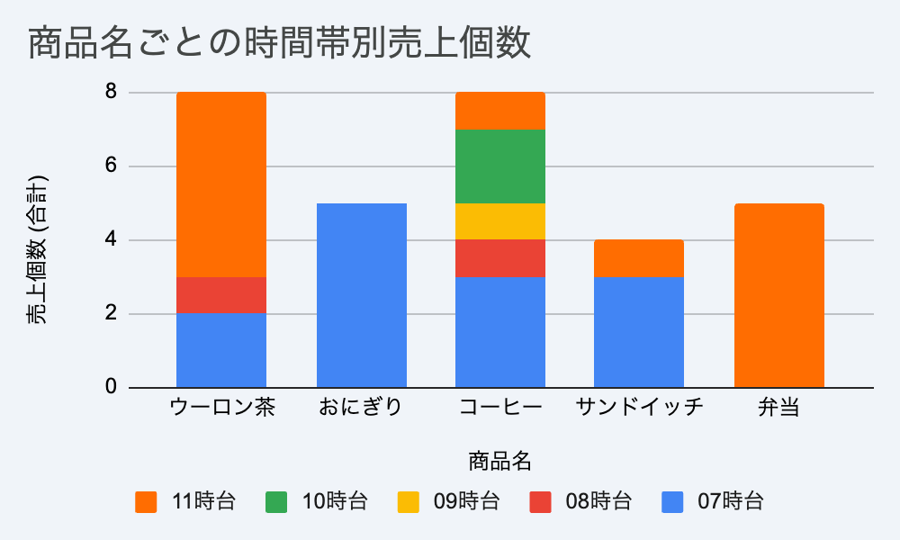
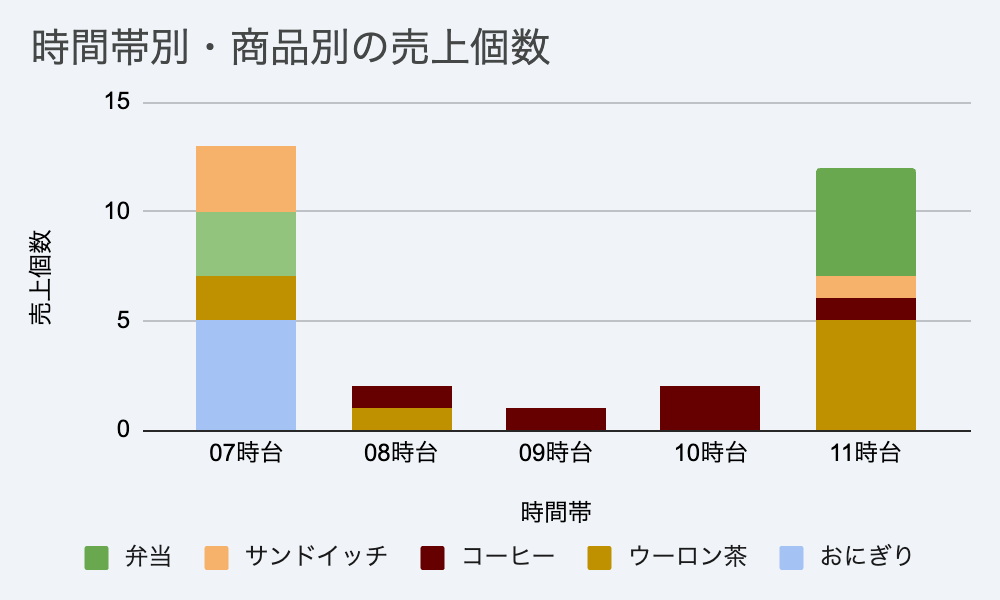

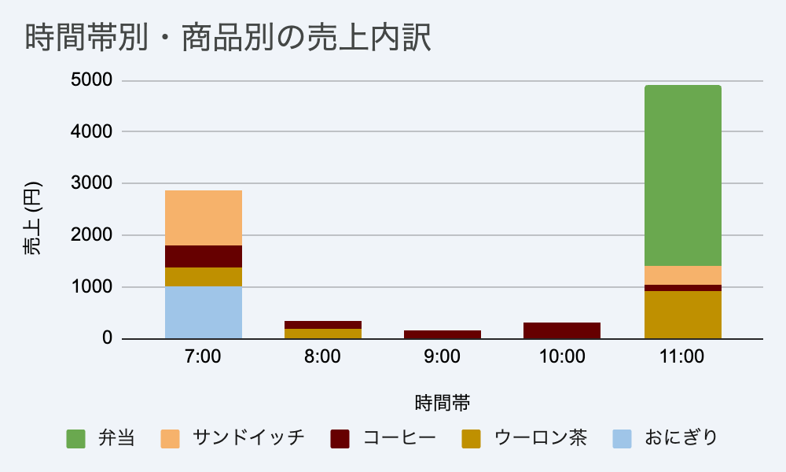

同じデータでも、<b>まとめ方により印象が変わる</b>。<b>引き出せる知識も違う</b>可能性がある。目的にあう情報になるよう<b>まとめ方を工夫</b>しよう。 ※印象操作に注意。 重要

<!--
- 同じデータでも、まとめ方によって印象が大きく変わる。商品ごとの個数、時間帯別の個数、時間帯別の売上金額と、切り口を変えると見えてくるものが違う。
- 引き出せる知識も違ってくる可能性がある。目的に合う情報になるよう、まとめ方を工夫しよう。ただし印象操作には注意。
-->

---

データから情報の変換

# 可視化して見えてきたこと

知識

7時台は来客が多く、おにぎりやサンドイッチ、コーヒーの売れ行きが良い。 
11時台はウーロン茶・弁当の売れ行きが良い。あいだの時間は売れない。 
一緒に買うものに傾向がある。おにぎりや弁当→ウーロン茶 ／ サンドイッチ→コーヒー

知恵

8時/9時はコーヒーの自販機を案内 
コーヒー・サンドイッチ、おにぎり・烏龍茶セットを用意し割引

<b>データ、情報、知識</b>を使い、現在の問題点について思考し、解決策を導き出す<b>知恵</b>こそが<b>人間の得意分野</b>

<!--
- 可視化して見えてきたこと。まず「知識」として、7時台は来客が多くおにぎり・サンドイッチ・コーヒーが売れ、11時台はウーロン茶・弁当が売れる。あいだの時間は売れない。一緒に買うものにも傾向がある。
- 次に「知恵」として、8時9時はコーヒーの自販機を案内する、コーヒー・サンドイッチやおにぎり・烏龍茶のセットを割引で用意する、といった解決策が出てくる。
- データ・情報・知識を使い、問題について思考し解決策を導き出す知恵こそが、人間の得意分野。
-->

---

コミュニケーション

# コミュニケーションとは何か

コミュニケーションの定義：<b>「社会生活を営む人間の間に行われる感情・思考の伝達」</b>

重要

普段、私たちが何気なく行っている会話やメッセージのやりとり。  
これは、自分の頭の中にある<b>「目に見えない思い」</b>を、<b>相手の頭の中に</b>そっくりそのまま<b>「再現」</b>しようとする、非常に高度で複雑な作業です。

※ 最近では生成AIに自分の思考を伝達させる際にも、　　使える考え方です。

<!--
- コミュニケーションとは何か。定義は「社会生活を営む人間の間に行われる感情・思考の伝達」。
- 普段、私たちが何気なく行っている会話やメッセージのやりとり。これは、自分の頭の中にある目に見えない思いを、相手の頭の中にそっくりそのまま再現しようとする、非常に高度で複雑な作業です。
- 最近では、生成AIに自分の思考を伝達させる際にも使える考え方です。
-->

---

コミュニケーション

# コミュニケーションとは、情報変換の連鎖である

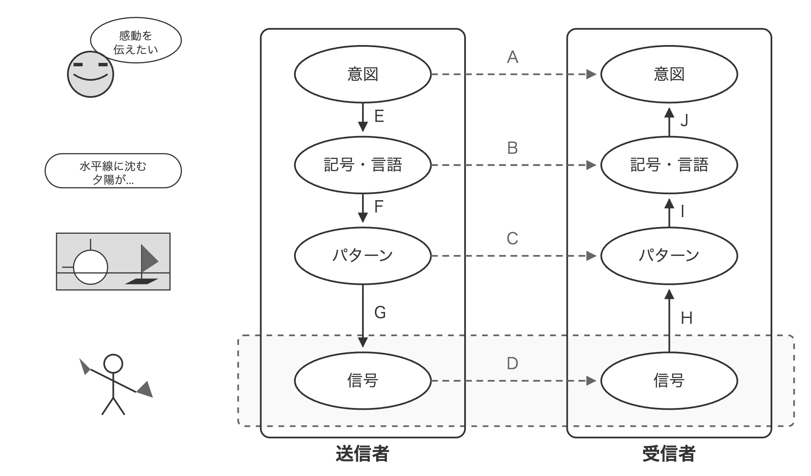

Aが出来ると漠然と想像するが、<b>普通はそんなことはない</b> 
<b>それができたら授業は楽</b> 
※テレパシー…? ※ライブ…？

ネットや電話、テレビなど”テレコミュニケーション”はD経由 
　　※ Dで有名な論理が、<b>シャノンの情報理論</b>

※<b>記号・言語とパターン</b>のどっちが先行するかは、場合による

<!--
- コミュニケーションとは、情報変換の連鎖である。送信者は、意図を記号・言語、パターン、信号へと変換し、受信者は逆に信号からパターン、記号・言語、意図へと復元していく。
- 矢印Aのように意図がそのまま直接伝わると漠然と想像しがちだが、普通はそんなことはない。それができたら授業は楽。テレパシーやライブのようなものを想像してほしい。
- ネットや電話、テレビなどのテレコミュニケーションは信号Dを経由する。Dで有名な論理がシャノンの情報理論。
- 記号・言語とパターンのどちらが先行するかは、場合による。
-->

---

コミュニケーション

# コミュニケーションの4つの要素

意図（感情や思考）

頭の中にある、言葉にならない感情や思考そのもの。

記号（言語）

形のない意図を、他者と共有できる「言葉」や「文字」のルールに変換したもの。

パターン

写真や図表など、直感的でわかりやすい表現。

信号

電気、光、音などの物理的な記号。現在のコンピュータは内部で「0」と「1」しか扱えない。

<!--
- コミュニケーションを構成する4つの要素を整理する。
- 意図は、頭の中にある言葉にならない感情や思考そのもの。記号（言語）は、形のない意図を他者と共有できる言葉や文字のルールに変換したもの。
- パターンは、写真や図表など直感的でわかりやすい表現。信号は、電気・光・音などの物理的な記号で、現在のコンピュータは内部で0と1しか扱えない。
-->

---

コミュニケーション

# 最も大切なこと：受け手の立場で考える

電波や声や手紙が相手に届いたからといって、<b>「伝わった」とは限りません。</b> 
また、相手は、届いた記号（言葉）を<b>自分の経験や知識というフィルター</b>を通して解釈し、頭の中で意味を再構築します。 
<b>送信者の意図と受信者の理解には必ず、ズレが生じます</b>。 
言語が違うと伝わりませんし、自分が伝える段階で良い言葉が選べないことも。

<b>「送った」 ≠ 「伝わった」</b>

重要

「相手は正しく意図を再構築してくれるだろうか？」 <b>相手の立場に立って考えること</b>がコミュニケーション成功の鍵

<!--
- 最も大切なことは、受け手の立場で考えること。電波や声や手紙が相手に届いたからといって、「伝わった」とは限りません。
- 相手は、届いた記号（言葉）を自分の経験や知識というフィルターを通して解釈し、頭の中で意味を再構築します。だから送信者の意図と受信者の理解には必ずズレが生じます。言語が違うと伝わらないし、自分が伝える段階で良い言葉が選べないこともある。
- つまり「送った」は「伝わった」と等しくない。相手は正しく意図を再構築してくれるだろうか、と相手の立場に立って考えることが、コミュニケーション成功の鍵です。
-->

---

人と機械のインターフェース

# 人と機械のインターフェース

HMI (ヒューマンマシンインターフェース)

人間とコンピュータ間で情報をやり取りする手段。視覚的で直感的なWebブラウザの普及により、誰もが簡単にネットワークにアクセス可能になりました。

UI (ユーザーインターフェース)

ユーザーの「操作する部分」のこと。 例: 画面のデザイン、ボタンの配置、文字の読みやすさ (フォントや色合い) など。

Webを通じたコミュニケーション

情報の「受信」だけでなく、SNSや掲示板を通じた<b>「発信」と「双方向のやり取り」</b>が容易になり、世界中の人と繋がれるようになりました。

UX (ユーザーエクスペリエンス)

システムを利用した際にユーザーが感じる<b>「使いやすさ」や「心地よさ」</b>などの体験全体のこと。良いUIは、優れたUXの重要な要素の一つです。

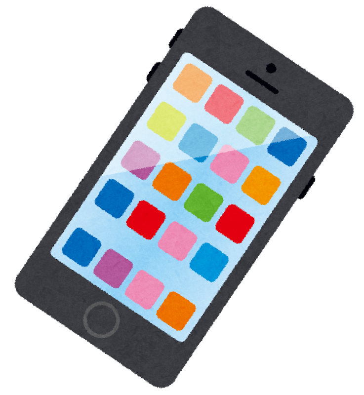

<b>メディアや機械と人の接点は、今後も変わりうる</b>

<!--
- 人と機械のインターフェースを4つの観点で整理する。
- HMIは、人間とコンピュータ間で情報をやり取りする手段。直感的なWebブラウザの普及で、誰もが簡単にネットワークにアクセスできるようになった。
- UIは、ユーザーが操作する部分。画面デザイン、ボタン配置、文字の読みやすさなど。
- Webを通じたコミュニケーションでは、受信だけでなく、SNSや掲示板を通じた発信と双方向のやり取りが容易になった。
- UXは、システム利用時に感じる使いやすさや心地よさなど体験全体のこと。良いUIは優れたUXの重要な要素の一つ。
- メディアや機械と人の接点は、今後も変わりうる。
-->

---

データ・社会・人

# 人間社会の発展

Society 5.0日本社会や経済を望ましい方向へ変化させるビジョン

<table style="width:100%; border-collapse:collapse; font-size:20px; line-height:1.3;">
<thead>
<tr style="background:var(--accent); color:#fff;">
<th style="padding:5px 10px; border:1px solid #ccc; white-space:nowrap;">段階</th>
<th style="padding:5px 10px; border:1px solid #ccc; white-space:nowrap;">社会</th>
<th style="padding:5px 10px; border:1px solid #ccc; white-space:nowrap;">時代</th>
<th style="padding:5px 10px; border:1px solid #ccc;">概要</th>
</tr>
</thead>
<tbody>
<tr><td style="padding:4px 10px; border:1px solid #ccc; font-weight:700; white-space:nowrap;">Society 1.0</td><td style="padding:4px 10px; border:1px solid #ccc; white-space:nowrap;">狩猟社会</td><td style="padding:4px 10px; border:1px solid #ccc; white-space:nowrap;">原始・縄文時代</td><td style="padding:4px 10px; border:1px solid #ccc;">道具や罠を作り狩猟や物々交換などを行う。</td></tr>
<tr style="background:var(--section-bg);"><td style="padding:4px 10px; border:1px solid #ccc; font-weight:700; white-space:nowrap;">Society 2.0</td><td style="padding:4px 10px; border:1px solid #ccc; white-space:nowrap;">農耕社会</td><td style="padding:4px 10px; border:1px solid #ccc; white-space:nowrap;">弥生時代〜中世</td><td style="padding:4px 10px; border:1px solid #ccc;">畑を耕し作物を育てる。天文学が誕生し、暦が作られる。</td></tr>
<tr><td style="padding:4px 10px; border:1px solid #ccc; font-weight:700; white-space:nowrap;">Society 3.0</td><td style="padding:4px 10px; border:1px solid #ccc; white-space:nowrap;">工業社会</td><td style="padding:4px 10px; border:1px solid #ccc; white-space:nowrap;">18世紀〜20世紀</td><td style="padding:4px 10px; border:1px solid #ccc;">産業革命が起こり、工業化により大量生産が可能になる。</td></tr>
<tr style="background:var(--section-bg);"><td style="padding:4px 10px; border:1px solid #ccc; font-weight:700; white-space:nowrap;">Society 4.0</td><td style="padding:4px 10px; border:1px solid #ccc; white-space:nowrap;">情報社会</td><td style="padding:4px 10px; border:1px solid #ccc; white-space:nowrap;">1990年代〜現在</td><td style="padding:4px 10px; border:1px solid #ccc;">インターネットやPCが普及する。GAFAの時代。</td></tr>
<tr><td style="padding:4px 10px; border:1px solid #ccc; font-weight:700; white-space:nowrap;">Society 5.0</td><td style="padding:4px 10px; border:1px solid #ccc; white-space:nowrap;">超スマート社会</td><td style="padding:4px 10px; border:1px solid #ccc; white-space:nowrap;">現在が移行期</td><td style="padding:4px 10px; border:1px solid #ccc;">IoTやAI、ビッグデータ等を用いて、今まで出来なかった課題を解決する、新しい社会の実現を目指す。</td></tr>
</tbody>
</table>

内閣府資料　スライド　文章

<!--
- 人間社会の発展を、Society 1.0から5.0まで段階で整理する。Society 5.0は、日本社会や経済を望ましい方向へ変化させるビジョン。
- 1.0狩猟社会、2.0農耕社会、3.0工業社会、4.0情報社会と発展してきた。そして5.0が超スマート社会で、現在が移行期。IoTやAI、ビッグデータを用いて、今まで出来なかった課題を解決する新しい社会の実現を目指す。
- この表は内閣府資料に基づく。
-->

---

データ・社会・人

# データ駆動型社会 Data-Driven Society

<b>定義：</b> 客観的なデータがきっかけとなり、社会の様々な活動が活性化される社会

<b>Society 5.0との関連:</b> 
情報技術を用いて人とモノをつなげ、知識や情報を共有する必要性。サイバー空間とフィジカル空間を高度に融合する方向性。

<b>社会への影響:</b> 
PDCAサイクルの高速化。リアルタイムで、即座にサービスを改善。

<b>情報リテラシがより重要に:</b> 
例：データや情報の偏りの影響に気づける

勘や経験ではなく、客観的なデータに基づいて意思決定を行う

<!--
- データ駆動型社会とは、客観的なデータがきっかけで社会の活動が活性化される社会。
- Society 5.0と関連し、サイバー空間とフィジカル空間を融合する方向性。PDCAが高速化し、即座にサービスを改善できる。
- だからこそ、データや情報の偏りの影響に気づける情報リテラシがより重要になる。勘や経験ではなく客観的データで意思決定を。
-->

---

データ・社会・人

# IoT (Internet of Things)

モノが「目」と「耳」を持ち、デジタル化する社会

IoTによる情報の流れの例

<b>①取得(センサ):</b> 温度、加速度、画像などを感知

<b>②送る(通信):</b> クラウド(web上のPC)へ送信

<b>③分析(AI):</b> データを処理

<b>④フィードバック:</b> モノを動かす、または人に通知

スマートウォッチ、スマート家電、機械や車のセンサー etc...

1次利用→自分が便利に 
2次利用→機能改善や発見で、他の人に貢献

<b>⚠ リスク:</b> セキュリティ対策を怠ると盗み見などの危険

<!--
- IoTは、モノが「目」と「耳」を持ち、デジタル化する社会。
- 情報の流れは、①センサで取得、②通信でクラウドへ送る、③AIで分析、④フィードバックでモノを動かすか人に通知、の4段階。
- 1次利用は自分が便利に、2次利用は機能改善で他の人に貢献。ただしセキュリティ対策を怠ると盗み見などの危険がある。
-->

---

データ・社会・人

# ビッグデータ

単なる「大量のデータ」ではない、新しい価値の源泉

従来のソフトウェアの処理能力を超える規模のデータ（3つのV）

<b>Volume(量):</b> テラ・ペタバイト級の蓄積

<b>Variety(多様性):</b> テキスト、音声、動画など

<b>Velocity(速度):</b> リアルタイムで生成・更新

<b>社会へのインパクト</b> 
統計学的な「推測」から、全数調査に近い「事実」の把握へ。相関関係を見つけることで未来を予測

<b>リスクとリテラシー</b> 
プライバシーの保護：自分のデータが他人の資源になる

<!--
- ビッグデータは、単なる「大量のデータ」ではなく、新しい価値の源泉。従来のソフトの処理能力を超える規模のデータで、3つのVが特徴。
- Volume(量)はテラ・ペタ級の蓄積、Variety(多様性)はテキスト・音声・動画など、Velocity(速度)はリアルタイムで生成・更新。
- 社会へのインパクトは、統計的な推測から全数調査に近い事実の把握へ。一方でプライバシーの保護というリスクとリテラシーが問われる。
-->

---

データ・社会・人

# なぜ今、データサイエンスなのか？

コンピュータ、アルゴリズム、通信などの技術が急速に発展し、AIを実現する基盤が整備された。

IoT

現実世界のあらゆる動きをセンサで「データ」化して集める。

ビッグデータ

人間では処理しきれない「大量・多様」なデータの蓄積。

AI

集まったデータから「価値」を抽出し、社会を動かす。

データ駆動型社会では、<b>データに基づいた意思決定</b>が当たり前になる

<!--
- なぜ今データサイエンスなのか。コンピュータ・アルゴリズム・通信の技術が急速に発展し、AIを実現する基盤が整ったから。
- IoTで現実世界の動きをデータ化し、ビッグデータとして大量・多様に蓄積し、AIがそこから価値を抽出して社会を動かす。
- データ駆動型社会では、データに基づいた意思決定が当たり前になる。
-->

---

データと理工学

# データとサイエンス

科学は、データから知見を得ることによって発達してきた。

科学研究の4つの手法

1.

<b>経験:</b> 観察して記録する (例: 星の動きを記録)

2.

<b>理論:</b> 法則をみつけ、定式化する (例: 万有引力の法則)

3.

<b>計算:</b> 法則に基づいて計算し、予測する (例: ハレー彗星の回帰予測、気象予測)

4.

<b>データ:</b> 膨大なデータから法則を見出す (データサイエンス)

大きなデータ、大きな計算が出来ると、サイエンスも変わる

<!--
- 科学は、データから知見を得ることで発達してきた。
- 科学研究の4つの手法は、1.経験(観察して記録)、2.理論(法則をみつけ定式化)、3.計算(法則に基づき予測)、4.データ(膨大なデータから法則を見出す＝データサイエンス)。
- 大きなデータ、大きな計算が出来ると、サイエンスのやり方そのものも変わる。
-->

---

データと理工学

# 科学的推論の3つのアプローチ

<b>帰納法</b> (Induction)

<b>演繹法</b> (Deduction)

<b>アブダクション</b> (Abduction)

複数の個別データや事実から、共通する一般的な法則を導き出す推論。

一般的な法則や前提ルールから、論理的に個別の結論を導き出す推論。

観察された結果に対して、最も妥当な説明を仮説として推論する。

利点

検証可能・再現可能・論理的必然性

現実的、理論がなくても可

新しい仮説を生み出せる

欠点

前提次第、新しさに乏しい

確実ではない、白いカラス

仮説が複数あり得る、確証バイアス

複数のアプローチを組み合わせて解決を目指す

<!--
- 科学的推論には3つのアプローチがある。帰納法は個別データから一般的法則を導く。演繹法は一般的法則から個別の結論を導く。アブダクションは結果に対し最も妥当な仮説を推論する。
- 利点と欠点もそれぞれ違う。帰納法は検証・再現可能だが前提次第。演繹法は理論がなくても可だが確実ではない。アブダクションは新しい仮説を生めるが確証バイアスに注意。
- 一つに頼らず、複数のアプローチを組み合わせて解決を目指す。
-->

---

データと理工学

# 科学研究のふたつのアプローチ(パラダイム)

<b>仮説駆動型:</b> 仮説からの予測を実験・観測によって検証する

<b>データ駆動型:</b> 実験・観測データから法則性をみつける

<table style="font-size:22px; margin-top:10px; width:calc(100% - var(--pip-w));">
<tr><th>項目</th><th>仮説検証型のアプローチ</th><th style="color:var(--accent);">データ駆動型のアプローチ</th></tr>
<tr><td>出発点</td><td>仮説を立てる</td><td>蓄積された膨大なデータ</td></tr>
<tr><td>進め方</td><td>仮説 → 実験 → 検証</td><td>データ → 解析 → 発見</td></tr>
<tr><td>特徴</td><td>「仮説が正しいか？」を検証する</td><td>「次に何が起こるか？」を予測</td></tr>
</table>

データ駆動型のアプローチはより容易に

<!--
- 科学研究には、ふたつのアプローチ(パラダイム)がある。仮説駆動型は仮説からの予測を実験・観測で検証する。データ駆動型は実験・観測データから法則性をみつける。
- 出発点・進め方・特徴を比べると、仮説検証型は「仮説が正しいか」を検証し、データ駆動型は「次に何が起こるか」を予測する。
- ビッグデータの時代には、データ駆動型のアプローチがより容易になっている。
-->

---

機械学習・深層学習

# AI： 人が知的だと感じる処理を実現するシステム

<svg viewBox="0 0 360 300" width="100%" style="max-width:360px;">
  <rect x="2" y="2" width="356" height="296" rx="14" fill="#FBE4EA" stroke="var(--accent)" stroke-width="2.5"/>
  <text x="14" y="28" font-size="20" font-weight="800" fill="var(--accent-dark)">人工知能 (AI)</text>
  <rect x="22" y="44" width="316" height="240" rx="12" fill="#fff" stroke="#1A6BB0" stroke-width="2.5"/>
  <text x="34" y="68" font-size="19" font-weight="800" fill="#15436e">機械学習</text>
  <rect x="44" y="84" width="274" height="184" rx="10" fill="#EAF2FB" stroke="#2E9E5B" stroke-width="2.5"/>
  <text x="56" y="108" font-size="19" font-weight="800" fill="#2E7D46">深層学習</text>
  <rect x="66" y="124" width="232" height="128" rx="8" fill="#FFF6E6" stroke="#F0A500" stroke-width="2.5"/>
  <text x="100" y="195" font-size="20" font-weight="800" fill="#8a4b00">生成AI</text>
</svg>

数理・統計・DS が土台

分類したり、予想したり、処理したり…

生成AIを使っていなくても、 
<b>YouTubeのおすすめ</b>や、 
<b>運転支援・お掃除ロボット</b>や、 
<b>今日のスーパーの仕入れ管理</b>など、 
様々なところで利用されている

機械学習・深層学習 … 信頼性・再現性・速度/費用・適合性…

理論は不明(後から発見)でも、結果は予測できる

<!--
- AIとは、人が知的だと感じる処理を実現するシステム。人工知能の中に機械学習、その中に深層学習、さらにその中に生成AIがあり、土台には数理・統計・データサイエンスがある。
- 分類したり、予想したり、処理したり。生成AIを使っていなくても、YouTubeのおすすめ、運転支援やお掃除ロボット、スーパーの仕入れ管理など、様々なところで利用されている。
- 理論は不明でも(後から発見されることも)、結果は予測できるのがポイント。
-->

---

機械学習・深層学習

# 機械学習/深層学習で実現すること

統計や機械学習は、<b>未来</b>や<b>全体</b>を知ることができない人間が、<b>世界を理解したり、作業を実行するために</b>編み出した技術

① 売上・需要予測

既存データから将来の数値を予測 → 在庫最適化やリソース配置の変更

② 異常・故障検知

リアルタイムで異常パターンを検知 → 重大なトラブルを未然に防止

③ データの可視化・分類

複雑なデータをグループ化・可視化 → 新たな知見の発見を支援

④ 強化学習と自動化

試行錯誤から最適な行動パターンを学習 → 複雑な制御や判断を自動化

<!--
- 統計や機械学習は、未来や全体を知ることができない人間が、世界を理解したり作業を実行するために編み出した技術。
- 実現することは大きく4つ。①売上・需要予測で在庫最適化、②異常・故障検知でトラブルを未然防止、③データの可視化・分類で新たな知見を発見、④強化学習と自動化で複雑な制御や判断を自動化。
-->

---

メールについて

# アドレスの構造

inage_yayoi @ chiba-u.jp

ローカルパート

✓ 個人を示す文字列 ✓ 大文字小文字を区別する <b style="color:var(--accent);">使い分けないほうが無難</b>

ドメイン

✓ メールサーバのFQDN <b style="color:var(--accent);">✓ 大文字小文字を区別しない</b>

● 「...」や末尾の「.」など、使えない文字列もある 
● 千葉 太郎 &lt;chiba.tarou@chiba-u.jp&gt;のように、<b>ディスプレイネーム&lt;アドレス&gt;</b>という書き方もある 
※ ディスプレイネームも詐称出来るので注意

<!--
- メールアドレスの構造。@の前がローカルパート、後ろがドメイン。
- ローカルパートは個人を示す文字列で大文字小文字を区別するが、使い分けないほうが無難。ドメインはメールサーバのFQDNで、大文字小文字を区別しない。
- 「...」や末尾の「.」など使えない文字列もある。千葉 太郎<chiba.tarou@chiba-u.jp>のようにディスプレイネーム<アドレス>という書き方もあるが、ディスプレイネームも詐称できるので注意。
-->

---

メールについて

# メール作成時の主なアドレスの種類

<table style="font-size:21px; margin-top:10px; width:100%;">
<tr><th style="width:140px;">項目名</th><th>意味</th></tr>
<tr><td><b>From</b></td><td>[必須] 送信者のアドレス (差出アドレス) ※詐称可能</td></tr>
<tr><td><b>To</b></td><td>[原則、必須] 受信者のアドレス (宛先アドレス) (必要に応じて返信すべき)当事者</td></tr>
<tr><td><b>Cc</b></td><td>Carbon copy の略。上司など、To以外の人に参考までにメールを送信するときに指定する。</td></tr>
<tr><td><b>Bcc</b></td><td>Blind carbon copy の略。Bccのアドレスは他の受信者には見えないので、流出を防ぐ時に使用 ※ To/Ccにはbccが見えない → トラブル注意。</td></tr>
<tr><td><b>Reply-To</b></td><td>返信先を指定する場合</td></tr>
</table>

<!--
- メール作成時の主なアドレスの種類。
- Fromは必須の送信者アドレスだが詐称可能。Toは原則必須の受信者アドレス。Ccはカーボンコピーで上司など参考までに送る人。
- BccはブラインドカーボンコピーでアドレスがTo/Ccの受信者には見えないので流出防止に使うが、見えないこと自体がトラブルの元になるので注意。Reply-Toは返信先を指定する場合に使う。
-->

---

メールの注意点

# メール件名のマナーとネチケット

件名： Subject

本文の内容を<b>的確かつ簡潔に</b>表現する。 
用件がひと目で分かるようなタイトルをつけることが重要。 
多数のメールを受信する人の立場を考えましょう。

<b>空（件名なし）でメールを送るのはマナー違反</b> 
読まずに後回しにされたり、迷惑メールと間違われて捨てられてしまうこともあります。

行頭の「Re:」や「Fwd:」

メールソフトやWebメールが自動的に付ける記号。書換え・追加しない。

<b>Re:</b> 返信を示す（ラテン語の "res" が語源） 
<b>Fwd:</b> 転送 (Forward) を示す。添付の場合と(全文)引用の場合があり。

<!--
- メール件名のマナーとネチケット。件名は本文の内容を的確かつ簡潔に表現し、用件がひと目で分かるタイトルをつけることが重要。多数のメールを受信する人の立場を考える。
- 空(件名なし)でメールを送るのはマナー違反。読まずに後回しにされたり、迷惑メールと間違われて捨てられることもある。
- 行頭のRe:やFwd:はメールソフトが自動的に付ける記号なので書き換え・追加しない。Re:は返信(ラテン語resが語源)、Fwd:は転送(Forward)を示す。
-->

---

メールの注意点

# メール本文のマナーとネチケット

あて先の明記

本文の冒頭に、受信者の所属と名前を書く（あて先の確認の意味）。

名乗り（送信者の所属と名前）

システムの「From」情報だけに頼らず、本文でもしっかり名乗る。

受け手を想像した配慮

依頼は注意。「〜までに〜して下さい」と一方的に指示するのではなく、締切を明記した上で、<b>「恐縮ですがよろしくお願いいたします」「ご放念下さい」</b>などの表現を。相手は、こちらの心情や表情が見えない。。 環境依存文字（①や㈱など）の利用には注意する。自動改行機能を使わず、読みやすい位置で自分で改行を入れる。

署名

本文の最後に、所属、名前、住所、連絡先等を記載する。

<!--
- メール本文では、あて先の明記・名乗り・受け手への配慮・署名の4点。特に依頼は一方的な指示にならないよう、締切を明記しつつ丁寧な表現を添える。
-->

---

メールの注意点

# メール送付時のマナーとネチケット

ファイルサイズに注意

<ul style="font-size:22px; line-height:1.5; margin-top:4px;">
<li>何MBもの巨大な添付ファイルは、受信者のネットワーク帯域やメールボックスの容量を圧迫し、<b style="color:var(--accent)">大きな迷惑になる</b>ことがあります。</li>
<li>巨大な写真をそのまま貼り付けただけの重い文書ファイルにも注意が必要です。</li>
</ul>

受け手を想像した配慮

<ul style="font-size:22px; line-height:1.5; margin-top:4px;">
<li>サイズは問題ないか、本当に必要なファイルかを確認してから添付する。</li>
<li>大容量になる場合は、クラウドストレージやファイル転送サービスの利用を検討する。</li>
</ul>

機密保持

<ul style="font-size:22px; line-height:1.5; margin-top:4px;">
<li>機密のファイルは、クラウドストレージの共有機能やパスワードをかけて別送する。</li>
<li>組織外のアドレスと出る場合には、要注意！</li>
</ul>

<!--
- 送付時はファイルサイズと機密保持に注意。巨大な添付は相手の迷惑になり得るし、機密ファイルはパスワードや共有機能で別送を。組織外アドレス宛は特に要注意。
-->

---

守るべきこと・習慣

# 守るべきこと・習慣

<b style="color:var(--accent)">①</b> 法を犯したり、権利を侵害するべからず

ネット賭博、闇バイト、詐欺、 収集した個人情報の不適切な利用、 プライバシー権、<b>著作権</b>etc… https://www.jiji.com/jc/article?k=2025092900526&amp;g=soc

<b style="color:var(--accent)">②</b> 注意を怠るべからず

情報セキュリティ、個人情報/機密情報流出、フィシング詐欺 等 ※ ルール・規約は確認 / ニュースに敏感になる

<b style="color:var(--accent)">③</b> 所属組織・社会の規範・習慣・要配慮点を知るべし

生成AI/システムの利用可否、メールの書き方など

重要

<!--
- 守るべきこと3つ。①法や権利の侵害をしない、②情報セキュリティなど注意を怠らない、③所属組織や社会の規範・習慣を知る。ルールや規約は確認し、ニュースにも敏感に。
-->

---

SNSの注意点①

# SNSの注意点①

例： パスワードが予想されてしまった…

プロフィールの設定

<ul style="font-size:21px; line-height:1.45; margin-top:2px;">
<li>自分の顔がはっきり分かるような個人情報は慎重に扱う。</li>
<li>プロフィール写真から個人が特定され、<b style="color:var(--accent)">悪用される危険性</b>がある。</li>
<li>他人の写真やイラストなどを許可なくアイコンとして使用しない。</li>
</ul>

公開範囲の設定

<ul style="font-size:21px; line-height:1.45; margin-top:2px;">
<li>「友人限定」の設定であっても、スクリーンショット等で拡散される可能性があることを忘れない。</li>
<li>サービスごとの公開範囲設定を適切に行う。</li>
<li>自分の投稿が<b style="color:var(--accent)">「誰に」見られているか</b>を常に意識する。</li>
</ul>

<!--
- SNSの注意点その1。プロフィールの設定と公開範囲の設定。顔写真などから個人が特定され悪用される危険があるし、友人限定でもスクショで拡散されうる。誰に見られているかを常に意識。
-->

---

SNSの注意点②

# SNSの注意点②

例： Be Realで個人情報・取引先情報が流出...

写真や場所に関する注意

<ul style="font-size:21px; line-height:1.45; margin-top:2px;">
<li>自宅や学校、アルバイト先が特定できる写真や書き込みは避ける(一部のAIで場所は特定しうる)。</li>
<li>位置情報（ジオタグ）が付与された写真の投稿は、現在地を不特定多数に知らせるリスクがある。</li>
<li>映り込んだものには注意する。人の顔、機密情報、個人情報が問題になることがある。</li>
</ul>

投稿内容の注意

<ul style="font-size:21px; line-height:1.45; margin-top:2px;">
<li>誹謗中傷や差別的な発言、不適切な悪ふざけの投稿は絶対にしない。</li>
<li>記録は後々まで残り（デジタルタトゥー）、深刻な問題に発展することがある。</li>
<li>投稿する前に、一歩止まって確認を。</li>
</ul>

<!--
- SNSの注意点その2。写真や場所、投稿内容について。位置情報や映り込みから場所・個人が特定されうるし、誹謗中傷などはデジタルタトゥーとして残る。投稿前に一歩止まって確認を。
-->

---

利用規則・規約・契約

# 利用規則・規約・契約

(読み飛ばす前に)自分の入力した情報がどう扱われるかは知っておこう

ChatGPT(特に無料版)の場合、 <b>ユーザーの入力は原則、学習に使われる</b> <b>機微を含むならオプトアウト(自分の入力の学習の停止)する</b> → https://help.openai.com/en/articles/7730893-data-controls-faq

但し、暴力や性的な目的とみなされる利用は<b style="color:var(--accent)">アウト</b>

参考：千葉大 Gemini / NotebookLM

千葉大 Gemini や Google Workspace のサービスでは、入力したデータが Google の生成 AI モデルの学習に使われることはありません。

<!--
- 規約は読み飛ばしがちだが、入力した情報がどう扱われるかは知っておくべき。ChatGPT無料版は入力が原則学習に使われるので、機微な内容はオプトアウトを。千葉大Geminiなどは学習に使われない。
-->

---

情報流出を防ぐ行動

# 情報流出を防ぐ行動

行動１

生成AIサービスの<b>規約を確認</b>（データの利用目的や範囲等）また利用規約の変更時には変更箇所をチェック

行動２

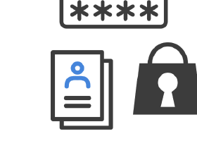

個人情報や機密情報の入力は<b>必要最小限</b>

行動３

生成AIに入力したデータを<b>学習に使わせないように設定</b>（オプトアウト設定）※1

総務省　生成AIはじめの一歩 ～生成AIの入門的な使い方と注意点～

<!--
- 情報流出を防ぐ3つの行動。行動1は規約の確認と変更箇所のチェック、行動2は個人情報・機密情報の入力を必要最小限に、行動3はオプトアウト設定で学習に使わせない。
-->

---

千葉大の生成AI指針

# 千葉大学の教育・学習における生成AIの利用についての指針

<b style="color:var(--accent)">①</b>「生成 AI についての学び」「生成 AI を用いた学び」「生成 AI によらない学び」を<b>それぞれ推進</b>

<b style="color:var(--accent)">②</b>

授業での利用は、授業の目的に合致することが前提であり、合致するかは、各授業の担当教員が<b>判断</b> <b>禁止の場合はシラバスなどに明記</b> <b>(気になったら先生に聞きましょう！)</b>

<b style="color:var(--accent)">③</b> <b>リスクや懸念に伴う禁止事項あり</b>

リンク

重要

この文章を困ったら確認！

<!--
- 千葉大の生成AI指針。①についての学び・用いた学び・によらない学びをそれぞれ推進、②授業での利用は目的に合致するかを担当教員が判断し禁止ならシラバスに明記、③リスクに伴う禁止事項もある。困ったらQRから確認を。
-->

---

生成AIの仕組み

# Generative AI (Artificial Intelligence)

人工知能 (AI)

機械学習

深層学習

生成AI

与えられたデータから新たなデータを生成する能力を持つ技術

テキスト、画像、音声など様々な形式のデータを基に、新たなコンテンツを生成可能

効率化・低コスト化

文章作成やリサーチなどの<b>業務を効率化し、コストを削減</b>できます。

人手不足の解消

一部の作業を生成AIに任せる事ができます。

イノベーションの促進

<b>新しいアイディアやコンセプトを生成可能</b>になり、創造的な活動をサポートします。

重要

<!--
- 生成AIとは、与えられたデータから新たなデータを生成する技術。AI＞機械学習＞深層学習＞生成AIという包含関係。効率化・低コスト化、人手不足の解消、イノベーションの促進といったメリットがある。
-->

---

生成AIの仕組み

# 生成AIを活用する上での注意点

品質の不確実性

生成されたデータに<b>誤った情報が含まれる可能性</b>がある。

著作権の侵害

生成されたデータが<b>著作権を侵害している可能性</b>があるため、利用には注意が必要。

個人情報保護

利用者の意図に反してAIが個人情報を学習していた場合、回答内容によっては<b>名誉毀損やプライバシー侵害に該当する可能性</b>がある。

<!--
- 生成AIを活用する上での注意点は3つ。品質の不確実性（誤情報が含まれうる）、著作権の侵害（生成物が他者の著作権を侵害しうる）、個人情報保護（学習した個人情報により名誉毀損やプライバシー侵害になりうる）。
-->

---

生成AIの仕組み

# ハルシネーションとカットオフ

生成AIが誤った情報を生成する現象

<b>学習データの誤り</b> → ブログやSNS投稿からも学習しているため

<b>学習データの偏り</b> → バイアスや偏見を学習してしまう

<b>学習データの鮮度</b> → 過去のデータに基づく、最新情報には未対応の場合がある(カットオフ)

信頼性の高いものを参照し、生成データの正確性や出典を確認する

看護師

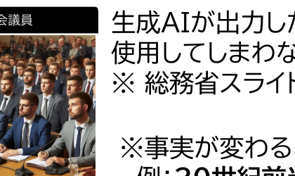

国会議員

生成AIが出力した偏見のある回答を使用してしまわないよう注意 ※ 総務省スライドより  ※事実が変わることもある 　例：<b>20世紀前半の国会議員</b>

<!--
- ハルシネーションは生成AIが誤った情報を生成する現象で、学習データの誤り・偏り・鮮度（カットオフ）が原因。看護師や国会議員の画像生成例のように偏見が出力されることもあるので、信頼性の高いものを参照し正確性や出典を確認する。
-->

---

生成AIの仕組み

# フェイク情報

悪意を持って生成された誤った情報

<b>生成AIにより誰でも簡単に画像、音声などを生成可能（ディープフェイク）</b>

<b>実際に詐欺行為に使われることもある</b>

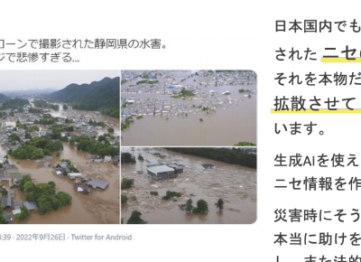

生成AIでミセ・誤情報が巧妙化

ニセ・誤情報はなぜ作られるのか？

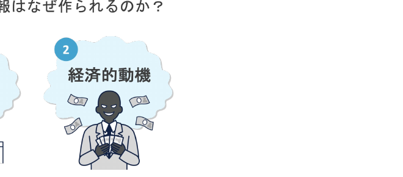

総務省：インターネットとの向き合い方～ニセ・誤情報にだまされないために～第2版 総務省： 生成AIはじめの一歩 ～生成AIの入門的な使い方と注意点～

<!--
- フェイク情報は悪意を持って生成された誤った情報。生成AIで誰でも簡単に画像や音声を作れるため（ディープフェイク）、詐欺にも使われる。ニセ・誤情報は政治的・経済的な動機で作られることがある。
-->

---

生成AIの仕組み

# 注意点を活かそう

情報の正確性

<ul>
<li>無意識のうちに合理的ではない行動、偏った判断をすることがあるという意識を持つ</li>
<li>チェックリストを用い真偽を判断する</li>
<li>安易に拡散しない / 拡散したいときはひと呼吸おく</li>
</ul>

情報流出

<ul>
<li>生成AIサービスの規約を確認する(商用利用可否、損害発生時の責任所在等)</li>
<li>個人情報や機密情報の入力は必要最小限にする</li>
<li>生成AIに入力したデータを学習に使わせないように設定する</li>
</ul>

知的財産権の侵害

<ul>
<li>既存のものや実在の人物に似たものを生成するような指示入力を避ける</li>
<li>生成物が既存のものや実在の人物に類似している場合、利用をやめる/権利者から許諾を取得後に利用する/既存のものと類似しないよう大幅に加工する</li>
</ul>

活用者としてのモラル

<ul>
<li>本来自分が行うべきことまで生成AI任せにしない</li>
<li>生成AIが作った偏見のある回答を使用しない</li>
<li>生成AIを非倫理的な行為や犯罪に悪用しない</li>
</ul>

<b>総務省　生成AIはじめの一歩 ～生成AIの入門的な使い方と注意点～</b>

<!--
- 生成AIの注意点を4つの観点で活かそう。情報の正確性：無意識のうちに合理的でない判断をしうると自覚し、チェックリストで真偽を判断、安易に拡散しない。情報流出：規約を確認、機密情報の入力は最小限、学習に使わせない設定。知的財産権の侵害：実在のものに似せる指示を避け、類似したら利用をやめる/許諾を取る/大幅加工。活用者としてのモラル：自分でやるべきことを任せきりにしない、偏見ある回答を使わない、犯罪に悪用しない。出典は総務省「生成AIはじめの一歩」。
-->

---

生成AIの仕組み

# 大規模言語モデルの中身 → ◯ 巨大な数字の塊 ✗知識集・ルール集

<b>ネクストワードプレディクション</b>

日本の首都__

→

日本の首都は__

→

日本の首都は東京__

<b>次の言葉(トークン)の確率を予想する問題</b>

学習

入力

パラメーター の函 数字の羅列

出力

↑更新

評価

GPT 4：アメリカ議会図書館の<b>全蔵書の約22倍</b>相当? ※書籍、記事、ウェブサイト、コードなど 幅広いテキストソースを元に学習している

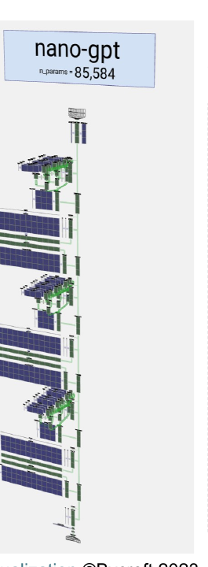

LLM Visualization ©Bycroft 2023

<!--
- 大規模言語モデルの中身は、知識集・ルール集ではなく「巨大な数字の塊」。ネクストワードプレディクションとは、「日本の首都__」→「日本の首都は__」→「日本の首都は東京__」のように、次の言葉(トークン)の確率を予想する問題。学習は、入力→パラメーターの函(数字の羅列)→出力→評価→更新のループ。GPT-4はアメリカ議会図書館の全蔵書の約22倍相当のテキスト(書籍・記事・ウェブ・コード等)から学習している。右図はLLM Visualization(Bycroft 2023)。
-->

---

生成AIの仕組み

# 利用 (推論・生成)　“吾輩は猫で”

計算1回目

出力 “吾輩は”

↑

AI処理 (デコーダ)

↑

前処理

↑

入力 “吾輩”

→

計算2回目

出力 “吾輩は猫”

↑

AI処理 (デコーダ)

↑

前処理

↑

入力 “吾輩は”

→

計算3回目

出力 “吾輩は猫で”

↑

AI処理 (デコーダ)

↑

前処理

↑

入力 “吾輩は猫”

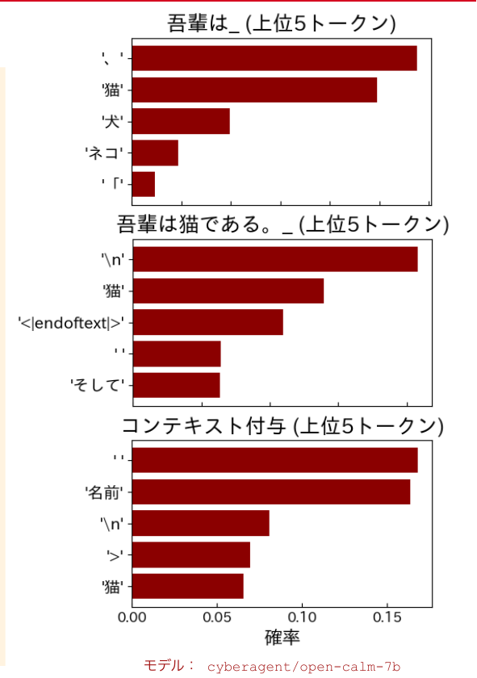

<!--
- 利用(推論・生成)の流れ。入力「吾輩」→前処理→AI処理(デコーダ)→出力「吾輩は」が計算1回目。その出力を入力に戻して計算2回目で「吾輩は猫」、計算3回目で「吾輩は猫で」と、1トークンずつ生成を繰り返す。右のグラフは各ステップで予測された上位5トークンの確率分布(モデルはcyberagent/open-calm-7b)。たとえば「吾輩は_」の次は「、」「猫」「犬」などが候補に挙がる。
-->

---

生成AIの仕組み

# まずは、この3つだけ

① 大規模言語モデルがしていることとは <b>次のもっともらしい単語(Token)を予測する作業</b>

② 大規模言語モデルの中身とは <b>ルール集ではなく、数字(統計的な重み)の塊</b>

③ なぜ精度が上がったり、複雑なことも出来るのか <b>分割して推論したり、ツール/情報を接続できるから</b>

まずは、この3つだけ、覚えましょう

<!--
- まずはこの3つだけ覚えましょう。①大規模言語モデルがしていることは、次のもっともらしい単語(Token)を予測する作業。②中身はルール集ではなく、数字(統計的な重み)の塊。③なぜ精度が上がり複雑なこともできるかというと、分割して推論したり、ツールや情報を接続できるから。
-->

---

プロンプトとは？

# プロンプトとは？

<b>プロンプト：</b> 生成AIに、<b>実行すべきタスクの生成を促す</b>、自然言語による文章のこと

<b>プロンプトエンジニアリング：</b> 生成AIから望ましい出力を得るために、指示や命令を設計、最適化すること

<b>コンテキストエンジニアリング：</b> 生成AIに読み込ませる中身を選択し、正確で関連性の高い出力を生成できるよう、タスクに必要な背景情報や前提条件（コンテキスト）を整理・最適化すること

<b>コンテキスト内学習：</b> プロンプトに与えた文章から、生成AIがタスクの結果を生成できるようになること

<b>良いプロンプト・コンテキスト</b>を入れれば、AIがより精度の高い情報を戻すようになる

<!--
- プロンプトとは、生成AIに実行すべきタスクの生成を促す自然言語による文章のこと。プロンプトエンジニアリングは、望ましい出力を得るために指示や命令を設計・最適化すること。コンテキストエンジニアリングは、読み込ませる中身を選び、タスクに必要な背景情報や前提条件を整理・最適化すること。コンテキスト内学習は、プロンプトに与えた文章から生成AIがタスクの結果を生成できるようになること。良いプロンプト・コンテキストを入れれば、AIはより精度の高い情報を返す。
-->

---

プロンプトのコツ

# プロンプトのコツ

<b>簡潔に</b>、<b>十分に</b>、<b>具体的に</b>、4要素 (ペルソナ・タスク・背景情報・形式)を記入 ▶ <b>Google プロンプト初級ガイド を修正</b> (参照日：2026/04/23)

あなたは初めての短期留学をアドバイスするチューターです。留学を準備する上でのアドバイスをインターネット上の大学生の経験談を参照し説明してください。2文程度で挨拶のあと、箇条書きで出力してください。

<b>自然な表現を使い、話すような完全な文章で</b>

<b>具体的かつ反復的に (多くの背景情報)</b>

<b>簡潔に記述して、複雑にならない (矛盾注意)</b>

<b>会話しながらプロンプトを改善する</b>

<b>Geminiとプロンプトを作る</b>

<b>自分でつくったドキュメントをソースにする</b>

<b>追加： Few-shotを利用する</b> プロンプト内に「入力例」と「出力例」のデモを提供しより高性能な結果を得る技法

Google検索的 (単語)

これは素晴らしい! 感情?

Zero-shot

「これは素晴らしい!」と書いた書き手の感情を教えて下さい

Few-shot

あの映画は最高だった! &gt;ポジティブ これは酷い! &gt;ネガティブ 「これは素晴らしい!」&gt;?

<!--
- プロンプトのコツ。簡潔に・十分に・具体的に、そして4要素(ペルソナ・タスク・背景情報・形式)を記入する。Googleプロンプト初級ガイドを修正(参照日2026/04/23)。例：「あなたは初めての短期留学をアドバイスするチューターです…2文の挨拶のあと箇条書きで」。コツは、自然な完全文で書く、具体的かつ反復的に、簡潔に(矛盾に注意)、会話しながら改善、Geminiと一緒に作る、自作ドキュメントをソースにする。追加でFew-shotの利用：入力例と出力例のデモを与えると高性能に。Google検索的(単語)→Zero-shot→Few-shotと、与える例が増えるほど意図が伝わりやすい。
-->

---

大学版のGeminiのメリット

# 大学版のGeminiのメリット

① <b>入力が学習されない！</b> (オプトアウト済) ※大学版のCopilotも同様

② <b>学習向けのチューニング</b> (商用版よりは依存しにくい) ※名前を呼んだり馴れ馴れしくない

③ <b>Google WSと連携できる</b> (@マークで読み込み簡単)

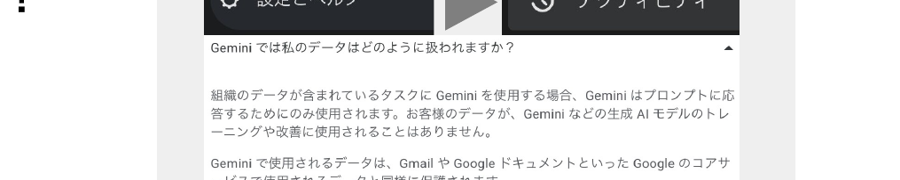

以下に対処する意図でチューニングされている AIへの過依存（答えを全部もらう） 認知的オフロード（自分で考えなくなる） 受動的学習（情報を受け取るだけ）

大学版は、個人購入版よりも安心が大きいのと連携がウリ

<!--
- 大学版Geminiのメリット。①入力が学習されない(オプトアウト済。大学版Copilotも同様)。②学習向けのチューニング(商用版より依存しにくい。名前を呼んだり馴れ馴れしくしない)。③Google Workspaceと連携できる(@マークで読み込み簡単)。AIへの過依存、認知的オフロード、受動的学習に対処する意図でチューニングされている。大学版は個人購入版より安心が大きく、連携がウリ。
-->

---

Geminiで出来る色々

# Geminiで出来る色々

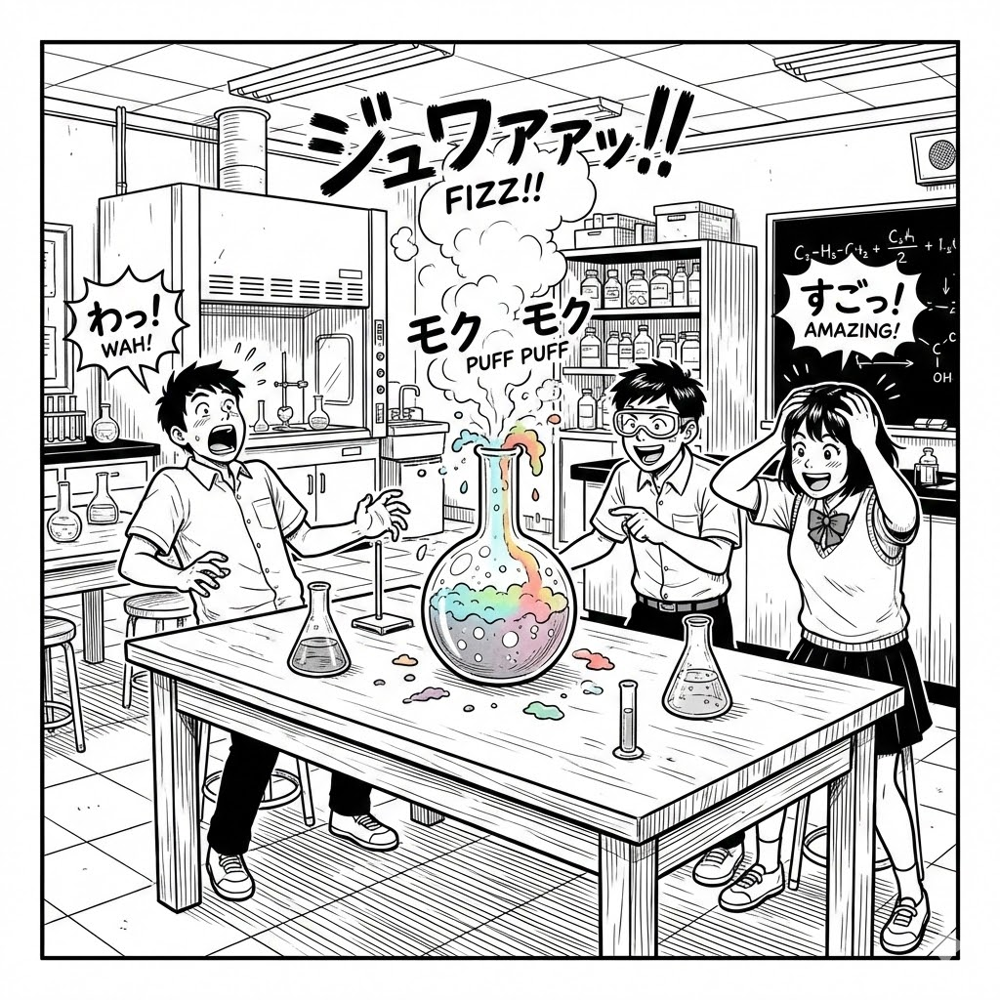

圧巻の風景写真を作成したいです。北極の空を静かに飛ぶ旅客機を横から眺め、後ろにはオーロラが見えるような、景色を写実感のある写真として出して下さい。高度は高く、地上は小さく、暗闇の中を光るのは飛行機の窓とオーロラだけ、という雄大な構図にして下さい。飛行機の窓は一部は閉じられています。飛行機を横からみた構図にして下さい。写真は正方形にして下さい。

高校の化学の実験を生徒がモチベーションがあがるような、楽しそうな絵を生成して下さい。化学実験室の机にフラスコがあって、反応が進んで生徒2-3人驚いている感じで。但し、現実的な実験の様子にして下さい。漫画な感じで、効果音も文字で書いてほしい。吹き出しは使ってはだめです。白黒の線画にして下さい。図は正方形で、明るい感じ。

・スライドの作成・修正

・絵/漫画の出力 ・ 図の修正

・曲/動画の作成

・プログラムの対話的作成

・授業の解説や問題の作成

・暗記の支援

・検索(DeepResearch)

・スプレッドシートの分析

・絵・音声の文字起こし

・カレンダー/ToDo書込

・業務支援ワークフロー

授業や職務で活用しやすい / 研修も実施

<!--
- Geminiで出来る色々。スライドの作成・修正、絵/漫画の出力・図の修正、曲/動画の作成、プログラムの対話的作成、授業の解説や問題の作成、暗記の支援、検索(DeepResearch)、スプレッドシートの分析、絵・音声の文字起こし、カレンダー/ToDo書込、業務支援ワークフローなど。左の作例は、北極の空を飛ぶ旅客機とオーロラの写実的な画像、化学実験で驚く生徒の白黒漫画で、いずれもプロンプトで細かく構図や様式を指定している。授業や職務で活用しやすく、研修も実施。
-->

---

第5回について

# 第5回について

5/12 教室講義 (G3-12で対面実施)となります。 以下を持参してください。

① PCまたはタブレット、②スマホ、③メモを取るもの

第4回の内容について、簡単なミニテストをします。

10分程度で実施、最終の成績への影響は<b>10点以下</b>です。 ※今後も、オンデマンド回の次はミニテストがあります。 基本的に、重要 と書かれた周辺を学んでください。

<!--
- 第5回について。5/12は教室講義(G3-12で対面実施)。①PCまたはタブレット、②スマホ、③メモを取るものを持参してください。第4回の内容について簡単なミニテストをします。10分程度で実施し、最終成績への影響は10点以下です。今後もオンデマンド回の次はミニテストがあります。基本的に「重要」と書かれた周辺を学んでください。
-->
