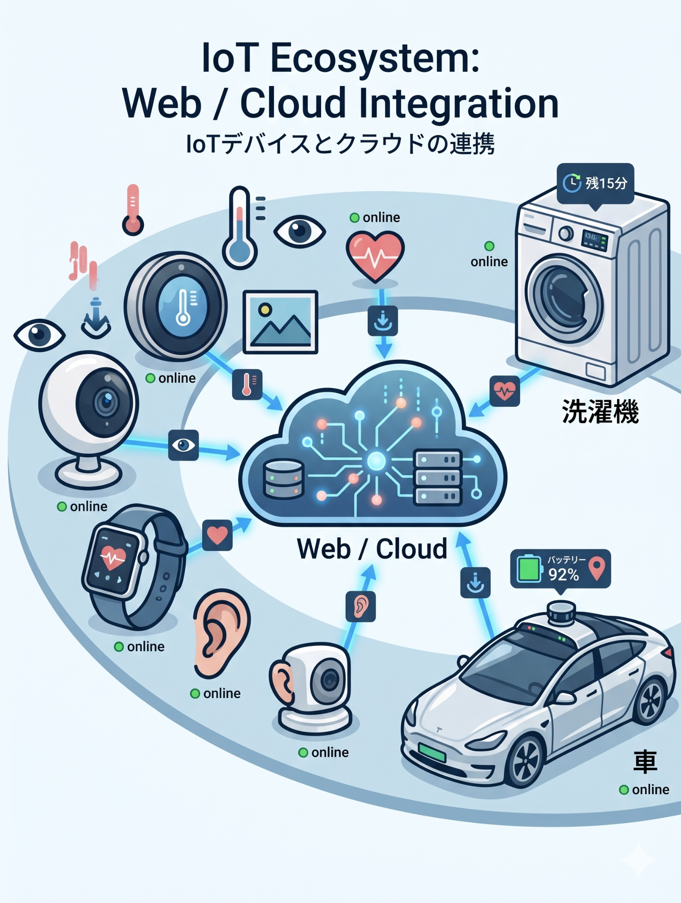

データ・社会・人

# データ駆動型社会 Data-Driven Society

<b>定義：</b> 客観的なデータがきっかけとなり、社会の様々な活動が活性化される社会

<b>Society 5.0との関連:</b> 
情報技術を用いて人とモノをつなげ、知識や情報を共有する必要性。サイバー空間とフィジカル空間を高度に融合する方向性。

<b>社会への影響:</b> 
PDCAサイクルの高速化。リアルタイムで、即座にサービスを改善。

<b>情報リテラシがより重要に:</b> 
例：データや情報の偏りの影響に気づける

勘や経験ではなく、客観的なデータに基づいて意思決定を行う

<!--
- データ駆動型社会とは、客観的なデータがきっかけで社会の活動が活性化される社会。
- Society 5.0と関連し、サイバー空間とフィジカル空間を融合する方向性。PDCAが高速化し、即座にサービスを改善できる。
- だからこそ、データや情報の偏りの影響に気づける情報リテラシがより重要になる。勘や経験ではなく客観的データで意思決定を。
-->

---

データ・社会・人

# IoT (Internet of Things)

モノが「目」と「耳」を持ち、デジタル化する社会

IoTによる情報の流れの例

<b>①取得(センサ):</b> 温度、加速度、画像などを感知

<b>②送る(通信):</b> クラウド(web上のPC)へ送信

<b>③分析(AI):</b> データを処理

<b>④フィードバック:</b> モノを動かす、または人に通知

スマートウォッチ、スマート家電、機械や車のセンサー etc...

1次利用→自分が便利に 
2次利用→機能改善や発見で、他の人に貢献

<b>⚠ リスク:</b> セキュリティ対策を怠ると盗み見などの危険

<!--
- IoTは、モノが「目」と「耳」を持ち、デジタル化する社会。
- 情報の流れは、①センサで取得、②通信でクラウドへ送る、③AIで分析、④フィードバックでモノを動かすか人に通知、の4段階。
- 1次利用は自分が便利に、2次利用は機能改善で他の人に貢献。ただしセキュリティ対策を怠ると盗み見などの危険がある。
-->

---

データ・社会・人

# ビッグデータ

単なる「大量のデータ」ではない、新しい価値の源泉

従来のソフトウェアの処理能力を超える規模のデータ（3つのV）

<b>Volume(量):</b> テラ・ペタバイト級の蓄積

<b>Variety(多様性):</b> テキスト、音声、動画など

<b>Velocity(速度):</b> リアルタイムで生成・更新

<b>社会へのインパクト</b> 
統計学的な「推測」から、全数調査に近い「事実」の把握へ。相関関係を見つけることで未来を予測

<b>リスクとリテラシー</b> 
プライバシーの保護：自分のデータが他人の資源になる

<!--
- ビッグデータは、単なる「大量のデータ」ではなく、新しい価値の源泉。従来のソフトの処理能力を超える規模のデータで、3つのVが特徴。
- Volume(量)はテラ・ペタ級の蓄積、Variety(多様性)はテキスト・音声・動画など、Velocity(速度)はリアルタイムで生成・更新。
- 社会へのインパクトは、統計的な推測から全数調査に近い事実の把握へ。一方でプライバシーの保護というリスクとリテラシーが問われる。
-->

---

データ・社会・人

# なぜ今、データサイエンスなのか？

コンピュータ、アルゴリズム、通信などの技術が急速に発展し、AIを実現する基盤が整備された。

IoT

現実世界のあらゆる動きをセンサで「データ」化して集める。

ビッグデータ

人間では処理しきれない「大量・多様」なデータの蓄積。

AI

集まったデータから「価値」を抽出し、社会を動かす。

データ駆動型社会では、<b>データに基づいた意思決定</b>が当たり前になる

<!--
- なぜ今データサイエンスなのか。コンピュータ・アルゴリズム・通信の技術が急速に発展し、AIを実現する基盤が整ったから。
- IoTで現実世界の動きをデータ化し、ビッグデータとして大量・多様に蓄積し、AIがそこから価値を抽出して社会を動かす。
- データ駆動型社会では、データに基づいた意思決定が当たり前になる。
-->

---

データと理工学

# データとサイエンス

科学は、データから知見を得ることによって発達してきた。

科学研究の4つの手法

1.

<b>経験:</b> 観察して記録する (例: 星の動きを記録)

2.

<b>理論:</b> 法則をみつけ、定式化する (例: 万有引力の法則)

3.

<b>計算:</b> 法則に基づいて計算し、予測する (例: ハレー彗星の回帰予測、気象予測)

4.

<b>データ:</b> 膨大なデータから法則を見出す (データサイエンス)

大きなデータ、大きな計算が出来ると、サイエンスも変わる

<!--
- 科学は、データから知見を得ることで発達してきた。
- 科学研究の4つの手法は、1.経験(観察して記録)、2.理論(法則をみつけ定式化)、3.計算(法則に基づき予測)、4.データ(膨大なデータから法則を見出す＝データサイエンス)。
- 大きなデータ、大きな計算が出来ると、サイエンスのやり方そのものも変わる。
-->

---

データと理工学

# 科学的推論の3つのアプローチ

<b>帰納法</b> (Induction)

<b>演繹法</b> (Deduction)

<b>アブダクション</b> (Abduction)

複数の個別データや事実から、共通する一般的な法則を導き出す推論。

一般的な法則や前提ルールから、論理的に個別の結論を導き出す推論。

観察された結果に対して、最も妥当な説明を仮説として推論する。

利点

検証可能・再現可能・論理的必然性

現実的、理論がなくても可

新しい仮説を生み出せる

欠点

前提次第、新しさに乏しい

確実ではない、白いカラス

仮説が複数あり得る、確証バイアス

複数のアプローチを組み合わせて解決を目指す

<!--
- 科学的推論には3つのアプローチがある。帰納法は個別データから一般的法則を導く。演繹法は一般的法則から個別の結論を導く。アブダクションは結果に対し最も妥当な仮説を推論する。
- 利点と欠点もそれぞれ違う。帰納法は検証・再現可能だが前提次第。演繹法は理論がなくても可だが確実ではない。アブダクションは新しい仮説を生めるが確証バイアスに注意。
- 一つに頼らず、複数のアプローチを組み合わせて解決を目指す。
-->

---

データと理工学

# 科学研究のふたつのアプローチ(パラダイム)

<b>仮説駆動型:</b> 仮説からの予測を実験・観測によって検証する

<b>データ駆動型:</b> 実験・観測データから法則性をみつける

<table style="font-size:22px; margin-top:10px; width:calc(100% - var(--pip-w));">
<tr><th>項目</th><th>仮説検証型のアプローチ</th><th style="color:var(--accent);">データ駆動型のアプローチ</th></tr>
<tr><td>出発点</td><td>仮説を立てる</td><td>蓄積された膨大なデータ</td></tr>
<tr><td>進め方</td><td>仮説 → 実験 → 検証</td><td>データ → 解析 → 発見</td></tr>
<tr><td>特徴</td><td>「仮説が正しいか？」を検証する</td><td>「次に何が起こるか？」を予測</td></tr>
</table>

データ駆動型のアプローチはより容易に

<!--
- 科学研究には、ふたつのアプローチ(パラダイム)がある。仮説駆動型は仮説からの予測を実験・観測で検証する。データ駆動型は実験・観測データから法則性をみつける。
- 出発点・進め方・特徴を比べると、仮説検証型は「仮説が正しいか」を検証し、データ駆動型は「次に何が起こるか」を予測する。
- ビッグデータの時代には、データ駆動型のアプローチがより容易になっている。
-->

---

機械学習・深層学習

# AI： 人が知的だと感じる処理を実現するシステム

<svg viewBox="0 0 360 300" width="100%" style="max-width:360px;">
  <rect x="2" y="2" width="356" height="296" rx="14" fill="#FBE4EA" stroke="var(--accent)" stroke-width="2.5"/>
  <text x="14" y="28" font-size="20" font-weight="800" fill="var(--accent-dark)">人工知能 (AI)</text>
  <rect x="22" y="44" width="316" height="240" rx="12" fill="#fff" stroke="#1A6BB0" stroke-width="2.5"/>
  <text x="34" y="68" font-size="19" font-weight="800" fill="#15436e">機械学習</text>
  <rect x="44" y="84" width="274" height="184" rx="10" fill="#EAF2FB" stroke="#2E9E5B" stroke-width="2.5"/>
  <text x="56" y="108" font-size="19" font-weight="800" fill="#2E7D46">深層学習</text>
  <rect x="66" y="124" width="232" height="128" rx="8" fill="#FFF6E6" stroke="#F0A500" stroke-width="2.5"/>
  <text x="100" y="195" font-size="20" font-weight="800" fill="#8a4b00">生成AI</text>
</svg>

数理・統計・DS が土台

分類したり、予想したり、処理したり…

生成AIを使っていなくても、 
<b>YouTubeのおすすめ</b>や、 
<b>運転支援・お掃除ロボット</b>や、 
<b>今日のスーパーの仕入れ管理</b>など、 
様々なところで利用されている

機械学習・深層学習 … 信頼性・再現性・速度/費用・適合性…

理論は不明(後から発見)でも、結果は予測できる

<!--
- AIとは、人が知的だと感じる処理を実現するシステム。人工知能の中に機械学習、その中に深層学習、さらにその中に生成AIがあり、土台には数理・統計・データサイエンスがある。
- 分類したり、予想したり、処理したり。生成AIを使っていなくても、YouTubeのおすすめ、運転支援やお掃除ロボット、スーパーの仕入れ管理など、様々なところで利用されている。
- 理論は不明でも(後から発見されることも)、結果は予測できるのがポイント。
-->

---

機械学習・深層学習

# 機械学習/深層学習で実現すること

統計や機械学習は、<b>未来</b>や<b>全体</b>を知ることができない人間が、<b>世界を理解したり、作業を実行するために</b>編み出した技術

① 売上・需要予測

既存データから将来の数値を予測 → 在庫最適化やリソース配置の変更

② 異常・故障検知

リアルタイムで異常パターンを検知 → 重大なトラブルを未然に防止

③ データの可視化・分類

複雑なデータをグループ化・可視化 → 新たな知見の発見を支援

④ 強化学習と自動化

試行錯誤から最適な行動パターンを学習 → 複雑な制御や判断を自動化

<!--
- 統計や機械学習は、未来や全体を知ることができない人間が、世界を理解したり作業を実行するために編み出した技術。
- 実現することは大きく4つ。①売上・需要予測で在庫最適化、②異常・故障検知でトラブルを未然防止、③データの可視化・分類で新たな知見を発見、④強化学習と自動化で複雑な制御や判断を自動化。
-->

---

メールについて

# アドレスの構造

inage_yayoi @ chiba-u.jp

ローカルパート

✓ 個人を示す文字列 ✓ 大文字小文字を区別する <b style="color:var(--accent);">使い分けないほうが無難</b>

ドメイン

✓ メールサーバのFQDN <b style="color:var(--accent);">✓ 大文字小文字を区別しない</b>

● 「...」や末尾の「.」など、使えない文字列もある 
● 千葉 太郎 &lt;chiba.tarou@chiba-u.jp&gt;のように、<b>ディスプレイネーム&lt;アドレス&gt;</b>という書き方もある 
※ ディスプレイネームも詐称出来るので注意

<!--
- メールアドレスの構造。@の前がローカルパート、後ろがドメイン。
- ローカルパートは個人を示す文字列で大文字小文字を区別するが、使い分けないほうが無難。ドメインはメールサーバのFQDNで、大文字小文字を区別しない。
- 「...」や末尾の「.」など使えない文字列もある。千葉 太郎<chiba.tarou@chiba-u.jp>のようにディスプレイネーム<アドレス>という書き方もあるが、ディスプレイネームも詐称できるので注意。
-->

---

メールについて

# メール作成時の主なアドレスの種類

<table style="font-size:21px; margin-top:10px; width:100%;">
<tr><th style="width:140px;">項目名</th><th>意味</th></tr>
<tr><td><b>From</b></td><td>[必須] 送信者のアドレス (差出アドレス) ※詐称可能</td></tr>
<tr><td><b>To</b></td><td>[原則、必須] 受信者のアドレス (宛先アドレス) (必要に応じて返信すべき)当事者</td></tr>
<tr><td><b>Cc</b></td><td>Carbon copy の略。上司など、To以外の人に参考までにメールを送信するときに指定する。</td></tr>
<tr><td><b>Bcc</b></td><td>Blind carbon copy の略。Bccのアドレスは他の受信者には見えないので、流出を防ぐ時に使用 ※ To/Ccにはbccが見えない → トラブル注意。</td></tr>
<tr><td><b>Reply-To</b></td><td>返信先を指定する場合</td></tr>
</table>

<!--
- メール作成時の主なアドレスの種類。
- Fromは必須の送信者アドレスだが詐称可能。Toは原則必須の受信者アドレス。Ccはカーボンコピーで上司など参考までに送る人。
- BccはブラインドカーボンコピーでアドレスがTo/Ccの受信者には見えないので流出防止に使うが、見えないこと自体がトラブルの元になるので注意。Reply-Toは返信先を指定する場合に使う。
-->

---

メールの注意点

# メール件名のマナーとネチケット

件名： Subject

本文の内容を<b>的確かつ簡潔に</b>表現する。 
用件がひと目で分かるようなタイトルをつけることが重要。 
多数のメールを受信する人の立場を考えましょう。

<b>空（件名なし）でメールを送るのはマナー違反</b> 
読まずに後回しにされたり、迷惑メールと間違われて捨てられてしまうこともあります。

行頭の「Re:」や「Fwd:」

メールソフトやWebメールが自動的に付ける記号。書換え・追加しない。

<b>Re:</b> 返信を示す（ラテン語の "res" が語源） 
<b>Fwd:</b> 転送 (Forward) を示す。添付の場合と(全文)引用の場合があり。

<!--
- メール件名のマナーとネチケット。件名は本文の内容を的確かつ簡潔に表現し、用件がひと目で分かるタイトルをつけることが重要。多数のメールを受信する人の立場を考える。
- 空(件名なし)でメールを送るのはマナー違反。読まずに後回しにされたり、迷惑メールと間違われて捨てられることもある。
- 行頭のRe:やFwd:はメールソフトが自動的に付ける記号なので書き換え・追加しない。Re:は返信(ラテン語resが語源)、Fwd:は転送(Forward)を示す。
-->
