
開始に先立ち

# 配布物

配布資料(このスライド)

<b>①</b> PCかタブレットが今日ない人は、講師に連絡ください

<b>②</b> PCを立ち上げ、Moodleにログインして下さい

<b>③</b> インタラクションツール Slidoにアクセスして下さい URLを配布したり、質問やアンケートをとったりします ※お名前などの個人情報の入力は不可です。匿名で。

スマホから

PCから

方法1 Google検索「Slido」→コード入力

Joining as a participant? &nbsp;<b>1034655</b>

方法2 直接リンク

https://app.sli.do/event/7fp6X3DzzcKR3CPwCrdNhi

<!--
- 開始前に。PCかタブレットがない人は連絡を。PCを立ち上げてMoodleにログイン、Slidoにアクセスしてください。個人情報は入力せず匿名で。
-->

---

開始に先立ち

# Slidoのプライバシー・ポリシーを確認してみよう

①<b>開く</b>　Privacy Statement　リンク

②<b>千葉大Gemini</b>にコピペ　リンク

③<b>Gemini</b>でプロンプトを入力し、確認

自分は大学1年生です。このプライバシーポリシーを確認し、自分が入力する情報がどのように扱われるのか確認して下さい。また、その内容は危険ですか？

スマホから

PCから

方法1 Google検索「Slido」→コード入力

Joining as a participant? &nbsp;<b>1034655</b>

方法2 直接リンク

<!--
- Slidoのプライバシーポリシーを、千葉大Geminiに貼り付けて確認してみよう。自分の入力情報がどう扱われるか、危険はないかを尋ねる。
-->

---

今日の目標

# 今日の目標

<b>1. コンピュータの中身を説明できる</b> 仕組みが少し、分かります 正しく判断して買えるようになります

<b>1. Linuxを触って、ファイルを移動することが出来る</b> ファイルを開いたり、確認することが出来るようになります Linuxやコマンドラインインターフェイスをつかう利点が分かります

<b>1. AIとプログラムを試作することが出来る</b> プログラミングの「超」初歩を理解します AI駆動型開発を理解できます

※ テストは真ん中で行います

<b>私語は禁止ですが、笑う・発言の自由です</b>。楽しくいきましょう。

<!--
- 今日の目標は3つ。①コンピュータの中身を説明できる、②Linuxを触ってファイル移動ができる、③AIとプログラムを試作できる。テストは真ん中で。私語は禁止だが、笑う・発言は自由。
-->

---

課題を忘れた方へ

# 課題を忘れた方へ

<b>① 授業の内容を学んだか、が重要です。質問はぜひ。</b> なので、課題を解き忘れても、少し減点があるだけです。 でも、全部だしていないと単位が難しくなる可能性があります。 但し、教員の方がGoogle検索より学びのアドバイスはうまいので遠慮なく質問どうぞ。

② <b>問題については、回答を1週間後に公開します</b>ので、そのタイミングで確認を行って下さい。 提出締切は、授業日の<b>原則12時</b>です(その後、少し猶予はあります)。 問題・フィードバックへの締切後の提出は原則受け付けません。 <b>※1~2回の忘れは、数点の減点にしかならないので、気にせず。</b> <b>今回に限り、問題だけ回答期限を1週間延長します</b>。

③ 講義回の<b>期末</b>は必ず来るように。<b>単位落とします</b>。

<!--
- 課題を忘れた人へ。重要なのは内容を学んだか。解き忘れは少しの減点。提出締切は授業日の原則12時。回答は1週間後に公開。今回に限り問題だけ期限を1週間延長。期末は必ず来ること。
-->

---

コンピューターの中身

# ボランティア募集

一緒に<b>PCの中を覗いて</b>、クラス全体に紹介しましょう

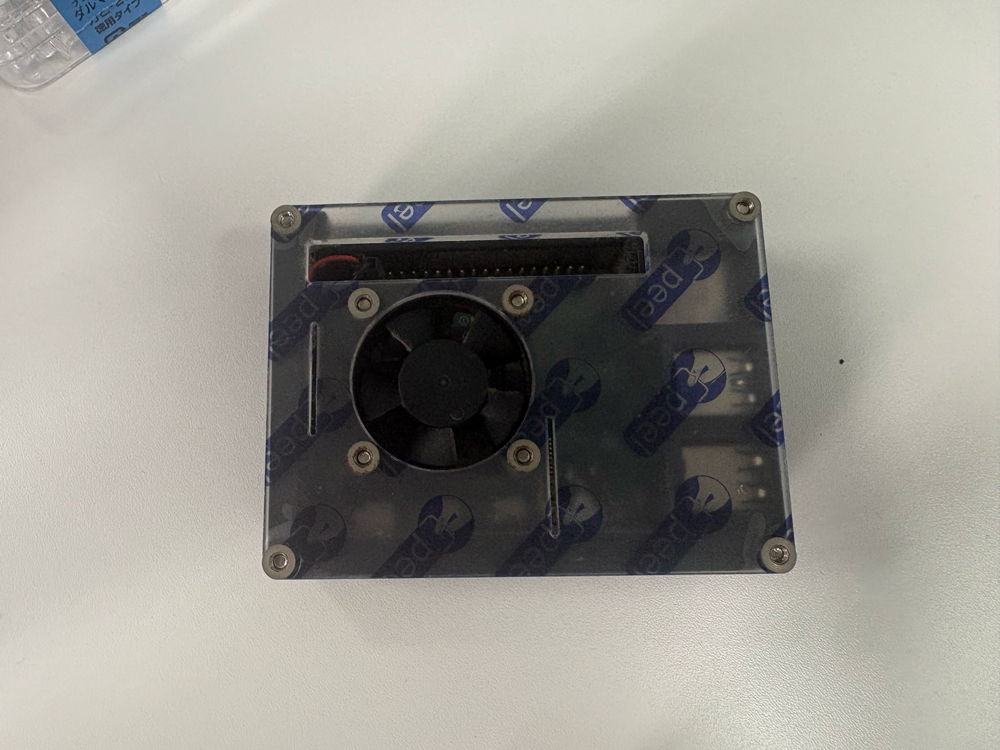
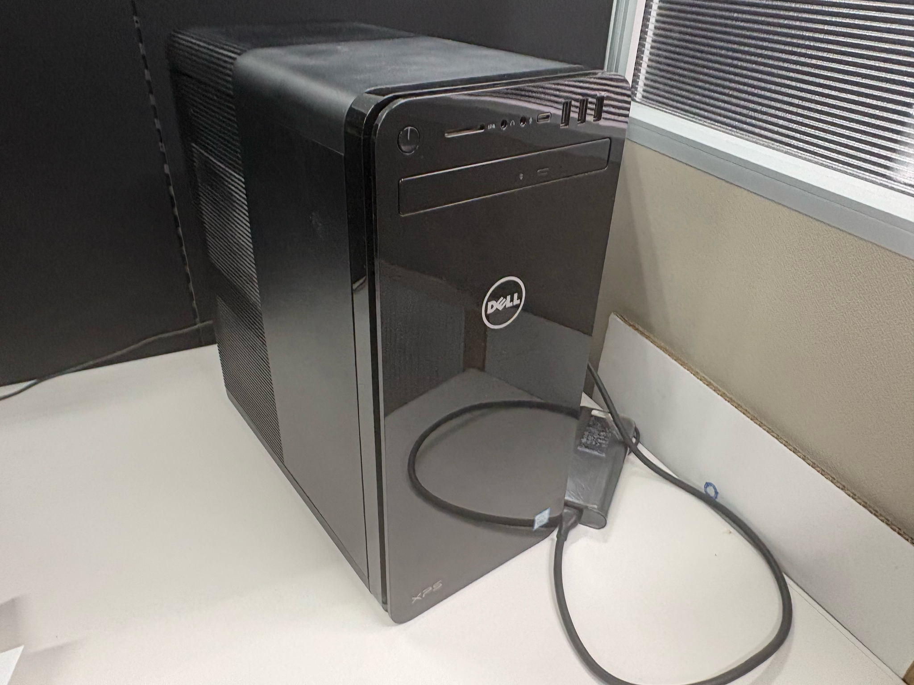

<!--
- ボランティア募集。一緒にPCの中を覗いて、クラス全体に紹介しましょう。
-->

---

コンピューターの中身

# クエスト

いまから<b>3分</b>で、次を見つけて下さい。

① CPU 
② メモリ 
③ GPU 
④ マザーボード 
⑤ 仮想/補助記憶装置

終わったら、解説します。

<!--
- クエスト。3分でCPU・メモリ・GPU・マザーボード・仮想/補助記憶装置の5つを見つけてください。終わったら解説します。
-->

---

コンピューターの中身

# よくある構成

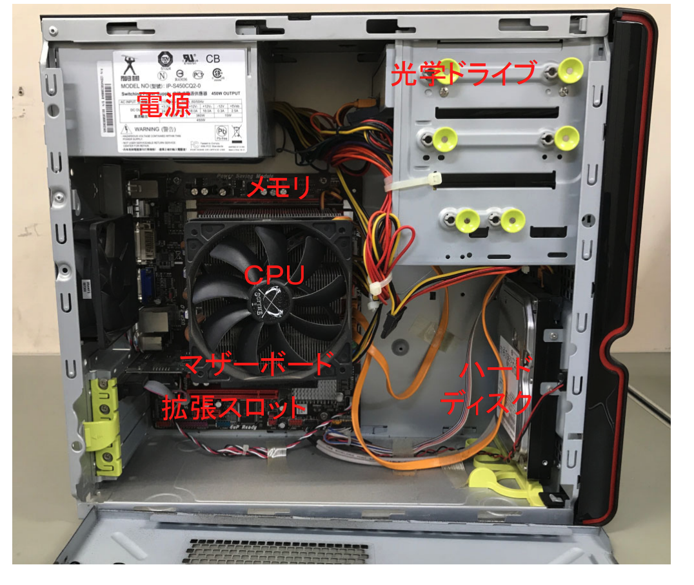

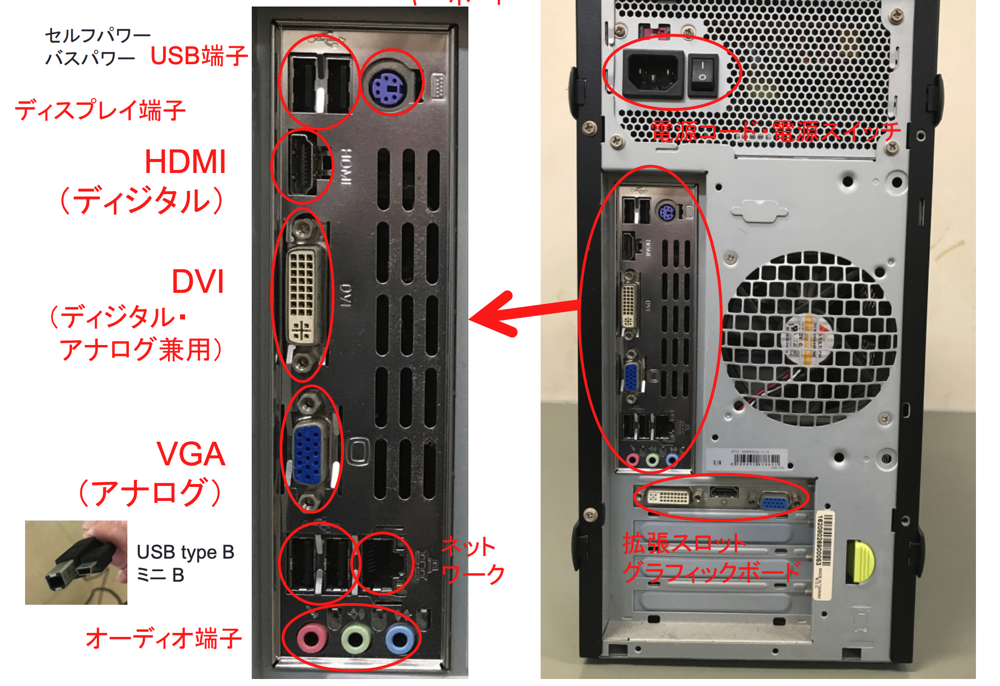

<!--
- よくある構成。内部にはCPU・メモリ・マザーボード・拡張スロット・光学ドライブ・電源。背面にはHDMI(デジタル)・DVI(デジタル/アナログ兼用)・VGA(アナログ)・USB・ネットワーク・オーディオ端子が並ぶ。
-->

---

コンピューターの中身

# ラズベリーパイの場合

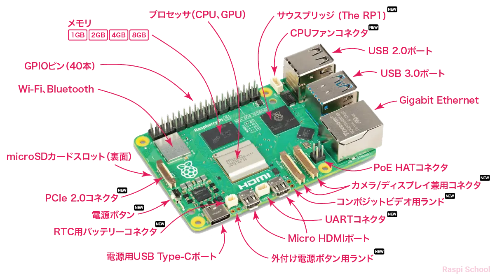

ラズパイスクール[リンク]　参照日 2026/05/12

<!--
- ラズベリーパイの場合。CPU/GPU・メモリ・GPIO・Wi-Fi/Bluetooth・microSDスロット・各種ポートが1枚の基板に収まっている。出典：ラズパイスクール、参照日2026/05/12。
-->

---

コンピューターの中身

# CPU・メインメモリ・GPU

<b>CPU（中央処理装置）</b>

<b>役割</b>: コンピュータ全体の頭脳として、複雑な計算や各装置の制御を行う。

<b>良い条件</b>: 1秒間の計算回数を示す<b>「クロック周波数」</b>が高く、同時に複数の作業をこなすための<b>「コア数/スレッド数」</b>が多いものが高性能。

<b>メインメモリ（主記憶装置）</b>

<b>役割</b>: CPUが直接データを読み書きする作業机。

<b>良い条件</b>: 複数のアプリを開いても重くならないよう<b>「容量」</b>が大きいこと。また、CPUへ素早くデータを渡すため<b>「データ転送速度」</b>が速い規格（DDR5など）が良い。

<b>GPU（画像処理装置）</b>

<b>役割</b>: 画像や映像の描画、および単純な計算の超並列処理に特化したプロセッサ。

<b>良い条件</b>: 高画質な3DグラフィックスやAIの学習をスムーズに行うため、専用の<b>「ビデオメモリ容量」</b>が多く、計算ユニットが多数搭載されたものが良い。

それぞれに標準規格があり、安定して使えるようになっている

<!--
- CPUは頭脳。クロック周波数とコア数/スレッド数が高性能の鍵。メインメモリは作業机で、容量と転送速度が大事。GPUは描画と超並列処理に特化し、ビデオメモリ容量と計算ユニット数が効く。それぞれに標準規格があり安定して使える。
-->

---

コンピューターの中身

# 帯域幅（バンド幅）とストレージ

<b>速くするには？　全体のボトルネックを無くす</b>

CPUがいかに高速な計算能力を持っていても、計算に必要なデータが届かなければCPUは「待ちぼうけ」になってしまう。 
各パーツの性能だけでなく、<b>パーツ間でデータをやり取りする「道幅」</b>が重要になる。

<b>帯域幅（バンド幅）とストレージ</b>

<b>メモリ帯域幅</b>: CPUとメモリ間で一度に運べるデータ量のこと。ここが太いほど、CPUへ迅速にデータを供給できる。

<b>高速なストレージ</b>: 従来のHDDから、より高速にデータを読み書きできるNVMe SSD等を採用することで、OSの起動やアプリケーションの読み込み時間を劇的に短縮できる。

CPUやマザーボード、メモリ、SSDごとに決まっている

<!--
- 速くするには全体のボトルネックを無くす。CPUが速くてもデータが届かなければ待ちぼうけ。パーツ間の「道幅」=帯域幅が重要。メモリ帯域幅が太いほどデータを迅速に供給でき、NVMe SSDなど高速ストレージで起動や読み込みを短縮できる。
-->

---

コンピューターの中身

# 記憶装置の階層：処理速度を最大化するための工夫

<b>第1階層：レジスタ（CPU内部）</b>超高速だが、容量はごくわずか（数バイト〜数十バイト）。計算に直接必要なデータのみを置く。

<b>第2階層：キャッシュメモリ（CPU内部・周辺）</b>主記憶より高速なメモリ。主記憶のデータのうち、頻繁に使うものをここにコピーしてCPUの待ち時間を減らす。（1次〜3次キャッシュがある）

<b>第3階層：主記憶装置（メインメモリ）</b>キャッシュより低速だが大容量（数GB〜数十GB）。実行中のプログラム全体を配置する。

<b>第4階層：補助記憶装置（HDD / SSD）</b>非常に低速だが超大容量かつ安価（数TB）。電源を切っても消えないデータを長期保存する。

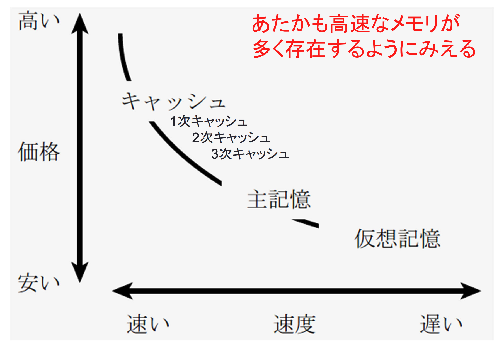

上手く連携して情報を処理している

<!--
- 記憶装置の階層。第1レジスタ(超高速・極少量)、第2キャッシュ(高速・1〜3次)、第3主記憶(大容量)、第4補助記憶(超大容量・安価・不揮発)。これらが上手く連携して情報を処理している。
-->

---

コンピューターの中身

# 仮想記憶の仕組み

<b>仮想記憶の仕組み</b>

主記憶（メインメモリ）の容量が足りない場合に、<b>補助記憶（HDD/SSD）の一部を主記憶の「ふり」をさせて使う</b>OSの技術。

これにより、物理的なメインメモリ容量以上の大きなプログラムや、多数のアプリケーションを同時に動かすことができる。

<b>スワッピングとその影響</b>

<b>スワッピング</b>: 主記憶の空きを作るため、当面使わないデータを補助記憶へ一時的に退避（スワップアウト）させ、必要なデータを読み込む（スワップイン）動作。

補助記憶は主記憶に比べてアクセス速度が桁違いに遅い。

そのため、メモリ不足により<b>頻繁にスワッピングが発生すると、PC全体の動作が極端に重くなる</b>（これをスラッシングと呼ぶ）。

メモリや仮想記憶が大きいことが、まずは重要！

<!--
- 仮想記憶は、主記憶が足りないとき補助記憶の一部を主記憶のふりをさせて使うOSの技術。空きを作るスワッピングが頻発するとPCが極端に重くなる(スラッシング)。だからメモリや仮想記憶が大きいことが、まずは重要。
-->

---

コンピューターの中身

# マザーボード（メインボード）

CPU、メモリ、拡張カードなどのあらゆる部品を一つに接続するための**巨大な電子回路基板**。

各パーツは基板上に張り巡らされた「バス（伝送路）」と呼ばれる配線を通じて相互に通信を行う。

パソコンの性能を引き出せるかどうかは、このマザーボードの品質にも大きく依存する。

外部インターフェースについて

ディスプレイ端子

HDMIやDisplayPortなど、デジタル映像・音声をディスプレイに出力するための端子。

汎用ポート (USB)

キーボード、マウス、外部ストレージなど、多種多様な入力・出力装置を接続するための規格。

ネットワーク端子

LANケーブルを接続し、インターネットや他のコンピュータと通信を行う。

それぞれに標準規格があり、安定して使えるようになっている

<!--
- マザーボードは全部品を載せる巨大な基板。バスで相互通信する。
- 外部インターフェース＝ディスプレイ端子・USB・ネットワーク端子。標準規格で安定して使える。
-->

---

コンピューターの中身

# ワーク #「良いコンピュータ」を考える

電気店ロールプレイで学ぶ「良いコンピュータ」って何?

Gemにアクセスし、電気店員/学生に分かれて話しましょう

<b>答えはひとつではない</b> 用途・予算・使う人・目的によって変わる

<b>手順1) ペアを組む</b>

<b>A: 電気店員役</b> ― AI (Gem) が手元で助言

<b>B: PCを買いに来た学生役</b>：自由に質問・要望

<b>手順2)</b> 3分ずつで会話→入れ替える

<b>手順3)</b> 振り返りを行う

<b>Gemの使い方(電気店員役)</b> 
・学生役の質問を聞く 
・Gemに「お客さんからこう聞かれた」と簡単に入力 
・5つの観点を受け取る 
・<b>自分の言葉に直して</b> お客さんに答える 
・わかりやすく、習ったことを使おう

終わったら、気づきを共有しましょう

<!--
- 電気店ロールプレイ。A=店員役（Gemが助言）／B=学生役。3分ずつ交代。
- 「良いコンピュータ」の答えはひとつでなく、用途・予算・使う人・目的で変わる。
- Gemから5つの観点を受け取り、自分の言葉に直して答える。終わったら気づきを共有。
-->

---

コンピューターの中身

# スーパーコンピューターとは？

究極の並列処理システム

一般的なPCの延長線上にありながら、何万、何十万もの高性能なCPUやGPUを接続し、**一つの巨大なシステムとして密結合**させた計算機。

気象予測、新薬開発、宇宙シミュレーション、巨大なAIモデルの学習など、極めて複雑で膨大な計算に用いられる。

スパコンにおける「帯域」の重要性

膨大な数のプロセッサが協力して計算を行うため、計算途中のデータをプロセッサ間で頻繁にやり取りする必要がある。

そのため、個々の計算力以上に、**ノード（計算機）間を繋ぐ「ネットワーク通信帯域幅」の太さと通信の遅延の少なさ**が、性能のボトルネックを解消する最大の鍵となる。

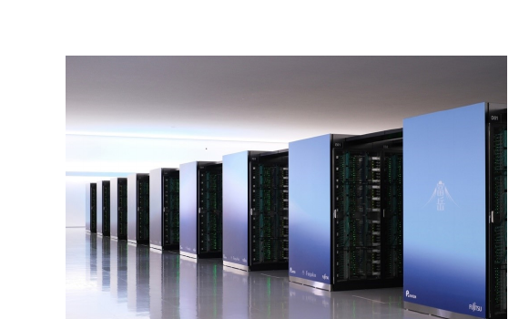

RIKEN/JST 富嶽の写真

いまや、Colabの先にあるPCも、かなり高速なサーバー

<!--
- スーパーコンピュータ＝何万ものCPU/GPUを密結合した計算機。気象・新薬・宇宙・AI学習に使う。
- 個々の計算力よりノード間の通信帯域と低遅延が性能の鍵。
- Colabの先にあるPCも、かなり高速なサーバー。
-->

---

小テストの実施

# Safe Exam Browserを入れる

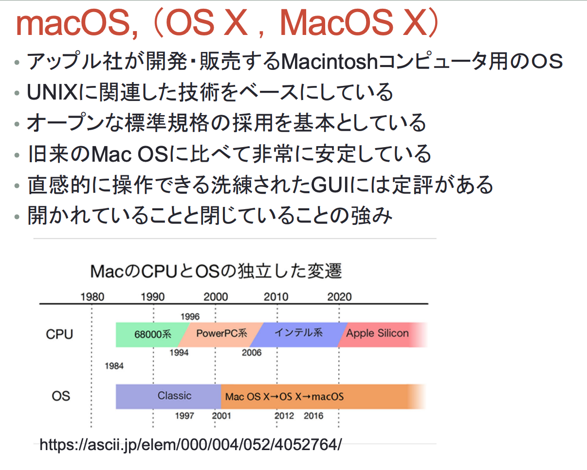

Moodleでテストできる

<b>Moodleのログイン必要</b> アルファベット4文字・数字4文字

<b>5分でインストール・ログインして下さい</b> 困ったら手を上げる

テストは、15分で実施です / 持ち込み・閲覧不可

<!--
- Safe Exam Browserをインストール。Moodleでテストできる。
- Moodleログインが必要（アルファベット4文字・数字4文字）。5分でインストール・ログイン、困ったら手を上げる。
- テストは15分・持ち込み閲覧不可。
-->

---

<!-- _class: message -->

OS/アプリケーション

# OSは「舞台」であり、  アプリは「役者」である。

OSという共通の土台があってこそ、アプリは個別の目的を果たせます

<!--
- OSは「舞台」、アプリは「役者」。OSという共通の土台があってこそ、アプリは個別の目的を果たせる。
-->

---

OS/アプリケーション

アプリケーション

アプリ

OS

ハード

<table style="width:100%; border-collapse:collapse; font-size:23px;">
<thead>
<tr style="background:#f4f4f6;">
<th style="text-align:left; padding:9px 14px; width:18%;">比較項目</th>
<th style="text-align:left; padding:9px 14px;">OS (オペレーティングシステム)</th>
<th style="text-align:left; padding:9px 14px;">アプリケーション (応用ソフト)</th>
</tr>
</thead>
<tbody>
<tr style="background:#e9ecf3;"><td style="padding:9px 14px;"><b>主な役割</b></td><td style="padding:9px 14px;">資源（ハード・ソフト）の管理・制御</td><td style="padding:9px 14px;">特定のユーザー目的の遂行</td></tr>
<tr style="background:#eef1f7;"><td style="padding:9px 14px;"><b>立場</b></td><td style="padding:9px 14px;">「土台」「舞台」</td><td style="padding:9px 14px;">「道具」「役者」</td></tr>
<tr style="background:#e9ecf3;"><td style="padding:9px 14px;"><b>具体例</b></td><td style="padding:9px 14px;">Windows, Android, macOS, Linux</td><td style="padding:9px 14px;">Chrome, Word, LINE, Instagram</td></tr>
<tr style="background:#eef1f7;"><td style="padding:9px 14px;"><b>動作条件</b></td><td style="padding:9px 14px;">単体で基本動作が可能</td><td style="padding:9px 14px;">OSがないと動作できない</td></tr>
</tbody>
</table>

<!--
- 階層図：ハードの上にOS、OSの上にアプリケーション（アプリ）。
- 表でOSとアプリを比較：役割・立場・具体例・動作条件。アプリはOSがないと動作できない。
-->

---

OS/アプリケーション

# オペレーティングシステム（OS）の種類

Operating System

- Windows（マイクロソフト社）
- macOS, OS X，MacOS（アップル社）
- Linux（OSS: Open Source Software)）
  - UnixライクなOS

- スマートフォン用 iOS（アップル社）
- スマートフォン用 Android

<!--
- OSの種類：Windows（マイクロソフト）、macOS/OS X/MacOS（アップル）、Linux（OSS・Unixライク）。
- スマートフォン用はiOS（アップル）とAndroid。
-->

---

OS/アプリケーション

# Microsoft Windows

- パーソナルコンピュータOSのデファクトスタンダード
- 圧倒的なシェアを持つ
- ハードウェアは各メーカが製造する
- クライアント用(Windows10, 11)のほかに、サーバ用(Windows Server 2012, 2016, 2019, 2022)、モバイル用(Windows Phone 8→Windows 10 Mobile, 2019年終了)、組み込み用がある。

<b>Windows10は 2025年10月14日 サポート終了</b>

# macOS，（OS X，MacOS X）

- アップル社が開発・販売するMacintoshコンピュータ用のOS
- UNIXに関連した技術をベースにしている
- オープンな標準規格の採用を基本としている
- 旧来のMac OSに比べて非常に安定している
- 直感的に操作できる洗練されたGUIには定評がある
- 開かれていることと閉じていることの強み

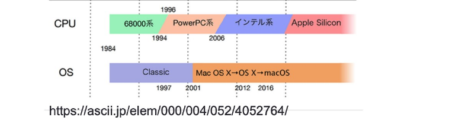

https://ascii.jp/elem/000/004/052/4052764/

<!--
- Windows＝PC OSのデファクトスタンダード、圧倒的シェア。ハードは各メーカ製造。クライアント/サーバ/モバイル/組込み。Windows10は2025/10/14サポート終了。
- macOS＝アップルのMacintosh用OS。UNIXベース、標準規格、安定、洗練されたGUI。MacのCPUとOSは独立して変遷。
-->

---

OSが行っていること

① プログラムの管理

② ハードウェアの抽象化

③ UI/メモリ管理

メモリの保護

各アプリにメモリ領域を割り当てます。他アプリの領域への侵入を防ぎ、システムの安定性を保ちます。

共通UIの提供

ウィンドウ、メニュー、ボタンなどの操作感を統一。どのアプリでも迷わず操作できる環境を作ります。

ファイル管理

データの保存場所やアクセス権限を管理。情報の安全性と整理を自動的に行います。

<!--
- OSが行うこと：①プログラムの管理、②ハードウェアの抽象化、③UI/メモリ管理。
- メモリの保護＝アプリにメモリ領域を割り当て侵入を防ぐ。共通UIの提供＝操作感を統一。ファイル管理＝保存場所とアクセス権限を管理。
-->

---

質問②の例：学習方略

<b>学習方略</b> - Dunlosky et al. (2013)  PSPI 教育心理学による、「生徒がどう勉強すべきか」のレビュー論文

<table style="width:100%; border-collapse:collapse; font-size:17px; line-height:1.35;">
<thead>
<tr style="background:var(--accent); color:#fff;">
<th style="padding:5px 8px; text-align:left; width:13%;">テクニック</th>
<th style="padding:5px 8px; text-align:left;">内容・方法</th>
<th style="padding:5px 8px; text-align:center; width:7%;">効果</th>
<th style="padding:5px 8px; text-align:left; width:33%;">主な理由</th>
</tr>
</thead>
<tbody>
<tr style="background:#fff;"><td style="padding:4px 8px;"><b>実力テスト</b></td><td style="padding:4px 8px;">フラッシュカードや練習問題などを使い、自分の記憶から情報を引き出すテストを行う。</td><td style="padding:4px 8px; text-align:center; color:var(--accent); font-weight:800;">高</td><td style="padding:4px 8px;">学習効果が高く、幅広い教材・年齢層に有効。フィードバックがあると効果的。</td></tr>
<tr style="background:#f6f6f8;"><td style="padding:4px 8px;"><b>分散学習</b></td><td style="padding:4px 8px;">一気に学習せず、学習スケジュールを分散させる。</td><td style="padding:4px 8px; text-align:center; color:var(--accent); font-weight:800;">高</td><td style="padding:4px 8px;">長期的な記憶保持に有効。一夜漬けよりも遥かに効率が良い。</td></tr>
<tr style="background:#fff;"><td style="padding:4px 8px;"><b>精緻化的質問</b></td><td style="padding:4px 8px;">「なぜその事実が成り立つのか？」という質問を自分に投げかけ、説明を考える。</td><td style="padding:4px 8px; text-align:center; font-weight:800;">中</td><td style="padding:4px 8px;">事実の学習に有効だが、ある程度の予備知識が必要。</td></tr>
<tr style="background:#f6f6f8;"><td style="padding:4px 8px;"><b>自己説明</b></td><td style="padding:4px 8px;">学習のプロセスや、新しい情報が既知の情報とどう関連するかを自分自身に説明する。</td><td style="padding:4px 8px; text-align:center; font-weight:800;">中</td><td style="padding:4px 8px;">数学や論理的思考を要する問題解決に有効だが、時間がかかる。</td></tr>
<tr style="background:#fff;"><td style="padding:4px 8px;"><b>交互練習</b></td><td style="padding:4px 8px;">1つの種類の問題をまとめて解くのではなく、異なる種類の問題を混ぜて練習する。</td><td style="padding:4px 8px; text-align:center; font-weight:800;">中</td><td style="padding:4px 8px;">数学などで劇的な効果がある（区別がつかなくなるのを防ぐ）。 ※ 全ての教科での効果は未検証。</td></tr>
<tr style="background:#f6f6f8;"><td style="padding:4px 8px;"><b>要約</b></td><td style="padding:4px 8px;">学習したテキストの要点をまとめ短い文章にする。</td><td style="padding:4px 8px; text-align:center; color:#888; font-weight:800;">低</td><td style="padding:4px 8px;">時間がかかるわりに、要約スキルの形成を除き効果が薄い。</td></tr>
<tr style="background:#fff;"><td style="padding:4px 8px;"><b>ハイライト</b></td><td style="padding:4px 8px;">重要な部分に線を引いたり、色を塗ったりする。</td><td style="padding:4px 8px; text-align:center; color:#888; font-weight:800;">低</td><td style="padding:4px 8px;">読むだけより効果が薄くなりがちで、推論能力を阻害しうる。</td></tr>
<tr style="background:#f6f6f8;"><td style="padding:4px 8px;"><b>キーワード法</b></td><td style="padding:4px 8px;">発音が似たキーワードにイメージを結びつける。</td><td style="padding:4px 8px; text-align:center; color:#888; font-weight:800;">低</td><td style="padding:4px 8px;">適用できる教材が限られ（語呂合わせなど）、長期記憶しにくい。</td></tr>
<tr style="background:#fff;"><td style="padding:4px 8px;"><b>テキストのイメージ化</b></td><td style="padding:4px 8px;">読んでいる内容を頭の中で映像化する。</td><td style="padding:4px 8px; text-align:center; color:#888; font-weight:800;">低</td><td style="padding:4px 8px;">視覚化しやすい教材に限られ、効果が一貫しない。</td></tr>
<tr style="background:#f6f6f8;"><td style="padding:4px 8px;"><b>再読</b></td><td style="padding:4px 8px;">テキストやノートを繰り返し読む。</td><td style="padding:4px 8px; text-align:center; color:#888; font-weight:800;">低</td><td style="padding:4px 8px;">最も一般的だが、時間対効果が低く、深い理解につながらない。</td></tr>
</tbody>
</table>

※個人差はあります。

再読やハイライト、写し直すなど、準備コストの低いが効果も低い、方略を選びがち <b>一方で、学習効果の高い方法は、準備コストが高い一方、一人では難しい</b>

<!--
- Dunlosky et al. (2013) PSPI のレビュー。生徒がどう勉強すべきか。
- 効果「高」＝実力テスト・分散学習。「中」＝精緻化的質問・自己説明・交互練習。「低」＝要約・ハイライト・キーワード法・イメージ化・再読。
- 準備コストの低い方略（再読・ハイライト）を選びがちだが、効果の高い方法は準備コストが高く一人では難しい。個人差あり。
-->

---

Google NotebookLM

# Google NotebookLM

コンテキストをもとに、情報を変換・深堀りする道具

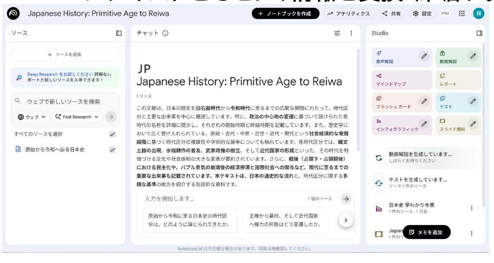

コンテキスト

→

質問

→

変換

<!--
- Google NotebookLM＝コンテキストをもとに情報を変換・深堀りする道具。
- コンテキスト → 質問 → 変換、の流れ。
-->

---

Google NotebookLM

# 学びやすい形に情報を変換

絵1枚で要約

スライド作成
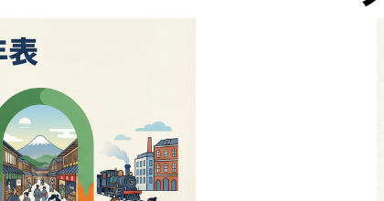

クイズで時間確認
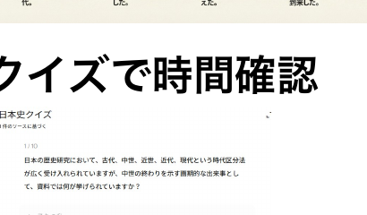

動画・podキャスト

（ソクラテスメソッド） 質問・応答

学びやすい形に情報を変換

<!--
- NotebookLMで学びやすい形に情報を変換：絵1枚で要約、スライド作成、クイズで時間確認、動画・podキャスト（ソクラテスメソッド）、質問・応答。
-->

---

NotebookLMの授業活用

# NotebookLMの授業活用

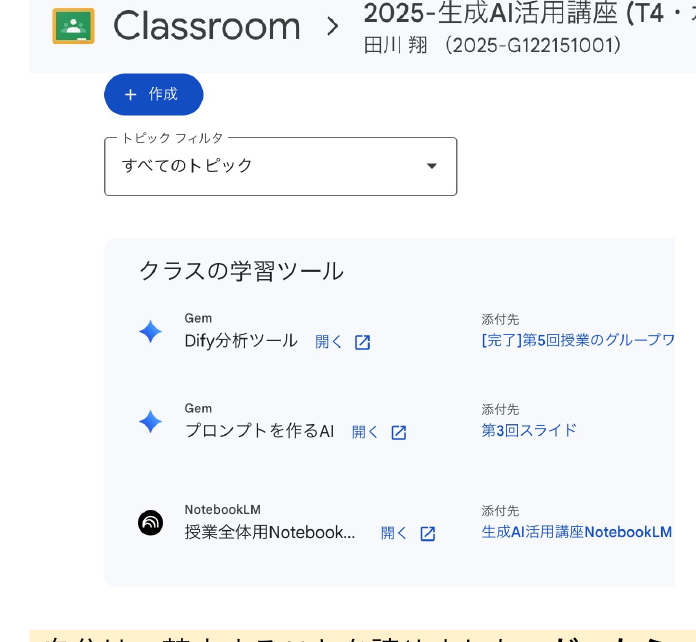

<b>クラスルームでの活用事例</b> 
授業全体の内容を質問し、 思考・学びのパートナーとして提供

作成したスライドやドキュメントを <b>ソースにアップロード</b>

<b>使い方</b>について10分ほどの動画を 受講学生に配布

<b>クイズや精緻的質問で能動的に学び、</b> 様々な情報モードでの理解促進を狙う

<b>知識との関わり方</b>を転換

自分は、禁止することを諦めました。<b>だったら、AIを使って、もっと遠くまで学ばせた方が良い。逆に公式に提供し、課題とテストの難易度を上げました。</b>

<!--
- NotebookLMの授業活用の事例。Google Classroomのクラスの学習ツールに、作成したスライドやドキュメントをソースにアップロードし、使い方の動画を受講学生に配布。クイズや精緻的質問で能動的に学び、様々な情報モードで理解を促進する。知識との関わり方を転換するのが狙い。
- 自分は禁止することを諦めました。だったら、AIを使ってもっと遠くまで学ばせた方が良い。逆に公式に提供し、課題とテストの難易度を上げました。
-->

---

第5回について

# 第5回について

5/19 教室講義 (G3-12で対面実施)となります。 以下を持参してください。

① PCまたはタブレット、②スマホ、③メモを取るもの

Moodleに今回分の問題もあるので、忘れずに！

<!--
- 第5回について。5/19 教室講義（G3-12で対面実施）となります。以下を持参してください。①PCまたはタブレット、②スマホ、③メモを取るもの。Moodleに今回分の問題もあるので、忘れずに！
-->
