<!-- _class: cover-hero -->

大学のアカウントで使える

生成AIを使ってみよう

アカデミック・リンク企画 1210あかりんアワー

2026/5/19 (火) 12:10–12:40

千葉大学 国際未来教育基幹 田川 翔（専門：高等教育論・地球惑星科学）

<!--
- あかりんアワーへようこそ、と一言。
- 普段は15ミニッツセッションでインタラクティブにやっているが、今日は30分でマシンガンに動画を見せていく形式。
- 動画は録画として後日公開されるので、手元で再現してほしい旨を伝える。
- 「AIの性能」と「使い手側の引き出し方」のギャップを、20を超える具体例で体感してもらうのがゴール。
-->

---

<!-- _class: intro -->

本日の進め方

<strong>本日の形式</strong>：機能ごとに、解説のサイクルを繰り返します。 
この時間中に生成AIで試してみようと思わないで下さい。 
スクリーンの内容に集中して頂き、全体像を掴んでいただければと思います。

 

## 30分の流れ

1. 大学が提供する生成AIと安全性（3分）
2. 性能 vs 活用のギャップ（2分）
3. **Gemini基本編：14ユースケース**（8分）
4. **Copilot基本編：2ユースケース**（3分）
5. **NotebookLM：3ユースケース**（3分）
6. **上級編：Gems / iPaaS / CLI**（7分）
7. OODAループ（2分）
8. まとめ・質疑応答

## 内容

- すべて**千葉大アカウント**で再現可能
- すべて**学習されない・広告に使われない**領域
- このセッション**だけ**ではわからない→**触ること**が必要
▶ 関心をお持ちの方は、ALC 15 minsセッションへ!   
「学びを変える！研究を深める！生成AI活用術」

 

## お願い
  - zoom参加者の方、反応下さい →使っている👍️、使ってみたい♥️、面白い🦀

<!--
- 30分でだいたい22〜25個のユースケースを駆け抜ける。
- 「全部覚える」のではなく、「自分のAIに対する地図」を持ち帰ってもらうのが目的。
- 後で15ミニッツセッションを案内するので、気になったものは深掘りに来てほしい。
-->

---

<!-- _class: divider -->

CHAPTER 1

# 千葉大学で提供されている2つのAI

## 安全に、ライセンスを理解して使う

<!--
- ここから第1章。
- まず「何が手元にあって、それが安全か」を整理する。これがないと、機密情報や著作物を打ち込めない。
-->

---

<!-- _class: summary -->

2つのAI

## Gemini と Copilot — どう使い分けるか

### Gemini（Google）

- **Google Workspace**と一体（Gmail/Drive/Calendarなど- [コアサービス](https://edu.google.com/intl/ALL_jp/workspace-for-education/editions/overview/)）
- 日本語：ジェミニ／英語：ジェミナイ
- **アプリ連携・LearnLM・NotebookLM**が強み
- 長文・大規模コンテキストに強い一方、価格が安い
- 学校版は、**教育用にチューニング**されている
  - 答えを直接渡さず、迎合性も低い

### Copilot（Microsoft）

- 裏側は **OpenAI（ChatGPT系）**
- 有料版では、**Office連携**（Word/Excel/Teams）が可能
- 学校に役立つ機能が多い ※**個人版より制限あり**
- 画像生成とクリエイティブな要素で直感的に使いやすい

<!--
- 千葉大の学生・教職員アカウントで、両方ともコアサービスとして提供されている。
- 性格が違うので、片方だけ使うのはもったいない。今日はGemini中心、最後にCopilotにも触れる。
- 「裏で動いているモデル」が違うだけで、得意分野が変わることを最初に押さえる。
-->

---

<!-- _class: split -->

安全性の確認

## 緑のマーク・データ保護の表示を見る

図1. 入力情報の扱われ方 (大学版Gemini/Copilot)

### 確認すべき3点

- **学習に不使用**：入力がモデル学習に転用されない
- **データ保護適用**：Gmailと同等の保護水準
- **広告に使われない**：将来のステマ的回答も発生しない

これらの仕様は、個人版のAIと異なっている。 
かなり厳しい米国内のFERPA準拠。

 
※補足：誰も見れないわけではない！ 
<small><a href="https://gemini.google/jp/policy-guidelines/?hl=ja">規約違反</a>・法的な問題がある場合には確認されうる。</small>
 

自身の入力情報がどう扱われるか気にする習慣を

<!--
- Geminiでは、メニューを開くと「Gmailなどと同じデータ取扱い」と書かれている。
- Copilotでは、右上に緑のシールド（保護中）マークが出る。これが個人版との明確な違い。
- AI推論コストが高騰しているため、業界全体では「広告で稼ぐ」「回答にステマを混ぜる」可能性が懸念されている。学校アカウントはここを契約で塞いでいる。
- Copilotは特に「依存性を下げる」教育向けチューニングが入っており、馴れ馴れしく話しかけてこない。
-->

---

<!-- _class: summary -->

ライセンス

## 同じアカウントでログインしても、サービスごとに規約が違う

### 安全な範囲

- **Google Workspaceコアサービス**：Gmail、Drive、Gemini、NotebookLMなど
- **Copilot（学校版）**：Microsoft 365テナント内
- ここに打ち込む内容はメールと**同レベルで保護**

### 注意が必要な範囲

- 「Googleでログイン」した**外部サービス**は別ライセンス
  - たとえ、Googleのアカウントでログインしても、別の会社のサービスの場合は、**個社の規約**が適用される
- **Antigravity**など、Google製でも**非コア**の製品への入出力は次のシステムへの改善資料になりうる
  - ログイン時点で、別のプライバシーポリシーが表示されている。

分からない時は規約・プライバシーポリシー本文を生成AIに貼って 「私の情報はどう使われる？」と尋ねる

<!--
- 多くの人は「学校のGmailで登録したから安全」と誤解している。が、ログイン先のサービスのライセンスが適用される。これは毎回別物。
- Google製品でも、コアサービスとそうでないものは線が引かれている。Antigravityは現時点で学習対象。
- ワンポイント：ライセンス本文をそのままAIに投げ込んで「私の情報は売られる？学習される？」と聞くと、要約してくれる。これが実用的。
-->

---

<!-- _class: divider -->

CHAPTER 2

# 性能と活用のギャップ

## なぜ私たちはAIを使いこなせていないのか

<!--
- ここから核心。安全性の話は「使うための前提」だった。
- なぜ皆さんがAIを「使いこなせていない」と感じるか、その構造を解説する。
-->

---

<!-- _class: fig -->

性能ギャップ

## 性能はエクスポネンシャル、活用はリニア： Capability Overhang

AIを入れたのに、効果が出ない事例が企業で多発 
そもそも、<b>AIを使いこなせていない</b>のでは？ 

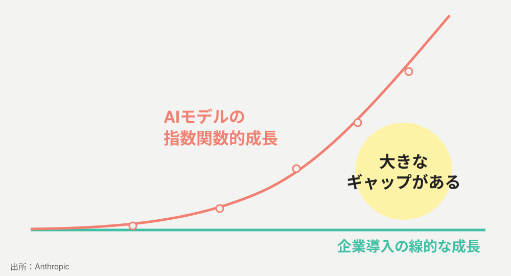

図2. AI capability vs. organizational adoption（by Anthropic）  この隙間をどう埋める？「コンサル」「フォワードデプロイドエンジニア」「内製」？

今日は、大学の文脈の中で、使いこなすコツをお知らせします！

<!--
- Anthropicが公開している有名な図。AIの性能は指数関数的に伸びる一方、組織がそれを使う速度は線形にしか伸びない。
- このギャップを埋めるサービスとして、いまフォワードデプロイドエンジニアという職種が高給で取引されている。
- 結論：自分たちで機能を知っていれば、わざわざ高額なサービスを買わなくても、ある程度のことはできる。
- 今日の30分は、その「自分で埋める」ための地図を渡す時間。
-->

---

<!-- _class: divider -->

CHAPTER 3

# Gemini 基本編

## 14のユースケースを駆け抜ける

<!--
- ここからユースケース集。動画を1本ずつ見せながら、解説を被せていく。
- 動画ごとに「これでこういうことができる」を1メッセージで持ち帰ってもらう。
-->

---

<!-- _class: split -->

ケース①：質問

## Google検索の「キーワード」ではなく、人に教える文体で

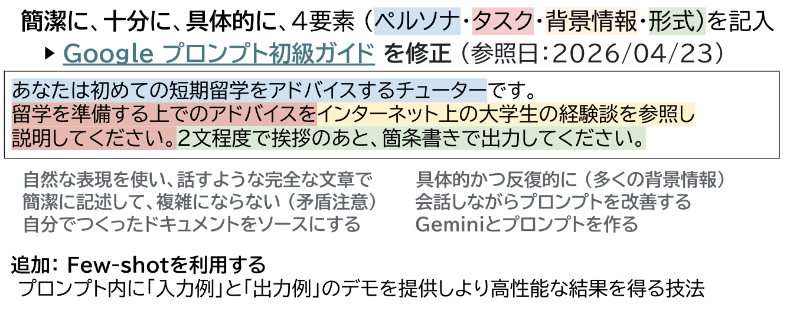

図3. おすすめな簡易プロンプト

### 良いプロンプトの型（Google 4要素）

- **ペルソナ**：AIに何者として振る舞ってほしいか
- **タスク**：何をしてほしいか
- **背景情報**：判断に必要な前提・参考資料
- **形式**：文字数・構造・語調

<small>出所：[Google プロンプト初級ガイド](https://support.google.com/a/users/answer/14200040)</small>

「マニュアルで人に教えるように」プロンプトを打つと、回答品質が一段上がる

<!--
- 多くの人がGoogle検索の延長でAIに「○○ ○○ ○○」とキーワードを投げている。これだとAIは推測で動くので、品質が落ちる。
- ファイル（PDF、画像、スプレッドシート）をそのまま添付できるので、文脈を渡すのが容易。
- 「人にマニュアルを書く」感覚を意識すると、自然と背景・タスク・制約が揃う。
-->

---

<!-- _class: split -->

ケース②：アプリ連携

## ＠でClassroom・Drive・Gmailを呼び出す

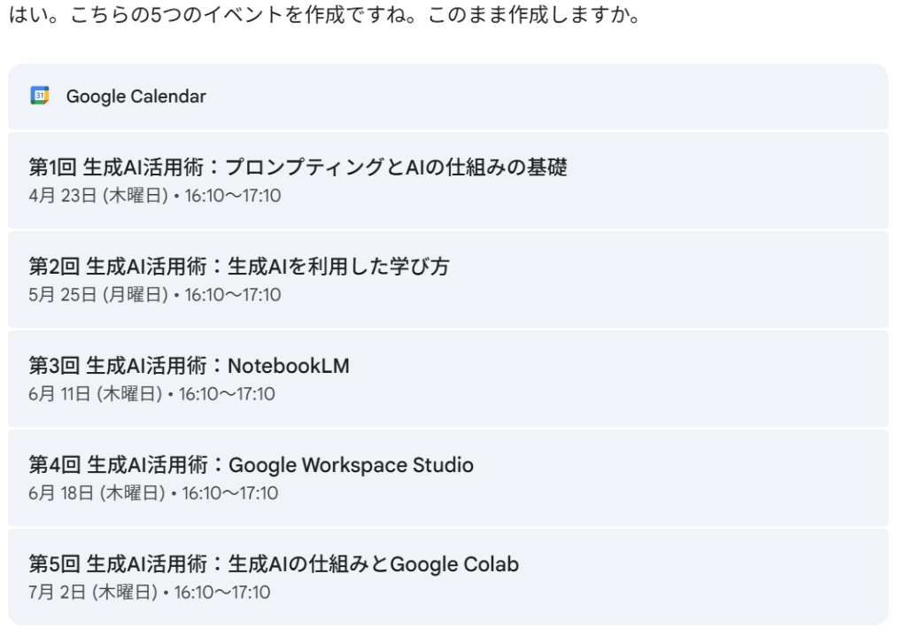

図4. ＠で呼び出せるGoogleカレンダー

### 事前にONにする2つのスイッチ

- Gemini設定の**外側＋内側の連携ボタン**
- Gmailの**スマート機能をON**
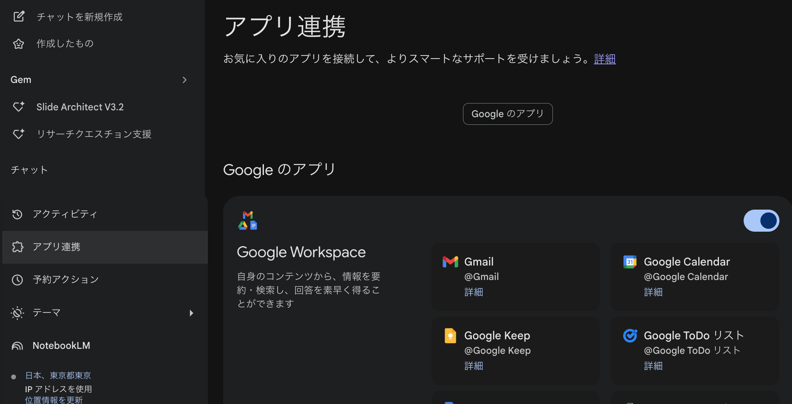
### できること

- 授業日程を**Classroomに一括投入**/予定確認
- Driveから「○○のスライド/ファイルある？」で検索
- **件名・本文を過去返信例から学習**して下書き

連携を一度ONにすれば、Geminiが「執事」のように振る舞い始める

<!--
- ＠マークを押すと、Google Workspaceの全アプリが呼び出せる。これが連携の入口。
- Classroom投入：シラバスから抽出した日程を一括登録できる。出てきた灰色の枠が「成功」のサイン。
- Drive検索：ファイル名を覚えていなくても、内容から見つけてくれる。
- Gmail下書き：これまでの返信スタイル（署名・文字数・敬語レベル）を学習して、自分らしい返信案を出してくれる。これだけで業務時間がかなり減る。
-->

---

<!-- _class: split -->

ケース③：LearnLM

## 答えを「教えず」「学びを支援する」ようにチューニングされたAI

<video controls src="src/fig05-learnlm-demo.mov" poster="src/fig05-learnlm-demo.png" width="580" title="Title"></video>

図5. LearnLM：教えるのではなく問い返す

### LearnLMの5原則

- **能動学習**を促す
- **認知負荷**を管理する
- **学習者に適応**する
- **好奇心を刺激**する
- **メタ認知**を深める

Arizona State Univ.等で**教育効果を実証** 
<small>※[Google DeepMindによるLearnLM論文 (arXiv:2412.16429)](https://arxiv.org/abs/2412.16429)</small>

「答え」ではなく「考え方」を引き出すモード

<!--
- LearnLMはGoogleが教育向けに開発した特殊AI。教育研究者が5つの原則に基づいてチューニング。
- アリゾナ州立大などで効果検証され、実際に論文が出ている。
- 普通のAIに「答え教えて」と言うと答える。LearnLMは「まず何が分からない？」と返してくる。
- 学生に「依存しない使い方」を覚えてもらうための入口として最適。
-->

---

<!-- _class: summary -->

ケース④〜⑥：3つの学び

## 概念整理・暗記補助・問題演習を1つのAIで

### ④ 概念の対比

「**熱力学のエントロピー**と**情報工学のエントロピー**はどう違う？」
→ 共通の数理構造を示しつつ、適用領域の違いを段階的に開示

### ⑤ 暗記の工夫

「**KIDWモデル**の覚え方を考えて」「**日常の具体例**を出して」
→ 語呂・アナロジー・身近な例で記憶のフックを増やす

### ⑥ 演習問題の生成

「このスライドから**4択問題を5問**作って」
→ 答えだけでなく**解説と誤答の根拠**もインタラクティブに生成

<!--
- LearnLMは「概念」「暗記」「演習」の3軸で力を発揮する。
- 学生向け：「今日のスライドから暗記すべき所を抜き出して」「4択問題を毎回出すGemにしておく」と、勉強の入口が変わる。
- 教員向け：講義の理解度確認テストを5分で生成できる。
-->

---

<!-- _class: split -->

ケース⑦：歌を作る

## 30秒の短曲で、概念に音をつける

<video controls src="src/fig06-music-generation.mp4" poster="src/fig06-music-generation.png" width="380" title="Title"></video>

図6. 30秒の音楽生成（学校アカウント）

### 教育での使いどころ

- 授業のBGM
- 暗記用の曲
### 注意

- 類似曲がある場合、著作権・商用利用は要確認

「面白い」を授業に持ち込む小ネタとして強力

<!--
- これは完全に余興、と思いきや、記憶定着には音が効く。
- 学校アカウントだと30秒まで。プロトタイプには十分。
- 公開や商用利用は別の話。あくまで授業内・学内のプロトタイプとして。
-->

---

<!-- _class: split -->

ケース⑧：Web検索/Deep Research

## カットオフを超えて、いまの情報に触る

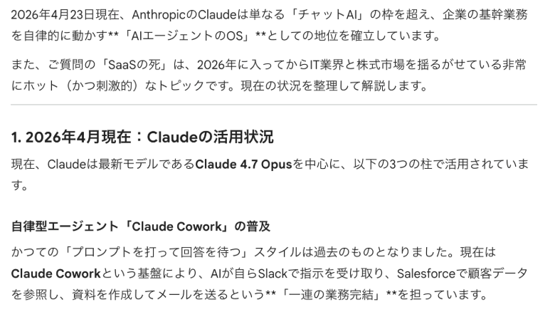

図7. Web search：カットオフを乗り越えて最新情報が出る

### 2段階で使い分ける

- **Web検索**：「裏取りして、出典だしてよ」が可能に
  - 但し、ベストな論文が取り出せるわけではない
- **Deep Research**：複数ソース横断、構造化レポート
- 「今日の天気予報」のような**リアルタイム情報**もOK
- **カットオフ後**の出来事にも対応

### Deep Researchの注意

- 月あたりの利用回数に上限あり
- 一気に情報を俯瞰したいとき、まとめて使う

AIは「過去の知識」ではなく「いまを検索する」エージェントになれる

<!--
- 昔のAIには「知識のカットオフ」があった。今は四則演算的な基礎能力を持ったAIが、Web検索を呼び出して情報を加工して返してくる。
- Deep Researchは月あたりの利用回数に制限があるので、「これは重い調査だ」というときに使う。
- 天気予報のような瞬間的な情報も普通に取れる。
-->

---

<!-- _class: split -->

ケース⑨：範囲指定検索

## URLスコープを指定して、信頼できる範囲だけ読ませる

<video controls src="src/fig08-domain-scoped-search.mov" poster="src/fig08-domain-scoped-search.png" width="580" title="Title"></video>

図8. ドメイン指定で根拠の出所を縛る

### 使い方

- **ドメインを指定**して情報源を縛る
  - 例：千葉大の各学科のDP本文を取得
- 参照可能なGoogle doc/slideなども引用できる。
  - URLを貼るだけ
- コンテキストを充実でき、性能を引き出しやすい
  - クロール不可などで一部参照できない場合がある

「どこから取ったか」を制御できれば、AIの出力が利用しやすくなる

<!--
- URLやドメインを指定すると、AIはそこだけを読みに行く。出所が分かるので、引用としても使える。
- Claudeの例：千葉大全学科のディプロマポリシーをURLスコープで指定し、各学科の文字数を一気に比較したらすぐ表になって出てきた。これは衝撃。
- 「あの情報、どこから？」が分かるだけで、AI出力の信頼度が変わる。
-->

---

<!-- _class: split -->

ケース⑩：長文翻訳

## CanvasとSpreadsheetで、全文を1行も落とさない

<video controls src="src/fig09-canvas-spreadsheet-translation.mov" poster="src/fig09-canvas-spreadsheet-translation.png" width="580" title="Title"></video>

図9. 省略を防ぐ定石：Canvasに出力する

### なぜ省略が起きる？

- 生成AIはチャット内で答える際、**要約しがち**
  - 「省略するな」と言っても省略する

### 解決法

- **Canvas**で書き出し領域を分ける
  - 文字起こしを行う場合や翻訳に便利
- **Spreadsheet**：原文を行に貼り、**隣セルに翻訳関数**
  - 1行＝1単位なので、**漏れない**

<b>関数の形</b> 
<code>=AI("英訳して", A1)</code> — プロンプト＋参照セル 
<code>=GOOGLETRANSLATE(A1, "ja", "en")</code> — 原文・元言語・訳先

文章の構造に合わせて出力先を使い分けるのがコツ

<!--
- AIに「省略するな」と言っても、会話モードでは省略してくる。これは仕様。
- Canvas：左がチャット、右が書き出し領域。書き出し領域に対しては丁寧に全文出してくれる。
- Spreadsheet：1行ずつ翻訳させると、構造上「行が消える」ことがないので、確実に全文翻訳できる。
- これは英語論文の精読、学生レポート添削にも応用可能。
-->

---

<!-- _class: split -->

ケース⑪：回答傾向分析

## Spreadsheetを「集計AI」として使う

<video controls src="src/fig10-qualitative-analysis.mov" poster="src/fig10-qualitative-analysis.png" width="580" title="Title"></video>

図10. 自由記述の質的分析を数分で

### 元データの例

- 講座後のリフレクション（自由記述）
- 演習の解答パターン
- 学生からの質問ログ
- グループワークの気づき一覧

### AIで近似的にできること

- **頻出テーマ**の抽出・リスト化
- **記入内容**の分類

<b>コツ</b>：分類軸・観点・参考資料など<b>どのコンテキストを足すと回答がどう変わるか</b>を、隣列で比較すれば簡単に検証できる。

全体を容易に掴むことで、「解釈する時間」が生まれる

<!--
- これまで自由記述アンケートは「読むのが大変」だった。Geminiで一気に俯瞰できる。
- 「皆さん何を喜んでいたか」「次回改善すべき点」をリストで返してくれる。
- もちろん最終判断は教員。あくまで「読む→解釈する」の時間配分を変えるのが目的。
-->

---

<!-- _class: split -->

ケース⑫：Canvas編集

## 「キャッチーに」「短く」「論理的に」を即時反映、AIと共同編集

<video controls src="src/fig11-canvas-editing.mov" poster="src/fig11-canvas-editing.png" width="580" title="Title"></video>

図11. AIが横で添削役を務める

### 使い方

- 草稿をCanvasに出す
- 「**もっとキャッチーに**」「**論理を強化**」と指示
- Geminiがその指示に従って書き換える
- 人間側も同じ文章を編集可能
  - 差分が見えるので**苦手な点に気づける**

「編集プロセス」を伴走することが生成AIで可能

<!--
- これは「文章を書く」のではなく「文章を磨く」AIの使い方。
- Canvasは差分が見えるので、添削の理由が学べる。指導の補助として有用。
- 学生に「自分で書き、AIに磨いてもらう」習慣をつけてもらうのに最適。
-->

---

<!-- _class: split -->

ケース⑬：音声・OCR

## m4aもJPEGも、そのまま投げ込む

<video controls src="src/fig12-audio-ocr.mov" poster="src/fig12-audio-ocr.png" width="580" title="Title"></video>

図12. 音声・画像をテキスト化

### できること

- **議事録**：会議録音→構造化要約
- **手書きノート**：撮影→OCR→検索可能化
- **板書**：写真→学生配布用テキスト
  - 課題の添削理由を理解するのに、学生も使える

### 注意

- 個人情報を含む音声は要事前確認
- 動画をまとめられるかは、以下の点で微妙
  - 秒数がずれる、要約される
  - 動画の画面の認識と合わない

「アナログ素材を一気にデジタル化」する入口としても機能する

<!--
- 音声・画像から構造化テキストを出せる。研究のインタビュー文字起こしに非常に強い。
- 板書の写真をOCRして配布資料化、研究室の手書きノートをアーカイブ化、など応用が広い。
- 個人情報を含む場合は、必ずコアサービス内で完結させ、外部に出さないこと。
-->

---

<!-- _class: split -->

ケース⑭：ページ内相談

## 開いているWebページ・PDFについて、その場で質問

<video controls src="src/fig13-browser-extension.mov" poster="src/fig13-browser-extension.png" width="580" poster="src/fig13-browser-extension.png" title="ブラウザ拡張"></video>

図13. ブラウザ拡張としてのGemini

### 典型シナリオ

- 長いマニュアルから**該当箇所を抽出**
- 論文ページから**要約と質問**
- 学内Webサイトの**該当規程**を即答
- 英語ニュース記事の**3行サマリ**
- 規則や法律など長文の**要点把握と検索**

「AIと一緒に情報を処理する」ことができる

<!--
- ブラウザ右上のGeminiアイコンから、いま開いているページについて質問できる。
- 「このページのどこに○○について書かれている？」と聞くと該当段落を引用してくれる。
- 大学のWebサイトの規程・マニュアルに対して非常に強い。
-->

---

<!-- _class: divider -->

CHAPTER 4

# Copilot 基本編

## Office連携と教育ツール

<!--
- ここからCopilot。OpenAIモデルを裏側に、Microsoft 365エコシステムと深く連携。
- Geminiとの一番大きな違いは「教育ツール」が標準で揃っていること。
-->

---

<!-- _class: split -->

ケース⑮：作成（Copilot Stories）

## 画像・動画・インフォグラフィック・ストーリーを一気に

図14. Copilotの「作成」ハブ

### 出力の種類

- **画像／インフォグラフィック**
- **ストーリー**：複数画像で構成する視覚的ナラティブ
- **ポスター**／**画像編集**

### 使いどころ

- 授業のオープニング・アイキャッチ
- 学内広報の叩き台
- 学生プロジェクトのプロトタイプ

「説明する素材」を、テキストから直感的に視覚化できる

<!--
- Copilotの「作成」は、画像・動画・ストーリーまでをひとつのUIで触れる。
- 学校アカウントで広告なし・データ保護下で使えるのが利点。
- 学生に渡すというより、まず教員が試作してみるのに向いている。
-->

---

<!-- _class: split -->

ケース⑯：指導（教育ツール）

## カリキュラム計画・教材調整・宿題評価まで標準装備

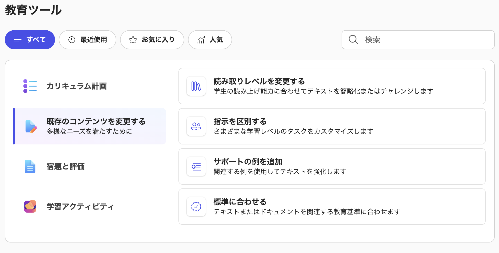

図15. Copilotの「教育ツール」

### 4カテゴリ

- **カリキュラム計画**
- **既存のコンテンツを変更**
- **宿題と評価**
- **学習アクティビティ**
  - 教育標準（Standards）との整合機能あり 

### Geminiにも類似機能あり
※ Google側の類似機能は **Gemini in Classroom**
（Classroom内から使える課題生成・採点支援）
※ 学習指導要領に対応し、科目を跨いだ評価が可能

Copilotは「教育用のAI機能テンプレ集」をすぐに使える

<!--
- これはCopilotの真骨頂。Geminiにも同等のことはできるが、Copilotは教育向けUIが前に出ている。
- 既存教材の難易度調整（読み取りレベル変更、サポート例の追加）は、ユニバーサルデザインの観点でも有用。
- 教員が「最初に開く画面」としての敷居が低い。
-->

---

<!-- _class: divider -->

CHAPTER 5

# NotebookLM編

## 「資料群」をコンテキストとして、AIに与えるとどうなるか

<!--
- ここからNotebookLM。これまでは「単発の質問」だったが、NotebookLMは「資料を束で渡してAIに読ませる」モデル。
- 研究者・教員にとって特に有用。
-->

---

<!-- _class: split -->

ケース⑰：科研費アドバイザー

## 採択計画書を読ませて、自分の草稿をメタ的に認識

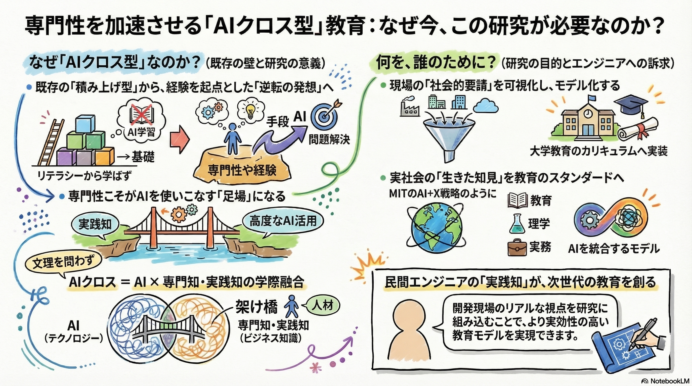

図16. 自分用の研究費レビュアー

### これから出す予算にも、内容の検討にも
- インフォグラフを作成し自分の意図が伝わるか確認
- 予算を書く際の伴走の道具にも出来る

### 投入する資料の事例
- 公募要領・審査基準
- 自身の関心
- 自分の研究を支える論文

### 引き出す出力

- **構造の弱点**指摘
- **概念図のイラストレーション**
- **審査委員視点**の質問リスト

「もう一人の自分」として、壁打ちできる

<!--
- NotebookLMは「ソース」を起点に動く。自分の科研費草稿＋関連論文＋公募要領を入れると、AIがその範囲で議論してくれる。
- 図解（イラストレーション）も出してくれるので、申請書のポンチ絵下書きにも使える。
- 「審査委員の立場で質問を10個出して」が特に有効。
-->

---

<!-- _class: split -->

ケース⑱：解説

## 情報の「俯瞰の道具」になる

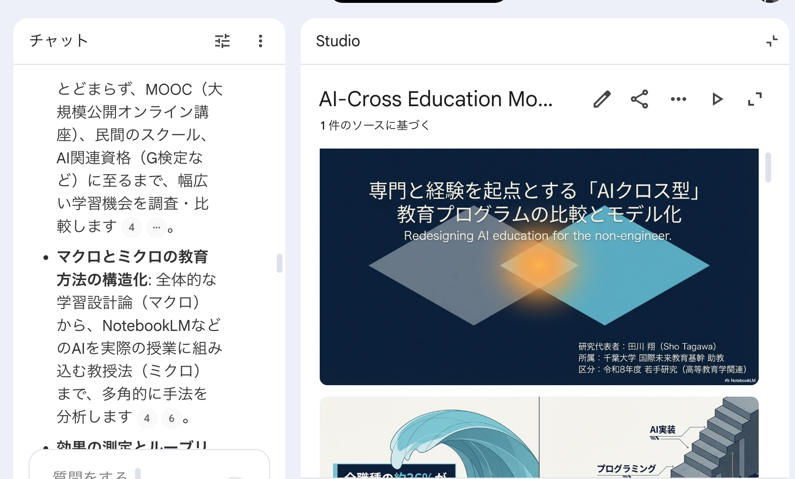

図17. 情報の可視化

### できること
- ソースに入れた情報をコンテキストに変換する
  - **要点と相互関係**をマインドマップに抽出
  - 学習向けの**質問プロンプト**や問題も出せる
  - 動画や音声、スライドで内容を俯瞰

### Google Classroom・Moodleとの連携
- 授業スライドを教員がNotebookLMに取り込むと、学生の質問に回答するチャットボットが出来る
  - 中高の学びの復習に提供している大学もある
- Moodleとの連携もGoogleが開発中

自分がより学ぶために、情報と相互作用する道具

<!--
- 著作権フリー教材や、自分が著作権を持つ教材を投入する。
- 学生に渡す前に、自分でAIに「この教材の難所はどこ？」と聞いて授業設計に活かせる。
- マインドマップ機能で全体構造を視覚化できる。
-->

---

<!-- _class: split -->

ケース⑲：マニュアルBot

## 千葉大の事務マニュアルを「対話で引ける」状態に

<video controls src="src/fig16-manual-bot.mov" poster="src/fig16-manual-bot.png" width="580" title="Title"></video>

図18. 引用付き回答で根拠を担保

### 構築の流れ

1. マニュアルPDF/Webを**ソースに登録**
2. テスト質問で精度確認
3. **共有リンクで部署内配布**
4. 更新時はソース差し替えだけ

### 予想される効果

- 新人の**問い合わせ激減**
- ベテランの**応答工数削減**
- 作業者の「いつもの質問」の低減

「マニュアルを読む」から、「マニュアルを探す」へ

<!--
- これは事務作業を本当に変える。千葉大の支払マニュアル、出張マニュアル、研究費マニュアルなど、どれも投入できる。
- 重要：NotebookLMは「引用付き」で答えるので、根拠ページが明示される。これが社内利用での信頼性を担保する。
- 部署単位で1つNotebookを作ればチーム内のFAQ Botになる。
-->

---

<!-- _class: split -->

補足：NotebookLMの共有

## ワンクリックで部署・授業内に展開

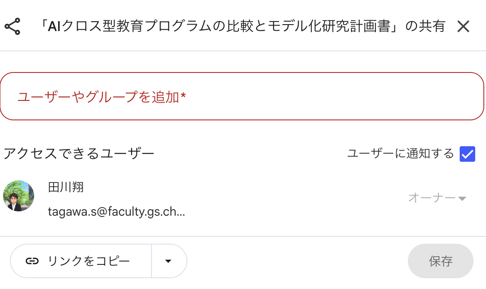

図19. Googleドキュメントと同じ共有モデル

### 共有モデル

- リンクを知っている人が閲覧・質問可能
- 部署メンバーで編集も可能

### 他校活用例
- 過去の議事録を保存し、一括検索する
- 質問に答えてくれるbotとして活用する
- 授業内で学生に配布する

### 注意

- ソースの**著作権・機密性**を確認
- 公開範囲は**最小権限**で

作ったNotebookが、人に伝える道具になる

<!--
- 作ったNotebookLMを共有すれば、組織のナレッジ資産になる。
- 共有はGoogleドキュメントと同じ感覚で、リンク発行だけでOK。
- ただし、入れたソースの著作権・機密性は要確認。学生に渡す前に責任の所在を整理する。
-->

---

<!-- _class: divider -->

CHAPTER 6

# 上級編：Gems / iPaaS / CLI

## 「AIアプリを自分で組み立てる」段階へ

<!--
- ここから上級編。AIを「使う」から「組み立てる」段階。
- Gems（カスタムAI）、Workspace Studio（自動化）の2本柱。
-->

---

<!-- _class: split -->

ケース⑳：Gems

## シラバスチェッカー、暗記Bot、自分専用アシスタント

<video controls src="src/fig20-gem-syllabus.mov" poster="src/fig20-gem-syllabus.png" width="580" title="Gem シラバスチェック"></video>

図20. 生成AIによる本学のシラバスチェック  (シラバスをアップロードすると、AIが内容を解析し、評価を行う)

### Gemの例

- **シラバスチェッカー**（教員向け）
- **4択問題出題者**（学生向け）
- **授業中ワークの伴走者** (授業向け)
- **Gemを作るGem**（メタGem）

### コツ
- 毎回打つプロンプトを**Gem化**
- 回答精度を少しずつ上げて**進化**
- Gemも千葉大学内に共有できる。

※ Copilot側の類似機能はエージェント

よく使うプロンプトは、Gemにして「固定化」する

<!--
- Gemは「役割を固定したAI」。毎回同じ指示を打たなくて済む。
- 学生向け：「今日のスライドから暗記する所を抽出する」「4択問題を毎回出す」をGem化しておくと学習効率が変わる。
- 教員向け：「シラバスを千葉大の記入規則に照らしてチェックする」Gemが超便利。
- 上級ワザ：「Gemを作るGem」を作っておくと、新しいGemをAIと一緒に設計できる。
-->

---

<!-- _class: split -->

ケース㉑：スライド生成

## Google Slideでのスライド自動生成

<video controls src="src/fig21-slide-generation.mov" poster="src/fig21-slide-generation.png" width="580" title="スライド自動生成"></video>

図21. 編集可能形式でのスライド出力

### 3つの出口
- **Slide**：編集可能なスライドで出力
- **NotebookLM**：画像形式（PNG）として出力
- **Gem経由**：**Googleスライド形式**で編集可能

### 活用シナリオ

- 講演資料の**初稿**生成
- 会議資料の**叩き台**
- 学生発表の**テンプレ**配布

スライドの構成などの悩みが減り、左上から右下へ情報が流れるようになる。

「ゼロから書く」のではなく「AIが作った叩き台を直す」へ

<!--
- NotebookLMでもスライド生成はできるが、画像で出てくるので編集不可。
- Gemに「スライドの作り方」を仕込んでおくと、Googleスライド形式（編集可能）で吐き出してくれる。
- 重要なのは「ゼロから書く時間」を「初稿を直す時間」に置き換えること。創造性は後工程で。
-->

---

<!-- _class: split -->

ケース㉒：iPaaSでの自動化

## メール・ファイル・カレンダーをAIで自動連結

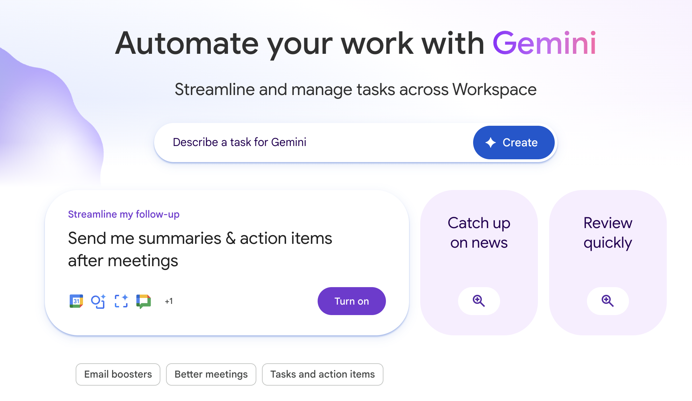

図22. ノーコードでAI自動化

### 自動化の例

- 受信メールに**AIが返信下書き**
- ファイル保存時に**自動分類**
- カレンダー登録から**準備リマインダー**
- フォーム回答を**スプレッドシート集計＋要約**

すべて**コアサービス**内で完結

AIが自動でトリガーされ、バックグラウンドで動く

<!--
- Workspace StudioはiPaaS（Integration Platform as a Service）として機能する。
- ノードを繋いで「○○が起きたら○○する」を組める。コードは不要。
- 私のメール下書きは、いまほぼ全てAIが生成している。確認して送信ボタンを押すだけ。
- これも全部コアサービスの内側で動くので、データ保護はそのまま。
-->

---
<!-- _class: split -->

ケース㉓：CLIやIDE連携

## PCでの操作やファイルの編集の自動化

<video controls src="src/fig23-cli-ide.mov" poster="src/fig23-cli-ide.png" width="580" title="CLI/IDE連携"></video>

図23. このスライドの作り方

### Gemini CLI (6/15まで利用可能)
- Googleの提供するCLIツール。
  - Claude Codeがこの領域では有名
- 古いファイルを移動やテキストの管理も頼める
- システムの開発などでも使える
  - 複数ファイルを参照出来る
### 使用例
- 本スライドもClaude CodeとAntigravityで編集
  - Claudeがデザイン作成、ファイル管理を自動化
  - Marpでの入力をAntigravityが支援

但し、機密情報の取り扱いは不可

AIがPCの様々な作業を支援できる状態に

<!--
- Workspace StudioはiPaaS（Integration Platform as a Service）として機能する。
- ノードを繋いで「○○が起きたら○○する」を組める。コードは不要。
- 私のメール下書きは、いまほぼ全てAIが生成している。確認して送信ボタンを押すだけ。
- これも全部コアサービスの内側で動くので、データ保護はそのまま。
-->

---

<!-- _class: divider -->

CHAPTER 7

# AI agent時代のAIリテラシーへ

## 「倫理」「使い方」の上にある、「AIとの関わり方・学び方」のリテラシー

<!--
- 最後の章。ユースケースを駆け抜けたが、本質はそこではない。
- 「自分で評価できる範囲でしかAIは仕事に使えない」というメッセージを伝える。
-->

---

<!-- _class: message -->

# AIの出力を、評価できますか？
## 分野に詳しければ評価できる。詳しくなければ判断が難しい。だから相変わらず知識が重要。
 

# AIを使う、使わないを判断できますか？
## 常にAIを使う必要はない。「不便」や「今できないことの実現」に、道具として活用する。
 

# AIであなたは何を創りますか？
## 深く学び、創造性を発揮する際の「道具」として使う。効率化のみならず、自分の成長のために。

<!--
- AIの答えが正しいかを「考える」のはレベル1。
- レベル2は、出力そのものを「評価できる文脈にあるかどうか」を判断できること。
- 評価できない領域で使うと、ブラックボックスのまま仕事に持ち込んでしまう。
- だから「AIを使えるか」は「自分の専門性があるか」と表裏一体。
-->

---

<!-- _class: split -->

OODAループと生成AI

## OODAループでAIと関わってみるのはどうか

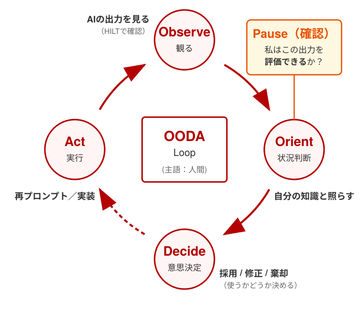

図24. OODAループをAI活用の観点で修正したもの

### AI学習のサイクル

- **Observe**：AIが何を出してきたか観る
- **Orient**：自分の知識と照らす
- **Decide**：採用／修正／棄却を決める
- **Act**：使う、または再プロンプト

### 積上げ式に学ぶ発想は、AIの学習には合わない
- まずは使って、使えるか判断する
- 自分が評価できるようになることが大切
  - 活用は、評価できる範囲で行う
- 出力は、一歩立ち止まって考えてみる
  - ハルシネーションやバイアスはいまだある

「使ってみる → 評価する → 工夫する」サイクルを持つことが、AI活用力を高める鍵

<!--
- AI学習にはマニュアルがない。順番に学ぶカリキュラム発想では追いつけない。
- OODAループは戦闘機パイロットの意思決定モデルだが、今は高校教科書にも載っている。
- AIとの付き合い方も同じ。「触る→評価→次の問い」のループ速度が、そのままAIリテラシーになる。
-->

---

<!-- _class: wrap -->

まとめ

## まとめ

- 千葉大はGeminiとCopilotを**コアサービス**で提供（学習されない・安全に保管・広告なし）
- AIの**性能は指数関数的**、**活用は線形**——ギャップを埋めよう
- Gemini基本編：**14のユースケース**を駆け抜けた
- Copilotは作成（Stories）と指導（教育ツール）が良い
- NotebookLMで**資料群を対話可能**にできる（＋共有で組織の情報活用に貢献）
- Gems・iPaaS・CLIで**自分専用のAI**を組み立てることができる
- 学び方は**OODAループ**的→使ってみること、評価することが大切
- 実践しながら学んで見たい方は、ぜひ、ALCの15 minsを受講してみてください

<!--
- 30分で22以上のユースケースを見せた。これは「全部覚える」ためではない。
- 「こんなことができるんだ」という地図を持って帰り、自分の業務・学びで「これだ」と思った1つから触り始めてほしい。
- 大学アカウントは安全な環境を用意してくれている。臆せず触ること。
-->