
今日は座席指定あり

# 小テストの関係で、今日持っている端末で座席指定します

入口

mac

左奥から座る

黒板

Windows

教室中央寄りから座る

※mac/それ以外の人で座れない場合、Windowsの集団の左や右の近い側へ

入口

それ以外

<b>mac/Windowsでない</b> or <b>イントール不可だった</b>

右奥から座る

ChromeOS / Linux iPad/iPhone

適切な場所に座って下さい / Moodleのパスワードを覚えておくこと

<!--
- 小テストの関係で、今日は座席指定。持っている端末ごとに座る場所を決めます。
- macは左奥、Windowsは中央寄り、それ以外は右奥。Moodleのパスワードを忘れずに。
-->

---

開始に先立ち

# 配布物

<b>①</b> PCかタブレットが今日ない人は、講師に連絡ください 
<b>② PCを立ち上げ、Moodleにログインして下さい</b> 
<b>③ インタラクションツール Slidoにアクセスして下さい</b> 
URLを配布したり、質問やアンケートをとったりします 
※お名前などの個人情報の入力は不可です。匿名で。

配布資料(このスライド)

スマホから

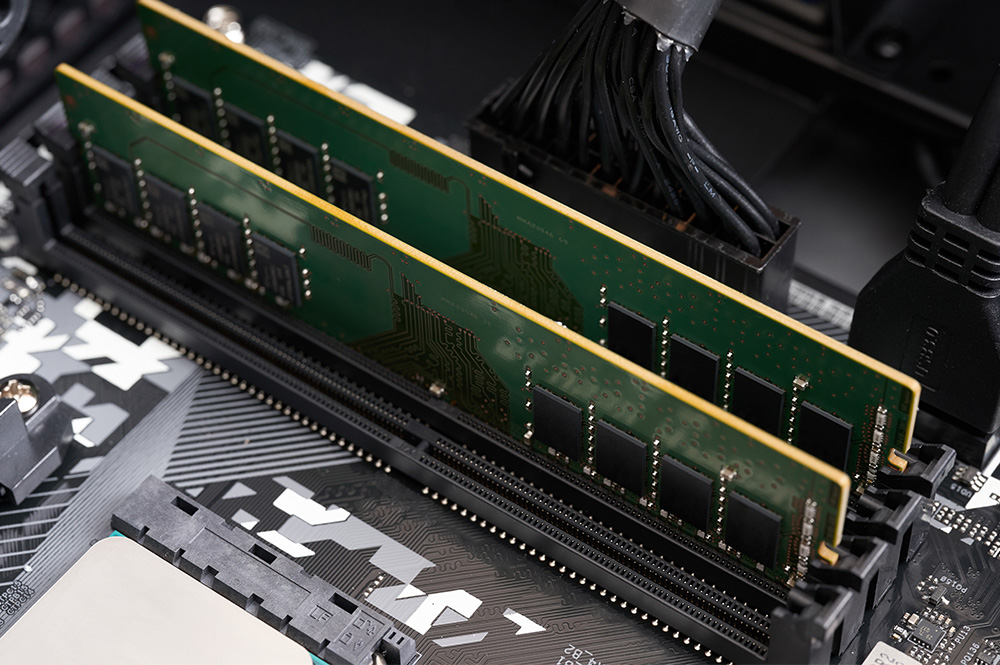

PCから

<b>方法1</b> Google検索「Slido」→コード入力 <b>コード：</b>1034655 <b>方法2</b> 直接リンク https://app.sli.do/event/4NWyEtvpH5YR2Jqxm1Bbrg

<!--
- 開始に先立ち、配布物の確認。PCがない人は講師へ。Moodleにログイン、そしてSlidoにアクセス。
- Slidoは匿名で。個人情報は入れないでください。スマホはQR、PCは検索かリンクから。
-->

---

フィードバックの公開

# 第5回のフィードバック (対面回)

AI関数の説明 <u>リンク</u> (今年後半から動きます)

学生の皆さんが関心を持った点・良かったと感じた点を集約し、箇条書きで端的に5つ答えて下さい。

関心を持った点・良かった点

<ul style="font-size:20px;">
<li>実際にパソコンを解体して内部の部品や構造を直接観察できたこと</li>
<li>生成AI（Gemini）を活用した電気店ロールプレイなどの実践的な演習</li>
<li>Slidoを用いた双方向なやり取りや、他の学生の意見をリアルタイムで共有できる点</li>
<li>CPUやメモリの役割、記憶装置の階層構造といったコンピュータの仕組みの理解</li>
<li>対面授業ならではの、教員や周囲の学生とコミュニケーションを取りながら学べる環境</li>
</ul>

学生の皆さんが難しかった点、不満に感じた点を集約し、箇条書きで端的に最大5つ答えて下さい。

難しかった点・不満に感じた点

<ul style="font-size:20px;">
<li>パソコン分解の実演や映像が見えにくかった</li>
<li>授業のテンポが速く、説明が不十分な箇所があった</li>
<li>CPUの仕組みや略語などの専門知識が難しかった</li>
<li>教室が狭く、受講人数が多いため窮屈だった</li>
<li>小テストが予定通り実施されなかった</li>
</ul>

第4回のフィードバックは、<b>各自にメールで</b>返信中です　▶ ヒューマン・イン・ザ・ループしているので、時間かかります PCの中身は、見えないとの声も幾つかもらったので、10分程の動画を来週出します。問題は、予習分も一部出すようにします。

<!--
- 第5回（対面回）のフィードバック。良かった点と難しかった点を5つずつ集約。
- 第4回分は各自にメールで返信中。ヒューマン・イン・ザ・ループしているので時間がかかります。
- PCの中身が見えにくいという声には、10分程度の動画で対応します。
-->

---

アンケート結果の紹介

# 授業の運営方針の結果

このデータを見てどう思いますか？

n = 

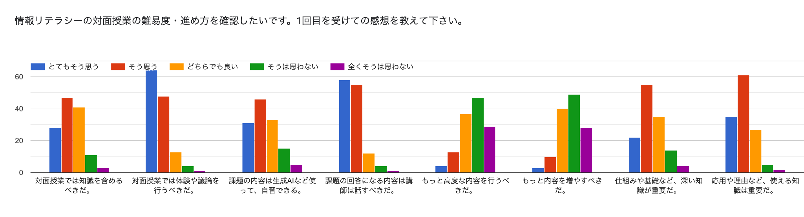

<!--
- アンケート結果の紹介。授業の運営方針について、1回目を受けての感想を聞きました。
- このデータを見てどう思いますか? まずは皆さんに考えてもらいましょう。
-->

---

アンケート結果の紹介

# 授業の運営方針の結果

n = 

① ワークや体験要素は重要 (但し、知識・課題回答と両立しにくい)

② ある程度自習は可能だが、課題の説明は欲しい → 問題の解説は<b>次回講義で躓くとこだけ</b>、簡単に行う

③ 難易度は簡単めでよい (もの足りない人は説明の時は自習しつつ、ワーク参加？)

DIKWの実践 + PDCAサイクルを回す

<!--
- アンケート結果の解釈。①ワーク・体験は重要だが知識・課題と両立しにくい、②ある程度自習はできるが課題の説明は欲しい、③難易度は簡単めでよい。
- 問題の解説は次回講義で躓いたところだけ簡単に。DIKWの実践とPDCAサイクルを回していきます。
-->

---

問題の復習

# 確認問題2aメモリスロット

<b>VLSI：超大規模集積回路 Very Large Scale Integration</b> 
トランジスタやダイオードなどの素子を数千個以上集積した半導体チップ 
CPUやメモリなど、様々なものの総称

<b>USB：Universal Serial Bus</b> 
プラグアンドプレイ：　挿せばOS側で認識 
ホットプラグ(USB-Cなど):　電源を入れたまま着脱可能 
バスパワー：　USB経由で電力を周辺機器に供給すること 
端子には、いくつかの形がある

▶ いまやUSB-Cへ。便利ですね。

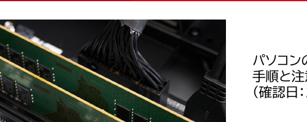

パソコンのメモリ増設方法をわかりやすく解説！手順と注意点・ポイントも-CFD販売 (確認日：2026/05/18) リンク

<!--
- 確認問題2a、メモリスロット。VLSIは超大規模集積回路。素子を数千個以上集積した半導体チップで、CPUやメモリの総称です。
- USBはUniversal Serial Bus。プラグアンドプレイ、ホットプラグ、バスパワーといった特徴があります。いまやUSB-Cが便利ですね。
-->

---

問題の復習

# 確認問題2a

<b>SSD：　　　Solid State Drive</b> 
補助記憶装置、1TBなど。データを保存し、電源切っても残る(揮発しない)。 
DRAMほどは速くはない。

<b>DRAM：　Dynamic Random Access Memory</b> 
メインメモリ(主記憶装置)のこと。16GBや64GBとか。とてもとても早い。 
電源切ったら、リセットされる。

<b>フラッシュメモリ：</b> 
主にUSBで接続できる、持ち運び可能なメモリ 
個人情報を入れていたものを落とすと、大変な目に合う 
※クラウド技術で少しずつ減っている

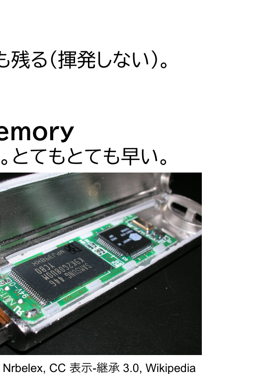

Nrbelex, CC 表示-継承 3.0, Wikipedia

<!--
- SSDはSolid State Drive。補助記憶装置で、電源を切ってもデータが残ります。DRAMほどは速くない。
- DRAMはメインメモリ。とても速いが、電源を切るとリセットされます。
- フラッシュメモリはUSBで持ち運べるメモリ。個人情報を入れたものを落とすと大変なので注意。
-->

---

共通試験…

# 共通試験…

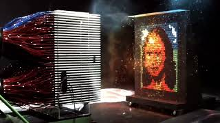

本年度の問題を 時々扱っていきます

<!--
- 共通試験。本年度の問題も時々扱っていきます。
- これは記憶装置の空欄補充問題。主記憶装置と補助記憶装置の速度や用途の違いを問うものですね。
-->

---

問題の復習

# 確認問題2bGPUとCPUの違い

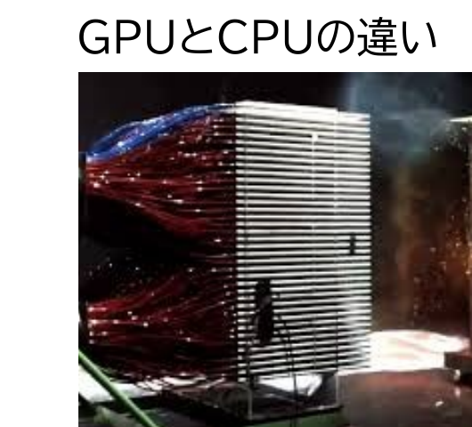

nVidia GPUの説明デモ

<b>CPU （Central Processing Unit：中央処理装置）</b> 
複雑な命令や柔軟な対応ができる万能型だが、「1つずつ順番に処理する（直列処理）」ため、膨大なデータの単純計算には時間がかかる。 
<b>GPU （Graphics Processing Unit：画像処理半導体）</b> 
用途は特化される（複雑な条件分岐は苦手）が、単純な線形代数処理を「数千のコアで並列的に一気に処理」できる。 
<b>cf. TPU （Tensor Processing Unit：テンソル処理装置）</b> 
GPUの並列処理を、さらに「AI（巨大な行列計算）」だけに極限まで特化させた専用半導体。(Googleが開発) 
参考：TPU のアーキテクチャ - Google リンク

<table style="width:100%; border-collapse:collapse; font-size:21px; margin-top:8px;">
<thead><tr style="background:var(--accent); color:#fff;">
<th style="padding:5px 10px;">名前</th><th>得意なこと</th><th>汎用性・役割</th><th>例え</th>
</tr></thead>
<tbody>
<tr><td style="padding:4px 10px; font-weight:800;">CPU</td><td>複雑な命令、条件分岐、<b>直列処理</b></td><td><b>高:</b> コンピュータ全体の頭脳</td><td>何でも屋のエリート</td></tr>
<tr style="background:var(--accent-soft);"><td style="padding:4px 10px; font-weight:800;">GPU</td><td>大量データの同時計算、<b>並列処理</b></td><td><b>中:</b> 画像処理からAIまで幅広く活躍</td><td>行列処理を200人で分担</td></tr>
<tr><td style="padding:4px 10px; font-weight:800;">TPU</td><td>AI特有の行列計算（テンソル演算）</td><td><b>低:</b> AIの機械学習・推論に特化</td><td>AI特化の専用工場</td></tr>
</tbody>
</table>

<!--
- 確認問題2b、GPUとCPUの違い。CPUは万能型だが直列処理。GPUは特化型だが数千のコアで並列処理。
- TPUはGPUの並列処理をAIの行列計算だけに特化させた専用半導体。Googleが開発しました。
- 例えるなら、CPUは何でも屋のエリート、GPUは行列処理を200人で分担、TPUはAI特化の専用工場。
-->

---

問題の復習

# 参考：なんで、そんなに並列したいのさ？

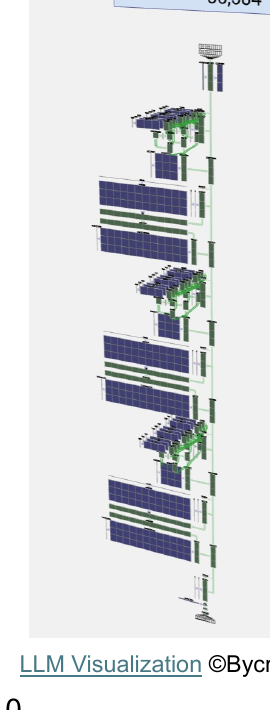

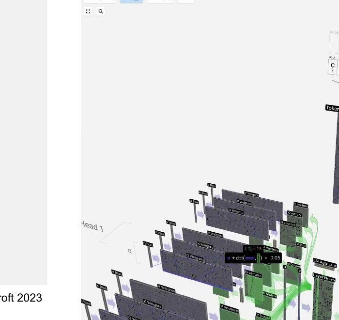

LLM Visualization ©Bycroft 2023

A： AIの中身は 単純だが 巨大な行列計算だから

<!--
- 参考。なんで、そんなに並列したいのか?
- 答えは、AIの中身は単純だが、巨大な行列計算だから。だから並列処理が効くんですね。
- これはLLMの内部を可視化したもの。Bycroftさんの素晴らしい可視化です。
-->

---

問題の復習

# 確認問題2bCPUの中身

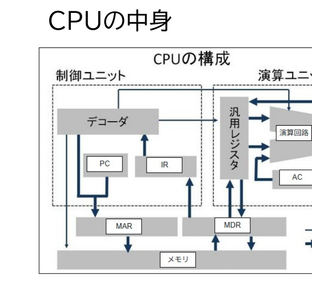

制御・演算・メモリ 重要

<b>レジスタ</b>　CPU内部でデータを一時的に記憶しておく装置

<b>命令レジスタ(IR：Instruction Register)</b>　現在実行している命令自体（データ）を記憶しているレジスタ 
<b>プログラムカウンタ（PC）</b>　次の命令をカウントアップして追うレジスタ 
<b>メモリアドレスレジスタ（MAR）</b>　メモリ内の読み書きしたいアドレスを書き込むレジスタ 
<b>メモリデータレジスタ（MDR）</b>　メモリに書くデータや読んだデータを格納するレジスタ 
<b>アキュムレータ（AC）</b>　演算回路からの出力を累積し入力するレジスタ 
<b>汎用レジスタ</b>　任意の用途に用いられるレジスタ

<b>デコーダ（命令解読器）</b>　IRにある命令を解析し、何をすべきか判断

<b>演算回路（ALU：算術論理演算ユニット）</b>　足し算・引き算などの「算術演算」／AND・ORなどの「論理演算」

<!--
- 確認問題2b、CPUの中身。CPUは制御・演算・メモリで構成されます。
- レジスタはデータを一時記憶。命令レジスタ、プログラムカウンタ、MAR、MDR、アキュムレータ、汎用レジスタがあります。
- デコーダは命令を解析。演算回路ALUは算術演算と論理演算を行います。
-->

---

問題の復習

# 確認問題2bALUの中身

Cburnett, CC 表示-継承 3.0, Wikipedia

<b>A</b>rithmetic（アリスメティック）：<b>算術</b> 
<b>L</b>ogic（ロジック）：<b>論理</b>（AND、OR） 
<b>U</b>nit（ユニット）：<b>装置・回路</b>

<b>A・B（オペランドデータ）　：「5」と「3」という数字</b> 
<b>F（Function：オペレーター）　：「＋」や「－」のボタン</b> 
<b>D（Data status）</b>　計算結果の「状態」。（例：「答えが<b>ゼロになりました</b>」とか「<b>桁あふれしました</b>」という報告） 
<b>R（Result）：</b> 計算の「答え」そのもの。　例：5+3＝<b>「8」</b>

オペランド　：被演算子　3とか5とか／オペレーター：演算子　+とか

4bit CPU (4ビット：0000 〜 1111※0〜15の16通り)なら自作できるそうです　cf. 『CPUの創りかた』 渡波 郁

<!--
- 確認問題2b、ALUの中身。ALUはArithmetic Logic Unit、算術論理演算装置です。
- A・Bはオペランド（5と3）、Fはオペレーター（＋や－）、Dは計算結果の状態、Rは答えそのもの。
- 4bit CPUなら自作できるそうです。『CPUの創りかた』という本が参考になります。
-->

---

補足

# スーパーコンピューターとは？

究極の並列処理システム

何万、何十万もの高性能なCPUやGPUを接続し、<b>一つの巨大なシステムとして結合</b>させた計算機。

気象予測、新薬開発、宇宙シミュレーション、巨大なAIモデルの学習など、極めて複雑で膨大な計算に用いられる。

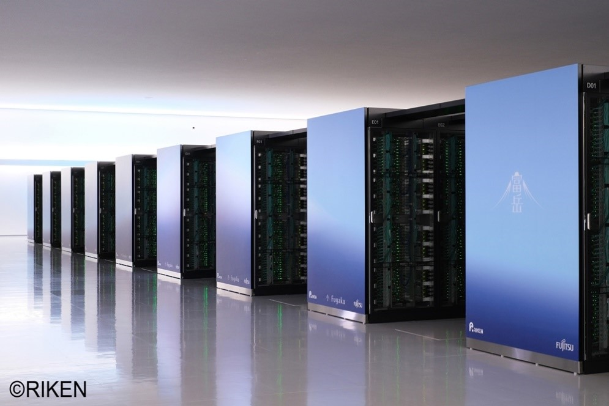

RIKEN/JST 富嶽の写真

スパコンにおける「帯域」の重要性

帯域：通信回線で一度に送受信できるデータ容量のこと。 膨大な数のプロセッサが協力して計算を行うため、計算途中のデータをプロセッサ間で頻繁にやり取りする必要がある。

そのため、個々の計算力以上に、<b style="color:var(--accent-dark)">計算機間を繋ぐ通信帯域幅の太さと通信の遅延の少なさ</b>が重要 cf. MPI (Message Passing Interface) ：連携させ高速な計算を行うための通信規格

2000年頃のスパコンと同じ性能(数十億円)に匹敵する性能が、手元のmac (&lt;20万円)で出る (4.1 TFLOPS )

やがて、量子コンピューターも含む形になるか？

<!--
- スパコンは何万ものCPU/GPUを一つの巨大システムに結合した計算機。気象・新薬・宇宙・AI学習などに使う。
- 個々の計算力以上に、計算機間を繋ぐ通信帯域と遅延の少なさが重要。cf. MPI。
- やがて、量子コンピューターも含む形になるか？ 2000年頃のスパコン級が今や手元のmacで出る。
-->

---

今日の目標

# 今日の目標

<b>1. Linuxを触って、ファイルを移動したり編集したりすることが出来る</b>

ファイルを開いたり、確認することが出来るようになります

Linuxやコマンドラインインターフェイスをつかう利点が分かります

<b>2. AIとプログラムを試作することが出来る</b>

プログラミングの「超」初歩を理解します

AI駆動型開発を理解できます

<b>3. 情報の表現について理解できる</b>

DNAからPCの中身に至るまで、情報量を理解する

※ 第4回分テストは真ん中で行います

私語は禁止ですが、笑う・発言の自由です。楽しくいきましょう。

<!--
- 今日の目標は3つ：①Linuxを触ってファイル操作・CLIの利点、②AIとプログラム試作・AI駆動開発、③情報の表現（DNAからPCまで）。
- 第4回分テストは真ん中で実施。私語は禁止だが、笑う・発言は自由。楽しくいきましょう。
-->

---

小テストの実施

# ワーク①： 周囲とSafe Exam Browserの起動を確認する (5分)

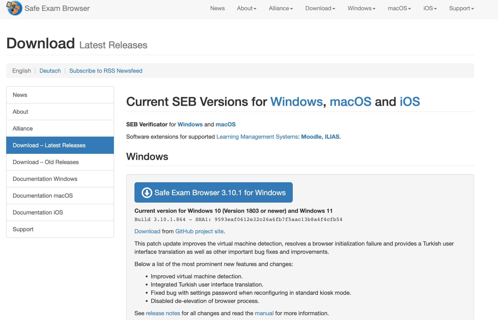

<b>Moodleのログイン必要</b> アルファベット4文字・数字4文字

<b>5分でインストール・ログインして下さい</b> <b>困ったら横に聞く</b>

<b>横の人と起動テストを完了する</b>／無理な場合は<b>教室右(緑)へ移動</b>

<!--
- ワーク①：周囲とSafe Exam Browserの起動を5分で確認する。Moodleのログインが必要（アルファベット4文字・数字4文字）。
- 5分でインストール・ログイン。困ったら横に聞く。横の人と起動テストを完了。無理なら教室右（緑）へ移動。
-->

---

小テストの実施

# 小テストの実施

時間は<b>10分で10問 (+2分 予備)</b> <b>12分たったら、受験が完了します。</b> まず、PCの人に自分が問題を解放します。 次に、紙受験の人に配ります <b>(なので、少しだけ、紙受験の方が短くなります。)</b> ※回収は、配り始めた側から行います。

注意： カンニング・持ち込み・横を覗く・スマホを見る行為などの禁止 不正行為を認定の場合は、それなりの対応がなされます…。

それでは、開始 (xx:xxまで) / 完了後：回収されてない人の確認

<!--
- 10分で10問（+2分予備）、12分で受験完了。まずPCの人に問題を解放、次に紙受験の人に配る（紙の方が少し短い）。回収は配り始めた側から。
- 注意：カンニング・持ち込み・横を覗く・スマホ閲覧などは禁止。不正行為を認定した場合はそれなりの対応。
-->

---

コンピューターの動作原理

# コンピュータの起動の仕組み

<b>• ブートストラップの手順</b>

- BIOS (Basic Input Output System) 起動

※ 周辺機器の検索

- ブートローダ起動

※ 起動OSの選択

- オペレーティングシステムの起動

※ 周辺機器のデバイスドライバの確認

プログラムの起動

<b>• コマンドインタプリタによる起動</b>

- シェル(shell)、コマンドプロンプト

CLI (Command Line Interface)

<b>• マウスで起動</b>

- プログラムのアイコンをクリック

- プログラムに関連付けられたファイルのアイコンをクリック

- 右クリック

GUI (Graphical User Interface)

<!--
- 起動の仕組み：ブートストラップの手順（BIOS起動→周辺機器検索、ブートローダ起動→起動OS選択、OS起動→デバイスドライバ確認）。
- プログラムの起動は2通り。コマンドインタプリタ（シェル/コマンドプロンプト）＝CLI、マウス（アイコンクリック・右クリック）＝GUI。
-->

---

OS/アプリケーション

# ワーク②： 推しOSを語ろう

① 自分の使っている<b>OSの便利な点を横の人</b>と話す (2分)

　→特に、なんでそれを選んだのかに言及

② 手元に箇条書きでメモる (1分)

③ slidoでWindows/Mac/その他で共有する (各30s)

<!--
- ワーク②：推しOSを語ろう。①自分の使っているOSの便利な点を横の人と話す（2分、なぜ選んだかに言及）、②手元に箇条書きでメモる（1分）、③slidoでWindows/Mac/その他で共有（各30秒）。
-->

---

OS/アプリケーション

# 主要なOS

Microsoft Windows

<ul>
<li>PCのOSのデファクトスタンダード</li>
<li>圧倒的なシェアを持つ</li>
<li>ハードウェアは各メーカが製造する</li>
<li>クライアント用(Windows 10, 11)のほかに、サーバ用やモバイル用も展開</li>
</ul>

Windows 10は2025年10月 サポート終了 現在、Windows 11

macOS

<ul>
<li>Apple社が開発・販売するMacintoshコンピュータ用のOS</li>
<li>UNIXに関連した技術をベースにしている</li>
<li>旧来のMac OSに比べて安定している</li>
<li>直感的に操作できるGUIには定評がある</li>
</ul>

自分は両方使っているが、どっちもどっちである／クラウド技術の進展もあり、「片方しかできない」は減少 但し、AIの推論は、<b>macOSの方が、コスト的に有利</b>　<b>学習でnvidia GPU使うなら、Linux or windows</b>　cf. LLM/音声認識をローカルで動かす

cf. iOSやアンドロイドOSもOSですね。端末数としてはそっちの方が多い。なお、GIGAスクールのOSは、Chrome OSが多いらしい。

<!--
- 主要なOS。Microsoft Windows＝PCのデファクトスタンダード、圧倒的シェア、各メーカが製造、Win10は2025年10月サポート終了で現在Win11。
- macOS＝Apple製、UNIX系技術ベース、安定、GUIに定評。両方使ってどっちもどっち。AI推論はmacOSが有利、学習でnvidia GPU使うならLinux/Windows。
- iOS/AndroidもOS。GIGAスクールはChrome OSが多い。
-->

---

OS/アプリケーション

# OSは「舞台」であり、 アプリは「役者」である。

OSという共通の土台があってこそ、アプリは個別の目的を果たせる

重要

OS(Operating System)

　コンピューターを動作させるための基本のソフトウェア群

　　※アプリ (Application)は、OS上で動く、「応用ソフトウェア」のこと

カーネル

　CPUやメモリの管理(、ファイルシステム)といった中核を担うソフトウェア

<!--
- OSは「舞台」、アプリは「役者」。OSという共通の土台があってこそアプリは個別の目的を果たせる。
- OS(Operating System)＝コンピューターを動作させる基本のソフトウェア群。アプリはOS上で動く応用ソフトウェア。
- カーネル＝CPUやメモリの管理（ファイルシステム）といった中核を担うソフトウェア。
-->

---

OS/アプリケーション

# OSとアプリケーション

アプリケーション

アプリ

OS

ハード

さらなる学習のために： 仮想化やDocker

<table style="width:100%; border-collapse:collapse; font-size:22px;">
<tr style="background:var(--section-bg);">
<th style="text-align:left; padding:8px 14px; border:1px solid #e0e0e0;">比較項目</th>
<th style="text-align:left; padding:8px 14px; border:1px solid #e0e0e0;">OS (オペレーティングシステム)</th>
<th style="text-align:left; padding:8px 14px; border:1px solid #e0e0e0;">アプリケーション (応用ソフト)</th>
</tr>
<tr>
<td style="padding:8px 14px; border:1px solid #e0e0e0; font-weight:700;">主な役割</td>
<td style="padding:8px 14px; border:1px solid #e0e0e0;">資源（ハード・ソフト）の管理・制御</td>
<td style="padding:8px 14px; border:1px solid #e0e0e0;">特定のユーザー目的の遂行</td>
</tr>
<tr style="background:#fafafa;">
<td style="padding:8px 14px; border:1px solid #e0e0e0; font-weight:700;">立場</td>
<td style="padding:8px 14px; border:1px solid #e0e0e0;">「土台」「舞台」</td>
<td style="padding:8px 14px; border:1px solid #e0e0e0;">「道具」「役者」</td>
</tr>
<tr>
<td style="padding:8px 14px; border:1px solid #e0e0e0; font-weight:700;">具体例</td>
<td style="padding:8px 14px; border:1px solid #e0e0e0;">Windows, Android, macOS, Linux</td>
<td style="padding:8px 14px; border:1px solid #e0e0e0;">Chrome, Word, LINE, Instagram</td>
</tr>
<tr style="background:#fafafa;">
<td style="padding:8px 14px; border:1px solid #e0e0e0; font-weight:700;">動作条件</td>
<td style="padding:8px 14px; border:1px solid #e0e0e0;">単体で基本動作が可能</td>
<td style="padding:8px 14px; border:1px solid #e0e0e0;">OSがないと動作できない</td>
</tr>
</table>

<!--
- ハード→OS→アプリケーションの層構造。さらなる学習のために：仮想化やDocker。
- OSとアプリの比較表：主な役割（資源管理 vs ユーザー目的）、立場（土台・舞台 vs 道具・役者）、具体例、動作条件（単体動作可 vs OSがないと動かない）。
-->

---

OSが行っていること

# OSが行っていること

①プログラムの管理や通信 (複数のプログラムが同時に動作する)

②ハードウェアの抽象化 (周辺機器が同じ手順で操作できる)

③UI/メモリ管理

メモリの保護

各アプリにメモリ領域を割り当てます。他アプリの領域への侵入を防ぎ、システムの安定性を保ちます。

共通UIの提供

ウィンドウ、メニュー、ボタンなどの操作感を統一。どのアプリでも迷わず操作できる環境を作ります。

ファイル管理

データの保存場所やアクセス権限を管理。情報の安全性と整理を自動的に行います。

<!--
- OSが行っていること：①プログラムの管理や通信（複数プログラムが同時動作）、②ハードウェアの抽象化（周辺機器を同じ手順で操作）、③UI/メモリ管理。
- メモリの保護（領域割り当て・侵入防止）、共通UIの提供（操作感の統一）、ファイル管理（保存場所・アクセス権限）。
-->

---

UNIX / Linux

# UNIX系 (unixライクなものも含む)

UNIXの開発と歴史

<ul>
<li><b>1969年</b>、AT&amp;Tのベル研究所にて開発開始</li>
<li>プログラミング言語Cとの関連が深い</li>
<li>派生する系列がある</li>
<li>カリフォルニア大学バークレー校をオリジナルとするBSD系 (macの源流)</li>
<li>UNIX System V等の伝統的なUNIX</li>
</ul>

Linux と UNIXライク OS

<ul style="font-size:21px;">
<li>Linux (Ubuntu等) はUNIXライクなOSの一つ</li>
<li>1991年、学生だったライナス・トパーズがカーネルを開発</li>
<li>フリーでオープンソースなソフトウェア</li>
<li>Linuxカーネルと複数のディストリビューション</li>
<li>サーバーでNo.1 / あらゆる用途に利用されている サーバ、メインフレーム、スーパーコンピュータ／組み込みシステム／スマートフォン、デスクトップ・パソコン</li>
</ul>

Windowsでは、WSLで<b>ubuntu</b>が動く (教育用端末は両方動く)　macはもともと<b>UNIX</b>である

多くのひとが、<b style="color:var(--accent-dark)">CLI</b>でUNIXかLinuxを叩くことになるはず

<!--
- UNIX系。1969年AT&Tベル研究所で開発開始、C言語と関連が深い、派生系列あり（BSD系＝macの源流、System V）。
- Linux（Ubuntu等）はUNIXライクOSの一つ。1991年ライナス・トパーズがカーネル開発、フリー/オープンソース、サーバーでNo.1。
- WindowsはWSLでubuntuが動く、macはもともとUNIX。多くの人がCLIでUNIX/Linuxを叩くことになるはず。
-->

---

UNIX / Linux

# CLIってなんや？

GUI ： Graphical user interface

<b>マウスを用いて、UIを叩く</b> 何をしているか、簡単に分かる

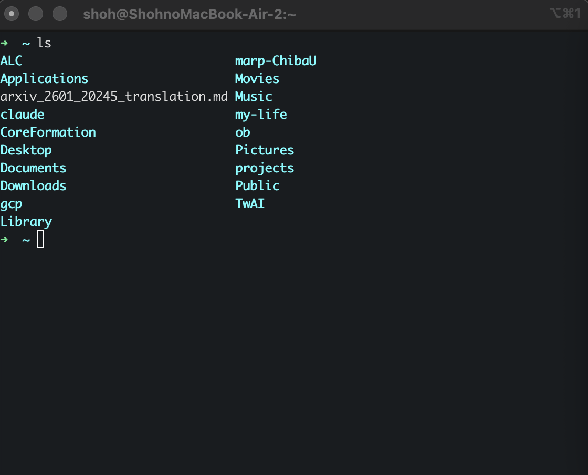

CLI： Command line interface

いわゆる黒い画面をキーボードで叩く 比較的簡単だが、初心者には大変

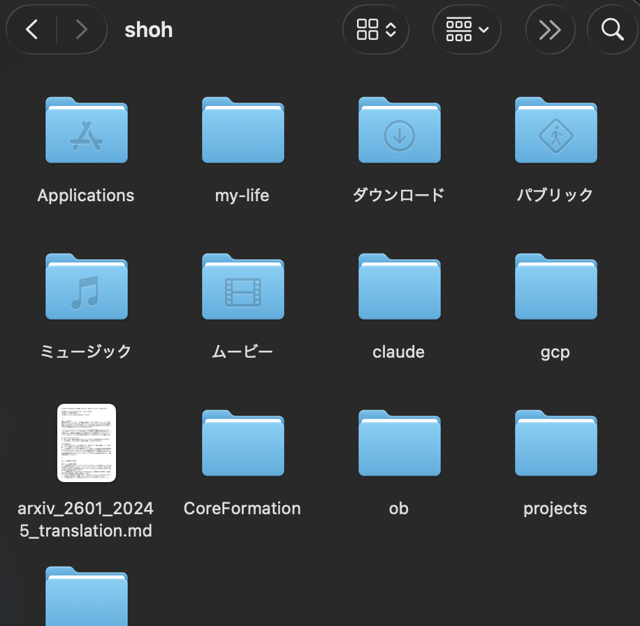

わかりにくい？→いいえ、<b>生成AIや自動化に向いている</b>

<!--
- CLIってなんや？ GUI＝Graphical user interface、マウスでUIを叩く、何をしているか簡単に分かる（Finderの画面）。
- CLI＝Command line interface、いわゆる黒い画面をキーボードで叩く、比較的簡単だが初心者には大変（ターミナルの画面）。
- わかりにくい？→いいえ、生成AIや自動化に向いている。
-->

---

UNIX / Linux

# Linux (UNIX)を叩いてみるワーク(10分)

Colabを<u>開く</u> → ドライブに複製

<b>【現在地と一覧】 pwd</b>：今いる場所（ディレクトリ）を表示　<b>cd</b>：別のフォルダに移動　<b>ls</b>：フォルダの中身（ファイル一覧）を表示

<b>【ファイル・フォルダの操作】 mkdir</b>：新しいフォルダを作成　<b>cp</b>：ファイルをコピー　<b>mv</b>：ファイルの移動・名前の変更　<b>rm</b>：ファイルやフォルダを削除（お片付け）

<b>【ファイルの中身を見る・探す】 echo</b>：文字を出力（ファイルへの書き込みにも使用）　<b>cat</b>：ファイルの中身をすべて表示　head：先頭数行　tail：末尾数行　<b>grep</b>：単語を含む行を検索　wc：行数・文字数をカウント

<b>【Webとの通信】</b> wget：Webからダウンロード　curl：URL指定で取得・通信　<b>【システム確認（おまけ）】</b> uname：OS情報　whoami：ユーザー名　date：日時を表示

<b>横の人と話しながらしましょう</b> / 新規の記入は不要です / ポチポチでOK PCがない人はある人の近くに大移動し、<b>複数人で一緒に</b>進めましょう

ヒント<b>：左パネルでフォルダは見れる</b> 少し遅れて反応する

<b>情報リテラシの後の学び方</b> sudoやchmod、vim、キー操作は重要 シェルスクリプトも身につけましょう

※ <b style="color:var(--accent)">太字の箇所</b>が重要

<!--
- Colabを開いてドライブに複製したら、横の人と話しながら基本コマンドを叩いてみるワーク。新規記入は不要、ポチポチでOK。PCがない人は近くに移動して複数人で。
-->

---

UNIX / Linux

# CLIは、生成AIで叩ける（相性が良い：デモ）

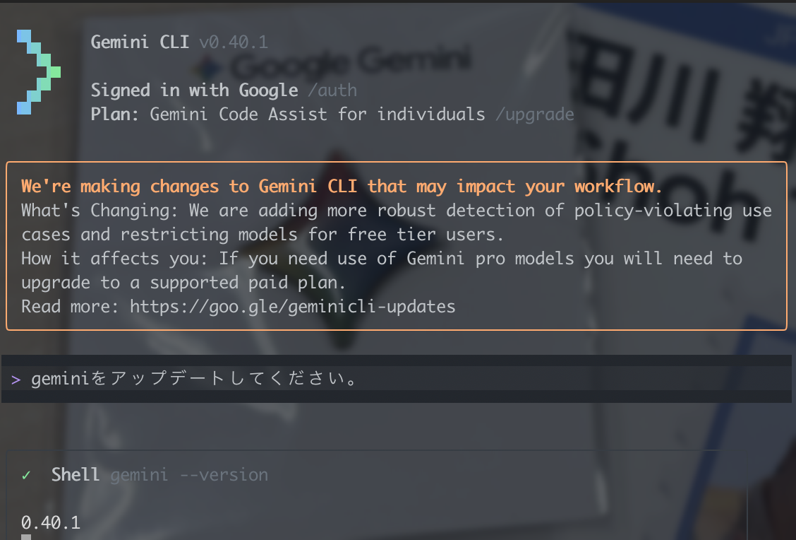
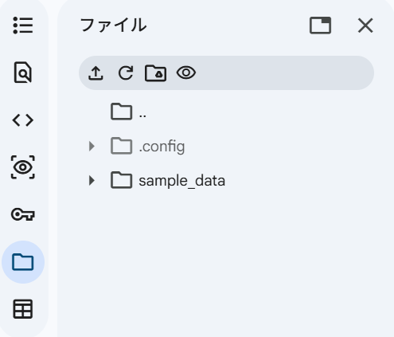

<b>わからなくても、AIがコマンドを叩いてくれる</b> 
<b>PCの全ての操作がAIに自然言語で頼めば出来る状態に</b> 
（例：古いファイルをまとめて／サーバーにコピーして／このpdfをまとめてtextにして）

<!--
- CLIは生成AIと相性が良い。わからなくてもAIがコマンドを叩いてくれるので、PCの全操作を自然言語で頼める状態になる。デモを見せる。
-->

---

プログラミング

# プログラミング言語の進化と言語処理系

プログラミング言語の誕生とその変遷

変遷

<b>機械語</b>　二進数の命令　人間にとって理解しづらい

<b>アセンブリ言語</b>　CPUのアーキテクチャに依存する

<b>高級言語</b>　<b>手続き型言語:</b> Fortran, C++, Rust等　<b>関数型言語:</b> Lisp　論理型言語　DB言語：SQL　静的型付け言語：Typescript等

最近では<b>Python（インタプリタ）</b>の普及率が上がっている（フロント・サーバー・データ解析など多岐）

言語処理系

<b>コンパイラ：</b>事前にすべてのプログラムを機械語に変換する（コンパイル）

<b>インタプリタ：</b>高級言語の命令を一語一語機械語の命令に変換しながら実行する

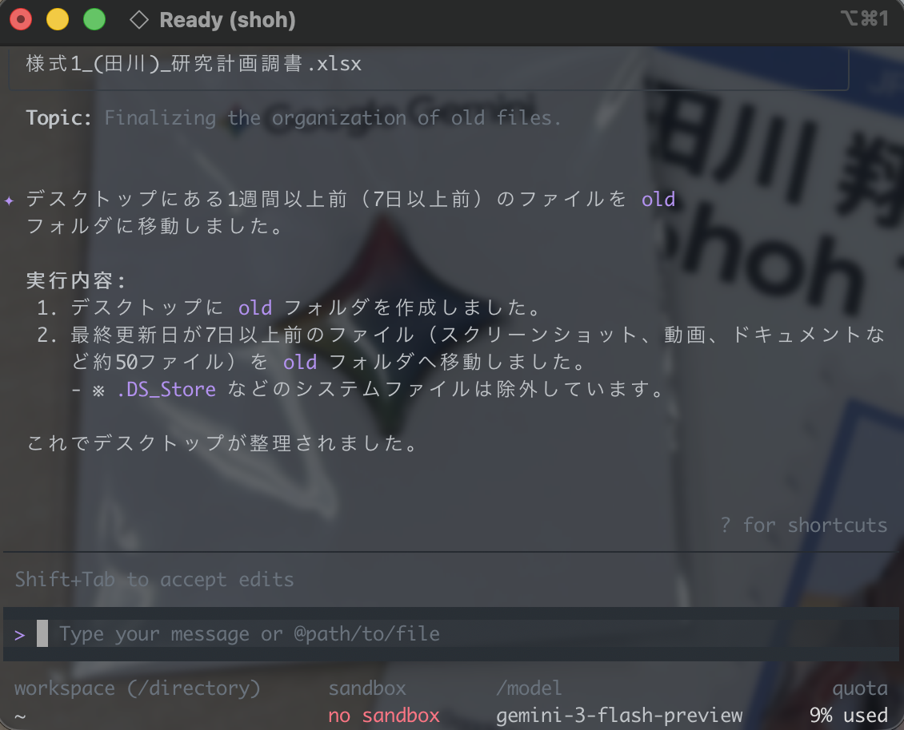

<!--
- プログラミング言語は機械語→アセンブリ→高級言語と進化。最近はPython（インタプリタ）が普及。言語処理系にはコンパイラとインタプリタがある。
-->

---

プログラミング

# ワーク③： ハノイの塔を自動で動かすアプリをAIで作る(8分)

①Geminiを立ち上げる　②Canvasをオン、Proモード　③貼り付けて実行

GeminiのCanvas機能を使用して、以下の要件を満たす「ハノイの塔 自動シミュレーター」のWebアプリを作成してください。コードはHTML, CSS, JavaScriptを統合した1つのファイル（hanoi.html）として出力し、Canvas上で直接プレビューおよび動作できるようにしてください。

<b>【要件定義】</b> 
<b>1. アプリケーションの目的</b>　ユーザー（主に学生）が「再帰アルゴリズム」の動作を視覚的に観察し、直感的に理解できる教育用のシミュレーター。 
<b>2. 機能要件</b> 
<b>・輪っかの枚数変更:</b> 1枚から最大5枚まで、ユーザーが任意の枚数に入力できるようにする。変更時は自動で初期状態にリセットする。 
<b>・操作コントロール:</b>　<b>「▶ 再生」ボタン:</b> 再帰アルゴリズムを用いて自動的に解く手順の再生を開始する。<b>「⏸ 一時停止」ボタン:</b> 再生中にアニメーションの動きを一時停止し、再度「再生」で続きから動かせるようにする。<b>「🔄 リセット」ボタン:</b> パズルを初期状態に戻す。 
<b>・再生スピードの調整:</b> スライダー（レンジ入力）を実装し、ユーザーがアニメーションの速度をリアルタイムに調整（低速〜高速）できるようにすること。 
<b>・移動回数のカウント:</b> 現在何手目の移動を行っているかを「移動回数: 現在の回数 / 最短移動回数」の形式でリアルタイムに表示すること。 
<b>3. アニメーションと描画（最重要）</b> 
・描画にはHTML5の <code>&lt;canvas&gt;</code> 要素を使用すること。 
・輪っかの移動は瞬間移動ではなく、<b>柱を越えるようにアーチ状の軌道を描いて滑らかにスライド移動</b>するアニメーションを実装すること。 
・輪っかのサイズに応じて色（HSL等）を変え、視覚的に区別しやすく美しい見た目にすること。

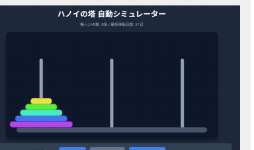

<!--
- ワーク③。Geminiを立ち上げ、CanvasをオンにしてProモードで、ハノイの塔の自動シミュレーターを作るプロンプトを貼り付けて実行。再帰アルゴリズムを視覚的に観察できる教育用アプリ。
-->

---

プログラミング

# Pythonで書かせてみる

先ほどのアプリを、Google Colabでやってみたいので、出来る限りシンプルにPythonで出力して下さい。プレートが3枚の場合に、コマ送りで手順を見せる絵を出力する形式として下さい。

出力されたPythonのコードを理解したいので、変数、配列、制御構造（条件分岐・繰り返し）を解説して下さい。

<b>プログラミングは、結局以下の3つである</b>（1入力・1出力→構造化定理）

順次（Sequence）： 処理を上から順番に実行する。

選択（Selection / 分岐）： 条件によって処理を分ける（if-else など）。

反復（Iteration）： 条件を満たす間、処理を繰り返す（while や for など）。

<b>大体、教科書を見ると書かれているのはこういう感じ</b>　入出力、演算子、変数/データ型/コンテナ、関数、オブジェクト、モジュール、クラス

他の自然言語を学ぶよりは、簡単そうですね。

<!--
- 先ほどのアプリをColab用にシンプルなPythonで出力させ、コードを解説させる。プログラミングは結局、順次・選択・反復の3つ（構造化定理）。
-->

---

プログラミングの学び方

# 私見

① 生成AIのプログラミング能力は、今後も向上するだろう。

② その分、非ITエンジニアでも、コードに触れることが当たり前になるだろう。

③ そのため、読める・日本語で何を創りたいか言える、までは必須だろう。 それを学ぶためには、ある程度書けないと、着想できないだろう。

<b>よって、プログラミングを学ぶことは今後もある程度、必要だろう。</b>

現在、一部の人々は「AIが自動化してくれるから」という理由で、プログラミングを学ぶのをやめるよう周囲に勧めています。しかし、このアドバイスは、<b>これまでに与えられたキャリアアドバイスの中で最悪のものの一つ</b>として歴史に記憶されることになるでしょう。

https://x.com/AndrewYNg/status/1900219116822102116

<b>よい学び方</b>がある人は、クラスに共有してください。(slido)　/　<b>Pythonの基礎</b>は、例えば、<u>ここ</u>参照

<!--
- 私見。生成AIのコーディング能力は向上し、非ITエンジニアもコードに触れるのが当たり前に。読める・日本語で何を創りたいか言えるまでは必須。だからプログラミングを学ぶことは今後も必要。Andrew Ng「学ぶのをやめろは最悪のキャリアアドバイスの一つ」。
-->

---

符号化の原理

# 情報は、符号にする事ができる

<b>符号表の例</b>　2ビット (bit, b) による表現
<table style="font-size:22px; margin-top:6px; border-collapse:collapse;">
<tr><td style="padding:1px 14px;">A： 00</td><td style="padding:1px 14px;">T： 01</td></tr>
<tr><td style="padding:1px 14px;">G： 10</td><td style="padding:1px 14px;">C： 11</td></tr>
</table>

<b>定義　ビット：</b>情報の量を表現する最小単位 
　情報は、ビットパターンで表現される 
　二進数の1桁のことで、binary digit由来 
<b>バイト：</b>8bitの塊 (2^8 = 256通り)

<b style="color:var(--accent-dark)">nビットのビット列は 2ⁿ 種類</b> 
n &nbsp;: 1&nbsp; 2&nbsp; 3&nbsp; 4&nbsp;&nbsp; 5&nbsp;&nbsp; 6&nbsp; 7&nbsp;&nbsp; 8 2ⁿ : 2&nbsp; 4&nbsp; 8&nbsp; 16&nbsp; 32&nbsp; 64 128 256

・20個のアミノ酸を符号化するのに必要なビット数は？→ <b>5ビット (32パターンで良いが、4³→64)</b> 
・26種類のアルファベットを符号化するのに必要なビット数は？ → <b>5ビット</b> 
・大文字小文字合わせて52文字を符号化するのに必要なビット数は？ → <b>6ビット</b>

自然数の2進数による表現
1:1(0001) 2:10(0010) 3:11(0011) 4:100(0100) 5:101(0101) 6:110(0110) 7:111(0111) 8:1000(1000) 9:1001(1001)

<!--
- 情報は符号にできる。2ビットでA/T/G/Cの4種を表現。nビットのビット列は2ⁿ種類。ビットは情報量の最小単位、8bitの塊がバイト。アミノ酸20個なら5ビット、アルファベット26種なら5ビット、大小52文字なら6ビット。
-->

---

二進数を理解する

# 自然数の表現（2進数と10進数）

自然数の10進数による表現

10を基数とした表現： 
<b>123 = 1×10² + 2×10¹ + 3×10⁰</b> 
例： 
<b>32₁₀ = 3×10¹ + 2×10⁰ = 100000₂</b> 
<b>10₁₀ = 1×2³ + 0×2² + 1×2¹ + 0×2⁰ = 1010₂</b>

サイズの大きな情報量

2進数1桁 = <b>1ビット</b> | 8ビット = <b>1バイト</b> 
2¹⁰ = 1024 ≒ 1,000　→　2¹⁰ = 1 K（キロ）B 
2²⁰ = (2¹⁰)² ≒ 1 M（メガ）B 
2³⁰ = (2¹⁰)³ ≒ 1 G（ギガ）B 
2⁴⁰ = (2¹⁰)⁴ ≒ 1 T（テラ）B

10進数から2進数への変換　（32₁₀ → 32を10進数で表した数）

a = aₙ×2ⁿ + … + a₂×2² + a₁×2¹ + a₀×2⁰ 
a = 2 ×(aₙ×2ⁿ⁻¹ + … + a₁) + a₀ 
<b>20₁₀ = 10100₂</b>

出てきた余りを<b>下から上に向かって</b>（最後に出た余りから一番最初の余りへ）並べます。「<b>10100</b>」になります。 
「2で割った余りを求めれば、そのまま2進数の一番下の桁 a₀ になる」ということ。あとは繰り返す。

檜垣先生スライドより

<!--
- 10進数は10を基数とした表現。2進数への変換は、2で割った余りを下から上へ並べる。情報量の単位は1024≒1000でK/M/G/T。檜垣先生スライドより。
-->

---

二進数を理解する

# 自然数と二進数の計算・変換

ビット列による表現の広がり

8ビット(1バイト)の表現範囲: 
<b>0 〜 255 (2⁸種類)</b> 
16ビット(2バイト)の表現範囲: 
<b>0 〜 65,535 (2¹⁶種類)</b>

2進数の加算とオーバーフロー

<b>あふれ (オーバーフロー)</b>: 計算結果が用意された桁数（この場合は8ビット）を超えてしまう現象。最上位桁からの繰り上がりが発生した際に起こる。 
100₁₀ + 200₁₀ の計算では、結果が300₁₀となり、8ビットの最大値255を超えるため正しく表現できない。

10進数と2進数の対応（16進数）

<b>2進数の省略記法</b> 
<b>10進数:</b> 57130 
<b>2進数:</b> 1101111100101010 
<b>16進数:</b> DF2A

<!--
- 8ビットは0〜255、16ビットは0〜65535。加算でオーバーフロー（あふれ）が起こる：100+200=300は8ビットの255を超え表現できない。長い2進数は16進数で省略記法。
-->

---

符号付整数表現

# 符号付整数表現

絶対値表現

<b>00010100 → +20</b> 
<b>10010100 → -20</b> 
<b>最上位ビットが符号（0:+, 1:-）を表す</b>  
符号ビット（MSB）を反転させることで負数を表現する方式です。直感的ですが、0の表現が2つ存在（+0と-0）する課題があります。

2の補数表現

<b>変換手順：</b>　ビットを反転させる　→　「1」を加算する 
<b>+20: 00010100</b> 
<b>-20: 11101100</b> 
<b>加算器で減算が可能になる（効率化）</b> 
現在のコンピュータで最も一般的な表現です。あふれを無視することで、減算を加算として処理できる大きなメリットがあります。

a - b = a + (-b)　減算を加算器のみで実行可能 
　00011110 (30)　＋ 11101100 (-20)　= 100001010　あふれを無視 → 00001010₂ = 10₁₀

※1の補数表現なども別にあります。　<b style="color:var(--accent-dark)">現在のコンピューターでは、2の補数が使われています</b>

<!--
- 符号付整数表現には絶対値表現（MSBが符号、0が±2つで非効率）と2の補数表現がある。2の補数はビット反転＋1で、減算を加算器のみで実行でき効率的。現在最も一般的。
-->

---

Google NotebookLM

# 学びやすい形に情報を変換

絵1枚で要約

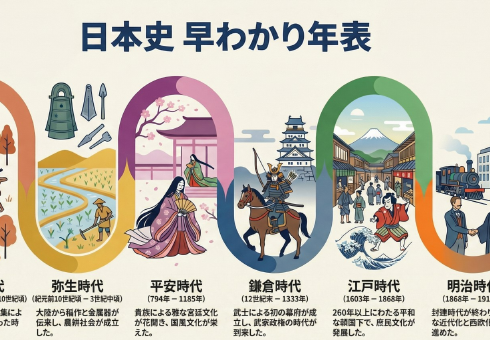

スライド作成

クイズで時間確認

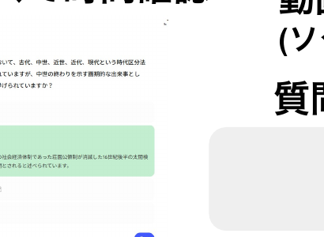

動画・podキャスト

(ソクラテスメソッド) <b>質問・応答</b>

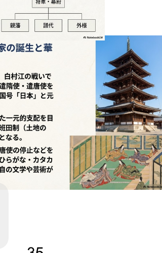

<b>学びやすい形に情報を変換</b>

<!--
- Google NotebookLMは、情報を学びやすい形に変換する道具。絵1枚で要約、スライド作成、クイズで時間確認、動画・podキャスト（ソクラテスメソッドの質問・応答）など。
-->

---

学び方

# 学び方

<b>学習方略</b> - Dunlosky et al. (2013) <i>PSPI</i>　教育心理学による、「生徒がどう勉強すべきか」のレビュー論文

<table style="width:100%; font-size:18px; border-collapse:collapse; margin-top:8px;">
<thead>
<tr style="background:var(--accent); color:#fff;">
<th style="padding:4px 8px; text-align:left;">テクニック</th>
<th style="padding:4px 8px; text-align:left;">内容・方法</th>
<th style="padding:4px 8px;">効果</th>
<th style="padding:4px 8px; text-align:left;">主な理由</th>
</tr>
</thead>
<tbody>
<tr style="background:#FBE4EA;"><td style="padding:3px 8px;"><b>実力テスト</b></td><td style="padding:3px 8px;">フラッシュカードや練習問題などを使い、自分の記憶から情報を引き出すテストを行う。</td><td style="padding:3px 8px; text-align:center; color:var(--accent); font-weight:800;">高</td><td style="padding:3px 8px;">学習効果が高く、幅広い教材・年齢層に有効。フィードバックがあると効果的。</td></tr>
<tr style="background:#FBE4EA;"><td style="padding:3px 8px;"><b>分散学習</b></td><td style="padding:3px 8px;">一気に学習せず、学習スケジュールを分散させる。</td><td style="padding:3px 8px; text-align:center; color:var(--accent); font-weight:800;">高</td><td style="padding:3px 8px;">長期的な記憶保持に有効。一夜漬けよりも遥かに効率が良い。</td></tr>
<tr><td style="padding:3px 8px;">精緻化的質問</td><td style="padding:3px 8px;">「なぜその事実が成り立つのか？」という質問を自分に投げかけ、説明を考える。</td><td style="padding:3px 8px; text-align:center;">中</td><td style="padding:3px 8px;">事実の学習に有効だが、ある程度の予備知識が必要。</td></tr>
<tr><td style="padding:3px 8px;">自己説明</td><td style="padding:3px 8px;">学習のプロセスや、新しい情報が既知の情報とどう関連するかを自分自身に説明する。</td><td style="padding:3px 8px; text-align:center;">中</td><td style="padding:3px 8px;">数学や論理的思考を要する問題解決に有効だが、時間がかかる。</td></tr>
<tr><td style="padding:3px 8px;">交互練習</td><td style="padding:3px 8px;">1つの種類の問題をまとめて解くのではなく、異なる種類の問題を混ぜて練習する。</td><td style="padding:3px 8px; text-align:center;">中</td><td style="padding:3px 8px;">数学などで劇的な効果がある（区別がつかなくなるのを防ぐ）。※全教科での効果は未検証。</td></tr>
<tr style="color:#777;"><td style="padding:3px 8px;">要約</td><td style="padding:3px 8px;">学習したテキストの要点をまとめ短い文章にする。</td><td style="padding:3px 8px; text-align:center;">低</td><td style="padding:3px 8px;">時間がかかるわりに、要約スキルの形成を除き効果が薄い。</td></tr>
<tr style="color:#777;"><td style="padding:3px 8px;">ハイライト</td><td style="padding:3px 8px;">重要な部分に線を引いたり、色を塗ったりする。</td><td style="padding:3px 8px; text-align:center;">低</td><td style="padding:3px 8px;">読むだけより効果が薄くなりがちで、推論能力を阻害しうる。</td></tr>
<tr style="color:#777;"><td style="padding:3px 8px;">キーワード法</td><td style="padding:3px 8px;">発音が似たキーワードにイメージを結びつける。</td><td style="padding:3px 8px; text-align:center;">低</td><td style="padding:3px 8px;">適用できる教材が限られ（語呂合わせなど）、長期記憶しにくい。</td></tr>
<tr style="color:#777;"><td style="padding:3px 8px;">テキストのイメージ化</td><td style="padding:3px 8px;">読んでいる内容を頭の中で映像化する。</td><td style="padding:3px 8px; text-align:center;">低</td><td style="padding:3px 8px;">視覚化しやすい教材に限られ、効果が一貫しない。</td></tr>
<tr style="color:#777;"><td style="padding:3px 8px;">再読</td><td style="padding:3px 8px;">テキストやノートを繰り返し読む。</td><td style="padding:3px 8px; text-align:center;">低</td><td style="padding:3px 8px;">最も一般的だが、時間対効果が低く、深い理解につながらない。</td></tr>
</tbody>
</table>

※個人差はあります。

再読やハイライト、写し直すなど、準備コストの低いが効果も低い、方略を選びがち　<b>一方で、学習効果の高い方法は、準備コストが高い一方、一人では難しい</b>

<!--
- 学習方略のレビュー論文 Dunlosky et al. (2013) PSPI。実力テスト・分散学習は効果「高」。要約・ハイライト・再読は効果「低」。人は準備コストが低く効果も低い方略を選びがち。効果の高い方法は準備コストが高く一人では難しい。
-->

---

Google NotebookLM

# コンテキストをもとに、情報を変換・深堀りする道具

コンテキスト

質問

変換

<!--
- Google NotebookLM。アップロードした資料（コンテキスト）をもとに、質問して深堀りしたり、情報を学びやすい形に変換したりできる道具。画面の左がソース（コンテキスト）、中央がチャット（質問）、右がスタジオ（変換）。
-->

---

第5回について

5/26 教室講義 (G3-12で対面実施)となります。 
以下を持参してください。

<b>① PCまたはタブレット、②スマホ、③メモを取るもの</b>

Moodleに今回分の問題もあるので、忘れずに！ 
5/26 - 6/2の間に、第8回のオンデマンド授業が 
1日数動画ずつ、公開されます。

<!--
- 第5回は5/26に教室講義（G3-12）で対面実施。PCまたはタブレット・スマホ・メモを取るものを持参。Moodleに今回分の問題もあるので忘れずに。5/26〜6/2の間に第8回のオンデマンド授業が1日数動画ずつ公開される。
-->
