<!-- _class: cover-hero -->

AI 活用と本学で挑戦したいアイデア

Google for Eduと拓く教育のこれから

伊藤先生打ち合わせ

2026年5月21日 09:00 〜

千葉大学 国際未来教育基幹 田川 翔（Google Certified Innovator JPN26）

<!-- スピーカーノート：Google Innovator 体験談、Google の支援、本学で挑戦したいこと、の3本立てで話す -->

---

<!-- _class: summary -->

本日のテーマ

## 本日お話しする 3 つのこと

### ① 体験談

- Google Innovator になった話　→ Google for Edu Champion プログラムとそのメリット
- 申請・3日間の研修で何を学んだか → "ソリューションではなく、ユーザーのニーズ"、"FAILする"

### ② Google for Eduによる大学支援の全体像
- Google I/O 2026 が示す次の 10 年
- 教育機関向けの取組み ：  教職員認定・大学認定 / Cloud / AI Pro

### ③ 本学で挑戦したいこと
- AIとクラウドを学べるエコシステムの構築
- AI agentによる全学 DXとUX変革

AIリテラシー・Agent設計・Cloud構築の3つの力を学べる環境

<!-- ゴールはを作ること -->

---
<!-- _class: fig wide -->

進行中の科研費

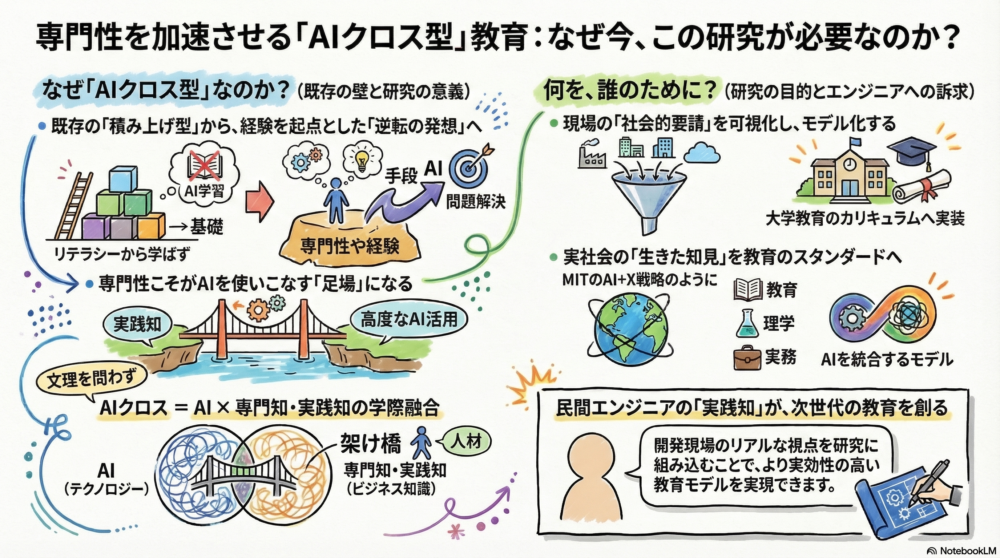

図1. 専門知・実践知 × AI を融合したカリキュラムの実現方法を明らかにする

AI を情報工学として積上げ式に学ぶのではなく、専門性から AI を使いこなし学ぶ

<!-- KAKENHI AI-Cross の研究構想を背景に、本学で挑戦したいことに繋ぐ -->

---
<!-- _class: fig wide -->

翻訳中の本

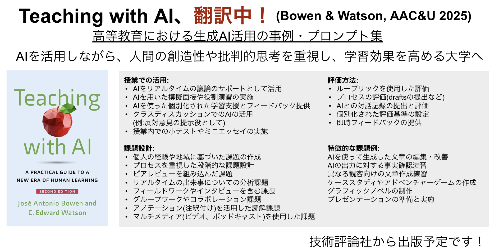

大学AIのFD/SDの担当者として、他校研修を実施中 
<small style="color: black;">
生成AIを活用することで、授業設計の変化やアクティブラーニングは可能か？ 
そもそも、AIをどう教えるのか。AIと人のベストミックスで教えることも可能か？
</small>

---

<!-- _class: split activity-achievement -->

学内の活動実績

## アカデミック・リンクとAIリテラシー教育の実績

### 研修活動と図書館DX

- <strong>体験型 15mins セッション</strong>（学生・教職員対象）
  - 講義・実践・振返りを各15分で行う体験型構成
  - <strong>2025年度の課題と挑戦</strong>：Geminiにチャットで尋ねる以上のことが普及しない状況を打破すべく、実践的活用を体験する機会を設けるミッションを担い、15分構成のセミナーを企画・実施。
  - <strong>実績</strong>：延べ約700名を集客し、受講者の約97%から「役立つ」と高い評価を獲得。
- <strong>図書館業務のDX</strong>
  - 4月より <strong>Google AI Pro</strong> を一部職員に付与
  - 既に <strong>18業務</strong> の自動化を達成

### 担当授業（2026年度 AI教育）

- <strong>情報リテラシー</strong> <small>(1年・前 200名)</small>
- <strong>生成AI活用講座</strong> <small>(混・後 100名)</small>
  - Workspace Studio, Opal, AI StudioでAIリテラシーを学ぶ
- <strong>研究での生成AIの活用法</strong> <small>(院・前 50名)</small>
  - Career Launchpad経由のアサイン
- <strong>Preparing Future Faculty</strong> <small>(院・前 10名)</small>
  - 大学教員を目指す院生向け

  

体験型研修で約700名を集客（満足度97%）、図書館DXや授業でのAIリテラシー教育を先導

---

<!-- _class: divider -->

CHAPTER 1

# GfEのInnovatorになった話

## GoogleのAIとSaaSで世界の教育コミュニティにインパクトを与える

<!-- まず自分の体験から、Innovatorプログラムの中身に踏み込む -->

---

<!-- _class: summary -->

きっかけ

## なぜ Innovator に挑戦したのか

### 出発点の問い

- AI を「使わせる」だけでなく、教員と学生の体験を変えたい
- **教員の採点・FB**という最も時間を奪う業務に切り込みたい
- 学内活動の枠を超えて、教育を変える人と繋がりたい

### 気づき #0

- ICT を教えるレベルでは弱い
- 「AI 時代の医療者をどう育てるか」の問いを一人で抱えるのは限界
- **仲間とフレームワーク**が必要だった

<!-- 個人研究と組織活動の両方が頭打ち感があり、外部コミュニティを探していた -->

---

<!-- _class: supporter -->

学外コミュニティからの強力な応援

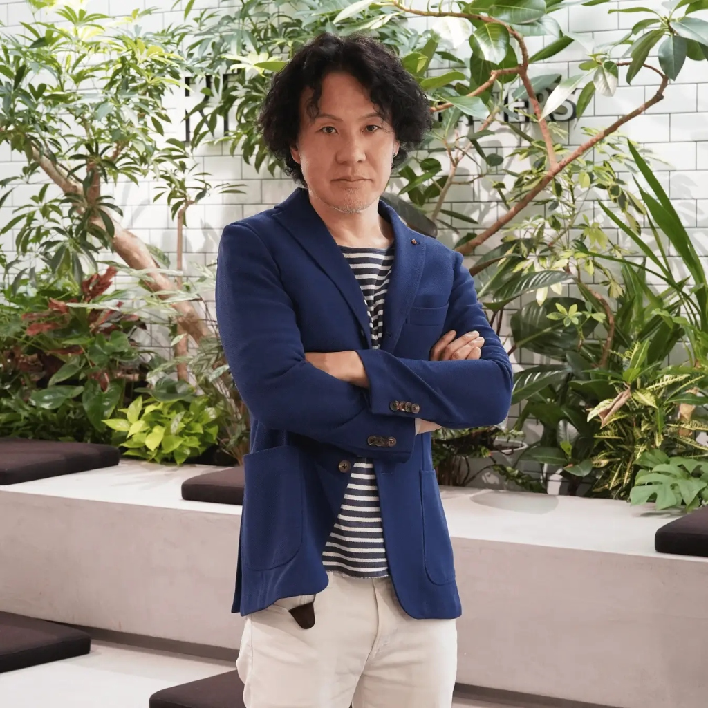

橋口 剛 氏

Google Cloud 元AI本部長

「コミュニティへの所属は重要： 
学内活動の枠を超えて、教育を変える人と繋がりたい」

Google Cloud 元AI本部長の<strong>橋口剛さん</strong>、そしてソフトウェア協会教育担当理事の<strong>原山さん</strong>ら、個人的な研究コミュニティのリーダーたちから強力な応援をいただいています。
  
学内だけに閉じこもるのではない。同じパッションを持って「教育を根本から変えたい」と願う外部のチェンジメーカーと繋がり並走することこそが、本質的なイノベーションへの第一歩です。

<!-- 学外のチェンジメーカーとの繋がりが、イノベーションを起こす最大の推進力になる -->

---

<!-- _class: fig -->

認定の4ステップ

## Google for Education 認定の構造

図1. 認定イノベーター / トレーナー / コーチ / GEG リーダー

個人 → 学校 → 世界へ広がるピラミッド型エコシステム

<!-- L1/L2 は受験者個人、Trainer 以上は人を巻き込む役割 -->

---

<!-- _class: split -->

自分の現在地

## Trainer → Innovator JPN26 認定

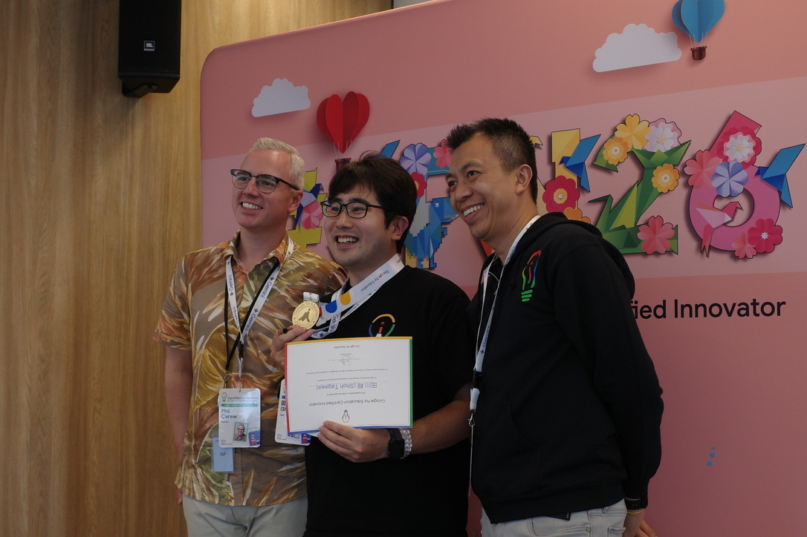

図2. Innovator JPN26 Tokyo 認定式

### 2026 年の歩み

- **3/1**：Certified Trainer 取得
- **5/5-7**：JPN26 Tokyo 認定研修参加
- **以降**：1 年間のプロジェクト走行
- メンター × コホート × Google で並走

Trainer から Innovator へ、約 2 か月で世界の輪に

---

<!-- _class: fig -->

コホート

## JPN26 全コホート集合

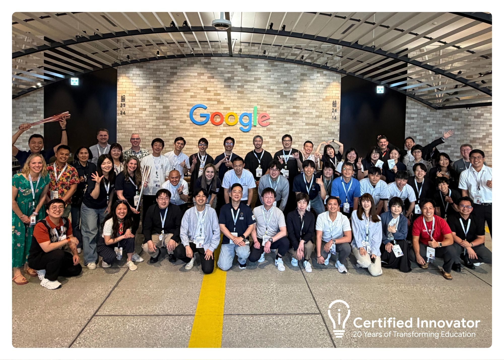

図4. Certified Innovator 20 周年 / JPN26 全員集合

研修後も Slack で 1 年間並走する仲間になる

<!-- 国内+海外メンバーが混ざる。多様性が思考を広げる -->

---

<!-- _class: fig -->

Innovator 3 原則

## Focus on user / Think 10x / Prototype

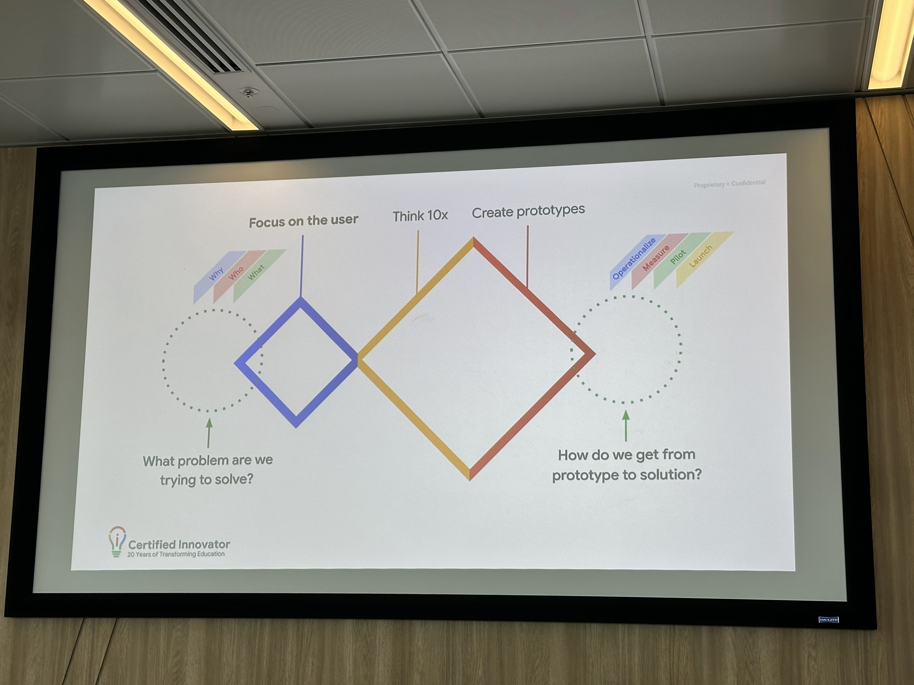

図. Why/Who/What → 3 つの原則 → Operationalize/Measure/Pilot/Launch

解より問い、改善より変革、議論より試作

<!-- 研修全体がこの3原則で貫かれている。 -->

---

<!-- _class: split -->

研修の構造

## 3日間×デザイン思考の流れ

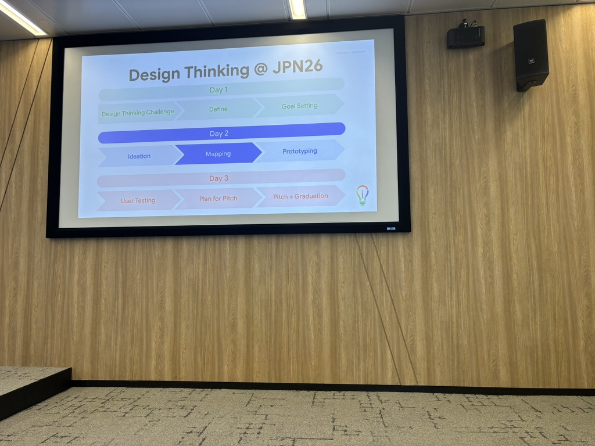

図5. Day1=Define / Day2=Ideation / Day3=Pitch

### 設計思想

- **Day 1 まるごと "Define"**
- **Ideation は Day 2 から**
- Day 3 で User Testing → Pitch
- 解より痛みを先に研ぐ

ソリューションではなく、ニーズから始まる

---

<!-- _class: split -->

Day 2 の中身

## Google エンジニアと双方向の場

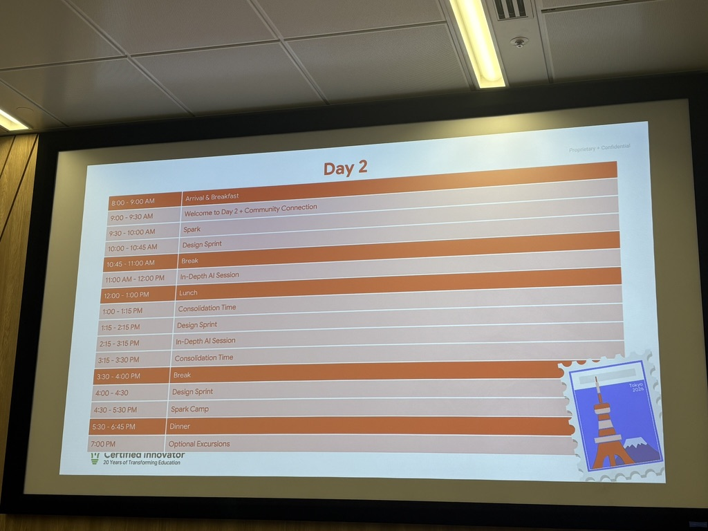

図6. Design Sprint × 3 + In-Depth AI Session × 2

### 製品共創パートナーの立場

- Gemini の仕様・制約を中の人から聞ける
- 現場の声を**製品に直接届ける**ルート
- 単なる利用者ではなく**共創者**
- 学校現場の課題が Google に届く

Google に意見できる関係性が手に入る

---

<!-- _class: fig -->

Day 3

## User Testing から Pitch 卒業まで

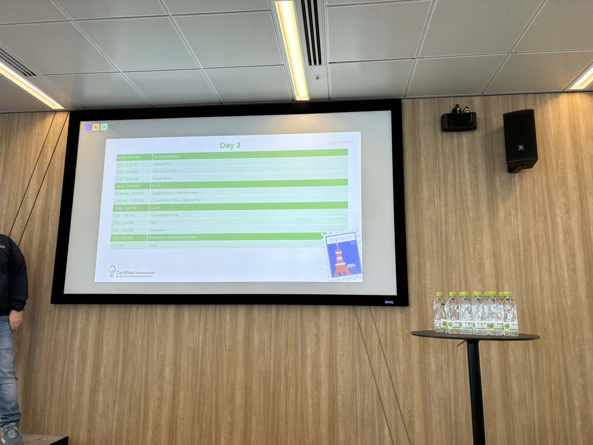

図. Day 3 はテスト → Pitch 準備 → 卒業 Pitch で締める

作って終わりではなく、人に試して言語化する

<!-- 3日目のクライマックスは卒業Pitch。準備→本番でストーリーを磨く -->

---

<!-- _class: split -->

私の提案

## Wisdom Engine 構想

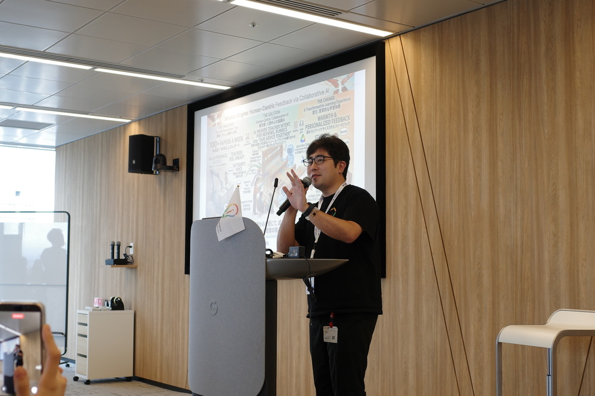

図7. Human-Centric Feedback via Collaborative AI

### 教員の採点 FB を AI で支援

- 仮採点 → 教員が修正
- 修正を**コンテキストとして接続**
- ルーブリック・想定解が**回ごとに育つ**
- 教員は**判断と承認**に時間を使える

AI が完成形を出すのではなく、教員と一緒に育つ

---

<!-- _class: summary -->

1年間の研究

## Innovator は 3 日で終わらない

### 認定後 1 年間の伴走

- メンター × コホートで継続並走
- 自プロジェクトを **1 年で検証・実装**
- 中間 Pitch / Showcase で進捗共有
- Google から継続的リソース支援

### 何が変わるか

- 「思いつき」が**1年計画のプロジェクト**に
- 学内で孤独だった構想が世界と動く
- **失敗を含めた実装サイクル**が回る
- Wisdom Engine を本気で実装できる

<!-- 単なる資格ではなく、1年間の研究プログラムとして設計されている -->

---

<!-- _class: split -->

時間設計

## Parkinson's Law と 1 年スパン

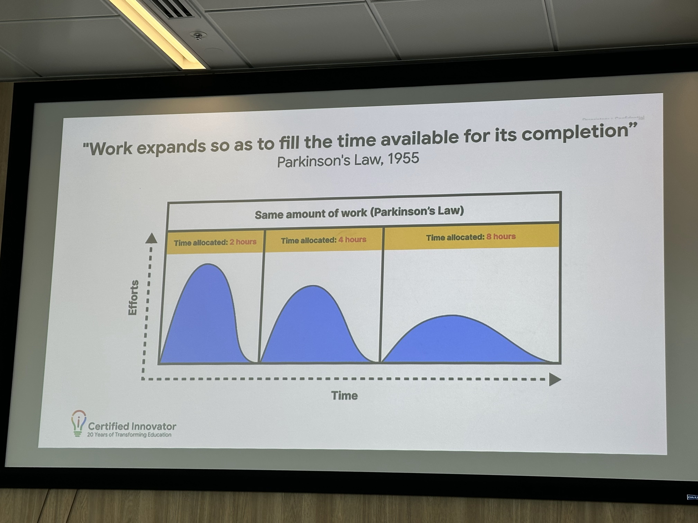

図. 与えた時間に仕事は膨張する (Parkinson, 1955)

### 短く区切る設計

- 仕事は与えた時間で膨張する
- 1 年プロジェクトを**短い Sprint**に分解
- Day 2 Sprint × 3 が**型**になる
- 中間 Pitch で**強制的に区切る**
- だから 1 年でも進む

締切を意図的に置く設計が、長期実装を進める

<!-- 1年研究を機能させるには、短い区切りを設計に組み込む必要がある -->

---

<!-- _class: summary -->

気づき①②

## 視座と文化の転換

### ① ツール思考 → Why 思考

- Before：「Gemini を**どう使うか**」（ツール起点）
- After：「目の前の**どんな痛みを解くか**」
- ツールは**選ばれる側**に変わる
- 医学教育の問いも同じ構造

### ② "Yes, and..." の文化

- アイデアを否定せず**膨らませる**
- 完璧でなくていい、**まずプロトタイプ**
- 失敗の共有を称賛
- 学内で**準備不足の案も出せる**ように

<!-- 個人の体験：以前は「準備が足りないから出さない」だったのが、出してから直す前提に -->

---

<!-- _class: summary -->

気づき③④

## 思考のスケールと役割の再定義

### ③ 10x Thinking

- 1.1 倍ではなく**10 倍**を考える
- ❌ 採点を AI で速く
- ✅ 学生が**臨床推論を言語化し続ける**学習体験
- 既存業務の効率化と新体験設計を分ける

### ④ チェンジメーカーへ

- 「教室の良い実践者」から脱却
- **学内・国内・国際の AI 教育ハブ**へ
- Innovator は資格ではなく**振る舞う覚悟**
- 次の挑戦者へメンタリングする側に

<!-- 役割が個人実践者からネットワークノードに変わる -->

---

<!-- _class: fig -->

現実

## What really happens

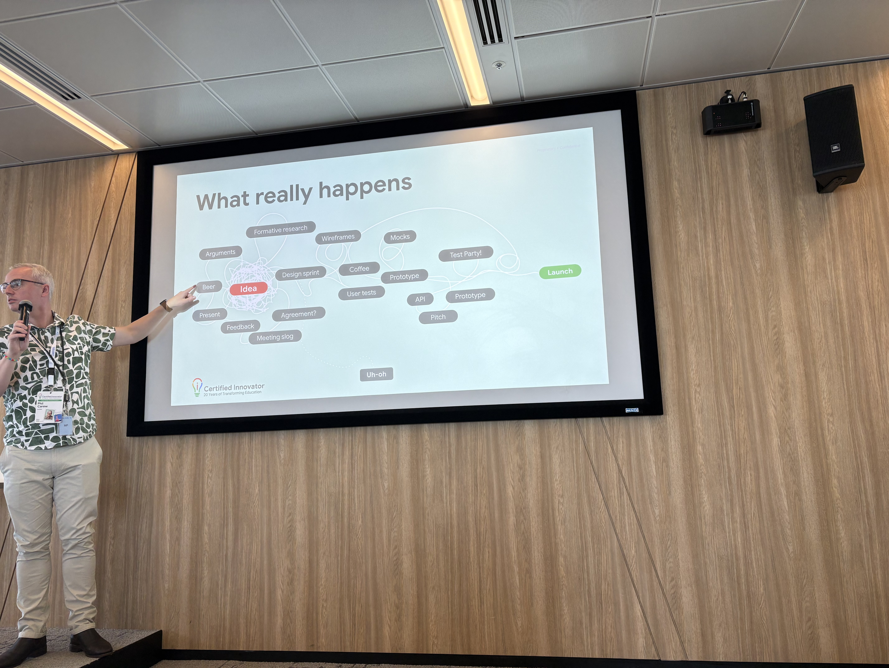

図. 失敗・ピボット・気持ちの波が絡まり合うのが現実

きれいな線形ではない。だからこそ伴走者が要る

<!-- 直線的に進むことはない。乱反射する経路を許容する設計が大切 -->

---

<!-- _class: message -->

# Change is not hard, it's uncomfortable

## 変化は難しいのではなく、居心地が悪い

<!-- 研修中もっとも刺さった一言。挑戦のハードルは技術ではなく心理 -->

---

<!-- _class: split -->

コミュニティ文化

## "BRINGS US TOGETHER" の意味

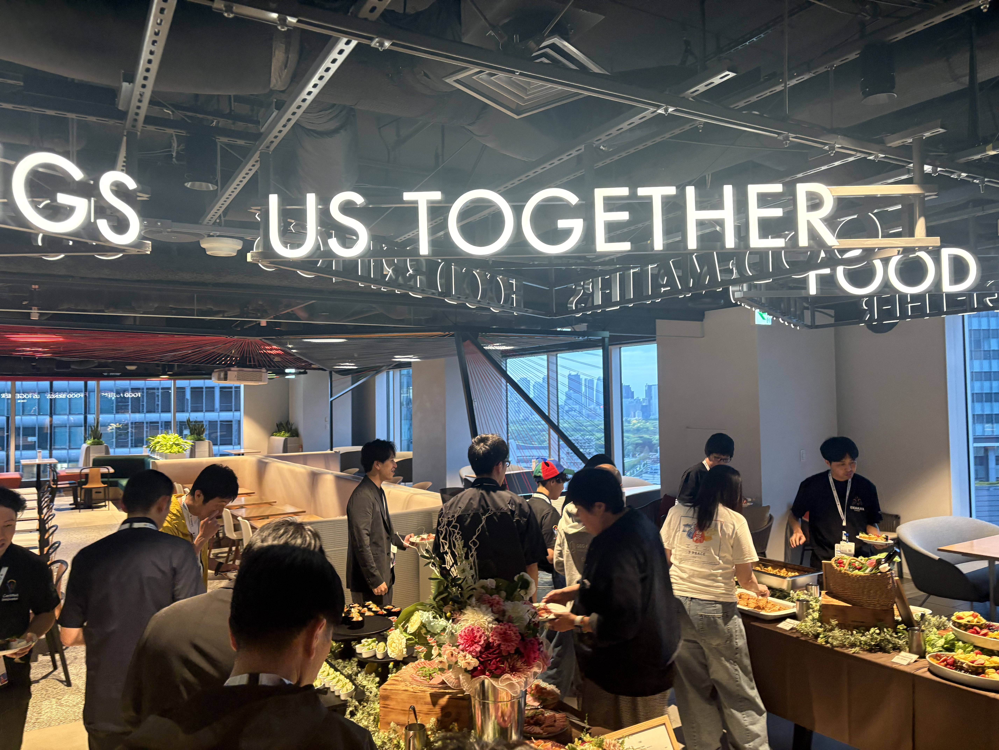

図8. Spark Camp と Dinner の場

### 設計された "余白"

- Spark Camp / Dinner / Excursion
- セッション**外の対話**が種になる
- 国・分野・年齢を超えた**心理的安全**
- 学内・学会では得られない場
- 医学教育に持ち帰りたい

フラットで多様な対話の場が、革新を生む

---

<!-- _class: divider -->

CHAPTER 2

# Google が学校に提供しているもの

## 認定 / Cloud / AI Pro / I/O 2026 の方向性

<!-- 整理してお見せします。むっちゃ分かりにくいので -->

---

<!-- _class: summary -->

3つの柱

## Google の学校支援の全体像

### 教職員認定

- Educator L1 / L2
- Trainer / Coach
- **Innovator**
- Cloud Champion

### Google Cloud

- Cloud 認定資格
- Career Launchpad（無料）
- 研究補助金 $5,000
- 公的機関枠 $1,000+ 人的支援

### 機関パートナー

- Reference Institution
- 寄付講座
- 個別協働
- 招待制プログラム

<!-- 全体像を把握してから個別の話に入る -->

---

<!-- _class: split -->

Cloud 認定資格

## 基礎から専門までの 3 階層

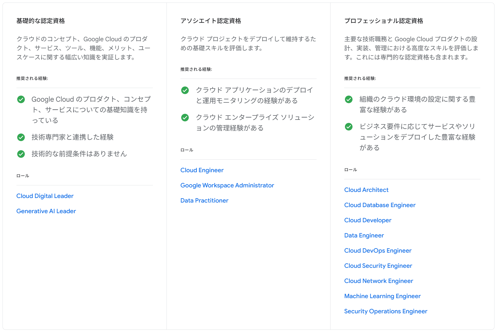

図9. 基礎 / アソシエイト / プロフェッショナル

### Generative AI Leader

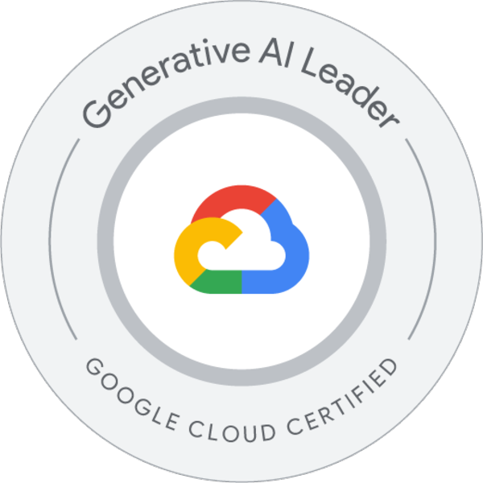

- 最も今っぽい**入口**
- 経営・教育リーダー向け
- 試験 1 回で取得可能
- **学生にも勧めやすい**

学生のキャリア接続にも有効な入口資格

---

<!-- _class: summary -->

Launchpad

## Google Career Launchpad（無料）

### 学べるコース

- Generative AI Leader
- AI Research Foundations (DeepMind)
- Cybersecurity / Data Analytics
- Cloud Engineering / Digital Leader

### 特典と単位

- **認定試験 半額**
- **クラウド無料券**（教育用クレジット）
- 応募単位は**個々の教員**
- FD/SD・課程外学習に親和的

<!-- 学生にも勧めやすい無料リソース -->

---

<!-- _class: split -->

研究補助金

## 個人・組織で使える Cloud 補助

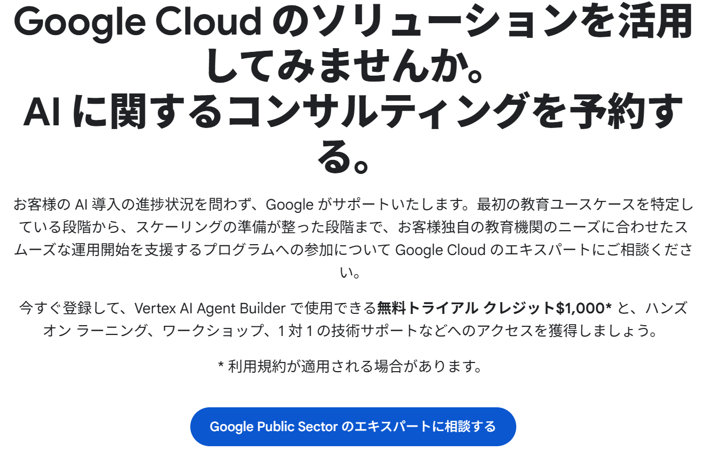

図10. AI 活用に最大 $1,000 + 人的支援

### 2 つの枠

- **学術研究用 個人**：GCP $5,000
  - 1 年間無料、簡単な Proposal
- **公的機関 AI 活用 組織**：$1,000
  - **Google から人的支援**あり
- アプリ実装の起点に

自己負担ほぼゼロで PoC を回せる枠が存在

---

<!-- _class: fig -->

Enterprise SKU

## Gemini Enterprise の SKU 比較

| SKU | 対象 | 価格 | 主な機能 |
|---|---|---|---|
| Gemini Business | 中小企業 | **$21**/月 | 汎用 AI ＋ Agent ＋ 検索強化 |
| Enterprise Standard | 大企業 | **$30**/月 | コア AI ＋ 高度セキュリティ |
| **Enterprise EDU** | 教育機関 | **$5**/月 | 学生主導でエージェント作成・共有 |
| **Enterprise EDU Pro** | 教育機関 | **$20**/月 | キャンパス全体で Agent を展開・管理 |

表1. Education 向けは一般 Enterprise の 1/6 価格

EDU Pro $20 で全学 Agent 展開が現実コストに

---

<!-- _class: summary -->

I/O 2026

## Google I/O 2026 が示した次の 10 年

### Agentic 時代へ完全移行

- 月間 **3.2 千兆**トークン処理
- 設備投資 **約 $1,900 億/年**
- 第 8 世代 TPU（学習 / 推論）
- 自律エージェント Gemini Spark

### World Models へ

- **Gemini Omni**：物理法則をシミュレート
- 動画を自然言語で編集
- **Gemini 3.5 Flash**：速度 4 倍 / 半額
- Antigravity 2.0 で 93 Agent 並行

<!-- AIが生成するだけでなく、世界を理解し行動する段階に -->

---

<!-- _class: summary -->

AI for Science

## 教育・研究に直撃する新ツール群

### Gemini for Science

- 論文要約・**仮説生成**を支援
- 研究プロセスに AI が入り込む
- CodeMender：脆弱性自動修正
- WeatherNext：気象高精度予測

### Isomorphic Labs

- **創薬プロセス**を劇的に加速
- 免疫疾患・がん候補が前臨床に
- 医学教育の射程内
- 学生が触れるフロンティアが変わる

<!-- 「何を教えるか」より「変化に追従する力」を教える時代へ -->

---

<!-- _class: message -->

# Agent が "前提" になる教育へ

## 問いは「使っていいか」から「設計できるか」へ

<!-- ここで一拍。聴衆の認識を切り替えるスライド -->

---

<!-- _class: summary -->

マルチ AI

## Google × Anthropic を併用する理由

### Google の強み

- 教育機関向け破格価格（$5-20）
- **Workspace 統合**（学内に浸透済み）
- 無料クラウドクレジット
- World Models / Science 系

### Anthropic（Claude）の強み

- 長文の倫理的推論・コード生成
- **Claude Code / Agent SDK**
- 学術アカデミック割引
- 安全性研究の透明性

<!-- 両社の補助金を使い倒すことで自己負担ほぼゼロでPoCが回せる -->

---

<!-- _class: summary -->

大学 DX の本質

## 3 つの転換

### ① データ中心

- データを**真ん中**に置く
- AI が**横断参照・更新**できる状態
- 紙 / Excel / 分断 SaaS から脱却
- 業務を AI で再設計する

### ② Agent が教え評価する

- 教員の代わりではなく**判断を拡張**
- 採点・対話・伴走に**常駐**
- 教員は判断と承認に集中
- 教育プロセスに Agent が組み込まれる

### ③ 学生 UX の根本変革

- 学内リソースを**学生ごとに結ぶ**
- 学習履歴 × 個別化 × 文脈
- 体験そのものを変える
- 個人最適化された伴走

<!-- "AIを入れる" のではなく "AI前提に大学を再設計する" -->

---

<!-- _class: summary -->

ユースケース固定

## 5 つのユースケース × データ層

### 固定する 5 つ

- 採点 × FB（Wisdom Engine）
- 学生質問対応（半歩先 Agent）
- 会議録・議事録自動化
- 学務問い合わせ一次対応
- 研究助成・規定の自動解釈

### 共有データ層

- 授業データ・学習履歴
- 規定・FAQ・議事録
- 研究助成・学内ルール
- 複数 Agent が**同じ層**に接続

<!-- EDU Pro × Workspace × Cloud で全学Agent基盤が現実に -->

---

<!-- _class: summary -->

医学教育で必須

## なぜ AI リテラシーが不可欠か

### 安全と説明責任

- AI の限界・バイアスを見抜けないと**患者安全リスク**
- 自動化バイアスを避ける臨床判断
- 患者へ説明できる責任能力
- (Liu 2025, Yüksel 2024)

### 倫理と規制

- 医療系学生で**倫理領域が最も不足**
- 学習の質低下・思考力低下リスク
- **EU AI Act** が利用者の AI リテラシー義務化
- (Lan 2026, Rodger 2025, Ben Hmido 2026)

<!-- 関心はあるが理解は不十分という共通課題 -->

---

<!-- _class: divider -->

CHAPTER 3

# 本学で挑戦したいこと

## 医学教育 × Google × AI Agent の実装案

<!-- 具体的な施策一覧へ -->

---

<!-- _class: fig -->

施策一覧

## 千葉大で試したい 8 つの施策

| # | 施策 | 学べる力 | リソース |
|---|---|---|---|
| 1 | Launchpad 医学生向け導入 | リテラシー | 無料・試験半額 |
| 2 | AI Agent ハッカソン | Agent 設計 | $5,000 クレジット |
| 3 | AI 倫理ワークショップ | 倫理 | Innovator NW |
| 4 | Studio 教員 Agent 講座 | Agent 設計 | Plus 契約内 |
| 5 | AI Pro 50 名スモール試行 | UX 改革 | 約 76 万円/年 |
| 6 | 図書館 LibraryTech PoC | Cloud | 公的 $1,000 |
| 7 | 教員 AI 採点 FB 支援 | Agent × UX | 1 年伴走 |
| 8 | パートナーシップ申請 | — | 招待制枠 |

表2. 個人施策と組織施策のミックス

教員 × $5,000 クレジットで今すぐ始められる

---

<!-- _class: summary -->

優先順位

## 段階的な実装とエコシステム

### 今すぐ（個人単位）

- ② AI Agent ハッカソン構想
- ④ Studio 教員講座
- ① Launchpad 試行
- 教員 × $5,000 クレジット起点

### 半年〜1 年（組織）

- ⑤ AI Pro 50 名試行
- ⑥ 図書館 PoC
- ⑧ パートナーシップ申請
- 実績で Google の目を引く

### 目指す姿

- 学んで → 作って → 実装
- **学生 × 教員**の共創
- 人材プール × 研究支援
- 大学 UX 改革のハブ

<!-- アカリンのコンセプトと親和的なエコシステム -->

---

<!-- _class: wrap -->

まとめ

## まとめ

- Innovator は到達点ではなく**1 年間の出発点**である
- ソリューションより**ニーズ**から、Google に意見できる立場
- 教育機関向け**Gemini Enterprise EDU $5** で前提が変わった
- 大学 DX の本質は**データ中心 × Agent × 学生 UX**の 3 転換
- 教員の負担を下げ、学生の学びを深める PoC を今年から

<!-- 千葉大で試したい施策を具体的に持ち帰っていただきたい -->

---

<!-- _class: refs -->

参考文献

## 参考文献

- Alfahl, S. O. A. (2025). Knowledge, attitudes and ethical concerns about AI among medical students at Taibah University. *Advances in Medical Education and Practice*. https://doi.org/10.2147/AMEP.S528281
- Laupichler, M. C., et al. (2024). Medical students' AI literacy and attitudes towards AI. *BMC Medical Education*. https://doi.org/10.1186/s12909-024-05400-7
- Lan, X., et al. (2026). Characteristics and determinants of AI literacy in Chinese nursing students. *International Journal of Nursing Studies Advances*. https://doi.org/10.1016/j.ijnsa.2026.100482
- Liu, F., et al. (2025). A foundational architecture for AI agents in healthcare. *Cell Reports Medicine*. https://doi.org/10.1016/j.xcrm.2025.102374
- Rodger, D., et al. (2025). Generative AI in healthcare education. *Nurse Education in Practice*. https://doi.org/10.1016/j.nepr.2025.104461
- Ben Hmido, S., et al. (2026). Smart use of AI in healthcare: the growing role of AI literacy. *Nederlands tijdschrift voor geneeskunde*.
- Weidener, L., & Fischer, M. (2023). Teaching AI ethics in medical education. *Perspectives on Medical Education*. https://doi.org/10.5334/pme.954

---

<!-- _class: qa -->

Q&amp;A

# Q&A

## tagawa.s@faculty.gs.chiba-u.jp
