
開始に先立ち

# 配布物

<b>①</b> PCかタブレットが今日ない人は、講師に連絡ください 
<b>② PCを立ち上げ、Moodleにログインして下さい</b> 
<b>③ インタラクションツール Slidoにアクセスして下さい</b> 
URLを配布したり、質問やアンケートをとったりします 
※お名前などの個人情報の入力は不可です。匿名で。

https://app.sli.do/event/pki8VqHcd6movftkMEcRWX

配布資料(このスライド)

スマホから

PCから

<b>方法1</b> Google検索「Slido」→コード入力 <b>コード：</b>1034655 <b>方法2</b> 直接リンク

<!--
- 開始に先立ち、配布物の確認です。PCかタブレットが今日ない人は講師に連絡を。PCを立ち上げ、Moodleにログインしてください。
- そしてインタラクションツールSlidoにアクセス。URLを配ったり、質問やアンケートをとったりします。お名前などの個人情報は入力不可、匿名でお願いします。
- スマホはQR、PCはGoogle検索「Slido」からコード入力か、直接リンクで入れます。
-->

---

フィードバックの公開

# 第6回のフィードバック (対面回)AI関数の説明 リンク (今年後半から動きます)

関心を持った点・良かったと感じた点

学生の皆さんが関心を持った点・良かったと感じた点を集約し、箇条書きで端的に5つ答えて下さい。

<ul style="font-size:19px;">
<li>生成AI（Gemini）を活用したプログラミングやアプリ作成の驚きと有用性の実感</li>
<li>CPUとGPUの役割の違いや並列処理の仕組みに関する具体的で分かりやすい理解</li>
<li>OSの重要性とメモリ管理、ファイル管理、共通UI提供などの多岐にわたる機能の把握</li>
<li>CLIとGUIの特性比較を通じた、将来の研究やAI活用におけるCLI習得の必要性の認識</li>
<li>授業冒頭の復習や確認問題の解説による、既習内容の定着と不明点の解消</li>
</ul>

難しかった点・不満に感じた点

学生の皆さんが難しかった点、不満に感じた点を集約し、箇条書きで端的に最大5つ答えて下さい。

<ul style="font-size:19px;">
<li>LinuxやCLI（コマンド操作）のワークで何をすればいいか、何が起きているのか分からず難しかった</li>
<li>プログラミングのコードや論理的な仕組みが複雑で、理解が追いつかなかった</li>
<li>小テストの難易度が高く、前提知識や専門用語（OS、CPU、GPUなど）の定着が不十分だった</li>
<li>実際に手を動かす作業の前に、目的や学習内容について事前の説明を詳しくしてほしかった</li>
<li>パソコンの不具合やテストブラウザ（Safe Exam Browser）の設定に手間取り、焦りや不安を感じた</li>
</ul>

【その他】 
① 授業の難易度と扱う情報量は、<b>簡単～難しい、丁度良い～多い</b>まで声がバラけている→<b>NotebookLM解説</b> 
② 教室が狭い、気分が悪くなる<b>→すみません…。冷房は入れます。ただ、これだけはどうしようもなく…。</b> 
③ Slidoへの不適切コメントは、<b>呆れる声、不快だったとの声</b>も幾つか。気をつけて下さい。 
※自分の🤭へのカメラは、未受験者むけの収録でした。<b>別のPCをもってきたのでそっちで録画します。</b>

<!--
- 第6回（対面回）のフィードバックです。良かった点は、生成AIを使ったプログラミングの驚き、CPUとGPUの違いや並列処理の理解、OSの重要性、CLIとGUIの比較、授業冒頭の復習などが挙がりました。
- 難しかった点は、CLIのワークで何をすればいいか分からなかった、コードや論理が複雑、小テストが難しい、事前説明がほしい、PCやテストブラウザの設定に手間取った、などでした。
- その他、難易度と情報量は声がバラけているのでNotebookLMで解説します。教室が狭い件はすみません、冷房は入れます。Slidoへの不適切コメントは気をつけて。録画は別PCで行います。
-->

---

第8回について

# 第8回の扱いについて

いわゆる、「7週講義、1回オンライン」という千葉大独特な授業設定の回です。 
文部科学省の「大学設置基準」上の不足を補う処置です。

<b>単位での「1時間」 = 実時間の45分 (小学校や中学校と共通)</b> → 「15時間」 = 675分 
7回✕90 = 630分 &lt; <b>675分 (15時間)</b>　&lt; <b>8回</b>✕90 = 720分 
※同時双方向オンライン・オンデマンド・紙面講義が半分を超える授業は卒業単位中、<b>60単位</b>まで。 
<b>※対面授業指定の授業(上記60単位以外)のうち、オンデマンドに出来る回数は半分未満まで。</b>

本日より6/2にかけて、<b>10分間ほどの動画が合計90分まで</b>少しずつ上がります 
視聴期限として<b>6/9(火)</b>の授業までに視聴を完了して下さい。課題は<b>6/16(火)</b>までにします。 
<b>第8回は</b>、教室での実施がありません。<b>次回授業は6/9</b>です。 
※オンデマンド動画の視聴の不足は、単位に関わるので、第4回分も視聴しておきましょう。

<!--
- 第8回の扱いについて。「7週講義、1回オンライン」という千葉大独特の設定で、文部科学省の大学設置基準上の不足を補う処置です。
- 単位での1時間は実時間45分。7回×90分では675分に足りないので、8回分が必要になります。同時双方向やオンデマンド中心の授業は卒業単位中60単位まで、などのルールがあります。
- 本日から6/2にかけて10分ほどの動画が合計90分まで上がります。6/9の授業までに視聴完了、課題は6/16まで。第8回は教室実施なし、次回授業は6/9です。第4回分も視聴しておきましょう。
-->

---

授業で扱う内容の一覧

# 千葉大学情報リテラシの標準シラバス：原則学内で共通

<table style="width:100%; border-collapse:collapse; font-size:19px; margin-top:6px;">
<thead><tr style="background:var(--accent); color:#fff;">
<th style="padding:4px 8px; width:2em;">回</th><th style="width:24%;">テーマ</th><th>内容</th>
</tr></thead>
<tbody>
<tr><td style="text-align:center;">1</td><td>【講義】情報とコミュニケーション</td><td>コミュニケーションモデル、人と機械のインターフェース、ビッグデータ、IoT、データ駆動型社会、データ・AI活用事例、生成AIの概要および使用するうえでの留意事項について学ぶ。</td></tr>
<tr style="background:var(--accent-soft);"><td style="text-align:center;">2</td><td>【講義】コンピュータの仕組み</td><td>コンピュータのハードウェアとソフトウェアの構成について学ぶ。</td></tr>
<tr><td style="text-align:center;">3</td><td></td><td>コンピュータの動作原理、アルゴリズムとプログラムについて学ぶ。</td></tr>
<tr style="background:var(--accent-soft);"><td style="text-align:center;">4</td><td>【講義】情報の表現</td><td>データの種類、データと情報、情報の表現、数値と文字のビット表現、アナログ情報のディジタル化、画像データの表現について学ぶ。</td></tr>
<tr><td style="text-align:center;">5</td><td>【講義】ネットワークの仕組みとインターネット</td><td>情報ネットワークの構成、インターネットの仕組みについて学ぶ。</td></tr>
<tr style="background:var(--accent-soft);"><td style="text-align:center;">6</td><td></td><td>インターネットのサービス（電子メール、Web等）について学ぶ。</td></tr>
<tr><td style="text-align:center;">7</td><td>【講義】情報倫理とセキュリティ</td><td>インターネット社会の問題、SNSと倫理・プライバシー、個人情報保護、データ倫理について学ぶ。</td></tr>
<tr style="background:var(--accent-soft);"><td style="text-align:center;">8</td><td></td><td>情報セキュリティと対策、暗号化、ユーザー認証とアクセス制御、セキュリティ事故事例等について学ぶ。</td></tr>
<tr><td style="text-align:center;">9</td><td>【講義】講義のまとめと期末試験</td><td>講義内容の理解度を確認する試験を行う。</td></tr>
</tbody>
</table>

確実に覚えてほしいことは、重要、と書いています。

<!--
- 千葉大学情報リテラシの標準シラバスです。原則として学内で共通の内容になっています。
- 全9回で、情報とコミュニケーション、コンピュータの仕組み、情報の表現、ネットワーク、情報倫理とセキュリティ、そして最後にまとめと期末試験という流れです。
- これから確実に覚えてほしいことには「重要」と書いていきます。注目してください。
-->

---

問題の復習

# 確認問題3a

<b>OSの読み込み前にBIOSが読まれる</b> 
※BIOS → Basic Input/Output System 
電源投入と同時に実行され、ハードウェアを初期化、OSの場所を開く。

<b>デバイスドライバ</b> 
OSとデバイスが通信できるようにするソフトウェアコンポーネント 
標準的な機能で通信できる場合、ドライバが配布されないこともある 
※プリンターなどは、大体配布されている

<b>シェル</b> 
利用者の入力を解釈してOSの機能を呼び出すプログラム。 
CLIでは、zsh (mac/linux)、bash (linux)、powershell(windows)など。

<!--
- 確認問題3aの復習です。まずOSの読み込み前にBIOSが読まれます。BIOSはBasic Input/Output System。電源投入と同時に実行され、ハードウェアを初期化してOSの場所を開きます。
- デバイスドライバは、OSとデバイスが通信できるようにするソフトウェアコンポーネント。標準的な機能で通信できる場合は配布されないこともあります。プリンターなどは大体配布されています。
- シェルは、利用者の入力を解釈してOSの機能を呼び出すプログラム。CLIではzsh、bash、powershellなどがあります。
-->

---

シェルの例

# CLIで様々な機械にコマンドを送って動かす

<b>シナリオ① 100個のフォルダを作成する</b>

授業中実演

<b>シナリオ② Claude Code</b>

授業中実演

<b>体験談@SPring-8/TSUBAME</b>

sshでサーバーをコマンドラインで使う

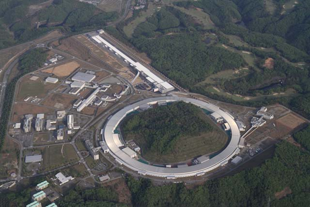

SPring-8（兵庫県）

<!--
- シェルの例です。CLIを使うと、様々な機械にコマンドを送って動かせます。
- シナリオ①は100個のフォルダを作成する、シナリオ②はClaude Code。どちらも授業中に実演します。
- そして体験談として、SPring-8やTSUBAMEといった大型の計算・実験施設に、sshでサーバーにつないでコマンドラインで使った話をします。
-->

---

問題の復習

# 確認問題3aOSS

<b>OSS (オープンソースソフトウェア)</b> 
ソースコードを使用、調査、再利用、修正、拡張、再配布が可能など、「オープンソースの定義」を満たすソフトウェア 
ライセンスの条件に従えば、利用者の環境に合わせてソースコードを改変できる

→ Linuxやpythonのimportモジュールなど / 透明性がある

<b>ソースコード</b> 
プログラミング言語で書かれた、人間が読めるプログラムの表現 (文字列) 
※プログラムは、機械語など、人が読めないものも含む概念

目玉の数さえ十分あれば、どんなバグも深刻ではない（Given enough eyeballs, all bugs are shallow） 
ーー エリック・レイモンドが提唱した概念（リーナスの法則）

<!--
- 確認問題3a、OSSについてです。OSSはオープンソースソフトウェア。ソースコードを使用、調査、再利用、修正、拡張、再配布が可能など、「オープンソースの定義」を満たすソフトウェアです。
- ライセンスの条件に従えば、利用者の環境に合わせてソースコードを改変できます。Linuxやpythonのimportモジュールなどが例で、透明性があります。
- ソースコードは、プログラミング言語で書かれた人間が読めるプログラムの表現。リーナスの法則「目玉の数さえ十分あれば、どんなバグも深刻ではない」も紹介します。
-->

---

問題の復習

# 確認問題3b

<b>プログラミング</b> 
フローチャートの考え方 
<b>角丸長方形（端子）：</b> 処理の「開始」と「終了」を表す 
<b>長方形（処理）：</b> 「編集（コードを書く）」「コンパイル（機械語に翻訳する）」「実行」といった具体的な作業や処理を表す 
<b>ひし形（条件分岐）：</b> 「エラー有り・無し」のように条件を判定し、その結果によってルート（矢印）が分岐 
<b>六角形（反復）：</b>「10回繰り返す」などの条件で挟み、その間にある処理を何度も繰り返し実行する

<b>「順次」「選択・分岐」「反復」</b>が記入される

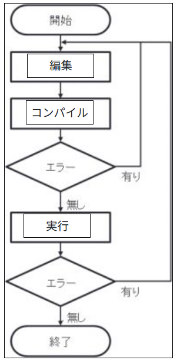

<b>C言語の問題は期末では出ません</b> ※昨年までは行っていました…

<!--
- 確認問題3bです。プログラミングのフローチャートの考え方を確認します。
- 角丸長方形は処理の開始と終了を表す端子。長方形は編集・コンパイル・実行といった具体的な処理。ひし形は条件分岐で、エラーの有り無しなどで矢印が分かれます。六角形は反復で、10回繰り返すなどの条件で処理を繰り返します。
- ここには「順次」「選択・分岐」「反復」が記入されます。なお、C言語の問題は期末では出ません。昨年までは行っていましたが、今年からは出題しません。
-->

---

問題の復習

# 確認問題3bアルゴリズム：最適な処理回数は？

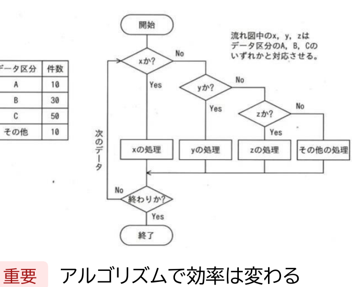

<b>判定までの回数</b> 
xの処理: <b>判定 1回</b> 
yの処理: <b>判定 2回</b>　（xでNo → yでYes） 
zの処理: <b>判定 3回</b>　（xでNo → yでNo → zでYes） 
その他の処理: <b>判定 3回</b>　（すべてNo。表より「その他」は10件で固定） 
なら、<b>zにc、xにa</b>が良い 
Cの処理: 50件 × 1回 = 50 
Bの処理: 30件 × 2回 = 60 
Aの処理: 10件 × 3回 = 30 
その他の処理: 10件 × 3回 = 30 
<b>合計: 170回</b>

重要 アルゴリズムで効率は変わる　<b>※逆(zにa)だと、250回 (最悪)</b>

<!--
- 確認問題3b、アルゴリズムで最適な処理回数は何回かという問題です。フローチャートではx、y、zの順に条件を判定します。
- xの処理は判定1回、yは2回、zは3回、その他も3回かかります。データ区分は表のとおりで、件数の多いものほど判定回数を少なくしたい。なので、件数50のCをzではなくxに、つまり判定回数の少ない位置に置くのが良い。
- 計算すると、合計170回になります。重要なのは、アルゴリズムで効率は変わるということ。逆に並べると250回で最悪になります。
-->

---

Google NotebookLM

# コンテキストをもとに、情報を変換・深堀りする道具

コンテキスト

⇒

質問

⇒

変換

<!--
- Google NotebookLMの紹介です。これは、コンテキストをもとに情報を変換・深堀りする道具です。
- 画面は3つに分かれていて、左がソース、つまりコンテキストを入れる場所、中央が質問するチャット、右が変換・出力のスタジオです。
- 流れとしては、コンテキストを与え、質問し、学びやすい形に変換する、という三段構えになっています。
-->

---

Google NotebookLM

# ワーク① NotebookLMで第6回を復習してみよう (20分)

<b>◯ ペアで実施：2人で1つ作って下さい</b> 
<b>① NotebookLMを作る (3分)</b> 
開く→ソースに第6回のスライドを読み込む 
https://docs.google.com/presentation/d/15HO5VBOAEPpH-g5NW_59qdM8ze_gvdjh/

<b>② 動画 or 音声 or インフォグラフィックを作る</b> 
<b>ボタンを押して、聞きたいところを書く。</b> 
<b>出来上がったら、ここにページを作って貼る。</b>

③ 質問・クイズ・マインドマップを見る。終了後、<b>全員答えて</b>下さい。

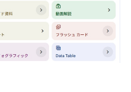

<!--
- ワーク①です。NotebookLMで第6回を復習してみましょう。時間は20分、ペアで実施、2人で1つ作ってください。
- ①まずNotebookLMを作ります。3分で、開いてソースに第6回のスライドを読み込みます。リンクはこちらです。
- ②動画や音声、インフォグラフィックを作ってみましょう。ボタンを押して、聞きたいところを書きます。出来上がったらここにページを作って貼ってください。③質問・クイズ・マインドマップも見て、終了後は全員答えてください。
-->

---

Google NotebookLM

# 学びやすい形に情報を変換

絵1枚で要約

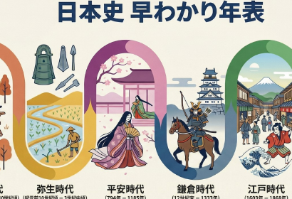

クイズで時間確認

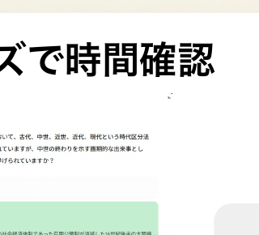

スライド作成

<b>動画・podキャスト</b> 
<b>(ソクラテスメソッド)</b> 
<b>質問・応答</b>

学びやすい形に情報を変換

<!--
- NotebookLMの出力例です。一つのコンテキストから、さまざまな学びやすい形に情報を変換できます。
- 絵1枚で要約すれば日本史の早わかり年表に、スライド作成もできます。クイズを作れば時間の確認に使えます。
- さらに動画やポッドキャスト、ソクラテスメソッド形式の質問・応答もできます。要するに、学びやすい形に情報を変換してくれる道具なんです。
-->

---

自律的な学び方

# 学習方略

<b>学習方略</b> - Dunlosky et al. (2013) <i>PSPI</i>　教育心理学による、「生徒がどう勉強すべきか」のレビュー論文

<table style="font-size:17px; line-height:1.35; margin-top:8px; width:100%; border-collapse:collapse;">
<thead>
<tr style="background:var(--accent); color:#fff;">
<th style="padding:3px 6px; width:13%;">テクニック</th>
<th style="padding:3px 6px; width:42%;">内容・方法</th>
<th style="padding:3px 6px; width:6%;">効果</th>
<th style="padding:3px 6px; width:39%;">主な理由</th>
</tr>
</thead>
<tbody>
<tr><td style="padding:2px 6px;"><b>実力テスト</b></td><td style="padding:2px 6px;">フラッシュカードや練習問題などを使い、自分の記憶から情報を引き出すテストを行う。</td><td style="padding:2px 6px; text-align:center; color:var(--accent-dark); font-weight:800;">高</td><td style="padding:2px 6px;">学習効果が高く、幅広い教材・年齢層に有効。フィードバックがあると効果的。</td></tr>
<tr style="background:var(--section-bg);"><td style="padding:2px 6px;"><b>分散学習</b></td><td style="padding:2px 6px;">一気に学習せず、学習スケジュールを分散させる。</td><td style="padding:2px 6px; text-align:center; color:var(--accent-dark); font-weight:800;">高</td><td style="padding:2px 6px;">長期的な記憶保持に有効。一夜漬けよりも遥かに効率が良い。</td></tr>
<tr><td style="padding:2px 6px;"><b>精緻化的質問</b></td><td style="padding:2px 6px;">「なぜその事実が成り立つのか？」という質問を自分に投げかけ、説明を考える。</td><td style="padding:2px 6px; text-align:center;">中</td><td style="padding:2px 6px;">事実の学習に有効だが、ある程度の予備知識が必要。</td></tr>
<tr style="background:var(--section-bg);"><td style="padding:2px 6px;"><b>自己説明</b></td><td style="padding:2px 6px;">学習のプロセスや、新しい情報が既知の情報とどう関連するかを自分自身に説明する。</td><td style="padding:2px 6px; text-align:center;">中</td><td style="padding:2px 6px;">数学や論理的思考を要する問題解決に有効だが、時間がかかる。</td></tr>
<tr><td style="padding:2px 6px;"><b>交互練習</b></td><td style="padding:2px 6px;">1つの種類の問題をまとめて解くのではなく、異なる種類の問題を混ぜて練習する。</td><td style="padding:2px 6px; text-align:center;">中</td><td style="padding:2px 6px;">数学などで劇的な効果がある（区別がつかなくなるのを防ぐ）。 ※ 全ての教科での効果は未検証。</td></tr>
<tr style="background:var(--section-bg);"><td style="padding:2px 6px;"><b>要約</b></td><td style="padding:2px 6px;">学習したテキストの要点をまとめ短い文章にする。</td><td style="padding:2px 6px; text-align:center; color:#888;">低</td><td style="padding:2px 6px;">時間がかかるわりに、要約スキルの形成を除き効果が薄い。</td></tr>
<tr><td style="padding:2px 6px;"><b>ハイライト</b></td><td style="padding:2px 6px;">重要な部分に線を引いたり、色を塗ったりする。</td><td style="padding:2px 6px; text-align:center; color:#888;">低</td><td style="padding:2px 6px;">読むだけより効果が薄くなりがちで、推論能力を阻害しうる。</td></tr>
<tr style="background:var(--section-bg);"><td style="padding:2px 6px;"><b>キーワード法</b></td><td style="padding:2px 6px;">発音が似たキーワードにイメージを結びつける。</td><td style="padding:2px 6px; text-align:center; color:#888;">低</td><td style="padding:2px 6px;">適用できる教材が限られ（語呂合わせなど）、長期記憶しにくい。</td></tr>
<tr><td style="padding:2px 6px;"><b>テキストのイメージ化</b></td><td style="padding:2px 6px;">読んでいる内容を頭の中で映像化する。</td><td style="padding:2px 6px; text-align:center; color:#888;">低</td><td style="padding:2px 6px;">視覚化しやすい教材に限られ、効果が一貫しない。</td></tr>
<tr style="background:var(--section-bg);"><td style="padding:2px 6px;"><b>再読</b></td><td style="padding:2px 6px;">テキストやノートを繰り返し読む。</td><td style="padding:2px 6px; text-align:center; color:#888;">低</td><td style="padding:2px 6px;">最も一般的だが、時間対効果が低く、深い理解につながらない。</td></tr>
</tbody>
</table>

再読やハイライト、写し直すなど、準備コストの低いが効果も低い、方略を選びがち。一方で、学習効果の高い方法は、準備コストが高い一方、一人では難しい→<b>AIで支援？</b>

大学以降、自律的に学び続けることが重要になります。人にも適切に頼りつつ(図書館にはLSという院生が質問対応してます)、乗り越えましょう

<!--
- Dunlosky et al. (2013) の学習方略レビュー。実力テストと分散学習が「効果・高」、再読やハイライトは「効果・低」。
- 準備コストの低い方略ほど効果が低く選ばれがち。効果の高い方法は一人では難しいのでAIで支援できないか、という問い。
-->

---

研究へのAIの影響

# Gemini for Science：AIの実験とツールで新たな発見の時代を切り拓く

Hypothesis generation

<b>仮説生成機能 (Co-Scientist)</b> 新しいアイデアの創出は科学の中心ですが、毎年発表される何百万本もの論文をすべて読み込み、統合することは不可能です。 科学的手法をシミュレートし、複数のAIエージェントによる「アイデア トーナメント」を開催。仮説の生成、議論、評価を自動化します。 生成された主張は徹底的に検証され、引用元が必ず明記されます。

Computational discovery

<b>計算科学による発見機能 (AlphaEvolve/ERA)</b> 科学の進歩は、計算実験で検証できる仮説の数によって制限されがちです。Computational discoveryはこの課題を解決します。 何千ものコードバリエーションを並列で生成・評価。手作業では数ヶ月かかるモデリング手法の検証をスムーズに行えます。 太陽光発電の予測や疫学といった複雑な分野に威力を発揮します。

Literature insights

<b>文献インサイト機能 (NotebookLM基盤)</b> 膨大な科学文献を検索し、対比形式のテーブルに整理。チャット機能で詳細なニュアンスまで深掘り可能です。 レポート、スライド、インフォグラフィック、音声解説など、高品質な成果物を簡単に作成。知見の統合や新分野の特定を強力に支援します。 科学文献の深い理解は、すべての研究活動に不可欠なプロセスです。

https://blog.google/intl/ja-jp/company-news/technology/gemini-for-science-io-2026/ ／ Googleの主張 (未検証)

今後、検証が進み、研究の日常になる可能性はある ／ 格差は広がるか?

<!--
- GoogleのGemini for Science。仮説生成(Co-Scientist)、計算科学による発見(AlphaEvolve/ERA)、文献インサイト(NotebookLM基盤)の3機能。
- いずれもGoogleの主張で未検証。今後検証が進めば研究の日常になりうる。一方で格差が広がる懸念も。
-->

---

研究へのAIの影響

# 1953 Nature　▶ 二重螺旋論文

物理学が生物学を席巻した始まり　2026

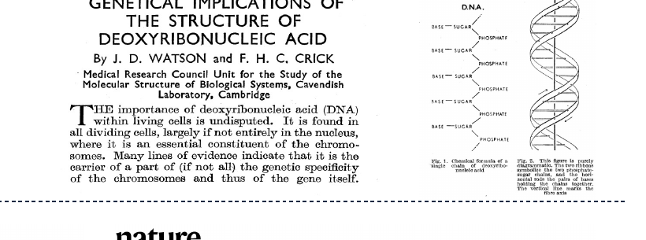

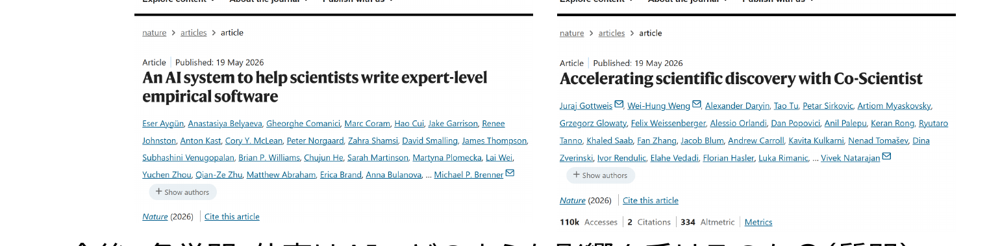

今後、各学問・仕事はAIでどのような影響を受けるのか？(質問)

<!--
- 1953年Natureのワトソン・クリックの二重螺旋論文は、物理学が生物学を席巻した始まり。
- 2026年のNatureには、AIが専門家レベルのソフトウェアを書く、Co-Scientistで科学的発見を加速する、といった論文が出ている。
- 今後、各学問・仕事はAIでどのような影響を受けるのか、を問う。
-->

---

NotebookLM演習の結果

# NotebookLM演習の結果

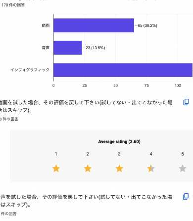

<b>ワーク② 質問・問題作成などを行ってみて、便利な点や利点、面白かった点を1言で教えて下さい</b> 
- 膨大な情報やスライドを短時間で簡潔に要約・整理できる 
- イラストや図、動画など視覚的に分かりやすい資料が簡単に作成できる 
- 自分の分からない点や知りたい箇所をピンポイントで解説・質問できる 
- 手間をかけずにクオリティの高い学習資料や問題を作成でき効率的である 
- デザインのカスタマイズや音声化など、多様なアウトプット形式が面白い (Gemini要約/AI要約)

<b>ワーク② 質問・問題作成などを行ってみて、欠点、良くなかった点を1言で教えて下さい</b> 
- 生成や動画の作成に非常に時間がかかる 
- 情報の正確性や信憑性に不安がある 
- 意図通りにならない、またはプロンプトの調整が難しい 
- 思考力の低下やAIへの依存に対する懸念 
- 情報量が少ない、または内容が不十分な場合がある  (以上、Gemini要約/田川確認)

<b>ワーク③ 学びにおいて、ご自身は生成AIとどのように関わりたいと考えますか？</b> 
- 思考力の低下を防ぐため、丸投げせず主体的・補助的なツールとして活用する 
- 学習効率の向上、作業の時短、アイデア出し、情報の要約や整理に利用する 
- 分からない点の解説や問題作成を通じた自学自習、理解の深化に役立てる 
- 誤情報やハルシネーションの可能性を考慮し、情報の真偽を常に確認する 
- 個人情報の保護や規約の遵守など、リテラシーを持って適切に付き合う (Gemini要約/田川確認)

<b>生成AIについて、どのように学べばよいとおもいますか？</b> 
- <b>実践を通じた習得：</b>実際に何度も触れ、多様なプロンプトを試すことで体験的に使い方を身につける。 
- <b>リテラシーと安全性の理解：</b>情報の真偽や著作権、入力情報の機密性などのリスクと注意点を正しく学ぶ。 
- <b>仕組みと特性の把握：</b>AIが回答を生成する原理を理解し、その得意・不得意を把握する。 
- <b>外部リソースの活用：</b>学校の授業、動画、書籍、有識者への質問など、多様な情報源から知識を得る。 
- <b>道具的な活用の姿勢：</b>AIに依存しすぎず、あくまで補助的なツールとして自分自身の判断力を持ちながら活用する。

<!--
- NotebookLM演習(ワーク②③)のSlido集計結果。便利な点・欠点・どう関わりたいか・どう学ぶべきか、をGemini要約＋田川確認で整理。
-->

---

今日の目標

# 今日の目標

<b>1. 情報リテラシの学び方を体験し、意見をもてる</b> NotebookLMを理解します。符号化や様々なデータのデジタル化を学びます。

<b>2. 情報のデジタル化を理解し、伝達方法のされ方を説明できる</b> 情報量について理解します。符号化や様々なデータのデジタル化を学びます。

<b>3. 情報ネットワークの構成について理解する</b> ネットワークの構成について話します

1は、最初の1/3で終わりました 2、3が残りの60分です

<!--
- 今日の目標は3つ。1はNotebookLM体験で最初の1/3で終了。残り60分で2(情報のデジタル化)と3(ネットワーク構成)を扱う。
-->

---

二進数を理解する

# 自然数と二進数の計算・変換

ビット列による表現の広がり

8ビット(1バイト)の表現範囲: <b style="color:var(--accent-dark);">0 ～ 255 (2⁸種類)</b> 
16ビット(2バイト)の表現範囲: <b style="color:var(--accent-dark);">0 ～ 65,535 (2¹⁶種類)</b> 
<b style="color:var(--accent-dark);">現行64ビット (8バイト) 2⁶⁴種類</b>

2進数の加算とオーバーフロー

<b>8ビットレジスタにおける計算例:</b> 
<b>あふれ (オーバーフロー)</b>: 計算結果が用意された桁数（この場合は8ビット）を超えてしまう現象。最上位桁からの繰り上がりが発生した際に起こる。 
100₁₀ + 200₁₀ の計算では、結果が300₁₀となり、8ビットの最大値255を超えるためそのままでは、正しく表現できない。

10進数と2進数の対応（16進数）

10進数・2進数・16進数 対応表

2進数の省略記法 
<b>10進数:</b> 57130 
<b>2進数:</b> 1101111100101010 
<b>16進数:</b> DF2A

<!--
- 自然数と二進数の計算・変換。8ビットで0〜255、16ビットで0〜65,535、現行64ビットで2^64種類。
- 8ビットレジスタの計算でオーバーフロー(あふれ)が起こる例。100+200=300は255を超えるので8ビットでは表せない。
- 2進数の省略記法として16進数。57130 → 1101111100101010 → DF2A。
-->

---

符号付整数表現

# 符号付整数表現

絶対値表現

<b>0</b>0010100 → +20 
<b>1</b>0010100 → -20 
<b style="color:var(--accent-dark);">最上位ビットが符号（0:+, 1:-）を表す</b> 
符号ビット（MSB）を反転させることで負数を表現する方式です。 
直感的ですが、0の表現が2つ存在（+0と-0）する課題があります。

2の補数表現

<b>変換手順：</b>ビットを反転させる ／ 「1」を加算する 
<b>+20: 00010100</b> 
<b>-20: 11101100</b> 
<b style="color:var(--accent-dark);">加算器で減算が可能になる（効率化）</b> 
現在のコンピュータで最も一般的な表現です。 
あふれを無視することで、減算を加算として処理できる大きなメリットがあります。

※1の補数表現なども別にあります。

現在のコンピューターでは、2の補数が使われています

<!--
- 符号付整数表現。絶対値表現はMSBを符号にする直感的な方式だが、+0と-0が両方できる課題。
- 2の補数表現は「ビット反転して1を足す」。+20=00010100、-20=11101100。加算器で減算ができ効率的。現在最も一般的。
-->

---

符号付整数表現

# 符号付整数表現　重要

<b>【1の補数(単に符号を逆にしただけ)の数直線】</b> 
値:&nbsp;&nbsp; -7&nbsp;&nbsp; -6&nbsp;&nbsp; -5&nbsp;&nbsp; -4&nbsp;&nbsp; -3&nbsp;&nbsp; -2&nbsp;&nbsp; -1&nbsp;&nbsp; -0&nbsp;&nbsp; +0&nbsp;&nbsp; +1&nbsp;&nbsp; +2&nbsp;&nbsp; +3&nbsp;&nbsp; +4&nbsp;&nbsp; +5&nbsp;&nbsp; +6&nbsp;&nbsp; +7 
2進:&nbsp; 1000 1001 1010 1011 1100 1101 1110 1111 0000 0001 0010 0011 0100 0101 0110 0111 
　　　　　　　　　　　　　　　　　　　　　　　　　　　▲ ここが折り返し地点

<b>【2の補数(符号を逆にして1足した)の数直線】</b> 
値:&nbsp;&nbsp; -8&nbsp;&nbsp; -7&nbsp;&nbsp; -6&nbsp;&nbsp; -5&nbsp;&nbsp; -4&nbsp;&nbsp; -3&nbsp;&nbsp; -2&nbsp;&nbsp; -1&nbsp;&nbsp;&nbsp; 0&nbsp;&nbsp; +1&nbsp;&nbsp; +2&nbsp;&nbsp; +3&nbsp;&nbsp; +4&nbsp;&nbsp; +5&nbsp;&nbsp; +6&nbsp;&nbsp; +7 
2進:&nbsp; 1000 1001 1010 1011 1100 1101 1110 1111 0000 0001 0010 0011 0100 0101 0110 0111 
　　　　　　　　　　　　　　　　　　　　　　　　▲ （0が1つになる！）

「ビット反転して1を足す」手順は、「数直線上でパタンと反転させて、0が２つできてズレた1目盛り分を右に戻す」という操作

2の補数のメリットは？→ 足しやすい 
a - b = a + (-b)　減算を加算器のみで実行可能 
　　00011110 (30) 
＋ 11101100 (-20) 
100001010←あふれを無視 
　00001010₂ = 10₁₀

<!--
- 1の補数の数直線は-0と+0が両方できて折り返しがある。2の補数の数直線では0が1つになる。
- 「ビット反転して1を足す」=「数直線でパタンと反転させ、ズレた1目盛りを右に戻す」操作。
- 2の補数のメリットは足しやすいこと。30+(-20)を加算してあふれを無視すると10になる。
-->

---

小数点を含む数の表現

# 変換プロセスの可視化：1.375₁₀ の場合

<b>■ 重み付けによる展開式</b> 
1.375₁₀ = a₀・2⁰ + b₁・2⁻¹ + b₂・2⁻² + b₃・2⁻³  
<b>■ 各桁の係数算出</b> 
a₀ = <b style="color:var(--accent);">1</b> 
b₁ = <b style="color:var(--accent);">0</b> 
b₂ = <b style="color:var(--accent);">1</b> 
b₃ = <b style="color:var(--accent);">1</b>  
1.375₁₀ = <b style="color:var(--accent);">1.011₂</b>

<b>■ 2倍して整数部を取り出す手続き的手順</b> 

0.375 × 2 = <b style="color:var(--accent);">0</b>.75 → b₁ 
&nbsp;0.75 × 2 = <b style="color:var(--accent);">1</b>.5&nbsp; → b₂ 
&nbsp;&nbsp;0.5 × 2 = <b style="color:var(--accent);">1</b>.0&nbsp; → b₃ 
※小数部が0になるまで繰り返す  
<b>整数部はそのまま変換し 
小数部は「2倍して整数部を抜き出す」を繰り返す 
循環小数などは切り捨てる</b>

<!--
- 1.375を2進数に変換する例。重み付けの展開式でa₀=1, b₁=0, b₂=1, b₃=1 → 1.011₂。
- 手続き的には小数部を2倍して整数部を取り出す操作を繰り返す。0.375×2=0.75→b₁=0、0.75×2=1.5→b₂=1、0.5×2=1.0→b₃=1。
- 整数部はそのまま、小数部は2倍して整数部を抜き出すを繰り返し、循環小数は切り捨てる。
-->

---

小数点を含む数の表現

# 丸め誤差の注意 (不可避)

2進数における無限小数

<b>0.1₁₀ を2進数に変換すると...</b> 
0.1₁₀ = (0.000110011001100…)₂ 
有限桁で打ち切る必要があるため、正確な値を保持できない

計算結果への影響

<b>理論値:</b> 
0.1₁₀ × 10₁₀ = 1 
<b>実際の計算（2進数有限桁）:</b> 
0.000110011001100₂ × 10₁₀ = 0.999755859375₁₀

32ビット表現の場合

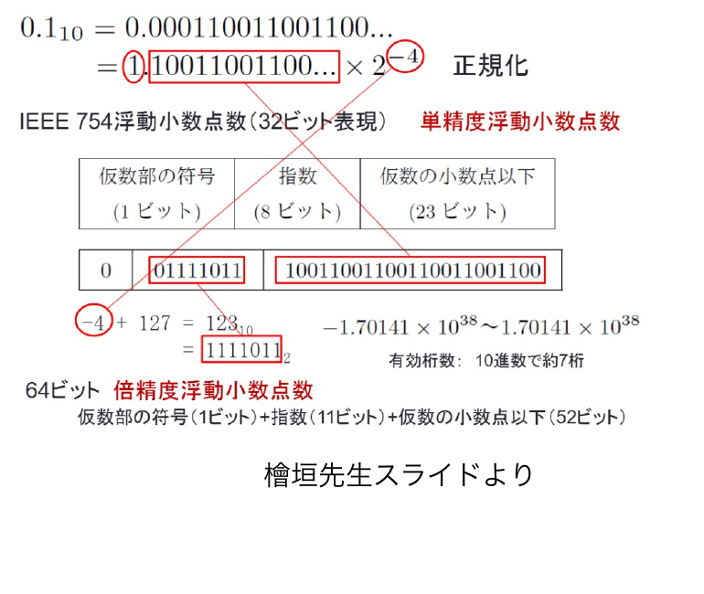

檜垣先生スライドより

<!--
- 0.1を2進数にすると(0.000110011001100…)₂と無限小数になり、有限桁で打ち切るため正確に保持できない。
- 理論値0.1×10=1だが、有限桁で計算すると0.999755859375になり丸め誤差が出る。これは不可避。
- 32ビット表現(IEEE754単精度浮動小数点数)の構成図。檜垣先生スライドより。
-->

---

2進数表現に慣れる

# ワーク (個人or2人) (5分)：プログラムと2進数の関係を理解する

① Moodleから、Colabを開きましょう

② 2進数・10進数の変換を試しましょう

③ ここまで、数々の表現を学びましたが、メモリ上に同じ形で書かれた2進数であっても、プログラムが指定した型が異なることで、別の数字を意味することを確認しましょう <b class="em">　また、64 bitになると沢山の数字を表せることを理解しましょう。</b>

追加：なぜ、64 bitになると、<b>大きなメモリ</b>も扱えるのでしょうか？

<!--
- ワーク(個人or2人, 5分)。ColabをMoodleから開き、2進数・10進数の変換を試す。
- 同じ2進数でもプログラムの型が異なれば別の数字を意味すること、64bitで多くの数字が表せることを確認。
- 追加問：なぜ64bitだと大きなメモリも扱えるのか。
-->

---

情報の変換

# 情報の変換　重要

ここまでで、<b>様々な数値的なデータをコンピューターが演算できる、2進数に出来る</b>ことが分かった。これを<b style="color:var(--accent-dark);">符号化</b>という。 
では、実際のデータをどのように、「数字」に変えるのだろうか？

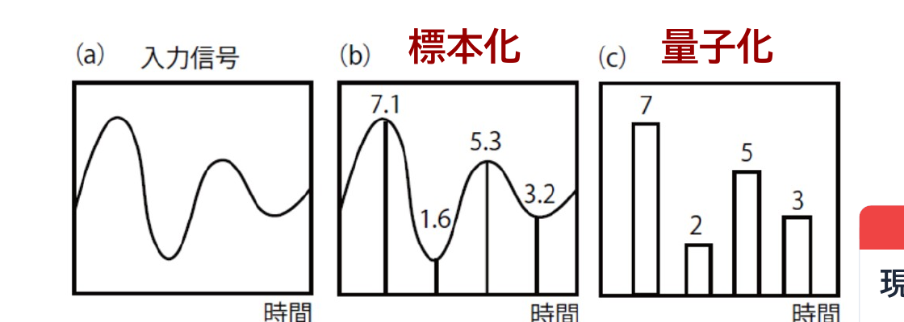

変換の考え方

標本化

▼

量子化

▼

符号化

<b>現象はアナログ(連続)</b> 
<b>サンプリングし量子化</b> 
<b>量子化できれば符号化</b> 
→ 0,1,0,1,...

檜垣先生スライドより

<!--
- ここまでで様々な数値データを2進数にできることが分かった。これを符号化という。実際のデータをどう数字に変えるか。
- 変換の考え方は標本化→量子化→符号化の3段階。現象はアナログ(連続)、サンプリングして量子化し、量子化できれば符号化(0,1,0,1,...)できる。檜垣先生スライドより。
-->

---

標本化

# 標本化

アナログ信号（音声や画像など）は連続的に変化する値 デジタル化の第一段階として、一定の時間間隔（サンプリング周期）で信号の値を切り出す作業を「標本化」という

<b style="color:var(--accent-dark)">サンプリング周期：</b>　データを取得する時間間隔。

<b style="color:var(--accent-dark)">サンプリング周波数(Hz)：</b> 　1秒間に何回サンプリングするか。

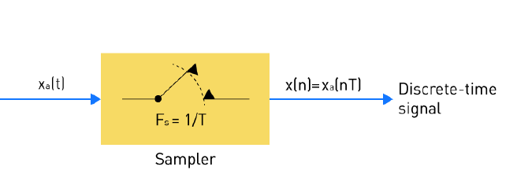

出典：https://media.monolithicpower.com/wysiwyg/Educational/ADC_Chapter_1_Fig4-_960_x_622.png

A/D変換

アナログ・デジタル変換

挙手： CDは圧縮されていると思う人？

<!--
- デジタル化の第一段階が「標本化（サンプリング）」。連続的なアナログ信号を、一定の時間間隔で値を切り出す。
- その間隔がサンプリング周期、1秒間の回数がサンプリング周波数(Hz)。図のサンプラーがその作業をしている。
- ここで挙手してもらう：「CDは圧縮されていると思う人？」——あとで答えを確認します。
-->

---

標本化定理

# 標本化定理　Fs &gt; 2・f

Shannon, Claude Author: Jacobs, Konrad Source: Konrad Jacobs, Erlangen Copyright: MFO

元の信号に含まれる最高の周波数の2倍以上の速さでサンプリングすれば、理論上元の波形を完全に復元できる

<b>Fs:</b> サンプリング周波数 / <b>f:</b> 元の信号の最大周波数

<b>音楽CD (44.1kHz)：</b>人の可聴域（約20kHz）の2倍以上を確保。 高音域をCDは持っていません。 　※16bitに減っていて、量子化誤差はある。 　　但し、人間の耳にとって、非圧縮です。

<b style="color:var(--accent-dark)">音声通信 (8kHz)：</b>会話に必要な4kHzまでを伝送。

<!--
- 標本化定理（シャノン）：元信号の最高周波数の2倍以上でサンプリングすれば、理論上は元の波形を完全に復元できる。Fs > 2・f。
- 音楽CDは44.1kHz＝可聴域20kHzの2倍以上を確保。高音域は持たず、16bitで量子化誤差はあるが、人間の耳には非圧縮。
- 音声通信は8kHz＝会話に必要な4kHzまでを伝送している。
-->

---

音声のデジタルへの変換

# CD (コンパクトディスク) 1枚

44.1kHz 16bit 2ch LPCM形式で、<b>79分58秒</b> 
<b>(44100×16×2) [bps]</b> × (79×60 + 58) [秒] / 8 [バイトへ] 
= 846,367,200 (バイト)　※ 10^2の括りでないこと注意 
≒ 807MB (メガバイト)　※÷ 1024 ÷ 1024 
→音じゃなくて、データ書けばよいのでは？ → <b>CD-R</b> 
→もっと細かくデータ書き込めばよいのでは？ → <b>ブルーレイ</b>

ビットレートとは、 <b>1秒間に処理または転送されるデータの量</b> <b>CDの場合、1.41Mbps</b>　<b>※ bps（bits per second）</b>

1.41

Mbps (CDビットレート)

<!--
- CD1枚を計算してみる。44.1kHz・16bit・2ch・79分58秒で、約846,367,200バイト＝約807MB。
- 「音そのものではなくデータを書けばよいのでは」→CD-R、「もっと細かく書ければ」→ブルーレイ、と発想がつながる。
- ビットレート＝1秒間に処理・転送されるデータ量。CDは1.41Mbps（bits per second）。
-->

---

画像のデジタルへの変換

# 画像の符号化

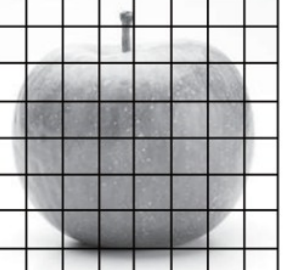

切り分けて、色を当てる

単純2値

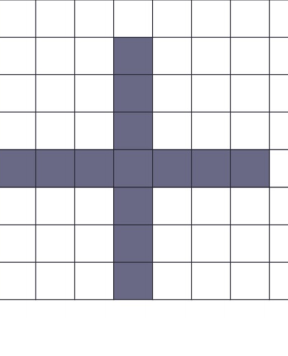

8bitグレースケール

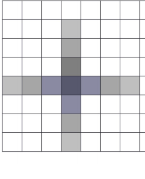

4色

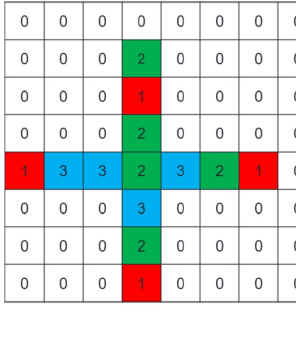

RGB

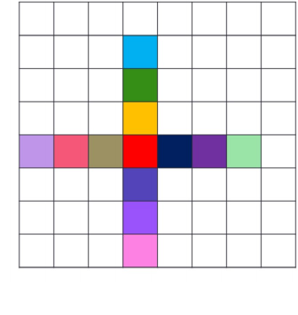

<!--
- 画像の符号化とは「切り分けて、色を当てる」こと。りんごに格子をかけ、各マスに色を割り当てるイメージ。
- 単純2値（白黒）、8bitグレースケール、4色、RGB——同じ十字でも、色の表現方法でデータ量が変わる。次のスライドで計算する。
-->

---

画像のデジタルへの変換

# 画像のデジタルへの変換　重要

単純2値

(8・8)/8 = 8B

8bitグレースケール

(8・8)・8[bit]/8 = 64B 8bit：256階調 (2^8通りの色)

4色

(8・8)・2[bit]/8 = 16B

RGB

(8・8)・3 = 192B 1箇所を256階調

96kB

768kB

192kB

2.25MB

1024✕768 のとき　／　Quark67(Modified color by Monami) - Image:Synthese+.svg, CC 表示-継承 3.0

<!--
- 同じ8×8の十字を、色の表現方法ごとにデータ量で比較する。重要ポイント。
- 単純2値=8B、8bitグレースケール=64B（256階調=2^8）、4色=16B（2bit）、RGB=192B（各画素を256階調×3）。
- これを1024×768に拡大すると、96kB / 768kB / 192kB / 2.25MB と桁が変わる。色数とデータ量の関係を体感してほしい。
-->

---

映像のデジタルへの変換

# 映像のデジタルへの変換

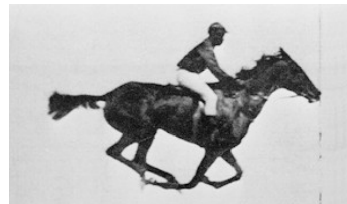
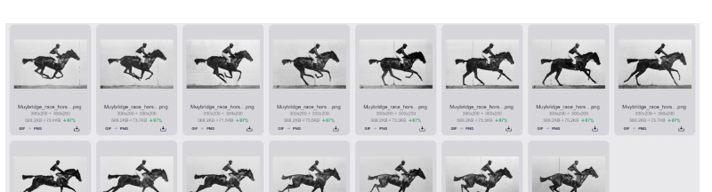

デジタル映像とは、画像を繋いだ、 <b>パラパラ漫画</b>である (映写機もそう)

<b>実際の映画も24fps(frames per second)</b>：何枚の静止画か？ スマホは、120fpsなど

アニメ「呪術◯戦」にて、禪院家が扱う術式「投射呪法」は、<b>1秒間を24分割する</b>

<!--
- デジタル映像の正体は「画像を繋いだパラパラ漫画」。映写機も原理は同じ。
- 実際の映画は24fps（1秒あたり24枚の静止画）。スマホは120fpsなど、もっと細かい。
- 余談：アニメ「呪術◯戦」の投射呪法も「1秒間を24分割する」設定——映画のフレームレートと同じ発想です。
-->

---

圧縮

# 情報の圧縮

<b>モースル信号の例</b> 出現頻度の高いアルファベットに短い符号

<b>可逆圧縮方式</b>　完全に元に戻せる圧縮 データ圧縮のLZH, ZIP, CAB

<b>非可逆圧縮方式</b>　元に戻せない圧縮。目立たない箇所を削る マルチメディアデータ（音声、画像等） WMA, AAC, MP3, ATRAC

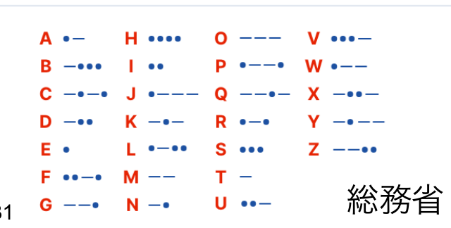

総務省

檜垣先生スライドより

<b>圧縮率50 (96kB)</b> 1024 ✕ 768　※元々は2.2MB なので4.2%

<b>圧縮率98 (24kB)</b> 1024 ✕ 768　1.0%

<!--
- 情報の圧縮。モールス信号は出現頻度の高い文字に短い符号を当てる——これも一種の圧縮。
- 可逆圧縮（LZH, ZIP, CAB）は完全に元に戻せる。非可逆圧縮（WMA, AAC, MP3, ATRAC）は目立たない箇所を削るので元に戻せないが、マルチメディアでは十分。
- 右の朝顔：圧縮率50%で96kB（元2.2MBの4.2%）、圧縮率98%で24kB（1.0%）。下の画像ほどブロックノイズが見える。
-->

---

圧縮のファイル形式と仕組み

# 圧縮のファイル形式と仕組み

<b>音声の圧縮形式</b> <b>wav：</b>非圧縮 <b>mp3/aac：</b>不可逆圧縮 <b>alac/flac：</b>可逆圧縮

<b>画像の圧縮形式</b> <b>bmp：</b>非圧縮 <b>jpg：</b>写真で一般的 <b>gif：</b>256色以下/可逆可 <b>png：</b>可逆可/透明可

<b>動画の圧縮形式 全て不可逆</b> <b>avi：</b>非圧縮 (コンテナ) <b>mpg2：</b>地デジ/DVD <b>mpg4：</b>現在の映像/Blu-ray ※H.265などweb配信

圧縮の仕組みの例

音声

目立たない周波数を落とす or 量子化を変える

画像

周囲の画素でまとめる

動画

前後のフレームで動かない所を変えない

昨今のスマホで僕らがマルチメディアを扱えるのは、圧縮技術とその復元技術の賜物

<!--
- 圧縮形式の整理。音声：wav非圧縮／mp3・aac不可逆／alac・flac可逆。画像：bmp非圧縮／jpg写真向き／gif256色以下／png可逆・透明可。動画：avi非圧縮、mpg2地デジ・DVD、mpg4現行・Blu-ray、H.265はweb配信——動画は全て不可逆。
- 仕組みの例：音声＝目立たない周波数を落とす／量子化を変える、画像＝周囲の画素でまとめる、動画＝前後フレームで動かない所を変えない。
- スマホでマルチメディアを自由に扱えるのは、圧縮技術と復元技術の賜物です。
-->

---

第5回について

# 第5回について

6/9 教室講義 (G3-12で対面実施)となります。 以下を持参してください。

① PCまたはタブレット、②スマホ、③メモを取るもの

Moodleに今回分の問題もあるので、忘れずに！ 
5/27 - 6/2の間に、第8回のオンデマンド授業が1日数動画ずつ、公開されます。 
そちらの視聴もお忘れなく。 
いま、授業はシラバスから1回分遅れて進行中です。 
<b>※ 第8回分の小テストは、第10回です。</b>

<!--
- 連絡事項。第5回は6/9に教室講義（G3-12で対面）。PCまたはタブレット、スマホ、メモを取るものを持参してください。
- Moodleに今回分の問題があるので忘れずに。5/27〜6/2に第8回のオンデマンド授業が1日数動画ずつ公開されるので、視聴もお忘れなく。
- 授業はシラバスから1回分遅れて進行中。第8回分の小テストは第10回なので注意してください。
-->
