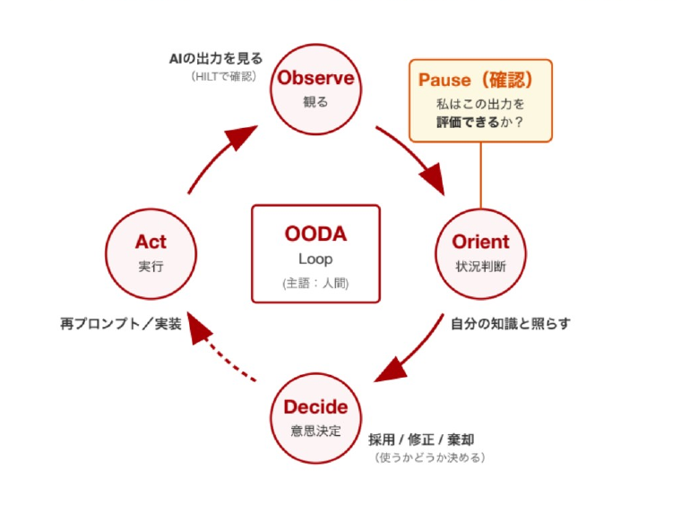
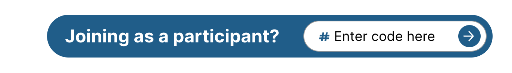

<!-- _class: cover-hero -->

学びを変える！研究を深める！

生成AI活用術

2026年度 第2回： 生成AIを利用した学び方

15-min or 30-min × 3 sessions

国際未来教育基幹 田川 翔

<b>学部1年生にも おすすめ</b>

<!--
- タイトルコール。第2回「生成AIを利用した学び方」。15分／30分×3セッション。学部1年生にもおすすめ。
-->

---

開始の前に

# 開始の前に

① <b>PCを立ち上げ、お持ちの</b> <b>千葉大学Google Workspaceにログインして下さい</b> → 学校のGmailが立ち上がる状況ならOKです。

② <b>インタラクションツール</b> slido <b>にアクセスして下さい</b> URLを配布したり、質問やアンケートをとったりします

スマホから

QRコードを読み取り

PCから

方法1　Google検索「<b>slido</b>」→コード入力

ALC-AI2-02　方法2　直接リンク

https://app.sli.do/event/t4nDVcb6pV8MTiWFcMG5gB

※<b>slido/ワーク教材への入力情報</b>のうち【個人情報や機微情報を除いた】情報をアカデミック・リンク・センター／附属図書館において、業務改善・調査研究・外部発表等に用います。個人が特定される情報や、利用されたくない情報は、入力しないようご注意ください。

<!--
- 開始前の準備。①千葉大Google Workspaceにログイン、②slidoにアクセス（スマホはQR、PCは検索orリンク）。入力情報の取り扱いに関する注意も案内。
-->

---

今回の構成

# 今回の構成

最初の15分

講義

- GemとNotebookLMを理解する - 学びに使えるアイデアを知る

真ん中<b style="color:var(--accent);">30</b>分 (前半だけも可)

体験

- Gem &amp; NotebookLMを使いこなしてみる - 気づきを共有してみる

最後の15分

議論・座談会

- 今日学んで面白かったことは何でしたか。 - Gemはどのような点に使えそうですか？ - NotebookLMはどう使えそうですか？

<!--
- 今回の構成は3部。最初の15分=講義、真ん中30分=体験、最後の15分=議論・座談会。
-->

---

Session 3の進め方

# 学びを変える！研究を深める！ 生成AI活用術

2026年度 第2回： 生成AIを利用した学び方　15-min sessions

<b>Session 3：</b> 今日の気づきをみんなで共有してみる。

国際未来教育基幹 田川 翔

<!--
- Session 3の章扉。「今日の気づきをみんなで共有してみる」がこのセッションのテーマ。
-->

---

OODAループでAIと関わる

# OODAループでAIと関わってみるのはどうか

図24. OODAループをAI活用の観点で修正したもの

AI学習のサイクル

<ul style="font-size:22px; line-height:1.5; margin:4px 0 8px 1em;">
<li><b>Observe</b>：AIが何を出してきたか観る</li>
<li><b>Orient</b>：自分の知識と照らす</li>
<li><b>Decide</b>：採用／修正／棄却を決める</li>
<li><b>Act</b>：使う、または再プロンプト</li>
</ul>

積上げ式はAI agentの学習にたぶん合わない

<ul style="font-size:21px; line-height:1.45; margin:4px 0 0 1em;">
<li>まずは使って、使えるか判断する</li>
<li>自分が評価できるようにしることが大切
<ul style="margin-left:0.8em;"><li>活用は、評価できる範囲で行う</li></ul></li>
<li>出力は、一歩立ち止まって考えてみる
<ul style="margin-left:0.8em;"><li>ハルシネーションやバイアスはいまだにある</li></ul></li>
</ul>

「<b>使ってみる → 評価する → 工夫する</b>」サイクルを持つことが、AI活用力を高める鍵

<!--
- OODAループ（Observe→Orient→Decide→Act）をAI活用の観点で読み替える。使ってみる→評価する→工夫する、のサイクルがAI活用力を高める鍵。
-->

---

Session 3の進め方

# Session 3の進め方　議論・座談会 / 最後の15分　slidoで進めます

- 今日学んで面白かったことは何でしたか。 
- Gemはどのような点に使えそうですか？ 
- NotebookLMはどう使えそうですか？

<b>お願い：協力的な場作りが、学びの秘訣です。</b> 敬意をもって、忌憚なく、建設的に、話し合いましょう

スマホから

PCから

方法1　Google検索「<b>slido</b>」→コード入力

ALC-AI2-02

方法2　直接リンク

https://app.sli.do/event/t4nDVcb6pV8MTiWFcMG5gB

※slidoへの入力情報のうち【個人情報や機微情報を除いた】情報をアカデミック・リンク・センター／附属図書館において、業務改善・調査研究・外部発表等に用います。個人が特定される情報や、利用されたくない情報については、入力しないようご注意ください。

<!--
- Session 3はslidoで進行。3つの問い（面白かったこと／Gemの使いどころ／NotebookLMの使いどころ）について、敬意をもって建設的に話し合う。
-->

---

終了時アンケート・次回予告

# 終了時アンケート・次回予告

次回以降も「さらにみなさんのニーズにあわせた」企画を実施するため、 <b>終了時アンケート</b>へのご協力をお願いいたします。 https://forms.gle/5sXy6f5yZkoJ8XJZ7

【お願い】アンケートへの入力情報のうち【個人情報や機微情報を除いた】情報を、アカデミック・リンク・センター／附属図書館において、業務改善・調査研究・外部発表等に用います。個人が特定される情報や、利用されたくない情報については、入力しないようご注意ください。

学びを変える！

研究を深める！

生成AI活用術

2026年度 第3回： <b>NotebookLM (ゲスト講師回)</b>

15-min or 30-min × 3 sessions

次回予告

情報・データサイエンス学部 3年の先輩と自分で進めます。学生目線の意見にも注目です！

<b>6/11 (木) 16:10 - 17:10</b> 会場(ここ)・オンライン併用

<!--
- 終了時アンケートへの協力依頼。次回（第3回）はNotebookLM・ゲスト講師回。6/11(木)16:10-17:10、会場とオンライン併用。
-->
