<!-- _class: cover-hero -->

情報リテラシ 第8回 ／ オンデマンド

ネットワークの仕組みと インターネット

23 & 24クラス （医工学 ／ 都市環境システム ／ 応用化学）

担当：千葉大学 国際未来教育基幹 田川 翔（専門：高等教育論・地球惑星科学）

---

この回の進め方

## 第8回はオンデマンド ─ 視聴期限と課題を最初に確認

📺 受講のしかた

- 全 **10本** の動画を順番に視聴（途中で止めてOK）
- 各動画にスライド資料（この PDF）が対応
- 実演パート（dig で名前解決／HTML の中身）は手元でも追える
- 質問は Moodle の質問フォーラムへ（slido なし）

🗂 大きく3つの山だけ覚える

- ① インターネットの仕組み（**TCP/IP・OSI**）
- ② データベース（**SQL**）
- ③ クラウド

🗓 期限（Moodle で要確認）

<table class="dtbl" style="width:100%">
<tr><th>項目</th><th>期限</th></tr>
<tr><td class="l">動画の<strong>視聴期限</strong></td><td>6/9（月）</td></tr>
<tr><td class="l"><strong>課題</strong>の提出</td><td>6/16（月）</td></tr>
<tr><td class="l">提出先</td><td class="mono">Moodle</td></tr>
</table>

視聴 → 課題の順。視聴を 6/9 までに終えれば、課題（6/16）に1週間使える。

「なぜ繋がらない？」を AI に聞いても、<strong>仕組みを知らなければ答えの正否を判断できない</strong>。だから中身を学ぶ。

案内日程は Moodle の掲示が正本。差異があれば Moodle を優先してください。

---

<!-- _class: fig -->

この回の地図

## 「URL を入れてからページが出るまで」を1本の旅として追う

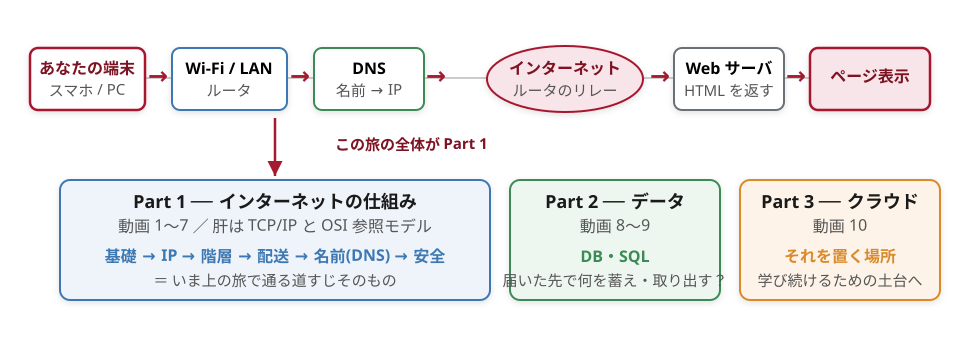

各動画のページ上部に同じ <strong>旅バー</strong> を小さく置き、いま旅のどこの話かを赤で点灯します。

なぜ学ぶか 2025年11月18日、Cloudflare で <strong>設定ファイルが想定の倍以上に肥大化</strong>して処理停止、X・ChatGPT 等が世界規模でエラーに。サイバー攻撃ではなく地味なバグ。仕組みを知ると「なぜ落ちたか」を自分で読み解ける。

出典: Cloudflare 公式ブログ「Cloudflare outage on November 18, 2025」

ゴールは1つ ── 「URL を入れてからページが出るまで」を自分で説明できること

---

<!-- _class: divider -->

動画 1 ／ CHAPTER 1

# 学び方と、この講義の地図

## 第1タームお疲れさま — 学びの「モード」を増やす（約8分）

---

<!-- _class: fig -->

前回の振り返り

## 「音や画像をどう0と1にしたか」を、まず思い出す

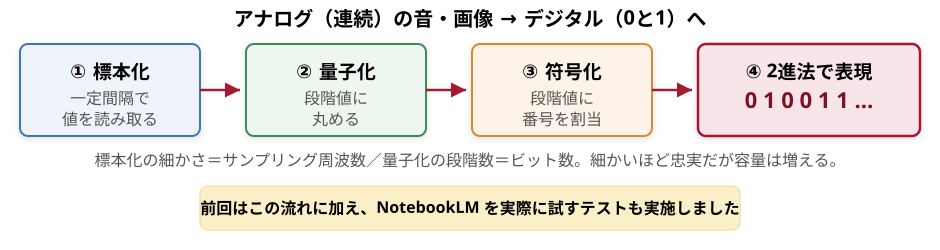

第7回：標本化 → 量子化 → 符号化 → 2進法。連続した現実を、機械が扱える離散の数列に変換する。

第8回は逆向き — その「0と1の数列」が、世界中をどう旅して届くかを追う。

---

<!-- _class: split -->

学び方

## 情報の集め方は、1つじゃない — 「5つのモード」

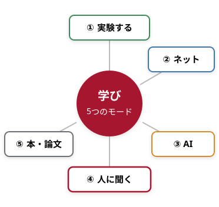

<table class="dtbl" style="width:100%; font-size:17px">
<tr><th>モード</th><th>手段</th><th>強み</th></tr>
<tr><td class="l">① 実験する</td><td class="l">手を動かす・dig で試す</td><td class="l">体で覚わる</td></tr>
<tr><td class="l">② ネットで調べる</td><td class="l">検索・公式ドキュメント</td><td class="l">速い・最新</td></tr>
<tr><td class="l">③ AI に聞く</td><td class="l">Gemini 等</td><td class="l">対話で整理</td></tr>
<tr><td class="l">④ 人に聞く</td><td class="l">友人・先生・図書館の院生 LS</td><td class="l">経験知・即修正</td></tr>
<tr><td class="l">⑤ 本・論文</td><td class="l">信頼できる貯蔵庫／最先端</td><td class="l">深さ・多様な見方</td></tr>
</table>

「ググレカス」と言われた時代もある。でも今は 調べ方そのものが多様化した。1つに偏らないこと。

この講義での使い分け

- ① は dig 実演・Colab、④ は附属図書館の LS（院生）
- どれにも偏らず、行き来して確かめるのがコツ

全部を一人で・1つの方法で分かる必要はない。5つを行き来する。

---

<!-- _class: split -->

大学で学ぶ意味

## 「全部 AI で完結」は、もったいない

④ 人に聞く — 大学という「場」

- 安全に失敗でき、人の経験・実践知を直接聞ける
- 友人・先生に加え、附属図書館では大学院生（**LS：ラーニング・サポーター**）が質問に対応
- 同じ問いでも、答える人で見える景色が変わる

⑤ 本・論文 — 機械より「奥」がある

- **本**＝信頼できる情報が体系立てて貯蔵された場所
- **論文**＝最先端・多様な見方に触れられる一次情報
- AI の答えの「正しさ」を確かめる土台になる

なぜ「中身」を学ぶのか

2025年11月18日、ネットの土台 Cloudflare で 設定ファイルが想定の倍以上に肥大化して処理停止、X・ChatGPT など多数のサービスが世界規模でエラーに。サイバー攻撃ではなく地味なバグ。AI に「なぜ繋がらないの？」と聞いても、仕組みを知らなければ答えの正否を判断できない。だから中身を学ぶ。

出典: Cloudflare 公式ブログ「Cloudflare outage on November 18, 2025」

あなたが「分からないこと」に出会ったとき、最初に動かすのはどのモード？

学び方を身につけることは、卒業後も生涯「学び続ける」力そのもの。

---

<!-- _class: split -->

AIとの付き合い方

## 浅く聞けば浅い／文脈を与えれば深い

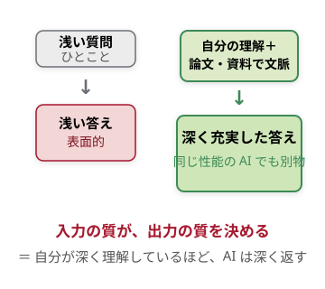

良い使い方（前回の自由記述より）

- 思考力低下を防ぐため、丸投げせず主体的・補助的に
- 要領よく「深く・広く」学ぶために
- 誤情報・ハルシネーションは必ず確認

学び方の核（同じく自由記述より）

- 実践による習得／中身の理解／外部リソースでの裏取り

AI は学びの「軸」ではなく、5つのうちの 1モード 重要

同じ AI でも、与える文脈の深さで答えは段違い。鍛えるべきは「自分」。

---

<!-- _class: fig -->

学び方の根拠

## 「効く学び方」は研究でも示されている

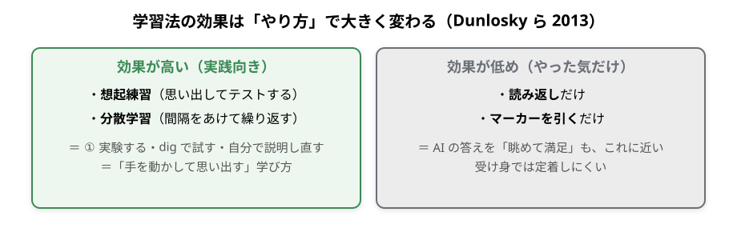

出典: Dunlosky et al. (2013) Improving Students' Learning With Effective Learning Techniques. <em>Psychological Science in the Public Interest</em>, 14(1).

「思い出す・試す・説明する」を回す — 5モードはこの研究とも噛み合う。

---

<!-- _class: divider -->

動画 2 ／ CHAPTER 2

# ネットワークの基礎

## まず「あなたの端末」と「最初の関門 Wi-Fi／LAN」を知る（約14分）

---

<!-- _class: fig -->

ネットワークとは

## インターネット＝ネットワーク同士を繋いだ「網の網」 重要

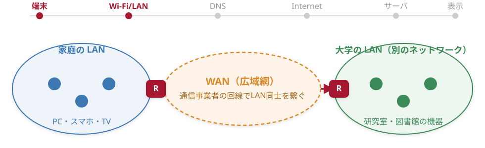

「相互に接続されたネットワーク（inter-network）」＝インターネット。LAN＝限られた範囲／WAN＝広域、繋ぐ装置がルーター(R)。

小さな網（LAN）を、広い網（WAN）でいくつも繋いだものが「網の網」。

---

<!-- _class: split -->

ネットワークの種類

## LAN と WAN ── 「範囲」と「持ち主」で区別する

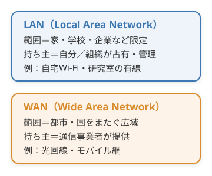

LAN ＝ ローカルエリア

- 限られた範囲を自分／組織で占有
- 有線（ケーブル）・無線（電波）の2方式
- LAN→WAN へ繋ぐ装置がルーター

WAN ＝ ワイドエリア

- LAN同士を広域で繋いだ網
- 基幹は光ファイバー、事業者が運用
- ネットワークは人や交通網にもある概念

いま自分が繋いでいるのは LAN？ WAN？ その「持ち主」は誰だろう。

違いは「広さ」だけでなく「誰が持ち管理しているか」。

---

<!-- _class: split -->

サーバとクライアント

## 役割は「相対的」── 提供すればサーバ、利用すればクライアント

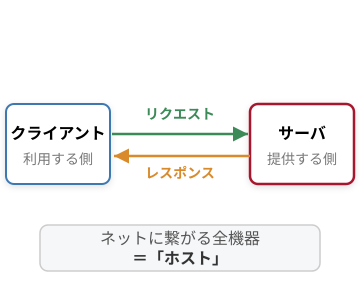

クライアントサーバシステム 重要

- サーバ＝サービスを提供／クライアント＝利用
- 要求（リクエスト）→ 応答（レスポンス）でやりとり
- ネット上の全コンピュータ＝ホスト

「相対的」とは

- 自分のノートPCをサーバにもできる
- 役割は固定でなく、その時の関係で決まる
- 同じ機器が、時にサーバ・時にクライアント

「サーバ／クライアント」は機械の種類ではなく“役割”の名前。

---

<!-- _class: split -->

有線LANと無線LAN

## つなぎ方は2通り ── ケーブル（有線）か、電波（無線）か

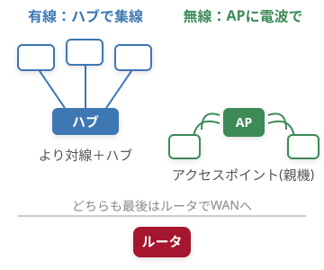

有線LAN（イーサネット）

- 規格＝Ethernet（イーサネット）
- ケーブル＝より対線／集線装置＝ハブ
- 速度の目安 100Mbps〜10Gbps

無線LAN（Wi-Fi）

- 規格＝IEEE 802.11。互換保証の機器名が Wi-Fi
- 親機＝アクセスポイント(AP) に電波で接続
- ケーブル不要だが、電波は届く＝他人にも見える

なぜ学ぶか｜偽Wi-Fi（Evil Twin）

2024年7月、豪州で旅客機内に偽Wi-Fiを立て乗客のログイン情報を盗んだ人物が連邦警察に逮捕。便利な入口は、最も狙われる入口でもある。

出典: kaspersky.co.jp / Evil Twin attacks

Wi-Fi は WAN ではなく「無線でつなぐ LAN の一形態」。

---

<!-- _class: fig -->

Wi-Fiの規格

## 世代が進むほど高速に（規格は IEEE 802.11 ファミリー）

<table class="dtbl" style="font-size:18px">
<tr><th>規格名</th><th>世代の呼称</th><th>周波数帯</th><th>通信速度（理論上の最大）</th></tr>
<tr><td>IEEE 802.11b</td><td>（公式の世代番号なし）</td><td>2.4GHz</td><td>11Mbps</td></tr>
<tr><td>IEEE 802.11g</td><td>（公式の世代番号なし）</td><td>2.4GHz</td><td>54Mbps</td></tr>
<tr><td>IEEE 802.11a</td><td>（公式の世代番号なし）</td><td>5GHz</td><td>54Mbps</td></tr>
<tr><td>IEEE 802.11n</td><td>Wi-Fi 4</td><td>2.4 / 5GHz</td><td>600Mbps</td></tr>
<tr><td>IEEE 802.11ac</td><td>Wi-Fi 5</td><td>5GHz</td><td>約6.9Gbps</td></tr>
<tr><td>IEEE 802.11ax</td><td>Wi-Fi 6</td><td>2.4 / 5GHz</td><td>9.6Gbps</td></tr>
</table>

世代呼称の注記：「Wi-Fi 4／5／6」は 11n 以降に あとから付けた分かりやすい呼び名。a/b/g には公式番号がない（抜けではない）。表の速度はいずれも理論上の最大値で、実効値はこれより大幅に低い。

自宅のルーターは Wi-Fi 何？　2.4GHz と 5GHz、電子レンジに弱いのはどっち？

---

<!-- _class: fig -->

WAN・モバイル通信

## スマホはモバイル網を通じて WAN に繋がる

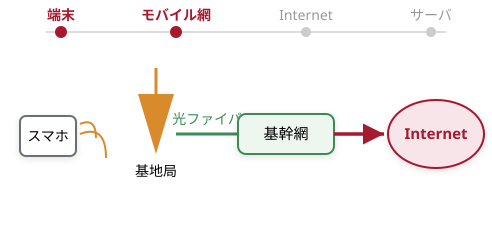

<table class="dtbl" style="font-size:18px">
<tr><th>世代</th><th>開始</th><th>速度の目安（最大）</th></tr>
<tr><td>1G</td><td>1979</td><td>アナログ音声</td></tr>
<tr><td>2G</td><td>1993</td><td class="l">数十kbps（EDGEで最大384kbps）</td></tr>
<tr><td>3G</td><td>2001</td><td>14Mbps</td></tr>
<tr><td>4G(LTE)</td><td>2010〜</td><td class="l">100Mbps〜1Gbps</td></tr>
<tr><td>5G</td><td>2020</td><td>20Gbps（ITU目標ピーク）</td></tr>
</table>

WANに繋がる＝世界と通信できる

- 各端末が固有のIPアドレスを持つ（→動画3）
- LTE は 4G の一部（LTE-Advanced で1Gbps級へ進化）

スマホはかつて電話回線、今はモバイル通信で WAN へ。世代が進むほど高速・大容量に。値はいずれも理論値で、実効速度はこれより低い。

---

<!-- _class: divider -->

動画 3 ／ CHAPTER 3 ★核

# IPアドレスとサブネット・ポート

## 荷物に書く「宛先住所」を決める（約18分）

---

<!-- _class: fig -->

IPアドレスの基礎

## IPアドレス＝ネット上の「住所」（32ビット） 重要

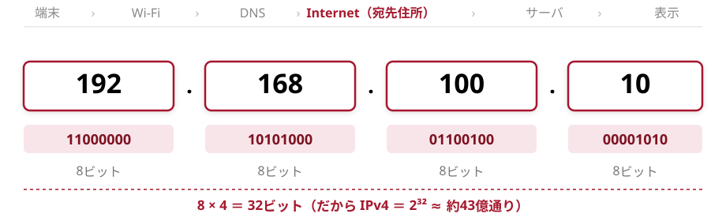

32ビットを 8ビットずつ 4つ（オクテット）に区切り、10進法で表記。各オクテットは 0〜255（256個＝2⁸）。

パケットを届けるには宛先が要る → 全機器に固有のIP（住所）を割り当てる。

---

<!-- _class: fig -->

2進⇔10進の手計算

## なぜ 11000000 ＝ 192 なのか（桁の重み）


「1が立っている桁の重みを足す」だけ。これが2進→10進の正体で、サブネットの計算にもそのまま効く。

指でやってみよう：10101000 はいくつ？（ヒント：128＋32＋8）

---

<!-- _class: split -->

サブネットとCIDR

## IPは「ネットワーク部」＋「ホスト部」 重要

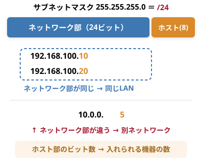

サブネットマスク＝区切り線

- どこまでがネットワーク部かを示すビット列
- /24＝上位24ビットがネット部（＝255.255.255.0）
- 残り8ビットがホスト部（機器ごとの番号）

／24で使える台数は？（手計算）

- ホスト部8ビット → 2⁸ ＝ 256 アドレス
- うち2つは予約：.0＝ネットワークアドレス／.255＝ブロードキャスト
- 実際に機器へ割当可能＝ 2⁸−2 ＝ 254台

「同じネットワークにいるか？」はネットワーク部が一致するかで決まる。

---

<!-- _class: fig -->

NATとIPの節約

## LAN内はプライベート、世界に出る時だけグローバル 重要

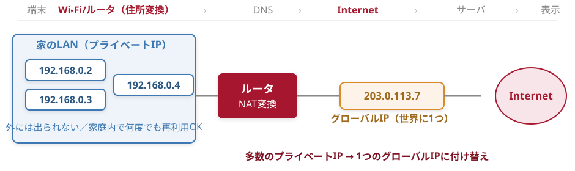

なぜ学ぶか｜「閉域網だから安全」の崩壊 2022年、大阪の総合医療センターがランサムウェアで電子カルテ停止、外来全面再開まで約2か月。侵入口は外部委託先のVPN機器。「LAN内＝プライベートIPだから安全」は通用しない。出典: ITmedia（2023-03-28）

グローバルIPはICANNが管理。IPv4＝32ビット＝約43億個 → 枯渇 → IPv6＝128ビット＝2¹²⁸（約3.4×10³⁸、1兆×1兆×1兆級）でほぼ枯渇しない。

多数の機器を、ルータの1つのグローバルIPで使い回す仕組み＝NAT。

---

<!-- _class: split -->

ポート番号

## IPは「建物の住所」、ポートは「部屋番号」 重要


IP:port で「サービス」を指定

- 1台のホストで複数のサービスを同時に運用できる
- 0〜1023＝well-known（予約済み）：80=HTTP / 443=HTTPS
- 自作アプリは大きめの番号：localhost:8000（＝127.0.0.1）

192.0.2.1:443 ＝「この住所の 443号室（HTTPS）へ届けて」

ブラウザのURLに :80 を書かないのに繋がるのはなぜ？（ヒント：既定の部屋番号）

住所（IP）＋部屋番号（ポート）で、初めて「どのサービスへ」が決まる。

---

ワーク③

## ワーク：自分のIPアドレスを調べてみよう

🔧 手元の端末で確認する

- ① 今の接続は 自宅Wi-Fi / 大学Wi-Fi / モバイル のどれ？
- ② そのIPは プライベート（192.168.x.x / 10.x.x.x）？
- ③ 自宅ルータのグローバルIPは何個？（ヒント：NAT）
- ④ 友だちとネットワーク部（/24）は一致する？

確認手順：スマホ＝Wi-Fi設定の「詳細」、PC＝ipconfig（Win）/ ifconfig（Mac）。

見るポイント

- 表示された IP の先頭が 192.168 / 10. なら家庭内のプライベートIP
- グローバルIPは「確認くん」等のサイトで分かる（ルータに普通1個）
- 同じWi-Fi同士はネットワーク部が一致するはず

［自分のIP確認画面のスクショを貼る］ 例：スマホのWi-Fi詳細 / 端末のIP表示 （画像はこちらで差し込みます）

「住所のしくみ」を自分の環境に当てはめると、いちばん腹落ちする。

---

<!-- _class: divider -->

動画 4 ／ CHAPTER 4

# プロトコルと階層モデル

## 住所を書いた荷物に、各層が「宛名シール」を重ねて貼る（約12分）

---

<!-- _class: split -->

プロトコルとは

## 通信プロトコル＝あらかじめ定めた「規約・手順」 重要

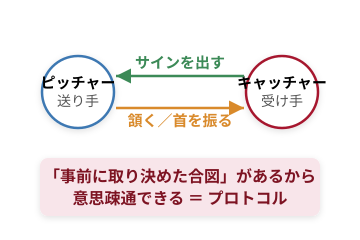

身近な例・語源

- 野球のサイン交換／固定電話のモデムの「ピー音」
- 語源は「外交儀礼」→ ITでは「規約・手順」

世界共通だから繋がる

- 機種・OS・メーカーが違っても通信できる
- スマホで送った文書をPCで開けるのはプロトコルが世界共通だから

なぜ学ぶか ｜ 約束が破れると都市が止まる

暗号化されていないスマート信号機を「青のまま固定」に改ざんできた事例が報告。設計が甘いと交通インフラごと操作される。

出典: Trend Micro / 総務省ガイドライン第3.0版(2024)

「同じ言葉・同じ手順」を決めておかないと、何が困ると思う？

---

<!-- _class: fig -->

TCP/IP 4層

## TCP/IPは「4階層」── 各層が役割を分担する 重要

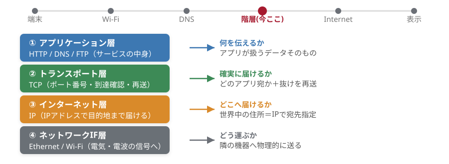

色は講義を通じて固定 ── 青＝アプリ／緑＝トランスポート／橙＝IP／灰＝物理。前回学んだIPは③に座る。

---

<!-- _class: fig -->

4層 ↔ 7層

## TCP/IP「4階層」 ↔ OSI参照モデル「7階層」 重要

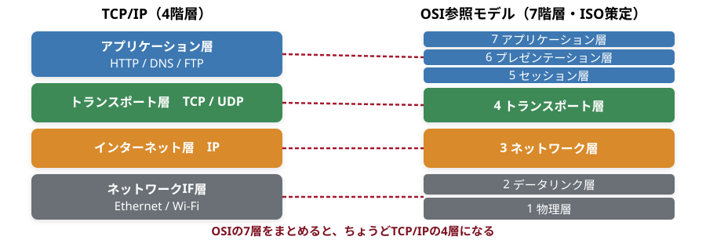

⚠ 取り違え注意 ── TCP/IP＝4階層／OSI＝7階層。OSIの上3層がTCP/IPのアプリ層に、下2層がIF層に対応する。

---

<!-- _class: split -->

カプセル化

## 各層が「宛名（ヘッダ）」を足して、入れ子に包んでいく 重要

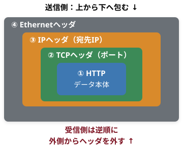

パケットができるまで

- 上位（アプリ）→下位（物理）へ、各層が順にヘッダを付与
- 外側ほど後で貼られ、外側から先に読まれる
- 受信側は逆順にヘッダを外して中身を取り出す

郵便メタファ

- 便箋（HTTPデータ）→ 封筒に部屋番号（TCPポート）
- → 宛名・住所（IP）→ 配送業者の区分け袋（Ethernet）
- 宛名シールを一枚ずつ重ねて貼るイメージ

便箋 → 封筒（部屋番号）→ 宛名（住所）→ 区分け袋

各層が宛名シールを重ねて貼り、受け手は外側から順にはがす ── これがカプセル化

---

<!-- _class: fig -->

ヘッダの中身

## 「宛名シール」には何が書いてあるか ── 層ごとの担当を表で

<table class="dtbl" style="font-size:18px">
<tr><th>層（色）</th><th>付けるヘッダ</th><th>主な中身（＝何を書く）</th><th>郵便でいうと</th></tr>
<tr><td class="l" style="color:#3E78B2;font-weight:700">① アプリ</td><td>—（データ本体）</td><td class="l">送りたい中身（Webページ要求など）</td><td>便箋の文章</td></tr>
<tr><td class="l" style="color:#3C8A57;font-weight:700">② トランスポート</td><td>TCPヘッダ</td><td class="l">ポート番号・順序番号・確認応答</td><td>封筒の部屋番号</td></tr>
<tr><td class="l" style="color:#D98A2B;font-weight:700">③ インターネット</td><td>IPヘッダ</td><td class="l">宛先IP・送信元IP</td><td>宛名・住所</td></tr>
<tr><td class="l" style="color:#6B6F76;font-weight:700">④ ネットワークIF</td><td>Ethernet等</td><td class="l">隣の機器のMACアドレス・誤り検出</td><td>区分け袋・伝票</td></tr>
</table>

ポイント：下の層は「上の層が何を運んでいるか」を気にしない。中身を読まずに、自分の宛名シールだけ見て運ぶ。

この「各層が独立して仕事する」設計のおかげで、Wi-Fiでも光ファイバーでも同じIPパケットがそのまま流せる。

---

<!-- _class: divider -->

動画 5 ／ CHAPTER 5

# パケット交換・配送・信頼性

## データはどう小分けされ、ルータのバケツリレーで届くのか（約15分）

---

<!-- _class: fig -->

2つの通信方式

## 回線交換 vs パケット交換 重要

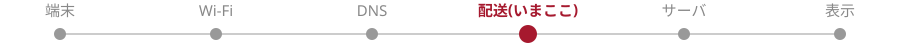

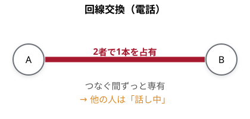

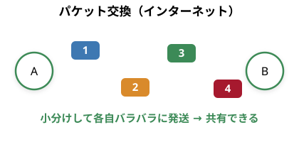

電話＝回線を占有／インターネット＝パケットで共有。だから1本の回線をみんなで使える。

---

<!-- _class: summary -->

2つの通信方式

## 同じ「つなぐ」でも、ここが違う 重要

<table class="dtbl" style="font-size:21px; width:92%">
<tr><th></th><th>回線交換（電話）</th><th>パケット交換（インターネット・主流）</th></tr>
<tr><td class="l">回線の使い方</td><td>2者が占有</td><td>みんなで共有</td></tr>
<tr><td class="l">混雑したとき</td><td>つながらない／切れる</td><td>遅くなっても切れにくい</td></tr>
<tr><td class="l">一部が壊れたら</td><td>最初からやり直し</td><td>そのパケットだけ再送</td></tr>
<tr><td class="l">弱点</td><td>占有中は他者が使えない</td><td>分割・ヘッダの手間／速度保証は困難</td></tr>
</table>

電話は「話し中」になるのに、ネットはみんなで同時に使える。なぜ？

パケット交換＝「小分け＋共有＋必要な所だけ再送」。だから今の主流になった。

---

<!-- _class: fig -->

パケットの中身

## データを小分けし、各パケットに「送り状（ヘッダ）」を貼る

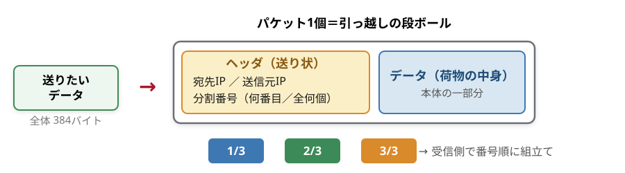

ヘッダ＝段ボールの「送り状」。宛先・差出人・何番目かを書いておけば、バラバラに届いても現地で復元できる。

データを丸ごと1本で送らず小包に分けるから、一部が消えてもその1個だけ送り直せる。

---

<!-- _class: fig -->

ルーティング

## ルーターが宛先IPを見て「次の一歩」を選ぶ 重要

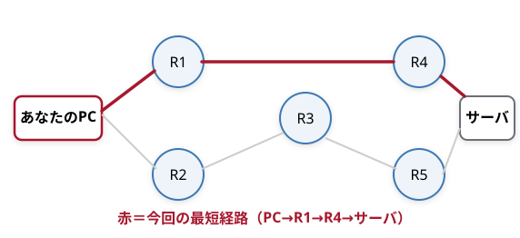

R1 の経路制御表（地図）

<table class="dtbl" style="font-size:16px;margin:2px 0">
<tr><th>宛先（行き先）</th><th>次に渡す相手</th></tr>
<tr><td class="l">サーバの方面</td><td>R4 へ</td></tr>
<tr><td class="l">別ネットワーク</td><td>R3 へ</td></tr>
</table>

各ルータは経路制御表（ルーティングテーブル）を見て、宛先IPから「次にどこへ渡すか」だけを決める。

宛先IPを見て次へ渡す——ルータのバケツリレーで世界中に届く。

---

<!-- _class: fig -->

通信の信頼性

## 誤りを「見つける（パリティ）」「送り直す（再送・ACK）」

① 誤りを見つける：パリティ検査

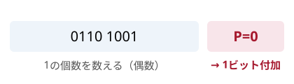
<ul>
<li>受信時に1が奇数なら「誤りあり」と分かる</li>
<li>チェックデジット（学生証・航空運送状）と同じ理屈</li>
</ul>

② 送り直す：TCPの再送（ACK）

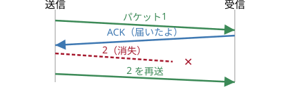
<ul>
<li>順序番号で抜けを検出、ACKが来なければ再送</li>
</ul>

なぜ学ぶか　2021年10月、Facebook(現Meta)が経路案内（BGP）設定をしくじり、自社への経路情報をインターネットから誤って取り消した。Facebook・Instagram・WhatsApp が世界規模で約6時間ダウン。地図(経路制御表)を1か所間違えると、荷物(パケット)が宛先を見失い行方不明になる。出典: Cloudflare Blog（Oct 2021 Facebook outage）

---

<!-- _class: fig -->

パリティ検査の手計算

## 「1の個数が偶数」になるよう、パリティビットを1つ足す 重要

手計算：データ 1011001 に偶数パリティを付ける


できること

<ul>
<li>「データ＋パリティ」の1の総数は常に偶数</li>
<li>受信側で1が奇数なら 1ビットの誤りを検出できる</li>
</ul>

できないこと（甘さ）

<ul>
<li>2ビット同時の誤りは偶数のまま → 見逃す</li>
<li>誤りの位置特定・訂正もできない（だからTCPのACK/再送で二重に守る）</li>
</ul>

1110 1010 に偶数パリティを付けるなら、P は 0 と 1 のどっち？（ヒント：1の個数を数える）

---

<!-- _class: divider -->

動画 6 ／ CHAPTER 6

# 名前から、ページへ

## DNS・ドメイン・URL・HTML（約13分）

旅の現在地 ── 「人間が覚える<b>名前</b>」を、機械の住所<b>IP</b>に翻訳して出発する

---

<!-- _class: fig -->

DNS

## ドメイン名を IPアドレスに翻訳する 重要

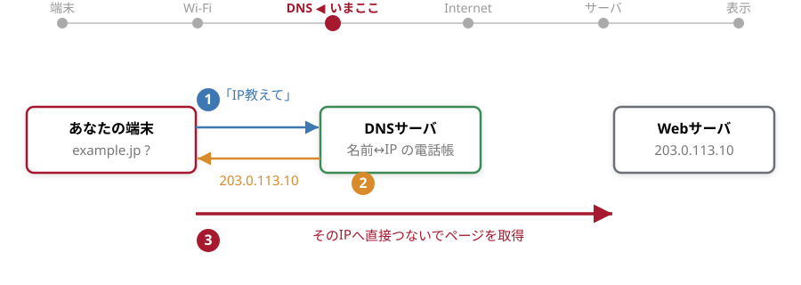

パケットの宛先に書けるのは IPアドレス だけ。覚えやすい名前を住所に直す「翻訳係」が DNS（Domain Name System）。

もし世界中のDNSが全部止まったら、サーバが生きていてもページは開ける？

---

<!-- _class: split -->

dig で確かめる

## 名前解決を自分の手で見る ── dig

① まず名前→IP を引く（+short）

<table class="dtbl" style="width:100%">
<tr><th>入力</th><th class="l">出力（例）</th></tr>
<tr><td class="l mono">dig example.jp +short</td><td class="l mono">203.0.113.10</td></tr>
<tr><td class="l mono">dig www.chiba-u.jp +short</td><td class="l mono">133.82.xxx.xxx</td></tr>
</table>

※IPは説明用の例（203.0.113.0/24 は文書用の予約帯）。実際の値は環境・時刻で変わるので、自分で dig して確かめよう。

② 委任を辿る（+trace）

- dig example.jp +trace で
- ルート（.）→ TLD（.jp）→ 権威DNS
- と「電話帳をたらい回し」する様子が見える

③ 委任の階層イメージ

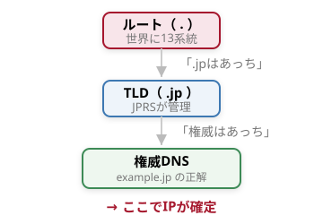

DNSは1台ではない。ルート→TLD→権威の「委任のリレー」で答えにたどり着く。

---

<!-- _class: fig -->

ドメインの構造

## ドメインは「後ろから」読む ── www.kantei.go.jp 重要

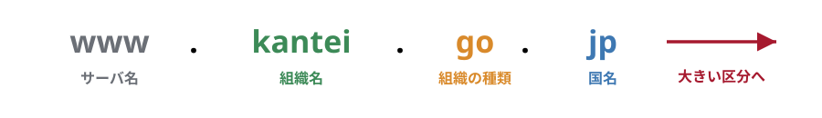

<table class="dtbl">
<tr><th>組織の種類（.jp）</th><th>意味</th></tr>
<tr><td>ac</td><td class="l">大学・研究機関</td></tr>
<tr><td>co</td><td class="l">民間企業（会社）</td></tr>
<tr><td>go</td><td class="l">政府機関</td></tr>
<tr><td>or</td><td class="l">協同組合・NPO等の法人組織</td></tr>
<tr><td>ed / lg</td><td class="l">小中高など / 地方公共団体</td></tr>
</table>

<table class="dtbl">
<tr><th>末尾</th><th>意味</th></tr>
<tr><td>jp</td><td class="l">日本（国コード ccTLD）</td></tr>
<tr><td>uk / de / cn</td><td class="l">英 / 独 / 中（各国）</td></tr>
<tr><td>com / net / org</td><td class="l">国に属さない一般ドメイン(gTLD)</td></tr>
</table>

元は米国内だけで末尾の国名が不要だった名残が .com 等の gTLD。国とは無関係で「米国のもの」ではない。

---

<!-- _class: split -->

WWW と HTTP

## Web は HTTP で運ぶ。いまは暗号化した HTTPS が標準

WWW（World Wide Web）

- 不特定多数へ情報を届けるしくみ
- 文書どうしをハイパーリンクで結んだハイパーテキスト
- 転送のプロトコル＝HTTP（HyperText Transfer Protocol）

HTTP → HTTPS

- https:// は通信を暗号化（鍵マーク 🔒）
- ログイン・学籍情報・決済の盗み見を防ぐ（詳細は動画7）

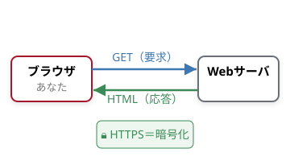

なぜ学ぶか｜偽サイトを見破る 日本のフィッシング報告は2024年に過去最多 171万件超、約75%が実在サービスの“なりすまし”。鍵マーク（HTTPS）とURLの構造を読めることが、最初の防具になる。

出典: フィッシング対策協議会／日経（2025） https://scan.netsecurity.ne.jp/article/2025/06/12/53031.html

---

<!-- _class: fig -->

URLの分解

## URL ＝ Webページの「住所」 重要

教科書の編末問題も http://www.example.jp/index.html を ①〜④ に分解させる定番。パスを省くと最上位ページへ。

---

<!-- _class: fig -->

HTML・CSS・ブラウザ

## HTML＝構造、CSS＝装飾。ブラウザが解釈して表示する 重要

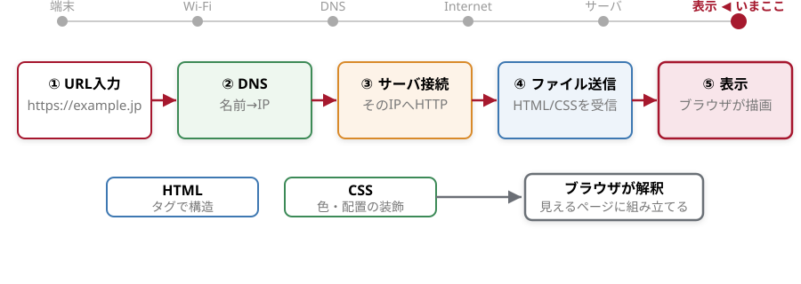

URL入力 → DNSでIP → サーバ接続 → ファイル送信 → 表示。この5歩が「旅」のゴール地点。

---

<!-- _class: split -->

HTMLの中身

## ページの正体は「タグで囲んだテキスト」 ── 中身を見てみる

ブラウザで右クリック →「ページのソースを表示」で、どんなページもこの素のHTMLが見える。

<pre style="font-size:15px;line-height:1.4">&lt;!DOCTYPE html&gt;
&lt;html lang="ja"&gt;
&lt;head&gt;
  &lt;meta charset="UTF-8"&gt;
  &lt;title&gt;はじめてのWeb&lt;/title&gt;
&lt;/head&gt;
&lt;body&gt;
  &lt;h1&gt;はじめてのWeb&lt;/h1&gt;
  &lt;p&gt;これは &lt;a href="https://www.chiba-u.jp"&gt;
     千葉大学&lt;/a&gt; へのリンクです。&lt;/p&gt;
  &lt;img src="cover.jpg" alt="表紙"&gt;
&lt;/body&gt;
&lt;/html&gt;</pre>

<table class="dtbl" style="width:100%">
<tr><th>タグ</th><th>意味</th></tr>
<tr><td class="l mono">&lt;html&gt;〜&lt;/html&gt;</td><td class="l">文書全体</td></tr>
<tr><td class="l mono">&lt;head&gt; / &lt;body&gt;</td><td class="l">頭部（情報）/ 本体（中身）</td></tr>
<tr><td class="l mono">&lt;title&gt;</td><td class="l">タブに出るページ名</td></tr>
<tr><td class="l mono">&lt;h1&gt; / &lt;p&gt;</td><td class="l">見出し / 段落</td></tr>
<tr><td class="l mono">&lt;a href&gt;</td><td class="l">リンク（ハイパーリンク）</td></tr>
<tr><td class="l mono">&lt;img src&gt;</td><td class="l">画像</td></tr>
</table>

読み方のコツ

- 開始タグ &lt;p&gt; と終了タグ &lt;/p&gt; で挟む
- 入れ子（箱の中に箱）になっている
- 見た目の色・配置はCSS側の担当

---

ワーク⑥

## ワーク：最小のHTMLを書いて、名前を引く

🔧 Moodle → Colab（個人 or 2人）

- ① 最小HTMLを書いて保存：&lt;h1&gt;はじめてのWeb&lt;/h1&gt;
- ② ブラウザで開きソースを表示して見比べる
- ③ !dig example.jp +short で名前→IP
- ④ !dig www.chiba-u.jp +trace で委任を辿る
- ⑤ 返ったIPをブラウザに直接入れると開く？

④の +trace の出力に .jp や権威サーバの名前は出てきた？

［ここに dig +short / +trace とソース表示の実行スクショを貼る］ （画像はこちらで差し込みます）

「名前 → IP → ページ」を、自分の手で1往復してみる。

---

<!-- _class: divider -->

動画 7 ／ CHAPTER 7 ★核

# 安全に通信する

## 暗号・認証・Wi-Fiセキュリティ ── 旅の途中で「盗み見・なりすまし」を防ぐ（約16分）

---

<!-- _class: fig -->

暗号の基礎

## 平文 →（暗号化）→ 暗号文 →（復号）→ 平文

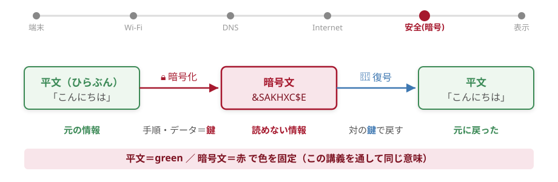

暗号化／復号のための手順・データを 鍵 という。コンピュータでは、人手では解けない強い暗号を使う。

送り手と受け手が「同じ鍵」を使う方式（共通鍵）。その鍵は、どうやって安全に相手へ渡す？

---

<!-- _class: fig -->

古典暗号

## シーザー暗号 ── 文字を一定数ずらす「換字式」を手で解く


いずれも規則が分かれば人手で解けてしまう。だから現代はコンピュータで 膨大な計算 が要る暗号を使う。

※ 古典暗号の例。エニグマは「ローター式の複雑な換字暗号」で、単純な転置法ではない。

---

<!-- _class: split -->

共通鍵 と 公開鍵

## 「同じ鍵」の弱点を、公開鍵が解決する 重要

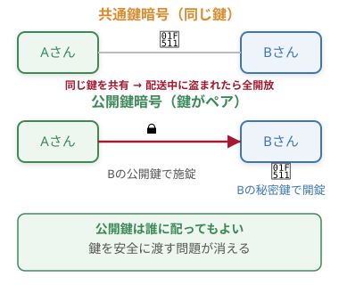

<table class="dtbl">
<tr><th></th><th>共通鍵</th><th>公開鍵</th></tr>
<tr><td class="l">暗号化</td><td>共通の鍵</td><td>相手の公開鍵</td></tr>
<tr><td class="l">復号</td><td>同じ鍵</td><td>自分の秘密鍵</td></tr>
<tr><td class="l">鍵の配送</td><td>危険（盗難）</td><td>不要</td></tr>
<tr><td class="l">相手10人</td><td>10種の鍵</td><td>鍵1組</td></tr>
<tr><td class="l">速度</td><td>速い</td><td>遅い</td></tr>
</table>

実際は「いいとこ取り」

- 最初だけ公開鍵で「共通鍵」を安全に渡す
- その後は速い共通鍵で本文をやり取り（＝SSL/TLS）

共通鍵の「鍵をどう渡すか」問題を、公開鍵の「誰でも施錠／受け手だけ開錠」が解く。

---

<!-- _class: fig -->

公開鍵暗号

## 公開鍵で「施錠」、対の秘密鍵だけが「開錠」できる 重要

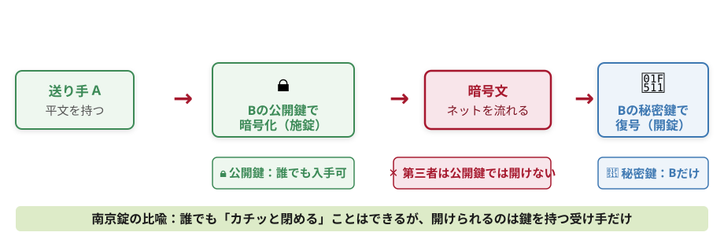

公開鍵は誰に渡してもよい。復号できるのは、対になった秘密鍵を持つ受け手 B だけ。相手ごとの鍵配布が不要になる。

---

<!-- _class: split -->

署名・認証局

## 「本人が送った」を証明する ── 署名は鍵が“逆向き” 重要

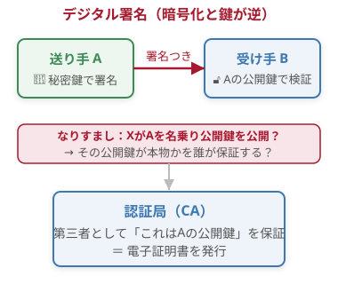

暗号化 と 署名 は“鍵の向き”が逆

- 暗号化：相手の公開鍵で施錠 → 相手の秘密鍵で開錠
- 署名：自分の秘密鍵で署名 → 相手は公開鍵で検証
- 署名が通れば「本人が送った／改ざん無し」が分かる

認証局（CA）と電子証明書

- 公開鍵の持ち主を第三者が保証＝なりすまし防止
- ブラウザは証明書を自動で検証している

暗号化＝盗み見防止／署名・認証＝なりすまし防止。安全な通信は、この両輪で成り立つ。

---

<!-- _class: fig -->

なぜ平文は危険か

## 公衆Wi-Fiで「HTTPでない通信」は、同じ電波の他人に丸見え 重要

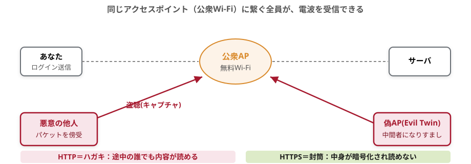

なぜ学ぶか　2024年、旅客機内に偽Wi-Fi（Evil Twin）を立て、乗客のメール・SNSのログイン情報を盗んだ人物が豪連邦警察に逮捕。「無料Wi-Fi」は最も狙われる入口でもある。出典: Kaspersky「Evil Twin攻撃」 https://www.kaspersky.co.jp/resource-center/preemptive-safety/evil-twin-attacks

---

<!-- _class: fig -->

HTTP → HTTPS

## 鍵マーク🔒は「通信路がTLSで暗号化済み」のしるし

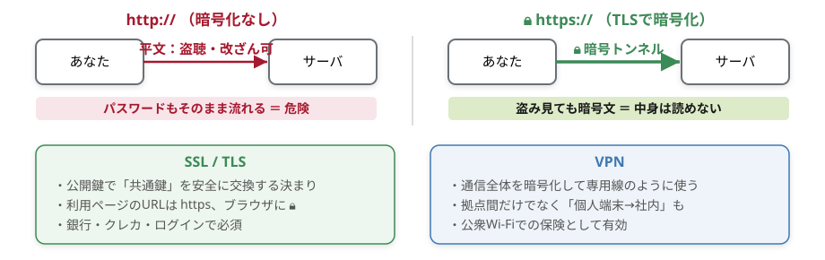

公衆Wi-Fiでは、URLの 🔒（https）を必ず確認。不安なら VPN を使う。HTTP のサイトで重要情報は送らない。

---

<!-- _class: split -->

家庭Wi-Fiの守り方

## 「お家のネット」は、自分で守れる 重要

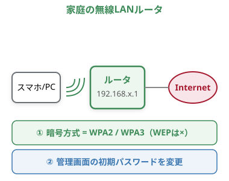

暗号方式と鍵を確認

- WPA2 / WPA3 か確認（古い WEP は解読される）
- 接続パスワードは推測されにくいものに

機器の初期設定を変える

- ルータ管理画面（192.168.x.1）の初期PWは必ず変更
- カメラ・スピーカー等のIoT機器も同様

挙手：公衆Wi-Fiで、ネットバンキングのログインをしていい？

「閉域網だから安全」は神話。暗号方式・初期PW・https の3点をまず点検。

---

ワーク⑦

## ワーク：お家のWebセキュリティを点検しよう

🔧 自分のデジタル環境を点検する（チェックリスト）

- ① 自宅Wi-Fiの暗号方式は WPA2 / WPA3 になっている？
- ② ルータ管理画面のパスワードは、まだ初期値のままになっていない？
- ③ スマートスピーカー・防犯カメラなど IoT機器 のパスワードは変えた？
- ④ よく使うサイトは https（🔒鍵マーク） になっている？
- ⑤ 公衆Wi-Fiで、重要なログイン（銀行・大学アカウント）をしていないか？

自分ごとに　パスワードの使い回しは破滅的：2023年、遺伝子検査の 23andMe は使い回しPWを突かれ約690万人分の遺伝・健康データが流出した。出典: HIPAA Journal https://www.hipaajournal.com/6-9-million-23andme-users-affected-by-data-breach/

習った暗号・認証・Wi-Fiの知識は、まず「自分の家」を守るために使う。

---

<!-- _class: divider -->

動画 8 ／ CHAPTER 8

# データベースとSQL

## 旅の目的地 — 「届いた先のデータ」を、どう貯めて取り出すか（約12分）

---

<!-- _class: fig -->

DBとは

## 構造化したデータを集めて「検索しやすく」貯める

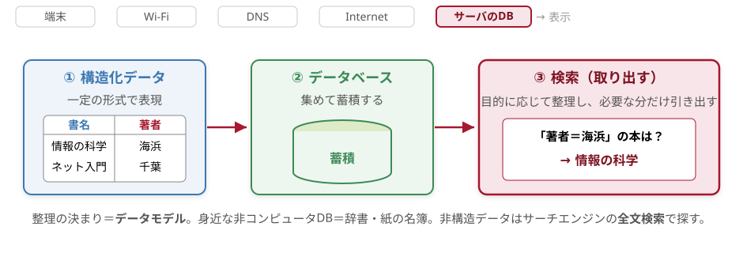

登録には必ず「目的」がある（連絡したい・サービスしたい）。だから一定形式（構造化）で貯め、検索で取り出せるようにする。

DB＝「構造化して貯め、目的に応じて取り出す」箱。旅の荷物が着いた先の保管庫。

---

<!-- _class: split -->

DBとDBMS

## 多人数で安全に使うための「管理システム」＝DBMS

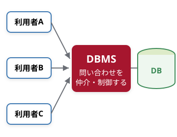

DBMS（データベース管理システム）の 5 機能

- ① データ資源管理：意味・種類・記録場所を定義／管理
- ② 整合性制約：年齢に負値・文字を入れさせない
- ③ セキュリティ：管理者は全部／A一部／B超一部
- ④ トランザクション管理：同時更新を排他制御（予約の二重登録を防ぐ）
- ⑤ 障害復旧：破損に備えデータを保護・復旧

なぜ「管理」が要るのか

2024年6月、KADOKAWA／ニコニコがランサムウェア被害。約25万人分の個人情報が漏洩し特別損失36億円。DBは「漏れたら全件まとめて流出する箱」。だから③④⑤が必須。

出典: KADOKAWA グループ公表資料 / 日経クロステック（2024）

DB は「貯める箱」、DBMS は「皆で安全に・矛盾なく使うための番人」。

---

<!-- _class: split -->

DBの種類と用語

## 主流は「表」で扱う リレーショナル型

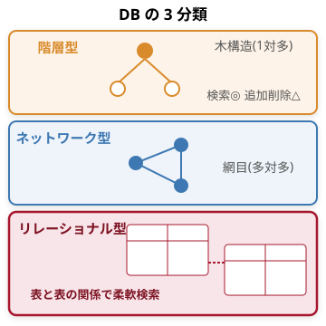

リレーショナルDB の用語（取り違え注意）

- 表 ＝ テーブル／表同士の関連 ＝ リレーションシップ
- 1行（横）＝ レコード（列の集まり＝1件分）
- 1列（縦）＝ フィールド（属性／カラム）
- 1マス ＝ セル

<table class="dtbl" style="width:100%">
<tr><th>分類</th><th>形</th><th>特徴</th></tr>
<tr><td class="l">階層型</td><td>木構造</td><td class="l">検索速い／追加削除が非効率</td></tr>
<tr><td class="l">ネットワーク型</td><td>網目</td><td class="l">多対多を表現できる</td></tr>
<tr><td class="l">リレーショナル型</td><td>表</td><td class="l">最も普及・分かりやすい／処理は重め</td></tr>
</table>

巨大な1表でなく、種類ごとに小さい表に分けて結合で組み合わせると、効率よく矛盾なく管理できる。重要

表（テーブル）形式が主流。行＝レコード／列＝フィールド／マス＝セルを正しく区別する。

---

<!-- _class: fig -->

SQL：選択・射影・結合

## 問い合わせ言語 SQL の「3つの基本操作」

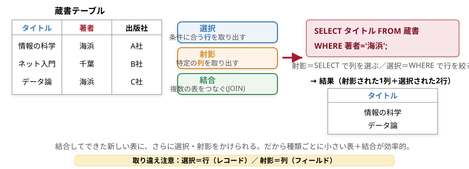

SQL＝Structured Query Language。検索・登録の問い合わせ＝クエリ。選択＝行・射影＝列・結合＝表をつなぐ。

「英語っぽい1文」で、欲しい行（選択）と列（射影）を切り出せる。これが SQL の核。

---

ワーク⑧

## ワーク：Colab で pandas × SQL を動かす

🔧 表計算ではなく「コード」で（Moodle → Colab）

- ① import pandas as pd で表を2つ作る（書籍・著者）
- ② pandasql / sqlite3 で SQL を実行： SELECT 書名,著者名 FROM 書籍 JOIN 著者 USING(著者ID)
- ③ WHERE（選択）・列指定（射影）・JOIN（結合）で結果がどう変わるか観察
- ④ 同じ操作を df.merge() でも書き、SQL と pandas を見比べる

確認ポイント

- WHERE を外すと行が増える？ SELECT の列名を変えると列が変わる？
- JOIN を外すと、なぜ著者名が出ない？（表が分かれているから）

［ここに Colab で pandas＋SQL を実行した画面のスクショを貼る］ （画像はこちらで差し込みます）

ラボの実験データ・アンケート・配列情報も、表に整えれば SQL/pandas で一発検索できる。重要

SQL は「英語っぽい問い合わせ言語」。研究室のデータ処理でそのまま役立つ。

---

<!-- _class: divider -->

動画 9 ／ CHAPTER 9

# 情報システムの応用とデータ分析入門

## 旅の終点 ― 届いたデータを「集めて・読む」仕組み（約14分）

---

<!-- _class: fig -->

暮らしを支える仕組み

## 身の回りは「データベース＋ネットワーク」で動く

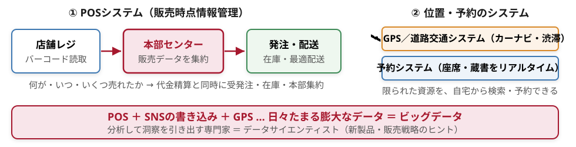

情報システムの正体は「ネットワークで集めたデータを、データベースに蓄えて活かす」こと。残りはその“読み方”を学ぶ。

---

<!-- _class: split -->

マーケティングとPOS

## なぜ1本のバーコードが「経営」を動かすのか

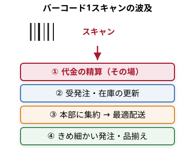

マーケティングとは

- 要望調査・宣伝・広告調査を踏まえ
- 商品・価格・販路・宣伝を決めて改善
- 売れる仕組み＝市場そのものを創る活動

POS（Point of Sales＝販売時点情報管理）

- レジ＝データ入力端末でもある
- 「売れた瞬間」を即データ化 → 欠品も売れ残りも減らす
- マーケティングを動かす手段の代表例

バーコード1本が、精算・在庫・発注・配送まで一気に動かす ＝ POS

---

<!-- _class: fig -->

データの種類と尺度

## データの「種類（尺度水準）」を見分ける 重要

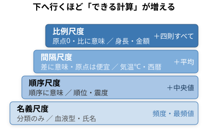

質的データ ／ 量的データ

- 質的＝名義・順序（文字・カテゴリ）
- 量的＝間隔・比例（数値）

データの形式（保存の形）

- テキスト＝人が読める（CSV・TSV）
- マークアップ＝タグで構造化（HTML・XML）
- バイナリ＝そのまま記録（画像・音声）

「時給（円）」と「満足度の5段階」── それぞれ何尺度？　使ってよい計算が変わる。

---

<!-- _class: fig -->

度数分布とヒストグラム

## データを階級に分け、個数（度数）を数える

<table class="dtbl">
<tr><th>階級（℃）</th><th>度数（日）</th><th>累積</th></tr>
<tr><td>24 〜 26</td><td>2</td><td>2</td></tr>
<tr><td>26 〜 28</td><td>5</td><td>7</td></tr>
<tr><td>28 〜 30</td><td>9</td><td>16</td></tr>
<tr><td class="l">30 〜 32</td><td>10</td><td>26</td></tr>
<tr><td>32 〜 34</td><td>4</td><td>30</td></tr>
</table>

東京・2022年9月の最高気温（例・全30日）／表計算は =COUNTIFS() で度数

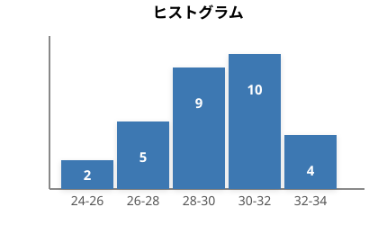

度数分布表をグラフ化したものがヒストグラム。山の位置・広がり・偏りが一目で分かる。

---

<!-- _class: fig -->

代表値の落とし穴

## 平均値か、中央値か ── 外れ値に注意 重要

A町（弁当の値段・5店舗）

260　270　280　290　300 円 
平均値 ＝ (260+…+300)/5 ＝ 280円／中央値 ＝ 280円

B町（6店舗）── 1店だけ激安

100　260　270　280　280　280 円 
平均値 ＝ 1470/6 ＝ 245円／中央値 ＝ (270+280)/2 ＝ 275円

3つの代表値

- 平均値＝合計÷個数（外れ値に弱い）
- 中央値＝順に並べた真ん中（外れ値に強い）
- 最頻値＝最も多い値（B町は280円）

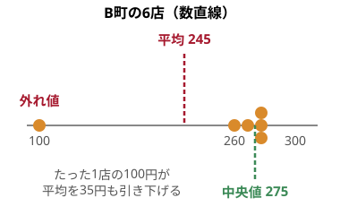

「平均280→245」は外れ値1個のせい。実感に近いのは中央値。代表値は分布を見て選ぶ。

---

<!-- _class: split -->

箱ひげ図・ばらつき

## 散らばりを「数値」と「図」で表す 重要

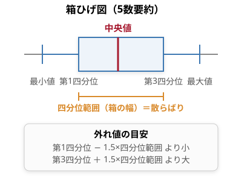

ばらつきの数値

- 分散＝偏差（平均との差）の2乗の平均
- 標準偏差＝√分散（散らばりの大きさ）
- 表計算：=VAR.P() / =STDEV.P()

偏差値の意味

- 偏差値 ＝ (得点−平均)÷標準偏差 ×10 ＋50
- 同じ点でも標準偏差が小さいほど偏差値は大きく出る

中央値だけでなく「箱の幅」で散らばりを見る ＝ 集団を正しく比べる第一歩

---

<!-- _class: fig -->

相関・因果・回帰

## 相関は因果ではない／回帰で予測する 重要

なぜ学ぶか — 相関を因果と取り違えると判断を誤る
「アイスが売れる日ほど水難事故が多い」。だが真因は暑さ＝交絡因子で、アイスを禁じても事故は減らない。相関係数（=CORREL(), −1〜+1）は関係の強さを示すだけ。仮説検定（帰無仮説を有意水準5%で棄却）と合わせ、データから「正しい結論」を引き出すのがデータサイエンティストの仕事。出典：高校『情報』第4編第3章「データの分析」（相関・回帰・仮説検定）

---

<!-- _class: divider -->

動画 10 ／ CHAPTER 10

# クラウドコンピューティング

## 旅の終点 ── 届いたデータを「置く・動かす」場所、そして自分で実験する（約12分）

---

<!-- _class: fig -->

クラウドとは

## クラウド＝「所有」から「利用」へ ── 必要なときに借りる 重要

教科書のいうクラウドコンピューティング＝高性能なサーバを自前で持たず、インターネット経由で必要なときにサービスとして利用する形態（教科書 図9）。

「自分のPCが壊れても、写真もメール（ Google フォト等）も消えない」のはなぜ？ ── データが手元でなく雲の中にあるから。

---

<!-- _class: fig -->

所有→利用

## 何を「自分」で、何を「事業者」に任せるか ── IaaS / PaaS / SaaS

同じ層スタック＝動画4の TCP/IP 4階層と同じ「上に積む」考え方。下の層ほど事業者に任せられるのがクラウド。

---

<!-- _class: split -->

なぜ学ぶか

## 集約は「便利」と「弱点」の両方 ── 雲が落ちると世界が止まる

便利さ（なぜ使うのか）

- 初期費用ゼロでいますぐ使える
- 利用量に応じて瞬時に増減（実験向き）
- 保守・更新・冗長化は事業者まかせ

弱点（なぜ仕組みを知るのか）

- 集約点が落ちると広範囲が同時停止
- データを他社に預ける＝設定・権限が命

EPISODE ── 雲はときどき落ちる

2021年12月、AWS の主要拠点 us-east-1 が大規模障害を起こし、Netflix・Disney+ など多数のサービスが同時停止。少数の巨大クラウドに皆が相乗りしているため、そこが落ちると一斉に落ちる。「どこに預けているか」を知ることが大事。

出典：AWS us-east-1 大規模障害（2021-12-07）

クラウドの恩恵は、集約点を守れて初めて成り立つ。だから IP・DNS・経路・暗号という「中身」を学んだ。

---

<!-- _class: split -->

学び続ける

## 旅の終点 → 自分で「実験する」へ戻る ── GCP・Colab という砂場

学外で「実験する」具体例

- Google Colab：ブラウザだけで Python を実行（動画9のデータ分析をそのまま動かせる）
- GCP（Google Cloud）：無料枠で自分の仮想マシン（VM）を1つ立ててみる＝IaaSの体験
- 安全な「砂場」で壊しても本番に影響しない

学び方は1つではない（動画1）

- ①実験する ②ネットで調べる ③Geminiで調べる ④人に聞く ⑤本・論文
- AIは軸でなく1モード。中身を理解した人ほど深い答えを引き出せる

［ Colab／GCP コンソールのスクショ ］

クラウドは「安全に失敗して学べる」最高の実験場 ── 旅の終点から、動画1の「①実験する」へ戻ろう。

---

<!-- _class: fig -->

旅の全行程

## 「URLを入れてからページが出るまで」── 全部つながった

この回でたどった道：端末 → Wi-Fi → DNS → Internet → サーバ → ページ表示。各駅の「しくみ」が、次の駅へ荷物を渡していた。

点で覚えた用語を、URL→表示という1本の線でつなぎ直す。

---

<!-- _class: message -->

# 手を動かして、学び続けよう

## 教科書とAIの「外」に、実験と・人と・本がある

---

<!-- _class: wrap -->

まとめ

## この回の要点 ── 6つの「駅」で振り返る

<ul>
<li>インターネット＝ネットワークの相互接続。全ホストはIPアドレス（32bit / IPv6は128bit＝2128≈1兆×1兆×1兆）という住所で識別</li>
<li>TCP/IP（4層）に沿い各層がヘッダを重ね、データはパケットに小分け＝引っ越しの段ボール。ルータが経路制御表でバケツリレー</li>
<li>名前はDNSでIPに翻訳（dig で実演）。HTTP/HTTPSでWebページが届き、ブラウザがHTML/CSSを表示</li>
</ul>

<ul>
<li>公開鍵暗号＝誰でも施錠／受け手だけ開錠、署名は逆向き＋CA。SSL/TLSページがHTTPS</li>
<li>データはDB・SQL（選択・射影・結合）で構造化。分析は相関≠因果・外れ値に注意</li>
<li>クラウド（IaaS/PaaS/SaaS）と GCP で、自分で手を動かして学び続ける</li>
</ul>

なぜ「しくみ」を学ぶのか
2025年11月、Cloudflareで設定ファイルが想定の倍以上に肥大化したたった1つの不具合で、X・ChatGPTなど多数のサービスが世界規模でエラーに。AIに「なぜ繋がらないの？」と聞いても、中身を知らなければ答えの正否を判断できない。だから用語でなく「しくみ」を学ぶ。

出典：Cloudflare 公式「Cloudflare outage on November 18, 2025」

---

<!-- _class: qa -->

Q&amp;A・課題

# Q&A は Moodle へ

## オンデマンドなので、質問・課題はすべて Moodle で受け付けます

<table class="dtbl">
<tr><th>項目</th><th>内容</th><th>場所・期限</th></tr>
<tr><td class="l">動画視聴</td><td class="l">全10本（Part1〜3）を視聴期限内に</td><td>Moodle ／ 期限内</td></tr>
<tr><td class="l">質問</td><td class="l">Q&amp;Aフォーラムへ投稿（slido・ライブ無し）</td><td>Moodle フォーラム</td></tr>
<tr><td class="l">課題</td><td class="l">確認小テスト＋dig実演の追体験レポート</td><td>Moodle ／ 期限内提出</td></tr>
<tr><td class="l">発展</td><td class="l">GCP Skills Boost で VM を1つ立てる（任意）</td><td>動画1「実験する」に回収</td></tr>
</table>

締切・提出物の最新情報は必ず Moodle の本回ページで確認してください。

