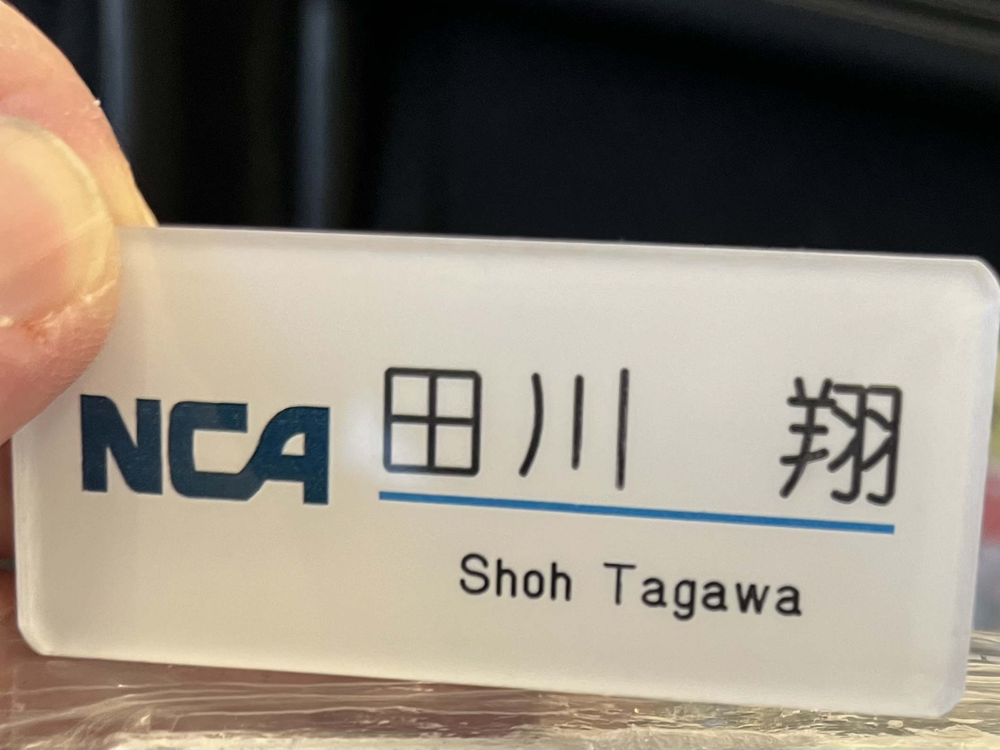
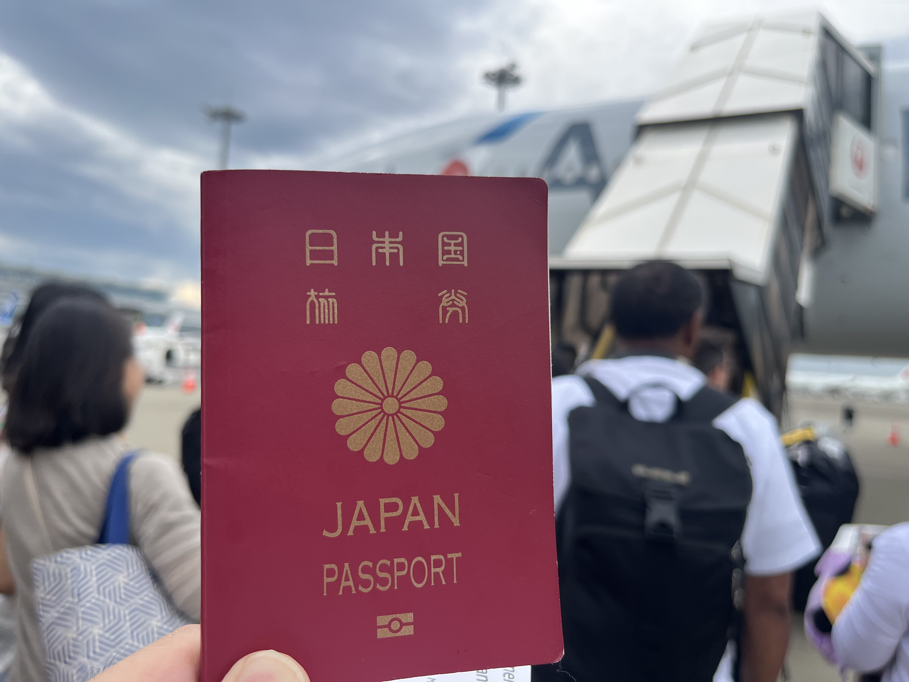
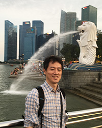
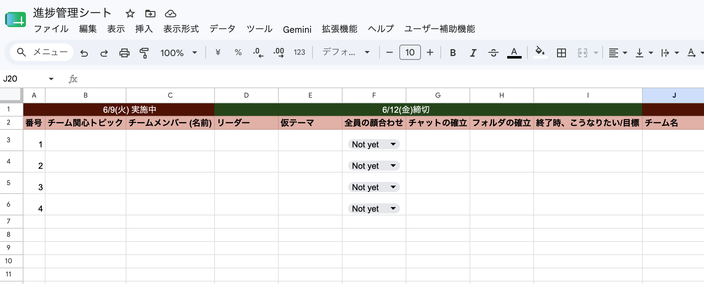

<!-- _class: cover-hero -->

Boeing Externship ／ 第1回キックオフ

ガイダンス・ 初回顔合わせ

キックオフミーティング 2026年6月5日（金）

本日の進行担当：千葉大学 国際未来教育基幹 田川 翔（プログラム進行）

<!-- 90分セッションの開始。歓迎の挨拶と本日のゴール（教員紹介・全体像理解・グループ仮決め）を共有する。 -->

---
<!-- _class: summary -->

皆さん、飛行機、好きですか？

冬の千歳、写っているのは、JALの777 (©田川 2022/1/28 7am)

---
<!-- _class: summary -->

皆さん、飛行機、好きですか？

実は、私もNCAに居ました

アンカレッジに集まった、NCAの747-8F (友人撮影)

---
<!-- _class: summary -->

皆さん、飛行機、好きですか？

それとも、旅行が好きですか？ (©田川 HND-JFK搭乗前)

---
<!-- _class: summary -->

皆さん、飛行機、好きですか？

<video controls playsinline src="./src/fig05-airplane-intro.mp4" title="飛行機イントロ"></video>

空港や航空会社の現場では、今日も着々と、作業が続いています。(©田川 NRT勤務中)

---
<!-- _class: summary -->

皆さん、飛行機、好きですか？

<video controls playsinline src="./src/fig06-travel.mov" title="旅行"></video>

そこには、コロナ禍などの波を越え、航空ビジネスを支える、みんながいます。(©田川 HND 2021年)

---
<!-- _class: summary -->

皆さん、飛行機、好きですか？

<video controls playsinline src="./src/fig07-takeoff-hnd.mp4" title="HND C滑走路より離陸"></video>

それでは、2026 Boeing Externship Takeoffです。（田川 HND C滑走路より離陸）

---
<!-- _class: summary -->

Externshipのゴール

## Boeing Externship とは — 目的と狙い

### 目的 （なぜこの活動をやるのか）

- 航空・宇宙分野の知識を、**実社会の課題**を通じて深める
- **英語**でのプレゼン・議論を実践し、世界で通用する力を養う
- 世界の航空宇宙企業 **Boeing** と異文化に直接触れる

### 狙い （終わったあとにどうなっているのか）

- **ガクチカ**： 正解のない問いに、チームで **仮説→検証** で挑む、PBL型の学び
- **社会体験**： 整備士・航空会社社員等 **現場の声**を聞き、「机上の空論」を超える
- **語学力**： 9月のサマーセミナーで **全国の大学と英語発表・交流**、人と出会い、英語力も向上

今年は、サークル的な実施　→ 授業ではないので、自由・自主的に楽しく進めましょう

<!-- 日本版Boeing Externshipは「航空×英語×実課題」の産学連携PBL。9月のサマーセミナーで全国の参加大学が英語発表・議論する。千葉大は今回が初参加。 -->

---

<!-- _class: summary -->

過去にどんなテーマがあった？

## 他大学では、こんな課題に取り組んできました

### 環境・運航オペレーション

- **持続可能な航空燃料（SAF）** と全国インフラ構想（2024・東北大）
- バイオ燃料で地球を救う（2014・金沢工大）
- 搭乗時の **混雑緩和**：荷物・トイレ予約制（2024・大阪公立大）
- 乗降を快適にする **座席配置**（2023・大阪公立大）

### テクノロジー・ものづくり

- 機体 **洗浄ロボット** の開発（2024・金沢工大）
- 航空機の **車椅子スペース** 改善（2021・金沢工大）
- 手荷物受取所の **混雑解消**（2020・金沢工大）

出典：東北大学・金沢工業大学・大阪公立大学 Boeing Externship 公開情報より（他大学の実施例）

「身近な不便」×「航空」で十分テーマになる
自由に発想してOKだが、実際に簡単な実現可能性も検討 (調べ学習だけでは終わらない)

<!-- これらは他大学の過去テーマ例。SAF・混雑緩和・ロボット・ユニバーサルデザインなど領域は幅広い。千葉大は初参加なので、これらを参考にしつつ自分たちの関心からテーマを立てる。 -->

---

<!-- _class: summary goal -->

本日のゴール

## 60分でここまで進めます

### 全体を知る

- プログラムの目的を把握する
- 教員4名 (授業担当というより部顧問？)・事務局と連絡先を知る
- グラウンドルールを知る

### 進め方を確認する
- 今後の流れを理解する
- 選考方法を把握する
- 困ったときやスケジュール管理に使う道具を確認する

### テーマ案を考えてみる
- 何に関心があるか、表明しよう
- ほかの人の関心も知ってみよう

<figure>
<svg viewBox="0 0 150 108" xmlns="http://www.w3.org/2000/svg" role="img" aria-label="全体像">
  <rect x="6" y="8" width="138" height="92" rx="13" fill="#EAF3FF" stroke="#0033A0" stroke-width="2.5"/>
  <g stroke="#FFC93C" stroke-width="2.5" stroke-linecap="round">
    <line x1="123" y1="14" x2="123" y2="7"/><line x1="135" y1="26" x2="142" y2="26"/>
    <line x1="132" y1="17" x2="137" y2="12"/><line x1="132" y1="35" x2="137" y2="40"/>
  </g>
  <circle cx="123" cy="26" r="9" fill="#FFC93C"/>
  <g fill="#ffffff">
    <ellipse cx="34" cy="28" rx="14" ry="8"/><ellipse cx="47" cy="30" rx="10" ry="7"/><ellipse cx="24" cy="31" rx="9" ry="6"/>
  </g>
  <path d="M18 86 Q70 42 124 58" fill="none" stroke="#FF8C42" stroke-width="3" stroke-dasharray="1.5 8" stroke-linecap="round"/>
  <circle cx="18" cy="86" r="5.5" fill="#E8467C"/>
  <g transform="translate(96 44) rotate(-22)">
    <path d="M0 0 L28 9 L9 16 L11 9 Z" fill="#0033A0"/>
    <path d="M9 16 L11 9 L18 12 Z" fill="#244a9c"/>
  </g>
</svg>
<figcaption>全体像</figcaption>
</figure>

<figure>
<svg viewBox="0 0 150 108" xmlns="http://www.w3.org/2000/svg" role="img" aria-label="進め方">
  <rect x="6" y="8" width="138" height="92" rx="13" fill="#F4F8FF" stroke="#0033A0" stroke-width="2.5"/>
  <rect x="20" y="74" width="32" height="20" rx="3" fill="#9DB8E8"/>
  <rect x="54" y="58" width="32" height="36" rx="3" fill="#6f8fce"/>
  <rect x="88" y="40" width="32" height="54" rx="3" fill="#0033A0"/>
  <circle cx="36" cy="68" r="4" fill="#fff"/><circle cx="70" cy="52" r="4" fill="#fff"/>
  <line x1="104" y1="40" x2="104" y2="18" stroke="#0033A0" stroke-width="3" stroke-linecap="round"/>
  <path d="M104 19 l20 6 -20 7 z" fill="#19B36B"/>
  <g fill="#FFC93C"><path d="M126 14 l2 5 5 2 -5 2 -2 5 -2 -5 -5 -2 5 -2 z"/></g>
</svg>
<figcaption>進め方</figcaption>
</figure>

<figure>
<svg viewBox="0 0 150 108" xmlns="http://www.w3.org/2000/svg" role="img" aria-label="テーマ案">
  <rect x="6" y="8" width="138" height="92" rx="13" fill="#FFF8E6" stroke="#0033A0" stroke-width="2.5"/>
  <g fill="#FF8C42"><path d="M30 30 l2.5 6 6 2.5 -6 2.5 -2.5 6 -2.5 -6 -6 -2.5 6 -2.5 z"/></g>
  <g fill="#E8467C"><path d="M118 64 l2 5 5 2 -5 2 -2 5 -2 -5 -5 -2 5 -2 z"/></g>
  <circle cx="75" cy="46" r="25" fill="#FFE680" stroke="#FFB000" stroke-width="2.5"/>
  <circle cx="67" cy="43" r="2.6" fill="#0033A0"/><circle cx="83" cy="43" r="2.6" fill="#0033A0"/>
  <path d="M66 52 q9 8 18 0" fill="none" stroke="#0033A0" stroke-width="2.5" stroke-linecap="round"/>
  <rect x="65" y="71" width="20" height="9" rx="2.5" fill="#0033A0"/>
  <line x1="68" y1="84" x2="82" y2="84" stroke="#0033A0" stroke-width="3" stroke-linecap="round"/>
</svg>
<figcaption>テーマ案</figcaption>
</figure>

次回(6/9)は、チーム編成です

<!-- 「知る」→「決める」の順で進める。終わりにグループ単位で簡単な連絡手段（LINE/Slack等）を確立してもらう。 -->

---

<!-- _class: prof -->

教員紹介（1 / 4）

並木 明夫 先生

千葉大学 大学院工学研究科 教授／学長特別補佐（研究）

<b>ご専門</b>：知能ロボティクス／メカトロニクス

関わり方： 全体の統括

<!-- 1人目。お一人ずつ1分程度で自己紹介してもらう。 -->

---

<!-- _class: prof -->

教員紹介（2 / 4）

太田 匡則 先生

千葉大学 大学院工学研究科 准教授（航空宇宙熱流体工学研究室）

<b>専門</b>：航空宇宙工学／高速・圧縮性流体（衝撃波、可視化計測）

関わり方： 航空・宇宙工学の観点からの支援、Boeingとのやり取り

<!-- 2人目。 -->

---

<!-- _class: prof -->

教員紹介（3 / 4）

松本 暢平 先生

千葉大学 国際未来教育基幹 助教

<b>専門</b>：教育社会学／医学教育（IR・FD・国際バカロレアまで幅広く）

関わり方：スライド作成・発表実施支援

<!-- 3人目。 -->

---

<!-- _class: prof -->

教員紹介（4 / 4）

田川 翔

千葉大学 国際未来教育基幹 助教

<b>専門</b>：高等教育論／地球深部科学／国際航空貨物

略歴

<ul>
<li>博士（理学, 2020）</li>
<li>東京大学・東工大WPIの特任助教を経て、航空貨物の総合職事務系へ</li>
<li>2024年から千葉大に着任、生成AIの活用(下流側)に従事</li>
</ul>

関わり方：航空ビジネスの観点からの支援、ファシリテーション

---

<!-- _class: prof -->

事務局紹介

十見 智子

千葉大学 学務部 教育企画課

<b>業務</b>：学内の教育系の企画業務など

略歴

<ul>
<li>SULA支援事務室長（SULA研修企画）</li>
<li>留学生課副課長（学生派遣担当）</li>
<li>国際企画課国際企画係長（海外連携・協定等担当）</li>
</ul>

関わり方：事務局・連絡担当

---

<!-- _class: timetable -->

Boeing提供のプログラム

## オンライン講義（Boeing社員による・全5回）

| Class | 日程 | 時間 | テーマ |
|---|---|---|---|
| #1 | 5/8（金） | 10:30–12:00 | Boeing Overview |
| #2 | 5/22（金） | 8:00–9:30 | Environment — Boeing and Sustainable Aviation |
| #3 | 6/5（金） | 10:30–12:00 | Supplier Management ／ Wisk |
| #4 | 6/19（金） | 10:30–12:00 | Customer Support |
| #5 | 7/3（金） | 10:30–12:00 | Technology |

- みんなでの共有ノートを取るなどしてみよう： Classroomにリンク
- 質問はぜひ積極的に

サマーセミナー（成果発表）：2026年9月7日（月）／ 会場：大阪公立大学 (大阪城付近)

---

<!-- _class: divider -->

SECTION 1

# プログラム全体像

## 6月〜9月の流れを把握する

<!-- ここから全体スケジュール。各フェーズの「いつ／何を／誰が」を5分で説明する。 -->

---

<!-- _class: planlist -->

学内企画の全体スケジュール

## 内部セッション 全11回（6月〜9月）

6/5

必須

第 1回  ガイダンス (今回)

6/9

必須

第 2回  グループ分け・チームビルディング／仮説形成

TBD

任意

第 3回  整備士インタビュー

TBD

任意

第 4回  安全担当・管制経験者インタビュー

TBD

任意

第 5回  航空貨物事務系インタビュー

TBD

必須

第 6回  中間発表・困りごと共有／プレゼンのコツ

8/5 or 7

任意

第 7回  成田空港見学（半日）

TBD

任意

第  8回   プレゼンテーション・クリニック

8月後半

必須

第  9回   進出グループ審査・相互フィードバック

8月末

任意

第10回代表チームをみんなで支援する回

9/7（月）

本番

サマーセミナーで英語発表（大阪公立大学・全国合同）

9月中旬

必須

第11回リフレクション・フェアウェル

📌 次回までに確認

<ol>
<li>任意セッションの<b>都合の良い時間帯</b></li>
<li>成田見学 <b>8/5 or 8/7</b> 都合の良い方の日付</li>
</ol>

調査・研究・発表準備などは、各グループで活動して下さい (内部セッションは「支援」)

---

<!-- _class: dt -->

デザイン思考・仮説形成

<b>デザイン思考</b>とは、<b>使う人の視点</b>に立って課題を捉え直し、アイデアを<b>素早く形にして試しながら</b>、より良い解決策を見つけていく考え方・進め方。「正しく作る」前に、<b>「解くべき問い」を見つける</b>ことを大切にします。

<svg viewBox="0 0 1180 220" xmlns="http://www.w3.org/2000/svg" role="img" aria-label="デザイン思考の5ステップ">
  <!-- 矢印（ステップ間） -->
  <g fill="none" stroke="#C2C9D6" stroke-width="4" stroke-linecap="round" stroke-linejoin="round">
    <path d="M231 54 l13 12 -13 12"/>
    <path d="M481 54 l13 12 -13 12"/>
    <path d="M731 54 l13 12 -13 12"/>
    <path d="M981 54 l13 12 -13 12"/>
  </g>

  <!-- ① 共感 Empathize（ピンク：ハート） -->
  <circle cx="110" cy="66" r="44" fill="#E8467C"/>
  <path d="M110 88 C86 70 92 48 110 60 C128 48 134 70 110 88 Z" fill="#fff"/>
  <circle cx="140" cy="40" r="12" fill="#fff"/><text x="140" y="45" text-anchor="middle" font-size="15" font-weight="700" fill="#E8467C">1</text>
  <text x="110" y="142" text-anchor="middle" font-size="27" font-weight="800" fill="#E8467C">共感</text>
  <text x="110" y="164" text-anchor="middle" font-size="14" fill="#888">Empathize</text>
  <text x="110" y="190" text-anchor="middle" font-size="16" fill="#333">当事者を観察・理解</text>

  <!-- ② 定義 Define（青：的） -->
  <circle cx="360" cy="66" r="44" fill="#0033A0"/>
  <circle cx="360" cy="66" r="20" fill="none" stroke="#fff" stroke-width="3"/>
  <circle cx="360" cy="66" r="10" fill="none" stroke="#fff" stroke-width="3"/>
  <circle cx="360" cy="66" r="3.5" fill="#fff"/>
  <circle cx="390" cy="40" r="12" fill="#fff"/><text x="390" y="45" text-anchor="middle" font-size="15" font-weight="700" fill="#0033A0">2</text>
  <text x="360" y="142" text-anchor="middle" font-size="27" font-weight="800" fill="#0033A0">定義</text>
  <text x="360" y="164" text-anchor="middle" font-size="14" fill="#888">Define</text>
  <text x="360" y="190" text-anchor="middle" font-size="16" fill="#333">本当の課題を定める</text>

  <!-- ③ アイデア Ideate（アンバー：電球） -->
  <circle cx="610" cy="66" r="44" fill="#F0A500"/>
  <circle cx="610" cy="60" r="15" fill="none" stroke="#fff" stroke-width="3"/>
  <path d="M610 50 v12 M603 56 h14" stroke="#fff" stroke-width="2.5" stroke-linecap="round"/>
  <rect x="603" y="78" width="14" height="7" rx="2" fill="#fff"/>
  <circle cx="640" cy="40" r="12" fill="#fff"/><text x="640" y="45" text-anchor="middle" font-size="15" font-weight="700" fill="#F0A500">3</text>
  <text x="610" y="142" text-anchor="middle" font-size="27" font-weight="800" fill="#E08F00">アイデア</text>
  <text x="610" y="164" text-anchor="middle" font-size="14" fill="#888">Ideate</text>
  <text x="610" y="190" text-anchor="middle" font-size="16" fill="#333">量を出す（質より量）</text>

  <!-- ④ 試作 Prototype（緑：ブロック） -->
  <circle cx="860" cy="66" r="44" fill="#19B36B"/>
  <rect x="842" y="50" width="22" height="22" rx="3" fill="none" stroke="#fff" stroke-width="3"/>
  <rect x="858" y="64" width="22" height="22" rx="3" fill="#fff"/>
  <circle cx="890" cy="40" r="12" fill="#fff"/><text x="890" y="45" text-anchor="middle" font-size="15" font-weight="700" fill="#19B36B">4</text>
  <text x="860" y="142" text-anchor="middle" font-size="27" font-weight="800" fill="#149A5B">試作</text>
  <text x="860" y="164" text-anchor="middle" font-size="14" fill="#888">Prototype</text>
  <text x="860" y="190" text-anchor="middle" font-size="16" fill="#333">素早く形にする</text>

  <!-- ⑤ 検証 Test（紫：虫めがね＋チェック） -->
  <circle cx="1110" cy="66" r="44" fill="#7A5BD0"/>
  <circle cx="1104" cy="60" r="14" fill="none" stroke="#fff" stroke-width="3"/>
  <line x1="1114" y1="70" x2="1124" y2="80" stroke="#fff" stroke-width="3.5" stroke-linecap="round"/>
  <path d="M1098 60 l4 4 7 -8" fill="none" stroke="#fff" stroke-width="2.5" stroke-linecap="round" stroke-linejoin="round"/>
  <circle cx="1140" cy="40" r="12" fill="#fff"/><text x="1140" y="45" text-anchor="middle" font-size="15" font-weight="700" fill="#7A5BD0">5</text>
  <text x="1110" y="142" text-anchor="middle" font-size="27" font-weight="800" fill="#6A4BC0">検証</text>
  <text x="1110" y="164" text-anchor="middle" font-size="14" fill="#888">Test</text>
  <text x="1110" y="190" text-anchor="middle" font-size="16" fill="#333">試して学び直す</text>
</svg>

📋 第二回 6/9 デザインWS/チームぎめで行うこと

<ul>
<li>デザイン思考の基礎を短時間で体感する</li>
<li>航空業界のどんな課題を解くかを議論</li>
<li>関心領域に応じてグループ分けを調整</li>
<li>発表テーマ案を <b>暫定で1つ</b> 決める</li>
</ul>

<b>6/19(金)</b>までに最初の発表テーマ案を持参（その後、変えても良い。<b>8/10（月）</b>までにfix）

チームを決め、「ソリューション」ではなく「良い問い」を一緒に作る仲間を探す回

<!-- デザイン思考の定義＋5ステップ＋6/9WSで行うこと。共感・定義で問いを立て、アイデア・試作・検証で素早く回す。暫定テーマは以降何度でも修正可。 -->

---

<!-- _class: summary big -->

課題案の検証・研究

## 7月〜8月上旬：現場に聞く、行く、机上の空論で終わらせない

### 当事者へのインタビュー （任意・第3〜5回）

- <b>現状案</b>：航空整備士、安全担当・管制経験者、航空貨物の事務系職員
- 6/9の結果次第では、整備技術、マーケティング、IT、空港会社なども可能 (例：機械学習したい、等)
- 社会人はボランティア or プロボノ参加 → <b>1週間後までに感想文(A4半分程度)で御礼に変える</b>

### 成田空港見学（任意・第7回）

- 8/5（水） または 8/7（金）の都合の良い方、12時〜16時などを想定
- 事前申込制(自費) ※ 格納庫、上屋などの見学可否を調整中 → 締切が早くなる可能性あり

- 協力企業：NCA(日本貨物航空)、IACT etc... / ボランティア所属企業： JAL(日本航空)

各グループの希望を基に、出来る限り調整予定 ：6/9に希望等あればお知らせ下さい

<!-- 裏では各チームが自走で準備を進める。インタビュー機会は任意参加だが、検証にはほぼ必須。 -->

---

<!-- _class: summary  big-->

発表準備〜本選

## 8月〜9月：仕上げ・選考・派遣

### 発表準備フェーズ（8月上旬〜）

- 松本先生によるスライドの作り方講義
- **お盆明け直後**：発表リハーサル・提出、フィードバックを反映して仕上げ

### 学内選考 (8/20頃) ・本選 (9/7) 
- 全グループ、本番同様に発表し、学内選考を実施 ＋ 相互フィードバック
- 本選派遣グループの確定
- 決定後は、**全員で派遣チームを支援**、他のグループも発表者に加わって良い

### 振り返り・フェアウェル (9月中旬) 

7月中にテーマはfix、お盆中には研究・調査を実施し、スライド・発表準備を完成させる

---

<!-- _class: howto -->

本選での発表と選考について

## 全員で 3 〜 4 チームを設定、1チームが発表
## 発表は採点基準に基づき、教員が採点 / 全員でフィードバックを実施

POINT 1

原則、全員で現地参加

発表者でなくても現地参加できる（<b>旅費支援は不可</b>）。 <b>ぜひ全員に参加してほしい</b>が、やむを得ない事情があれば不参加でも差し支えない。

POINT 2

「チーム千葉大」体制

学内選考の後は、<b>発表チームに全員で貢献</b>。 みんなで改善を手伝う。

POINT 3

メンバーは入れ替え可

最終の発表チームのメンバーは<b>入れ替え可能</b>。 発表チームの<b>リーダーが発表者を調整</b>。

💡 TIPS

早めの予約はOK

当日参加を希望する人は、<b>大阪への航空券・乗車券・宿</b>などを<b>早めに取って構わない</b>。

出るのは代表チーム。でも本選は「チーム千葉大」全員で挑む。

<!-- 旅費支援は出ないが現地参加は自由。学内選考後はチーム千葉大として代表を全員で支援。メンバーはリーダー調整で入れ替え可。 -->

---

<!-- _class: summary -->

グラウンドルール

## 協力して挑める「場」をみんなで作る

### 😊 場づくりの基本

- 協力的な場づくりと<b>言い合える文化</b>を大切に
- コミュニケーションは、<b>敬意</b>を持って、<b>忌憚なく</b>、<b>建設的に</b>
- 自ら動こう（各チームでプロジェクトを管理・推進）
- <b>困ったら相談しよう</b>：「手を差し伸べる」より <b>「助けを相談する」</b>

### ✈ 航空の文化に学ぶ

- 学年や立場に関係なく <b>気づきを声に出す</b>
- 質問をすることも大切 (分からないことは徹底してなくす)
- 多様な視点が大切(→分野の多様性を活かそう)、価値を考える
- 失敗を責めず <b>学びに変える</b>（Just Culture）
- <b>時間を守る</b>

チーム一丸で、面白い価値を創造しよう

<!-- 航空会社の安全文化（CRM・Just Culture・定時性）をチーム運営に応用。立場を超えて声を出し、失敗を学びに変え、無理せず時間を守る。 -->

---

<!-- _class: message -->

# 原則は、皆様ご自身の自主的な活動ですが、
# 機会を提供します

<!-- 全体像は以上。各フェーズの詳細手順（インタビューの申込方法、フィールドワーク当日の流れ等）は、その都度詳しく説明する。 -->

---

<!-- _class: divider -->

SECTION 2

# 千葉の産業としての成田空港

## 日本の「空の玄関口」、そして日本最大の貿易港

<!-- 千葉＝成田空港というローカル資産を、航空ビジネス（Boeing Externship）の文脈に接続する。旅客・貨物の2枚で「規模感」を体感させる。 -->

---

<!-- _class: narita -->

空の玄関口・成田

## 日本最大の「国際線の入口」が、千葉にある

<video src="./src/fig-narita-aerial.mov" autoplay loop muted playsinline></video>

世界の玄関：成田空港第二ターミナル

千葉県への経済波及効果（現在）

<ul>
<li>旅客・貨物輸送に伴う波及効果は<b>年間 約2.2兆円</b>（2024年度・直近実績）</li>
<li>内訳：航空旅客 1.6／航空貨物 0.2／空港内消費 0.1／その他 0.4（兆円）</li>
<li>空港で働く人は<b>約3.6万人</b>（成田空港内・2022年度）</li>
</ul>

空港別 国際線旅客数（2024年度・万人）

<svg viewBox="0 0 640 290" xmlns="http://www.w3.org/2000/svg" role="img" aria-label="空港別の国際線旅客数の棒グラフ">
  <line x1="96" y1="12" x2="96" y2="278" stroke="#cfd6e4" stroke-width="2"/>
  <text x="8" y="38" font-size="19" font-weight="700" fill="#0033A0">成田</text>
  <rect x="96" y="20" width="464" height="26" rx="3" fill="#0033A0"/>
  <rect x="566" y="20" width="40" height="26" rx="4" fill="#C0182B"/>
  <text x="586" y="38" text-anchor="middle" font-size="16" font-weight="800" fill="#fff">1位</text>
  <text x="556" y="38" text-anchor="end" font-size="17" font-weight="800" fill="#fff">3,220</text>
  <text x="8" y="82" font-size="19" font-weight="700" fill="#333">関西</text>
  <rect x="96" y="64" width="360" height="26" rx="3" fill="#5B7FC7"/>
  <text x="464" y="82" font-size="17" font-weight="800" fill="#0033A0">2,499</text>
  <text x="8" y="126" font-size="19" font-weight="700" fill="#333">羽田</text>
  <rect x="96" y="108" width="330" height="26" rx="3" fill="#5B7FC7"/>
  <text x="434" y="126" font-size="17" font-weight="800" fill="#0033A0">2,292</text>
  <text x="8" y="170" font-size="19" font-weight="700" fill="#333">福岡</text>
  <rect x="96" y="152" width="123" height="26" rx="3" fill="#9DB4DD"/>
  <text x="227" y="170" font-size="17" font-weight="800" fill="#0033A0">851</text>
  <text x="8" y="214" font-size="19" font-weight="700" fill="#333">中部</text>
  <rect x="96" y="196" width="71" height="26" rx="3" fill="#9DB4DD"/>
  <text x="175" y="214" font-size="17" font-weight="800" fill="#0033A0">491</text>
  <text x="8" y="258" font-size="17" font-weight="700" fill="#333">新千歳</text>
  <rect x="96" y="240" width="56" height="26" rx="3" fill="#9DB4DD"/>
  <text x="160" y="258" font-size="17" font-weight="800" fill="#0033A0">389</text>
</svg>

出典：国際線旅客数＝東京・大阪航空局／空港管理状況（2024年度）。経済波及効果＝株式会社千葉銀行「成田空港第2の開港プロジェクトの経済波及効果」（2026年3月）。空港内従業員数＝成田国際空港株式会社「2022年度 成田空港内従業員実態調査」。

訪日客の最大の入口は成田。千葉は「世界とつながる玄関」を持つ県。

---

<!-- _class: narita cargo-bg -->

貨物空港・成田

<h2>金額で見ると、成田は日本一の「貿易港」</h2>

貿易総額の港・空港別シェア（金額ベース）

<svg viewBox="0 0 240 312" xmlns="http://www.w3.org/2000/svg" role="img" aria-label="貿易総額の港・空港別シェアの円グラフ">
  <!-- 成田 16.8%（強調） -->
  <path d="M120,120 L120,20 A100,100 0 0 1 207.04,70.75 Z" fill="#0033A0"/>
  <!-- 名古屋港 10.3% -->
  <path d="M120,120 L207.04,70.75 A100,100 0 0 1 219.13,133.16 Z" fill="#5B7FC7"/>
  <!-- 東京港 9.7% -->
  <path d="M120,120 L219.13,133.16 A100,100 0 0 1 193.77,187.51 Z" fill="#8AA4D6"/>
  <!-- 横浜港 7.7% -->
  <path d="M120,120 L193.77,187.51 A100,100 0 0 1 153.87,214.09 Z" fill="#AEC0E3"/>
  <!-- 神戸港 7.0% -->
  <path d="M120,120 L153.87,214.09 A100,100 0 0 1 110.59,219.56 Z" fill="#CBD7EC"/>
  <!-- その他 48.5% -->
  <path d="M120,120 L110.59,219.56 A100,100 0 0 1 120,20 Z" fill="#E3E8F0"/>
  <!-- 成田ラベル -->
  <text x="150" y="64" text-anchor="middle" font-size="15" font-weight="800" fill="#fff">成田</text>
  <text x="150" y="81" text-anchor="middle" font-size="15" font-weight="800" fill="#fff">16.8%</text>

  <!-- 凡例 -->
  <g font-size="13" fill="#333">
    <rect x="6" y="250" width="13" height="13" rx="2" fill="#0033A0"/><text x="24" y="261" font-weight="700" fill="#0033A0">成田空港 16.8%</text>
    <rect x="128" y="250" width="13" height="13" rx="2" fill="#5B7FC7"/><text x="146" y="261">名古屋港 10.3%</text>
    <rect x="6" y="270" width="13" height="13" rx="2" fill="#8AA4D6"/><text x="24" y="281">東京港 9.7%</text>
    <rect x="128" y="270" width="13" height="13" rx="2" fill="#AEC0E3"/><text x="146" y="281">横浜港 7.7%</text>
    <rect x="6" y="290" width="13" height="13" rx="2" fill="#CBD7EC"/><text x="24" y="301">神戸港 7.0%</text>
    <rect x="128" y="290" width="13" height="13" rx="2" fill="#E3E8F0"/><text x="146" y="301">その他 48.5%</text>
  </g>
</svg>

約37<small>兆円</small>

成田空港の<b>年間貿易総額</b>（2024年）。 全国の港・空港で<b>第1位</b>（輸入額は41年連続首位）

約195<small>万トン</small>

国際航空貨物の<b>年間取扱量</b>（2024年・前年比+4.0%）

約3.0<small>万回</small>

国際線<b>貨物便</b>の年間発着回数（2024年度）

出典：貿易額・貨物取扱量・貨物便発着回数＝東京税関「成田空港貨物取扱量／貿易概況」（2024年）、財務省貿易統計。海港の貿易額（名古屋・東京・横浜・神戸）＝国土交通省「港湾別貿易額」（2023年）。シェアは全国貿易総額 約219兆円（2024年）に対する各港の比率。

人もモノも、世界と日本をつなぐ最前線。成田は航空物流の日本一の拠点。

---

<!-- _class: divider -->

SECTION 3

# 運用ツールの使い方

## 進捗管理などの説明

<!-- 連絡フォームとslidoの2点を実際に開いて見せる。 -->

---

<!-- _class: howto -->

進捗管理・一覧化

## 進捗・締切は、1シートで一覧化
1. 締切までに各グループで行って下さい
2. それとは別に、締切までに記入する内容があります

---

<!-- _class: toolhub -->

連絡系統

## ファイル・連絡・相談は、この3つに集約します

📁

Google Drive ― ファイルはグループ別に管理

各グループのフォルダに資料・成果物を保存　→　<a href="https://drive.google.com/drive/folders/1eYAriwBMlX6ZsySBhsSRjQSCVi470Edz?usp=drive_link">フォルダを開く</a>

https://drive.google.com/drive/folders/1eYAriwBMlX6ZsySBhsSRjQSCVi470Edz?usp=drive_link

📋

Google Classroom ― 配布資料を時系列で記録

通知もここから／<b>みんなで共有したいこと</b>はフォーラムへ　→　<a href="https://classroom.google.com/c/ODU0ODczMzk3MjA0">Classroomを開く</a>

https://classroom.google.com/c/ODU0ODczMzk3MjA0

✉️

相談フォーム ― 聞きにくい相談は事務局へ直接

回答は<b>事務局だけに届きます</b>（匿名でもOK）　→　<a href="https://forms.gle/XfBcwbZcLKLX5b5o6">フォームを開く</a>

https://forms.gle/XfBcwbZcLKLX5b5o6

---

<!-- _class: slido -->

関心テーマの確認

## slidoで「気になる領域」を投票

### slidoでこれから投票します

- コード／QRは画面に表示
- スマホで参加（匿名でOK）
- 複数選択可・自由記述あり
- 次回も確認します

<a class="qr-link" href="https://app.sli.do/event/6eZYvt2mxGa537tkN1ke5X">app.sli.do/event/6eZYvt2mxGa537tkN1ke5X</a>

スマホでQRを読む or 上のリンクをクリック

<!-- 関心領域：整備／運航／安全・管制／客室・サービス／地上・空港運営／IT・データ／その他（自由記述）。 -->

---

<!-- _class: wrap -->

まとめ

## まとめ

- 6月〜9月の全体像と各フェーズの目的を共有した
- 教員4名・事務局の人となりを知った
- 進捗管理の方法を確認した
- 次回 **6/9 デザインWS @総合校舎G1-101**で課題テーマ案を出し、チームを決めるのがゴール

<!-- 終わりに事務局から連絡事項。お疲れさまでした。 -->

---

<!-- _class: qa -->

Q&amp;A

# Q&A

## 質問はこの場で
