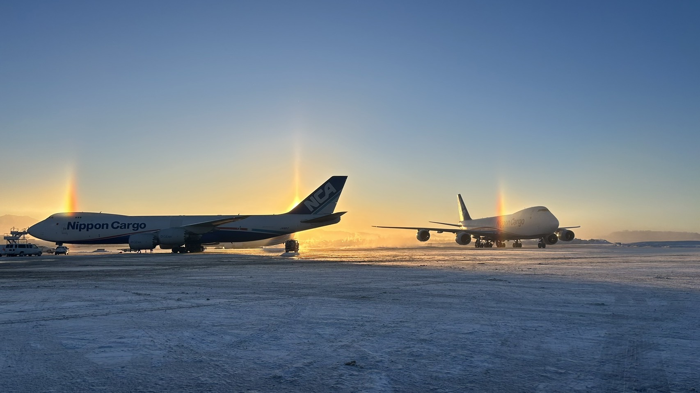

<!-- _class: cover-hero -->

Boeing Externship ／ 第1回キックオフ

初回顔合わせ・ グループ決め

キックオフミーティング 2026年6月5日（金）

本日の進行担当：千葉大学 国際未来教育基幹 田川 翔（プログラム進行）

<!-- 90分セッションの開始。歓迎の挨拶と本日のゴール（教員紹介・全体像理解・グループ仮決め）を共有する。 -->

---
<!-- _class: summary -->

皆さん、飛行機、好きですか？

冬の千歳、うつっているのは、JALの777

---
<!-- _class: summary -->

皆さん、飛行機、好きですか？

アンカレッジに集まった、NCAの747-8F (友人撮影)

---

<!-- _class: summary -->

Externshipのゴール

## Boeing Externship とは — 目的と狙い

### 目的 （なぜこの活動やるのか）

- 航空・宇宙分野の知識を、**実社会の課題**を通じて深める
- **英語**でのプレゼン・議論を実践し、世界で通用する力を養う
- 世界の航空宇宙企業 **Boeing** と異文化に直接触れる

### 狙い （終わったあとにどうなっているのか）

- **ガクチカ**： 正解のない問いに、チームで **仮説→検証** で挑む、PBL型の学び
- **社会体験**： 整備士・航空会社社員等 **現場の声**を聞き、「机上の空論」を超える
- **語学力**： 9月のサマーセミナーで **全国の大学と英語発表・交流**、人と出会い、英語力も向上

今年は、サークル的に実施、授業ではないので、自由に進めましょう

<!-- 日本版Boeing Externshipは「航空×英語×実課題」の産学連携PBL。9月のサマーセミナーで全国の参加大学が英語発表・議論する。千葉大は今回が初参加。 -->

---

<!-- _class: summary -->

過去にどんなテーマがあった？

## 他大学では、こんな課題に取り組んできました

### 環境・運航オペレーション

- **持続可能な航空燃料（SAF）** と全国インフラ構想（2024・東北大）
- バイオ燃料で地球を救う（2014・金沢工大）
- 搭乗時の **混雑緩和**：荷物・トイレ予約制（2024・大阪公立大）
- 乗降を快適にする **座席配置**（2023・大阪公立大）

### テクノロジー・ものづくり

- 機体 **洗浄ロボット** の開発（2024・金沢工大）
- 航空機の **車椅子スペース** 改善（2021・金沢工大）
- 手荷物受取所の **混雑解消**（2020・金沢工大）

出典：東北大学・金沢工業大学・大阪公立大学 Boeing Externship 公開情報より（他大学の実施例）

「身近な不便」×「航空」で十分テーマになる
自由に発想してOKだが、実際に簡単な実現可能性も検討 (調べ学習だけでは終わらない)

<!-- これらは他大学の過去テーマ例。SAF・混雑緩和・ロボット・ユニバーサルデザインなど領域は幅広い。千葉大は初参加なので、これらを参考にしつつ自分たちの関心からテーマを立てる。 -->

---

<!-- _class: summary goal -->

本日のゴール

## 60分でここまで進めます

### 全体を知る

- プログラムの目的を把握する
- 教員4名 (授業担当というより部顧問？)・事務局と連絡先を知る
- グラウンドルールを知る

### 進め方を確認する
- 今後の流れを理解する
- 選考方法を把握する
- 困ったときやスケジュール管理に使う道具を確認する

### テーマ案を考えてみる
- 何に関心があるか、表明しよう
- ほかの人の関心も知ってみよう

<figure>
<svg viewBox="0 0 150 108" xmlns="http://www.w3.org/2000/svg" role="img" aria-label="全体像">
  <rect x="6" y="8" width="138" height="92" rx="13" fill="#EAF3FF" stroke="#0033A0" stroke-width="2.5"/>
  <g stroke="#FFC93C" stroke-width="2.5" stroke-linecap="round">
    <line x1="123" y1="14" x2="123" y2="7"/><line x1="135" y1="26" x2="142" y2="26"/>
    <line x1="132" y1="17" x2="137" y2="12"/><line x1="132" y1="35" x2="137" y2="40"/>
  </g>
  <circle cx="123" cy="26" r="9" fill="#FFC93C"/>
  <g fill="#ffffff">
    <ellipse cx="34" cy="28" rx="14" ry="8"/><ellipse cx="47" cy="30" rx="10" ry="7"/><ellipse cx="24" cy="31" rx="9" ry="6"/>
  </g>
  <path d="M18 86 Q70 42 124 58" fill="none" stroke="#FF8C42" stroke-width="3" stroke-dasharray="1.5 8" stroke-linecap="round"/>
  <circle cx="18" cy="86" r="5.5" fill="#E8467C"/>
  <g transform="translate(96 44) rotate(-22)">
    <path d="M0 0 L28 9 L9 16 L11 9 Z" fill="#0033A0"/>
    <path d="M9 16 L11 9 L18 12 Z" fill="#244a9c"/>
  </g>
</svg>
<figcaption>全体像</figcaption>
</figure>

<figure>
<svg viewBox="0 0 150 108" xmlns="http://www.w3.org/2000/svg" role="img" aria-label="進め方">
  <rect x="6" y="8" width="138" height="92" rx="13" fill="#F4F8FF" stroke="#0033A0" stroke-width="2.5"/>
  <rect x="20" y="74" width="32" height="20" rx="3" fill="#9DB8E8"/>
  <rect x="54" y="58" width="32" height="36" rx="3" fill="#6f8fce"/>
  <rect x="88" y="40" width="32" height="54" rx="3" fill="#0033A0"/>
  <circle cx="36" cy="68" r="4" fill="#fff"/><circle cx="70" cy="52" r="4" fill="#fff"/>
  <line x1="104" y1="40" x2="104" y2="18" stroke="#0033A0" stroke-width="3" stroke-linecap="round"/>
  <path d="M104 19 l20 6 -20 7 z" fill="#19B36B"/>
  <g fill="#FFC93C"><path d="M126 14 l2 5 5 2 -5 2 -2 5 -2 -5 -5 -2 5 -2 z"/></g>
</svg>
<figcaption>進め方</figcaption>
</figure>

<figure>
<svg viewBox="0 0 150 108" xmlns="http://www.w3.org/2000/svg" role="img" aria-label="テーマ案">
  <rect x="6" y="8" width="138" height="92" rx="13" fill="#FFF8E6" stroke="#0033A0" stroke-width="2.5"/>
  <g fill="#FF8C42"><path d="M30 30 l2.5 6 6 2.5 -6 2.5 -2.5 6 -2.5 -6 -6 -2.5 6 -2.5 z"/></g>
  <g fill="#E8467C"><path d="M118 64 l2 5 5 2 -5 2 -2 5 -2 -5 -5 -2 5 -2 z"/></g>
  <circle cx="75" cy="46" r="25" fill="#FFE680" stroke="#FFB000" stroke-width="2.5"/>
  <circle cx="67" cy="43" r="2.6" fill="#0033A0"/><circle cx="83" cy="43" r="2.6" fill="#0033A0"/>
  <path d="M66 52 q9 8 18 0" fill="none" stroke="#0033A0" stroke-width="2.5" stroke-linecap="round"/>
  <rect x="65" y="71" width="20" height="9" rx="2.5" fill="#0033A0"/>
  <line x1="68" y1="84" x2="82" y2="84" stroke="#0033A0" stroke-width="3" stroke-linecap="round"/>
</svg>
<figcaption>テーマ案</figcaption>
</figure>

次回(6/9)は、チーム編成です

<!-- 「知る」→「決める」の順で進める。終わりにグループ単位で簡単な連絡手段（LINE/Slack等）を確立してもらう。 -->

---

<!-- _class: prof -->

教員紹介（1 / 4）

並木 明夫 先生

千葉大学 大学院工学研究科 教授／学長特別補佐（研究）

<b>ご専門</b>：知能ロボティクス／メカトロニクス

関わり方： 全体の統括

<!-- 1人目。お一人ずつ1分程度で自己紹介してもらう。 -->

---

<!-- _class: prof -->

教員紹介（2 / 4）

太田 匡則 先生

千葉大学 大学院工学研究科 准教授（航空宇宙熱流体工学研究室）

<b>専門</b>：航空宇宙工学／高速・圧縮性流体（衝撃波、可視化計測）

関わり方： 航空・宇宙工学の観点からの支援、Boeingとのやり取り

<!-- 2人目。 -->

---

<!-- _class: prof -->

教員紹介（3 / 4）

松本 暢平

千葉大学 国際未来教育基幹 助教

<b>専門</b>：教育社会学／医学教育（IR・FD・国際バカロレアまで幅広く）

関わり方：スライド作成・発表実施支援

<!-- 3人目。 -->

---

<!-- _class: prof -->

教員紹介（4 / 4）

田川 翔

千葉大学 国際未来教育基幹 助教

<b>専門</b>：高等教育論／地球深部科学／国際航空貨物

略歴

<ul>
<li>博士（理学, 2020）</li>
<li>東京大学・東工大WPIの特任助教を経て、航空貨物の総合職事務系へ</li>
<li>2024年から千葉大に着任、生成AIの活用(下流側)に従事</li>
</ul>

関わり方：航空ビジネスの観点からの支援、ファシリテーション

<!-- 4人目（本日の進行担当）。 -->

---

<!-- _class: cards -->

事務局紹介

## サポート体制

事務局（十見さん）

運営事務局

スケジュール調整・施設予約・連絡窓口。困ったらまず事務局へ。

Boeing 連絡担当

プログラムパートナー

本選・課題テーマに関する企業側との連絡を仲介。

学内サポート

教務・学生支援

単位認定・旅費・履修関連は学内窓口を経由して対応。

外部協力者

航空業界の現場の方々

整備士・パイロット等。インタビュー機会は事務局経由で調整。

<!-- 事務局がハブになって、教員・学生・企業の3者をつなぐ。連絡は基本Slack＋緊急時はメール。 -->

---

<!-- _class: divider -->

SECTION 1

# プログラム全体像

## 6月〜9月の流れを把握する

<!-- ここから全体スケジュール。各フェーズの「いつ／何を／誰が」を5分で説明する。 -->

---

<!-- _class: planlist -->

全体スケジュール

## 内部セッション 全11回（6月〜9月）

6/5

必須

第1回ガイダンス

6/9

必須

第2回グループ分け・チームビルディング／仮説形成

TBD

任意

第3回整備士インタビュー

TBD

任意

第4回安全担当・管制経験者インタビュー

TBD

任意

第5回航空貨物インタビュー

TBD

必須

第6回中間発表・困りごと共有／プレゼンのコツ

8/5 or 8/7

任意

第7回成田空港見学（2コマ分）

TBD

任意

第8回プレゼンテーション・クリニック

8月後半

必須

第9回進出グループ審査・相互フィードバック

8月末

任意

第10回代表チームをみんなで支援する回

9月中旬

必須

第11回リフレクション・フェアウェル

<!-- 必須5回・任意6回。日程TBDは順次確定し連絡。本日は第1回。任意回も検証には実質ほぼ必須。 -->

---

<!-- _class: split -->

デザインWS＋グループ分け

## 6/9：解くべき問いを立てる

[デザイン思考プロセス図 共感→定義→アイデア→試作→検証]

図1. デザイン思考の5ステップ

### このフェーズで行うこと

- デザイン思考の基礎を短時間で体感する
- 航空業界のどんな課題を解くかをチームで議論
- 発表テーマ案を **暫定で1つ** 決める
- 関心領域に応じてグループ分けを最終調整

「正解」ではなく「良い問い」を一緒に作る回

<!-- 6/9のWSで暫定テーマを出す。以降のフェーズで何度でも修正可。 -->

---

<!-- _class: summary -->

課題案 検証・リバイズ

## 7月〜8月上旬：現場に聞く・行く

### 自由参加のインタビュー（夕方）

- 7月上旬：航空整備士に尋ねてみよう
- 7月中旬：パイロットに尋ねてみよう
- 7月下旬：TBD（管制・客室・地上等）

### 成田空港フィールドワーク

- 8/5（水） または 8/7（金）
- 複数社の場合は両日開催の可能性あり
- 事前申込制／事務局が調整

<!-- 裏では各チームが自走で準備を進める。インタビュー機会は任意参加だが、検証にはほぼ必須。 -->

---

<!-- _class: summary -->

発表準備〜本選

## 8月〜9月：仕上げ・選考・派遣

### 発表準備フェーズ（8月上旬〜）

- 松本先生によるスライドの作り方講義
- お盆明け直後：発表リハーサル・提出
- フィードバックを反映して仕上げ

### 学内選考・本選（8/20頃 → 9月上旬）

- 全員参加の学内選考＋相互フィードバック
- 本選派遣グループの確定（旅費要確認）
- 派遣後は **全員で派遣チームを支援**

<!-- 選考の採点基準・採点者・言語（日英）は別途決定。詳細は後日アナウンス。 -->

---

<!-- _class: message -->

# 詳細は田川先生から個別に説明します

## 各フェーズの運用・連絡・記録は順次共有

<!-- 全体像は以上。各フェーズの詳細手順（インタビューの申込方法、フィールドワーク当日の流れ等）は、その都度詳しく説明する。 -->

---

<!-- _class: divider -->

SECTION 2

# 運用ツールの使い方

## 困ったとき・気づいたときの動線

<!-- 連絡フォームとslidoの2点を実際に開いて見せる。 -->

---

<!-- _class: howto -->

困ったときのフォーム

## 連絡・相談はこの3ステップ

STEP 1

QRを読む

本日配布のQRコード／Slack固定メッセージのリンクからフォームを開く。

STEP 2

種別を選ぶ

「相談」「日程変更」「グループ変更」「その他」から1つ選択。

STEP 3

送信→24h内に返答

事務局が受付→担当教員にエスカレーション。原則24時間以内に返信。

「迷ったらまずフォーム」。後から判断OK。

<!-- 実際にスマホでQRを読んで開いてもらう。送信テストは任意。 -->

---

<!-- _class: slido -->

関心テーマの確認

## slidoで「気になる領域」を投票

### slidoでこれから投票します

- コード／QRは画面に表示
- スマホで参加（匿名でOK）
- 複数選択可・自由記述あり
- 結果はその場でグループ分けに活用

[slido 投票画面 QRコードを掲示]

<!-- 関心領域：整備／運航／安全・管制／客室・サービス／地上・空港運営／IT・データ／その他（自由記述）。 -->

---

<!-- _class: divider -->

SECTION 3

# グループ分けワークショップ

## 残り40分で仮グループを決める

<!-- ここから実際のWS。タイマー表示しながら進行。 -->

---

<!-- _class: timetable -->

本ワークショップの進行

## タイムテーブル（40分）

| 時間 | 内容 |
|---|---|
| 0–10分 | 全員で自己紹介（1人1分以内） |
| 10–20分 | 全員で「行ってみたいこと」を共有 |
| 20–25分 | 関心領域を1つ決める（slido結果を確認） |
| 25–28分 | 班分け候補を確認（フォーム回答ベース） |
| 28–38分 | 各グループに分かれて顔合わせ |
| 38–40分 | リーダー決定・連絡手段の確立 |

<!-- 進行は田川先生。タイマーは画面共有で全員に見えるようにする。 -->

---

<!-- _class: ws -->

グループ分けの方針

## 4ステップで仮決め

10分

① 自己紹介

名前・学部・「Boeing Extensionで何を得たいか」を1分で。

10分

② やってみたいこと

全員で行きたい場所・聞きたい職種・触れたい技術を共有。

5分

③ 関心領域を決める

slido結果＋フォームを見て、自分の優先1領域を選ぶ。

15分

④ グループ顔合わせ

仮グループに分かれてリーダー決定・連絡手段の合意。

グループは <b>将来的に変更可能</b>。まず動き出すことを優先。

<!-- 検討：関心ベース or バックグラウンド別。今回はまず関心ベースで仮決め。 -->

---

<!-- _class: summary -->

グループの初動チェックリスト

## 今日のうちに揃えること

### グループ運営

- リーダー1名を決める
- グループ名（仮）をつける
- 全員の連絡手段を交換（Slack / LINE 等）

### 次回までの宿題

- 自分が興味のある「問い」を3つ書き出す
- 6/9のデザインWSに **全員出席** で参加
- 困ったらフォームから事務局へ連絡

<!-- 「リーダー＝決定者」ではなく「連絡のハブ」。重荷にしないよう全員でサポート。 -->

---

<!-- _class: wrap -->

まとめ

## まとめ

- 6月〜9月の全体像と各フェーズの目的を共有した
- 教員4名・事務局・外部協力者の役割を把握した
- 困ったときの連絡フォームとslidoの使い方を確認した
- 関心領域を選び、仮グループの顔合わせまで完了した
- 次回 **6/9 デザインWS** で課題テーマ案を出すのがゴール

<!-- 終わりに事務局から連絡事項。お疲れさまでした。 -->

---

<!-- _class: qa -->

Q&amp;A

# Q&A

## 質問はこの場で／後からフォーム送信もOK
