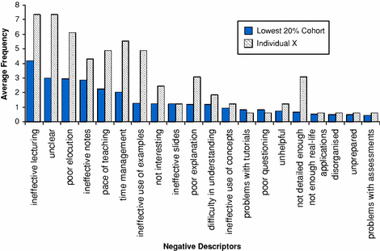
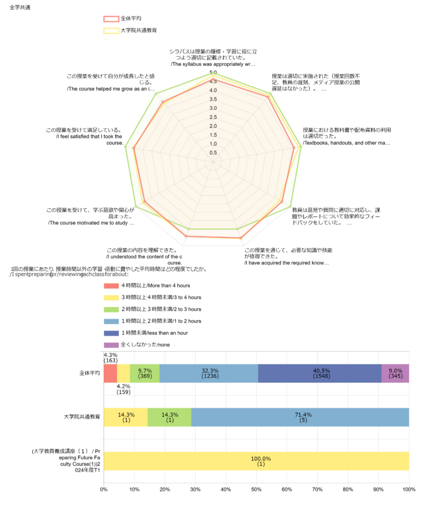
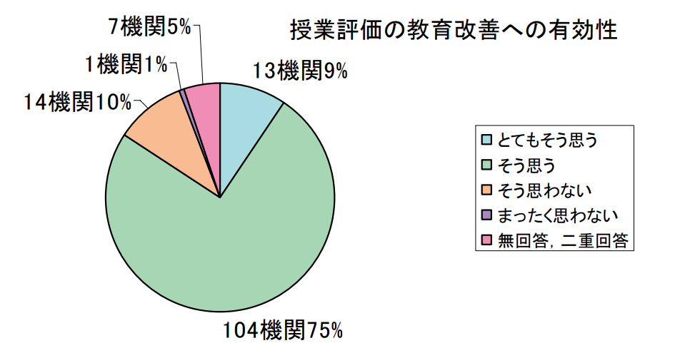

<!-- _class: ppt -->

授業評価アンケートの活用に向けて

到達目標：

授業評価アンケートに価値を見出し、

「活用したい」と思って頂きたい。

① アンケートの価値 / 活用のグッドプラクティス

&#8203;

高等教育センター 助教 

田川　翔 

&#8203;

高等教育センター 質保証・FD部長

医学研究院 教授

伊藤　彰一

願わくば…

<!-- (00:45) 00:00 -00:45
皆さんこんにちは。
高等教育センター 助教の田川と申します。
授業評価アンケートの活用に向けてというテーマで、 FDを行います。
この動画のテーマは アンケートの価値と活用のグッドプラクティスです。
授業評価アンケートは、授業をより良くする際に参考となり、学生とのコミュニケーションにもなる道具です。
本日の目標は、授業評価アンケートに価値を見出していただくとともに、授業で活用したいと感じていただけることです。 -->

---

<!-- _class: ppt -->

①アンケートの価値/活用のグッドプラクティス

毎タームの終わりに行っている

授業評価アンケート

不満の記入

で心が痛い

色々な声、疑問、お考えも

あると想像します

意味あるの？

妥当な意見なの？

嬉しい結果で

やる気でた

時間、かかって

大変そう…

使い方、

呼びかけ方、

分からない…

そんな先生方に応えるのがこの映像です。

なぜ、

必要？

<!-- 00:20 (00:45-01:05)
毎タームの終わりに行っている、全学の授業評価アンケート。
学生ポータルから入り、レーダーチャートや自由記述が見られるものですね。
様々なご意見やご経験、そして疑問を持たれているかと思います。
それ応えるのがこの映像です。 -->

---

<!-- _class: ppt -->

①アンケートの価値/活用のグッドプラクティス

不満の記入

で心が痛い

意味あるの？

妥当な意見なの？

嬉しい結果で

やる気でた

時間、かかって

大変そう…

使い方、

呼びかけ方、

分からない…

この動画では、上記の2点をご説明します

なぜ、

必要？

<!-- 00:15 (01:05-01:20)
この映像ではアンケートの妥当性と、その必要性の二点について、事例紹介を交えつつ、ご説明させて頂きます。 -->

---

<!-- _class: ppt -->

①アンケートの価値/活用のグッドプラクティス

そもそも、なぜ、授業評価アンケートを取るのでしょう

ｓ

1.大学が評価を受ける上で、必要なため。

&#8203;

2.教え方の上手い/下手を点数化するため。

&#8203;

3.良い授業が行われていることを保証するため。

&#8203;

4.先生方に次年度の授業改善に活かして頂くため。

<!-- 00:20 (01:20-01:40)
そもそも、なぜ、授業評価アンケートをとるのでしょう。この選択肢の中から、考えてみてください。(10秒待つ)
はい。それでは、答えにいってみます。 -->

---

<!-- _class: ppt -->

ｓ

①アンケートの価値/活用のグッドプラクティス

そもそも、なぜ、授業評価アンケートを取るのでしょう

1.大学が評価を受ける上で、必要なため。

&#8203;

2.教え方の上手い/下手を点数化するため。

&#8203;

3.良い授業が行われていることを保証するため。

&#8203;

4.先生方に次年度の授業改善に活かして頂くため。

◯

◎

△

×

よりよい授業を実現する際に参考となる

コミュニケーションツール

先生ご自身が 自己アピールに活用 されるのは妨げません

&#8203;

<!-- 00:35 (01:40-02:15)
アンケートの価値ですが、
大学が評価を受けたり(選択肢①)、内部質保証上(選択肢③)必要、というのも、側面もあります。
しかし、最も重要なのは、こちらの選択肢(④)、「先生方に次年度の授業改善に活かして頂くため。」という点です。
少なくとも、先生の授業に対する総括的な評価を行うものではありません。(②)
よりよい授業を先生が実現する際に、参考となる、コミュニケーションのためのツールなのです。 -->

---

<!-- _class: ppt -->

①アンケートの価値/活用のグッドプラクティス

Pan et al. (2009) Res. High. Educ. 

シンガポール国立大学の授業評価アンケートの

ネガティブな記述子の頻度

授業改善として、教員に対する頻出コメント例(青)  

①効果がない教え方

②不明瞭な説明

③聞きにくい

④効果の低い板書

⑤授業ペースが速い/遅い

⑥時間管理がまずい

⑦例が効果的ではない

⑧興味を惹かない

⑨スライドが効果的ではない

⑩説明が下手

⑪理解が難しい…

授業改善に繋がる内容とは具体的に何なのでしょう

先生ご自身の個性や環境といった要因よりも

教え方など変えられるものが大半です

<!-- 00:45 (02:15-03:00)
では授業の改善につながる内容とは具体的に何なのでしょう。
この図はシンガポール国立大学の授業評価アンケート結果における、ネガティブな記述の頻度です。
例えば、教え方の効果、説明の明瞭さ、聞きとりやすさ、板書の効果、授業のペース、時間管理、といった内容が挙げられています。
もちろんこうした内容がアンケートで戻ってくれば、落ち込むこともあるかと思います。
しかしここで強調したいのは、先生ご自身の個性や環境といった要因ではなく、「教え方」という、変えられる可能性がある内容が大半だ、ということです。 -->

---

<!-- _class: ppt -->

項目ごとに

&#8203;

集約

①アンケートの価値/活用のグッドプラクティス

千葉大学の授業評価アンケートの構造

10個の定量的項目

2つの定性的項目

- よかった点

- 改善されると学修者として嬉しい点

イメージ

定量的

10項目

学修者が特に

伝えたい点

定性的

2項目

<!-- 00:30 (03:00-03:30)
千葉大学の授業評価アンケートでは、左のレーダーチャートのような10個の定量的項目、「良かった点」「 改善されたら学修者として嬉しい点」という、2つの定性的項目を、学生に質問しています。
先ほどご説明した、授業改善に繋がる内容がそれぞれの項目に現れます。 -->

---

<!-- _class: ppt -->

①アンケートの価値/活用のグッドプラクティス

意味あるの？

妥当な意見なの？

授業評価など学生アンケートは、限界もありつつも、

妥当性を持つという研究結果が多くあります。

<!-- 00:20 (03:30-03:50)
ではそのアンケート結果の意見、妥当なのでしょうか。
この点について、世界的に研究が行われています。
まとめると、学生によるアンケート結果は、限界はありつつも妥当性を持つ、という結果になっています。 -->

---

<!-- _class: ppt -->

ｓ

①アンケートの価値/活用のグッドプラクティス

意味あるの？

妥当な意見なの？

学生は、教員のユーモアやカリスマ性などの特定の個性よりも

「教育の質」— つまり説明能力や理解を助ける力—を重視し評価する。

Pen et al. (2009) Res. High. Educ. シンガポール国立大学のアンケートの分析

学生の総合的な授業評価は教え方の質が最も大きな因子となる。

教え方の質、科目のやりがい、興味の水準、成績、教員の親切さの5つで分散の多くを説明できる

Barth (2008) J. Educ. Bus. ジョージアサザン大学のアンケートの分析

授業評価など学生アンケートは、限界もありつつも、

妥当性を持つという研究結果が多くあります。

<!-- 00:30  (03:50-04:20)
いくつか、例をあげましょう。
先ほどのシンガポール国立大学のアンケートでは教員のユーモアやカリスマ性といった、特定の個性ではなく、教育の質を重視し学生は評価することが見出されました 。

また別の研究でも学生の授業評価は、教え方の質が最も大きく左右すると言われています。 -->

---

<!-- _class: ppt -->

ｓ

①アンケートの価値/活用のグッドプラクティス

意味あるの？

妥当な意見なの？

学生は、教員のユーモアやカリスマ性などの特定の個性よりも

「教育の質」— つまり説明能力や理解を助ける力—を重視し評価する。

Pan et al. (2009) Res. High. Educ. シンガポール国立大学のアンケートの分析

学生アンケートの結果には、信頼性と安定性があり、

適切な支援と併用される場合、教育効果の向上に役立つといえる

学生の総合的な授業評価は教え方の質が最も大きな因子となる。

教え方の質、科目のやりがい、興味の水準、成績、教員の親切さの5つで分散の多くを説明できる

Barth (2008) J. Educ. Bus. ジョージアサザン大学のアンケートの分析

Marsh &amp; Roche (1997) Am. Psychol. 学生による教育評価に関するレビュー論文

×総括的評価的で嫌だ

→ ◯よりよい授業のためのフィードバック・参考意見

授業評価など学生アンケートは、限界もありつつも、

妥当性を持つという研究結果が多くあります。

<!-- 00:45 (04:20-05:05)
そして、学生アンケートの結果には、信頼性と安定性があり、適切な支援と併用されれば 教育効果の向上に役立つという、結果もあります。
授業の総括評価としてアンケートを見ると、嫌だとか、使いたくない、という思いもあらゆるかと思います。
しかし、アンケートの捉え方を変えることから、ぜひ始めませんか。
授業が良くなり、困る人はいません。
より良い授業にするためのフィードバックやコミュニケーションの場、あるいは、参考となる意見をもらう場、という風に考えていただければ幸いです。 -->

---

<!-- _class: ppt -->

ｓ

①アンケートの価値/活用のグッドプラクティス

意味あるの？

妥当な意見なの？

学生は、教員のユーモアやカリスマ性などの特定の個性よりも

「教育の質」— つまり説明能力や理解を助ける力—を重視し評価する。

Pen et al. (2009) Res. High. Educ. シンガポール国立大学のアンケートの分析

適切な条件下での学生アンケートの結果には、信頼性と安定性があり、

適切な支援と併用される場合、教育効果の向上に役立つといえる。

学生の総合的な授業評価は教え方の質が最も大きな因子となる。

教え方の質、科目のやりがい、興味の水準、成績、教員の親切さの5つで分散の多くを説明できる

Barth (2008) J. Educ. Bus. ジョージアサザン大学のアンケートの分析

Marsh &amp; Roche (1997) Am. Psychol. 学生による教育評価に関するレビュー論文

より詳しく知られたい先生方へ

&#8203;

1.海外での事例については、SET (Student Evaluation of Teaching)と 検索頂くと、相当数の論文や実施例が見つかります。

&#8203;

2.日本では、東海大学を皮切りに、現在殆どの大学で実施されています。

&#8203;

3.アンケートの信頼性にはまだ多くの議論があり、バイアスの影響を含め、結果の利用には限界があると考えられています。 　▶結果/記載内容を絶対視する必要はありません (誤解や批判もある) 　▶結果全てに応対する必要はありません  (有効な内容を活用する)

懸念や限界も含め、詳しい内容を参照されたい方へ：Spooren et al. (2013) RER

大学における、学生の教育評価に関する大規模システマティックレビュー

授業評価など学生アンケートは、限界もありつつも、

妥当性を持つという研究結果が多くあります。

<!-- 00:10 (05:05-05:15)
なお、こちらのスライドに、先行研究をまとめておりますので、ご興味のある方は、PDF、または映像を止めて、ご確認ください。 -->

---

<!-- _class: ppt -->

①アンケートの価値/活用のグッドプラクティス

評価結果を教育研究の質の改善・向上に結びつける活動に関する調査研究報告書,

大学評価・学位授与機構 (2007)

国内大学における授業評価の教育改善への有効性

📊 グラフ（元ファイル参照 / marp-echarts で要再作成）

全学部・全研究科で学生による授業評価を 実施した大学 (R4年度調査 n = 781) 

大学評価・学位授与機構 (2007)

大学における教育内容等の改革状況について (R4), 文部科学省 (2023）

国内でも、98 %の大学が

学生による何らかの授業評価を実施

有効性は、

概ね肯定的に認識

されている。

授業評価アンケートは教え方・授業改善に活用できるツールです

<!-- 00:35 (05:15-05:50)
最後に、国内の状況についてですが、文科省が毎年調査しています。
国内でもすでに、98%の大学が、学生による何らかの授業評価を実施しています。
また、少々結果は古いものの、その有効性は概ね肯定的に認識されているようです。
ぜひ、授業評価アンケートを教え方や授業改善に活用できる「ツール」としてご活用ください。 -->

---

<!-- _class: ppt -->

①アンケートの価値/活用のグッドプラクティス

大学として必要な理由と

先生ご自身のお役に立てるからという理由があります

なぜ、

必要？

<!-- 00:15 (05:50-06:05)
それでは、次の話題に入ります。アンケートの価値についてです。
なぜ必要か、それは先ほどお伝えしたように大学として必要である、という理由と先生ご自身のお役に立てるから、という理由があります -->

---

<!-- _class: ppt -->

①アンケートの価値/活用のグッドプラクティス

大学として必要な理由と

先生ご自身のお役に立てるからという理由があります

なぜ、

必要？

分析

設計

開発

実施

評価

Analysis

Design

Implementation

Evaluation

Close the LOOP!

Be AGILE!

Development

授業を改善するとは、

改善のサイクルを回すこと

ADDIEモデル

授業・教材設計のプロセスを

示したもの

(ガニエ他 2007) ※但し1980sからある

起点となる

評価→分析の道具

<!-- 01:15 (06:05-07:20)
ここでインストラクショナルデザインの知見をご紹介させてください。
ADDIEモデルというものです。
これは授業設計や教材作成のより良いプロセスを示したものです。
分析、設計、開発、実施、評価の5つの段階に分け、そのサイクルを回すことで、よりよい授業を作っていきましょう、というものです。
それぞれの段階の頭文字をとって、ADDIEとよばれています。
様々な研修で説明されることも多いため、ご存知の先生もいらっしゃるかと思います。
この中で最も重要となるのは、設計、一つ目のDの段階です。
しかし、もう一つ強調したいのは、これはサイクルである、ということです。
PDCAサイクルの授業版を想像してください。
授業を良くしているサイクルを閉じることが重要です。
起点となるのは、行われた授業活動の評価を行い、学修者や授業を分析する活動、
これがまさに授業評価アンケートの役割なのです。 -->

---

<!-- _class: ppt -->

①アンケートの価値/活用のグッドプラクティス

活用のグッド・プラクティス

2024年度前期に、回収率が良かった先生にお話を伺いました

教育学部 助教 八木澤 史子先生

&#8203;

専門は初等中等教育におけるICT利用。

小学校教諭を長年勤め、千葉大学に2022年ご着任

国際未来教育基幹 特別語学講師 Roy Morris 先生

&#8203;

専門は英語教育。

各大学での英語講師を経て、千葉大学に2024年着任。

お二人の授業での回収率は、なんと、7割超え！

活用の秘訣を伺いました

<!-- 00:30 (07:20-07:50)
今回のFD実施に先立ち、本年度前期にアンケートの回収率が高かった先生からお話を伺いました。
1人は、教育学部の助教であられる八木澤先生です。
もう1人は、国際未来教育基幹の語学講師である、ロイ・モリス先生です。
お二人での授業におけるアンケートの回答率は、なんと7割を超え。
そこでアンケート活用の秘訣について、伺ってまいりました。 -->

---

<!-- _class: ppt -->

①アンケートの価値/活用のグッドプラクティス

見えてきた活用の原則 ①

学生と教員間の認識のズレに気づき、伝え方/設計を変える機会と捉える

活用のグッド・プラクティス

必修授業で学校のICT活用を教えたのですが、ICT推しの内容が気に入らなかった学生もいて…。

ICTに不信感を持つ学生にとっては、押し付けられるのが嫌だったんだと気づきました。

&#8203;

次の年の授業からは、ICTを取り入れる利点を教えつつ、 「苦手な人と得意な人の差も考慮してどうすべきか考える」という構成を取り入れたところ、 「ICT推しは嫌だ」というコメントはなくなりました。

評価から、学修者を分析し、設計を変えて、実施する

まさに、ADDIEの実践例です

この点、ダイアログでも語っており、ぜひご確認下さい！

<!-- 01:10 (07:50-09:00)
活用のグッドプラクティスとして、見えてきた点の一つ目。
それは、教員と学生間の認識のずれに気づき、伝え方・設計を変える機会として、
アンケートを捉えているということです。
八木澤先生の ICT 利用に関する必修授業の話です。
そのアンケートでは、初等・中等教育でのICT を使用を、気にいらない学生がいるんだという点が、気づきになったということでした。
先生のご専門であることもあり、ICTに懐疑的な学生がいること、そして彼らがどう受け止めているのかは、アンケートで気づけた点、ということです。
その意見を受けて次の年の授業からは、 
「ICTが苦手な人と得意な人の差も考慮し、どうすべきか考える」
という構成を取られました。
すると、そうしたコメントはなくなったそうです。
認識のズレを減らし、改善する工夫。まさに、ADDIEモデルの実践例です。 -->

---

<!-- _class: ppt -->

①アンケートの価値/活用のグッドプラクティス

見えてきた活用の原則 ①

学生と教員間の認識のズレに気づき、伝え方/設計を変える機会と捉える

活用のグッド・プラクティス

I sometimes find comments like &quot;The teacher spoke too quickly&quot; and these are helpful,..

Usually I use the results of these to make sure my class had met everyone&#x27;s expectations.

期末の授業評価アンケートにだけに頼らず、

日頃から授業改善可能な「学びの場づくり」が面白いです

<!-- 00:25 (09:20-09:45)
またモリス先生も、「話し方が速い」と言ったコメントは非常に重宝するとのこと。
語学の授業なので、確かに授業効果に直結しそうです。
日頃から、授業へのコメントが出る、学びの場づくりを心がけていらっしゃるそうです。
これも、学生と教員のズレを減らす工夫です。 -->

---

<!-- _class: ppt -->

①アンケートの価値/活用のグッドプラクティス

見えてきた活用の原則 ②

即対応出来るものと、来年のもの、後回しで検討のものに分ける

活用のグッド・プラクティス

1回目の授業で出た反省を2回目や翌年の授業に活かすようにしています。

例えば、「スライドが見にくい」や「声が大きすぎる」というのはすぐに改善できます。一方、内容や授業構成全体に関わるものは、すぐに修正するのは難しいです。

&#8203;

最初に「対応可能なもの」と「そうでないもの」に分けて考えるようにしています。そうすると自分も少し気が楽になりますし、授業も無理なく改善できますね。

<!-- 00:45 (09:45-10:30)
グッドプラクティスとして見えてきたことの2つ目、それは、得られたコメントの仕分けを行う、という点です。
例えば、タイムフレームによる仕分けです。
即対応できるもの、来年のもの、後回しで検討するもの、に分けるといった考え方です。 
場合によっては、批判的なコメントは参考意見と捉え、即対応するのではなく、背景を考えたり、授業全体の意見かどうかを考える必要性もあるかと思います。
八木澤先生も、すぐに修正できるものとできないもの、に分けたり、
全てをすぐ対応しなきゃと、思わないようにする、というお話をされてました。 -->

---

<!-- _class: ppt -->

①アンケートの価値/活用のグッドプラクティス

見えてきた活用の原則 ②

即対応出来るものと、来年のもの、後回しで検討のものに分ける

活用のグッド・プラクティス

1回目の授業で出た反省を2回目や翌年の授業に活かすようにしています。

例えば、「スライドが見にくい」や「声が大きすぎる」というのはすぐに改善できます。一方、内容や授業構成全体に関わるものは、すぐに修正するのは難しいです。

&#8203;

最初に「対応可能なもの」と「そうでないもの」に分けて考えるようにしています。そうすると自分も少し気が楽になりますし、授業も無理なく改善できますね。

優先度 (=目標達成へ必要な度合い)

フィードバックを改善に落とし込む前に、

優先順位と手数を考え、どこから改善するかを

考えるのは、有効に思います。

時々、対応必須の内容も出てくると思います。

&#8203;

全てを一律に改善するのではなく、

タイムフレームを分ける心持ちに納得しました。

<table class="ppt-tbl" style="left:1.908%;top:58.878%;width:35.897%;height:26.667%">
<tr>
<th></th>
<th></th>
<th>対応に必要な努力量</th>
<th></th>
<th></th>
</tr>
<tr>
<td></td>
<td></td>
<td>少ない</td>
<td>中</td>
<td>多い</td>
</tr>
<tr>
<td>優先度</td>
<td>対応必須</td>
<td></td>
<td></td>
<td></td>
</tr>
<tr>
<td></td>
<td>高い</td>
<td></td>
<td></td>
<td></td>
</tr>
<tr>
<td></td>
<td>低い</td>
<td></td>
<td></td>
<td></td>
</tr>
</table>

シラバスと違う！

話し方…

資料

例

連絡忘れ

※ 他の教員・FDなどの力を借りる手もあります！

<!-- 00:30 (10:30-11:00)
一例ですが、対応の努力量と、優先度で仕分ける、という考え方は有効です。
声の大きさはマイク利用したり、話し方の速度は心がけで変えられるかもしれません。
ときには、シラバスと内容が違う、といった、努力量は多いけども、対応必須なコメントもあるかもしれません。
しかし、このように仕分け作業を行うことで、アンケートと向きあう心のゆとりが出来る点に納得しました。 -->

---

<!-- _class: ppt -->

①アンケートの価値/活用のグッドプラクティス

見えてきた活用の原則 ③

総括評価ではなく、フィードバックの声/コミュニケーションとして捉える

活用のグッド・プラクティス

学生からのフィードバックで授業改善することが、自分自身の良い授業に繋がると思います。

学生も、自分の意見が授業に反映されると感じれば、より積極的に参加してくれるのではないかな、と。もちろん、すべての意見を反映できるわけではありませんが。

でも、少しでも「自分たちの意見が尊重されている」感覚が、学習意欲につながるのではないでしょうか。

... very occasionally I get one student answering negatively in a class.  It can be frustrating, but I try to read them carefully as those students are actually giving feedback that I can reflect and act on (usually).

フィードバックとして捉え、良い授業の糧とする。

「省察的実践家」としての姿勢に、感銘を受けました。

<!-- 00:30 (11:00-11:30)
そして最後の点はアンケートの捉え方です。
授業の総括評価ではなく、フィードバックの声、コミュニケーションの手段としてアンケートを捉えられていたのが印象的でした。
八木澤先生に頂いたように、学生自身の意見が尊重されているという感覚は、学生の学修意欲に繋がるかもしれません。
モリス先生も、フィードバックという言葉でアンケートを語られていました。 -->

---

<!-- _class: ppt -->

①アンケートの価値/活用のグッドプラクティス

適切な支援と併用される場合、教育効果の向上に役立つ

アンケートの回答率：最も高いのは教育学部

活用のグッド・プラクティス

部局での

①学部長(藤川先生)より、「アンケートを大事にしましょう」と教授会で共有があった

部局での風土づくりを行う

②アンケートをもとにしたFDが講座にあり、有効活用されている

部局での活用の場を設定する

教員個人でも、部局全体でも、フィードバックとしてご活用下さい！

アンケート記載内容を教員同士で共有し、改善方法を相談する場

 → 実践的な交流になり、安心感や気付きに繋がる

<!-- 01:30 (11:30-13:00)
また、部局でのグッドプラクティスについても、ご紹介します。 
教員個人でアンケートを活用しようにも、難しい場合はあるかもしれません。
全学の授業評価アンケートの回収率が多い授業が多い部局は、教育学部でした。
そこでの２つのグッドプラクティスを紹介します。
まず部局における、アンケートを活用する風土作りです。
部局長の先生から、アンケートを大事にしましょうと呼びかけて頂いておりました。
また結果についても、活用する場が設定されていました。
アンケートを元にした FD が大学の講座内で実施されている、とのことです。
これは、アンケートへの記載内容を、教員同士で共有し、改善方法を相談する場です。
そこで生まれた、先生同士のやり取りが、実践的な交流になり、安心感や気づきに繋がる、とのことでした。
先立ってご紹介した研究でも、適切な支援と併用された場合、アンケートは教育効果の向上に役立つということでした。
教員個人でも、部局全体でも、活用いただければと考えます。 -->

---

<!-- _class: ppt -->

①アンケートの価値/活用のグッドプラクティス

なぜ、

必要？

大学として必要な理由について、より詳しく知られたい先生方へ

&#8203;

1.授業評価アンケートは、科目レベルで教育の質を点検し、改善し、 その質を保証する役割をもちます。R2に示された「教学マネジメント」指針を支える、基礎的なデータの一つとなります。 

2.大学評価時のアセスメントにおいても、自己点検と改善のサイクルが 回っていることは、重点的に確認されます。

&#8203;

3.大学の社会的責任の文脈でもアンケートで授業の質を向上させる点は、不可欠といえます。

大学として必要な理由と

先生ご自身のお役に立てるからという理由があります

<!-- 00:20 (13:00-13:20)
なお、こちらのスライドに、背景となる情報をまとめております。ご興味のある方は、PDF、または映像を止めて、ご確認ください。 -->

---

<!-- _class: ppt -->

まとめ

授業評価アンケートに価値を見出し、ぜひ活用頂けますと幸いです

① アンケートの価値 / 活用のグッドプラクティス

大学として必要な理由と

先生ご自身のお役に立てるからという理由があります

なぜ、

必要？

意味あるの？

妥当な意見なの？

学生アンケートは、限界もありつつも、

妥当性を持つという研究結果が多くあります。

<!-- 00:40 (13:20-14:00)
この映像では、アンケートの価値と、活用のグッドプラクティスについて、ご説明致しました。
妥当な意見か、という点は、先行研究をもとに、その妥当性をご紹介致しました。
必要性については、大学として必要という点に加え、先生ご自身の授業改善にお役に立てるから、という点をお話させて頂きました。
授業評価アンケートの価値は、活用していくことで見えてくるものです。
ぜひ、先生の授業でも、ご活用頂けますと幸いです。 -->
