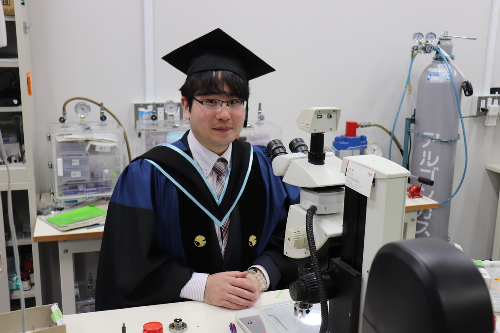
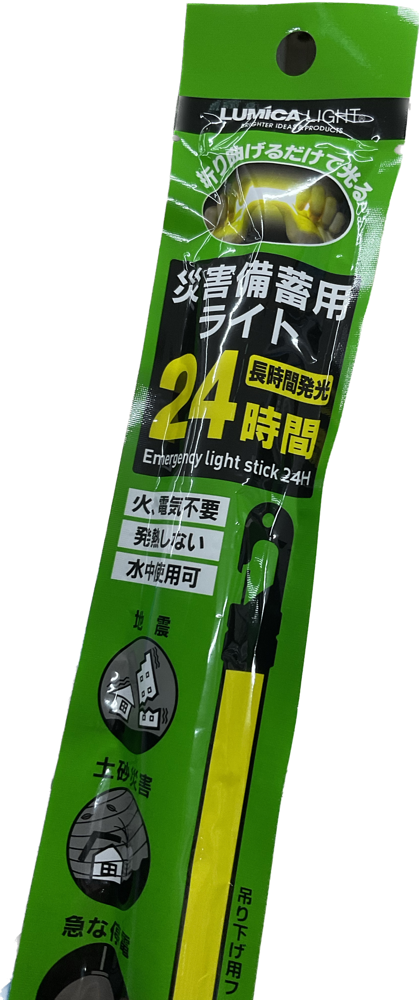
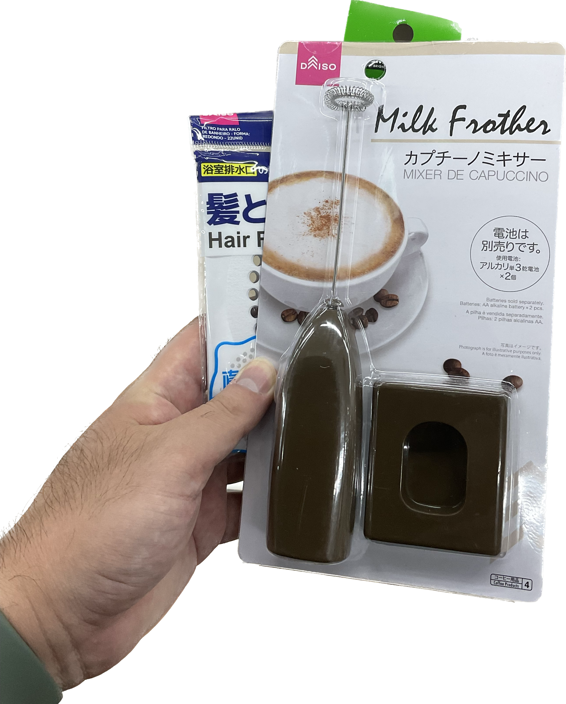
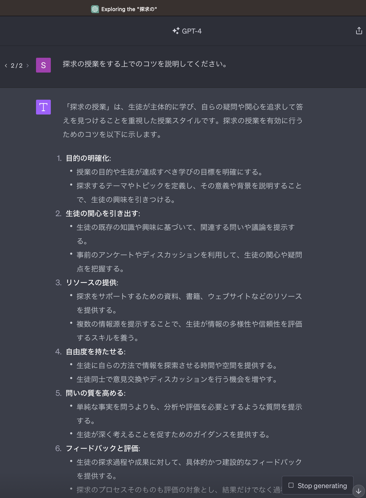
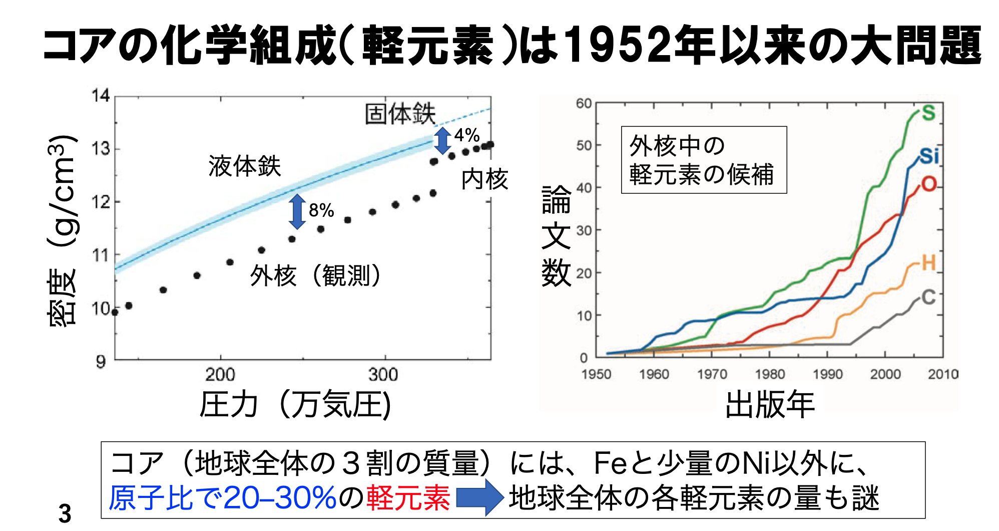
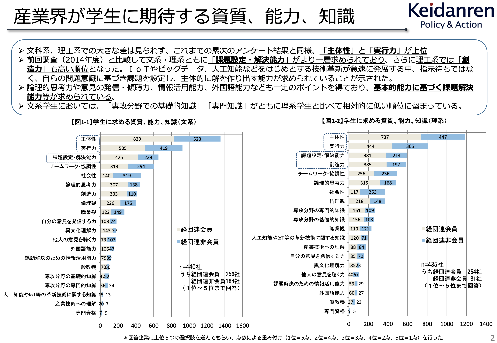
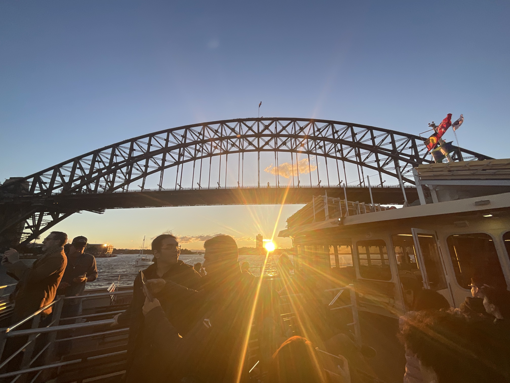
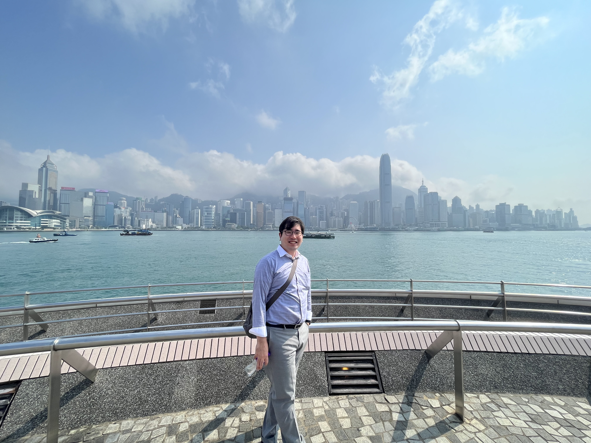

<!-- _class: ppt -->

自己紹介

田川 翔 (たがわ しょう)

　学位　  ：  2020年4月   博士(理学)

　略歴　：　- 1990年宮崎県延岡市生まれ．

　　　　- 中高6年間，「総合的な学習」のメッカ 　　　　　五ヶ瀬中等教育学校で，寮生活を過ごす

　　　　- 大学教員を経て、航空会社社員

[ベクター画像 fig01-img.wmf PowerPointでPNG等に再保存してください]

探求・発表を生業にしてきた

---

<!-- _class: ppt -->

自己紹介

🎬 動画: Melty（元ファイル参照）

---

<!-- _class: ppt -->

探求学習「研究課題」のTips

日本貨物航空株式会社

博士 (理学)　田川 翔

　2023/08/22

---

<!-- _class: ppt -->

テーマをどう決めよう

テーマ決めは探求の命

①テーマと自分の関係を考えよう

　+1:自分がしたいことか、自分が好きなことか？

　+1:自分だからできる事はあるか？(立場、強み？)

　+1:日常に関係するか

②仮説を立てよう

　結果を合わせる事とは違う

　(多くの)研究者は先に全体を予想してから取り掛かる

③他の人と話してみよう、本を読んでみよう

　+1:横の人はなんという?

　+1:専門家に聞いてみよう

自分のテーマは幾つ当てはまる？

---

<!-- _class: ppt -->

方法をどう決めよう

百聞は一見に如かず、百見は一行に如かず

①文献調査だけじゃない「一味違った」を作る

　+1:実験？

　+1:アンケート？

　+1:専門家に聞いてみる？本を読んで見る？

②とりあえず、まずはやってみよう

　調べて設計するよりも、できることをやってみた方が容易い

　行動から得た結果は、学生も専門家も変わらない

③やってみると面白くなる

　暫くは挑んでみよう

　やってみて、面白くないなら変えてみよう

実は行動が鍵

---

<!-- _class: ppt -->

方法をどう決めよう

百聞は一見に如かず、百見は一行に如かず

成功した人生とはなにか。

Q1) 次の２つのうち、自分の考えに近いのはどちらか？

A: 自分の興味と才能に沿って行動し、      好きなことを最大限追求する

B: 高い収入を得て、輝かしいキャリアを築き、名声を得る。

&#8203;

Q2) 世間一般の人々は、AとB のどちらを選ぶだろうか？

---

<!-- _class: ppt -->

方法をどう決めよう

百聞は一見に如かず、百見は一行に如かず

成功した人生とはなにか。

Q1) 次の２つのうち、自分の考えに近いのはどちらか？

A: 自分の興味と才能に沿って行動し、      好きなことを最大限追求する

B: 高い収入を得て、輝かしいキャリアを築き、名声を得る。

&#8203;

Q2) 世間一般の人々は、AとB のどちらを選ぶだろうか？

2019年、アメリカのシンクタンク「ポピュレース」が調査 (n&gt;5200)

Q1) 自分 ではAを選ぶ 97%

Q2) 多くの人はBを選ぶと思う 92%

社会的幻想：集団に属する個人が、ある意見を内心は拒絶しながら、

他の殆どの人はそれを許容していると誤って推定している状態。

---

<!-- _class: ppt -->

方法をどう決めよう

百聞は一見に如かず、百見は一行に如かず

---

<!-- _class: ppt -->

方法をどう決めよう

百聞は一見に如かず、百見は一行に如かず

成功した人生とはなにか。

Q1) 次の２つのうち、自分の考えに近いのはどちらか？

&#8203;

A: 自分の興味と才能に沿って行動し、    　　　　　　　　　　　　  好きなことを最大限追求する。

B: 高い収入を得て、輝かしいキャリアを築き、名声を得る。

&#8203;

Q2) 世間一般の人々は、AとB のどちらを選ぶだろうか？

---

<!-- _class: ppt -->

構造をどう決めよう

型があるので倣おう

①探求結果のまとめ方には型がある

　はじめに：なぜ興味を持ったのか、先行研究、探求の目的

　方法：どのような手法で研究をしたのか、それはなぜ妥当か

　結果：方法の結果、どのようなデータが得られたか

　考察：データからわかったことはなにか、目的の答えは

　出典：どの情報を参照したか

②研究の方法には型がある

　例) 対照実験 、比較と構造化など

　但し、現時点では拘らなくても大丈夫

③分析の仕方には型がある

　グラフの書き方、表の書き方など

本格的に始める前に、先生に聞いてみよう

型について、学ぶ機会を大切に

他の人の探求例を

見てみよう

---

<!-- _class: ppt -->

スライドを組み立てよう

スライドに最初から落とし込まない

考えるときは手を使う→箇条書きかコンテを作る

時間配分と強弱をうまくつけておく

スケッチブックに書いて思考する

---

<!-- _class: ppt -->

スライドを作ろう

日本一、地球科学で発表がうまい、 　指導教員のスライドはどうなっていた？

---

<!-- _class: ppt -->

スライドを作ろう

日本一、地球科学で発表がうまい、 　指導教員のスライドはどうなっていた？

コツ①　ページ一つで、メッセージ一つ

コツ②　最下部にイイタイコトを書く

コツ③　アニメなし/色少なめシンプル

複雑であっても、見せ方はシンプルで構わない

本質まで研げ

必須①　話す順番に配置

必須②　最下部にイイタイコトを書く

必須③　文字とグラフは大きく

---

<!-- _class: ppt -->

伝えよう

①伝わる三要素 by アリストテレス

　エトス：話す人を信用させる要素

　　　　　資格、そのテーマと自分の関係性

　パトス：感情に働きかける要素

　　　　　ストーリー、共感、聞き手に合わせる

　ロゴス：頭脳に働きかける要素

　　　　　具体例や比喩を使おう、明快単純な語彙を使おう

②図表を使おう

③発表前に練習しよう 3回or 1時間は繰り返す

　説明順番、アイコンタクト、時間厳守

伝え方を磨くだけで、何倍にも変わる

---

<!-- _class: ppt -->

なぜ探究学習？

探求学習の過程で学べる事が多いから

→探求を繰り返して方法に慣れると、資質が自ずと身につく

「高等教育に関するアンケート」 (経団連、2018) https://www.keidanren.or.jp/policy/2018/029.html

主体性・実行力

課題設定・創造力

協調性

---

<!-- _class: ppt -->

メッセージ

自分:とことん英語嫌い(一年目センター試験半分)

&#8203;

今は:航空会社で世界を旅、世界で英語の仕事する

学びと課題解決の順番を逆にしよう。

&#8203;

探求とは、自分と世界の関係を形作っていくこと

人生はきっとシンプルで、大切な事は少しだけ

好きな事を追う幸せな人生にしよう

探求を楽しもう！

勉強

社会貢献

課題解決

勉強

社会貢献

課題解決

