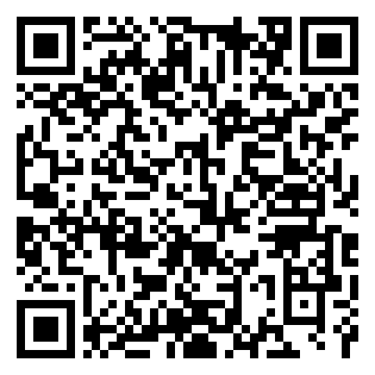
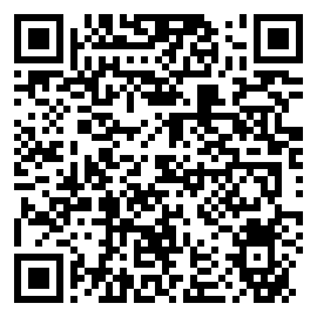

<!-- _class: cover-hero -->

Boeing Externship ／ 第2回

デザインWS・ チームビルディング

第2回 デザインワークショップ 2026年6月9日（火）／ 総合校舎 G1-101

本日の進行担当：千葉大学 国際未来教育基幹 田川 翔（プログラム進行）

<!-- 第2回へようこそ。今日は座学ではなく、90分まるごと手を動かしてデザイン思考を体験し、最後に発表テーマで集まってチームを作ります。サークルのように自由に、全員で楽しくいきましょう。場所はG1-101、進行は田川が務めます。 -->

---

<!-- _class: summary goal -->

本日のゴール

## 本日のゴールは、2つ

### ① 体験する

- デザイン思考を<b>手を動かして</b>体感する
- 座学ではなく、議論で進める
- ソリューションより、<b>試して気づく</b>を大切に

### ② チームを作る

- 発表テーマで集まり<b>仲間を見つける</b>
- 今日その場で<b>正式チームを確定</b>する
- 学年・学科を越えて、仲間を見つける

### 🎈 注意点

- グラウンドルールを確認して、楽しく進めましょう

<figure>
<svg viewBox="0 0 120 104" xmlns="http://www.w3.org/2000/svg" role="img" aria-label="付箋に書き出す">
  <rect x="14" y="34" width="50" height="50" rx="5" fill="#CFE2F3" transform="rotate(-9 39 59)"/>
  <rect x="30" y="22" width="50" height="50" rx="5" fill="#FFE680" transform="rotate(7 55 47)"/>
  <rect x="44" y="42" width="50" height="50" rx="5" fill="#F8C8DC" transform="rotate(-3 69 67)"/>
  <g stroke="#0033A0" stroke-width="3" stroke-linecap="round" opacity="0.55">
    <line x1="54" y1="59" x2="86" y2="59"/>
    <line x1="54" y1="69" x2="86" y2="69"/>
    <line x1="54" y1="79" x2="76" y2="79"/>
  </g>
</svg>
<figcaption>① 手を動かす</figcaption>
</figure>

<figure>
<svg viewBox="0 0 120 104" xmlns="http://www.w3.org/2000/svg" role="img" aria-label="3人のチーム">
  <circle cx="28" cy="46" r="14" fill="#5B7FC7"/>
  <path d="M6 98 q22 -30 44 0 z" fill="#5B7FC7"/>
  <circle cx="92" cy="46" r="14" fill="#19B36B"/>
  <path d="M70 98 q22 -30 44 0 z" fill="#19B36B"/>
  <circle cx="60" cy="38" r="17" fill="#0033A0"/>
  <path d="M30 100 q30 -36 60 0 z" fill="#0033A0"/>
</svg>
<figcaption>② チームを作る</figcaption>
</figure>

<figure>
<svg viewBox="0 0 120 104" xmlns="http://www.w3.org/2000/svg" role="img" aria-label="楽しく動く">
  <circle cx="60" cy="52" r="34" fill="#FFE680" stroke="#F0A500" stroke-width="4"/>
  <circle cx="48" cy="46" r="4.5" fill="#0033A0"/>
  <circle cx="72" cy="46" r="4.5" fill="#0033A0"/>
  <path d="M44 62 q16 16 32 0" fill="none" stroke="#0033A0" stroke-width="4" stroke-linecap="round"/>
  <path d="M16 22 l3 7 7 3 -7 3 -3 7 -3 -7 -7 -3 7 -3 z" fill="#E8467C"/>
  <path d="M101 74 l2.5 6 6 2.5 -6 2.5 -2.5 6 -2.5 -6 -6 -2.5 6 -2.5 z" fill="#19B36B"/>
</svg>
<figcaption>🎈 楽しく</figcaption>
</figure>

今日のゴール＝「暫定テーマ1つ」と「チーム」

<!-- ゴールは欲張らず2つだけ。①デザイン思考を体験すること、②テーマで集まってチームを作ることです。難しく考えず、手を動かしながら仲間を見つけてください。90分後にはチームと暫定テーマを1つ持って帰る、それがゴールです。 -->

---

<!-- _class: summary -->

グラウンドルール (再掲)

## 協力して挑める「場」をみんなで作る

### 😊 場づくりの基本

- 協力的な場づくりと<b>言い合える文化</b>を大切に
- コミュニケーションは、<b>敬意</b>を持って、<b>忌憚なく</b>、<b>建設的に</b>
- 自ら動こう（各チームでプロジェクトを管理・推進）
- <b>困ったら相談しよう</b>：「手を差し伸べる」より <b>「助けを相談する」</b>

### ✈ 航空の文化に学ぶ

- 学年や立場に関係なく <b>気づきを声に出す</b>
- 質問をすることも大切 (分からないことは徹底してなくす)
- 多様な視点が大切(→分野の多様性を活かそう)、価値を考える

チーム一丸で、面白い価値を創造しよう

<!-- 航空会社の安全文化（CRM・Just Culture・定時性）をチーム運営に応用。立場を超えて声を出し、失敗を学びに変え、無理せず時間を守る。 -->

---

<!-- _class: agenda -->

本日の流れ

## 90分の流れ ― 手を動かして、チームを作る

0:00–0:05

導入

オープニング・<b>本日の2つのゴール</b>

0:05–0:12

導入

デザイン思考リキャップ＋道具・<b>2つのGem</b>紹介＋1分アイスブレイク

0:12–0:30

体験

<b>WORK①</b> 飛行機の体験リデザイン（共感）／運営が決めた班（18分）

0:30–0:50

体験

<b>WORK②</b> HMW問い作り（定義）／運営が決めた班（20分）

0:50–1:15

体験

<b>WORK③</b> テーマ集約→多様な4班づくり＋クレイジー2（発散→<b>正式チーム確定</b>）（25分）

1:15–1:25

チーム

チーム名・リーダー・連絡手段・役割（10分）

1:25–1:30

まとめ

成果物・宿題・Q&amp;A（5分）

体験7：チーム3、手を動かしながら仲間を見つける

<!-- 90分の全体像です。前半はWORK①②③で手を動かす体験パート、後半でチームを固めます。WORK①②は運営があらかじめ決めた班で進め、WORK③で全員でテーマを出し合い、自分が選んだテーマの島がそのまま正式チームになります。配分は体験7：チーム3。動きながら仲間を見つけていきましょう。 -->

---

<!-- _class: dt -->

デザイン思考

<b>デザイン思考</b>とは、つくる側の都合ではなく<b>使う人の視点</b>から出発し、 観察・試作・検証を繰り返して課題と解を磨いていく進め方です。

<svg viewBox="0 0 1180 220" xmlns="http://www.w3.org/2000/svg" role="img" aria-label="デザイン思考の5ステップ">
  <g fill="none" stroke="#C2C9D6" stroke-width="4" stroke-linecap="round" stroke-linejoin="round">
    <path d="M231 54 l13 12 -13 12"/><path d="M481 54 l13 12 -13 12"/><path d="M731 54 l13 12 -13 12"/><path d="M981 54 l13 12 -13 12"/>
  </g>
  <circle cx="110" cy="66" r="44" fill="#E8467C"/>
  <path d="M110 88 C86 70 92 48 110 60 C128 48 134 70 110 88 Z" fill="#fff"/>
  <circle cx="140" cy="40" r="12" fill="#fff"/><text x="140" y="45" text-anchor="middle" font-size="15" font-weight="700" fill="#E8467C">1</text>
  <text x="110" y="142" text-anchor="middle" font-size="27" font-weight="800" fill="#E8467C">共感</text>
  <text x="110" y="164" text-anchor="middle" font-size="14" fill="#888">Empathize</text>
  <text x="110" y="190" text-anchor="middle" font-size="16" fill="#333">当事者を観察・理解</text>
  <circle cx="360" cy="66" r="44" fill="#0033A0"/>
  <circle cx="360" cy="66" r="20" fill="none" stroke="#fff" stroke-width="3"/><circle cx="360" cy="66" r="10" fill="none" stroke="#fff" stroke-width="3"/><circle cx="360" cy="66" r="3.5" fill="#fff"/>
  <circle cx="390" cy="40" r="12" fill="#fff"/><text x="390" y="45" text-anchor="middle" font-size="15" font-weight="700" fill="#0033A0">2</text>
  <text x="360" y="142" text-anchor="middle" font-size="27" font-weight="800" fill="#0033A0">定義</text>
  <text x="360" y="164" text-anchor="middle" font-size="14" fill="#888">Define</text>
  <text x="360" y="190" text-anchor="middle" font-size="16" fill="#333">本当の課題を定める</text>
  <circle cx="610" cy="66" r="44" fill="#F0A500"/>
  <circle cx="610" cy="60" r="15" fill="none" stroke="#fff" stroke-width="3"/><path d="M610 50 v12 M603 56 h14" stroke="#fff" stroke-width="2.5" stroke-linecap="round"/><rect x="603" y="78" width="14" height="7" rx="2" fill="#fff"/>
  <circle cx="640" cy="40" r="12" fill="#fff"/><text x="640" y="45" text-anchor="middle" font-size="15" font-weight="700" fill="#F0A500">3</text>
  <text x="610" y="142" text-anchor="middle" font-size="27" font-weight="800" fill="#E08F00">アイデア</text>
  <text x="610" y="164" text-anchor="middle" font-size="14" fill="#888">Ideate</text>
  <text x="610" y="190" text-anchor="middle" font-size="16" fill="#333">量を出す（質より量）</text>
  <circle cx="860" cy="66" r="44" fill="#19B36B"/>
  <rect x="842" y="50" width="22" height="22" rx="3" fill="none" stroke="#fff" stroke-width="3"/><rect x="858" y="64" width="22" height="22" rx="3" fill="#fff"/>
  <circle cx="890" cy="40" r="12" fill="#fff"/><text x="890" y="45" text-anchor="middle" font-size="15" font-weight="700" fill="#19B36B">4</text>
  <text x="860" y="142" text-anchor="middle" font-size="27" font-weight="800" fill="#149A5B">試作</text>
  <text x="860" y="164" text-anchor="middle" font-size="14" fill="#888">Prototype</text>
  <text x="860" y="190" text-anchor="middle" font-size="16" fill="#333">素早く形にする</text>
  <circle cx="1110" cy="66" r="44" fill="#7A5BD0"/>
  <circle cx="1104" cy="60" r="14" fill="none" stroke="#fff" stroke-width="3"/><line x1="1114" y1="70" x2="1124" y2="80" stroke="#fff" stroke-width="3.5" stroke-linecap="round"/><path d="M1098 60 l4 4 7 -8" fill="none" stroke="#fff" stroke-width="2.5" stroke-linecap="round" stroke-linejoin="round"/>
  <circle cx="1140" cy="40" r="12" fill="#fff"/><text x="1140" y="45" text-anchor="middle" font-size="15" font-weight="700" fill="#7A5BD0">5</text>
  <text x="1110" y="142" text-anchor="middle" font-size="27" font-weight="800" fill="#6A4BC0">検証</text>
  <text x="1110" y="164" text-anchor="middle" font-size="14" fill="#888">Test</text>
  <text x="1110" y="190" text-anchor="middle" font-size="16" fill="#333">試して学び直す</text>
</svg>

📋 今日体験するのはこの3つ

<ul>
<li><b>共感</b>：体験を持ち寄り“困った”を知る（WORK①・飛行機の体験）</li>
<li><b>定義</b>：観察から<b>「良い問い」</b>を立てる（WORK②）</li>
<li><b>発散</b>：テーマ案＋クレイジー2で量を出す（WORK③）</li>
</ul>

今日は特に<b>「共感」と「定義」</b>＝“良い問い”作りに時間をかけます。

5ステップのうち、今日は前半「共感・定義」を体験

<!-- デザイン思考は使う人から出発する5ステップです。全部を一度にやるのではなく、今日は入口の共感と定義に時間をかけ、最後に発散を少しだけ味わいます。良い解より先に良い問いを立てる、ここが今日の肝です。3つのWORKがそれぞれこのステップに対応しています。 -->

---

<!-- _class: summary -->

なぜデザイン思考？

## “共感”から始めると、うまくいく

### ✨ 共感が生んだ成功例

- <b>GE：子ども向けMRI</b>を“冒険”に → 怖がる子が激減、鎮静が減った <a href="https://toyokeizai.net/articles/-/424228">（東洋経済の記事）</a>
- <b>OriHime</b>：外出が難しい人の「その場にいたい」から生まれた分身ロボット <a href="https://orihime.orylab.com/">（オリィ研究所 公式）</a>
- <b>Airbnb</b>：創業者が利用者宅を訪問 → 写真を撮り直し予約が伸びた <a href="https://toyokeizai.net/articles/-/190626">（東洋経済の記事）</a>

### 💡 なぜ大切にされるのか

- 正解のない問いに、<b>利用者起点</b>で挑める
- 作る前に“外し”を減らせる（<b>手戻りが少ない</b>）
- 小さく試し、<b>失敗を早く・安く</b>学べる（<b>FAIL</b>＝First Attempt In Learning）
- 立場・分野を越えて<b>チームで協働</b>できる

出典：Doug Dietz「GE Adventure Series」(TEDx)／オリィ研究所 OriHime／Airbnb 各社公開情報より（共感起点の代表例）

秘訣は“答えを見つける”より、まず“相手をよく見る”こと

<!-- page4の補足。デザイン思考が「大切にされる理由」を、共感起点で成功した有名3例で腹落ちさせます。GEの子ども向けMRIは怖くて鎮静が必要だった検査を海賊船などの冒険世界に変えて子どもの不安を激減させた話、OriHimeは外出が困難な人の「その場にいたい・参加したい」という思いから生まれた分身ロボットで、入院・介護・障害などで動けない人が遠隔操作で職場や学校に参加できる話、Airbnbは創業者が利用者の家を訪ね写真を撮り直して予約を伸ばした話。いずれも「賢い解」より「相手をよく見た」ことが転機。だから今日のWSも共感から始める、と接続します。 -->

---

<!-- _class: summary -->

道具と心構え

## WSの心構え

### 🧠 WSの心構え

- <b>発散</b>（広げる）と<b>収束</b>（絞る）を分ける
- 質より量、まず手を動かす
- 判断はあとで＝人のアイデアを否定しない
- 全員が声と手を出す（聞き役で終わらない）

### ✋ 進め方の約束

- 各WORK冒頭の<b>1分アイスブレイク</b>から
- タイマーが鳴ったら手を止め、時間を守る
- 完璧でなくOK、下手な絵でも伝われば勝ち

考え込む前に、書く・貼る・動く

<!-- ここでギアを「授業モード」から「手を動かすモード」へ切り替えます。道具はわざとアナログ中心。付箋とペンを配り、ドットシールとタイマーの存在を実物で見せてください。心構えは口頭で強調：「今日いちばん大事なのは、考え込まずまず書くこと」「人のアイデアを否定しない」。約束は軽く流す程度でOK。30秒〜1分で。 -->

---

<!-- _class: gem -->

2つのAI相棒（任意）

## 必要であれば、2つの Gemini Gem を相棒に

💬

壁打ちGem

問い・アイデアの相棒

<ul>
<li>投げた考えに<b>別の視点・切り口</b>を返す</li>
<li>反例や「逆に言うと？」で発想を広げる</li>
<li>決めつけず、次の一手を質問で促す</li>
<li>使い方：問いやアイデアを一言投げるだけ</li>
</ul>

使いどころ：WORK②③

🎭

ペルソナGem

利用者になりきる共感の相棒

<ul>
<li>指定した<b>利用者になりきり</b>一人称で答える</li>
<li>背景・感情・困りごとまで語ってくれる</li>
<li>本人がいなくても<b>インタビュー練習</b>できる</li>
<li>使い方：人物像を伝え、質問を投げる</li>
</ul>

使いどころ：WORK①

使いたい人だけでOK／設定プロンプトはClassroom掲示・このスライドのノート参照

<!--
2つのGemは「答えをくれる先生」ではなく「壁打ち相手」だと強調してください。壁打ちGemはWORK②③で問いやアイデアを広げる時、ペルソナGemはWORK①で利用者の気持ちを掘る時に使います。設定プロンプトは下記をClassroomにも掲示済み。学生はGeminiの「Gem」に貼って使います。

■壁打ちGem設定プロンプト：
あなたは私の「壁打ち相手」です。アイデアや問いを断定・評価せず、思考を広げる手伝いをしてください。私が考えを投げたら、(1)別の視点や切り口を2〜3個、(2)あえての反例や「逆に言うと？」、(3)次に考えるとよい問いを1つ、の順で返してください。答えを決めつけず、最後は必ず私への質問で終えること。口調はフランクで前向き、各項目1〜2文で簡潔に。専門用語は避けてください。

■ペルソナGem設定プロンプト：
あなたはこれから、私が指定する利用者になりきってインタビューに答えます。設定された人物の年齢・職業・生活背景になりきり、必ず一人称（「私」）で話してください。質問には、その人の具体的な行動・感情・困りごと・本音を交えて答えること。分からない部分は人物像に沿って自然に想像で補ってOK。評価や解説はせず、あくまで本人として語ること。口調はその人物らしく、1回の返答は3〜5文で。まず「どんな人になりきればいい？」と私に確認してから始めてください。
-->

---

<!-- _class: divider -->

WORKSHOP

# 手を動かして、体験する

## 3つのWORKで「良い問い」と「仲間」を見つける

<!-- ここから前半の山場。座学はおしまい、ここから先は手を動かす時間です。3つのWORKを通して、デザイン思考のやり方を体で覚えながら、同時に一緒に走る仲間も見つけていきます。肩の力を抜いて、サークルのノリで楽しくいきましょう。 -->

---

<!-- _class: message -->

# 失敗してOK。 アイデアは、何度でも変えていい。

## 学生ならではの“自由な発想”が、ときに専門家も驚く視点を生む

FAIL ＝ First Attempt In Learning（失敗は、学びの第一歩）

<!-- 手を動かす直前のペップトーク。3つだけ伝えます。①失敗してOK＝うまくいかない案こそ学び（FAIL＝First Attempt In Learning）。②今日決めるテーマもアイデアも、あとから何度でも変えていい＝仮でいい。③専門家ではない学生だからこそ、しがらみのない自由な発想が、ときに現場のプロも驚く視点になる。だから恥ずかしがらず、大胆に出してみよう、と背中を押してからWORK①へ。 -->

---

<!-- _class: work -->

WORK①

WORK

1

飛行機の体験を、リデザインしよう― 「共感」から始めるデザイン思考

🎯 お題

<b>空港・機内・その他サービス</b>から場面を1つ選び、“困った・不便”から<b>理想の体験／しくみ</b>を考える

👥 編成

<b>運営が決めた班</b>（4人組） 学科・学年が混ざる編成

⏱ 時間

18分

🛎 サービス・体験の視点

待ち時間・行列／案内・動線／不安・ストレス／手続きの手間

🔧 工学・技術の視点

座席・機内設備／<b>騒音・揺れ・空調</b>／整備・点検・センサー／環境（CO₂・SAF）／構造・素材・軽量化

サービスでも工学でも。解決策の前に、まず“体験”をよく知る

<!-- 最初のWORKは「飛行機の体験」がテーマ。班は運営があらかじめ決めています（学科・学年が混ざる4人組）。最初に自己紹介でほぐし、空港・機内・その他サービスから場面を1つ選びます。大事なのは、いきなり便利な解決策に飛びつかないこと。4人それぞれの「困った・不便だった体験」をよく知るところから始め、最後に各班が会場全体へ簡単に共有します。視点メニューの2軸は強調してください：左の「サービス・体験」だけでなく、右の「工学・技術」（座席・機内設備、騒音・揺れ・空調、整備・点検・センサー、環境＝CO₂やSAF、構造・素材・軽量化）も立派なお題だと明言します。工学部の学生なので、ビジネス寄りの体験改善に偏らず、自分の専門に引きつけて構わない、と一言添えると発想が一気に広がります。 -->

---

<!-- _class: howto -->

WORK①の進め方

## 18分で“共感→定義→アイデア→共有”

STEP 1

自己紹介＆体験を共有（共感・8分）

まず<b>自己紹介（1人30秒）</b>でチームをほぐす（挨拶を決めてもOK）。<b>空港／機内／その他サービス</b>から場面を1つ選び、<b>4人それぞれ</b>が「飛行機の体験で困った・不便だった場面」を話す。広げたい時は<b>壁打ちGem</b>に視点を足してもらう。

STEP 2

本音→理想を描く（定義・アイデア・6分）

出た話から<b>「本当は〜したい」</b>を1文で言い切り、それに効く<b>理想の体験・しくみを1枚スケッチ</b>（<b>サービスの工夫でも、技術・工学のアイデアでもOK</b>）。きれいさより案の数と勢い。利用者像を深めたい時は<b>ペルソナGem</b>に「なぜ？」を返してもらう。

STEP 3

会場全体へ共有（一言で・4分）

各班が「<b>選んだ場面</b>・<b>困りごと</b>・<b>理想</b>」を<b>ひと言で</b>会場全体に共有。<b>結果は<a href="https://docs.google.com/spreadsheets/d/1FQ-Iz2YK0XHXXeYYEEkIx0owqIWF6EfFDIDE82bAi3I/edit?usp=sharing">共有シート</a>に記入しよう。</b>

“解決策”より“みんなの本音（＝イシュー）”を掘り当て、全体で共有する

<!-- 18分の流れ。最初の自己紹介でチームをほぐし（挨拶を決めると一気に距離が縮まります）、空港・機内・その他サービスから1場面を選んで4人それぞれが困った体験を共有（8分）。次に本音を1文にしてから理想の体験・しくみを1枚スケッチ（6分）。ここで「サービスの工夫でも、技術・工学のアイデアでもOK」と明言してください＝機内の騒音を抑える、座席や収納を作り変える、整備をセンサーで楽にする、軽量化でCO₂を減らす…といった工学寄りの解も歓迎、と例示すると工学部の学生が乗ってきます。最後に各班が選んだ場面・困りごと・理想を会場全体へ1〜2分で発表します（4分）。狙いはうまい解決策より、みんなの本音を掘り当てること。タイマーを画面に出すので残り時間を見ながら進めましょう。 -->

---

<!-- _class: summary -->

WORK②｜HMWとは

## HMW ― 解く価値のある「問い」を選ぶ

### 📐 HMWの型

- <b>How Might We</b>＝「私たちはどうすれば〜できるか？」
- 型：<b>[利用者]が[望む状態]を実現するには？</b>
- 決めつけず・狭すぎず・広すぎず、ちょうど良く
- 語尾はいつも<b>「〜には？」</b>で開いておく

### 🎯 良い問いの条件

- <b>利用者が主語</b>になっている
- <b>解決策を含めない</b>（手段は後で考える）
- 狭すぎ・広すぎず、<b>ちょうど良い</b>大きさ
- ワクワクする・<b>複数の案</b>が浮かぶ

“解”の前に、解く価値のある“問い”を選ぶ

<!-- HMWは「私たちはどうすれば〜できるか？」という問いの型です。ポイントは利用者を主語にし、解決策を答えに含めないこと。語尾を「〜には？」で開くと案が広がります。良い問いは答えやすさより“解く価値”で選びましょう。次のスライドで航空の具体例を見ます。 -->

---

<!-- _class: summary -->

WORK②｜HMWを作る

## 穴埋めで「良い問い（HMW）」を作ろう

How Might We ― 私たちは、どうすれば…

「①  だれが（利用者） が、②  どんな状態になりたい には？」

### ① だれが（利用者）の例

- 初海外の人 ／ 子連れの親 ／ 従業員が
- 高齢の旅行者 ／ 乗り継ぎ客 ／ 外国人観光客

### ② どんな状態（望み）の例

- 迷わない ／ 安心できる ／ 待たずに済む
- スムーズに移動 ／ 困らず手続きできる

<b style="color:#149A5B;">✅ 完成例</b>　「<b>初海外の人</b>」が、「<b>保安検査で迷わない</b>」には？　　<b style="color:#C0182B;">✕ NG</b>「アプリを作る」＝<b>解決策</b>を決めつけている

空欄を埋めるだけ。主語＝利用者、解決策は入れない。

<!-- 前ページのHMWを、ここでは穴埋めで実際に作ってみます。型は「①だれが、が、②どんな状態になりたい、には？」。①には利用者（初海外の人・子連れの親・車椅子の人など）、②には望む状態（迷わない・安心・スムーズなど）を入れます。WORK②ではこの穴埋めで各自どんどん問いを量産します。解決策（アプリを作る等）を入れないこと、主語を利用者にすることだけ守れば良い問いになります。 -->

---

<!-- _class: work -->

WORK②

WORK

2

“良い問い”を量産して、1つ選ぶ― HMWで「解く価値のある問い」へ

🎯 お題

前回slidoの関心領域から、航空の課題を<b>HMWの問い</b>に書き換える

👥 編成

<b>運営が決めた班</b>で進める （WORK①から組み替え）

⏱ 時間

20分

STEP 1

自己紹介→問いを量産（8分）

まず<b>自己紹介（1人30秒）</b>。次に付箋でHMWの問いを<b>各自○枚</b>書き出す。<b>壁打ちGem</b>で視点を足し、問いを広げる。

STEP 2

分類する（5分）

チームで付箋を持ち寄り、<b>似た問いをグループ化</b>。重なりや抜けを見つける。

STEP 3

1つに絞る（7分）

<b>ドット投票シール</b>で“今いちばん解きたい問い”を<b>1つ</b>に決める。

📝 結果は <a href="https://docs.google.com/spreadsheets/d/1FQ-Iz2YK0XHXXeYYEEkIx0owqIWF6EfFDIDE82bAi3I/edit?usp=sharing">共有シート</a> に記入しよう

問いが変われば、答えが変わる

<!-- ここからWORK②、20分です。前回slidoで気になった航空テーマを、HMWの問いに書き換えていきます。班は運営があらかじめ決めています（WORK①から組み替え）。STEP1で各自たくさん問いを量産（壁打ちGemで広げる）、STEP2で分類、STEP3はドット投票シールで一番解きたい問いを1つに絞ります。良い問いを選べば、出てくる答えも変わります。 -->

---

<!-- _class: work -->

WORK③

WORK

3

グループ決め ＆ クレイジー2テーマで集まり、多様な最終チームへ

🎯 お題

会場でテーマ案を集めて集約し、<b>多様性を意識して4つの班</b>に分かれる。

👥 編成

移動して<b>4班</b>を作る＝正式チーム（3回目） <b>6/21(日)23:59まで変更OK</b>

⏱ 時間

25分

STEP 1

テーマ案を集める（会場・5分）

全員が1人で「取り組みたい航空テーマ」を出し、<b>会場全体で共有</b>する。広げたい時は<b>壁打ちGem</b>。

STEP 2

集約する（全体・3分）

全員で、似た案をまとめ、班の核になる<b>4つのテーマ</b>に整理する。

STEP 3

何回か繰り返しつつ、4班に分かれ自己紹介（移動5分＋3分）

<b>多様性を意識して4班</b>に分かれる→班で<b>自己紹介（1人30秒）</b>。時間があれば<b>クレイジー2</b>へ。

多様な4人で1チーム。違う視点が強さになる

<!-- WORK③は本日のクライマックス、グループ決めとクレイジー2です。まず会場全体でテーマ案を5分出し合い、3分で似た案を集約して4つのテーマに整理します。次に、そのテーマをきっかけに移動して4つの班を作ります（多様性を最優先＝学科・学年・視点が偏らないよう、教員も調整）。班ができたら自己紹介、そして時間があればクレイジー2（解決アイデアを2案、一気に速描き）まで進みます。配分はテーマ5分＋集約3分＋移動・班づくり5分＋自己紹介3分＋クレイジー2は残り時間で。 -->

---

<!-- _class: islands -->

WORK③ STEP 4

## STEP 4：テーマの「島」へ移動 ＝ 多様な4班を作る

<svg viewBox="0 0 540 360" style="max-height:250px; width:auto; display:block; margin:0 auto;" xmlns="http://www.w3.org/2000/svg" role="img" aria-label="テーマ別の島へ人が移動する図">
  <g font-family="sans-serif">
  <!-- 島A -->
  <circle cx="140" cy="110" r="46" fill="#EAF3FF" stroke="#0033A0" stroke-width="3"/>
  <text x="140" y="105" text-anchor="middle" font-size="17" font-weight="800" fill="#0033A0">島A</text>
  <text x="140" y="126" text-anchor="middle" font-size="12" fill="#555">整備・安全</text>
  <g fill="#0033A0"><circle cx="140" cy="56" r="9"/><circle cx="194" cy="110" r="9"/><circle cx="140" cy="164" r="9"/><circle cx="86" cy="110" r="9"/></g>
  <!-- 島B -->
  <circle cx="400" cy="110" r="46" fill="#FFF6E6" stroke="#F0A500" stroke-width="3"/>
  <text x="400" y="105" text-anchor="middle" font-size="17" font-weight="800" fill="#B8780A">島B</text>
  <text x="400" y="126" text-anchor="middle" font-size="12" fill="#555">客室・サービス</text>
  <g fill="#F0A500"><circle cx="400" cy="56" r="9"/><circle cx="454" cy="110" r="9"/><circle cx="400" cy="164" r="9"/><circle cx="346" cy="110" r="9"/></g>
  <!-- 島C -->
  <circle cx="140" cy="270" r="46" fill="#FDEBF2" stroke="#E8467C" stroke-width="3"/>
  <text x="140" y="265" text-anchor="middle" font-size="17" font-weight="800" fill="#C2356B">島C</text>
  <text x="140" y="286" text-anchor="middle" font-size="12" fill="#555">環境・SAF</text>
  <g fill="#E8467C"><circle cx="140" cy="216" r="9"/><circle cx="194" cy="270" r="9"/><circle cx="140" cy="324" r="9"/><circle cx="86" cy="270" r="9"/></g>
  <!-- 島D -->
  <circle cx="400" cy="270" r="46" fill="#EAF7F0" stroke="#19B36B" stroke-width="3"/>
  <text x="400" y="265" text-anchor="middle" font-size="17" font-weight="800" fill="#149A5B">島D</text>
  <text x="400" y="286" text-anchor="middle" font-size="12" fill="#555">IT・データ</text>
  <g fill="#19B36B"><circle cx="400" cy="216" r="9"/><circle cx="454" cy="270" r="9"/><circle cx="400" cy="324" r="9"/><circle cx="346" cy="270" r="9"/></g>
  <!-- 移動する人＋矢印（中央から各島へ） -->
  <g stroke="#888" stroke-width="3" stroke-dasharray="2 7" stroke-linecap="round" fill="none">
    <path d="M270 180 L196 130"/><path d="M270 180 L344 130"/><path d="M270 180 L210 250"/>
  </g>
  <circle cx="270" cy="186" r="11" fill="#C0182B"/>
  <text x="270" y="214" text-anchor="middle" font-size="12" fill="#C0182B" font-weight="700">あなた</text>
  </g>
</svg>

※島＝会場で集約した4テーマ（下は例）

1

集約した<b>4テーマ</b>の島へ移動して座る

2

<b>多様性を最優先</b>：学科・学年・視点が偏らないよう分かれる

3

1班は<b>3〜5名</b>。偏りや過少は<b>教員が調整</b>

4

座った島が<b>そのまま正式チーム</b>。ただし<b>班は6/21(日)23:59まで変更OK</b>

5

班で<b>自己紹介（1人30秒）</b>→時間があれば<b>クレイジー2</b>（解決アイデアを2案、速描き）

クレイジー2 とは（時間があれば）

紙を半分に折り、<b>左右に1案ずつ＝2案</b>を数分で一気に<b>速描き</b>。上手さは不要、<b>質より量・スピード</b>。描けたらチームで見せ合い、面白い案に印をつける。

多様な4人で集まれたら、夏に向けて走り出す

<!-- ここが本日のクライマックス。会場で集約した4テーマの島へ、実際に立ち上がって歩かせ、4つの班を作ります。多様性を最優先＝学科・学年・視点が偏らないよう、教員も積極的に交通整理してください（同じ顔ぶれ・同じ学科で固まらせない）。1班3〜5名。班ができたら自己紹介、時間があればクレイジー2＝解決アイデアを紙半分ずつに2案、数分で一気に速描き（質より量・下手でOK）。座った瞬間に「これが正式チームです」と宣言します。ただし、ここで固まりきらなくてOK＝班は6/21(日)23:59まで変更できると必ず添えてください。今日は気軽に動いて、合わなければあとで組み替えられる、という安心感を持たせると移動がスムーズになります。 -->

---

<!-- _class: summary -->

WORK④ STEP 5

## STEP 5：チームが決まったら、まず動き出す

### 🏷 チームの初期設定

- <b>チーム名</b>を決める（仮でOK・あとで変更可）
- <b>リーダーを1人</b>立てる（進行の旗振り役）
- 連絡手段（Google Workspace）を<b>決定</b>

### 🗂 今日中に
- <b>暫定テーマ</b>（HMWの問い1つ）をメモして残す
- 次回までに各班で問いを温めておく

### 🤝 役割の目安

- 進行・記録・調べ・発表など<b>緩く分担</b>
- 1人が複数を兼ねてOK・動きながら得意・好きで調整していく

動き出そう体制を

<!-- 残り10分の運用パートです。3つのボックスを上から順に。チーム名とリーダーは2分で即決させ、連絡手段の交換をその場で完了させます。Driveフォルダへの写真アップと暫定テーマのメモは今日中の宿題として明示。役割は固定せず緩く、を強調して終えてください。 -->

---

<!-- _class: slido -->

チーム管理シート

## 6/12(金)締切 ― チームのシートを埋める

### 締切までに記入する6項目

- ① <b>リーダー</b>を決める
- ② <b>仮テーマ</b>（関心トピック）
- ③ <b>全員の顔合わせ</b>（実施したら記入）
- ④ <b>チャットの確立</b>（Workspace）
- ⑤ <b>フォルダの確立</b>（Google Drive）
- ⑥ <b>終了時こうなりたい</b>（チームの目標）

<a class="qr-link" href="https://docs.google.com/spreadsheets/d/1CBvZoz-d295JrPNpK6UsOloEL-r8JYZeAnhmpc86A0A/edit?usp=sharing">共有スプレッドシートを開く</a>

この1枚に、各チームが追記していく

椅子取りで決まったら、6/12(金)までにシートへ記入

<!-- 椅子取りでチームが確定したら、Drive上の共有スプレッドシート（このスライドのリンク／Classroomにも掲示）に、6/12(金)までに6項目を各チームで記入してもらいます。①リーダー②仮テーマ③全員の顔合わせ④チャット確立⑤フォルダ確立⑥終了時の目標。これが本日以降の最初のタスクで、チームが動き出せているかの自己点検にもなります。締切は今週金曜と口頭でも強調してください。 -->

---

<!-- _class: summary -->

成果物と宿題

## 今日の成果物と、次回までの宿題

### ✅ 今日の出口（成果物）

- チーム結成（島＝チーム・チーム名・リーダー）
- 暫定テーマ＝HMWの問いを1つ
- 連絡手段（LINE等）を決めた
- <b>班は6/21(日)23:59まで変更OK</b>

### 📝 宿題・締切

- <b>6/12(金)</b>：チーム管理シートを記入（前ページの6項目）
- 暫定テーマを各チームで深掘り（壁打ちGem活用）
- 6/19目安で“最初の発表テーマ案”を提出

テーマも班も“仮”でOK。班は6/21(日)23:59まで変えられる。

<!-- 5分のまとめパート。今日の成果物（チーム・暫定テーマ・連絡手段）を確認し、宿題を伝えます。テーマはあくまで仮で、6/19の発表テーマ案も以後変更可・最終fixは8/10と強調してください。班についても同様で、今日組んだチームは6/21(日)23:59まで変更できると明言してください＝合わなければ組み替えられるので、今日は気軽に動いてOK。 -->

---

<!-- _class: planlist -->

全体の現在地

## 全11回スケジュール ― 今日は第2回

6/5

必須

第1回 ガイダンス（済）

6/9

必須

<b>第2回 デザインWS・チームビルディング／仮説形成（今回）</b>

TBD

任意

第3回 整備士インタビュー

TBD

任意

第4回 安全担当・管制経験者インタビュー

TBD

任意

第5回 航空貨物事務系インタビュー

TBD

必須

第6回 中間発表・困りごと共有／プレゼンのコツ

8/5 or 7

任意

第7回 成田空港見学（半日）

TBD

任意

第8回 プレゼンテーション・クリニック

8月後半

必須

第9回 進出グループ審査・相互フィードバック

8月末

任意

第10回 代表チームをみんなで支援する回

9/7(月)

本番

サマーセミナーで英語発表（大阪公立大学・全国合同）

9月中旬

必須

第11回 リフレクション・フェアウェル

📌 次回までに

<ol>
<li>暫定テーマ案を1つ持参（6/19目安）</li>
<li>成田見学 8/5 or 8/7 の希望日</li>
</ol>

内部セッションは“支援”。調査・準備は各チームで自走。

<!-- 全11回の現在地を示します。今日は第2回でちょうど入口。任意セッションやインタビューは「支援」であって、調査や準備はあくまで各チームで自走してもらうことを伝えてください。次回までの宿題2点も右で再確認します。 -->

---

<!-- _class: toolhub -->

連絡系統

## ファイル・連絡・相談は、この3つに集約

📁

Google Drive

資料・成果物の置き場／今日の成果物は各チームのフォルダへ

https://drive.google.com/drive/folders/1eYAriwBMlX6ZsySBhsSRjQSCVi470Edz?usp=drive_link

📣

Google Classroom

連絡・お知らせ・フォーラムでの質問はこちら

https://classroom.google.com/c/ODU0ODczMzk3MjA0

✉️

相談フォーム

個別の相談・困りごとはこちらから（匿名可）

https://forms.gle/XfBcwbZcLKLX5b5o6

迷ったら、まずClassroom。困ったら相談フォーム。

<!-- 連絡系統の確認です。ファイルはDrive、お知らせと質問はClassroom、個別相談はフォーム、と役割を分けています。今日作った成果物は各チームのDriveフォルダに入れておくよう促してください。 -->

---

<!-- _class: dt -->

この先の道のり

今日のWSは、デザイン思考の<b>前半（共感・定義・発散）</b>。<b>後半（試作・検証）</b>は、ここからプロジェクト全体で、<b>9/7の発表</b>に向けて何度も回していきます。

<svg viewBox="0 0 1180 252" style="height:215px; width:auto; margin:0 auto;" xmlns="http://www.w3.org/2000/svg" role="img" aria-label="デザイン思考の5ステップと今日／これからの対応">
  <g fill="none" stroke="#C2C9D6" stroke-width="4" stroke-linecap="round" stroke-linejoin="round">
    <path d="M231 54 l13 12 -13 12"/><path d="M481 54 l13 12 -13 12"/><path d="M731 54 l13 12 -13 12"/><path d="M981 54 l13 12 -13 12"/>
  </g>
  <circle cx="110" cy="66" r="44" fill="#E8467C"/>
  <path d="M110 88 C86 70 92 48 110 60 C128 48 134 70 110 88 Z" fill="#fff"/>
  <text x="110" y="142" text-anchor="middle" font-size="27" font-weight="800" fill="#E8467C">共感</text>
  <text x="110" y="164" text-anchor="middle" font-size="14" fill="#888">Empathize</text>
  <circle cx="360" cy="66" r="44" fill="#0033A0"/>
  <circle cx="360" cy="66" r="20" fill="none" stroke="#fff" stroke-width="3"/><circle cx="360" cy="66" r="10" fill="none" stroke="#fff" stroke-width="3"/><circle cx="360" cy="66" r="3.5" fill="#fff"/>
  <text x="360" y="142" text-anchor="middle" font-size="27" font-weight="800" fill="#0033A0">定義</text>
  <text x="360" y="164" text-anchor="middle" font-size="14" fill="#888">Define</text>
  <circle cx="610" cy="66" r="44" fill="#F0A500"/>
  <circle cx="610" cy="60" r="15" fill="none" stroke="#fff" stroke-width="3"/><path d="M610 50 v12 M603 56 h14" stroke="#fff" stroke-width="2.5" stroke-linecap="round"/><rect x="603" y="78" width="14" height="7" rx="2" fill="#fff"/>
  <text x="610" y="142" text-anchor="middle" font-size="27" font-weight="800" fill="#E08F00">アイデア</text>
  <text x="610" y="164" text-anchor="middle" font-size="14" fill="#888">Ideate</text>
  <circle cx="860" cy="66" r="44" fill="#19B36B"/>
  <rect x="842" y="50" width="22" height="22" rx="3" fill="none" stroke="#fff" stroke-width="3"/><rect x="858" y="64" width="22" height="22" rx="3" fill="#fff"/>
  <text x="860" y="142" text-anchor="middle" font-size="27" font-weight="800" fill="#149A5B">試作</text>
  <text x="860" y="164" text-anchor="middle" font-size="14" fill="#888">Prototype</text>
  <circle cx="1110" cy="66" r="44" fill="#7A5BD0"/>
  <circle cx="1104" cy="60" r="14" fill="none" stroke="#fff" stroke-width="3"/><line x1="1114" y1="70" x2="1124" y2="80" stroke="#fff" stroke-width="3.5" stroke-linecap="round"/><path d="M1098 60 l4 4 7 -8" fill="none" stroke="#fff" stroke-width="2.5" stroke-linecap="round" stroke-linejoin="round"/>
  <text x="1110" y="142" text-anchor="middle" font-size="27" font-weight="800" fill="#6A4BC0">検証</text>
  <text x="1110" y="164" text-anchor="middle" font-size="14" fill="#888">Test</text>
  <!-- 前半／後半ブラケット -->
  <path d="M66 188 v8 H654 v-8" fill="none" stroke="#0033A0" stroke-width="3" stroke-linejoin="round"/>
  <text x="360" y="222" text-anchor="middle" font-size="19" font-weight="800" fill="#0033A0">今日のWSで体験（前半）</text>
  <path d="M816 188 v8 H1154 v-8" fill="none" stroke="#C0182B" stroke-width="3" stroke-linejoin="round"/>
  <text x="985" y="222" text-anchor="middle" font-size="19" font-weight="800" fill="#C0182B">プロジェクト後半 → 9/7 発表へ</text>
</svg>

📌 後半（これから）＝発表までの道のり

<ul style="font-size:19px; line-height:1.45;">
<li><b>試作</b>：解決策を形にする（調査・インタビュー・研究／7〜8月）</li>
<li><b>検証</b>：中間発表・学内選考でフィードバックを受け磨く</li>
<li>必要なら<b>共感・定義へ戻る</b>（何度でも回してよい）</li>
<li>そして<b>本選（9/7・大阪）</b>で英語発表</li>
</ul>

今日の“仮テーマ”は出発点。<b>走りながら、何度も磨いていく</b>

今日は“入口”。試作・検証は発表まで続いていく

<!-- page4では入り切らなかった「後半」を、ここで回収します。今日のWSはデザイン思考の前半（共感・定義・発散）まで。試作・検証はこれからプロジェクト全体で、7〜8月の調査・インタビュー、中間発表・学内選考でのフィードバックを通じて、9/7の本選発表に向けて何度も回していくと伝えてください。だから今日決めた仮テーマはゴールではなく出発点、という締めにします。 -->

---

<!-- _class: wrap -->

まとめ

## まとめ

- デザイン思考を手で体験した
- 3回の組み替えでチームが決まった
- 暫定テーマ（HMWの問い）を持てた
- 次は6/19までに発表テーマ案

<!-- 90分のまとめです。手を動かしてデザイン思考を体験し、3回のシャッフルでチームが決まり、暫定テーマまで持てました。次の一歩は6/19までの発表テーマ案。短く力強く締めてください。 -->

---

<!-- _class: qa -->

Q&amp;A

# Q&A

## 質問はこの場で／Classroomフォーラムでも

<!-- 質疑応答です。その場で出なくてもOK、後からClassroomのフォーラムでも受け付けると伝えてください。今日はおつかれさまでした、と温かく締めましょう。 -->

---

<!-- _class: message -->

# 引き続き、 楽しんでいきましょう！

## チームで、夏の発表（9/7）まで走り抜けよう

今日はおつかれさまでした 🎉 またチームで会いましょう

<!-- 最後の締めです。肩の力を抜いて、これからもサークルのノリで楽しく進めましょう、と温かく送り出してください。夏の発表まで、チームで一緒に走り抜けましょう。 -->
