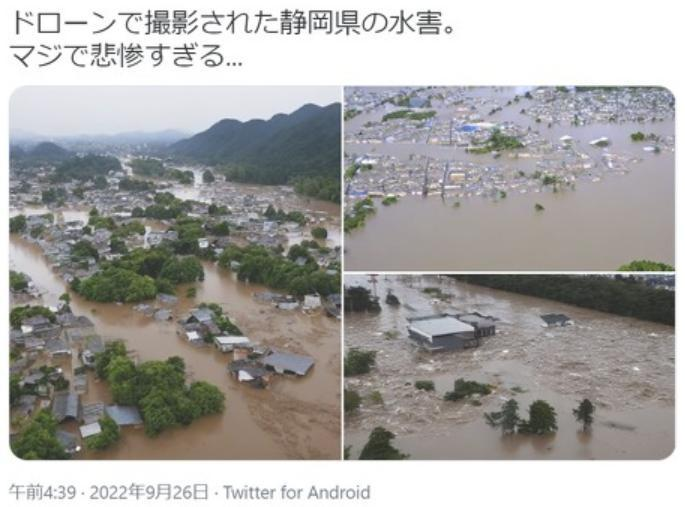

<!-- _class: cover-hero -->

第1回（オンデマンド）

研究における 生成AIの活用法

ナレッジ①：生成AIと倫理とリテラシー

千葉大学 国際未来教育基幹 田川 翔（専門：高等教育論・地球惑星科学）

---

<!-- _class: summary -->

この授業の狙い

## 研究で生成AIを「倫理的かつ適切に」使えるようになる

今後、生成AIは研究においても無視できない。ほぼすべての学問分野が、何らかの形で影響を受ける ── だからこそ、研究での「使い方の作法」を今のうちに持っておく。

### 目的

- 研究活動で、生成AIを倫理的かつ適切に利活用できるようになる
- 多くの院生は研究者を目指す。その第一歩として“使い方の作法”を持つ

### 鍵になる問い

- 「AIを研究で使おう」と思ったとき、判断の基準（クライテリア）は何か
- それを他者に言葉で説明できるか ── 分野差・個人差を前提に考える

迷ったときに立ち返れる普遍的な「考え方の基準」を持つ。これがこの授業の芯です。

---

<!-- _class: summary -->

この授業の目標（到達点）

## 視聴後に、こうなっていることを目指す

### 知識・理解

- 研究における倫理・学術情報流通・生成AIの利活用リテラシーと仕組みを概観し、説明できる

### 応用・分析

- 各分野・学会の生成AI受容状況を調べ、利活用で気をつける観点を指摘できる
- 各分野の事例・手法を調査・比較し、自分の分野への影響を分析できる

### 評価・受容

- 異分野の学生との協働で、生成AIが関わる手法・論点の学び方を説明できる
- 研究の文脈で生成AIにどう関わるか、自分の意見を持ち判断できる

---

<!-- _class: fig -->

この科目の全8回（＝授業回）

## この講義の全体像

<table class="dtbl" style="font-size:20px; width:92%;">
<tr><th>回</th><th class="l">テーマ</th><th>形式</th></tr>
<tr style="background:#F1D4DA;"><td><strong>1</strong></td><td class="l"><strong>ナレッジ①：生成AIと倫理とリテラシー　← 今回</strong></td><td>オンデマンド</td></tr>
<tr><td>2</td><td class="l">ナレッジ②：学術情報流通（成果公表・査読）の仕組み</td><td>オンデマンド</td></tr>
<tr><td>3</td><td class="l">ナレッジ③：生成AIの仕組み（ミニチュアを作るColab演習）</td><td>オンデマンド</td></tr>
<tr><td>4</td><td class="l">研究・論文①：アカデミック・インテグリティと生成AI</td><td>オンデマンド</td></tr>
<tr><td>5</td><td class="l">研究・論文②：各分野での受容状況を共有</td><td>同時双方向</td></tr>
<tr><td>6</td><td class="l">研究手法①：AIを研究で用いる</td><td>オンデマンド</td></tr>
<tr><td>7</td><td class="l">研究手法②：AIの研究利用の調査と情報交換</td><td>対面＋オンデマンド</td></tr>
<tr><td>8</td><td class="l">議論とリフレクション（最終レポートへ）</td><td>対面＋オンデマンド</td></tr>
</table>

第1回は「考えるための前提」。ここから研究倫理・仕組み・手法へと積み上げます。

---

<!-- _class: split tk-low -->

この講義の受け方

## オンデマンドで“前提”を理解し、対面で“学び合う”ことで見につける

<svg viewBox="0 0 360 300" width="100%" style="max-height:380px">
  <g text-anchor="middle">
    <rect x="60" y="30" width="240" height="70" rx="12" fill="#FBE7D6" stroke="#C2410C" stroke-width="2"/>
    <text x="180" y="60" font-size="18" font-weight="800" fill="#C2410C">① オンデマンド講義</text>
    <text x="180" y="86" font-size="16" fill="#5B6068">倫理・情報流通・AI技術</text>
    <text x="180" y="120" font-size="26" fill="#C2410C" font-weight="800">↓</text>
    <rect x="60" y="135" width="240" height="70" rx="12" fill="#E2EDF6" stroke="#1A6BB0" stroke-width="2"/>
    <text x="180" y="165" font-size="18" font-weight="800" fill="#1A6BB0">② 同時双方向・対面</text>
    <text x="180" y="191" font-size="16" fill="#5B6068">分野を越えたグループワーク</text>
    <text x="180" y="225" font-size="26" fill="#1A6BB0" font-weight="800">↓</text>
    <rect x="60" y="240" width="240" height="56" rx="12" fill="#EDEEF0" stroke="#5B6068" stroke-width="2"/>
    <text x="180" y="265" font-size="18" font-weight="800" fill="#5B6068">③ 調査・議論・レポート</text>
    <text x="180" y="287" font-size="16" fill="#5B6068">自分の分野への影響を判断</text>
  </g>
</svg>

視聴のしかた

- ナレッジ回を視聴期限内に視聴（順番推奨）
- 視聴後に対面・同時双方向で議論する

予習・復習でのAI利用

- 予習復習では大いに活用OK。課題ごとに使える範囲を明示
- 使い方は必ず申告（申告と乖離は0点）

この講義は「考えるための前提」。答えは対面の議論で一緒に作る。

---

<!-- _class: summary -->

授業の3つの課題

## 3つの課題で、“自分はどう関わるか”を言葉にする

<svg viewBox="0 0 960 150" width="100%" style="max-height:230px">
  <g text-anchor="middle">
    <rect x="20" y="20" width="270" height="110" rx="14" fill="#FBE7D6" stroke="#C2410C" stroke-width="2.5"/>
    <text x="155" y="62" font-size="26" font-weight="800" fill="#C2410C">① 近接分野 GW</text>
    <text x="155" y="98" font-size="20" fill="#9A3412">研究倫理の観点で調査</text>
    <rect x="345" y="20" width="270" height="110" rx="14" fill="#FBE7D6" stroke="#C2410C" stroke-width="2.5"/>
    <text x="480" y="62" font-size="26" font-weight="800" fill="#C2410C">② 分野横断 GW</text>
    <text x="480" y="98" font-size="20" fill="#9A3412">手法の観点で比べる</text>
    <rect x="670" y="20" width="270" height="110" rx="14" fill="#FBE7D6" stroke="#C2410C" stroke-width="2.5"/>
    <text x="805" y="62" font-size="26" font-weight="800" fill="#C2410C">③ 個人レポート</text>
    <text x="805" y="98" font-size="20" fill="#9A3412">今後どう関わるかを書く</text>
    <text x="318" y="84" font-size="34" fill="#C2410C">→</text>
    <text x="643" y="84" font-size="34" fill="#C2410C">→</text>
  </g>
</svg>

- ① 近接分野GW：倫理的観点で指針を調査（グループワーク）
- ② 分野横断GW：研究手法の観点で他分野と比較（グループワーク）
- ③ 個人レポート：今後どうAIと関わるかを明文化
- ①②のグループワークは第4〜7回で行います

第1回の課題：まず研究分野・授業への関心を含む自己紹介をMoodleに記入。

---

<!-- _class: fig -->

今回（第1回）の流れ

## 第1回は、この10本の動画で構成します

<svg viewBox="0 0 1000 300" width="100%" style="max-height:360px">
  <rect x="14" y="40" width="92" height="190" rx="12" fill="#F3DCC8" stroke="#9A3412" stroke-width="1.5"/>
  <text x="60" y="128" text-anchor="middle" font-size="20" font-weight="800" fill="#9A3412">①</text>
  <text x="60" y="156" text-anchor="middle" font-size="16" font-weight="700" fill="#9A3412">学び方</text>
  <rect x="118" y="40" width="430" height="190" rx="12" fill="#FBE7D6" stroke="#C2410C" stroke-width="1.6"/>
  <text x="333" y="64" text-anchor="middle" font-size="18" font-weight="800" fill="#C2410C">PART A　AIを知る</text>
  <rect x="560" y="40" width="220" height="190" rx="12" fill="#E2EDF6" stroke="#1A6BB0" stroke-width="1.6"/>
  <text x="670" y="64" text-anchor="middle" font-size="18" font-weight="800" fill="#1A6BB0">PART B　研究倫理</text>
  <rect x="792" y="40" width="194" height="190" rx="12" fill="#EDEEF0" stroke="#5B6068" stroke-width="1.6"/>
  <text x="889" y="64" text-anchor="middle" font-size="18" font-weight="800" fill="#5B6068">PART C　これから</text>
  <g text-anchor="middle">
    <g><rect x="130" y="88" width="96" height="116" rx="8" fill="#fff" stroke="#C2410C" stroke-width="1.6"/><text x="178" y="128" font-size="22" font-weight="800" fill="#C2410C">②</text><text x="178" y="162" font-size="18" font-weight="700">俯瞰</text></g>
    <g><rect x="234" y="88" width="96" height="116" rx="8" fill="#fff" stroke="#C2410C" stroke-width="1.6"/><text x="282" y="128" font-size="22" font-weight="800" fill="#C2410C">③</text><text x="282" y="162" font-size="18" font-weight="700">倫理</text></g>
    <g><rect x="338" y="88" width="96" height="116" rx="8" fill="#fff" stroke="#C2410C" stroke-width="1.6"/><text x="386" y="128" font-size="22" font-weight="800" fill="#C2410C">④</text><text x="386" y="162" font-size="18" font-weight="700">仕組み</text></g>
    <g><rect x="442" y="88" width="96" height="116" rx="8" fill="#fff" stroke="#C2410C" stroke-width="1.6"/><text x="490" y="128" font-size="22" font-weight="800" fill="#C2410C">⑤</text><text x="490" y="162" font-size="18" font-weight="700">限界</text></g>
    <g><rect x="572" y="88" width="96" height="116" rx="8" fill="#fff" stroke="#1A6BB0" stroke-width="1.6"/><text x="620" y="128" font-size="22" font-weight="800" fill="#1A6BB0">⑥</text><text x="620" y="162" font-size="18" font-weight="700">研究倫理</text></g>
    <g><rect x="676" y="88" width="96" height="116" rx="8" fill="#fff" stroke="#1A6BB0" stroke-width="1.6"/><text x="724" y="128" font-size="22" font-weight="800" fill="#1A6BB0">⑦</text><text x="724" y="162" font-size="18" font-weight="700">倫理×AI</text></g>
    <g><rect x="804" y="88" width="80" height="116" rx="8" fill="#fff" stroke="#5B6068" stroke-width="1.6"/><text x="844" y="128" font-size="22" font-weight="800" fill="#5B6068">⑧</text><text x="844" y="162" font-size="18" font-weight="700">分野差</text></g>
    <g><rect x="892" y="88" width="80" height="116" rx="8" fill="#fff" stroke="#5B6068" stroke-width="1.6"/><text x="932" y="128" font-size="22" font-weight="800" fill="#5B6068">⑨</text><text x="932" y="162" font-size="18" font-weight="700">影響</text></g>
  </g>
  <rect x="118" y="244" width="868" height="44" rx="10" fill="#C2410C"/>
  <text x="552" y="271" text-anchor="middle" font-size="17" font-weight="800" fill="#fff">⑩ 自分の設計・まとめ ── 「判断の基準」を持ち、言葉で説明できる</text>
</svg>

授業の前提を知る10動画。

---

<!-- _class: intro tk-low -->

担当講師の自己紹介

たがわ　しょう田川　翔

<strong>所属：</strong>千葉大学 国際未来教育基幹 
専門：高等教育論・地球惑星科学

大学の学びを設計し、学生と教員を支援する

### ①この講義をする理由

- 生成AIは研究に役立つし、影響するはず
- でも、研究でのAIの“作法”は分野ごとにバラバラ
- “自分の物差し”を手に入れて欲しい

### ②問いの原点

自分は、地球惑星科学の研究者でした。
分野横断的な学際領域だったので、他の分野の研究手法の習得に、大変苦労したのを覚えています。特に博論で金属工学やプログラミングまで学習したのは大変骨が折れました。
今はAIでもっと先にいける可能性があります。

一緒に、AI×研究を考え、切り開きましょう。

---

<!-- _class: divider -->

動画 2

# 仕組みを俯瞰する

## 情報からトランスフォーマーまで、辿る

---

<!-- _class: fig -->

全体像

## 入れ子の関係 ── 広い「AI」の中に「生成AI」がある

<svg viewBox="0 0 1000 470" width="100%" style="max-height:430px" text-anchor="middle">
  <rect x="40" y="28" width="920" height="414" rx="18" fill="#FBF4EF" stroke="#E89A5C" stroke-width="2"/>
  <text x="500" y="55" font-size="22" font-weight="800" fill="#9A3412">AI（人工知能）</text>
  <text x="500" y="76" font-size="15.5" fill="#8a7a6c"><tspan font-weight="700" fill="#9A3412">定義：</tspan>人の知的な作業（認識・判断・推論・生成など）をコンピュータに行わせる技術</text>
  <rect x="112" y="92" width="776" height="328" rx="16" fill="#FBE7D6" stroke="#D2762E" stroke-width="2"/>
  <text x="500" y="119" font-size="21" font-weight="800" fill="#9A3412">機械学習</text>
  <text x="500" y="140" font-size="15" fill="#8a7a6c">データから自動でパターンを学ぶAI</text>
  <rect x="184" y="152" width="632" height="246" rx="14" fill="#F4D9C0" stroke="#C2410C" stroke-width="2"/>
  <text x="500" y="178" font-size="21" font-weight="800" fill="#9A3412">ニューラルネット</text>
  <text x="500" y="199" font-size="15" fill="#7c6555">脳を模した層構造。重みを調整して学習</text>
  <rect x="256" y="210" width="488" height="160" rx="12" fill="#EBC09A" stroke="#9A3412" stroke-width="2"/>
  <text x="500" y="236" font-size="21" font-weight="800" fill="#7d1322">トランスフォーマー</text>
  <text x="500" y="257" font-size="15" fill="#6e4a33">文脈をまとめて捉える仕組み（注意機構）</text>
  <rect x="328" y="282" width="344" height="74" rx="12" fill="#C2410C" stroke="#7d1322" stroke-width="2.5"/>
  <text x="500" y="312" font-size="22" font-weight="800" fill="#fff">→ 生成AI</text>
  <text x="500" y="335" font-size="15" fill="#FBE7D6">文章・画像をつくる（この講義の主役）</text>
</svg>

外側ほど広く・古い概念　／　内側ほど専門的・新しい。生成AIはトランスフォーマーから生まれた。

まず森の地図を頭に入れる。細部の仕組みはのちの動画で深掘りします。

---

<!-- _class: split -->

情報とは

## データから知恵へ ── 情報のDIKWモデル

<svg viewBox="0 0 380 330" width="100%" style="max-height:330px">
  <g text-anchor="middle">
    <rect x="20" y="250" width="150" height="55" rx="8" fill="#FBE7D6" stroke="#E08A4F" stroke-width="2"/>
    <text x="95" y="278" font-size="17" font-weight="800" fill="#9A3412">Data</text>
    <text x="95" y="297" font-size="16" fill="#5B6068">未整理の事実</text>
    <rect x="90" y="185" width="150" height="55" rx="8" fill="#FBE7D6" stroke="#E08A4F" stroke-width="2"/>
    <text x="165" y="213" font-size="17" font-weight="800" fill="#9A3412">Information</text>
    <text x="165" y="232" font-size="16" fill="#5B6068">整理・解釈</text>
    <rect x="160" y="120" width="150" height="55" rx="8" fill="#F1C9A8" stroke="#C2410C" stroke-width="2"/>
    <text x="235" y="148" font-size="17" font-weight="800" fill="#9A3412">Knowledge</text>
    <text x="235" y="167" font-size="16" fill="#5B6068">体系化</text>
    <rect x="200" y="55" width="150" height="55" rx="8" fill="#C2410C" stroke="#9A3412" stroke-width="2.5"/>
    <text x="275" y="83" font-size="17" font-weight="800" fill="#fff">Wisdom</text>
    <text x="275" y="102" font-size="16" fill="#FBE7D6">価値観を伴う判断</text>
    <text x="55" y="45" font-size="16" fill="#5B6068">上へ行くほど“意味”が増す ↗</text>
  </g>
</svg>

- この“下から上への変換”を機械が肩代わりする最前線が生成AI
- ↑ここが本題。DIKWはそこへ繋ぐための前置きです
- データ＝未整理の事実／情報＝整理・解釈／知識＝体系化
- 知恵＝価値観を伴う判断（人間に残る領域）

出典: 高等学校 情報I（数研出版）。広く使われる枠組みだが線形すぎるとの批判もある

“データ→情報→知識”の変換を、いま機械が駆け上がろうとしています。

---

<!-- _class: fig -->

AIとは／AIの分類

## AI＝人工的な知能。中身はルールベースと機械学習の2系統

<svg viewBox="0 0 990 470" width="100%" style="max-height:440px">
  <g text-anchor="middle">
    <rect x="120" y="20" width="250" height="86" rx="14" fill="#FBE7D6" stroke="#C2410C" stroke-width="2"/>
    <text x="245" y="56" font-size="24" font-weight="800" fill="#9A3412">Artificial</text>
    <text x="245" y="86" font-size="18" fill="#5B6068">人工的な</text>
    <text x="430" y="74" font-size="36" font-weight="800" fill="#5B6068">＋</text>
    <rect x="490" y="20" width="250" height="86" rx="14" fill="#FBE7D6" stroke="#C2410C" stroke-width="2"/>
    <text x="615" y="56" font-size="24" font-weight="800" fill="#9A3412">Intelligence</text>
    <text x="615" y="86" font-size="18" fill="#5B6068">知能</text>
    <text x="800" y="74" font-size="32" font-weight="800" fill="#5B6068">→</text>
    <rect x="845" y="24" width="120" height="78" rx="12" fill="#C2410C" stroke="#9A3412" stroke-width="2.5"/>
    <text x="905" y="60" font-size="24" font-weight="800" fill="#fff">AI</text>
    <text x="905" y="86" font-size="16" fill="#FBE7D6">人工知能</text>
    <text x="495" y="150" font-size="16" fill="#5B6068">定義は論者・時代で変化する（境界は固定されていない）。では中身は？</text>
    <rect x="395" y="175" width="200" height="58" rx="12" fill="#C2410C" stroke="#9A3412" stroke-width="2.5"/>
    <text x="495" y="211" font-size="22" font-weight="800" fill="#fff">AI（人工知能）</text>
    <line x1="495" y1="233" x2="245" y2="285" stroke="#5B6068" stroke-width="2"/>
    <line x1="495" y1="233" x2="745" y2="285" stroke="#5B6068" stroke-width="2"/>
    <rect x="100" y="290" width="290" height="150" rx="12" fill="#EDEEF0" stroke="#5B6068" stroke-width="2"/>
    <text x="245" y="330" font-size="22" font-weight="800" fill="#5B6068">ルールベース</text>
    <text x="245" y="368" font-size="17" fill="#5B6068">人がルール・知識を記述</text>
    <text x="245" y="402" font-size="16" fill="#5B6068">書ききれる問題に強い</text>
    <rect x="600" y="290" width="290" height="150" rx="12" fill="#FBE7D6" stroke="#C2410C" stroke-width="2.5"/>
    <text x="745" y="330" font-size="22" font-weight="800" fill="#9A3412">機械学習</text>
    <text x="745" y="368" font-size="17" fill="#5B6068">データから自分で学ぶ</text>
    <text x="745" y="402" font-size="16" fill="#C2410C" font-weight="700">現在の主流</text>
  </g>
</svg>

「猫を見分けるルール」を完璧に書くのは不可能。だからデータから学ばせる。

---

<!-- _class: summary -->

機械学習

## 学び方は3種類 ＋ 半教師あり

① 教師あり学習

- 正解（教師データ）付きで学ぶ
- 例：分類・予測・回帰
- 「この画像は猫」と教える

② 教師なし学習

- 正解なしで構造を見つける
- 例：クラスタリング・次元削減
- 似たもの同士を自動でまとめる

③ 強化学習

- 報酬を最大化するよう試行錯誤
- 例：ゲームAI・自動運転
- 良い行動に“ごほうび”を与える

正解の一部だけを使う「半教師あり学習」も。実務ではこれらを組み合わせます。

---

<!-- _class: split -->

ニューラルネット

## 脳のニューロンを真似た“層”の重ね合わせ

<svg viewBox="0 0 380 330" width="100%" style="max-height:330px">
  <g>
    <text x="60" y="35" text-anchor="middle" font-size="16" font-weight="800" fill="#C2410C">入力層</text>
    <text x="190" y="35" text-anchor="middle" font-size="16" font-weight="800" fill="#5B6068">隠れ層</text>
    <text x="320" y="35" text-anchor="middle" font-size="16" font-weight="800" fill="#9A3412">出力層</text>
    <g stroke="#e6c4a8" stroke-width="1">
      <line x1="60" y1="90" x2="190" y2="80"/><line x1="60" y1="90" x2="190" y2="150"/><line x1="60" y1="90" x2="190" y2="220"/>
      <line x1="60" y1="160" x2="190" y2="80"/><line x1="60" y1="160" x2="190" y2="150"/><line x1="60" y1="160" x2="190" y2="220"/>
      <line x1="60" y1="230" x2="190" y2="80"/><line x1="60" y1="230" x2="190" y2="150"/><line x1="60" y1="230" x2="190" y2="220"/>
      <line x1="190" y1="80" x2="320" y2="120"/><line x1="190" y1="80" x2="320" y2="190"/>
      <line x1="190" y1="150" x2="320" y2="120"/><line x1="190" y1="150" x2="320" y2="190"/>
      <line x1="190" y1="220" x2="320" y2="120"/><line x1="190" y1="220" x2="320" y2="190"/>
    </g>
    <g>
      <circle cx="60" cy="90" r="16" fill="#FBE7D6" stroke="#E08A4F" stroke-width="2"/>
      <circle cx="60" cy="160" r="16" fill="#FBE7D6" stroke="#E08A4F" stroke-width="2"/>
      <circle cx="60" cy="230" r="16" fill="#FBE7D6" stroke="#E08A4F" stroke-width="2"/>
      <circle cx="190" cy="80" r="16" fill="#EDEEF0" stroke="#5B6068" stroke-width="2"/>
      <circle cx="190" cy="150" r="16" fill="#EDEEF0" stroke="#5B6068" stroke-width="2"/>
      <circle cx="190" cy="220" r="16" fill="#EDEEF0" stroke="#5B6068" stroke-width="2"/>
      <circle cx="320" cy="120" r="16" fill="#C2410C" stroke="#9A3412" stroke-width="2.5"/>
      <circle cx="320" cy="190" r="16" fill="#C2410C" stroke="#9A3412" stroke-width="2.5"/>
    </g>
    <text x="190" y="300" text-anchor="middle" font-size="16" fill="#C2410C" font-weight="700">結線の“重み”を学習で調整</text>
  </g>
</svg>

- 隠れ層を深く重ねたものが深層学習（ディープラーニング）
- 結線の重み（パラメータ）を学習で調整して当てる
- 学習＝魔法ではなく、地道な数値調整の積み重ね
- 画像・音声・言語の処理に強い

学習＝“重みという数字を調整して当てにいく”地道な作業です。

---

<!-- _class: split -->

トランスフォーマー

## 系列を“並列に”扱う新しい仕組み ── 中身は第3回で

<svg viewBox="0 0 380 330" width="100%" style="max-height:320px">
  <g text-anchor="middle">
    <rect x="90" y="14" width="200" height="46" rx="9" fill="#FBE7D6" stroke="#C2410C" stroke-width="2"/>
    <text x="190" y="43" font-size="17" font-weight="800" fill="#9A3412">入力の語の並び</text>
    <text x="190" y="78" font-size="22" font-weight="800" fill="#C2410C">↓</text>
    <rect x="65" y="90" width="250" height="50" rx="9" fill="#F1C9A8" stroke="#C2410C" stroke-width="2"/>
    <text x="190" y="113" font-size="16" font-weight="800" fill="#9A3412">自己注意</text>
    <text x="190" y="132" font-size="16" fill="#5B6068">語どうしの関係を見る</text>
    <text x="190" y="160" font-size="22" font-weight="800" fill="#C2410C">↓</text>
    <rect x="65" y="172" width="250" height="50" rx="9" fill="#EDEEF0" stroke="#5B6068" stroke-width="2"/>
    <text x="190" y="195" font-size="16" font-weight="800" fill="#5B6068">MLP（変換）</text>
    <text x="190" y="214" font-size="16" fill="#5B6068">情報をまとめ直す</text>
    <text x="190" y="242" font-size="22" font-weight="800" fill="#C2410C">↓</text>
    <rect x="65" y="254" width="250" height="58" rx="9" fill="#C2410C" stroke="#9A3412" stroke-width="2.5"/>
    <text x="190" y="280" font-size="16" font-weight="800" fill="#fff">次の語を予測</text>
    <text x="190" y="300" font-size="16" fill="#FBE7D6">候補ごとの確率を出す</text>
  </g>
</svg>

いまは“次の語を予測”だけでOK

- 今回は「次の語を予測している」と掴めればOK
- 2017年登場。文を並列に扱えて大規模化しやすい（→第3回）
- 中身の数理は第3回（Colab演習）で手を動かして学ぶ

出典: Vaswani et al., 2017「Attention Is All You Need」

今回は「次の語を当てている」の一点だけ。細部は第3回で手を動かして納得する。

---

<!-- _class: split -->

生成AIとは

## “認識・分類”から“生成”へ

<svg viewBox="0 0 380 330" width="100%" style="max-height:330px">
  <g text-anchor="middle">
    <text x="190" y="35" font-size="16" font-weight="800" fill="#5B6068">従来のAI</text>
    <rect x="35" y="55" width="100" height="46" rx="8" fill="#fff" stroke="#5B6068" stroke-width="1.8"/>
    <text x="85" y="83" font-size="16" font-weight="700" fill="#5B6068">入力</text>
    <text x="155" y="84" font-size="20" font-weight="800" fill="#5B6068">→</text>
    <rect x="185" y="55" width="160" height="46" rx="8" fill="#EDEEF0" stroke="#5B6068" stroke-width="1.8"/>
    <text x="265" y="83" font-size="16" font-weight="700" fill="#5B6068">分類ラベル</text>
    <line x1="30" y1="135" x2="350" y2="135" stroke="#e6c4a8" stroke-width="1.5"/>
    <text x="190" y="175" font-size="16" font-weight="800" fill="#C2410C">生成AI</text>
    <rect x="35" y="195" width="100" height="46" rx="8" fill="#fff" stroke="#C2410C" stroke-width="2"/>
    <text x="85" y="223" font-size="16" font-weight="700" fill="#9A3412">入力</text>
    <text x="155" y="224" font-size="20" font-weight="800" fill="#C2410C">→</text>
    <rect x="185" y="185" width="160" height="66" rx="8" fill="#FBE7D6" stroke="#C2410C" stroke-width="2.5"/>
    <text x="265" y="212" font-size="16" font-weight="700" fill="#9A3412">新しい文章</text>
    <text x="265" y="234" font-size="16" font-weight="700" fill="#9A3412">・画像を生成</text>
    <text x="190" y="295" font-size="16" fill="#5B6068">識別する → 作り出す へ</text>
  </g>
</svg>

- 従来のAIは識別・予測が中心
- 生成AIは尤（もっと）もらしい続き（＝それらしい続き）を作る
- 次に来る語を一つ選び、入力に戻して繰り返す
- 文章を扱うものがLLM（大規模言語モデル）

なぜ“それらしい続き”だけで賢く見えるのか ── その核心は次以降の動画で。

---

<!-- _class: summary -->

この動画のまとめ

## 全体像を1枚で

① AIの主流

- AIは機械学習が現在の主流
- データから自分で学ぶ方式
- ルールで書けない問題に強い

② 学習の正体

- ニューラルネット／ディープで
- 結線の重みを学習して当てる
- 学習＝地道な数値調整

③ 生成AIへ

- トランスフォーマー＝系列を並列に扱う
- “次の語を予測”して続きを作る
- 数理は第3回（Colab演習）で

次の動画は、使う前に知っておくべき「原則・倫理・リスク」を見ていきます。

---

<!-- _class: divider -->

動画 3

# 原則・倫理・リスク

## 「使ってよい／だめ」を判断する物差しをつくる

---

<!-- _class: fig -->

なぜ「原則」から入るか

## 技術が先、ルールは後追い。だから上位の「理念」に遡る

<svg viewBox="0 0 960 380" width="100%" style="max-height:380px">
  <polygon points="480,30 344,140 616,140" fill="#FBE7D6" stroke="#C2410C" stroke-width="2.5"/>
  <text x="480" y="98" text-anchor="middle" font-size="22" font-weight="800" fill="#C2410C">理念</text>
  <text x="480" y="126" text-anchor="middle" font-size="17" fill="#9A3412">例：人間の尊厳</text>
  <polygon points="344,150 616,150 682,254 278,254" fill="#FBE7D6" stroke="#E08A4F" stroke-width="2.5"/>
  <text x="480" y="190" text-anchor="middle" font-size="22" font-weight="800" fill="#9A3412">社会的な指針</text>
  <text x="480" y="222" text-anchor="middle" font-size="17" fill="#9A3412">例：透明性</text>
  <polygon points="278,264 682,264 748,368 212,368" fill="#EDEEF0" stroke="#5B6068" stroke-width="2.5"/>
  <text x="480" y="306" text-anchor="middle" font-size="22" font-weight="800" fill="#5B6068">技術的な指針・利用規約</text>
  <text x="480" y="338" text-anchor="middle" font-size="17" fill="#5B6068">例：各社の利用規約</text>
  <line x1="836" y1="316" x2="836" y2="120" stroke="#C2410C" stroke-width="2.5"/>
  <polygon points="836,104 827,124 845,124" fill="#C2410C"/>
  <line x1="682" y1="316" x2="836" y2="316" stroke="#5B6068" stroke-width="1.5" stroke-dasharray="4 4"/>
  <line x1="616" y1="100" x2="836" y2="100" stroke="#C2410C" stroke-width="1.5" stroke-dasharray="4 4"/>
  <text x="864" y="210" text-anchor="middle" font-size="18" font-weight="800" fill="#C2410C" transform="rotate(90 864 210)">迷ったら上位へ遡る</text>
  <line x1="212" y1="316" x2="124" y2="316" stroke="#5B6068" stroke-width="1.5" stroke-dasharray="4 4"/>
  <text x="76" y="310" text-anchor="middle" font-size="17" fill="#5B6068">具体策は</text>
  <text x="76" y="332" text-anchor="middle" font-size="17" fill="#5B6068">技術で変わる</text>
</svg>

細かい規約は変わり続ける。迷う場面ほど、上位の「理念」に遡ると見通しが良い。

---

<!-- _class: summary -->

理念と指針

## 3つの理念が土台、そこから「研究者に効く3指針」へ

理念（最上位の価値）── そもそも何のためにAIを使うのか

人間の尊厳

人がAIに振り回されず、人間が中心であり続ける

多様性・包摂

さまざまな背景の人が誰も取り残されない

持続可能な社会

恩恵を将来世代まで届ける

この理念から、研究で使う私たちに特に効く 人間中心・透明性・公平性 の3指針が出てくる。

出典: AI事業者ガイドライン（総務省・経済産業省, 第1.2版 / 令和8年3月） 

---

<!-- _class: split -->

研究者に効く3指針

## 人間中心・透明性・公平性 ── 研究実務に直接効く

### 透明性 ── 使ったら開示する

どこで・どう使ったかを、投稿先や指導教員に開示できる状態に。

### 人間中心 ── 最終責任は人

判断と責任は人が負う。「AIがそう言った」は弁明にならない。

### 公平性 ── バイアスに注意

学習データの偏りが出力に表れる（右図）。確かめてから使う。

公平性の例：職業の生成画像に性別・人種の偏りが出る

この3つは、後半（動画6・7）の研究倫理にもそのまま効いてくる。

---

<!-- _class: split -->

リスク① 権利侵害・著作権

## 他者の権利を侵さない／著作権は「学習」と「生成」で分ける

**権利侵害（肖像・名誉・人格）**

- ディープフェイクで実在の人物になりすまさない
- 共同研究者・被験者の画像や音声を無断で素材化しない

**著作権 ── 「学習」と「生成」で分ける**

- 学習に使うのは原則OK（情報解析）（出典: 著作権法第30条の4）
- 生成物が既存作品に似ていて参照していたらNG（出典: 文化庁「AIと著作権に関する考え方について」2024）

複数の素材を合成 → 実在人物になりすまし

「学習に使う」と「作って使う」は別問題。詳しくは動画4で扱う。

---

<!-- _class: split -->

リスク② 入力

## 入力する側の落とし穴：個人情報と「研究上の秘密」

<svg viewBox="0 0 400 340" width="100%" style="max-height:330px">
  <g text-anchor="middle">
    <rect x="56" y="18" width="248" height="60" rx="12" fill="#EDEEF0" stroke="#5B6068" stroke-width="2"/>
    <text x="180" y="46" font-size="18" font-weight="800" fill="#5B6068">あなたが入力</text>
    <text x="180" y="68" font-size="16" fill="#5B6068">氏名・連絡先・回答 など</text>
    <text x="180" y="102" font-size="26" fill="#C2410C" font-weight="800">↓</text>
    <rect x="56" y="118" width="248" height="60" rx="12" fill="#FBE7D6" stroke="#C2410C" stroke-width="2.5"/>
    <text x="180" y="146" font-size="18" font-weight="800" fill="#C2410C">外部サーバへ送信</text>
    <text x="180" y="168" font-size="16" fill="#9A3412">多くは事業者の管理下</text>
    <circle cx="304" cy="118" r="16" fill="#C2410C"/>
    <text x="304" y="125" font-size="22" font-weight="900" fill="#fff">!</text>
    <text x="180" y="202" font-size="26" fill="#C2410C" font-weight="800">↓</text>
    <rect x="56" y="218" width="248" height="60" rx="12" fill="#FBE7D6" stroke="#C2410C" stroke-width="2.5"/>
    <text x="180" y="246" font-size="18" font-weight="800" fill="#C2410C">保存・学習に利用?</text>
    <text x="180" y="268" font-size="16" fill="#9A3412">入力が手元を離れる</text>
    <circle cx="304" cy="218" r="16" fill="#C2410C"/>
    <text x="304" y="225" font-size="22" font-weight="900" fill="#fff">!</text>
    <text x="180" y="312" font-size="17" font-weight="800" fill="#C2410C">送信・保存の段階で「外」に出る</text>
  </g>
</svg>

**個人情報・プライバシー**

- 入力が外部サーバに渡る／保存・学習に使われうる
- 既存の個人情報保護法がそのまま適用される

**研究上の秘密・機密**

- 未公開データ・査読中の情報を外部AIへ入れない
- 入れると“公表扱い”になり秘密性を失う恐れ
- 先に出した人が勝つ世界（先取権）では不利になりうる

機微情報・未公開データを、外部サービスに「そのまま入力しない」。研究での基本動作。

出典: 個人情報保護法（個人情報保護委員会） 

---

<!-- _class: fig -->

AI関連の法整備

## ルールは段階的に整備中。「今の版」を確認する癖を

<svg viewBox="0 0 960 300" width="100%" style="max-height:340px">
  <line x1="60" y1="150" x2="880" y2="150" stroke="#bbb" stroke-width="3"/>
  <circle cx="200" cy="150" r="9" fill="#E08A4F"/>
  <rect x="108" y="64" width="184" height="58" rx="10" fill="#FBE7D6" stroke="#E08A4F" stroke-width="2"/>
  <text x="200" y="90" text-anchor="middle" font-size="17" font-weight="800" fill="#9A3412">ガイドライン統合</text>
  <text x="200" y="111" text-anchor="middle" font-size="16" fill="#b89070">第1.0版</text>
  <text x="200" y="188" text-anchor="middle" font-size="16" font-weight="700" fill="#5B6068">2024年</text>
  <circle cx="470" cy="150" r="9" fill="#C2410C"/>
  <rect x="378" y="64" width="184" height="58" rx="10" fill="#FBE7D6" stroke="#C2410C" stroke-width="2"/>
  <text x="470" y="90" text-anchor="middle" font-size="17" font-weight="800" fill="#C2410C">活用を推す基本法</text>
  <text x="470" y="111" text-anchor="middle" font-size="16" fill="#b89070">AI推進法（罰則なし）</text>
  <text x="470" y="188" text-anchor="middle" font-size="16" font-weight="700" fill="#5B6068">2025年</text>
  <circle cx="740" cy="150" r="9" fill="#9A3412"/>
  <rect x="648" y="64" width="184" height="58" rx="10" fill="#FBE7D6" stroke="#9A3412" stroke-width="2"/>
  <text x="740" y="90" text-anchor="middle" font-size="17" font-weight="800" fill="#9A3412">ガイドライン改定</text>
  <text x="740" y="111" text-anchor="middle" font-size="16" fill="#b89070">第1.2版・AIエージェント対応</text>
  <text x="740" y="188" text-anchor="middle" font-size="16" font-weight="700" fill="#5B6068">2026年</text>
  <line x1="832" y1="150" x2="900" y2="150" stroke="#C2410C" stroke-width="3"/>
  <polygon points="922,150 898,138 898,162" fill="#C2410C"/>
  <text x="836" y="218" text-anchor="middle" font-size="18" font-weight="800" fill="#C2410C">これからも</text>
  <text x="836" y="242" text-anchor="middle" font-size="18" font-weight="800" fill="#C2410C">更新が続く</text>
  <rect x="150" y="238" width="500" height="44" rx="22" fill="#C2410C"/>
  <text x="400" y="266" text-anchor="middle" font-size="19" font-weight="800" fill="#fff">常に「最新版」を公式で確認する</text>
</svg>

ガイドライン統合・改定 （出典: AI事業者ガイドライン）　／　基本法 （出典: AI推進法・令和7年法律第53号）

最新の枠組みは動き続ける。年号の暗記ではなく「今どうなっているか」を確認する習慣を。

---

<!-- _class: summary -->

動画3のまとめ

## 「理念 → 指針 → リスク」、持ち帰りは3つ

迷ったら上位の理念に遡る ／ 指針の軸は人間中心・透明性・公平性 ／ リスクは権利侵害・著作権・入力

① 入れない

🔒

機微情報・未公開データは外部AIに入れない

② 開示する

📣

使ったら、どう使ったかを開示する

③ 責任は人

🧑

最終的な判断と責任は人が負う

次は、その生成AIが「中身でどう動くのか」（動画4・仕組みの超初歩）へ。

---

<!-- _class: divider -->

動画 4

# 仕組みの超初歩

## LLMは「次のトークン」を予測し続けているだけ

---

<!-- _class: fig -->

LLMの正体

## 大規模言語モデル＝「次トークン予測」器核

<svg viewBox="0 0 1000 270" width="100%" style="max-height:300px" font-family="inherit">
  <text x="20" y="26" font-size="19" font-weight="700" fill="#9A3412">入力「吾輩は」に続く次トークンの確率（上位5）</text>
  <line x1="150" y1="44" x2="150" y2="232" stroke="#bbb" stroke-width="2"/>
  <rect x="150" y="52"  width="690" height="30" rx="4" fill="#9A3412"/>
  <text x="138" y="73" font-size="20" font-weight="800" fill="#9A3412" text-anchor="end">、</text>
  <text x="852" y="74" font-size="19" font-weight="800" fill="#9A3412">0.115　← 1位</text>
  <rect x="150" y="92"  width="594" height="30" rx="4" fill="#C2410C"/>
  <text x="138" y="113" font-size="20" font-weight="800" fill="#C2410C" text-anchor="end">猫</text>
  <text x="756" y="114" font-size="19" font-weight="800" fill="#C2410C">0.099　← 2位</text>
  <rect x="150" y="132" width="240" height="30" rx="4" fill="#E0B49A"/>
  <text x="138" y="153" font-size="20" fill="#5B6068" text-anchor="end">犬</text>
  <text x="402" y="154" font-size="18" fill="#5B6068">0.040</text>
  <rect x="150" y="172" width="108" height="30" rx="4" fill="#E0B49A"/>
  <text x="138" y="193" font-size="20" fill="#5B6068" text-anchor="end">ネコ</text>
  <text x="270" y="194" font-size="18" fill="#5B6068">0.018</text>
  <rect x="150" y="212" width="54"  height="30" rx="4" fill="#E0B49A"/>
  <text x="138" y="233" font-size="20" fill="#5B6068" text-anchor="end">「</text>
  <text x="216" y="234" font-size="18" fill="#5B6068">0.009</text>
  <line x1="150" y1="244" x2="900" y2="244" stroke="#bbb" stroke-width="2"/>
  <text x="150" y="263" font-size="16" fill="#777">0.00</text>
  <text x="500" y="263" font-size="16" fill="#777" text-anchor="middle">確率　0.06</text>
  <text x="900" y="263" font-size="16" fill="#777" text-anchor="end">0.12</text>
</svg>

- 入力「吾輩は」の次の1トークンを、語彙（数万語）すべてに確率を割り振る。図はGPT系の実出力
- トークン＝モデルの最小単位。単語の一部（サブワード）のこともある（図の「猫」「ネコ」）
- 最有力は意外にも読点「、」、2位が「猫」。だが最大でも約0.12＝どの続きも“確信”はしておらず薄く割れている。だから次は揺らぐ（次ページ）

出典: Vaswani et al., "Attention Is All You Need" (2017) 

---

<!-- _class: fig -->

自己回帰生成

## 1トークン出すたびに、自分の出力を入力に足し直す

- 生成は自己回帰：①分布を出す→②1つ選ぶ→③末尾に連結→①へ、をひたすら反復
- 入力が「吾輩は猫である。」まで伸びると分布は様変わりし、文末トークンが上位に出る
- 図の&lt;|endoftext|&gt;＝「ここで文章終わり」の特別な印、\n＝改行記号。終端も確率的に決まる

出典: Radford et al., "Language Models are Unsupervised Multitask Learners" (GPT-2, 2019) 

---

<!-- _class: fig -->

サンプリング

## 「分布から1つ選ぶ」やり方が、出力の個性を決める

- 常に最大確率を選ぶ貪欲法は無難だが単調。実際は確率に応じて抽選する
- 抽選だから同じ入力でも出力は毎回変わる。その振れ幅を決めるつまみが温度
- 温度（出力のばらつきを決めるつまみ）＝低いほど堅実・反復的、高いほど多様だが脱線しやすい

毎回違うのはバグではない。分布からの「抽選」を設定で揺らがせているだけ。

---

<!-- _class: split -->

だから“それっぽい”

## 流暢に書けることと、中身が正しいことは別物

<svg viewBox="0 0 360 300" width="100%" style="max-height:320px">
  <g text-anchor="middle">
    <text x="180" y="28" font-size="17" fill="#9A3412" font-weight="700">左から1トークンずつ確定していく</text>
    <rect x="30" y="46" width="74" height="46" rx="8" fill="#FBE7D6" stroke="#C2410C" stroke-width="2"/>
    <text x="67" y="76" font-size="22" font-weight="800" fill="#C2410C">吾輩</text>
    <text x="124" y="76" font-size="22" fill="#bbb">は…？</text>
    <rect x="30" y="108" width="74" height="46" rx="8" fill="#FBE7D6" stroke="#C2410C" stroke-width="2"/>
    <text x="67" y="138" font-size="22" font-weight="800" fill="#C2410C">吾輩</text>
    <rect x="108" y="108" width="120" height="46" rx="8" fill="#FBE7D6" stroke="#C2410C" stroke-width="2"/>
    <text x="168" y="138" font-size="22" font-weight="800" fill="#C2410C">は猫で</text>
    <text x="248" y="138" font-size="22" fill="#bbb">…？</text>
    <text x="180" y="186" font-size="26" fill="#C2410C" font-weight="800">↓</text>
    <rect x="20" y="200" width="320" height="80" rx="10" fill="#fff" stroke="#5B6068" stroke-width="2" stroke-dasharray="5 4"/>
    <text x="180" y="232" font-size="18" font-weight="700" fill="#333">流暢な文は必ず完成する</text>
    <text x="180" y="260" font-size="18" fill="#9A3412" font-weight="700">— だが中身が正しい保証はない</text>
  </g>
</svg>

- 文法的に滑らかでも、事実かどうかは別問題。断定口調で堂々と誤りうる

ハルシネーションは構造上の帰結

- 今回：起きる理由＝「尤もらしさ」を最大化する仕組みは真偽を直接は照合しないから
- 動画5：どう対処するか（原因と対策の詳細）

流暢さに騙されない。中身が正しいかは、最後に人が必ず確かめる。

---

<!-- _class: split -->

画像生成も同じ核

## 画像生成も「学んだものから作り直す」だけ

<svg viewBox="0 0 360 250" width="100%" style="max-height:300px">
  <g text-anchor="middle">
    <text x="180" y="30" font-size="18" fill="#9A3412" font-weight="700">画像生成（拡散モデル）</text>
    <rect x="60" y="48" width="240" height="64" rx="10" fill="#EDEEF0" stroke="#5B6068" stroke-width="2"/>
    <text x="180" y="88" font-size="20" fill="#5B6068" font-weight="700">ランダムなノイズ</text>
    <text x="180" y="150" font-size="30" fill="#C2410C" font-weight="800">↓</text>
    <rect x="60" y="166" width="240" height="64" rx="10" fill="#F3DCC8" stroke="#C2410C" stroke-width="2"/>
    <text x="180" y="206" font-size="20" fill="#9A3412" font-weight="800">学んだ絵に近づける</text>
  </g>
</svg>

画像生成も“学んだものから作る”

- 手順は違っても、根はLLMと同じ学習分布からのサンプリング
- ゼロからの創造ではなく、学びの再構成。生成AIを見る共通の物差し

- なお学習（育てる）と推論（使う）は別物。使う時は学ばない（詳しくは動画3・5で）

方式が違っても「学んだ分布から作る」は共通。これが生成AIの共通の核。

---

<!-- _class: summary -->

まとめ

## 仕組みを2点に圧縮する

① LLM＝確率的な次トークン予測

- “次の語を当て続けるだけ”
- 語彙全体に確率を割り振り、1つ抽選して連結（＝自己回帰）
- 流暢でも正しさは別問題。誤りも“尤もらしさ”の帰結（ハルシネーション）

② 生成＝学んだものを作り直す

- “学んだものを作り直すだけ”
- 画像（拡散モデル）も根は同じ。使う時は学ばない（学習と推論は別物）
- 出力のゆらぎは抽選と温度が生む“設計された仕様”

この超初歩が、次の動画5「現在の生成AIの限界」を理解する土台になる。

---

<!-- _class: divider -->

動画 5

# 現在の生成AIの限界

## 仕組みから導かれる「できない・苦手」を、原理で理解する

---

<!-- _class: fig -->

なぜ限界を学ぶのか

## 「使わない理由」ではなく、「どこを人が握るか」を決めるために

<svg viewBox="0 0 990 320" width="100%" style="max-height:340px">
  <rect x="40" y="30" width="420" height="110" rx="14" fill="#EDEEF0" stroke="#5B6068" stroke-width="2"/>
  <text x="250" y="66" text-anchor="middle" font-size="19" font-weight="800" fill="#5B6068">よくある誤解</text>
  <text x="250" y="98" text-anchor="middle" font-size="16" fill="#555">限界がある＝信用できない</text>
  <text x="250" y="120" text-anchor="middle" font-size="16" fill="#555">＝だから研究では使わない</text>
  <text x="490" y="92" text-anchor="middle" font-size="34" font-weight="800" fill="#C2410C">→</text>
  <rect x="530" y="30" width="420" height="110" rx="14" fill="#FBE7D6" stroke="#C2410C" stroke-width="2.5"/>
  <text x="740" y="66" text-anchor="middle" font-size="19" font-weight="800" fill="#C2410C">この動画の立場</text>
  <text x="740" y="98" text-anchor="middle" font-size="16" fill="#555">限界を原理で知る＝役割分担の設計</text>
  <text x="740" y="120" text-anchor="middle" font-size="16" fill="#555">例：下書きはAI／事実確認と最終判断は人</text>
  <rect x="160" y="200" width="670" height="90" rx="14" fill="#C2410C"/>
  <text x="495" y="236" text-anchor="middle" font-size="20" font-weight="800" fill="#fff">「次の語を、確率で当て続けているだけ」という一点から</text>
  <text x="495" y="266" text-anchor="middle" font-size="17" fill="#fff" opacity="0.94">これから挙げる限界は、すべて同じ根っこから導かれる</text>
  <line x1="495" y1="140" x2="495" y2="198" stroke="#C2410C" stroke-width="2"/>
  <polygon points="495,200 489,190 501,190" fill="#C2410C"/>
</svg>

線引きが分かれば、AIへの委ね方を他者に説明できる。それが基準を持つこと。

---

<!-- _class: fig -->

ハルシネーション

## なぜ“もっともらしい嘘”が、自信満々で出てくるのか

<svg viewBox="0 0 990 360" width="100%" style="max-height:380px">
  <rect x="20" y="55" width="200" height="100" rx="12" fill="#FBE7D6" stroke="#C2410C" stroke-width="2"/>
  <text x="120" y="90" text-anchor="middle" font-size="18" font-weight="800" fill="#C2410C">① 次の語を予測</text>
  <text x="120" y="120" text-anchor="middle" font-size="16" fill="#555">直前の文から、各候補に</text>
  <text x="120" y="140" text-anchor="middle" font-size="16" fill="#555">確率を割り当てる</text>
  <text x="240" y="112" text-anchor="middle" font-size="26" font-weight="800" fill="#C2410C">→</text>
  <rect x="260" y="55" width="200" height="100" rx="12" fill="#FBE7D6" stroke="#C2410C" stroke-width="2"/>
  <text x="360" y="90" text-anchor="middle" font-size="18" font-weight="800" fill="#C2410C">② ありそうな語を選ぶ</text>
  <text x="360" y="120" text-anchor="middle" font-size="16" fill="#555">“もっともらしい”語を</text>
  <text x="360" y="140" text-anchor="middle" font-size="16" fill="#555">次々につなげる</text>
  <text x="480" y="112" text-anchor="middle" font-size="26" font-weight="800" fill="#C2410C">→</text>
  <rect x="500" y="55" width="220" height="100" rx="12" fill="#EDEEF0" stroke="#5B6068" stroke-width="2"/>
  <text x="610" y="90" text-anchor="middle" font-size="18" font-weight="800" fill="#5B6068">③ 事実と照合しない</text>
  <text x="610" y="120" text-anchor="middle" font-size="16" fill="#555">書いた内容が本当か</text>
  <text x="610" y="140" text-anchor="middle" font-size="16" fill="#555">確かめる係がいない</text>
  <text x="740" y="112" text-anchor="middle" font-size="26" font-weight="800" fill="#C2410C">→</text>
  <rect x="760" y="55" width="210" height="100" rx="12" fill="#9A3412"/>
  <text x="865" y="90" text-anchor="middle" font-size="18" font-weight="800" fill="#fff">④ 誤りも“断言”</text>
  <text x="865" y="120" text-anchor="middle" font-size="16" fill="#fff" opacity="0.92">流暢なまま、堂々と</text>
  <text x="865" y="140" text-anchor="middle" font-size="16" fill="#fff" opacity="0.92">間違える</text>
  <rect x="120" y="210" width="750" height="70" rx="12" fill="#C2410C"/>
  <text x="495" y="244" text-anchor="middle" font-size="19" font-weight="800" fill="#fff">＝ ハルシネーション（もっともらしい捏造）</text>
  <text x="495" y="268" text-anchor="middle" font-size="16" fill="#fff" opacity="0.94">「正しさ」を確かめる係（＝接地・grounding）が最初からいない</text>
  <line x1="495" y1="150" x2="495" y2="208" stroke="#C2410C" stroke-width="2"/>
  <polygon points="495,210 489,200 501,200" fill="#C2410C"/>
</svg>

ハルシネーションは“バグ”ではなく、次トークン予測という仕組みの帰結。

出典: Vaswani et al., Attention Is All You Need (2017) 

---

<!-- _class: split -->

なぜ原理的に残るのか〔発展〕

## 訓練も評価も、“当てずっぽう”を褒めてしまうから

<svg viewBox="0 0 380 330" width="100%" style="max-height:330px">
  <rect x="20" y="40" width="340" height="120" rx="14" fill="#FBE7D6" stroke="#C2410C" stroke-width="2"/>
  <text x="40" y="80" font-size="19" font-weight="800" fill="#C2410C">① 訓練が“ありそう”を報いる</text>
  <text x="40" y="112" font-size="17" fill="#555">真偽は最適化の対象外。</text>
  <text x="40" y="138" font-size="17" fill="#555">“もっともらしさ”だけを学ぶ</text>
  <rect x="20" y="180" width="340" height="120" rx="14" fill="#EDEEF0" stroke="#5B6068" stroke-width="2"/>
  <text x="40" y="220" font-size="19" font-weight="800" fill="#5B6068">② 評価が“推測”を優遇する</text>
  <text x="40" y="252" font-size="17" fill="#555">「分からない」を減点する採点</text>
  <text x="40" y="278" font-size="17" fill="#555">では、推測した方が高得点</text>
</svg>

試験にたとえると

- 空欄は0点、勘で埋めて当たれば加点。だから勘でも埋めた方が得
- 同じ理由でモデルも、不確実でも自信ありげに断言する方へ寄っていく
- 技術で頻度は下げられても、評価の設計を変えない限り原理的に残る

「たまに間違う」ではなく「正しさを判定する仕組みが最初から無い」と捉える。

出典: Kalai et al., Why Language Models Hallucinate (OpenAI, 2025／Nature, 2026) 

---

<!-- _class: split -->

実演してみる

## 実在しない文献を、書式まで完璧に“作って”しまう

<svg viewBox="0 0 420 290" width="100%" style="max-height:290px">
  <rect x="6" y="6" width="408" height="278" rx="10" fill="#fff" stroke="#cdd1d6" stroke-width="1.5"/>
  <rect x="6" y="6" width="408" height="34" rx="10" fill="#EDEEF0"/>
  <circle cx="24" cy="23" r="5" fill="#E08A4F"/><circle cx="40" cy="23" r="5" fill="#d7dbe0"/><circle cx="56" cy="23" r="5" fill="#d7dbe0"/>
  <text x="210" y="28" text-anchor="middle" font-size="16" fill="#5B6068" font-weight="700">「重要論文を、著者・年・DOI付きで」</text>
  <g font-family="Menlo,Consolas,monospace">
    <text x="24" y="74" font-size="18" fill="#1c2733">K. Smith (2018)</text>
    <text x="24" y="100" font-size="16" fill="#5B6068">DOI: 10.1007/s00521-…</text>
  </g>
  <rect x="18" y="128" width="384" height="120" rx="9" fill="#FBE7D6" stroke="#C2410C" stroke-width="3"/>
  <text x="36" y="166" font-size="20" fill="#9A3412" font-weight="800">この論文もDOIも</text>
  <text x="36" y="196" font-size="20" fill="#9A3412" font-weight="800">存在しない（架空）</text>
  <text x="36" y="228" font-size="16" fill="#C2410C" font-weight="700">→ DBで検索しても見つからない</text>
  <text x="210" y="272" text-anchor="middle" font-size="16" fill="#5B6068">書式は完璧。中身は裏取りしないと分からない</text>
</svg>

何が起きているか

- 架空の著者・年・DOIを、書式まで完璧に出力（DOI＝論文ごとの識別番号）
- 専門的な話題ほど“それっぽさ”が増し、詳しくない分野ほど見抜けない
- 引用・数値・固有名は、原典やDB（一次情報）で一件ずつ裏取り

引用・数値・固有名は、出典を自分で確認してから使う。例外を作らない。

---

<!-- _class: fig -->

生成画像の均質バイアス

## “平均”を当てにいく性質は、画像でも「似たり寄ったり」を生む

いちばん“ありそう”な像を選ぶ仕組みなので、典型から外れた人ほど出にくい。

「もっともらしさ」の最大化は、多様性・少数事例・外れ値を取りこぼす。

---

<!-- _class: split -->

フェイク／ディープフェイク

## 「誰でも・簡単に・精巧に」──見破る目より、出所を問う姿勢

何が問題か

- 災害時、偽の被災映像が拡散し救助・避難を誤らせる／顔・声を差し替えるディープフェイクは選挙妨害にも
- 作成コストは下がる一方、検出は常に後追い（透かしは剥がせる）
- 細部の破綻は手がかりだが、生成技術の進歩で痕跡は急速に消えつつある

「見た目が本物らしい」は真正性の根拠にならない。最後の砦は発信源を辿る姿勢。

出典: EU AI Act / Digital Services Act 合成コンテンツ透明性（2025） 

---

<!-- _class: split -->

研究現場に効く三つの限界

## 前提・検証・統合──ここは人が握り続ける領域

④ フレーム問題

- 人は関係ない事を捨てて、考える範囲を切れる
- 例：論文に「地球の自転」までは持ち込まない
- AIは言葉にされない暗黙の前提に弱い。前提と範囲を与えるのは人の仕事

⑤ コードの完全性

- 動く≠正しい。空配列・欠損(NaN)などの境界条件を黙って外す
- エラーが出なくても、誤った数値のまま結論へ進む
- だからテスト・検証は人が担保する

⑥ 全体最適の壁：部分は最適でも全体は平均的に寄る。問いの設定と統合こそ人の付加価値。

---

<!-- _class: summary -->

限界の地図とまとめ

## 限界の裏返しが、“人がやるべきこと”

① 出力は必ず人が検証する

- ①ハルシネーション・②フェイク・③均質バイアス＝AIの出力そのものを疑う
- 引用・数値・固有名・コードは一次情報で裏取り
- 「本物らしい」を真正性の根拠にせず発信源を辿る

② 問い・前提・統合は人の役割

- ④前提と範囲の設定・⑤テストと検証・⑥問いと統合＝人が握る
- 平均へ寄る出力を束ね、外れ値を補い、面白い問いを立てる
- 共通項：AIは「正しさ」も「文脈」も内蔵していない

限界を知るほど、AIは“怖い道具”から“使える道具”に変わる。次は「研究倫理」へ。

---

<!-- _class: divider -->

動画 6

# 研究倫理の概観

## AIの前に、まず「研究の誠実さ」という土台

---

<!-- _class: fig -->

インテグリティ

## アカデミック・インテグリティ＝学問の誠実性 重要

<svg viewBox="0 0 990 330" width="100%" style="max-height:340px">
  <!-- definition band -->
  <rect x="120" y="6" width="750" height="46" rx="10" fill="#9A3412"/>
  <text x="495" y="30" text-anchor="middle" font-size="20" font-weight="800" fill="#fff">学問における誠実さ（Academic Integrity）── 困難な状況でも貫く6つの価値</text>
  <line x1="495" y1="52" x2="495" y2="68" stroke="#9A3412" stroke-width="2"/>
  <polygon points="495,72 489,62 501,62" fill="#9A3412"/>
  <!-- six pillars (ICAI fundamental values) — 3×2 grid, JP/EN on separate lines -->
  <g text-anchor="middle">
    <!-- row 1 -->
    <rect x="60"  y="82" width="282" height="98" rx="12" fill="#FBE7D6" stroke="#C2410C" stroke-width="2"/>
    <text x="100" y="120" font-size="30">🔍</text>
    <text x="201" y="118" font-size="22" font-weight="800" fill="#9A3412">① 正直</text>
    <text x="201" y="142" font-size="18" font-weight="700" fill="#C2410C">Honesty</text>
    <text x="201" y="166" font-size="16" fill="#5B6068">事実を曲げず負も隠さない</text>
    <rect x="354" y="82" width="282" height="98" rx="12" fill="#FBE7D6" stroke="#C2410C" stroke-width="2"/>
    <text x="394" y="120" font-size="30">🤝</text>
    <text x="495" y="118" font-size="22" font-weight="800" fill="#9A3412">② 信頼</text>
    <text x="495" y="142" font-size="18" font-weight="700" fill="#C2410C">Trust</text>
    <text x="495" y="166" font-size="16" fill="#5B6068">手順を開示し検証できる</text>
    <rect x="648" y="82" width="282" height="98" rx="12" fill="#FBE7D6" stroke="#C2410C" stroke-width="2"/>
    <text x="688" y="120" font-size="30">⚖️</text>
    <text x="789" y="118" font-size="22" font-weight="800" fill="#9A3412">③ 公正</text>
    <text x="789" y="142" font-size="18" font-weight="700" fill="#C2410C">Fairness</text>
    <text x="789" y="166" font-size="16" fill="#5B6068">貢献を正しく配分する</text>
    <!-- row 2 -->
    <rect x="60"  y="190" width="282" height="98" rx="12" fill="#FBE7D6" stroke="#C2410C" stroke-width="2"/>
    <text x="100" y="228" font-size="30">🙇</text>
    <text x="201" y="226" font-size="22" font-weight="800" fill="#9A3412">④ 敬意</text>
    <text x="201" y="250" font-size="18" font-weight="700" fill="#C2410C">Respect</text>
    <text x="201" y="274" font-size="16" fill="#5B6068">引用で先人に謝意を示す</text>
    <rect x="354" y="190" width="282" height="98" rx="12" fill="#FBE7D6" stroke="#C2410C" stroke-width="2"/>
    <text x="394" y="228" font-size="30">📌</text>
    <text x="495" y="226" font-size="22" font-weight="800" fill="#9A3412">⑤ 責任</text>
    <text x="495" y="250" font-size="18" font-weight="700" fill="#C2410C">Responsibility</text>
    <text x="495" y="274" font-size="16" fill="#5B6068">道具任せにせず引き受ける</text>
    <rect x="648" y="190" width="282" height="98" rx="12" fill="#F3DCC8" stroke="#9A3412" stroke-width="2"/>
    <text x="688" y="228" font-size="30">💪</text>
    <text x="789" y="226" font-size="22" font-weight="800" fill="#9A3412">⑥ 勇気</text>
    <text x="789" y="250" font-size="18" font-weight="700" fill="#C2410C">Courage</text>
    <text x="789" y="274" font-size="16" fill="#5B6068">声を上げ誤りを正す</text>
  </g>
  <text x="495" y="316" text-anchor="middle" font-size="17" font-weight="700" fill="#5B6068">この6つの価値（ICAIの基本価値）が、行動の原則を導く ── ⑥勇気は後の版で追加</text>
</svg>

出典: ICAI, The Fundamental Values of Academic Integrity (3rd ed.)　

この6価値はAIの有無によらず不変。土台が崩れれば研究は成り立たない。

---

<!-- _class: summary -->

特定不正行為

## FFP ── 越えてはならない一線

- **捏造（Fabrication）** ── 存在しないデータ・結果を作り出す
- **改ざん（Falsification）** ── 得た結果・過程を不当に加工する
- **盗用（Plagiarism）** ── 他者の成果を適切な表示なく流用（自己盗用も含む）

（出典: 日本学術振興会『科学の健全な発展のために─誠実な科学者の心得』）

この3つの頭文字が「FFP」。日本では国が定義する特定不正行為です （出典: 文科省「研究活動における不正行為への対応等に関するガイドライン」2014）。

---

<!-- _class: summary -->

この章のまとめ

## 研究倫理 ── この2点を持ち帰る

- **① 誠実性はAIと無関係に必須** ── 正直・信頼・公正・敬意・責任・勇気の6価値が土台
- **② 「AIがやった」は言い訳にならない** ── 不正かは行為そのもので判定し、責任は利用した研究者本人
- 研究は信頼の連鎖で積み上がる ── 一件の不正が分野全体の信頼を壊す

道具は変わる。誠実さの基準は、変わらない。

---

<!-- _class: divider -->

動画 7

# 研究倫理 × 生成AI

## 投稿先のポリシーを起点に、研究の段階ごとに判断する

---

<!-- _class: fig -->

最初の一手

## まず投稿先・所属学会のAIポリシーを確認する 出発点

<svg viewBox="0 0 990 260" width="100%" style="max-height:360px">
  <defs>
    <marker id="ar7a" markerWidth="10" markerHeight="10" refX="8" refY="3" orient="auto"><path d="M0,0 L8,3 L0,6 Z" fill="#C2410C"/></marker>
  </defs>
  <g text-anchor="middle">
    <rect x="20" y="40" width="210" height="96" rx="14" fill="#FBE7D6" stroke="#9A3412" stroke-width="2"/>
    <text x="125" y="78" font-size="18" font-weight="800" fill="#9A3412">① 投稿先を想定</text>
    <text x="125" y="104" font-size="16" fill="#5B6068">論文誌・所属学会・会議</text>
    <text x="125" y="122" font-size="16" fill="#5B6068">を具体的に決める</text>
    <rect x="262" y="40" width="210" height="96" rx="14" fill="#C2410C" stroke="#9A3412" stroke-width="2.5"/>
    <text x="367" y="78" font-size="18" font-weight="800" fill="#fff">② AIポリシー確認</text>
    <text x="367" y="104" font-size="16" fill="#FBE7D6">投稿規程・著者規定</text>
    <text x="367" y="122" font-size="16" fill="#FBE7D6">査読規程の両方</text>
    <rect x="504" y="40" width="210" height="96" rx="14" fill="#FBE7D6" stroke="#C2410C" stroke-width="2"/>
    <text x="609" y="78" font-size="18" font-weight="800" fill="#C2410C">③ 段階ごとに可否</text>
    <text x="609" y="104" font-size="16" fill="#5B6068">実施／執筆／査読／</text>
    <text x="609" y="122" font-size="16" fill="#5B6068">改訂で線引きが違う</text>
    <rect x="746" y="40" width="210" height="96" rx="14" fill="#FBE7D6" stroke="#E08A4F" stroke-width="2"/>
    <text x="851" y="78" font-size="18" font-weight="800" fill="#9A3412">④ 開示し記録</text>
    <text x="851" y="104" font-size="16" fill="#5B6068">使ったら書いて</text>
    <text x="851" y="122" font-size="16" fill="#5B6068">版・履歴を残す</text>
  </g>
  <line x1="232" y1="88" x2="258" y2="88" stroke="#C2410C" stroke-width="3" marker-end="url(#ar7a)"/>
  <line x1="474" y1="88" x2="500" y2="88" stroke="#C2410C" stroke-width="3" marker-end="url(#ar7a)"/>
  <line x1="716" y1="88" x2="742" y2="88" stroke="#C2410C" stroke-width="3" marker-end="url(#ar7a)"/>
  <text x="495" y="218" text-anchor="middle" font-size="18" font-weight="800" fill="#9A3412">可否のルールは「分野・媒体・研究の段階」ごとに違う ── 一律の正解はない</text>
</svg>

可否は媒体ごと、さらに研究の段階ごとに違う。まず規程を読むところから始める。

---

<!-- _class: summary -->

本日の見取り図

## ポリシーを「研究ライフサイクルの4つの次元」で読む

- (A) 研究の実施 ── コード・データ生成・分析・文献検索など、中身をつくる段階
- (B) 原稿の作成 ── 推敲・草稿・翻訳・図表など、原稿に仕上げる段階
- (C) 査読 ── 投稿された原稿を評価する側に立つ段階
- (D) 査読への対応・改訂 ── 受け取った査読に応答し改訂する段階

同じ「AIを使う」でも、どの次元にいるかで可否が逆転する。まず「自分は今どこか」を意識する。

---

<!-- _class: fig -->

Science 公式ガイドライン

## 次元で可否が変わる ── 生成は開示／査読は原稿を入れない 要確認

<table class="dtbl" style="font-size:22px">
<tr><th>次元</th><th>代表的な作業と可否</th></tr>
<tr><td class="l">(A) 研究の実施</td><td class="l">文献検索は可／コード・データ生成は条件付き可</td></tr>
<tr><td class="l">(B) 原稿の作成</td><td class="l">校正は可／執筆・翻訳は条件付き可／図の生成は不可</td></tr>
<tr><td class="l">(C) 査読</td><td class="l">原稿をLLMに入れて査読生成は不可／言語推敲のみ可</td></tr>
<tr><td class="l">(D) 対応・改訂</td><td class="l">原稿をLLMに入れて改訂は不可／言語推敲のみ可</td></tr>
</table>

大前提：AI生成物を自分の研究のように見せるのは、全段階で不可。「条件付き可」はすべて開示が条件（A・Bは Methods／謝辞にモデル名と版を書く）。

出典: Science Journals 編集方針（AIガイドライン） （投稿時に最新版を確認）

中身の生成は開示すれば可、図生成は不可。査読・改訂は「原稿をLLMに入れる」こと自体が不可。

---

<!-- _class: split -->

Nature / NeurIPS と査読の理由

## 他媒体も同じ骨格 ── 著者性・開示・図、そして査読は特に厳しい

<table class="dtbl" style="font-size:19px">
<tr><th></th><th>Nature （出典: Nature 編集方針）</th><th>NeurIPS 2025 （出典: NeurIPS 2025 LLMポリシー）</th></tr>
<tr><td class="l">著者性</td><td>AIは著者に できない</td><td>責任は著者</td></tr>
<tr><td class="l">開示</td><td>Methods等に記載 (校正のみ不要)</td><td>AI利用を開示</td></tr>
<tr><td class="l">図の生成</td><td>原則不可 (例外あり)</td><td>—</td></tr>
</table>

査読・改訂が特に厳しい2つの理由

- 機密保持：未公開の原稿・査読を外部LLMに入れると第三者に渡る・学習に使われる
- 評価の主体：査読は専門家の判断そのもの。外注すれば査読の意味が崩れる

- だから許されるのは自分の言葉の推敲だけ（入力が学習に使われない／ツール明記）

媒体が違っても「著者はAIにしない・使ったら開示・図は慎重」は共通。査読は原稿を入れない。

---

<!-- _class: summary -->

この章のまとめ

## どんなポリシーも3軸で読み、迷えば開示に倒す 核心

- ① 人間の責任 ── 正確性・引用・分析は著者が全責任。「AIが出した」は免責にならず人が検証
- ② 透明性（開示） ── どの段階で・何に・どのモデルかを、媒体の指定する場所に書く
- ③ 著者性 ── AIは著者になれない。著者は人間、AIは「使った道具」として記述

次元が変わっても新しいAIが出ても、3軸は変わらない。迷ったら開示する側に倒し、共著者と合意し記録を残す。

あなたの研究で、AIの使用を「開示する／しない」を分ける境目はどこですか？ ヒント：単なる誤字校正＝不要／文章・コード・図の生成＝開示、が目安。 （回答を書く欄）

---

<!-- _class: divider -->

動画 8

# 生成AI時代の研究はどこへ／分野差

## “使い方”はまだ分かれている ─ RAG・エージェントと、加速と注意の両面

---

<!-- _class: split -->

RAG

## 検索拡張生成＝“外部知識を引いてから答える”

RAG＝検索拡張生成。答える前に外部資料を検索（Retrieval）し、それを根拠に生成（Generation）する仕組み。第1回は仕組みのイメージだけでOK（詳細は後の回で）。

<svg viewBox="0 0 380 330" width="100%" style="max-height:330px">
  <g text-anchor="middle">
    <rect x="120" y="14" width="140" height="44" rx="10" fill="#FBE7D6" stroke="#C2410C" stroke-width="2"/>
    <text x="190" y="41" font-size="16" font-weight="800" fill="#C2410C">質問・調べたい</text>
    <text x="190" y="74" font-size="22" font-weight="800" fill="#C2410C">↓</text>
    <rect x="60" y="86" width="260" height="50" rx="10" fill="#FBE7D6" stroke="#C2410C" stroke-width="2"/>
    <text x="190" y="108" font-size="16" font-weight="800" fill="#9A3412">① 検索する（Retrieval）</text>
    <text x="190" y="127" font-size="16" fill="#5B6068">論文DB・社内資料・Web</text>
    <text x="190" y="152" font-size="22" font-weight="800" fill="#C2410C">↓</text>
    <rect x="60" y="164" width="260" height="48" rx="10" fill="#EDEEF0" stroke="#5B6068" stroke-width="2"/>
    <text x="190" y="185" font-size="16" font-weight="800" fill="#5B6068">② 関連文書を取得</text>
    <text x="190" y="203" font-size="16" fill="#5B6068">根拠になりそうな箇所を抜粋</text>
    <text x="190" y="228" font-size="22" font-weight="800" fill="#C2410C">↓</text>
    <rect x="40" y="240" width="300" height="64" rx="12" fill="#C2410C" stroke="#9A3412" stroke-width="2.5"/>
    <text x="190" y="264" font-size="16" font-weight="800" fill="#fff">③ 根拠付きで生成（Generation）</text>
    <text x="190" y="286" font-size="16" fill="#FBE7D6">「○○によると…」＋出典を提示</text>
  </g>
</svg>

RAGの要点

- 丸暗記でなく引いて答える仕組み
- 出典を提示でき裏取りしやすい
- 自分の資料に紐づけて応答

それでも、引いた資料の正しさは人が判断。出典の捏造（偽の引用）も起こりうる。

RAGは“裏取りしながら生成”する枠組み。だが正しさの最終判断は人に残る。

出典: Lewis et al. 2020, Retrieval-Augmented Generation 

---

<!-- _class: split -->

コーディング/エージェント

## 指示→生成→検証→修正を、自律的に回す方向へ

<svg viewBox="0 0 380 320" width="100%" style="max-height:320px">
  <g text-anchor="middle">
    <rect x="70" y="16" width="240" height="46" rx="10" fill="#FBE7D6" stroke="#C2410C" stroke-width="2"/>
    <text x="190" y="38" font-size="16" font-weight="800" fill="#9A3412">自然言語の指示</text>
    <text x="190" y="55" font-size="16" fill="#5B6068">「○○を解析するコードを書いて」</text>
    <!-- loop -->
    <rect x="50" y="92" width="280" height="156" rx="14" fill="#FBF4EF" stroke="#C2410C" stroke-width="2" stroke-dasharray="6 4"/>
    <text x="190" y="86" font-size="16" font-weight="800" fill="#9A3412">自律ループ</text>
    <rect x="80" y="106" width="220" height="40" rx="9" fill="#E08A4F"/>
    <text x="190" y="131" font-size="16" font-weight="800" fill="#3a1d0a">① コード生成</text>
    <text x="190" y="160" font-size="18" font-weight="800" fill="#C2410C">↓</text>
    <rect x="80" y="168" width="220" height="40" rx="9" fill="#EDEEF0" stroke="#5B6068" stroke-width="1.5"/>
    <text x="190" y="193" font-size="16" font-weight="800" fill="#5B6068">② テスト実行・エラー検知</text>
    <text x="150" y="232" font-size="18" font-weight="800" fill="#C2410C">↺</text>
    <text x="232" y="232" font-size="16" fill="#9A3412">③ 通るまで修正</text>
    <!-- human gate -->
    <rect x="60" y="268" width="260" height="46" rx="10" fill="#C2410C"/>
    <text x="190" y="290" font-size="16" font-weight="800" fill="#fff">設計・最終検証は人が握る</text>
    <text x="190" y="307" font-size="16" fill="#FBE7D6">「動く」≠「要件を満たす」</text>
  </g>
</svg>

いま起きていること

- 自然言語からコードを生成
- テストが通るまで自律的に改善
- 整形・可視化など“作業”が高速化

研究で要注意：動くこと≠要件を満たすこと。
前提・数式が一つズレれば結論が変わる。

“作業”は加速。だが設計と最終検証の責任は、人が握り続ける。

出典: OpenAI, Introducing Codex 

---

<!-- _class: summary -->

研究へのインパクト

## 加速は本物 ─ だが“万能感”は薄れ、限界を見極めて使う段階へ

<svg viewBox="0 0 900 150" width="100%" style="max-height:150px;display:block;margin:6px auto 2px">
  <g font-family="sans-serif">
    <text x="20" y="34" font-size="22" font-weight="800" fill="#9A3412">研究でAIを使う人</text>
    <rect x="290" y="16" width="171" height="30" rx="6" fill="#EDEEF0" stroke="#5B6068" stroke-width="1.5"/>
    <text x="375" y="37" font-size="18" font-weight="800" fill="#5B6068" text-anchor="middle">57%</text>
    <text x="485" y="38" font-size="26" font-weight="800" fill="#C2410C">→</text>
    <rect x="525" y="16" width="252" height="30" rx="6" fill="#C2410C"/>
    <text x="651" y="37" font-size="18" font-weight="800" fill="#fff" text-anchor="middle">84%</text>
    <text x="800" y="37" font-size="17" fill="#6e7378">1年で急拡大</text>
    <text x="20" y="92" font-size="22" font-weight="800" fill="#5B6068">「AIは人間を超えた」</text>
    <rect x="290" y="74" width="159" height="30" rx="6" fill="#C2410C"/>
    <text x="369" y="95" font-size="18" font-weight="800" fill="#fff" text-anchor="middle">53%</text>
    <text x="485" y="96" font-size="26" font-weight="800" fill="#5B6068">→</text>
    <rect x="525" y="74" width="90" height="30" rx="6" fill="#EDEEF0" stroke="#5B6068" stroke-width="1.5"/>
    <text x="570" y="95" font-size="18" font-weight="800" fill="#5B6068" text-anchor="middle">30%未満</text>
    <text x="800" y="95" font-size="17" fill="#6e7378">万能感は後退</text>
  </g>
</svg>

**普及は一気に進んだ**（Wiley）

- 論文・出版での利用も45%→62%
- 執筆・要約・翻訳・コードで効率が向上

**同時に「現実点検」も**

- 不正確・ハルシネーション懸念は+13ポイント
- 副作用は再現性・査読負荷・均質化

加速は歓迎しつつ、再現性・評価の健全さ・多様性を守る設計が問われる。

出典: Wiley, ExplanAItions 2025（約5,000名/70か国超）ほか 

---

<!-- _class: summary -->

各社の具体事例

## 自然科学は“計算・解析の高速化”、社会科学は“非構造化データの分析・コーディング自動化”

自然科学 ── 計算・解析を高速化

- AlphaFold＝世界で300万人以上の研究者を支援 （出典: <a href="https://blog.google/intl/ja-jp/company-news/technology/gemini-for-science-io-2026/">Google / DeepMind</a>）
- Gemini for Science＝数時間の構造・ゲノム解析を数分に短縮 （出典: <a href="https://blog.google/intl/ja-jp/company-news/technology/gemini-for-science-io-2026/">Google</a>）
- 推論モデル（o系）がSTEM推論を支援 （出典: <a href="https://openai.com/index/scaling-social-science-research/">OpenAI</a>）

社会科学 ── 非構造化データ分析とコーディング自動化

- GABRIEL＝質的データを定量化する社会科学向けOSS （出典: <a href="https://openai.com/index/scaling-social-science-research/">OpenAI</a>）
- 社会科学者の81%がAIチャットボットを研究利用 （出典: <a href="https://www.anthropic.com/research/coding-agents-social-sciences">Anthropic</a>）
- 自律エージェント（Claude Code等）は20%にとどまる （出典: <a href="https://www.anthropic.com/research/coding-agents-social-sciences">Anthropic</a>）

トップ大学の研究者は40%多くエージェントを使う ── 普及の差が研究格差を生むリスクも （出典: <a href="https://www.anthropic.com/research/coding-agents-social-sciences">Anthropic</a>）

---

<!-- _class: summary -->

分野差・個人差

## 一律の正解はない ─ “自分の分野の作法”を調べて決める

**分野で違う／個人で違う**

- 実験系・理論系・人文社会で受容度が別
- データの扱い・再現性の重みも分野で別
- 習熟度で使い方が変わり格差の懸念

だから課題は

- まず自分の分野の作法を調べる
- 学会・論文誌・指導教員の方針を確認
- 自分の関わり方を言葉にする

実験系

データ整形・解析コードで活用。生データの扱いに厳格

理論系

導出の補助に使うが、論理は人が検証する文化

人文社会

解釈・文章化が核。AI生成の明示を重視する声も

分野差・個人差を前提に、「自分はどう関わるか」を自分の言葉で説明できることがゴール。

---

<!-- _class: fig -->

第8章のまとめ

## 2つの方向＋“加速と注意”＋“分野で異なる”を押さえる

<svg viewBox="0 0 760 430" width="100%" style="max-height:380px">
  <rect x="196" y="12" width="368" height="52" rx="12" fill="#C2410C"/>
  <text x="380" y="45" text-anchor="middle" font-size="24" font-weight="800" fill="#fff">生成AI時代の研究は2方向へ</text>
  <line x1="380" y1="64" x2="190" y2="98" stroke="#C2410C" stroke-width="2.5"/>
  <line x1="380" y1="64" x2="570" y2="98" stroke="#C2410C" stroke-width="2.5"/>
  <rect x="24" y="98" width="332" height="92" rx="14" fill="#FBE7D6" stroke="#C2410C" stroke-width="2.5"/>
  <text x="190" y="132" text-anchor="middle" font-size="23" font-weight="800" fill="#9A3412">① RAG（裏取り生成）</text>
  <text x="190" y="166" text-anchor="middle" font-size="20" fill="#5B6068">検索して根拠付きで答える</text>
  <rect x="404" y="98" width="332" height="92" rx="14" fill="#FBE7D6" stroke="#C2410C" stroke-width="2.5"/>
  <text x="570" y="132" text-anchor="middle" font-size="23" font-weight="800" fill="#9A3412">② エージェント</text>
  <text x="570" y="166" text-anchor="middle" font-size="20" fill="#5B6068">作業を自律的に回す</text>
  <rect x="60" y="222" width="640" height="60" rx="14" fill="#EDEEF0" stroke="#5B6068" stroke-width="2"/>
  <text x="380" y="258" text-anchor="middle" font-size="22" font-weight="800" fill="#5B6068">加速は本物。だが設計・検証は人が握る</text>
  <rect x="60" y="312" width="640" height="92" rx="14" fill="#9A3412"/>
  <text x="380" y="350" text-anchor="middle" font-size="23" font-weight="800" fill="#fff">“使い方”は分野・個人で異なる</text>
  <text x="380" y="382" text-anchor="middle" font-size="20" fill="#FBE7D6">一律の正解はない ─ 自分の分野の作法で判断</text>
</svg>

技術の方向、加速と注意、分野の作法。三つを見て、自分の関わり方を決める。

---

<!-- _class: divider -->

動画 9

# 研究へのインパクトと、不正・グレー事例

## 加速の恩恵と、新しい落とし穴を同時に見る

---

<!-- _class: split -->

研究へのインパクト

## 研究を加速する一方で、新しい落とし穴も同時に生む

<svg viewBox="0 0 380 268" width="100%" style="max-height:300px">
  <line x1="190" y1="40" x2="190" y2="258" stroke="#5B6068" stroke-width="2" stroke-dasharray="4 4"/>
  <rect x="20" y="50" width="150" height="36" rx="8" fill="#E2EDF6" stroke="#1A6BB0" stroke-width="2"/>
  <text x="95" y="74" text-anchor="middle" font-size="16" font-weight="800" fill="#1A6BB0">AIが加速</text>
  <g font-size="16" text-anchor="middle">
    <rect x="20" y="98" width="150" height="32" rx="7" fill="#fff" stroke="#1A6BB0" stroke-width="1.5"/><text x="95" y="119" font-weight="700">探索・下調べ</text>
    <rect x="20" y="138" width="150" height="32" rx="7" fill="#fff" stroke="#1A6BB0" stroke-width="1.5"/><text x="95" y="159" font-weight="700">要約・作文</text>
    <rect x="20" y="178" width="150" height="32" rx="7" fill="#fff" stroke="#1A6BB0" stroke-width="1.5"/><text x="95" y="199" font-weight="700">コード試作</text>
  </g>
  <text x="95" y="244" text-anchor="middle" font-size="30" fill="#1A6BB0" font-weight="800">↑速い</text>
  <rect x="210" y="50" width="150" height="36" rx="8" fill="#FBE7D6" stroke="#C2410C" stroke-width="2"/>
  <text x="285" y="74" text-anchor="middle" font-size="16" font-weight="800" fill="#C2410C">人が握る</text>
  <g font-size="16" text-anchor="middle">
    <rect x="210" y="98" width="150" height="32" rx="7" fill="#fff" stroke="#C2410C" stroke-width="1.5"/><text x="285" y="119" font-weight="700">問いを立てる</text>
    <rect x="210" y="138" width="150" height="32" rx="7" fill="#fff" stroke="#C2410C" stroke-width="1.5"/><text x="285" y="159" font-weight="700">検証する</text>
    <rect x="210" y="178" width="150" height="32" rx="7" fill="#fff" stroke="#C2410C" stroke-width="1.5"/><text x="285" y="199" font-weight="700">責任を負う</text>
  </g>
  <text x="285" y="244" text-anchor="middle" font-size="18" fill="#C2410C" font-weight="800">手放さない</text>
</svg>

速くなること（恩恵）

- 探索・要約・コード試作が短時間に圧縮される
- 言語の壁が下がり、一人でも試作まで届く

**同時に増えるリスク**

- ハルシネーション（もっともらしい誤り）の混入
- 速さに検証コストが追いつかない危険

速さは、検証で受け止める。“加速”と“確かめる”を必ず一対で設計する。

出典: AI事業者ガイドライン（総務省・経済産業省, 第1.2版/2026年3月） 

---

<!-- _class: summary -->

不正・グレー事例

## 「クロ」と「シロ」の間に、判断の割れる広い領域がある

<svg viewBox="0 0 960 150" width="100%" style="max-height:170px">
  <defs>
    <linearGradient id="grayband" x1="0" y1="0" x2="1" y2="0">
      <stop offset="0%" stop-color="#9A3412"/>
      <stop offset="50%" stop-color="#C99A78"/>
      <stop offset="100%" stop-color="#1A6BB0"/>
    </linearGradient>
  </defs>
  <rect x="20" y="10" width="300" height="64" rx="10" fill="#FBE7D6" stroke="#9A3412" stroke-width="2"/>
  <text x="170" y="36" text-anchor="middle" font-size="18" font-weight="800" fill="#9A3412">① 明確な不正（クロ）</text>
  <text x="170" y="60" text-anchor="middle" font-size="16" fill="#9A3412">捏造・無断流用・機微情報入力</text>
  <rect x="335" y="10" width="290" height="64" rx="10" fill="#EDEEF0" stroke="#5B6068" stroke-width="2"/>
  <text x="480" y="36" text-anchor="middle" font-size="18" font-weight="800" fill="#5B6068">② グレー（判断が割れる）</text>
  <text x="480" y="60" text-anchor="middle" font-size="16" fill="#5B6068">校正・要約・着想の“程度”</text>
  <rect x="640" y="10" width="300" height="64" rx="10" fill="#E2EDF6" stroke="#1A6BB0" stroke-width="2"/>
  <text x="790" y="36" text-anchor="middle" font-size="18" font-weight="800" fill="#1A6BB0">③ 問題なし（シロ）</text>
  <text x="790" y="60" text-anchor="middle" font-size="16" fill="#1A6BB0">規約内・開示済み・人が検証</text>
  <rect x="20" y="98" width="920" height="18" rx="9" fill="url(#grayband)"/>
  <text x="60" y="138" text-anchor="start" font-size="18" font-weight="700" fill="#9A3412">クロ</text>
  <text x="900" y="138" text-anchor="end" font-size="18" font-weight="700" fill="#1A6BB0">シロ</text>
</svg>

**クロ（明確な不正）**

- データの捏造・改ざん、他者成果の無断流用
- 機微情報・未公開データの不用意な入力

（出典: 文化庁「AIと著作権に関する考え方について」2024）

**グレー（判断が割れる）**

- 英文校正・要約・翻訳を使う範囲と明示
- アイデア出しの関与が著者性を揺らす点

（出典: 日本学術振興会「科学の健全な発展のために」）

グレーは“開示 ＋ 合意 ＋ 記録”で扱い、迷ったら安全側に倒すのが、いまのところ最も堅い構えとされています。

---

<!-- _class: summary -->

グレーをどう見分けるか

## 判断が割れたら、「3つの問い」で安全側を確かめる

**☐ 問い1：規約に反しないか**

- 投稿先・学会のAIポリシーを確認
- 触れるならクロに寄せる

**☐ 問い2：開示して説明できるか**

- 用途・範囲を後から説明できるか
- 隠したくなる使い方なら立ち止まる

**☐ 問い3：著者性を揺るがさないか**

- 結論への責任を自分が負えるか
- 共著者・指導教員と合意がとれるか

3つの問いに迷いなく「はい」と言えないときは、グレーを安全側に倒す。これが、判断が割れる領域での堅い構えです。

出典: 日本学術振興会「科学の健全な発展のために」 ／ AI事業者ガイドライン（総務省・経済産業省, 第1.2版/2026年3月） 

---

<!-- _class: divider -->

動画 10

# 自分の設計と、まとめ

## “どう関わるか”を、自分の言葉で決める

---

<!-- _class: split -->

自分の学びを設計する

## AIは、RPGの“場所ジャンプ”に似ている

<svg viewBox="0 0 380 330" width="100%" style="max-height:330px">
  <text x="190" y="26" text-anchor="middle" font-size="16" font-weight="800" fill="#5B6068">学びを設計するループ</text>
  <g font-size="16" text-anchor="middle" font-weight="700">
    <rect x="120" y="40" width="140" height="34" rx="8" fill="#FBE7D6" stroke="#C2410C" stroke-width="2"/><text x="190" y="62" fill="#C2410C">① 目的</text>
    <text x="190" y="92" font-size="20" fill="#1A6BB0">↓</text>
    <rect x="120" y="100" width="140" height="34" rx="8" fill="#fff" stroke="#1A6BB0" stroke-width="1.5"/><text x="190" y="122" fill="#1A6BB0">② 達成目標</text>
    <text x="190" y="152" font-size="20" fill="#1A6BB0">↓</text>
    <rect x="120" y="160" width="140" height="34" rx="8" fill="#fff" stroke="#1A6BB0" stroke-width="1.5"/><text x="190" y="182" fill="#1A6BB0">③ 現状</text>
    <text x="190" y="212" font-size="20" fill="#1A6BB0">↓</text>
    <rect x="120" y="220" width="140" height="34" rx="8" fill="#fff" stroke="#1A6BB0" stroke-width="1.5"/><text x="190" y="242" fill="#1A6BB0">④ 設計</text>
    <text x="190" y="272" font-size="20" fill="#1A6BB0">↓</text>
    <rect x="120" y="280" width="140" height="34" rx="8" fill="#E2EDF6" stroke="#1A6BB0" stroke-width="2"/><text x="190" y="302" fill="#1A6BB0">⑤ 評価</text>
  </g>
  <rect x="270" y="150" width="105" height="74" rx="10" fill="#FBE7D6" stroke="#C2410C" stroke-width="1.5"/>
  <text x="322" y="174" text-anchor="middle" font-size="16" font-weight="800" fill="#9A3412">設計を損なう</text>
  <text x="322" y="192" text-anchor="middle" font-size="16" font-weight="800" fill="#9A3412">形では</text>
  <text x="322" y="212" text-anchor="middle" font-size="16" font-weight="800" fill="#9A3412">AIを使わない</text>
  <line x1="270" y1="187" x2="262" y2="200" stroke="#C2410C" stroke-width="1.5"/>
</svg>

**“場所ジャンプ”の落とし穴**

- ジャンプし続けると経験値が貯まらない
- いざ自分の足で進もうとしても動けない

だから、こう設計する

- 身につけたい力は意図的に自分でやる
- AIは“到達を速める道具”と割り切る
- 使う／使わない場面を先に決める

便利さに、自分の成長を明け渡さない。AIを“成長の設計図”に意図的に組み込む。

---

<!-- _class: summary -->

自分の研究で線を引く

## どの工程を“自分で”やり、どこを“AIに任せる”か

**自分でやる（コア能力）**

- 問い・仮説・解釈
- 検証と結論への責任

**AIと協働（必ず確かめる）**

- 下調べ・たたき台づくり
- 出力は原典で裏取り

**AIに任せやすい（低リスク）**

- 体裁の整形・英文校正
- ※規約と開示の範囲内で

線引きの基準は3つ：① その力を自分が育てたいか ② 誤りのリスクは大きいか ③ 媒体の規約・開示を満たすか。

出典: AI事業者ガイドライン（総務省・経済産業省, 第1.2版/2026年3月） ／ ICAI, Fundamental Values of Academic Integrity 

---

<!-- _class: wrap -->

この講義のまとめ

## 10本で共有した“前提”を、要点に畳む

**技術と限界を「知って使う」**

- 生成AIの主流は機械学習（動画3）
- LLMは次の語を確率で予測するだけ（動画3）
- 幻覚は不具合でなく仕組み上の帰結（動画4）

**原則・リスク・倫理を「外さない」**

- 原則＝3つの理念＋10の指針（動画6）
- リスク＝著作権・個人情報・営業秘密を入力しない（動画7）
- FFP＝捏造・改ざん・盗用。AIの有無を問わず不正（動画8）

技術→限界→原則→リスク→倫理→設計。ひとつながりの“判断の土台”として持ち帰る。

出典: AI事業者ガイドライン（総務省・経済産業省, 第1.2版/令和8年3月31日）。HITL＝人間が関与する仕組み。

---

<!-- _class: refs -->

参考文献・リンク

## 参考文献・リンク（一次情報を中心に）

**法令・ガイドライン**

- 総務省・経済産業省 (2026). *AI事業者ガイドライン（第1.2版）*. https://www.meti.go.jp/shingikai/mono_info_service/ai_shakai_jisso/
- 内閣府 (2025). *AI推進法（令和7年法律第53号）*. https://laws.e-gov.go.jp/law/507AC0000000053
- 文化庁 (2024). *AIと著作権に関する考え方について*. https://www.bunka.go.jp/seisaku/bunkashingikai/chosakuken/aiwg/
- 個人情報保護委員会. *個人情報の保護に関する法律*. https://www.ppc.go.jp/

**学術倫理**

- 日本学術振興会 (2015). *科学の健全な発展のために*. https://www.jsps.go.jp/j-kousei/rinri.html
- ICAI (2021). *The Fundamental Values of Academic Integrity*. https://academicintegrity.org/resources/fundamental-values

**技術論文／媒体ポリシー**

- Vaswani et al. (2017). *Attention Is All You Need*. https://arxiv.org/abs/1706.03762
- Lewis et al. (2020). *Retrieval-Augmented Generation*. https://arxiv.org/abs/2005.11401
- 媒体別の生成AIポリシー（Nature・Science・AGU・NeurIPS）はMoodleの資料リンクから（投稿前に最新版を確認）

---

<!-- _class: qa -->

Q&amp;A

# Q&A

## 質問・振り返りは Moodle へ ／ 視聴後は、グループワークと個人レポートで“自分の言葉”を聞かせてください
