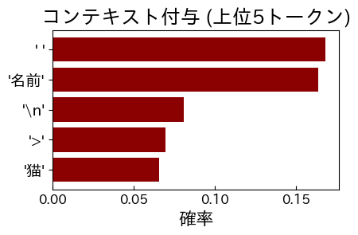
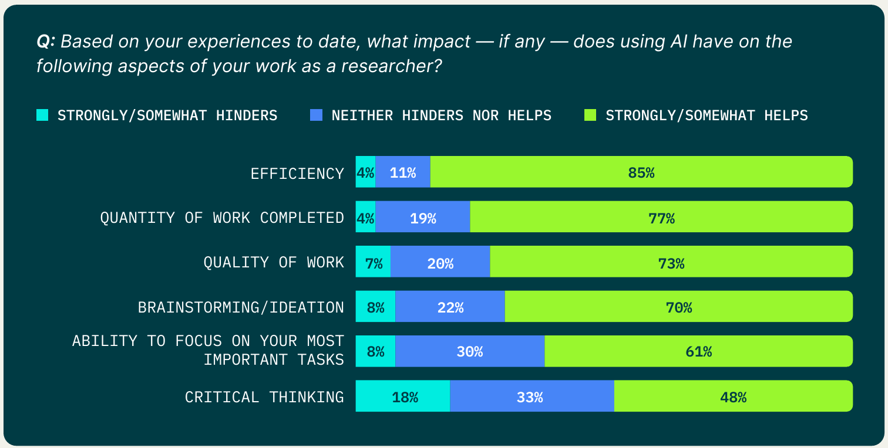
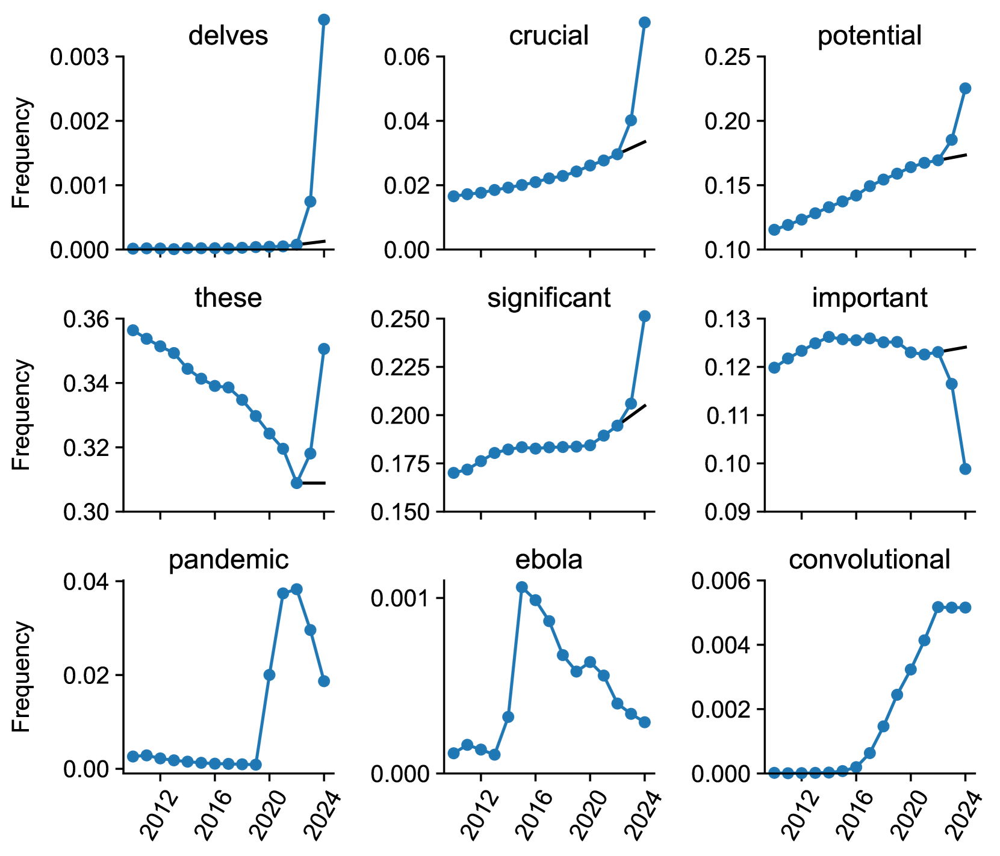
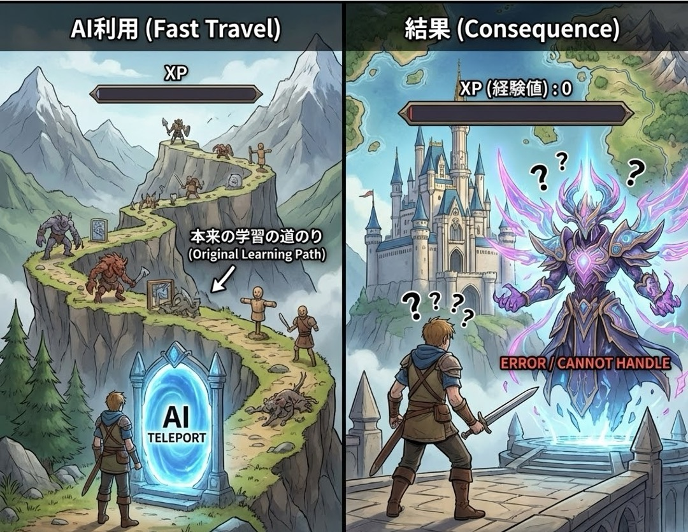

<!-- _class: cover-hero -->

第1回（オンデマンド）

研究における 生成AIの活用法

ナレッジ①：生成AIと倫理とリテラシー

千葉大学 国際未来教育基幹 田川 翔（専門：高等教育論・地球惑星科学）

---

<!-- _class: summary -->

この授業の狙い

## 研究で生成AIを「倫理的かつ適切に」使えるようになる

今後、生成AIは研究においても無視できない。ほぼすべての学問分野が、何らかの形で影響を受ける ── だからこそ、研究での「使い方の作法」を今のうちに持っておく。

### 目的

- 研究活動で、生成AIを倫理的かつ適切に利活用できるようになる
- 多くの院生は研究者を目指す。その第一歩として“使い方の作法”を持つ

### 鍵になる問い

- 「AIを研究で使おう」と思ったとき、判断の基準（クライテリア）は何か
- それを他者に言葉で説明できるか ── 分野差・個人差を前提に考える

迷ったときに立ち返れる普遍的な「考え方の基準」を持つ。これがこの授業の中核です。

---

<!-- _class: summary -->

この授業の目標（到達点）

## 視聴後に、こうなっていることを目指す

### 知識・理解

- 研究における倫理・学術情報流通・生成AIの利活用リテラシーと仕組みを概観し、説明できる

### 応用・分析

- 各分野・学会の生成AI受容状況を調べ、利活用で気をつける観点を指摘できる
- 各分野の事例・手法を調査・比較し、自分の分野への影響を分析できる

### 評価・受容

- 異分野の学生との協働で、生成AIが関わる手法・論点の学び方を説明できる
- 研究の文脈で生成AIにどう関わるか、自分の意見を持ち判断できる

---

<!-- _class: fig -->

この科目の全8回（＝授業回）

## この講義の全体像

<table class="dtbl" style="font-size:20px;">
<tr><th>回</th><th class="l">テーマ</th><th>形式</th></tr>
<tr style="background:#F1D4DA;"><td><strong>1</strong></td><td class="l"><strong>ナレッジ①：生成AIと倫理とリテラシー　← 今回</strong></td><td>オンデマンド</td></tr>
<tr><td>2</td><td class="l">ナレッジ②：学術情報流通（成果公表・査読）の仕組み</td><td>オンデマンド</td></tr>
<tr><td>3</td><td class="l">ナレッジ③：生成AIの仕組み（ミニチュアを作るColab演習）</td><td>オンデマンド</td></tr>
<tr><td>4</td><td class="l">研究・論文①：アカデミック・インテグリティと生成AI</td><td>オンデマンド&グループワーク</td></tr>
<tr><td>5</td><td class="l">研究・論文②：各分野での受容状況を共有</td><td>同時双方向</td></tr>
<tr><td>6</td><td class="l">研究手法①：AIを研究で用いる</td><td>オンデマンド&グループワーク</td></tr>
<tr><td>7</td><td class="l">研究手法②：AIの研究利用の調査と情報交換</td><td>対面＋オンデマンド</td></tr>
<tr><td>8</td><td class="l">議論とリフレクション（最終レポートへ）</td><td>対面＋オンデマンド</td></tr>
</table>

第1回は「考えるための前提」。ここから研究倫理・仕組み・手法へと積み上げます。

---

<!-- _class: split tk-low -->

この講義の受け方

## オンデマンドで“前提”を理解し、対面で“学び合う”ことで身につける

<svg viewBox="0 0 360 300" width="100%" style="max-height:380px">
  <g text-anchor="middle">
    <rect x="60" y="30" width="240" height="70" rx="12" fill="#FBE7D6" stroke="#A33818" stroke-width="2"/>
    <text x="180" y="60" font-size="18" font-weight="800" fill="#A33818">① オンデマンド講義</text>
    <text x="180" y="86" font-size="16" fill="#5B6068">倫理・情報流通・AI技術</text>
    <text x="180" y="120" font-size="26" fill="#A33818" font-weight="800">↓</text>
    <rect x="60" y="135" width="240" height="70" rx="12" fill="#E2EDF6" stroke="#1A6BB0" stroke-width="2"/>
    <text x="180" y="165" font-size="18" font-weight="800" fill="#1A6BB0">② 同時双方向・対面</text>
    <text x="180" y="191" font-size="16" fill="#5B6068">分野を越えたグループワーク</text>
    <text x="180" y="225" font-size="26" fill="#1A6BB0" font-weight="800">↓</text>
    <rect x="60" y="240" width="240" height="56" rx="12" fill="#EDEEF0" stroke="#5B6068" stroke-width="2"/>
    <text x="180" y="265" font-size="18" font-weight="800" fill="#5B6068">③ 調査・議論・レポート</text>
    <text x="180" y="287" font-size="16" fill="#5B6068">自分の分野への影響を判断</text>
  </g>
</svg>

視聴のしかた

- ナレッジ回を視聴期限内に視聴（順番推奨）
- 視聴後に対面・同時双方向で議論する

予習・復習でのAI利用

- 予習復習では大いに活用OK。課題ごとに使える範囲を明示
- 使い方は必ず申告（申告と乖離は0点）
- AIの回答をそのまま提出は C評価（自分の考え・検証の跡が見えない）

この講義は「考えるための前提」。答えは対面の議論で一緒に作る。

---

<!-- _class: summary -->

授業の3つの課題

## 3つの課題で、“自分はどう関わるか”を言葉にする

<svg viewBox="0 0 960 150" width="100%" style="max-height:230px">
  <g text-anchor="middle">
    <rect x="20" y="20" width="270" height="110" rx="14" fill="#FBE7D6" stroke="#A33818" stroke-width="2.5"/>
    <text x="155" y="62" font-size="26" font-weight="800" fill="#A33818">① 近接分野 GW</text>
    <text x="155" y="98" font-size="20" fill="#832D18">研究倫理の観点で調査</text>
    <rect x="345" y="20" width="270" height="110" rx="14" fill="#FBE7D6" stroke="#A33818" stroke-width="2.5"/>
    <text x="480" y="62" font-size="26" font-weight="800" fill="#A33818">② 分野横断 GW</text>
    <text x="480" y="98" font-size="20" fill="#832D18">手法の観点で比べる</text>
    <rect x="670" y="20" width="270" height="110" rx="14" fill="#FBE7D6" stroke="#A33818" stroke-width="2.5"/>
    <text x="805" y="62" font-size="26" font-weight="800" fill="#A33818">③ 個人レポート</text>
    <text x="805" y="98" font-size="20" fill="#832D18">今後どう関わるかを書く</text>
    <text x="318" y="84" font-size="34" fill="#A33818">→</text>
    <text x="643" y="84" font-size="34" fill="#A33818">→</text>
  </g>
</svg>

- ① 近接分野GW：倫理的観点で指針を調査（グループワーク）
- ② 分野横断GW：研究手法の観点で他分野と比較（グループワーク）
- ③ 個人レポート：今後どうAIと関わるかを明文化
- ①②のグループワークは第4〜7回で行います

第1回の課題：まず研究分野・授業への関心を含む自己紹介をMoodleに記入。

---

<!-- _class: fig -->

今回（第1回）の流れ

## 第1回は、この10本の動画で構成します

<svg viewBox="0 0 1000 300" width="100%" style="max-height:360px">
  <rect x="14" y="40" width="92" height="190" rx="12" fill="#F3DCC8" stroke="#832D18" stroke-width="1.5"/>
  <text x="60" y="128" text-anchor="middle" font-size="20" font-weight="800" fill="#832D18">①</text>
  <text x="60" y="156" text-anchor="middle" font-size="16" font-weight="700" fill="#832D18">学び方</text>
  <rect x="118" y="40" width="430" height="190" rx="12" fill="#FBE7D6" stroke="#A33818" stroke-width="1.6"/>
  <text x="333" y="64" text-anchor="middle" font-size="18" font-weight="800" fill="#A33818">PART A　AIを知る</text>
  <rect x="560" y="40" width="220" height="190" rx="12" fill="#E2EDF6" stroke="#1A6BB0" stroke-width="1.6"/>
  <text x="670" y="64" text-anchor="middle" font-size="18" font-weight="800" fill="#1A6BB0">PART B　研究倫理</text>
  <rect x="792" y="40" width="194" height="190" rx="12" fill="#EDEEF0" stroke="#5B6068" stroke-width="1.6"/>
  <text x="889" y="64" text-anchor="middle" font-size="18" font-weight="800" fill="#5B6068">PART C　これから</text>
  <g text-anchor="middle">
    <g><rect x="130" y="88" width="96" height="116" rx="8" fill="#fff" stroke="#A33818" stroke-width="1.6"/><text x="178" y="128" font-size="22" font-weight="800" fill="#A33818">②</text><text x="178" y="162" font-size="18" font-weight="700">俯瞰</text></g>
    <g><rect x="234" y="88" width="96" height="116" rx="8" fill="#fff" stroke="#A33818" stroke-width="1.6"/><text x="282" y="128" font-size="22" font-weight="800" fill="#A33818">③</text><text x="282" y="162" font-size="18" font-weight="700">倫理</text></g>
    <g><rect x="338" y="88" width="96" height="116" rx="8" fill="#fff" stroke="#A33818" stroke-width="1.6"/><text x="386" y="128" font-size="22" font-weight="800" fill="#A33818">④</text><text x="386" y="162" font-size="18" font-weight="700">仕組み</text></g>
    <g><rect x="442" y="88" width="96" height="116" rx="8" fill="#fff" stroke="#A33818" stroke-width="1.6"/><text x="490" y="128" font-size="22" font-weight="800" fill="#A33818">⑤</text><text x="490" y="162" font-size="18" font-weight="700">限界</text></g>
    <g><rect x="572" y="88" width="96" height="116" rx="8" fill="#fff" stroke="#1A6BB0" stroke-width="1.6"/><text x="620" y="128" font-size="22" font-weight="800" fill="#1A6BB0">⑥</text><text x="620" y="162" font-size="18" font-weight="700">研究倫理</text></g>
    <g><rect x="676" y="88" width="96" height="116" rx="8" fill="#fff" stroke="#1A6BB0" stroke-width="1.6"/><text x="724" y="128" font-size="22" font-weight="800" fill="#1A6BB0">⑦</text><text x="724" y="162" font-size="18" font-weight="700">倫理×AI</text></g>
    <g><rect x="804" y="88" width="80" height="116" rx="8" fill="#fff" stroke="#5B6068" stroke-width="1.6"/><text x="844" y="128" font-size="22" font-weight="800" fill="#5B6068">⑧</text><text x="844" y="162" font-size="18" font-weight="700">分野差</text></g>
    <g><rect x="892" y="88" width="80" height="116" rx="8" fill="#fff" stroke="#5B6068" stroke-width="1.6"/><text x="932" y="128" font-size="22" font-weight="800" fill="#5B6068">⑨</text><text x="932" y="162" font-size="18" font-weight="700">影響</text></g>
  </g>
  <rect x="118" y="244" width="868" height="44" rx="10" fill="#A33818"/>
  <text x="552" y="271" text-anchor="middle" font-size="17" font-weight="800" fill="#fff">⑩ 自分の設計・まとめ ── 「判断の基準」を持ち、言葉で説明できる</text>
</svg>

第1回=授業の前提を知る10動画。

---

<!-- _class: intro tk-low -->

担当講師の自己紹介

たがわ　しょう田川　翔

<strong>所属：</strong>千葉大学 国際未来教育基幹 
専門：高等教育論・地球惑星科学

大学の学びを設計し、学生と教員を支援する

### ①この講義をする理由

- 生成AIは研究に役立つし、影響するはず
- でも、研究でのAIの“作法”は分野ごとにバラバラ
- “自分の物差し”を手に入れて欲しい

### ②問いの原点

自分は、地球惑星科学の研究者です。
分野横断的な学際領域だったので、他の分野の研究手法の習得に、大変苦労したのを覚えています。特に博論で金属工学やプログラミングまで学習したのは大変骨が折れました。
今はAIでもっと先にいける可能性があります。

一緒に、AI×研究を考え、切り開きましょう。

---

<!-- _class: divider -->

動画 2

# AIとはなにか、俯瞰する

## 情報からトランスフォーマーまで、辿る

---

<!-- _class: fig -->

全体像

## 入れ子の関係 ── 大きな枠の中に「生成AI」がある

<svg viewBox="0 0 560 470" width="100%" style="flex:0 0 43%; max-height:430px" text-anchor="middle">
  <rect x="10" y="20" width="540" height="432" rx="22" fill="#ECEDEF" stroke="#C7CACE" stroke-width="2"/>
  <text x="280" y="56" font-size="25" font-weight="800" fill="#5B6068">数理・統計・DS</text>
  <rect x="54" y="80" width="452" height="364" rx="20" fill="#FBE7D6" stroke="#D2762E" stroke-width="2"/>
  <text x="280" y="116" font-size="25" font-weight="800" fill="#832D18">人工知能（AI）</text>
  <rect x="98" y="140" width="364" height="296" rx="18" fill="#F4D9C0" stroke="#A33818" stroke-width="2"/>
  <text x="280" y="176" font-size="24" font-weight="800" fill="#832D18">機械学習</text>
  <rect x="142" y="200" width="276" height="228" rx="16" fill="#EBC09A" stroke="#832D18" stroke-width="2"/>
  <text x="280" y="236" font-size="24" font-weight="800" fill="#7d1322">深層学習</text>
  <rect x="186" y="262" width="188" height="158" rx="14" fill="#A33818" stroke="#7d1322" stroke-width="2.5"/>
  <text x="280" y="350" font-size="28" font-weight="800" fill="#fff">生成AI</text>
</svg>

<b>数理・統計・DS</b>：データを扱う数学・統計

<b>AI</b>：人が知的だと感じる処理を実現するシステム 機械学習のほか、ルールベース・探索・推論 なども含む

<b>機械学習</b>：データから自動でパターンを学ぶAI

<b>深層学習</b>：多層ネットワークで学ぶ。生成AIの土台

<b>生成AI</b>：文章・画像などを“つくる”AI（この講義の主役）

※ 生成AIの手法は Transformer・GAN・拡散モデル など複数。

AIの範囲はきわめて広く、生成AIがその一部でしかない。AIは既に環境になった。

---

<!-- _class: summary tk-low -->

情報とは

## 情報のDIKWモデル

・データ（Data）客観的な事実など、整理されていない状態。

・情報（Information）重要データを何らかの基準で整理・分析し、解釈できるようにした状態。

・知識（Knowledge）情報をまとめて体系化・構造化した状態。

・知恵（Wisdom）知識を正しく認識し、価値観やモラルにまで高めた状態。

出典: 高等学校 情報Ⅰ（数研出版）

データを情報・知識へ変換する力。研究は、この往還を行き来する。

---

<!-- _class: fig -->

AIとは／AIの分類

## AI＝人が知的だと感じる処理を実現するシステム

<svg viewBox="0 0 990 470" width="100%" style="max-height:440px">
  <g text-anchor="middle">
    <rect x="90" y="5" width="250" height="86" rx="14" fill="#FBE7D6" stroke="#A33818" stroke-width="2"/>
    <text x="215" y="41" font-size="24" font-weight="800" fill="#832D18">Artificial</text>
    <text x="215" y="71" font-size="23" fill="#5B6068">人工的な</text>
    <text x="400" y="59" font-size="36" font-weight="800" fill="#5B6068">＋</text>
    <rect x="460" y="5" width="250" height="86" rx="14" fill="#FBE7D6" stroke="#A33818" stroke-width="2"/>
    <text x="585" y="41" font-size="24" font-weight="800" fill="#832D18">Intelligence</text>
    <text x="585" y="71" font-size="23" fill="#5B6068">知能</text>
    <text x="800" y="59" font-size="32" font-weight="800" fill="#5B6068">→</text>
    <rect x="845" y="9" width="120" height="78" rx="12" fill="#A33818" stroke="#832D18" stroke-width="2.5"/>
    <text x="905" y="45" font-size="24" font-weight="800" fill="#fff">AI</text>
    <text x="905" y="73" font-size="23" fill="#FBE7D6">人工知能</text>
    <text x="495" y="128" font-size="33" fill="#5B6068">定義 = 人が知的だと感じる処理を実現するシステム</text>
    <rect x="395" y="175" width="200" height="58" rx="12" fill="#A33818" stroke="#832D18" stroke-width="2.5"/>
    <text x="495" y="211" font-size="22" font-weight="800" fill="#fff">AI（人工知能）</text>
    <path d="M639 158 L941 158 Q955 158 955 172 L955 232 Q955 246 941 246 L639 246 Q625 246 625 232 L625 216 L597 204 L625 192 L625 172 Q625 158 639 158 Z" fill="#FFF7EC" stroke="#A33818" stroke-width="2"/>
    <text x="790" y="193" font-size="20" font-weight="800" fill="#832D18">ロボットとは別物</text>
    <text x="790" y="223" font-size="18" fill="#5B6068">AIは“知能”、ロボットは“体”</text>
    <line x1="495" y1="233" x2="245" y2="285" stroke="#5B6068" stroke-width="2"/>
    <line x1="495" y1="233" x2="745" y2="285" stroke="#5B6068" stroke-width="2"/>
    <rect x="100" y="290" width="290" height="150" rx="12" fill="#EDEEF0" stroke="#5B6068" stroke-width="2"/>
    <text x="245" y="330" font-size="22" font-weight="800" fill="#5B6068">ルールベース</text>
    <text x="245" y="368" font-size="23" fill="#5B6068">人がルール・知識を記述</text>
    <text x="245" y="402" font-size="23" fill="#5B6068">書ききれる問題に強い</text>
    <rect x="600" y="290" width="290" height="150" rx="12" fill="#FBE7D6" stroke="#A33818" stroke-width="2.5"/>
    <text x="745" y="330" font-size="22" font-weight="800" fill="#832D18">機械学習</text>
    <text x="745" y="368" font-size="23" fill="#5B6068">データから自分で学ぶ</text>
    <text x="745" y="402" font-size="23" fill="#A33818" font-weight="700">現在の主流</text>
    <path d="M44 150 H356 Q370 150 370 164 V190 L394 204 L370 218 V242 Q370 256 356 256 H44 Q30 256 30 242 V164 Q30 150 44 150 Z" fill="#FFF7EC" stroke="#A33818" stroke-width="2"/>
    <text x="200" y="174" font-size="17" font-weight="800" fill="#832D18">「AI」という用語は1956年に誕生</text>
    <text x="200" y="197" font-size="16" fill="#5B6068">ダートマス会議で4名が提唱し命名</text>
    <text x="200" y="220" font-size="16" fill="#5B6068">マッカーシー・ミンスキー</text>
    <text x="200" y="243" font-size="16" fill="#5B6068">シャノン・ロチェスター</text>
  </g>
</svg>

「猫を見分けるルール」を完璧に書くのは不可能。だからデータから学ばせる。

---

<!-- _class: summary -->

機械学習

## 機械学習型のAIの学び方(Training方法)は3種類

① 教師あり学習

- 正解（教師データ）付きで学ぶ
- 例：分類・予測・回帰
- 「この画像は猫」と教える

<svg viewBox="0 0 320 124" width="100%" style="max-height:132px">
  <text x="151" y="9" font-size="9" font-weight="800" fill="#5B6068" text-anchor="middle">① 学習（正解つきで覚える）</text>
  <rect x="92" y="14" width="56" height="24" rx="4" fill="#fff" stroke="#A33818" stroke-width="1.2"/>
  <text x="106" y="31" font-size="15" text-anchor="middle">🐱</text>
  <rect x="120" y="20" width="22" height="12" rx="2.5" fill="#A33818"/>
  <text x="131" y="29" font-size="8.5" font-weight="800" fill="#fff" text-anchor="middle">ネコ</text>
  <rect x="152" y="14" width="56" height="24" rx="4" fill="#fff" stroke="#A33818" stroke-width="1.2"/>
  <text x="166" y="31" font-size="15" text-anchor="middle">🐶</text>
  <rect x="180" y="20" width="22" height="12" rx="2.5" fill="#A33818"/>
  <text x="191" y="29" font-size="8.5" font-weight="800" fill="#fff" text-anchor="middle">イヌ</text>
  <line x1="120" y1="38" x2="142" y2="54" stroke="#A33818" stroke-width="2"/>
  <line x1="180" y1="38" x2="160" y2="54" stroke="#A33818" stroke-width="2"/>
  <rect x="120" y="56" width="62" height="40" rx="10" fill="#A33818" stroke="#832D18" stroke-width="1.5"/>
  <text x="151" y="80" font-size="13" font-weight="800" fill="#fff" text-anchor="middle">モデル</text>
  <text x="50" y="58" font-size="9" font-weight="800" fill="#5B6068" text-anchor="middle">② 予測する画像</text>
  <rect x="16" y="62" width="64" height="50" rx="6" fill="#fff" stroke="#5B6068" stroke-width="1.5"/>
  <text x="48" y="99" font-size="34" text-anchor="middle">🐱</text>
  <text x="100" y="86" font-size="20" fill="#A33818" text-anchor="middle">→</text>
  <text x="198" y="86" font-size="20" fill="#A33818" text-anchor="middle">→</text>
  <rect x="214" y="62" width="96" height="46" rx="8" fill="#fff" stroke="#A33818" stroke-width="1.5"/>
  <text x="262" y="84" font-size="12" fill="#333" text-anchor="middle">これは猫</text>
  <text x="262" y="102" font-size="14" font-weight="800" fill="#A33818" text-anchor="middle">80%</text>
</svg>

② 教師なし学習

- 正解なしで構造を見つける
- 例：クラスタリング・次元削減
- 似たもの同士をまとめる

<svg viewBox="0 0 320 116" width="100%" style="max-height:116px">
  <rect x="6" y="12" width="96" height="92" rx="8" fill="#fff" stroke="#5B6068" stroke-width="1.5"/>
  <circle cx="28" cy="34" r="7" fill="#A33818"/><circle cx="72" cy="30" r="7" fill="#1A6BB0"/>
  <circle cx="52" cy="56" r="7" fill="#E0A53F"/><circle cx="30" cy="78" r="7" fill="#1A6BB0"/>
  <circle cx="80" cy="72" r="7" fill="#A33818"/><circle cx="58" cy="90" r="7" fill="#E0A53F"/>
  <text x="120" y="62" font-size="20" fill="#A33818" text-anchor="middle">→</text>
  <ellipse cx="178" cy="40" rx="28" ry="22" fill="none" stroke="#A33818" stroke-dasharray="3 3"/>
  <circle cx="170" cy="36" r="7" fill="#A33818"/><circle cx="186" cy="42" r="7" fill="#A33818"/><circle cx="172" cy="50" r="7" fill="#A33818"/>
  <ellipse cx="244" cy="40" rx="28" ry="22" fill="none" stroke="#1A6BB0" stroke-dasharray="3 3"/>
  <circle cx="236" cy="36" r="7" fill="#1A6BB0"/><circle cx="252" cy="42" r="7" fill="#1A6BB0"/><circle cx="238" cy="50" r="7" fill="#1A6BB0"/>
  <ellipse cx="210" cy="90" rx="28" ry="20" fill="none" stroke="#E0A53F" stroke-dasharray="3 3"/>
  <circle cx="202" cy="86" r="7" fill="#E0A53F"/><circle cx="218" cy="92" r="7" fill="#E0A53F"/><circle cx="204" cy="99" r="7" fill="#E0A53F"/>
</svg>

③ 強化学習

- 報酬を最大化する試行錯誤
- 例：ゲームAI・自動運転
- 良い行動に“ほうび”を与える

<svg viewBox="0 0 320 116" width="100%" style="max-height:116px">
  <polygon points="10,48 10,64 24,56" fill="#A33818"/>
  <polyline points="26,56 66,56 66,30 116,30 116,84 172,84 172,46 214,46" fill="none" stroke="#1A6BB0" stroke-width="4"/>
  <circle cx="66" cy="30" r="6" fill="#E0A53F" stroke="#B97E1E"/>
  <circle cx="116" cy="84" r="6" fill="#E0A53F" stroke="#B97E1E"/>
  <circle cx="172" cy="46" r="6" fill="#E0A53F" stroke="#B97E1E"/>
  <g stroke="#aab0b6" stroke-width="2"><line x1="92" y1="52" x2="100" y2="60"/><line x1="100" y1="52" x2="92" y2="60"/><line x1="146" y1="28" x2="154" y2="36"/><line x1="154" y1="28" x2="146" y2="36"/></g>
  <circle cx="214" cy="46" r="10" fill="#A33818" stroke="#832D18" stroke-width="1.5"/>
  <polygon points="266,28 272,43 288,43 275,53 280,69 266,59 252,69 257,53 244,43 260,43" fill="#E0A53F" stroke="#B97E1E" stroke-width="1.5"/>
  <text x="266" y="88" font-size="11" font-weight="700" fill="#5B6068" text-anchor="middle">報酬（ゴール）</text>
</svg>

正解の一部だけを使う「半教師あり学習」も。実務ではこれらを組み合わせます。

---

<!-- _class: split -->

ニューラルネット

## 脳のニューロンを真似た“層”の重ね合わせ

<svg viewBox="0 0 380 330" width="100%" style="max-height:380px">
  <g>
    <text x="60" y="35" text-anchor="middle" font-size="16" font-weight="800" fill="#A33818">入力層</text>
    <text x="190" y="35" text-anchor="middle" font-size="16" font-weight="800" fill="#5B6068">隠れ層</text>
    <text x="320" y="35" text-anchor="middle" font-size="16" font-weight="800" fill="#832D18">出力層</text>
    <g stroke="#e6c4a8" stroke-width="1">
      <line x1="60" y1="90" x2="190" y2="80"/><line x1="60" y1="90" x2="190" y2="150"/><line x1="60" y1="90" x2="190" y2="220"/>
      <line x1="60" y1="160" x2="190" y2="80"/><line x1="60" y1="160" x2="190" y2="150"/><line x1="60" y1="160" x2="190" y2="220"/>
      <line x1="60" y1="230" x2="190" y2="80"/><line x1="60" y1="230" x2="190" y2="150"/><line x1="60" y1="230" x2="190" y2="220"/>
      <line x1="190" y1="80" x2="320" y2="120"/><line x1="190" y1="80" x2="320" y2="190"/>
      <line x1="190" y1="150" x2="320" y2="120"/><line x1="190" y1="150" x2="320" y2="190"/>
      <line x1="190" y1="220" x2="320" y2="120"/><line x1="190" y1="220" x2="320" y2="190"/>
    </g>
    <g>
      <circle cx="60" cy="90" r="16" fill="#FBE7D6" stroke="#E08A4F" stroke-width="2"/>
      <circle cx="60" cy="160" r="16" fill="#FBE7D6" stroke="#E08A4F" stroke-width="2"/>
      <circle cx="60" cy="230" r="16" fill="#FBE7D6" stroke="#E08A4F" stroke-width="2"/>
      <circle cx="190" cy="80" r="16" fill="#EDEEF0" stroke="#5B6068" stroke-width="2"/>
      <circle cx="190" cy="150" r="16" fill="#EDEEF0" stroke="#5B6068" stroke-width="2"/>
      <circle cx="190" cy="220" r="16" fill="#EDEEF0" stroke="#5B6068" stroke-width="2"/>
      <circle cx="320" cy="120" r="16" fill="#A33818" stroke="#832D18" stroke-width="2.5"/>
      <circle cx="320" cy="190" r="16" fill="#A33818" stroke="#832D18" stroke-width="2.5"/>
    </g>
    <text x="190" y="300" text-anchor="middle" font-size="16" fill="#A33818" font-weight="700">結線の“重み”を学習で調整</text>
  </g>
</svg>

学習(Training) と 推論(Inference) 

- 学習：データで<b>重みを調整 ＝育てる</b>（計算が重い・1回）
- 推論：育てた<b>重みで答えを出す ＝使う</b>（重みは固定・軽い）

- 隠れ層を深く重ねたものが深層学習
- 画像・音声・言語の処理に強い

学習 (Training)＝“重みという数字を調整して当てにいく”地道な作業です。

---

<!-- _class: split -->

トランスフォーマー

## 系列を“並列に”扱う新しい仕組み

<svg viewBox="0 0 380 330" width="100%" style="max-height:320px">
  <g text-anchor="middle">
    <rect x="90" y="14" width="200" height="46" rx="9" fill="#FBE7D6" stroke="#A33818" stroke-width="2"/>
    <text x="190" y="43" font-size="17" font-weight="800" fill="#832D18">入力の語の並び</text>
    <text x="190" y="78" font-size="22" font-weight="800" fill="#A33818">↓</text>
    <rect x="65" y="90" width="250" height="50" rx="9" fill="#F1C9A8" stroke="#A33818" stroke-width="2"/>
    <text x="190" y="113" font-size="16" font-weight="800" fill="#832D18">自己注意 Self-attention</text>
    <text x="190" y="132" font-size="16" fill="#5B6068">語どうしの関係を見る</text>
    <text x="190" y="160" font-size="22" font-weight="800" fill="#A33818">↓</text>
    <rect x="65" y="172" width="250" height="50" rx="9" fill="#EDEEF0" stroke="#5B6068" stroke-width="2"/>
    <text x="190" y="195" font-size="16" font-weight="800" fill="#5B6068">MLP（変換）</text>
    <text x="190" y="214" font-size="16" fill="#5B6068">情報をまとめ直す</text>
    <text x="190" y="242" font-size="22" font-weight="800" fill="#A33818">↓</text>
    <rect x="65" y="254" width="250" height="58" rx="9" fill="#A33818" stroke="#832D18" stroke-width="2.5"/>
    <text x="190" y="280" font-size="16" font-weight="800" fill="#fff">次の語を予測</text>
    <text x="190" y="300" font-size="16" fill="#FBE7D6">候補ごとの確率を出す</text>
  </g>
</svg>

いまは“次の語を予測”だけでOK

- 今回は「次の語を予測している」と掴めればOK
- 2017年登場。文を並列に扱えて大規模化しやすい

出典: Vaswani et al., 2017「Attention Is All You Need」

今回は「次の語を当てている」の一点だけ。細部は第3回で手を動かして試します。

---

<!-- _class: split -->

生成AIとは

## “認識・分類”から“生成”へ

<svg viewBox="0 20 380 285" width="100%" style="max-height:300px">
  <g text-anchor="middle">
    <text x="190" y="35" font-size="16" font-weight="800" fill="#5B6068">従来のAI</text>
    <rect x="35" y="55" width="100" height="46" rx="8" fill="#fff" stroke="#5B6068" stroke-width="1.8"/>
    <text x="85" y="83" font-size="16" font-weight="700" fill="#5B6068">入力</text>
    <text x="155" y="84" font-size="20" font-weight="800" fill="#5B6068">→</text>
    <rect x="185" y="55" width="160" height="46" rx="8" fill="#EDEEF0" stroke="#5B6068" stroke-width="1.8"/>
    <text x="265" y="83" font-size="16" font-weight="700" fill="#5B6068">分類ラベル</text>
    <line x1="30" y1="135" x2="350" y2="135" stroke="#e6c4a8" stroke-width="1.5"/>
    <text x="190" y="175" font-size="16" font-weight="800" fill="#A33818">生成AI</text>
    <rect x="35" y="195" width="100" height="46" rx="8" fill="#fff" stroke="#A33818" stroke-width="2"/>
    <text x="85" y="223" font-size="16" font-weight="700" fill="#832D18">入力</text>
    <text x="155" y="224" font-size="20" font-weight="800" fill="#A33818">→</text>
    <rect x="185" y="185" width="160" height="66" rx="8" fill="#FBE7D6" stroke="#A33818" stroke-width="2.5"/>
    <text x="265" y="212" font-size="16" font-weight="700" fill="#832D18">新しい文章</text>
    <text x="265" y="234" font-size="16" font-weight="700" fill="#832D18">・画像を生成</text>
    <text x="190" y="295" font-size="16" fill="#5B6068">識別する → 作り出す へ</text>
  </g>
</svg>

- 従来のAIは識別・予測が中心
- 生成AIは尤もらしい続き（＝それらしい続き）を作る
- 次に来る語を一つ選び、入力に戻して繰り返す
- 文章を扱うものがLLM（大規模言語モデル）

推論モデル（reasoning model）

- Transformerの一度の生成だけでは十分に賢くならない
- 答える前に考える過程を生成し、繰り返し考えることで精度が上がる

AI agent（エージェント）：目標を与えると計画→ツール実行→確認を自分で繰り返し、タスクを最後までやり遂げるAI

---

<!-- _class: summary -->

この動画のまとめ

## AIの概念の全体像

① AIの主流

- AIは機械学習が現在の主流
- データから自分で学ぶ方式
- ルールで書けない問題に強い

② 学習の正体

- ニューラルネット／ディープで
- 結線の重みを学習して当てる
- 学習＝地道な数値調整

③ 生成AIへ

- トランスフォーマー ＝系列を並列に扱う
- “次の語を予測”し続きを作る
- 数理は第3回（Colab演習）で

次の動画では、使う前に知っておくべき「原則・倫理・リスク」を見ていきます。

---

<!-- _class: divider -->

動画 3

# 原則・倫理・リスク

## 「使ってよい／だめ」を判断する物差しをつくる

---

<!-- _class: fig -->

なぜ「原則」から入るか

## 研究から見るピラミッド： だから「理念」に遡って考える

<svg viewBox="0 0 960 380" width="100%" style="max-height:430px">
  <polygon points="480,24 406,114 554,114" fill="#FBE7D6" stroke="#A33818" stroke-width="2.5"/>
  <text x="480" y="82" text-anchor="middle" font-size="19" font-weight="800" fill="#A33818">理念</text>
  <text x="480" y="103" text-anchor="middle" font-size="12" fill="#832D18">例：人間の尊厳</text>
  <polygon points="401,120 559,120 621,196 339,196" fill="#FBE7D6" stroke="#E08A4F" stroke-width="2.5"/>
  <text x="480" y="152" text-anchor="middle" font-size="19" font-weight="800" fill="#832D18">社会的な指針</text>
  <text x="480" y="178" text-anchor="middle" font-size="14" fill="#832D18">例：透明性</text>
  <polygon points="334,202 626,202 688,278 272,278" fill="#FDF0E2" stroke="#E08A4F" stroke-width="2.5"/>
  <text x="480" y="234" text-anchor="middle" font-size="19" font-weight="800" fill="#832D18">学会・組織の指針</text>
  <text x="480" y="262" text-anchor="middle" font-size="14" fill="#832D18">例：各学会・各社の倫理指針</text>
  <polygon points="267,284 693,284 755,360 205,360" fill="#EDEEF0" stroke="#5B6068" stroke-width="2.5"/>
  <text x="480" y="316" text-anchor="middle" font-size="19" font-weight="800" fill="#5B6068">技術的な指針・利用規約</text>
  <text x="480" y="344" text-anchor="middle" font-size="14" fill="#5B6068">例：各社の利用規約</text>
  <line x1="836" y1="350" x2="836" y2="92" stroke="#A33818" stroke-width="2.5"/>
  <polygon points="836,76 827,96 845,96" fill="#A33818"/>
  <line x1="747" y1="350" x2="836" y2="350" stroke="#5B6068" stroke-width="1.5" stroke-dasharray="4 4"/>
  <line x1="530" y1="88" x2="836" y2="88" stroke="#A33818" stroke-width="1.5" stroke-dasharray="4 4"/>
  <text x="868" y="220" text-anchor="middle" font-size="18" font-weight="800" fill="#A33818" transform="rotate(90 868 220)">迷ったら上位へ遡る</text>
  <line x1="213" y1="350" x2="120" y2="350" stroke="#5B6068" stroke-width="1.5" stroke-dasharray="4 4"/>
  <text x="72" y="344" text-anchor="middle" font-size="15" fill="#5B6068">具体策は</text>
  <text x="72" y="366" text-anchor="middle" font-size="15" fill="#5B6068">技術で変わる</text>
</svg>

技術先行で変わり続ける。迷う場面ほど、上位の「理念」に遡ると見通しが良い。

---

<!-- _class: summary -->

理念と指針

## 人間中心の AI 社会原則: 3つの理念が土台

理念（最上位の価値）── そもそも何のためにAIを使うのか。
「以下の３つの価値を理念として尊重し、その実現を追求する社会を構築していくべき」とする

人間の尊厳 Dignity

人がAIに振り回されず、人 間が中心であり続ける

原文：「人間がAIを道具として使いこなす…<b>人間の尊厳が尊重される社会</b>を構築する必要がある」

多様性・包摂 Diversity &amp; Inclusion

さまざまな背景の人が 誰も取り残されない

原文：「多様な幸せを追求し、それらを<b>柔軟に包摂</b>した上で新たな価値を創造できる社会」

持続可能な社会 Sustainability

恩恵を将来世代まで届ける
 

原文：「格差を解消し、地球規模の環境問題や気候変動などにも対応が可能な<b>持続性のある社会</b>」

この理念から、 人間中心・透明性・公平性 といった指針が出てくる。

出典: 人間中心のAI社会原則（内閣府 統合イノベーション戦略推進会議, 2019） <a href="https://www8.cao.go.jp/cstp/ai/aigensoku.pdf#page=6">リンク</a>

---

<!-- _class: summary -->

AI社会原則

## 3つの理念から導く、国の「7つのAI社会原則」

先ほどの3理念を社会全体で実現するための原則。
研究で使う私たちに効くのは ①人間中心・②教育リテラシー・⑥公平性／説明責任／透明性

1人間中心 ── 基本的人権を侵さない。AIは人を補助し能力を拡げる道具で、最終判断と責任は人

2教育・リテラシー ── 誰もが正しく理解し使える素養を。格差や「情報弱者」を生まない

3プライバシー確保 ── 個人データで自由・尊厳・平等を侵さず、本人が関与できる仕組み

4セキュリティ確保 ── 便益とリスクの均衡。単一AIに依存せずリスク管理を進める

5公正競争確保 ── データや力が特定に偏らない、公正な競争環境を保つ

6公平性・説明責任・透明性 ── 不当な差別を防ぎ、決定の透明性と説明責任・信頼性

7イノベーション ── 産学官民・国際連携と規制改革でAI活用を促進

国が定めるこの「価値」は、学会・組織の倫理指針ともほぼ共通する。

出典: 人間中心のAI社会原則（内閣府 統合イノベーション戦略推進会議, 2019）§4.1 AI社会原則 <a href="https://www8.cao.go.jp/cstp/ai/aigensoku.pdf#page=10">リンク</a>

---

<!-- _class: summary -->

理念と倫理

## 学会・組織の倫理指針は「価値」の指針が共通化してきた

<table style="border-collapse:collapse; text-align:center; display:inline-table;">
<thead>
<tr style="background:#f6b79e; color:#fff;">
<th style="text-align:left; padding:7px 12px; border:1px solid #A33818;">尊重すべき価値</th>
<th style="padding:7px; border:1px solid #A33818;">総務省 AI利活用原則</th>
<th style="padding:7px; border:1px solid #A33818;">内閣府 AI社会原則</th>
<th style="padding:7px; border:1px solid #A33818;">人工知能学会 倫理指針</th>
<th style="padding:7px; border:1px solid #A33818;">EU 信頼できるAI</th>
<th style="padding:7px; border:1px solid #A33818;">FLI Asilomar</th>
</tr>
</thead>
<tbody>
<tr><td style="text-align:left; padding:6px 12px; border:1px solid #e6c4a8; font-weight:700; color:#832D18;">人間中心・尊厳</td><td style="border:1px solid #e6c4a8; color:#A33818; font-weight:800;">✓</td><td style="border:1px solid #e6c4a8; color:#A33818; font-weight:800;">✓</td><td style="border:1px solid #e6c4a8; color:#A33818; font-weight:800;">✓</td><td style="border:1px solid #e6c4a8; color:#A33818; font-weight:800;">✓</td><td style="border:1px solid #e6c4a8; color:#A33818; font-weight:800;">✓</td></tr>
<tr style="background:#FBF4EC;"><td style="text-align:left; padding:6px 12px; border:1px solid #e6c4a8; font-weight:700; color:#832D18;">透明性</td><td style="border:1px solid #e6c4a8; color:#A33818; font-weight:800;">✓</td><td style="border:1px solid #e6c4a8; color:#A33818; font-weight:800;">✓</td><td style="border:1px solid #e6c4a8; color:#c2c6cc;">—</td><td style="border:1px solid #e6c4a8; color:#A33818; font-weight:800;">✓</td><td style="border:1px solid #e6c4a8; color:#A33818; font-weight:800;">✓</td></tr>
<tr><td style="text-align:left; padding:6px 12px; border:1px solid #e6c4a8; font-weight:700; color:#832D18;">説明責任（アカウンタビリティ）</td><td style="border:1px solid #e6c4a8; color:#A33818; font-weight:800;">✓</td><td style="border:1px solid #e6c4a8; color:#A33818; font-weight:800;">✓</td><td style="border:1px solid #e6c4a8; color:#A33818; font-weight:800;">✓</td><td style="border:1px solid #e6c4a8; color:#A33818; font-weight:800;">✓</td><td style="border:1px solid #e6c4a8; color:#A33818; font-weight:800;">✓</td></tr>
<tr style="background:#FBF4EC;"><td style="text-align:left; padding:6px 12px; border:1px solid #e6c4a8; font-weight:700; color:#832D18;">公平性（無差別）</td><td style="border:1px solid #e6c4a8; color:#A33818; font-weight:800;">✓</td><td style="border:1px solid #e6c4a8; color:#A33818; font-weight:800;">✓</td><td style="border:1px solid #e6c4a8; color:#A33818; font-weight:800;">✓</td><td style="border:1px solid #e6c4a8; color:#A33818; font-weight:800;">✓</td><td style="border:1px solid #e6c4a8; color:#c2c6cc;">—</td></tr>
<tr><td style="text-align:left; padding:6px 12px; border:1px solid #e6c4a8; font-weight:700; color:#832D18;">プライバシー</td><td style="border:1px solid #e6c4a8; color:#A33818; font-weight:800;">✓</td><td style="border:1px solid #e6c4a8; color:#A33818; font-weight:800;">✓</td><td style="border:1px solid #e6c4a8; color:#A33818; font-weight:800;">✓</td><td style="border:1px solid #e6c4a8; color:#A33818; font-weight:800;">✓</td><td style="border:1px solid #e6c4a8; color:#A33818; font-weight:800;">✓</td></tr>
<tr style="background:#FBF4EC;"><td style="text-align:left; padding:6px 12px; border:1px solid #e6c4a8; font-weight:700; color:#832D18;">安全・セキュリティ</td><td style="border:1px solid #e6c4a8; color:#A33818; font-weight:800;">✓</td><td style="border:1px solid #e6c4a8; color:#A33818; font-weight:800;">✓</td><td style="border:1px solid #e6c4a8; color:#A33818; font-weight:800;">✓</td><td style="border:1px solid #e6c4a8; color:#A33818; font-weight:800;">✓</td><td style="border:1px solid #e6c4a8; color:#A33818; font-weight:800;">✓</td></tr>
<tr><td style="text-align:left; padding:6px 12px; border:1px solid #e6c4a8; font-weight:700; color:#832D18;">多様性・包摂</td><td style="border:1px solid #e6c4a8; color:#A33818; font-weight:800;">✓</td><td style="border:1px solid #e6c4a8; color:#A33818; font-weight:800;">✓</td><td style="border:1px solid #e6c4a8; color:#c2c6cc;">—</td><td style="border:1px solid #e6c4a8; color:#A33818; font-weight:800;">✓</td><td style="border:1px solid #e6c4a8; color:#c2c6cc;">—</td></tr>
</tbody>
</table>

人間中心・説明責任・プライバシー・安全 は共通。軸は揃ってきた。

出典: 総務省「AIガイドライン比較表」（別紙2, 2019）。✓＝当該指針に明示／空欄＝明示なし（簡略化した整理）。 <a href="https://www.soumu.go.jp/main_content/000646187.pdf">リンク</a>

---

<!-- _class: split -->

研究者に効く3指針

## 人間中心・透明性・公平性

透明性 ── 使ったら開示する

どこで・どう使ったかを記録orログで自動保存し、投稿先や指導教員に開示できる状態に。

人間中心 ── 最終責任は人

判断と責任は人が負う。「AIがそう言った」は弁明にならない。
つまり、生成AIにはオーサーシップはない。

公平性 ── バイアスに注意

学習データの偏りが出力に表れる（右図）。確かめてから使う。
人間も生成AIも双方がバイアスを気づかぬ内にもつので注意。

公平性の例：職業の生成画像に性別・人種の偏りが出る 
総務省資料にあげられた例

出典: <a href="https://www.soumu.go.jp/use_the_internet_wisely/special/generativeai/">総務省「上手にネットと付き合おう」生成AI特集</a>

この3つは、研究での生成AI利用の際には、常に確認する。

---

<!-- _class: split -->

リスク① 権利侵害・知的財産権

## 他者の権利を侵さない／著作権は「学習」と「生成」で分ける

権利侵害（肖像・名誉・人格）

• ディープフェイクに注意 • 他者の画像や音声を無断で素材化しない

著作権 ── 「学習」と「生成」で分ける

• 著作権者の権利を不当に侵害する場合には、例外がない。 
• 権利を不当に侵害しない場合、著作権者の権利を制限できる「例外」が幾つかある。(教育利用、引用など) 
• 学習に使うのはOK（情報解析）（出典: 著作権法第30条の4） • 生成物が既存作品に似て参照していたらNG（出典: 文化庁2024）

その他の知財 ── 特許・商標・営業秘密

• 特許：AIは発明者になれず<b>発明者は人</b>（東京地裁2024） • 生成物の<b>権利帰属</b>は「人の創作的寄与」＋利用規約次第（商標・営業秘密にも注意）

<svg viewBox="0 0 460 398" width="100%" style="max-height:410px">
  <defs>
    <marker id="cah" markerWidth="9" markerHeight="9" refX="7" refY="4" orient="auto"><polygon points="0,0 8,4 0,8" fill="#5B6068"/></marker>
  </defs>
  <g font-family="sans-serif" text-anchor="middle">
    <rect x="24" y="8" width="210" height="40" rx="8" fill="#A33818"/>
    <text x="129" y="34" font-size="16" font-weight="800" fill="#fff">著作権侵害か？</text>
    <rect x="24" y="86" width="210" height="42" rx="8" fill="#EDEEF0" stroke="#5B6068" stroke-width="1.6"/>
    <text x="129" y="112" font-size="14" font-weight="700" fill="#33373b">既存の著作物に依拠している</text>
    <rect x="24" y="166" width="210" height="42" rx="8" fill="#EDEEF0" stroke="#5B6068" stroke-width="1.6"/>
    <text x="129" y="192" font-size="14" font-weight="700" fill="#33373b">既存の著作物に類似している</text>
    <rect x="24" y="246" width="210" height="54" rx="8" fill="#EDEEF0" stroke="#5B6068" stroke-width="1.6"/>
    <text x="129" y="270" font-size="13.5" font-weight="700" fill="#33373b">表現上の本質的特徴を</text>
    <text x="129" y="289" font-size="13.5" font-weight="700" fill="#33373b">直接感得できる</text>
    <rect x="36" y="330" width="86" height="58" rx="8" fill="#FBE7D6" stroke="#A33818" stroke-width="2"/>
    <text x="79" y="366" font-size="20" font-weight="800" fill="#A33818">複製</text>
    <rect x="136" y="330" width="86" height="58" rx="8" fill="#FBE7D6" stroke="#A33818" stroke-width="2"/>
    <text x="179" y="366" font-size="20" font-weight="800" fill="#A33818">翻案</text>
    <rect x="300" y="14" width="152" height="34" rx="9" fill="#E3F0E4" stroke="#3a9d63" stroke-width="1.5"/>
    <text x="376" y="36" font-size="12.5" font-weight="800" fill="#2E7D4F">著作権侵害ではない</text>
    <rect x="300" y="96" width="152" height="34" rx="9" fill="#E3F0E4" stroke="#3a9d63" stroke-width="1.5"/>
    <text x="376" y="118" font-size="12.5" font-weight="800" fill="#2E7D4F">著作権侵害ではない</text>
    <rect x="300" y="176" width="152" height="34" rx="9" fill="#E3F0E4" stroke="#3a9d63" stroke-width="1.5"/>
    <text x="376" y="198" font-size="12.5" font-weight="800" fill="#2E7D4F">著作権侵害ではない</text>
    <rect x="300" y="240" width="152" height="86" rx="10" fill="#FCEFC7" stroke="#E0B84F" stroke-width="1.5"/>
    <text x="376" y="268" font-size="12" fill="#6b5a1e">裁判で争われる際は、</text>
    <text x="376" y="287" font-size="12" fill="#6b5a1e">概ねこのプロセスで</text>
    <text x="376" y="306" font-size="12" fill="#6b5a1e">検討されることが多い</text>
    <path d="M129 48 L129 84" fill="none" stroke="#5B6068" stroke-width="1.8" marker-end="url(#cah)"/>
    <text x="166" y="71" font-size="11" font-weight="700" fill="#1A6BB0">依拠あり</text>
    <path d="M129 128 L129 164" fill="none" stroke="#5B6068" stroke-width="1.8" marker-end="url(#cah)"/>
    <text x="166" y="151" font-size="11" font-weight="700" fill="#1A6BB0">類似あり</text>
    <path d="M129 208 L129 244" fill="none" stroke="#5B6068" stroke-width="1.8" marker-end="url(#cah)"/>
    <text x="176" y="231" font-size="11" font-weight="700" fill="#1A6BB0">感得できる</text>
    <path d="M122 300 L83 327" fill="none" stroke="#5B6068" stroke-width="1.8" marker-end="url(#cah)"/>
    <text x="40" y="322" font-size="10.5" fill="#5B6068">創作性なし</text>
    <path d="M136 300 L175 327" fill="none" stroke="#5B6068" stroke-width="1.8" marker-end="url(#cah)"/>
    <text x="218" y="322" font-size="10.5" fill="#5B6068">創作性あり</text>
    <path d="M234 28 L298 28" fill="none" stroke="#5B6068" stroke-width="1.5" marker-end="url(#cah)"/>
    <text x="267" y="20" font-size="10" fill="#7a7f85">依拠なし</text>
    <path d="M234 107 L298 107" fill="none" stroke="#5B6068" stroke-width="1.5" marker-end="url(#cah)"/>
    <text x="267" y="99" font-size="10" fill="#7a7f85">類似なし</text>
    <path d="M234 187 L298 187" fill="none" stroke="#5B6068" stroke-width="1.5" marker-end="url(#cah)"/>
    <text x="258" y="150" font-size="12" fill="#7a7f85">アイディア部分の類似</text>
    <text x="258" y="164" font-size="12" fill="#7a7f85">ありふれた表現の類似</text>
  </g>
</svg>

著作権侵害の判定プロセス（ALC大和先生から）

「学習に使う」と「作って使う」は別問題。詳しくは動画4で扱う。

---

<!-- _class: split -->

リスク② 入力

## 入力する側の落とし穴：個人情報と「研究上の秘密」

<svg viewBox="0 0 400 340" width="100%" style="max-height:380px">
  <g text-anchor="middle">
    <rect x="56" y="18" width="248" height="60" rx="12" fill="#EDEEF0" stroke="#5B6068" stroke-width="2"/>
    <text x="180" y="46" font-size="18" font-weight="800" fill="#5B6068">あなたが入力</text>
    <text x="180" y="68" font-size="16" fill="#5B6068">氏名・連絡先・回答 など</text>
    <text x="180" y="102" font-size="26" fill="#A33818" font-weight="800">↓</text>
    <rect x="56" y="118" width="248" height="60" rx="12" fill="#FBE7D6" stroke="#A33818" stroke-width="2.5"/>
    <text x="180" y="146" font-size="18" font-weight="800" fill="#A33818">外部サーバへ送信</text>
    <text x="180" y="168" font-size="16" fill="#832D18">多くは事業者の管理下</text>
    <circle cx="304" cy="118" r="16" fill="#A33818"/>
    <text x="304" y="125" font-size="22" font-weight="900" fill="#fff">!</text>
    <text x="180" y="202" font-size="26" fill="#A33818" font-weight="800">↓</text>
    <rect x="56" y="218" width="248" height="60" rx="12" fill="#FBE7D6" stroke="#A33818" stroke-width="2.5"/>
    <text x="180" y="246" font-size="18" font-weight="800" fill="#A33818">保存・学習に利用?</text>
    <text x="180" y="268" font-size="16" fill="#832D18">入力が手元を離れる</text>
    <circle cx="304" cy="218" r="16" fill="#A33818"/>
    <text x="304" y="225" font-size="22" font-weight="900" fill="#fff">!</text>
    <text x="180" y="312" font-size="17" font-weight="800" fill="#A33818">送信・保存の段階で「外」に出る</text>
  </g>
</svg>

**個人情報・プライバシー**

- 入力が外部に渡る／保存・学習に使われうる
- 既存の個人情報保護法がそのまま適用される

オプトアウト設定・所属組織が契約したAIの利用

**研究上の秘密・機密**

- 未公開データ・査読情報を外部AIへ入れない
- 入れると“公表扱い”になり秘密性を失う恐れ
- 機密保持や先取権に注意

機微情報・未公開データを、外部サービスに「そのまま入力しない」。研究での基本動作。

出典: 個人情報保護法（個人情報保護委員会） 

---

<!-- _class: fig -->

AI関連の法整備

## ルールは段階的に整備中。「最新版」を確認する癖を

<svg viewBox="0 0 960 300" width="100%" style="max-height:330px">
  <line x1="46" y1="150" x2="892" y2="150" stroke="#bbb" stroke-width="3"/>
  <polygon points="916,150 890,137 890,163" fill="#A33818"/>
  <text x="905" y="182" text-anchor="middle" font-size="13" font-weight="700" fill="#A33818">継続</text>
  <!-- 2017 above -->
  <circle cx="110" cy="150" r="8" fill="#E8A06A"/>
  <line x1="110" y1="104" x2="110" y2="150" stroke="#E8A06A" stroke-width="2"/>
  <rect x="20" y="44" width="180" height="60" rx="10" fill="#FFF7EC" stroke="#E8A06A" stroke-width="2"/>
  <text x="110" y="70" text-anchor="middle" font-size="14.5" font-weight="800" fill="#9A5A2A">総務省 AI開発GL案</text>
  <text x="110" y="91" text-anchor="middle" font-size="12.5" fill="#9b7a5c">（国際議論のための）</text>
  <text x="110" y="34" text-anchor="middle" font-size="16" font-weight="700" fill="#5B6068">2017年</text>
  <!-- 2019 below -->
  <circle cx="290" cy="150" r="8" fill="#E08A4F"/>
  <line x1="290" y1="150" x2="290" y2="196" stroke="#E08A4F" stroke-width="2"/>
  <rect x="200" y="196" width="180" height="60" rx="10" fill="#FBE7D6" stroke="#E08A4F" stroke-width="2"/>
  <text x="290" y="222" text-anchor="middle" font-size="14.5" font-weight="800" fill="#A8540F">総務省 AI利活用GL</text>
  <text x="290" y="243" text-anchor="middle" font-size="12.5" fill="#9b7a5c">＝AI利活用原則</text>
  <text x="290" y="278" text-anchor="middle" font-size="16" font-weight="700" fill="#5B6068">2019年</text>
  <!-- 2024 above -->
  <circle cx="470" cy="150" r="8" fill="#C2410C"/>
  <line x1="470" y1="104" x2="470" y2="150" stroke="#C2410C" stroke-width="2"/>
  <rect x="380" y="44" width="180" height="60" rx="10" fill="#FBE7D6" stroke="#C2410C" stroke-width="2"/>
  <text x="470" y="70" text-anchor="middle" font-size="14.5" font-weight="800" fill="#C2410C">AI事業者GL 統合</text>
  <text x="470" y="91" text-anchor="middle" font-size="12.5" fill="#b07a52">第1.0版</text>
  <text x="470" y="34" text-anchor="middle" font-size="16" font-weight="700" fill="#5B6068">2024年</text>
  <!-- 2025 below -->
  <circle cx="650" cy="150" r="8" fill="#A33818"/>
  <line x1="650" y1="150" x2="650" y2="196" stroke="#A33818" stroke-width="2"/>
  <rect x="560" y="196" width="180" height="60" rx="10" fill="#FBE7D6" stroke="#A33818" stroke-width="2"/>
  <text x="650" y="222" text-anchor="middle" font-size="14.5" font-weight="800" fill="#A33818">AI推進法（基本法）</text>
  <text x="650" y="243" text-anchor="middle" font-size="12.5" fill="#9b7a5c">罰則なし・活用推進</text>
  <text x="650" y="278" text-anchor="middle" font-size="16" font-weight="700" fill="#5B6068">2025年</text>
  <!-- 2026 above -->
  <circle cx="830" cy="150" r="8" fill="#832D18"/>
  <line x1="830" y1="104" x2="830" y2="150" stroke="#832D18" stroke-width="2"/>
  <rect x="740" y="44" width="180" height="60" rx="10" fill="#FBE7D6" stroke="#832D18" stroke-width="2"/>
  <text x="830" y="70" text-anchor="middle" font-size="14.5" font-weight="800" fill="#832D18">ガイドライン改定</text>
  <text x="830" y="91" text-anchor="middle" font-size="11.5" fill="#9b7a5c">第1.2版・エージェント対応</text>
  <text x="830" y="34" text-anchor="middle" font-size="16" font-weight="700" fill="#5B6068">2026年</text>
</svg>

最新版の確認先 → <b>総務省 AIネットワーク社会推進会議</b> のページや<b>内閣府</b>など (開発の場合には、経産省の事業者ガイドラインも)
　出典: 第1.2版・令和8年3月31日 ／ AI推進法・令和7年法律第53号

どこに更新されるかを知り、「今どうなっているか」を確認する習慣を。

---

<!-- _class: summary -->

動画3のまとめ

## 理念、指針、リスクで覚えてほしい重要な点

注意点 ── 判断の物差し

理念に遡る

⛰️

迷ったら上位の理念へ

指針の3軸

🎯

人間中心・透明性・公平性

主なリスク

⚠️

権利侵害・著作権・入力

行動指針 ── 研究での実践

① 入れない

🔒

機微情報・未公開データは外部AIに入れない

② 開示する

📣

使ったら、どう使ったかを開示する

③ 責任は人

🧑

最終的な判断と責任は人が負う

次は、その生成AIが「中身でどう動くのか」（動画4・仕組みの超初歩）へ。

---

<!-- _class: divider -->

動画 4

# 仕組みの超初歩

## LLMは「次のトークン」を予測し続けているだけ

---

<!-- _class: fig -->

LLMの正体

## 大規模言語モデル＝「次トークン予測」器核

- 入力「吾輩は猫である。」の次のトークンの確率。図はサイバーエージェントのモデルの実出力。
- トークン＝最小単位。単語やその一部のこともある（図の「猫」「ネコ」）
- 図の&lt;|endoftext|&gt;＝「ここで文章終わり」の特別な印、\n＝改行記号。終端も確率的に決まる。

出典: Vaswani et al., "Attention Is All You Need" (2017) 

---

<!-- _class: fig -->

自己回帰生成

## 1トークン出すたびに、自分の出力を入力に足し直す

<svg viewBox="0 0 990 430" width="100%" style="max-height:380px">
  <defs>
    <marker id="arh" markerWidth="10" markerHeight="10" refX="7" refY="4" orient="auto"><polygon points="0,0 8,4 0,8" fill="#A33818"/></marker>
  </defs>
  <g font-family="sans-serif" text-anchor="middle">
    <text x="165" y="22" font-size="17" font-weight="800" fill="#5B6068">計算1回目</text>
    <text x="495" y="22" font-size="17" font-weight="800" fill="#5B6068">計算2回目</text>
    <text x="825" y="22" font-size="17" font-weight="800" fill="#5B6068">計算3回目</text>
    <rect x="75" y="32" width="180" height="40" rx="6" fill="#fff" stroke="#832D18" stroke-width="1.5"/>
    <text x="165" y="58" font-size="18" font-weight="700" fill="#832D18">“吾輩は”</text>
    <rect x="405" y="32" width="180" height="40" rx="6" fill="#fff" stroke="#832D18" stroke-width="1.5"/>
    <text x="495" y="58" font-size="18" font-weight="700" fill="#832D18">“吾輩は猫”</text>
    <rect x="735" y="32" width="180" height="40" rx="6" fill="#fff" stroke="#832D18" stroke-width="1.5"/>
    <text x="825" y="58" font-size="18" font-weight="700" fill="#832D18">“吾輩は猫で”</text>
    <rect x="90" y="90" width="150" height="40" rx="7" fill="#A33818" stroke="#832D18" stroke-width="1.5"/>
    <text x="165" y="116" font-size="18" font-weight="800" fill="#fff">出力</text>
    <rect x="420" y="90" width="150" height="40" rx="7" fill="#A33818" stroke="#832D18" stroke-width="1.5"/>
    <text x="495" y="116" font-size="18" font-weight="800" fill="#fff">出力</text>
    <rect x="750" y="90" width="150" height="40" rx="7" fill="#A33818" stroke="#832D18" stroke-width="1.5"/>
    <text x="825" y="116" font-size="18" font-weight="800" fill="#fff">出力</text>
    <rect x="90" y="148" width="150" height="58" rx="7" fill="#1F9488" stroke="#14655B" stroke-width="1.5"/>
    <text x="165" y="174" font-size="17" font-weight="800" fill="#fff">AI処理</text>
    <text x="165" y="195" font-size="14" fill="#fff" opacity="0.95">（デコーダ）</text>
    <rect x="420" y="148" width="150" height="58" rx="7" fill="#1F9488" stroke="#14655B" stroke-width="1.5"/>
    <text x="495" y="174" font-size="17" font-weight="800" fill="#fff">AI処理</text>
    <text x="495" y="195" font-size="14" fill="#fff" opacity="0.95">（デコーダ）</text>
    <rect x="750" y="148" width="150" height="58" rx="7" fill="#1F9488" stroke="#14655B" stroke-width="1.5"/>
    <text x="825" y="174" font-size="17" font-weight="800" fill="#fff">AI処理</text>
    <text x="825" y="195" font-size="14" fill="#fff" opacity="0.95">（デコーダ）</text>
    <rect x="90" y="224" width="150" height="38" rx="7" fill="#EDEEF0" stroke="#5B6068" stroke-width="1.5"/>
    <text x="165" y="248" font-size="16" font-weight="700" fill="#33373b">前処理</text>
    <rect x="420" y="224" width="150" height="38" rx="7" fill="#EDEEF0" stroke="#5B6068" stroke-width="1.5"/>
    <text x="495" y="248" font-size="16" font-weight="700" fill="#33373b">前処理</text>
    <rect x="750" y="224" width="150" height="38" rx="7" fill="#EDEEF0" stroke="#5B6068" stroke-width="1.5"/>
    <text x="825" y="248" font-size="16" font-weight="700" fill="#33373b">前処理</text>
    <rect x="90" y="280" width="150" height="40" rx="7" fill="#A33818" stroke="#832D18" stroke-width="1.5"/>
    <text x="165" y="306" font-size="18" font-weight="800" fill="#fff">入力</text>
    <rect x="420" y="280" width="150" height="40" rx="7" fill="#A33818" stroke="#832D18" stroke-width="1.5"/>
    <text x="495" y="306" font-size="18" font-weight="800" fill="#fff">入力</text>
    <rect x="750" y="280" width="150" height="40" rx="7" fill="#A33818" stroke="#832D18" stroke-width="1.5"/>
    <text x="825" y="306" font-size="18" font-weight="800" fill="#fff">入力</text>
    <rect x="75" y="338" width="180" height="40" rx="6" fill="#fff" stroke="#5B6068" stroke-width="1.5"/>
    <text x="165" y="364" font-size="18" font-weight="700" fill="#33373b">“吾輩”</text>
    <rect x="405" y="338" width="180" height="40" rx="6" fill="#fff" stroke="#5B6068" stroke-width="1.5"/>
    <text x="495" y="364" font-size="18" font-weight="700" fill="#33373b">“吾輩は”</text>
    <rect x="735" y="338" width="180" height="40" rx="6" fill="#fff" stroke="#5B6068" stroke-width="1.5"/>
    <text x="825" y="364" font-size="18" font-weight="700" fill="#33373b">“吾輩は猫”</text>
    <path d="M165 338 L165 322" fill="none" stroke="#A33818" stroke-width="2" marker-end="url(#arh)"/>
    <path d="M165 280 L165 264" fill="none" stroke="#A33818" stroke-width="2" marker-end="url(#arh)"/>
    <path d="M165 224 L165 208" fill="none" stroke="#A33818" stroke-width="2" marker-end="url(#arh)"/>
    <path d="M165 148 L165 132" fill="none" stroke="#A33818" stroke-width="2" marker-end="url(#arh)"/>
    <path d="M165 90 L165 74" fill="none" stroke="#A33818" stroke-width="2" marker-end="url(#arh)"/>
    <path d="M495 338 L495 322" fill="none" stroke="#A33818" stroke-width="2" marker-end="url(#arh)"/>
    <path d="M495 280 L495 264" fill="none" stroke="#A33818" stroke-width="2" marker-end="url(#arh)"/>
    <path d="M495 224 L495 208" fill="none" stroke="#A33818" stroke-width="2" marker-end="url(#arh)"/>
    <path d="M495 148 L495 132" fill="none" stroke="#A33818" stroke-width="2" marker-end="url(#arh)"/>
    <path d="M495 90 L495 74" fill="none" stroke="#A33818" stroke-width="2" marker-end="url(#arh)"/>
    <path d="M825 338 L825 322" fill="none" stroke="#A33818" stroke-width="2" marker-end="url(#arh)"/>
    <path d="M825 280 L825 264" fill="none" stroke="#A33818" stroke-width="2" marker-end="url(#arh)"/>
    <path d="M825 224 L825 208" fill="none" stroke="#A33818" stroke-width="2" marker-end="url(#arh)"/>
    <path d="M825 148 L825 132" fill="none" stroke="#A33818" stroke-width="2" marker-end="url(#arh)"/>
    <path d="M825 90 L825 74" fill="none" stroke="#A33818" stroke-width="2" marker-end="url(#arh)"/>
    <path d="M240 110 L335 110 L335 300 L416 300" fill="none" stroke="#A33818" stroke-width="2" marker-end="url(#arh)"/>
    <path d="M570 110 L665 110 L665 300 L746 300" fill="none" stroke="#A33818" stroke-width="2" marker-end="url(#arh)"/>
    <text x="375" y="200" font-size="13" font-weight="700" fill="#A33818">出力を</text>
    <text x="375" y="218" font-size="13" font-weight="700" fill="#A33818">次の入力へ</text>
    <text x="705" y="200" font-size="13" font-weight="700" fill="#A33818">出力を</text>
    <text x="705" y="218" font-size="13" font-weight="700" fill="#A33818">次の入力へ</text>
  </g>
</svg>

- 生成は自己回帰：①分布を出す→②1つ選ぶ→③末尾に連結→①へ、をひたすら反復
- 入力が「吾輩は猫である。」まで伸びると分布は様変わりし、文末トークンが上位に出る
  - 但し、線形代数的には全部を都度、毎回計算するのでなく、洗練された式で出せる。 

---

<!-- _class: fig -->

サンプリング

## 「分布から1つ選ぶ」やり方が、出力の個性を決める

- 常に最大確率を選ぶ貪欲法は無難だが単調。実際は確率に応じてサンプリングする。
- 抽選だから同じ入力でも出力は毎回変わる。その振れ幅を決めるつまみが温度(temperature)
- 温度（出力のばらつきを決めるつまみ）＝低いほど堅実・反復的、高いほど多様だが脱線しやすい
cf. 気になる人は、pythonのTransformerの引数を調べてみて下さい。

毎回違うのはバグではない。分布からの「抽選」を設定で揺らがせているだけ。

---

<!-- _class: split -->

だから“それっぽい”

## 流暢に書けることと、中身が正しいことは別物

<svg viewBox="0 0 360 300" width="100%" style="max-height:320px">
  <g text-anchor="middle">
    <text x="180" y="28" font-size="17" fill="#832D18" font-weight="700">左から1トークンずつ確定していく</text>
    <rect x="30" y="46" width="74" height="46" rx="8" fill="#FBE7D6" stroke="#A33818" stroke-width="2"/>
    <text x="67" y="76" font-size="22" font-weight="800" fill="#A33818">吾輩</text>
    <text x="124" y="76" font-size="22" fill="#bbb">は…？</text>
    <rect x="30" y="108" width="74" height="46" rx="8" fill="#FBE7D6" stroke="#A33818" stroke-width="2"/>
    <text x="67" y="138" font-size="22" font-weight="800" fill="#A33818">吾輩</text>
    <rect x="108" y="108" width="120" height="46" rx="8" fill="#FBE7D6" stroke="#A33818" stroke-width="2"/>
    <text x="168" y="138" font-size="22" font-weight="800" fill="#A33818">は猫で</text>
    <text x="248" y="138" font-size="22" fill="#bbb">…？</text>
    <text x="180" y="186" font-size="26" fill="#A33818" font-weight="800">↓</text>
    <rect x="20" y="200" width="320" height="80" rx="10" fill="#fff" stroke="#5B6068" stroke-width="2" stroke-dasharray="5 4"/>
    <text x="180" y="232" font-size="18" font-weight="700" fill="#333">流暢な文は必ず完成する</text>
    <text x="180" y="260" font-size="18" fill="#832D18" font-weight="700">— だが中身が正しい保証はない</text>
  </g>
</svg>

- 言語系の生成AIは、ルール集や、正しいデータ集ではなく、流暢さを鍛えたモデルである。
- 文法的に滑らかでも、事実かどうかは別問題。断定口調で堂々と誤りうる

ハルシネーションは構造上の帰結

- 今回：起きる理由＝「尤もらしさ」を最大化する仕組みは真偽を直接は照合しないから
- 動画5：どう対処するか（原因と対策の詳細）

流暢さに騙されない。中身が正しいかは、最後に人が必ず確かめる。

---

<!-- _class: divider -->

動画 5

# 現在の生成AIの限界

## 仕組みから導かれる「できない・苦手」を、原理で理解する

---

<!-- _class: fig -->

なぜ限界を学ぶのか

## 「使わない理由」ではなく、「どこが人がすべきか」を決めるために

<svg viewBox="0 0 990 320" width="100%" style="max-height:340px">
  <rect x="40" y="30" width="420" height="110" rx="14" fill="#EDEEF0" stroke="#5B6068" stroke-width="2"/>
  <text x="250" y="66" text-anchor="middle" font-size="19" font-weight="800" fill="#5B6068">よくある誤解</text>
  <text x="250" y="98" text-anchor="middle" font-size="16" fill="#555">限界がある＝信用できない</text>
  <text x="250" y="120" text-anchor="middle" font-size="16" fill="#555">＝だから研究では使わない</text>
  <text x="490" y="92" text-anchor="middle" font-size="34" font-weight="800" fill="#A33818">→</text>
  <rect x="530" y="30" width="420" height="110" rx="14" fill="#FBE7D6" stroke="#A33818" stroke-width="2.5"/>
  <text x="740" y="66" text-anchor="middle" font-size="19" font-weight="800" fill="#A33818">この動画の立場</text>
  <text x="740" y="98" text-anchor="middle" font-size="16" fill="#555">限界を原理で知る + 倫理の考え方を知る</text>
  <text x="740" y="120" text-anchor="middle" font-size="16" fill="#555">=適切に研究へのAIの影響を知り、活用する</text>
</svg>

---

<!-- _class: fig -->

ハルシネーション

## なぜ“もっともらしい嘘”が、自信満々で出てくるのか

<svg viewBox="0 0 990 366" width="100%" style="max-height:380px">
  <rect x="20" y="55" width="200" height="100" rx="12" fill="#FBE7D6" stroke="#A33818" stroke-width="2"/>
  <text x="120" y="90" text-anchor="middle" font-size="18" font-weight="800" fill="#A33818">① 次の語を予測</text>
  <text x="120" y="120" text-anchor="middle" font-size="16" fill="#555">直前の文から、各候補に</text>
  <text x="120" y="140" text-anchor="middle" font-size="16" fill="#555">確率を割り当てる</text>
  <text x="240" y="112" text-anchor="middle" font-size="26" font-weight="800" fill="#A33818">→</text>
  <rect x="260" y="55" width="200" height="100" rx="12" fill="#FBE7D6" stroke="#A33818" stroke-width="2"/>
  <text x="360" y="90" text-anchor="middle" font-size="18" font-weight="800" fill="#A33818">② ありそうな語を選ぶ</text>
  <text x="360" y="120" text-anchor="middle" font-size="16" fill="#555">“もっともらしい”語を</text>
  <text x="360" y="140" text-anchor="middle" font-size="16" fill="#555">次々につなげる</text>
  <text x="480" y="112" text-anchor="middle" font-size="26" font-weight="800" fill="#A33818">→</text>
  <rect x="500" y="55" width="220" height="100" rx="12" fill="#EDEEF0" stroke="#5B6068" stroke-width="2"/>
  <text x="610" y="90" text-anchor="middle" font-size="18" font-weight="800" fill="#5B6068">③ 事実と照合しない</text>
  <text x="610" y="120" text-anchor="middle" font-size="16" fill="#555">出力内容が本当か</text>
  <text x="610" y="140" text-anchor="middle" font-size="16" fill="#555">確認しない/スルーされる</text>
  <text x="740" y="112" text-anchor="middle" font-size="26" font-weight="800" fill="#A33818">→</text>
  <rect x="760" y="55" width="210" height="100" rx="12" fill="#832D18"/>
  <text x="865" y="90" text-anchor="middle" font-size="18" font-weight="800" fill="#fff">④ 誤りも“断言”</text>
  <text x="865" y="120" text-anchor="middle" font-size="16" fill="#fff" opacity="0.92">流暢なまま、堂々と</text>
  <text x="865" y="140" text-anchor="middle" font-size="16" fill="#fff" opacity="0.92">間違える</text>
  <rect x="120" y="210" width="750" height="70" rx="12" fill="#A33818"/>
  <text x="495" y="244" text-anchor="middle" font-size="19" font-weight="800" fill="#fff">＝ ハルシネーション（もっともらしい捏造）</text>
  <text x="495" y="268" text-anchor="middle" font-size="16" fill="#fff" opacity="0.94">「正しさ」を確かめる役割が最初からいない</text>
  <line x1="495" y1="150" x2="495" y2="208" stroke="#A33818" stroke-width="2"/>
  <polygon points="495,210 489,200 501,200" fill="#A33818"/>
  <rect x="120" y="296" width="750" height="58" rx="12" fill="#FFF7EC" stroke="#E08A4F" stroke-width="2"/>
  <text x="495" y="320" text-anchor="middle" font-size="16" font-weight="800" fill="#832D18">＋ もう一つの要因：知識のカットオフ</text>
  <text x="495" y="343" text-anchor="middle" font-size="14" fill="#7a5a3a">学習した時点より新しいことは知らない。最新の話題も“それらしく”答えてしまう</text>
</svg>

ハルシネーションは“バグ”ではなく、次トークン予測という仕組みの帰結。

出典: Vaswani et al., Attention Is All You Need (2017) 

---

<!-- _class: split -->

なぜ原理的に残るのか〔発展〕

## 訓練も評価も、“当てずっぽう”を褒めてしまうから

<svg viewBox="0 0 380 330" width="100%" style="max-height:330px">
  <rect x="20" y="40" width="340" height="120" rx="14" fill="#FBE7D6" stroke="#A33818" stroke-width="2"/>
  <text x="40" y="80" font-size="19" font-weight="800" fill="#A33818">① 訓練が“ありそう”を報いる</text>
  <text x="40" y="112" font-size="17" fill="#555">真偽は最適化の対象外。</text>
  <text x="40" y="138" font-size="17" fill="#555">“もっともらしさ”だけを学ぶ</text>
  <rect x="20" y="180" width="340" height="120" rx="14" fill="#EDEEF0" stroke="#5B6068" stroke-width="2"/>
  <text x="40" y="220" font-size="19" font-weight="800" fill="#5B6068">② 評価が“推測”を優遇する</text>
  <text x="40" y="252" font-size="17" fill="#555">「分からない」を減点する採点</text>
  <text x="40" y="278" font-size="17" fill="#555">では、推測した方が高得点</text>
</svg>

試験にたとえると

- 空欄は<b>0点</b>、勘で埋めて当たれば<b>加点</b>。だから勘でも埋めた方が得
- 同じ理由でモデルも、不確実でも<b>自信ありげに断言</b>する方へ寄っていく
- 技術で頻度は下げられても、評価の設計を変えない限り<b>原理的に残る</b>

「たまに間違う」ではなく「正しさを判定する仕組みが最初から無い」と捉える。

出典: Kalai et al., Why Language Models Hallucinate (OpenAI, 2025／Nature, 2026) 

---

<!-- _class: split -->

対策：プロンプトで「棄権」を許す

## 参考： 採点ルールを書くだけで、知ったかぶりが減る、らしい

なぜ効くのか

- 既定は「空欄＝0点／勘で当たれば加点」だから推測した方が得
- 採点を変える：不正解にマイナス・棄権は0点
- 「わからない」が安全になり、無理な断言が減る

「自信度（確信の度合い）も添えて」と書くのも有効

<b style="color:#5B6068;">プロンプト例</b> 以下の質問に答えてください。 ・正解：<b style="color:#1A6BB0;">＋1点</b> ・不正解（知ったかぶり）：<b style="color:#A33818;">−1点</b> ・「わかりません」と棄権：<b>0点</b> ※不確実なときは、無理に答えず「わかりません」と。  [質問]　○○の誕生日はいつですか？

「間違いを避け、棄権を許す」基準を追加で減少、しかし完璧ではない。

出典: Kalai et al., Why Language Models Hallucinate (Nature, 2026) <a href="https://www.nature.com/articles/s41586-026-10549-w">s41586-026-10549-w</a>

---

<!-- _class: split -->

実演してみる

## 実在しない文献を、書式まで完璧に“作って”しまう

<svg viewBox="0 0 420 290" width="100%" style="max-height:290px">
  <rect x="6" y="6" width="408" height="278" rx="10" fill="#fff" stroke="#cdd1d6" stroke-width="1.5"/>
  <rect x="6" y="6" width="408" height="34" rx="10" fill="#EDEEF0"/>
  <circle cx="24" cy="23" r="5" fill="#E08A4F"/><circle cx="40" cy="23" r="5" fill="#d7dbe0"/><circle cx="56" cy="23" r="5" fill="#d7dbe0"/>
  <text x="210" y="28" text-anchor="middle" font-size="16" fill="#5B6068" font-weight="700">「重要論文を、著者・年・DOI付きで」</text>
  <g font-family="Menlo,Consolas,monospace">
    <text x="24" y="74" font-size="18" fill="#1c2733">K. Smith (2018)</text>
    <text x="24" y="100" font-size="16" fill="#5B6068">DOI: 10.1007/s00521-…</text>
  </g>
  <rect x="18" y="128" width="384" height="120" rx="9" fill="#FBE7D6" stroke="#A33818" stroke-width="3"/>
  <text x="36" y="166" font-size="20" fill="#832D18" font-weight="800">この論文もDOIも</text>
  <text x="36" y="196" font-size="20" fill="#832D18" font-weight="800">存在しない（架空）</text>
  <text x="36" y="228" font-size="16" fill="#A33818" font-weight="700">→ DBで検索しても見つからない</text>
  <text x="210" y="272" text-anchor="middle" font-size="16" fill="#5B6068">書式は完璧。中身は裏取りしないと分からない</text>
</svg>

何が起きているか

- 架空の<b>著者・年・DOI</b>を、書式まで完璧に出力（DOI＝論文ごとの識別番号）
- 専門的な話題ほど“それっぽさ”が増し、詳しくない分野ほど見抜けない
- 引用・数値・固有名は、原典やDB（一次情報）で一件ずつ裏取り

引用・数値・固有名は、出典を自分で確認してから使う。

---

<!-- _class: fig -->

生成画像の均質バイアス

## “平均”を当てにいく性質は、画像でもバイアスを生む

いちばん“ありそう”な像を選ぶ仕組みなので、 AIが学習時に触れた「典型」から外れた人ほど出にくい。

出典: <a href="https://www.soumu.go.jp/use_the_internet_wisely/special/generativeai/">総務省「上手にネットと付き合おう」生成AI特集</a>

「もっともらしさ」の最大化は、多様性・少数事例・外れ値を取りこぼす。

---

<!-- _class: split -->

研究現場に効く三つの限界

## 前提・検証・統合──ここは人が重要であり続ける領域

④ フレーム問題

- 人は関係ない事を捨てて、考える範囲を切れる
- 例：論文に「地球の自転」までは持ち込まない
- AIは言葉にされない暗黙の前提に弱い。前提(コンテキスト)と範囲(フレーム)を与えるのは人

⑤ コードの完全性

- 動く≠正しい。空配列・欠損(NaN)などの境界条件を黙って外す
- エラーが出なくても誤った数値のまま結論へ進む
- だからテスト・検証は人が担保する

⑥ 全体最適の壁：部分は最適でも全体は平均的に寄る。問いの設定と統合こそ人の付加価値。 出典: Doshi &amp; Hauser「個の創造性は上がるが集団の多様性は下がる」<a href="https://www.science.org/doi/10.1126/sciadv.adn5290" style="color:#1A6BB0;">Science Advances, 2024</a>

---

<!-- _class: summary -->

限界の地図とまとめ

## 限界の裏返しが、“人がやるべきこと”

出力は必ず人が検証する

- ①ハルシネーション・②フェイク・③均質バイアス＝AIの出力そのものを疑う
- 引用・数値・固有名・コードは一次情報で裏取り
- 「本物らしい」を真正性の根拠にせず発信源を辿る

問い・前提・統合は人の役割!?

- ④前提と範囲の設定・⑤テストと検証・⑥問いと統合＝人が握る
- 平均へ寄る出力を束ね、外れ値を補い、面白い問いを立てる
- 共通項：AIは「正しさ」も「文脈」も内蔵していない

限界を知るほど、AIは“怖い道具”から“使える道具”に変わる。

---

<!-- _class: divider -->

動画 6

# 研究倫理の概観

## AIの前に、まず「研究の誠実さ」という土台

---

<!-- _class: summary -->

なぜ倫理が必要か

## 科学は「信頼」を基盤に成り立っている

科学は、信頼を基盤として成り立っています。科学者はお互いの研究について、注意深くデータを集め、適切な解析手法を使い、その結果を正しく報告しているものと信じています。また、社会の人たちは「科学研究によって得られた結果は研究者の誠実で正しい考察によるもの」と信じています。
もし、こうした信頼が薄れたり失われたりすれば、科学そのものがよって立つ基盤が崩れることになります。

科学者自らが誠実な研究のあるべき姿を考え・行動し、さらに次の世代を担う後進を育てることにより、科学を健全に発展させることができる。

出典: 日本学術振興会『科学の健全な発展のために ― 誠実な科学者の心得』（2015）

---

<!-- _class: fig -->

インテグリティ

## アカデミック・インテグリティ (学問の誠実性)

<svg viewBox="0 0 990 330" width="100%" style="max-height:340px">
  <!-- definition band -->
  <rect x="120" y="6" width="750" height="46" rx="10" fill="#832D18"/>
  <text x="495" y="38" text-anchor="middle" font-size="20" font-weight="800" fill="#fff">学問における誠実さ（Academic Integrity）── 6つの価値</text>
  <line x1="495" y1="52" x2="495" y2="68" stroke="#832D18" stroke-width="2"/>
  <polygon points="495,72 489,62 501,62" fill="#832D18"/>
  <!-- six pillars (ICAI fundamental values) — 3×2 grid, JP/EN on separate lines -->
  <g text-anchor="middle">
    <!-- row 1 -->
    <rect x="60"  y="82" width="282" height="98" rx="12" fill="#FBE7D6" stroke="#A33818" stroke-width="2"/>
    <text x="100" y="120" font-size="30">🔍</text>
    <text x="201" y="118" font-size="22" font-weight="800" fill="#832D18">① 正直</text>
    <text x="201" y="142" font-size="18" font-weight="700" fill="#A33818">Honesty</text>
    <text x="201" y="166" font-size="16" fill="#5B6068">事実を曲げず負も隠さない</text>
    <rect x="354" y="82" width="282" height="98" rx="12" fill="#FBE7D6" stroke="#A33818" stroke-width="2"/>
    <text x="394" y="120" font-size="30">🤝</text>
    <text x="495" y="118" font-size="22" font-weight="800" fill="#832D18">② 信頼</text>
    <text x="495" y="142" font-size="18" font-weight="700" fill="#A33818">Trust</text>
    <text x="495" y="166" font-size="16" fill="#5B6068">手順を開示し検証できる</text>
    <rect x="648" y="82" width="282" height="98" rx="12" fill="#FBE7D6" stroke="#A33818" stroke-width="2"/>
    <text x="688" y="120" font-size="30">⚖️</text>
    <text x="789" y="118" font-size="22" font-weight="800" fill="#832D18">③ 公正</text>
    <text x="789" y="142" font-size="18" font-weight="700" fill="#A33818">Fairness</text>
    <text x="789" y="166" font-size="16" fill="#5B6068">貢献を正しく配分する</text>
    <!-- row 2 -->
    <rect x="60"  y="190" width="282" height="98" rx="12" fill="#FBE7D6" stroke="#A33818" stroke-width="2"/>
    <text x="100" y="228" font-size="30">🙇</text>
    <text x="201" y="226" font-size="22" font-weight="800" fill="#832D18">④ 敬意</text>
    <text x="201" y="250" font-size="18" font-weight="700" fill="#A33818">Respect</text>
    <text x="201" y="274" font-size="16" fill="#5B6068">引用で先人に謝意を示す</text>
    <rect x="354" y="190" width="282" height="98" rx="12" fill="#FBE7D6" stroke="#A33818" stroke-width="2"/>
    <text x="394" y="228" font-size="30">📌</text>
    <text x="495" y="226" font-size="22" font-weight="800" fill="#832D18">⑤ 責任</text>
    <text x="495" y="250" font-size="18" font-weight="700" fill="#A33818">Responsibility</text>
    <text x="495" y="274" font-size="16" fill="#5B6068">道具任せにせず引き受ける</text>
    <rect x="648" y="190" width="282" height="98" rx="12" fill="#F3DCC8" stroke="#832D18" stroke-width="2"/>
    <text x="688" y="228" font-size="30">💪</text>
    <text x="789" y="226" font-size="22" font-weight="800" fill="#832D18">⑥ 勇気</text>
    <text x="789" y="250" font-size="18" font-weight="700" fill="#A33818">Courage</text>
    <text x="789" y="274" font-size="16" fill="#5B6068">声を上げ誤りを正す</text>
  </g>
  <text x="495" y="316" text-anchor="middle" font-size="17" font-weight="700" fill="#5B6068">行動の原則 ── ⑥勇気は後の版で追加</text>
</svg>

出典: ICAI, The Fundamental Values of Academic Integrity (3rd ed.) <a href="https://www.academicintegrity.org/aws/ICAI/asset_manager/get_file/911282?ver=1">academicintegrity.org（PDF）</a>

この6価値はAIの有無によらず不変。土台が崩れれば研究は成り立たない。

---

<!-- _class: summary -->

予防倫理と志向倫理

## 「してはならない」を守り、その上で「よりよい研究」へ

予防倫理（preventive ethics）

- 「してはならないこと」を守る ─ 不正・被害を防ぐ
- FFP・QRPの回避、規範・規則の遵守
- 多くの人が「倫理」と聞いて最初に思う領域

志向倫理（aspirational ethics）

- 規則を超え、社会のwell-beingに活かす
- 研究が社会にどう貢献できるかを考え行動 ＝「善き科学者」
- 第2版で新たに重視された視点

両者は相互補完 ── 不正を避けるだけでなく、「何のために研究するか」を主体的に考える。

出典: 日本学術振興会『科学の健全な発展のために─誠実な科学者の心得［第2版］』（2025） <a href="https://www.jsps.go.jp/j-kousei/rinri.html">jsps.go.jp</a>

---

<!-- _class: summary -->

研究不正とQRP

## 「越えてはならない一線(FFP)」と、その手前の「グレー(QRP)」

<svg viewBox="0 0 980 64" width="100%" style="max-height:70px">
  <defs><linearGradient id="ffpspec" x1="0" y1="0" x2="1" y2="0"><stop offset="0" stop-color="#2E8B57"/><stop offset="0.5" stop-color="#E0A53F"/><stop offset="1" stop-color="#832D18"/></linearGradient></defs>
  <rect x="20" y="28" width="940" height="20" rx="10" fill="url(#ffpspec)"/>
  <text x="24" y="20" font-size="15" font-weight="800" fill="#2E8B57">誠実な研究（理想）</text>
  <text x="490" y="20" font-size="15" font-weight="800" fill="#9A6800" text-anchor="middle">QRP ＝ 好ましくない研究行為</text>
  <text x="956" y="20" font-size="15" font-weight="800" fill="#832D18" text-anchor="end">研究不正＝FFP（最悪）</text>
</svg>

FFP ── 越えてはならない一線（特定不正行為）

- 捏造(Fabrication)／改ざん(Falsification)／盗用(Plagiarism)
- 世界共通の研究不正。日本では国が定義する特定不正行為 （文科省2014）

QRP ── 信頼を侵すアウトゾーン

- オーサーシップ問題／研究記録の不適切な管理／データ未保管・提供拒絶
- 不十分な指導・学生の搾取／成果の不誠実な発表／申請での誇張
- 蘭2020調査：約半数が過去3年でQRPを経験

FFP、QRPも研究の信頼を侵す。 （出典: 日本学術振興会『…［第2版］』2025 ／ 文科省ガイドライン2014）

---

<!-- _class: summary -->

この章のまとめ

## AIと研究倫理 ── この2点を覚える

① 誠実性はAIと無関係に必須

正直・信頼・公正・敬意・責任・勇気の6つの価値が土台。AIを使っても、ここは変わらない。

②「AIがやった」は言い訳にならない

不正かは行為そのもので判定。責任は利用した研究者本人が負う。

守る（予防倫理）だけでなく、社会のwell-beingに貢献する（志向倫理）。

道具は変わっても、誠実さの基準は、変わらない。

---

<!-- _class: divider -->

動画 7

# 研究倫理 × 生成AI

## 投稿先のポリシーを起点に、研究の段階ごとに判断する

---

<!-- _class: summary -->

本日の見取り図

## ポリシーを「研究ライフサイクルの4つのステージ」で読む

- (A) 研究の実施 ── コード・データ生成・分析・文献検索など、中身をつくる段階
- (B) 原稿の作成 ── 推敲・草稿・翻訳・図表など、原稿に仕上げる段階
- (C) 査読 ── 投稿された原稿を評価する側に立つ段階
- (D) 査読への対応・改訂 ── 受け取った査読に応答し改訂する段階

同じ「AIを使う」でも、どの次元にいるかで可否が逆転する。まず「自分は今どこか」を意識する。

出典: Science Journals「Guidelines for AI use」をもとに研究ライフサイクルで整理 <a href="https://www.science.org/cms/asset/6eaae64d-ccef-41b2-acbf-72a77649def1/science_journals_guidelines_for_ai_use.pdf">science.org（PDF）</a>

---

<!-- _class: fig -->

Science 公式ガイドライン

## ステージで可否が変わる ── 生成は開示／査読は原稿を入れない 

<table class="dtbl" style="font-size:22px">
<tr><th>次元</th><th>代表的な作業と可否</th></tr>
<tr><td class="l">(A) 研究の実施</td><td class="l">文献検索は可／コード・データ生成は条件付き可</td></tr>
<tr><td class="l">(B) 原稿の作成</td><td class="l">校正は可／執筆・翻訳は条件付き可／図の生成は不可</td></tr>
<tr><td class="l">(C) 査読</td><td class="l">原稿をLLMに入れて査読生成は不可／言語推敲のみ条件付き可</td></tr>
<tr><td class="l">(D) 対応・改訂</td><td class="l">原稿をLLMに入れて改訂は不可／言語推敲のみ件付き可</td></tr>
</table>

大前提：AI生成物を自分の研究のように見せるのは、全段階で不可。「条件付き可」はすべて開示が条件

出典: Science Journals「Guidelines for AI use」 <a href="https://www.science.org/cms/asset/6eaae64d-ccef-41b2-acbf-72a77649def1/science_journals_guidelines_for_ai_use.pdf">science.org（PDF）</a>（投稿時に最新版を確認）

中身の生成は開示すれば可、図生成は不可。 査読・改訂は「原稿をLLMに入れる」こと自体が不可。

---

<!-- _class: split -->

Nature / NeurIPS と査読の理由

## 他媒体も同様 ── 著者性・開示・図、そして査読は特に厳しい

<table class="dtbl" style="font-size:19px">
<tr><th></th><th>Nature （出典: Nature 編集方針）</th><th>NeurIPS 2025 （出典: NeurIPS 2025  LLMポリシー）</th></tr>
<tr><td class="l">著者性</td><td>AIは著者に できない</td><td>責任は著者</td></tr>
<tr><td class="l">開示</td><td>Methodsに記載 </td><td>AI利用を開示</td></tr>
<tr><td class="l">図の 生成</td><td>原則不可 (例外あり)</td><td>—</td></tr>
</table>

査読・改訂が特に厳しい2つの理由

- 機密保持：未公開の原稿・査読を外部LLMに入れると第三者に渡る・学習に使われる。
- 評価の主体：査読は専門家の判断そのもの。外注すれば査読の意味が崩れる。

- だから許されるのは自分の言葉の推敲だけ（入力が学習に使われない／ツール明記）

「著者はAIにしない・使ったら開示・図は慎重」は共通。査読は原稿を入れない。

---

<!-- _class: summary -->

この章のまとめ

## 迷えば安全を取る 核心

- ① 人間の責任 ── 正確性・引用・分析は著者が全責任。「AIが出した」は免責にならず人が検証。
- ② 透明性（開示） ── どの段階で・何に・どのモデルかを記録し、媒体の指定する場所に書く。
- ③ 著者性 ── AIは著者になれない。著者は人間、AIは「使った道具」として記述。

上記の3軸は変わらないと思われる。迷ったら安全を取る。

あなたの研究で、AIの使用を「開示する／しない」を分ける境目はどこですか？ ヒント：単なる誤字校正＝不要／文章・コード・図の生成＝開示、が目安。 （第4回などで、各自、答えを見つけます）

---

<!-- _class: divider -->

動画 8

# 生成AI時代の研究はどこへ／分野差

## “使い方”はまだ分かれている ─ RAG・エージェントと、加速と注意の両面

---

<!-- _class: split -->

RAG

## 検索拡張生成＝“外部知識を引いてから答える”

RAG＝検索拡張生成。答える前に外部資料を検索（Retrieval）し、それを根拠に生成（Generation）する仕組み。例：NotebookLM

<svg viewBox="0 0 380 330" width="100%" style="max-height:330px">
  <g text-anchor="middle">
    <rect x="40" y="14" width="300" height="44" rx="10" fill="#FBE7D6" stroke="#A33818" stroke-width="2"/>
    <text x="190" y="41" font-size="16" font-weight="800" fill="#A33818">質問・調べたい</text>
    <text x="190" y="74" font-size="22" font-weight="800" fill="#A33818">↓</text>
    <rect x="40" y="86" width="300" height="50" rx="10" fill="#FBE7D6" stroke="#A33818" stroke-width="2"/>
    <text x="190" y="108" font-size="16" font-weight="800" fill="#832D18">① 検索する（Retrieval）</text>
    <text x="190" y="127" font-size="16" fill="#5B6068">論文DB・社内資料・Web</text>
    <text x="190" y="152" font-size="22" font-weight="800" fill="#A33818">↓</text>
    <rect x="40" y="164" width="300" height="48" rx="10" fill="#EDEEF0" stroke="#5B6068" stroke-width="2"/>
    <text x="190" y="185" font-size="16" font-weight="800" fill="#5B6068">② 関連文書を取得</text>
    <text x="190" y="203" font-size="16" fill="#5B6068">根拠になりそうな箇所を抜粋</text>
    <text x="190" y="228" font-size="22" font-weight="800" fill="#A33818">↓</text>
    <rect x="40" y="240" width="300" height="64" rx="12" fill="#A33818" stroke="#832D18" stroke-width="2.5"/>
    <text x="190" y="264" font-size="16" font-weight="800" fill="#fff">③ 根拠付きで生成（Generation）</text>
    <text x="190" y="286" font-size="16" fill="#FBE7D6">「○○によると…」＋出典を提示</text>
  </g>
</svg>

RAGの要点

- 丸暗記でなく引いて答える仕組み
- 出典を提示でき裏取りしやすい
- 自分の資料に紐づけて応答

引いた資料の正しさは人が判断。出典の捏造（偽の引用）やニュアンスが合わないことも起こる。

---

<!-- _class: split -->

コーディング/エージェント

## 指示→生成→検証→修正を、自律的に回す

<svg viewBox="0 0 380 320" width="100%" style="max-height:380px">
  <g text-anchor="middle">
    <rect x="70" y="16" width="240" height="46" rx="10" fill="#FBE7D6" stroke="#A33818" stroke-width="2"/>
    <text x="190" y="38" font-size="16" font-weight="800" fill="#832D18">自然言語の指示</text>
    <text x="190" y="55" font-size="16" fill="#5B6068">「○○を解析するコードを書いて」</text>
    <!-- loop -->
    <rect x="50" y="92" width="280" height="156" rx="14" fill="#FBF4EF" stroke="#A33818" stroke-width="2" stroke-dasharray="6 4"/>
    <text x="190" y="86" font-size="16" font-weight="800" fill="#832D18">自律ループ</text>
    <rect x="80" y="106" width="220" height="40" rx="9" fill="#E08A4F"/>
    <text x="190" y="131" font-size="16" font-weight="800" fill="#3a1d0a">① コード生成</text>
    <text x="190" y="160" font-size="18" font-weight="800" fill="#A33818">↓</text>
    <rect x="80" y="168" width="220" height="40" rx="9" fill="#EDEEF0" stroke="#5B6068" stroke-width="1.5"/>
    <text x="190" y="193" font-size="16" font-weight="800" fill="#5B6068">② テスト実行・エラー検知</text>
    <text x="150" y="232" font-size="18" font-weight="800" fill="#A33818">↺</text>
    <text x="232" y="232" font-size="16" fill="#832D18">③ 通るまで修正</text>
    <!-- human gate -->
    <rect x="60" y="268" width="260" height="46" rx="10" fill="#A33818"/>
    <text x="190" y="290" font-size="16" font-weight="800" fill="#fff">設計・最終検証は人が握る</text>
    <text x="190" y="307" font-size="16" fill="#FBE7D6">「動く」≠「要件を満たす」</text>
  </g>
</svg>

いま起きていること

- 自然言語からコードを生成
- テストが通るまで自律的に改善
- 整形・可視化など“作業”が高速化

研究で要注意：動くこと≠結果が正しいこと。

人が要所を握るこの形がヒューマン・イン・ザ・ループ（HITL）。監視中心で必要時だけ介入する形はヒューマン・オン・ザ・ループ。

“作業”は加速。だが設計と最終検証の責任は、人が握り続ける。

出典: OpenAI, Introducing Codex 

---

<!-- _class: summary -->

研究へのインパクト

## AIで研究は加速する、は本当か？

**使う範囲も成果も拡大**（Wiley 2025）

- 研究・出版での利用が45%→62%
- 85%が効率向上を実感（質73%・量77%）

**同時に懸念も上昇**

- 不正確・ハルシネーション懸念 64%（+13pt）
- 情報セキュリティ・プライバシー 58%。何らか懸念は87%

2年内の普及を83%が予想。一方で懸念は上昇し、ガイドライン整備（57%が不足を指摘）が鍵。

出典: Wiley「ExplanAItions」研究者調査 <a href="https://www.wiley.com/content/wiley-com/na/us/en/about-us/ai-resources/ai-study.html">wiley.com</a>

---

<!-- _class: summary -->

利用の具体事例

## 自然科学は“計算・解析の高速化”、社会科学は“質的データ処理”

自然科学 ── 計算・解析を高速化

- AlphaFold＝300万人以上の研究者を支援 （出典: <a href="https://blog.google/intl/ja-jp/company-news/technology/gemini-for-science-io-2026/">Google / DeepMind</a>）
- Gemini for Science＝数時間の構造・ゲノム解析を数分に短縮 （出典: <a href="https://blog.google/intl/ja-jp/company-news/technology/gemini-for-science-io-2026/">Google</a>）
- 推論モデル（o系）がSTEM推論を支援 （出典: <a href="https://openai.com/index/scaling-social-science-research/">OpenAI</a>）

社会科学 ── 非構造化データ分析とコーディング

- GABRIEL＝質的データから数字を取り出すする社会科学向けAI （出典: <a href="https://openai.com/index/scaling-social-science-research/">OpenAI</a>）
- 社会科学者の81%がAIチャットボットを研究利用 （出典: <a href="https://www.anthropic.com/research/coding-agents-social-sciences">Anthropic</a>）
  - 自律エージェント（Claude Code等）は20%にとどまる （出典: <a href="https://www.anthropic.com/research/coding-agents-social-sciences">Anthropic</a>）

AIの普及の差が研究格差を生むリスクも 

---

<!-- _class: summary -->

調査：社会科学者のAI利用

## 広がる利用、格差は？

定量社会科学者 1,260名 調査（2026年2–3月／経済学・政治学・社会学が各約2割）

利用の実態

- AIチャットボット利用 81%
- 週1回以上のコーディングエージェント 20% （うち Claude Code 86%）
- 最多用途は分析コード生成 （エージェント利用者の97%）
- 文章作成に使うのは約1/3

格差・生産性・懸念

- Coding agentは、トップ25大学は利用率が 1.4倍
- Coding agentについて、生産性の変化：研究の着手時点 +10ポイント・ワーキングペーパー +75ポイント、ジャーナル投稿は有意差なし
- 88%が生産性向上を実感、一方70%が「個人よりも分野全体への悪影響がある」と表明

便利さは実感されつつも、普及格差・活用リテラシが研究格差に繋がりうる。 
一方で、使わないという選択を意図的に行うこともまた、正しそう。

出典: Anthropic 調査「社会科学者のAIコーディングエージェント利用」（2026） <a href="https://www.anthropic.com/research/coding-agents-social-sciences">リンク</a>

---

<!-- _class: summary -->

分野差・個人差

## 一律の正解はない ─ “自分の分野の作法”を調べて決める

**分野で違う／個人で違う**

- 実験系・理論系・人文社会で受容度が別
- データの扱い・再現性の重みも分野で別
- 習熟度で使い方が変わり格差の懸念

だから課題は

- まず自分の分野の作法を調べる
- 学会・論文誌・指導教員の方針を確認する。
- 自分の関わり方を言葉にする

実験系

データ整形・解析コードで活用 生データの扱いに厳格 膨大なデータの分析や検証

理論系

導出の補助などに使用 
AIによる発見の報告例も増加 人が検証するのは必須

人文社会

解釈・文章化が核 AI生成への懸念も多く、AIを使うことが意味をなさない場合も。

分野差・個人差を前提に、「自分はどう関わるか」を自分の言葉で説明できることが授業のゴール。

---

<!-- _class: fig -->

第8章のまとめ

## “加速”＋"懸念点"+“分野差"を押さえる
<svg viewBox="0 0 760 300" width="100%" style="max-height:330px">
  <rect x="196" y="12" width="368" height="52" rx="12" fill="#A33818"/>
  <text x="380" y="45" text-anchor="middle" font-size="24" font-weight="800" fill="#fff">研究にインパクトを与える2事例</text>
  <line x1="380" y1="64" x2="190" y2="98" stroke="#A33818" stroke-width="2.5"/>
  <line x1="380" y1="64" x2="570" y2="98" stroke="#A33818" stroke-width="2.5"/>
  <rect x="24" y="98" width="332" height="92" rx="14" fill="#FBE7D6" stroke="#A33818" stroke-width="2.5"/>
  <text x="190" y="132" text-anchor="middle" font-size="23" font-weight="800" fill="#832D18">① RAG（裏取り生成）</text>
  <text x="190" y="166" text-anchor="middle" font-size="20" fill="#5B6068">検索して根拠付きで答える</text>
  <rect x="404" y="98" width="332" height="92" rx="14" fill="#FBE7D6" stroke="#A33818" stroke-width="2.5"/>
  <text x="570" y="132" text-anchor="middle" font-size="23" font-weight="800" fill="#832D18">② エージェント</text>
  <text x="570" y="166" text-anchor="middle" font-size="20" fill="#5B6068">作業を自律的に回す</text>
</svg>

- 多くの分野で影響を受けている → 加速か、懸念か
- “使い方”は分野・個人で異なる → 一律の正解はない：自分の分野の作法で判断

自分の関わり方を言葉にできることが重要。

---

<!-- _class: divider -->

動画 9

# 研究へのインパクトと、不正・グレー事例

## 加速の恩恵と、新しい落とし穴を同時に見る

---

<!-- _class: split -->

研究へのインパクト

## 研究を加速する一方で、新しい落とし穴も生まれた

<svg viewBox="0 0 380 268" width="100%" style="max-height:380px">
  <line x1="190" y1="40" x2="190" y2="258" stroke="#5B6068" stroke-width="2" stroke-dasharray="4 4"/>
  <rect x="20" y="50" width="150" height="36" rx="8" fill="#E2EDF6" stroke="#1A6BB0" stroke-width="2"/>
  <text x="95" y="74" text-anchor="middle" font-size="16" font-weight="800" fill="#1A6BB0">AIが加速</text>
  <g font-size="16" text-anchor="middle">
    <rect x="20" y="98" width="150" height="32" rx="7" fill="#fff" stroke="#1A6BB0" stroke-width="1.5"/><text x="95" y="119" font-weight="700">探索・下調べ</text>
    <rect x="20" y="138" width="150" height="32" rx="7" fill="#fff" stroke="#1A6BB0" stroke-width="1.5"/><text x="95" y="159" font-weight="700">要約・作文</text>
    <rect x="20" y="178" width="150" height="32" rx="7" fill="#fff" stroke="#1A6BB0" stroke-width="1.5"/><text x="95" y="199" font-weight="700">コード・仮説検証</text>
  </g>
  <text x="95" y="244" text-anchor="middle" font-size="30" fill="#1A6BB0" font-weight="800">↑速い</text>
  <rect x="210" y="50" width="150" height="36" rx="8" fill="#FBE7D6" stroke="#A33818" stroke-width="2"/>
  <text x="285" y="74" text-anchor="middle" font-size="16" font-weight="800" fill="#A33818">人が握る</text>
  <g font-size="16" text-anchor="middle">
    <rect x="210" y="98" width="150" height="32" rx="7" fill="#fff" stroke="#A33818" stroke-width="1.5"/><text x="285" y="119" font-weight="700">問いを立てる</text>
    <rect x="210" y="138" width="150" height="32" rx="7" fill="#fff" stroke="#A33818" stroke-width="1.5"/><text x="285" y="159" font-weight="700">検証する</text>
    <rect x="210" y="178" width="150" height="32" rx="7" fill="#fff" stroke="#A33818" stroke-width="1.5"/><text x="285" y="199" font-weight="700">責任を負う</text>
  </g>
  <text x="285" y="244" text-anchor="middle" font-size="18" fill="#A33818" font-weight="800">手放さない</text>
</svg>

速くなること（恩恵）

- 探索・要約・コード試作が短時間に圧縮される
- 言語の壁が下がる
- 一人でもできる範囲が増えうる

**同時に増えるリスク**

- ハルシネーション（もっともらしい誤り）の混入
- 速さに検証コストが追いつかない危険
- 学術の信頼性の問題
- 人間が本質的に考えるべき点があるのでは？

分野によって、AIをどう考えるかは、大きな差がある。

---

<!-- _class: split -->

AIの痕跡は“語彙”に出る

## 英単語 「delve」などの急増が、論文へのAI浸透を映す

delves等のLLM痕跡語は2022年以降に急増（上段）／pandemic等の話題語は対照的 (Fig.1)

調べ方（過剰語彙法）

- PubMed抄録1,500万件超（2010–2024）の語彙を分析
- 2024年以降に急増した語＝AI処理の痕跡

- 2024年の抄録の少なくとも13.5%がLLM処理。分野により最大40%
- 影響の大きさはコロナ禍の語彙を上回る

生成AIは研究領域に急速に浸透。今一度、考えてみよう。

出典: Kobak et al., Delving into LLM-assisted writing in biomedical publications through excess vocabulary（arXiv:2406.07016, 2024） <a href="https://arxiv.org/abs/2406.07016">arxiv.org/abs/2406.07016</a>

---

<!-- _class: summary -->

不正・グレー事例

## 再確認：Science の線引き ── 不可／要開示で可／可

<svg viewBox="0 0 960 150" width="100%" style="max-height:170px">
  <defs>
    <linearGradient id="grayband" x1="0" y1="0" x2="1" y2="0">
      <stop offset="0%" stop-color="#832D18"/>
      <stop offset="50%" stop-color="#C99A78"/>
      <stop offset="100%" stop-color="#1A6BB0"/>
    </linearGradient>
  </defs>
  <rect x="20" y="10" width="300" height="64" rx="10" fill="#FBE7D6" stroke="#832D18" stroke-width="2"/>
  <text x="170" y="36" text-anchor="middle" font-size="18" font-weight="800" fill="#832D18">① 不可（Scienceが禁止）</text>
  <text x="170" y="60" text-anchor="middle" font-size="15" fill="#832D18">図の生成・査読改訂・捏造・著者化</text>
  <rect x="335" y="10" width="290" height="64" rx="10" fill="#EDEEF0" stroke="#5B6068" stroke-width="2"/>
  <text x="480" y="36" text-anchor="middle" font-size="18" font-weight="800" fill="#5B6068">② 要開示で可</text>
  <text x="480" y="60" text-anchor="middle" font-size="15" fill="#5B6068">執筆・翻訳・要約・コード生成</text>
  <rect x="640" y="10" width="300" height="64" rx="10" fill="#E2EDF6" stroke="#1A6BB0" stroke-width="2"/>
  <text x="790" y="36" text-anchor="middle" font-size="18" font-weight="800" fill="#1A6BB0">③ 問題が小さい</text>
  <text x="790" y="60" text-anchor="middle" font-size="15" fill="#1A6BB0">文献の下調べ・純粋な言語校正</text>
  <rect x="20" y="98" width="920" height="18" rx="9" fill="url(#grayband)"/>
  <text x="60" y="138" text-anchor="start" font-size="18" font-weight="700" fill="#832D18">不可</text>
  <text x="900" y="138" text-anchor="end" font-size="18" font-weight="700" fill="#1A6BB0">可</text>
</svg>

**不正行為扱い（Scienceが明確に禁止）**

- AI生成の図・画像（編集部の許可なく）、原稿をLLMに入れる査読・改訂
- データの捏造・改ざん、AIを著者にすること

**要開示で可（条件付き）→書かなかったら不正**

- 本文の執筆・翻訳・要約、コード・データの生成
- cover letter＋謝辞に明記し、methodsにプロンプト・モデル名・版

大前提＝AI生成物を自分の研究のように見せない。「条件付き可」はすべて開示が条件。

出典: Science Journals「Guidelines for AI use」 <a href="https://www.science.org/cms/asset/6eaae64d-ccef-41b2-acbf-72a77649def1/science_journals_guidelines_for_ai_use.pdf">science.org（PDF）</a>

---

<!-- _class: summary -->

グレーをどう見分けるか

## 迷ったら、この「4つの問い」に通す

① 開示を前提にする

その使い方を、投稿先や指導教員に堂々と書けるか

③ ルールとあっているか検証する

共著者・投稿先のルールに合っているか

② 記録をとっておく

プロンプト・生成物・版を後から示せるか

④ 責任の所在を考える

最終的な内容に、人が責任を負えるか

一つでも「いいえ」があれば、使い方を変えるか、その使用は見送る。

“禁止”ではなく“研究設計”の問題。開示・合意・記録・責任で、安全な活用を。

---

<!-- _class: divider -->

動画 10

# まとめ

## “どう関わるか”を、自分の言葉で決める

---

<!-- _class: split -->

自分の学び・成長を設計する

## AIは、RPGの“場所ジャンプ”に似ている

AIで“場所ジャンプ”すると、経験値ゼロのまま強敵に直面

**“場所ジャンプ”の落とし穴**

- ジャンプし続けると経験値が貯まらない
- いざ自分の足で進もうとしても動けない

だから、こう考えてみる

- 身につけたい力は意図的に自分でやる
- AIは“到達を速める道具”と割り切る
- 使う／使わない場面を先に決める

自分の成長を明け渡さない→AIを“成長"・”思考”の「道具」として組み込む。

---

<!-- _class: split -->

OODAループと生成AI

## OODAループでAI agentと関わってみるのはどうか

<svg style="width:100%;max-height:380px" xmlns="http://www.w3.org/2000/svg" viewBox="-70 0 730 620" preserveAspectRatio="xMidYMid meet" font-family="'Helvetica Neue', 'Hiragino Sans', sans-serif"> <defs> <marker id="ooda-arrow" markerWidth="12" markerHeight="12" refX="10" refY="4" orient="auto"> <path d="M0,0 L0,8 L11,4 z" fill="#b30000"/> </marker> </defs> <!-- Center label --> <rect x="215" y="235" width="170" height="130" rx="6" ry="6" fill="#fff" stroke="#b30000" stroke-width="3"/> <text x="300" y="283" text-anchor="middle" font-size="28" font-weight="700" fill="#b30000">OODA</text> <text x="300" y="313" text-anchor="middle" font-size="20" fill="#333">Loop</text> <text x="300" y="345" text-anchor="middle" font-size="16" fill="#666">(主語：人間)</text> <!-- Four arcs --> <path d="M 380 130 A 240 240 0 0 1 470 220" fill="none" stroke="#b30000" stroke-width="4" marker-end="url(#ooda-arrow)"/> <path d="M 470 380 A 240 240 0 0 1 380 470" fill="none" stroke="#b30000" stroke-width="4" marker-end="url(#ooda-arrow)"/> <path d="M 220 470 A 240 240 0 0 1 130 380" fill="none" stroke="#b30000" stroke-width="4" stroke-dasharray="8,6" marker-end="url(#ooda-arrow)"/> <path d="M 130 220 A 240 240 0 0 1 220 130" fill="none" stroke="#b30000" stroke-width="4" marker-end="url(#ooda-arrow)"/> <!-- Nodes --> <!-- Observe (top) --> <circle cx="300" cy="80" r="60" fill="#fff5f5" stroke="#b30000" stroke-width="3"/> <text x="300" y="73" text-anchor="middle" font-size="26" font-weight="700" fill="#b30000">Observe</text> <text x="300" y="103" text-anchor="middle" font-size="17" fill="#333">観る</text> <text x="230" y="45" text-anchor="end" font-size="18" font-weight="600" fill="#333">AIの出力を見る</text> <text x="230" y="68" text-anchor="end" font-size="15" fill="#666">（HILTで確認）</text> <!-- Orient (right) --> <circle cx="520" cy="300" r="60" fill="#fff5f5" stroke="#b30000" stroke-width="3"/> <text x="520" y="293" text-anchor="middle" font-size="26" font-weight="700" fill="#b30000">Orient</text> <text x="520" y="323" text-anchor="middle" font-size="17" fill="#333">状況判断</text> <text x="560" y="400" text-anchor="middle" font-size="18" font-weight="600" fill="#333">自分の知識と照らす</text> <!-- Decide (bottom) --> <circle cx="300" cy="520" r="60" fill="#fff5f5" stroke="#b30000" stroke-width="3"/> <text x="300" y="513" text-anchor="middle" font-size="26" font-weight="700" fill="#b30000">Decide</text> <text x="300" y="543" text-anchor="middle" font-size="17" fill="#333">意思決定</text> <text x="370" y="555" text-anchor="start" font-size="18" font-weight="600" fill="#333">採用 / 修正 / 棄却</text> <text x="370" y="578" text-anchor="start" font-size="15" fill="#666">（使うかどうか決める）</text> <!-- Act (left) --> <circle cx="80" cy="300" r="60" fill="#fff5f5" stroke="#b30000" stroke-width="3"/> <text x="80" y="293" text-anchor="middle" font-size="26" font-weight="700" fill="#b30000">Act</text> <text x="80" y="323" text-anchor="middle" font-size="17" fill="#333">実行</text> <text x="40" y="400" text-anchor="middle" font-size="18" font-weight="600" fill="#333">再プロンプト／実装</text> <!-- Pause badge (directly above Orient) --> <g> <rect x="425" y="40" width="190" height="110" rx="8" ry="8" fill="#fff8e1" stroke="#e65100" stroke-width="2.5"/> <text x="520" y="76" text-anchor="middle" font-size="24" font-weight="700" fill="#e65100">Pause（確認）</text> <text x="520" y="106" text-anchor="middle" font-size="17" fill="#333">私はこの出力を</text> <text x="520" y="130" text-anchor="middle" font-size="17" fill="#333"><tspan font-weight="700">評価できる</tspan>か？</text> <!-- straight vertical line to Orient node --> <line x1="520" y1="150" x2="520" y2="240" stroke="#e65100" stroke-width="2.5"/> </g> </svg>

OODAループをAI活用の観点で修正したもの

### AI学習のサイクル

- **Observe**：AIが何を出してきたか観る
- **Orient**：自分の知識と照らす
- **Decide**：採用／修正／棄却を決める
- **Act**：使う、または再プロンプト

### AI agentの学習の仕方
- まずは使って、使えるか判断する
- 自分が評価できるようになることが大切
- 出力は、一歩立ち止まって考えてみる
  - ハルシネーションやバイアスはいまだある

「使ってみる → 評価する → 工夫する」サイクルを持つことが、AI活用力を高める鍵

---

<!-- _class: summary -->

研究での活用に、自分で線を引く

## 事例) どの工程を“自分で”やり、どこを“AIに任せる”か

**自分でやる（コア能力）**

- 問い・仮説・解釈
- 検証と結論への責任

**AIと協働（必ず確かめる）**

- 下調べ・たたき台づくり
- 出力は原典で裏取り

**AIに任せやすい（低リスク）**

- 体裁の整形・英文校正
- ※規約と開示の範囲内で

自分の線引きの考え方の例 →  ① その力を自分が育てたいか   ② 誤りのリスクは大きいか  ③ 媒体の規約・開示を満たすか  ④ 自分一人でも同じ結果にたどりつけるか  ⑤ 結果を評価できるか ⑥ 論文の主張・着眼点は、自分で考えているか

---

<!-- _class: wrap -->

この講義のまとめ

## 10本で共有した“前提”を、要点に畳む

**技術と限界を「知って使う」**

- 生成AIの主流は機械学習（動画3）
- LLMは次の語を確率で予測するだけ（動画3）
- 幻覚は不具合でなく仕組み上の帰結（動画4）

**原則・リスク・倫理を「外さない」**

- 原則＝3つの理念＋10の指針（動画6）
- リスク＝著作権・個人情報・営業秘密を入力しない（動画7）
- FFP＝捏造・改ざん・盗用。AIの有無を問わず不正（動画8）

技術→限界→原則→リスク→倫理→研究の設計。考える“土台”を説明できていれば嬉しいです。

出典: AI事業者ガイドライン（総務省・経済産業省, 第1.2版/令和8年3月31日）。HITL＝人間が関与する仕組み。

---

<!-- _class: summary -->

（参考）12の国際指針

## 参考：広島AIプロセス国際指針（全11項目）── 本編の原則の国際版

1開発の前後で<b>リスクを特定・評価・低減</b>する

2市場投入後も<b>脆弱性・悪用を監視</b>し対処する

3能力・限界・適切な<b>利用領域を公表</b>（透明性）

4組織間で<b>情報共有・インシデント報告</b>に努める

5<b>AIガバナンス・リスク管理方針</b>を策定・開示

6<b>強固なセキュリティ</b>（物理・サイバー・内部脅威）

7<b>電子透かし等でAI生成物を識別</b>できるように

8社会・安全リスクの<b>低減研究を優先・投資</b>

9気候・健康・教育など<b>世界的課題に貢献</b>

10<b>国際的な技術標準</b>の開発・採用を推進

11<b>データ入力対策・個人情報／知財の保護</b>

信頼でき責任ある利用＝<b>デジタルリテラシー向上</b>（利用者）

①〜⑪は開発者向け、教育は「全ての関係者＝使う私たち利用者」に。

出典: 広島AIプロセス「全てのAI関係者向け国際指針」（全12項目, 2023） <a href="https://www.soumu.go.jp/hiroshimaaiprocess/">リンク</a>

---

<!-- _class: refs -->

参考文献・リンク

## 参考文献・リンク

**法令・ガイドライン**

- 総務省・経済産業省 (2026). *AI事業者ガイドライン（第1.2版）*. https://www.meti.go.jp/shingikai/mono_info_service/ai_shakai_jisso/
- 内閣府 (2025). *AI推進法（令和7年法律第53号）*. https://laws.e-gov.go.jp/law/507AC0000000053
- 文化庁 (2024). *AIと著作権に関する考え方について*. https://www.bunka.go.jp/seisaku/chosakuken/pdf/93903601_01.pdf
- 個人情報保護委員会. *個人情報の保護に関する法律*. https://www.ppc.go.jp/

**学術倫理**

- 日本学術振興会 (2025). *科学の健全な発展のために─誠実な科学者の心得［第2版］*. https://www.jsps.go.jp/j-kousei/rinri.html
- ICAI (2021). *The Fundamental Values of Academic Integrity*. https://academicintegrity.org/resources/fundamental-values

**技術論文／媒体ポリシー**

- Vaswani et al. (2017). *Attention Is All You Need*. https://arxiv.org/abs/1706.03762
- Lewis et al. (2020). *Retrieval-Augmented Generation*. https://arxiv.org/abs/2005.11401

---

<!-- _class: qa -->

Q&amp;A

# Q&A

## 質問・振り返りは Moodle へ
## 自己紹介をよろしくお願い致します

本スライドは <b>Claude Opus 4.8</b> で作成後、1日かけて田川が監修・修正しました。内容の<b>責任は田川</b>にあります。

