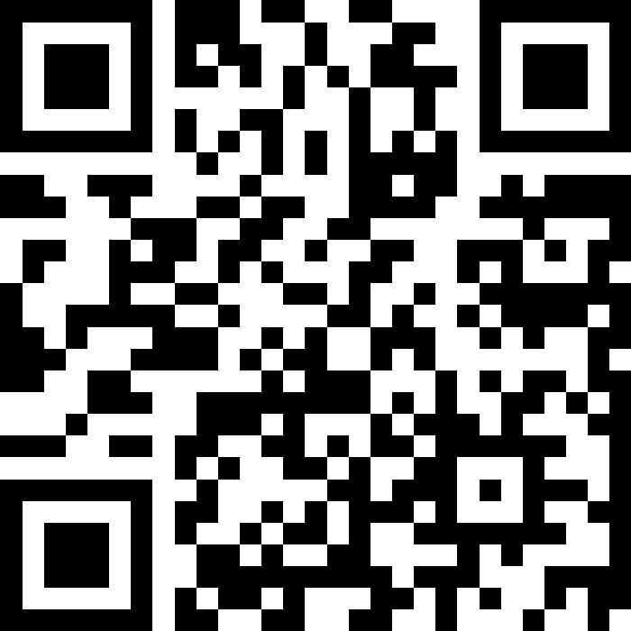

<!-- _class: seat -->

今日は座席指定あり

## <strong>小テストの関係</strong>で、<strong>今日持っている</strong>端末で座席指定します

入口

黒板

入口

mac

左奥から 座る

Windows

教室中央寄りから座る

※mac／それ以外の人で座れない場合、 Windowsの集団の左や右の近い側へ

それ以外

mac/Windowsでない or インストール不可だった

右奥から座る

ChromeOS Linux iPad/iPhone

適切な場所に座って下さい ／ Moodleのパスワードを覚えておくこと

<!-- 入室時の最初の指示スライド。小テスト（記名）の関係で、持参端末（mac/Windows/それ以外）で座席を分ける。図の通りに座らせ、Moodleのパスワードを思い出させておく。 -->

---

<!-- _class: cover-hero -->

情報リテラシ 第10回 ／ 対面

情報倫理と セキュリティ

23 & 24クラス （医工学 ／ 都市環境システム ／ 応用化学）

担当：千葉大学 国際未来教育基幹 田川 翔（専門：高等教育論・地球惑星科学） 2026-06-16（火4）

<!-- 対面回。第8回(ネットワーク)・第9回(応用)に続く最終対面。前半=他者の権利を守る「倫理」、後半=自分の身を守る「認証・セキュリティ」。スマホを使う活動が多いので、最初の数分でSlido接続を全員に試させる。 -->

---

<!-- _class: split -->

今日の進め方

## 今日の90分の設計 ── 倫理 → テスト → 守る

<table class="dtbl" style="width:130%; font-size:21px; line-height:1.45">
<tr><th>時間</th><th>内容</th></tr>
<tr><td class="mono">0–8</td><td class="l">導入・Slido接続（安全の約束・あるある投票）</td></tr>
<tr><td class="mono">8–38</td><td class="l"><strong>第1部 情報倫理</strong> 中傷／プライバシー／広告／著作権／炎上</td></tr>
<tr><td class="mono">38–53</td><td class="l">小テスト（第8回・記名）</td></tr>
<tr><td class="mono">53–73</td><td class="l"><strong>第2部 認証＝本人確認</strong> パスワード／フィッシング／2要素認証</td></tr>
<tr><td class="mono">73–75</td><td class="l">まとめ・今夜やること</td></tr>
<tr><td class="mono">予備</td><td class="l">認証の図解・体験クイズ</td></tr>
</table>

📱 今日はみんなに参加してもらいます

- Slido で匿名投票・経験シェア（このQR・リンクはずっと表示）
- スマホが無い／繋がらない人は隣と1台でOK

📊 Slido に接続

<a href="https://app.sli.do/event/2XGYyUkwv7QvrNfVSVS7qa" style="color:#23527a; text-decoration:underline;">app.sli.do/event/2XGYyUkwv7QvrNfVSVS7qa</a>

QRを読む or 上のURLへ

まず練習。Slidoに繋いで、最初の投票に答えよう。

前半は「他人を傷つけない」、後半は「自分を守る」。テストは真ん中で実施予定。

<!-- 全体地図。小テストは中盤（第1部・倫理が終わった区切りで実施）。QRは入室時から最後まで右隅に常時表示。回答は7割で締めて結果を一気に開くと盛り上がる。 -->

---

<!-- _class: split -->

あなたはどう？

## いままで「ヒヤッ」とした経験は？

あてはまるもの、ぜんぶ選んで（匿名・複数OK）

- 迷惑メール・SMSが届いた
- そのリンクを開いた
- フィッシングに騙されかけた／入力しかけた
- パスワードを使い回している
- 乗っ取り・不正ログイン通知が来た
- ワンクリック／架空請求の画面が出た
- SNSの炎上・トラブルを間近で見た
- ウイルスに感染した。
- ── どれも経験なし

状況 「“被害ゼロ”はむしろ少数派？」。

いちばん多かった経験、心当たりある人？

<!-- 90秒で全員参加。複数選択で「自分も」が連鎖し当事者意識が立ち上がる。「どれも経験なし」を必ず入れ未経験者を疎外しない。割合のみ表示。最多項目を宣言して構成に接続。 -->

---

いまの社会

## 私たちの生活は「ネットの社会」にいる

大学・家庭

- Moodle・学生ポータル・図書館
- e-ラーニング・反転授業・VR／メタバース教育
- スマホ／IP電話／ビデオ会議
- ネット通販・ネットバンキング・電子マネー
- SNS・ライブ配信

職場・行政

- POS・オフィス／工場の自動化
- 在宅勤務（SOHO）
- 電子政府・マイナンバー
- マイナ保険証

クラウド任せ

- 写真・文書はクラウド保存が当たり前
- でも突然消える／漏れることも
- 重要データはバックアップ

便利さの裏に、今日学ぶ「倫理（他人を傷つけない）」と「セキュリティ（自分を守る）」が全部ぶら下がっている。

情報倫理が重要になる。

<!-- 範囲A(社会で使われる情報技術)を独立章にせず1枚で圧縮。あるある投票の「クラウド依存」を受けて、便利さ→裏側へ橋渡し。マイナ保険証は身近な「デジタル化×個人情報」の例として軽く。 -->

---

<!-- _class: divider -->

PART 1 ／ 情報倫理

# 第1部　情報倫理

## 他人の権利を傷つけない ── 中傷・プライバシー・著作権

<!-- 前半は「他者の権利」。匿名性が倫理を抜けさせやすいこと、そして2025-2026に法律が大きく動いたことを軸に。 -->

---

<!-- _class: split -->

2つの「リテラシ」

## 情報リテラシ と 情報倫理 は別もの

情報リテラシ＝活用する力

情報機器やネットワークを使いこなす基本的な能力。

情報倫理＝守るべきモラル

情報社会で必要な道徳・モラル。 ① 誹謗中傷をしない  ② プライバシーを侵さない  ③ 著作権を侵さない

ネットの匿名性は、倫理観を抜けさせやすい。 「画面の向こうにも人がいる」。

「使える」だけでは足りない。<strong>使い方の作法</strong>を、一人ひとりが自覚して行動する。

リテラシ（使う力）＋ 倫理（傷つけない作法）＝ 両方必要。

<!-- 定義の対比。原版スライド9の核。匿名性ゆえに倫理が抜けやすい→各自の自覚、という流れで第1部全体の前提を置く。 -->

---

<!-- _class: split -->

中傷と法律

## 軽い1行が罪になる ── 侮辱罪・名誉毀損

法的に“アウト”になりうるのはどれ？（複数OK）まず1人→隣と1分

<table class="dtbl" style="width:100%; font-size:18px; line-height:1.3">
<tr><th>　</th><th>投稿</th></tr>
<tr><td class="red">A</td><td class="l">この店、二度と行かない。最悪</td></tr>
<tr><td class="red">B</td><td class="l">店長◯◯は客をだます詐欺師だ</td></tr>
<tr><td class="red">C</td><td class="l">◯◯（個人名）はキモいから消えろ</td></tr>
<tr><td class="red">D</td><td class="l">△△の意見には賛成できない</td></tr>
</table>

A・D＝感想・意見は原則セーフ。 B・C＝特定個人への摘示・侮辱がアウト。

侮辱罪（刑法231条）

事実を示さず公然と人を侮辱。 2022.7.7厳罰化：拘留・科料 → 1年以下の拘禁刑／30万円以下の罰金、時効1年→3年。

名誉毀損罪（刑法230条）

事実を示して評価を下げる。3年以下の拘禁刑／50万円以下の罰金。

※2025.6.1〜「懲役・禁錮」は拘禁刑に一本化（刑法制定以来初）。

「みんな言ってる」「1リプだけ」でも当事者。前科になりうる。

<!-- 原版スライド9-10を2026年版に更新。Slido線引きクイズ→法令へ。拘禁刑への一本化(2025.6.1)は原版に無い重要更新。B・Cが集まり、Aを誤ってアウト視しがち。 -->

---

<!-- _class: split -->

中傷への対処

## 「消して」「誰が書いた？」が、法で動くようになった

<svg viewBox="0 0 460 300" width="100%" style="max-height:300px">
  <defs><marker id="ar1" markerWidth="9" markerHeight="9" refX="6" refY="3" orient="auto"><path d="M0,0 L7,3 L0,6 Z" fill="#A6192E"/></marker></defs>
  <g font-size="15" text-anchor="middle">
    <rect class="card" x="20" y="30" width="130" height="56" rx="9" fill="#FDECEC" stroke="#A6192E" stroke-width="2.5"/><text x="85" y="54" font-weight="700" fill="#7d1322">中傷の投稿</text><text x="85" y="74" fill="#555" font-size="13">被害が発生</text>
    <path d="M150,58 L195,58" stroke="#A6192E" stroke-width="2.5" marker-end="url(#ar1)"/>
    <rect class="card" x="198" y="22" width="150" height="72" rx="9" fill="#fff" stroke="#3E78B2" stroke-width="2"/><text x="273" y="46" font-weight="700">大手SNS事業者</text><text x="273" y="66" fill="#555" font-size="13">Google / LINEヤフー</text><text x="273" y="82" fill="#555" font-size="13">Meta / TikTok 等</text>
    <path d="M273,94 L273,140" stroke="#3C8A57" stroke-width="2.5" marker-end="url(#ar1)"/>
    <rect class="card" x="150" y="144" width="250" height="50" rx="9" fill="#eef7ef" stroke="#3C8A57" stroke-width="2"/><text x="275" y="166" font-weight="700" fill="#2d6a44">削除対応の迅速化・運用の透明化</text><text x="275" y="184" fill="#555" font-size="13">情プラ法で「義務」に（2025.4施行）</text>
    <path d="M85,86 L85,218" stroke="#A6192E" stroke-width="2.5" marker-end="url(#ar1)"/>
    <rect class="card" x="18" y="222" width="200" height="56" rx="9" fill="#FDECEC" stroke="#A6192E" stroke-width="2"/><text x="118" y="246" font-weight="700" fill="#7d1322">発信者情報開示命令</text><text x="118" y="266" fill="#555" font-size="13">「誰が書いたか」を特定できる</text>
  </g>
</svg>

情プラ法（2025.4.1施行）

旧「プロバイダ責任制限法」を改称・強化。大手SNSに削除の迅速化・運用の透明化を義務付け。 正式名：情報流通プラットフォーム対処法

発信者情報開示命令

被害者は手続きで投稿者を特定できる。「匿名だからバレない」は通用しない。

悪質な書きこみは犯罪

爆破予告などの犯行予告＝業務妨害罪などで逮捕。匿名で書いても通信記録から端末を特定。「軽い気持ち」の1投稿が前科に。

匿名でも特定される。中傷も犯行予告も「消す・特定する」が動く。

<!-- 2026年の最重要アップデート。原版は「プロバイダ責任制限法」だが、2025.4.1に情プラ法へ改称・強化。発信者情報開示命令(2022新設)とセットで「匿名でも特定される」を伝える。 -->

---

<!-- _class: split -->

プライバシー

## バラバラの情報が「組み合わさって」個人を指す

写真をドロップ → 地図に撮影地点ピン onlineexifviewer.com（教員PCで・先生の無害なサンプル写真）

なぜ場所が割れる？

写真にはEXIF（ジオタグ）＝GPS座標・日時・機種が埋め込まれる。文字情報ゼロの1枚から、自宅・学校が特定される。

ネットに出してもいい順に並べて（上＝OK） ニックネーム／顔写真／本名／大学／位置情報／サークル

組み合わせると特定できる

- 大学＋サークル＋顔写真＝もう割れる
- 研究室HPの実名・写真は慎重に
- 私的SNSのニックネームを公的Webで使うと本名と紐づく

自分が写った集合写真、友だちが勝手に投稿…OK？

SNSで知り合った人と安易に会わない・個人情報を渡さない（プロフィール詐称もある）。

投稿前に「写ってる全員OK？」会う前に「相手は本物？」

<!-- 原版スライド11(参加と責任)＋目玉デモEXIF(wow10)。「個人情報の結合で特定される」の山場を実演が担う。Slidoランキングで顔写真の票割れ(SNS慣れ層と慎重層)を可視化。【安全】学生に自分の位置情報付き自撮りはアップさせない＝先生のサンプルでデモ。 -->

---

<!-- _class: split -->

追いかける広告

## 追いかけてくる広告の正体 ── Cookieと外部送信

<svg viewBox="0 0 460 250" width="100%" style="max-height:250px">
  <defs><marker id="ar2" markerWidth="9" markerHeight="9" refX="6" refY="3" orient="auto"><path d="M0,0 L7,3 L0,6 Z" fill="#D98A2B"/></marker></defs>
  <g font-size="15" text-anchor="middle">
    <rect class="card" x="20" y="30" width="120" height="60" rx="9" fill="#fff" stroke="#3E78B2" stroke-width="2"/><text x="80" y="54" font-weight="700">あるサイト</text><text x="80" y="74" fill="#555" font-size="13">商品を見る</text>
    <path d="M140,60 L185,60" stroke="#D98A2B" stroke-width="2.5" marker-end="url(#ar2)"/><text x="162" y="48" font-size="12" fill="#a86b1e">閲覧履歴</text>
    <rect class="card" x="188" y="26" width="130" height="68" rx="9" fill="#FCE3C7" stroke="#D98A2B" stroke-width="2.5"/><text x="253" y="50" font-weight="700" fill="#8a5a14">広告会社</text><text x="253" y="70" fill="#555" font-size="13">あなたを記憶</text><text x="253" y="86" fill="#555" font-size="12">（Cookie）</text>
    <path d="M318,60 L363,60" stroke="#D98A2B" stroke-width="2.5" marker-end="url(#ar2)"/>
    <rect class="card" x="340" y="30" width="110" height="60" rx="9" fill="#fff" stroke="#6B6F76" stroke-width="2"/><text x="395" y="54" font-weight="700">別サイト</text><text x="395" y="74" fill="#A6192E" font-size="13">同じ広告が表示</text>
    <rect class="card" x="120" y="150" width="260" height="64" rx="10" fill="#F8E5EA" stroke="#A6192E" stroke-width="2"/><text x="250" y="176" font-weight="800" font-size="16" fill="#7d1322">Cookie＝「同じ人」を覚える合言葉</text><text x="250" y="200" fill="#555" font-size="14">閲覧履歴が外部に送られ、追ってくる</text>
  </g>
</svg>

Cookie同意バナー、いつもどうしてる？ A:読んで選ぶ／B:とりあえず全部同意／C:拒否や×を探す／D:気にしない

外部送信規律（電気通信事業法・2023.6.16）

Cookieや閲覧履歴を外部に送る時、内容・送信先・目的を通知または公表する義務。 ※EUと違い「事前同意（オプトイン）必須」ではない。

「すべて同意」が目立ち「拒否」が探しにくい＝ダークパターン。押す前に一拍。

広告などで、追われている以上の危険(クラックもあり得る)。

<!-- 原版★重点。同意疲れ(consent fatigue)を言語化し、外部送信規律を正しく「通知・公表義務」と伝える(同意必須ではない)。挙手で「直前に見た商品が別サイト広告で追ってきた経験」→正体がこれ→後半=身を守る話へ折り返す。 -->

---

<!-- _class: split -->

著作権

## 著作物は「勝手にコピー・配布」しない

著作権の侵害（アウト）はどれ？（複数OK） A:CDをコピーして友だちに配る／B:海賊版サイトで映画を見る・落とす／C:出典を示して本の一文を引用／D:不正に入手したソフトを使う

著作権侵害＝不正コピー

- 海賊版サイトでの視聴・ダウンロード（違法）
- 音楽・動画・マンガの無断アップロード／コピー配布
- ソフトの不正コピー・不正利用 → 多額の損害賠償

正しく「引用」するなら（著作権法32・48条）

① 引用は「従」（自分の文が主） ② 正当な範囲・本文と明瞭に区別 ③ 出所明示

<strong>DRM＝コピー制限のしくみ</strong>：放送＝ダビング10・CPRM、配信＝Widevine等。コピーガードを外すのも違法。

生成AIと著作権

AIの学習・生成物の扱いは文化庁が整理（2024）。使う素材の権利は自分で確認。

見る・使うはOK、勝手に「コピー・配布」はNG。引用は出所明示。

<!-- 原版スライド13-14(著作と利用・DRM)＋生成AI時代の論点。Slidoの“絶対アウト”でCに票が割れる(「バレなきゃいい」)→丸写しは不正と確認。DRMは軽く触れて詳細は発展へ。 -->

---

<!-- _class: split -->

炎上のしくみ

## 消したつもりは、消えていない

<svg viewBox="0 0 440 280" width="100%" style="max-height:280px">
  <defs><marker id="ar3" markerWidth="8" markerHeight="8" refX="5" refY="3" orient="auto"><path d="M0,0 L6,3 L0,6 Z" fill="#999"/></marker></defs>
  <g font-size="14" text-anchor="middle">
    <circle class="card" cx="70" cy="60" r="34" fill="#fff" stroke="#3E78B2" stroke-width="2.5"/><text x="70" y="56" font-weight="700" font-size="13">あなた</text><text x="70" y="74" fill="#555" font-size="12">50人</text>
    <line x1="104" y1="55" x2="150" y2="35" stroke="#999" stroke-width="1.5" marker-end="url(#ar3)"/>
    <line x1="104" y1="62" x2="150" y2="80" stroke="#999" stroke-width="1.5" marker-end="url(#ar3)"/>
    <line x1="104" y1="70" x2="150" y2="125" stroke="#999" stroke-width="1.5" marker-end="url(#ar3)"/>
    <circle cx="172" cy="32" r="16" fill="#FCE3C7" stroke="#D98A2B" stroke-width="1.8"/><text x="172" y="37" font-size="12">RP</text>
    <circle cx="172" cy="82" r="16" fill="#FCE3C7" stroke="#D98A2B" stroke-width="1.8"/><text x="172" y="87" font-size="12">RP</text>
    <circle cx="172" cy="130" r="16" fill="#FCE3C7" stroke="#D98A2B" stroke-width="1.8"/><text x="172" y="135" font-size="12">RP</text>
    <line x1="188" y1="32" x2="230" y2="24" stroke="#999" stroke-width="1.2" marker-end="url(#ar3)"/>
    <line x1="188" y1="82" x2="230" y2="70" stroke="#999" stroke-width="1.2" marker-end="url(#ar3)"/>
    <line x1="188" y1="130" x2="230" y2="150" stroke="#999" stroke-width="1.2" marker-end="url(#ar3)"/>
    <ellipse class="card" cx="300" cy="90" rx="90" ry="46" fill="#F8E5EA" stroke="#A6192E" stroke-width="2.5"/><text x="300" y="84" font-weight="800" font-size="18" fill="#7d1322">数万人へ</text><text x="300" y="108" fill="#555" font-size="13">上限は理論上「全世界」</text>
    <rect class="card" x="120" y="200" width="280" height="58" rx="10" fill="#fff" stroke="#6B6F76" stroke-width="2"/><text x="260" y="224" font-weight="700" font-size="15">スクショで永久保存</text><text x="260" y="244" fill="#A6192E" font-size="13">削除・鍵アカも無関係に残る＝デジタルタトゥー</text>
  </g>
</svg>

炎上とは／忘れられる権利

炎上＝批判・誹謗中傷が殺到し収拾がつかない状態。デジタルタトゥーとして残り、忘れられる権利（検索結果の削除）が議論されている。

SNSの心得

- 誤解を招かない十分な情報を添える
- 私的なやりとりの暴露はNG／映え目的の立入禁止での撮影もNG
- スクショは“証拠”に見えて切り取りのバイアス

予想→拡散の図→<strong>もう一度投票</strong>（Dが増える＝理解の可視化）。

投稿前に「炎上しない？」「プライバシーは大丈夫？」

<!-- 原版スライド15(SNSの心得)。予想→検証で「自分のフォロワーまででしょ」を裏切る。デジタルタトゥー＋情プラ法で「消す・特定する」が法制化された現在地を示す。 -->

---

<!-- _class: split -->

なりすまし

## その「顔写真」、本物とは限らない時代

2枚の顔「どっちが本物？」を当てる <a class="u" href="https://whichfaceisreal.com/" style="text-decoration:underline;">whichfaceisreal.com</a>（教員PC投影＋挙手 or Slido投票） University of Washington のプロジェクト（Calling Bullshit／J. West・C. Bergstrom）

やり方

- 2枚を見せて「左が本物？右が本物？」で投票
- 割れたところで正解開示を3〜4問
- 見分け：背景の歪み・耳/イヤリングの非対称・髪の溶け込み

人間の正答率は約48％＝ほぼ偶然並み。 「見た＝本物」の直感は、もう崩れている。

だから注意

- なりすましアカウントのプロフィール画像
- SNSの著名人なりすまし投資広告
- AI生成のフェイク画像・動画

「写真があるから本当」ではない。<strong>出どころ</strong>を確かめる。

顔も声も作れる時代。情報は「内容」でなく「出どころ」で確かめる。

<!-- 目玉デモ(wow9)。ディープフェイク・なりすまし・ファクトチェックの導入。学生自身や身近な人の顔写真は使わせない（匿名データセットのサイトのみ）。第1部のオチとして「出どころ確認」を置き、第2部「本人確認＝認証」へ橋渡し。 -->

---

<!-- _class: split -->

うその情報

## デマ・フェイクニュースに飲まれない

なぜ広がる？

- デマ＝意図的に流される偽情報・うわさ
- フェイクニュース＝本物そっくりの偽ニュース
- SNSは発信も拡散も簡単＝うのみにしがち
- 災害時に特に増える（大震災・コロナ・地震）

飲まれないために

- 情報源を確認（誰が・いつ・一次情報か）
- クロスチェック（ファクトチェック）＝複数の情報源で確かめる
- 「みんなに転送して」＝チェーンメールは止める（迷惑広告＝スパムメールも開かず削除）

災害時は特に増える

東日本大震災(2011)・熊本地震(2016)・コロナ(2020)・能登半島地震(2024)…不安につけ込むデマが流れた。冷静に。

「友だちから来た」「拡散されている」＝本当、ではない。

出どころを確かめてから、信じる・広める。ここでも一拍。

<!-- 教科書 B 迷惑な情報（デマ・チェーンメール）。前の「なりすまし（顔フェイク）」から「情報全般のフェイク」へ。災害とデマのコラムも口頭で。第1部の締め＝メディアリテラシー。 -->

---

<!-- _class: split -->

ここで小テスト

## 第1部はここまで。15分、第8回（ネットワーク）の小テスト

範囲・形式

- 範囲は第8回だけ（TCP/IP・IPアドレス・DNS・暗号・Wi-Fi 等）
- オンデマンド回の理解確認＋期末の練習
- 記名・個人で・15分
- 提出は Moodle（または配布のマークシート）

終わった人から見直し。回収後、後半「自分を守る」へ入ります。

心がまえ

- 用語の丸暗記でなく「URL→表示の旅」で思い出す
- 分からない問題は飛ばして先へ
- スマホ・資料はclosed（本物の力試し）

この小テストが成績。 Slidoクイズは「遊び」で成績無関係。

<!-- 第1部(倫理)が終わった区切りで実施＝授業の中盤。小テスト本体はMoodle/マークシートで配布（問題と解答は本デック末尾の教員用付録に8問用意）。第8回はオンデマンドだったので、対面のこの回で定着を確認する。回収後すぐ第2部(認証)へ。 -->

---

<!-- _class: split -->

小テストの実施

## ワーク①：周囲とSafe Exam Browserの起動を確認する（3分）

Safe Exam Browser を入手・起動

- 配布元：safeexambrowser.org →「Download」
- 対応：Windows / macOS（最新版）
- Moodle・ILIAS 連携の試験専用ブラウザ
- すでに入っている人は起動できるかだけ確認

未インストールの人は今すぐDL＝この3分で起動まで。

Moodle のログインが必要

- ID／PWはアルファベット4文字・数字4文字
- 5分でインストール＋ログインまで
- 困ったら横の人に聞く

入口

黒板

入口

<b style="font-size:18px;">mac</b> 左奥

<b style="font-size:18px;">Windows</b> 中央寄り

<b style="font-size:16px;">それ以外</b> 右奥 ChromeOS／Linux iPad／iPhone

起動できない人 → 教室右（緑）へ移動

横の人と起動テストを完了する／無理な場合は教室右（緑）へ移動

<!-- ワーク①＝全員のSEB起動確認に5分。未インストール者はその場でDL。起動不可（ChromeOS/Linux/iPad等）の人は緑ゾーン＝紙受験へ誘導。Moodleのログイン情報（英4桁・数4桁）を先に思い出させておく。 -->

---

小テストの実施

時間は10分で10問（＋2分 予備） 12分たったら、受験が完了します。

まず、<strong>PCの人</strong>に自分が問題を解放します。

次に、<strong>紙受験の人</strong>に配ります （なので、少しだけ、<strong>紙受験の方が短く</strong>なります。）

※回収は、配り始めた側から行います。

<strong>注意：</strong>カンニング・持ち込み・横を覗く・スマホを見る等は禁止。 不正行為を認定の場合は、それなりの対応がなされます…。

それでは開始（〜xx:xx）／完了後：回収されていない人を確認

<!-- 実施手順の確定スライド。PC受験＝Moodleで問題を「解放」した瞬間に開始、紙受験はその後に配布するので数十秒短い。回収は配布開始側から。タイマーは黒板に板書（xx:xx）。終了後、未回収・未提出が無いか挙手で確認してから第2部へ。 -->

---

<!-- _class: split -->

期末試験について

## 期末も Safe Exam Browser で実施 ── 当日の集合場所

✅ Safe Exam Browser が使える人

- この教室に集合
- 今日と同じ Safe Exam Browser で受験

⚠️ 使えない人（インストール不可など）

- G1-情報処理演習室1 に集合
- 備え付けPCで受験

当日の流れ

1. まず全員で期末試験を受ける
2. 終わったらこの教室に集合
3. みんなで解説を見る

SEBが使えるか、今日のうちに確認しておく。

SEB可＝この教室／不可＝G1-情報処理演習室1。試験のあと本教室で解説。

<!-- 期末の事務連絡。今日の小テストと同じSafe Exam Browserを期末でも使うため、当日はSEB可＝本教室／不可＝G1-情報処理演習室1に分かれて受験。受験後は全員この教室に集合して解説。SEBが入るかを今日のうちに各自確認させる。 -->

---

<!-- _class: divider -->

PART 2 ／ セキュリティ

# 第2部　情報セキュリティ

## ここからは「自分を守る」── パスワード・フィッシング・2要素認証

<!-- 後半は「自分の身を守る」。第1部の「出どころを確かめる」から「あなたを“あなた”と確かめる＝認証」へ自然に接続。 -->

---

<!-- _class: split -->

情報セキュリティとは

## 「安全に・正当に使える状態」を守ること

定義

悪意ある行為（不正アクセス・ネット詐欺・データ破壊）や事故から、個人情報・データ・コンピュータシステムを守り、安全かつ正当に使える状態を維持すること。

便利さの裏には、必ず「守る」がある。

いくつもの「性質」がある

どれが失われても「安全」とはいえない。とくに重要な3要素（CIA）＝ 機密性・完全性・可用性

この3要素＋さらに4つ、計7つの性質を次の表で確認。

まず「何を・どんな性質で守るか」を押さえる。

<!-- 教科書 D-a 情報セキュリティとは。第8回(ネットワーク・暗号)の続きとして、守る対象と性質を定義する。次スライドの表7で7性質を一覧。 -->

---

<!-- _class: fig -->

情報セキュリティの性質

## 表7　情報セキュリティの7つの性質

<table class="dtbl" style="width:94%; font-size:20px; line-height:1.4">
<tr><th style="width:24%">性質</th><th>意味</th></tr>
<tr><td class="l">機密性</td><td class="l">許可された人だけが情報にアクセスできる</td></tr>
<tr><td class="l">完全性</td><td class="l">情報が破壊・改ざんされていない</td></tr>
<tr><td class="l">可用性</td><td class="l">使いたいときにいつでも使える</td></tr>
<tr><td class="l">真正性</td><td class="l">情報やユーザが本物だと確認できる ＝ <strong>今日の後半「認証」</strong></td></tr>
<tr><td class="l">責任追跡性</td><td class="l">何が起きたかを後から追跡できる</td></tr>
<tr><td class="l">信頼性</td><td class="l">想定したとおりの結果が得られる</td></tr>
<tr><td class="l">否認防止</td><td class="l">後になって否認されないよう証明できる</td></tr>
</table>

機密性・完全性・可用性＝3要素（CIA）。真正性＝本人確認が今日の核。

<!-- 教科書 表7。CIA三要素を赤で強調。真正性＝第2部「認証」につながる。責任追跡性=ログ、否認防止=署名。3要素はどれが欠けても安全でない、を口頭で。 -->

---

<!-- _class: split -->

脅かすもの

## 悪意あるプログラム＝マルウェア

マルウェアの種類

- ウイルス：他のプログラムに寄生して増える
- トロイの木馬：便利を装って侵入
- ワーム：単体で自己増殖し広がる
- スパイウェア：気づかぬうちに情報を盗む
- ランサムウェア：データを人質に身代金要求

経済産業省の「ウイルス」定義（次の1つ以上をもつ）

- ①自己伝染：自分を他のプログラムへコピーして広がる
- ②潜伏：しばらく症状を出さず潜む
- ③発病：破壊・意図しない動作をする

<strong>どこから感染？</strong>　不審メールの添付・リンク／偽サイト・偽ソフト／USB（スマホも感染）

サーバを止めるDoS／DDoS攻撃、IDを盗む不正アクセスも。

開く前に一拍。OS・アプリの更新とウイルス対策ソフトで防ぐ。

<!-- 教科書 b 情報セキュリティを脅かすさまざまな問題。経産省のウイルス定義＝自己伝染・潜伏・発病の3機能。ランサムウェアは身代金を払っても復元保証なし。対策は次の認証・守る技術へ。 -->

---

<!-- _class: split -->

実例：ランサムウェア

## 工場が止まった ── アサヒビールへの攻撃（2025年）

何が起きた？

- 2025年9月29日、アサヒグループHD（ビール大手）がランサムウェア攻撃
- 受注・出荷システムが全面停止、約30工場が一時停止
- 手作業対応が続き、完全復旧は2026年2月

攻撃と教訓

- ロシア系グループ「Qilin」が犯行声明・内部文書を公開し身代金要求 → アサヒは支払い拒否
- 個人情報 約11万件が流出
- 身代金を払っても、復元も流出停止も保証なし

大企業でも「モノが届かない」社会的被害に。バックアップ・更新・備えが効く。

ランサムウェアは他人事でない。止まると、商品も生活も止まる。

<!-- 出典：2025年アサヒグループHDサイバー攻撃（Wikipedia／各報道）。2025/9/29システム障害→10/3ランサムウェアと判明、Qilinが犯行声明・身代金要求、アサヒは支払い拒否。受注システム停止で手作業、約30工場停止、個人情報約11万件流出、完全復旧2026/2。身近で最近・大規模＝当事者意識を高める実例。 -->

---

<!-- _class: fig -->

守る技術

## パスワード以外の「守る道具」

<table class="dtbl" style="width:96%; font-size:20px; line-height:1.5">
<tr><th style="width:32%">守る道具</th><th>はたらき</th></tr>
<tr><td class="l">更新（パッチ）</td><td class="l">ソフトのぜい弱性を最新版でふさぐ。最強の基本</td></tr>
<tr><td class="l">ウイルス対策ソフト</td><td class="l">パターンファイルを最新に保ち検知・駆除</td></tr>
<tr><td class="l">ファイアウォール</td><td class="l">ネットの出入口で不正アクセスを遮断</td></tr>
<tr><td class="l">アクセス制御</td><td class="l">権限のある人だけ。SNSの公開範囲もこれ</td></tr>
<tr><td class="l">フィルタリング</td><td class="l">有害サイトを制限（ブラック／ホワイトリスト）</td></tr>
<tr><td class="l">情報セキュリティポリシー</td><td class="l">組織のルール＝基本方針→対策基準→実施手順</td></tr>
</table>

いちばん効くのは「更新」。穴をふさぎ続けることが基本。

<!-- 教科書 E-d〜g、C 情報セキュリティポリシー。「今夜やること（更新・2要素認証ON）」とつながる。偽のウイルス対策ソフト＝スケアウェアにも注意。 -->

---

<!-- _class: split -->

パスワード

## パスワード＝合言葉。盗む手口は4つ

パスワードはダイヤル錠と同じ

- 工場出荷時のまま＝最初から開いている
- 覚えやすい番号（誕生日）＝推測される
- メモを貼る＝鍵の在りかを教えている

便利さと安全はトレードオフ。<strong>「覚えやすい」は「破られやすい」</strong>。

パスワードを盗む4つの手口

1. 推測・辞書攻撃（よくある語を片端から）
2. ソーシャルエンジニアリング（人をだます）
3. スニッフィング（通信盗聴・画面/メモリ覗き見）
4. フィッシング（偽ログイン画面に入力させる）

③と④は別もの。盗聴（スニッフィング）と偽サイト誘導（フィッシング）を混同しない。

「銀行員でも暗証番号は聞きません」── 人もだまされる。

<!-- 原版スライド17-18。ダイヤル錠の比喩(原版踏襲)。重要な正確性ルール：スニッフィング≠フィッシングを並列の別手口として書く（原版の分類どおり）。次スライドでフィッシングを体験させる。 -->

---

<!-- _class: split -->

フィッシング体験

## 本物？ 偽物？ ── 自分の目を試す

メールが本物か偽物かを見分けるクイズ phishingquiz.withgoogle.com（ログイン不要・QR配布）

進め方

1. 名前・メールはダミーで（例 test@example.com）
2. 最初の1〜2問はみんなで投票
3. 送信元・URL・ボタンの飛び先を矢印で種明かし
4. 残りは各自→「何問正解？」を挙手

サポート詐欺も体験（IPA公式）

偽の警告画面（全画面・ビープ音）→ ESC長押しで閉じる。 ipa.go.jp/security/anshin/…/fakealert.html

「電話して」と焦らせるのが手口。本物のOS/メーカーは警告画面に電話番号を出さない。

生成AIで“自然な日本語”の偽メールが量産される今、<strong>「日本語が変だから偽物」はもう通用しない</strong>。

見分け力は過信しがち。だから「2要素認証」で多重に守る（次へ）。

<!-- ★看板1：フィッシング体験。Jigsawクイズ(実在・ログイン不要)＋IPA偽警告(日本語公式・約2分自動終了・PC専用)。当日朝に言語切替の実機確認。「正規だと思ったのに偽物」で驚き→認証の多重化へ。【安全】入力欄に本物の名前・メール・パスワードは入れない／本番メールのリンクは踏まない。 -->

---

<!-- _class: split -->

だます手口

## 技術でなく「人」をだます ── ソーシャルエンジニアリング

人のスキを突く

- ショルダーハッキング：肩越しにのぞき見
- トラッシング：ゴミから情報をあさる
- ピギーバック：関係者を装い共連れで侵入
- なりすまし電話：本人を装い聞き出す
- スケアウェア：偽警告で焦らせる

お金をねらう詐欺

- 架空請求・ワンクリック詐欺：身に覚えない請求
- フィッシング：偽サイトで入力させる
- スキミング：カードの磁気情報を盗み読む

対策＝のぞかせない・捨てる前に処理・あわてて電話しない。安全な取引はエスクロー。

技術の壁より「人のスキ」が狙われる。あわてず確認。

<!-- 教科書 F-c ソーシャルエンジニアリング 表10、F-a 架空請求/ワンクリック詐欺、F-d スキミング。授業冒頭のフィッシング体験・IPA偽警告(＝スケアウェア)とつながる。 -->

---

<!-- _class: split -->

強いパスワード

## 複雑さより「長さ」── そして使い回さない

<table class="dtbl" style="width:100%; font-size:18px">
<tr><th>例</th><th>解読時間の目安</th></tr>
<tr><td class="mono l">password</td><td class="red">数秒</td></tr>
<tr><td class="mono l">P@ssw0rd</td><td>数時間</td></tr>
<tr><td class="mono l">correct-horse-…</td><td class="hl-green">数兆年</td></tr>
</table>

この“破られやすさ”を、次の体験ワークで実際に手で確かめます。

推測しにくいパスワードの作り方

- 文字種を多く＋10文字以上（長さが効く）
- コアパスワード＝日本語フレーズを変換 「リンゴが好き」→ ringogasuki
- サービスごとに識別子を付加 A銀行→ ringogasukiA-GIN

漏れたID・パスワードはダークウェブの裏市場で名簿として売買され、他サイトに自動で試される（＝パスワードリスト攻撃／クレデンシャルスタッフィング）。だから使い回さない。

覚えるのは1個でいい ── パスワードマネージャーを活用。

<!-- 原版スライド19＋目玉デモ(解読時間,wow9)。前方投影だけで完結する保険デモ。「複雑な記号より長さ」を桁違いの数字で体感。コアパスワード＋サービス識別子はIPA読本。 -->

---

<!-- _class: split -->

体験ワーク（10分）

## ペアで体感 ── パスワードはこんなに簡単に破れる

総当たり（ブルートフォース）を体験 Colab／Moodle のノートブックを開く

ペアで役割を交代

- 入力者：指定フォーマットでダミーを入力（画面に出ない）
- 実行者：総当たりを実行し、破られる様子を見る

本物のパスワードは絶対に入力しない（練習用ダミーのみ）。

4段階で「強さの差」を体感

- ① 数字4桁 → 一瞬で破られる
- ② 英小文字6 → まだ危険
- ③ 英数字6 → やや安全
- ④ 英数字記号6 → 同じ長さでも桁違いに堅い

⑤「最後まで試すと何年？」を計算。長く・文字種を混ぜるが効く。

短い・単純は数秒で破れる。でも漏れる時は漏れる → だから2要素認証。

<!-- 10分のペアワーク。ノートブック password_bruteforce_workshop_3.ipynb をColab/Moodleで配布。入力者(getpassでダミー入力)→実行者(brute_force実行)→答え合わせ。①数字4桁②英小6③英数6④英数記号6⑤estimate_timeで所要年数。本物PW入力禁止。次の「認証の3要素＝2要素認証」へ：パスワードは破れる/漏れる→もう1つの壁(2FA)が要る、と接続。 -->

---

<!-- _class: fig -->

認証の3要素

## 「あなた」を確かめる3つの手がかり

① 知識（知っている）

パスワード・PIN・暗証番号 ○安く実装／✕漏れる・忘れる

② 所持（持っている）

スマホ・確認コード・トークン・ICカード ○複製が難しい／✕紛失リスク

③ 生体（その人自身）

指紋・顔(Face ID)・虹彩・声紋 ○持ち運び不要／✕本人拒否・偽造(リプレイ)

この異なる2つを組み合わせる＝2要素認証（2FA）。パスワードが漏れても、もう1つの壁で止まる。

知識＋所持＋生体。2つ重ねれば、安心が増える。

<!-- 原版スライド20-22(認証ファクタ・バイオメトリック)をgrid3で1枚に集約。生体の弱点(本人拒否・リプレイ攻撃)も明記。トークン/OTP/チャレンジレスポンスの図解は発展(予備)へ退避。 -->

---

<!-- _class: split -->

さまざまな認証

## パスワードだけじゃない「本人確認」

毎回変わる・固有のもの

- ワンタイムパスワード：1回きりで使い捨て
- マトリックス認証：表の指定位置の文字を入力
- デバイス認証：ICカード・端末そのもの
- メール認証：登録メールに届くコード

体・画像で

- バイオメトリクス認証：指紋・顔・虹彩
- 画像認証：画像を読み取って入力

多要素認証＝異なる種類を組合せ／二段階認証＝2つの段階で確認。

「知識＋所持＋生体」を組み合わせるほど、破られにくい。

<!-- 教科書 E-c さまざまな認証。多要素＝異なる種類、二段階＝種類を問わず2段階。本編の認証3要素・2要素認証、発展の認証図解(OTP/チャレンジレスポンス)の補完。 -->

---

<!-- _class: split -->

今夜やること

## 帰ったら、5分でできる最強の自衛

正直に。あなたのパスワード、当てはまるのは？（匿名・複数OK） A:使い回している／B:誕生日・名前入り／C:password等を使ったことがある／D:サービスごとに違う＆長い

匿名だから言うと、たぶんAがいちばん多い。気持ちは分かる、覚えられないから。

今夜の宿題（無料・5分）

1. 大学ポータルとSNSの2要素認証をON
2. 使い回しのパスワードを1つだけ直す （パスフレーズ＋サービス識別子）

パスワードマネージャーを使っている人？（使えば覚えるのは1個）

パスワード＝部屋の鍵。 初期値・使い回しは「鍵の在りか」を教えるのと同じ。

今夜、2要素認証をON。無料で・5分で・いますぐできる。

<!-- ★Slido(匿名必須)。「これは完全匿名」と毎回口頭保証。開票でAが圧倒→パスワードリスト攻撃→対策3点。第2問(今日使った認証)はSlidoでなく挙手で「指紋・顔を使った人？確認コードを使った人？」と振り分け、3要素・2FAの定義へ。 -->

---

<!-- _class: wrap -->

まとめ

## 今日の5つの判断ポイント

<ul>
<li>匿名でも当事者 ── 侮辱罪は厳罰化（拘禁刑・時効3年）、情プラ法＋開示命令で特定される</li>
<li>情報は組み合わさる ── 投稿前に「写ってる全員OK？」EXIFで場所も割れる</li>
<li>追跡される ── Cookieは外部送信（通知・公表）。押す前に一拍</li>
</ul>

<ul>
<li>AIは相棒で代筆屋でない ── 引用は従・出所明示、出どころを確かめる</li>
<li>消えない／守れる ── デジタルタトゥー、そして認証は2要素に</li>
</ul>

なぜ学ぶか
鍵マークとURLを見る・Fromを疑う・パスワードを使い回さない ── この3つだけで、多くの被害は防げる。今日から「押す前に一拍・出す前に一拍・送る前に一拍」。

<!-- 第1部(倫理)＋第2部(認証)を5点に圧縮。行動コミット(2FA ON)で終える。 -->

---

<!-- _class: qa -->

課題・次回

# おつかれさまでした

## 今日の「裏側」が見えると、毎日のネットが少し安全になる

<table class="dtbl" style="display:inline-table; margin:14px auto; font-size:22px; line-height:1.5;">
<tr><th>項目</th><th>内容</th><th>期限</th></tr>
<tr><td class="l">リフレクション</td><td class="l">分かったこと</td><td>Moodle ／ 6/30</td></tr>
<tr><td class="l">課題</td><td class="l">問題を回答</td><td>Moodle ／ 6/30</td></tr>
</table>

2要素認証をONに。セキュリティを確認。それが今日いちばんの宿題です。

<!-- 締め。宿題＝Moodleリフレクション＋2FA ON報告。次回が(2)＝認証の図解編なら口頭で予告。 -->

---

<!-- _class: split -->

お知らせ

## 千葉大学 セキュリティバグハンティングコンテスト 2026

どんなコンテスト？

- ウェブサイトのセキュリティホールを探す
- プログラミングに詳しくなくてもOK（初心者向け講習あり）
- 4名までのチーム（1名でも参加可）

今日学んだ「守る側」から、「探す側」を体験してみよう。

スケジュール

- 参加申込：〜7/28(火)
- ハンターライセンス講習会：7/30(木) 10:30–17:40（オンデマンド可・交付期限9/18）
- レポート提出：〜9/30(水)
- 審査：10/1〜11月上旬／表彰式：11月下旬

リンク

参考（2025年度）：jdp.chiba-u.jp/c-csirt/contest/ 関連授業：情報セキュリティ分析（入門）T2木5

興味があれば、ぜひ参加を。初心者・1人チームも歓迎。

<!-- 千葉大セキュリティバグハンティングコンテスト2026のお知らせ。おつかれの直後＝末尾に配置。今日の「守る側」の理解から「探す側（脆弱性を見つける）」体験へ誘導。詳細は c-csirt のコンテストサイト。申込〜7/28、講習会7/30(オンデマンド可)、レポート〜9/30。 -->

---

<!-- _class: fig -->

発展：認証の図解

## パスワードを「送らない」しくみ

<svg viewBox="0 0 940 300" width="100%" style="max-height:330px">
  <defs><marker id="arA" markerWidth="9" markerHeight="9" refX="6" refY="3" orient="auto"><path d="M0,0 L7,3 L0,6 Z" fill="#A6192E"/></marker></defs>
  <g font-size="14" text-anchor="middle">
    <rect class="card" x="20" y="20" width="290" height="260" rx="12" fill="#FDECEC" stroke="#A6192E" stroke-width="2"/><text x="165" y="44" font-weight="800" font-size="16" fill="#7d1322">① スニッフィング</text>
    <rect class="card" x="40" y="60" width="90" height="44" rx="7" fill="#fff" stroke="#3E78B2" stroke-width="1.8"/><text x="85" y="80" font-size="13">本人</text><text x="85" y="96" font-size="11" fill="#555">PW送信</text>
    <path d="M130,82 L200,82" stroke="#999" stroke-width="2" marker-end="url(#arA)"/>
    <rect class="card" x="200" y="60" width="90" height="44" rx="7" fill="#fff" stroke="#6B6F76" stroke-width="1.8"/><text x="245" y="84" font-size="13">サーバ</text>
    <rect class="card" x="120" y="140" width="100" height="44" rx="7" fill="#F8E5EA" stroke="#A6192E" stroke-width="2"/><text x="170" y="160" font-size="13" fill="#7d1322">攻撃者</text><text x="170" y="176" font-size="11" fill="#555">盗聴</text>
    <path d="M165,120 L168,138" stroke="#A6192E" stroke-width="1.8" marker-end="url(#arA)"/>
    <text x="165" y="220" font-size="13" fill="#A6192E" font-weight="700">同じPWで後から成り済まし</text><text x="165" y="244" font-size="12" fill="#555">＝固定パスワードの弱点</text>
    <rect class="card" x="325" y="20" width="290" height="260" rx="12" fill="#eef7ef" stroke="#3C8A57" stroke-width="2"/><text x="470" y="44" font-weight="800" font-size="16" fill="#2d6a44">② ワンタイムPW</text>
    <rect class="card" x="345" y="70" width="100" height="44" rx="7" fill="#fff" stroke="#3C8A57" stroke-width="1.8"/><text x="395" y="90" font-size="13">トークン</text><text x="395" y="106" font-size="11" fill="#555">毎回違う番号</text>
    <path d="M445,92 L525,92" stroke="#3C8A57" stroke-width="2" marker-end="url(#arA)"/>
    <rect class="card" x="525" y="70" width="80" height="44" rx="7" fill="#fff" stroke="#6B6F76" stroke-width="1.8"/><text x="565" y="94" font-size="13">サーバ</text>
    <text x="470" y="160" font-size="13" fill="#2d6a44" font-weight="700">盗まれても、次は別の番号</text><text x="470" y="184" font-size="12" fill="#555">＝1回きりなので無効</text>
    <rect class="card" x="400" y="205" width="140" height="40" rx="7" fill="#F8E5EA" stroke="#A6192E" stroke-width="1.5"/><text x="470" y="230" font-size="12" fill="#7d1322">攻撃者が再利用→失敗</text>
    <rect class="card" x="630" y="20" width="290" height="260" rx="12" fill="#eef4fa" stroke="#3E78B2" stroke-width="2"/><text x="775" y="44" font-weight="800" font-size="16" fill="#23527a">③ チャレンジレスポンス</text>
    <rect class="card" x="650" y="70" width="90" height="44" rx="7" fill="#fff" stroke="#3E78B2" stroke-width="1.8"/><text x="695" y="94" font-size="13">本人</text>
    <rect class="card" x="830" y="70" width="80" height="44" rx="7" fill="#fff" stroke="#6B6F76" stroke-width="1.8"/><text x="870" y="94" font-size="13">サーバ</text>
    <path d="M830,84 L742,84" stroke="#3E78B2" stroke-width="1.8" marker-end="url(#arA)"/><text x="786" y="78" font-size="11" fill="#23527a">お題</text>
    <path d="M742,104 L830,104" stroke="#3E78B2" stroke-width="1.8" marker-end="url(#arA)"/><text x="786" y="120" font-size="11" fill="#23527a">計算した答え</text>
    <text x="775" y="170" font-size="13" fill="#23527a" font-weight="700">PWそのものは送らない</text><text x="775" y="194" font-size="12" fill="#555">お題から計算した答えだけ送る</text>
  </g>
</svg>

固定PWは盗まれると弱い → 毎回変える・そもそも送らない、へ。

<!-- 原版スライド26-28(スニッフィング/ワンタイムPW/チャレンジレスポンス)の図解を1枚に。第2部「2要素認証」の自然な続き。次回(2)の本丸でもある。 -->

---

<!-- _class: divider -->

PART 3 ／ よりよいユーザー

# 第3部　よりよい"ユーザー"になる

## 守るだけで終わらない ── 困りごとに気づき、解決を考える

<!-- 第1部(倫理＝傷つけない)・第2部(セキュリティ＝守る)を受けて、最後は前向きに。受け身の利用者から、困りごとに気づき・良い問いを立て・解決を考えられる「よりよいユーザー」へ。ここはデザイン思考の入口を体験するディスカッション。時間が無ければS3の問いだけでもOK。 -->

---

デザイン思考

## 「使う人」から出発して、解決を磨く5ステップ

デザイン思考とは、つくる側の都合ではなく使う人の視点から出発し、観察・試作・検証をくり返して課題と解を磨く進め方。よいユーザー＝困りごとに気づける人ほど、よい問いを立てられる。

<svg viewBox="0 0 1180 220" style="width:100%; max-width:1060px; height:auto;" xmlns="http://www.w3.org/2000/svg" role="img" aria-label="デザイン思考の5ステップ">
  <g fill="none" stroke="#C2C9D6" stroke-width="4" stroke-linecap="round" stroke-linejoin="round">
    <path d="M231 54 l13 12 -13 12"/><path d="M481 54 l13 12 -13 12"/><path d="M731 54 l13 12 -13 12"/><path d="M981 54 l13 12 -13 12"/>
  </g>
  <circle cx="110" cy="66" r="44" fill="#E8467C"/>
  <path d="M110 88 C86 70 92 48 110 60 C128 48 134 70 110 88 Z" fill="#fff"/>
  <circle cx="140" cy="40" r="12" fill="#fff"/><text x="140" y="45" text-anchor="middle" font-size="15" font-weight="700" fill="#E8467C">1</text>
  <text x="110" y="142" text-anchor="middle" font-size="27" font-weight="800" fill="#E8467C">共感</text>
  <text x="110" y="164" text-anchor="middle" font-size="14" fill="#888">Empathize</text>
  <text x="110" y="190" text-anchor="middle" font-size="16" fill="#333">当事者を観察・理解</text>
  <circle cx="360" cy="66" r="44" fill="#0033A0"/>
  <circle cx="360" cy="66" r="20" fill="none" stroke="#fff" stroke-width="3"/><circle cx="360" cy="66" r="10" fill="none" stroke="#fff" stroke-width="3"/><circle cx="360" cy="66" r="3.5" fill="#fff"/>
  <circle cx="390" cy="40" r="12" fill="#fff"/><text x="390" y="45" text-anchor="middle" font-size="15" font-weight="700" fill="#0033A0">2</text>
  <text x="360" y="142" text-anchor="middle" font-size="27" font-weight="800" fill="#0033A0">定義</text>
  <text x="360" y="164" text-anchor="middle" font-size="14" fill="#888">Define</text>
  <text x="360" y="190" text-anchor="middle" font-size="16" fill="#333">本当の課題を定める</text>
  <circle cx="610" cy="66" r="44" fill="#F0A500"/>
  <circle cx="610" cy="60" r="15" fill="none" stroke="#fff" stroke-width="3"/><path d="M610 50 v12 M603 56 h14" stroke="#fff" stroke-width="2.5" stroke-linecap="round"/><rect x="603" y="78" width="14" height="7" rx="2" fill="#fff"/>
  <circle cx="640" cy="40" r="12" fill="#fff"/><text x="640" y="45" text-anchor="middle" font-size="15" font-weight="700" fill="#F0A500">3</text>
  <text x="610" y="142" text-anchor="middle" font-size="27" font-weight="800" fill="#E08F00">アイデア</text>
  <text x="610" y="164" text-anchor="middle" font-size="14" fill="#888">Ideate</text>
  <text x="610" y="190" text-anchor="middle" font-size="16" fill="#333">量を出す（質より量）</text>
  <circle cx="860" cy="66" r="44" fill="#19B36B"/>
  <rect x="842" y="50" width="22" height="22" rx="3" fill="none" stroke="#fff" stroke-width="3"/><rect x="858" y="64" width="22" height="22" rx="3" fill="#fff"/>
  <circle cx="890" cy="40" r="12" fill="#fff"/><text x="890" y="45" text-anchor="middle" font-size="15" font-weight="700" fill="#19B36B">4</text>
  <text x="860" y="142" text-anchor="middle" font-size="27" font-weight="800" fill="#149A5B">試作</text>
  <text x="860" y="164" text-anchor="middle" font-size="14" fill="#888">Prototype</text>
  <text x="860" y="190" text-anchor="middle" font-size="16" fill="#333">素早く形にする</text>
  <circle cx="1110" cy="66" r="44" fill="#7A5BD0"/>
  <circle cx="1104" cy="60" r="14" fill="none" stroke="#fff" stroke-width="3"/><line x1="1114" y1="70" x2="1124" y2="80" stroke="#fff" stroke-width="3.5" stroke-linecap="round"/><path d="M1098 60 l4 4 7 -8" fill="none" stroke="#fff" stroke-width="2.5" stroke-linecap="round" stroke-linejoin="round"/>
  <circle cx="1140" cy="40" r="12" fill="#fff"/><text x="1140" y="45" text-anchor="middle" font-size="15" font-weight="700" fill="#7A5BD0">5</text>
  <text x="1110" y="142" text-anchor="middle" font-size="27" font-weight="800" fill="#6A4BC0">検証</text>
  <text x="1110" y="164" text-anchor="middle" font-size="14" fill="#888">Test</text>
  <text x="1110" y="190" text-anchor="middle" font-size="16" fill="#333">試して学び直す</text>
</svg>

この場で味わうのは前半「共感 → 定義」

<b>共感</b>（困りごとに気づく）→ <b>定義</b>（良い問いにする）。後半のアイデア・試作・検証は、実際にサービスやアプリを考えるときに何度も回していく。

"使う人"から出発する。良い解より先に、良い問いを。

<!-- デザイン思考はBoeing連携WSでも使う考え方。使う人＝利用者から出発する5ステップ(共感・定義・アイデア・試作・検証)。今日はこの場で前半の共感(困りごと)→定義(良い問い)を体験する。良い解より先に良い問いを立てるのが肝、と伝える。 -->

---

良い問い（HMW）

## "解"の前に、解く価値のある"問い"を選ぶ

How Might We ── 私たちは、どうすれば…

「①だれが（利用者） が、②どんな状態になりたい には？」

📐 HMWの型

<b>How Might We</b>＝「どうすれば〜できる？」 型：<b>[利用者]が[望む状態]になるには？</b> 語尾は<b>「〜には？」</b>で開いておく

🎯 良い問いの条件

<b>利用者が主語</b>になっている <b>解決策を含めない</b>（手段は後で） 広すぎず狭すぎず、<b>複数の案</b>が浮かぶ

✅ 完成例 ／ ✕ NG

<b>○</b>「<b>はじめて履修登録する学生</b>」が「<b>迷わず科目を選べる</b>」には？　／　<b>✕</b>「アプリを作る」＝解決策を決めつけている

空欄を埋めるだけ。主語＝利用者、解決策は入れない。

<!-- HMW(How Might We)＝良い問いの型。利用者を主語に、解決策を含めず、ちょうど良い大きさで。次のS3-1〜3はこの型を使って、自分たちの大学生活の困りごとを良い問いにし、解決策→アプリの機能まで広げる流れ。 -->

---

ディスカッション①

## S3-1　いまの大学の「情報まわり」の困りごとは？

あなたが「不便・面倒・不安」と感じる場面を、まず1つ挙げてみよう

こんな場面、ない？（例）

履修登録・抽選 ／ シラバス検索 ／ 教室移動・空き教室さがし ／ 各種証明書の発行 ／ 学内ポータル・Moodle ／ 学内Wi-Fi ／ 締切・お知らせの通知 ／ 印刷・PC環境 ／ 落とし物・問い合わせ窓口 …

共感のコツ：解決策はまだ考えない。「誰が・いつ・何に困ったか」を具体的に思い出す。

まず1分、自分の「ヒヤッ／イラッ／面倒」を書き出す → 周りの人と共有。

良い解は、良い"困りごと"の観察（共感）から始まる。

<!-- S3-1＝デザイン思考の「共感」。匿名Slidoでも挙手でもOK。学生に身近な情報まわりの困りごとを具体的に出させる。ここで解決策に飛ばないこと(「誰が・いつ・何に」を掘る)を強調。出た困りごとを2-3個拾ってS3-2へ。 -->

---

ディスカッション②

## S3-2　その困りごとに、どんな解決策がある？

①で出た困りごとを1つ選び、解決のアイデアを"量"で出そう

アイデアの出し口は3つ

🛠 <b>仕組み・ルール</b>で（手続きを減らす・自動化） 📱 <b>道具・アプリ</b>で（通知・地図・検索） 🙂 <b>人・サポート</b>で（窓口・ピアサポート）

広げ方の例

「履修で迷う」→ おすすめ提示／時間割の自動チェック／先輩のクチコミ／相談チャット… と<b>幅</b>を出す。

アイデアのコツ：質より量。人の案を否定しない。突飛でもまず出す。

「これしかない」を疑う。解決策は1つではない。

<!-- S3-2＝デザイン思考の「アイデア」。S3-1で選んだ困りごとに対し、仕組み・道具・人の3方向で量を出させる。アプリだけが答えではない点も示しつつ、次のS3-3で「もしアプリなら」に絞る。否定しない・質より量のルールを徹底。 -->

---

ディスカッション③

## S3-3　もしアプリがあるなら、どんな機能がほしい？

"あったらいいな"を、使う人の目線で「機能」と「使い心地」に分けて具体化

🧩 機能（What＝何ができる）

プッシュ通知 ／ 横断検索 ／ 学内マップ・ナビ ／ QRでログイン ／ 情報の一元化（ポータル統合）／ AIに質問 …

✨ UI／UX（どう使えるか）

迷わない動線 ／ <b>3タップ以内</b> ／ 片手で操作 ／ 文字が読みやすい ／ 困ったらすぐ戻れる ／ 誰でも使える（アクセシビリティ）

UI と UX のちがい

<b>UI</b>＝画面・ボタンなどの<b>見た目や操作</b>。<b>UX</b>＝それを使ったときの<b>体験全体</b>（速い・迷わない・気持ちいい）。よいユーザーは「動けばいい」で終わらず、使い心地まで考える。

"良いユーザー"は、機能だけでなく"使い心地（UI/UX）"まで考える。

<!-- S3-3＝デザイン思考の「試作」の入口。機能(What)と使い心地(UI/UX)を分けて考えさせるのがポイント。UI=見た目/操作、UX=体験全体、と定義。良いユーザー＝作り手の視点も持てる人、として第3部を締め、まとめへ。時間が無ければここだけでも成立。 -->