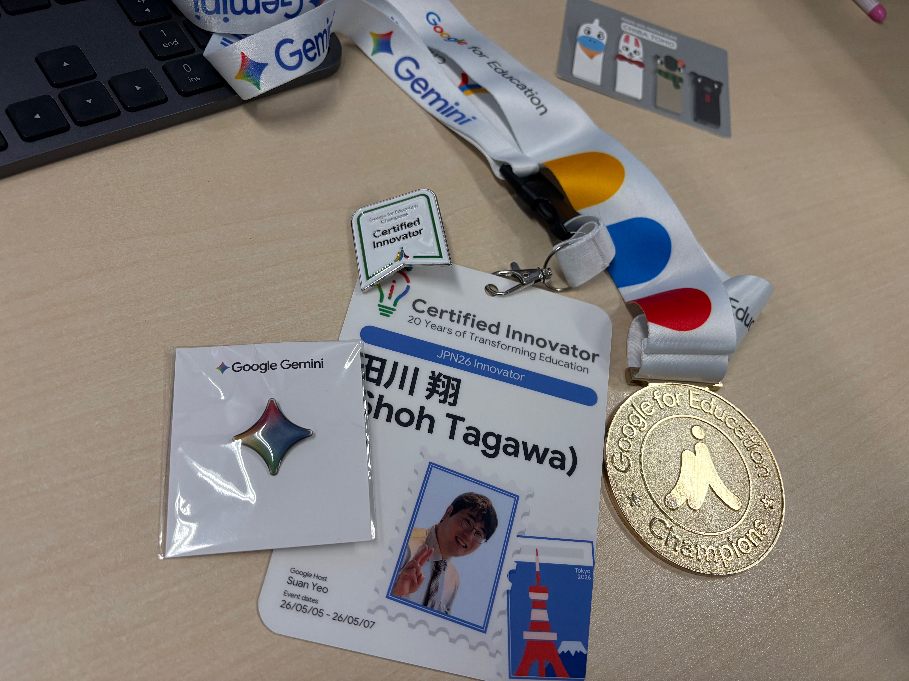
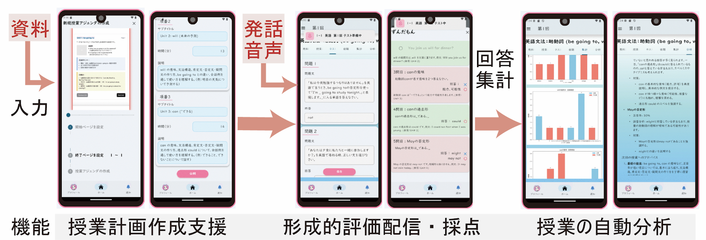
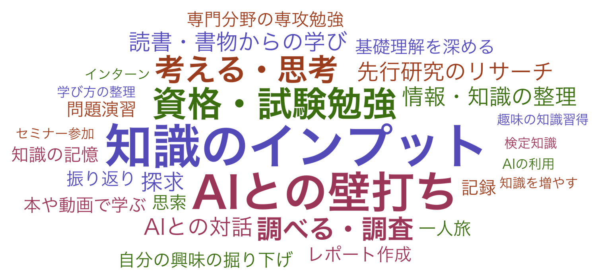

<!-- _class: cover-hero -->

教育テック事例研究（Ⅰ）　講義①

AI時代に 大学はどう変わる？

そもそも、AI時代の「大学の価値」とは何か？

担当： 田川 翔（たがわ しょう）

千葉大学 国際未来教育基幹　／　専門：高等教育論・地球惑星科学

2026年6月20日　｜　教育テック事例研究（オンライン）

<!-- 【S1】田川です。よろしくお願いします。今日のテーマは「AI時代に大学はどう変わるのか」。なのですが、私はこの問いを、最初に少しだけ裏返すところから始めたいと思います。そして今日は、ずっと下の方にある問い——「そもそも学ぶとは何か」——から大学を考え直してみます。 -->

---

<!-- _class: split -->

自己紹介

## 理学から、高等教育へ ── 越境してきた私が、なぜ、AIの話をするのか

田川 翔（たがわ しょう）

博士（理学）

専門：<b>高等教育論</b>／地球惑星科学 
千葉大学 国際未来教育基幹・高等教育センター 
researchmap：<a href="https://researchmap.jp/shoh.tagawa">リンク</a>

「私」を構成する掛け算

- <b>①元々は理学の人</b>：地球深部の高圧科学で学位（<a href="https://doi.org/10.1038/s41467-021-22035-0">Tagawa et al. 2021, Nat. Commun.</a>）
- <b>②色々な経験</b>：民間／コロナ禍の大学ICT支援・MOOC、Google for Edu Champion
- <b>③大学を学びやすく</b>：生成AI×大学×UX変革。

<svg viewBox="0 0 460 452" width="100%" style="max-height:432px" xmlns="http://www.w3.org/2000/svg"><line x1="96" y1="38" x2="96" y2="424" stroke="#D98A4E" stroke-width="3"/><g><circle cx="96" cy="50" r="7" fill="#C8611C"/><text x="80" y="55" text-anchor="end" font-size="18" font-weight="800" fill="#8f3f12">2015</text><text x="112" y="46" font-size="18" font-weight="700" fill="#222">東工大 地球惑星科学 卒</text><text x="112" y="66" font-size="16" fill="#6e7378">UC Berkeley に留学</text></g><g><circle cx="96" cy="122" r="7" fill="#C8611C"/><text x="80" y="127" text-anchor="end" font-size="18" font-weight="800" fill="#8f3f12">2020</text><text x="112" y="127" font-size="18" font-weight="700" fill="#222">大学院で 博士（理学）</text></g><g><circle cx="96" cy="194" r="7" fill="#C8611C"/><text x="80" y="199" text-anchor="end" font-size="18" font-weight="800" fill="#8f3f12">’20–’21</text><text x="112" y="190" font-size="18" font-weight="700" fill="#222">東大 大学総合教育研究センター</text><text x="112" y="210" font-size="16" fill="#6e7378">特任助教 → 高等教育の道へ</text></g><g><circle cx="96" cy="266" r="7" fill="#C8611C"/><text x="80" y="271" text-anchor="end" font-size="18" font-weight="800" fill="#8f3f12">’21–’23</text><text x="112" y="262" font-size="18" font-weight="700" fill="#222">民間：国際航空貨物物流</text><text x="112" y="282" font-size="16" fill="#6e7378">実務を経験（なぜか年間安全表彰も…）</text></g><g><circle cx="96" cy="338" r="8" fill="#8f3f12"/><text x="80" y="343" text-anchor="end" font-size="18" font-weight="800" fill="#8f3f12">2024–</text><text x="112" y="334" font-size="18" font-weight="700" fill="#222">千葉大学 助教</text><text x="112" y="354" font-size="16" fill="#6e7378">高等教育C・国際未来教育基幹</text></g><g><circle cx="96" cy="410" r="8" fill="#8f3f12"/><text x="80" y="415" text-anchor="end" font-size="18" font-weight="800" fill="#8f3f12">現在</text><text x="112" y="406" font-size="18" font-weight="700" fill="#222">生成AI × 大学</text><text x="112" y="426" font-size="16" fill="#6e7378">『Teaching with AI』翻訳中</text></g></svg>

課題感：学際系の学問をしていたときの大学の学びにくさ ▶ AIで「学びやすくできる！？」

<!-- 【自己紹介】簡単に自己紹介します。元々は地球の深部を調べる理学の人間で、博士は理学で取りました。その後、民間で国際航空貨物の物流に関わったり、コロナ禍で大学のオンライン授業づくりを支援したりと、回り道をしてきました。今は千葉大学で、生成AIを大学教育にどう活かすかを考えています。今日はその視点から「学ぶとは何か」を一緒に掘っていきます。 -->

---

<!-- _class: split -->

プレFD

## 「大学で教える人」を育てる ── プレFD という仕事

プレFD とは

- 次世代の大学教員（主に大学院生）に「教え方」を育てる取り組み
- 東大・栗田佳代子先生門下。千葉大で大学院・プレFDを担当
- 「上から教える」のでなく、これから教える人と一緒に考える体験を作る (千葉大学では、SULAなど、学修支援も充実)

関連する教育・FDの仕事

- <b>高等教育センター</b>：FD・授業改善（シラバス確認 Gem 等）
- <b>アカデミック・リンク・センター</b>：体験型セミナー（延べ約700名）
- <b>担当授業</b>：情報リテラシー／生成AI活用講座／大学院・研究／プレFD

教える人を支え、教育と学びを変える仕事。

<!-- 【プレFD】私はプレFD、つまり「大学で教える人を育てる」授業も担当しています。FDは東大の栗田佳代子先生の門下です。教える側を育てる現場にいると、「そもそも学ぶとは何か」を問い直さざるを得ません。今日の話も、その延長にあります。 -->

---

<!-- _class: divider -->

CHAPTER 1

# 問いを、裏返す

## そもそも大学で「学ぶ」とは何か。

<!-- 【CH1】さて、ここから第1章です。［間］今日いちばん最初にやりたいのは、私たちが立てている問いそのものを、いちど裏返してみることなんですね。大学はどう変わるんだろう、ではなく――そもそも「学ぶ」って何だっけ、というところまで、一緒に降りていきましょう。 -->

---

<!-- _class: split -->

問いを裏返す

## 問いを、裏返す

<svg viewBox="0 0 460 360" width="100%" xmlns="http://www.w3.org/2000/svg"><rect x="30" y="20" width="400" height="120" rx="14" fill="#f4f4f6" stroke="#5B6068" stroke-width="2"/><text x="52" y="60" font-size="32" font-weight="bold" fill="#5B6068">✕</text><text x="92" y="59" font-size="23" font-weight="bold" fill="#222">どう変わるか</text><text x="52" y="94" font-size="18" fill="#5B6068">未来を予測する＝ 傍観者のまま</text><text x="52" y="122" font-size="18" fill="#5B6068">大学の枠組みは現状を保存</text><path d="M230 150 L230 196" stroke="#C8611C" stroke-width="4" fill="none"/><path d="M230 206 L217 184 L243 184 Z" fill="#C8611C"/><text x="250" y="186" font-size="18" font-weight="700" fill="#C8611C">裏返す</text><rect x="30" y="216" width="400" height="124" rx="14" fill="#FBEAD9" stroke="#C8611C" stroke-width="3"/><text x="52" y="258" font-size="32" font-weight="bold" fill="#C8611C">◯</text><text x="92" y="257" font-size="23" font-weight="bold" fill="#8f3f12">どう変わるべきか</text><text x="52" y="292" font-size="18" fill="#8f3f12">あるべき姿を構想する＝ 当事者になる</text><text x="52" y="320" font-size="18" fill="#8f3f12">大学の価値から考える</text></svg>

### 「現状の大学をどうDXする」がよく話題になる
### でも、大学そのものを変えたほうが早くないか？

- 予測する人は、変化を外から眺める傍観者
- 構想する人は、変化をつくる当事者
- 主語を「大学」から「私たち」に変えてみましょう
- 今回はあえて「AIを大学でどう使うか」ではなく、「大学はどう変わるべきか、それをAIでどう実現するか」を考えます。

変化は構想するもの。ICT/AIという新たな手段がある時、どう大学を変えるか。

<!-- 【S2】まず最初に、向きを変えたいんです。「大学はどう変わるか」って聞くと、つい未来を予測する話になりますよね。でもそれだと、私たちはずっと傍観者なんです。［間］そうじゃなくて「どう変わるべきか」と裏返すと、急に自分が当事者になる。この感覚は、最後にもう一度戻ってきます。今日は少しSF的に、2035年の大学を一緒に設計するつもりで考えてみましょう。 -->

---

<!-- _class: split -->

問いを掘る

## DXやAI活用する箇所を既存の大学を「所与」として考えない方が、よいのでは
 → そもそも、大学は比較的変えやすい場所。

<svg viewBox="0 0 660 360" width="100%" xmlns="http://www.w3.org/2000/svg"><line x1="40" y1="30" x2="40" y2="314" stroke="#D98A4E" stroke-width="3"/><path d="M31,310 L49,310 L40,330 Z" fill="#D98A4E"/><text transform="rotate(-90 18 178)" x="18" y="178" text-anchor="middle" font-size="18" font-weight="700" fill="#8f3f12">問いを掘り下げる</text><rect x="84" y="30" width="540" height="62" rx="12" fill="#FBEAD9" stroke="#C8611C" stroke-width="2"/><text x="354" y="68" font-size="23" font-weight="bold" fill="#8f3f12" text-anchor="middle">大学はどう変わるべきか</text><path d="M345,96 L363,96 L354,116 Z" fill="#8f3f12"/><rect x="84" y="124" width="540" height="62" rx="12" fill="#F2C9A6" stroke="#C8611C" stroke-width="2"/><text x="354" y="162" font-size="23" font-weight="bold" fill="#8f3f12" text-anchor="middle">そもそも大学とは何をする場か</text><path d="M345,190 L363,190 L354,210 Z" fill="#8f3f12"/><rect x="84" y="218" width="540" height="90" rx="14" fill="#C8611C" stroke="#8f3f12" stroke-width="3"/><text x="354" y="272" font-size="28" font-weight="bold" fill="#ffffff" text-anchor="middle">そもそも大学で「学ぶ」とは何か</text></svg>

✕ ありがちな問い

「大学を<b>どうDXするか</b>」など、 表面の問いで止まる

◯ 今日、問い直したい

「学ぶとは何か」まで掘り、 あるべき姿を構想する

「一人で出来ること」と「大学に来る価値」の双方でAI、ICTを活用するヒントがある

<!-- 【S3】たとえば学校の先生なら、『うちの学校はどう変わるべきか』を突き詰めると、結局『そもそも学校って何をする所だっけ』に行き着きますよね。それと同じで、「どう変わるべきか」に答えるには、その下に降りないといけないんです。大学って何をする場なんだろう、と。［間］でも、そこにもまだ底がある。そもそも学ぶって何なんだ、という一番下の問いです。今日はここから、いちばん深いところから始めます。一緒に降りていきましょう。 -->

---

<!-- _class: message -->

# 大学＝専門を、効率的に、頭に入れるだけ？

## その無意識の前提を、今日は疑ってみましょう。

<!-- 【S4】私たちは、学ぶって「知識を頭に入れること」だと、なんとなく思っていませんか。［間］でも、AIに一人で問えば知識がすぐ手に入る時代です。だとしたら、わざわざ大学で学ぶ意味って、薄れていくんでしょうか。この無意識の前提を、今日はみんなで疑ってみたいんです。 -->

---

<!-- _class: divider -->

CHAPTER 2

# まず、数字で大学の現実を見る

## 効率化への期待と、学修への戸惑い

<!-- 【CH2】ここからは私の意見を一度わきに置いて、数字で現在地を確かめてみたいと思います。［間］全国の大学が、生成AIをどう受け止めているのか。期待と戸惑いが、はっきり分かれて見えてきます。 -->

---

<!-- _class: fig -->

AI受容の全国調査

## 現実 → 国内の最新の調査

<table class="dtbl">
<tr><th>項目</th><th>内容</th></tr>
<tr><td class="l">対象</td><td class="l">全国の大学・短大・高専の機関長</td></tr>
<tr><td class="l">実施</td><td class="l">2025年9–10月</td></tr>
<tr><td class="l">有効回答</td><td class="l">113機関</td></tr>
<tr><td class="l">公開</td><td class="l">2026年5月</td></tr>
</table>

出典：大学教育学会 課題研究（2026年5月公開／機関長の自己申告・n=113） 　<a href="https://genai-higher-ed-jp.github.io/survey-2025-sep-oct/">genai-higher-ed-jp.github.io</a>

比較的最新の重要な調査

<!-- 【S5】まず土台になる調査を共有します。全国の大学・短大・高専の、113機関の機関長が答えたものです。［間］答えているのは現場の学生や教員ではなく、大学のトップ自身。数としては113と、決して多くはありません。それでも、経営の責任を負う人たちが今どう感じているか、その温度がわかる、いちばん新しい現在地です。 -->

---

<!-- _class: fig -->

ポリシーはできた

## ポリシーはできた。でも、それを“現場で回す”のが難しい。

<svg xmlns="http://www.w3.org/2000/svg" xmlns:xlink="http://www.w3.org/1999/xlink" version="1.1" baseProfile="full" viewBox="0 0 900 300"><rect width="900" height="300" x="0" y="0" fill="none"></rect><path d="M328.5 16L328.5 260" fill="none" pointer-events="visible" stroke="#ececec" class="zr0-cls-0"></path><path d="M424.5 16L424.5 260" fill="none" pointer-events="visible" stroke="#ececec" class="zr0-cls-0"></path><path d="M521.5 16L521.5 260" fill="none" pointer-events="visible" stroke="#ececec" class="zr0-cls-0"></path><path d="M617.5 16L617.5 260" fill="none" pointer-events="visible" stroke="#ececec" class="zr0-cls-0"></path><path d="M713.5 16L713.5 260" fill="none" pointer-events="visible" stroke="#ececec" class="zr0-cls-0"></path><path d="M810.5 16L810.5 260" fill="none" pointer-events="visible" stroke="#ececec" class="zr0-cls-0"></path><path d="M328.5 16L328.5 260" fill="none" pointer-events="visible" stroke="#cccccc" stroke-linecap="round" class="zr0-cls-0"></path><path d="M328 16.5L323 16.5" fill="none" pointer-events="visible" stroke="#cccccc" class="zr0-cls-0"></path><path d="M328 138.5L323 138.5" fill="none" pointer-events="visible" stroke="#cccccc" class="zr0-cls-0"></path><path d="M328 260.5L323 260.5" fill="none" pointer-events="visible" stroke="#cccccc" class="zr0-cls-0"></path><path d="M-266 -12l266 0l0 24l-266 0Z" transform="translate(320 77)" fill="none" pointer-events="visible" class="zr0-cls-0"></path><text dominant-baseline="central" text-anchor="end" style="font-size:19px;font-family:"Hiragino Sans","Yu Gothic",YuGothic,"Noto Sans JP",Meiryo,sans-serif;font-weight:bold;" transform="translate(320 77)" fill="#555555">ガイドラインを策定済＋策定中</text><path d="M-304 -12l304 0l0 24l-304 0Z" transform="translate(320 199)" fill="none" pointer-events="visible" class="zr0-cls-0"></path><text dominant-baseline="central" text-anchor="end" style="font-size:19px;font-family:"Hiragino Sans","Yu Gothic",YuGothic,"Noto Sans JP",Meiryo,sans-serif;font-weight:bold;" transform="translate(320 199)" fill="#555555">現場で実質的に機能させるのが困難</text><text dominant-baseline="central" text-anchor="middle" style="font-size:16px;font-family:"Hiragino Sans","Yu Gothic",YuGothic,"Noto Sans JP",Meiryo,sans-serif;" y="8" transform="translate(328 268)" fill="#555555">0%</text><text dominant-baseline="central" text-anchor="middle" style="font-size:16px;font-family:"Hiragino Sans","Yu Gothic",YuGothic,"Noto Sans JP",Meiryo,sans-serif;" y="8" transform="translate(424.4 268)" fill="#555555">20%</text><text dominant-baseline="central" text-anchor="middle" style="font-size:16px;font-family:"Hiragino Sans","Yu Gothic",YuGothic,"Noto Sans JP",Meiryo,sans-serif;" y="8" transform="translate(520.8 268)" fill="#555555">40%</text><text dominant-baseline="central" text-anchor="middle" style="font-size:16px;font-family:"Hiragino Sans","Yu Gothic",YuGothic,"Noto Sans JP",Meiryo,sans-serif;" y="8" transform="translate(617.2 268)" fill="#555555">60%</text><text dominant-baseline="central" text-anchor="middle" style="font-size:16px;font-family:"Hiragino Sans","Yu Gothic",YuGothic,"Noto Sans JP",Meiryo,sans-serif;" y="8" transform="translate(713.6 268)" fill="#555555">80%</text><text dominant-baseline="central" text-anchor="middle" style="font-size:16px;font-family:"Hiragino Sans","Yu Gothic",YuGothic,"Noto Sans JP",Meiryo,sans-serif;" y="8" transform="translate(810 268)" fill="#555555">100%</text><path d="M332 48.9L652.2 48.9A4 4 0 0 1 656.2 52.9L656.2 105.1L328 105.1L328 52.9A4 4 0 0 1 332 48.9" fill="#9aa0a6" ecmeta_series_index="0" ecmeta_data_index="0" ecmeta_ssr_type="chart" class="zr0-cls-1"></path><path d="M332 170.9L737.6 170.9A4 4 0 0 1 741.6 174.9L741.6 227.1L328 227.1L328 174.9A4 4 0 0 1 332 170.9" fill="#C8611C" ecmeta_series_index="0" ecmeta_data_index="1" ecmeta_ssr_type="chart" class="zr0-cls-2"></path><text dominant-baseline="central" text-anchor="start" style="font-size:26px;font-family:"Hiragino Sans","Yu Gothic",YuGothic,"Noto Sans JP",Meiryo,sans-serif;font-weight:bold;" transform="translate(661.242 77)" fill="#222">68.1%</text><text dominant-baseline="central" text-anchor="start" style="font-size:26px;font-family:"Hiragino Sans","Yu Gothic",YuGothic,"Noto Sans JP",Meiryo,sans-serif;font-weight:bold;" transform="translate(746.556 199)" fill="#222">85.8%</text></svg>

出典：同調査

方針は7割で整備。難所は“実質化”85.8%。

<!-- 【S6】ガイドラインを見ると、策定済みと策定中を合わせて68.1%、約7割の機関が方針づくりに動いています。［間］ところが、その方針を現場で実質的に機能させるのは困難だ、と答えた割合は85.8%。紙はできた、でも回らない。ここに最初のずれがあります。 -->

---

<!-- _class: fig -->

運用の壁

## 壁は「実質化」だけじゃない——どれも課題感を感じる大学が7割超

<svg xmlns="http://www.w3.org/2000/svg" xmlns:xlink="http://www.w3.org/1999/xlink" version="1.1" baseProfile="full" viewBox="0 0 960 380"><rect width="960" height="380" x="0" y="0" fill="none"></rect><path d="M222.5 8L222.5 345" fill="none" pointer-events="visible" stroke="#ececec" class="zr0-cls-0"></path><path d="M357.5 8L357.5 345" fill="none" pointer-events="visible" stroke="#ececec" class="zr0-cls-0"></path><path d="M491.5 8L491.5 345" fill="none" pointer-events="visible" stroke="#ececec" class="zr0-cls-0"></path><path d="M626.5 8L626.5 345" fill="none" pointer-events="visible" stroke="#ececec" class="zr0-cls-0"></path><path d="M761.5 8L761.5 345" fill="none" pointer-events="visible" stroke="#ececec" class="zr0-cls-0"></path><path d="M896.5 8L896.5 345" fill="none" pointer-events="visible" stroke="#ececec" class="zr0-cls-0"></path><path d="M222.5 8L222.5 345" fill="none" pointer-events="visible" stroke="#cccccc" stroke-linecap="round" class="zr0-cls-0"></path><path d="M222 8.5L217 8.5" fill="none" pointer-events="visible" stroke="#cccccc" class="zr0-cls-0"></path><path d="M222 75.5L217 75.5" fill="none" pointer-events="visible" stroke="#cccccc" class="zr0-cls-0"></path><path d="M222 143.5L217 143.5" fill="none" pointer-events="visible" stroke="#cccccc" class="zr0-cls-0"></path><path d="M222 210.5L217 210.5" fill="none" pointer-events="visible" stroke="#cccccc" class="zr0-cls-0"></path><path d="M222 277.5L217 277.5" fill="none" pointer-events="visible" stroke="#cccccc" class="zr0-cls-0"></path><path d="M222 345.5L217 345.5" fill="none" pointer-events="visible" stroke="#cccccc" class="zr0-cls-0"></path><text dominant-baseline="central" text-anchor="end" style="font-size:18px;font-family:"Hiragino Sans","Yu Gothic",YuGothic,"Noto Sans JP",Meiryo,sans-serif;font-weight:bold;" transform="translate(214 41.7)" fill="#555555">ガイドラインの実質化</text><text dominant-baseline="central" text-anchor="end" style="font-size:18px;font-family:"Hiragino Sans","Yu Gothic",YuGothic,"Noto Sans JP",Meiryo,sans-serif;font-weight:bold;" transform="translate(214 109.1)" fill="#555555">技術進展への対応</text><text dominant-baseline="central" text-anchor="end" style="font-size:18px;font-family:"Hiragino Sans","Yu Gothic",YuGothic,"Noto Sans JP",Meiryo,sans-serif;font-weight:bold;" transform="translate(214 176.5)" fill="#555555">人手・時間の不足</text><text dominant-baseline="central" text-anchor="end" style="font-size:18px;font-family:"Hiragino Sans","Yu Gothic",YuGothic,"Noto Sans JP",Meiryo,sans-serif;font-weight:bold;" transform="translate(214 243.9)" fill="#555555">関係者の意識統一</text><text dominant-baseline="central" text-anchor="end" style="font-size:18px;font-family:"Hiragino Sans","Yu Gothic",YuGothic,"Noto Sans JP",Meiryo,sans-serif;font-weight:bold;" transform="translate(214 311.3)" fill="#555555">倫理・法・プライバシー</text><text dominant-baseline="central" text-anchor="middle" style="font-size:15px;font-family:"Hiragino Sans","Yu Gothic",YuGothic,"Noto Sans JP",Meiryo,sans-serif;" y="7.5" transform="translate(222 353)" fill="#555555">0%</text><text dominant-baseline="central" text-anchor="middle" style="font-size:15px;font-family:"Hiragino Sans","Yu Gothic",YuGothic,"Noto Sans JP",Meiryo,sans-serif;" y="7.5" transform="translate(356.8 353)" fill="#555555">20%</text><text dominant-baseline="central" text-anchor="middle" style="font-size:15px;font-family:"Hiragino Sans","Yu Gothic",YuGothic,"Noto Sans JP",Meiryo,sans-serif;" y="7.5" transform="translate(491.6 353)" fill="#555555">40%</text><text dominant-baseline="central" text-anchor="middle" style="font-size:15px;font-family:"Hiragino Sans","Yu Gothic",YuGothic,"Noto Sans JP",Meiryo,sans-serif;" y="7.5" transform="translate(626.4 353)" fill="#555555">60%</text><text dominant-baseline="central" text-anchor="middle" style="font-size:15px;font-family:"Hiragino Sans","Yu Gothic",YuGothic,"Noto Sans JP",Meiryo,sans-serif;" y="7.5" transform="translate(761.2 353)" fill="#555555">80%</text><text dominant-baseline="central" text-anchor="middle" style="font-size:15px;font-family:"Hiragino Sans","Yu Gothic",YuGothic,"Noto Sans JP",Meiryo,sans-serif;" y="7.5" transform="translate(896 353)" fill="#555555">100%</text><path d="M226 21.5L796.3 21.5A4 4 0 0 1 800.3 25.5L800.3 61.9L222 61.9L222 25.5A4 4 0 0 1 226 21.5" fill="#C8611C" ecmeta_series_index="0" ecmeta_data_index="0" ecmeta_ssr_type="chart" class="zr0-cls-1"></path><path d="M226 88.9L778.8 88.9A4 4 0 0 1 782.8 92.9L782.8 129.3L222 129.3L222 92.9A4 4 0 0 1 226 88.9" fill="#C8611C" ecmeta_series_index="0" ecmeta_data_index="1" ecmeta_ssr_type="chart" class="zr0-cls-1"></path><path d="M226 156.3L737 156.3A4 4 0 0 1 741 160.3L741 196.7L222 196.7L222 160.3A4 4 0 0 1 226 156.3" fill="#D98A4E" ecmeta_series_index="0" ecmeta_data_index="2" ecmeta_ssr_type="chart" class="zr0-cls-2"></path><path d="M226 223.7L718.8 223.7A4 4 0 0 1 722.8 227.7L722.8 264.1L222 264.1L222 227.7A4 4 0 0 1 226 223.7" fill="#D98A4E" ecmeta_series_index="0" ecmeta_data_index="3" ecmeta_ssr_type="chart" class="zr0-cls-2"></path><path d="M226 291.1L707.3 291.1A4 4 0 0 1 711.3 295.1L711.3 331.5L222 331.5L222 295.1A4 4 0 0 1 226 291.1" fill="#D98A4E" ecmeta_series_index="0" ecmeta_data_index="4" ecmeta_ssr_type="chart" class="zr0-cls-2"></path><text dominant-baseline="central" text-anchor="start" style="font-size:19px;font-family:"Hiragino Sans","Yu Gothic",YuGothic,"Noto Sans JP",Meiryo,sans-serif;font-weight:bold;" transform="translate(805.292 41.7)" fill="#222">85.8%</text><text dominant-baseline="central" text-anchor="start" style="font-size:19px;font-family:"Hiragino Sans","Yu Gothic",YuGothic,"Noto Sans JP",Meiryo,sans-serif;font-weight:bold;" transform="translate(787.768 109.1)" fill="#222">83.2%</text><text dominant-baseline="central" text-anchor="start" style="font-size:19px;font-family:"Hiragino Sans","Yu Gothic",YuGothic,"Noto Sans JP",Meiryo,sans-serif;font-weight:bold;" transform="translate(745.98 176.5)" fill="#222">77%</text><text dominant-baseline="central" text-anchor="start" style="font-size:19px;font-family:"Hiragino Sans","Yu Gothic",YuGothic,"Noto Sans JP",Meiryo,sans-serif;font-weight:bold;" transform="translate(727.782 243.9)" fill="#222">74.3%</text><text dominant-baseline="central" text-anchor="start" style="font-size:19px;font-family:"Hiragino Sans","Yu Gothic",YuGothic,"Noto Sans JP",Meiryo,sans-serif;font-weight:bold;" transform="translate(716.324 311.3)" fill="#222">72.6%</text></svg>

出典：大学教育学会 課題研究（2025, n=113／「困難」+「極めて困難」の合計） 　<a href="https://genai-higher-ed-jp.github.io/survey-2025-sep-oct/">genai-higher-ed-jp.github.io</a>

方針より、回す力が足りない。だからボトムアップが重要になる。

<!-- 【N-WALL】困難は実質化だけではありません。技術の進展に追いつけない、人手と時間が足りない、関係者の意識が揃わない、倫理やプライバシーの整理——どれも7割を超えています。立派な方針より、現場で回す力こそが足りていない。だから上を待つより、手元から動く意味があるんです。 -->

---

<!-- _class: fig -->

決定的な差

## 期待は効率化へ、学修(習)への効果は測りかねる

<svg xmlns="http://www.w3.org/2000/svg" xmlns:xlink="http://www.w3.org/1999/xlink" version="1.1" baseProfile="full" viewBox="0 0 880 420"><rect width="880" height="420" x="0" y="0" fill="none"></rect><path d="M204.5 46L204.5 380" fill="none" pointer-events="visible" stroke="#ececec" class="zr0-cls-0"></path><path d="M320.5 46L320.5 380" fill="none" pointer-events="visible" stroke="#ececec" class="zr0-cls-0"></path><path d="M436.5 46L436.5 380" fill="none" pointer-events="visible" stroke="#ececec" class="zr0-cls-0"></path><path d="M552.5 46L552.5 380" fill="none" pointer-events="visible" stroke="#ececec" class="zr0-cls-0"></path><path d="M668.5 46L668.5 380" fill="none" pointer-events="visible" stroke="#ececec" class="zr0-cls-0"></path><path d="M784.5 46L784.5 380" fill="none" pointer-events="visible" stroke="#ececec" class="zr0-cls-0"></path><path d="M204.5 46L204.5 380" fill="none" pointer-events="visible" stroke="#cccccc" stroke-linecap="round" class="zr0-cls-0"></path><path d="M204 46.5L199 46.5" fill="none" pointer-events="visible" stroke="#cccccc" class="zr0-cls-0"></path><path d="M204 213.5L199 213.5" fill="none" pointer-events="visible" stroke="#cccccc" class="zr0-cls-0"></path><path d="M204 380.5L199 380.5" fill="none" pointer-events="visible" stroke="#cccccc" class="zr0-cls-0"></path><path d="M-180 -12l180 0l0 24l-180 0Z" transform="translate(196 129.5)" fill="none" pointer-events="visible" class="zr0-cls-0"></path><text dominant-baseline="central" text-anchor="end" style="font-size:20px;font-family:"Hiragino Sans","Yu Gothic",YuGothic,"Noto Sans JP",Meiryo,sans-serif;font-weight:bold;" transform="translate(196 129.5)" fill="#555555">業務効率化への期待</text><path d="M-180 -12l180 0l0 24l-180 0Z" transform="translate(196 296.5)" fill="none" pointer-events="visible" class="zr0-cls-0"></path><text dominant-baseline="central" text-anchor="end" style="font-size:20px;font-family:"Hiragino Sans","Yu Gothic",YuGothic,"Noto Sans JP",Meiryo,sans-serif;font-weight:bold;" transform="translate(196 296.5)" fill="#555555">思考力低下のリスク</text><text dominant-baseline="central" text-anchor="middle" style="font-size:16px;font-family:"Hiragino Sans","Yu Gothic",YuGothic,"Noto Sans JP",Meiryo,sans-serif;" y="8" transform="translate(204 388)" fill="#555555">0%</text><text dominant-baseline="central" text-anchor="middle" style="font-size:16px;font-family:"Hiragino Sans","Yu Gothic",YuGothic,"Noto Sans JP",Meiryo,sans-serif;" y="8" transform="translate(320 388)" fill="#555555">20%</text><text dominant-baseline="central" text-anchor="middle" style="font-size:16px;font-family:"Hiragino Sans","Yu Gothic",YuGothic,"Noto Sans JP",Meiryo,sans-serif;" y="8" transform="translate(436 388)" fill="#555555">40%</text><text dominant-baseline="central" text-anchor="middle" style="font-size:16px;font-family:"Hiragino Sans","Yu Gothic",YuGothic,"Noto Sans JP",Meiryo,sans-serif;" y="8" transform="translate(552 388)" fill="#555555">60%</text><text dominant-baseline="central" text-anchor="middle" style="font-size:16px;font-family:"Hiragino Sans","Yu Gothic",YuGothic,"Noto Sans JP",Meiryo,sans-serif;" y="8" transform="translate(668 388)" fill="#555555">80%</text><text dominant-baseline="central" text-anchor="middle" style="font-size:16px;font-family:"Hiragino Sans","Yu Gothic",YuGothic,"Noto Sans JP",Meiryo,sans-serif;" y="8" transform="translate(784 388)" fill="#555555">100%</text><path d="M208 76.4L748.7 76.4A4 4 0 0 1 752.7 80.4L752.7 126.5L204 126.5L204 80.4A4 4 0 0 1 208 76.4" fill="#C8611C" ecmeta_series_index="0" ecmeta_data_index="0" ecmeta_ssr_type="chart" class="zr0-cls-1"></path><path d="M208 243.4L474.3 243.4A4 4 0 0 1 478.3 247.4L478.3 293.5L204 293.5L204 247.4A4 4 0 0 1 208 243.4" fill="#C8611C" ecmeta_series_index="0" ecmeta_data_index="1" ecmeta_ssr_type="chart" class="zr0-cls-1"></path><path d="M208 299.5L469.1 299.5A4 4 0 0 1 473.1 303.5L473.1 349.6L204 349.6L204 303.5A4 4 0 0 1 208 299.5" fill="#9aa0a6" ecmeta_series_index="1" ecmeta_data_index="1" ecmeta_ssr_type="chart" class="zr0-cls-2"></path><text dominant-baseline="central" text-anchor="start" style="font-size:22px;font-family:"Hiragino Sans","Yu Gothic",YuGothic,"Noto Sans JP",Meiryo,sans-serif;font-weight:bold;" transform="translate(757.68 101.444)" fill="#C8611C">94.6%</text><text dominant-baseline="central" text-anchor="start" style="font-size:22px;font-family:"Hiragino Sans","Yu Gothic",YuGothic,"Noto Sans JP",Meiryo,sans-serif;font-weight:bold;" transform="translate(483.34 268.444)" fill="#C8611C">47.3%</text><text dominant-baseline="central" text-anchor="start" style="font-size:20px;font-family:"Hiragino Sans","Yu Gothic",YuGothic,"Noto Sans JP",Meiryo,sans-serif;" transform="translate(478.12 324.556)" fill="#5B6068">46.4%</text><path d="M-5 -5l267 0l0 27l-267 0Z" transform="translate(311.5 5)" fill="rgb(0,0,0)" fill-opacity="0" stroke="#ccc" stroke-width="0" class="zr0-cls-0"></path><path d="M3.5 0L21.5 0A3.5 3.5 0 0 1 25 3.5L25 10.5A3.5 3.5 0 0 1 21.5 14L3.5 14A3.5 3.5 0 0 1 0 10.5L0 3.5A3.5 3.5 0 0 1 3.5 0" transform="translate(311.5 6.5)" fill="#C8611C" ecmeta_series_index="0" ecmeta_data_index="0" ecmeta_ssr_type="legend" ecmeta_silent="true" class="zr0-cls-0"></path><text dominant-baseline="central" text-anchor="start" style="font-size:17px;font-family:"Hiragino Sans","Yu Gothic",YuGothic,"Noto Sans JP",Meiryo,sans-serif;" x="30" y="7" transform="translate(311.5 6.5)" fill="#555555">肯定</text><path d="M0 -1.5l64 0l0 17l-64 0Z" transform="translate(311.5 6.5)" fill="none" pointer-events="visible" ecmeta_series_index="0" ecmeta_data_index="0" ecmeta_ssr_type="legend" class="zr0-cls-3"></path><path d="M3.5 0L21.5 0A3.5 3.5 0 0 1 25 3.5L25 10.5A3.5 3.5 0 0 1 21.5 14L3.5 14A3.5 3.5 0 0 1 0 10.5L0 3.5A3.5 3.5 0 0 1 3.5 0" transform="translate(385.5 6.5)" fill="#9aa0a6" ecmeta_series_index="1" ecmeta_data_index="1" ecmeta_ssr_type="legend" ecmeta_silent="true" class="zr0-cls-0"></path><text dominant-baseline="central" text-anchor="start" style="font-size:17px;font-family:"Hiragino Sans","Yu Gothic",YuGothic,"Noto Sans JP",Meiryo,sans-serif;" x="30" y="7" transform="translate(385.5 6.5)" fill="#555555">どちらとも言えない</text><path d="M0 -1.5l183 0l0 17l-183 0Z" transform="translate(385.5 6.5)" fill="none" pointer-events="visible" ecmeta_series_index="1" ecmeta_data_index="1" ecmeta_ssr_type="legend" class="zr0-cls-3"></path></svg>

効率化への理解は広がったが、学習そのものへの影響は、まだ測りかねている。

出典：同調査

94.6%が効率化に期待、リスク認識は拮抗。

<!-- 【S7】ここが今日いちばん見てほしい数字です。業務の効率化への期待は94.6%。さっきの113機関の機関長の、ほぼ全員が肯定しています。［間］一方で、思考力や批判的思考が下がるリスクへの認識は、肯定が47.3%、中立が46.4%でほぼ真っ二つ。効率化には迷いなく飛びつくのに、学習そのものへの影響は、まだ測りかねている。［間］仕事が楽になる話には全員が乗るのに、肝心の『学生が育つか』は、誰も腹を決めていない。この非対称さこそ、一緒に覚えておきたいんです。 -->

---

<!-- _class: fig -->

規模の格差

## 小規模大学ほど、取り残される危険性

<svg xmlns="http://www.w3.org/2000/svg" xmlns:xlink="http://www.w3.org/1999/xlink" version="1.1" baseProfile="full" viewBox="0 0 960 430"><rect width="960" height="430" x="0" y="0" fill="none"></rect><path d="M155.5 50L155.5 391" fill="none" pointer-events="visible" stroke="#ececec" class="zr0-cls-0"></path><path d="M302.5 50L302.5 391" fill="none" pointer-events="visible" stroke="#ececec" class="zr0-cls-0"></path><path d="M449.5 50L449.5 391" fill="none" pointer-events="visible" stroke="#ececec" class="zr0-cls-0"></path><path d="M596.5 50L596.5 391" fill="none" pointer-events="visible" stroke="#ececec" class="zr0-cls-0"></path><path d="M743.5 50L743.5 391" fill="none" pointer-events="visible" stroke="#ececec" class="zr0-cls-0"></path><path d="M890.5 50L890.5 391" fill="none" pointer-events="visible" stroke="#ececec" class="zr0-cls-0"></path><path d="M155.5 50L155.5 391" fill="none" pointer-events="visible" stroke="#cccccc" stroke-linecap="round" class="zr0-cls-0"></path><path d="M155 50.5L150 50.5" fill="none" pointer-events="visible" stroke="#cccccc" class="zr0-cls-0"></path><path d="M155 135.5L150 135.5" fill="none" pointer-events="visible" stroke="#cccccc" class="zr0-cls-0"></path><path d="M155 220.5L150 220.5" fill="none" pointer-events="visible" stroke="#cccccc" class="zr0-cls-0"></path><path d="M155 306.5L150 306.5" fill="none" pointer-events="visible" stroke="#cccccc" class="zr0-cls-0"></path><path d="M155 391.5L150 391.5" fill="none" pointer-events="visible" stroke="#cccccc" class="zr0-cls-0"></path><text dominant-baseline="central" text-anchor="end" style="font-size:18px;font-family:"Hiragino Sans","Yu Gothic",YuGothic,"Noto Sans JP",Meiryo,sans-serif;font-weight:bold;" xml:space="preserve" transform="translate(147.04 92.625)" fill="#555555">有料AI 未提供</text><text dominant-baseline="central" text-anchor="end" style="font-size:18px;font-family:"Hiragino Sans","Yu Gothic",YuGothic,"Noto Sans JP",Meiryo,sans-serif;font-weight:bold;" xml:space="preserve" transform="translate(147.04 177.875)" fill="#555555">システム 未整備</text><text dominant-baseline="central" text-anchor="end" style="font-size:18px;font-family:"Hiragino Sans","Yu Gothic",YuGothic,"Noto Sans JP",Meiryo,sans-serif;font-weight:bold;" xml:space="preserve" transform="translate(147.04 263.125)" fill="#555555">職員支援 未実施</text><text dominant-baseline="central" text-anchor="end" style="font-size:18px;font-family:"Hiragino Sans","Yu Gothic",YuGothic,"Noto Sans JP",Meiryo,sans-serif;font-weight:bold;" xml:space="preserve" transform="translate(147.04 348.375)" fill="#555555">方針 予定なし</text><text dominant-baseline="central" text-anchor="middle" style="font-size:15px;font-family:"Hiragino Sans","Yu Gothic",YuGothic,"Noto Sans JP",Meiryo,sans-serif;" y="7.5" transform="translate(155.04 399)" fill="#555555">0%</text><text dominant-baseline="central" text-anchor="middle" style="font-size:15px;font-family:"Hiragino Sans","Yu Gothic",YuGothic,"Noto Sans JP",Meiryo,sans-serif;" y="7.5" transform="translate(302.032 399)" fill="#555555">20%</text><text dominant-baseline="central" text-anchor="middle" style="font-size:15px;font-family:"Hiragino Sans","Yu Gothic",YuGothic,"Noto Sans JP",Meiryo,sans-serif;" y="7.5" transform="translate(449.024 399)" fill="#555555">40%</text><text dominant-baseline="central" text-anchor="middle" style="font-size:15px;font-family:"Hiragino Sans","Yu Gothic",YuGothic,"Noto Sans JP",Meiryo,sans-serif;" y="7.5" transform="translate(596.016 399)" fill="#555555">60%</text><text dominant-baseline="central" text-anchor="middle" style="font-size:15px;font-family:"Hiragino Sans","Yu Gothic",YuGothic,"Noto Sans JP",Meiryo,sans-serif;" y="7.5" transform="translate(743.008 399)" fill="#555555">80%</text><text dominant-baseline="central" text-anchor="middle" style="font-size:15px;font-family:"Hiragino Sans","Yu Gothic",YuGothic,"Noto Sans JP",Meiryo,sans-serif;" y="7.5" transform="translate(890 399)" fill="#555555">100%</text><path d="M159 63.7L747.8 63.7A4 4 0 0 1 751.8 67.7L751.8 91L155 91L155 67.7A4 4 0 0 1 159 63.7" fill="#C8611C" ecmeta_series_index="0" ecmeta_data_index="0" ecmeta_ssr_type="chart" class="zr0-cls-1"></path><path d="M159 149L592 149A4 4 0 0 1 596 153L596 176.2L155 176.2L155 153A4 4 0 0 1 159 149" fill="#C8611C" ecmeta_series_index="0" ecmeta_data_index="1" ecmeta_ssr_type="chart" class="zr0-cls-1"></path><path d="M159 234.2L600.8 234.2A4 4 0 0 1 604.8 238.2L604.8 261.5L155 261.5L155 238.2A4 4 0 0 1 159 234.2" fill="#C8611C" ecmeta_series_index="0" ecmeta_data_index="2" ecmeta_ssr_type="chart" class="zr0-cls-1"></path><path d="M159 319.5L427.4 319.5A4 4 0 0 1 431.4 323.5L431.4 346.7L155 346.7L155 323.5A4 4 0 0 1 159 319.5" fill="#C8611C" ecmeta_series_index="0" ecmeta_data_index="3" ecmeta_ssr_type="chart" class="zr0-cls-1"></path><path d="M159 94.3L518.5 94.3A4 4 0 0 1 522.5 98.3L522.5 121.5L155 121.5L155 98.3A4 4 0 0 1 159 94.3" fill="#9aa0a6" ecmeta_series_index="1" ecmeta_data_index="0" ecmeta_ssr_type="chart" class="zr0-cls-2"></path><path d="M159 179.5L308.3 179.5A4 4 0 0 1 312.3 183.5L312.3 206.8L155 206.8L155 183.5A4 4 0 0 1 159 179.5" fill="#9aa0a6" ecmeta_series_index="1" ecmeta_data_index="1" ecmeta_ssr_type="chart" class="zr0-cls-2"></path><path d="M159 264.8L282.6 264.8A4 4 0 0 1 286.6 268.8L286.6 292L155 292L155 268.8A4 4 0 0 1 159 264.8" fill="#9aa0a6" ecmeta_series_index="1" ecmeta_data_index="2" ecmeta_ssr_type="chart" class="zr0-cls-2"></path><path d="M159 350L256.1 350A4 4 0 0 1 260.1 354L260.1 377.3L155 377.3L155 354A4 4 0 0 1 159 350" fill="#9aa0a6" ecmeta_series_index="1" ecmeta_data_index="3" ecmeta_ssr_type="chart" class="zr0-cls-2"></path><text dominant-baseline="central" text-anchor="start" style="font-size:16px;font-family:"Hiragino Sans","Yu Gothic",YuGothic,"Noto Sans JP",Meiryo,sans-serif;font-weight:bold;" transform="translate(756.8275 77.3482)" fill="#C8611C">81.2</text><text dominant-baseline="central" text-anchor="start" style="font-size:16px;font-family:"Hiragino Sans","Yu Gothic",YuGothic,"Noto Sans JP",Meiryo,sans-serif;font-weight:bold;" transform="translate(601.016 162.5982)" fill="#C8611C">60</text><text dominant-baseline="central" text-anchor="start" style="font-size:16px;font-family:"Hiragino Sans","Yu Gothic",YuGothic,"Noto Sans JP",Meiryo,sans-serif;font-weight:bold;" transform="translate(609.8355 247.8482)" fill="#C8611C">61.2</text><text dominant-baseline="central" text-anchor="start" style="font-size:16px;font-family:"Hiragino Sans","Yu Gothic",YuGothic,"Noto Sans JP",Meiryo,sans-serif;font-weight:bold;" transform="translate(436.385 333.0982)" fill="#C8611C">37.6</text><text dominant-baseline="central" text-anchor="start" style="font-size:16px;font-family:"Hiragino Sans","Yu Gothic",YuGothic,"Noto Sans JP",Meiryo,sans-serif;" transform="translate(527.52 107.9018)" fill="#5B6068">50</text><text dominant-baseline="central" text-anchor="start" style="font-size:16px;font-family:"Hiragino Sans","Yu Gothic",YuGothic,"Noto Sans JP",Meiryo,sans-serif;" transform="translate(317.3214 193.1518)" fill="#5B6068">21.4</text><text dominant-baseline="central" text-anchor="start" style="font-size:16px;font-family:"Hiragino Sans","Yu Gothic",YuGothic,"Noto Sans JP",Meiryo,sans-serif;" transform="translate(291.5978 278.4018)" fill="#5B6068">17.9</text><text dominant-baseline="central" text-anchor="start" style="font-size:16px;font-family:"Hiragino Sans","Yu Gothic",YuGothic,"Noto Sans JP",Meiryo,sans-serif;" transform="translate(265.1393 363.6518)" fill="#5B6068">14.3</text><path d="M-5 -5l423.8 0l0 26l-423.8 0Z" transform="translate(273.12 5)" fill="rgb(0,0,0)" fill-opacity="0" stroke="#ccc" stroke-width="0" class="zr0-cls-0"></path><path d="M3.5 0L21.5 0A3.5 3.5 0 0 1 25 3.5L25 10.5A3.5 3.5 0 0 1 21.5 14L3.5 14A3.5 3.5 0 0 1 0 10.5L0 3.5A3.5 3.5 0 0 1 3.5 0" transform="translate(273.12 6)" fill="#C8611C" ecmeta_series_index="0" ecmeta_data_index="0" ecmeta_ssr_type="legend" ecmeta_silent="true" class="zr0-cls-0"></path><text dominant-baseline="central" text-anchor="start" style="font-size:16px;font-family:"Hiragino Sans","Yu Gothic",YuGothic,"Noto Sans JP",Meiryo,sans-serif;" x="30" y="7" transform="translate(273.12 6)" fill="#555555">小規模(4,000人未満)</text><path d="M0 -1l176.9 0l0 16l-176.9 0Z" transform="translate(273.12 6)" fill="none" pointer-events="visible" ecmeta_series_index="0" ecmeta_data_index="0" ecmeta_ssr_type="legend" class="zr0-cls-3"></path><path d="M3.5 0L21.5 0A3.5 3.5 0 0 1 25 3.5L25 10.5A3.5 3.5 0 0 1 21.5 14L3.5 14A3.5 3.5 0 0 1 0 10.5L0 3.5A3.5 3.5 0 0 1 3.5 0" transform="translate(510 6)" fill="#9aa0a6" ecmeta_series_index="1" ecmeta_data_index="1" ecmeta_ssr_type="legend" ecmeta_silent="true" class="zr0-cls-0"></path><text dominant-baseline="central" text-anchor="start" style="font-size:16px;font-family:"Hiragino Sans","Yu Gothic",YuGothic,"Noto Sans JP",Meiryo,sans-serif;" x="30" y="7" transform="translate(510 6)" fill="#555555">大規模(4,000人以上)</text><path d="M0 -1l176.9 0l0 16l-176.9 0Z" transform="translate(510 6)" fill="none" pointer-events="visible" ecmeta_series_index="1" ecmeta_data_index="1" ecmeta_ssr_type="legend" class="zr0-cls-3"></path></svg>

出典：大学教育学会 課題研究（2025, n=113／規模別。有料AIは「未提供」に換算） 　<a href="https://genai-higher-ed-jp.github.io/survey-2025-sep-oct/">genai-higher-ed-jp.github.io</a>

格差は広がる。だから横展開が重要になる。

<!-- 【N-GAP】規模による差がはっきり出ています。小規模大学ほど、有料AIが使えず、システムも未整備、職員支援もなく、方針すらまだ——どの項目も大規模校を大きく上回って「できていない」。放っておくと格差は広がる一方です。だからこそ、車輪の再発明をやめて横でつながる、一人で抱え込まないことが効いてきます。 -->

---

<!-- _class: split -->

他人事でない

## 私自身の現場でも課題は多い

千葉大での現場（AIをめぐる対話の場）

### 数字の向こうにある実感

- 「実質化の難しさ」は、千葉大で私が日々ぶつかること
- 方針を作っても、運用に落ちるまでに距離がある
- 全学で学生・教員間の対話を実施した
- 図書館でDX、AI活用を支援中、現場省力化へ
- 研修も始めた (学生は少ないが教職員多数)

全国データは、私の実感と地続き。

<!-- 【S8】この85.8%という数字、私には他人事に思えないんです。千葉大でも、方針はあるのに現場の運用まで届かない、その距離をいつも感じています。［間：当日、自分の体験を20〜40秒で］全国のデータは、私自身の身体感覚と地続きなんだと思います。 -->

---

<!-- _class: fig -->

影響範囲

## AIは大学のあらゆる階層に影響

<table class="dtbl">
<tr><th></th><th>事務・タスク</th><th>フィードバック</th><th>クリエイティブ</th><th>データ活用</th></tr>
<tr><th>マクロ (全学)</th><td class="l">ポリシー策定</td><td class="l">教学マネジメント</td><td class="l">広報・教材生成</td><td class="l">教育データ活用</td></tr>
<tr><th>ミドル (課程)</th><td class="l">業務の自動化</td><td class="l">科目・課程点検</td><td class="l">カリキュラム統合</td><td class="l">達成度の記録</td></tr>
<tr><th>ミクロ (授業)</th><td class="l">窓口・学生相談</td><td class="l">Writing支援・採点</td><td class="l">AIチューター</td><td class="l">専門AI教科書</td></tr>
</table>

整理：田川（2025）／左=事務〜右=クリエイティブ＝「効率化→創造」と同じ向き

授業から経営まで、幅広いレイヤーに影響する。

<!-- 【ALC-LAYER】この表は縦が全学・課程・授業の3層、横が事務からクリエイティブまで。どのマスにもAIが入り込めるのが面白いところです。左の事務寄りはAIが担いやすく、右のクリエイティブに行くほど人と共同体が要る——これは、今日この後で出てくる『左＝効率化されやすい／右＝人と共同体が要る』という向きと、まったく同じなんですよ。 -->

---

<!-- _class: split -->

出口から

## 出口が変われば、学びも変わる

<svg viewBox="0 0 640 250" width="100%" xmlns="http://www.w3.org/2000/svg"><line x1="186" y1="24" x2="186" y2="216" stroke="#cfd2d6" stroke-width="1.6"/><text x="176" y="74" text-anchor="end" font-size="21" font-weight="700" fill="#3a3f45">協働</text><text x="176" y="96" text-anchor="end" font-size="13" fill="#8a8f96">augmentation</text><rect x="186" y="50" width="266" height="50" rx="6" fill="#C8611C"/><text x="462" y="82" font-size="27" font-weight="800" fill="#8f3f12">57%</text><text x="176" y="168" text-anchor="end" font-size="21" font-weight="700" fill="#3a3f45">委任</text><text x="176" y="190" text-anchor="end" font-size="13" fill="#8a8f96">automation</text><rect x="186" y="144" width="201" height="50" rx="6" fill="#9aa0a6"/><text x="397" y="176" font-size="27" font-weight="800" fill="#5B6068">43%</text></svg>

AIの実利用：協働 vs 委任（Claude会話400万件の分析）

出典：Anthropic Economic Index ／ Handa et al. (2025) "Which Economic Tasks are Performed with AI?" arXiv:2503.04761

### 出口（仕事）で、AIはこう使われ始めた

- 実データでは協働(augmentation)が57%＞委任(automation)43%。AIは"代替"より<b>人と一緒に使う</b>道具として認識
- ただし「広く浅い」：約36%の職業がタスクの1/4以上で利用、深く使う職業は4%だけ
- だから問われるのは「何を学ぶか」より「AIとどう学び・働ける人になるか」

出口が変わるなら、学びの問い直しは必然。

<!-- 【N-EXIT】まず出口の話からいきます。学生のみなさんの出口、つまり仕事や社会への関わり方が、AIで実際に変わり始めているんですね。出口が動けば、入口である学びも問い直さざるをえない。だから今日は「何を学ぶか」だけでなく「どう学べる人になるか」を一緒に考えます。［間］そして、出口が変わるなら、そもそも『学ぶ』って何だったのか、根っこから問い直さないといけない。次は、そこに降りていきます。 -->

---

<!-- _class: split -->

仕事への影響

## AIは、仕事の「大半」に影響

時間×タスクのAIカバレッジ

### 時間×タスクで見た「AIカバレッジ」

- 青＝AIで効率化・代替できる範囲（例：Education & Library で約60%）
- 赤＝いま実際に使われている範囲（約20%）
- ① いわゆるホワイトカラーの大半に影響が及ぶ
- ② 今後、赤が青に近づく（＝軸そのものも変わる）
- ③ いまは雇用への影響は薄いが、若手で変化する可能性

出典：Massenkoff & McCrory (2026)「Labor market impacts of AI」<a href="https://www.anthropic.com/research/labor-market-impacts">Anthropic, 2026/3</a>

出口の状況＝ホワイトカラーの仕事の多くにAIが影響。 それでも最後に残るのはAIを越える価値の創出。担い、変えていける人をどう育てるか。

<!-- 【RIS13】AIの仕事への影響を示すデータです（Risshoでも使用）。縦軸は職種、青がAIで効率化・代替できる理論上の範囲、赤が実際に使われている範囲。例えば教育・図書館では青が約6割・赤が約2割。ホワイトカラーの大半に影響が及び、これから赤は青へ近づく。出口＝仕事が変われば、入口＝学びも変わる、という裏づけです。 -->

---

<!-- _class: divider -->

CHAPTER 3

# 学ぶとは、「変容」である

## 情報が「教員」から「学生」に移ることではない。人が変わること。

<!-- 【CH3】ここから少し腰を据えて、「そもそも学ぶってどういうことだろう」を一緒に考えたいんです。知識が増えることと、学ぶことは、実は同じじゃない。［間］情報が移ることではなく、人が変わること——この章では、その手触りをつかんでいきましょう。 -->

---

<!-- _class: fig -->

学ぶとは

## では、学ぶとは何か

<svg viewBox="0 0 860 360" width="100%" preserveAspectRatio="xMidYMid meet"><rect x="20" y="20" width="400" height="150" rx="12" fill="#FBEAD9" stroke="#C8611C" stroke-width="2"/><circle cx="90" cy="75" r="22" fill="none" stroke="#8f3f12" stroke-width="3"/><path d="M120 95 Q150 60 185 95" fill="none" stroke="#8f3f12" stroke-width="3"/><polygon points="185,95 178,82 192,84" fill="#8f3f12"/><text x="220" y="70" font-size="22" font-weight="700" fill="#222">①変容</text><text x="220" y="100" font-size="17" fill="#5B6068">知識でなく、自分が変わる</text><rect x="440" y="20" width="400" height="150" rx="12" fill="#fff" stroke="#1A6BB0" stroke-width="2"/><circle cx="500" cy="80" r="16" fill="none" stroke="#1A6BB0" stroke-width="3"/><circle cx="560" cy="80" r="16" fill="none" stroke="#1A6BB0" stroke-width="3"/><line x1="516" y1="80" x2="544" y2="80" stroke="#1A6BB0" stroke-width="3"/><text x="600" y="70" font-size="22" font-weight="700" fill="#222">②関係</text><text x="600" y="100" font-size="17" fill="#5B6068">人と人の「間」で起こる</text><rect x="20" y="190" width="400" height="150" rx="12" fill="#fff" stroke="#C8611C" stroke-width="2"/><text x="78" y="285" font-size="64" font-weight="700" fill="#C8611C">?</text><text x="220" y="240" font-size="22" font-weight="700" fill="#222">③問い</text><text x="220" y="270" font-size="17" fill="#5B6068">良い問いを立てられる</text><rect x="440" y="190" width="400" height="150" rx="12" fill="#FBEAD9" stroke="#5B6068" stroke-width="2"/><path d="M480 300 Q510 250 540 290 Q570 320 600 270" fill="none" stroke="#5B6068" stroke-width="3" stroke-dasharray="6 6"/><text x="620" y="240" font-size="22" font-weight="700" fill="#222">④不確かさ</text><text x="620" y="270" font-size="17" fill="#5B6068">わからないまま、ともに歩む</text><circle cx="430" cy="180" r="46" fill="#8f3f12"/><text x="430" y="176" font-size="18" font-weight="700" fill="#fff" text-anchor="middle">学ぶ</text><text x="430" y="198" font-size="18" font-weight="700" fill="#fff" text-anchor="middle">＝？</text></svg>

参考：T.インゴルド『教育とは何か』／レイヴ＆ウェンガー(1991) 正統的周辺参加／4つの像の整理は田川

学ぶとは、自分が変わること。どれもAIと自分だけでは閉じない。

<!-- 【S9】知識を覚えることが学びの本質じゃないとしたら、何が残るのか。私なりに四つの像で整理しました——変容・関係・問い・不確かさ。例えば②関係は、職人の世界で新入りが隅の雑用から少しずつ中心の仕事を任され一人前になる、あの過程＝レイヴ＆ウェンガーの「正統的周辺参加」です。難しい名前ですが、中身は職場の「見習いが一人前になる」あれと同じ。どれもAIと自分だけでは閉じないんです。 -->

---

<!-- _class: split -->

弱い教育

## インゴルドの「強い／弱い教育」

<svg viewBox="0 0 460 360" width="100%" preserveAspectRatio="xMidYMid meet"><text x="115" y="30" font-size="18" font-weight="700" fill="#5B6068" text-anchor="middle">強い教育</text><rect x="40" y="50" width="150" height="40" rx="6" fill="#5B6068"/><text x="115" y="76" font-size="17" fill="#fff" text-anchor="middle">権威ある知識</text><line x1="115" y1="95" x2="115" y2="160" stroke="#5B6068" stroke-width="5"/><polygon points="115,170 105,150 125,150" fill="#5B6068"/><rect x="40" y="178" width="150" height="40" rx="6" fill="none" stroke="#5B6068" stroke-width="2"/><text x="115" y="204" font-size="17" fill="#5B6068" text-anchor="middle">受け手（消費者）</text><line x1="230" y1="40" x2="230" y2="320" stroke="#ccc" stroke-width="1" stroke-dasharray="4 4"/><text x="345" y="30" font-size="18" font-weight="700" fill="#C8611C" text-anchor="middle">弱い教育</text><circle cx="345" cy="120" r="70" fill="#FBEAD9" stroke="#C8611C" stroke-width="2"/><circle cx="345" cy="68" r="13" fill="none" stroke="#C8611C" stroke-width="3"/><circle cx="397" cy="120" r="13" fill="none" stroke="#C8611C" stroke-width="3"/><circle cx="345" cy="172" r="13" fill="none" stroke="#C8611C" stroke-width="3"/><circle cx="293" cy="120" r="13" fill="none" stroke="#C8611C" stroke-width="3"/><text x="345" y="126" font-size="16" font-weight="700" fill="#8f3f12" text-anchor="middle">ともに</text><path d="M280 230 Q320 200 360 240 Q400 280 440 245" fill="none" stroke="#C8611C" stroke-width="3" stroke-dasharray="7 7"/><text x="345" y="300" font-size="17" fill="#C8611C" text-anchor="middle">不確かな道をともに歩む</text></svg>

### 二つの教育観

- <b>強い教育</b>＝権威ある知識を上から下へ伝達する
- <b>弱い教育</b>＝事物・人々とともに、内側から知る／不確かな道をともに歩む
- インゴルドは「学生を知識の消費者に変えるリスク」を批判（learnification＝学びを“消費”に縮める）

出典：T.インゴルド『教育とは何か』古川不可知訳（原題 Anthropology and/as Education, 2018）

"弱い教育"こそ、VUCA時代に、ともに学ぶという営み。 但し、普通は確認・評価しにくいので、そんな「教育」は難しい

<!-- 【S11】これは、長く人類学をリードしてきたティム・インゴルドという研究者の考えです。彼は、知識を上から下へ流し込むやり方を「強い教育」、先生も学生も一緒に手探りで分かっていくやり方を「弱い教育」と呼びました。［間］ふつう「強い」ほうが良さそうに聞こえますよね。でも彼が心配したのは、強すぎる教育が、学生をただの『知識の消費者』、お客さんにしてしまうこと。教育を、一人で学習サービスを受け取るだけのものに縮めてしまう——これを彼はラーニフィケーションと呼んで批判しました。［間］皆さんも、教わるだけの授業より、誰かと一緒に悩んだ時間のほうが、記憶に残っていませんか。私たちが大事にしたいのは、こっちの弱い教育のほうなんです。 -->

---

<!-- _class: summary -->

核となる力

## 核は、問いを立て・評価する力

本当に核となるスキルとは、<strong>よりよい問いを立て、返ってきた答えを評価する力</strong>なのです。そしてこれこそ、リベラルアーツ教育が長年にわたって中心に据えてきたものにほかなりません。
出典：J.A. ボーエン &amp; C.E. ワトソン『Teaching with AI（第2版）』田川 翔 訳（近刊）

AIに問える時代だからこそ、「何を問うか」を育てる場が要る。 大学では、ますます、その点は求められるだろう。

学びとは、情報の移動ではない。人が、変わることだ。

知識がA→Bへ移ることでなく、Bが別の人間になること

※ただし留保：知識は学びの必要条件。既存の学びは否定できない。 
きちんと理解していないと、良い問いを立て、創造や変容できないと自分は、思う。

<!-- 【N-LIBARTS】これは、アメリカの大学教育で広く読まれている、ボーエンとワトソンの本の一節です。たまたま私が翻訳しているので、紹介しますね。［間］AIに何でも問える時代に、本当に核となるのは、よい問いを立てて、返ってきた答えを評価する力。それはまさにリベラルアーツが昔から育ててきたものだ、と。今日の「学ぶ＝問い」と、ぴったり重なります。 -->
<!-- 【S12】（旧スライド21より）学びは、情報がAからBへ移ることではなくて、Bという人間が別の人間になること——私はそう思っています。［間］ただし一つ留保を。知識そのものは学びの必要条件です。知っている人だけが、良い問いを立て、変われる。知識を軽んじているわけではないんです。 -->

---

<!-- _class: divider -->

CHAPTER 4

# 大学でしかできないこと

## 自分一人でできること／人と一緒でないとできないこと

<!-- 【CH4】ここから少し視点を変えます。学ぶことが「人の変容」だとして、では、その変容はいったいどこで起きるのか。［間］自分一人でできることと、人と一緒でないとできないこと──この二つに分けて、大学に残る本質をご一緒に探っていきたいと思います。 -->

---

<!-- _class: fig -->

知識は無料に

## 専門の知識でさえ、20年以上前に無料になった

<svg viewBox="0 0 860 300" width="100%" xmlns="http://www.w3.org/2000/svg"><defs><marker id="ocwA" markerUnits="userSpaceOnUse" markerWidth="16" markerHeight="16" refX="5" refY="8" orient="auto"><path d="M2,2 L14,8 L2,14" fill="none" stroke="#C8611C" stroke-width="2.5"/></marker></defs><line x1="70" y1="32" x2="70" y2="250" stroke="#d9d9d9" stroke-width="1.5"/><line x1="70" y1="250" x2="820" y2="250" stroke="#d9d9d9" stroke-width="1.5"/><text x="46" y="150" font-size="16" fill="#5B6068" text-anchor="middle" transform="rotate(-90 46 150)">知識アクセスのコスト</text><text x="814" y="272" font-size="16" fill="#5B6068" text-anchor="end">時間 →</text><text x="92" y="64" font-size="17" font-weight="700" fill="#5B6068">高い</text><line x1="96" y1="74" x2="772" y2="208" stroke="#C8611C" stroke-width="4" marker-end="url(#ocwA)"/><text x="792" y="213" font-size="18" font-weight="bold" fill="#C8611C">小さく</text><circle cx="210" cy="97" r="8" fill="#C8611C"/><text x="210" y="76" font-size="19" font-weight="bold" fill="#222" text-anchor="middle">2001</text><text x="210" y="126" font-size="18" font-weight="bold" fill="#8f3f12" text-anchor="middle">MIT OCW</text><text x="210" y="147" font-size="16" fill="#5B6068" text-anchor="middle">講義を無料公開</text><circle cx="450" cy="145" r="8" fill="#C8611C"/><text x="443" y="124" font-size="19" font-weight="bold" fill="#222" text-anchor="middle">2012ごろ</text><text x="450" y="174" font-size="18" font-weight="bold" fill="#8f3f12" text-anchor="middle">MOOC</text><text x="450" y="195" font-size="16" fill="#5B6068" text-anchor="middle">世界中で受講</text><circle cx="700" cy="194" r="9" fill="#8f3f12"/><text x="700" y="173" font-size="19" font-weight="bold" fill="#222" text-anchor="middle">2023</text><text x="700" y="223" font-size="18" font-weight="bold" fill="#8f3f12" text-anchor="middle">生成AI</text><text x="700" y="244" font-size="16" fill="#5B6068" text-anchor="middle">対話で学べる</text></svg>

MITの答え：価値はコンテンツでなく学びの“体験”。AIは20年来の流れを加速しただけ。

出典：MIT OpenCourseWare（2001年発表／2002年公開, 学長 C. Vest）

知識は昔から無料化。残るのは“体験”。

<!-- 【N-OCW】実は知識が無料になったのは、最近の話ではないんです。2001年にMITが構想を発表して、翌年から講義を順次、無料で公開していった。正確には、講義のコンテンツが無料になった、ということですね。［間］2012年には『MOOC』、ムークと読みますが、ネットで世界中の誰もが一流大学の講義を受けられる仕組みも広まった。皆さんが学生の頃は、良い講義を聴くにはその大学に入るしかなかったですよね。それが、AIが来るずっと前から、もう崩れ始めていた。［間］講義をタダで配ってもMITの価値は揺らがなかった。ここから私はこう読んでいます——MITが本当に売っていたのは、配れる講義そのものではなく、そこで起きる体験のほうだったんだ、と。生成AIは、この20年の流れを加速しただけ。ここが今日の出発点です。 -->

---

<!-- _class: fig -->

一本の軸

## 一本の軸を立てる

<svg viewBox="0 0 860 270" width="100%" preserveAspectRatio="xMidYMid meet"><defs><linearGradient id="axA" x1="0" y1="0" x2="1" y2="0"><stop offset="0" stop-color="#1A6BB0"/><stop offset="0.5" stop-color="#9A78A0"/><stop offset="1" stop-color="#C8611C"/></linearGradient><filter id="sh23" x="-10%" y="-80%" width="120%" height="300%"><feDropShadow dx="0" dy="2" stdDeviation="2" flood-color="#5B6068" flood-opacity="0.25"/></filter></defs><text x="60" y="34" font-size="20" font-weight="700" fill="#1A6BB0">自分一人でできる</text><text x="800" y="34" font-size="20" font-weight="700" fill="#C8611C" text-anchor="end">人と一緒でないとできない</text><rect x="80" y="42" width="700" height="16" rx="8" fill="url(#axA)" opacity="0.5" filter="url(#sh23)"/><path d="M46,50 L82,36 L82,64 Z" fill="#1A6BB0"/><path d="M814,50 L778,36 L778,64 Z" fill="#C8611C"/><rect x="60" y="74" width="370" height="62" rx="8" fill="#EAF2FA" stroke="#1A6BB0" stroke-width="1.5"/><rect x="430" y="74" width="370" height="62" rx="8" fill="#FBEAD9" stroke="#C8611C" stroke-width="1.5"/><text x="245" y="113" font-size="20" font-weight="700" fill="#1A6BB0" text-anchor="middle">知識の獲得や個別最適な学び</text><text x="615" y="113" font-size="20" font-weight="700" fill="#8f3f12" text-anchor="middle">他者と作る協働的な学び</text><text x="95" y="178" font-size="18" fill="#222">・読む／見る</text><text x="95" y="206" font-size="18" fill="#222">・調べる</text><text x="95" y="234" font-size="18" fill="#222">・AIに問う</text><text x="470" y="178" font-size="18" fill="#222">・議論で前提を崩される</text><text x="470" y="206" font-size="18" fill="#222">・他者の問いに触発される</text><text x="470" y="234" font-size="18" fill="#222">・反論で鍛えられる</text></svg>

学びが“人の変容”なら、それはどこで起きる？

<!-- 【S13】まず、一本の軸を立ててみます。左端が「自分一人でできること」、右端が「人と一緒でないとできないこと」。［間］左には、読む・見る・調べる、そしてAIに問う、といった知識の獲得が並びます。右には、議論で前提を崩されたり、他者の問いに触発されたり、反論で鍛えられたり──こういう、人と交わってはじめて起きることが並びます。 -->

---

<!-- _class: fig -->

軸が動いた

## AIが、軸を動かした

<svg viewBox="0 0 860 300" width="100%" preserveAspectRatio="xMidYMid meet"><defs><linearGradient id="axB" x1="0" y1="0" x2="1" y2="0"><stop offset="0" stop-color="#1A6BB0"/><stop offset="0.5" stop-color="#9A78A0"/><stop offset="1" stop-color="#C8611C"/></linearGradient><linearGradient id="flowB" x1="0" y1="0" x2="1" y2="0"><stop offset="0" stop-color="#2C86CF" stop-opacity="0.12"/><stop offset="1" stop-color="#1A6BB0" stop-opacity="1"/></linearGradient><filter id="glowB" x="-50%" y="-150%" width="200%" height="400%"><feDropShadow dx="0" dy="0" stdDeviation="4.5" flood-color="#1A6BB0" flood-opacity="0.5"/></filter></defs><text x="60" y="30" font-size="19" font-weight="700" fill="#1A6BB0">自分一人でできる</text><text x="800" y="30" font-size="19" font-weight="700" fill="#C8611C" text-anchor="end">人と一緒でないとできない</text><rect x="80" y="39" width="700" height="14" rx="7" fill="url(#axB)" opacity="0.5"/><path d="M48,46 L82,33 L82,59 Z" fill="#1A6BB0"/><path d="M812,46 L778,33 L778,59 Z" fill="#C8611C"/><rect x="60" y="120" width="280" height="66" fill="#EAF2FA" stroke="#1A6BB0" stroke-width="1.5"/><rect x="340" y="120" width="220" height="66" fill="#9FC3E6" stroke="#1A6BB0" stroke-width="1.5"/><rect x="560" y="120" width="240" height="66" fill="#FBEAD9" stroke="#C8611C" stroke-width="1.5"/><text x="450" y="82" font-size="18" font-weight="700" fill="#1A6BB0" text-anchor="middle">AIが「一人でできる」範囲を右へ広げた</text><path d="M344,97 L516,97 L516,88 L562,104 L516,120 L516,111 L344,111 Z" fill="url(#flowB)" opacity="0.82" filter="url(#glowB)"/><text x="200" y="159" font-size="18" font-weight="700" fill="#1A6BB0" text-anchor="middle">もともと一人で</text><text x="450" y="150" font-size="17" font-weight="700" fill="#15578f" text-anchor="middle">知識の伝達も</text><text x="450" y="171" font-size="17" font-weight="700" fill="#15578f" text-anchor="middle">いまやAIで</text><text x="680" y="159" font-size="18" font-weight="700" fill="#8f3f12" text-anchor="middle">人と一緒でないと無理</text><line x1="340" y1="112" x2="340" y2="196" stroke="#5B6068" stroke-width="2" stroke-dasharray="5 4"/><text x="340" y="210" font-size="16" fill="#5B6068" text-anchor="middle">かつての境界</text><line x1="560" y1="112" x2="560" y2="196" stroke="#8f3f12" stroke-width="3"/><text x="560" y="210" font-size="16" font-weight="700" fill="#8f3f12" text-anchor="middle">いまの境界</text><rect x="520" y="236" width="300" height="52" rx="12" fill="#FBEAD9" stroke="#C8611C" stroke-width="2"/><line x1="680" y1="186" x2="680" y2="236" stroke="#C8611C" stroke-width="2"/><text x="670" y="259" font-size="18" font-weight="700" fill="#8f3f12" text-anchor="middle">AIと自分だけでは無理な所</text><text x="670" y="281" font-size="18" font-weight="700" fill="#8f3f12" text-anchor="middle">＝ 大学に残る価値</text></svg>

大学に残る価値は、AIと自分だけでは無理な所へ移動したのではないか？(仮説)

<!-- 【S14】そこにAIが入ってきて、この軸そのものが動きました。［間］たとえば、教科書を読んで用語を覚えるのは、昔から一人でできましたよね。でも、ゼミで自分の意見を全否定されてカッとなる、ああいう経験は一人では起きない。それが右端です。［間］ところがAIが来て、かつて大学が中心的に担ってきた知識の伝達まで、いまや一人でできてしまう。つまり『一人でできる』領域が、左からぐっと右へ膨らんだ。すると、右端に残るところ──AIと自分だけでは絶対にできないこと──ここにこそ、大学に残る価値が寄っていくわけです。 -->

---

<!-- _class: fig -->

束をほどく

## 大学の構成要素を、ほどく

<svg viewBox="0 0 920 336" width="100%" style="max-height:336px" preserveAspectRatio="xMidYMid meet"><defs><marker id="ar3" markerWidth="12" markerHeight="12" refX="9" refY="5" orient="auto"><path d="M1,1 L11,5 L1,9" fill="none" stroke="#5B6068" stroke-width="2"/></marker></defs><rect x="20" y="100" width="180" height="136" rx="12" fill="#F4F5F6" stroke="#5B6068" stroke-width="1.5"/><text x="110" y="126" font-size="16" font-weight="700" fill="#222" text-anchor="middle">伝統的授業＝一束</text><rect x="36" y="144" width="148" height="36" rx="8" fill="#EAF2FA" stroke="#1A6BB0" stroke-width="1.3"/><text x="110" y="167" font-size="15" font-weight="700" fill="#1A6BB0" text-anchor="middle">①知識の伝達</text><rect x="36" y="188" width="148" height="36" rx="8" fill="#FBEAD9" stroke="#C8611C" stroke-width="1.3"/><text x="110" y="211" font-size="15" font-weight="700" fill="#C8611C" text-anchor="middle">②ともに考える時間</text><text x="234" y="176" font-size="16" fill="#5B6068" text-anchor="middle">ほどく</text><line x1="206" y1="158" x2="296" y2="86" stroke="#5B6068" stroke-width="2.5" marker-end="url(#ar3)"/><line x1="206" y1="206" x2="296" y2="252" stroke="#5B6068" stroke-width="2.5" marker-end="url(#ar3)"/><rect x="300" y="8" width="600" height="150" rx="10" fill="#EAF2FA" stroke="#1A6BB0" stroke-width="1.5"/><text x="322" y="36" font-size="17" font-weight="700" fill="#1A6BB0">①知識の伝達 → 自分・AI・非同期へ（いつでも一人で）</text><text x="322" y="58" font-size="13" font-weight="700" fill="#5B6068">（ICT/AIを用いる検討例）</text><text x="328" y="86" font-size="15" fill="#222">・AIでどのように個別最適な学びを伝えるか</text><text x="328" y="114" font-size="15" fill="#222">・小学校から社会人経験まで、様々な学びをどのように接続するか</text><text x="328" y="142" font-size="15" fill="#222">・AIとの学びの質を保証し、どのように単位化するか</text><rect x="300" y="178" width="600" height="150" rx="10" fill="#FBEAD9" stroke="#C8611C" stroke-width="1.5"/><text x="322" y="206" font-size="17" font-weight="700" fill="#8f3f12">②ともに考える時間 → 人が集まる同期時間へ（その場で）</text><text x="328" y="240" font-size="15" fill="#222">・AIが環境や共同体の学びをどう伴走・機能させるか</text><text x="328" y="274" font-size="15" fill="#222">・総括的な評価のみならず、プロセスの評価をどのように実質化するか</text><text x="328" y="308" font-size="15" fill="#222">・自律的な学びをどのように支援し、それを高次の学びと接続するか</text></svg>

これは「知識・専門を捨てる」ことではない。知識の獲得を外部化し、活用と変容に純化する。 教員の役割も、知識を配る"専門家"から、ともに考える"ファシリテータ"へ。

<!-- 【S15】従来の授業って、実は二つのものが一束になっているんですね。①知識の伝達と、②みんなでともに考える時間。［間］この束を、いったんほどいてみます。①の知識の伝達は、自分やAIで、それぞれが好きな時間に——いわゆる『非同期』で、いつでも一人でできる。②のともに考える時間は、みんなが同じ時間に集まる『同期』の場へ集中させる。［間］これは知識を捨てるという話ではありません。知識の獲得を外に出して、活用と変容のほうに、授業を純化していく──そういう発想です。［間］このとき、教員の役割も変わります。知識を配る『専門家』から、ともに考えを促す『ファシリテータ』へ。 -->

---

<!-- _class: split -->

2シグマ

## 1対1指導の平均は、集団授業を 2σ 上回るが、実現不可能 （Bloom 1984）

<svg viewBox="0 0 760 340" width="100%" style="max-height:316px" xmlns="http://www.w3.org/2000/svg"><defs><linearGradient id="gL" x1="0" y1="0" x2="0" y2="1"><stop offset="0" stop-color="#E8772A" stop-opacity="0.9"/><stop offset="1" stop-color="#E8772A" stop-opacity="0.05"/></linearGradient><linearGradient id="gM" x1="0" y1="0" x2="0" y2="1"><stop offset="0" stop-color="#C0344A" stop-opacity="0.85"/><stop offset="1" stop-color="#C0344A" stop-opacity="0.05"/></linearGradient><linearGradient id="gT" x1="0" y1="0" x2="0" y2="1"><stop offset="0" stop-color="#1FA89C" stop-opacity="0.9"/><stop offset="1" stop-color="#1FA89C" stop-opacity="0.06"/></linearGradient><marker id="a1" markerWidth="10" markerHeight="9" refX="7" refY="3" orient="auto"><path d="M0,0 L9,3 L0,6 Z" fill="#5B6068"/></marker><marker id="a2" markerWidth="10" markerHeight="9" refX="2" refY="3" orient="auto"><path d="M9,0 L0,3 L9,6 Z" fill="#5B6068"/></marker></defs><text x="14" y="26" font-size="18" fill="#8a8f96">達成度スコア</text><line x1="30" y1="300" x2="615" y2="300" stroke="#d6d9dd" stroke-width="1.5"/><line x1="235" y1="74" x2="235" y2="300" stroke="#cfd2d6" stroke-width="1.4" stroke-dasharray="5 5"/><path d="M45,300 C149.5,300 149.5,185 235,185 C374.5,185 374.5,300 545,300 Z" fill="url(#gL)" stroke="#E8772A" stroke-width="2.5"/><path d="M165,300 C255.75,300 255.75,140 330,140 C426.75,140 426.75,300 545,300 Z" fill="url(#gM)" stroke="#C0344A" stroke-width="2.5"/><path d="M290,300 C364.25,300 364.25,72 425,72 C485.75,72 485.75,300 560,300 Z" fill="url(#gT)" stroke="#1FA89C" stroke-width="3"/><line x1="235" y1="50" x2="425" y2="50" stroke="#5B6068" stroke-width="2" marker-start="url(#a2)" marker-end="url(#a1)"/><text x="330" y="42" text-anchor="middle" font-size="17" font-weight="800" fill="#8f3f12">＋2σ ＝ 偏差値+20</text><g text-anchor="middle" font-weight="800" font-size="16"><text x="235" y="320" fill="#B0651F">50%ile</text><text x="330" y="320" fill="#C0344A">84%ile</text><text x="425" y="320" fill="#157F76">98%ile</text></g></svg>

<b>＋2σ＝平均的な生徒が、対照群の98%を上回る</b>。集団授業でこの差をどう出すか＝「2シグマ問題」

Bloom, B. S. (1984). The 2 Sigma Problem. <i>Educational Researcher</i>, 13(6), 4–16. <a href="https://doi.org/10.3102/0013189X013006004">doi.org/10.3102/0013189X013006004</a>

3つの学習条件と効果量（σ）

- 一斉授業（Lecture） ＝ 基準 σ = 0（50%ile）
- 完全習得（Mastery） ＝ σ ≈ 1.0（84%ile）
- 1対1指導（Tutoring） ＝ σ ≈ 2.0（98%ile）

AIは、この「1対1の個別指導」を全員に配布？

2シグマ＝偏差値+20。その個別最適化を、AIで全員に。

<!-- 【BLOOM2S】Bloomが1984年に示した有名な結果です。1対1の個別指導を受けた生徒の平均は、ふつうの一斉授業の上位2%あたり——2標準偏差ぶん上に来る。偏差値でいえば+20です。問題は「それを集団でどう実現するか」。AIの個別最適化は、この2シグマギャップを全員に近づけうる一手です。ただし、学びを2シグマ埋めるのは個別最適化だけではない——ここは後半につながります。 -->

---

<!-- _class: fig -->

効率化→創造

## 考え方の例： Bloomの学習目標分類から考える

<svg viewBox="0 0 880 360" width="100%" xmlns="http://www.w3.org/2000/svg"><defs><marker id="arr" markerWidth="10" markerHeight="10" refX="8" refY="3" orient="auto"><path d="M0,0 L8,3 L0,6 Z" fill="#5B6068"/></marker></defs><text x="20" y="30" font-size="18" fill="#5B6068" font-weight="bold">効率化（AIが代替しやすいし、支援もしやすい）</text><text x="860" y="30" font-size="18" fill="#C8611C" font-weight="bold" text-anchor="end">創造（人×AI）</text><line x1="20" y1="44" x2="860" y2="44" stroke="#5B6068" stroke-width="2" marker-end="url(#arr)"/><g><rect x="20" y="70" width="135" height="220" rx="6" fill="#E4E6E9"/><text x="87" y="100" font-size="18" fill="#222" font-weight="bold" text-anchor="middle">記憶</text><text x="87" y="180" font-size="15" fill="#5B6068" text-anchor="middle">事実や概念を</text><text x="87" y="202" font-size="15" fill="#5B6068" text-anchor="middle">暗記している</text></g><g><rect x="160" y="70" width="135" height="220" rx="6" fill="#C9D6E3"/><text x="227" y="100" font-size="18" fill="#222" font-weight="bold" text-anchor="middle">理解</text><text x="227" y="180" font-size="15" fill="#5B6068" text-anchor="middle">学習内容を</text><text x="227" y="202" font-size="15" fill="#5B6068" text-anchor="middle">説明できる</text></g><g><rect x="300" y="70" width="135" height="220" rx="6" fill="#9FBDD8"/><text x="367" y="100" font-size="18" fill="#222" font-weight="bold" text-anchor="middle">応用</text><text x="367" y="180" font-size="15" fill="#1A6BB0" text-anchor="middle">他の場面・状況に</text><text x="367" y="202" font-size="15" fill="#1A6BB0" text-anchor="middle">使用できる</text></g><g><rect x="440" y="70" width="135" height="220" rx="6" fill="#1A6BB0"/><text x="507" y="100" font-size="18" fill="#fff" font-weight="bold" text-anchor="middle">分析</text><text x="507" y="180" font-size="15" fill="#fff" text-anchor="middle">要素に分け</text><text x="507" y="202" font-size="15" fill="#fff" text-anchor="middle">関係性を指摘</text></g><g><rect x="580" y="70" width="135" height="220" rx="6" fill="#C0344A"/><text x="647" y="100" font-size="18" fill="#fff" font-weight="bold" text-anchor="middle">評価</text><text x="647" y="180" font-size="15" fill="#fff" text-anchor="middle">事物・判断を</text><text x="647" y="202" font-size="15" fill="#fff" text-anchor="middle">比較し評価する</text></g><g><rect x="720" y="70" width="140" height="220" rx="6" fill="#C8611C"/><text x="790" y="100" font-size="18" fill="#fff" font-weight="bold" text-anchor="middle">創造</text><text x="790" y="180" font-size="15" fill="#fff" text-anchor="middle">学習を応用し</text><text x="790" y="202" font-size="15" fill="#fff" text-anchor="middle">新しい価値を作る</text></g><text x="440" y="330" font-size="17" fill="#222" text-anchor="middle">記憶・理解はAIへ外部化 ── 創造は、人の深い思考を土台に AI×人で共創する</text></svg>

※改訂版ブルーム・タキソノミー（Anderson & Krathwohl, 2001）

学習のそれぞれの次元へのAIの影響を考えることが重要

<!-- 【N-MATRIX】学びの目標のほうも、同じブルームが6段階に整理しています。記憶・理解・応用・分析・評価・創造、と下から積み上がる。［間］AIが来ても、この目標の形そのものは変わりません。変わるのは『どう学ぶか』という手段のほうです。［間］その6段階を、横一本に並べ直したのがこの図。地続きのスペクトルだと思ってください。［間］端の記憶や理解は、もうAIに聞けば一瞬で、ここを人間が抱え込む意味は薄れていきます。逆に端の評価や創造は、AIに丸投げはできません。［間］ここを誤解しないでほしいのですが——思いつきをポンとAIに投げて出力させる、あれは本当の意味での創造ではないんです。深く考え抜いた人がいて、その先で、人とAIが一緒に練り上げる。その共創こそが、本当の創造です。真ん中の応用・分析は、人とAIが分担する“あいだの領域”ですね。［間］気をつけたいのは、効率化それ自体が目的になってしまうこと。記憶側をAIに任せて終わり、ではないんです。空いた時間を、右側の——人にしかできないところへ回せて、はじめて意味がある。最適化さえすればうまくいく、という幻想で止まらないこと。ここが大事です。 -->

---

<!-- _class: summary -->

新しい平均点

## AIの出力は、新しい仕事の「平均点」

上手なプロンプティングがなければ、AI の出力は<strong>「新しい C 評価の仕事」</strong>になります。個性はあるけれども、おおむね平均的。……<strong>C 評価レベルの仕事をさせるために大卒者を雇う時代は、もう終わってしまった</strong>のです。
出典：J.A. ボーエン &amp; C.E. ワトソン『Teaching with AI（第2版）』田川 翔 訳（近刊）

AIにできる「平均」を超える——そこに、人と大学の仕事が残るのでは？

AIは教職員の時間を作り出す可能性がある。 これまで時間がなくて手が届かなかった深い学びの実現に、いま本質的に向き合えるのでは。

※ C評価＝米国成績の C（可・平均的な出来）

<!-- 【N-AVERAGE】これは、いま私が翻訳している本からの一節です。プロンプトが下手なら、AIの出力はちょうど昔のC評価、平均点の仕事になる、と。［間］裏を返せば、そこそこ平均的な仕事なら、もうAIでも出せてしまう——私はそう読みました。だからこそ、その平均を超えるところにこそ、人の、そして大学の仕事が残る。さっきの効率化と創造の図の、まさに右側の話です。 -->

---

<!-- _class: divider -->

CHAPTER 5

# ミネルバの衝撃 ── 大学の極論モデル

## 極論だからこそ、大学の輪郭が見える。

<!-- 【CH5】ここからは、ミネルバ大学という極端な事例を一緒に見ていきます。模範解答として紹介するわけではありません。［間］むしろ、ここまで切り詰めたからこそ「大学に残る本質は何か」という輪郭が、はっきり見えてくる。そういう参照点として扱います。 -->

---

<!-- _class: fig -->

捨てた要素

## ミネルバは"既存の大学の何"を捨てたか

<table class="dtbl">
<tr><th>大学の構成要素</th><th>ミネルバの判断</th></tr>
<tr><td class="l">物理キャンパス</td><td>捨てた</td></tr>
<tr><td class="l">教室の一方向ライブ講話</td><td>捨てた</td></tr>
<tr><td class="l">学部の縦割り</td><td>弱めた（学際を土台に）</td></tr>
<tr><td class="l">キャンパス・付帯施設</td><td>捨てた</td></tr>
<tr><td class="l">知識のインプット</td><td>非同期へ移した</td></tr>
<tr><td class="l">少人数の同期双方向ゼミ</td><td>残し強化</td></tr>
<tr><td class="l">思考の訓練</td><td>残し強化</td></tr>
<tr><td class="l">選抜・学位</td><td>残した</td></tr>
</table>

出典：Minerva University 公式（<a href="https://www.minerva.edu/undergraduate/majors-concentrations/">専攻・カリキュラム</a>）／<a href="https://www.minerva.edu/blog/end-lectures-science-learning-and-human-centered-design-minerva/">The End of Lectures</a>。合格率は約1〜2%（年度により変動）「とされる」

捨てたのは"器"。残したのは"ともに考える時間"。

<!-- 【N-CUT】ミネルバを「すごい新しい大学」と消費せず、何を捨て何を残したかで見てほしい。正確には、学部の縦割りは"捨てた"というより学際を土台に弱め（5専攻は存在）、キャンパスの付帯施設は持たない一方、学部生向けの研究機会はあります。捨てたのは器、残し強化したのは少人数で一緒に考える時間・思考の訓練・選抜・学位。知識のインプットは外へ出し、人が変わる場所を濃く残した構造です。（出典：Minerva公式／The End of Lectures） -->

---

<!-- _class: summary -->

切る／残す

## 何を切り、何を残したか

切った

物理キャンパス／教室の一方向ライブ講話／キャンパス・付帯施設（学部の縦割りは“弱めた”）

場所を移した

知識のインプットを、事前学習・非同期の側へ移した（授業時間での伝達ではない）

残して強化

少人数の同期双方向ゼミ／体系的な思考訓練／選抜／学位を、むしろ手厚くした

この再配置を可能にしたのはICTの進歩—— 遠隔でも“同じ時間”に双方向ゼミができる（Minerva「Forum」）や、科目を越えた評価の実現。

※全授業がForum上の同期双方向ゼミ、教員は連続して長く講話しない設計「とされる」（出典：<a href="https://www.minerva.edu/blog/end-lectures-science-learning-and-human-centered-design-minerva/">The End of Lectures</a>）

<!-- 【S17】切った・移した・残したの三つに整理しました。知識のインプットは捨てず事前学習へ移し、少人数同期ゼミと思考の訓練は手厚く残した。［間］ここで大事なのは——この再配置を可能にしたのは、ICTの進歩だということ。遠隔でも"同じ時間"に双方向ゼミができる（Minervaの独自プラットフォームForum）から、対面キャンパス無しでも"同期"を残せた。つまりAI・ICTは、本質的な大学教育を実現する"道具"なんです。（出典：The End of Lectures／Minerva公式） -->

---

<!-- _class: fig -->

2軸再配置

## 対面か否かでなく、同期か否か

<svg viewBox="0 0 860 380" width="100%" style="max-height:340px"><rect x="60" y="30" width="740" height="300" fill="#fff" stroke="#5B6068" stroke-width="1.5"/><line x1="430" y1="30" x2="430" y2="330" stroke="#5B6068" stroke-width="1.5"/><line x1="60" y1="180" x2="800" y2="180" stroke="#5B6068" stroke-width="1.5"/><text x="245" y="18" text-anchor="middle" font-size="17" fill="#222">一方向（知識伝達）</text><text x="615" y="18" text-anchor="middle" font-size="17" fill="#222">双方向（思考）</text><text x="30" y="105" text-anchor="middle" font-size="17" fill="#222" transform="rotate(-90 30 105)">同期</text><text x="30" y="255" text-anchor="middle" font-size="17" fill="#222" transform="rotate(-90 30 255)">非同期</text><rect x="475" y="55" width="305" height="100" fill="#FBEAD9" stroke="#C8611C" stroke-width="2"/><text x="627" y="90" text-anchor="middle" font-size="18" fill="#8f3f12" font-weight="bold">双方向×同期</text><text x="627" y="116" text-anchor="middle" font-size="16" fill="#222">同時に集まる意味がある</text><text x="627" y="138" text-anchor="middle" font-size="16" fill="#222">＝ここを残した</text><rect x="80" y="205" width="305" height="100" fill="#eef3f8" stroke="#1A6BB0" stroke-width="2"/><text x="232" y="240" text-anchor="middle" font-size="18" fill="#1A6BB0" font-weight="bold">一方向×非同期</text><text x="232" y="266" text-anchor="middle" font-size="16" fill="#222">集まる必要なし</text><text x="232" y="288" text-anchor="middle" font-size="16" fill="#222">＝事前学習へ移した</text><text x="232" y="105" text-anchor="middle" font-size="15" fill="#5B6068">一方向×同期＝講話</text><text x="627" y="255" text-anchor="middle" font-size="15" fill="#5B6068">双方向×非同期</text></svg>

情報の授受より、創発や転移による深い学び、自律的な学びへ

大学の体験を変える構成を実現。そこに一躍買ったのが、ICTだった。

<!-- 【S18】ここが今日いちばん大事なところです。「対面か、オンラインか」という軸で考えがちですが、ミネルバはそこを論点にしていません。［間］一方向の知識伝達は、非同期でいい——集まる必要がない。でも双方向の思考は、同期、つまり同じ時間に居合わせることに意味がある。同じ"空間"ではなく、同じ"時間"こそ本質だと判断したわけです。 -->

---

<!-- _class: message -->

# 少なくとも、大学とは、自分一人では 絶対にできないことを残した場
# あるいは、一人の学びを拡張する場

## AI時代、一人でできることの拡充を目指すなら、それは大学でなくていい

但し、一人で出来る学びをより遠くまで間違わず出来る仕組みとしては、引き続き重要かもしれない。

<!-- 【S19】ミネルバの設計を一言にすると、こうなると思うんです。大学とは、自分一人では絶対にできないことだけを残した場である。［間］一人でもできること——知識を受け取ること——を大学の中心に据えるなら、それはもう大学でなくていい。これは、さっき『自分一人でできること／人と一緒でないとできないこと』で立てた、あの一本の軸と、ぴったり重なるんです。 -->

---

<!-- _class: fig -->

統合のレイヤー

## 「授業内容の一つ上の層」で情報を統合すると、学びの体験が変わる

<svg viewBox="0 0 900 410" width="100%" style="max-height:470px" preserveAspectRatio="xMidYMid meet"><defs><marker id="up3" markerWidth="14" markerHeight="14" refX="6" refY="2" orient="0"><path d="M1,8 L6,2 L11,8" fill="none" stroke="#1A6BB0" stroke-width="2.5"/></marker></defs><text x="450" y="26" text-anchor="middle" font-size="18" font-weight="700" fill="#1A6BB0">ICTが担う“統合”の層 ── 授業の“一つ上”のレイヤー</text><rect x="20" y="44" width="205" height="168" rx="12" fill="#EAF2FA" stroke="#1A6BB0" stroke-width="1.6"/><circle cx="122" cy="84" r="20" fill="#1A6BB0"/><text x="122" y="91" text-anchor="middle" font-size="20" font-weight="800" fill="#fff">1</text><text x="122" y="134" text-anchor="middle" font-size="16" font-weight="700" fill="#15578f">本・教材をおすすめ</text><text x="122" y="166" text-anchor="middle" font-size="14" fill="#5B6068">一人ひとりに最適化</text><rect x="238" y="44" width="205" height="168" rx="12" fill="#EAF2FA" stroke="#1A6BB0" stroke-width="1.6"/><circle cx="340" cy="84" r="20" fill="#1A6BB0"/><text x="340" y="91" text-anchor="middle" font-size="20" font-weight="800" fill="#fff">2</text><text x="340" y="134" text-anchor="middle" font-size="16" font-weight="700" fill="#15578f">科目Aと科目Bをつなぐ</text><text x="340" y="166" text-anchor="middle" font-size="14" fill="#5B6068">知識を地図化する</text><rect x="456" y="44" width="205" height="168" rx="12" fill="#EAF2FA" stroke="#1A6BB0" stroke-width="1.6"/><circle cx="558" cy="84" r="20" fill="#1A6BB0"/><text x="558" y="91" text-anchor="middle" font-size="20" font-weight="800" fill="#fff">3</text><text x="558" y="134" text-anchor="middle" font-size="16" font-weight="700" fill="#15578f">学習経験をつなぐ</text><text x="558" y="166" text-anchor="middle" font-size="14" fill="#5B6068">過去と未来を接続</text><rect x="674" y="44" width="205" height="168" rx="12" fill="#EAF2FA" stroke="#1A6BB0" stroke-width="1.6"/><circle cx="776" cy="84" r="20" fill="#1A6BB0"/><text x="776" y="91" text-anchor="middle" font-size="20" font-weight="800" fill="#fff">4</text><text x="776" y="134" text-anchor="middle" font-size="16" font-weight="700" fill="#15578f">ロールモデルを示す</text><text x="776" y="166" text-anchor="middle" font-size="14" fill="#5B6068">先人の歩みに学ぶ</text><line x1="450" y1="318" x2="450" y2="220" stroke="#1A6BB0" stroke-width="3" marker-end="url(#up3)"/><text x="466" y="276" font-size="15" font-weight="700" fill="#1A6BB0">バラバラな学びを“統合”（一つ上の層へ）</text><rect x="20" y="320" width="860" height="72" rx="12" fill="#F4F5F6" stroke="#5B6068" stroke-width="1.5"/><text x="450" y="352" text-anchor="middle" font-size="17" font-weight="700" fill="#222">個々の授業・教材：読む・見る・調べる・AIに問う（一人でできる学び）</text><text x="450" y="377" text-anchor="middle" font-size="14" fill="#5B6068">— ここはもう一人で完結できる。が、バラバラのまま —</text></svg>

一つ上の層で“統合”する。ここにICTができることは、実は多い。

<!-- 【S-META】ミネルバは知識のインプットを“一人でできる”側へ移しました。でも、“一人でできる”のは読む・調べる・AIに問う、だけではないんです。［間］その一つ上の層——どの本を読むべきか、科目Aと科目Bがどうつながるか、これまでの学習経験と今をどうつなぐか、誰をロールモデルにするか。ここは本来、良き助言者やメンターがいて初めてできたところです。［間］授業の一つ上のレイヤーまで情報を統合すると、学びの体験そのものが変わる。そして、この“統合”の層にこそ、いまやICTができることが多い。ミネルバ的な発想を、ICTがさらに後押しするわけです。 -->

---

<!-- _class: summary -->

極論の限界

## 極論の限界も、見ておく

再現の難しさ

合格率は1〜2%程度とされる極端な選抜性。少人数だから成立する面が大きい

模倣は苦戦

韓国版ミネルバ＝Taejae（テジェ）大学（2023開校）。 第1期32人中9人＝約3割が退学との報道（2025年11月・報道1件）

評価・検証の弱さ

卒業生の長期アウトカムは自己申告中心で、独立した検証に乏しい

ICTで既存の大学を効率化するより、大学のそもそも論から考えることが重要かも。

<!-- 【S20】最後に、極論の限界も正直に見ておきます。合格率も、報道では1〜2%程度と、極端に低いとされ、少人数だから成り立つ面が大きい。［間］韓国にも、ミネルバを手本にしたTaejae（テジェ）大学が2023年にできました。ところがその第一期生、32人のうち9人、約3割が辞めた——これも2025年11月の報道による数字です。中退の理由は、選抜のきびしさや制度の違いなど色々あり得るので、『だからミネルバ型は失敗だ』とまでは言えません。ただ、そのまま真似るのは簡単ではなさそうだ、という手がかりにはなります。卒業生のその後も、まだ独立した検証は乏しい。［間］だからこそ、答えではなく、問いを持ち帰ってほしいんです。どこまで切ったら、それはもう大学でなくなるのか。 -->

---

<!-- _class: divider -->

CHAPTER 6

# 知識授受から、コミュニティへ

## AI活用は目的でない。AI時代の大学を支える道具としてデザインしてみる。

<!-- 【CH6】ここから最後の章です。これまで「学ぶとは人の変容だ」と一緒に考えてきました。［間］その変容が起きる場を、私たちはどう呼べばいいのか。私は「コミュニティ」だと思っています。［間］そして、ここがいちばん間違えやすいんですが——AIは、その主役ではないんです。コミュニティという目的があって、はじめてAIの使いどころが決まる。私はこれを『AIは従属変数だ』と言っています。統計の言葉に聞こえるかもしれませんが、ここでは文字どおり、いつも人とコミュニティに『従う』脇役だ、という意味です。そんな話を、最後にさせてください。 -->

---

<!-- _class: fig -->

転換

## 知識授受から、コミュニティへ

<svg viewBox="0 0 880 360" width="100%"><defs><marker id="arw" viewBox="0 0 10 10" refX="8" refY="5" markerWidth="7" markerHeight="7" orient="auto"><path d="M0 0 L10 5 L0 10 z" fill="#5B6068"/></marker><marker id="arwR" viewBox="0 0 10 10" refX="8" refY="5" markerWidth="8" markerHeight="8" orient="auto"><path d="M0 0 L10 5 L0 10 z" fill="#C8611C"/></marker></defs><rect x="20" y="40" width="320" height="220" rx="14" fill="#F5F6F7" stroke="#d6d8da"/><text x="180" y="74" text-anchor="middle" font-size="21" font-weight="700" fill="#5B6068">知識を授ける場</text><rect x="150" y="100" width="60" height="34" rx="6" fill="#5B6068"/><text x="180" y="123" text-anchor="middle" font-size="17" fill="#fff">教員</text><line x1="180" y1="138" x2="180" y2="196" stroke="#5B6068" stroke-width="6" marker-end="url(#arw)"/><text x="200" y="172" font-size="16" fill="#5B6068">一方向の伝達</text><rect x="100" y="206" width="48" height="28" rx="6" fill="#cfd2d5"/><rect x="156" y="206" width="48" height="28" rx="6" fill="#cfd2d5"/><rect x="212" y="206" width="48" height="28" rx="6" fill="#cfd2d5"/><text x="180" y="252" text-anchor="middle" font-size="15" fill="#7a7f86">受け取るだけの学生</text><line x1="356" y1="150" x2="516" y2="150" stroke="#C8611C" stroke-width="7" marker-end="url(#arwR)"/><text x="436" y="138" text-anchor="middle" font-size="18" font-weight="700" fill="#C8611C">転換</text><rect x="540" y="40" width="320" height="220" rx="14" fill="#FBEAD9" stroke="#C8611C"/><text x="700" y="74" text-anchor="middle" font-size="21" font-weight="700" fill="#8f3f12">人が変容する共同体</text><circle cx="700" cy="168" r="64" fill="none" stroke="#C8611C" stroke-width="2" stroke-dasharray="5 5"/><circle cx="700" cy="112" r="18" fill="#C8611C"/><circle cx="752" cy="150" r="18" fill="#1A6BB0"/><circle cx="734" cy="210" r="18" fill="#C8611C"/><circle cx="666" cy="210" r="18" fill="#1A6BB0"/><circle cx="648" cy="150" r="18" fill="#C8611C"/><line x1="700" y1="112" x2="752" y2="150" stroke="#8f3f12" stroke-width="1.6"/><line x1="752" y1="150" x2="734" y2="210" stroke="#8f3f12" stroke-width="1.6"/><line x1="734" y1="210" x2="666" y2="210" stroke="#8f3f12" stroke-width="1.6"/><line x1="666" y1="210" x2="648" y2="150" stroke="#8f3f12" stroke-width="1.6"/><line x1="648" y1="150" x2="700" y2="112" stroke="#8f3f12" stroke-width="1.6"/><line x1="700" y1="112" x2="734" y2="210" stroke="#8f3f12" stroke-width="1.2" opacity="0.5"/><line x1="752" y1="150" x2="666" y2="210" stroke="#8f3f12" stroke-width="1.2" opacity="0.5"/><text x="440" y="312" text-anchor="middle" font-size="18" fill="#5B6068">AI ＝ この転換を加速する存在 <tspan font-weight="700" fill="#8f3f12">しかし、そもそも、大学を問うことから始めるべき</tspan></text></svg>

暗記や既存の学びが<b>不要になるわけではない</b>。応用し・失敗し・刺激を受け、フィードバックをもらえる場をつくる ── これまでの学びの到達を、多様な体験で<b>もっと遠くまで</b>。

まず共同体。AIはその学びを支える手段になるか？

<!-- 【S21】左の図、教員が話して学生は受け取るだけ。これが私たちの慣れた大学の姿でした。［間］でも右に移したい。人と人が輪になって、お互いに変わっていく共同体です。私の言う共同体は、仲良しサークルのことじゃありません。新入りが先輩の議論に少しずつ加わって、いつのまにか自分も問いを立てる側になっている——さっきの見習いの話と同じ、参加しながら変わっていく場のことです。［間］注意したいのは下の一行。AIはこの転換に従う脇役、従属変数なんです。AIを先に置いて、その後に共同体を考えるのではない。まず共同体があって、それを支えるためにAIを使う。順番を逆にしないこと、ここを大事にしたいと思っています。 -->

---

<!-- _class: fig -->

情報時代へ

## 工業時代から、情報時代の大学へ

<table class="dtbl" style="font-size:23px;">
<tr><th>工業時代</th><th style="background:#fff;"></th><th>情報時代</th></tr>
<tr><td>標準化</td><td style="color:#D98A4E;font-weight:700;">→</td><td>カスタマイズ</td></tr>
<tr><td>単一化</td><td style="color:#D98A4E;font-weight:700;">→</td><td>多様性</td></tr>
<tr><td>競争的</td><td style="color:#D98A4E;font-weight:700;">→</td><td>協働的</td></tr>
<tr><td>官僚組織</td><td style="color:#D98A4E;font-weight:700;">→</td><td>チーム組織</td></tr>
<tr><td>中央管理</td><td style="color:#D98A4E;font-weight:700;">→</td><td>エンパワーと責任</td></tr>
<tr><td>従うこと</td><td style="color:#D98A4E;font-weight:700;">→</td><td>主体性・自己主導</td></tr>
<tr><td>専門家サービス</td><td style="color:#D98A4E;font-weight:700;">→</td><td>セルフサービス</td></tr>
</table>

出典：ライゲルース & カノップ『情報時代の学校をデザインする』（"大学"に読み替え）

<!-- 【N-REIGE1】ライゲルースが工業時代と情報時代の学校を対比した表を、大学に読み替えたものです。左の標準化・競争・管理が、いま当たり前の大学の姿。ただ右が全部正義ではありません。どこを左に残し、どこを右へ動かすか——その線引きこそ、皆さんに考えてほしいところです。 -->

---

<!-- _class: summary -->

学習中心へ

## 学習中心パラダイムの4つの核

到達ベース

時間でなく到達で進む。歩みは記録（ポートフォリオ）で残す

学習者中心

個別の計画・プロジェクト型・伴走（チュートリアル）

広いカリキュラム

21世紀型スキル＋心・社会・身体もまるごと育てる

小さな共同体

少人数で複数年、強い絆で支え合う

出典：ライゲルース（学習中心パラダイム）／ミネルバ・共同体テーゼと関係

<!-- 【N-REIGE2】情報時代側を具体化したのが、学習中心の4つの核です。時間でなく到達で進む、一人ひとりに伴走する、小さな共同体で支え合う。さっきのミネルバや、僕がずっと言っている共同体テーゼと、見事に響き合うんです。 -->

---

<!-- _class: summary -->

四つの柱

## アバディーン大学改革の起点となった、四つの柱

自由

何を学び、どう問うかを自分で選べること。与えられた答えをなぞるのではない。

信頼

教員と学生、学生どうしが信頼で結ばれること。安心して間違える場をつくる。

教育

単なる学習化ではなく、人を外へ連れ出し世界に向き合わせる営み。

共同体

大学の最大の強み。これが企業的な管理体制に損なわれる危機をインゴルドは指摘。

出典：T.インゴルド『教育とは何か』（四つの柱＝自由・信頼・教育・共同体）

<!-- 【S22】インゴルドは、教育を支える柱を四つ挙げています。自由、信頼、教育、そして共同体。［間］私が一番気にしているのは右下の共同体です。これは大学の最大の強みなんですが、効率や成果を急ぐ企業的な管理体制のなかで、いちばん損なわれやすいものだとインゴルドは警告しています。だからこそ、ここを守る側に私たちは立ちたいと思うんです。 -->

---

<!-- _class: divider -->

千葉大ALCの挑戦

# 理論を、現場で試す

## 知識授受からコミュニティへ、を実装する

<!-- 【ALC-CH】ここから少し自分の話をさせてください。いま挙げてきた理論を、私は千葉大のアカデミック・リンク・センターで現場に落とそうとしてきました。きれいごとではなく、日々の仕事として実装しているつもりです。 -->

---

<!-- _class: message -->

## 千葉大ALCコンセプト

# 生涯学び続ける学生の創造

## AIも、本も、大学も、使いこなすための土台は、自分で学びを駆動する力

<!-- 【N-AUTONOMY】優等生って、言われたことを正確に理解してこなせる人、というイメージがありますよね。私も長く、そういう真面目さを『よくできる』と評価してきました。［間］でも、その『正確にこなす』力こそ、実はAIが一番得意なところなんです。真面目さが要らない、という話ではありません。その向ける先が変わる、ということ。これからの大学が育てたいのは、その上に『自分で問いを立てて学びを回す力』を一段重ねた学生です。AIを使いこなすにも、結局この自律性が土台になります。 -->

---

<!-- _class: summary -->

ALCの仕事

## 私がALCでしていること

AIに触れる場をつくる

15分セミナーで講義→実践→振返り。まず使ってみる敷居を、できるだけ低くする

学生を育てる

生成AI活用講座を運営。教わる側を担い手に変える、学生参画のFD/SD（教職員の研修）を試す

現場を小さく自動化

図書館DXなど。面倒な繰り返し作業をAI・クラウドへ寄せ、職員の時間を空け、考えるゆとり、本質への余白を作る。

「いま自分が何をしているか、少し分かる気がする」——全部この転換の実装だった。

<!-- 【ALC-1】正直に言うと、この三つはバラバラの仕事だと思っていたんです。でも理論を語っているうちに、全部「知識授受からコミュニティへ」という一本の転換の実装だったと腑に落ちました。自分の日々が、急に意味を持って見えてきた感覚でした。 -->

---

<!-- _class: fig -->

風土づくり

## 自分が実施している研修例：「触れる場」をつくる（15分×3）

① 講義

<b>最初の15分</b> 何ができるかを、端的に講義する

② 体験

<b>真ん中の15分</b> その場で、みんなで触ってみる

③ 議論・座談会

<b>最後の15分</b> 反応を見ながら、語り合う

「触ってみる → みんなで試す → 反応を見る」。大学院生＋教職員に開き、事後は映像配信。概ね好評。
 これまで延べ700人を超える。

まず低い敷居で“使ってみる場”を作る。

<!-- 【ALC-FUDO】これは千葉大の取り組みの一つです。15分を3本、講義・体験・座談会という構成にしています。難しい理論よりも、まず触ってみることを優先しました。教職員にも好評で、AIが特別なものから日常になっていく、という話をします。 -->

---

<!-- _class: summary -->

下から・上からAI活用

## 手元の改善と、語る場を両輪で

ボトムアップ：手元の改善

現場の面倒をAIで小さく自動化。例＝Gemでシラバス→図書のISBN・価格を自動抽出。

トップダウン：語る場

AI meet＝学長・教員・学生が「AI時代の学び方」を語る場（海外でも類似の試み）。

だれかが動いていると、情報が集まり、風土が変わる。下からの改善と、上からの対話を両輪で。

<!-- 【ALC-RYORIN】次は、下からと上からの取り組みです。下からは、Difyという道具——プログラムが書けなくてもAIに仕事をさせられるもので、名前は覚えなくて大丈夫です——これで、シラバスから必要な本の番号や値段を自動でリストにする。これまで職員が一冊ずつ手で調べていた作業を、肩代わりさせています。［間］上からは、AI meetで学長から学生までが学び方を語る場をつくる。両方を回すと、自分のところにも自然と情報が集まってくる。その実感を持ち帰ってほしいです。 -->

---

<!-- _class: split -->

研究事例：学びを見取る

## 試作例：AIで支援し、リフレクションする仕組みの構築

自作ツール：授業計画→形成的評価→自動分析

### 教員の授業設計の変化を支援するアプリの試作

- 入力（資料）→AI→出力（計画・評価・分析）のループを試作している
- Google Gemini 系で「AIが学びを見取り、リフレクションが回る」まであと少し
- 効率化できる記憶側はAIへ。空いた時間を“ともに考える”ほうへ回す

FDのコンセプトに従って、教員を支援するアプリを作成したい。

<!-- 【ALC-2】これは私が自分で作って試しているツールです。授業計画を立て、形成的評価をかけ、その分析まで一気通貫でAIに回す。完成品ではないですが、「AIが学びを見取り、リフレクションが回る」という状態まであと一歩のところに来ています。 -->

---

<!-- _class: divider -->

WORK ①-1

# 大学に集わないとできないことは何か

## 場の価値から、未来の高等教育を考え、ICTを逆算する

<!-- 【W1見出し】さて、ここから手を動かすワークに入ります。テーマは「大学でしかできないことは何か」。［間］答えを私が配るのではなくて、皆さん自身の手で、軸を動かしてもらいます。 -->

---

<!-- _class: summary -->

ねらい

## ワーク①-1のねらい

① 本質を、自分の言葉で（問1・問2）

「大学でしかできないこと」「なぜ大学の場が必要か」を、実体験から掘る。

② 未来へ、ICTで（問3）

今後もつべきキーワードを挙げ、それをICTでどう実現するかまで（①-2・ワーク②へ）。

一方的に答えを配らない。まず議論し、そこから拾う。

<!-- 【W1】このワークは3つの問いで進めます。前半（問1・問2）は、大学でしかできないこと、なぜ大学の場が必要かを、皆さんの実体験から自分の言葉で掘る。後半（問3・①-2）は、今後もつべきキーワードを挙げ、それをICTでどう実現するかまで考える。答えは配りません。まず議論して、そこから拾っていきます。 -->

---

<!-- _class: fig -->

進め方

## 進め方（約30分）

<table class="dtbl proc" style="font-size:28px;width:94%;line-height:1.5;">
<tr><th style="width:160px;">時間</th><th>やること</th></tr>
<tr><td>3分</td><td class="l">問いの提示／個人で書き出す（まず一人で）</td></tr>
<tr><td>12分</td><td class="l">グループ討論（4〜5名で持ち寄り、共通点を探る）</td></tr>
<tr><td>10分</td><td class="l">全体共有（2〜3グループが発表）</td></tr>
<tr><td>5分</td><td class="l">回収・接続（共有シート上で整理し、次へつなぐ）</td></tr>
</table>

書く→話す→分類→裏返す、の順で進める。

<!-- 【W2】全体でだいたい30分です。最初の3分は、まず一人で書いてみてください。いきなり話し合うと声の大きい人に引っ張られるので、先に各自の言葉を持っておく。［間］次の12分でグループで持ち寄って、共通点を探ります。そのあと全体で2、3グループに発表してもらって、最後の5分で私が共有シート上で整理して、次のワークにつなげます。書く、話す、分類する、裏返す。この順でいきましょう。 -->

---

<!-- _class: summary -->

3つの問い

## ワーク①：3つの問いを考える

<b>問1　学びを2つに分解する</b>　大学での学びを〔大学でしかできない〕と〔自分一人でもできる〕の2列に分ける。

<b>問2　なぜ「大学の場」が必要か</b>　“大学でしかできない”側の価値を、自分の言葉にする。

<b>問3　今後の大学が必ずもつべきキーワードは？</b> ① まずキーワードを挙げる。　② それが今まで実現できなかったのはICTが無かったからかも（＝情報化時代の学校）。<b>ICTでどう実現でき／その機能はなぜ必要か</b>まで考える。

<!-- 【W3】ワークは3つの問いで進めます。問1は、大学での学びを「大学でしかできない」と「自分一人でもできる」の2つに分解する。問2は、なぜ大学という"場"が必要なのか、その価値を言葉にする。問3は、今後の大学が必ずもつべきキーワードを挙げ、それをICTでどう実現できるか・なぜその機能が必要かまで考える——ライゲルースの『情報時代の学校』につながります。 -->

---

<!-- _class: split -->

成果物

## 表で整理して、共有する

<svg viewBox="0 0 440 330" width="100%" xmlns="http://www.w3.org/2000/svg"><rect x="6" y="6" width="428" height="318" rx="10" fill="#fff" stroke="#5B6068" stroke-width="1.5"/><rect x="6" y="6" width="214" height="46" rx="10" fill="#8f3f12"/><rect x="220" y="6" width="214" height="46" fill="#5B6068"/><text x="113" y="35" font-size="17" fill="#fff" text-anchor="middle" font-weight="bold">大学でしかできない</text><text x="327" y="35" font-size="17" fill="#fff" text-anchor="middle" font-weight="bold">自分一人でもできる</text><line x1="220" y1="6" x2="220" y2="324" stroke="#5B6068" stroke-width="1.5"/><line x1="6" y1="98" x2="434" y2="98" stroke="#d8d8d8" stroke-width="1"/><line x1="6" y1="144" x2="434" y2="144" stroke="#d8d8d8" stroke-width="1"/><line x1="6" y1="190" x2="434" y2="190" stroke="#d8d8d8" stroke-width="1"/><line x1="6" y1="236" x2="434" y2="236" stroke="#d8d8d8" stroke-width="1"/><line x1="6" y1="282" x2="434" y2="282" stroke="#d8d8d8" stroke-width="1"/><text x="113" y="78" font-size="15" fill="#bbb" text-anchor="middle">（書き込み欄）</text><text x="327" y="78" font-size="15" fill="#bbb" text-anchor="middle">（書き込み欄）</text></svg>

左＝集中すべき本質／右＝外部化できる

### 道具立て

- 共有スプレッドシートに、全員で書き込む
- グループごとに1シート
- 各グループはスライド1枚にまとめて共有する
- 田川が共有シート上で2列に整理（左＝集中すべき本質／右＝外部化できる）
- ※共有URL／QRは当日掲示します

今回出てきたキーワードが、ICTで「理想の大学」を描く土台になる。

<!-- 【W4】成果物はこの2列の表です。左に「大学でしかできないこと」、右に「自分一人でもできること」。共有スプレッドシートを用意するので、全員でそこに書き込んでください。スプレッドシートとスライド1枚があれば作れます。各グループはスライド1枚にまとめて発表。［間］最後に私が共有シート上で、左と右に整理します。左が集中すべき本質、右が外部化できるもの。この表が、次の①-2「理想の大学」を描く土台になります。共有のURLとQRは当日に掲示しますね。 -->

---

<!-- _class: fig -->

結果①

## 大学でしかできない＝対話・出会い・共創

<svg xmlns="http://www.w3.org/2000/svg" xmlns:xlink="http://www.w3.org/1999/xlink" version="1.1" baseProfile="full" viewBox="0 0 980 430"><rect width="980" height="430" x="0" y="0" fill="none"></rect><path d="M240.5 8L240.5 395" fill="none" pointer-events="visible" stroke="#ececec" class="zr0-cls-0"></path><path d="M353.5 8L353.5 395" fill="none" pointer-events="visible" stroke="#ececec" class="zr0-cls-0"></path><path d="M466.5 8L466.5 395" fill="none" pointer-events="visible" stroke="#ececec" class="zr0-cls-0"></path><path d="M580.5 8L580.5 395" fill="none" pointer-events="visible" stroke="#ececec" class="zr0-cls-0"></path><path d="M693.5 8L693.5 395" fill="none" pointer-events="visible" stroke="#ececec" class="zr0-cls-0"></path><path d="M806.5 8L806.5 395" fill="none" pointer-events="visible" stroke="#ececec" class="zr0-cls-0"></path><path d="M920.5 8L920.5 395" fill="none" pointer-events="visible" stroke="#ececec" class="zr0-cls-0"></path><path d="M240.5 8L240.5 395" fill="none" pointer-events="visible" stroke="#cccccc" stroke-linecap="round" class="zr0-cls-0"></path><text dominant-baseline="central" text-anchor="start" style="font-size:12px;font-family:"Hiragino Sans","Yu Gothic",YuGothic,"Noto Sans JP",Meiryo,sans-serif;" transform="translate(935 395)" fill="#1a1a1a">件</text><path d="M240 8.5L235 8.5" fill="none" pointer-events="visible" stroke="#cccccc" class="zr0-cls-0"></path><path d="M240 63.5L235 63.5" fill="none" pointer-events="visible" stroke="#cccccc" class="zr0-cls-0"></path><path d="M240 118.5L235 118.5" fill="none" pointer-events="visible" stroke="#cccccc" class="zr0-cls-0"></path><path d="M240 174.5L235 174.5" fill="none" pointer-events="visible" stroke="#cccccc" class="zr0-cls-0"></path><path d="M240 229.5L235 229.5" fill="none" pointer-events="visible" stroke="#cccccc" class="zr0-cls-0"></path><path d="M240 284.5L235 284.5" fill="none" pointer-events="visible" stroke="#cccccc" class="zr0-cls-0"></path><path d="M240 339.5L235 339.5" fill="none" pointer-events="visible" stroke="#cccccc" class="zr0-cls-0"></path><path d="M240 395.5L235 395.5" fill="none" pointer-events="visible" stroke="#cccccc" class="zr0-cls-0"></path><text dominant-baseline="central" text-anchor="end" style="font-size:18px;font-family:"Hiragino Sans","Yu Gothic",YuGothic,"Noto Sans JP",Meiryo,sans-serif;font-weight:bold;" transform="translate(232 35.6429)" fill="#555555">対人交流・議論</text><text dominant-baseline="central" text-anchor="end" style="font-size:18px;font-family:"Hiragino Sans","Yu Gothic",YuGothic,"Noto Sans JP",Meiryo,sans-serif;font-weight:bold;" transform="translate(232 90.9286)" fill="#555555">人的ネットワーク・出会い</text><text dominant-baseline="central" text-anchor="end" style="font-size:18px;font-family:"Hiragino Sans","Yu Gothic",YuGothic,"Noto Sans JP",Meiryo,sans-serif;font-weight:bold;" transform="translate(232 146.2143)" fill="#555555">共同活動・共創</text><text dominant-baseline="central" text-anchor="end" style="font-size:18px;font-family:"Hiragino Sans","Yu Gothic",YuGothic,"Noto Sans JP",Meiryo,sans-serif;font-weight:bold;" transform="translate(232 201.5)" fill="#555555">課外活動・実体験</text><text dominant-baseline="central" text-anchor="end" style="font-size:18px;font-family:"Hiragino Sans","Yu Gothic",YuGothic,"Noto Sans JP",Meiryo,sans-serif;font-weight:bold;" transform="translate(232 256.7857)" fill="#555555">専門的・体系的な学習</text><text dominant-baseline="central" text-anchor="end" style="font-size:18px;font-family:"Hiragino Sans","Yu Gothic",YuGothic,"Noto Sans JP",Meiryo,sans-serif;font-weight:bold;" transform="translate(232 312.0714)" fill="#555555">資格・キャリア形成</text><text dominant-baseline="central" text-anchor="end" style="font-size:18px;font-family:"Hiragino Sans","Yu Gothic",YuGothic,"Noto Sans JP",Meiryo,sans-serif;font-weight:bold;" transform="translate(232 367.3571)" fill="#555555">専門施設・設備</text><text dominant-baseline="central" text-anchor="middle" style="font-size:15px;font-family:"Hiragino Sans","Yu Gothic",YuGothic,"Noto Sans JP",Meiryo,sans-serif;" y="7.5" transform="translate(240 403)" fill="#555555">0</text><text dominant-baseline="central" text-anchor="middle" style="font-size:15px;font-family:"Hiragino Sans","Yu Gothic",YuGothic,"Noto Sans JP",Meiryo,sans-serif;" y="7.5" transform="translate(353.3333 403)" fill="#555555">3</text><text dominant-baseline="central" text-anchor="middle" style="font-size:15px;font-family:"Hiragino Sans","Yu Gothic",YuGothic,"Noto Sans JP",Meiryo,sans-serif;" y="7.5" transform="translate(466.6667 403)" fill="#555555">6</text><text dominant-baseline="central" text-anchor="middle" style="font-size:15px;font-family:"Hiragino Sans","Yu Gothic",YuGothic,"Noto Sans JP",Meiryo,sans-serif;" y="7.5" transform="translate(580 403)" fill="#555555">9</text><text dominant-baseline="central" text-anchor="middle" style="font-size:15px;font-family:"Hiragino Sans","Yu Gothic",YuGothic,"Noto Sans JP",Meiryo,sans-serif;" y="7.5" transform="translate(693.3333 403)" fill="#555555">12</text><text dominant-baseline="central" text-anchor="middle" style="font-size:15px;font-family:"Hiragino Sans","Yu Gothic",YuGothic,"Noto Sans JP",Meiryo,sans-serif;" y="7.5" transform="translate(806.6667 403)" fill="#555555">15</text><text dominant-baseline="central" text-anchor="middle" style="font-size:15px;font-family:"Hiragino Sans","Yu Gothic",YuGothic,"Noto Sans JP",Meiryo,sans-serif;" y="7.5" transform="translate(920 403)" fill="#555555">18</text><path d="M244 18.5L840.4 18.5A4 4 0 0 1 844.4 22.5L844.4 52.8L240 52.8L240 22.5A4 4 0 0 1 244 18.5" fill="#C8611C" ecmeta_series_index="0" ecmeta_data_index="0" ecmeta_ssr_type="chart" class="zr0-cls-1"></path><path d="M244 73.8L840.4 73.8A4 4 0 0 1 844.4 77.8L844.4 108.1L240 108.1L240 77.8A4 4 0 0 1 244 73.8" fill="#C8611C" ecmeta_series_index="0" ecmeta_data_index="1" ecmeta_ssr_type="chart" class="zr0-cls-1"></path><path d="M244 129.1L613.8 129.1A4 4 0 0 1 617.8 133.1L617.8 163.4L240 163.4L240 133.1A4 4 0 0 1 244 129.1" fill="#D98A4E" ecmeta_series_index="0" ecmeta_data_index="2" ecmeta_ssr_type="chart" class="zr0-cls-2"></path><path d="M244 184.4L613.8 184.4A4 4 0 0 1 617.8 188.4L617.8 218.6L240 218.6L240 188.4A4 4 0 0 1 244 184.4" fill="#D98A4E" ecmeta_series_index="0" ecmeta_data_index="3" ecmeta_ssr_type="chart" class="zr0-cls-2"></path><path d="M244 239.6L576 239.6A4 4 0 0 1 580 243.6L580 273.9L240 273.9L240 243.6A4 4 0 0 1 244 239.6" fill="#9aa0a6" ecmeta_series_index="0" ecmeta_data_index="4" ecmeta_ssr_type="chart" class="zr0-cls-3"></path><path d="M244 294.9L424.9 294.9A4 4 0 0 1 428.9 298.9L428.9 329.2L240 329.2L240 298.9A4 4 0 0 1 244 294.9" fill="#9aa0a6" ecmeta_series_index="0" ecmeta_data_index="5" ecmeta_ssr_type="chart" class="zr0-cls-3"></path><path d="M244 350.2L311.6 350.2A4 4 0 0 1 315.6 354.2L315.6 384.5L240 384.5L240 354.2A4 4 0 0 1 244 350.2" fill="#9aa0a6" ecmeta_series_index="0" ecmeta_data_index="6" ecmeta_ssr_type="chart" class="zr0-cls-3"></path><text dominant-baseline="central" text-anchor="start" style="font-size:19px;font-family:"Hiragino Sans","Yu Gothic",YuGothic,"Noto Sans JP",Meiryo,sans-serif;font-weight:bold;" transform="translate(849.4444 35.6429)" fill="#222">16</text><text dominant-baseline="central" text-anchor="start" style="font-size:19px;font-family:"Hiragino Sans","Yu Gothic",YuGothic,"Noto Sans JP",Meiryo,sans-serif;font-weight:bold;" transform="translate(849.4444 90.9286)" fill="#222">16</text><text dominant-baseline="central" text-anchor="start" style="font-size:19px;font-family:"Hiragino Sans","Yu Gothic",YuGothic,"Noto Sans JP",Meiryo,sans-serif;font-weight:bold;" transform="translate(622.7778 146.2143)" fill="#222">10</text><text dominant-baseline="central" text-anchor="start" style="font-size:19px;font-family:"Hiragino Sans","Yu Gothic",YuGothic,"Noto Sans JP",Meiryo,sans-serif;font-weight:bold;" transform="translate(622.7778 201.5)" fill="#222">10</text><text dominant-baseline="central" text-anchor="start" style="font-size:19px;font-family:"Hiragino Sans","Yu Gothic",YuGothic,"Noto Sans JP",Meiryo,sans-serif;font-weight:bold;" transform="translate(585 256.7857)" fill="#222">9</text><text dominant-baseline="central" text-anchor="start" style="font-size:19px;font-family:"Hiragino Sans","Yu Gothic",YuGothic,"Noto Sans JP",Meiryo,sans-serif;font-weight:bold;" transform="translate(433.8889 312.0714)" fill="#222">5</text><text dominant-baseline="central" text-anchor="start" style="font-size:19px;font-family:"Hiragino Sans","Yu Gothic",YuGothic,"Noto Sans JP",Meiryo,sans-serif;font-weight:bold;" transform="translate(320.5556 367.3571)" fill="#222">2</text></svg>

出典：本講義 ワーク①（2026/6/20・11グループの記入を分類, 件数）

皆さんの実感としては、場の価値は引き続き重要、ということ。

<!-- 【W1-RESULT】これは当日のワーク①で実際に出てきた言葉を分類した結果です。「大学でしかできない」の上位は、対人交流・議論、人との出会い、そして共創——まさに今日の「ともに考える共同体」。逆に「一人でもできる」の上位は知識習得とAI壁打ちでした。皆さんの実感が、そのまま今日の主張を裏づけてくれたんです。 -->

---

<!-- _class: fig -->

結果②

## 自分一人でできる＝知識・AI壁打ち

<svg xmlns="http://www.w3.org/2000/svg" xmlns:xlink="http://www.w3.org/1999/xlink" version="1.1" baseProfile="full" viewBox="0 0 980 400"><rect width="980" height="400" x="0" y="0" fill="none"></rect><path d="M204.5 8L204.5 365" fill="none" pointer-events="visible" stroke="#ececec" class="zr0-cls-0"></path><path d="M323.5 8L323.5 365" fill="none" pointer-events="visible" stroke="#ececec" class="zr0-cls-0"></path><path d="M442.5 8L442.5 365" fill="none" pointer-events="visible" stroke="#ececec" class="zr0-cls-0"></path><path d="M562.5 8L562.5 365" fill="none" pointer-events="visible" stroke="#ececec" class="zr0-cls-0"></path><path d="M681.5 8L681.5 365" fill="none" pointer-events="visible" stroke="#ececec" class="zr0-cls-0"></path><path d="M800.5 8L800.5 365" fill="none" pointer-events="visible" stroke="#ececec" class="zr0-cls-0"></path><path d="M920.5 8L920.5 365" fill="none" pointer-events="visible" stroke="#ececec" class="zr0-cls-0"></path><path d="M204.5 8L204.5 365" fill="none" pointer-events="visible" stroke="#cccccc" stroke-linecap="round" class="zr0-cls-0"></path><text dominant-baseline="central" text-anchor="start" style="font-size:12px;font-family:"Hiragino Sans","Yu Gothic",YuGothic,"Noto Sans JP",Meiryo,sans-serif;" transform="translate(935 365)" fill="#1a1a1a">件</text><path d="M204 8.5L199 8.5" fill="none" pointer-events="visible" stroke="#cccccc" class="zr0-cls-0"></path><path d="M204 67.5L199 67.5" fill="none" pointer-events="visible" stroke="#cccccc" class="zr0-cls-0"></path><path d="M204 127.5L199 127.5" fill="none" pointer-events="visible" stroke="#cccccc" class="zr0-cls-0"></path><path d="M204 186.5L199 186.5" fill="none" pointer-events="visible" stroke="#cccccc" class="zr0-cls-0"></path><path d="M204 246.5L199 246.5" fill="none" pointer-events="visible" stroke="#cccccc" class="zr0-cls-0"></path><path d="M204 305.5L199 305.5" fill="none" pointer-events="visible" stroke="#cccccc" class="zr0-cls-0"></path><path d="M204 365.5L199 365.5" fill="none" pointer-events="visible" stroke="#cccccc" class="zr0-cls-0"></path><text dominant-baseline="central" text-anchor="end" style="font-size:18px;font-family:"Hiragino Sans","Yu Gothic",YuGothic,"Noto Sans JP",Meiryo,sans-serif;font-weight:bold;" transform="translate(196 37.75)" fill="#555555">知識の習得・読書</text><text dominant-baseline="central" text-anchor="end" style="font-size:18px;font-family:"Hiragino Sans","Yu Gothic",YuGothic,"Noto Sans JP",Meiryo,sans-serif;font-weight:bold;" transform="translate(196 97.25)" fill="#555555">思考・整理・探求</text><text dominant-baseline="central" text-anchor="end" style="font-size:18px;font-family:"Hiragino Sans","Yu Gothic",YuGothic,"Noto Sans JP",Meiryo,sans-serif;font-weight:bold;" transform="translate(196 156.75)" fill="#555555">資格・試験・演習</text><text dominant-baseline="central" text-anchor="end" style="font-size:18px;font-family:"Hiragino Sans","Yu Gothic",YuGothic,"Noto Sans JP",Meiryo,sans-serif;font-weight:bold;" transform="translate(196 216.25)" fill="#555555">AIとの壁打ち・対話</text><text dominant-baseline="central" text-anchor="end" style="font-size:18px;font-family:"Hiragino Sans","Yu Gothic",YuGothic,"Noto Sans JP",Meiryo,sans-serif;font-weight:bold;" transform="translate(196 275.75)" fill="#555555">学外活動（一人旅等）</text><text dominant-baseline="central" text-anchor="end" style="font-size:18px;font-family:"Hiragino Sans","Yu Gothic",YuGothic,"Noto Sans JP",Meiryo,sans-serif;font-weight:bold;" transform="translate(196 335.25)" fill="#555555">レポート作成</text><text dominant-baseline="central" text-anchor="middle" style="font-size:15px;font-family:"Hiragino Sans","Yu Gothic",YuGothic,"Noto Sans JP",Meiryo,sans-serif;" y="7.5" transform="translate(204 373)" fill="#555555">0</text><text dominant-baseline="central" text-anchor="middle" style="font-size:15px;font-family:"Hiragino Sans","Yu Gothic",YuGothic,"Noto Sans JP",Meiryo,sans-serif;" y="7.5" transform="translate(323.3333 373)" fill="#555555">3</text><text dominant-baseline="central" text-anchor="middle" style="font-size:15px;font-family:"Hiragino Sans","Yu Gothic",YuGothic,"Noto Sans JP",Meiryo,sans-serif;" y="7.5" transform="translate(442.6667 373)" fill="#555555">6</text><text dominant-baseline="central" text-anchor="middle" style="font-size:15px;font-family:"Hiragino Sans","Yu Gothic",YuGothic,"Noto Sans JP",Meiryo,sans-serif;" y="7.5" transform="translate(562 373)" fill="#555555">9</text><text dominant-baseline="central" text-anchor="middle" style="font-size:15px;font-family:"Hiragino Sans","Yu Gothic",YuGothic,"Noto Sans JP",Meiryo,sans-serif;" y="7.5" transform="translate(681.3333 373)" fill="#555555">12</text><text dominant-baseline="central" text-anchor="middle" style="font-size:15px;font-family:"Hiragino Sans","Yu Gothic",YuGothic,"Noto Sans JP",Meiryo,sans-serif;" y="7.5" transform="translate(800.6667 373)" fill="#555555">15</text><text dominant-baseline="central" text-anchor="middle" style="font-size:15px;font-family:"Hiragino Sans","Yu Gothic",YuGothic,"Noto Sans JP",Meiryo,sans-serif;" y="7.5" transform="translate(920 373)" fill="#555555">18</text><path d="M208 19.3L836.4 19.3A4 4 0 0 1 840.4 23.3L840.4 56.2L204 56.2L204 23.3A4 4 0 0 1 208 19.3" fill="#C8611C" ecmeta_series_index="0" ecmeta_data_index="0" ecmeta_ssr_type="chart" class="zr0-cls-1"></path><path d="M208 78.8L637.6 78.8A4 4 0 0 1 641.6 82.8L641.6 115.7L204 115.7L204 82.8A4 4 0 0 1 208 78.8" fill="#C8611C" ecmeta_series_index="0" ecmeta_data_index="1" ecmeta_ssr_type="chart" class="zr0-cls-1"></path><path d="M208 138.3L597.8 138.3A4 4 0 0 1 601.8 142.3L601.8 175.2L204 175.2L204 142.3A4 4 0 0 1 208 138.3" fill="#D98A4E" ecmeta_series_index="0" ecmeta_data_index="2" ecmeta_ssr_type="chart" class="zr0-cls-2"></path><path d="M208 197.8L478.4 197.8A4 4 0 0 1 482.4 201.8L482.4 234.7L204 234.7L204 201.8A4 4 0 0 1 208 197.8" fill="#C8611C" ecmeta_series_index="0" ecmeta_data_index="3" ecmeta_ssr_type="chart" class="zr0-cls-1"></path><path d="M208 257.3L359.1 257.3A4 4 0 0 1 363.1 261.3L363.1 294.2L204 294.2L204 261.3A4 4 0 0 1 208 257.3" fill="#9aa0a6" ecmeta_series_index="0" ecmeta_data_index="4" ecmeta_ssr_type="chart" class="zr0-cls-3"></path><path d="M208 316.8L279.6 316.8A4 4 0 0 1 283.6 320.8L283.6 353.7L204 353.7L204 320.8A4 4 0 0 1 208 316.8" fill="#9aa0a6" ecmeta_series_index="0" ecmeta_data_index="5" ecmeta_ssr_type="chart" class="zr0-cls-3"></path><text dominant-baseline="central" text-anchor="start" style="font-size:19px;font-family:"Hiragino Sans","Yu Gothic",YuGothic,"Noto Sans JP",Meiryo,sans-serif;font-weight:bold;" transform="translate(845.4444 37.75)" fill="#222">16</text><text dominant-baseline="central" text-anchor="start" style="font-size:19px;font-family:"Hiragino Sans","Yu Gothic",YuGothic,"Noto Sans JP",Meiryo,sans-serif;font-weight:bold;" transform="translate(646.5556 97.25)" fill="#222">11</text><text dominant-baseline="central" text-anchor="start" style="font-size:19px;font-family:"Hiragino Sans","Yu Gothic",YuGothic,"Noto Sans JP",Meiryo,sans-serif;font-weight:bold;" transform="translate(606.7778 156.75)" fill="#222">10</text><text dominant-baseline="central" text-anchor="start" style="font-size:19px;font-family:"Hiragino Sans","Yu Gothic",YuGothic,"Noto Sans JP",Meiryo,sans-serif;font-weight:bold;" transform="translate(487.4444 216.25)" fill="#222">7</text><text dominant-baseline="central" text-anchor="start" style="font-size:19px;font-family:"Hiragino Sans","Yu Gothic",YuGothic,"Noto Sans JP",Meiryo,sans-serif;font-weight:bold;" transform="translate(368.1111 275.75)" fill="#222">4</text><text dominant-baseline="central" text-anchor="start" style="font-size:19px;font-family:"Hiragino Sans","Yu Gothic",YuGothic,"Noto Sans JP",Meiryo,sans-serif;font-weight:bold;" transform="translate(288.5556 335.25)" fill="#222">2</text></svg>

最多は知識の習得、そしてAIとの壁打ち。＝AI・非同期へ外部化できる側。

出典：本講義 ワーク①（2026/6/20・11グループの記入を分類, 件数）

一人でできることは、AIに任せられることに近い。学習支援用のAI設計も重要だろう。

<!-- 【W1-RESULT2】こちらが「自分一人でもできる」側です。最多は知識の習得、そしてAIとの壁打ちが上位に来ました。つまり一人でできることは、ちょうどAIや非同期に外部化できる側。さっきの「大学でしかできない＝対話・共創」と、きれいに表裏になっています。 -->

---

<!-- _class: fig -->

結果②（自由記述）

## 学生の言葉そのまま＝知識のインプット・AIとの壁打ち

出典：本講義 ワーク①「自分一人でできること」自由記述（2026/6/20・11グループ）

知識のインプットとAIとの壁打ち。＝AI・非同期へ外部化しやすい言葉が集まった。

<!-- 【W1-RESULT2-WC】こちらは同じ「自分一人でできる」を、分類せず学生の言葉のまま並べたワードクラウドです。大きく出ているのは知識のインプット、そしてAIとの壁打ち。前のグラフと同じ像が、生の言葉でもそのまま立ち上がっています。 -->

---

<!-- _class: fig -->

結果③

## なぜ大学か＝出会い・研究・変容

<svg xmlns="http://www.w3.org/2000/svg" xmlns:xlink="http://www.w3.org/1999/xlink" version="1.1" baseProfile="full" viewBox="0 0 980 400"><rect width="980" height="400" x="0" y="0" fill="none"></rect><path d="M240.5 8L240.5 365" fill="none" pointer-events="visible" stroke="#ececec" class="zr0-cls-0"></path><path d="M354.5 8L354.5 365" fill="none" pointer-events="visible" stroke="#ececec" class="zr0-cls-0"></path><path d="M468.5 8L468.5 365" fill="none" pointer-events="visible" stroke="#ececec" class="zr0-cls-0"></path><path d="M582.5 8L582.5 365" fill="none" pointer-events="visible" stroke="#ececec" class="zr0-cls-0"></path><path d="M696.5 8L696.5 365" fill="none" pointer-events="visible" stroke="#ececec" class="zr0-cls-0"></path><path d="M810.5 8L810.5 365" fill="none" pointer-events="visible" stroke="#ececec" class="zr0-cls-0"></path><path d="M924.5 8L924.5 365" fill="none" pointer-events="visible" stroke="#ececec" class="zr0-cls-0"></path><path d="M240.5 8L240.5 365" fill="none" pointer-events="visible" stroke="#cccccc" stroke-linecap="round" class="zr0-cls-0"></path><text dominant-baseline="central" text-anchor="start" style="font-size:12px;font-family:"Hiragino Sans","Yu Gothic",YuGothic,"Noto Sans JP",Meiryo,sans-serif;" transform="translate(939 365)" fill="#1a1a1a">件</text><path d="M240 8.5L235 8.5" fill="none" pointer-events="visible" stroke="#cccccc" class="zr0-cls-0"></path><path d="M240 67.5L235 67.5" fill="none" pointer-events="visible" stroke="#cccccc" class="zr0-cls-0"></path><path d="M240 127.5L235 127.5" fill="none" pointer-events="visible" stroke="#cccccc" class="zr0-cls-0"></path><path d="M240 186.5L235 186.5" fill="none" pointer-events="visible" stroke="#cccccc" class="zr0-cls-0"></path><path d="M240 246.5L235 246.5" fill="none" pointer-events="visible" stroke="#cccccc" class="zr0-cls-0"></path><path d="M240 305.5L235 305.5" fill="none" pointer-events="visible" stroke="#cccccc" class="zr0-cls-0"></path><path d="M240 365.5L235 365.5" fill="none" pointer-events="visible" stroke="#cccccc" class="zr0-cls-0"></path><text dominant-baseline="central" text-anchor="end" style="font-size:18px;font-family:"Hiragino Sans","Yu Gothic",YuGothic,"Noto Sans JP",Meiryo,sans-serif;font-weight:bold;" transform="translate(232 37.75)" fill="#555555">多様な人との出会い・交流</text><text dominant-baseline="central" text-anchor="end" style="font-size:18px;font-family:"Hiragino Sans","Yu Gothic",YuGothic,"Noto Sans JP",Meiryo,sans-serif;font-weight:bold;" transform="translate(232 97.25)" fill="#555555">専門的な学び・研究</text><text dominant-baseline="central" text-anchor="end" style="font-size:18px;font-family:"Hiragino Sans","Yu Gothic",YuGothic,"Noto Sans JP",Meiryo,sans-serif;font-weight:bold;" transform="translate(232 156.75)" fill="#555555">特殊な環境・経験</text><text dominant-baseline="central" text-anchor="end" style="font-size:18px;font-family:"Hiragino Sans","Yu Gothic",YuGothic,"Noto Sans JP",Meiryo,sans-serif;font-weight:bold;" transform="translate(232 216.25)" fill="#555555">自己の成長・価値観の変容</text><text dominant-baseline="central" text-anchor="end" style="font-size:18px;font-family:"Hiragino Sans","Yu Gothic",YuGothic,"Noto Sans JP",Meiryo,sans-serif;font-weight:bold;" transform="translate(232 275.75)" fill="#555555">対話を通じた共創・実践</text><text dominant-baseline="central" text-anchor="end" style="font-size:18px;font-family:"Hiragino Sans","Yu Gothic",YuGothic,"Noto Sans JP",Meiryo,sans-serif;font-weight:bold;" transform="translate(232 335.25)" fill="#555555">その他（社会貢献・就職）</text><text dominant-baseline="central" text-anchor="middle" style="font-size:15px;font-family:"Hiragino Sans","Yu Gothic",YuGothic,"Noto Sans JP",Meiryo,sans-serif;" y="7.5" transform="translate(240 373)" fill="#555555">0</text><text dominant-baseline="central" text-anchor="middle" style="font-size:15px;font-family:"Hiragino Sans","Yu Gothic",YuGothic,"Noto Sans JP",Meiryo,sans-serif;" y="7.5" transform="translate(354 373)" fill="#555555">2</text><text dominant-baseline="central" text-anchor="middle" style="font-size:15px;font-family:"Hiragino Sans","Yu Gothic",YuGothic,"Noto Sans JP",Meiryo,sans-serif;" y="7.5" transform="translate(468 373)" fill="#555555">4</text><text dominant-baseline="central" text-anchor="middle" style="font-size:15px;font-family:"Hiragino Sans","Yu Gothic",YuGothic,"Noto Sans JP",Meiryo,sans-serif;" y="7.5" transform="translate(582 373)" fill="#555555">6</text><text dominant-baseline="central" text-anchor="middle" style="font-size:15px;font-family:"Hiragino Sans","Yu Gothic",YuGothic,"Noto Sans JP",Meiryo,sans-serif;" y="7.5" transform="translate(696 373)" fill="#555555">8</text><text dominant-baseline="central" text-anchor="middle" style="font-size:15px;font-family:"Hiragino Sans","Yu Gothic",YuGothic,"Noto Sans JP",Meiryo,sans-serif;" y="7.5" transform="translate(810 373)" fill="#555555">10</text><text dominant-baseline="central" text-anchor="middle" style="font-size:15px;font-family:"Hiragino Sans","Yu Gothic",YuGothic,"Noto Sans JP",Meiryo,sans-serif;" y="7.5" transform="translate(924 373)" fill="#555555">12</text><path d="M244 19.3L806 19.3A4 4 0 0 1 810 23.3L810 56.2L240 56.2L240 23.3A4 4 0 0 1 244 19.3" fill="#C8611C" ecmeta_series_index="0" ecmeta_data_index="0" ecmeta_ssr_type="chart" class="zr0-cls-1"></path><path d="M244 78.8L692 78.8A4 4 0 0 1 696 82.8L696 115.7L240 115.7L240 82.8A4 4 0 0 1 244 78.8" fill="#C8611C" ecmeta_series_index="0" ecmeta_data_index="1" ecmeta_ssr_type="chart" class="zr0-cls-1"></path><path d="M244 138.3L521 138.3A4 4 0 0 1 525 142.3L525 175.2L240 175.2L240 142.3A4 4 0 0 1 244 138.3" fill="#D98A4E" ecmeta_series_index="0" ecmeta_data_index="2" ecmeta_ssr_type="chart" class="zr0-cls-2"></path><path d="M244 197.8L464 197.8A4 4 0 0 1 468 201.8L468 234.7L240 234.7L240 201.8A4 4 0 0 1 244 197.8" fill="#D98A4E" ecmeta_series_index="0" ecmeta_data_index="3" ecmeta_ssr_type="chart" class="zr0-cls-2"></path><path d="M244 257.3L464 257.3A4 4 0 0 1 468 261.3L468 294.2L240 294.2L240 261.3A4 4 0 0 1 244 257.3" fill="#D98A4E" ecmeta_series_index="0" ecmeta_data_index="4" ecmeta_ssr_type="chart" class="zr0-cls-2"></path><path d="M244 316.8L407 316.8A4 4 0 0 1 411 320.8L411 353.7L240 353.7L240 320.8A4 4 0 0 1 244 316.8" fill="#9aa0a6" ecmeta_series_index="0" ecmeta_data_index="5" ecmeta_ssr_type="chart" class="zr0-cls-3"></path><text dominant-baseline="central" text-anchor="start" style="font-size:19px;font-family:"Hiragino Sans","Yu Gothic",YuGothic,"Noto Sans JP",Meiryo,sans-serif;font-weight:bold;" transform="translate(815 37.75)" fill="#222">10</text><text dominant-baseline="central" text-anchor="start" style="font-size:19px;font-family:"Hiragino Sans","Yu Gothic",YuGothic,"Noto Sans JP",Meiryo,sans-serif;font-weight:bold;" transform="translate(701 97.25)" fill="#222">8</text><text dominant-baseline="central" text-anchor="start" style="font-size:19px;font-family:"Hiragino Sans","Yu Gothic",YuGothic,"Noto Sans JP",Meiryo,sans-serif;font-weight:bold;" transform="translate(530 156.75)" fill="#222">5</text><text dominant-baseline="central" text-anchor="start" style="font-size:19px;font-family:"Hiragino Sans","Yu Gothic",YuGothic,"Noto Sans JP",Meiryo,sans-serif;font-weight:bold;" transform="translate(473 216.25)" fill="#222">4</text><text dominant-baseline="central" text-anchor="start" style="font-size:19px;font-family:"Hiragino Sans","Yu Gothic",YuGothic,"Noto Sans JP",Meiryo,sans-serif;font-weight:bold;" transform="translate(473 275.75)" fill="#222">4</text><text dominant-baseline="central" text-anchor="start" style="font-size:19px;font-family:"Hiragino Sans","Yu Gothic",YuGothic,"Noto Sans JP",Meiryo,sans-serif;font-weight:bold;" transform="translate(416 335.25)" fill="#222">3</text></svg>

最多は多様な人との出会い。自己の変容・共創も上位＝人が集う共同体の価値。

出典：本講義 ワーク①「なぜ大学の場が必要？」（2026/6/20・11グループ, 件数）

“なぜ大学が必要か”の答えも、出会いと変容に焦点化された。

<!-- 【W1-RESULT3】「なぜ大学の場が必要か」という問いの結果です。最多は多様な人との出会い。専門的な研究もありますが、自己の変容や共創も上位に来ました。つまり皆さんの答えも、人が集まって変わっていく共同体の価値に集まったんです。今日の主張と、見事に重なります。 -->

---

<!-- _class: divider -->

WORK ①-2

# 理想の大学を、ICTを前提に、構想する

## 「どう変わるべきか」を、自分たちで描く

<!-- 【W12-CH】ワーク①の後半です。①-1では「大学でしかできないこと」を見つけました。①-2では、そこから一歩進んで、未来の大学そのものを構想します。冒頭で言った「2035年の大学を設計してみる」に、ここで戻ってきましょう。 -->

---

<!-- _class: summary -->

問い

## AI時代に考える、あなたの“理想の大学”は？

問い

あなたが実現したい大学を構想し、その実現に何が必要かを提案する。(なぜ、それが必要か、は大切に。) 次に、ICTによって、そのビジョンがどのように実現出来るかを考える。

今日の視点

学ぶ＝変容／大学でしかできないこと／知識授受→コミュニティ／効率化→創造

ICTで可能になること

個別最適・非同期で学べる／遠隔で世界とつながる／AIが学びを見取る／データで伴走する

AIがもっと進化した、「2035年の大学を構想する」を考えてみよう。

<!-- 【W12-1】問いはシンプルです。あなたが実現したい理想の大学はどんなものか。そして、それを実現するには何が要るのか。今日お話ししてきた視点——学ぶとは変容、大学でしかできないこと、知識授受からコミュニティへ——を手がかりに、自由に描いてみてください。 -->

---

<!-- _class: fig -->

進め方

## 理想像を、1枚で提案する（約30分） (今回はスキップ)

<table class="dtbl proc" style="font-size:26px;width:94%;line-height:1.5;">
<tr><th style="width:160px;">時間</th><th>やること</th></tr>
<tr><td>5分</td><td class="l">個人：実現したい大学を一言で書く</td></tr>
<tr><td>12分</td><td class="l">グループ：1つの理想像に束ね「実現に必要なもの」を提案（制度・場・人・技術）</td></tr>
<tr><td>13分</td><td class="l">スライド1枚に：〈理想像〉＋〈必要な3つ〉＋〈最初の一歩〉→ 発表</td></tr>
</table>

描いた理想像を、ICT／AIでどう実現するか——それを次のワーク②で考える。

発見(①-1)→構想(①-2)→実践(②)という構成になっています。

<!-- 【W12-2】進め方です。まず一人で理想の大学を一言で。次にグループで一つの理想像に束ねて、その実現に必要なものを出す。制度かもしれないし、場や人、技術かもしれません。最後にスライド1枚にまとめて提案してください。理想像・必要な3つ・最初の一歩。この構想を、ICTやAIでどう実現するかを、後半のワーク②で考えます。 -->

---
<!-- _class: message -->

# 気付きをぜひ、活用頂けると嬉しいです

✕ ありがちな問い

既存の大学・業務を、 <b>そのまま「DX」する</b>か？

◯ 問い直したい

大学に集う“価値”を最大化する手段として、ICT・AIを活かす

AIで<b>不要になる点</b>も<b>伸ばすべき点</b>も変わる。（同時に、普遍的な点は残る）

そんな時代の教育を、一緒に作っていきましょう！

このあと橋口先生から、AI活用の最前線。

<!-- 【W5】今作った2列の表を、次のワーク②にそのまま持っていきます。左の列、大学でしかできないことは、今日ずっと話してきた「人の変容」や「ともに考える共同体」と重なるはずです。右の列は、AIや非同期に外部化できるもの。［間］「大学はどう変わるか」じゃないんです。私たちが、どう変えるか。［間］そして、これは先生たちだけの話ではありません。皆さん自身が、明日から試せることでもある。AIに答えを聞いたら、必ず誰かにぶつけて、問い返してもらう。それだけで、皆さんは『消費者』から『当事者』に変わります。［間］次のワーク②は、こうした理想の大学を実現する上で、ICTやAIがどう役立つかを考えます。その前に、橋口先生から民間の最前線のお話があります。問いを一つ持っておいてください。民間の最適化の論理を、大学にそのまま持ち込んでいいのか。ここは決めつけずに、一緒に考えましょう。 -->

---

<!-- _class: refs -->

参考文献

## 参考文献・リンク

- ティム・インゴルド『教育とは何か』古川不可知 訳, 亜紀書房 (2025)　[akishobo](https://akishoboshop.com/products/9784750518824)
- C.M.ライゲルース & J.R.カノップ『情報時代の学校をデザインする』稲垣忠ほか訳, 北大路書房 (2018)　[kitaohji](https://www.kitaohji.com/book/b580176.html)
- J. A. Bowen & C. E. Watson, *Teaching with AI*, 2nd ed., Johns Hopkins Univ. Press (2026)／田川 翔 訳・近刊　[aacu](https://www.aacu.org/publication/teaching-with-ai)
- レイヴ & ウェンガー『状況に埋め込まれた学習——正統的周辺参加』産業図書 (1993)
- 改訂版ブルーム・タキソノミー (Anderson & Krathwohl, 2001)
- 大学教育学会 課題研究「高等教育機関における生成AI導入の実態調査」(2025年9–10月実施／2026年5月公開, n=113)　[genai-higher-ed-jp.github.io](https://genai-higher-ed-jp.github.io/survey-2025-sep-oct/)
- Minerva University　[minerva.edu](https://www.minerva.edu)　／　Taejae（テジェ）大学（韓国版ミネルバ・2023開校）— [University World News, 2025-11-23](https://www.universityworldnews.com/post.php?story=20251107090454342)（第1期32人中9人が退学）
- MIT OpenCourseWare　[ocw.mit.edu](https://ocw.mit.edu)（知識は無料、価値は“体験”）

 

### 本資料の作り方について
本資料は、情報収集と設計後、Claude Opus 4.8で書き起こし、自分の方で内容の確認と修正を行いました。

<!-- 【REFS】最後に、今日お話しした内容の主な出典です。インゴルドの『教育とは何か』、レイヴとウェンガーの正統的周辺参加、大学教育学会の実態調査、それからミネルバとTaejaeに関する報道。気になったものは、ぜひあとで手に取ってみてください。 -->

