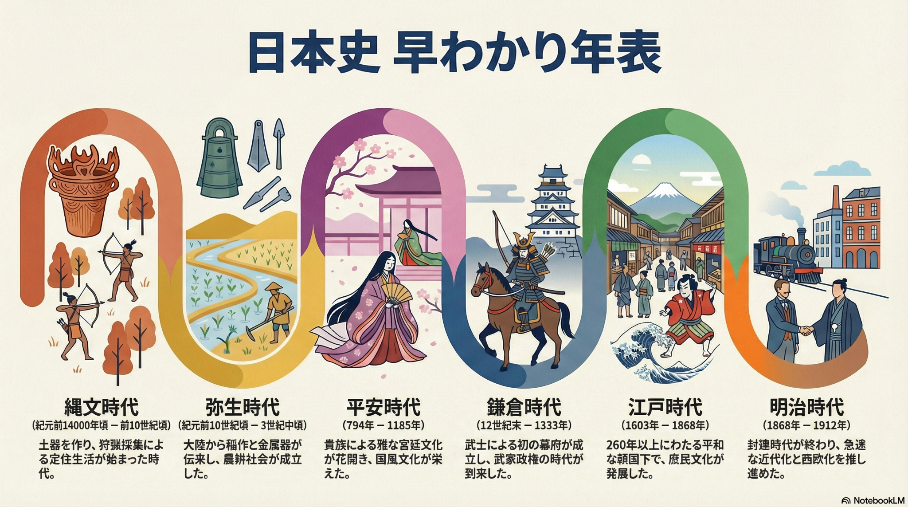
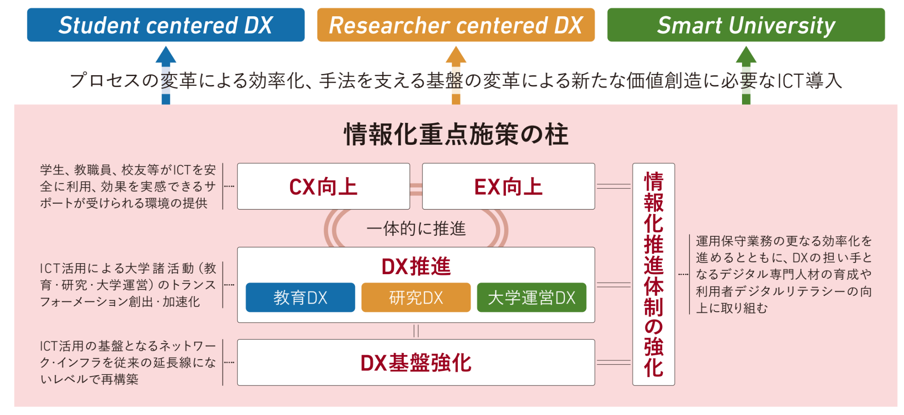

<!-- _class: cover-hero -->

教育テック事例研究Ⅰ（オンライン）

AI時代に 大学はどう変わる？

学務と教育の変化を、体験しよう

千葉大学 国際未来教育基幹　田川 翔（専門：高等教育論・地球惑星科学）

<!-- 皆さんこんにちは。今日のテーマは「AI時代に大学はどう変わるか」です。完全オンラインなので、チャットやSlidoで一緒に手を動かしながら進めます。FD研修ではなく、これからの大学と学びを一緒に考える時間にしたいと思います。社会人の方も学生の方もいると伺っています。どの立場でも"自分ごと"になるように話します。 -->

---

<!-- _class: intro -->

自己紹介

田川 翔（たがわ しょう）

千葉大学 国際未来教育基幹（アカデミック・リンク・センター／高等教育センター）
教職協働で大学教育を設計し、学生と教員を支援する

① これまで

<ul><li>もとは理学（地球惑星科学, Tagawa et al. 2021 <i>Nat. Commun.</i>）</li><li>コロナ禍の大学ICT支援・MOOC（大規模公開オンライン講座）の制作</li><li>民間企業で IT 企画・PoC・安全管理</li></ul>

② いま／この講義への思い

<ul><li>FDは東大・栗田佳代子先生門下。授業改善と PreFD（次世代の大学教員養成）も担当</li><li>『Teaching with AI』を翻訳・出版準備中（技術評論社）</li><li>"上から教える"のでなく、皆さんと一緒に考えたい</li></ul>

私自身も"変化のただ中の学習者"。一緒に考えていきましょう。

<!-- 自己紹介です。もとは理学で地球を研究していました。コロナ禍に大学のICT支援やオンライン授業づくりに関わり、民間企業でのIT企画の経験もあります。いまは高等教育論とAIの教育利活用が専門で、FDは栗田佳代子先生の門下です。プレFD、つまり「大学で教える人を育てる」授業も担当しています。私自身もこの変化のただ中にいる学習者なので、上からではなく一緒に考えたいと思っています。 -->

---

<!-- _class: summary -->

千葉大での仕事

<h2>研修・企画・授業で「AI×大学」を実装する</h2>

高等教育センター

<ul><li><b>FD・授業改善</b>：例＝シラバス確認 Gem。50授業で「指摘すべき点」の検知率100%（解説動画つきで安心の声）</li><li><b>企画</b>：副専攻・授業の設計、3つのポリシー改定とアセスメント</li></ul>

アカデミック・リンク・センター

<ul><li><b>15分セミナー</b>（講義→実践→振返り）：延べ約700名・約97%が「役立つ」</li><li><b>図書館DX</b>：Google AI Pro で18業務を自動化</li><li><b>担当授業</b>：情報リテラシー/生成AI活用講座/院・研究での生成AI/院・PreFD</li></ul>

大がかりな制度より、「触れる場」と「小さな自動化」を手元から積み上げてきた。

<!-- 千葉大で私が実際にやっていることです。高等教育センターでは、FDと授業改善。例えばシラバス確認のGemを作ったところ、50の授業で指摘すべき点の検知率が100%になりました。ALCでは、15分で講義・実践・振返りをする体験型セミナーを延べ700名に届け、97%から「役立つ」と回答をもらいました。図書館では Google AI Pro で18の業務を自動化しています。授業も学部から大学院まで担当しています。共通するのは、大きな制度より「まず触れる場」と「小さな自動化」を手元から積み上げる、というやり方です。 -->

---

<!-- _class: split -->

研究関心とイノベーター

<h2>研究も実践も、めざすは「学びやすい大学」</h2>

Google 認定イノベーター／for Education チャンピオン

<b>① 人×AI の学習支援</b>：在学中の学びを伴走し、大学・図書館の体験を高める

<b>② カリキュラムへのAI/クラウド統合</b>：科研費「AIクロス型」教育の比較・モデル化

<b>③ 本の翻訳</b>：『Teaching with AI 第2版』（Bowen & Watson／技術評論社）

海外事例と現場をつなぎ、創造的に学べる大学を探究する。

<!-- 研究の関心は3つあります。1つ目は人とAIの学習支援で、在学中の学びを伴走し、大学や図書館の体験を高めること。2つ目は既存のカリキュラムにAIやクラウドを統合すること。専門を起点に学ぶ「AIクロス型」の教育プログラムで科研費も採択されました。3つ目が、いま準備中のTeaching with AIの翻訳です。写真はGoogleの認定イノベーターとfor Educationチャンピオンのバッジで、海外の事例や仲間と現場をつなぐ役割もしています。研究も実践も、ゴールは「学びやすい大学」です。 -->

---

<!-- _class: summary -->

本日のねらい

<h2>一緒に「AI時代の大学」を体験する</h2>

<h3>ねらい</h3><ul><li>AIで〈教育〉と〈学務〉がどう変わるかを、事例とワークで"自分ごと"にする</li></ul>

<h3>進め方</h3><ul><li>レクチャー（メッセージ）×ワーク（手を動かす）</li><li>Google等の機能が中心で、本学の実践とは切り離した話も含む</li></ul>

<h3>持ち帰り</h3><ul><li>3つのメッセージ</li><li>"自分の現場で動ける最初の一歩"</li></ul>

答えは決まっていません。怖いけど面白いこの時代を、一緒に考えましょう。

<!-- 今日のねらいは3つです。教育と学務の変化を自分ごとにすること、レクチャーとワークを往復すること、そして最後に自分の一歩を持ち帰ること。Googleの機能の話も多く、千葉大の実践とは切り離した一般論も含みます。正解を配る授業ではなく、一緒に問いを立てる授業にします。 -->

---

<!-- _class: fig -->

全体像

<h2>2部構成＋3つのメッセージ</h2>

<svg viewBox="0 0 900 110" xmlns="http://www.w3.org/2000/svg" style="width:100%;max-width:860px">
<rect x="10" y="25" width="240" height="60" rx="12" fill="#FBE3E7" stroke="#A6192E" stroke-width="2"/>
<text x="130" y="62" text-anchor="middle" font-size="22" fill="#333" font-weight="700">第1部 教育の変化</text>
<rect x="330" y="25" width="240" height="60" rx="12" fill="#FBE3E7" stroke="#A6192E" stroke-width="2"/>
<text x="450" y="62" text-anchor="middle" font-size="22" fill="#333" font-weight="700">第2部 学務の変化</text>
<rect x="650" y="25" width="240" height="60" rx="12" fill="#A6192E"/>
<text x="770" y="62" text-anchor="middle" font-size="22" fill="#fff" font-weight="700">クロージング 問い</text>
<path d="M250 55 L330 55" stroke="#888" stroke-width="3" marker-end="url(#arr)"/>
<path d="M570 55 L650 55" stroke="#888" stroke-width="3" marker-end="url(#arr)"/>
<defs><marker id="arr" markerWidth="10" markerHeight="10" refX="8" refY="3" orient="auto"><path d="M0 0 L8 3 L0 6 z" fill="#888"/></marker></defs>
</svg>

① 教室からAIへ

知識の授受はAIへ。教員は「良い問題を設定し、共に考える専門家」へ。

② 影響は甚大

手元から始める活用・全体での基盤づくり・コミュニティの仲間づくり。

③ 怖いけど面白い

どこまでAIで創造性を目指し、どこまで行けるのか。

「教育」と「学務」、2つの変化を旅して、3つの問いを持ち帰る。

<!-- 今日の地図です。第1部で教育、第2部で学務の変化を見て、最後に問いへ収束します。下の3つのメッセージが今日の背骨です。最初に予告しておくので、各章でこれが立ち上がってくる感覚を味わってください。 -->

---

<!-- _class: split -->

オープニング

<h2>あなたにとって「学ぶ」とは？</h2>

問い
生成AIが来て、あなたの"学び方・働き方"は何が変わった？　何が変わらなかった？

<b>手順1（1人・1分）</b>：自分の変化を思い出す

<b>手順2</b>：チャット（or Slido）に一言で書く

<b>手順3</b>：みんなの声を全体で眺める

まず立ち止まって、自分の実感から始めましょう。

<!-- 最初のワークです。生成AIが来て、自分の学び方・働き方が何が変わって、何が変わらなかったか。1分で思い出して、チャットかSlidoに一言ください。社会人の方は職場のことでも構いません。正解はありません。皆さんの実感が、今日の議論の出発点になります。 -->

---

<!-- _class: divider -->

CHAPTER 1

# 教育はどう変わる？

## 知識の授受は、教室から AI へ

<!-- 第1部の章扉です。これから「教育がどう変わるか」を一緒に旅します。核となるメッセージは「知識の授受は、教室から AI へ」。教員の役割が問い直される、という話につなげます。 -->

---

<!-- _class: fig -->

現在地

## 生成AIは、もはや「環境」になった

<table class="dtbl">
<tr><th></th><th>調査</th><th>主な数字</th></tr>
<tr><td class="l">学生（海外）</td><td class="l">CollegeBoard(2026)</td><td class="l">利用経験 92.2%（無料版 75.1%）</td></tr>
<tr><td class="l">学生（国内）</td><td class="l">全国大学生協連(2026)</td><td class="l">n=13,277 の利用実態</td></tr>
<tr><td class="l">教員</td><td class="l">Bowen & Watson(2025)</td><td class="l">74%「学生がレポートに使用」と認識</td></tr>
<tr><td class="l">教員</td><td class="l">Bowen & Watson(2025)</td><td class="l">92% が不正・倫理面を懸念</td></tr>
</table>

出典：CollegeBoard(2026)、全国大学生協連(2026)、Bowen & Watson(2025)

「使う/使わない」の前に、AI はもう前提になっている。

<!-- まず現在地です。学生の9割超がすでに使い、教員の側もそれを認識しています。論点は「使うか否か」ではなく、もう前提になった環境をどう扱うか。皆さん自身も、すでにこの環境の中にいますよね。 -->

---

<!-- _class: split -->

仕事の変化

## 出口が変われば、学びも変わる

職種別 AI カバレッジ（青＝理論／赤＝実際）

- 青＝理論上 AI で効率化できる範囲、赤＝実際に観測された利用範囲
- Education & Library など、ホワイトカラーの大半が影響圏に
- いま赤は小さいが、これから青へ近づいていく
- 学生が出ていく"出口（仕事）"が変わる＝学びも問い直す

出典：Anthropic Economic Research（Massenkoff & McCrory 2026 ほか）

出口が変わるなら、入口（学び）も問い直す必要がある。

<!-- このレーダー図は、職種ごとに「理論上AIで効率化できる範囲（青）」と「実際の利用（赤）」を重ねたものです。今は赤が小さくても、青へ近づいていく。学生が向かう"出口"＝仕事が変われば、当然"入口"の学びも問い直すことになります。 -->

---

<!-- _class: summary -->

だから高次へ

## AIの出力は"平均点"。人は、その先へ

① 禁止は逆効果

全面禁止はこっそり使われ、かえって信頼を損なう。現実的でない。

② 平均は AI で足りる

C グレード（並）の出力は AI で十分。人は AI にできない高次の価値を。

③ 人がやる価値

人がやるからこそ生まれる学び・関係性がある。そこに時間を使う。

「AI が出せるものをただ出す人」は採れない時代へ（Bowen & Watson, AAC&U 2024）

<!-- ここが転換点です。禁止は逆効果、平均点ならAIで足りる。だからこそ人は、AIには出せない高次の価値や、人がやるからこそ生まれる学び・関係性に時間を割くべき。皆さんが評価される軸も、ここに移っていきます。 -->

---

<!-- _class: fig -->

学びの地図

## AIが代替できる学び・できない学び

<svg viewBox="0 0 760 360" xmlns="http://www.w3.org/2000/svg" width="100%" style="max-height:266px">
  <g text-anchor="middle" font-family="sans-serif">
    <polygon points="380,20 470,80 290,80" fill="#832D18"/>
    <text x="380" y="62" font-size="20" font-weight="800" fill="#fff">創造</text>
    <rect x="290" y="80" width="180" height="48" fill="#A33818"/>
    <text x="380" y="111" font-size="20" font-weight="800" fill="#fff">評価</text>
    <rect x="248" y="128" width="264" height="48" fill="#C25A33"/>
    <text x="380" y="159" font-size="20" font-weight="700" fill="#fff">分析</text>
    <rect x="206" y="176" width="348" height="48" fill="#1A6BB0"/>
    <text x="380" y="207" font-size="20" font-weight="700" fill="#fff">応用</text>
    <rect x="164" y="224" width="432" height="48" fill="#3F87C4"/>
    <text x="380" y="255" font-size="20" font-weight="700" fill="#fff">理解</text>
    <rect x="122" y="272" width="516" height="50" fill="#7FB0D8"/>
    <text x="380" y="304" font-size="20" font-weight="700" fill="#1a3a52">記憶</text>
    <text x="700" y="74" font-size="17" text-anchor="end" fill="#832D18" font-weight="700">人が担う</text>
    <text x="700" y="98" font-size="15" text-anchor="end" fill="#5B6068">価値・判断軸を設定</text>
    <text x="700" y="290" font-size="17" text-anchor="end" fill="#1A6BB0" font-weight="700">AIが代替/支援</text>
    <text x="700" y="314" font-size="15" text-anchor="end" fill="#5B6068">低〜中次は任せやすい</text>
  </g>
</svg>

- ① 低次→高次まで積まないと、AIを使いこなせない
- ② 手計算 vs 計算機：感覚を持たず代替すると、長期的に困る

出典：Bloom(1956/2001)、栗田・中村(2023)

AIに任せるほど、自分で積む基礎と高次の判断が効いてくる。

<!-- ブルームのピラミッドです。低〜中次（記憶・理解・応用）はAIが代替・支援しやすい。一方、高次の創造や評価＝価値・判断軸は人が設定します。ただし土台を積まずに代替すると、計算機を使うのに数の感覚がないのと同じで、後で困る。任せるほど、基礎と高次の判断が効いてきます。 -->

---

<!-- _class: split -->

個別最適

## 知識を渡す役割は、AIがスケール

<svg viewBox="0 0 380 300" xmlns="http://www.w3.org/2000/svg" width="100%" style="max-height:360px">
  <g font-family="sans-serif">
    <line x1="30" y1="250" x2="360" y2="250" stroke="#5B6068" stroke-width="2"/>
    <path d="M40,250 C100,250 110,90 160,90 C210,90 220,250 280,250 Z" fill="#C9D6E0" stroke="#5B6068" stroke-width="2"/>
    <path d="M120,250 C180,250 190,40 240,40 C290,40 300,250 360,250 Z" fill="#E7B7A3" stroke="#A33818" stroke-width="2.5" fill-opacity="0.75"/>
    <text x="150" y="80" font-size="16" text-anchor="middle" fill="#5B6068" font-weight="700">通常授業</text>
    <text x="240" y="32" font-size="16" text-anchor="middle" fill="#A33818" font-weight="800">1対1指導</text>
    <text x="200" y="278" font-size="17" text-anchor="middle" fill="#A33818" font-weight="800">成績が右へ +2σ</text>
  </g>
</svg>

Bloom の 2 シグマ問題

- 1対1指導は成績を大きく上げる。でもコスト的に不可能だった
- 生成AIは「個別最適なチューター」をスケールさせうる
- 速く・何度でも・理解度に合わせて。0→1の壁打ちにも
- ※「学び方」「既知との関係」に向き合うプロセスで使うと"学びの道具"に

出典：Bloom(1984)、Bastani et al.(2025) PNAS

知識を渡す役割は、AIが個別最適にスケールしていく。

<!-- ブルームの「2シグマ問題」です。1対1指導は成績分布を大きく右にずらすほど効果が高い。でもコスト的に全員には無理でした。生成AIは、その個別最適なチューターをスケールさせうる。速く・何度でも・理解度に合わせて。ただし"学び方"に向き合うプロセスで使ってこそ、学びの道具になります。 -->

---

<!-- _class: split -->

関わり方

AI＝RPGの"場所ジャンプ"（ファストトラベル）

### 同じAIでも、関わり方しだい

- 学生A：学びは"点数を取ること" → AIは「楽する道具」
- 学生B：学びは"自分を伸ばすプロセス" → AIは「学びの伴走者」
- ファストトラベルばかりだと、経験値は貯まらない
- 答えを直接教えない学習用AIには、確かな効果

同じAIでも、関わり方しだいで学びは深くも浅くもなる。

出典：Bastani et al.(2025) PNAS

<!-- ファストトラベルの比喩で。RPGで移動を全部スキップするとレベルが上がらないのと同じで、AIに丸投げすると経験値が貯まらない。鍵はAIの性能ではなく、学習者がどう向き合うか。同じツールでも結果は真逆になる、という実証研究も出ています。 -->

---

<!-- _class: message -->

# 教員は「答えを教える人」から 「良い問いを立て、共に考える専門家」へ

## 知識の授受は、教室から AI へ

<!-- ここで第1部の核心メッセージ①を。知識を渡す役割はAIが担える時代。だからこそ教員の価値は「何を問うか」「どう一緒に考えるか」に移っていく。これは脅威ではなく、役割の進化だと捉えたい。 -->

---

<!-- _class: summary -->

役割転換

## 教員は、専門家からファシリテーターへ

① 経験が先行

理論を教えてから実践、ではなく、AIと先に実践し"生産的な失敗"から学ぶ

② 場の創造

知識の一方向な伝達ではなく、人が集うからこそ学べる価値を設計する

③ 人間固有の力

良い問い・批判的な編集・選択と責任・他者との関係づくり

教員＝専門家から、対話・内省・成長を促すファシリテーターへ（私見）

<!-- 役割は3つの軸で転換します。理論より経験が先行し、失敗から学ぶ。知識伝達ではなく「集う価値」を設計する。そして問いを立て編集し責任を持つという人間固有の力を発揮する。専門家からファシリテーターへ、というのが私の見立てです。 -->

---

<!-- _class: split -->

学びの道具に

NotebookLMで資料を1枚に要約

### AIは"答え製造機"でなく"経験"の道具

- NotebookLM：資料を図・クイズ・音声に変換し理解を補助
- 課題の現実化：ありそうな問題をAIで実際に解く（製品案50→選抜 等）
- 教員の意図を実装：学んでほしい順番をカスタムAI(Gem等)に

AIは、学びを深める「経験」を作る道具になる。

出典：Bowen & Watson(2025)／図は NotebookLM で生成

<!-- AIを答えを出す機械として使うと学びは浅くなる。でも「経験を作る道具」として使えば話は別。資料を多様な形に変える、現実の課題を実際に解かせる、学ぶ順番を教員が設計してカスタムAIに仕込む。使い方しだいで、学びを深める装置になります。 -->

---

<!-- _class: split -->

ワーク①

## 「AIがあるからこそ深まる問い」をデザインする

ねらい

AIが一発で答えてしまう課題を、"AIを使っても／使うからこそ学べる"課題に作り変える。

ポイント：目的（学習成果）から考える／高次（創造・評価）を狙う

<b>手順1（1人・3分）</b>：AIが一発で答えそうな課題を1つ挙げる

<b>手順2（1人・5分）</b>：作り変える（壁打ちにAI可）

<b>手順3（グループ・7分）</b>：1つ選んで深め、チャットで共有

案外かんたん。目的から考えれば、課題はすぐ作り変えられる。

<!-- いよいよ手を動かすワークです。AIに丸投げで終わる課題を、AIを使うからこそ深まる課題に変える。まず一人で素材出しと改造、そのあとグループで一つ磨いてチャットで共有。壁打ち相手にAIを使ってもOK。目的から逆算すると意外と簡単です。 -->

---

<!-- _class: summary -->

設計のヒント

## AIに代替されない課題の作り方

プロセス重視

下書き・対話ログ・ルーブリックで評価する

現実の文脈

自分の経験・地域・現場に紐づける

人＋AI

ファクトチェック／反対意見役／ピアレビュー

評価は"結果"から"プロセス"へ。AIとの対話記録も評価対象にできる。

出典：Bowen & Watson, AAC&U(2024/2025)

<!-- 良い課題のタネは3つ。プロセスを見る、現実の文脈に紐づける、人とAIを組み合わせる。ポイントは、評価軸を結果からプロセスへ移すこと。AIとの対話記録そのものを評価対象にできれば、AIに代替されない課題が設計できます。ワークの作り変えにもこのヒントを使ってみてください。 -->

---

<!-- _class: divider -->

CHAPTER 2

# 大学・学務はどう変わる？

## 影響は甚大。手元から、基盤づくり、仲間づくり。

<!-- 第2部です。第1部は「教室からAIへ」という教える側の話でした。ここからは視点をぐっと引いて、大学そのもの・学務がどう変わるかを見ます。結論を先に言うと、影響は全方位で甚大。でも怖がる必要はなくて、鍵は「手元から」「基盤を共に」「仲間と」の3つです。 -->

---

<!-- _class: summary -->

なぜ"今"変わるのか

## 大学は、もう「鉄道」では走りきれない

トロウの段階モデル

進学率<b>15%</b>超で〈エリート→マス〉、<b>50%</b>超で〈ユニバーサル〉段階へ。学ぶ人も目的も多様に。

いまの大学のねじれ

エリート段階の制度のまま、マス段階の感覚の教員が、ユニバーサル段階の教育を迫られている。

「飛行機があるのに、鉄道だけで一生懸命走っている」状態。AIは、その"飛行機"になりうる。

出典：M. トロウ（高等教育の段階モデル）

<!-- なぜ今、大学が変わるのか。トロウのモデルでは、進学率が15%を超えるとエリートからマスへ、50%を超えるとユニバーサル段階へ移行します。日本はとっくにユニバーサル段階。でも制度はエリート段階のまま、教員はマス段階の感覚で、ユニバーサル段階の多様な学生を教えている。いわば「飛行機があるのに鉄道で頑張っている」状態です。AIは、その飛行機になりうる。 -->

---

<!-- _class: fig -->

影響範囲

## AIは大学の"あらゆる層"に効く

<table class="dtbl">
<tr><th></th><th>事務・タスク</th><th>フィードバック</th><th>クリエイティブ</th><th>データ活用</th></tr>
<tr><th>マクロ （全学）</th><td class="l">ポリシー策定</td><td class="l">KPI経営支援</td><td class="l">広報・教材生成</td><td class="l">教学IRの統合</td></tr>
<tr><th>ミドル （課程）</th><td class="l">教務自動化</td><td class="l">質保証・点検</td><td class="l">カリキュラム設計</td><td class="l">学修ログ分析</td></tr>
<tr><th>ミクロ （授業）</th><td class="l">窓口DX・受付</td><td class="l">Writing支援・採点</td><td class="l">AIチューター</td><td class="l">研究クラウド</td></tr>
</table>

授業から経営まで、AIは大学のあらゆる層に効いてくる。

<!-- このマトリクスがこの章の地図です。縦は全学・課程・授業の3層、横は事務処理からデータ活用まで。どのマスにもAIが入り込む余地があります。皆さんがいま関わっている場所はどのマスでしょう。1つに限らず、複数に効くのが今回の特徴です。 -->

---

<!-- _class: fig -->

全国調査2025

## 方針は増えた。でも"動かす"段階で詰まる

<table class="dtbl">
<tr><th>項目</th><th>数字</th></tr>
<tr><td class="l">ガイドライン策定/策定中</td><td>68.1%（うち66.7%は更新なし）</td></tr>
<tr><td class="l">壁：実際に機能させる</td><td>85.8%</td></tr>
<tr><td class="l">壁：技術進化に追従</td><td>83.2%</td></tr>
<tr><td class="l">壁：人手・時間が足りない</td><td>77.0%</td></tr>
<tr><td class="l">支援が未実施（教員/職員/学生）</td><td>49.6 / 50.4 / 46.9%</td></tr>
<tr><td class="l">有料AI提供（大規模 vs 小規模）</td><td>50.0% vs 18.8%</td></tr>
</table>

方針より「運用」と「格差」が課題。だから"手元の実践"が要る。

出典：高等教育における生成AI調査（2025年9–10月, n=113）

<!-- 全国調査の数字です。方針づくり自体は7割近くまで進みました。でも本当の壁はその先で、「実際に機能させる」が一番の難関。人手も時間も足りない。しかも大学の規模で有料AIの提供に大きな差が出ている。つまり立派な方針より、運用と格差が課題なんです。だから上を待つより手元から動く意味がある。 -->

---

<!-- _class: summary -->

手元から①②

## 千葉大は"手元から"始めた

① 風土づくり研修

15分×3本（触る→みんなで試す→反応を見る）。延べ約700名・約97%が「役立つ」と回答。まず"使ってみる場"を低い段差でつくった。

② 学生育成

生成AI活用講座（LLMを知る／関わり方／アプリを作る）。学生参画型のFD/SDへつなげ、教わる側も担い手に。

まず"触れる場"をつくる。一人が動くと、情報が集まり、風土が変わる。

<!-- 千葉大が実際にやったことを2つ。1つは15分×3の小さな研修。触って、みんなで試して、反応を見る。難しい理論より「まず使う」を優先しました。もう1つは学生育成。学生にAI活用講座を開き、教わる側を担い手に変えていく。大がかりな制度より、小さく触れる場づくりが効きます。 -->

---

<!-- _class: split -->

手元から③④

## 下からの改善＋上からの対話

千葉大「AI meet」学長・教員・学生の対話

③ ボトムアップ

現場業務をAIで小さく自動化。図書館は18業務、Difyでシラバス→ISBN/価格の抽出も。

④ トップダウン

学長・教員・学生が「AI時代の学び方」を語る場（AI meet）。教職協働の議論で情報が集約。

手元の改善（下から）と、語る場づくり（上から）を両輪で。

出典：千葉大学プレス（ちばだいプレス AI meet）

<!-- 残り2つ。下からの改善は、現場の面倒な作業をDifyで小さく自動化する。シラバスから本のISBNと価格を抜く、みたいな地味だけど効く改善です。上からは、学長と教員と学生が同じ場で「これからの学び方」を語るAI meet。下と上、両方を回すと自分のところにも情報が集まってきます。 -->

---

<!-- _class: split -->

DXの全体像

## 目的地は、実は似ている

早稲田 情報化重点施策の柱

<ul>
<li>早稲田の重点施策：教育DX／研究DX／大学運営DX</li>
<li>さらに基盤強化と CX・EX（体験価値）</li>
<li>やること・目指す方向は多くの大学で一致する</li>
<li>でもAIとクラウドでルールが変わった</li>
<li>「個別システム前提」→「汎用に連携」へ</li>
</ul>

目的地は似ている。手段がAIで安く・速く・横展開可能に。

出典：早稲田大学 2024–2026 情報化重点施策

<!-- 「うちは特殊だから」と思いがちですが、他大学の青写真を見ると目的地は驚くほど似ています。早稲田の柱も教育・研究・運営のDX。やりたいことは共通なんです。違うのは手段。AIとクラウドで、個別システムを作り込む時代から、汎用部品を連携させる時代へルールが変わりました。だから雛形を真似できる。 -->

---

<!-- _class: summary -->

DXの構造

## 変わらないために、変わり続ける

トップダウン

経営が基盤と方向を定め、旗を振る。

ボトムアップ

現場がプロセスを再構築。データセントリックへ。

風土・スキル

PoCを重ね、小さな前進から意欲を醸成。

WHY＝ミッション本質の追求。WHAT＝横連携・安全な実験環境・専門人材。

<!-- DXの構造は3つの力の合わせ技です。経営が旗を振るトップダウン、現場がプロセスを作り直すボトムアップ、そして小さな実験を重ねて意欲を育てる風土・スキル。大事なのはWHY。本質的なミッションを守るために、手段は変わり続ける。「変わらないために、変わり続ける」というのが芯です。 -->

---

<!-- _class: fig -->

横連携

## 課題も解決策も、実は横並び

<table class="dtbl">
<tr><th>動き</th><th>中身</th></tr>
<tr><td class="l">EDUCAUSE 2025（n=673）</td><td class="l">コラボ強化を40%が認識</td></tr>
<tr><td class="l">北米：AAC&U</td><td class="l">横連携の場（Bowen & Watson 2025, n=191）</td></tr>
<tr><td class="l">国内：TeamSwimmy 等</td><td class="l">教育テックの共創コミュニティ</td></tr>
<tr><td class="l">共通の発想</td><td class="l">車輪の再発明をやめ、事例・システムを共有</td></tr>
</table>

つながるほど、一人の負担は軽くなる。

出典：EDUCAUSE 2025 AI Landscape Study、AAC&U（2025）

<!-- 抱える課題はどの大学も似ています。だから解決策も共有できる。EDUCAUSEの調査では4割がコラボ強化を意識し、北米ではAAC&U、国内ではTeamSwimmyのような共創の場が育っています。車輪の再発明をやめて、事例とシステムを持ち寄る。つながるほど、一人あたりの負担は軽くなります。 -->

---

<!-- _class: message -->

# 手元から始め、基盤を共に作り、 仲間とつながる

## 大学への AI の影響は甚大。だから「一人で抱えない」。

<!-- 第2部のメッセージです。影響は全方位で甚大、でも答えはシンプル。手元の小さな実践から始め、全体の基盤を共に作り、仲間とつながる。この3つです。一番伝えたいのは最後の一言、「一人で抱えない」。皆さんもこの輪の一員として、ぜひ一歩を持ち帰ってください。 -->

---

<!-- _class: split -->

ワーク②

## あなたの現場で、AIで変える"小さな一歩"

ねらい

研究・学習・業務で繰り返している面倒な作業を1つ選び、AI／クラウドでどう変えるかを設計する。

ポイント：完璧主義を捨てる ／ 小さく PoC（試作）

<b>手順1（1人・3分）</b>：面倒な「繰り返し作業」を1つ挙げる

<b>手順2（1人・5分）</b>：入力 → AI → 出力 の流れを書く

<b>手順3（グループ・7分）</b>：横展開できる？ 共有・改善案を出す

完璧でなくていい。小さく試して、素早く直す。

<!-- まずは手を動かす回です。研究のデータ整形でも、議事録でも、メール下書きでも何でもOK。入力・AI・出力の3点だけ書ければ設計は十分です。グループでは「それ自分も使える」を探してください。 -->

---

<!-- _class: divider -->

CHAPTER 3

# 怖いけど、面白い時代

## どこまで創造性を目指せるか

<!-- いよいよ最終章です。ここまで不安な話もありましたが、最後は前を向きます。AIで私たちはどこまで創造的になれるのか、一緒に想像してみましょう。 -->

---

<!-- _class: summary -->

変わらぬ価値

## それでも、大学にしかない価値がある

研究的価値

良い課題があり、専門家からフィードバックを得られる場。

講義的価値

体系立てて学べる。（ここは"揺らぐ"かも？）

人が集う価値

志を同じくする仲間に出会い、安心して失敗できる。

未来像は「最短で学べ、高度な"模擬練習"ができる"学べるコミュニティ"」。人が集う価値ある問いに集中する。

<!-- AIが知識を肩代わりしても、消えない価値が3つあります。とくに「人が集う価値」と「良い問いに伴走する価値」。講義的価値だけは、正直これから揺らぐかもしれません。 -->

---

<!-- _class: split -->

転換点

## 学歴からスキルへ、大学が動く

<svg viewBox="0 0 420 360" xmlns="http://www.w3.org/2000/svg" font-family="sans-serif">
<line x1="60" y1="30" x2="60" y2="330" stroke="#A33818" stroke-width="3"/>
<circle cx="60" cy="80" r="7" fill="#A33818"/>
<text x="82" y="74" font-size="20" font-weight="700" fill="#832D18">〜2000年</text>
<text x="82" y="100" font-size="18" fill="#333">学位・学歴が中心</text>
<circle cx="60" cy="180" r="7" fill="#A33818"/>
<text x="82" y="174" font-size="20" font-weight="700" fill="#832D18">2020年ごろ</text>
<text x="82" y="200" font-size="18" fill="#333">スキルとのハイブリッド</text>
<circle cx="60" cy="290" r="9" fill="#A33818"/>
<text x="82" y="284" font-size="20" font-weight="700" fill="#A33818">いま</text>
<text x="82" y="310" font-size="18" fill="#333">スキルが採用に先行</text>
</svg>

<h3>Skills First の時代へ</h3>

- 学歴重視から、スキルが採用に先行する時代へ
- すでにAIが「自分より個別最適に教える」場面も
- 大学は転換点。教えることの"分業"が起きる
- （人の発達そのものは変わらない）

学歴からスキルへ。大学の役割は"場"と"問い"へシフトする。

出典：OECD(2025) Skills-First、Bloom(1984)

<!-- 採用の世界ではすでに「何ができるか」が学歴に先行し始めています。Bloomの2シグマが示すように、個別最適な指導は強力で、AIがそれを担い始めた。大学の役割は「教える」から「場と問い」へ移っていきます。 -->

---

<!-- _class: summary -->

種明かし

## じつは、この授業スライドもAIで作りました

AIがやったこと

<ul><li>他大FD・調査・論文の要約・統合</li><li>章を並列に分担執筆（"fan-out"）</li><li>図は画像生成、年表は NotebookLM</li><li>文章・発表者ノートの下書き</li></ul>

人がやったこと

<ul><li>問い・構成・メッセージの設計</li><li>事実確認と取捨選択（編集）</li><li>最終的な責任を引き受ける</li></ul>

数日の作業が数時間に。AIは"答え"でなく、創造を効率化＆拡張する道具。

<!-- 種明かしです。実はこのスライド自体、AIでかなり効率化して作りました。複数の資料をAIで要約・統合し、章を並列で分担執筆させ、図は画像生成、年表はNotebookLM、文章やこの発表者ノートも下書きはAIです。でも、問いと構成とメッセージを決め、事実を確認し、取捨選択し、最終責任を持つのは人。まさに今日の「人は良い問いと編集へ」を、この資料づくり自体が体現しています。数日かかる作業が数時間になりました。 -->

---

<!-- _class: message -->

# わたしたちは、どこまでAIで 創造性を目指し、どこまで行けるのか

## 怖いけど、面白い時代が始まる

<!-- これがメッセージ③です。AIは道具であると同時に、私たちの創造性をどこまで引き上げられるかという問いそのもの。怖さの裏側には、確かに面白さがあります。 -->

---

<!-- _class: wrap -->

まとめ

## 持ち帰る3つのメッセージ

- ① 知識の授受は教室からAIへ。教員は「良い問いを立て、共に考える専門家」へ
- ② 影響は甚大。手元から始め・基盤を共に作り・仲間とつながる
- ③ 怖いけど面白い。どこまで創造性を目指せるか、を問い続ける
- （補）まず"触れる場"と"小さな一歩"から。一人が動くと、変わる

<!-- 今日の背骨を3行で。知識の授受はAIへ、影響は甚大だから手元と基盤と仲間で、そして怖いけど面白い。最後の補足が一番大事かもしれません。まず一人、動いてみること。 -->

---

<!-- _class: split -->

ワーク③

## 10年後、あなたが実現したい大学は？

問い

AI時代、どんな大学教育を理想に思う？ そのために、自分は何から関わる？

<b>手順1（1人・3分）</b>：あなたの理想を書き出す

<b>手順2（グループ・8分）</b>：チームで1つに言語化する

<b>手順3</b>：全体共有 → そのまま Q&A へ

答えは、これから皆さんが作っていく。

<!-- 最後のワークです。正解はありません。皆さんは教育とテクノロジーを学ぶ仲間であり、これからの大学を実際に作る人たち。理想と「自分の最初の一歩」をセットで言葉にしてください。 -->

---

<!-- _class: refs -->

参考文献

## 参考文献・出典

- Bowen, J. A., & Watson, C. E. (2024/2025). *Teaching with AI*. AAC&U.（技術評論社より翻訳出版予定）
- Bastani, H., et al. (2025). Generative AI and learning. *PNAS*.
- Bloom, B. S. (1984). The 2 sigma problem. *Educational Researcher*.
- Deng, R., et al. (2025). Does ChatGPT enhance student learning? *Computers & Education*.
- OECD (2025). *Empowering the Workforce in the Context of a Skills-First Approach*.
- EDUCAUSE (2025). *2025 AI Landscape Study*.
- 高等教育における生成AI調査 (2025年9–10月). https://genai-higher-ed-jp.github.io/survey-2025-sep-oct/
- 早稲田大学 (2024). 情報化重点施策 2024–2026.
- 文部科学省 (2023). 大学・高専における生成AIの教学面の取扱いについて.

<!-- 今日の根拠となった主な文献です。スライドはあとで共有します。とくにBowen & Watsonの『Teaching with AI』と、国内の生成AI調査は、皆さんの研究の出発点にもなるはずです。 -->

---

<!-- _class: qa -->

# Q&A

## 一緒に、AI時代の大学と学びを切り拓きましょう

<!-- ありがとうございました。チャットとSlidoに質問をどうぞ。今日はずっと「一緒に考える仲間」として話してきました。ここからの対話も、その続きです。 -->
