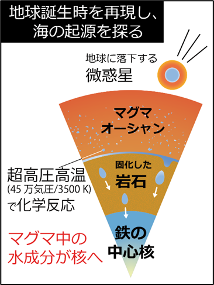
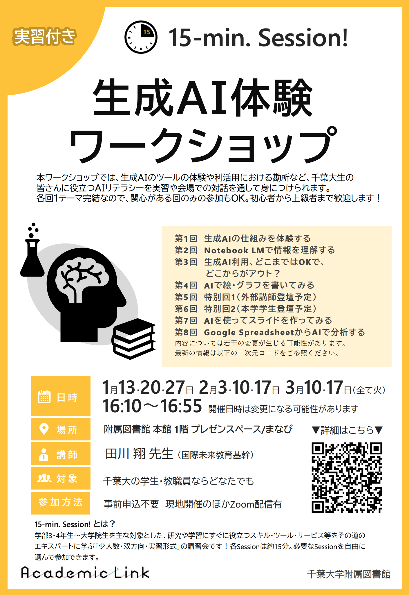
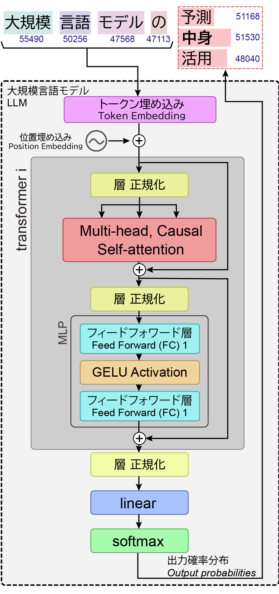
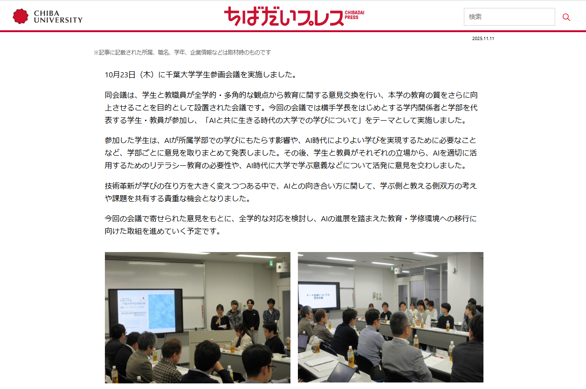
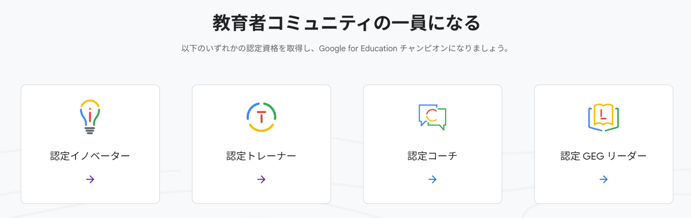
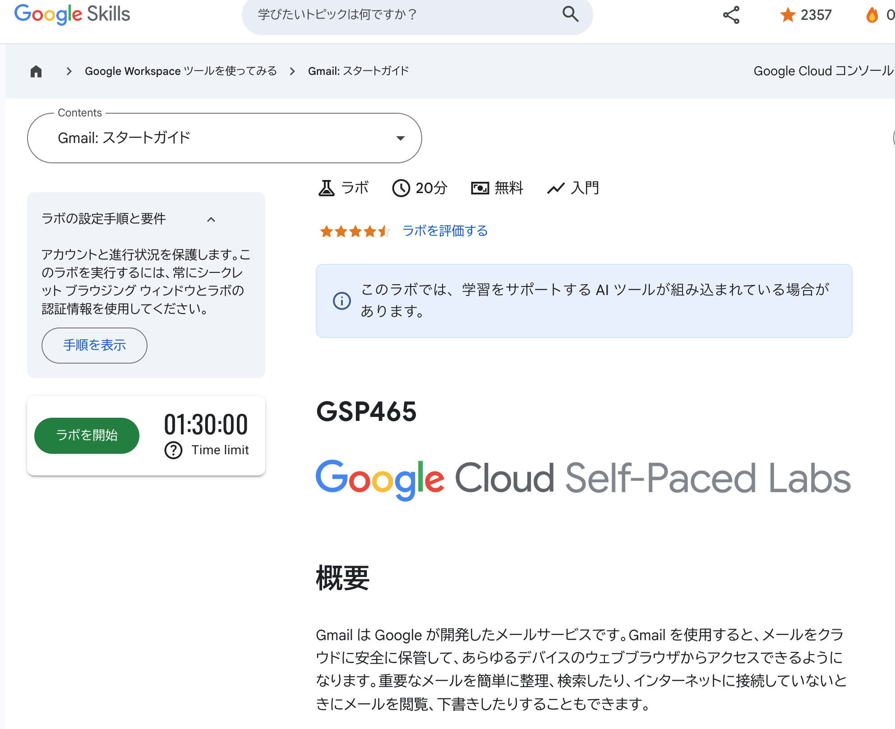
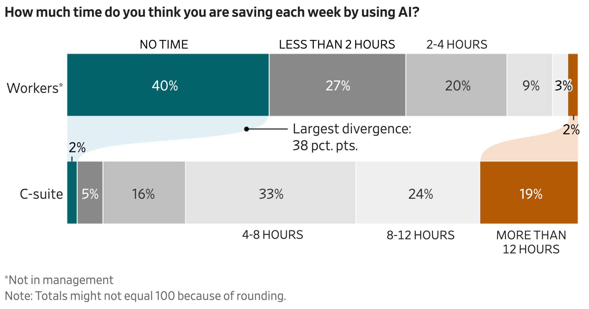
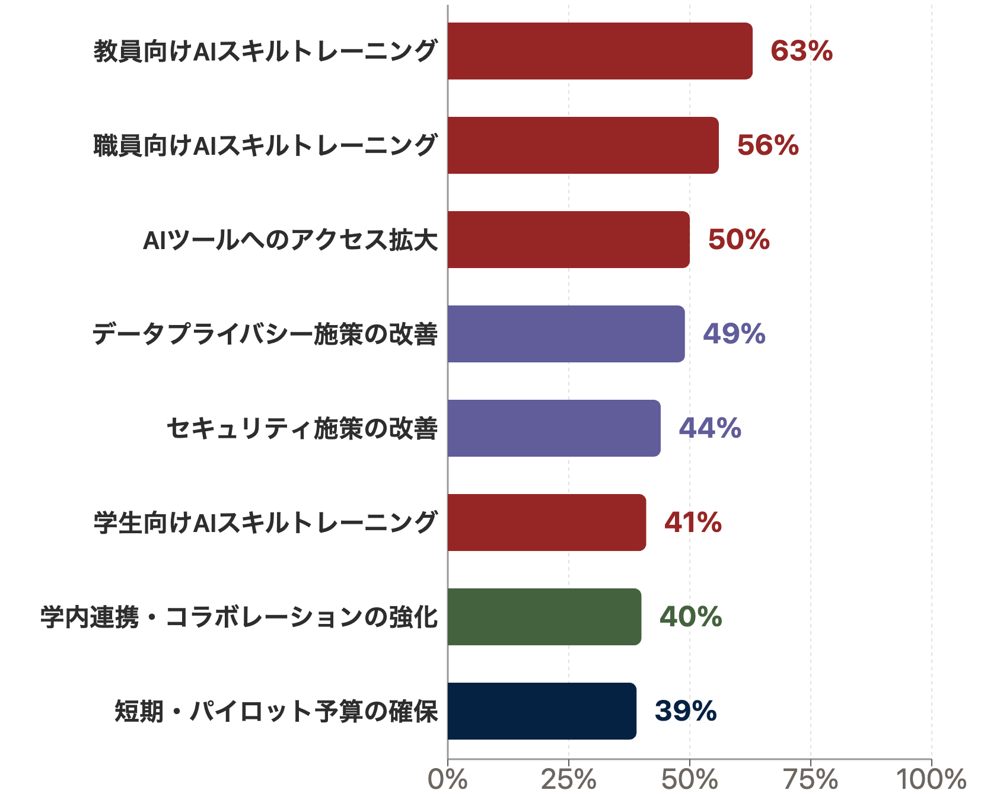
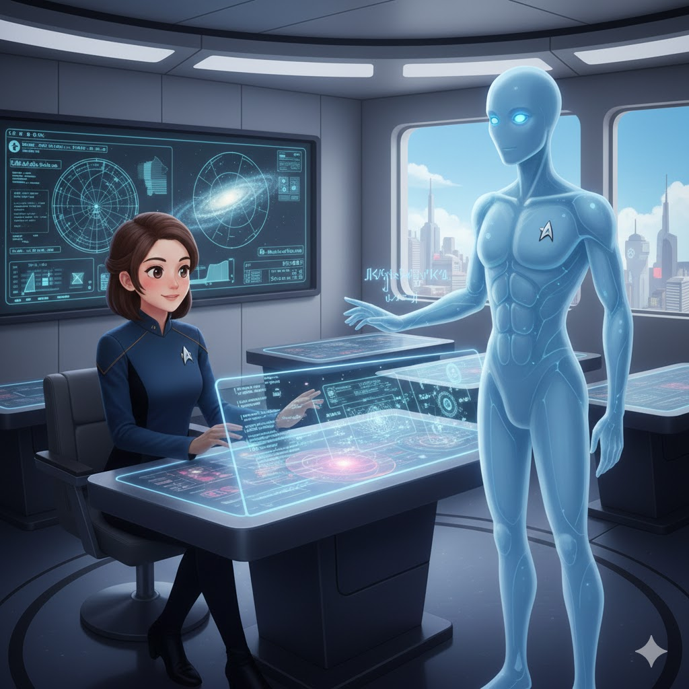
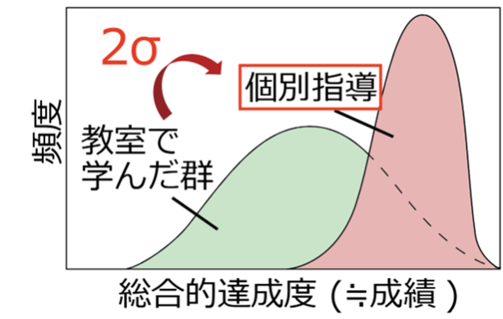

<!-- _class: ppt -->

‹#›

開始に先立ち

① A4 1枚のシートの表の問へ、ご回答をお考え下さい

&#8203;

&#8203;

② インタラクションツール Slidoにアクセスして下さい

　　URLを配布したり、質問やアンケートをとったりします

    お名前などの個人情報の入力は禁止です

　　所属組織の意見ではなく、個人としてご記入下さい

https://app.sli.do/event/626s4pbDxme1HR9ezTa9H2

スマホから

PCから

方法1 Google検索「Slido」→コード入力

方法2 直接リンク

1134033

---

<!-- _class: ppt -->

国立大学法人 千葉大学

国際未来教育基幹 田川 翔

‹#›

みんなで創る大学DX： 実践事例紹介と横連携の価値

2026/1/25 （日）　TeamSwimmy 教育・経営テック共創会議

大学運営における

生成AI活用

---

<!-- _class: ppt -->

‹#›

田川　翔 

講師紹介

高等教育センター：FD、PreFD、内部質保証

図書館/アカデミックリンクセンター：SD、授業外学習支援

たがわ    しょう

教職協働で大学教育を設計し、学生と教員を支援する

①元々は理学の人

②色々な経験

③大学のUX変革

- 大学のICT支援 (コロナ禍)

- MOOCの制作

- 民間企業での経験

  IT企画 / PoC/ 安全管理

大学での教え方

生成AI/ICTの教育利活用

ミッション： 大学に関わる皆様の体験（エクスペリエンス）の向上

---

<!-- _class: ppt -->

今日の構成

20分×2テーマ：合計40分の2部構成

Session 1: AIの活用事例と風土醸成の事例の共有

&#8203;

  目的： 「現在地」と「今後進むべき方向」を把握する

  目標： 情報共有を通して、組織で使えるアイデアや

　　　　　ヒントを見つけて頂く

Session 2: 大学DXの要素と横展開の価値

---

<!-- _class: ppt -->

‹#›

インタラクティブ・プレゼン

 インタラクションツール Slidoにアクセスして下さい

　　URLを配布したり、質問やアンケートをとったりします

    お名前などの個人情報の入力は禁止です

　　所属組織の意見ではなく、個人としてご記入下さい

&#8203;

　　答えた内容は、匿名で反映されます。

https://app.sli.do/event/626s4pbDxme1HR9ezTa9H2

スマホから

PCから

方法1 Google検索「Slido」→コード入力

方法2 直接リンク

1134033

---

<!-- _class: ppt -->

Do not edit

How to change the design

1-1: 大学契約下/データ保護で使える AIは?

Presenting with animations, GIFs or speaker notes? Enable our Chrome extension

<!-- 📣 This is Slido interaction slide, please don't delete it.✅ Click on 'Present with Slido' and the poll will launch automatically when you get to this slide. -->

---

<!-- _class: ppt -->

Do not edit

How to change the design

1-2: 大学契約下でiPaaSの

中核になるのは？

Presenting with animations, GIFs or speaker notes? Enable our Chrome extension

<!-- 📣 This is Slido interaction slide, please don't delete it.✅ Click on 'Present with Slido' and the poll will launch automatically when you get to this slide. -->

---

<!-- _class: ppt -->

Do not edit

How to change the design

1-3: 大学の生成 AI の利活用ポリシーであるのは？

Presenting with animations, GIFs or speaker notes? Enable our Chrome extension

<!-- 📣 This is Slido interaction slide, please don't delete it.✅ Click on 'Present with Slido' and the poll will launch automatically when you get to this slide. -->

---

<!-- _class: ppt -->

Do not edit

How to change the design

1-4: 生成AIを大学の業務・授業の関係で使う頻度は？

Presenting with animations, GIFs or speaker notes? Enable our Chrome extension

<!-- 📣 This is Slido interaction slide, please don't delete it.✅ Click on 'Present with Slido' and the poll will launch automatically when you get to this slide. -->

---

<!-- _class: ppt -->

橋口さんの発表の振り返り

大学とAIは親和的：要素技術が揃い民主化された今がチャンス

DX推進の3つの柱

&#8203;

①基盤整備

　 機密情報の入力可

   プラットフォーム

&#8203;

②体制整備

　 AI CoE &amp; 教職協働

　 研修・スキル形成・風土

&#8203;

③ツール導入

   iPaaSほか

課題解決領域

&#8203;

①情報集約・可視化

　 KPI、経営財務指標、 　 Enrollment Management

&#8203;

②事務作業

　 報告書作成などの定型業務

　　n8nなどでの自動化

&#8203;

③学生支援・広報

   個別最適な支援・発信

① データ管理変革

　ローコンテキストで

　構造化・標準化

② 業界での横連携

　改善事例共有

　システムの共通化

変化：クラウド/iPaaS/AIで、非常に安くPoCし、横展開可能

---

<!-- _class: ppt -->

Do not edit

How to change the design

2-1: 大学全体や事務組織内での生成 AI 活用と印象/結果や課題感を教えて下さい。(5分)

Presenting with animations, GIFs or speaker notes? Enable our Chrome extension

<!-- 📣 This is Slido interaction slide, please don't delete it.✅ Click on 'Present with Slido' and the poll will launch automatically when you get to this slide. -->

---

<!-- _class: ppt -->

千葉大学での取り組み事例①

AIを活用する風土づくり

環境

対象：大学院生 + 教職員 (初心者)

　60-70名程 + 事後で映像配信

講義

体験

議論・座談会

最初の15分

真ん中の15分

最後の15分

「触ってみる」

「みんなで試す」

「反応を見る」

概ね好評

教職員多数

---

<!-- _class: ppt -->

生成AI活用講座 / Hands-on Generative AI Workshop

生成AIアプリを作ってみる

大規模言語モデルを知る

AIとの関わり方を考える

AIリテラシ/倫理

レポート

・人間中心のAI社会原則

・安全性

・プライシー

・透明性

・公平性

・説明可能性

・AIの活用例

 →企業での活用例を調査

・生成AIの自分なりの説明

・AIとの関わり方レポート

テスト

グループワーク

環境

千葉大学での取り組み事例②

AIツールを作れる学生の育成 → 学生参画型のFD?

---

<!-- _class: ppt -->

職務を越えたディスカッション・ユースケースの洗い出し

ボトムアップ

千葉大学での取り組み事例③

ボトムアップから、業務フローと体験を少しずつ変えていく

教職協働での議論: AI CoE的？

 →自分が動くことで情報が集約

AIをもちいた概念図の作成

Difyを説明後、ニーズの把握 (例)

◆入力：シラバスの文字情報

    出力：購入必要な図書のISBN/価格・著者名

&#8203;

◆現行のフロー

① シラバスデータ（csv）を入手

② 「教科書」「参考書」欄に書かれている図書の情報を確認

③  シラバスにあるデータの欠け/ISBNを補完

④ 目録で重複調査

⑤ 所蔵のない図書・最新版が刊行されている図書を購入

&#8203;

◆②に記載されている情報

・ISBNが明記されているかどうかも教員次第。

・記載されているタイトル等に誤りがある場合も多い。

・「適宜指示」など図書情報以外の文言も含まれる。

&#8203;

※昨年度：全◯◯件 / 1件あたり平均〇〇分

---

<!-- _class: ppt -->

‹#›

AIとともにある時代、

どのように学ぶか、

学長も教員も学生も、

話す場を作る

&#8203;

→問題提起/MITなど 　でも実施

https://chibadaipress.chiba-u.jp/information/ai_meet/

トップダウン

千葉大学での取り組み事例④

---

<!-- _class: ppt -->

クラウド・AI技術の学び直し

スキル

個人的に行っていること①

資格の取得

Google Career Launchpadの提供

Google DeepMind AI Research Foundations

Cloud Cybersecurity Certificate

Cloud Data Analytics Certificate

Cloud Engineering Certificate

Cloud Generative AI Leader

Cloud Digital Leader etc…

Skillsでの学習

目標：トレーナー/イノベーター資格へ

どこで何を学べるかを調べ、仲間を作り、学習する

---

<!-- _class: ppt -->

民間エンジニアとの教員支援ツールの構築と研究

ボトムアップ

個人的に行っていること②

大学教員が、同じ時間でもっと優れた授業を準備する手助けをしたい！

狙い：時短 × 授業高度化 ×　学生のUX向上

AIエージェントで授業計画、形成的評価、分析、授業RAGまでを自動化

---

<!-- _class: ppt -->

国内での研修状況

2024年度のFDの話題の集計 (田川 2025)

10 トピック、高いニーズ、肯定的 / 活用関連の内容が目立つ

生成AIの禁止・否定から、共存・活用への転換が見られる(AIの環境化)

---

<!-- _class: ppt -->

北米での横連携の事例

AAC&amp;U (アメリカ大学カレッジ協会)

「2025–2026年度 AI・教育法・カリキュラムに関するインスティテュート」  参加大学の生成AI活用に関連する目標調査 Bowen &amp; Watson (2025)

n = 191

1年間で実施したいこと

上位3-5個を提示

北米では、横連携と支援の例あり

業務改善より教育改革が急務

管理・運営の効率化は今後？

---

<!-- _class: ppt -->

ボトムアップDXの課題感の例

CEOs Say AI Is Making Work More Efficient. Employees Tell a Different Story. - Jan. 21, 2026 WSJ

トップダウンで語られるAIの有用性と、

現場での感覚が非常に乖離している

現場：4割はAIは時短ではない感覚！

グローバルな共通課題

→ AIツールを配るだけでは難しい?

検証マインドの不足

小さく初めて素早く改善するPoCが根付かず、SE任せ。

完璧主義の罠

誤った回答生成を許容しないと活用は無理。

改善出来ることは重要。

インセンティブの不足

挑む報酬よりも、 問題がおきて罰されるリスクの方が大。

トップダウンで価値を伝え、挑戦を推奨することに加え、

制度や研修といった環境の整備も必要では?

---

<!-- _class: ppt -->

ボトムアップDXの課題感の例

生成AIの関連の影響範囲

マクロ

(全学)

ミクロ

(授業)

クリエイティブ

事務/タスク

フィード バック

学生 相談

iPaaS + AI

業務改革

授業支援

チューター

ポリシー

教学マネジメント

質保証/ with AI

データ中心の

記録改革

個別最適で在学中支援するアプリ

生成AIと教員mixの

授業設計

課題・教材利用

ミドル

(課程)

カリキュラムへの

生成AIの統合

科目

検索

専門AI  教科書

教育データ活用

一生涯 + 2次

AIの

FD/SD

時間主義から 達成主義へ

AI リテラシ

採点利用

窓口DX

研究クラウド

・研究AI

データ活用

ポリシー

Writing

支援

学び方・卒業後の

ロールモデル提示

授業評価

教務作業 自動化

シラバス・

授業案自動化

業務フロー

改善

普及済

普及中

黎明期

まだ

AI活用 反転授業

KPI/

経営支援

倫理的

確認

---

<!-- _class: ppt -->

前半のまとめ

一人が変われば、動くことも多い時期です。

皆様の大学で活用できるアイデアが見つかると嬉しいです。

Session 2: 大学DXの要素と横展開の価値

まとめ：AIの大学への影響は甚大、国内外で様々な取組みがある。

　　　　　トップダウン・ボトムアップ・環境の側面で、取り組める事がある。

　　　　　一方、まだまだ手つかずの領域も多く、今後の展開が期待される。

Session 1: AIの活用事例と風土醸成の事例の共有

&#8203;

     目的： 「現在地」と「今後進むべき方向」を把握する

  目標： 情報共有を通して、組織で使えるアイデアや

　　　　　ヒントを見つけて頂く

---

<!-- _class: ppt -->

インターミッション

(Bowen &amp; Watson, AAC&amp;U 2025)

高等教育における生成AI活用の事例・プロンプト集

授業での活用:

•AIをリアルタイムの議論のサポートとして活用

•AIを用いた模擬面接や役割演習の実施

•AIを使った個別化された学習支援とフィードバック提供

•クラスディスカッションでのAIの活用 (例:反対意見の提示役として)

•授業内での小テストやミニエッセイの実施

&#8203;

課題設計:

•個人の経験や地域に基づいた課題の作成

•プロセスを重視した段階的な課題設計

•ピアレビューを組み込んだ課題

•リアルタイムの出来事についての分析課題

•フィールドワークやインタビューを含む課題

•グループワークやコラボレーション課題

•アノテーション(注釈付け)を活用した読解課題

•マルチメディア(ビデオ、ポッドキャスト)を使用した課題

&#8203;

AIを活用しながら、人間の創造性や批判的思考を重視し、学習効果を高める大学へ

評価方法:

•ルーブリックを使用した評価

•プロセスの評価(draftsの提出など)

•AIとの対話記録の提出と評価

•個別化された評価基準の設定

•即時フィードバックの提供

&#8203;

&#8203;

特徴的な課題例:

AIを使って生成した文章の編集・改善

AIの出力に対する事実確認演習

異なる観客向けの文章作成練習

ケーススタディやアドベンチャーゲームの作成

グラフィックノベルの制作

プレゼンテーションの準備と実施

Teaching with AI、翻訳中！

技術評論社から出版予定です！

---

<!-- _class: ppt -->

後半

20分×2テーマ：合計40分の2部構成

Session 1: AIの活用事例と風土醸成の事例の共有

&#8203;

  目的： 「現在地」と「今後進むべき方向」を把握する

  目標： 情報共有を通して、組織で使えるアイデアや

　　　　　ヒントを見つけて頂く

Session 2: 大学DXの要素と横展開の価値

&#8203;

  目的： AI時代のDXにおける横連携の重要性を考える

  目標： 大学DXの概要を俯瞰する

           横連携の重要性を認識頂き、機運が高まる

---

<!-- _class: ppt -->

Do not edit

How to change the design

3 大学で感じるDXの課題感を選んで下さい(3つまで複数回答可)

Presenting with animations, GIFs or speaker notes? Enable our Chrome extension

<!-- 📣 This is Slido interaction slide, please don't delete it.✅ Click on 'Present with Slido' and the poll will launch automatically when you get to this slide. -->

---

<!-- _class: ppt -->

課題感は横並び？

2025 AI Landscape Study - EDUCAUSE リンク

大学などの高等教育機関がAI導入を進めるにあたり、

    どのような施策を戦略に盛り込んでいるかを調査した結果

n =673

課題感は大学を越えて同じでは？

車輪の再発明をしても仕方ない

コラボ強化は40%が認識

---

<!-- _class: ppt -->

大学DXの全体像

2024-2026 早稲田大学 情報化重点施策 リンク

---

<!-- _class: ppt -->

大学DXの全体像

2024-2026 早稲田大学 情報化重点施策 リンク

<table class="ppt-tbl" style="left:3.605%;top:17.387%;width:32.808%;height:58.326%">
<tr>
<th>目標</th>
<th>重点施策</th>
</tr>
<tr>
<td>1 教育DX推進</td>
<td>(1) 学修成果・学修過程の可視化と教育のパーソナライズ化促進に向けた環境整備</td>
</tr>
<tr>
<td></td>
<td>(2) 学歴証明・学修歴証明のデジタル化と利用促進</td>
</tr>
<tr>
<td></td>
<td>(3) リアルとバーチャルを融合した次世代授業実施環境の整備と教員向け利用促進</td>
</tr>
<tr>
<td></td>
<td>(4) 教育DXを支える教務事務システムの再構築</td>
</tr>
<tr>
<td></td>
<td>(5) 高大連携を加速化する高校教務システムの刷新</td>
</tr>
<tr>
<td>2 研究DX推進</td>
<td>(1) 研究活動を支えるICT基盤整備</td>
</tr>
<tr>
<td>3 大学運営DX推進</td>
<td>(1) エビデンス・分析に基づく大学運営</td>
</tr>
<tr>
<td></td>
<td>(2) 大学業務・諸手続きの電子化・効率化のさらなる推進</td>
</tr>
<tr>
<td></td>
<td>(3) 基盤システムの更新</td>
</tr>
<tr>
<td>4 DX基盤強化</td>
<td>(1) 高品質キャンパスネットワークの構築</td>
</tr>
<tr>
<td></td>
<td>(2) 事業継続性の確保に向けたITインフラのBCP対策の推進</td>
</tr>
<tr>
<td></td>
<td>(3) 多様化するサービス利用に対するゼロトラストセキュリティ対策の推進</td>
</tr>
<tr>
<td></td>
<td>(4) 多様なニーズに対応する統合認証システムの再構築</td>
</tr>
<tr>
<td>5 CX・EX向上</td>
<td>(1) システム・サービスの訴求効果向上</td>
</tr>
<tr>
<td></td>
<td>(2) 利用者支援サービスの充実</td>
</tr>
<tr>
<td></td>
<td>(3) ステークホルダー間のコミュニケーションを活性化する仕組みの検討</td>
</tr>
<tr>
<td>6 情報化推進体制強化</td>
<td>(1) 運用保守業務効率向上と運用コスト削減</td>
</tr>
<tr>
<td></td>
<td>(2) デジタル専門人材の育成</td>
</tr>
<tr>
<td></td>
<td>(3) 利用者のデジタル・リテラシー向上</td>
</tr>
</table>

メソッド部分

---

<!-- _class: ppt -->

大学DXの変化

2024-2026 早稲田大学 情報化重点施策 リンク

大学が実現すべきDXの一覧として、芯を捉えている

一方で、AIの技術要素が出揃ったこと+技術民主化で別の方法も出来た

&#8203;

やれること、目指す方向性はかなりの大学が一致するだろう。

DX計画を策定する上で、非常に参考になる資料。

① 大学の中で、教職員が自ら試せる。

② AIとクラウド技術で汎用的に実現できる場合がある。

③ 共通の基盤を使っていれば、ノウハウ/方法をコピーできる。

個別システムに立脚していたモデルから、

iPaaS、クラウド、AIを元に、汎用的に連携できるモデルへ。

→みんなで進めば、きっと変わる

---

<!-- _class: ppt -->

DXの構造

WHY: ミッションの本質的追求

テクノロジー活用とプロセス変革で、ミッションの本質を 捉えかつ新しい価値を実現する　▶ 変わらないために変わり続ける

TOP-DOWN

基盤・方向性

経営層がデジタルの基盤と全学的な変革の方向性を明確に定義し、旗を振る

BOTTOM-UP

プロセス変革

現場主導で業務プロセスを再構築。データセントリックに転換し、情報の繋がる価値を創出する。

CULTURE &amp; SKILL

風土・スキル形成

PoCを繰り返し、デジタルの特性を理解。小さな前進から変革への意欲を醸成。

トップダウンで基盤と方向を定め、ボトムアップでプロセスを変える

HOW:

WHAT:

大学間の横連携

PoCできる

安全な環境

専門人材 (教育テック)

---

<!-- _class: ppt -->

Do not edit

How to change the design

4 生成 AI 活用や大学の DX で取り組んだら面白そうな点を教えて下さい。

Presenting with animations, GIFs or speaker notes? Enable our Chrome extension

<!-- 📣 This is Slido interaction slide, please don't delete it.✅ Click on 'Present with Slido' and the poll will launch automatically when you get to this slide. -->

---

<!-- _class: ppt -->

想定される大学の変化

Skills Firstの時代へ

OECD - Empowering the Workforce in the Context of a Skills-First Approach (2025)

AIが人を教える時代もくる？

2000年まで：学位・学歴重視

2020年まで：スキルのハイブリッド

いまから：スキルのほうが採用に先行する？

&#8203;

現時点ですでに、自分より、

個別最適な学びを提供？

僕より教えるのがうまい？

‹#›

Bloom (1984) Educational Researcher

https://web.mit.edu/5.95/readings/bloom-two-sigma.pdf

大学はいま、転換点にある？

---

<!-- _class: ppt -->

大学の変わらぬ価値

研究的価値

講義的な価値

人が集う価値

変わらない

やばい？

変わらない

大学 = 成長を後押しし、安心して失敗出来る場所

良い課題があり、専門家のfeedbackを得られる場所

志をおなじくする仲間に出会える場所

<table class="ppt-tbl" style="left:74.987%;top:49.331%;width:32.808%;height:58.326%">
<tr>
<th></th>
<th>認知的領域</th>
</tr>
<tr>
<td>高</td>
<td>創造</td>
</tr>
<tr>
<td></td>
<td>評価 </td>
</tr>
<tr>
<td></td>
<td>分析 </td>
</tr>
<tr>
<td></td>
<td>応用</td>
</tr>
<tr>
<td></td>
<td>理解</td>
</tr>
<tr>
<td>低</td>
<td>記憶</td>
</tr>
</table>

人が集う価値のある問題に集中するのは、

一つの方向性？

人の発達は変わらないが、

教える事の分業が起きる？

---

<!-- _class: ppt -->

Do not edit

How to change the design

5: 今後の 10 年先の AI 時代、どんな大学教育を理想に思いますか。未来の大学で、本当に実現したいDXはなんですか？

Presenting with animations, GIFs or speaker notes? Enable our Chrome extension

<!-- 📣 This is Slido interaction slide, please don't delete it.✅ Click on 'Present with Slido' and the poll will launch automatically when you get to this slide. -->

---

<!-- _class: ppt -->

まとめ

複数大学で歩けばきっと変わる

ぜひ、Team Swimmyで横連携を盛り上げていきましょう

Session 2: 大学DXの要素と横展開の価値

&#8203;

  目的： AI時代のDXにおける横連携の重要性を考える

  目標： 大学DXの概要を俯瞰する

           横連携の重要性を認識頂き、機運が高まる

まとめ：大学の課題感も解決策も実は横並び。

　　　　　大学DXには雛形があるが、生成AIでルールが変わった。

　　　　　横連携の価値が大きな時代に入っている。

Session 1: AIの活用事例と風土醸成の事例の共有

