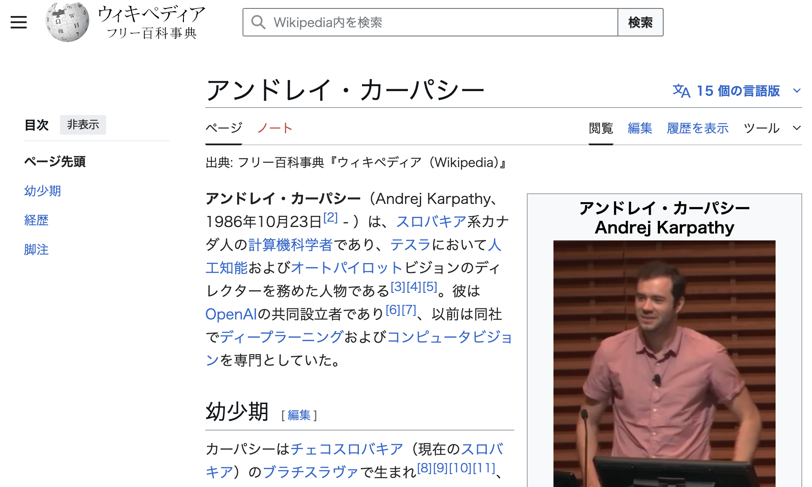
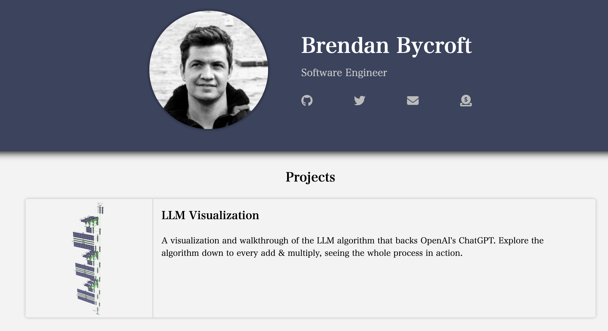

<!-- _class: fig -->

アンドレイ・カーパシー

## 「LLM Visualization」の作者をたどる

出典：フリー百科事典『ウィキペディア（Wikipedia）』

<!-- LLMの内部を可視化する教材の背景。まずは関連人物としてアンドレイ・カーパシーを紹介する。 -->

---

<!-- _class: fig -->

教材『LLM Visualization』

## 作者 Brendan Bycroft と公開教材

Brendan Bycroft, <i>LLM Visualization</i>（個人サイトの Projects より）

<!-- LLM Visualization は、ChatGPTを支えるLLMアルゴリズムを「足し算・掛け算のレベルまで」可視化して歩いて見られる教材。 -->

---

LLM Visualization

🔎 LLM Visualization で「学習」と「推論」を見る

学習 (トレーニング)

AIの重みを作り、 AIが機能するようにする処理

推論

学習で得られた重みを使い、 出力を作成する処理

①大規模言語モデルは、次のtokenを確率的に予想するタスクを行っている。

②大量の掛け算・足し算 (= 線形台数)を中心に計算が進んでいる。 ※ 非線形の処理は、極めて限られている。

③AIの計算量は、とても大きい。

<!-- 学習＝重みを作る処理／推論＝重みを使って出力する処理。LLMの計算は次トークンの確率予測で、掛け算・足し算（線形代数）が中心、非線形処理はごく一部、計算量は莫大。 -->
