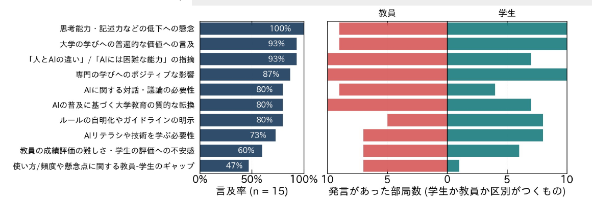

<!-- _class: cover-hero -->

2025年度　学生参画会議

AIと共に生きる時代の 大学での学びについて

学生・教員間の認識のギャップの全体共有

国際未来教育基幹

藤本 茂雄　・　田川 翔

<!-- 藤本先生 (30秒) -->

---

枠組み

# 枠組み

<b>意図：</b>生成AIに対して、大学の文脈で感じる「難しさ」は、 <b>認識のギャップやAIを話題とした対話の少なさ</b>に起因するのでは？

学生

現状 (使い方・頻度)／困り事・教員への要望／キャリアへの不安・希望

⇔

教員

現状への認識／困り事・学生への希望／専攻範囲への影響の展望

学生と教員の議論

<ol>
<li>ギャップはどこに、どれだけあるのか。課題感はなにか。</li>
<li>より良く学ぶために変わりうること、変わらないことはなにか。</li>
<li><b>AIと共に生きる時代において、大学で学ぶ意義とは。</b></li>
</ol>

ギャップはあるのか？　課題感は何か？

<!-- 田川 (30秒) -->

---

ギャップについて

# ギャップについて

<b>学生 - 教員間のギャップとして目立つ点は、比較的少ない</b>

○ 学生は、AIの影響にポジティブだが同時に不安や意見を抱えている ○ 教員は、学生の使用事例・頻度について、驚いている発言も一定数ある

<b>「現状」と「理想」の間の課題感としてのギャップが目立つ</b>

○ 共通の領域で、学生と教員がそれぞれの課題感を持っている印象 ○ 課題感を対話する価値については、納得感があった ○ ギャップは個人間の方が大きい可能性がある

<b>理工系・医薬系では、ギャップが少ない傾向</b>

→ (質的な差はあるものの)教員・学生とも重要性の認識、方向性は一致

懇談会では共通の課題感が、共有された

<!-- 田川 (1分) -->

---

共通に抱える課題感

# 共通に抱える課題感として目立った点

課題

● 出力される情報の正確性や信頼性

● 入力情報による情報漏洩

● AIに頼りすぎることよる思考力や判断力の低下の恐れ

● AIをどこまで使ってよいのか

● 評価に対する不安、学生・教員双方の課題感

● 利用するAIの性能の違いによる差による学習環境の格差

質的な差はあるが、課題感の方向性は類似

<!-- 藤本先生 -->

---

まとめにかえて

# まとめにかえて：目立った論点

<b>AIはツールであり目的ではない</b> → 活用方法を模索している状況

<b>人とのコミュニケーション/協働，体験・経験(研究)・学び</b>は不可欠 → 大学の価値は、これらの点にあるのでは？　学びの本質は変わらない (但し、AIは座学や課題に与える影響大)

<b>生成AIを題材に対話すること</b>の重要性　→ 8割強の部局で言及が行われていた

大学教育の変化も含めた議論が引き続き必要

<!-- 藤本先生 -->

---

論点別分析

# 論点別分析：トピックに言及のあった部局の比率配布資料

<b>集計方法について：</b>懇談会に基づく[部局の意見]から論点について洗い出した。その後、Geminiで該当箇所を抽出し、確認・修正した。論点を学生・教員・不明の各属性に分け、言及があれば部局を「発言あり」として計上した。

左) トピックへ言及があった部局の比率　／　右) 教員・学生の内訳 (両者が発言している場合や、属性不明で除かれた場合あり)

全体的な傾向は、教員・学生で比較的一致

<!-- 田川 (40秒) -->
