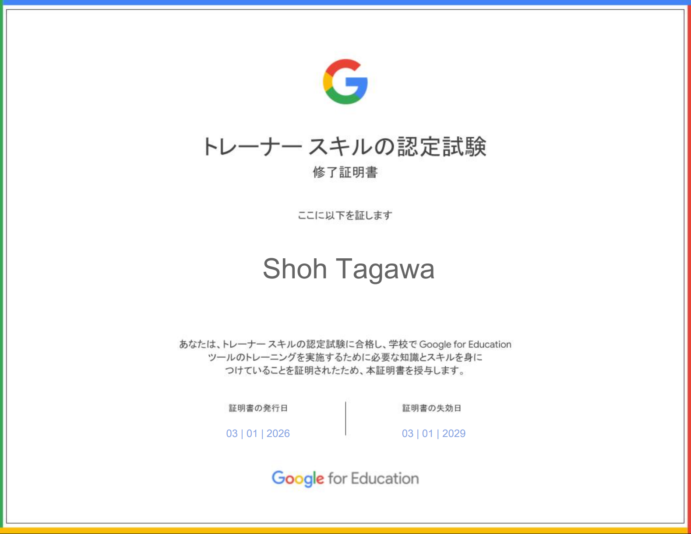
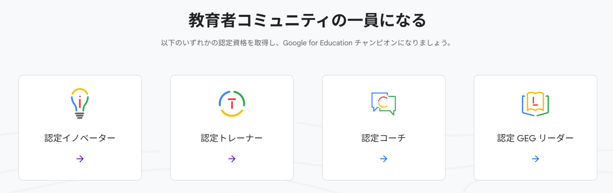
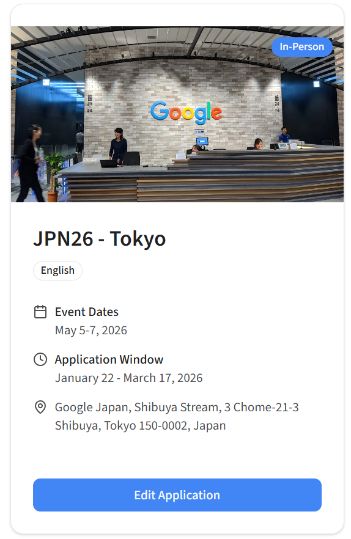
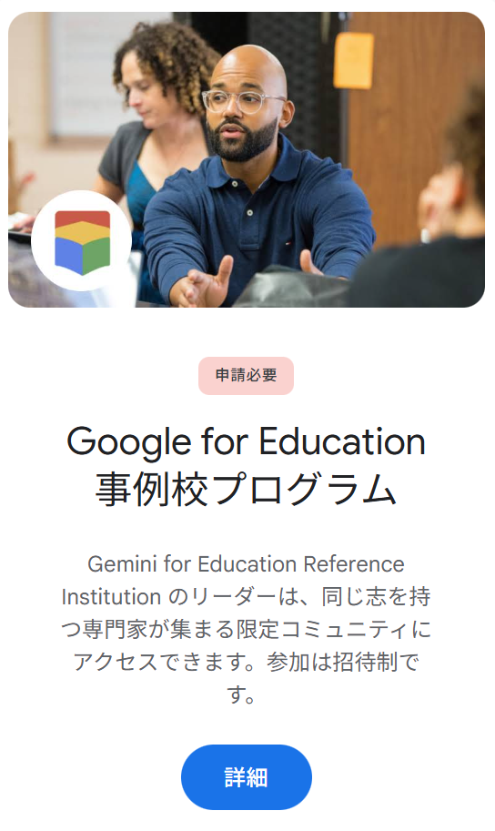
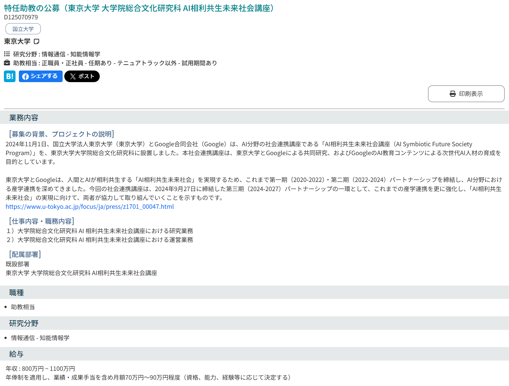
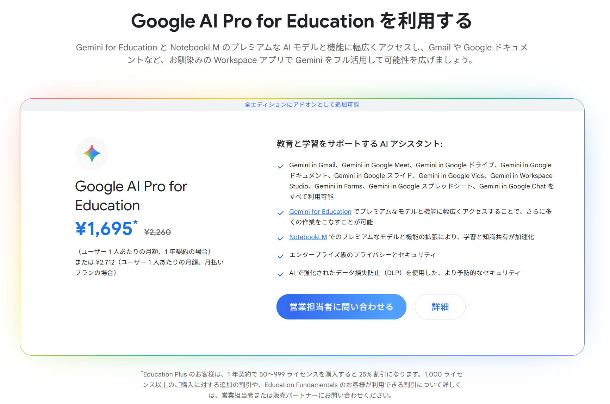
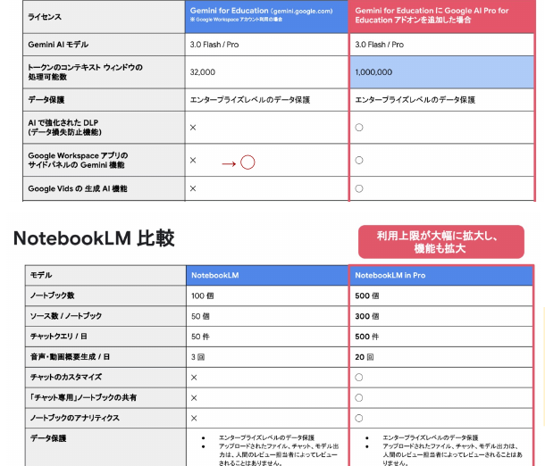

<!-- _class: cover-hero -->

Googleがもつ 学校向け支援一覧

…むっちゃわかりにくいのでまとめました

国際未来教育基幹 田川 翔

<!--
- Googleの学校向け支援は種類が多くわかりにくいので、一覧にまとめた。
-->

---

構成

Google Cloud

資格/無償提供

- Google Cloud 認定資格 
- Google の研究補助金

Google Edu

教職員認定

- Google 認定教職員 
- Google Edu Trainer / Innovator

機関としてのパートナー

Reference

- 機関別に行っているリファレンスプログラム 
- プログラム外での協働・パートナーシップ

<!--
- 全体は3本柱：資格/無償提供、教職員認定、機関としてのパートナー。
-->

---

方向性

# 以下は単なる田川の想像

千葉大学図書館が、Google等のAIを用いた先進事例として、<b>新たな図書館サービス/情報との関わりを学ぶ場のスタンダード</b>になれないか。

LibraryTechとして必要な、<b>クラウド/AIスキルの修得・PoC・実装</b>を<b>学び、実装できるエコシステムと人材プール</b>を作れないか。※学生も、スキル・資格が残れば嬉しいはず

新しい学習支援をAI×appで構想し、大学のUX改革ができないか？

そのうえで使えるGoogleの支援リソースとは？

<!--
- ここからは田川の想像。図書館を先進事例のスタンダードに、人材プールとエコシステムを作れないか。その上で使えるGoogleの支援リソースを見ていく。
-->

---

Google Cloud Standard

# Google Cloud Standard

資格/無償提供- Google Cloud 認定資格

Google Skills

▽

DX/AI活用スキル 開発スキル

効果はあるけど、 値段が高い

※田川は、PMPも鍵だと思ってます

<!--
- Google Cloud Standard の認定資格。Google Skills でDX/AI活用・開発スキルを学べる。効果はあるが値段が高い。田川はPMPも鍵だと考えている。
-->

---

Google Cloud Standard

Google Cloud Standard資格/無償提供- Google Cloud 認定資格

<b>Google Career Launchpad</b> Skillsを用いた学習プラットフォーム AIやサーバーを使う”クレジット”が付随

無料プログラム　＋ 修了者は認定試験半額　＋ クラウド無料券

対教職員： FD/SDに親和性？　対学生：課程外学習?

応募単位：個々の教員

取得できる主な認定（一例）

<ul style="font-size:21px; line-height:1.6;">
<li>Google DeepMind AI Research Foundations</li>
<li>Cloud Cybersecurity Certificate</li>
<li>Cloud Data Analytics Certificate</li>
<li>Cloud Engineering Certificate</li>
<li>Cloud Generative AI Leader</li>
<li>Cloud Digital Leader　etc…</li>
</ul>

Launchpadの説明 https://cloud.google.com/edu/faculty/career-launchpad?hl=ja 　教育用クレジットの取得と利用 https://docs.cloud.google.com/billing/docs/how-to/edu-grants?hl=ja

<!--
- Career Launchpad は Skills を用いた学習プラットフォーム。無料で、修了者は認定試験半額・クラウド無料券付き。応募単位は個々の教員。
-->

---

Google Cloudの学校向け補助

Google Cloud Standard資格/無償提供- Google の研究補助金

<b>研究におけるGCP活用補助 リンク</b> 
学術研究用に最大 5,000 ドルの Google Cloud クレジット 
→ 1年間 GCPの無料活用が可能 (継続は不可) 
<b>「図書館のAI活用から考える〇〇」、「大学のUXから考える〇〇」</b> 
※ クラウド使用費用の計算と、簡単なプロポーザルが必要

応募単位：個々の教員

<b>公的機関におけるGCP活用補助 リンク</b> 
AI活用に最大 1,000 ドルのGoogle Cloud クレジット 
→ しかも、Googleからの人的支援あり 
<b>新しい学習支援をアプリで構成する予算はここから？</b> 
※ 担当チームがWorkspaceと異なる予感

応募単位：組織

<!--
- 研究補助：研究用に最大5,000ドル（教員単位）、公的機関のAI活用に最大1,000ドル＋人的支援（組織単位）。
-->

---

Google Edu

# Google Edu

教職員認定- Google 認定教職員クラウド・AI技術の学び直し

① 有料資格 (8000円ほど)

② 無料資格 　

※今後は無料化 ? (USは今も無料) あんまり役立たないかも…？

③ Grow with Google

10x イノベ 官公庁向け無料講座/地域連携 Courseraの無料講座

<!--
- 認定教職員はクラウド・AIの学び直し。①有料資格（8000円ほど）②無料資格③Grow with Google（10xイノベ・無料講座等）。
-->

---

Google Edu

# Google Edu

教職員認定- Google Edu Trainer / Innovator

Google Cloud チャンピオンプログラム

コミュニティ一覧表GfE ポータル

申請中 ／ 対面支援向け ／ コミュニティ向け

<!--
- Trainer / Innovator＝Google Cloud チャンピオンプログラム。認定イノベーター・トレーナー・コーチ・GEGリーダーから選ぶ。JPN26 Tokyoなど申請中。
-->

---

パートナーシップ

機関としてのパートナー

Reference

- 機関別に行っているリファレンスプログラム 
- プログラム外での協働・パートナーシップ

招待制プログラムは存在している

寄付講座 　(教育版は？)

協定?

Amazon Think Big Spaceの Google版はいつかあるのか？

<!--
- パートナー＝リファレンス。招待制プログラム・寄付講座・協定は存在。Amazon Think Big SpaceのGoogle版はいつか出るか。
-->

---

まとめ

<b>① 教員単位・組織単位でできること</b>はある

<b>②エコシステム作成が重要</b>

学んで、作って、実装するまで、学生と作れる場 
教員の研究を支援できる場 
さらに、人材をプールしておく 
　→ アカリンのコンセプトと親和的なのではないか？

<b>③参画人数・実績が増加する</b>と先方の目を引ける可能性あり

※予算がつけば可能性upだが、それ以外の手はあるかも？

<!--
- まとめ：①教員・組織単位でできることはある ②エコシステム作成が重要（アカリンと親和的）③参画人数・実績が増えれば先方の目を引ける。
-->

---

おまけ：app関係者でAI?

<table style="font-size:23px; border-collapse:collapse; margin-bottom:10px;">
<tr><td style="padding:3px 14px;">個人有償版:</td><td style="padding:3px 14px; text-align:right;">34,800/1人/年</td></tr>
<tr><td style="padding:3px 14px;">標準：</td><td style="padding:3px 14px; text-align:right;">20,340/1人/年</td></tr>
<tr style="font-weight:800; color:var(--accent-dark);"><td style="padding:3px 14px;">50人以上：</td><td style="padding:3px 14px; text-align:right;">15,255/1人/年</td></tr>
</table>

附属図書館/ALC(18名分)、 
高等教育センター(5名分)、 
学務部(教企/国企/留学)(15名分)、 
<b>DX会議体構成員(8名分)、</b> 
<b>他(4名分) </b>とか?

→ 762,750/年 (38 + 12シート)

折半なら、なんとかなるのでは？ ※UXの研究利用には、学生にもアカウント付与可? ※DXの研究名目 (業務観測とセット？)

<!--
- おまけ。AI Proを50人以上だと15,255円/人。図書館・ALC・高等教育センター等で38+12シート＝762,750円/年。折半ならいけるか。
-->

---

Google AI Proの費用感

<b>体感： 1日あたり15-30分の時間削減</b> 　▶ 200日あたり50 -100時間 　　→ 十分にペイする印象

<b>京都大学</b>有料アカウントを別経費で購入→管理者がレシートを元に権利付与

課題：権利付与のアカウント管理が困難 (数1000人のアカウントに目視付与)

まずは、教育系50人規模でスモールな試行？

<table style="font-size:23px; border-collapse:collapse; margin:8px 0;">
<tr><td style="padding:3px 14px;">個人有償版:</td><td style="padding:3px 14px; text-align:right;">34,800/1人/年</td></tr>
<tr><td style="padding:3px 14px;">標準：</td><td style="padding:3px 14px; text-align:right;">20,340/1人/年</td></tr>
<tr style="font-weight:800; color:var(--accent-dark);"><td style="padding:3px 14px;">50人以上：</td><td style="padding:3px 14px; text-align:right;">15,255/1人/年</td></tr>
</table>

年間契約で<b>相当の</b>割引に期間限定

<b>試行の例：50名　→ 762,750/年</b> <b>教職員全員： 3500名 → 5500万円/年</b>

<!--
- 費用感：1日15-30分削減で十分ペイ。京大は別経費購入＋レシートで権利付与（管理が課題）。まずは教育系50人規模でスモールに試行。50名で762,750円/年、全員3500名なら5500万円/年。
-->

---

Google AI Pro VS 無償版

Google AI Pro Edu VS 無償版　→ ◯

差となってくるのは、

①<b>性能の高いAIでの推論可能回数</b>　→使用制限で止まりにくい 
②<b>AIに入力出来るデータサイズ</b>　→複雑な処理が可能に 
③<b>応答速度</b>　→表に書いていないが違うらしい 
④ドライブ/PDFなどの要約

<b>機能としては、現時点で差がない</b> ※但し、仕事で使い始めると上限に容易に達する可能性が高い

出典：教育機関向けGoogle AI Pro for Educationセミナー資料 〜教育と校務のDX を Googleと共に〜 2025/11/27開催

<!--
- 無償版との差は、推論回数・入力データサイズ・応答速度・要約。機能自体は現時点で差がないが、仕事で使うと上限に容易に達する。
-->

---

Googleの今年の計画

<b>千葉大学は、Google Workspace for Education Plusを使用可能</b>　→ 今年1年間で機能強化が行われ、AI Proの機能の一部が利用可能に [出典]

Education Fundamentals（無料版）にも提供:

<b>Gemini in Gmail:</b> メールの下書き作成、長いスレッドの要約、AIによる返信案の提示

<b>Google Workspace Studio：</b>「誰でも数分でAIエージェントを作れる」ノーコード開発

Education Plus & Teaching and Learningへ提供:上記に加え、

<b>Gemini in Docs:</b> 数秒で文章を作成。サイドパネルで推敲や要約を依頼

<b>Gemini in Slides:</b> テキストからスライド用のオリジナル画像を生成

<b>Gemini in Sheets:</b> データの整理や分析をAIがサポート

<b>Gemini in Forms:</b> 質問項目の提案や回答のAI要約

<b>Gemini in Vids:</b> テキスト指示や既存スライドから、洗練された動画を自動生成

AI Proにする必要があるのは、<b>高性能と大量のデータの処理が、何回も</b>必要な場合 → コーディングや分析、採点を行う、全体の1/3程度なのではないか？

<b>利用シナリオ</b> ① レポートのルーブリックの仮採点/フィードバック ② 音声から授業動画の作成 ③ データテーブルの分析実施

千葉大全員で利用可能に！

<b>Google AI Pro Edu</b>　① 大規模コンテキスト　② 大容量上限　③ 高速応答　④ 連携強化

<!--
- 千葉大はWorkspace for Education Plus使用可。今年1年で機能強化。無料版にもGemini in Gmail/Workspace Studio。Plusはさらに Docs/Slides/Sheets/Forms/Vids。AI Proが要るのは高性能・大量データを何度も使う場合（採点・分析等の1/3程度）。
-->
