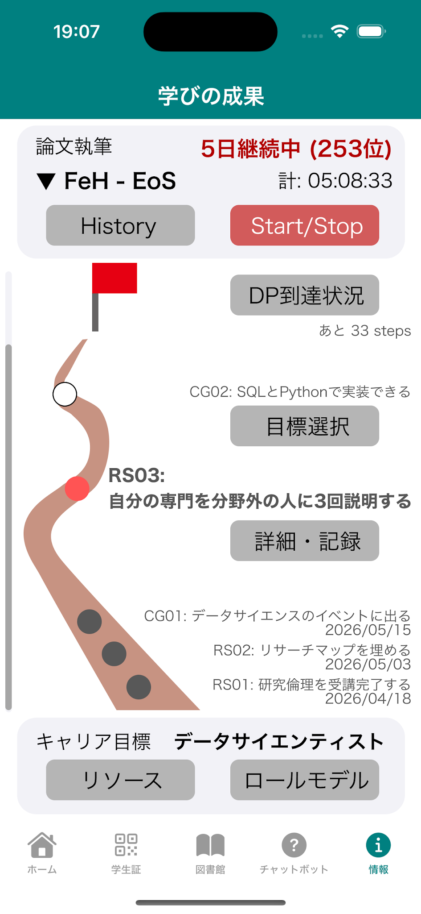
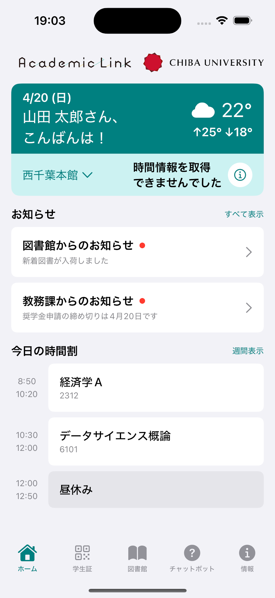

<!-- _class: cover-hero -->

Shoh Tagawa (Ph.D.)　Assistant Prof. ChibaU

AI × Higher education

<b>My mission：</b>Less burden on faculty. More room for students to dream. So I am changing the university's UX.

From the Earth's core to the core of learning — transforming into an AI-native university.

<!--
- 自己紹介。地球の核の研究から「学びの核」へ。教員の負担を減らし、学生が夢を見られる余白をつくる。大学のUXを変えていく。
-->

---

<!-- _class: tight -->

Shoh Tagawa — CV

# Shoh Tagawa (Ph.D.) Assistant Prof. ChibaU ・ AI × Higher education

<b>Born:</b> 1990 in Miyazaki pref. Japan　|　<b>Education:</b> TokyoTech (B.S./M.S.) → Univ. Tokyo (Ph.D.) 
<b>Ph.D. Thesis:</b> Hydrogen in the Earth's core (Geophysics) 
<b>Career:</b> Researcher → ICT support at UTokyo → Aviation　|　<b>Current job:</b> Faculty development/ AI-Edu administration

<b>My Job：</b> Re<b>designing</b> <b>university curricula/pedagogy</b> and visualizing learning outcomes Architecting an AI-centered University UX for the future

Class

<ul>
<li><b>Information Literacy</b></li>
<li><b>Hands-on Generative AI Workshop</b></li>
<li><b>GAI Literacy for Researchers</b></li>
<li><b>Preparing Future Faculty Program</b></li>
</ul>

Faculty Development

<ul>
<li><b>Syllabus with Gems</b></li>
<li><b>Gemini/AI utilization seminar</b></li>
</ul>

Gemini: <b>High sensitivity, low specificity</b> ／ 30+ faculty users, 30% less syllabus prep time by FY26 (Annotated over 5 years)

Research

<ul>
<li>Comparison and Modeling of <b>"AI-Cross" Educational Programs</b> – JSPS Kakenhi ¥4M</li>
<li><b>Univ. New UX:</b> Manabiya AI / University's app</li>
<li>Translation of "<b>Teaching with AI</b>"</li>
</ul>

<!--
- 経歴：1990年宮崎生まれ。東工大→東大博士（地球物理・地球の核の水素）。研究者→東大ICT支援→航空→現在はFD/AI教育行政。
- 仕事：カリキュラム・教授法の再設計、学習成果の可視化、未来のAI中心大学UXの設計。Class／FD／Researchの3領域。
-->

---

<!-- _class: tight -->

My Job — detail

# My Job　Targets

Information Literacy Equip 200 first-year students with info-literacy using Google Colab/Gems; target 80% gemini/colab fluency by AY26

Hands-on GAI Workshop Training 100+ students in group work for AI-agent making workshop. 10+ AI apps made every year

GAI Literacy for Researchers Coach 20 grad students to be ready for AI/Cloud tech in research # Starting this year

Gemini/AI utilization seminar average 50+ staff/faculty/students ／ 8 ~ 12 events per year / Hands-on Included ／ at Chiba University <b>Library</b>

Plan → Iterate → Evaluate 1) Prompting &amp; How AI Actually Works　2) Study Smarter with Gemini　3) NotebookLM　4) Google Workspace Studio　5) Inside GenAI × Google Colab

<b>Research Q：</b> How do we teach AI (agent) literacy starting from learners' domains/skills? How should we change the curriculum?

2026 summer / from Gihyo

<!--
- 各授業の到達目標を数値で。1年生200名へColab/Gemsで情報リテラシー（AY26で80%）、100+名のワークショップで毎年10+アプリ、院生20名へAI/Cloud。
- FDセミナーは図書館で年8〜12回・毎回50+名。研究の問い：学習者のドメインからどうAIエージェント・リテラシーを教えるか。
-->

---

<!-- _class: divider -->

Vision

# We aim to create an AI-native university experience.

Chiba Univ. / Tagawa

Supported &amp; Self-Directed Learning　×　Research Advancement　×　AI-driven work &amp; support DX

<!--
- ビジョン：AIネイティブな大学体験。支援付き・自律学習 × 研究の前進 × AI駆動の業務・支援DX。
-->

---

AI-native University UX

# AI-native university experience

Chiba U. Connect　—　Student ID &amp; Notifications + Portfolio

Library access card ／ Push info delivery More frequent use → future: student ID

Set major &amp; interests → notif. from grad students' POV → comm cost ↓

Path to research journey shown Earned milestones marked with stamps ／ Promote autonomous learning

<b>A compass</b> — links resources &amp; learning, supports student growth, and compiles everything into a portfolio.

<b>Serve</b> as UX touchpoints for students ／ <b>Provide</b> all-in-one access to university info ／ <b>Require</b> student opt-in for data usage
AI apps (Frontend)

<b>Store</b> individual student data securely ／ <b>Consolidate</b> resources (classes, libraries) ／ <b>Connect</b> seamlessly with public data
Context for AI (DB/Resources)

<b>Enable</b> proper data connections ／ <b>Empower</b> anyone to create AI agents ／ <b>Evaluate and improve</b> outcomes (CI/CD)
AI agent (Dev ecosystem)

<b>Loads only the features each person needs.</b>　Looking for partners to build and test this vision with us.

<!--
- AIネイティブ大学UX：Chiba U. Connect（学生証・通知・ポートフォリオの羅針盤）。アプリ＝フロント／DB＝AIの文脈／エージェント＝開発基盤の3層。
- アプリは各人に必要な機能だけを読み込む。データ利用は学生のオプトイン前提。一緒に作る共創パートナーを募集中。
-->

---

Architecture

# University Architecture

Resources / Database

Individual Resources
Interests
Learning/Study history
Textbooks &amp; class materials
Paper data
Campus Resources (incl. purchased)
Campus resources /Service desk
Open Resources
NDL
Open data

AI · Context

Prompt/ Gems/ RAG　·　MCP/API
Service-desk support
learning support
Research support
Grant support
Class delivery
Utility tools

AI agent + tool ／ Use → Update ／ Output eval · CI/CD　(<b>Dev ecosystem</b>)

UI

Smartphone App
web system
Campus system

Chiba U. UX

10x: 10years out, shining
Students shine ／ Staff shine ／ Faculty shine
Workflow efficiency

CampusAPI: connect everything × Auth

Research support ↑ ／ More research time ／ Better classes

Research capacity ↑ ／ Better univ experience ／ Learning advancement

<!--
- 大学アーキテクチャ：Resources/Database × AI·Context × UI の3層。学内資源・公開資源をAIの文脈に束ね、UIへ届ける。
- CampusAPIが全てを認証つきで接続。研究時間と授業の質、大学体験を底上げし、10年後に皆が輝く。
-->

---

Co-creation

# Resource management &amp; Dev ecosystem

Resource management

<ul>
<li><b>Local Region &amp; industry</b> ／ Sales</li>
<li>University thrives</li>
<li>Chiba U. Connect ／ Library tech ／ Environment</li>
</ul>

Dev ecosystem

<ul>
<li>Use → Update → Output eval · CI/CD</li>
<li>Empower anyone to create AI agents</li>
<li>Workflow efficiency</li>
</ul>

Looking for partners to build and test this vision with us. Partner with us to co-create a leading use case for an <b>AI-native national university</b> in Japan.

<!--
- 資源マネジメントと開発エコシステム。地域・産業との連携、大学の発展、Connect/図書館テック/環境。
- このビジョンを一緒に作り検証するパートナーを募集。日本のAIネイティブ国立大の先行事例を共創しましょう。
-->
