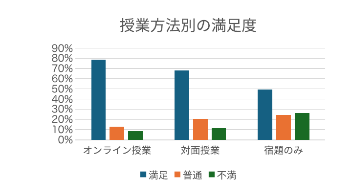
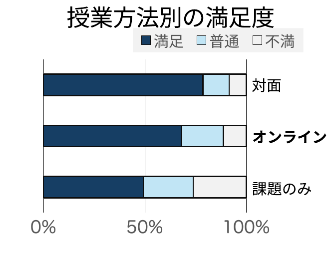

<!-- _class: cover-hero -->

伝わるデザイン

レイアウトのコツ

✕ルールを知らないと

整理して美しく

読みやすいレイアウトは存在する！
・行間・字間・書体・改行に注意を払う。 
・文字のサイズや太さに強弱をはっきりつける。
答えはひとつではない！
・状況や媒体により最適なレイアウトは異なる。 
・センスやスタンスも人により様々である。
ルールが分かれば誰でも改善！

◯ルールを知っていると

整理して美しく

読みやすいレイアウトは存在する！
<ul><li>行間・字間・書体・改行に注意を払う。</li>
<li>文字のサイズや太さに強弱をはっきりつける。</li></ul>
答えはひとつではない！
<ul><li>状況や媒体により最適なレイアウトは異なる。</li>
<li>センスやスタンスも人により様々である。</li></ul>
ルールが分かれば誰でも改善！

<!--
- 伝わるデザインの導入。同じ内容でも「ルールを知らない／知っている」で読みやすさは大きく変わる。これから良し悪しを並べて見ていく。
-->

---

レイアウトのコツ

# ✕　悪い例 （詰め込み・中央寄せ・多色）

このスライドでは、資料のデザインについて、検討します。 重要なのは読み手の認知的負担を下げることです。

端的に言えば、使用色を制限し、彩度を下げ、強調は太字/下線を使用し、余白を広くとり、まとまりをつくり、文字列を並べる事です。

読みやすさ

センスではなく、知識

<table class="sat">
<thead><tr><th></th><th>満足</th><th>普通</th><th>不満</th></tr></thead>
<tbody>
<tr><th>オンライン授業</th><td>419</td><td>69</td><td>45</td></tr>
<tr><th>対面授業</th><td>1158</td><td>353</td><td>192</td></tr>
<tr><th>宿題のみ</th><td>96</td><td>48</td><td>51</td></tr>
</tbody>
</table>

<!--
- 悪い例。中央寄せ・等幅で強弱が無く、色も多く、表もグラフも盛り込みすぎ。読み手の認知的負担が高い。
-->

---

レイアウトのコツ

# ◯　良い例 （強弱・余白・まとまり）

✔ 資料のデザインについて、検討しています。 　 重要なのは読み手の認知的負担を下げることです。

✔ 下記のコツがあります。

使用色を<b>制限</b>

<b>余白を広く</b>とる

彩度を<b>下る</b>

<b>まとまり</b>をつくる

文字を<b>並べる</b>

強調は<b>太字</b>/<u>下線</u>を使用

読みやすさ、とは

センスではなく、知識

<!--
- 良い例。同じ内容でも、強調の太字・下線、余白、まとまり（2列の表組み）、横棒の積み上げグラフで一気に読みやすくなる。読みやすさはセンスではなく知識。
-->
