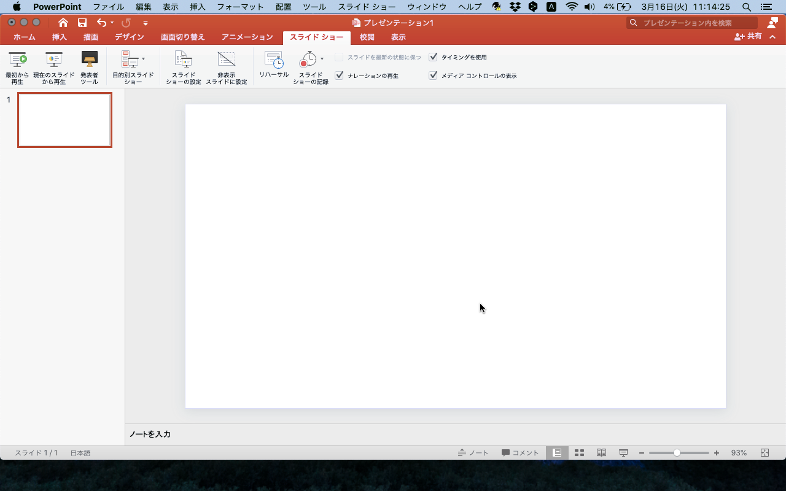
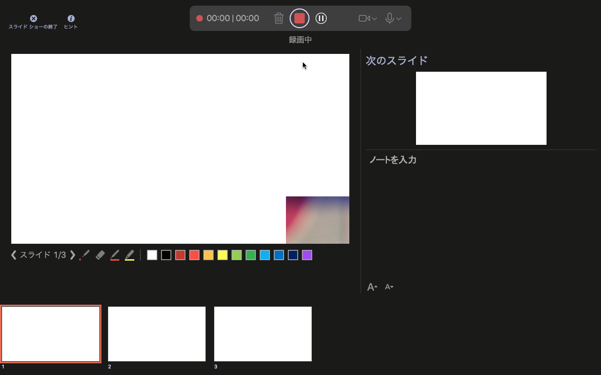
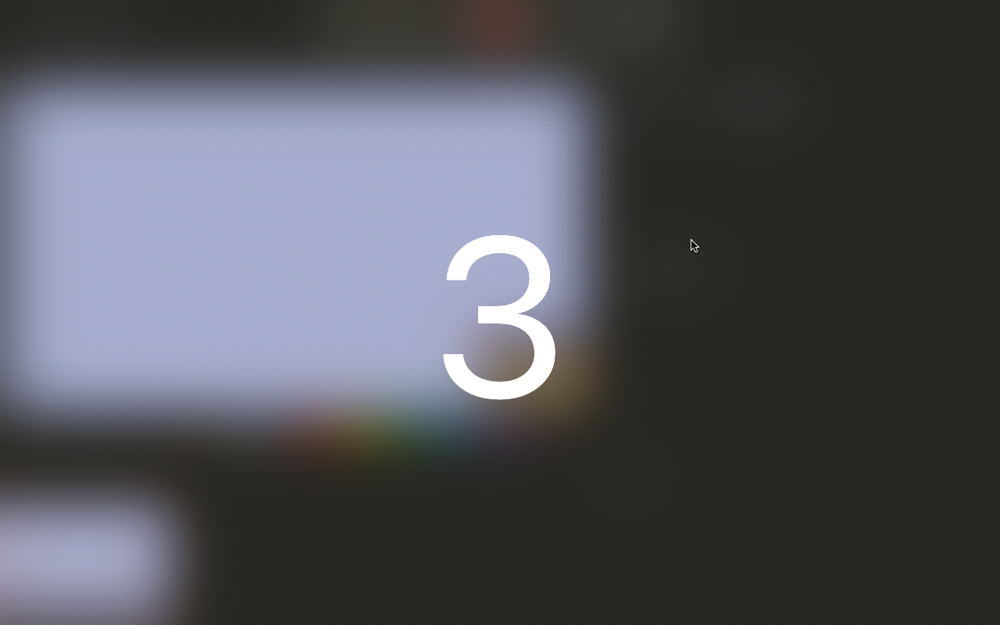
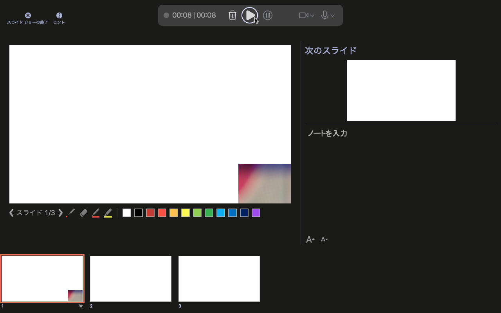
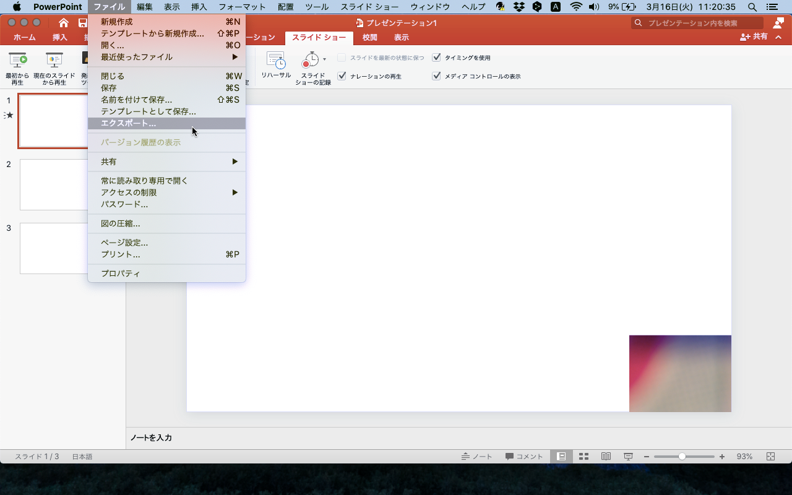
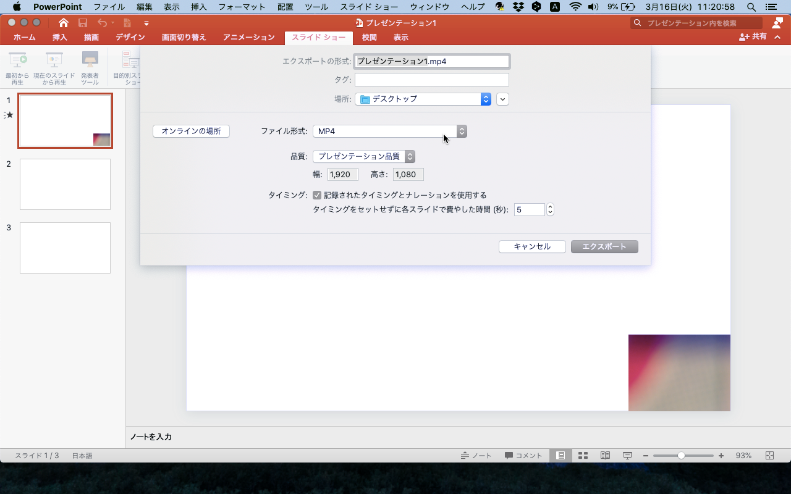

<!-- _class: cover-hero -->

PowerPointを使った

動画つきスライドの作成

（Mac版の2019）

Creating slides with videos using PowerPoint (Mac version 2019)

<!--
Creating slides with videos using PowerPoint(Windows version 2019 or Office 365)
-->

---

動画付きスライドを作成するには

# スライドショーの記録を選択

スライドショーの記録を選択してスライド一枚ずつ動画を作成
Select Record Slide Show Record and create videos one by one

動画付きのパワーポイントスライドを作成するには
How to create PowerPoint with video

<!--
Select a slideshow recording and create videos one by one / How to create PowerPoint with video
-->

---

収録の準備ができたら

# 上の赤いボタンをクリック

この画面になり、収録の準備ができたら、上の赤いボタンをクリック
When this screen appears, click the red button if you are ready to record

▲

<!--
When this screen appears, click the red button if you are ready to record
-->

---

記録の開始

# カウントダウン後に記録開始

カウントダウン後、動画の記録が開始
Video recording starts after the countdown

<!--
Video recording starts after the countdown
-->

---

収録中の操作

# 収録しながら授業を進める

①スライドに基づいて、授業内容を適宜話すSpeak the lecture content accordingly based on the slides

②次のスライドも連続して記録する場合には赤枠またはスライドをクリック（終了後に動画はスライド単位で分かれる）If you want to record the next slide continuously, click the red frame or the slide (after this, the video is divided by slides）

③ペンや蛍光ペンを操作しながら収録することも可能It is also possible to record while operating with the pen or highlighter pen

④収録が終わったら赤いボタンをクリックClick the red button when recording is complete

<!--
①スライドに基づいて話す ②赤枠/スライドで次へ ③ペン操作も可 ④終わったら赤ボタン
-->

---

収録後の確認・終了

# 動画を確認して終了

再生をクリックし、適宜記録した動画を確認 左隣のゴミ箱アイコンから動画を削除可能
Click Play and check the recorded video. You can delete the video from the trash can icon on the left.

左上の「×」をクリックすれば、スライドショーを終了し、各スライドの編集画面に戻る（作成した動画は消えません）
Click the "x" in the upper left to end the slide show and Return to the edit screen of each slide (created video will not disappear）

<!--
再生で確認・ゴミ箱で削除／「×」で終了して編集画面へ戻る（動画は消えない）
-->

---

動画の調整とエクスポート

# 位置を調整しエクスポート

スライドが完成したら、動画ファイルとして保存するため、「ファイル」からエクスポートをクリック
When the slide is complete, click Export from "File" to save it as a video file.

記録された動画をクリックし、位置や大きさを自由に調節可能。（スライド外に置くことはできません）
Click on the recorded video. You can freely adjust position and size. (Cannot place outside the slide)

<!--
完成したら「ファイル」→エクスポート／動画は位置・大きさを自由に調整可（スライド外不可）
-->

---

MP4で書き出す

# ファイル形式を「MP4」に

ファイル形式を「MP4」に変更
Change file format to "MP4".

ファイル名、保存する場所、ファイル形式、品質を設定し「エクスポート」をクリック
Set the file name, save location, file format, quality, and click "Export".

<!--
ファイル形式をMP4に／名前・場所・形式・品質を設定して「エクスポート」
-->
